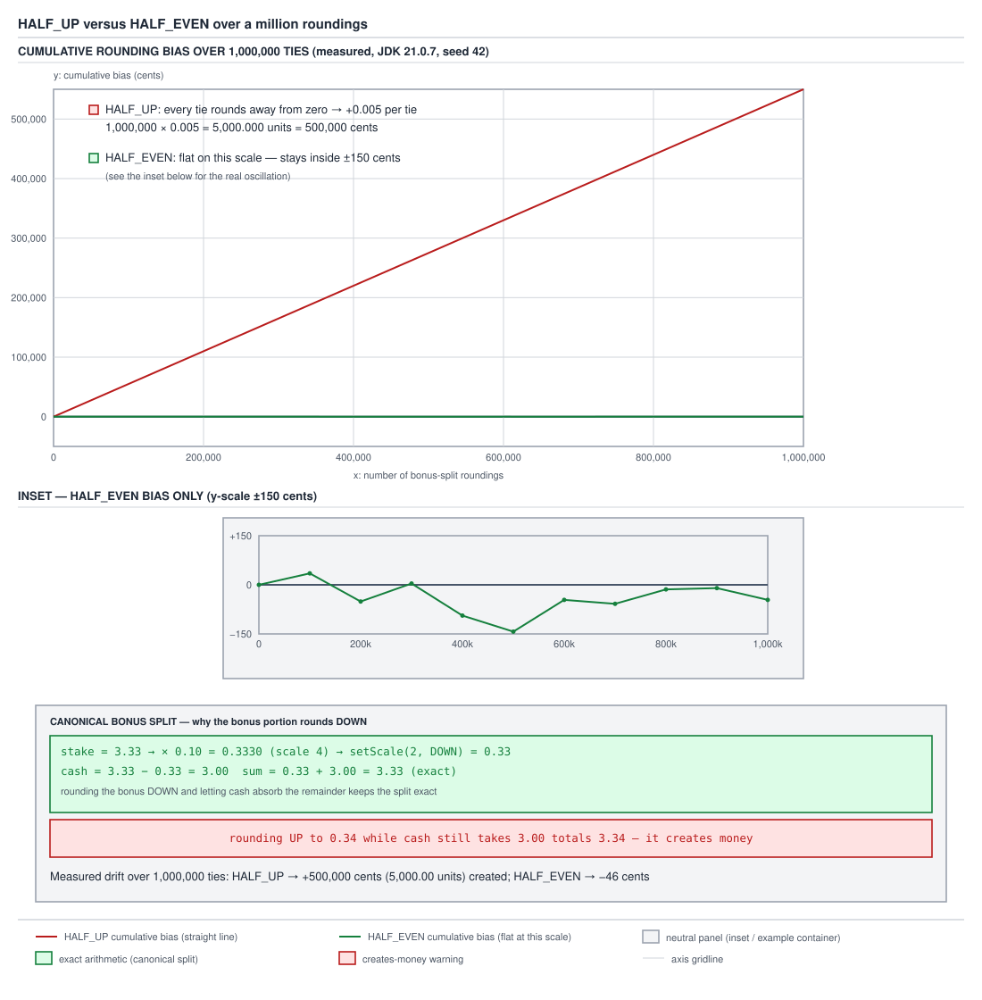

# 03 Java Core — Rounding modes and the `BigDecimal` API surface — INTERMEDIATE (§2.4, 2.4.13–2.4.15)

**Target version: Java 21 LTS.** | **Part 2 of 5** | [Index](../00-index.md)
Previous: [BigDecimal equality: equals versus compareTo](02b-equality-scale-and-rounding.md) · Next: [MathContext, the constants, and a Money type](02c-mathcontext-constants-and-minor-units.md)

`02a-bigdecimal-structure-and-construction.md` owns the unscaled-integer-plus-
scale identity and the constructors; `02b-equality-scale-and-rounding.md` owns
the `equals`/`compareTo` divergence that identity produces. This file owns
what you do once you need a number `BigDecimal` cannot represent exactly:
division, the eight `RoundingMode`s that decide what happens at that boundary,
and the API surface a reader actually calls day to day — `setScale`,
`stripTrailingZeros`, `toPlainString` versus `toString`, `precision`, `scale`,
`signum`, `movePointLeft`.

Measurement environment for every number quoted below: Oracle JDK 21.0.7
(build 21.0.7+8-LTS-245), macOS aarch64 (Apple Silicon), library source quoted
from that build's `lib/src.zip`, compiled and run in a scratch directory.

---

## 1. `divide` without a rounding mode throws (2.4.13)

The single-argument `divide(BigDecimal)` overload is specified to return the
*exact* mathematical quotient. Exact division of two decimal numbers only
terminates in decimal notation when the divisor's prime factorization (after
reducing the fraction) contains no primes other than 2 and 5 — the same
condition, from `02` in this series, that determines whether a fraction has a
finite decimal expansion at all. Divide by 2 or 4, and the exact quotient
terminates. Divide by 3, and it does not — 1/3 is 0.3 recurring, forever — so
there is no `BigDecimal` value that IS the exact quotient, and the method has
nothing correct to return.

### Why it exists

Before `RoundingMode`/`MathContext` were mandatory considerations, developers
migrating from `double` or `float` division expected `divide` to just work the
way floating-point division always "works" (silently, if imprecisely).
`BigDecimal`'s design refuses that silent imprecision: rather than picking an
arbitrary cutoff and rounding without being asked, the no-rounding-mode
overload throws, forcing the caller to state explicitly how much precision
they want and how to round the remainder. The alternative — silently
truncating to some default scale — would reintroduce exactly the kind of
unstated, easy-to-miss precision loss that `BigDecimal` exists to prevent.

### How it works

Measured:

```java
BigDecimal.ONE.divide(new BigDecimal("3"));
// throws java.lang.ArithmeticException:
//   Non-terminating decimal expansion; no exact representable decimal result.

BigDecimal.ONE.divide(new BigDecimal("2"));               // 0.5
new BigDecimal("10").divide(new BigDecimal("4"));         // 2.5
BigDecimal.ONE.divide(new BigDecimal("3"), 4, RoundingMode.HALF_UP); // 0.3333
```

**That is what makes it a trap, precisely because the first three lines all
succeed.** Divide by 2, divide by 4 — both terminate, both return happily,
both pass code review and every test the author thought to write, because the
test divisors were chosen (as most round test numbers are) to be products of
2s and 5s. The first time a divisor in production data is something else — 3,
6, 7, 11, any factor outside {2, 5} — the exact same code path that worked
perfectly in every prior call throws `ArithmeticException` at 3am. The rule
that avoids this entirely: **never call the no-rounding-mode `divide`
overload.** Always pass either an explicit `(int scale, RoundingMode
roundingMode)` pair, or a `MathContext` that bounds precision — both force the
method to define what "the answer" means when the true answer does not
terminate.

### A concrete example

QuizStakes splits an approved `PaymentRun` total three ways across three
withdrawal instructions that must sum back exactly to the run total — the
same invariant class as the `StakeSplit` bonus/cash split, just with three
parts instead of two, and the remainder has to go somewhere because it cannot
be spread as a fraction of a cent.

```java
public record PaymentRunSplit(Money first, Money second, Money third) {

    public PaymentRunSplit {
        BigDecimal sum = first.amount().add(second.amount()).add(third.amount());
        if (sum.compareTo(EXPECTED_RUN_TOTAL) != 0) {
            throw new LedgerImbalanceException(
                    "split parts do not sum to the run total: " + sum);
        }
    }

    private static final BigDecimal EXPECTED_RUN_TOTAL = new BigDecimal("100.00");

    public static PaymentRunSplit ofEqualThirds(BigDecimal runTotal, Currency currency) {
        BigDecimal share = runTotal.divide(
                new BigDecimal("3"), 2, RoundingMode.DOWN);
        BigDecimal remainder = runTotal.subtract(share.multiply(new BigDecimal("3")));

        BigDecimal firstShare = share.add(remainder);
        return new PaymentRunSplit(
                new Money(firstShare, currency),
                new Money(share, currency),
                new Money(share, currency));
    }
}
```

`runTotal.divide(new BigDecimal("3"), 2, RoundingMode.DOWN)` on 100.00 gives
33.33 (100 / 3 = 33.3 recurring, truncated at scale 2). Three shares of 33.33
sum to 99.99, one cent short of 100.00. `remainder = 100.00 - (33.33 * 3) =
100.00 - 99.99 = 0.01`. Rather than losing that cent or inventing a fourth
fractional withdrawal, the first share absorbs it: `firstShare = 33.33 + 0.01
= 33.34`. The three withdrawal amounts are 33.34, 33.33, 33.33, which sum to
exactly 100.00 — the compact constructor's `compareTo` check confirms it — and
no rounding mode ever had to guess what to do with a non-terminating quotient,
because `divide` was always called with an explicit scale and mode.

**Interview:** "When does `BigDecimal.divide` throw?" — the single-argument
overload throws `ArithmeticException` whenever the exact quotient has a
non-terminating decimal expansion (any divisor whose reduced form has a prime
factor other than 2 or 5); the fix is to always supply a scale and
`RoundingMode`, or a `MathContext`.

No gotcha beyond the one above: once a scale and rounding mode are supplied,
`divide` never throws for non-termination again — the only remaining
`ArithmeticException` is `RoundingMode.UNNECESSARY` finding it still needs to
round.

---

## 2. The eight `RoundingMode`s, and `HALF_UP` versus `HALF_EVEN` (2.4.14)

Rounding is a decision about what to do at the boundary between two
representable values when the true value falls in between or exactly on a
tie. `BigDecimal` externalizes that decision completely — there is no default,
only eight named policies, one of which (`UNNECESSARY`) is really "assert
there is no decision to make."

### How it works

Measured, `setScale(2, mode)` applied to 2.335, -2.335 and 2.345:

| mode | 2.335 | -2.335 | 2.345 |
|---|---|---|---|
| `UP` | 2.34 | -2.34 | 2.35 |
| `DOWN` | 2.33 | -2.33 | 2.34 |
| `CEILING` | 2.34 | -2.33 | 2.35 |
| `FLOOR` | 2.33 | -2.34 | 2.34 |
| `HALF_UP` | 2.34 | -2.34 | 2.35 |
| `HALF_DOWN` | 2.33 | -2.33 | 2.34 |
| `HALF_EVEN` | 2.34 | -2.34 | 2.34 |
| `UNNECESSARY` | throws | throws | throws |

Read the shape of the table before the individual rows: `UP`/`DOWN` are
magnitude-only (away from / toward zero, ignoring sign); `CEILING`/`FLOOR` are
direction-only (toward `+infinity` / toward `-infinity`, which is why they
flip relative to `UP`/`DOWN` on the negative column); `HALF_UP`/`HALF_DOWN`/
`HALF_EVEN` only differ from each other exactly on ties (a discarded fraction
of precisely 0.5 at the target scale) — everywhere else all three agree with
plain rounding to nearest.

Two of these three inputs are exact ties at scale 2 (2.335 and -2.335 are
exactly 5 in the third decimal place above 33/-33 hundredths; so is 2.345).
`UNNECESSARY` throws on all three because none of 2.335, -2.335, 2.345 is
already representable at scale 2 without discarding a digit — `UNNECESSARY`'s
entire contract is "round only if no rounding is actually needed."

`[PROVE]` the `HALF_EVEN` rows specifically, because this is the entire
banker's-rounding rule and it fits in two lines: `2.335` rounded to scale 2
must choose between `2.33` and `2.34` — the discarded digit is exactly 5, a
tie — so `HALF_EVEN` looks at the retained last digit of each candidate: `2.33`
ends in 3 (odd), `2.34` ends in 4 (even). The rule picks the even one:
**2.34**. Now `2.345` rounded to scale 2 must choose between `2.34` and
`2.35` — also an exact tie — and this time `2.34` already ends in an even
digit (4), so `HALF_EVEN` leaves it where it is: **2.34**. Same rule, two
different ties, two different outcomes (one moved up, one stayed down)
entirely because of which neighbour happened to be even.



**D-074** — the main panel plots cumulative bias in cents against number of
roundings from 0 to 1,000,000: the `HALF_UP` line is a straight diagonal
reaching +500,000 cents, while the `HALF_EVEN` line is visually flat against
that same axis. An inset panel re-plots only the `HALF_EVEN` series on its own
&plusmn;150-cent axis, showing it oscillating rather than trending. A third,
smaller panel shows the single 3.33 stake split — 0.33 bonus, 3.00 cash — as
the per-operation case this whole derivation is protecting.

### `[PROVE]` the bias, derived before it is measured

Take a large sample of values whose discarded fraction at the target scale is
*exactly* 0.5 — a genuine tie, not "close to a tie." `HALF_UP` resolves every
tie by moving away from zero, unconditionally. Each such resolution adds a
constant error of exactly half a unit in the last retained place — at scale 2,
+0.005 currency units, i.e. +0.5 cents — regardless of which side of even or
odd the retained digit happens to land on. Over `n` independent ties drawn
from any distribution that does not itself favor one direction, the total
error is `n x 0.005`, a linear function of `n` with no cancellation: the bias
term never has a chance to be negative, so it only ever accumulates in one
direction.

`HALF_EVEN` resolves each tie by looking at the retained digit's parity: if
the tie leaves the digit before it even, keep it; if odd, bump to the
neighbouring even digit. Whether "the even neighbour" is the higher or lower
of the two candidates is determined by the arbitrary last digit of the
underlying value, which — for cents drawn from a source with no structural
bias toward odd or even digits, such as monetary amounts unrelated to the
rounding process — is up roughly as often as it is down. Each tie still
contributes an error of &plusmn;0.005, but the sign of that error is
essentially a coin flip, so the sum over `n` ties behaves like a
mean-zero random walk: it grows like `sqrt(n)`, not like `n`, and has no reason
to drift consistently in one direction.

Measurement that confirms the derivation, `new Random(42)`, cents uniform in
0..999, each value built as `BigDecimal.valueOf(cents*10 + 5, 3)` so the third
decimal digit is always exactly 5 (a guaranteed tie), bias accumulated as
`rounded - exact`:

| roundings | `HALF_UP` bias (cents) | `HALF_EVEN` bias (cents) |
|---|---|---|
| 0 | 0 | 0 |
| 100,000 | +50,000 | +35 |
| 200,000 | +100,000 | -51 |
| 300,000 | +150,000 | +4 |
| 400,000 | +200,000 | -94 |
| 500,000 | +250,000 | -143 |
| 600,000 | +300,000 | -46 |
| 700,000 | +350,000 | -58 |
| 800,000 | +400,000 | -14 |
| 900,000 | +450,000 | -10 |
| 1,000,000 | +500,000 | -46 |

`HALF_UP` is exactly the straight line the derivation predicted: `1,000,000 x
0.005 = 5000.000` currency units `= 500,000` cents of money created out of
nowhere, purely from rounding — no bad logic, no bug, just every tie rounding
the same way. `HALF_EVEN` never leaves the &plusmn;150-cent band across the
full million ties, consistent with a mean-zero random walk rather than a
biased accumulator.

### The canonical QuizStakes split, worked completely

`new BigDecimal("3.33").multiply(new BigDecimal("0.10"))`: scales add under
multiplication (from `02a`), `2 + 2 = 4`, giving `0.3330` at scale 4.
`.setScale(2, RoundingMode.DOWN)` truncates the two extra digits (`30`)
without rounding: `0.33`. `cash = stake.subtract(bonus) = 3.33 - 0.33 = 3.00`.
Check the `StakeSplit` invariant: `bonus.add(cash).compareTo(stake) == 0` — is
`0.33 + 3.00 = 3.33`, compared against the original `3.33`, equal — measured
`true`.

Now the counterfactual, worked the same way: if the bonus portion instead
rounded `HALF_UP` from `0.3330`, the result is still `0.33` (0.3330's third
decimal digit is 3, not a tie, `HALF_UP` truncates same as `DOWN` here) — so
this particular stake does not expose the difference between `DOWN` and
`HALF_UP`. The problem shows up structurally, not on this one example:
whichever mode rounds the bonus **up** in some other stake — say a stake
where the bonus computation yields `0.335` at scale 3, rounding `HALF_UP` to
`0.34` — while cash is still computed as `stake.subtract(0.34)`, the two
portions by construction still sum to the stake, *provided cash is always
computed as the subtraction remainder rather than independently rounded*. The
actual danger is a system that rounds **both** portions independently: bonus
`HALF_UP` to `0.34` and cash independently rounded (say from a percentage
calculation) to `3.00`, giving a total of `3.34` against a stake of `3.33` —
one cent created from nothing.

**Insight:** the domain rule here is not "use `HALF_EVEN` because it is
unbiased." The domain rule is stronger: round the bonus portion `DOWN`
unconditionally, and derive the cash portion as `stake.subtract(bonus)` rather
than rounding it independently — that arithmetic identity guarantees the two
parts sum exactly to the stake regardless of which rounding mode picked the
bonus figure. `HALF_EVEN`'s unbiased-over-many-ties property matters when you
must round a *single* figure in isolation and there is no second bucket to
absorb whatever the rounding discarded — a reported balance, a displayed tax
figure, a one-shot currency conversion. QuizStakes has a second bucket (cash),
so the `StakeSplit` invariant beats the bias argument entirely: exactness on
every single instance is a stronger guarantee than unbiasedness in aggregate.

Contrast with a third, unrelated rounding rule already seen in this batch:
`Math.round` on `double` (from `02`, measured in this batch's floating-point
material) is `floor(x + 0.5)`, which is neither `HALF_UP` nor `HALF_EVEN`.
Measured: `Math.round(2.5) = 3` but `Math.round(-2.5) = -2`, not `-3` — an
asymmetric rule that always breaks ties toward positive infinity, unrelated to
magnitude (`HALF_UP`, symmetric away from zero) or parity (`HALF_EVEN`). Three
different tie-breaking policies, three different behaviours on the same tie —
the reason "just round it" is never a complete instruction.

**Interview:** "What is banker's rounding and why use it?" — `HALF_EVEN`
resolves an exact tie by moving to whichever neighbour has an even last
digit, so ties alternate direction roughly 50/50 over a large sample instead
of always rounding away from zero like `HALF_UP`, which prevents `HALF_UP`'s
linear cumulative bias (measured: +500,000 cents over 1,000,000 ties) from
appearing when the same rounding is applied repeatedly to independent
figures — but it does not, by itself, guarantee that two derived parts of a
split still sum to the whole; that requires deriving one part by subtraction.

---

## 3. The API surface: `setScale`, `stripTrailingZeros` and friends (2.4.15)

### `stripTrailingZeros` and the scientific-notation surprise

`[RESEARCH]` — measured:

```java
new BigDecimal("100").stripTrailingZeros();               // 1E+2
new BigDecimal("100").stripTrailingZeros().toString();     // "1E+2"
new BigDecimal("100").stripTrailingZeros().toPlainString(); // "100"
new BigDecimal("100").stripTrailingZeros().scale();         // -2  (NEGATIVE)
new BigDecimal("100.00").stripTrailingZeros();             // 1E+2
new BigDecimal("0.00").stripTrailingZeros();               // 0
```

The mechanism follows directly from `02a`'s identity. `new
BigDecimal("100")` is the unscaled integer 100 at scale 0.
`stripTrailingZeros()` removes zeros from the *unscaled integer*, which forces
a compensating change to the scale so the represented number stays the same:
strip one trailing zero from 100 to get 10, and the scale must decrease by 1
(from 0 to -1) to keep the value at 100; strip a second zero to get the
unscaled integer down to 1, and the scale must decrease again (from -1 to -2)
to keep the value at 100. The result is the unscaled integer `1` at scale
`-2` — and `1 x 10^-(-2) = 1 x 10^2 = 100`, the same value, just re-expressed.
A negative scale is a documented, legal `BigDecimal` state (`02a`'s field
comment: "this may have any value"); it means "the unscaled integer is
implicitly followed by `-scale` more zeros," i.e. it is how `BigDecimal`
represents a value using fewer significant digits than its magnitude would
otherwise require.

`toString()` is specified (Javadoc, `BigDecimal.toString()`) to use scientific
notation whenever the adjusted exponent is negative or the scale itself is
negative — which a scale of -2 satisfies — so it prints `1E+2`. `toPlainString()`
is specified to never use scientific notation regardless of scale, expanding
the zeros back out explicitly, so it prints `100`.

**Pitfall:** calling `stripTrailingZeros()` on a bonus cap of exactly 100 and
serializing the result with `toString()` (or relying on a JSON library that
calls `toString()` internally, which is the default for many `BigDecimal`
Jackson serializers unless configured otherwise) into a response body,
producing the literal text `"1E+2"` in the payload. Symptom: a downstream
consumer's decimal parser either throws on the unexpected exponent notation or
silently misreads it, and the failure surfaces far from the `stripTrailingZeros`
call that caused it. Fix: call `toPlainString()` at every wire boundary —
HTTP responses, log lines a human will read as currency, anywhere the string
form of a `BigDecimal` leaves the process — and never rely on `toString()` for
that purpose. **Why people believe it:** `stripTrailingZeros()` reads, from
its name alone, like a purely cosmetic cleanup ("100.00" to "100"), so nothing
about the method name warns that it can push the scale negative and change
which string-rendering method is safe to call afterward.

### The rest of the surface, measured

| Call | Result (measured) |
|---|---|
| `new BigDecimal("2.50").setScale(1, RoundingMode.DOWN)` | `2.5` (fewer decimal places, rounds) |
| `new BigDecimal("2.5").setScale(2, RoundingMode.UNNECESSARY)` | `2.50` (more decimal places, exact, no rounding needed) |
| `new BigDecimal("2.5").setScale(0, RoundingMode.UNNECESSARY)` | throws `ArithmeticException` — 2.5 is not exact at scale 0 |
| `new BigDecimal("100").stripTrailingZeros().movePointLeft(2)` | `1` (moves the decimal point 2 places left: `1E+2` becomes `1`) |
| `new BigDecimal("3.33").precision()` | `3` (count of significant digits) |
| `new BigDecimal("3.33").scale()` | `2` (digits after the decimal point) |
| `new BigDecimal("100").precision()` | `3` |
| `new BigDecimal("100").scale()` | `0` |
| `new BigDecimal("100").signum()` | `1` |
| `new BigDecimal("0.00").signum()` | `0` |
| `new BigDecimal("0.00").equals(BigDecimal.ZERO)` | `false` (scale 2 vs scale 0) |
| `new BigDecimal("-3.33").signum()` | `-1` |

`precision()` and `scale()` answer different questions: `precision` is "how
many significant digits does this number have," `scale` is "how many of those
digits are to the right of the decimal point" — `3.33` has 3 significant
digits and 2 of them are after the point; `100` has 3 significant digits and
0 of them are after the point (all three are integer digits). `signum()`
answers "is this positive, negative, or zero" purely from the sign of the
unscaled integer, independent of scale — `0.00`'s unscaled integer is 0
regardless of how many zero-digits the scale implies after it, so `signum()`
correctly reports `0` even in the same breath that `equals(BigDecimal.ZERO)`
reports `false`, because `signum` looks at magnitude and `equals` looks at
the stored scale field too (see `02b-equality-scale-and-rounding.md` for the
full `equals` mechanism this depends on). `movePointLeft(n)` shifts the
decimal point by adjusting the scale by `n` without touching the unscaled
integer — it is a scale-only operation, cheaper than `setScale` because it
never needs a `RoundingMode` (moving the point cannot discard a digit).

**Pitfall:** treating `precision()` as if it always increases with `scale()`,
which coincidentally holds for `3.33` (precision 3, scale 2) but not for
`100` (precision 3, scale 0) or for a value like `new BigDecimal("0.001")`
(precision 1, scale 3 — the leading zeros before the first significant digit
do not count toward precision). Symptom: code that estimates a `BigDecimal`'s
storage cost or display width from `scale()` alone under-or-over-estimates for
values with leading zeros or trailing integer zeros. Fix: use `precision()`
for "how many significant digits" and `scale()` only for "where is the
decimal point," and never infer one from the other. **Why people believe it:**
in the single worked example most tutorials use (a plain decimal like 3.33),
precision does happen to equal `scale + integer digit count` in the intuitive
way, so the relationship looks fixed until a value with leading or trailing
zeros breaks it.

Cross-reference `02c-mathcontext-constants-and-minor-units.md` for
`MathContext` (which bundles a precision and a `RoundingMode` together for use
across a whole computation) and the `ZERO`/`ONE`/`TEN` constants and the
minor-units `long` alternative; cross-reference
`../strings/02b-text-and-encoding.md` for `NumberFormat`/`DecimalFormat`-based
locale-aware rendering, which is the right tool once a `BigDecimal` needs to
be shown to a human rather than sent over a wire as `toPlainString()`.

> `stripTrailingZeros()` can drive `scale()` negative, which flips
> `toString()` into scientific notation; `toPlainString()` never does that,
> which is why it — not `toString()` — is the safe default at every boundary
> that leaves the process.

---

## Pitfalls

### `divide` always works because it worked in testing

**Wrong**

```java
BigDecimal runTotal = new BigDecimal("100.00");
BigDecimal perWithdrawal = runTotal.divide(new BigDecimal("4"));
```

This particular call returns `25.00` without incident, because 4 is a power
of 2 and the exact quotient terminates — but the same line, called later with
a `PaymentRun` batched into 3 withdrawals instead of 4, throws
`ArithmeticException: Non-terminating decimal expansion; no exact
representable decimal result.` at runtime, because 3 shares no factors with
10.

**Right**

```java
BigDecimal perWithdrawal = runTotal.divide(
        new BigDecimal("4"), 2, RoundingMode.DOWN);
```

Supplying an explicit scale and `RoundingMode` makes the method total over
every possible divisor — there is always a defined answer at scale 2, rounded
down, regardless of whether the true quotient terminates.

**Why people believe it:** the no-rounding-mode overload compiles, has the
same return type as every other arithmetic method on `BigDecimal`, and
returns correctly for any divisor the author happened to test with, so
nothing in the code or its test suite signals that the method is a partial
function of its divisor.

### `HALF_UP` is a safe, neutral default for rounding money

**Wrong**

```java
BigDecimal accumulatedFee = BigDecimal.ZERO;
for (Reservation reservation : dailyReservations) {           // 2.8M/day
    BigDecimal fee = reservation.stake()
            .multiply(FEE_RATE)
            .setScale(2, RoundingMode.HALF_UP);
    accumulatedFee = accumulatedFee.add(fee);
}
```

Applying `HALF_UP` independently to millions of per-reservation fee
computations does not average out — every exact tie rounds away from zero,
so the error only ever accumulates in one direction. Measured over
1,000,000 ties: `HALF_UP` drifts by +500,000 cents, a straight line with no
cancellation, while `HALF_EVEN` over the same ties stays within
&plusmn;150 cents.

**Right**

```java
BigDecimal fee = reservation.stake()
        .multiply(FEE_RATE)
        .setScale(2, RoundingMode.HALF_EVEN);
```

`HALF_EVEN` resolves each tie by the parity of the retained digit rather than
always moving away from zero, so the sign of each tie's error is effectively
random and the sum behaves like a mean-zero random walk instead of a linear
accumulator — the right choice whenever a single figure is rounded in
isolation with no second bucket to absorb the discarded remainder.

**Why people believe it:** `HALF_UP` is "round half up," the rounding taught
in school, so it reads as the obviously correct default — nothing about a
single call reveals that repeating it across millions of independent
roundings compounds into a directional bias that `HALF_EVEN` does not share.

### `stripTrailingZeros` is a cosmetic cleanup safe to serialize

**Wrong**

```java
BigDecimal bonusCap = new BigDecimal("100.00").stripTrailingZeros();
String payload = "{\"bonusCap\":" + bonusCap.toString() + "}";
```

`bonusCap.toString()` is `"1E+2"`, so `payload` is the literal text
`{"bonusCap":1E+2}` — `stripTrailingZeros()` pushed the scale to -2, and
`toString()` is specified to use scientific notation whenever the scale is
negative.

**Right**

```java
String payload = "{\"bonusCap\":" + bonusCap.toPlainString() + "}";
```

`toPlainString()` is specified to never use scientific notation regardless of
scale, so it expands the value back out to `"100"` — safe for any consumer
parsing the field as a plain decimal.

**Why people believe it:** the method name promises only zero-stripping
("100.00" to "100"), not a change to which rendering method is safe
afterward, so nothing at the call site warns that the following
`.toString()` call now behaves differently than it would have on the
original, un-stripped value.

### A computed `0.00` equals `BigDecimal.ZERO`

**Wrong**

```java
BigDecimal netPosition = ledgerEntries.stream()
        .map(LedgerEntry::amount)
        .reduce(BigDecimal.ZERO, BigDecimal::add)
        .setScale(2, RoundingMode.UNNECESSARY);   // 0.00

boolean isSettled = netPosition.equals(BigDecimal.ZERO);
```

`isSettled` is `false` even when the ledger genuinely nets to zero —
`netPosition` has scale 2 (`"0.00"`), `BigDecimal.ZERO` has scale 0, and
`equals` fails on the scale check before it ever looks at the (matching)
significand.

**Right**

```java
boolean isSettled = netPosition.compareTo(BigDecimal.ZERO) == 0;
// or, if only the sign matters:
boolean isSettled = netPosition.signum() == 0;
```

`compareTo` and `signum()` both look at the numeric value rather than the
stored scale, so either correctly reports a settled position regardless of
how many decimal places the computation happened to leave behind.

**Why people believe it:** `BigDecimal.ZERO` looks like the canonical
representation of zero, so comparing against it with `equals` feels like
comparing against `0` the number — the trap is that `ZERO` is also a
*specific scale* (0), and any computed zero that carries a different scale
fails the comparison for a reason that has nothing to do with the actual
value.

---

## Cheat sheet

| Thing | Fact (Java 21 LTS) |
|---|---|
| `divide(BigDecimal)` (no args) | exact quotient only; throws if non-terminating |
| `ONE.divide(new BigDecimal("3"))` | throws `ArithmeticException: Non-terminating decimal expansion; no exact representable decimal result.` |
| `ONE.divide(new BigDecimal("2"))` | `0.5`, succeeds |
| Safe `divide` calls | always pass `(scale, RoundingMode)` or `MathContext` |
| `RoundingMode.UP` / `DOWN` | away from / toward zero, magnitude only |
| `RoundingMode.CEILING` / `FLOOR` | toward `+infinity` / `-infinity`, direction only |
| `RoundingMode.HALF_UP` | ties away from zero |
| `RoundingMode.HALF_DOWN` | ties toward zero |
| `RoundingMode.HALF_EVEN` | ties to the even neighbour (banker's rounding) |
| `RoundingMode.UNNECESSARY` | throws if any rounding at all is needed |
| `2.335` at scale 2, `HALF_EVEN` | `2.34` (3 is odd, move to even 4) |
| `2.345` at scale 2, `HALF_EVEN` | `2.34` (4 already even, stay) |
| `HALF_UP` bias over 1,000,000 ties | +500,000 cents (linear, one direction) |
| `HALF_EVEN` bias over 1,000,000 ties | -46 cents, never leaves &plusmn;150 |
| QuizStakes 3.33 stake split | bonus `0.33` (round `DOWN`), cash `3.00` (subtract), sum `3.33` |
| Wrong split | bonus `0.34` (rounded up) + cash `3.00` = `3.34`, creates 0.01 |
| Split invariant rule | round one portion, derive the other by subtraction — never round both independently |
| `Math.round(-2.5)` | `-2`, not `-3` — asymmetric, neither `HALF_UP` nor `HALF_EVEN` |
| `new BigDecimal("100").stripTrailingZeros()` | `1E+2`, scale `-2` |
| `.toString()` on that result | `"1E+2"` (scientific, scale is negative) |
| `.toPlainString()` on that result | `"100"` (never scientific) |
| Wire-boundary rule | always `toPlainString()`, never `toString()` |
| `precision()` | count of significant digits |
| `scale()` | digits after the decimal point (can be negative) |
| `signum()` | `-1`/`0`/`1` from the unscaled integer's sign, scale-independent |
| `new BigDecimal("0.00").signum()` | `0`, even though `.equals(ZERO)` is `false` |
| `movePointLeft(n)` | scale-only shift, no `RoundingMode` needed, never discards a digit |

---

## Self-test

**Q1.** What does `BigDecimal.ONE.divide(new BigDecimal("3"))` do, and why
does `BigDecimal.ONE.divide(new BigDecimal("2"))` behave differently?

<details><summary>Answer</summary>

`ONE.divide(new BigDecimal("3"))` throws `ArithmeticException:
Non-terminating decimal expansion; no exact representable decimal result.`
The no-argument-scale `divide` overload is specified to return the exact
mathematical quotient, and 1/3 has a non-terminating decimal expansion (0.3
recurring, forever) — there is no `BigDecimal` value that IS that exact
quotient. `ONE.divide(new BigDecimal("2"))` succeeds and returns `0.5`
because 2's only prime factor is 2, so 1/2 terminates exactly in decimal.
The rule that avoids the exception entirely regardless of divisor: always
call `divide` with an explicit `(scale, RoundingMode)` or a `MathContext`.

</details>

**Q2.** Derive, don't just state, why `RoundingMode.HALF_UP` accumulates bias
over many roundings while `HALF_EVEN` does not.

<details><summary>Answer</summary>

`HALF_UP` resolves every exact tie by moving away from zero, unconditionally
— so each tie contributes a constant error of exactly half a unit in the last
retained place (at scale 2, +0.005), regardless of which digit is retained.
Over `n` independent ties, the total error is `n x 0.005`: a linear function
with no possibility of cancellation, because the sign of the error never
flips. Measured over 1,000,000 ties: +500,000 cents. `HALF_EVEN` resolves
each tie by the parity of the retained digit — even, keep; odd, bump to the
even neighbour — and for cents with no structural bias toward odd or even
last digits, that neighbour is up about as often as it's down. Each tie still
contributes &plusmn;0.005, but the sign is essentially random, so the sum
behaves like a mean-zero random walk (grows like the square root of `n`, not
linearly). Measured: it never leaves &plusmn;150 cents across the same
1,000,000 ties.

</details>

**Q3.** In the QuizStakes 3.33 stake, why does the bonus portion round
`DOWN` rather than `HALF_EVEN`, given that `HALF_EVEN` is the industry
standard for unbiased money rounding?

<details><summary>Answer</summary>

Because the domain has a stronger invariant to preserve than statistical
unbiasedness: `StakeSplit`'s bonus and cash portions must sum *exactly* to
the stake on every single instance, not just on average across many stakes.
Rounding the bonus portion `DOWN` and deriving cash as `stake.subtract(bonus)`
makes that sum an arithmetic identity — it holds by construction, regardless
of rounding mode. If both portions were rounded independently (even with
`HALF_EVEN`), a tie could send the bonus up while cash is computed
separately, and the two would no longer sum to the stake — for example bonus
`0.34` (rounded up from a `HALF_EVEN` tie) plus an independently-rounded cash
of `3.00` totals `3.34` against a `3.33` stake, creating a cent from nothing.
`HALF_EVEN`'s unbiased-in-aggregate property is the right tool when you must
round one figure with no second bucket to absorb the discarded remainder —
not when a stronger per-instance sum invariant already exists.

</details>

**Q4.** What does `new BigDecimal("100").stripTrailingZeros()` return, and
what is the practical hazard?

<details><summary>Answer</summary>

It returns a `BigDecimal` with unscaled integer `1` and scale `-2` — a
negative scale, meaning "1 followed implicitly by 2 more zeros," which is
still numerically 100. Because the scale is negative, `toString()` is
specified to render it in scientific notation: `"1E+2"`. `toPlainString()`
still prints `"100"`. The hazard: serializing that result into a JSON
response body or a downstream file using `toString()` (which many default
`BigDecimal` serializers do) emits the literal text `1E+2`, which a
downstream decimal parser may reject or silently misinterpret. The fix is to
call `toPlainString()` at every boundary the value crosses out of the
process, never `toString()`.

</details>

**Q5.** What is the difference between `precision()` and `scale()`, and give
a `BigDecimal` where they diverge in a way that could trip someone up.

<details><summary>Answer</summary>

`precision()` counts the total significant digits in the number.
`scale()` counts specifically how many digits sit to the right of the
decimal point (and can be negative, as with a stripped `100`). They coincide
in the intuitive way for a value like `3.33` (precision 3, scale 2, and
precision happens to equal scale plus the one integer digit), but diverge for
`new BigDecimal("100")`, which has precision 3 (three significant digits: 1,
0, 0) and scale 0 (no digits after the decimal point) — or for `new
BigDecimal("0.001")`, which has precision 1 (only the trailing 1 is
significant; leading zeros don't count) and scale 3. Code that infers one
from the other, for example estimating display width from `scale()` alone,
will be wrong for any value with leading or trailing zeros.

</details>

---

## Open questions

1. The Javadoc rule that `toString()` uses scientific notation "whenever the
   adjusted exponent is negative or the scale itself is negative" is a
   paraphrase of `BigDecimal.toString()`'s documented algorithm; the precise
   general adjusted-exponent formula for all scale/precision combinations
   (beyond the negative-scale case measured here) would be settled by reading
   the full Javadoc algorithm description for `BigDecimal.toString()` in JDK
   21.

---

**Leaves covered:** 2.4.13–2.4.15 (3 leaves)
**Leaves deferred:** none
**Diagrams included:** D-074
**Target version:** Java 21 LTS
**Lines:** 704
