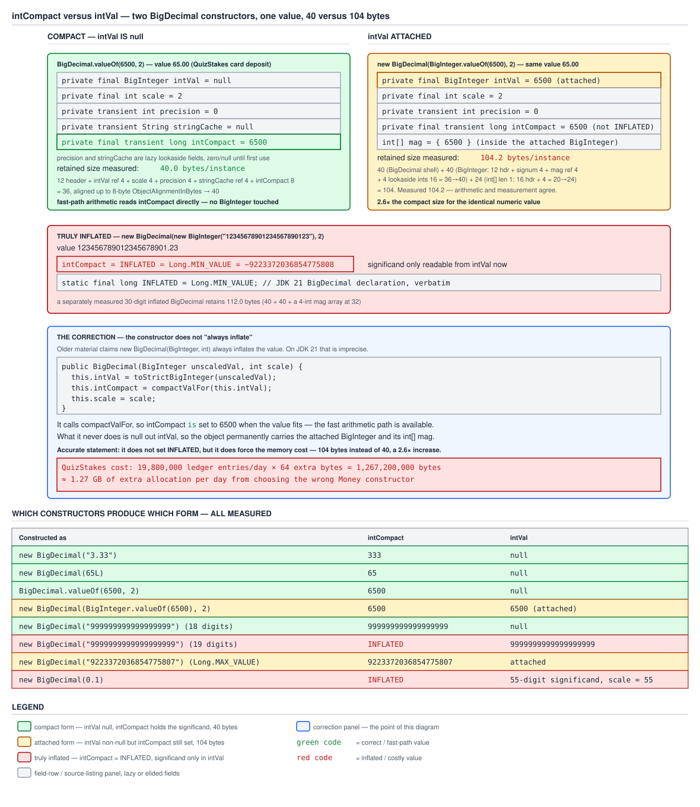

# 03 Java Core — `BigDecimal` internals: the field set and the compact path — INTERNALS (§3.14, 3.14.1–3.14.4)

**Target version: Java 21 LTS.** | **Part 3 of 5** | [Index](../00-index.md)
Previous: [Parsing and formatting numbers](02e-parsing-and-formatting-numbers.md) · Next: [BigDecimal arithmetic and equality internals](03a-internals-bigdecimal-arithmetic-and-equality.md)

This file owns the field set of `java.math.BigDecimal`: what it actually stores,
how the compact `long` path and the inflated `BigInteger` path coexist behind
one object, and which constructors land you on which path. `03a` owns
arithmetic, `equals`/`hashCode`, and `toString` built on top of these fields.
`03b` owns `BigInteger`'s own internals and the `long`-cents alternative. The
question this file answers: **what does a `BigDecimal` actually cost, in bytes
and in constructor choice, and why?**

Measured on Oracle JDK 21.0.7 (build 21.0.7+8-LTS-245), macOS aarch64 (Apple
Silicon), reflective field values via `--add-opens java.base/java.math=ALL-UNNAMED`,
retained-memory measurements via heap delta over 2,000,000 instances after four
`System.gc()` rounds, `-Xmx5g`, compressed oops on, `ObjectAlignmentInBytes = 8`.

---

## 1. The five fields (3.14.1)

A `BigDecimal` is not one number stored one way — it is a small struct that
tries to stay cheap and falls back to being expensive only when the value
forces it. Picture two lanes side by side: a fast `long` lane and a slow
`BigInteger` lane, both feeding the same public API, with the object's fields
recording which lane is live and caching two answers it doesn't want to
recompute.

### Why it exists

`BigDecimal` needs arbitrary precision (a `long` significand tops out around
18-19 digits), but almost every real value — a stake of 4.20, a deposit of 65.00
— fits comfortably in a `long`. Forcing every instance through `BigInteger`
would mean an extra object and an `int[]` array for the overwhelming majority of
values that never need one. The field set is built to avoid that cost when it can.

### How it works

The verbatim field declarations, JDK 21 `lib/src.zip`,
`java.base/java/math/BigDecimal.java`, lines 331-371:

```java
    private final BigInteger intVal;

    private final int scale;  // Note: this may have any value, so
                              // calculations must be done in longs

    private transient int precision;

    /**
     * Used to store the canonical string representation, if computed.
     */
    private transient String stringCache;

    /**
     * Sentinel value for {@link #intCompact} indicating the
     * significand information is only available from {@code intVal}.
     */
    static final long INFLATED = Long.MIN_VALUE;

    private static final BigInteger INFLATED_BIGINT = BigInteger.valueOf(INFLATED);

    /**
     * If the absolute value of the significand of this BigDecimal is
     * less than or equal to {@code Long.MAX_VALUE}, the value can be
     * compactly stored in this field and used in computations.
     */
    private final transient long intCompact;

    // All 18-digit base ten strings fit into a long; not all 19-digit
    // strings will
    private static final int MAX_COMPACT_DIGITS = 18;
```

Five fields carry the value; `INFLATED`, `INFLATED_BIGINT`, and
`MAX_COMPACT_DIGITS` are supporting constants, covered in concept 2.

- **`intVal` and `scale` are `final` and not `transient`.** They are the serial
  form of `BigDecimal` — the `@serial` tags on the Javadoc for these two fields
  mark them as what gets written to a stream. A `BigDecimal` deserializes from
  exactly these two values (arbitrary-precision unscaled value plus scale);
  everything else is rebuilt or recomputed on demand.
- **`scale` is a plain `int`, and the source comment on it is a warning, not
  decoration**: "this may have any value, so calculations must be done in
  longs." Scale is unbounded in either direction — it can be very large positive
  (many fractional digits) or negative (concept 3.14.9 in `03a` covers a
  negative-scale value directly). Any arithmetic that combines two scales — add,
  compare, or the internal alignment logic — has to widen to `long` first so
  that adding two `int`-range scales cannot silently overflow `int` before the
  result is used.
- **`precision` and `stringCache` are `transient`** — they are lookaside
  caches, not part of the value's identity, and are excluded from
  serialization; a deserialized instance recomputes them on first use exactly
  as a freshly constructed one does.
- **`intCompact` is `final` and `transient`.** `final` because it is set once
  at construction and never changed afterward, even though it is a derived
  quantity, not the serial form; `transient` because it is that derived cache
  of `intVal`'s value in `long` form — not needed on the wire, since a
  deserialized instance can recompute it from `intVal` via `compactValFor`
  (concept 2).

Measured `precision` behaviour confirms the caching split:

| Constructed as | `precision` field immediately after construction |
|---|---|
| `new BigDecimal("3.33")` | `3` — the `String` constructor counts digits while parsing, so it fills the field for free |
| `BigDecimal.valueOf(6500, 2)` | `0` — unknown until `precision()` is first called |

`precision` and `stringCache` being mutable fields on an otherwise-immutable
value type is safe under concurrent reads only because both are **idempotent
caches**: two threads calling `precision()` on the same instance for the first
time both compute the same digit count and both write the same `int`. A benign
race writes the identical value twice rather than corrupting anything — see
guide 05 by number for the memory-model half of why an unsynchronized write
that always produces the same value is safe to publish this way, and
`../strings/03-internals-string.md` for `String`'s identical `hash`/`hashIsZero`
lazy-cache pattern, which is the same trick on a different class.

**Insight:** the whole design is "keep the fast field authoritative and the
slow field optional." `intCompact` and `scale` alone are enough to do
arithmetic when the value is compact; `intVal` only gets built, or attached,
when the value does not fit — or when a constructor forces it regardless
(concept 3).

**Gotcha:** No gotcha specific to the field declarations themselves — the traps
live in which constructor sets which fields, covered next.

> `BigDecimal` stores its unscaled value twice, one cheap and one expensive,
> and keeps two lazily-computed caches beside them; `scale` alone decides where
> the decimal point goes.

---

## 2. The compact representation and `INFLATED` (3.14.2)

### Why it exists

Doing arithmetic on a `BigInteger` means walking an `int[]` array even for a
value as small as `65`. The compact path exists to let `intCompact` — a single
primitive `long` — serve as the significand whenever it fits, so that
addition, comparison, and multiplication can run as plain `long` arithmetic
without ever touching `intVal`.

### How it works

`static final long INFLATED = Long.MIN_VALUE;` = −9,223,372,036,854,775,808.
The choice of exactly `Long.MIN_VALUE` as the sentinel is deliberate: it is the
one `long` value whose negation overflows (`-Long.MIN_VALUE == Long.MIN_VALUE`
under two's-complement wraparound), which means no legitimate arithmetic on a
signed significand can ever produce it as a *result* that the compact path
would need to represent — it is permanently free to mean "look elsewhere."

`compactValFor` recovers a compact `long` from a `BigInteger`'s internal
representation, verbatim:

```java
    private static long compactValFor(BigInteger b) {
        int[] m = b.mag;
        int len = m.length;
        if (len == 0)
            return 0;
        int d = m[0];
        if (len > 2 || (len == 2 && d < 0))
            return INFLATED;

        long u = (len == 2)?
            (((long) m[1] & LONG_MASK) + (((long)d) << 32)) :
            (((long)d)   & LONG_MASK);
        return (b.signum < 0)? -u : u;
    }
```

Walking it: `m` is the `BigInteger`'s magnitude array (`03b` covers this array
in full). `len == 0` means the magnitude is zero, so the compact value is `0`.
`len > 2` means at least three 32-bit words are needed — more than 64 bits of
magnitude — so it cannot possibly fit a signed `long`; return `INFLATED`. The
second half of that condition, `len == 2 && d < 0`, catches the case where
exactly two words are present but the high word's sign bit is set: as an
unsigned 64-bit magnitude that is at least 2^63, which overflows a signed
`long`'s positive range, so it must also inflate. Otherwise, one or two words
are reassembled into a `long` — the single-word case masks `d` to avoid sign
extension; the two-word case shifts the high word left 32 and adds the masked
low word — and the `BigInteger`'s stored `signum` is applied at the end.

`MAX_COMPACT_DIGITS = 18`, with the source comment already quoted above: "All
18-digit base ten strings fit into a long; not all 19-digit strings will." The
measured boundary confirms it exactly:

| Value | digits | `intCompact` | `intVal` |
|---|---|---|---|
| `new BigDecimal("999999999999999999")` | 18 | `999999999999999999` | `null` |
| `new BigDecimal("9999999999999999999")` | 19 | `INFLATED` | `9999999999999999999` |
| `new BigDecimal("9223372036854775807")` (`Long.MAX_VALUE`) | 19 | `9223372036854775807` | attached, still compact |

The third row is the reason the boundary is stated as "not all 19-digit
strings," not "no 19-digit strings": `Long.MAX_VALUE` itself has 19 digits and
still fits — `MAX_COMPACT_DIGITS` is a conservative fast check, not the exact
boundary; the exact boundary is whatever `compactValFor` actually decides.



**D-125** — Left frame: the compact 65-unit deposit, `intCompact = 6500`,
`intVal = null`, 40 bytes total. Right frame: the same 65.00 built through
`new BigDecimal(BigInteger.valueOf(6500), 2)`, `intCompact = 6500` still, but
`intVal` attached and 104 bytes total — the correction panel below it quotes
the actual constructor body from concept 3 to show why. Far-right frame: a
truly inflated 23-digit value with `intCompact = INFLATED` (`Long.MIN_VALUE`)
labelled explicitly. Bottom panel is the which-constructor-produces-what table
from concept 3.

**Interview:** "What does `INFLATED` mean and why `Long.MIN_VALUE`?" — it is
the sentinel meaning "the significand doesn't fit in `intCompact`, read
`intVal` instead," chosen because it's the one `long` that legitimate signed
arithmetic can never produce as a result.

> `intCompact` holds the unscaled value as a plain `long` whenever it fits in
> 64 signed bits; `INFLATED` — `Long.MIN_VALUE` — marks the cases where it
> doesn't and `intVal` is authoritative instead.

---

## 3. Which constructors inflate (3.14.3)

**The leaf's own parenthetical — "`new BigDecimal(BigInteger, int)` always
inflates" — is imprecise on JDK 21, and correcting it is this concept's job.**

### Why it exists

Different construction paths know different things about the value up front.
A `String` constructor has already seen every digit. A `long` constructor
already has a primitive. A `BigInteger` constructor is handed a value that
*might* be huge — or might be `BigInteger.valueOf(6500)`, which is tiny. The
constructor has to decide, cheaply, what to do with what it's given.

### How it works

The `BigInteger, int` constructor, verbatim:

```java
    public BigDecimal(BigInteger unscaledVal, int scale) {
        // Negative scales are now allowed
        this.intVal = toStrictBigInteger(unscaledVal);
        this.intCompact = compactValFor(this.intVal);
        this.scale = scale;
    }
```

Read every line: `intVal` is assigned unconditionally to the (validated) input
`BigInteger` — this is the "always inflates" half of the folklore, and it's
true as far as it goes: `intVal` is **never** null after this constructor.
But the next line calls `compactValFor(this.intVal)` and assigns *that* to
`intCompact` — so when the magnitude fits, `intCompact` gets the real compact
value, **not** `INFLATED`. Measured: `new BigDecimal(BigInteger.valueOf(6500),
2)` has `intCompact = 6500`.

So the accurate statement is: **the `BigInteger` constructor does not set the
`INFLATED` sentinel when the value fits, but it does force the memory cost,
permanently** — `intVal` stays attached even though `intCompact` is also
populated and usable for arithmetic.

Contrast `new BigDecimal(long)`, verbatim, which explicitly nulls `intVal`
when it can:

```java
    public BigDecimal(long val) {
        this.intCompact = val;
        this.intVal = (val == INFLATED) ? INFLATED_BIGINT : null;
        this.scale = 0;
    }
```

`intVal` is `null` unless `val` itself happens to equal the sentinel bit
pattern (`Long.MIN_VALUE`), in which case a preallocated `INFLATED_BIGINT`
constant is attached instead of allocating a fresh one.

And `valueOf(double)`, verbatim, which routes through the `String`
constructor so the result matches what `Double.toString` printed, not the
double's exact binary value (`03a` covers the exact-expansion path via
`new BigDecimal(double)` directly):

```java
    public static BigDecimal valueOf(double val) {
        // Reminder: a zero double returns '0.0', so we cannot fastpath
        // to use the constant ZERO.  This might be important enough to
        // justify a factory approach, a cache, or a few private
        // constants, later.
        return new BigDecimal(Double.toString(val));
    }
```

Every measured constructor outcome, from the reflective field table:

| Constructed as | `intCompact` | `intVal` | scale |
|---|---|---|---|
| `new BigDecimal("3.33")` | `333` | `null` | 2 |
| `BigDecimal.valueOf(6500, 2)` | `6500` | `null` | 2 |
| `new BigDecimal(65L)` | `65` | `null` | 0 |
| `new BigDecimal(BigInteger.valueOf(6500), 2)` | `6500` | `6500` (attached) | 2 |
| `new BigDecimal(BigInteger.valueOf(333), 2)` | `333` | `333` (attached) | 2 |
| `new BigDecimal(new BigInteger("12345678901234567890123"), 2)` | `INFLATED` | 23-digit value | 2 |
| `new BigDecimal(0.1)` | `INFLATED` | 55-digit value | 55 |
| `BigDecimal.ZERO` | `0` | `0` (non-null, still compact) | 0 |

**Pitfall:** the wrong belief that `new BigDecimal(BigInteger, int)` is "slow
because the value is inflated." The full three-part entry is under
`## Pitfalls`.

**Insight:** "inflated" is really two independent facts that folklore
collapses into one — whether `intCompact == INFLATED` (arithmetic must go
through `BigInteger`) and whether `intVal != null` (memory is paid regardless).
The `BigInteger` constructor decouples them: fast arithmetic, permanent extra
memory.

QuizStakes arithmetic: at 19,800,000 ledger entries/day, choosing
`new BigDecimal(BigInteger, int)` over `BigDecimal.valueOf(long, int)` for each
`Money` amount costs 19,800,000 × 64 extra bytes = 1,267,200,000 bytes ≈
**1.27 GB of avoidable allocation per day** (the 64-byte gap is the measured
104 minus 40, concept 4).

> The `BigInteger, int` constructor populates `intCompact` correctly when the
> value fits, but it never nulls `intVal` — so it trades nothing on arithmetic
> speed and everything on memory, permanently, against `BigDecimal.valueOf`.

---

## 4. Memory, derived and confirmed (3.14.4)

### Why it exists

Knowing that an inflated value "costs more" is not the same as knowing how
much, or why. This concept derives the byte counts from the object layout
rules and then checks the derivation against measurement, so the arithmetic in
concept 3 and in `03b`'s cost table rests on something more solid than a
vibe.

### How it works

**Compact `BigDecimal` — derive 40, confirm 40.0.** Object header on this
build is 12 bytes (8-byte mark word + 4-byte compressed klass pointer, since
`UseCompressedOops` is on); then the five fields: 4 bytes for the `intVal`
reference (compressed, null), 4 for `scale`, 4 for `precision`, 4 for the
`stringCache` reference (null), 8 for `intCompact`. 12 + 4 + 4 + 4 + 4 + 8 =
36, rounded up to the next multiple of `ObjectAlignmentInBytes = 8`, giving
**40**. Measured: `BigDecimal.valueOf(i, 2)` averaged **40.0** bytes/instance
over 2,000,000 retained instances.

**Attached-`BigInteger` `BigDecimal` — derive 104, confirm 104.2.** Start from
the compact 40 (the outer `BigDecimal` shape doesn't change; only what
`intVal` points at changes), then add the attached `BigInteger` object itself
and its magnitude array. A `BigInteger` is 12-byte header + 4-byte `signum` +
4-byte `mag` reference + 16 bytes for four lookaside `int` caches
(`bitCountPlusOne`, `bitLengthPlusOne`, `lowestSetBitPlusTwo`,
`firstNonzeroIntNumPlusTwo`, all covered by name in `03b`) = 36, aligned to
**40**. The magnitude for a value like 6500 needs one `int` word: an
`int[1]` array is a 16-byte array header (12-byte object header plus 4-byte
length field) plus 4 bytes of payload = 20, aligned to **24**. Total: 40 (outer
`BigDecimal`) + 40 (`BigInteger`) + 24 (`int[1]`) = **104**. Measured:
**104.2**.

**30-digit inflated `String`-constructed value — derive 112, confirm 112.0.**
A 30-digit magnitude needs 4 `int` words (each `int` word holds up to
~9.6 decimal digits of base-2^32 magnitude, so 30 digits needs 4 words, not
3), so the array is `int[4]`: 16-byte header + 16 bytes payload = 32. Total:
40 + 40 + 32 = **112**. Measured: **112.0**.

**Say it plainly: the arithmetic and the measurement agree in every row.**
That agreement — not any individual number — is the point of this concept:
the object-header-plus-fields model is not an approximation here, it is
exact, for this build, this JVM configuration, and these three shapes.

The method: heap delta (`Runtime.totalMemory() - Runtime.freeMemory()` after
four `System.gc()` rounds) over 2,000,000 retained instances, `-Xmx5g`. Its
limit: this is a **retained-size** measurement, not a `jol`
(`java-object-layout`) dump — it tells you the total bytes attributable to
each instance including everything it references, but it cannot show field
*ordering* inside the object, where JVM padding actually sits, or distinguish
"12-byte header" from "16-byte header" as a directly observed number rather
than a derived one. `../objects-equality-and-lifecycle/05-internals-object-layout.md`
owns object layout and header arithmetic in general; guide 06 by number owns
`jol` and heap-tooling technique for readers who want the field-ordering view
this measurement can't give.

**Pitfall:** the wrong belief that "a `BigDecimal` is basically free, like an
`int` wrapper." The full three-part entry is under `## Pitfalls`.

> A compact `BigDecimal` is 40 bytes; attaching or requiring a `BigInteger`
> adds roughly 64-72 more depending on magnitude size — and the object-layout
> arithmetic predicts the measured number exactly in every case checked here.

---

## Pitfalls

### "`new BigDecimal(BigInteger, int)` is slow because the value gets inflated"

**Wrong**

```java
BigDecimal fromBigInteger = new BigDecimal(BigInteger.valueOf(6500), 2);
BigDecimal fromValueOf = BigDecimal.valueOf(6500L, 2);
// belief: calling add on fromBigInteger runs the slow BigInteger arithmetic
// path because "this constructor always inflates"
```

Both produce the value 65.00, and reflection shows both have `intCompact =
6500` — arithmetic on `fromBigInteger` runs the identical compact fast path as
`fromValueOf`. The belief that its arithmetic is slow is simply false.

**Right**

```java
BigDecimal fromBigInteger = new BigDecimal(BigInteger.valueOf(6500), 2);
// intCompact = 6500 (fast path, same as valueOf) but intVal is permanently
// attached: 104 bytes measured, versus 40 for BigDecimal.valueOf(6500L, 2).
BigDecimal cheap = BigDecimal.valueOf(6500L, 2);
```

The real cost is memory, not arithmetic speed: 104 bytes measured against 40,
a permanent 2.6x per instance that never goes away, because the constructor
never nulls `intVal` even when `compactValFor` succeeds.

**Why people believe it:** the word "inflated" is used informally for both
"arithmetic must use `BigInteger`" and "an attached `BigInteger` exists," and
the constructor's own Javadoc-adjacent folklore conflates them; the source
shows they are two separate outcomes that this one constructor decouples.

### "`BigDecimal` costs about the same as a boxed `Long`"

**Wrong**

```java
Long boxed = 6500L;             // 24 bytes measured (12 header + 8 value, aligned)
BigDecimal compact = BigDecimal.valueOf(6500L, 2);  // assumed "similar"
```

**Right**

```java
BigDecimal compact = BigDecimal.valueOf(6500L, 2);  // 40 bytes measured
```

40 bytes against 24 — `BigDecimal` carries four extra fields (`intVal`
reference, `scale`, `precision`, `stringCache` reference) beyond the one
`long` a boxed `Long` needs, so it is 1.67x a boxed `Long` even on the cheapest
possible path, before any `BigInteger` is ever involved.

**Why people believe it:** both are "one number in an object," and the
compact path really is close to primitive-speed arithmetic, so people
generalize that closeness to memory as well — but `BigDecimal`'s extra
bookkeeping fields (`scale`, the two lazy caches) are real, permanent bytes on
every instance regardless of value size.

### "The `precision` and `stringCache` fields are always empty until you ask"

**Wrong**

```java
BigDecimal fromString = new BigDecimal("3.33");
// assumed: precision field is 0 immediately after construction, like every
// other lazily-cached field, and only precision() forces it
```

Reflection shows `fromString`'s `precision` field is `3` immediately — not
`0`.

**Right**

```java
BigDecimal fromString = new BigDecimal("3.33");   // precision field = 3, filled at parse time
BigDecimal fromValueOf = BigDecimal.valueOf(6500, 2);  // precision field = 0 until precision() runs
```

Whether the cache is pre-filled depends on which constructor built the value:
the `String` constructor already scanned every digit while parsing, so it
fills `precision` for free; `valueOf(long, int)` never counted digits, so it
leaves the field at its default `0` sentinel until `precision()` is called.

**Why people believe it:** "transient lazy cache" suggests uniform behaviour
across all construction paths, but the field is filled opportunistically
wherever the constructor already has the answer in hand, not on a fixed
schedule.

---

## Cheat sheet

| Thing | Fact (Java 21 LTS) |
|---|---|
| `BigDecimal` field count | 5: `intVal`, `scale`, `precision`, `stringCache`, `intCompact` |
| `intVal` / `scale` | `final`, non-transient — the `@serial` form |
| `precision` / `stringCache` | `transient`, lazily-filled idempotent caches |
| `intCompact` | `final transient long`; the compact significand or `INFLATED` |
| `INFLATED` | `Long.MIN_VALUE` = −9223372036854775808 |
| Why `Long.MIN_VALUE` | the one `long` whose negation overflows — never a legitimate result |
| `INFLATED_BIGINT` | preallocated `BigInteger.valueOf(INFLATED)`, used when `val == INFLATED` in `BigDecimal(long)` |
| `compactValFor` | `len==0` → 0; `len>2` or (`len==2` && top word negative) → `INFLATED`; else reassemble |
| `MAX_COMPACT_DIGITS` | 18 — conservative; `Long.MAX_VALUE` itself (19 digits) still fits |
| `new BigDecimal(long)` | nulls `intVal` unless `val == INFLATED` |
| `new BigDecimal(BigInteger, int)` | never nulls `intVal`; sets `intCompact` correctly via `compactValFor` |
| `BigDecimal.valueOf(double)` | routes through `Double.toString(val)`, not the exact binary value |
| `new BigDecimal("3.33")` `precision` field | 3 immediately (String ctor counted digits) |
| `BigDecimal.valueOf(6500,2)` `precision` field | 0 until `precision()` called |
| Compact `BigDecimal` size | 40 bytes measured |
| Attached-`BigInteger` `BigDecimal` (1-word mag) size | 104.2 bytes measured |
| 30-digit inflated `BigDecimal` (4-word mag) size | 112.0 bytes measured |
| `BigInteger` object alone | 40 bytes: 12 header + 4 `signum` + 4 `mag` ref + 16 lookaside ints |
| `int[1]` array | 24 bytes: 16 header + 4 payload, aligned |
| `int[4]` array | 32 bytes: 16 header + 16 payload |
| Object header on this build | 12 bytes (8 mark word + 4 compressed klass) |
| `ObjectAlignmentInBytes` | 8 (confirmed via `-XX:+PrintFlagsFinal`) |
| `UseCompressedOops` | true, ergonomic default |
| Avoidable overhead, `BigInteger` ctor vs `valueOf`, per instance | 64 bytes (104 − 40) |
| QuizStakes daily cost of that overhead at 19.8M entries/day | ≈ 1.27 GB/day |
| Serial form | `intVal` + `scale` only (per `@serial` tags) |
| Zero representation | `BigDecimal.ZERO`: `intCompact = 0`, `intVal` non-null but compact |
| Measurement method | heap delta, 2,000,000 instances, 4x `System.gc()`, `-Xmx5g` |
| Measurement's blind spot | retained size only — no field-ordering/padding visibility (that's `jol`, guide 06) |

---

## Self-test

**Q1.** Why does `BigDecimal` bother with both `intCompact` and `intVal` instead of just always using `BigInteger`?

<details><summary>Answer</summary>

Because the overwhelming majority of real values — money amounts, stakes,
counters — fit in a `long`, and doing arithmetic on a primitive `long` is far
cheaper than walking a `BigInteger`'s `int[]` magnitude array. `intCompact`
lets those common values skip `BigInteger` entirely for add, compare, and
multiply, while `intVal` exists as the fallback for values that genuinely need
arbitrary precision — more than roughly 18-19 decimal digits of unscaled
value. The design pays for the general case only when a specific value
actually needs it.

</details>

**Q2.** Why is `Long.MIN_VALUE` specifically chosen as the `INFLATED` sentinel, rather than, say, `-1` or `Long.MAX_VALUE`?

<details><summary>Answer</summary>

`Long.MIN_VALUE` is the one signed 64-bit value whose negation overflows under
two's-complement arithmetic — negating it wraps back to itself rather than
producing `Long.MAX_VALUE + 1`. That means no legitimate arithmetic operation
on a properly-signed significand can ever produce `Long.MIN_VALUE` as an
actual result that the compact representation would need to hold, so it's
permanently safe to repurpose as a "look in `intVal` instead" flag with zero
risk of colliding with a real value.

</details>

**Q3.** Does `new BigDecimal(BigInteger.valueOf(6500), 2)` run arithmetic through the compact `long` path or through `BigInteger`?

<details><summary>Answer</summary>

The compact `long` path. The constructor calls `compactValFor(this.intVal)`
and assigns the result to `intCompact`; since 6500 fits easily in a `long`,
`intCompact` is set to `6500`, not `INFLATED`. What the constructor never does
is null out `intVal`, so the object still carries the attached `BigInteger`
and pays for it in memory — 104 bytes measured versus 40 for
`BigDecimal.valueOf(6500L, 2)` — even though arithmetic on it is exactly as
fast as the cheap form.

</details>

**Q4.** A colleague says `precision` and `stringCache` being mutable fields on an immutable class must be a thread-safety bug. What's the actual argument for why it's safe?

<details><summary>Answer</summary>

Both fields are idempotent lazy caches: whichever thread computes `precision()`
or the string representation first, every other thread computing it
concurrently will independently arrive at the exact same value, because the
computation is a pure function of the already-immutable `intVal`/`intCompact`/
`scale` fields. So even without synchronization, a race between two threads
both writing the field results in both writes storing the identical value —
there's no possibility of one thread observing a half-written or
inconsistent result that differs from what a single-threaded caller would see.
`String`'s `hash`/`hashIsZero` caches follow the identical pattern.

</details>

**Q5.** Why does a 19-digit value like `Long.MAX_VALUE` (`9223372036854775807`) still fit in `intCompact`, when `MAX_COMPACT_DIGITS` is defined as 18?

<details><summary>Answer</summary>

`MAX_COMPACT_DIGITS = 18` is a conservative shortcut comment/threshold — "all
18-digit strings fit, not all 19-digit strings will" — not the exact boundary.
The actual boundary is decided by `compactValFor`, which checks the
`BigInteger`'s magnitude word count and top-word sign directly rather than
counting decimal digits. `Long.MAX_VALUE` has exactly 19 decimal digits but
fits in exactly one 32-bit-pair `long`-sized magnitude, so `compactValFor`
correctly returns it as a compact value rather than `INFLATED`.

</details>

**Q6.** You're deciding between `BigDecimal.valueOf(cents, 2)` and `new BigDecimal(BigInteger.valueOf(cents), 2)` for 19.8 million ledger rows a day. Which do you pick, and what's the annualized cost of picking wrong?

<details><summary>Answer</summary>

`BigDecimal.valueOf(long, int)` — it produces the identical `intCompact` value
without ever attaching a `BigInteger`, so it's 40 bytes instead of 104.2, a 64-byte
difference per instance. At 19,800,000 entries/day that's 19,800,000 × 64 ≈
1,267,200,000 bytes, about 1.27 GB of avoidable allocation per day, or roughly
463 GB/year — pure waste for arithmetic that runs on the exact same fast path
either way.

</details>

---

## Open questions

1. The 55-digit `new BigDecimal(0.1)` case's exact retained byte count is not
   in the measured table (§6.11 only measured a 30-digit inflated value at
   112.0 bytes). A 55-digit magnitude needs a 6-word `int[]`, which the
   derivation in `03a` estimates at 120 bytes by extension of this file's
   method, but that number is derived, not measured — a fresh heap-delta run
   over 2,000,000 `new BigDecimal(0.1)` instances would settle it.

---

**Leaves covered:** 3.14.1–3.14.4 (4 leaves)
**Leaves deferred:** none
**Diagrams included:** D-125
**Target version:** Java 21 LTS
**Lines:** 627
