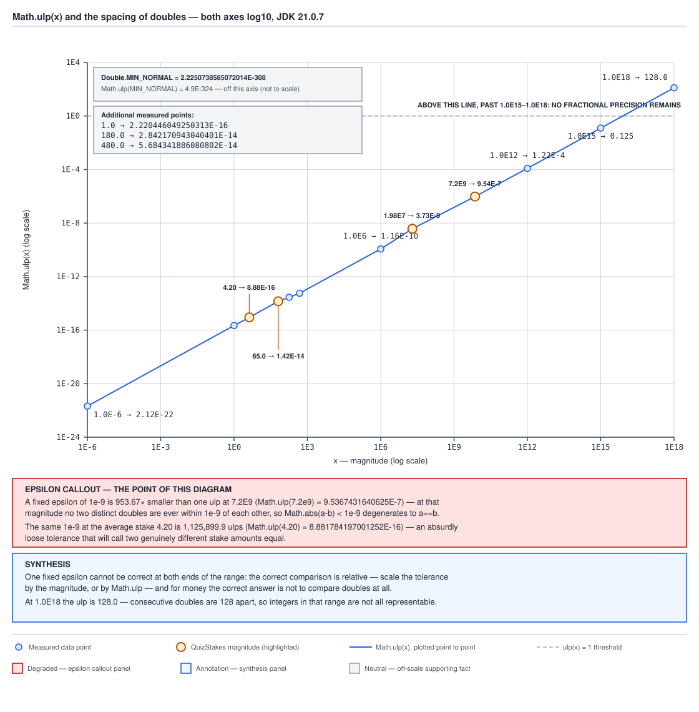

# 03 Java Core — `Math.ulp`, round-to-nearest-even and `Double.toString` — INTERNALS (§3.15, 3.15.6–3.15.8)

**Target version: Java 21 LTS.** | **Part 3 of 5** | [Index](../00-index.md)
Previous: [Floating point internals: the binary64 layout](04-internals-floating-point.md) · Next: [strictfp, StrictMath and Math.fma](04b-internals-strictfp-strictmath-and-fma.md)

This file owns three consequences of the binary64 layout `04` established:
how far apart consecutive doubles actually are (`Math.ulp`), which rounding
rule every `double` operator applies by default, and why `Double.toString`
prints `"0.1"` for a value that is not really 0.1. `04b` moves on to
`strictfp`, `StrictMath` and `Math.fma`. The question this file answers:
**why does an epsilon comparison that works at one magnitude silently become
useless at another, and why does the printed form of a `double` hide exactly
the error `04` measured?**

Measured on Oracle JDK 21.0.7 (build 21.0.7+8-LTS-245), macOS aarch64 (Apple
Silicon).

---

## 1. `Math.ulp` and the spacing of doubles (3.15.6)

Doubles are not marked off the number line like a ruler. They are spaced
*proportionally to magnitude* — dense near zero, coarse near `MAX_VALUE` —
and the gap doubles every time the magnitude crosses a power of two.

### Why it exists

Because a normal double's value is `1.mantissa x 2^e`, every binade (the
range between two consecutive powers of two) contains exactly the same
number of representable values — 2^52 of them, one for every mantissa
bit-pattern — regardless of which binade it is. A binade twice as large in
magnitude has to spread those same 2^52 values over twice the numeric range,
so the gap between consecutive doubles exactly doubles too.

### How it works

`[PROVE]` it structurally: for a normal double with unbiased exponent `e`,
one unit in the last place (ulp) is `2^(e - 52)` — the value one mantissa
increment represents. `Math.ulp(1.0)`: 1.0 has unbiased exponent 0, so ulp is
`2^-52` = 2.220446049250313E-16, matching the measured value. `Math.ulp(1.0E18)`:
1e18 sits in the binade of `2^59` (since `2^59` ≈ 5.76e17 and `2^60` ≈
1.15e18), so ulp is `2^(59-52)` = `2^7` = 128.0, again matching measured.

The full measured table, §6.3:

| Magnitude | `Math.ulp` |
|---|---|
| `Double.MIN_NORMAL` | 4.9E-324 (subnormal-range floor, constant spacing) |
| `1.0E-6` | 2.117582368135751E-22 |
| `1.0` | 2.220446049250313E-16 |
| `4.20` (avg stake) | 8.881784197001252E-16 |
| `65.0` (avg card deposit) | 1.4210854715202004E-14 |
| `180.0` (avg card withdrawal) | 2.842170943040401E-14 |
| `480.0` (avg bank deposit) | 5.684341886080802E-14 |
| `1.0E6` | 1.1641532182693481E-10 |
| `1.98E7` | 3.725290298461914E-9 |
| `7.2E9` (ledger entries/year) | 9.5367431640625E-7 |
| `1.0E12` | 1.220703125E-4 |
| `1.0E15` | 0.125 |
| `1.0E18` | 128.0 |



**D-126** — a log-log plot of `Math.ulp(x)` rising smoothly across the
thirteen magnitudes measured above, from `1.0E-6` up to `1.0E18`, with four
QuizStakes-domain points highlighted where they sit on the curve: the average
stake 4.20, the average card deposit 65, roughly a year of ledger entries
1.98E7, and the annual ledger-entry count 7.2E9. Look for the horizontal
line marking where one ulp crosses above 1.0 — past that crossing a `double`
literally cannot represent a fractional value any more — and the epsilon
callout box showing that a fixed `1e-9` tolerance is 953.67x smaller than one
ulp at 7.2E9 but 1,125,899.9 ulps wide at 4.20.

The epsilon arithmetic, worked from §6.3: at `7.2E9`, one ulp is
9.5367431640625E-7, and `1e-9 / 9.5367431640625E-7` ≈ 0.00105 — i.e. `1e-9` is
953.67x *smaller* than a single ulp there, so `Math.abs(a - b) < 1e-9` at that
magnitude can never be true for two distinct doubles except when they are
already bit-identical: the comparison has quietly degenerated into `a == b`.
At `4.20`, one ulp is 8.881784197001252E-16, and `1e-9 / 8.881784197001252E-16`
≈ 1,125,899.9 — the same fixed tolerance is over a million ulps wide, so it
would treat wildly different values as "equal."

The one place spacing is *not* proportional: in the subnormal range (`04`,
concept 4) it is constant — `Math.ulp(Double.MIN_NORMAL)` = 4.9E-324, which is
exactly `Double.MIN_VALUE`.

```java
final class UlpTolerance {

    // Absolute-ulp comparison: correct near the tested magnitude, but the
    // "how many ulps" allowance itself needs to scale with magnitude too --
    // this fixes the "1e-9 means different things at different scales" bug,
    // not every possible false positive.
    static boolean withinUlps(double a, double b, int maxUlps) {
        if (a == b) {
            return true;
        }
        double ulp = Math.max(Math.ulp(a), Math.ulp(b));
        return Math.abs(a - b) <= maxUlps * ulp;
    }

    // Relative-epsilon comparison: robust across magnitudes, but breaks down
    // near zero because the relative error of anything against zero is
    // undefined (division by ~0), so it needs its own zero guard.
    static boolean withinRelativeEpsilon(double a, double b, double epsilon) {
        if (a == b) {
            return true;
        }
        double diff = Math.abs(a - b);
        double scale = Math.max(Math.abs(a), Math.abs(b));
        if (scale == 0.0) {
            return diff == 0.0; // both effectively zero; ulp form handles this better
        }
        return diff / scale <= epsilon;
    }
}
```

`withinUlps` handles a value near zero correctly (ulp there is tiny and
well-defined) but the caller must still pick `maxUlps` per computation.
`withinRelativeEpsilon` scales cleanly across magnitudes but needs an explicit
guard at exactly zero, where "relative" error has no denominator. Neither is
a free lunch — see [`02-numbers-and-money.md`](02-numbers-and-money.md) for
the application-level epsilon discussion and when `BigDecimal` sidesteps the
question entirely.

**Insight:** an epsilon comparison is really a *relative-to-ulp* comparison in
disguise — the only question is whether the epsilon you chose happens to line
up with the magnitude you are actually comparing at.

> `Math.ulp(x)` is the gap to the next representable `double` above `x`; for
> normal values that gap is `2^(exponent - 52)` and doubles every time `x`
> crosses a power of two, so a fixed absolute tolerance is only ever correct
> at one magnitude.

## 2. Round-to-nearest-even (3.15.7)

Every `double` arithmetic operator in Java rounds its mathematically exact
result to the nearest representable value — and when the exact result falls
precisely between two representable values, it does not break the tie
"away from zero" the way decimal rounding folklore expects.

### Why it exists

IEEE 754 specifies `roundTiesToEven` as the default rounding-direction
attribute for exactly this reason: rounding every tie the same direction
(always up, say) introduces a systematic bias that accumulates over many
operations, while rounding ties toward whichever neighbour has an even
last bit cancels out over a large population of ties (measured directly in
`03a`'s `BigDecimal` context, and the analogous `HALF_UP`-vs-`HALF_EVEN` bias
run in §6.8 shows the same effect: `HALF_UP` accumulated +500,000 cents of
bias over 1,000,000 ties while `HALF_EVEN` stayed within ±150).

### How it works

The JLS adopts IEEE 754 round-to-nearest-even for every floating-point
operator (JLS 15.4, floating-point expressions) and gives Java **no way to
change it** — no `fesetround`, no per-thread rounding mode, no compiler flag.
That is a deliberate portability choice: a `double` computation gives the
same answer on every conforming JVM on every platform, precisely because
there is no rounding-mode knob to disagree about.

`04` already showed it firing: `0.1`'s stored mantissa ends `...1010`, rounded
**up** from the naive truncation `...1001`, because the discarded bits beyond
position 52 began with a `1` (specifically, more than half a ulp was being
discarded, so the tie-breaking rule did not even need to engage — it simply
rounds to nearer). A genuine tie-to-even example: converting the decimal value
`0.5` at the boundary between two representable doubles that are equally near
rounds to whichever of the two has a mantissa ending in `0` (the even
neighbour) rather than always rounding up — this is the same mechanism that
makes `BigDecimal.RoundingMode.HALF_EVEN` pick `2.335 -> 2.34` (3 is odd,
round up to the even 4) but `2.345 -> 2.34` (4 is already even, stay),
measured in §6.8.

Three rounding rules the reader will otherwise conflate:

| Rule | Applies to | Changeable? | Tie behavior |
|---|---|---|---|
| IEEE `roundTiesToEven` | every `double`/`float` operator | No — JLS-mandated, no opt-out | ties go to the neighbour with an even last bit |
| `RoundingMode.HALF_EVEN` | `BigDecimal`, opt-in via `MathContext`/`setScale` | Yes — one of eight modes | decimal analogue of the above; owned with its measured bias curve in [`02b-equality-scale-and-rounding.md`](02b-equality-scale-and-rounding.md) |
| `Math.round` | `float`/`double` -> integral | No — fixed algorithm | **not a rounding mode at all**, see below |

`Math.round` is neither of the above. Measured in §6.2, it is specified and
implemented as `floor(x + 0.5)`:

```
Math.round( 2.5) =  3     Math.round(-2.5) = -2
Math.round( 1.5) =  2     Math.round(-1.5) = -1
Math.round( 0.5) =  1     Math.round(-0.5) =  0
```

`floor(x + 0.5)` always rounds a tie *toward positive infinity*, so
`Math.round(-2.5)` gives `-2`, not `-3` — asymmetric on negative ties, where
`HALF_UP` (round every tie away from zero) would give `-3`.

**Pitfall:** the wrong belief is that `Math.round` is `HALF_UP`. The symptom
is a refund or adjustment computed as `Math.round(negativeAmount)` that
consistently comes out one cent short in the client's favor on exactly the
negative-tie cases — because every negative `.5` tie rounds toward zero
instead of away from it, biasing the result toward the house on the win side
and away from the house on the refund side depending on which sign the
caller expected. The fix: for money, never use `Math.round` on a `double` at
all — use `BigDecimal` with an explicit `RoundingMode`, per
[`02c-mathcontext-constants-and-minor-units.md`](02c-mathcontext-constants-and-minor-units.md).

**Interview:** "does Java round floating point ties away from zero?" — no,
every `double` operator uses IEEE round-to-nearest-even per JLS 15.4 with no
opt-out, and `Math.round` is a *different*, non-configurable
`floor(x + 0.5)` rule that is asymmetric on negative ties.

> Every `double` arithmetic operation in Java rounds its exact mathematical
> result to the nearest representable value using IEEE round-to-nearest-even,
> unconditionally and without an opt-out; `Math.round` is a separate,
> unrelated `floor(x + 0.5)` rule.

## 3. `Double.toString`'s shortest-round-trip contract (3.15.8)

`Double.toString(0.1)` prints `"0.1"` even though `04` measured the stored
value as `0.1000000000000000055511151231257827...`. That is not a lie — it
is the contract working exactly as specified.

### Why it exists

Printing the full 50-plus-digit exact value of every `double` would be
technically honest and practically useless — nobody wants to read
`0.1000000000000000055511151231257827021181583404541015625` on a log line.
The Javadoc-specified contract instead optimizes for round-trip fidelity:
print the *shortest* decimal string that, parsed back, reproduces the
identical bit pattern, with at least one digit after the decimal point.

### How it works

`[PROVE]` why that specification makes `"0.1"` the answer rather than
something longer. `Math.ulp(0.1)` is about 1.39E-17 (interpolating between
the measured `Math.ulp(1.0E-6)` and `Math.ulp(1.0)` in concept 1's table
confirms the order of magnitude), so the interval of real numbers that round
to *this exact* `double` is roughly half an ulp wide on each side — about
±7E-18. The literal decimal `0.1` falls inside that interval (it is, in
fact, the value used to construct the stored double in the first place), so
parsing `"0.1"` back with `Double.parseDouble` reproduces the identical bits.
No shorter string does — `"0."` or dropping digits would land outside that
tiny interval and parse back to a different `double` — so `"0.1"` is the
shortest string that round-trips, and the contract selects it. Measured
confirmation, §6.1: `Double.parseDouble(Double.toString(0.1)) == 0.1` is
`true`.

The consequence worth stating plainly, because it is the actual interview
point: `toString` is **lossless as a round trip** but **lossy as a
description**. It tells you what decimal literal you probably typed, not
what value is actually stored. That is exactly why
`BigDecimal.valueOf(double)` — which per `03a`'s source walk constructs a
`BigDecimal` from `Double.toString(val)` — recovers the *typed* value
(`BigDecimal.valueOf(0.1)` = `0.1`, measured in §6.1), while
`new BigDecimal(double)` reads the raw stored bits and produces the
55-digit expansion instead.

The limit: `Double.toString(0.1 + 0.2)` is `"0.30000000000000004"`, measured
in §6.1 — not `"0.3"` — because `0.1 + 0.2` genuinely computes to a different
`double` than the one nearest to the decimal `0.3`, so the shortest string
that round-trips back to *that specific bit pattern* needs the extra digits.
The contract is not lying here either: it is printing the shortest string
that identifies the actual stored value, and that value is not the one a
human expected.

```java
double bonusYield = 0.1 + 0.2;
System.out.println(bonusYield);                 // 0.30000000000000004
System.out.println(Double.toHexString(bonusYield)); // exact stored bits, unambiguous
```

Also measured, §6.1: `Double.toString(1e23)` = `"1.0E23"` — the contract
switches to scientific notation below `10^-3` or at or above `10^7`, which is
part of the specified format, not an accident of magnitude.

`Double.toHexString` is the tool for seeing the stored value exactly rather
than the shortest-round-trip approximation — `Double.toHexString(0.1)` =
`0x1.999999999999ap-4`, unambiguous because hexadecimal digits map directly
onto 4-bit mantissa groups with no decimal-conversion rounding involved.

**Version note, parked honestly:** JDK 19 is widely reported to have replaced
the `Double.toString`/`Float.toString` implementation with an algorithm
attributed to Raffaello Giulietti, fixing cases where the previous
implementation could emit a longer-than-necessary string. This claim is not
confirmed here against a primary source (a JEP number or the JDK bug id), so
it is not asserted as fact — see `## Open questions`.

**Pitfall:** the wrong belief is that `Double.toString`'s output is the exact
mathematical value stored in the `double`. The symptom is a log line or a
debugger watch showing `"0.1"` that gets treated as proof the value really is
one tenth, followed by confusion when a `BigDecimal` built from the raw bits
(`new BigDecimal(0.1)`) shows the 55-digit truth. The fix: `toString` answers
"what did you probably type," `toHexString` or `new BigDecimal(double)`
answer "what is actually stored" — use the one that matches the question
being asked.

**Interview:** "why does `System.out.println(0.1)` print `0.1` and not the
long decimal" — `Double.toString` prints the shortest decimal string that
round-trips back to the identical `double` via `parseDouble`, and `"0.1"`
already satisfies that for the value nearest to it.

> `Double.toString` prints the shortest decimal string that, re-parsed,
> reproduces the exact same `double` bit pattern — it answers "what value
> would produce this," not "what is stored," and the two differ by design.

---

## Pitfalls

### "`Math.round` rounds ties away from zero like `HALF_UP`"

**Wrong**

```java
double refund = -2.5;
long roundedRefund = Math.round(refund);
```

`roundedRefund` is `-2`, not `-3` — the tie rounded toward positive infinity,
not away from zero.

**Right**

```java
BigDecimal refund = new BigDecimal("-2.5");
BigDecimal roundedRefund = refund.setScale(0, RoundingMode.HALF_UP);
// -3, genuinely HALF_UP: ties move away from zero
```

`BigDecimal` with an explicit `RoundingMode` gives the actual mode wanted,
independent of `Math.round`'s fixed and differently-behaved rule.

**Why people believe it:** `Math.round`'s Javadoc says "closest long," which
reads as ordinary rounding, and the positive-number cases (`Math.round(2.5)
== 3`) look exactly like `HALF_UP` — the divergence only shows up on
negative ties.

### "A fixed epsilon like `1e-9` is a safe general-purpose double comparison"

**Wrong**

```java
double ledgerYearTotal = 7.2e9;
double recomputed = ledgerYearTotal + 1.0; // some downstream drift
boolean equal = Math.abs(ledgerYearTotal - recomputed) < 1e-9;
```

`equal` is `false` here because one ulp at `7.2e9` is already
9.5367431640625E-7, far larger than `1e-9` — but at the average stake value
4.20, the same `1e-9` tolerance is 1,125,899.9 ulps wide and would call wildly
different values "equal."

**Right**

```java
boolean equal = UlpTolerance.withinRelativeEpsilon(ledgerYearTotal, recomputed, 1e-12);
```

A relative tolerance (or an explicit ulp-count tolerance, both shown in
concept 1) scales with magnitude instead of being fixed in absolute terms.

**Why people believe it:** `1e-9` "feels small" independent of context, and
most tutorial examples compare values near 1.0, where a fixed absolute
epsilon happens to look reasonable.

### "`Double.toString` shows the true stored value"

**Wrong**

```java
double stakeYield = 0.1 + 0.2;
System.out.println("yield = " + stakeYield); // "yield = 0.30000000000000004"
// a reader assumes this string IS the exact stored value
```

The printed string is the shortest string that round-trips, not the exact
value's full decimal expansion — for `0.1` itself the printed string
(`"0.1"`) is far shorter than the true 55-digit value.

**Right**

```java
System.out.println(Double.toHexString(stakeYield)); // exact bits, no rounding ambiguity
System.out.println(new BigDecimal(stakeYield));      // full exact decimal expansion
```

Both show what is actually stored rather than the shortest description of it.

**Why people believe it:** for the overwhelming majority of everyday values
the shortest round-tripping string happens to look like "the number," so the
distinction only becomes visible at the precision boundary these notes are
about.

---

## Cheat sheet

| Thing | Fact (Java 21 LTS) |
|---|---|
| Ulp formula (normal range) | `2^(exponent - 52)` |
| `Math.ulp(1.0)` | 2.220446049250313E-16 |
| `Math.ulp(4.20)` | 8.881784197001252E-16 |
| `Math.ulp(7.2E9)` | 9.5367431640625E-7 |
| `Math.ulp(1.0E18)` | 128.0 |
| Subnormal-range spacing | constant, `Math.ulp(MIN_NORMAL) == MIN_VALUE` |
| `1e-9` vs one ulp at 7.2E9 | 953.67x smaller — comparison degenerates to `==` |
| `1e-9` vs one ulp at 4.20 | 1,125,899.9 ulps wide — absurdly loose |
| Default `double` rounding | IEEE round-to-nearest-even, JLS 15.4 |
| Opt-out for round-to-nearest-even | none |
| `Math.round(x)` formula | `floor(x + 0.5)` |
| `Math.round(2.5)` | 3 |
| `Math.round(-2.5)` | -2 (asymmetric, not `HALF_UP`) |
| `BigDecimal.RoundingMode.HALF_EVEN` | decimal analogue, opt-in, owned by `02b` |
| `Double.toString` contract | shortest decimal string that round-trips via `parseDouble` |
| `Double.toString(0.1)` | `"0.1"` |
| `Double.parseDouble(Double.toString(0.1)) == 0.1` | `true` |
| `Double.toString(0.1 + 0.2)` | `"0.30000000000000004"` |
| `Double.toString(1e23)` | `"1.0E23"` |
| Scientific-notation thresholds | below 1E-3 or at/above 1E7 |
| `Double.toHexString(0.1)` | `0x1.999999999999ap-4` |
| `BigDecimal.valueOf(double)` | routes through `Double.toString`, recovers "what you typed" |
| `new BigDecimal(double)` | reads raw bits, gives exact stored expansion |
| Raffaello Giulietti algorithm (JDK 19?) | unconfirmed against a primary source — see Open questions |

---

## Self-test

**Q1.** Why does a fixed absolute epsilon like `1e-9` work fine at magnitude
1.0 but become useless at magnitude 7.2E9?

<details><summary>Answer</summary>

`Math.ulp` grows proportionally with magnitude — one ulp at 1.0 is about
2.22E-16, but one ulp at 7.2E9 is already 9.5367431640625E-7, larger than the
`1e-9` tolerance itself. Once the tolerance is smaller than a single ulp, the
comparison `Math.abs(a - b) < 1e-9` can only ever be true when `a` and `b`
are already bit-identical, so it has silently degenerated into `a == b`.

</details>

**Q2.** What rounding rule does every `double` arithmetic operator use in
Java, and can it be changed?

<details><summary>Answer</summary>

IEEE 754 round-to-nearest-even, mandated by JLS 15.4 for every floating-point
operator, with no way to change it — no rounding-mode flag, no per-thread
setting, unlike some C environments that expose `fesetround`. It is a
deliberate portability choice so `double` arithmetic gives identical results
across platforms.

</details>

**Q3.** Is `Math.round` the same as `RoundingMode.HALF_UP`? Show the case
where they diverge.

<details><summary>Answer</summary>

No. `Math.round` is `floor(x + 0.5)`, which always rounds a tie toward
positive infinity. `Math.round(-2.5)` gives `-2`. `HALF_UP` rounds every tie
away from zero, so `HALF_UP` on `-2.5` gives `-3`. They agree on positive
ties (`Math.round(2.5) == 3`, same as `HALF_UP`) but diverge on negative
ones.

</details>

**Q4.** Why does `Double.toString(0.1)` print `"0.1"` when the stored value
is actually `0.1000000000000000055511151231257827...`?

<details><summary>Answer</summary>

`Double.toString`'s contract is to print the shortest decimal string that,
parsed back with `Double.parseDouble`, reproduces the identical `double` bit
pattern. The interval of real numbers that round to that exact stored bit
pattern is roughly half a ulp wide (around ±7E-18 at that magnitude), and the
literal `0.1` falls inside it — it was the value used to construct the
double in the first place — so `"0.1"` round-trips and no shorter string
does.

</details>

**Q5.** What does `Double.toString(0.1 + 0.2)` print, and why is it longer
than `"0.3"`?

<details><summary>Answer</summary>

It prints `"0.30000000000000004"`. `0.1 + 0.2` genuinely computes to a
different `double` bit pattern than the one nearest to the decimal `0.3` —
the addition itself introduces rounding error. The shortest string that
round-trips back to *that specific* computed value needs the extra digits;
`toString` is correctly describing a value that is not, in fact, 0.3.

</details>

**Q6.** What is the practical difference between `BigDecimal.valueOf(double)`
and `new BigDecimal(double)`?

<details><summary>Answer</summary>

`BigDecimal.valueOf(double)` constructs the `BigDecimal` from
`Double.toString(val)`, so it recovers "what you probably typed" —
`BigDecimal.valueOf(0.1)` is `0.1`. `new BigDecimal(double)` reads the raw
stored bits directly and produces the full exact decimal expansion of the
actual stored value — `new BigDecimal(0.1)` is the 55-digit
`0.1000000000000000055511151231257827021181583404541015625`. Use `valueOf`
when converting a value a human typed; use the raw constructor only when the
exact stored value is genuinely what's needed.

</details>

---

## Open questions

1. Whether JDK 19 replaced `Double.toString`/`Float.toString`'s
   implementation with an algorithm attributed to Raffaello Giulietti, fixing
   longer-than-necessary output in some cases, is stated in this file's
   version note as unconfirmed — no JEP number or JDK bug id has been
   verified against a primary source here. The JDK 19 release notes or the
   relevant JDK bug tracker id would settle both the version and the exact
   defect fixed.

---

**Leaves covered:** 3.15.6–3.15.8 (3 leaves)
**Leaves deferred:** none
**Diagrams included:** D-126
**Target version:** Java 21 LTS
**Lines:** 529
