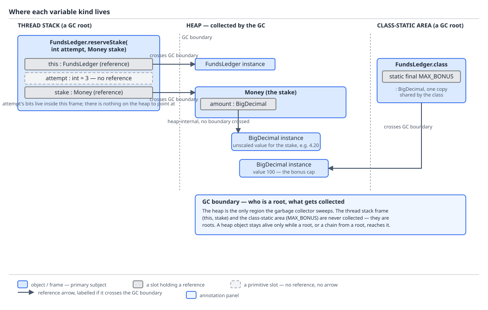

# 03 Java Core — Reference types and the object model — BASICS (§1.4, §1.12, 1.4.1–1.4.10, 1.12.1, 1.12.2)

**Target version: Java 21 LTS.** | **Part 1 of 5** | [Index](../00-index.md)
Previous: [Indified concatenation](../strings/04b-internals-indified-concat.md) · Next: [`equals`, `hashCode` and the `Object` methods](01b-equals-hashcode-and-object-methods.md)

## 1. The four reference kinds and the shape of the reference world (1.4.1, 1.4.5, 1.4.7)

Picture the type system as a diamond. At the very top sits `Object` — every reference type is a descendant of it, no exceptions. At the very bottom sits a type with no name you can write in source: the null type, the type of the literal `null`, which is a subtype of every reference type and has no instances of its own except `null` itself. Between those two poles sit four different *kinds* of reference type, and "kind" here means something precise: the JLS classifies every reference type as exactly one of class, interface, array, or type variable. Everything you declare with `class`, `interface`, `enum`, `record`, `@interface`, `T[]`, or a generic type parameter `<T>` is one of these four, and nothing else exists.

### Why it exists

A single root type is what makes `Object[] everything`, `List<Object>`, reflection, and `hashCode`/`toString`/`equals`-as-universal-operations possible at all. If `String` and `ClientId` and `int[]` did not share a common ancestor, a method that wants to log "whatever you hand me" would need one overload per type family instead of one parameter of type `Object`. The four-way split into class/interface/array/type-variable exists because each kind has a genuinely different runtime representation and a genuinely different subtyping rule, and the JLS has to be explicit about which rule applies to which kind — array subtyping in particular is not derivable from class subtyping, it is a separate rule bolted on.

### The mechanism

| Reference kind | Declared with | Example from QuizStakes | Subtyping rule |
|---|---|---|---|
| Class | `class`, `enum`, `record` | `FundsLedger`, `Money`, `ClientId` | Direct superclass chain (`extends`), terminating at `Object` |
| Interface | `interface`, `@interface` | `Verdict` (sealed), an annotation type | Declared `extends` on other interfaces; every interface also has `Object` as an implicit supertype for its abstract methods' erasure purposes |
| Array | `T[]` for any type `T` | `Restriction[]`, `TimedRestriction[]` | Covariant on the element type, described below — the one non-obvious rule |
| Type variable | `<T>` | the `T` in `List<T>`, in `Verdict<T extends A & B>` | Bounded by its `extends` clause, defaulting to `Object` |

Enums and records are not a fifth kind — the JLS explicitly says an enum declaration is a special form of `class` declaration (implicitly `final`, implicitly extending `java.lang.Enum<E>`), and a record declaration is a special form of `class` declaration too (implicitly `final`, implicitly extending `java.lang.Record`). Annotation types are a special form of `interface` declaration. So `StatusCode` if declared as a record is a class; `@Deprecated`-style annotations are interfaces. This matters the moment someone asks "can a record extend another class" — no, because it is already a class extending `Record`, and Java has no multiple class inheritance.

1.4.5 folds into this picture directly: `Object` sits at the top of *all four* kinds, not just classes. An array type's superclass, per JLS §10.8, is `Object`, and an array type additionally implements `Cloneable` and `java.io.Serializable` — which is why `int[].getClass().getSuperclass()` returns `Object.class`, and why you can call `.hashCode()`, `.equals()`, `.toString()`, `.getClass()` on any array without it declaring them. Interfaces do not extend `Object` (an interface's superclass is undefined, since interfaces do not have implementation inheritance from `Object`), but every *class that implements* an interface still supplies `Object`'s methods, so calling `verdict.toString()` where `verdict` is statically typed as the `Verdict` interface still resolves — at runtime — to whatever class implements it, which itself extends `Object`. The type variable `T` is bounded, by default, by `Object`, so an unbounded generic method can always call `.equals()` or `.toString()` on a `T` without any bound at all.

Array covariance is the honest hole in the whole picture. `Restriction[]` is declared covariant with `Restriction`: if `TimedRestriction` is a subtype of `Restriction`, then `TimedRestriction[]` is a subtype of `Restriction[]`. That single rule lets you write:

```java
Restriction[] restrictions = new TimedRestriction[3];
```

which type-checks at compile time, because array subtyping mirrors element subtyping exactly. But the array on the heap is still, physically, an array of `TimedRestriction` slots — every store checks that the value being written is actually assignable to the array's *runtime* component type, not its static one. So:

```java
restrictions[0] = new Restriction(RestrictionType.STAKE_BLOCKED, RestrictionSource.ADMIN);
// throws java.lang.ArrayStoreException: quizstakes.Restriction
```

`ArrayStoreException` is the runtime patch for a compile-time hole. The compiler let the assignment through because `Restriction[]` really is a supertype of `TimedRestriction[]`; the JVM catches the actual violation on every `aastore` bytecode by comparing the stored reference's class against the array's stamped component type. Generics deliberately closed this hole for `List<T>` by refusing covariance (`List<TimedRestriction>` is not a `List<Restriction>`) — the full comparison of array covariance against generic invariance, and why `Restriction[]` was allowed to be unsafe in the first place (arrays predate generics by a decade), belongs to the arrays chapter and the generics chapter; this file only owes you that the hole exists and how it is patched at runtime.

### Gotcha

**Pitfall:** assuming a generic array creation like `new List<Restriction>[3]` would behave the same way and is merely disallowed by an overcautious compiler. It is disallowed because there is no runtime component type to check against — generics are erased, so the JVM would have nothing to compare an `aastore` against, and the covariance hole would become silently unsafe instead of loudly unsafe. `ArrayStoreException` only works because arrays retain their component type at runtime; erased generics do not, which is exactly why `List<Restriction>[]` cannot exist but `Restriction[]` can misbehave safely.

## 2. Intersection types (1.4.8) — supporting fact

A type parameter can be bounded by more than one type at once: `<T extends Comparable<T> & Serializable>`. That declares an intersection type — a `T` that must simultaneously satisfy every bound in the `&`-list, at most one of which may be a class (and it must come first), the rest interfaces. You rarely write the phrase "intersection type" yourself; you meet it in two places instead. First, in a compiler error when two branches of a ternary or a `switch` expression have unrelated static types and `javac` has to synthesize a common supertype — it reports something like `lub(DocumentVerdict, ScreeningVerdict)` internally and surfaces a type you did not write. Second, in an inferred `var` you cannot spell: `var v = condition ? (Comparable<Money> & Serializable) moneyRef : otherRef;` gives `v` an intersection type with no source-level name, so you cannot declare a field of that exact type without repeating the cast expression. The full mechanics of bounded type parameters and wildcard capture are in the generics chapter; the `var`-specific inference rules, including what happens when `var` meets a diamond or an intersection, are in `classes-and-initialization/01-basics.md`.

## 3. Where a variable actually lives (1.4.2, 1.4.3)

The mental picture: three places a piece of data can sit, and a reference variable is data too — it is not the object, it is a small fixed-width slot that *points at* an object somewhere else. Confusing "the variable" with "the object" is the single most common source of aliasing bugs, and this section is the vocabulary to stop making that mistake.

### Why it exists

A stack frame is cheap to allocate and free — it is a single pointer bump on method entry and a pointer decrement on return, with no garbage collector involvement, because its lifetime is exactly the method call's lifetime. A heap object's lifetime is not tied to any one method call — it can be handed back, stored in a field, captured in a lambda — so it needs a scheme (the garbage collector) that answers "is anything still using this" independently of any single stack frame. Static fields need a third answer again: one slot, shared by every instance and every thread, alive for as long as the class is loaded. Three different lifetime shapes need three different storage areas.

### The mechanism

Take `FundsLedger.reserveStake(ClientId clientId, Money stake)`:

```java
final class FundsLedger {
    private static final BigDecimal MAX_BONUS = new BigDecimal("100");

    StakeSplit reserveStake(ClientId clientId, Money stake) {
        int attempt = nextAttempt(clientId);
        Money bonusPortion = computeBonusPortion(stake);
        return new StakeSplit(bonusPortion, stake.subtract(bonusPortion));
    }
}
```

When a thread is executing `reserveStake`, its call stack holds one frame for this invocation. That frame's local variable array holds four slots: `this` (a reference to the `FundsLedger` instance), `clientId` (a reference, the parameter), `stake` (a reference, the parameter), and `attempt` (an `int`, holding a value directly, not a reference — there is no `int` object anywhere). Every one of the three reference slots holds the same kind of thing: a compressed oop (ordinary object pointer) — not the actual memory address in the general case, but a 4-byte encoded reference that HotSpot's compressed-oops scheme can turn into a real address by a shift, confirmed as `UseCompressedOops = true` (`{ergonomic}`) on Oracle JDK 21.0.7 for any heap under roughly 32 GB. `attempt`'s slot holds the `int` value itself — 4 bytes, no indirection, no heap object.

Follow `stake` off the stack: it points to a `Money` object living on the heap, which itself has a field `amount` of type `BigDecimal` — another reference, pointing to yet another heap object. So "the stake" is not one object; it is a chain of two heap objects reached through one stack slot. `MAX_BONUS` lives in neither the stack nor the general heap in the way an instance field would — it is a `static final` field, one slot total for the whole `FundsLedger` class regardless of how many `FundsLedger` instances exist or how many threads call `reserveStake` concurrently, stored in the class's per-class data (conceptually "the static area"; concretely, since JDK 8's removal of PermGen, this metadata lives partly in the heap-adjacent Metaspace and partly, for the reference itself, in memory the GC also scans as a root). Every thread's stack frame for `reserveStake` sees the identical single copy.

This is the compressed-oops arithmetic in one place: object header 12 bytes, reference width 4 bytes, alignment 8 bytes, ergonomic default below approximately 32 GB of heap, all measured on Oracle JDK 21.0.7 macOS aarch64 via `-XX:+PrintFlagsFinal`.



**D-011** — follow the three arrows from `reserveStake`'s stack frame: `stake` and `this` each point into the heap, `stake` lands on the `Money` object which itself holds a reference on to its `BigDecimal amount`; `attempt` has no arrow at all because it is a value, not a reference; `MAX_BONUS` sits off to the side in the class-static area, outside the per-call stack frame and outside the GC boundary drawn around the two heap objects — it is reachable, but it is not "an instance's data," it is the class's.

**[X-REF 06]** The mark word, klass pointer, and exact byte-for-byte object header layout that make compressed oops possible — and why they stop working above roughly 32 GB — are the JVM's business, not this file's: see guide 06, JVM internals, for the header layout and the `UseCompressedClassPointers` flag that rides alongside `UseCompressedOops`.

### Gotcha

**Pitfall:** believing that passing `stake` into `reserveStake` copies the `Money` object. It copies the reference — the 4-byte slot — not the object. Both the caller's variable and the parameter `stake` now point at the identical heap object, so mutating fields through one is visible through the other. This is not a special case for `Money`; it is true of every reference parameter in Java, which has no reference parameters in the C++ sense and no pass-by-reference at all — it has pass-by-value where the value being copied is, for reference types, the address slot.

## 4. `null` (1.4.4)

The mental model: `null` is not "no object" in some abstract sense, it is a specific, distinguished value that any reference-typed slot can hold, meaning "this slot points at nothing." It is assignable to a variable of type `ClientId`, `Money`, `Object`, `Restriction[]`, or any interface type — every reference type, because the null type is a subtype of all of them. It is never assignable to a variable of primitive type, because primitives have no such value — `int attempt = null;` does not compile.

### Why it exists

Every language with references needs a way to say "not yet initialized" or "deliberately absent," and Java chose one universal sentinel value rather than a per-type absence marker. The cost of that choice is the entire modern `Optional` design and a language's worth of null-checking discipline; the benefit is that every reference type gets the sentinel for free with no boilerplate.

### The mechanism

Four facts, all consequences of `null` being a value that carries no type information about what it would have pointed to:

1. **`null` is assignable to every reference type.** `ClientId clientId = null;` and `Money stake = null;` both compile, because the null type is a subtype of both.
2. **`x instanceof T` is `false` when `x` is `null`**, for any reference type `T`, with no exception and no `NullPointerException`. This is specified, not incidental, and it is exactly what makes `instanceof` the null-safe half of a hand-rolled `equals`: `other instanceof Money m` is `false` (not a throw) when `other` is `null`, so a pattern-matching `equals` implementation gets its null-check for free from the `instanceof` test. This point is picked up again, with the full `equals` contract, in [the next file](01b-equals-hashcode-and-object-methods.md).
3. **`(String) null` is a legal cast that does nothing.** A cast checks that the runtime type of the operand is assignable to the target type, or that the operand is `null` — `null` is compatible with every reference cast target, so `(String) null` succeeds and evaluates to `null`. This is not a special-cased no-op in the compiler; it falls straight out of rule 1.
4. **`null.toString()` is a `NullPointerException`, unconditionally.** Every instance method invocation first evaluates the receiver expression, then dereferences it to find the method to run; there is no object to dereference, so the JVM throws before any method body executes. Since Java 15 (JEP 358, "Helpful NullPointerExceptions"), that exception's message names the specific null expression rather than a bare stack trace line — **on by default since Java 15**, no flag needed, which is a `[VERSION-TRAP]`: older material (pre-15) tells you to opt in with `-XX:+ShowCodeDetailsInExceptionMessages`, and repeating that advice on 21 is not wrong, it is merely redundant — the flag still exists and still defaults to the helpful behavior without it.

**Insight:** rules 2 and 3 together are why "null-safe" code in Java leans so heavily on `instanceof` and casts rather than on a dedicated null-check operator — the language already made both of those operations null-tolerant by construction, long before `Optional` or `Objects.requireNonNull` existed.

### `String.valueOf(null)` — the resolved-overload trap

`String.valueOf` is overloaded, and one specific call site is a textbook most-specific-overload trap:

```java
System.out.println(String.valueOf((Object) null));   // prints the 4-character string "null"
System.out.println(String.valueOf((char[]) null));   // compiles, then throws NullPointerException at runtime
```

The bare call `String.valueOf(null)`, with no cast, resolves at *compile time* to `String.valueOf(char[])`, not `String.valueOf(Object)`, because overload resolution prefers the most specific applicable parameter type when the argument type is `null` (which is assignable to every overload), and `char[]` is more specific than `Object`. The compiler picks the overload; only then, at *run time*, does `String.valueOf(char[])` immediately dereference the array to read its length and throw a `NullPointerException`. So the ambiguity is real but it is resolved silently at compile time in a direction that then blows up at run time — the worst of both outcomes for someone reading the call site cold.

`String.valueOf(Object)`, by contrast, is defined to return the literal string `"null"` for a `null` argument (its body is `obj == null ? "null" : obj.toString()`), so casting to `Object` sidesteps both the wrong overload and the exception. The idiomatic fix in QuizStakes code that needs a display value with a domain-specific default rather than the string `"null"` is `Objects.toString`:

```java
String displayName = Objects.toString(personalDetails.displayName(), "AA-800 ACTIVATING");
```

`Objects.toString(Object, String)` returns its first argument's `toString()` if non-null, and the supplied default string otherwise — here, falling back to the status code `AA-800 ACTIVATING` as a placeholder when a client's display name has not yet been captured. `Objects.requireNonNull`, `Objects.equals`, and the rest of the `java.util.Objects` convenience surface belong to [the next file](01b-equals-hashcode-and-object-methods.md).

### Gotcha

**Pitfall:** calling `String.valueOf(clientReference)` where `clientReference` is statically typed `Object` and happens to be `null`, expecting the same behavior as calling it on a `String`-typed `null`. If the compile-time type of the argument is `Object`, overload resolution binds to `String.valueOf(Object)` and you get `"null"`; if the compile-time type is `char[]`, you get an NPE; if it is exactly `null` with no cast, you get the `char[]` overload and an NPE. The runtime value is identical (`null`) in all three cases — only the *static type at the call site* decides which overload runs, which is precisely why this belongs in an "object model" file rather than a "runtime behavior" file: it is entirely a compile-time phenomenon.

```java
Object anyReference = null;
System.out.println(String.valueOf(anyReference));   // "null" — Object overload, chosen by static type
System.out.println(String.valueOf((char[]) null));  // NPE — char[] overload, chosen by static type
```

**Why people believe it:** `valueOf` reads as "give me the string form of whatever this is," which sounds like a runtime question about the value. It is a compile-time question about the declared type of the expression, decided once, at the call site, before the program ever runs.

## 5. Identity, equality, equivalence — three different questions (1.4.6, 1.12.1, 1.12.2)

The mental model: three separate questions that happen to share vocabulary in casual speech, and a codebase that conflates them produces bugs that pass code review because "they look the same." **Identity** asks: is this literally the same object — the same slot in memory, the same thing you would get back from `System.identityHashCode`. **Equality** asks: does this type's `equals` method say these two objects are equal — a question answered entirely by whatever code that type's author wrote (or did not write). **Equivalence** asks: does the *domain* consider these two things interchangeable — a question `equals` may or may not answer correctly, because the domain's notion of "the same" and the type's notion of "equal" are only related by how carefully someone implemented `equals`.

### Why it exists

Java gives you exactly one operator, `==`, and exactly one universal method, `equals`, and lets every class decide independently what `equals` means for it. That flexibility is necessary — money, coordinates, identifiers, and mutable entities all need different equality — but it means `==` and `.equals` are never interchangeable, and neither one is guaranteed to match what a domain expert would call "the same."

### The mechanism

Three instances, one running example, from `FundsLedger`:

```java
record Money(BigDecimal amount, String currency) { }

Money reservationA = new Money(new BigDecimal("3.33"), "GBP");
Money reservationB = new Money(new BigDecimal("3.33"), "GBP");
Money reservationC = new Money(new BigDecimal("3.30"), "GBP");
Money reservationD = new Money(new BigDecimal("3.3"),  "GBP");
```

| Pair | Identity (`==`) | Equality (`.equals`) | Equivalence (domain) |
|---|---|---|---|
| `reservationA`, `reservationB` | `false` — two distinct heap allocations | `true` — a record's generated `equals` compares every component, and `BigDecimal("3.33").equals(BigDecimal("3.33"))` is `true` (same unscaled value, same scale) | Same money |
| `reservationA`, `reservationC` | `false` | `false` — `3.33` and `3.30` are unequal `BigDecimal`s regardless of currency | Different money — correctly so, 33p apart |
| `reservationC`, `reservationD` | `false` | `false` — `BigDecimal.equals` compares value **and scale**; `3.30` has scale 2, `3.3` has scale 1, so they are unequal despite representing the same numeric quantity (`compareTo` would say `0`, `equals` says otherwise) | Same money — this is the domain judgment `equals` gets wrong for this type |

`reservationC` versus `reservationD` is the sharp case: identity says no (expected — separate objects), `equals` says no (this is the surprising part — `BigDecimal` treats scale as part of its value for `equals`, even though `3.30` and `3.3` are mathematically identical), and the QuizStakes domain says yes — 3.30 pounds and 3.3 pounds are the same money by any business definition. This exact scale trap, and the rounding rule that produces the canonical stake split of 3.33 into 0.33 bonus and 3.00 cash, gets its full treatment in the numbers-and-money chapter; this file's job is only to show that `equals` and domain equivalence can diverge, and that a naive `Set<Money>` or `Map<Money, ?>` built on record `equals`/`hashCode` will silently treat `3.30` and `3.3` as distinct keys.

`==` on the four `Money` variables above always answers the identity question — it compares the two reference slots, which is a 4-byte compressed-oop comparison, and it is `true` only when both variables hold the same address. `==` on `attempt` (an `int`) compares two 4-byte values directly — no addresses involved, because primitives are never boxed unless the surrounding code forces it. Where those two behaviors collide is a boxed primitive: `Integer stakeAttempt1 = 42; Integer stakeAttempt2 = 42;` gives `stakeAttempt1 == stakeAttempt2` a value of `true`, not because integer `==` becomes value comparison, but because `Integer.valueOf(42)` — the method behind autoboxing here — returns the *same cached box* for both calls, so the two reference slots happen to hold the same address. The caching mechanism, `IntegerCache`, its `-128..127` range, and the flip at 127/128 are the wrappers-and-boxing chapter's territory; the point that belongs here is narrower: `==` never stops meaning "compare the slots," a cached box just means two different-looking expressions can land on the identical slot value.

`Object.equals`'s default body, unedited, is:

```java
public boolean equals(Object obj) {
    return (this == obj);
}
```

A class that declares no `equals` override inherits exactly this — identity comparison wearing an equality-shaped name. That is 1.12.2 stated precisely: "gains nothing from `equals`" means literally nothing, because the inherited method is defined in terms of `==`, so `newInstance.equals(newInstance)` is `true` and `newInstance.equals(anyOtherInstanceWithIdenticalState)` is `false`, for exactly the same reason `==` would say so. The full contract that a correct override must satisfy — reflexive, symmetric, transitive, consistent, and paired with `hashCode` — is [the next file](01b-equals-hashcode-and-object-methods.md)'s subject; this file's job stops at naming the default and showing why it is identity in disguise.

### Gotcha

**Pitfall:** writing `if (restriction.getType() == RestrictionType.STAKE_BLOCKED)` and reasoning about it as if `==` were doing an equality check on the restriction's data. For an `enum` constant this actually works — every reference to `RestrictionType.STAKE_BLOCKED` in the entire program is the same singleton instance, guaranteed by the enum's own class-loading mechanism, so identity and equality coincide by construction for enums. The pitfall is generalizing that habit to a non-enum reference type: `if (restriction.key() == new RestrictionKey(RestrictionType.STAKE_BLOCKED, RestrictionSource.ADMIN))` is comparing two freshly constructed, never-interned objects and will be `false` even when every field matches, because a plain constructor call never returns a cached or shared instance the way an enum constant or an `Integer` in `-128..127` does.

```java
// Wrong — works only because RestrictionType happens to be an enum
if (restriction.getType() == RestrictionType.STAKE_BLOCKED) { /* fine, by luck of the type */ }

// Same habit, different type, silently broken
RestrictionKey key = new RestrictionKey(RestrictionType.STAKE_BLOCKED, RestrictionSource.ADMIN);
if (restriction.key() == key) { /* always false — key is a fresh allocation */ }
```

```java
// Right — compare with equals for anything that is not a known-singleton type
if (restriction.key().equals(key)) { /* correct — RestrictionKey should override equals as a record or explicitly */ }
```

**Why people believe it:** enum constants train the reflex that `==` "just works" for domain values, because for enums it genuinely does — there is exactly one object per constant, ever. The reflex generalizes to every other reference type, where it is wrong the moment the object is constructed rather than looked up from a fixed, class-loading-time set.

## 6. Value-based classes (1.4.9, 1.4.10)

The mental model: a value-based class is a type the JDK is telling you to treat the way you already treat `int` or `BigDecimal` — by its contents, never by its address — even though nothing in the language stops you from asking about its address. It is a documentation-and-annotation-level promise, not a language keyword; Java has no `value class` syntax in 21 (Project Valhalla's true value types are a future JEP, not shipped in 21), so "value-based" today means "final, immutable, `equals`/`hashCode`/`toString` computed purely from state, no publicly accessible constructor, and the JDK explicitly disclaims support for identity-based operations on it."

### Why it exists

The wrapper classes (`Integer`, `Long`, `Boolean`, `Byte`, `Short`, `Character`, `Float`, `Double`), `Optional`, and the `java.time` types (`Instant`, `LocalDate`, `Duration`, and the rest) are all immutable and all cache or may cache instances internally for performance — `Integer.valueOf` reuses cached boxes, `Optional.empty()` returns a shared singleton, and `java.time` factory methods are free to do the same in a future release without breaking any documented contract. If code anywhere depended on two `Integer`s with the same value being *different* objects, or synchronized on one as a lock, that code would break the instant the JDK changed its caching strategy — and the JDK explicitly reserves the right to change it. Declaring these types value-based is the JDK telling callers, up front, "do not build anything on this type's identity, because we are not promising to preserve it."

### The mechanism

The javadoc definition of a value-based class (attached via the internal `@jdk.internal.ValueBased` annotation on these classes) requires: final and immutable — though it may contain references to mutable objects; `equals`, `hashCode`, and `toString` computed solely from the instance's state, never from its identity or any other instance's state; instances treated as equal if they are `equals`-equal, with no reliance on which specific instance you hold; no accessible constructors — only static factories (`Integer.valueOf`, `Optional.of`, `Instant.now`); and, most importantly for the pitfall below, instances are candidates for internal optimizations such as caching, sharing, and unboxing that mean **identity-sensitive operations — reference equality (`==`), identity hash code, or synchronization on the instance — may produce unpredictable results and should be avoided.**

**[RESEARCH]** This is stated in the `Integer`, `Optional`, and `java.time` javadocs as their shared value-based-class contract, and the `@jdk.internal.ValueBased` annotation is real and present in the JDK source tree on these types; the annotation's exact source-level definition and the full canonical list of every annotated type were not independently re-verified against JDK 21.0.7 source in this session, so treat the wrapper/`Optional`/`java.time` membership as documented in the public javadoc rather than as a re-derived fact.

**Pitfall:** treating a value-based class as if it were an ordinary mutable object with a stable address, in two specific ways. First, comparing two instances with `==` expecting it to answer the equality question — `Integer.valueOf(1000) == Integer.valueOf(1000)` is `false` (1000 is outside the `-128..127` cache range) while `Integer.valueOf(100) == Integer.valueOf(100)` is `true`, and both statements are "correct" per the contract because the contract never promised identity behavior either way — you were told not to ask. Second, and worse, synchronizing on one:

```java
Integer stakeAttemptCounter = attempt;   // a per-client stake-attempt counter, boxed
synchronized (stakeAttemptCounter) {     // real bug
    processReservation(clientId, stakeAttemptCounter);
}
```

**Why it is a real bug, mechanically:** the monitor being acquired is whichever object `stakeAttemptCounter` currently points at. If `attempt` is a small `int` inside the cache range, `stakeAttemptCounter` is the *shared, JVM-wide cached box* for that value — meaning some entirely unrelated subsystem elsewhere in the process that also happens to box the same small integer, for an entirely unrelated purpose, is contending on the exact same monitor, with no logical relationship between the two critical sections beyond an accidental numeric coincidence. If `attempt` is outside the cache range, or if code re-boxes the value on a later line, `stakeAttemptCounter` now refers to a *fresh, unshared* box, and code that thought it was re-entering the same lock is silently acquiring a monitor nobody else holds — the mutual exclusion the `synchronized` block was written for simply does not happen. Both failure directions are real, they are opposite of each other, and neither produces a compiler warning by default in older javac versions; JDK 21's javac emits a `synchronization` lint category warning specifically for `synchronized` on a value-based class instance. **Unverified:** the exact command-line flag and the specific JDK release that introduced this lint category as opposed to merely deprecating the practice in prose — parked in Open questions below rather than named here.

**[X-REF 05]** The Java Memory Model guarantee that `synchronized` actually provides — mutual exclusion plus a happens-before edge — and why losing that edge (through the re-boxing failure mode above) is a visibility bug, not just a fairness one, belongs to the concurrency chapter; this file only owes you why the *monitor object itself* is the wrong choice here.

**Right**

```java
private final Object stakeAttemptLock = new Object();   // a dedicated, never-shared, never-reboxed monitor

synchronized (stakeAttemptLock) {
    processReservation(clientId, attempt);
}
```

A plain `new Object()` held in a `final` field is never cached, never shared across subsystems, and never silently swapped for a different instance — the three properties a lock object needs that a value-based class explicitly refuses to promise.

**Why people believe the original version is safe:** `Integer` looks like a perfectly ordinary reference type — it has fields, methods, an `equals` — and nothing in its type signature marks it as special. The `-128..127` caching behavior is usually first encountered as an `==` surprise in isolation, not connected to a broader "do not use this family of types as a lock" rule, so the specific combination of boxing plus `synchronized` slips through even in code that already knows about the `Integer` cache.

## Pitfalls

### Believing overload resolution for `String.valueOf(null)` happens at run time

**Wrong**

```java
Object clientReference = fetchClientOrNull();
System.out.println(String.valueOf(clientReference == null ? null : clientReference));
// developer expects: "prints the Object overload's 'null' either way"
```

The surprise: writing the bare literal `null` anywhere in an argument position, without a cast, always binds to the most specific overload at compile time — here `String.valueOf(char[])` — regardless of what the surrounding expression's runtime value would have been, and that overload throws `NullPointerException` rather than returning `"null"`.

**Right**

```java
System.out.println(Objects.toString(clientReference, "AA-800 ACTIVATING"));
```

**Why people believe it:** `valueOf` sounds like a runtime query about a value, and for every other argument, it is one — the ambiguity only exists for the literal `null` because that literal, and only that literal, is assignable to every overload simultaneously, forcing the compiler to pick one instead of dispatching dynamically.

### Assuming `instanceof null` throws

**Wrong**

```java
Object candidate = null;
if (candidate instanceof Money) {
    // developer avoids this path with an explicit null-check first,
    // believing instanceof would NPE otherwise
    if (candidate != null && candidate instanceof Money) { /* redundant */ }
}
```

The surprise: the redundant null-check costs nothing functionally, but the belief behind it — "`instanceof` on `null` throws" — is simply false, and it leads people to skip `instanceof`-based null-safe patterns like `if (other instanceof Money m)` inside `equals`, reaching instead for a separate `Objects.requireNonNull` guard that duplicates work `instanceof` already does for free.

**Right**

```java
if (candidate instanceof Money money) {
    // reached only when candidate is non-null AND a Money — instanceof already excluded null
}
```

**Why people believe it:** many other unguarded operations on `null` — method calls, field access, array indexing — do throw `NullPointerException`, and `instanceof` reads like "ask the object a question," which sounds like it should require a real object to ask. The JLS specifically carves out `instanceof` (and casting) as null-tolerant.

### Treating a value-based class's cached instances as a promise, not an accident

**Wrong**

```java
Optional<Bonus> firstLookup = bonusService.findActive(clientId);
Optional<Bonus> secondLookup = bonusService.findActive(clientId);
if (firstLookup == secondLookup) {
    // "if there's no bonus both times, this must be the same Optional.empty() singleton, so == is fine here"
}
```

The surprise: `Optional.empty()` happening to return a cached singleton today is an implementation detail the javadoc explicitly declines to guarantee going forward — value-based classes reserve the right to change caching strategy release to release, so code that becomes correct only because of today's caching behavior is one JDK upgrade away from silently breaking, with no compiler warning, because the code still compiles and still runs — it just returns different answers.

**Right**

```java
if (firstLookup.isEmpty() && secondLookup.isEmpty()) {
    // or, for the general case: firstLookup.equals(secondLookup)
}
```

**Why people believe it:** they tested it, and it worked — `Optional.empty()` genuinely is cached in current OpenJDK builds. The pitfall is inferring a contract from an observation of behavior that the type's own documentation says is not part of its contract.

### Reasoning about array covariance as if it were type-safe

**Wrong**

```java
Restriction[] restrictions = new TimedRestriction[3];
restrictions[0] = new Restriction(RestrictionType.STAKE_BLOCKED, RestrictionSource.ADMIN);
// compiles cleanly — developer assumes a clean compile means a safe assignment
```

The surprise: `ArrayStoreException` at the `restrictions[0] = new Restriction(STAKE_BLOCKED, ADMIN)` line, at run time, because the array's actual runtime component type is `TimedRestriction`, not `Restriction`, even though the variable holding it is statically typed `Restriction[]`. A clean compile told you nothing about this store's safety — array covariance moved the check from compile time to run time on purpose.

**Right**

```java
TimedRestriction[] restrictions = new TimedRestriction[3];
restrictions[0] = new TimedRestriction(RestrictionType.STAKE_BLOCKED, RestrictionSource.ADMIN, expiry);
// or, if genuinely heterogeneous, use a List<Restriction>, which has no analogous covariant-store hole
```

**Why people believe it:** the assignment `Restriction[] restrictions = new TimedRestriction[3]` is exactly the kind of upcast that is always safe for ordinary object references (`Restriction r = new TimedRestriction(STAKE_BLOCKED, ADMIN, expiry)` never throws), so it is natural to assume the array version inherits the same total safety — it inherits the subtyping, but not the safety, because arrays are mutable containers and generics-style invariance was not applied to them.

## Cheat sheet

| Item | Value |
|---|---|
| Four reference kinds | class, interface, array, type variable — nothing else |
| Enums, records | Special forms of `class` (implicitly extend `Enum<E>` / `Record`) |
| Annotation types | Special form of `interface` |
| Top and bottom of the type lattice | `Object` (top), the null type (bottom, subtype of every reference type) |
| Array supertype | `Object`, plus `Cloneable` and `Serializable` implicitly |
| Array covariance | `TimedRestriction[]` is a subtype of `Restriction[]`; runtime-checked per store via `ArrayStoreException` |
| Intersection type | `<T extends A & B>`; met in `lub()` compiler errors and unspellable `var` types |
| Stack slot | Local variables and parameters; primitives hold values, references hold (compressed) addresses |
| Heap object | Anything `new`-ed; lifetime governed by reachability, not by any one stack frame |
| Static field | One slot per class, in class-static storage, shared by every instance and thread |
| Compressed oop | 4-byte reference, ergonomic default (`UseCompressedOops = true`) below approximately 32 GB heap |
| Object header (compressed) | 12 bytes; `ObjectAlignmentInBytes = 8`; confirmed Oracle JDK 21.0.7 aarch64 |
| `null` assignability | Every reference type, no primitive type |
| `x instanceof T` when `x == null` | Always `false`, never throws |
| `(String) null` | Legal cast, evaluates to `null`, no exception |
| `null.toString()` | `NullPointerException`, unconditionally |
| Helpful NPE messages | On by default since Java 15 (JEP 358) — no flag needed on 21 |
| `String.valueOf(null)` (bare) | Resolves to `String.valueOf(char[])` at compile time — throws NPE at run time |
| `String.valueOf((Object) null)` | Returns the string `"null"` |
| Null-safe default display | `Objects.toString(value, "fallback")` |
| Identity | Same object — `System.identityHashCode`, `==` on references |
| Equality | What `.equals()` says — author-defined, may be identity by default |
| Equivalence | What the domain considers interchangeable — may disagree with `equals` |
| `Object.equals` default | `return this == obj;` — identity wearing an equality-shaped name |
| `==` on references | Compares the two slots (addresses) |
| `==` on primitives | Compares the two values directly |
| `==` on boxed values | Compares the boxes — coincides with value equality only inside `IntegerCache` range or other cached values |
| `BigDecimal("3.30").equals(BigDecimal("3.3"))` | `false` — scale is part of `equals`, though `compareTo` says `0` |
| Value-based class markers | Final, immutable, `equals`/`hashCode`/`toString` from state only, no public constructor, no identity guarantees |
| Value-based class members | The eight wrapper classes, `Optional`, the `java.time` types, and others |
| `synchronized (someInteger)` | Real bug — may be a shared cached box (unrelated contention) or a fresh re-box (no mutual exclusion at all) |

## Self-test

**Q1.** Why are enums and records not a fifth and sixth kind of reference type alongside class, interface, array, and type variable?

<details><summary>Answer</summary>

Because the JLS defines an enum declaration as a special form of class declaration — implicitly `final` (unless it has constant-specific class bodies) and implicitly extending `java.lang.Enum<E>` — and a record declaration as another special form of class declaration, implicitly `final` and implicitly extending `java.lang.Record`. Both are classes under the hood; "enum" and "record" describe extra compiler-generated structure (constant instances and a class hierarchy anchor for the former, canonical constructor plus accessors plus `equals`/`hashCode`/`toString` for the latter), not a new kind of reference type. Annotation types work the same way one level up: they are a special form of `interface` declaration. The four-way split (class, interface, array, type variable) is exhaustive precisely because these special forms are classified into it rather than added to it.

</details>

**Q2.** `Restriction[] restrictions = new TimedRestriction[3];` compiles. Explain exactly why the next line can still fail at run time, and name the mechanism that catches it.

<details><summary>Answer</summary>

Array types are covariant: because `TimedRestriction` is a subtype of `Restriction`, `TimedRestriction[]` is a subtype of `Restriction[]`, so the declaration itself is a legal, checked-at-compile-time upcast. But the object on the heap is still, physically, an array whose component type is `TimedRestriction` — that component type is stamped into the array's own runtime metadata at allocation and does not change because a variable pointing at it has a wider static type. Every array store (`aastore` at the bytecode level) checks the value being stored against the array's actual runtime component type, not the static type of the reference used to reach it. `restrictions[0] = new Restriction(STAKE_BLOCKED, ADMIN)` passes a plain `Restriction`, which is not assignable to the array's real component type `TimedRestriction`, so the JVM throws `ArrayStoreException` at that store. The mechanism exists because array covariance was allowed to be a compile-time hole for backward-compatibility and expressiveness reasons predating generics, and `ArrayStoreException` is HotSpot's per-store runtime patch for that hole.

</details>

**Q3.** A stack frame for `reserveStake` holds `int attempt`, `Money stake`, and `this`. A `static final BigDecimal MAX_BONUS` is declared on the class. Describe where each of these four things physically lives, and which of them the garbage collector treats as roots versus reachable-from-roots.

<details><summary>Answer</summary>

`attempt` lives directly in the stack frame's local variable array as a 4-byte `int` value — no indirection, no heap involvement. `stake` and `this` are also stack-frame slots, but each holds a compressed oop (a 4-byte encoded reference under the ergonomic default `UseCompressedOops = true` on any heap under roughly 32 GB) pointing at a separate object on the heap — `stake` at a `Money` instance, `this` at the `FundsLedger` instance running the method. `MAX_BONUS` is a `static final` field: one slot total for the whole class, living in the class's per-class storage, shared by every `FundsLedger` instance and every thread. The stack slots (`attempt`, `stake`, `this`) are themselves GC roots for this thread while the frame is active; the heap objects they point at (the `Money` instance and, transitively, its `BigDecimal amount`, plus the `FundsLedger` instance) are reachable-from-roots, not roots themselves. The static field slot for `MAX_BONUS` is also a root — for as long as the class remains loaded — independent of any thread's stack.

</details>

**Q4.** What exactly does `String.valueOf(null)` do, with no cast, and why does the fix depend on which overload you force?

<details><summary>Answer</summary>

The bare literal `null` is assignable to every applicable overload of `String.valueOf`, so overload resolution at compile time must pick the single most specific one among the candidates, and `String.valueOf(char[])` is more specific than `String.valueOf(Object)`. So `String.valueOf(null)` compiles as a call to `String.valueOf(char[])`. That method immediately reads the array's length to build the result — which requires dereferencing a `null` array — so it throws `NullPointerException` at run time. This is a purely compile-time-decided outcome: forcing the argument's static type to `Object` via a cast, `String.valueOf((Object) null)`, resolves to the other overload instead, whose body is `obj == null ? "null" : obj.toString()`, returning the four-character string `"null"` with no exception. Fixing the ambiguity means choosing which behavior you want and then making the static type of the argument match the overload that produces it — casting to `Object` for the safe path, or better, using `Objects.toString(value, "some fallback")`, which performs the null check and lets you choose the fallback text instead of accepting the hardcoded string `"null"`.

</details>

**Q5.** Two `Money(new BigDecimal("3.33"), "GBP")` instances are constructed separately. Two more, `Money("3.30")` and `Money("3.3")`, are also constructed. Work through identity, equality, and domain equivalence for both pairs.

<details><summary>Answer</summary>

For the two `3.33` instances: identity is `false` (two separate heap allocations, `==` compares distinct addresses), equality is `true` (a record's generated `equals` compares every component pairwise, and `BigDecimal("3.33").equals(BigDecimal("3.33"))` is `true` because both have the same unscaled value and the same scale), and domain equivalence is also "same" — all three questions agree here, which is the unremarkable case. For `Money("3.30")` versus `Money("3.3")`: identity is again `false`. Equality is `false`, and this is the surprising result — `BigDecimal.equals` treats scale as part of an instance's value, and `"3.30"` has scale 2 while `"3.3"` has scale 1, so despite representing the identical numeric quantity (`BigDecimal.compareTo` would return `0` for this pair), `equals` says they differ. Domain equivalence, however, says "same money" — 3.30 pounds and 3.3 pounds are indistinguishable in the business's terms. This is the case where `equals` and domain equivalence genuinely diverge, and it is why a `HashSet<Money>` built on the record's default `equals`/`hashCode` would silently store `3.30` and `3.3` as two distinct entries.

</details>

**Q6.** Why is `Object.equals`'s default behavior described as "identity wearing an equality-shaped name," and what does a class inherit if it declares no override?

<details><summary>Answer</summary>

`Object.equals`'s unedited body is `return this == obj;` — it delegates entirely to reference identity. A class with no override therefore answers "are these two instances equal" with exactly the same result `==` would give: `true` only when the two references point at the very same object, `false` for any two instances with identical field values but distinct addresses. The method's name and signature suggest a value-based equality question, but the default implementation answers an identity question instead — hence "wearing an equality-shaped name." A class inherits this default and gains nothing beyond what `==` already told it; anyone calling `.equals` on such a class, expecting content-based comparison, is silently getting identity comparison instead, which is exactly the gap a correct `equals` override (covered in the next file) exists to close.

</details>

**Q7.** Explain, mechanically, why `synchronized (someBoxedInteger)` is a real concurrency bug rather than just a style complaint, in both possible directions.

<details><summary>Answer</summary>

A `synchronized (expr)` block acquires the monitor belonging to whatever object `expr` currently evaluates to. `Integer` is a value-based class, and its factory method `Integer.valueOf` may return a shared, cached instance for small values (the `-128..127` range, guaranteed by the JLS as a minimum) — so if the boxed value being synchronized on falls in that range, the monitor being acquired is a JVM-wide shared object, and any other, entirely unrelated piece of code elsewhere in the process that happens to box the same small integer for its own purposes is contending on the identical lock, creating false contention or even deadlock risk between logically unrelated subsystems. In the other direction, if the value falls outside the cached range, or if the code re-boxes the value on a later call (autoboxing does not guarantee returning the same instance outside the cache), the "same" logical counter now refers to a fresh, unshared box each time, so two pieces of code that believe they are taking turns on the same lock are actually each acquiring a monitor nobody else holds, and the mutual exclusion the `synchronized` block exists to provide simply never happens. Both failure modes are real and are opposites of each other, and neither is visible from reading the type signature — `Integer` looks like an ordinary object with nothing marking it as an unsafe lock target.

</details>

## Open questions

- The exact javac flag name and JDK release that introduced the "synchronization" lint warning for `synchronized` on a value-based class instance. The value-based-class contract's prose (no identity-sensitive operations) is documented in the JDK javadoc, and a lint category for this exists in modern javac, but the precise flag and the release it landed in were not confirmed against primary source in this session. Settled by `javac --help-lint` output on a specific JDK 21 build, or the relevant JDK Enhancement Proposal / JDK bug ticket for the lint category.
- The complete, authoritative list of every type carrying `@jdk.internal.ValueBased` on JDK 21, beyond the wrapper classes, `Optional`/`OptionalInt`/`OptionalLong`/`OptionalDouble`, and the core `java.time` types named in the javadoc prose. Settled by grepping the JDK 21 source tree (`src/java.base`) for the annotation directly.

---

**Leaves covered:** 1.4.1–1.4.10, 1.12.1, 1.12.2 (12 leaves)
**Leaves deferred:** none
**Diagrams included:** D-011
**Target version:** Java 21 LTS
**Lines:** 440
