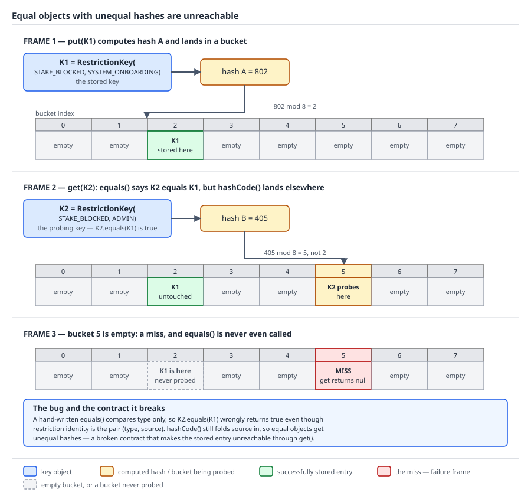
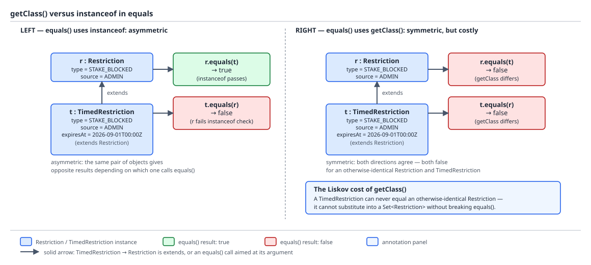

# 03 Java Core — The `equals` and `hashCode` contracts — BASICS (§1.12, 1.12.3–1.12.8)

**Target version: Java 21 LTS.** | **Part 1 of 5** | [Index](../00-index.md)
Previous: [Reference types and the object model](01-basics.md) · Next: [The rest of `Object`'s methods](01c-object-methods.md)

[The object model](01-basics.md) established that `==` compares slots, that `Object.equals` defaults to identity, and that a value-based class asks you to stop relying on identity at all. This file is about the two contracts that make a type usable as a hash-bucket key or a set member: the five clauses `equals` must satisfy, the `hashCode` contract that keeps a hash-based collection able to find what it stored, the `Objects` utility class, why arrays and `getClass()`-versus-`instanceof` are the sharpest edges in practice, and the one overloading mistake that silently defeats an override altogether. The rest of what every object inherits — `toString`, the default identity hash, `clone`, `finalize`/`Cleaner`, and `wait`/`notify`/`notifyAll` — is [the rest of `Object`'s methods](01c-object-methods.md). Everything here is mechanism — the contract text, the actual bucket arithmetic, the actual asymmetry proved on the page — not usage advice you already have from three years of Spring Boot.

## 1. The `equals` contract (1.12.3)

The mental model: `equals` is not one method, it is a promise five different callers rely on without ever re-checking it. A `HashSet`, a `TreeSet`-adjacent `List.contains`, a `Collectors.toSet()` pipeline, a cache keyed by a domain object — every one of them calls your `equals` exactly once per comparison and trusts the answer to be stable, mutual, and chainable. Break any of the five clauses and the collection does not throw; it just quietly returns the wrong answer, which is worse.

### Why it exists

Without a contract, `equals` would be whatever each class author felt like on the day, and no generic collection could be written against it. `HashSet.contains`, `HashMap.get`, `Set.of(a, b).equals(Set.of(b, a))`, `Collections.unmodifiableList(list).contains(x)` — all of these are generic algorithms over `Object`, and every one of them is only correct if every `equals` obeys the same five rules. The contract is `Object.equals`'s javadoc, not folklore, and it is normative: violate it and the JDK's own algorithms are permitted to misbehave, not just your code.

### The mechanism

The five clauses, each with the concrete way real `QuizStakes` code breaks it:

**Reflexive** — `x.equals(x)` must be `true`. Broken by comparing a mutable timestamp inside `equals` against a freshly read clock instead of a stored field:

```java
final class ReviewCase {
    private final RoundId roundId;

    ReviewCase(RoundId roundId) {
        this.roundId = roundId;
    }

    @Override
    public boolean equals(Object obj) {
        if (!(obj instanceof ReviewCase other)) {
            return false;
        }
        // Bug: compares against "now" instead of a stored field.
        return roundId.equals(other.roundId)
                && Instant.now().isAfter(Instant.now().minusSeconds(1));
    }
}
```

Two calls to `Instant.now()` a few nanoseconds apart can straddle a boundary under contention or under a stalled clock read; more realistically, any `equals` that consults live mutable state rather than the object's own fields can return `false` for `x.equals(x)` on an unlucky read. The general shape of the bug is "reads something other than `this`'s and `other`'s own final state."

**Symmetric** — `x.equals(y)` must equal `y.equals(x)`. Broken by an `instanceof` check against a supertype, which is 1.12.7 below in full; the one-line version is: if `x`'s `equals` accepts anything that `instanceof Restriction` and `y`'s only accepts `instanceof TimedRestriction`, then `x.equals(y)` and `y.equals(x)` can disagree.

**Transitive** — `x.equals(y) && y.equals(z)` must imply `x.equals(z)`. Broken by the classic three-way subclass chain: a `Restriction` compares `type` and `source`; a `TimedRestriction` extends it and additionally compares `expiresAt`, but only when *both* sides are `TimedRestriction`, falling back to the parent comparison otherwise:

```java
class Restriction {
    final RestrictionType type;
    final RestrictionSource source;

    Restriction(RestrictionType type, RestrictionSource source) {
        this.type = type;
        this.source = source;
    }

    @Override
    public boolean equals(Object obj) {
        if (!(obj instanceof Restriction other)) {
            return false;
        }
        return type == other.type && source == other.source;
    }
}

final class TimedRestriction extends Restriction {
    final Instant expiresAt;

    TimedRestriction(RestrictionType type, RestrictionSource source, Instant expiresAt) {
        super(type, source);
        this.expiresAt = expiresAt;
    }

    @Override
    public boolean equals(Object obj) {
        if (obj instanceof TimedRestriction other) {
            return type == other.type && source == other.source && expiresAt.equals(other.expiresAt);
        }
        // Falls back to the untimed comparison against a plain Restriction.
        return super.equals(obj);
    }
}
```

Let `p = new Restriction(STAKE_BLOCKED, SYSTEM_ONBOARDING)`, `t1 = new TimedRestriction(STAKE_BLOCKED, SYSTEM_ONBOARDING, expiresAtNoon)`, `t2 = new TimedRestriction(STAKE_BLOCKED, SYSTEM_ONBOARDING, expiresAtMidnight)`. Then `t1.equals(p)` is `true` (falls to `super.equals`, ignores the timestamp), `p.equals(t2)` is `true` (same reasoning, `p`'s `equals` never looks at `expiresAt`), but `t1.equals(t2)` is `false` (both are `TimedRestriction`, timestamps differ). `t1.equals(p) && p.equals(t2)` is `true`, `t1.equals(t2)` is `false` — transitivity is broken by the parent acting as a lossy bridge between two children that disagree.

**Consistent** — repeated calls to `x.equals(y)` must keep returning the same answer, provided neither object's state used by `equals` changes. Broken by comparing a field that mutates outside the object's control — the same `RestrictionKey.source` field that 1.12.4 below mutates to break `hashCode` also breaks consistency in `equals` if a `relift` between two calls flips the verdict from `true` to `false` with nothing about the *logical* comparison having changed intentionally.

**`x.equals(null)` must be `false`, never throw.** The trap is calling a method on the parameter before the `instanceof` check runs:

```java
@Override
public boolean equals(Object obj) {
    RestrictionKey other = (RestrictionKey) obj; // ClassCastException on null AND on any other type
    return type == other.type && source == other.source;
}
```

`instanceof` already returns `false` for a `null` operand in Java, which is why every correct `equals` in this file leads with `if (!(obj instanceof SomeType other)) return false;` — that one line satisfies the null clause and the wrong-type clause simultaneously, and the pattern variable `other` is unusable in the `false` branch so there's no accidental null-dereference path left.

No diagram for this concept — the two diagrams in this file are reserved for the `hashCode` contract's bucket proof and the `getClass()` versus `instanceof` asymmetry; `clone`'s shallow-copy diagram and the `finalize`/`Cleaner`/`AutoCloseable` state-machine diagram are in [the rest of `Object`'s methods](01c-object-methods.md).

**Interview:** "What does `equals` actually promise?" — reflexive, symmetric, transitive, consistent, and false-not-throwing on `null`; the practical failure mode interviewers want named is the transitive break in a subclass chain, because it is the one nobody spots by inspection.

**[X-REF 02]** What a `HashSet.add`, `HashMap.put`/`get`, and `List.contains` actually call: `HashSet`/`HashMap` compute `hashCode()` first to pick a bucket, then call `equals` only against the entries already in that bucket (a "collision chase"), so a broken `hashCode` can make `equals` unreachable before it is ever invoked — the exact proof is in 1.12.4 next. `List.contains` and `ArrayList.indexOf` call `equals` directly, linearly, with no bucketing, so they only ever expose an `equals` bug, never a `hashCode` bug. Collection-specific consequences of contract violations — a stranded key that can never be removed, a `Set` that silently accepts duplicates, `Collectors.toSet()` losing elements — are worked through fully in [02-copying-and-composite-equality.md](02-copying-and-composite-equality.md), including how records interact with all of this.

## 2. The `hashCode` contract, proved (1.12.4)

The mental model: `hashCode` is a promise about which *neighbourhood* two objects are allowed to live in, not about which house. Equal objects must live in the same neighbourhood (same bucket index) so a lookup that walks straight to that neighbourhood is guaranteed to find every candidate; unequal objects are allowed to share a neighbourhood (a collision, resolved by `equals`), but never required to.

### Why it exists

A `HashMap.get(key)` does not scan every entry. It computes `key.hashCode()`, spreads it, masks it against the table's capacity, and walks exactly one bucket's chain, calling `equals` only on the entries already there. If an equal key could hash to a different bucket than the one it was stored under, `get` would walk to the wrong bucket, find nothing, and return `null` for a key that is, by `equals`, definitely present. `Object`'s javadoc states the requirement directly: "If two objects are equal according to the `equals(Object)` method, then calling the `hashCode` method on each of the two objects must produce the same integer result." The converse — unequal objects producing different hash codes — "is not required," which is exactly the license the proof below exploits.

### The mechanism — proved, not stated

Take `RestrictionKey(RestrictionType type, RestrictionSource source)`, whose domain identity is genuinely the pair — restated from the domain: **restriction identity is the pair `(type, source)`, not the type alone**; `STAKE_BLOCKED` from `SYSTEM_ONBOARDING` lifts automatically at `AA-801 ACTIVATED`, while the same type from `ADMIN` does not, so confusing the two sources means an administrative block silently disappears at activation.

**The legal direction first**, because it is the one people wrongly fear. Suppose `hashCode` reads only `type`:

```java
final class LooseRestrictionKey {
    private final RestrictionType type;
    private final RestrictionSource source;

    LooseRestrictionKey(RestrictionType type, RestrictionSource source) {
        this.type = type;
        this.source = source;
    }

    @Override
    public boolean equals(Object obj) {
        if (!(obj instanceof LooseRestrictionKey other)) {
            return false;
        }
        return type == other.type && source == other.source; // compares BOTH fields
    }

    @Override
    public int hashCode() {
        return Objects.hash(type); // reads only ONE field
    }
}
```

`new LooseRestrictionKey(STAKE_BLOCKED, SYSTEM_ONBOARDING)` and `new LooseRestrictionKey(STAKE_BLOCKED, ADMIN)` are **unequal** (`source` differs) but hash **identically** (only `type` feeds the hash). That is legal: they collide into the same bucket, and the bucket's linear chain calls `equals` on both, which correctly says `false`, and the lookup that wants the `ADMIN` key still finds it by walking one extra link. Slower — every lookup into that bucket now compares against every other type-sharing key — but never wrong. This is the direction the contract permits: **equal hashes for unequal keys costs performance, never correctness.**

**The illegal direction — the actual proof.** The contract is violated only when two keys that `equals` says are equal land in different buckets, because then the lookup walks to the wrong bucket and never reaches the entry at all — `equals` is not wrong, `equals` is *never called*. Build it with a `hashCode` that reads a field after it has mutated:

```java
final class RestrictionKey {
    private RestrictionType type;
    private RestrictionSource source;

    RestrictionKey(RestrictionType type, RestrictionSource source) {
        this.type = type;
        this.source = source;
    }

    // Domain event: compliance reattributes an onboarding block to an admin decision.
    void relift(RestrictionSource newSource) {
        this.source = newSource;
    }

    @Override
    public boolean equals(Object obj) {
        if (!(obj instanceof RestrictionKey other)) {
            return false;
        }
        return type == other.type && source == other.source;
    }

    @Override
    public int hashCode() {
        return Objects.hash(type, source); // reads the CURRENT value of source
    }
}
```

Walk the timeline against a `HashMap<RestrictionKey, Restriction>` with the JDK's default initial capacity of 16 (so the bucket index is `hash & 15`, the low 4 bits, after `HashMap`'s internal spreading function XORs the hash with its own upper 16 bits — ignored below for readability since it does not change the argument, only the exact bit values):

1. `RestrictionKey k = new RestrictionKey(STAKE_BLOCKED, SYSTEM_ONBOARDING);` — say (illustrative only; `enum.hashCode()` is the default identity hash and is not reproducible across runs) `type.hashCode()` happens to be `742` and `source.hashCode()` happens to be `1907` at this point. `Objects.hash(type, source)` is specified as `Arrays.hashCode(new Object[]{type, source})`, which folds with seed `1`: `h1 = 31 * (31 * 1 + 742) + 1907 = 31 * 773 + 1907 = 23963 + 1907 = 25870`. Bucket index `idx1 = 25870 & 15 = 14`.
2. `restrictions.put(k, restriction);` — the entry is linked into bucket **14**.
3. Compliance reattributes the block: `k.relift(ADMIN);` — the *same object reference* that is already sitting in the map, mutated in place. Say `ADMIN.hashCode()` happens to be `503` (again illustrative). Now `k.hashCode()` recomputes to `h2 = 31 * (31 * 1 + 742) + 503 = 23963 + 503 = 24466`. Bucket index `idx2 = 24466 & 15 = 2`.
4. `restrictions.get(k)` — the map computes `k.hashCode()` **now**, gets `h2`, walks straight to bucket **2**, and finds nothing, because the entry has been sitting in bucket 14 since step 2 and a `HashMap` never re-buckets an entry on its own. The lookup misses even though `k.equals(k)` is trivially `true` and `k` is the literal object stored as the key. `equals` is never even called, because the probe address is wrong before `equals` gets a chance.

That is the illegal direction proved on the page: `k` is `equals`-equal to itself at every instant, but its hash at store time (`h1`, bucket 14) and its hash at lookup time (`h2`, bucket 2) disagree, so the map's own bucketing invariant — "an entry lives in the bucket its current hash maps to" — is violated by the mutation, not by any bug in `equals`. The general lesson, developed fully as the stranded-key bug in [02-copying-and-composite-equality.md](02-copying-and-composite-equality.md), is that **any field read by `hashCode` must be effectively immutable for the lifetime the object spends as a map or set key.**



**D-034** — `RestrictionKey(STAKE_BLOCKED, SYSTEM_ONBOARDING)` stored in a bucket computed from its original hash; an equal key (same object, after `relift`) now computing a different hash because the field it depends on changed; the entry sitting, present but unreachable, in the bucket nobody probes. The label to read closely is "`equals` is never even called" — the failure happens one step before `equals` gets involved.

```java
final class RestrictionKeyProof {
    static void run() {
        RestrictionKey k = new RestrictionKey(RestrictionType.STAKE_BLOCKED, RestrictionSource.SYSTEM_ONBOARDING);
        Map<RestrictionKey, String> restrictions = new HashMap<>();
        restrictions.put(k, "onboarding stake block");

        k.relift(RestrictionSource.ADMIN);

        System.out.println(restrictions.containsKey(k)); // false — bucketed under the old hash
        System.out.println(k.equals(k));                 // true — equals was never the problem
        System.out.println(restrictions.size());          // 1 — the entry still exists, just unreachable
    }
}
```

**Pitfall:** believing that as long as `equals` is correct, `hashCode` "roughly matching" is close enough. It is a binary contract with no partial credit: reading a mutable field, even one that also appears in `equals`, turns every map or set the key is stored in into a slow leak of unreachable-but-present entries. The fix is structural, not a bug fix — either make the hashed fields final (a record, or a `final` field set once in the constructor), or never mutate an object that is currently a live map/set key; if the domain needs to reattribute a restriction's source, remove the entry, mutate, and reinsert.

## `Objects` — the utility class (1.12.5)

`java.util.Objects` exists so nobody hand-rolls null-safe comparison and hashing logic slightly differently in every class.

| Method | Signature | Returns | What it is actually for |
|---|---|---|---|
| `equals` | `static boolean equals(Object a, Object b)` | `true` if both `null`, or `a.equals(b)` | Null-safe field comparison inside your own `equals` overrides |
| `deepEquals` | `static boolean deepEquals(Object a, Object b)` | Recurses into arrays element-by-element (via `Arrays.deepEquals`/`Arrays.equals` for primitive arrays) if both are arrays, else `Objects.equals` | The one to reach for when a field might itself be an array — plain `equals` above falls back to identity for arrays (1.12.6) |
| `hashCode` | `static int hashCode(Object o)` | `0` for `null`, else `o.hashCode()` | Null-safe hashing of a single field |
| `hash` | `static int hash(Object[] values)` | `Arrays.hashCode(values)` | Combines several fields into one hash in one line; the source declares this parameter varargs, so callers write `Objects.hash(type, source)` without building the array themselves |
| `toString` | `static String toString(Object o)` | `"null"` for `null`, else `o.toString()` | Null-safe logging of a single field |
| `toString` | `static String toString(Object o, String nullDefault)` | `nullDefault` for `null`, else `o.toString()` | Same, with a caller-chosen placeholder instead of the literal string `"null"` |
| `requireNonNull` | `static <T> T requireNonNull(T obj)` | `obj`, or throws `NullPointerException` | Constructor/setter guard with no message — cheapest form, worst diagnostics |
| `requireNonNull` | `static <T> T requireNonNull(T obj, String message)` | `obj`, or throws with `message` | Same guard with a fixed, always-built message string |
| `requireNonNull` | `static <T> T requireNonNull(T obj, Supplier<String> messageSupplier)` | `obj`, or throws with `messageSupplier.get()` | Same guard where building the message is itself expensive (formatting, concatenation) — the supplier only runs on the failure path |
| `requireNonNullElse` | `static <T> T requireNonNullElse(T obj, T defaultObj)` | `obj` if non-null, else `defaultObj` | A null-coalescing one-liner; `defaultObj` itself must not be `null` or this throws |
| `isNull` | `static boolean isNull(Object obj)` | `obj == null` | Exists for method references — `stream.filter(Objects::isNull)` — not as a replacement for writing `== null` yourself |
| `nonNull` | `static boolean nonNull(Object obj)` | `obj != null` | Same — `stream.filter(Objects::nonNull)` is the actual use case |
| `checkIndex` | `static int checkIndex(int index, int length)` | `index`, or throws `IndexOutOfBoundsException` | The same bounds check every hand-written array accessor duplicates; centralises the message format |
| `compare` | `static <T> int compare(T a, T b, Comparator<? super T> c)` | `0` if `a == b`, else `c.compare(a, b)` | Skips the comparator entirely when both references are identical — a cheap fast path for self-comparison during a sort |

**Insight:** `equals` versus `deepEquals` is the field-type question you must ask before writing any `equals` override: if a field's declared type is an array, `Objects.equals` on that field compares identity (1.12.6), and only `Objects.deepEquals` or `Arrays.deepEquals` recurses into the contents.

`Objects.hash` allocates an `Object[]` on every call to hand to `Arrays.hashCode` — cheap for an occasional comparison, measurable in a `RestrictionKey.hashCode()` called millions of times against `ClientRestrictions` snapshots; the allocation-avoiding alternative (folding the `31 * result + field.hashCode()` chain by hand, which is what a record's generated `hashCode` does) is covered with real allocation counts in [04-internals-hashcode-and-identity.md](04-internals-hashcode-and-identity.md).

## Arrays use identity `equals` (1.12.6)

An array's `equals` is inherited straight from `Object` — arrays never override it — so `array.equals(anotherArray)` is `==`, full stop, regardless of contents.

**Pitfall:** measured directly — `int[] a = {1, 2}; a.equals(a.clone());` is **`false`**, because `clone()` on an array produces a distinct object with the same contents, and identity `equals` only ever says `true` for the same reference. `Arrays.equals(a, a.clone())` is **`true`**, because `Arrays.equals` walks the elements. The fix is never `array1.equals(array2)`: use `Arrays.equals(int[] a, int[] a2)` (and its overloads for every primitive type plus `Object[]`) for a single-dimension comparison, or `Arrays.deepEquals(Object[] a1, Object[] a2)` when the elements are themselves arrays — a `Restriction[][]` snapshot, for instance. The hashing side mirrors this exactly: `Arrays.hashCode(int[] a)` (and its overloads) combines element hashes with the same `31 * result + element` fold `Objects.hash` uses internally; `Arrays.deepHashCode(Object[] a)` recurses for nested arrays.

The practical consequence reaches further than a stray `equals` call: **a class with an array field must write its own `equals`/`hashCode` by hand**, delegating to `Arrays.equals`/`Arrays.hashCode` for that field, because the compiler will not do it for you. A `Restriction[]` snapshot field inside a hand-written `ClientRestrictions` class that relies on the default `equals` is comparing snapshot-array identity, not restriction contents — two snapshots with identical restrictions in the same order compare unequal. Worse, this is exactly why **a record with an array component is a trap**: a record's generated `equals`/`hashCode` calls `Object.equals`/`Object.hashCode` component-by-component, and for an array component that means identity semantics leak straight through the record's auto-generated methods with no warning from the compiler — `record RestrictionSnapshot(Restriction[] items) { }` has broken equality the moment it is declared, silently, because nothing about record syntax hints that this one component behaves differently from every other.

## 3. `getClass()` versus `instanceof` in `equals` (1.12.7)

The mental model: two different answers to "is this the same kind of thing," and they disagree exactly when a subtype exists. `instanceof` asks "is `obj` at least a `Restriction`," which a `TimedRestriction` satisfies; `getClass()` asks "is `obj` *exactly* a `Restriction`," which a `TimedRestriction` does not. Pick the first and symmetry breaks across the hierarchy; pick the second and no subtype can ever honestly participate in `equals`, which quietly violates the Liskov substitution principle for anyone who does try.

### Why it exists

The choice only matters at all because Java lets `equals(Object)` be overridden per class in an inheritance chain with no compiler enforcement that overrides stay compatible with each other — 1.12.3's transitivity break above is the direct consequence when a chain tries to have it both ways.

### The mechanism

Reuse `Restriction`/`TimedRestriction` from 1.12.3, this time with `instanceof`:

```java
class Restriction {
    final RestrictionType type;
    final RestrictionSource source;

    Restriction(RestrictionType type, RestrictionSource source) {
        this.type = type;
        this.source = source;
    }

    @Override
    public boolean equals(Object obj) {
        return obj instanceof Restriction other && type == other.type && source == other.source;
    }

    @Override
    public int hashCode() {
        return Objects.hash(type, source);
    }
}

final class TimedRestriction extends Restriction {
    final Instant expiresAt;

    TimedRestriction(RestrictionType type, RestrictionSource source, Instant expiresAt) {
        super(type, source);
        this.expiresAt = expiresAt;
    }

    @Override
    public boolean equals(Object obj) {
        return obj instanceof TimedRestriction other
                && type == other.type
                && source == other.source
                && expiresAt.equals(other.expiresAt);
    }

    @Override
    public int hashCode() {
        return Objects.hash(type, source, expiresAt);
    }
}
```

`obj instanceof Restriction other && type == other.type && source == other.source` is the Java 16+ pattern form of `instanceof`, and it is worth writing this way for a second reason beyond brevity: `instanceof` is specified to return `false` when the left operand is `null`, so this single line is simultaneously the null-check (1.12.3's last clause) and the type-check, and `other` is scoped only to the branch where the check succeeded.

**Prove the asymmetry.** Let `r = new Restriction(STAKE_BLOCKED, SYSTEM_ONBOARDING)` and `t = new TimedRestriction(STAKE_BLOCKED, SYSTEM_ONBOARDING, someExpiry)`.

- `r.equals(t)`: `t instanceof Restriction` is `true` (a `TimedRestriction` *is* a `Restriction`), and `type`/`source` match, so `r.equals(t)` is **`true`**.
- `t.equals(r)`: `r instanceof TimedRestriction` is `false` (a plain `Restriction` is never a `TimedRestriction`), so `t.equals(r)` is **`false`**.

`r.equals(t) != t.equals(r)` — symmetry is broken, and it is broken in exactly one direction: the supertype's `equals` is too permissive about what it accepts.

**Now fix the asymmetry with `getClass()` and pay the Liskov cost:**

```java
@Override
public boolean equals(Object obj) {
    if (obj == null || getClass() != obj.getClass()) {
        return false;
    }
    Restriction other = (Restriction) obj;
    return type == other.type && source == other.source;
}
```

This restores symmetry — `r.equals(t)` and `t.equals(r)` are now both `false`, because their `getClass()` values differ — but at a real cost: no `TimedRestriction` can ever equal *any* `Restriction`, including one constructed with identical `type`/`source` fields and passed around as a plain `Restriction` reference for unrelated reasons (a generic `List<Restriction>` deduplication pass, for instance). A caller holding a `Restriction`-typed reference cannot substitute a `TimedRestriction` instance into that comparison and get a sensible answer, which is precisely what "Liskov substitution" means to give up.

**The honest resolution:** for a value type — and both `Restriction` and `RestrictionKey` are value types in this domain, identified entirely by their fields — make the class `final` (or declare it as a record) and the question evaporates, because there is no subtype left to be asymmetric with. For a genuinely extensible type where subclassing carries real behaviour, prefer composition over inheritance for the varying part: a `TimedRestriction` that *wraps* a `Restriction` plus an `expiresAt` field, rather than extends it, has its own independent `equals` with no supertype relationship to reason about at all.



**D-035** — left panel: `instanceof`, showing `r.equals(t)` succeeding while `t.equals(r)` fails, the asymmetry traced back to which class's `equals` accepts which arguments. Right panel: `getClass()`, showing both directions returning `false` and the Liskov cost labelled — a `TimedRestriction` can never equal a `Restriction`, by construction, forever.

**Pitfall:** treating this as a bug to fix rather than a design decision to make once, at the top of the hierarchy. Mixing the two strategies within one inheritance chain — one class using `instanceof`, its sibling using `getClass()` — reintroduces the asymmetry in a different shape and is strictly worse than picking either strategy consistently.

## Overloading `equals(MyType)` instead of overriding `equals(Object)` (1.12.8)

The single most common way `equals` silently does nothing: writing a method whose signature does not match `Object.equals(Object)`, so it does not override it — it overloads it, and the two live side by side.

```java
final class RestrictionKey {
    private final RestrictionType type;
    private final RestrictionSource source;

    RestrictionKey(RestrictionType type, RestrictionSource source) {
        this.type = type;
        this.source = source;
    }

    // Looks right. Compiles. Is a completely different method from Object.equals(Object).
    public boolean equals(RestrictionKey other) {
        return other != null && type == other.type && source == other.source;
    }
}
```

**Pitfall:** a `HashSet<RestrictionKey>` and every generic collection call `equals(Object)` through the `Object`-typed reference they hold internally, which resolves at compile time (overload resolution) to the *inherited* identity `equals`, not the new `equals(RestrictionKey)` overload — overload resolution is a compile-time, static-type decision, and generic collection internals are written against `Object`. A naive unit test that calls `key1.equals(key2)` directly, with both variables statically typed `RestrictionKey`, compiles against the new overload and passes, giving false confidence; the same two keys inserted into a `HashSet<RestrictionKey>` behave as if `equals` were never overridden at all, because from the set's point of view, it wasn't. `@Override` is the one-token defence: annotate the intended override and the compiler refuses to compile a method that does not actually override anything, turning this from a silent runtime bug into a compile error the moment the signature is wrong.

## Pitfalls

### `equals` and `hashCode` only need to "roughly agree"

**Wrong**

```java
final class RestrictionKey {
    private RestrictionType type;
    private RestrictionSource source;

    RestrictionKey(RestrictionType type, RestrictionSource source) {
        this.type = type;
        this.source = source;
    }

    void relift(RestrictionSource newSource) {
        this.source = newSource; // mutates a field hashCode() reads
    }

    @Override
    public boolean equals(Object obj) {
        return obj instanceof RestrictionKey other && type == other.type && source == other.source;
    }

    @Override
    public int hashCode() {
        return Objects.hash(type, source);
    }
}
```

The surprise: after `relift`, `restrictions.get(k)` returns `null` for the exact object reference stored under the old hash — the key is present (`restrictions.size()` still counts it) but permanently unreachable through that map, and `equals` is never even called because the lookup probes the wrong bucket first.

**Right**

```java
// Remove before mutating, mutate, then reinsert — never mutate a live key in place.
Restriction restriction = restrictions.remove(k);
k.relift(RestrictionSource.ADMIN);
restrictions.put(k, restriction);
```

**Why people believe it:** `equals` still "looks correct" after the mutation — `k.equals(k)` is `true`, a fresh comparison between two freshly-constructed equal keys works fine — so the bug only shows up specifically in objects that were *already* stored as map or set keys before the mutation, which is easy to miss in a unit test that never puts the mutated object into a collection.

### `instanceof` is always the safe choice in `equals`

**Wrong**

```java
class Restriction {
    final RestrictionType type;
    final RestrictionSource source;

    Restriction(RestrictionType type, RestrictionSource source) {
        this.type = type;
        this.source = source;
    }

    @Override
    public boolean equals(Object obj) {
        return obj instanceof Restriction other && type == other.type && source == other.source;
    }
}

final class TimedRestriction extends Restriction {
    final Instant expiresAt;

    TimedRestriction(RestrictionType type, RestrictionSource source, Instant expiresAt) {
        super(type, source);
        this.expiresAt = expiresAt;
    }

    @Override
    public boolean equals(Object obj) {
        return obj instanceof TimedRestriction other
                && type == other.type && source == other.source && expiresAt.equals(other.expiresAt);
    }
}
```

The surprise: `new Restriction(STAKE_BLOCKED, SYSTEM_ONBOARDING).equals(new TimedRestriction(STAKE_BLOCKED, SYSTEM_ONBOARDING, someExpiry))` is `true`, but reversing the call returns `false` — `Set.of(r).equals(Set.of(t))` and similar generic-collection comparisons then depend on which object happened to be on which side, which is exactly the kind of bug that passes code review because both individual calls "look right" in isolation.

**Right**

```java
// Either make Restriction final (no subtype, no asymmetry possible):
final class Restriction {
    // as above, unchanged otherwise
}

// Or make TimedRestriction wrap a Restriction instead of extending it:
record TimedRestriction(Restriction restriction, Instant expiresAt) { }
```

**Why people believe it:** `instanceof` is the form every style guide recommends over `getClass()` for supporting Liskov substitution, which is correct advice for a hierarchy that adds no new comparable state in the subtype — it stops being safe the moment the subtype adds a field that participates in equality, which is exactly what `TimedRestriction.expiresAt` does.

### `equals(MyType)` is a valid way to override `equals`

**Wrong**

```java
final class RestrictionKey {
    private final RestrictionType type;
    private final RestrictionSource source;

    RestrictionKey(RestrictionType type, RestrictionSource source) {
        this.type = type;
        this.source = source;
    }

    public boolean equals(RestrictionKey other) { // overload, not override
        return other != null && type == other.type && source == other.source;
    }
}
```

The surprise: `key1.equals(key2)` called with both variables statically typed `RestrictionKey` compiles and passes, but `new HashSet<RestrictionKey>().add(key1)` followed by `.contains(key2)` returns `false` for an equal key, because the set calls `equals(Object)` — the inherited identity version — through its internally `Object`-typed storage, and the new overload is never in that call path at all.

**Right**

```java
@Override
public boolean equals(Object obj) {
    return obj instanceof RestrictionKey other && type == other.type && source == other.source;
}
```

**Why people believe it:** the parameter type `RestrictionKey` reads as more precise and more type-safe than `Object`, which is a reasonable instinct everywhere except here, where `Object.equals(Object)` is the exact signature every generic collection is written against, and precision in the parameter type silently opts out of that contract instead of specialising it.

### Arrays override `equals` to compare contents, like every other type

**Wrong**

```java
final class SnapshotComparison {
    static boolean sameRestrictions(Restriction[] before, Restriction[] after) {
        return before.equals(after); // identity, not contents — always false for two distinct arrays
    }
}
```

The surprise: two `Restriction[]` snapshots taken moments apart, holding the exact same restrictions in the exact same order, compare as unequal every single time — `before.equals(after)` can only ever be `true` when `before` and `after` are literally the same array object, because arrays never override `Object.equals`. A `ClientRestrictions` audit job comparing "restrictions before" against "restrictions after" this way will report a change on every single client, every single run, whether or not anything actually changed.

**Right**

```java
final class SnapshotComparison {
    static boolean sameRestrictions(Restriction[] before, Restriction[] after) {
        return Arrays.equals(before, after); // walks the elements, using Restriction.equals per slot
    }
}
```

**Why people believe it:** every other type in the domain — `Money`, `RestrictionKey`, records in general — overrides `equals` to compare contents, so the assumption that "everything compares contents unless I wrote identity `equals` myself" is a reasonable induction from everywhere else in Java except arrays, which are a compiler-generated type that predates the `equals`/`hashCode` convention entirely and was never retrofitted to follow it.

## Cheat sheet

| Item | Value |
|---|---|
| `equals` contract | Reflexive, symmetric, transitive, consistent, `x.equals(null)` is `false` (never throws) |
| `hashCode` contract | Equal objects **must** hash equally; unequal objects hashing equally is legal (a collision) |
| Illegal direction | Equal objects, different hash — lookup probes the wrong bucket, `equals` never runs |
| Null-safe equality check | `if (!(obj instanceof RestrictionKey other)) return false;` — handles `null` and wrong type in one line |
| `instanceof` vs `getClass()` | `instanceof`: Liskov-friendly, asymmetric if a subtype adds fields; `getClass()`: symmetric, breaks Liskov |
| Fix for the asymmetry | Make the value type `final` (or a record), or use composition instead of extension |
| `Objects.equals(a, b)` | Null-safe `.equals`; falls back to identity for array fields — use `deepEquals` instead |
| `Objects.hash(Object[] values)` | `Arrays.hashCode(values)`; allocates an array per call — see guide 04 for cost |
| `Objects.requireNonNull` | Three overloads: no message, `String` message, `Supplier<String>` message (lazy, for expensive messages) |
| `Objects.requireNonNullElse` | Returns `obj` if non-null, else `defaultObj`; `defaultObj` itself must not be `null` |
| `Objects.isNull` / `nonNull` | For method references (`stream.filter(Objects::nonNull)`), not a replacement for `== null` |
| `Objects.checkIndex` | Centralised bounds check; throws `IndexOutOfBoundsException` with a standard message |
| `Objects.compare` | Skips the comparator when `a == b` — cheap self-comparison fast path |
| Arrays and `equals` | `array1.equals(array2)` is identity; use `Arrays.equals`/`deepEquals`, `Arrays.hashCode`/`deepHashCode` |
| Record + array field | Broken equality by default — the generated `equals` inherits identity semantics for that component |
| `equals(MyType)` | An overload, not an override — collections call `equals(Object)` and never see it; use `@Override` |

## Self-test

**Q1.** A `RestrictionKey`'s `hashCode()` reads a field that later mutates. Walk through exactly why a `HashMap.get` call on the same object, after the mutation, fails to find it.

<details><summary>Answer</summary>

`HashMap.put` computed the key's hash at insertion time and linked the entry into the bucket that hash selected — say bucket 14. The mutation changes the value of a field `hashCode()` reads, so calling `hashCode()` again afterward returns a different value. `HashMap.get` computes the hash fresh, at lookup time, gets the new value, and derives a different bucket index — say bucket 2 — then walks bucket 2's chain and finds nothing, because the entry has been sitting in bucket 14 the entire time; a `HashMap` never re-buckets an entry on its own after insertion. `equals` is never called during this failed lookup, because the probe reaches the wrong bucket before any comparison happens. The entry still exists (`size()` still counts it) but is permanently unreachable through `get`, `containsKey`, or `remove` called with that same key, unless something happens to probe bucket 14 by chance.

</details>

**Q2.** Why is `getClass() != obj.getClass()` a "safe but expensive" choice in `equals`, while `instanceof` is a "cheap but risky" one?

<details><summary>Answer</summary>

`getClass()` restores symmetry because it demands both sides be the *exact* same runtime class, so `r.equals(t)` and `t.equals(r)` return the same answer regardless of which side is a subclass — safe from that specific bug. The cost is Liskov substitution: no subtype can ever equal any instance of its supertype, even a subtype that adds no new comparable state, which forecloses legitimate uses like passing a `TimedRestriction` into generic code that only knows about `Restriction`. `instanceof` is Liskov-friendly (a subtype instance is accepted anywhere its supertype is expected) but is only symmetric so long as no subtype in the hierarchy adds fields that participate in equality — the moment one does, as `TimedRestriction.expiresAt` does, `instanceof`-based `equals` becomes asymmetric. The actually-safe fix in both directions is to remove the choice entirely: make the value type `final`, or use composition instead of inheritance.

</details>

**Q3.** `Objects.hash(type)` and `Objects.hash(type, source)` are used as the `hashCode()` bodies of two different classes whose `equals` both compare `type` and `source`. Which one, if either, violates the `hashCode` contract?

<details><summary>Answer</summary>

Neither violates the contract on its own — both are legal, because the contract only requires equal objects to hash equally, and both implementations are deterministic functions of the object's own final state, so two objects that `equals` says are equal (same `type` and `source`) will always produce the same hash under either implementation. `Objects.hash(type)` alone will additionally hash some unequal objects (different `source`, same `type`) to the same bucket, which is legal but costs performance — more entries land in one bucket, and `equals` runs more often to disambiguate them. The contract is violated only by a `hashCode` whose result can change between two calls on the *same logical value* without the value having genuinely changed by the type's own equality rules, which is a mutation problem (Q1), not a which-fields-to-hash problem.

</details>

**Q4.** Why does a record with an array component get broken equality "for free," with no compiler warning?

<details><summary>Answer</summary>

A record's generated `equals` and `hashCode` are built by comparing (and hashing) each component using that component's own `equals`/`hashCode`, exactly as if a hand-written implementation had called `Objects.equals` and `Objects.hash` component by component. For an array-typed component, "that component's own `equals`" is `Object.equals`, which arrays never override — so the generated record `equals` compares that component by reference identity, not contents, silently, because nothing in record syntax singles out array-typed components as different from any other component. `record RestrictionSnapshot(Restriction[] items)` therefore has an `equals` where two snapshots holding identical restrictions in the identical order are unequal unless they share the exact same array object, and the compiler gives no diagnostic, because generating this exact behaviour is precisely what the record specification says to do.

</details>

**Q5.** `int[] a = {1, 2}; a.equals(a.clone())` measures `false`, while `Arrays.equals(a, a.clone())` measures `true`. Does the first result mean arrays violate the `equals` contract?

<details><summary>Answer</summary>

No — arrays satisfy the `equals` contract perfectly, because they never override `Object.equals` at all, so `array.equals(anotherArray)` is exactly `array == anotherArray`, and identity comparison trivially satisfies reflexivity, symmetry, transitivity, consistency, and the null clause. What looks like a bug is a mismatch between the contract (which every type must satisfy) and the domain semantics a reader intuitively expects (which every type is free to define however it likes) — arrays chose identity semantics and the language never retrofitted content-based `equals` onto them, unlike collections, `String`, wrapper types, and records. The practical fix is never to call `array1.equals(array2)` at all: use `Arrays.equals` (or `Arrays.deepEquals` for nested arrays) for content comparison, and treat a bare `.equals` call on an array-typed variable as a design smell worth a second look.

</details>

## Open questions

- None.

---

**Leaves covered:** 1.12.3, 1.12.4, 1.12.5, 1.12.6, 1.12.7, 1.12.8 (6 leaves)
**Leaves deferred:** none
**Diagrams included:** D-034, D-035
**Target version:** Java 21 LTS
**Lines:** 585
