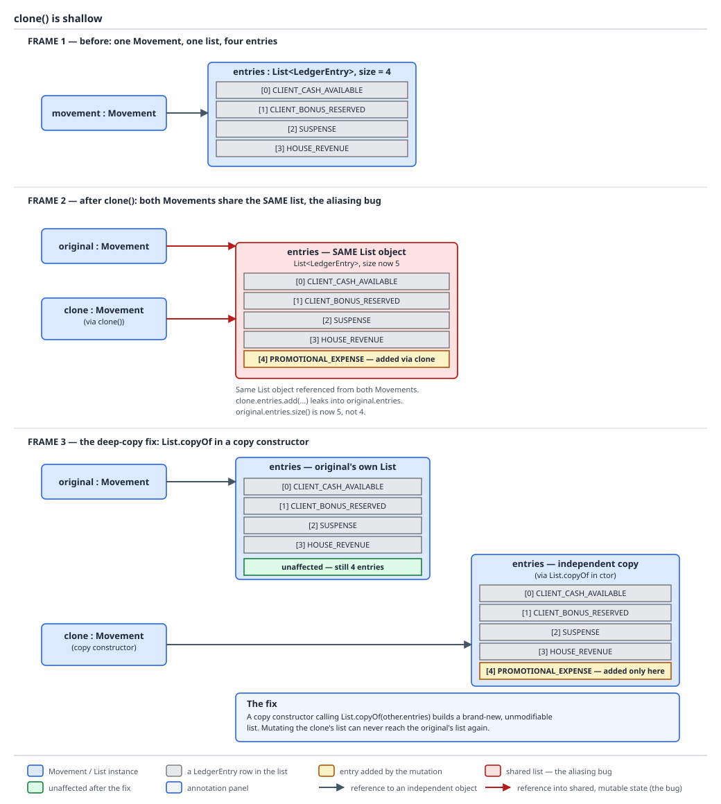
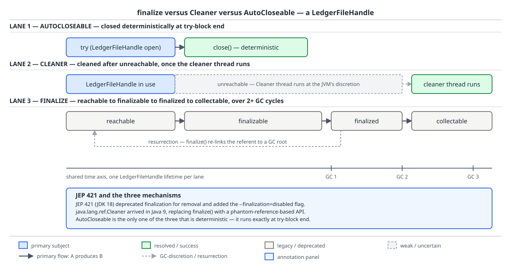

# 03 Java Core — The rest of `Object`'s methods — BASICS (§1.12, 1.12.9–1.12.19)

**Target version: Java 21 LTS.** | **Part 1 of 5** | [Index](../00-index.md)
Previous: [The `equals` and `hashCode` contracts](01b-equals-hashcode-and-object-methods.md) · Next: [Copying and cloning](02-copying-and-composite-equality.md)

[The `equals` and `hashCode` contracts](01b-equals-hashcode-and-object-methods.md) covered the two promises that make a type usable as a hash-bucket key or a set member. This file covers everything else every Java object inherits from `Object` whether it asked for it or not: the debugging fallback `toString`, the `final` `getClass()` and the two everyday cases where it reports a class you never wrote, the default identity `hashCode` and the proof that it is not a memory address, `clone`'s broken shallow-copy contract and the copy-constructor replacement, `finalize`'s deprecated four-state lifecycle and its `Cleaner`/`AutoCloseable` replacements, and the `wait`/`notify`/`notifyAll` monitor primitives that exist because every object was designed to double as a lock. Everything here is mechanism, at the same INTERNALS depth as the contracts before it.

## `toString`: override it on anything that reaches a log (1.12.9)

**[SOURCE]** — the real implementation, `Object.toString`, is one line:

```java
public String toString() {
    return getClass().getName() + "@" + Integer.toHexString(hashCode());
}
```

Read it: `getClass().getName()` is the fully-qualified class name (`com.quizstakes.ledger.Movement`, not the simple name); `hashCode()` is whatever the actual override returns — if the class does not override `hashCode` either, this is the identity hash from 1.12.11 below; `Integer.toHexString` renders it unsigned in hex, which is where the familiar `Movement@1b6d3586` shape comes from. Nothing here is unique or stable across runs, and none of it says anything about the object's state — it exists purely so `toString()` never returns `null` or throws for a class that forgot to override it.

The practical rule: override `toString` on any type that reaches a log line, an exception message, or a debugger watch — which in this domain is essentially every aggregate (`Movement`, `Restriction`, `PaymentIntent`) and every value type (`Money`, `RestrictionKey`). Keep it cheap (no I/O, no database calls hiding behind a lazy field) and non-throwing (never let a `toString` override itself throw an exception, because logging frameworks call it from contexts that will swallow or mis-render the failure). Never put money amounts or personal data in a `toString` unredacted — `Movement.toString()` should render `Money` as an opaque reference or a masked amount if it can end up in a log line that isn't access-controlled, not the raw `BigDecimal`. A record generates a `toString` for you automatically (`RestrictionKey[type=STAKE_BLOCKED, source=SYSTEM_ONBOARDING]`), which is exactly why records are the default choice for anything that both needs value semantics and gets logged. `[X-REF 20]` — log-line discipline (structured fields versus string interpolation, what belongs in a log versus an audit trail) is covered in guide 20 Observability; the one fact that belongs here is that `toString` is very often what ends up in that log line whether or not the author intended it, because string concatenation and most logging frameworks call it implicitly.

## 4. `Object`'s eleven members (1.12.19, 1.12.10, 1.12.18)

The mental model: every Java object is handed eleven methods it never asked for, and the shape of those eleven — which are `final`, which are `native`, which are `protected` — is a fossil record of two decades of decisions bolted onto the one class every other class extends whether it wants to or not.

### Why it exists

`Object` had to carry identity (`hashCode`, `equals`, `getClass`), a debugging fallback (`toString`), lifecycle hooks (`clone`, `finalize`), and monitor primitives (`wait`, `notify`, `notifyAll`) because in the original Java memory model every object doubled as a lock, and the language had no other place to hang universally-available operations. Nothing on this list was added after Java 1.0 except `getClass`'s generics signature in 5.0 — this is the original set, and the language has spent releases since (records, `Cleaner`, virtual threads) building better answers *around* it rather than removing anything from it, because removing a public method from `Object` would break every class file ever compiled.

### The mechanism — `javap -p java.lang.Object`, JDK 21.0.7

**[SOURCE]**

```
public class java.lang.Object {
  public java.lang.Object();
  public final native java.lang.Class<?> getClass();
  public native int hashCode();
  public boolean equals(java.lang.Object);
  protected native java.lang.Object clone() throws java.lang.CloneNotSupportedException;
  public java.lang.String toString();
  public final native void notify();
  public final native void notifyAll();
  public final void wait() throws java.lang.InterruptedException;
  public final void wait(long) throws java.lang.InterruptedException;
  private final native void wait0(long) throws java.lang.InterruptedException;
  public final void wait(long, int) throws java.lang.InterruptedException;
  protected void finalize() throws java.lang.Throwable;
}
```

Read every line. `public java.lang.Object();` is the no-arg constructor every subclass's constructor eventually calls via an implicit or explicit `super()`. `public final native java.lang.Class<?> getClass();` — `final` because letting a subclass override it would let an object lie about its own runtime type, `native` because it reads the class pointer straight out of the object header rather than executing any bytecode. `public native int hashCode();` — `native`, no `final`: every subclass is free to override it, and the JVM's built-in implementation is 1.12.11 below. `public boolean equals(java.lang.Object);` — not `native`, because `Object`'s own `equals` is written in Java (`return this == obj;`) and only becomes interesting once overridden. `protected native java.lang.Object clone() throws java.lang.CloneNotSupportedException;` — `protected` so an arbitrary caller cannot invoke it on an arbitrary object, `native` because it performs a raw field-by-field bitwise copy, and it throws a *checked* exception, covered fully in 1.12.12–1.12.13 below. `public java.lang.String toString();` — plain Java, shown above. `public final native void notify();` and `public final native void notifyAll();` — `final` because the JVM's monitor-wakeup semantics cannot be second-guessed by a subclass, `native` because they manipulate the monitor's wait-set directly. `public final void wait() throws java.lang.InterruptedException;`, `public final void wait(long) throws java.lang.InterruptedException;`, and `public final void wait(long, int) throws java.lang.InterruptedException;` — all three `final`, all three overloads of the same operation (no-arg, millisecond timeout, millisecond-plus-nanosecond timeout). `private final native void wait0(long) throws java.lang.InterruptedException;` is new machinery visible in the disassembly: on JDK 21, `wait(long)` is **no longer itself `native`** — it validates its argument in Java and delegates to this private native `wait0(long)`. That split is a JDK 19–21-era implementation detail that grew out of virtual-thread support; treat it as "the native boundary moved," not as a specified change, because nothing in the `Object` javadoc documents `wait0` at all — it is an implementation artifact, not part of the API. `protected void finalize() throws java.lang.Throwable;` — `protected`, not `final`, not `native` (an empty Java body on 21), and deprecated for removal, covered fully in 1.12.15–1.12.17 below.

Tallying: **eleven declared members** in the visible API (`getClass`, `hashCode`, `equals`, `clone`, `toString`, `notify`, `notifyAll`, `wait()`, `wait(long)`, `wait(long, int)`, `finalize`) plus the no-arg constructor, which `javap -p` also lists but which is not one of the traditional "eleven." **`final`:** `getClass`, `notify`, `notifyAll`, and all three `wait` overloads — six of the eleven, chosen because their semantics are load-bearing for the memory model or the type system and cannot safely vary per subclass. **Overridable:** `hashCode`, `equals`, `toString` (all `public`) and `clone`, `finalize` (both `protected`, a visibility choice that itself signals "override with care, do not call carelessly"). **`native`:** `getClass`, `hashCode`, `clone`, `notify`, `notifyAll`, and the private `wait0` — six methods that reach into the JVM's own internals (the class pointer, the identity hash generator, the raw object copy, the monitor's wait-set) rather than being expressible in bytecode alone.

No diagram for this concept — the `hashCode` contract's bucket proof and the `getClass()`/`instanceof` asymmetry are diagrammed in [the `equals` and `hashCode` contracts](01b-equals-hashcode-and-object-methods.md); the two diagrams in this file are reserved for `clone`'s shallow copy and the `finalize`/`Cleaner`/`AutoCloseable` state machine. The eleven-member list is read straight off the `javap` output above with no picture needed.

### `getClass()` is `final`, and what that guarantees (1.12.10)

Because `getClass()` cannot be overridden, it cannot be spoofed — whatever the JVM actually instantiated is what `getClass()` reports, always, which is why `getClass()` (rather than, say, an object's own claimed type field) is the right tool for the `equals` strategy discussed in [the `equals` and `hashCode` contracts](01b-equals-hashcode-and-object-methods.md) (1.12.7). But "cannot lie" does not mean "reports the name you wrote in your source file." Two everyday cases report a class you never declared:

A Spring-managed `AccountActivation` bean that needs proxying (an `@Transactional` method, an AOP advice) is frequently backed by a CGLIB-generated subclass rather than the class itself, and `getClass()` on the proxy reports something in the shape `AccountActivation$$SpringCGLIB$$0` — a real, loaded class that extends `AccountActivation`, generated at startup, not the class whose source you wrote. A `PaymentService` lambda used as a functional interface implementation — say, a `Runnable` or a domain-specific handler passed to `ReserveStake` — has no source-level class at all; `getClass()` on it reports a synthetic name ending in a hex hash, generated by `LambdaMetafactory` as a hidden class at the call site the first time it runs, with the hash differing between JVM runs and even between separate executions of the same call site.

```java
interface StakeSettlementHandler {
    void settle(RoundId roundId);
}

final class LambdaClassNameDemo {
    static void report() {
        StakeSettlementHandler handler = roundId -> System.out.println("settled " + roundId);
        System.out.println(handler.getClass().getName());
        // A synthetic name ending in a hex hash, generated by LambdaMetafactory at this call site.
        // Not stable across JVM runs, and there is no .java file anywhere that declares this class.
    }
}
```

**Pitfall:** writing `if (obj.getClass() == AccountActivation.class)` as a guard, expecting it to catch every legitimate `AccountActivation` instance in production, and having it silently fail for every proxied instance Spring hands you — the proxy genuinely is-a `AccountActivation` (it extends it), so `instanceof AccountActivation` is `true`, but its `getClass()` is the CGLIB subclass, never the exact literal you compiled against. Anywhere Spring might be proxying the type, `instanceof` is the only check that survives, which is one more argument, beyond [the `equals` and `hashCode` contracts](01b-equals-hashcode-and-object-methods.md)'s Liskov point (1.12.7), for preferring it inside `equals`.

**[X-REF 07]** Full mechanics of dynamic proxies and CGLIB subclassing — how `AccountActivation$$SpringCGLIB$$0` gets bytecode-generated at context startup, why `@Transactional` needs it, and the JDK-proxy-versus-CGLIB choice for interface-backed versus class-backed beans — belongs to guide 07 Spring core; the one fact that belongs here is that `getClass()` is exactly the tool that exposes the proxy's existence, because it is the one method a proxy cannot hide behind inheritance.

### `hashCode()`'s default is a JVM identity hash, not the address (1.12.11)

`Object`'s built-in `hashCode()` — the one every class inherits until it overrides it — returns a JVM-generated identity hash, stored in the object's mark word, and it is **not** the object's memory address, even though it looks like one and even though it is popularly called "the memory address" in casual conversation and in some older blog posts.

**Pitfall:** relying on the default hash as a stand-in for "where the object lives" — code that logs `Integer.toHexString(obj.hashCode())` and treats two runs producing different-looking values as evidence the object moved is drawing a real conclusion (the value does differ across allocations, and does stay stable across GC-driven relocation) but for the wrong reason: the value is generated once, on first use, by a JVM-internal algorithm, not derived from the pointer, and it does not need to be recomputed after a compacting collector moves the object precisely because it was never the address to begin with. Under `-XX:hashCode=4` (an experimental, address-based generation mode, requiring `-XX:+UnlockExperimentalVMOptions`), two consecutively allocated `Object`s report identity hashes exactly 16 apart — the TLAB bump for two 16-byte objects — which *is* address-shaped. Under the production default mode (`hashCode=5`, a thread-local xor-shift generator), the same two objects report values with no such 16-apart relationship at all, which is the proof that the default identity hash is a generated number, not the address it superficially resembles. The generation algorithm, the mark word's exact bit layout, `IdentityHashMap`, and the full set of `-XX:hashCode` modes are [04-internals-hashcode-and-identity.md](04-internals-hashcode-and-identity.md)'s territory — this file only needs the fact and the one-line proof above to avoid repeating the address myth.

### `wait`, `notify`, `notifyAll`, and why they are on `Object` at all (1.12.18)

They are here because in Java's original 1995 design, **every object could be a monitor** — `synchronized` is a keyword that works on any object reference, not a method call on some separate `Lock` type, so the wait/notify machinery that makes `synchronized` blocks useful for producer/consumer coordination had nowhere else to live. That design choice is also why these three are on the list of six `final` methods: their semantics are load-bearing for the language's built-in locking, not something a subclass could safely customise.

The mandatory shape, one paragraph: a thread must hold the object's monitor before calling any of `wait`/`notify`/`notifyAll`, or the JVM throws `IllegalMonitorStateException`; a waiting thread must re-check its condition in a `while` loop, never an `if`, because `notifyAll` wakes every waiter regardless of which specific condition became true, and because the JVM is permitted to deliver **spurious wakeups** — a `wait` returning with no `notify` having happened at all — a `while` loop that re-tests the condition is the only shape that is correct under both circumstances; `notify` wakes one arbitrary waiting thread while `notifyAll` wakes all of them, and `notify` is almost never the right choice unless every waiter is interchangeable, because an arbitrarily-chosen thread might not be the one whose condition actually became true.

```java
final class ReservationSlot {
    private boolean reserved;

    synchronized void awaitFree() throws InterruptedException {
        while (reserved) {
            wait(); // must be in a while loop: spurious wakeups and notifyAll both demand it
        }
        reserved = true;
    }

    synchronized void release() {
        reserved = false;
        notifyAll(); // notify() would risk waking a thread whose condition still doesn't hold
    }
}
```

`[X-REF 05]` — the full concurrency picture (why `wait`/`notify` are considered a low-level primitive today, the happens-before edges they establish, how they interact with `synchronized` versus `ReentrantLock`) belongs to guide 05 Concurrency. The modern answer that belongs here in one sentence: `java.util.concurrent.locks.Lock` and its paired `Condition` (`newCondition()`, `await()`, `signal()`, `signalAll()`) do exactly what `synchronized`/`wait`/`notifyAll` do, without the requirement that the lock and the condition be the same object, and without the historical footgun of forgetting the `while` loop being quite so easy to hit, because `Condition.await()`'s javadoc repeats the same warning at the call site.

## 5. `clone` and why it is broken (1.12.12, 1.12.13, 1.12.14)

The mental model: `Cloneable` is a permission slip, not a contract — implementing it changes what a method on a completely different class (`Object.clone`) is allowed to do, and the interface itself declares nothing at all.

### Why it exists

Before generics and before copy constructors were idiomatic, `clone()` was the platform's answer to "give me a new object with the same field values" without the caller needing to know the object's concrete runtime type — useful for arrays and for polymorphic copying where a caller only has a `Restriction` reference and wants a copy of *whatever it actually is*, `Restriction` or `TimedRestriction`, without a chain of `instanceof` checks. `Cloneable` is how a class opts in: `Object.clone()` checks, at the native level, whether `this instanceof Cloneable`, and throws `CloneNotSupportedException` if not — the interface has no members at all; its sole job is being a marker `instanceof` can test.

### The mechanism

`Object.clone()` performs a raw field-by-field copy of the object's memory — every field, primitive or reference, copied bit for bit into a freshly allocated block of the same runtime class. It is **shallow**: a reference field is copied as a reference, so the clone and the original point at the *same* referenced object. It **bypasses every constructor** — no `Movement` constructor runs, so any invariant a constructor would have checked (a non-null list, a validated amount) is simply never checked on the clone; whatever bit pattern the original had, the clone has too, checked or not. `final` fields cannot be reassigned inside `clone()` even when you want to deep-copy them, because `clone()` is not a constructor and `final` fields are already set by the raw copy — a `final List<LedgerEntry>` field cannot be replaced with a defensively-copied list without either dropping `final` or resorting to reflection, which is exactly the kind of contortion that signals the mechanism is wrong for the job.

```java
final class Movement implements Cloneable {
    private final List<LedgerEntry> entries;

    Movement(List<LedgerEntry> entries) {
        this.entries = new ArrayList<>(entries);
    }

    List<LedgerEntry> entries() {
        return entries;
    }

    // Object.clone()'s default behaviour, invoked explicitly here for illustration —
    // this is what "just implementing Cloneable and calling super.clone()" actually gets you.
    Movement shallowClone() throws CloneNotSupportedException {
        return (Movement) super.clone();
    }
}
```

`Movement`'s `entries` field is `final`, so `shallowClone()`'s raw copy hands the clone the *same* `List<LedgerEntry>` reference the original holds — a mutation through either `Movement`'s `entries()` accessor (adding a `CLIENT_CASH_AVAILABLE` debit entry, say) is visible through both objects, because there is exactly one list. This is not a corner case; it is the default and only behaviour `Object.clone()` provides, for every reference field, on every class.



**D-036** — a `Movement` holding a `List<LedgerEntry>`, its shallow clone pointing at the identical list object, a mutation through one arm visible through the other, and the deep-copy fix that replaces the shared reference with a fresh list.

**The correct form, if `clone` must exist at all**, uses a covariant return type, calls `super.clone()` to get the raw copy, and then deep-copies every mutable field by hand:

```java
final class Movement implements Cloneable {
    private final List<LedgerEntry> entries;

    Movement(List<LedgerEntry> entries) {
        this.entries = new ArrayList<>(entries);
    }

    List<LedgerEntry> entries() {
        return entries;
    }

    @Override
    public Movement clone() {
        try {
            Movement copy = (Movement) super.clone();
            // entries is final, so this line only compiles because clone() rebuilds the whole
            // object via reflection-free field copy, not because reassigning copy.entries is legal —
            // it genuinely is not, which is why a final List field forces the copy constructor below.
            return copy;
        } catch (CloneNotSupportedException e) {
            throw new AssertionError("Movement implements Cloneable", e);
        }
    }
}
```

That comment is the point, not a workaround: a `final List<LedgerEntry> entries` field **cannot** be reassigned inside `clone()` at all — the line `copy.entries = new ArrayList<>(entries);` does not compile once `entries` is `final`, which means the deep-copy fix for a `final` field genuinely requires dropping `final`, and dropping `final` on a field that should never change after construction is its own regression. `CloneNotSupportedException` is a **checked** exception (1.12.13) declared on a method essentially nobody wants to call directly and that most overrides of `clone()` cannot possibly throw (a class that implements `Cloneable` and overrides `clone()` can never see the exception `super.clone()` throws, since that exception only fires for classes that *don't* implement `Cloneable`), which is why the idiomatic override catches it and rethrows an unchecked `AssertionError` — checked-exception ceremony for a condition the override itself has already made impossible.

### The replacement: copy constructors and static copy factories (1.12.14)

The fix that sidesteps every problem above at once is not a better `clone()` — it is not using `clone()`. A copy constructor runs exactly like any other constructor (invariants checked, `final` fields set normally, no reflection-adjacent tricks) and gets to decide, field by field, which fields to share and which to deep-copy:

```java
final class Movement {
    private final List<LedgerEntry> entries;

    Movement(List<LedgerEntry> entries) {
        this.entries = new ArrayList<>(entries); // defensive copy, decided once, at construction
    }

    // Copy constructor: an ordinary constructor, invariants intact, no Cloneable, no checked exception.
    Movement(Movement source) {
        this.entries = new ArrayList<>(source.entries); // deep enough: a fresh list of the same entries
    }

    List<LedgerEntry> entries() {
        return entries;
    }
}
```

`new Movement(original)` reads as ordinary Java, needs no interface, throws no checked exception, and — because it is a real constructor — can validate anything a `Movement` is supposed to guarantee on the way in. A static factory (`Movement.copyOf(original)`) is the same idea with a name that reads better at some call sites and the freedom to return a subtype or a cached instance. *Effective Java*'s Item 13, "Override clone judiciously," makes this exact recommendation: prefer copy constructors and copy factories over `Cloneable` in essentially all new code, reserving `clone()` for the narrow case of arrays (where `clone()` is actually well-behaved, because an array's "fields" are just its elements and the shallow copy is exactly what's wanted) or for extending an existing `Cloneable` hierarchy you cannot change. Deep-copy strategy in depth — how far "deep" should go for a graph of aggregates, when a copy constructor should itself call its fields' copy constructors — is [02-copying-and-composite-equality.md](02-copying-and-composite-equality.md)'s territory; this file only needed the replacement pattern stated once.

**Pitfall:** implementing `Cloneable` on a new class in 2026 because an older codebase in the same repository does it that way. `Cloneable` predates generics, predates the copy-constructor convention becoming idiomatic, and carries every cost above for zero benefit a copy constructor doesn't already provide more safely. The only defensible reason to implement it today is extending a hierarchy that already implements it and whose contract you cannot change.

## 6. `finalize` versus `Cleaner` versus `AutoCloseable` (1.12.15, 1.12.16, 1.12.17)

The mental model: three different answers to "run this cleanup code when nobody needs the object anymore," ordered from "the platform tries to guess when to run it and sometimes doesn't" to "you tell it exactly when."

### Why it exists

Native resources — file descriptors, socket handles — are not managed by the garbage collector at all; the GC only knows about Java objects, and a `LedgerFileHandle` wrapping a payout file descriptor for the banking partner integration (batch payout files, p50 2s to write, p99 45s, running in four windows a day) needs *something* to close that descriptor even if the caller forgets to. `finalize()` was the platform's original, and it turned out to be the wrong, answer.

### The mechanism — the state machine, and the extra-GC-cycle proof

An object with a non-trivial `finalize()` override moves through four states rather than the usual two:

**reachable** → (last strong reference dropped) → **finalizable** → (finalizer thread runs `finalize()`) → **finalized** → (an *additional* GC cycle discovers it is still unreachable) → **collectable**.

The proof that this costs "at least one extra GC cycle" is in the state transitions themselves: a plain object with no `finalize()` override goes reachable → unreachable → reclaimed in the *same* collection that discovers it is unreachable. An object with a `finalize()` override cannot be reclaimed in that collection, because the JVM must first give `finalize()` a chance to run — and running it means queuing the object to a finalizer thread and waiting, which by construction cannot happen within the collection pause that just discovered the object is unreachable. The object survives that collection (now in the *finalizable* state, artificially kept alive by the finalizer queue's own reference to it), gets finalized asynchronously, and only becomes eligible for reclamation in **some later** collection that re-discovers it unreachable — a minimum of two GC passes touch the object where a normal object needed one, and the object occupies heap for the entire gap, which on GC pause timing is unbounded because the finalizer thread's scheduling is not guaranteed at all.

**Resurrection** is the sharpest edge on this state machine: `finalize()` runs as ordinary Java code with full access to `this`, and nothing stops it from publishing `this` somewhere still reachable:

```java
final class LedgerFileHandle {
    static LedgerFileHandle resurrected;

    private final long payoutFileDescriptor;

    LedgerFileHandle(long payoutFileDescriptor) {
        this.payoutFileDescriptor = payoutFileDescriptor;
    }

    @Override
    @SuppressWarnings("removal")
    protected void finalize() {
        resurrected = this; // the object is reachable again, from a static field
    }
}
```

Once `resurrected` holds the reference, the object is back to **reachable**, indefinitely, defeating the collection cycle that was about to reclaim it — and critically, the JVM finalizes an object **at most once**: even after this object becomes unreachable again (`resurrected = null`), `finalize()` will not run a second time, so a resurrecting finalizer is a one-shot trick, not a repeatable resurrection loop, and any cleanup logic that assumed "runs every time this becomes garbage" is wrong on the second cycle.

**[RESEARCH], verified facts:** `finalize()` on JDK 21 is annotated `@Deprecated(since = "9", forRemoval = true)` and its body in `Object` is empty. JEP 421 ("Deprecate Finalization for Removal," JDK 18) is what added that deprecation and, alongside it, the `--finalization=disabled` VM flag as a pre-removal test switch (1.12.16) — a real JDK 21 accepts `--finalization=disabled` and starts normally, letting an operator verify an application does not depend on finalizers running before finalization is actually removed from a future release. `java.lang.ref.Cleaner`, the correct replacement for "run cleanup when nobody needs this object, in case the caller forgot," arrived in **Java 9**, built on `PhantomReference` — an object registered with a `Cleaner` is tracked via a phantom reference, which only clears *after* the object is otherwise unreachable, at which point the `Cleaner`'s own background thread runs the registered cleanup action exactly once. Unlike `finalize()`, a `Cleaner` action must not hold a reference to the object it is cleaning up (the reference is passed in the `Runnable`'s captured state, never the object itself), which structurally prevents the resurrection trick above.

```java
final class LedgerFileHandle implements AutoCloseable {
    private static final Cleaner CLEANER = Cleaner.create();

    // Deliberately holds no reference back to LedgerFileHandle — that reference would keep
    // the LedgerFileHandle itself reachable through the Cleaner's own bookkeeping, and the
    // Cleanable would then never fire from unreachability at all.
    private static final class FileDescriptorState implements Runnable {
        private final long payoutFileDescriptor;

        FileDescriptorState(long payoutFileDescriptor) {
            this.payoutFileDescriptor = payoutFileDescriptor;
        }

        @Override
        public void run() {
            nativeClose(payoutFileDescriptor);
        }
    }

    private final Cleaner.Cleanable cleanable;

    LedgerFileHandle(long payoutFileDescriptor) {
        this.cleanable = CLEANER.register(this, new FileDescriptorState(payoutFileDescriptor));
    }

    @Override
    public void close() {
        cleanable.clean(); // deterministic: runs now, and only once even if the GC also triggers it
    }

    private static native void nativeClose(long payoutFileDescriptor);
}
```

**The ordering that actually matters, stated once and clearly:** `AutoCloseable` plus try-with-resources first, always, because it is the only one of the three that is **deterministic** — the payout file descriptor closes at the exact `}` of the try-with-resources block, not at some GC-dependent later point, which matters directly against the domain's own numbers: four payout-file windows a day, p99 45 seconds to write, means a leaked descriptor held past its window is a real operational incident, not an eventual cleanup. `Cleaner` is the safety net for exactly one case: a native resource where the caller *might* forget to call `close()`, so the `Cleaner` registration is insurance that fires eventually if try-with-resources was skipped, never the primary mechanism. `finalize()` is never the right answer on Java 21 — it is deprecated for removal, gives no timing guarantee at all, can add an unbounded delay before reclamation, and (as proved above) can be defeated by resurrection; any code still relying on it should be migrated to `AutoCloseable` with a `Cleaner` backstop, and `--finalization=disabled` is exactly the tool for confirming a codebase no longer needs it before that migration ships.

```java
final class PayoutFileDemo {
    static void writeAndClose(long payoutFileDescriptor) {
        try (LedgerFileHandle handle = new LedgerFileHandle(payoutFileDescriptor)) {
            // write the payout batch to the banking partner's file within one of the 4 daily windows
        } // close() runs here, deterministically — no GC involved
    }
}
```



**D-037** — three lanes over one shared time axis for a `LedgerFileHandle`: the `finalize` lane showing the reachable → finalizable → finalized → collectable state machine with its resurrection edge looping back to reachable; the `Cleaner` lane showing the phantom-reference-triggered cleanup firing once, without a resurrection path available; the `AutoCloseable` lane showing `close()` firing at a single deterministic instant with no GC involvement at all. Look at where each lane's cleanup point falls relative to the "payout window closes" marker — only the `AutoCloseable` lane guarantees it happens before that marker.

**Pitfall:** choosing `finalize()` because "it runs eventually, so it's a safety net just like `Cleaner`." It is not equivalent: `finalize()` gives no bound on when "eventually" is, delays reclamation by at least one extra GC cycle for every affected object (not just the ones that leak), and can be defeated by a resurrecting override, none of which is true of `Cleaner`. If a safety net is genuinely needed, it is always `Cleaner`, never `finalize()`, on any JDK from 9 onward.


## Pitfalls

### `finalize()` is a reasonable safety net for a forgotten `close()`

**Wrong**

```java
final class LedgerFileHandle {
    private final long payoutFileDescriptor;

    LedgerFileHandle(long payoutFileDescriptor) {
        this.payoutFileDescriptor = payoutFileDescriptor;
    }

    @Override
    @SuppressWarnings("removal")
    protected void finalize() {
        nativeClose(payoutFileDescriptor); // "it'll get cleaned up eventually"
    }

    private static native void nativeClose(long fd);
}
```

The surprise: "eventually" has no bound — the descriptor can stay open through an entire payout window (p99 45 seconds to write the file, four windows a day) while the object sits in the finalizable queue waiting for the finalizer thread to get scheduled, and if a `finalize()` override anywhere in the object graph resurrects the object (1.12.15), it may never close at all, and even a well-behaved finalizer only ever runs once even if the object briefly becomes reachable and unreachable again.

**Right**

```java
try (LedgerFileHandle handle = new LedgerFileHandle(payoutFileDescriptor)) {
    // write the payout batch here
} // close() runs deterministically, right here — no GC involved
```

**Why people believe it:** `finalize()`'s javadoc historically described exactly this use case, and it took until JEP 421 (JDK 18) for the platform to formally deprecate it for removal — for most of Java's history this genuinely was the documented, recommended pattern, which is why the belief persists in code and in interview answers well past the point it stopped being good advice.

### `Cloneable` behaves like any other interface, describing a contract its implementer fulfils

**Wrong**

```java
final class Movement implements Cloneable {
    private final List<LedgerEntry> entries; // final — cannot be reassigned inside clone()

    Movement(List<LedgerEntry> entries) {
        this.entries = new ArrayList<>(entries);
    }
    // No override of clone() at all — "implementing Cloneable is enough."
}

Movement copy = (Movement) movement.clone(); // does not compile: clone() is protected on Object,
                                              // and Movement never widened its visibility or overrode it
```

The surprise: `Cloneable` declares zero methods, so implementing it changes nothing about `Movement`'s own API — `clone()` is still the `protected` method inherited from `Object`, inaccessible from outside `Movement`'s package, and even if `Movement` does override and widen it, the override inherits `Object.clone()`'s raw, shallow, constructor-bypassing behaviour by default, silently sharing the `entries` list between every clone unless the override deep-copies it by hand.

**Right**

```java
// Skip clone() and Cloneable entirely.
final class Movement {
    private final List<LedgerEntry> entries;

    Movement(List<LedgerEntry> entries) {
        this.entries = new ArrayList<>(entries);
    }

    Movement(Movement source) {
        this.entries = new ArrayList<>(source.entries);
    }
}

Movement copy = new Movement(movement); // ordinary constructor, deep-copies entries, checks invariants
```

**Why people believe it:** every other marker interface in day-to-day Java (`Serializable` is the closest analogue) genuinely does just work once implemented, with the platform handling the mechanism behind the scenes; `Cloneable` looks like the same pattern but is the one marker interface in the standard library that changes another class's method behaviour via an `instanceof` check rather than supplying any behaviour of its own.

### `getClass() == KnownType.class` is a safe way to check for an exact type

**Wrong**

```java
final class ActivationEquality {
    static boolean isPlainAccountActivation(Object candidate) {
        return candidate.getClass() == AccountActivation.class;
    }
}
```

The surprise: in production, the object Spring actually hands you when `AccountActivation` needs `@Transactional` advice is not an `AccountActivation` at all in the sense this check expects — it is a CGLIB-generated subclass, `AccountActivation$$SpringCGLIB$$0`, that genuinely `is-a` `AccountActivation` but whose `getClass()` never equals the literal `AccountActivation.class`. The check silently returns `false` for the majority of real bean instances the moment AOP proxying is in play, and it fails in exactly the environments (Spring-managed beans) where the class is most likely to be used.

**Right**

```java
final class ActivationEquality {
    static boolean isAccountActivation(Object candidate) {
        return candidate instanceof AccountActivation; // true for the proxy too — it extends the class
    }
}
```

**Why people believe it:** `getClass()` cannot be overridden or spoofed, and that genuine, useful fact — it is the right tool for symmetric `equals` in 1.12.7 — gets over-generalised into "`getClass()` tells you the exact type you compiled against," which silently stops being true the moment a framework generates a subclass behind your back, something `instanceof` was never fooled by in the first place.

### A single `if` guarding `wait()` is enough, because `notifyAll` only fires when the condition is true

**Wrong**

```java
final class ReservationSlot {
    private boolean reserved;

    synchronized void awaitFree() throws InterruptedException {
        if (reserved) {
            wait();
        }
        reserved = true;
    }

    synchronized void release() {
        reserved = false;
        notifyAll();
    }
}
```

The surprise: a thread can fall through the `if` and proceed even though `reserved` is still `true`, in two ways the JVM explicitly permits: `notifyAll()` wakes *every* waiting thread regardless of which specific condition became true, so a slot released for one waiter can wake several, only one of which should actually proceed; and the JVM is separately permitted to deliver a **spurious wakeup** — `wait()` returning with no `notify` call having happened at all. An `if` re-checks nothing after waking up, so either case lets the thread treat a stale or coincidental wakeup as a real signal and reserve a slot that is, by the time it checks, already taken again.

**Right**

```java
synchronized void awaitFree() throws InterruptedException {
    while (reserved) {
        wait();
    }
    reserved = true;
}
```

**Why people believe it:** `wait`/`notify` is taught with a "sleep until told" mental model that reads like a one-shot signal — call `wait()`, get woken exactly when your specific condition becomes true — which is close enough to correct in a toy single-waiter example that the `while` loop looks like unnecessary defensive ceremony, right up until a second waiter or a spurious wakeup appears in production.

## Cheat sheet

| Item | Value |
|---|---|
| Default `toString()` | `getClass().getName() + "@" + Integer.toHexString(hashCode())` |
| `Object`'s eleven members | `getClass`, `hashCode`, `equals`, `clone`, `toString`, `notify`, `notifyAll`, three `wait` overloads, `finalize` |
| `final` on `Object` | `getClass`, `notify`, `notifyAll`, all three `wait` overloads — six of eleven |
| `native` on `Object` | `getClass`, `hashCode`, `clone`, `notify`, `notifyAll`, private `wait0` (JDK 21 split out of `wait(long)`) |
| `getClass()` is `final` | Cannot be overridden or spoofed; proxies (CGLIB) and lambdas still report a real, loaded, but non-source class |
| Lambda `getClass()` | Synthetic name from `LambdaMetafactory`, a hidden class, not stable across JVM runs |
| Default `hashCode()` | JVM identity hash from the mark word; stable across GC; **not** the memory address |
| `Cloneable` | Marker interface, zero members; flips `Object.clone()`'s internal `instanceof` check |
| `clone()`'s defaults | Shallow copy, bypasses every constructor, `final` fields cannot be redirected inside it |
| Replacement for `clone` | Copy constructor or static copy factory — ordinary code, invariants checked, no checked exception |
| `finalize()` on 21 | `@Deprecated(since="9", forRemoval=true)`, empty body; JEP 421 (JDK 18) added `--finalization=disabled` |
| `Cleaner` | Since Java 9, `PhantomReference`-based, runs once, cannot resurrect its target |
| Cleanup priority order | `AutoCloseable` + try-with-resources first, always; `Cleaner` as a safety net; `finalize()` never |
| `wait`/`notify`/`notifyAll` | Caller must hold the monitor or `IllegalMonitorStateException`; `wait` always in a `while` loop |
| `notify` vs `notifyAll` | `notify` wakes one arbitrary waiter (safe only if all waiters are interchangeable); `notifyAll` wakes all |
| Modern replacement for wait/notify | `java.util.concurrent.locks.Lock` + `Condition` (`await`/`signal`/`signalAll`) — same shape, decoupled lock and condition |

## Self-test

**Q1.** What exactly does implementing `Cloneable` change about a class, given the interface declares no methods?

<details><summary>Answer</summary>

Nothing about the class's own API changes — no new method appears, nothing is enforced by the compiler. What changes is the behaviour of `Object.clone()`, a method declared on a completely different class: at the native level, `Object.clone()` checks `this instanceof Cloneable` before performing its raw copy, and throws `CloneNotSupportedException` if that check fails. `Cloneable` exists purely to be the object of that `instanceof` test — it is a permission slip for another class's method, not a contract the implementing class fulfils itself. This is why implementing `Cloneable` with no override at all still leaves `clone()` `protected` and inaccessible from outside the package, and why implementing it and overriding `clone()` still inherits `Object.clone()`'s shallow, constructor-bypassing copy unless the override does its own deep-copy work afterward.

</details>

**Q2.** A `finalize()` override sets `resurrected = this` on a static field. Does the object get finalized again the next time it becomes unreachable?

<details><summary>Answer</summary>

No. The JVM finalizes an object at most once, ever, regardless of how many times it cycles between reachable and unreachable afterward. Setting `resurrected = this` makes the object reachable again and prevents the collection currently in progress from reclaiming it, but if `resurrected` is later set back to `null` and the object becomes unreachable a second time, it is simply collected in the ordinary way — `finalize()` does not run a second time. This is exactly why resurrection is a one-shot trick, not a way to build cleanup logic that runs "every time this becomes garbage."

</details>

**Q3.** Why does `AutoCloseable` sit strictly above `Cleaner` in the cleanup priority order, rather than the two being interchangeable choices?

<details><summary>Answer</summary>

`AutoCloseable`, used with try-with-resources, is deterministic: the resource closes at the exact closing brace of the block, with no dependency on the garbage collector ever running, ever discovering the object unreachable, or ever scheduling a cleanup thread. `Cleaner` only fires once the object is otherwise unreachable and a `PhantomReference`-driven mechanism notices — which could be immediately or could be much later, with no timing guarantee at all, and it only exists to cover the case where a caller forgot to call `close()`. Using `Cleaner` as the *primary* mechanism means every use of the resource holds it open for an unbounded, GC-dependent length of time; using it as a backstop behind `AutoCloseable` means it only ever matters on the mistake path, which is exactly the role a safety net should play.

</details>

**Q4.** State, precisely, why a default `hashCode()` value staying the same across three `System.gc()` calls does not prove it is the object's memory address.

<details><summary>Answer</summary>

Stability across garbage collection is consistent with being a generated identity hash cached at first use — the value, once computed, is stored in the mark word and simply returned again on every later call, whether or not the object physically moved during a compaction. It would also be consistent with being the address, if the JVM never moved the object. The two hypotheses are distinguished by what happens under an address-based generation mode versus the default: under `-XX:hashCode=4` (address-based), two consecutively allocated objects report identity hashes exactly 16 bytes apart, matching the TLAB allocation step — genuinely address-shaped. Under the default mode (`hashCode=5`, a thread-local xor-shift generator), two consecutively allocated objects report values with no such relationship. Since the default mode's values do not exhibit the address-shaped 16-apart pattern that the confirmed address-based mode does, the default cannot be reading the address — stability alone was never enough to distinguish the two.

</details>

**Q5.** On JDK 21, is `wait(long)` a native method? What changed, and does it matter for how you use `Object.wait`?

<details><summary>Answer</summary>

No — on JDK 21, `wait(long)` itself is a plain (non-native) `final` method that validates its argument in Java and then delegates to a new private native method, `wait0(long)`. This split is visible directly in `javap -p java.lang.Object`'s output and grew out of JDK 19–21-era virtual-thread support work; it is an implementation detail, not a specified change — nothing in `Object`'s javadoc documents `wait0`, and the externally observable behaviour of `wait(long)` (blocking until notified, timed out, or interrupted, throwing `InterruptedException`) is unchanged. It does not change how you call or reason about `wait` at all; the only reason to know about it is that disassembling `Object` on 21 and expecting the pre-19 all-native shape will look surprising.

</details>

**Q6.** Why must a thread waiting on a condition re-check that condition in a `while` loop after `wait()` returns, rather than trusting that `wait()` only returns once the condition has become true?

<details><summary>Answer</summary>

Two independent reasons, either one sufficient on its own. First, `notifyAll()` wakes every thread currently waiting on the monitor, not just the one whose condition happens to have become true — a `ReservationSlot.release()` call wakes every thread blocked in `awaitFree()`, but only one of them should actually proceed, so every other woken thread must re-check and go back to waiting. Second, the JVM is explicitly permitted to deliver a **spurious wakeup**: `wait()` can return having received no `notify`/`notifyAll` call at all, for implementation reasons the specification deliberately leaves unconstrained. An `if` guard checks the condition once, before sleeping, and never again — either a spurious wakeup or a notify meant for a different waiter lets the thread fall through with the guarded condition still false. A `while` loop re-tests the condition every time `wait()` returns, for any reason, and only proceeds once the condition is genuinely true, which is the only shape correct under both failure modes simultaneously.

</details>

## Open questions

- None.

---

**Leaves covered:** 1.12.9, 1.12.10, 1.12.11, 1.12.12, 1.12.13, 1.12.14, 1.12.15, 1.12.16, 1.12.17, 1.12.18, 1.12.19 (11 leaves)
**Leaves deferred:** none
**Diagrams included:** D-036, D-037
**Target version:** Java 21 LTS
**Lines:** 526
