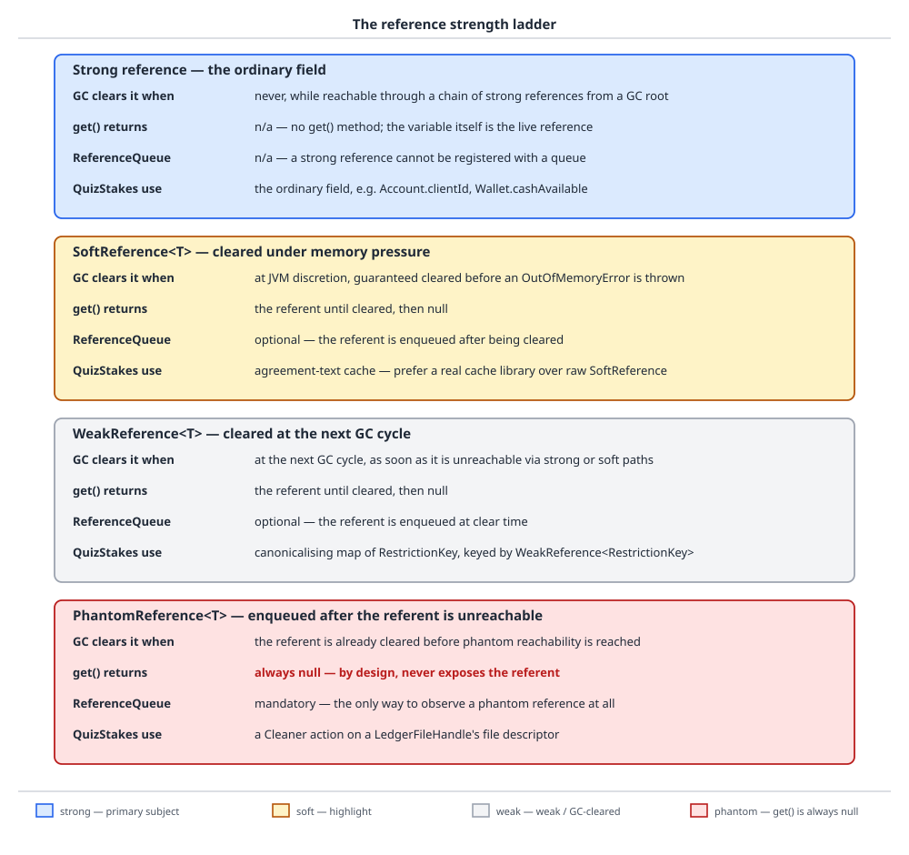

# 03 Java Core — Reachability and the reference ladder — INTERMEDIATE (§2.9, 2.9.1–2.9.3, 2.9.10)

**Target version: Java 21 LTS.** | **Part 2 of 5** | [Index](../00-index.md)
Previous: [Composite equality and ordering](02a-composite-equality-and-ordering.md) · Next: [Finalization, cleanup and leaks](03a-finalization-cleanup-and-leaks.md)

## 1. Reachability is the whole model (2.9.1)

Picture the heap as a warehouse and the garbage collector as an auditor who never asks "is this
useful" — it asks one question only: can I trace a chain of pointers to this crate starting from
a fixed list of shelves I was told to start from? Everything reachable from those shelves is
kept, no matter how useless; everything unreachable is eligible for collection, no matter how
recently it was useful. There is no other criterion. Object death in Java is not scheduled,
requested, or announced — it is the silent consequence of a graph shape.

### Why it exists

A language with explicit `free` asks the programmer to know, at the point of the call, that no
other part of the program will dereference the freed pointer afterward — a global property that
is easy to state and extraordinarily easy to get wrong at scale (the double-free and
use-after-free families of bugs). Tracing garbage collection sidesteps the question entirely by
making liveness a computable property of the object graph rather than a promise the programmer
must keep. The cost is that "when does this die" stops being observable from the language: you
get correctness, you give up a destructor.

### The mechanism

The roots the language exposes are the fixed starting shelves: a live stack frame's local
variables and operand-stack slots (each `Reservation stakeReservation = open(request)` in a
running method is a root for as long as that frame is on the call stack), `static` fields of
loaded classes (a `static Map<ApplicationId, Application>` in `ApplicationHistory` is a root for
the lifetime of the class, which in practice means the lifetime of the JVM — this is exactly why
the `static`-collection leak archetype in §2 of
[finalization, cleanup and leaks](03a-finalization-cleanup-and-leaks.md) is a leak archetype at
all), JNI global and local references held by native code, and the `Thread` objects themselves —
a running thread is a root because its own stack is a source of further roots. `[X-REF 06]` — the
actual reachability walk (tri-color marking, the write barrier that keeps a concurrent
collector's view consistent while the mutator runs) is JVM-internal machinery; guide **06 JVM
internals** works it end to end. The rule this file needs is smaller: **a leak in Java is not a
missing `free`, it is an unintended strong reference** — some root, or some object reachable from
a root, keeps pointing at something the programmer believed was done. Every leak archetype in
[finalization, cleanup and leaks](03a-finalization-cleanup-and-leaks.md)'s §2 is a specific shape
of this one sentence.

What the language does and does not guarantee about the two ends of an object's life: creation is
`new` followed by constructor chaining up to `Object.<init>`, and initialization order (instance
initializers and field initializers in textual order, then the constructor body) is specified and
predictable. Death has none of that symmetry: there is no destructor, no defined point at which
an object "dies," no guarantee that an unreachable object is ever actually reclaimed before the
process exits, and — critically for anyone tempted to build correctness on it — no way to `await`
an object's collection from application code. `finalize` and `Cleaner` — covered in
[finalization, cleanup and leaks](03a-finalization-cleanup-and-leaks.md) — are notifications that
collection *happened to* occur, never a promise that it *will*.

One sharp edge follows from this that most engineers never meet until they write JNI or
`Cleaner` code against a native resource: **an object can become unreachable while a method on it
is still executing.** If a method's only remaining use of `this` was to read a field earlier in
the method body, and the JIT can prove nothing after that point dereferences `this`, then `this`
is dead from the collector's point of view even though the stack frame is still running. For an
ordinary Java object this is invisible — there is nothing to free. For an object whose `Cleaner`
action closes a native file descriptor stored as a plain `int`, it is fatal: the descriptor is
not reachable *through* the Java object at all (that is the entire point of the correct shape
described in [finalization, cleanup and leaks](03a-finalization-cleanup-and-leaks.md)), so the
collector has no reason to keep the wrapping object alive during a long native call, the
`Cleaner` can run concurrently on its own thread, and the descriptor can be closed out from under
a payout write that is still in flight. `Reference.reachabilityFence(Object)`, added in Java 9,
is the fix: a call to `reachabilityFence(this)` after the native call forces the JVM to treat
`this` as reachable up to and including that fence, regardless of what the JIT could otherwise
prove.

```java
final class LedgerFileHandle implements AutoCloseable {
    private final int fileDescriptor;

    LedgerFileHandle(int fileDescriptor) {
        this.fileDescriptor = fileDescriptor;
    }

    void writePayoutBatch(byte[] batch) {
        try {
            nativeWrite(fileDescriptor, batch);
        } finally {
            // Without this fence, the JIT may treat `this` as dead as soon as
            // `fileDescriptor` has been read into a register, letting a concurrent
            // Cleaner close the descriptor while nativeWrite is still running.
            Reference.reachabilityFence(this);
        }
    }

    private static native void nativeWrite(int fd, byte[] batch);

    @Override
    public void close() {
        nativeClose(fileDescriptor);
    }

    private static native void nativeClose(int fd);
}
```

**Insight:** `reachabilityFence` has no runtime effect on ordinary object graphs — it exists
purely to constrain what the optimizer is allowed to assume. It is the one place in the language
where you tell the JIT "I need this kept alive for reasons you cannot see in the bytecode," and
its only honest use case is bridging a Java object to a resource the collector cannot see through
it, which is precisely the shape of every `Cleaner`-managed native handle.

No gotcha beyond the one just proved: the reachability rule itself has no surprising edge once
you accept that "reachable" is a graph property, not a usefulness judgment.

## 2. The reference strength ladder and the `ReferenceQueue` (2.9.2, 2.9.3)

Think of the four reference types as four grades of rope tying a crate to a shelf. A strong
reference is a steel cable — the auditor from §1 will never let go of a crate as long as a steel
cable reaches it. A soft reference is a rope the auditor will cut, but only when the warehouse is
nearly full and needs the space. A weak reference is a rope the auditor cuts on the very next
inspection, whether or not space is needed. A phantom reference is not a rope to the crate at all
— it is a note pinned to the shelf that says "tell me when this crate is about to be thrown out,"
and the crate can be thrown out with the note still unread.

| Rung | When the GC clears it | What `get()` returns | `ReferenceQueue` interaction | QuizStakes use |
|---|---|---|---|---|
| Strong (a plain field or variable) | Never, while reachable | n/a — no `get()` method | None | The default; every field in `Reservation`, `LedgerEntry`, `Application` |
| `SoftReference<T>` | Only under memory pressure — the javadoc guarantees all softly reachable objects are cleared before an `OutOfMemoryError` is thrown | The referent, until cleared; `null` after | Enqueued *after* clearing, if a queue was supplied | `AgreementRef` text cache for `ClientAgreements` (with the honest verdict below) |
| `WeakReference<T>` | At the next GC cycle in which the referent is only weakly reachable — no memory pressure required | The referent, until cleared; `null` after | Enqueued *after* clearing, if a queue was supplied | Canonicalizing map of `RestrictionKey(type, source)` |
| `PhantomReference<T>` | Never "cleared" in the same sense — the referent is enqueued while still present, and reclamation waits for the phantom reference itself to be cleared | Always `null`, on every JDK version | Enqueued *before* the referent's memory is reclaimed, without clearing it first | `Cleaner`'s internal mechanism — never used directly in application code (see [finalization, cleanup and leaks](03a-finalization-cleanup-and-leaks.md)) |

### Why it exists

A plain field cannot express "keep this as long as it's useful, but let it go before you run out
of memory" or "notify me right before this object's memory is actually reclaimed." Those are two
different policies that ordinary strong references cannot encode, and hand-rolling either one
with strong references and manual bookkeeping (a cache that periodically walks its own entries
guessing which are "stale") is strictly worse than making the policy a first-class reference kind
the collector itself understands.

### The mechanism

The order of events matters and is different for the soft/weak rungs than for the phantom rung.
For a `SoftReference` or `WeakReference`: the collector first determines the referent is only
softly/weakly reachable (no stronger path exists), **clears** the reference object's referent
(so a concurrent `get()` from that point on returns `null`), and only then **enqueues** the
reference object onto its `ReferenceQueue`, if one was supplied at construction. For a
`PhantomReference`, the order is deliberately different: the referent is **not** cleared before
enqueueing — `PhantomReference.get()` has always returned `null` unconditionally, on every JDK
version, so "clearing" a value that was never observable is meaningless. What the phantom
reference does is get enqueued once the referent is determined phantom-reachable (reachable only
through phantom references, and any finalization has already run), while the referent's actual
memory is *not yet reclaimed* — reclamation is held until the phantom reference itself is
cleared, normally by calling `clear()` from the code that drained the queue. This is the entire
reason `PhantomReference` exists and `WeakReference` does not suffice for cleanup: it gives you a
guaranteed window, after the object is dead to the rest of the program but before its memory (or
the native resource it fronted) is actually gone, to run cleanup logic exactly once.

Before Java 9, writing that cleanup correctly meant hand-rolling the drain loop yourself:

```java
final class RestrictionKeyRegistry {
    private static final ReferenceQueue<RestrictionKey> STALE = new ReferenceQueue<>();
    private static final Map<RestrictionKey, WeakReference<RestrictionKey>> CANONICAL =
            new ConcurrentHashMap<>();

    static {
        Thread reaper = new Thread(() -> {
            while (true) {
                try {
                    Reference<? extends RestrictionKey> cleared = STALE.remove();
                    CANONICAL.values().removeIf(ref -> ref == cleared);
                } catch (InterruptedException interrupted) {
                    Thread.currentThread().interrupt();
                    return;
                }
            }
        }, "restriction-key-reaper");
        reaper.setDaemon(true);
        reaper.start();
    }

    static RestrictionKey canonicalize(RestrictionKey key) {
        WeakReference<RestrictionKey> existing = CANONICAL.get(key);
        RestrictionKey found = (existing == null) ? null : existing.get();
        if (found != null) {
            return found;
        }
        CANONICAL.put(key, new WeakReference<>(key, STALE));
        return key;
    }
}
```

`ReferenceQueue.remove()` blocks until a cleared reference is available, exactly like
`BlockingQueue.take()`. This loop is correct, but nobody should write it today: it is exactly
what `WeakHashMap` does internally for the map case, and exactly what `Cleaner` does internally
for the general case (see [finalization, cleanup and leaks](03a-finalization-cleanup-and-leaks.md)).
Reach for those before writing your own reaper thread.

**Insight:** `SoftReference`, `WeakReference` and `PhantomReference` are the primitives. Almost
every application need is better served by one of the two things built on top of them —
`WeakHashMap` for weak keys, `Cleaner` for phantom-based resource cleanup — because both get the
draining, the synchronization and the edge cases right once, in the JDK, instead of once per
application.

`SoftReference` for caches — the honest verdict: a cache built on `SoftReference` values has an
eviction policy of "whatever the collector feels like doing when it runs," which is not a policy
at all from the caller's perspective. It interacts badly with a heap that is deliberately kept
close to full (a JVM tuned that way will hold onto soft references far longer than a loosely
sized one, then evict them all in a burst under pressure, which is the opposite of graceful
degradation), and it gives you no visibility into hit rate, no expiry, and no size bound. For the
`AgreementRef(documentId, version)` cache backing `ClientAgreements` — looking up the text of a
client's accepted agreement version by `AO-201 AGREEMENTS_ACCEPTED` — a real cache library
(bounded size, time-based expiry, hit/miss metrics) is the right answer, not `SoftReference`.
`[X-REF 15]` — testing code whose correctness depends on when the collector clears a reference is
its own trap (§3 below shows why `System.gc()` cannot be the test's synchronization mechanism);
guide **15** covers the pattern of asserting on a `ReferenceQueue` with a timeout instead.
`[X-REF 02]` for `WeakHashMap` itself, which guide **02 Java collections** covers as a
collection; the reference-strength half of the story is here.

`WeakReference` for canonical maps and listener registries: restriction identity in QuizStakes is
genuinely the pair `RestrictionKey(RestrictionType type, RestrictionSource source)`, and with only
ten restriction types and five sources there are at most fifty distinct keys ever needed —
canonicalizing them so equal keys share one instance is a real, worthwhile optimization (fewer
allocations on every restriction check, reference equality as a fast path before `equals`), and
`WeakReference` (or `WeakHashMap`) is the correct primitive because a `RestrictionKey` that no
live `Restriction` references any more should be free to go.

**Pitfall:** believing `WeakHashMap` cleans up whatever you put in it. `WeakHashMap` holds its
**keys** weakly and its **values** strongly. If a value transitively holds a strong reference back
to its own key — for example, mapping `RestrictionKey` to a `Restriction` record that itself
carries the same `RestrictionKey` as a field — the value keeps the key reachable forever, the
weak reference on the key never clears, and the entry never leaves the map. "It uses weak
references so it manages its own memory" is true of the key slot only; audit what the value
retains before trusting a `WeakHashMap` to bound itself.



**D-083** — the four rungs, strong to phantom, top to bottom. For each: the condition under which
the GC clears it, whether `get()` can still return the referent at that point, how it interacts
with a `ReferenceQueue`, and the QuizStakes use case attached to it. Look specifically at the
phantom row: the arrow to "reclaimed" passes through the reference queue *before* the referent's
memory is freed, which is the opposite order from the soft and weak rows above it.

## 3. `System.gc()` is a hint (2.9.10) `[TRAP]`

`System.gc()` is a *request*, not a command — the javadoc explicitly says the JVM "makes a best
effort" to reclaim unused objects, and a conforming JVM is free to do nothing at all. Two flags
make the gap between "hint" and "hope" concrete: `-XX:+DisableExplicitGC` turns every
`System.gc()` call in the process into a complete no-op, so any code whose correctness depends on
a `System.gc()` call actually collecting something breaks silently — not with an exception, just
with the cleanup never happening — the moment it runs in an environment with that flag set (a
surprisingly common production default). `-XX:+ExplicitGCInvokesConcurrent` changes what
`System.gc()` does when it isn't disabled, favoring a concurrent collection over a full
stop-the-world one. And even when it does run as a full GC, a full collection on a large heap is a
stop-the-world pause you have chosen to take, at a time of your choosing but of unpredictable
duration.

**Pitfall:** calling `System.gc()` inside a test to make a `WeakReference` clear so an assertion
can pass. `System.gc()` is a request the JVM is free to ignore, so the test is non-deterministic
by construction — it will flake, and it will flake specifically under the runner configuration
(`-XX:+DisableExplicitGC`, a JVM under memory pressure that already ran a GC moments ago, a
container-constrained heap) least convenient to reproduce locally. A test that needs a reference
cleared should register a `ReferenceQueue` and assert on `queue.remove(timeoutMillis)` returning
non-null (§2's mechanism), never on the side effect of a `System.gc()` call. The one legitimate
use of `System.gc()` in application code is a benchmark warm-up or a diagnostic tool deliberately
trying to get a clean heap snapshot — never application logic, and never a substitute for correct
lifecycle management.

## Pitfalls

### "Calling `System.gc()` forces a collection"

**Wrong**

```java
WeakReference<RestrictionKey> ref = new WeakReference<>(new RestrictionKey(type, source));
System.gc();
assert ref.get() == null; // flaky: gc() is a request, not a command
```

The surprise: this assertion passes locally, on a lightly loaded developer machine, essentially
every time — and fails intermittently in CI or under `-XX:+DisableExplicitGC` in production-like
configuration, because nothing obliges the JVM to have collected anything by the time the next
line runs.

**Right**

```java
ReferenceQueue<RestrictionKey> queue = new ReferenceQueue<>();
WeakReference<RestrictionKey> ref = new WeakReference<>(new RestrictionKey(type, source), queue);
Reference<? extends RestrictionKey> cleared = queue.remove(5_000);
assert cleared == ref;
```

**Why people believe it:** `System.gc()` reliably "seems to work" on a small heap with no other
load, so the flake never shows up until the test suite runs somewhere less forgiving.

### "`WeakHashMap` cleans up automatically, no matter what I store in it"

**Wrong**

```java
record Restriction(RestrictionKey key, RestrictionType type) { }
WeakHashMap<RestrictionKey, Restriction> restrictions = new WeakHashMap<>();
RestrictionKey key = new RestrictionKey(RestrictionType.STAKE_BLOCKED, RestrictionSource.ADMIN);
restrictions.put(key, new Restriction(key, RestrictionType.STAKE_BLOCKED));
```

The surprise: the `Restriction` value stores the same `RestrictionKey` that is the map's key, so
the value strongly retains the key, the key's weak reference can never clear, and this entry never
leaves the map even after every other reference to `key` is gone.

**Right**

```java
record Restriction(RestrictionType type) { } // no back-reference to the key
WeakHashMap<RestrictionKey, Restriction> restrictions = new WeakHashMap<>();
```

**Why people believe it:** the map's name and javadoc both foreground "weak keys," and it is easy
to stop reading there without checking what the values you put in it are holding onto.

### "An object stays alive for as long as its method is still on the stack"

**Wrong**

```java
void writePayoutBatch(byte[] batch) {
    nativeWrite(fileDescriptor, batch);
    // no reachabilityFence here: the assumption is that `this` is safe until
    // the method returns, simply because the frame is still on the call stack.
}
```

The surprise: the JIT is allowed to treat `this` as dead as soon as it has read
`fileDescriptor` into a register and can prove nothing later in the method dereferences `this`
again — the stack frame being "still running" is not what the collector checks. If this object
also has a `Cleaner` registered against it, the `Cleaner`'s background thread can run its
cleanup action concurrently, close the native file descriptor, and leave `nativeWrite` writing to
a descriptor that has already been closed out from under it — a race that reproduces only under
GC pressure and is invisible in a debugger, because a debugger's own bookkeeping keeps `this`
artificially reachable.

**Right**

```java
void writePayoutBatch(byte[] batch) {
    try {
        nativeWrite(fileDescriptor, batch);
    } finally {
        Reference.reachabilityFence(this);
    }
}
```

**Why people believe it:** "the stack frame is still executing" is true and feels like it should
be sufficient, but reachability is a property the collector computes from the object graph the
JIT can prove is still in use, not from whether a frame happens to be on the call stack — and an
optimizing JIT is explicitly allowed to narrow "in use" to less than the frame's full lifetime.

## Cheat sheet

| Item | Value |
|---|---|
| GC roots the language exposes | Live stack locals, `static` fields of loaded classes, JNI references, `Thread` objects |
| A leak in Java, defined | An unintended strong reference — never a missing `free` |
| Object creation order | Instance/field initializers in textual order, then the constructor body — specified and predictable |
| Object death | No destructor, no defined death point, not guaranteed reclaimed before process exit |
| `Reference.reachabilityFence` | Since Java 9; forces `this` reachable past a point the JIT could otherwise prove it dead |
| Strong reference | Never cleared while reachable; the default for every plain field or variable |
| `SoftReference` clears | Only under memory pressure; guaranteed cleared before `OutOfMemoryError` |
| `WeakReference` clears | At the next GC cycle in which it is only weakly reachable, no memory pressure needed |
| `PhantomReference.get()` | Always `null`, every JDK version |
| Phantom clear order | Referent enqueued **before** its memory is reclaimed; **not** cleared first (unlike soft/weak) |
| Soft/weak clear order | Referent cleared, **then** enqueued |
| `WeakHashMap` | Weak **keys**, strong **values** — a value referencing its key defeats eviction |
| `SoftReference` for caching | Eviction policy is "whatever the collector feels like" — use a real cache library instead |
| `WeakReference` for canonical maps | Correct when the canonical instance should die once nothing else references it (e.g. `RestrictionKey`) |
| `System.gc()` | A hint; `-XX:+DisableExplicitGC` makes it a no-op; never use it to synchronize a test |
| `-XX:+ExplicitGCInvokesConcurrent` | Changes an enabled `System.gc()` to prefer a concurrent collection over stop-the-world |
| Hand-rolled `ReferenceQueue` drain loop | Correct but obsolete — `WeakHashMap` and `Cleaner` do this correctly already |

## Self-test

**Q1.** A `SoftReference` and a `WeakReference` both eventually return `null` from `get()`. What
is the actual difference in *when* the collector clears each one?

<details><summary>Answer</summary>

A `WeakReference` is cleared at the very next GC cycle in which the referent is found to be only
weakly reachable — no memory pressure is required at all; it happens as soon as nothing stronger
holds the referent. A `SoftReference` is cleared only under memory pressure, and the javadoc gives
a concrete floor: all softly reachable objects are guaranteed to be cleared before the JVM throws
an `OutOfMemoryError`. In practice this means a `SoftReference` can survive many GC cycles that
would have cleared an equivalent `WeakReference` immediately, which is exactly the property that
makes it look attractive for caching and exactly the property that makes its eviction timing
unpredictable and untunable.

</details>

**Q2.** Why does `PhantomReference.get()` always return `null`, and what does that make phantom
references useful for that weak references are not?

<details><summary>Answer</summary>

`PhantomReference.get()` is specified to always return `null` on every JDK version, because unlike
soft and weak references, a phantom reference is enqueued *before* its referent's memory is
reclaimed, while the referent's memory is still technically present — if `get()` could return it
at that point, code could resurrect an object the collector has already committed to discarding,
which would make "phantom-reachable" not actually mean unreachable-for-real. Because `get()` is
useless, the only thing a `PhantomReference` can do is notify you, via a `ReferenceQueue`, that
its referent has become phantom-reachable — a guaranteed pre-reclamation signal with no way to
touch the object, which is exactly the shape needed to run cleanup logic exactly once without any
risk of resurrecting the referent through the reference itself. `Cleaner` is this pattern, built
correctly, so application code never has to hand-roll it.

</details>

**Q3.** In the `LedgerFileHandle.writePayoutBatch` example, why can the JIT treat `this` as
unreachable before `nativeWrite` returns, and what does adding
`Reference.reachabilityFence(this)` in the `finally` block actually change?

<details><summary>Answer</summary>

Reachability is a property the collector computes from what the running code can still prove it
will use, not from whether a stack frame happens to still be executing. Once `writePayoutBatch`
has read the primitive `fileDescriptor` field into a local (effectively a register) and passed it
to the native call, nothing later in the method dereferences `this` again, so an optimizing JIT is
free to conclude `this` is dead from that point on — the frame being on the call stack does not
change that conclusion. If this object also has cleanup (a `Cleaner`) registered against it, that
cleanup runs when the object is phantom-reachable, which can now happen *while* `nativeWrite` is
still executing, closing the descriptor mid-write. `Reference.reachabilityFence(this)` has no
runtime effect on the object graph at all; it is purely a directive to the optimizer that `this`
must be treated as reachable at least until that fence executes, which delays the earliest point
the object can become phantom-reachable until after the native call has returned.

</details>

**Q4.** A `WeakHashMap<RestrictionKey, Restriction>` is built where the `Restriction` value
stores the same `RestrictionKey` used as its own map key. Why does this entry never leave the
map, even after every reference to the key outside the map is dropped?

<details><summary>Answer</summary>

`WeakHashMap` holds its keys through a weak reference but holds its values through an ordinary
strong reference. If the value stored against a key transitively holds a strong reference back to
that same key — here, `Restriction.key` pointing at the exact `RestrictionKey` instance used as
the map key — then the map's own value slot is a strong path back to the key. The key can never
become only weakly reachable, because the map itself (via the value) is a strong referrer to it,
so the entry's weak reference is never cleared and the entry is never eligible for the map's
internal eviction. "Weak keys" only describes how the key slot is held; it says nothing about
what the value is allowed to retain, and auditing that is the caller's responsibility.

</details>

**Q5.** Why is calling `System.gc()` inside a test asserting that a `WeakReference` has cleared
considered unreliable, and what should the test do instead?

<details><summary>Answer</summary>

`System.gc()` is specified as a request, not a command — a conforming JVM may do nothing at all in
response to it, and `-XX:+DisableExplicitGC` explicitly turns it into a guaranteed no-op. A test
that calls `System.gc()` and then immediately asserts `ref.get() == null` is therefore
non-deterministic: it will pass reliably on a lightly loaded development machine and flake
unpredictably in CI or under production-like flags. The reliable approach is to register the
reference with a `ReferenceQueue` at construction and assert on `queue.remove(timeoutMillis)`
returning the expected reference, which waits for an actual collection event to occur (within a
bounded timeout) instead of hoping one occurred after an unconditional-but-unenforceable hint.

</details>

## Open questions

- None.

---

**Leaves covered:** 2.9.1, 2.9.2, 2.9.3, 2.9.10 (4 leaves)
**Leaves deferred:** none
**Diagrams included:** D-083
**Target version:** Java 21 LTS
**Lines:** 478
