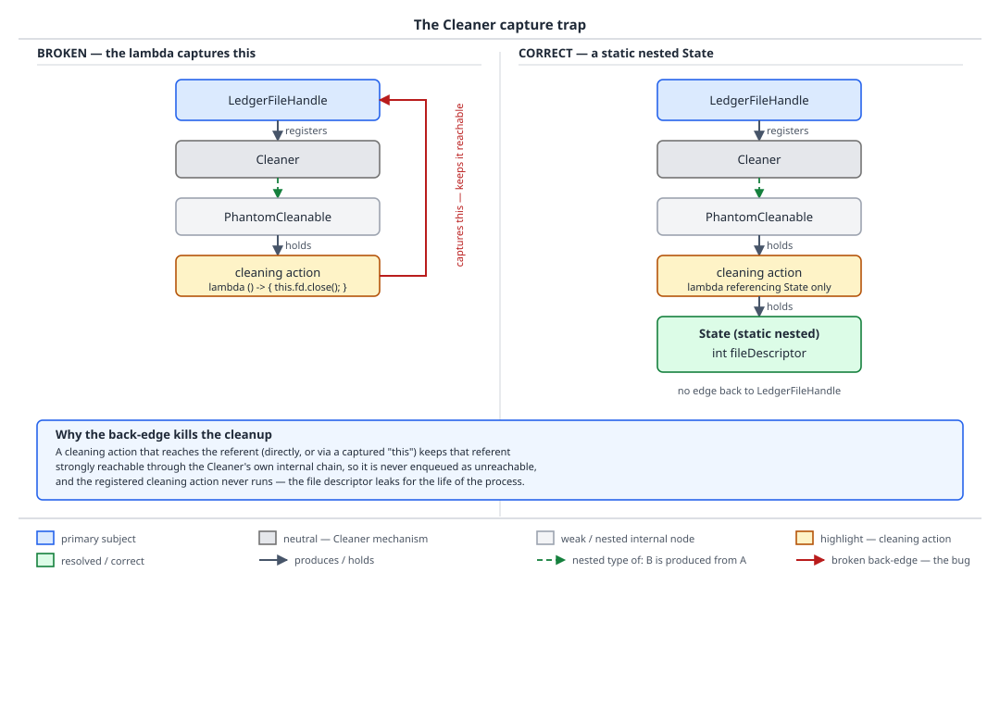

# 03 Java Core — Finalization, cleanup and leaks — INTERMEDIATE (§2.9, 2.9.4–2.9.9, 2.9.11)

**Target version: Java 21 LTS.** | **Part 2 of 5** | [Index](../00-index.md)
Previous: [Reachability and the reference ladder](03-lifecycle-and-references.md) · Next: [`hashCode`, identity and equality internals](04-internals-hashcode-and-identity.md)

## 1. The `Cleaner` capture trap, proved (2.9.4)

`java.lang.ref.Cleaner` arrived in **Java 9**, as the supported replacement for both hand-rolled
phantom-reference drain loops and `finalize`. The mental model: registering a cleanable is handing
the `Cleaner` a sealed envelope containing an action to run, and telling it "run this once the
object I'm pointing at with a phantom reference (see
[the reference ladder](03-lifecycle-and-references.md) for what phantom reachability means) becomes
unreachable." The envelope is opened by a background thread the `Cleaner` owns, not by your code,
and not on any schedule you control.

### Why it exists

`finalize` had two structural defects that `Cleaner` fixes by construction. First, `finalize` runs
*on* the object being finalized — the referent and the cleanup logic are the same instance, so it
is trivial to smuggle `this` back into a live root from inside `finalize` (§3 below proves exactly
this). Second, `finalize` is a language feature every subclass must opt out of correctly (call
`super.finalize()`, guard against exceptions, never let one escape) — a footgun that ships with every object
by default. `Cleaner` fixes the first defect by structurally separating the action from the
referent (the action is a *different* object, registered *against* the referent) and the second
by making cleanup opt-in and composable rather than an inherited method every class carries.

### The mechanism, and where it goes wrong

`Cleaner.register(Object obj, Runnable action)` returns a `Cleaner.Cleanable` and does two things
internally: it wraps `obj` in a phantom reference that the `Cleaner`'s own background thread
watches, and it holds `action` **strongly**, for as long as the registration exists, specifically
so the action survives to be run when the phantom reference clears. That second fact is the entire
trap. If `action` is a lambda or inner class that captures `obj` — including implicitly, by
referencing one of `obj`'s instance fields, which the compiler desugars to a captured reference to
`obj` itself — then the chain is: `Cleaner` → `Cleanable` → `action` (strong) → `obj` (strong, via
capture). `obj` is now strongly reachable *through the very structure that is supposed to detect
its unreachability*. It can never become phantom-reachable. The action is therefore never run.
The registration never completes. The leak is self-sustaining: nothing external needs to keep
`obj` alive any more, because the `Cleaner` machinery is doing that job forever, and the native
resource the cleanup was written to release is leaked right alongside it.

```java
final class LedgerFileHandle implements AutoCloseable {
    private static final Cleaner CLEANER = Cleaner.create();

    private final int fileDescriptor;
    private final Cleaner.Cleanable cleanable;

    LedgerFileHandle(int fileDescriptor) {
        this.fileDescriptor = fileDescriptor;
        // WRONG: this lambda reads the instance field `fileDescriptor`, which the
        // compiler can only do through a captured reference to `this`. The Cleaner
        // now holds a strong path back to the very object it is supposed to be
        // watching for unreachability.
        this.cleanable = CLEANER.register(this, () -> nativeClose(fileDescriptor));
    }

    private static native void nativeClose(int fd);

    @Override
    public void close() {
        cleanable.clean();
    }
}
```

Trace it through: `this.fileDescriptor` inside the lambda body is shorthand for
`LedgerFileHandle.this.fileDescriptor`, so the lambda's synthetic constructor argument is a
reference to `this`. `CLEANER.register(this, action)` now has `action` strongly holding `this`,
and the `Cleaner` strongly holds `action`. A `LedgerFileHandle` that a caller forgets to
`close()` explicitly — the one case the `Cleaner` backstop exists for — is never collected at
all, `nativeClose` never runs, and the banking partner's payout file descriptor stays open for
the life of the process.

The fix is structural, not a matter of writing the lambda more carefully: put the state the
action needs into a **separate object that cannot reach the referent**, most simply a `static`
nested class, and register that object's `run()` method as the action.

```java
final class LedgerFileHandle implements AutoCloseable {
    private static final Cleaner CLEANER = Cleaner.create();

    private final State state;
    private final Cleaner.Cleanable cleanable;

    LedgerFileHandle(int fileDescriptor) {
        this.state = new State(fileDescriptor);
        this.cleanable = CLEANER.register(this, state);
    }

    @Override
    public void close() {
        cleanable.clean();
    }

    // static: cannot capture the enclosing LedgerFileHandle even by accident.
    private static final class State implements Runnable {
        private final int fileDescriptor;

        State(int fileDescriptor) {
            this.fileDescriptor = fileDescriptor;
        }

        @Override
        public void run() {
            nativeClose(fileDescriptor);
        }

        private static native void nativeClose(int fd);
    }
}
```

`State` is `static`, so it has no synthetic outer-instance field and structurally cannot reference
the `LedgerFileHandle` that created it — the compiler enforces the rule that the trap violated by
convention alone. `state` holds only the primitive `fileDescriptor`, never the wrapping object.
`close()` calls `cleanable.clean()`, and `Cleaner.Cleanable.clean()` is specified to run the
action at most once — a second call, from the `Cleaner`'s own background thread after the object
becomes phantom-reachable, is a safe no-op — so the deterministic path (`close()`) and the safety
net (the `Cleaner` backstop) share one implementation and one idempotency guarantee.

Four rules fall out of this proof, stated explicitly because each is a place the trap resurfaces
under a different disguise:

1. **The action must run in a static context** — a lambda, method reference, or inner class that
   cannot capture the referent, enforced most reliably by making it a `static` nested class.
2. **The action must hold no reference to the referent**, directly or transitively — not the
   referent itself, not one of its fields, not `this` implicitly through a non-static inner class.
3. **The action must not resurrect** the referent — it must not store any reference to it
   anywhere reachable, for the same reason `finalize` resurrection is dangerous (§3 below).
4. **The action must be safe to run on the `Cleaner`'s own thread** — no assumptions about which
   thread runs it, no unguarded access to state another thread might be mutating, and no blocking
   call that could stall the shared `Cleaner` thread pool for every other cleanable registered
   against the same `Cleaner`.



**D-084** — left panel: `LedgerFileHandle` registering a lambda that captures `this`, with the
back-edge from the action through the `Cleanable` back to the `LedgerFileHandle` drawn explicitly
— that back-edge is what makes the referent permanently strongly reachable. Right panel: the
`static` nested `State` holding only the file descriptor, with no edge back to `LedgerFileHandle`
at all, so the phantom reference the `Cleaner` holds on `LedgerFileHandle` is the only path in
either direction.

**Interview:** "Why can't the Cleaner action reference the object it's cleaning up?" — because the
`Cleaner` holds the action strongly for the registration's entire lifetime, so a captured
reference to the referent inside the action creates a strong cycle through the cleanup
infrastructure itself, which means the referent can never become phantom-reachable and the
cleanup action never runs. Fix: put the state the action needs in a separate, typically `static`,
object that structurally cannot reach the referent.

Full three-way comparison of `finalize`, `Cleaner` and `AutoCloseable` on a single timeline —
including diagram **D-037** — is owned by
[`01c-object-methods.md`](01c-object-methods.md); this file does not re-embed D-037 and goes
deeper only on the `Cleaner` capture mechanism and the `finalize` deprecation timeline (§3 below).

## 2. The four leak archetypes (2.9.7, 2.9.8, 2.9.9)

All four share one shape, which is just the reachability rule from
[the reference ladder](03-lifecycle-and-references.md) wearing a costume: **something long-lived
holds a strong reference to something that was supposed to be request-scoped or short-lived.**
The "something long-lived" is always one of a small set of culprits — a pooled thread, a `static`
field, an executor's internal queue, an open file table — and none of them are things the
language or the collector can warn you about, because from the collector's point of view every
one of these references is completely ordinary and completely intentional-looking.

| Archetype | What holds it | Symptom in production | Fix |
|---|---|---|---|
| Unclosed stream or connection | The OS file table / connection pool | `Too many open files`, connection pool exhaustion under load | try-with-resources (§4 below) |
| Executor never shut down | The executor's own non-daemon worker threads | JVM will not exit; thread count climbs across requests if a new executor is created per request | `shutdown()`/`shutdownNow()` on a defined lifecycle boundary, or a shared, sized, injected executor |
| `ThreadLocal` on a pooled thread | The pooled `Thread`'s `ThreadLocalMap`, via a strongly-held value | Slow, unbounded heap growth that correlates with request count, not with concurrent load; occasionally a cross-request data leak | `remove()` in a `finally`, always |
| `static` collection as a cache | The class object itself (a permanent GC root) | Heap grows monotonically with total requests served since JVM start, never plateaus | Bound it, expire it, or use a real cache |

### `ThreadLocal` on a pooled thread — the sharp end `[TRAP]` `[X-REF 05]`

`ApplicationGateway` sets a `ThreadLocal<ClientId>` in a request filter so downstream code can
read "the current client" without threading a parameter through every call. On a platform running
14k steady / 55k peak concurrent sessions, the request-handling threads are pooled — that is the
entire point of a thread pool — so a given worker thread outlives any single request by
definition, and it is reused for the very next request that arrives. The value stored in a
`ThreadLocal` lives in that `Thread`'s own `ThreadLocalMap`, which means the value is reachable
from the `Thread` object itself. `[X-REF 05]` — the `ThreadLocalMap` internals (the entry is a
`WeakReference<ThreadLocal<?>>` as its key, colliding with a linear-probe layout) belong to guide
**05 Concurrency**; the fact this file needs is smaller: **the map entry's key is weak, but its
value is held strongly**, so "it's implemented with weak references, so it cleans itself up" is
false — only the key half of the entry is weak, and the value (the `ClientId`, and everything
reachable from it) is retained until something explicitly removes the entry or the thread
overwrites that slot.

If the filter that sets the `ThreadLocal<ClientId>` never calls `remove()`, the client's object
graph stays reachable from the worker thread until that thread happens to service another request
that overwrites the same key — and in the meantime, if any code path reads the `ThreadLocal`
outside the boundary of the request that set it (a background task submitted from the pool, a
retried operation, a badly scoped async callback), it reads the *previous* request's `ClientId`.
On a regulated platform that is not merely a memory leak — it is a cross-request identity leak,
and depending on what downstream code does with the wrong `ClientId` (restriction checks, ledger
attribution), it is a compliance incident, not a performance one.

```java
final class ApplicationGateway {
    private static final ThreadLocal<ClientId> CURRENT_CLIENT = new ThreadLocal<>();

    void handle(ClientId clientId, Runnable requestBody) {
        CURRENT_CLIENT.set(clientId);
        try {
            requestBody.run();
        } finally {
            // Mandatory, not defensive: without this the pooled thread carries
            // clientId into whatever request it services next.
            CURRENT_CLIENT.remove();
        }
    }

    static ClientId currentClient() {
        return CURRENT_CLIENT.get();
    }
}
```

**Pitfall:** treating `remove()` as optional because "the pool is small, it'll get overwritten
soon anyway." Between the leaked `set()` and the next `set()` on that thread, any code that reads
`CURRENT_CLIENT.get()` — including a scheduled housekeeping task, a slow background retry, or a
health-check thread that happens to share the pool — sees the stale `ClientId`. The blast radius
of a missing `remove()` is not bounded by pool size; it is bounded by how long it takes that
specific thread to be reused, which is unbounded in the worst case (a lightly loaded pool can
leave a thread idle, and stale, for a long time).

One line on virtual threads, since the platform is on 21: a virtual thread is not pooled in the
way a platform thread in a fixed thread pool is — each virtual thread is typically created per
task and discarded, so its `ThreadLocal` values die with it. That changes the *cost* of a missing
`remove()` on virtual-thread-based code (no cross-request carryover, because there is no thread
reuse to carry it), not the correctness of the idiom — request-scoped state modeled as a
`ThreadLocal` is still the wrong tool, and a scoped mechanism designed for structured concurrency
is the better fit. Guide **05 Concurrency** covers virtual-thread `ThreadLocal` cost and
alternatives in full.

### `static` collection as an unbounded cache — the archetypal Java leak `[TRAP]` `[X-REF 02]`

`ApplicationHistory` keeping a `static Map<ApplicationId, Application>` "so we don't have to hit
the database for a recently-seen application" looks like a cache and behaves like a slow leak,
because nothing about a `static` field's lifetime is tied to how long any individual entry is
still useful. The class object is loaded once and, in a typical server process, never unloaded —
it is a permanent GC root — so every entry ever inserted stays reachable for the life of the
process unless something explicitly removes it.

Do the arithmetic rather than trusting the word "slow": applications reach `AO-400 SUBMITTED` at
7.2k/day steady, 24k/day at peak. At the steady rate that is 7,200 × 7 = 50,400 new map entries
per week, 7,200 × 365 ≈ 2.63M per year, with **zero** eviction. At peak-sustained input it is
24,000 × 7 = 168,000 per week. An `Application` aggregate carrying an identity, a status, and an
audit trail is not a small object — even a modest few-hundred-byte footprint per entry turns "a
convenience cache" into hundreds of megabytes within months, growing without bound for as long as
the process runs, and a long-running service (the point of running one) is exactly the case where
this failure mode has the most time to mature into an outage.

`[X-REF 02]` — `WeakHashMap`, bounded `LinkedHashMap` (with `removeEldestEntry` overridden), and
purpose-built eviction policies are collection-level tools guide **02 Java collections** covers;
the fact this file owns is the *reason* the naive version fails: a `static` field is a root, a
root never becomes unreachable on its own, and therefore anything reachable only through a
`static` collection is exempt from the one mechanism (reachability, in
[the reference ladder](03-lifecycle-and-references.md)) that would otherwise reclaim it.

**Pitfall:** calling a `static Map` used this way "a cache" at all. A cache has a bound and an
eviction policy; a `static Map` with neither is a permanent record of everything that ever passed
through it, indistinguishable from a leak except by intent. The fix is not "use a `WeakHashMap`"
by reflex — a `WeakHashMap` only helps if something else stops strongly referencing the key, and
an `Application` fetched from a repository is usually still referenced elsewhere in the request.
The fix is an explicit bound (size or time), enforced by the cache itself, independent of what
anything else in the program still points at.

### The other two archetypes, briefly

Unclosed streams and connections are the leak every engineer already half-expects, and §4 below
covers the discipline that prevents it. Executors never shut down are the thread-lifetime
version of the same mistake — an `ExecutorService` created per request and never shut down leaves
its worker threads running (non-daemon by default), each one an active GC root holding its own
stack and whatever the submitted tasks captured, and the fix is either a lifecycle-scoped
`shutdown()` (ideally via `try`-with-resources, since `ExecutorService` implements `AutoCloseable`
from Java 19 onward) or, far more commonly correct, a single shared, sized, injected executor that
is never created per request at all. Full executor-lifetime mechanics belong to guide
**05 Concurrency**; the file boundary is the same as everywhere else in this section — a leak here
is a strong reference nobody meant to keep.

## 3. `finalize` resurrection and the extra cycle, proved (2.9.11); the deprecation timeline (2.9.5)

### Proving the extra cycle

Work it through as a state machine rather than accepting the claim. An object of a class that
overrides `finalize` with a non-trivial body is, at allocation time, registered with the JVM's
finalization machinery as an object requiring finalization. The state progression is:

1. **Allocated, registered.** The object lives normally, reachable through the ordinary graph.
2. **First found unreachable.** An ordinary (non-finalizable) object would be reclaimed here. A
   finalizable object cannot be, because its contract requires `finalize` to run first — so
   instead of reclaiming it, the collector marks it *finalizable* and hands a reference to it to
   the finalization machinery's own queue (conceptually, exactly the phantom-reference-plus-queue
   pattern of [the reference ladder](03-lifecycle-and-references.md), which is in fact how
   `Cleaner` supersedes it).
3. **A finalizer thread runs `finalize()`.** Inside that call, `this` is passed as an ordinary,
   fully strongly-reachable argument — there is no restriction on what the method body does with
   it. If `finalize` stores `this` into anything reachable from a root — a `static` field, a
   collection another thread can see, a listener registry — the object is **resurrected**: it is
   now, again, strongly reachable.
4. **The collector must determine reachability again.** Because step 3 can resurrect the object,
   the collector cannot simply reclaim it immediately after `finalize` returns — it has to run
   another reachability determination to find out whether the object is *still* unreachable. That
   second determination is, by construction, a second cycle: the first cycle is what discovered
   the object was finalizable and ran the finalizer; the second is what discovers whether the
   finalizer left it dead or alive.

```java
class ReservationFinalizerDemo {
    // A static field is a root — storing `this` here in finalize() is resurrection.
    static Reservation resurrected;

    static final class Reservation {
        final String reservationId;

        Reservation(String reservationId) {
            this.reservationId = reservationId;
        }

        @Override
        @SuppressWarnings("removal")
        protected void finalize() throws Throwable {
            resurrected = this;
        }
    }
}
```

When the only reference to a `Reservation` goes out of scope, the object becomes unreachable,
gets marked finalizable, and its `finalize()` runs — assigning `this` to the `static` field
`resurrected`, which makes it reachable again. The collector's second reachability pass then finds
it alive and leaves it alone; the extra pass is the direct, structural cost of allowing step 3 to
happen at all, independent of whether any given object actually resurrects itself. The javadoc
and JLS §12.6 close the obvious follow-up question — "can I resurrect it again next time?" — by
guaranteeing `finalize` is invoked **at most once** per object by the JVM. `resurrected` can
survive indefinitely, but if it becomes unreachable a second time, its `finalize()` method does
not run again, so "use `finalize` as a backstop that always cleans up eventually" is false the
moment an object has resurrected once: its second death is silent, with no cleanup hook at all.

**Interview:** "why does having a `finalize` method slow down GC?" — because a finalizable object
cannot be reclaimed on the pass that first finds it unreachable; it must be queued, its finalizer
run (concurrently, on a thread you don't control, at a time you don't control), and then
reachability re-checked, because the finalizer might have resurrected it. That is an unavoidable
second pass per finalizable object, which is exactly why `Cleaner` — which achieves the same
notify-on-unreachability contract via a phantom reference the *action* cannot resurrect through,
by construction (§1's four rules) — replaced it.

### The deprecation timeline (2.9.5)

| Milestone | Version | What actually changed |
|---|---|---|
| `Object.finalize()` exists | 1.0 | Part of the original object lifecycle; no deprecation |
| `finalize()` marked `@Deprecated` | 9 | The javadoc annotation on JDK 21 reads `@Deprecated(since = "9", forRemoval = true)`; `Cleaner` and `reachabilityFence` also shipped in 9 as the replacement primitives |
| JEP 421, "Deprecate Finalization for Removal" | 18 | Formal JEP declaring intent to remove finalization from a future release; added the `--finalization=disabled` VM flag |
| Current status | 21 | `--finalization=disabled` is accepted and starts the VM normally (confirmed on Oracle JDK 21.0.7, macOS aarch64); removal has been announced in intent but has **not** shipped as of 21 — `finalize()` still runs by default |

Migration path, by resource kind:

| Resource kind | Migrate to |
|---|---|
| Native memory (a malloc'd buffer, a native handle) | `Cleaner` (§1 above), or the Foreign Function & Memory API's `Arena` (preview in Java 21 under JEP 442), whose `Arena.close()` deterministically frees native memory without waiting on the collector at all |
| File and socket handles | try-with-resources over `AutoCloseable` (§4 below) — deterministic, not GC-dependent |
| Anything else with a lifecycle (a registered listener, a pooled connection, a lease) | An explicit open/close (or acquire/release) pair on the type itself, documented and enforced by the API shape, not by an inherited method every subclass must remember to override correctly |

**Interview:** "why was `finalize` deprecated instead of just discouraged?" — because it is
unsound as a resource-management primitive in three independent ways at once: it delays
reclamation by a proven extra GC cycle (above), it permits resurrection (above), and it makes no
guarantee about *when*, or even *whether before process exit*, it runs at all — three separate
reasons that all point at the same fix, which is to make cleanup either deterministic
(try-with-resources) or structurally resurrection-proof (`Cleaner`).

## 4. try-with-resources as a resource discipline, not just syntax (2.9.6)

The syntax, desugaring, close-order, and suppressed-exception mechanics are owned by
[`../exceptions/01-basics.md`](../exceptions/01-basics.md) (leaves 1.20.12–1.20.15, diagram
D-054) — go there for how the compiler rewrites the block. What belongs here is the *contract*
`close()` must honor for try-with-resources to be safe to rely on at all: `close()` must be
**idempotent** — calling it a second time (which happens whenever a resource is closed explicitly
and then closed again by an enclosing try-with-resources, or by a `Cleaner` backstop) must not
throw and must not attempt to release something already released. It must **not throw on a second
call** specifically because try-with-resources' generated code may call `close()` from a `finally`
block that runs even when the resource was already closed on the success path. And it must **not
swallow the primary exception** — if the try block already failed with an exception and `close()`
then also throws, the primary exception must remain the one propagated (with the `close()`
failure attached as suppressed), never silently replaced.

The gotcha worth stating explicitly, since it recurs in code review far more than the desugaring
does: a hand-written `finally` block that **reassigns or returns** loses the original exception
outright, with no suppression and no trace — `finally { return result; }` after a `try` that threw
discards the throw completely, and `finally { resource = null; }` does nothing to the exception
but is often mistaken for cleanup. try-with-resources exists specifically so you never write that
`finally` by hand. When `close()` itself can genuinely fail (a bank withdrawal file handle whose
`close()` flushes a network write, for the `PaymentRun` payout path), the design decision is
whether the caller can retry the whole operation or must surface the close failure as a distinct,
actionable error — a decision try-with-resources will faithfully preserve (as a suppressed
exception) but will not make for you.

## Pitfalls

### "The `Cleaner` action is just cleanup logic, it's safe to reference the object it's cleaning up"

**Wrong**

```java
this.cleanable = CLEANER.register(this, () -> nativeClose(fileDescriptor));
```

The surprise: reading the instance field `fileDescriptor` inside the lambda captures `this`
implicitly, so the `Cleaner`'s strong hold on the action becomes a strong hold on the referent —
the object can never become phantom-reachable, and the cleanup that was supposed to be the safety
net never runs.

**Right**

```java
private static final class State implements Runnable {
    private final int fileDescriptor;
    State(int fileDescriptor) { this.fileDescriptor = fileDescriptor; }
    @Override public void run() { nativeClose(fileDescriptor); }
}
// CLEANER.register(this, new State(fileDescriptor));
```

**Why people believe it:** a lambda that only touches one primitive field looks too small to be
holding a whole object hostage — the capture is invisible at the call site and only becomes
visible once you ask what the compiler actually generates for field access from within it.

### "The pool is small, skipping `ThreadLocal.remove()` is harmless"

**Wrong**

```java
CURRENT_CLIENT.set(clientId);
requestBody.run(); // no finally, no remove()
```

The surprise: the next request serviced by this exact pooled thread — which can be any later
request, on a schedule you don't control — reads the previous request's `ClientId` from
`CURRENT_CLIENT.get()` if it doesn't overwrite it first, which on a regulated platform is a
cross-request identity leak, not just a memory leak.

**Right**

```java
CURRENT_CLIENT.set(clientId);
try {
    requestBody.run();
} finally {
    CURRENT_CLIENT.remove();
}
```

**Why people believe it:** the leaked value usually does get overwritten by the *next* request
fast enough that nothing visibly breaks in testing, so the bug only surfaces under the timing and
concurrency patterns of real production traffic.

### "A backstop `finalize()` guarantees eventual cleanup"

**Wrong**

```java
@Override
@SuppressWarnings("removal")
protected void finalize() throws Throwable {
    releaseNativeHandle(); // "runs eventually, so this is a safe backstop"
}
```

The surprise: `finalize` is guaranteed to run **at most once**, so if this object is ever
resurrected — by this `finalize` or any code storing `this` somewhere reachable — its second
death runs no finalizer at all, and the backstop silently stops backstopping anything.

**Right**

```java
final class LedgerFileHandle implements AutoCloseable {
    // Cleaner + static nested State (§1 above) — no resurrection path exists,
    // because the action never holds a reference to `this` to resurrect.
}
```

**Why people believe it:** `finalize` "usually" runs exactly once in practice because resurrection
is rare, so the backstop appears reliable right up until some unrelated code path stores the
object somewhere it shouldn't.

## Cheat sheet

| Item | Value |
|---|---|
| `Cleaner` since | Java 9; replaces hand-rolled `PhantomReference` drain loops and `finalize` |
| `Cleaner` capture trap | Action holds referent strongly if it captures it → referent never phantom-reachable → action never runs |
| `Cleaner` fix | `static` nested `State` holding only primitives, no back-reference to the referent |
| `Cleaner.Cleanable.clean()` | Idempotent by contract — safe to call from both `close()` and the backstop |
| `finalize()` on JDK 21 | `@Deprecated(since = "9", forRemoval = true)`, empty body, called **at most once** |
| JEP 421 | JDK 18, "Deprecate Finalization for Removal"; added `--finalization=disabled` |
| `--finalization=disabled` on 21 | Accepted, VM starts normally; removal announced, not shipped |
| Resurrection | `finalize` stores `this` into a reachable root; forces a second reachability pass |
| Extra GC cycle for finalizables | Structural: unreachable → finalize runs → reachability re-checked for resurrection |
| try-with-resources `close()` contract | Idempotent, must not throw on a second call, must not mask the primary exception |
| `finally { return x; }` after a throwing `try` | Discards the exception completely — no suppression, no trace |
| `ThreadLocalMap` entry | Key is `WeakReference<ThreadLocal<?>>`; value is held **strongly** |
| `ThreadLocal` leak fix | `remove()` in a `finally`, always — not "when convenient" |
| `static` collection as cache | The class is a permanent GC root; unbounded growth for the life of the process |

## Self-test

**Q1.** A `Cleaner.register(obj, action)` call is made where `action` is a lambda that reads one
of `obj`'s instance fields. Trace exactly why `obj` is never collected.

<details><summary>Answer</summary>

Reading an instance field from inside a lambda desugars to a captured reference to the enclosing
instance, `obj`, because the compiler needs `obj` to reach the field. `Cleaner.register` holds
`action` strongly for the entire life of the registration, so the chain is now `Cleaner` →
`Cleanable` → `action` (strong) → `obj` (strong, via the implicit capture). `obj` can therefore
never become phantom-reachable — the condition the `Cleaner`'s background thread is watching for
— so the action is never scheduled, and `obj`, with whatever native resource it fronts, is leaked
for as long as the `Cleaner` itself is reachable, which for a process-lifetime `Cleaner` is
forever.

</details>

**Q2.** Why does having a non-trivial `finalize()` method force an extra GC cycle, independent of
whether the object actually resurrects itself?

<details><summary>Answer</summary>

Because the collector cannot reclaim a finalizable object on the pass that first discovers it is
unreachable — the contract requires `finalize()` to run first, and `finalize()` runs with `this`
as an ordinary, fully strongly-reachable argument, free to resurrect the object by storing `this`
somewhere reachable. Since the collector cannot know in advance whether a given call will
resurrect its object, it must, after every finalizer runs, re-determine reachability before it can
safely reclaim anything — a second pass that exists purely because the first pass could not rule
out resurrection, not because any particular object actually resurrects.

</details>

**Q3.** `ApplicationGateway` sets a `ThreadLocal<ClientId>` per request and never calls
`remove()`. Explain the failure in terms of what the `ThreadLocalMap` entry actually holds
strongly versus weakly, and why "it uses weak references" does not save you here.

<details><summary>Answer</summary>

A `ThreadLocalMap` entry's *key* is a `WeakReference<ThreadLocal<?>>` pointing at `CURRENT_CLIENT`
itself, but the entry's *value* — the `ClientId` that was `set()` — is held strongly. So even
though the key slot can clear, the value stays retained by the map entry until something removes
it or overwrites the slot. On a pooled thread servicing many requests, the value from request N
stays reachable from the `Thread` object until `remove()` runs or a later request overwrites the
same key — and in that gap, any code on that thread reading `CURRENT_CLIENT.get()` sees request
N's `ClientId`, a cross-request data leak on top of the memory leak.

</details>

**Q4.** Why is a `static Map<ApplicationId, Application>` used as a cache in `ApplicationHistory`
described as "the archetypal Java leak," and what specifically about being `static` causes it?

<details><summary>Answer</summary>

A `static` field belongs to the class object, which is a GC root for as long as the class stays
loaded — in a long-running server, that means for the life of the process. Anything reachable
only through that field is therefore reachable for the process's life too, with no mechanism to
make it otherwise unless the code explicitly removes entries. With applications reaching
`AO-400 SUBMITTED` at 7.2k/day steady (24k/day at peak), an unbounded map like this accumulates
roughly 50,400 new entries per week at the steady rate alone, with zero eviction — which is why
"cache" is the wrong word for it: a cache has a bound and a policy, this has neither, so it grows
monotonically for as long as the process runs.

</details>

**Q5.** What must `close()` guarantee for a resource used with try-with-resources to be safe, and
what specifically goes wrong if a hand-written `finally` block returns a value after a `try` that
threw an exception?

<details><summary>Answer</summary>

`close()` must be idempotent (a second call is a safe no-op), must not throw on a second call, and
must not mask a primary exception already in flight — a `close()` failure during unwinding should
attach as a suppressed exception, not replace the original. A hand-written
`finally { return result; }` after a `try` that threw discards the original exception entirely,
with no suppression and no trace, because a `return` (or reassignment) inside `finally`
unconditionally overrides whatever the `try` block was doing, including throwing.
try-with-resources' compiler desugaring exists specifically so application code never writes that
`finally` by hand.

</details>

## Open questions

- The exact internal thread name, priority, and pool sizing HotSpot uses for `Cleaner`'s
  background cleaning thread(s) on JDK 21 were not measured in this session and are not specified
  by any JDK contract — `Cleaner.create()` only guarantees a daemon thread runs the actions, not
  its name or scheduling detail. Settled by reading `jdk.internal.ref.CleanerImpl` for the target
  build, or `jstack` output on a running process.
- Whether the Foreign Function & Memory API's `Arena` is still a preview feature on Java 21 or has
  changed status in a later 21.0.x patch was not independently reconfirmed against the JDK 21
  release notes in this session; it is stated here based on JEP 442's documented preview status at
  JDK 21's initial release. Settled by checking the JEP index for the exact 21.0.x build in use.

---

**Leaves covered:** 2.9.4, 2.9.5, 2.9.6, 2.9.7, 2.9.8, 2.9.9, 2.9.11 (7 leaves)
**Leaves deferred:** none
**Diagrams included:** D-084
**Target version:** Java 21 LTS
**Lines:** 607
