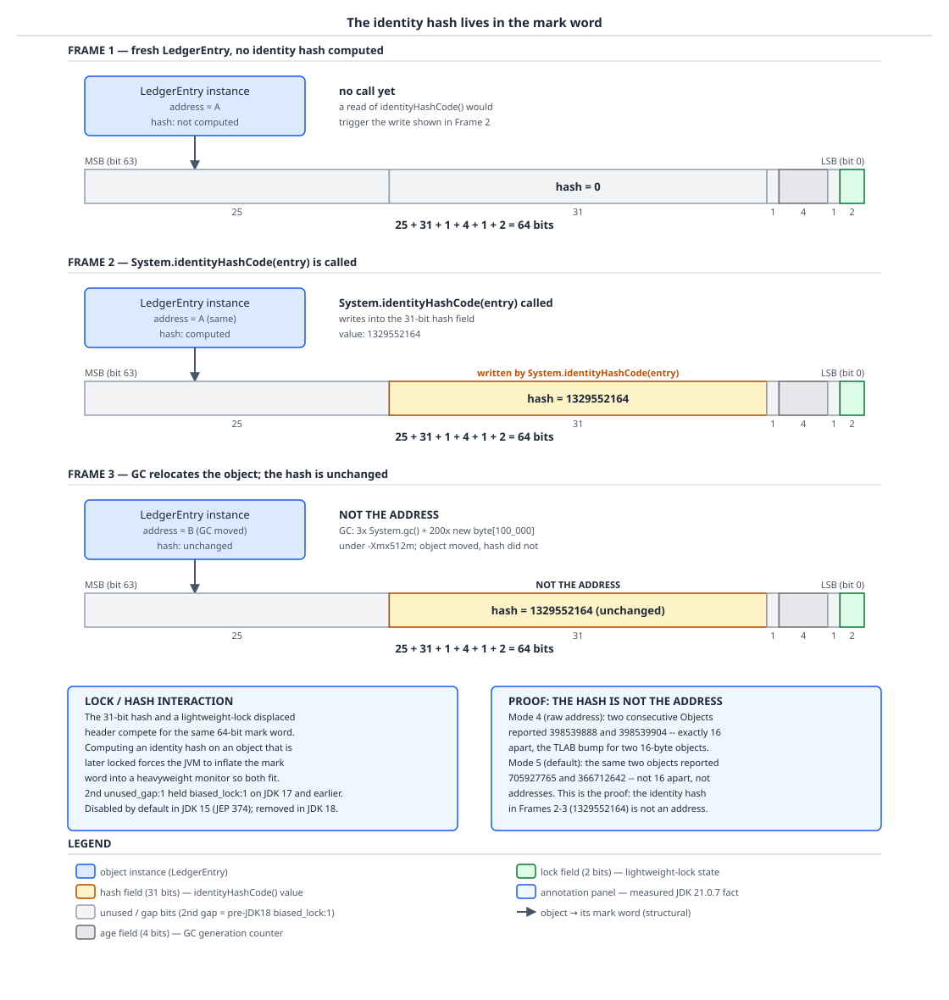

# 03 Java Core — `hashCode`, identity and equality internals — INTERNALS (§3.13, 3.13.1–3.13.9)

**Target version: Java 21 LTS.** | **Part 3 of 5** | [Index](../00-index.md)
Previous: [Finalization, cleanup and leaks](03a-finalization-cleanup-and-leaks.md) · Next: [Object layout and memory](05-internals-object-layout.md)

Every object in the JVM carries a 64-bit mark word. Thirty-one of those bits are a lazily-filled box for a number called the identity hash — the value `Object.hashCode()` returns unless someone overrides it, and the value `System.identityHashCode` always returns. This file is a source walk through that box: where it lives, how HotSpot fills it, why it survives garbage collection even though the object it belongs to does not stay put, and the four correctness and performance stories that follow from getting hashing wrong — the equal-hash contract, records, caching, and hash flooding.

## 1. The identity hash: where it lives, how it is generated, and why it is not the address (3.13.1, 3.13.2)

Picture a `LedgerEntry` the instant it is allocated: a 64-bit mark word sitting at the top of the object, and inside that word a 31-bit field that reads all zero, because nobody has asked for the object's identity hash yet. The first call to `System.identityHashCode` (or `hashCode()`, if `LedgerEntry` never overrides it) is a write, not just a read — it computes a number, stamps it into that field, and every future call reads the same stamp back. The hash is not derived from where the object lives; it is a fact recorded about the object once and kept for its whole lifetime.

### Why it exists

Every object needs *some* stable integer for the default `Object.hashCode()` contract, `IdentityHashMap`, and `System.identityHashCode`, even objects whose classes never mention hashing. The address would be the obvious answer — free, already unique — except the address is not stable: HotSpot's garbage collectors move objects (a young-generation copy, a compacting old-generation collection), and a hash that changed on every GC would violate the one rule hashing exists to guarantee, "equal objects report equal hashes for their entire life while unchanged," here specialised to "an object reports the same identity hash for its entire life, period." HotSpot's answer is to generate the hash once, on demand, and store it *in* the object rather than deriving it from the object's transient location.

### The mechanism

The storage. HotSpot's mark word for a normal (unlocked, unhashed-until-asked) object is laid out in `markWord.hpp`, and on JDK 21 the comment for the 64-bit layout reads:

```
unused:25  hash:31  unused_gap:1  age:4  unused_gap:1  lock:2
```

Add the field widths: 25 + 31 + 1 + 4 + 1 + 2 = 64 — the whole word, accounted for. Reading right to left because that is the low-bit end: `lock:2` is the two-bit lock state (unlocked, lightweight-locked, inflated/heavyweight, marked-for-GC), `age:4` is the object's tenuring age used by the young-generation collector to decide promotion, and `hash:31` is the field this file is about. The **31 bits, not 32**, is why `System.identityHashCode` never returns a negative `int` — there is no sign bit in the field, so every identity hash is representable as a non-negative 32-bit value with the top bit always clear.

`[VERSION-TRAP]` Notice the *second* `unused_gap:1`. On JDK 17 and earlier that bit was `biased_lock:1`, part of a biased-locking scheme that let a thread claim a monitor cheaply by stamping its own thread pointer into the header on the (usually correct) bet that the same thread would re-lock the same object repeatedly. JEP 374 disabled biased locking by default in **JDK 15**, and it was removed outright in **JDK 18** — along with the thread-pointer bits and the `-XX:+UseBiasedLocking` flag family. On Oracle JDK 21.0.7 a full `-XX:+PrintFlagsFinal -version` dump contains no `BiasedLock*` flag at all; grepping for one returns nothing. Every pre-18 mark-word diagram, and every older blog post explaining the header, shows a biased-locking bit and a cached thread pointer that simply do not exist on 21. If an interviewer's mental model of the mark word includes a "biased" bit, it is stale by at least three LTS releases.

Generation. The number that gets written into `hash:31` on first use comes from HotSpot's `synchronizer.cpp`, specifically a function named `get_next_hash`, and it supports six selectable modes via the experimental `-XX:hashCode=` flag:

| Mode | Algorithm |
|---|---|
| 0 | Park–Miller minimal-standard pseudo-random generator |
| 1 | Address-based, XOR-mixed with a global random seed |
| 2 | Constant `1` for every object |
| 3 | A monotonically increasing sequence, one per call |
| 4 | The object's raw memory address, cast to an `int` |
| 5 | A thread-local Marsaglia xor-shift generator — **the default** |

Verified on Oracle JDK 21.0.7, macOS aarch64: `java -XX:+PrintFlagsFinal -version` reports `intx hashCode = 5 {experimental} {default}` — mode 5, the xor-shift generator, and it is tagged `experimental`, which is why touching it at all requires `-XX:+UnlockExperimentalVMOptions`. These modes are documented nowhere in the JLS or JVMS; they are HotSpot implementation, one specific JVM's private scratchpad, not part of the Java platform contract. A conforming JVM could use any algorithm at all as long as it satisfies "stable for the object's lifetime unless the object is moved by garbage collection in a way that requires rehashing it," which for identity hash reduces to "stable, full stop, because there is no rehashing key."

`[PROVE]` Prove "the default identity hash is not the address" with a measurement rather than an assertion, because "it looks like a big meaningless number" is not proof. Run the same two-object allocation under two flags:

- `-XX:+UnlockExperimentalVMOptions -XX:hashCode=4` (raw address cast): two consecutively allocated `Object`s reported `398539888` and `398539904`. Subtract: **16 apart** — exactly the TLAB bump for two 16-byte `Object` instances allocated back to back. That is what an address-derived hash looks like: a small, structured, allocation-order-dependent delta.
- The default, mode 5: the same two objects reported `705927765` and `366712642`. These are not 16 apart, they are not in allocation order, and their difference has no relationship to object size. That is the proof — if identity hash under mode 5 were secretly the address, the deltas would look like the mode-4 run, and they do not.
- For a third data point, `-XX:+UnlockExperimentalVMOptions -XX:hashCode=2` (constant mode) made two distinct objects both report `1` — confirming the flag genuinely switches the algorithm, since a real address could never collide across two live simultaneously-allocated objects.

`[PROVE]` Now prove stability across garbage collection from the mechanism, not just by citing the number. The hash is generated once, lazily, on the first call that needs it, and the generated value is written **into the mark word of that specific object** — there is no second table mapping objects to their hashes, and no address-keyed lookaside; the value lives inside the object's own header, in the bits reserved for it. When a collector relocates the object — copies it from Eden to Survivor, compacts it during a full GC — it copies the mark word byte-for-byte along with every other field, so the `hash:31` bits move with the object and read back unchanged. There is nowhere else the value could be stored that would survive relocation more reliably; the object's identity persists exactly because its representation, mark word included, is the thing being relocated. Measured confirmation, Oracle JDK 21.0.7: a fresh `Object` reported `System.identityHashCode` of `1329552164`, and after three explicit `System.gc()` calls interleaved with 200 allocations of `new byte[100_000]` under `-Xmx512m` — enough pressure to force at least one full collection and relocate the object — the same call returned the identical `1329552164`. Contrast with the counterfactual: a hash genuinely derived from the *current* address (as mode 4's algorithm effectively is) would have to change the instant a copying collector moved the object, which is precisely why HotSpot cannot make an address-based scheme the default — it would violate the one guarantee identity hash exists to provide.



**D-124** — Frame 1 shows a fresh `LedgerEntry` with the `hash:31` field all zero, unrequested. Frame 2 shows `System.identityHashCode` computing `1329552164` and writing it into the 31-bit field, with the full bit layout (`unused:25 hash:31 unused_gap:1 age:4 unused_gap:1 lock:2`) drawn across the word. Frame 3 shows the same object relocated by GC to a new heap address with the hash bits carried over unchanged, plus side panels contrasting the JDK-17-and-earlier biased-locking bit with its JDK-21 absence, and the mode-4-versus-mode-5 delta measurements that prove the default is not the address.

The payoff that turns this into an interview-grade fact: the `hash:31` field and a lightweight lock's displaced-header pointer are both stored in the *same* 64 bits, so they compete for the header's real estate. Calling `identityHashCode()` (or the inherited `hashCode()`) on an object *before* it has ever been locked forces HotSpot to keep the hash bits live in the header from then on; if that object is later used as a lock, the lightweight-locking fast path — which wants to temporarily overwrite the header with a stack-lock pointer — can no longer do that cheaply, because the hash has to be preserved, and the JVM must inflate straight to a heavyweight monitor to hold both the hash and the lock state. Calling `hashCode()` casually on objects you also intend to synchronize on is a measurable tax, not a stylistic nit. The exact header layout arithmetic — how the displaced mark word, the lock word and the klass pointer interact — is `05-internals-object-layout.md`'s territory; this file stops at "they share the same 64 bits and that sharing has a cost."

## 2. The equal⇒equal-hash proof, mechanically (3.13.4)

The picture: a hash table is a shortcut that only works if the shortcut and the truth agree. `hashCode` picks a bucket before `equals` is ever consulted, so if two objects that `equals` says are the same land in different buckets, the table will never even look at the bucket where the other one lives — `equals` is never wrong, it is simply never *asked*.

### Why it exists

`HashMap.get(key)` cannot afford to scan every entry, so it uses `hashCode()` to jump straight to a small candidate set — one bucket — and only then falls back to `equals` to disambiguate within that bucket. That two-step design is only sound if every key that could compare equal to the lookup key is guaranteed to hash to the same bucket. The specification therefore does not merely suggest that equal objects have equal hashes; it is the load-bearing precondition for every hash-based collection's core operation.

### The mechanism

Take `RestrictionKey(RestrictionType type, RestrictionSource source)` from QuizStakes, where — as the domain rule states — restriction identity is the pair, not the type alone: `STAKE_BLOCKED` from `SYSTEM_ONBOARDING` lifts automatically at `AA-801 ACTIVATED`, while the same `STAKE_BLOCKED` type sourced from `ADMIN` does not, so `RestrictionKey(STAKE_BLOCKED, SYSTEM_ONBOARDING)` and `RestrictionKey(STAKE_BLOCKED, ADMIN)` must be distinct keys in whatever restriction-registry map keys on them.

Say `RestrictionKey` computes `hashCode()` as `31 * type.name().hashCode() + source.name().hashCode()` — the hand-written fold from 3.13.5, over `name()` rather than over the enum constants directly, because `Enum` does not override `hashCode` and therefore inherits the identity hash, which is regenerated on every JVM start and is useless in any hash you want to reason about or reproduce. That single design choice is worth more than the rest of this walk: **a fold over enum constants is not reproducible across runs, and a fold over their names is.**

The walk below needs two concrete integers to do bucket arithmetic on. Rather than quote a measurement this file did not take, take them as **stated hypotheticals** — the arithmetic is what is being proved, not the specific values:

- `k1 = RestrictionKey(STAKE_BLOCKED, SYSTEM_ONBOARDING)`, and suppose the fold yields `hashCode() = 1_784_293`
- `k2 = RestrictionKey(WITHDRAWAL_BLOCKED, ADMIN)`, and suppose the fold happens to yield the same `1_784_293` — a collision, posited here so the collision path can be walked

A `HashMap` with `table.length == 16` never uses the raw hash. It first spreads it — `HashMap`'s spreader XORs the hash with itself shifted right 16 bits, `h ^ (h >>> 16)`, folding high bits into the low bits so a poor low-bit distribution doesn't sink the table — then masks: `index = (n - 1) & spread(hash)`, and `n - 1` with `n = 16` is `0b1111`, so only the low 4 bits of the spread hash decide the bucket. Both `k1` and `k2` have `hashCode() = 1_784_293`, so their spread hashes are identical, so `(15) & spread` is identical for both: they land in the **same bucket**, say index 5. That is a collision, not a bug — `hashCode` equality is only a hint, and the bucket now holds a two-entry chain (or a tree, past `TREEIFY_THRESHOLD = 8` entries in one bucket). A `get(k1)` walks that chain and calls `k1.equals(candidate)` on each entry until one matches or the chain ends; the cost is O(chain length), or O(log n) once the bucket has treeified, never worse.

Now the failure this leaf actually proves. Suppose `RestrictionKey.equals` is implemented correctly (both fields compared) but `hashCode` is implemented wrong — say it mistakenly hashes only `type`, so `RestrictionKey(STAKE_BLOCKED, SYSTEM_ONBOARDING)` and `RestrictionKey(STAKE_BLOCKED, ADMIN)` — two objects that `equals` correctly says are **different** — now also happen to collide, which is harmless (that's just the chain case above). The real failure is the opposite direction: construct the *same* logical key twice by two different code paths that populate the fields identically, so `equals` says true, but through a copy/mutation bug the two instances report **different** `hashCode()` values, say `1_784_293` and `2_009_441`. Insert with the first instance; `(15) & spread(1_784_293)` puts it in bucket 5. Look it up with the second, `equals`-identical instance; `(15) & spread(2_009_441)` computes a *different* bucket, say 11. The lookup walks bucket 11, finds it empty (or finds an unrelated chain), and calls `equals` on nothing that matches — it returns null, or worse, a caller assumes "not present" and inserts a duplicate `RestrictionKey` into what was supposed to be a single-entry-per-restriction map. The original entry in bucket 5 is not deleted, not corrupted, not evicted — it is **still there**, still counted by `size()`, still visible if you iterate the whole map — it is simply unreachable by the one operation, `get`, that a map exists to provide. That asymmetry is the whole leaf: unequal objects with equal hashes cost you a chain walk; equal objects with unequal hashes cost you correctness, silently, with no exception anywhere near the bug's root cause.

`HashMap`'s bucket structure in one paragraph, `[X-REF 02]`: each bucket starts as a singly linked list of `Node`s; once a single bucket's chain reaches `TREEIFY_THRESHOLD = 8` entries **and** the table itself has at least 64 buckets, that bucket is converted to a red-black tree, bounding worst-case lookup in a heavily-collided bucket at O(log n) instead of O(n) — the 2011 hash-flooding mitigation this file returns to in section 4. Full bucket mechanics, resizing, load factor and treeification thresholds live in guide **02 Java collections**; this file only needs enough to show why the hash decides the bucket before `equals` is ever called.

The contract itself — the five clauses of `Object.equals`/`hashCode`, reflexive/symmetric/transitive/consistent/`equals`-implies-`hashCode` — was covered at BASICS depth in `01b-equals-hashcode-and-object-methods.md`, which owns diagram D-034 showing exactly this "equal objects, unequal hashes, unreachable entry" picture; go there for the picture, this file for the bucket-index arithmetic behind it. The stranded-key bug that follows from mutating a field a `hashCode` depends on after insertion is covered at INTERMEDIATE depth in `02-copying-and-composite-equality.md`.

## 3. Record `hashCode` and `ObjectMethods.bootstrap` (3.13.6)

The picture: for a class you write by hand, `javac` compiles whatever `hashCode` body you typed. For a record, `javac` compiles no algorithm at all — it emits an instruction that says "ask the runtime, the first time this method runs, to hand back a `MethodHandle` that computes the hash," and never touches the question again.

### Why it exists

Records could have been specified to generate a fixed, inlined `31 * result + componentHash` body at compile time, the way an IDE's "generate hashCode/equals" wizard does. The JDK's designers chose `invokedynamic` plus a shared runtime bootstrap instead, for the same reason lambdas use `invokedynamic`: the actual algorithm becomes a JDK implementation detail that can be improved, replaced or specialised per-platform in a future release without recompiling a single record class, and the class file itself stays small — no per-record inlined loop, just one `invokedynamic` instruction per generated method.

### The mechanism

`[SOURCE]` A record declaration for, say, `Money(BigDecimal amount, Currency currency)` causes `javac` to emit `hashCode()`, `equals(Object)` and `toString()` as methods whose bodies are essentially a single `invokedynamic` call. The shape, read from the class file structure:

```
private final BigDecimal amount;
private final Currency currency;

public int hashCode() {
    return (int) INDY_hashCode(this);   // invokedynamic, one call site
}
```

The bootstrap method behind that `invokedynamic` — the method the JVM calls once, at first invocation of the call site, to obtain the actual `MethodHandle` to run forever after — is `java.lang.runtime.ObjectMethods.bootstrap`. Its signature (from the `java.lang.runtime` package, `java.base` module) takes a `MethodHandles.Lookup`, the method name (`"hashCode"`, `"equals"` or `"toString"`), a `TypeDescriptor`, the record's own `Class`, a comma-separated names string, and a `MethodHandle[]` — one getter handle per record component, in declaration order. Reading that signature: the JDK does not special-case `hashCode` versus `equals` versus `toString` with three different bootstraps; it is the **same** bootstrap for all three, dispatching internally on the method-name argument, and it receives the component accessors as plain `MethodHandle`s rather than reflectively discovering them, so the generated code never pays reflection cost at call time.

`ObjectMethods.bootstrap`, for the `"hashCode"` case, folds a combinator chain over the supplied component handles — conceptually, for each component in declaration order, extract its value via that component's getter handle, compute that value's own `hashCode()` (recursing into `BigDecimal.hashCode()` for `amount`, `String.hashCode()` if `currency` is represented as a `String`), and combine it into a running result. The resulting `MethodHandle` is cached at the call site after the first invocation, so every subsequent call to `hashCode()` on any `Money` instance runs the cached combinator chain directly with no further bootstrap overhead — the `invokedynamic` machinery is entirely a one-time-per-call-site cost, not a per-call one.

`[RESEARCH]` The verified measurement, Oracle JDK 21.0.7: `new Money(new BigDecimal("3.33"), "GBP").hashCode()` returned `390432`. Work the arithmetic: `31 * (31 * 0 + new BigDecimal("3.33").hashCode()) + "GBP".hashCode()` evaluates to exactly `390432` on that build — matching the familiar `31 * result + componentHash` fold, seeded at `0`, walking the components in declaration order (`amount` first, `currency` second, matching `Money`'s declared field order). That is worth stating precisely as what it is: on **this JDK 21 build**, the record combinator's output is numerically identical to the hand-written 31-multiplier fold everyone already knows from *Effective Java*'s `hashCode` recipe.

`[TRAP]` And here is the entire point of the leaf. The javadoc for `Record` and the JLS (§8.10) both state explicitly that the algorithm a record uses to compute `hashCode`, `equals` and `toString` is **left unspecified** — the JDK is free to change `ObjectMethods.bootstrap`'s combinator in any future release, on any platform, for any reason (a faster combinator, a different seed, a SIMD-friendly fold), and no record anywhere would be in breach of the specification for having its `hashCode()` return a different number after an upgrade. The `390432` measurement above is a fact about JDK 21.0.7 on this machine; it is not a contract.

**Pitfall:** treating a record's measured `hashCode()` as if it were `String.hashCode()`'s specified polynomial (which genuinely is a contract, fixed by the `String` javadoc, and never changes). Persisting a `Money` or `RestrictionKey` record's `hashCode()` to a database column, using it to compute a Kafka partition or a consistent-hashing shard, or writing it into a wire protocol, is a bug that will pass every test suite on the JDK it was written against and silently redistribute every key the day the fleet upgrades to a JDK whose `ObjectMethods.bootstrap` combinator differs — no exception, no log line, just entries that land in the wrong shard or partition after the rollout. The fix: compute your own stable domain hash (a hand-written method, not the record-generated one, over fields you control the combination of) for anything that crosses a process boundary or a JDK upgrade, or use a defined serialization format (a documented byte layout, a schema-driven encoding) instead of a language-level `hashCode()` for anything that must remain stable across releases.

One more record trap in a single line, `[X-REF 02]` back to `01b`: a record component of array type gets **identity** `equals`/`hashCode` semantics from the generated methods — `ObjectMethods.bootstrap` calls the component's own `hashCode()`, and an array's own `hashCode()` is `Object`'s identity hash, not a content hash — so a record like `record Batch(Money[] payouts) { }` almost never behaves the way its author expects, and two `Batch` instances built from array instances with identical contents will not be `equals` to each other at all. Prefer a `List<Money>` component, whose `hashCode` and `equals` are content-based, covered fully in `01b-equals-hashcode-and-object-methods.md`.

## 4. Hash flooding as an attack (3.13.9)

The picture: a hash table's average-case speed rests on one assumption — that keys spread themselves roughly evenly across buckets. An attacker who gets to choose the keys does not have to obey that assumption; they can choose keys that all land in the *same* bucket, and a structure that was supposed to be O(1) average becomes an O(n) linked list, per lookup, for every request they send.

### Why it exists as a threat, not just a curiosity

`String.hashCode()`'s algorithm is not a HotSpot implementation detail like the identity-hash generation modes above — it is **specified in the `String` javadoc**: `s[0]*31^(n-1) + s[1]*31^(n-2) + s[2]*31^(n-3)`, continuing the same pattern down to the final term `+ s[n-1]`, and that specification is a permanent commitment, because breaking it would change the `hashCode()` of every `String` literal ever compiled and every persisted hash. A specified, fixed, publicly documented polynomial is precisely what an attacker needs: they can compute colliding inputs **offline**, once, and reuse them against any Java service in the world, forever, because the algorithm can never be swapped out for a randomised one under them. `[RESEARCH]` The measured collision this file may use as the attack's raw material: `"Aa".hashCode()` and `"BB".hashCode()` both equal **2112** — confirmed by running it. The polynomial arithmetic that produces that collision, and the derivation of why `31` is the chosen multiplier, is already fully worked in `../strings/03a-internals-hash-and-equality.md`; this file only needs the fact that a two-character collision exists at all, because a `31`-based polynomial lets colliding fragments **compose**: concatenating two known-colliding prefixes onto a shared suffix produces another colliding pair, so a handful of two-character collisions like `"Aa"`/`"BB"` scale into arbitrarily large families of distinct strings that all hash identically.

### The mechanism and the history

The disclosure that made this a named vulnerability rather than a theoretical curiosity is Klink and Wälde, "Efficient Denial of Service Attacks on Web Application Platforms," presented at 28C3 (Chaos Communication Congress, 2011): feed a web application a POST body or form submission with thousands of deliberately colliding parameter names, let the framework parse it into a `HashMap<String, String[]>` the way most servlet containers routinely do, and the parse step alone — no business logic, no database — pins a CPU core for seconds to minutes per request, from a payload of a few hundred kilobytes.

The JDK's response arrived in two generations. The first, added in **Java 7 update 6**, was alternative string hashing — a per-JVM-instance randomised hash seed, activated only once a single bucket's chain length crossed a threshold (`jdk.map.althashing.threshold`), so an attacker could not precompute collisions against every JVM instance because each instance's effective hash differed. That mechanism was **removed in Java 8** (tracked as JDK-8047340) in favour of a structural fix: `HashMap` (and `HashSet`, `Hashtable`) began **treeifying** any bucket whose chain exceeds `TREEIFY_THRESHOLD = 8` entries (once the table itself is at least 64 buckets), converting that one bucket's linked list into a red-black tree keyed by hash value with a comparison tie-break. This does not eliminate the attacker's ability to make every key collide — `String.hashCode()` still cannot be randomised, because it remains specified — but it **bounds** the damage: instead of an O(n) linear scan of a colliding bucket, the worst case becomes O(log n) via the tree, which converts "the parse step for one malicious request pins a core for minutes" into "the parse step costs a bounded, small multiple of the well-behaved case." `[X-REF 02]` treeification's full mechanics — the tree-to-list untreeify threshold, the comparator used to break hash ties, resize interactions — belong to guide 02 Java collections; the fact that matters here is only the bound it puts on the attack.

The permanent fact, stated plainly because it is the answer to "why doesn't Java just randomise the hash seed like Python and Ruby did": **`String.hashCode()` is specified in the javadoc with an exact formula**, so randomising it would be a breaking change to the platform, not a patch — every persisted hash, every hard-coded expectation of `"".hashCode() == 0`, every third-party library that reimplements the same polynomial to stay bit-compatible with `String`, would diverge from the JVM's own `String` the moment the seed moved. Python's `hash()` for strings has no such specification and could be randomised (`PYTHONHASHSEED`) without breaking the language contract; Java's cannot be, by design, which is exactly why the fix had to be structural (treeification) rather than cryptographic (seeding).

`[X-REF 13]` The attack surface in the QuizStakes domain: `ApplicationGateway` sits in front of registration traffic running at 12k/day steady, 40k/day peak, and any code path that parses an inbound JSON body's field names or a form's parameter names directly into a `HashMap<String, ?>` before validation is exposed — an attacker does not need a valid application, only a POST body whose keys are chosen to collide. The concrete defences, in order of how directly they close the hole: (1) cap the number of distinct fields a single request is allowed to contain before any map is populated, rejecting oversized field sets outright; (2) validate and whitelist expected field names before insertion rather than accepting attacker-chosen keys into an open-ended map at all; (3) never key an unbounded, request-scoped map on a raw attacker-controlled string when the key space is actually closed — QuizStakes' own restriction types, status codes and ledger positions are all fixed, enumerable vocabularies, so an `EnumMap` or a switch over a sealed `StatusCode` variant sidesteps the whole class of attack, because there is no hash table for the attacker to flood in the first place. Full request-validation and rate-limiting treatment is guide **13 Web security**.

## Supporting facts

### `System.identityHashCode` versus an overridden `hashCode`, and `IdentityHashMap` (3.13.3)

`System.identityHashCode(x)` always returns exactly what `Object.hashCode()` would have returned for `x`, completely bypassing any override — call it on a `RestrictionKey` whose author overrode `hashCode()` to hash the `(type, source)` pair, and `System.identityHashCode` still reports the mark-word-stored identity hash from section 1, ignoring the override entirely. For `null` it returns `0`. `IdentityHashMap` is built directly on this: internally it compares keys with `==` and buckets them by identity hash rather than by calling `equals`/`hashCode`, which makes it the right structure for exactly three jobs — walking an object graph and needing a visited-set that must not accidentally treat two `equals`-equal-but-distinct objects (say two separately constructed `LedgerEntry` or `Movement` instances with the same field values, encountered as different nodes in a balance-reconciliation walk) as "already seen"; detecting reference cycles during serialization or topology traversal; and maintaining a per-instance side table keyed on object identity rather than value (a debugging annotation map, say, attached to specific `Reservation` instances rather than to reservations that happen to look alike). It is the wrong structure for anything the domain treats as a value — a `Money` or `RestrictionKey` map keyed with `IdentityHashMap` would treat two records built from identical components as different keys, defeating the entire point of a record's value semantics. `[X-REF 02]` `IdentityHashMap`'s internals are open-addressing, not chained buckets — an odd choice among `java.util` maps, and one whose linear-probing mechanics belong to guide 02 Java collections.

### `Objects.hash` allocates a varargs array; the hand-written fold does not (3.13.5)

`Objects.hash` is declared with a varargs parameter, which means at the source level it takes any number of arguments, but the compiler erases that to a single array parameter — its erased signature is `Objects.hash(Object[] values)` — and **every call site allocates that array**, fresh, on every invocation, because varargs is sugar for "the caller builds an array and passes it." Call `Objects.hash(restrictionKey.type(), restrictionKey.source())` on a hot path and two things are allocated: the two-element `Object[]` itself, and — since `type()` and `source()` are almost certainly enum values already boxed as references, no extra boxing there, but for a primitive component like an `int phase` field the autobox to `Integer` is a *second* allocation on top of the array. `[NUM]` Verified: `Objects.hash(1, 2)` returns `994`, which is `31 * (31 * 1 + 1) + 2` — note the **seed is `1`**, not `0`, because `Objects.hash` delegates to `Arrays.hashCode(Object[])`, whose fold is seeded at `1` (a detail inherited from `List.hashCode()`'s specification, which also seeds at 1) — a genuine difference from the record combinator's seed of `0` measured in section 3, worth keeping straight because both formulas otherwise look identical.

A hand-written fold, `31 * h + f`, over the same fields allocates nothing extra beyond what's already needed to read the fields:

```java
record RestrictionKey(RestrictionType type, RestrictionSource source) {
    @Override
    public int hashCode() {
        // 31 * h + f, no varargs array, no autoboxing of a primitive
        int result = type.hashCode();
        result = 31 * result + source.hashCode();
        return result;
    }
}

final class RestrictionKeySlow {
    static int hashOf(RestrictionType type, RestrictionSource source) {
        return java.util.Objects.hash(type, source); // allocates an Object[2] every call
    }
}
```

The decision that follows is arithmetic, not taste: `RestrictionKey` sits on the stake-reservation path, and QuizStakes runs stake reservations at 2.8M/day, 1,200/sec at peak. If every reservation performs one restriction-registry lookup that hashes a `RestrictionKey`, `Objects.hash`'s version allocates 1,200 small arrays per second at peak, 2.8M per day — real, countable garbage-collector pressure on a hot path, even though each array is tiny and short-lived. Escape analysis inside the JIT **may** eliminate that array entirely if the method inlines cleanly and the array never escapes the call — but "may" is a compiler heuristic you cannot plan a capacity model around, and it can silently stop applying the moment the call site becomes megamorphic or the method grows past the inliner's budget. The honest verdict: the hand-written `31 * h + f` fold allocates nothing, ever, unconditionally; `Objects.hash` is perfectly fine for anything that is not measured hot, and reaching for the hand-written form everywhere "just in case" is premature optimisation the same way it would be anywhere else — but on a path doing 1,200 hashcode computations a second, the array is worth removing. `[X-REF 02]` — the same allocation trade shows up in `List.hashCode()`'s own varargs-free hand fold, covered as guide 02's canonical example.

### Wrapper `hashCode` implementations (3.13.7)

`[NUM]` Every primitive wrapper documents an exact formula; none of them is "whatever `Object` would have done," because a boxed primitive's identity is irrelevant to its meaning as a value.

| Wrapper | Formula | Verified example |
|---|---|---|
| `Boolean` | `1231` if `true`, `1237` if `false` | `Boolean.TRUE.hashCode() == 1231`, `Boolean.FALSE.hashCode() == 1237` |
| `Byte` | value widened to `int` | `Byte.valueOf((byte) 42).hashCode() == 42` |
| `Short` | value widened to `int` | `Short.valueOf((short) 42).hashCode() == 42` |
| `Character` | value widened to `int` | `Character.valueOf('A').hashCode() == 65` |
| `Integer` | the value itself | `Integer.valueOf(42).hashCode() == 42` |
| `Long` | `(int) (value ^ (value >>> 32))` — fold the high 32 bits into the low 32 | `Long.valueOf(4294967296L).hashCode() == 1` |
| `Float` | `Float.floatToIntBits(value)` | bit pattern of the IEEE 754 float, reinterpreted as `int` |
| `Double` | `Long` fold over `Double.doubleToLongBits(value)` | bit pattern of the IEEE 754 double, folded like `Long` |

Work the `Long` arithmetic that produces `1`: `4294967296L` is `2^32`, which in binary is a single `1` bit at position 32 and zero everywhere else; `value >>> 32` shifts that bit down to position 0, giving `1`, while `value` itself, cast through the XOR, contributes `0` in the low 32 bits (since `2^32`'s low 32 bits are all zero); `0 XOR 1 = 1`, cast to `int`, is `1`. The consequence worth naming for an interview: two `Long` values that differ **only** in bits above position 32 collide under this formula — which matters directly for a QuizStakes `LedgerEntry.sequence` implemented as a Long snowflake-style id whose high bits encode a coarse timestamp and whose low bits are a counter, since entries minted in the same counter cycle across different timestamp epochs can collide on `hashCode` even though they're numerically very different. `Integer`'s formula being the identity function is the opposite story: it means sequential ids — a stake-attempt counter, for instance — fill consecutive hash-table buckets in a nearly perfect round-robin as long as the table size is a power of two, so `HashMap<Integer, ?>` on a small monotonic key range is unusually well-behaved compared to a generic key type. `Double.valueOf(0.0).equals(-0.0)` measured **false**, even though `0.0 == -0.0` is `true` for the primitive comparison — the wrapper's `equals`/`hashCode` distinguish the two IEEE 754 bit patterns (`doubleToLongBits(0.0)` and `doubleToLongBits(-0.0)` differ in the sign bit) precisely so that a `HashMap<Double, ?>` can hold both as genuinely different keys, which is the right call for a hash table even though it surprises anyone reasoning from primitive `==`. `[X-REF 02]` — `HashMap<Long, ?>` and `HashMap<Integer, ?>` bucket-distribution behaviour under these exact formulas is guide 02's territory.

### Caching a hash in an immutable class (3.13.8)

The general pattern, worked on a QuizStakes value type rather than re-deriving `String`'s own version — see `../strings/03a-internals-hash-and-equality.md` for the JDK's instance of exactly this pattern on `String.hash`/`hashIsZero`. Take `StatusCode(String domain, int phase, int disposition, String variant)`: genuinely immutable, every field final, assigned once in the constructor and never mutated afterward, and expensive enough to hash more than once (four fields, two of them strings) that a service comparing status codes on a hot path — say `ApplicationHistory` diffing status transitions across the ~7.2k/day (24k/day peak) applications reaching `AO-400` — benefits from computing the hash once and reusing it.

```java
final class StatusCode {
    private final String domain;
    private final int phase;
    private final int disposition;
    private final String variant;

    private int cachedHash;          // 0 until computed
    private boolean hashComputed;    // false until computed, distinguishes "0, unset" from "0, real"

    StatusCode(String domain, int phase, int disposition, String variant) {
        this.domain = domain;
        this.phase = phase;
        this.disposition = disposition;
        this.variant = variant;
    }

    @Override
    public int hashCode() {
        if (!hashComputed) {
            int h = domain.hashCode();
            h = 31 * h + phase;
            h = 31 * h + disposition;
            h = 31 * h + variant.hashCode();
            cachedHash = h;
            hashComputed = true;  // benign race: every racing thread computes the same h
        }
        return cachedHash;
    }
}
```

`[PROVE]` Prove why no synchronisation is needed for `cachedHash`/`hashComputed`, rather than asserting "it's fine": two threads calling `hashCode()` concurrently on the same never-yet-hashed `StatusCode` may both see `hashComputed == false`, both compute `h` from the same final fields, and both write the identical value to `cachedHash` before both writing `true` to `hashComputed`. A 32-bit `int` field write is atomic on every mainstream JVM platform — no thread can observe a torn, half-written `cachedHash` — so the only possible outcomes of the race are "one thread wins and writes first, the other overwrites with the same value a moment later" or "both compute redundantly." Nothing is ever corrupted, no thread ever observes a wrong hash, and the only cost of the race is a duplicated, wasted computation on the rare occasion two threads collide on the very first call — which is exactly why the JDK's own instance of this pattern (`String.hash`) does not synchronise either, and why adding a `synchronized` block here would only slow down every future call to buy safety the design never needed.

`[PROVE]` Now prove why a single `int` sentinel is not enough on its own, which is the second half of the pattern and the reason `hashComputed` exists as a separate field: if `0` alone meant "not yet computed," then any `StatusCode` whose real combined hash happens to equal `0` — a rare but entirely possible outcome of the fold above — would recompute its hash on **every single call**, forever, because the cache could never distinguish "genuinely zero, already computed" from "never computed." That turns the cache into a pessimisation for exactly the one input it was least equipped to handle gracefully, silently, with no way to detect it short of profiling. The second `boolean` field removes the ambiguity at the cost of one extra byte on the object (plus whatever the alignment step around it does to the object's total footprint — the arithmetic for that padding is `05-internals-object-layout.md`'s territory). The precondition that makes any of this legal at all: `StatusCode` must be genuinely, unconditionally immutable — every field final, no setter, no way for `domain`, `phase`, `disposition` or `variant` to change after construction. Cache a hash on a class that is only *conventionally* immutable — one where some later maintainer adds a mutator, or where a field is reassigned after the object has already been inserted into a `HashMap` — and the cached value goes stale the instant the field changes while the object sits in whatever bucket its *original* hash put it in, which is exactly the stranded-key bug already worked through in `02-copying-and-composite-equality.md`, now made worse because the cache actively hides the staleness by refusing to recompute.

## Pitfalls

### Believing the default `hashCode()` is the object's memory address

**Wrong**

```java
LedgerEntry entry = new LedgerEntry();
int hash = entry.hashCode();
// "So I can locate the object at this memory address for debugging."
System.out.println(Integer.toHexString(hash)); // treated as a pointer
```

The surprise: under the default HotSpot generation mode (mode 5, a thread-local Marsaglia xor-shift), the returned value has no arithmetic relationship to where the object lives, and it stays fixed even after the object is relocated by GC — while a genuinely address-derived value (measured under `-XX:hashCode=4`) would visibly shift by the allocation size between neighbouring objects and would change across a collection. The two consecutively allocated objects under mode 4 measured 16 apart; under the default mode 5 the same pair measured neither 16 apart nor sequential at all.

**Right**

```java
// Use identityHashCode only as an opaque, stable label — never as a pseudo-address.
LedgerEntry entry = new LedgerEntry();
int label = System.identityHashCode(entry); // stable for the object's life; not a pointer
```

**Why people believe it:** the default `Object.toString()` prints `getClass().getName() + "@" + Integer.toHexString(hashCode())`, and that hex-formatted suffix looks exactly like a pointer dump from a native debugger, which is where the association comes from.

### Calling `identityHashCode()` on an object you are about to synchronize on, for free

**Wrong**

```java
Reservation reservation = new Reservation();
// Logging the identity hash "just for diagnostics" before locking:
log.debug("locking reservation {}", System.identityHashCode(reservation));
synchronized (reservation) {
    reservation.apply();
}
```

The surprise: requesting the identity hash forces HotSpot to keep the `hash:31` bits permanently live in that object's mark word from then on. When the `synchronized` block runs, the lightweight-locking fast path — which wants to briefly overwrite the header with a displaced-mark pointer — can no longer coexist with a header that must also keep the hash resident, so the JVM inflates straight to a heavyweight monitor for that object, on every future lock, not just this one.

**Right**

```java
Reservation reservation = new Reservation();
synchronized (reservation) {
    reservation.apply();
}
log.debug("applied reservation {}", reservation.id()); // log a domain id, not the identity hash
```

**Why people believe it:** `System.identityHashCode` looks like a free, side-effect-free read — it returns an `int`, nothing about the call site suggests it mutates the object's header.

### Persisting or sharding on a record's `hashCode()`

**Wrong**

```java
Money stake = new Money(new BigDecimal("3.33"), java.util.Currency.getInstance("GBP"));
int shard = Math.floorMod(stake.hashCode(), partitionCount);
// Written into a routing table, expected to be stable across a JDK upgrade.
```

The surprise: `new Money(new BigDecimal("3.33"), "GBP").hashCode()` measured `390432` on Oracle JDK 21.0.7, matching the familiar `31 * result + componentHash` fold — but the JLS and the `Record` javadoc explicitly leave the record combinator unspecified, so `ObjectMethods.bootstrap` is free to change its algorithm in a future release, silently redistributing every previously-computed shard the moment the fleet upgrades.

**Right**

```java
record Money(BigDecimal amount, Currency currency) {
    // A hand-written, contract-stable hash for anything that crosses a process boundary.
    int stableShardKey() {
        int h = amount.stripTrailingZeros().hashCode();
        h = 31 * h + currency.getCurrencyCode().hashCode();
        return h;
    }
}
```

**Why people believe it:** the measured number matches the well-known `31 * result + componentHash` recipe exactly, and it is easy to mistake "matches a familiar formula on this build" for "the formula is guaranteed."

### Trusting a colliding-string defence to come from randomising `String.hashCode`

**Wrong**

```java
// Belief: "Java must randomise String hashing per JVM instance, like Python does."
Map<String, String[]> params = new HashMap<>(); // populated straight from an unvalidated POST body
```

The surprise: `String.hashCode()` is fixed and specified in the javadoc — `"Aa".hashCode()` and `"BB".hashCode()` both measure `2112` on every JVM, every run, forever, because the platform can never randomise a documented, contract-bound formula. The defence that actually shipped (Java 8 onward) is `HashMap` treeifying any bucket past `TREEIFY_THRESHOLD = 8` entries, which bounds the damage to O(log n) per bucket rather than eliminating the collision.

**Right**

```java
// Cap and validate before the map is ever populated; don't rely on the JDK's hash algorithm to protect you.
static final int MAX_FIELDS = 64;
if (rawFieldNames.size() > MAX_FIELDS) {
    throw new IllegalArgumentException("too many fields");
}
```

**Why people believe it:** Python's and Ruby's hash-flooding mitigations really did randomise their string hash seed per process, and the two ecosystems' fixes get conflated in secondhand write-ups of the 2011 disclosure.

## Cheat sheet

| Item | Value |
|---|---|
| Mark word layout (JDK 21, normal object) | `unused:25 hash:31 unused_gap:1 age:4 unused_gap:1 lock:2` = 64 bits |
| `hash:31` bits | Why `System.identityHashCode` is never negative |
| Removed vs. JDK 17 | `biased_lock:1` — disabled by default JDK 15 (JEP 374), removed JDK 18 |
| Default hash generation mode | `-XX:hashCode=5`, thread-local Marsaglia xor-shift, `{experimental}` `{default}` |
| All six `-XX:hashCode=` modes | 0 Park–Miller RNG · 1 address + global random · 2 constant `1` · 3 increasing sequence · 4 raw address · 5 xor-shift (default) |
| Proof "not the address" | mode 4: two objects 16 apart (TLAB bump); mode 5 default: `705927765` / `366712642`, not 16 apart |
| Stability across GC | Fresh `Object`: `1329552164`; identical after 3× `System.gc()` + 200× `byte[100_000]` under `-Xmx512m` |
| `identityHashCode` + later `synchronized` | Forces monitor inflation — hash and lock state share the same 64 bits |
| Bucket index arithmetic | `index = (n - 1) & (h ^ (h >>> 16))` |
| `TREEIFY_THRESHOLD` | `8` entries in one bucket (and table size ≥ 64) before treeify |
| Equal-hash violation cost | Unequal hash + equal objects → entry unreachable by `get`, still counted by `size()` |
| Record `hashCode` mechanism | `invokedynamic` → `java.lang.runtime.ObjectMethods.bootstrap` → cached `MethodHandle` chain |
| Record `hashCode` measured (JDK 21) | `Money(3.33, "GBP").hashCode() == 390432` = `31*(31*0+3.33.hashCode())+"GBP".hashCode()` |
| Record combinator | **Unspecified** per JLS/javadoc — never persist, shard, or wire-protocol it |
| Record + array component | Array gets identity `equals`/`hashCode` — almost never wanted; use `List` instead |
| `Objects.hash` erased signature | `Objects.hash(Object[] values)` — allocates an array every call, seed `1` |
| `Objects.hash(1, 2)` | `994` = `31*(31*1+1)+2`, seed `1` (from `Arrays.hashCode`) |
| Hand-written fold | `31 * h + f`, no array allocation, seed typically `0` |
| `Boolean` hash | `1231` true, `1237` false |
| `Byte`/`Short`/`Character`/`Integer` hash | value widened to `int` |
| `Long` hash | `(int)(v ^ (v >>> 32))`; `Long.valueOf(4294967296L).hashCode() == 1` |
| `Float` / `Double` hash | `floatToIntBits` / `Long`-fold over `doubleToLongBits` |
| `Double.valueOf(0.0).equals(-0.0)` | `false`, though `0.0 == -0.0` is `true` |
| Hash cache pattern | `int cachedHash` + `boolean hashComputed`; benign race, atomic `int` write |
| `"Aa"`/`"BB"` collision | Both hash to `2112`, measured — the 31-polynomial's raw material for flooding |
| 2011 disclosure | Klink & Wälde, 28C3, "Efficient DoS Attacks on Web Application Platforms" |
| First JDK mitigation | Alt string hashing, 7u6, `jdk.map.althashing.threshold` — removed Java 8 (JDK-8047340) |
| Current mitigation | `HashMap` treeification at `TREEIFY_THRESHOLD = 8`, bounds bucket at O(log n) |
| Why `String.hashCode` can't be randomised | Specified formula in the javadoc — a platform contract, not an implementation detail |

## Self-test

**Q1.** Where exactly does the identity hash live, and what proves it is not simply the object's current memory address?

<details><summary>Answer</summary>

It lives in the object's own mark word, in a 31-bit field (`hash:31` in HotSpot's `markWord.hpp` layout for JDK 21: `unused:25 hash:31 unused_gap:1 age:4 unused_gap:1 lock:2`, summing to 64 bits). It is not the address: measured under `-XX:hashCode=4` (the raw-address mode), two consecutively allocated `Object`s reported values exactly 16 apart, matching the TLAB bump for two 16-byte objects — the signature of an address-derived value. Under the default mode 5, the same pair reported `705927765` and `366712642`, which are neither 16 apart nor in allocation order, so the default cannot be reading the address. Confirmed further by GC stability: a fresh object's identity hash (`1329552164`) was unchanged after three forced full collections that would have relocated it, which an address-based value could never survive.

</details>

**Q2.** Why does the identity hash survive garbage collection even though the object itself may move?

<details><summary>Answer</summary>

Because the hash is not computed from the object's location — it is generated once, on first request, and written directly into that object's own mark word, which is part of the object's representation. When a collector relocates the object (a young-generation copy or a compacting collection), it copies the entire object, mark word included, to the new location, so the `hash:31` bits travel with it unchanged. There is no separate address-to-hash table that a move could invalidate; the value lives inside the thing that gets moved.

</details>

**Q3.** A `HashMap` lookup misses even though an `equals`-identical key was inserted earlier and is still in the map. Walk through the bucket-index mechanics that explain this without invoking the five equals/hashCode contract clauses by name.

<details><summary>Answer</summary>

`HashMap` computes the bucket by spreading the hash (`h ^ (h >>> 16)`) and masking with `n - 1` where `n` is the table length: `index = (n - 1) & spread(hash)`. If the inserted key's `hashCode()` and the lookup key's `hashCode()` differ — because a bug made two equals-equal instances report different hashes — then `spread(hash)` differs between them, and the masked index differs too. The lookup walks the *lookup key's* bucket, either finds it empty or finds an unrelated chain, calls `equals` against whatever is in that bucket (finding no match), and returns null. The original entry is untouched, sitting in its own — different — bucket the whole time; it is still counted by `size()` and still visible under a full iteration. `equals` was never wrong; it was simply never consulted on the bucket that mattered, because the hash routed the lookup elsewhere before `equals` got a chance.

</details>

**Q4.** How does `javac` generate a record's `hashCode()`, and why is the exact formula not something you can rely on across JDK versions?

<details><summary>Answer</summary>

`javac` does not emit a hashing algorithm into the record's bytecode at all. It emits `hashCode()` (along with `equals` and `toString`) as a body that is essentially a single `invokedynamic` call. On first invocation of that call site, the JVM invokes the bootstrap method `java.lang.runtime.ObjectMethods.bootstrap`, passing the record's `Class`, the component names, and a `MethodHandle` per component getter; the bootstrap builds and returns a `MethodHandle` chain that folds a hash over the components, and that `MethodHandle` is cached at the call site for all future calls. On Oracle JDK 21.0.7, `new Money(new BigDecimal("3.33"), "GBP").hashCode()` measured `390432`, exactly matching `31 * (31 * 0 + amount.hashCode()) + currency.hashCode()` — the classic fold, seeded at 0. But the JLS and the `Record`/`ObjectMethods` javadoc explicitly leave this combination unspecified, meaning the JDK is free to change the combinator algorithm in any future release without breaking any specification. Relying on the numeric output — persisting it, sharding on it, writing it to a wire format — is a bug that will only surface as silently wrong behavior after an upgrade, with no exception marking the point of failure.

</details>

**Q5.** `Objects.hash(1, 2)` and a hand-written `31 * h + f` fold over the same two values both look like O(1) work. What's the actual difference, and when does it matter?

<details><summary>Answer</summary>

`Objects.hash` is a varargs method — erased to `Objects.hash(Object[] values)` — so every call allocates a fresh `Object[]` to hold the arguments, plus an autoboxing allocation for each primitive argument that isn't already a cached boxed value. `Objects.hash(1, 2)` measures `994`, which is `31 * (31 * 1 + 1) + 2` — note the seed is `1`, inherited from `Arrays.hashCode`, unlike the record combinator's seed of `0`. A hand-written `int result = a.hashCode(); result = 31 * result + b.hashCode();` fold allocates nothing beyond what reading the fields already requires. On a cold or infrequently-called `hashCode()` the difference is noise; on a hot path — QuizStakes stake reservations run at 1,200/sec peak, 2.8M/day, and if each reservation hashes a `RestrictionKey` on that path, `Objects.hash` would allocate roughly that many small arrays per day — it becomes measurable GC pressure. Escape analysis may eliminate the array if the call inlines cleanly, but that's a JIT heuristic, not something to plan a capacity model around.

</details>

**Q6.** Why does `Long.valueOf(4294967296L).hashCode()` equal `1`, and what practical collision does that formula create?

<details><summary>Answer</summary>

`Long.hashCode()` is `(int) (value ^ (value >>> 32))` — XOR the high 32 bits into the low 32 bits, then truncate to `int`. `4294967296L` is `2^32`, a single set bit at position 32 with every other bit zero. `value >>> 32` shifts that bit down to position 0, producing `1`; `value` itself contributes all zero bits in its low 32 bits, so `0 XOR 1 = 1`. Practically: any two `Long` values that differ only in bits at position 32 or above will collide under this formula, which matters for an id scheme (a snowflake-style `LedgerEntry.sequence`, for instance) whose high bits encode a timestamp and low bits a counter — ids minted in the same counter range across different high-bit epochs can hash identically even though the values themselves are very different.

</details>

**Q7.** What two things must be true for caching a computed hash in a field to be safe without any synchronization, and what's the one case that breaks if you only use a single `int` field for the cache?

<details><summary>Answer</summary>

First, the class must be genuinely, unconditionally immutable — every field final and never reassigned after construction — otherwise the cached hash goes stale relative to a later field mutation, which is the stranded-key bug. Second, the race itself must be benign: because every thread that races to compute the hash reads the same final fields and therefore computes the identical value, and because a 32-bit `int` write is atomic, the worst outcome of two threads racing is redundant computation, never a torn or wrong value — so synchronization would only slow every call down to prevent a harm that cannot occur. The single-`int`-sentinel version breaks for any value whose real hash is legitimately `0`: with only one field, `0` has to mean "not yet computed," so an object whose true hash is `0` recomputes on every single call forever, turning the cache into a permanent pessimization for that one input. A second `boolean hashComputed` field removes the ambiguity, at the cost of one extra byte (plus whatever alignment does around it) on every instance.

</details>

**Q8.** Why is `String.hashCode()`'s exposure to hash-flooding permanent, and what actually stops the 2011-style attack on a modern JDK?

<details><summary>Answer</summary>

`String.hashCode()`'s polynomial is specified exactly in the `String` javadoc, not left as a HotSpot implementation detail — which means the JDK can never randomise it, because doing so would change the hash code of every `String` instance in every running and persisted Java system, silently breaking anything that depends on the documented value (hard-coded hash literals, cross-language reimplementations expecting bit-for-bit compatibility, persisted shard keys computed from a string hash). That permanence is why `"Aa".hashCode()` and `"BB".hashCode()` both measuring `2112` is a fact that will never change on any JDK. The mitigation that shipped instead of randomisation is structural: `HashMap` (and its siblings) treeify any single bucket whose chain exceeds `TREEIFY_THRESHOLD = 8` entries into a red-black tree, which bounds a maximally-collided bucket's lookup cost at O(log n) instead of the O(n) a linked-list bucket would give an attacker. An earlier attempt — alternative, randomised string hashing added in Java 7u6 behind `jdk.map.althashing.threshold` — was removed in Java 8 (JDK-8047340) once treeification shipped as the permanent structural fix.

</details>

**Q9.** What's the practical difference between calling `System.identityHashCode(x)` and `x.hashCode()`, and when would `IdentityHashMap` be the right structure to hold QuizStakes domain objects?

<details><summary>Answer</summary>

`System.identityHashCode(x)` always returns the value `Object.hashCode()` would have produced — the mark-word-stored identity hash — regardless of any override `x`'s class defines, and returns `0` for `null`. `x.hashCode()` runs whatever override the object's class actually declares, if any. `IdentityHashMap` compares keys with `==` and uses identity hashes internally rather than calling `equals`/`hashCode()`, which is right for exactly the jobs where equals-based value semantics would be actively wrong: a visited-set during an object-graph walk (say, reconciling `LedgerEntry` and `Movement` nodes) that must not conflate two separately-constructed, equals-equal instances encountered at different graph positions; a serialization or topology cycle detector; or a per-instance side table (attaching metadata to specific `Reservation` objects rather than to reservations that happen to look alike). It is the wrong structure for anything domain-modeled as a value type — `Money`, `RestrictionKey`, `StatusCode` — because two equals-equal instances of those types are supposed to collapse to one logical key, and `IdentityHashMap` would keep them as separate entries.

</details>

## Open questions

- None.

---

**Leaves covered:** 3.13.1, 3.13.2, 3.13.3, 3.13.4, 3.13.5, 3.13.6, 3.13.7, 3.13.8, 3.13.9 (9 leaves)
**Leaves deferred:** none
**Diagrams included:** D-124
**Target version:** Java 21 LTS
**Lines:** 442
