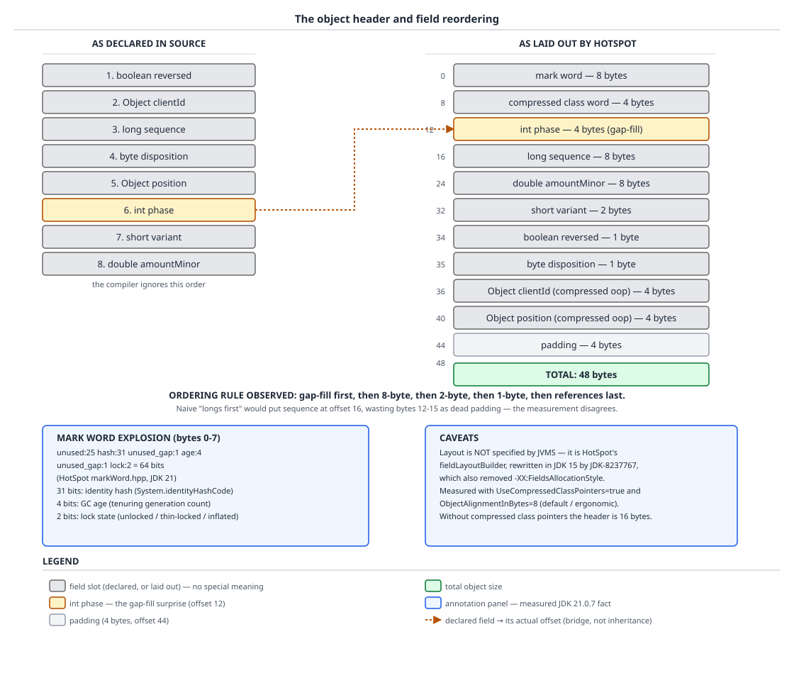

# 03 Java Core — Object layout and memory — INTERNALS (§3.8, 3.8.1–3.8.13)

**Target version: Java 21 LTS.** | **Part 3 of 5** | [Index](../00-index.md)
Previous: [`hashCode`, identity and equality internals](04-internals-hashcode-and-identity.md) · Next: [Variables, classes and initialization order](../classes-and-initialization/01-basics.md)

Every object on the heap begins with a fixed prologue it did not ask for — a header nobody declared — and every size question in Java reduces to "prologue plus fields, rounded up." This file works that arithmetic from measurement rather than folklore: a real field-offset table pulled with `Unsafe.objectFieldOffset`, a real mark-word bit layout from `markWord.hpp`, and a footprint table you can reproduce line by line. Where a number is not on this page or derivable from one that is, it is flagged and pushed to `## Open questions` rather than asserted.

All measurements below are on **Oracle JDK 21.0.7 (build 21.0.7+8-LTS-245), macOS aarch64**, unless a version is stated otherwise.

## 1. The header, and the arithmetic everything else is built on (3.8.1, 3.8.4, 3.8.5)

Picture every object as a locked box: before you can put a single field of yours inside, the JVM nails a fixed-size prologue to the front — a slab of bookkeeping that has nothing to do with what you declared. `new Object()` with zero fields still costs bytes. The picture that matters is not "an object is my fields" but "an object is a fixed header plus my fields, and the header is not negotiable."

### Why it exists

Every object needs, at minimum, a place to store its identity hash, its GC generation, its lock state, and a pointer back to its `Class` metadata — none of which the language lets you declare, all of which the runtime needs on every single instance to make `synchronized`, `hashCode`, garbage collection, and virtual dispatch work without a side table. HotSpot puts that bookkeeping inline, at a fixed offset, so it never needs a lookup: dereference the object, and the header is right there.

### The mechanism

On Oracle JDK 21.0.7, macOS aarch64, with `UseCompressedClassPointers = true {default}`:

- **Mark word:** 8 bytes. Identity hash, GC age, lock bits — the full bit layout is 3.8.2 below.
- **Compressed class word:** 4 bytes. A compressed pointer to the object's `Class` metadata, valid because `UseCompressedClassPointers` is on by default on this build.
- **Object header total: 8 + 4 = 12 bytes.**

Without compressed class pointers (`-XX:-UseCompressedClassPointers`, or automatically past the Compressed Class Space limit), the class word widens to a full 8-byte pointer: 8 + 8 = **16 bytes**. Every arithmetic total in this file that uses 12 becomes 16 in that mode, and everything downstream shifts by 4.

**Array header (3.8.4):** an array is an object that also needs to know its own length, because `arraylength` cannot walk off the end of a `Class` to find it — length varies per instance, so it lives per instance. Object header (12) + 4-byte `int` length = **16 bytes**. That is before a single element is stored.

**Alignment (3.8.5):** HotSpot never leaves an object at an arbitrary byte offset in memory; every object starts on an 8-byte boundary, controlled by `ObjectAlignmentInBytes = 8 {default}` on this build. The rounding function, in code:

```java
static int align(int bytes) {
    return (bytes + 7) / 8 * 8;
}
```

Run it on the header size: 12 is not a multiple of 8, so `align(12) = (12 + 7) / 8 * 8 = 19 / 8 * 8 = 2 * 8 = 16`. That is why a bare `new Object()` — 12-byte header, zero fields — still occupies **16 bytes**: the header alone does not land on an 8-byte boundary, so alignment pads it up before any field is added.

`-XX:ObjectAlignmentInBytes` can be raised (to 16, 32, or 64, each a power of two), and doing so is a real trade, not a free lunch: a larger alignment lets a compressed 32-bit oop address a proportionally larger heap — at 16-byte alignment the compressed-oop ceiling roughly doubles from ~32 GB to ~64 GB — but every object's padding grows too, so small objects (and QuizStakes has an enormous number of small `LedgerEntry`-shaped ones) waste more bytes each. You are trading heap-addressability headroom for per-object padding tax; raise it only once you have measured that the heap-size ceiling, not the padding, is the actual constraint.

The domain arithmetic that makes 12 bytes matter: ledger entries run at roughly 19.8M/day and roughly 7.2B/year. Even before a single field is counted, the header line item alone is `12 bytes x 7,200,000,000 = 86,400,000,000 bytes ~ 80.5 GiB/year` of pure prologue, ignoring alignment and every field the entry actually carries. That is the argument for measuring layout rather than shrugging at "it's just a header."

**Insight:** the header is not proportional to your data. A `LedgerEntry` with one `boolean` field and a `LedgerEntry` with eight fields pay the identical 12-byte tax; the header is a fixed cost per object, which is exactly why "many small objects" is a worse footprint shape than "fewer, fatter objects" for the same total data — a fact that motivates flattening and object pooling in JVM internals (guide 06).

## 2. The mark word as 64 bits of contested real estate (3.8.2, 3.8.3)

The mark word is not a name for "the header" — it is one specific 8-byte cell inside the header, and it is not idle bookkeeping so much as a tiny, fiercely contested apartment. Three different tenants — the identity hash, the GC age counter, and the lock state — all want to live in the same 64 bits, and only one arrangement can be active at a time. The picture: not "extra space for metadata" but "a scarce resource with a rent war."

### The mechanism

HotSpot's `markWord.hpp`, for a normal (unlocked, non-biased) object on JDK 21, after biased locking was removed in JDK 18:

```
unused:25  hash:31  unused_gap:1  age:4  unused_gap:1  lock:2
```

Add the field widths: `25 + 31 + 1 + 4 + 1 + 2 = 64`, exactly the mark word's width. Reading each field:

- **`hash:31`** — 31 bits for the identity hash. That is why `System.identityHashCode` never returns a negative `int`: a 31-bit unsigned field packed into a signed 32-bit return value is always non-negative. (Where that 31-bit value comes from — the generation modes, the mode-4-versus-mode-5 address proof — is `04-internals-hashcode-and-identity.md`, not here; this file owns the storage, not the generation.)
- **`age:4`** — 4 bits of GC tenuring age. A 4-bit field holds 0–15, and that width is precisely why `-XX:MaxTenuringThreshold` cannot be set above 15: the counter that tracks how many collections an object has survived physically cannot count higher, so the flag's ceiling is not a policy choice, it is a field-width fact.
- **`lock:2`** — 2 bits of lock state (unlocked, lightweight/thin-locked, heavyweight/inflated, marked-for-GC, depending on encoding).
- **`unused:25`** and the two **`unused_gap:1`** bits are exactly that on a plain object — spare capacity, not a hidden feature.

**[VERSION-TRAP]** The second `unused_gap:1` is not always-been-empty. On JDK 17 and earlier that bit position held `biased_lock:1`, part of biased locking's per-object fast path (a thread that repeatedly re-locks the same uncontended object skips the atomic CAS by "biasing" the lock toward it, at the cost of an expensive bias-revocation when a second thread wants the lock). Biased locking was disabled by default in JDK 15 (JEP 374, "Deprecate and Disable Biased Locking") and **removed outright in JDK 18**. Confirmation on this build: a full `java -XX:+PrintFlagsFinal -version` dump on JDK 21.0.7 contains no `BiasedLock*` flag at all — not `UseBiasedLocking`, not any of its tuning companions. Every mark-word diagram that still shows a biased-locking bit plus a thread-pointer encoding is describing JDK 17 or earlier; on 21 that tenant has moved out and the slot is genuinely unused. State this at the point of the claim, because interviewers who learned the layout before JDK 18 will ask for the old picture.

### 3.8.3 — computing an identity hash inflates the mark word, and that costs you

**Pitfall:** believing `System.identityHashCode(o)` (or a default, un-overridden `hashCode()`) is a free read. It is not, once the object is also locked.

The mark word's 31-bit `hash` field and the lock-state encoding are **not simultaneously available** — the same 64 bits that hold a computed identity hash cannot, at the same time, hold a displaced-header pointer for a lightweight (thin) lock, because a thin lock needs those bits to point at the lock record on the locking thread's stack, and a computed hash needs them to hold the hash value. HotSpot's rule: once an object has had its identity hash computed and cached in the mark word, it is no longer eligible for the cheap lightweight-locking fast path. Locking that object from then on has to go straight to a **heavyweight, allocating monitor** — an actual `ObjectMonitor` structure gets allocated and associated with the object, a real per-object cost that would otherwise never have been paid.

Concretely, the sequence that trips people is:

1. Some code calls `identityHashCode`, `IdentityHashMap` inserts the object as a key, or — the sneaky one — code calls the default `toString()`, whose implementation is `getClass().getName() + "@" + Integer.toHexString(hashCode())`, which **calls `hashCode()`** and, for a class with no override, that is the identity hash.
2. The mark word now carries a real 31-bit hash value, so it can never again encode a thin lock for that object.
3. Any later `synchronized (thatObject)` cannot take the lightweight path and must **inflate to a heavyweight monitor** immediately.

The interview payoff: **a debug log line can inflate a monitor.** `LOGGER.debug("reservation={}", reservation)` on a `Reservation` with no `toString()` override calls the default `toString`, which calls `hashCode()`, which computes and caches the identity hash in the mark word — and if that same `Reservation` is also `synchronized` on elsewhere (a common pattern for guarding a single reservation's state transitions), every subsequent lock on it pays heavyweight-monitor overhead that a build with the log line at `INFO` (or without the accidental `toString` call) would never pay. QuizStakes runs stake reservations at up to 1,200/sec peak; if `Reservation` objects are logged on the hot path and also synchronized on for stake-settlement races, that debug statement is not free — it is a standing tax on every subsequent lock acquisition for that object's lifetime.

The practical rule: `System.identityHashCode`, `IdentityHashMap`, and a default `hashCode()` on an object you also `synchronize` on are not free reads — treat them as a locking-relevant side effect, not a query. Full lock-state mechanics, monitor inflation internals, and the concurrency consequences belong to guide 05 Concurrency; identity-hash generation belongs to `04-internals-hashcode-and-identity.md`. This file's job was narrower and now done: state what the 64 bits hold and why the two tenants collide.

## 3. Field reordering, proved by measurement (3.8.7, 3.8.5)

The naive mental model most engineers carry is "fields sit in the object in declaration order." Measurement says otherwise, and the gap between the two is the entire content of this section.

### The mechanism

Declare `LedgerEntry` with its eight fields in deliberately scrambled order — `long sequence` is the ledger sequence number, `int phase` is the status code's phase digit (the `N` in `XX-Nnn`), `short variant` a status variant discriminator, `boolean reversed` the reversal flag, `byte disposition` the disposition digit (`0` in progress, `1` success, `5` referred, `9` failed — the middle digit of every QuizStakes status code), `double amountMinor` the ledger amount in minor units (and yes, a `double` is the wrong type for money — see the note below), plus two reference fields:

```java
static class LedgerEntry {
    boolean reversed;      // declared 1st
    Object  clientId;      // declared 2nd
    long    sequence;      // declared 3rd
    byte    disposition;   // declared 4th
    Object  position;      // declared 5th
    int     phase;         // declared 6th
    short   variant;       // declared 7th
    double  amountMinor;   // declared 8th
}
```

`double amountMinor` is here to make the layout point, not the domain point — the real `LedgerEntry` in QuizStakes carries `Money(BigDecimal amount, Currency currency)`, worked in `../numbers-and-money/02-numbers-and-money.md`; a `double` cannot represent `0.33` exactly and this file is not the place to relitigate that.

Measured with `Unsafe.objectFieldOffset` on Oracle JDK 21.0.7, macOS aarch64:

| Field | Type | Offset | Width |
|---|---|---|---|
| header (mark word + compressed class word) | — | 0 | 12 |
| `phase` | `int` | 12 | 4 |
| `sequence` | `long` | 16 | 8 |
| `amountMinor` | `double` | 24 | 8 |
| `variant` | `short` | 32 | 2 |
| `reversed` | `boolean` | 34 | 1 |
| `disposition` | `byte` | 35 | 1 |
| `clientId` | reference | 36 | 4 |
| `position` | reference | 40 | 4 |

Last field ends at offset 44; `align(44) = (44 + 7) / 8 * 8 = 51 / 8 * 8 = 6 * 8 = 48`, giving a total instance size of **48 bytes**.

**Declaration order is completely ignored.** `reversed` was declared first and sits at offset 34; `phase` was declared sixth and sits at offset 12, ahead of everything. Derive the rule from the data rather than reciting the syllabus version of it: the observed placement order is **gap-fill first**, then descending width. The 12-byte header does not end on an 8-byte boundary — it ends 4 bytes short of one — so before the JVM lays out any field at its "natural" position, it looks for something 4 bytes wide to drop straight into that gap at offset 12. `phase` (an `int`, 4 bytes) fits exactly, and gets placed there. Only after the gap is filled does the JVM lay out the remaining fields widest-first: the 8-byte `sequence` and `amountMinor` at offsets 16 and 24, the 2-byte `variant` at 32, the 1-byte `reversed` and `disposition` at 34 and 35, and finally both 4-byte references at 36 and 40 — references go last regardless of width, because HotSpot groups them together for the GC's oop-map scan.

**The widely repeated "longs and doubles first" rule mispredicts this exact layout.** Applied naively, it would put `sequence` (the first 8-byte field) at offset 16 and leave the 4 bytes at offset 12 wasted padding — but the measurement shows `phase` sitting in that gap instead, at offset 12, with `sequence` still landing at 16 because it needs its own 8-byte alignment regardless of what came before. "Longs first" is a passable approximation for objects with no header-sized gap to fill, and a wrong prediction for the offset of the field that fills the gap.

**Two control measurements** isolate the gap-filling behaviour from field-ordering noise:

- A class with a single `int` field: the field lands at offset **12** — directly in the post-header gap, no competition.
- A class with a single `long` field: the field lands at offset **16**, with the 4 bytes at offset 12 left as pure padding, because a `long` needs 8-byte alignment and 12 is not a multiple of 8.

Put those two together and the whole rule falls out: HotSpot will use a 4-byte-wide field to fill the header gap if one is available, and will pad past the gap if the only fields left are 8-byte-aligned.



**D-112** — look at the two columns side by side: the declared order of `LedgerEntry`'s eight fields on the left, and the measured byte-offset map on the right, with `int phase` picked out in its own colour sitting at offset 12 — inside the header's alignment gap, not after the 8-byte fields. The lower band explodes the 8-byte mark word into its bit fields, and the caveats panel lists the HotSpot-only qualifications (not JVMS, rewritten in JDK 15, no `-XX:FieldsAllocationStyle` any more) that keep this from being a portable guarantee.

### The caveat, stated plainly

**Layout is not specified by the JVMS.** The class-file format says nothing about field placement inside an instance; it is entirely a HotSpot implementation choice, made by `fieldLayoutBuilder`, which was **rewritten in JDK 15 by JDK-8237767** ("New field layout computation") — a change that also **removed** the older `-XX:FieldsAllocationStyle` flag that used to let you select between layout strategies. A layout you measured on JDK 21.0.7 aarch64 is evidence about this build, not a contract about the platform. Anything that depends on a specific field offset holding across JVM versions, vendors, or architectures — a hand-rolled binary wire format, an offset baked into `Unsafe` code shipped to production, a serialization scheme that assumes field order — is a latent bug waiting for the next JDK upgrade to break it silently.

## 4. Worked footprints (3.8.9, 3.8.6)

Reproduce every total by showing the arithmetic step, not just quoting it — the step that gets skipped is almost always the alignment rounding, and that is where wrong numbers come from.

| Instance | Arithmetic | Size |
|---|---|---|
| `new Object()` | 12-byte header, `align(12) = 16` | **16** |
| `Integer` | 12 header + 4 `int value` = 16, already aligned | **16** |
| `Long` | 12 header + 4 pad (a `long` needs 8-byte alignment, so the header's leftover 4 bytes cannot hold it) + 8 `long value` = 24 | **24** |
| `new String("hello")` | shell 12 + 4 `value` ref + 4 `hash` + 1 `coder` + 1 `hashIsZero` = 22 → `align(22) = 24`; array 16 header + 5-byte Latin-1 payload = 21 → `align(21) = 24`; total 24 + 24 | **48** |
| `new int[10]` | 16-byte array header + 10 x 4 bytes = 16 + 40 = 56, already aligned | **56** |
| `new Object[10]` | 16-byte array header + 10 x 4-byte compressed references = 16 + 40 = 56 | **56** |
| empty `ArrayList` | 12 header + 4 `elementData` ref + 4 `size` + 4 `modCount` = 24, already aligned, plus a shared zero-length `Object[]` amortised across every empty list | **24** |

Two of those rows need the extra sentence the table cannot carry:

- **`Long` is 24, not 16, because of padding, and that is the single most-missed step.** The header (12 bytes) is not a multiple of 8, so the 8-byte `long value` field cannot start at offset 12 — it must start at the next 8-byte boundary, offset 16, leaving 4 bytes of dead padding at offset 12–15 that nothing occupies. Compare with `Integer`: its `int value` is only 4 bytes wide, so it fits directly into the offset-12 gap with no padding at all, which is why `Integer` (16) is smaller than `Long` (24) by more than the 4-byte difference between an `int` and a `long` — the padding, not just the payload, is the difference.
- **`new String("hello")` = 48 bytes total**, 24 for the shell and 24 for the backing `byte[]`. The full derivation of the `String` shell's field layout, the Latin-1/UTF-16 coder split, and the compact-strings arithmetic in general is worked in detail in `../strings/03-internals-string.md` — this row is a cross-reference, not a re-derivation.

**`new Object[10]` is 56 bytes only because references are compressed to 4 bytes each.** That "only" is 3.8.6, the compressed-oops cliff, and it is the reason this section earns a second half.

### 3.8.6 — the compressed-oops cliff, derived rather than quoted

Verified on this build: `UseCompressedOops = true {ergonomic}` — HotSpot turns compressed oops on automatically, not by explicit flag, whenever the heap is small enough for them to address. A compressed oop is a 32-bit value, but object references are not byte-addressed when compressed — they are addressed in units of the object-alignment granularity, because every object already starts on an 8-byte boundary (3.8.5), so the low 3 bits of any real address are always zero and do not need to be stored. Derive the ceiling rather than quoting it: **a 32-bit compressed oop can distinguish 2^32 distinct 8-byte-aligned slots**, and `2^32 x 8 bytes = 34,359,738,368 bytes = 32 GiB`. That is where "roughly 32 GB" comes from — it is not a round number chosen for convenience, it is `2^32` multiplied by the alignment unit.

Below that heap-size ceiling, every reference field — in every object, every array slot — is 4 bytes. Cross the ceiling (`-Xmx` at or above roughly 32 GB, or a smaller effective ceiling if `ObjectAlignmentInBytes` is left at the default 8) and HotSpot can no longer address the whole heap with a 32-bit compressed value; every reference in the entire heap widens to a full 8-byte pointer, all at once, everywhere.

**The cliff is the whole reason this leaf exists: raising `-Xmx` from just under the ceiling to just over it can make usable capacity go down, not up.** Recompute the `Object[10]` row at 8-byte references instead of 4: `16-byte array header + 10 x 8 bytes = 16 + 80 = 96` bytes, up from 56 — a 71% increase in that one array's footprint, and every other reference-bearing object in the heap grows by the same proportion simultaneously. A `LedgerEntry` recomputed the same way: its two reference fields (`clientId`, `position`) go from 4 bytes each to 8, adding 8 bytes before realignment, so the 44-byte pre-padding total becomes 52, `align(52) = 56` — up from 48. Multiply that 8-byte-per-entry increase across 7.2B ledger entries a year and the "helpful" extra heap has just cost roughly `8 bytes x 7,200,000,000 = 57,600,000,000 bytes ~ 53.6 GiB` in reference bloat alone, on top of whatever headroom the larger `-Xmx` was meant to buy. Heap sizing past this ceiling, and the GC-side consequences of it, are guide 06 JVM internals; the arithmetic that tells you the ceiling exists is this file's job.

## 5. Supporting facts

### 3.8.8 — false sharing and `@Contended`

Cache coherence is tracked per cache line, 64 bytes on the relevant hardware, not per variable — so two unrelated `Position` counters that happen to land in the same 64-byte line (`CLIENT_CASH_AVAILABLE` and `CLIENT_BONUS_AVAILABLE`, say, updated by different settlement threads) invalidate each other's cached copy of the whole line on every single write, even though the two threads never touch the same field. `jdk.internal.vm.annotation.Contended` pads an annotated field out to occupy its own cache line so two counters can no longer share one, but it is an internal, non-public-API annotation, and — **Unverified:** the precise behaviour of `-XX:-RestrictContended` and whether `@Contended` is honoured on arbitrary user classes without it on JDK 21 specifically is not something this file can confirm from a primary source in this session; it is recorded in `## Open questions` rather than asserted. The honest verdict either way: this is a measured-last-resort technique, reached for only after a profiler has shown line-level contention on a specific field pair, not a default. At QuizStakes's stake settlement burst of 3,400/sec, two unpadded counters on the same line are exactly the kind of thing a profiler would need to catch before anyone reaches for `@Contended` — and the usual first fix is `LongAdder`, which sidesteps the sharing problem structurally instead of padding around it. Full cache-coherence mechanics and the concurrency toolbox belong to guide 05 Concurrency.

### 3.8.10 — measuring with JOL

Two entry points, and the distinction between them is the one that catches people out. `ClassLayout.parseInstance(x).toPrintable()` reports **one object's own shell**, field by field, with offsets and padding — run it on a `Movement` and it tells you exactly what this file's tables tell you about `LedgerEntry`: the shell size and nothing about what the object points at. `GraphLayout.parseInstance(x).totalSize()` instead walks the whole **reachable object graph** from the root and sums every object it finds — run it on that same `Movement` holding a `List<LedgerEntry>` and it reports the `Movement` shell plus the `ArrayList` shell plus its backing array plus every `LedgerEntry` reachable from it. `ClassLayout` on the `Movement` alone would say nothing about the `List<LedgerEntry>` hanging off it — it would report a shell of a handful of reference fields and call it done, which is the wrong answer to "how much heap does this `Movement` cost me." `GraphLayout.parseInstance(x).toFootprint()` gives the same graph walk but broken down as a per-class histogram — useful for seeing which class in the graph dominates the total. JOL is an external dependency (`org.openjdk.jol:jol-core`); the `Unsafe.objectFieldOffset` approach used for every offset in section 3 above is the dependency-free alternative when you cannot add a library to the classpath. A short usage sketch:

```java
// ClassLayout: one object's own shell, offsets and padding
System.out.println(ClassLayout.parseInstance(ledgerEntry).toPrintable());

// GraphLayout: the whole reachable graph, one total in bytes
long bytes = GraphLayout.parseInstance(movement).totalSize();

// GraphLayout: same graph, broken down per class
System.out.println(GraphLayout.parseInstance(movement).toFootprint());
```

JOL's own installation, and heap-dump-based analysis for objects already running in production, are guide 06 JVM internals.

### 3.8.11 — Project Lilliput and compact object headers

Confirmed on this build by exhaustive flag search: **`UseCompactObjectHeaders` does not exist on JDK 21** — a full `-XX:+PrintFlagsFinal` dump on 21.0.7 contains no such flag, experimental or otherwise. Project Lilliput's compact headers are **experimental in JDK 24** (JEP 450) and become a **product feature in JDK 25** (JEP 519), and even in 25 the feature is off by default. The change, when it lands: the header drops from 12 bytes to **8**, because the compressed class pointer is folded into spare bits of the mark word instead of occupying its own separate 4-byte cell — one 8-byte cell does the work that currently takes 8 (mark) + 4 (class) = 12.

Every number in this file's tables shifts under that model, but not all by the same amount, and the interesting result is which totals **do not** change at all. Recompute three rows at an 8-byte header instead of 12:

- **`new Object()`**: 8-byte header, `align(8) = 8`. Down from 16 to **8** — a full halving, because the object was previously all padding: a 12-byte header rounds up to 16, wasting 4 bytes, but an 8-byte header is already a multiple of 8 and wastes nothing.
- **`Integer`**: 8 header + 4 `int value` = 12, `align(12) = 16`. **Unchanged at 16** — the smaller header freed up 4 bytes, but `align(12)` still rounds up to the same 16 that `align(16)` (the current 12 + 4, already aligned) produces. The alignment step absorbed the saving entirely.
- **`Long`**: 8 header + 8 pad (a `long` still needs 8-byte alignment, and offset 8 already is a multiple of 8, so — recompute carefully: 8-byte header ends exactly at offset 8, which is already 8-aligned, so `long value` needs **no** padding at all) + 8 `long value` = 16. Down from 24 to **16** — an 8-byte saving, because the padding that the 12-byte header used to force is gone entirely once the header itself lands on an 8-byte boundary.

The pattern: instances whose next field after the header was already going to need its own alignment padding (`Long`, `LedgerEntry`'s `int phase` slot logic in general) see the saving pass straight through; instances that were already being rounded up to the next 8-byte multiple regardless (`Integer`) see the saving absorbed by the rounding and the total does not move. This is forward-looking: on JDK 21, the numbers earlier in this file — the 12-byte header, the 48-byte `LedgerEntry`, the 16-byte `Object` — are the ones you actually get, and quoting an 8-byte header on a JDK 21 production system would be wrong.

### 3.8.12 — where fields actually live

Object storage is heap-only, full stop: a primitive field (`int phase`, `boolean reversed`) is stored **inline**, its bytes sitting directly inside the owning object's own memory at the offset the layout algorithm assigned it in section 3; a reference field (`Object clientId`) is 4 or 8 bytes **inside that same object**, but those bytes are an address pointing somewhere else on the heap, not the referenced object's data itself. An object's own size therefore never includes the size of whatever it points to — which is exactly the sentence that makes `ClassLayout` versus `GraphLayout` (3.8.10) obvious rather than surprising: "how big is a `Movement`" has two correct answers, one for the shell alone and one for everything reachable from it, and neither is wrong, they are answers to different questions. `01-basics.md` in this folder introduced where each kind of variable lives at BASICS depth and owns D-011 (the stack-frame/heap/class-static-area picture); this section adds the mechanism this file needed and does not repeat that diagram. Object layout, headers, and `ObjectAlignmentInBytes` beyond what is needed here are guide 06 JVM internals.

### 3.8.13 — stack frames and the local variable array

A method's local variables — including the primitive-typed ones just discussed — do not live in any object at all; they live in the current stack frame's **local variable array**, a fixed-size array of slots allocated when the frame is created, indexed by slot number rather than by name (names are debug metadata, present only with `-g`, and are why a debugger loses local variable names when compiled without it). In the abstract machine a slot is 4 bytes wide, sized for an `int`, a `float`, a reference, or a `returnAddress`; a `long` or a `double` needs 8 bytes, so it occupies **two consecutive slots** rather than one, and neither slot alone holds a meaningful value. Slot 0 of an instance method's frame is reserved for `this` (absent entirely in a `static` method, where slot 0 is the first declared parameter). The compiler is free to reuse a slot for two different source-level locals whose live ranges never overlap, which is exactly why "how many local variables does this method have" is not answerable by counting `javac`'s output — the bytecode's `max_locals` is a slot count, not a variable count, and two named locals can legally share slot 3 if the first is dead before the second is born.

Take `FundsLedger.reserveStake(ClientId clientId, Money stake)` with an `int attempt` local added inside a retry loop: as an instance method, slot 0 is `this`, slot 1 is the reference parameter `clientId`, slot 2 is the reference parameter `stake`, and slot 3 is `attempt` — a 4-byte primitive, one slot, reused for nothing else in this sketch because its live range spans the whole method body.

The payoff sentence: **a primitive local has no header and no identity.** It is four (or eight) bytes in a slot, nothing more — no mark word, no class pointer, no `System.identityHashCode`, because it is never an object. That absence is exactly why JIT escape analysis eliminating a boxed wrapper is worth so much: turning a heap-allocated `Integer` (16 bytes, header and all, per section 4) back into a header-free int living in a slot removes the entire header tax, not just the four payload bytes — full treatment of that trade in `../wrappers-and-boxing/03-internals-boxing.md`. Link back to `01-basics.md` and D-011 for the frame/heap/static-area picture this section builds on top of; the deeper bytecode mechanics of frame creation and `max_locals` are guide 06 JVM internals.

## Pitfalls

### Believing field layout follows declaration order

**Wrong**

```java
static class LedgerEntry {
    boolean reversed;
    Object  clientId;
    long    sequence;
    byte    disposition;
    Object  position;
    int     phase;
    short   variant;
    double  amountMinor;
}
// Assumed: reversed sits first in memory, amountMinor last.
```

The surprise: measured with `Unsafe.objectFieldOffset` on JDK 21.0.7, `reversed` sits at offset 34 and `phase` — declared sixth — sits at offset 12, ahead of every other field including the ones declared before it. Declaration order and memory order have no relationship at all; the JVM's `fieldLayoutBuilder` reorders everything for packing efficiency, gap-fill first, then descending width, references last.

**Right**

```java
// Measure it. Never assume.
long offset = UNSAFE.objectFieldOffset(LedgerEntry.class.getDeclaredField("phase"));
System.out.println(offset); // 12, not "wherever I declared it"
```

**Why people believe it:** every other ordered construct in Java — array elements, `List` iteration, constructor parameter order — preserves declaration or insertion order, so it is a reasonable-looking generalisation that happens to be false for exactly this one thing.

### Trusting the "longs and doubles first" rule to predict every offset

**Wrong**

```java
// "Longs and doubles are always placed first" -> predicted:
// sequence at 16, phase somewhere after the 8-byte fields.
```

The surprise: the measured layout puts `phase` — a 4-byte `int` — at offset 12, ahead of `sequence`, an 8-byte `long`, which lands at 16. The naive rule ignores the 4-byte gap the 12-byte header leaves before the first 8-byte boundary, and HotSpot fills that gap with the first available 4-byte field before laying out anything wider.

**Right**

```java
// Predict gap-fill first, then descending width, then references last.
// header(12) -> 4-byte field into the gap at 12 -> 8-byte fields at 16, 24
// -> 2-byte fields -> 1-byte fields -> references last, then pad to 8.
```

**Why people believe it:** "longs and doubles first" is the headline half of the real rule and is repeated everywhere without the header-gap caveat, because most write-ups do not actually measure a real object — they state the rule from the JIT literature without checking it against `Unsafe`.

### Calling `hashCode()` or `identityHashCode` on an object you also lock on, without thinking about it

**Wrong**

```java
final class Reservation {
    // no toString() override, no hashCode() override
    private final ClientId clientId;
    private final Money stake;

    Reservation(ClientId clientId, Money stake) {
        this.clientId = clientId;
        this.stake = stake;
    }

    ClientId clientId() {
        return clientId;
    }
}

void settle(Reservation reservation) {
    LOGGER.debug("settling {}", reservation); // calls default toString() -> hashCode()
    synchronized (reservation) {
        reservation.clientId(); // any locked body inflates a monitor from here on
    }
}
```

The surprise: the debug log line calls the default `toString()`, which calls `hashCode()`, which computes and permanently caches an identity hash in the mark word. From that point on, `synchronized (reservation)` can never use the cheap lightweight-locking encoding for this object again — every acquisition inflates to a heavyweight monitor, a real allocation, on every settlement, purely because of a log statement that looked inert.

**Right**

```java
final class Reservation {
    private final ClientId clientId;
    private final Money stake;

    Reservation(ClientId clientId, Money stake) {
        this.clientId = clientId;
        this.stake = stake;
    }

    ClientId clientId() {
        return clientId;
    }

    @Override
    public String toString() {
        return "Reservation[clientId=%s]".formatted(clientId);
    }
}

void settle(Reservation reservation) {
    if (LOGGER.isDebugEnabled()) {
        LOGGER.debug("settling clientId={}", reservation.clientId());
    }
    synchronized (reservation) {
        reservation.clientId(); // lightweight locking still available
    }
}
```

Overriding `toString()` (or, better, logging a specific field rather than the object itself) means the default identity `hashCode()` is never invoked as a side effect, so the mark word never gets pinned into hash-carrying mode and lightweight locking stays available.

**Why people believe it:** a log statement reads like a pure, side-effect-free observation of state, and nothing in `LOGGER.debug("settling {}", reservation)` looks like it touches locking at all — the connection runs through `toString` to `hashCode` to the mark word to the lock encoding, four hops away from the line that actually causes it.

### Assuming a larger `-Xmx` always means more usable heap

**Wrong**

```
# "More memory can only help." Bumping the heap ceiling from just under
# to just over the compressed-oops threshold:
-Xmx31g   ->   -Xmx33g
```

The surprise: crossing roughly 32 GB flips `UseCompressedOops` off, and every reference in the entire heap widens from 4 bytes to 8 at once — every `LedgerEntry`'s `clientId` and `position` fields, every array slot, every object graph edge. The reference-bloat overhead can eat a meaningful fraction of the extra 2 GB you thought you were adding, and in a reference-heavy workload can leave you with *less* effective room for actual data than the smaller heap had.

**Right**

```
# Stay under the compressed-oops ceiling if the workload is reference-heavy,
# or size deliberately past it and account for the widened references
# in capacity planning, not as an afterthought.
-Xmx31g   # stays compressed: 4-byte references throughout
```

**Why people believe it:** heap size is normally a monotonic knob — more is safer — and the compressed-oops cliff is the one place in the JVM where that intuition inverts, silently, with no warning at startup.

## Cheat sheet

| Item | Value |
|---|---|
| Object header (compressed class ptr) | 8 (mark word) + 4 (class word) = **12 bytes** |
| Object header (no compressed class ptr) | 8 + 8 = **16 bytes** |
| Array header | object header (12) + 4 length = **16 bytes** |
| `ObjectAlignmentInBytes` | `8 {default}`; must be a power of two; raising it trades padding for a higher compressed-oop ceiling |
| Alignment function | `(bytes + 7) / 8 * 8` |
| Mark word bit layout (JDK 21, normal object) | `unused:25 hash:31 unused_gap:1 age:4 unused_gap:1 lock:2` (sums to 64) |
| Identity hash width | 31 bits — why `identityHashCode` is never negative |
| GC age width | 4 bits — 0 to 15, hence `MaxTenuringThreshold` cannot exceed 15 |
| Lock state width | 2 bits |
| Biased locking | disabled by default JDK 15 (JEP 374), **removed** JDK 18; absent from JDK 21 flag dump; second `unused_gap:1` is its old slot |
| Mark-word / lock collision | identity hash cached in mark word forces monitor **inflation** on later `synchronized` — not free |
| Field layout order (measured) | gap-fill first (a 4-byte field into the offset-12 gap), then 8-byte, then 2-byte, then 1-byte, then references last |
| Control: lone `int` field | offset **12** |
| Control: lone `long` field | offset **16** (4-byte pad at 12) |
| `LedgerEntry` (8 fields, measured) | ends at 44, `align(44)` = **48 bytes** |
| Field layout guarantee | none — HotSpot `fieldLayoutBuilder`, rewritten JDK 15 (JDK-8237767), removed `-XX:FieldsAllocationStyle` |
| `new Object()` | 12 header, `align(12)` = **16** |
| `Integer` | 12 + 4 = **16** |
| `Long` | 12 + 4 pad + 8 = **24** |
| `new String("hello")` | 24 shell + 24 array = **48** (see `../strings/03-internals-string.md`) |
| `new int[10]` | 16 + 40 = **56** |
| `new Object[10]` | 16 + 10 x 4 = **56** (only because oops are compressed) |
| empty `ArrayList` | 12 + 4 + 4 + 4 = **24**, plus a shared zero-length array |
| Compressed oops ceiling | `UseCompressedOops = true {ergonomic}`; `2^32 x 8 bytes` = **32 GiB** |
| Above the ceiling | references widen 4 -> 8 bytes heap-wide; `Object[10]` becomes 96, `LedgerEntry` becomes 56 |
| Compact object headers (Lilliput) | absent on JDK 21; experimental JDK 24 (JEP 450); product, off by default, JDK 25 (JEP 519); header drops 12 -> 8 |
| Fields live | heap only; primitive inline, reference is 4/8 bytes pointing out |
| Local variable slot width | 4 bytes; `long`/`double` take two consecutive slots; slot 0 is `this` in an instance method |
| JOL single object | `ClassLayout.parseInstance(x).toPrintable()` |
| JOL whole graph | `GraphLayout.parseInstance(x).totalSize()` / `.toFootprint()` |

## Self-test

**Q1.** Why is `new Object()` 16 bytes rather than 12, and why is `Integer` 16 bytes rather than 12 + 4 = 16 with no comment needed, while `Long` is 24 rather than 12 + 8 = 20?

<details><summary>Answer</summary>

The header itself is 12 bytes (8-byte mark word + 4-byte compressed class word), and 12 is not a multiple of 8, so alignment (`ObjectAlignmentInBytes = 8`) rounds a bare `Object` up to 16 with 4 bytes of pure padding and no fields at all. `Integer` adds one `int` field (4 bytes) into that same gap — 12 + 4 = 16, which is already a multiple of 8, so no further padding is needed and the arithmetic looks deceptively clean. `Long` adds one `long` field (8 bytes) instead, and an 8-byte field must itself start on an 8-byte boundary; offset 12 is not one, so the `long` cannot go there — it is pushed to offset 16, leaving the 4 bytes at 12-15 as dead padding, then the 8-byte field runs 16-23, for a total of 24, not the naively expected 20. The difference between `Integer` and `Long` is not just the extra 4 bytes of payload; it is the extra 4 bytes of forced padding on top of that.

</details>

**Q2.** A `LedgerEntry` with `int phase` and `long sequence` among its fields is measured, and `phase` is found at offset 12, not `sequence`. Why does the JVM place a 4-byte field ahead of an 8-byte one, when "longs and doubles first" is the commonly quoted rule?

<details><summary>Answer</summary>

The 12-byte header leaves a 4-byte gap before the next 8-byte boundary (offset 16). HotSpot's field-layout algorithm fills that gap with the first available 4-byte-wide field it has — in this case `int phase` — before laying out the remaining fields by descending width. `long sequence` still needs its own 8-byte alignment, so it goes to offset 16 regardless of whether the gap was filled or wasted; the only question the gap-fill decides is whether those 4 bytes at offset 12 hold real data or dead padding. "Longs and doubles first" describes the fields that come after the gap is settled, not the very first slot after the header — the measured control case (a lone `int` at offset 12, a lone `long` at offset 16 with padding before it) proves the gap-fill step exists independently of any long/double field being present at all.

</details>

**Q3.** What exactly collides inside the mark word when an object's identity hash is computed and the object is also `synchronized` on, and what is the real-world cost?

<details><summary>Answer</summary>

The mark word's bit layout on JDK 21 is `unused:25 hash:31 unused_gap:1 age:4 unused_gap:1 lock:2` — 64 bits total. The 31-bit hash field and the lightweight-locking encoding both need to use the same bits: a thin lock's fast path stores a pointer to a displaced-header lock record in that space, while a computed identity hash stores the actual hash value there. They cannot coexist. Once an object's identity hash has been computed and cached (via `System.identityHashCode`, `IdentityHashMap`, or a default un-overridden `hashCode()` — including the one the default `toString()` calls internally), any later attempt to lock that object cannot take the cheap lightweight-locking path and must inflate directly to a heavyweight, allocating `ObjectMonitor`. The concrete trap: a debug log statement that calls an object's default `toString()` silently computes and pins its identity hash, so a later `synchronized` block on that same object pays heavyweight-monitor cost from then on — a locking-relevant side effect hiding inside what looks like a pure logging call.

</details>

**Q4.** Derive the roughly-32-GB compressed-oops ceiling from first principles rather than quoting it, and say what happens to a `LedgerEntry`'s size if the heap crosses it.

<details><summary>Answer</summary>

A compressed oop is a 32-bit value, but because every object is required to start on an 8-byte-aligned address (`ObjectAlignmentInBytes = 8`), the low 3 bits of any real address are always zero and do not need to be encoded — the compressed value instead counts 8-byte-aligned slots rather than raw bytes. A 32-bit value can distinguish `2^32` such slots, and `2^32 x 8 bytes = 34,359,738,368 bytes`, which is 32 GiB. Below roughly that heap size, `UseCompressedOops` stays on (`{ergonomic}` on this build) and every reference field is 4 bytes; cross it and every reference in the heap must widen to 8 bytes because a 32-bit value can no longer address the whole space. For `LedgerEntry`, the two reference fields (`clientId`, `position`) go from 4 bytes each to 8, adding 8 bytes to the pre-padding total (44 -> 52), and `align(52) = 56` — up from the compressed 48-byte total.

</details>

**Q5.** Reproduce the arithmetic for `new String("hello")` totalling 48 bytes, and name where the full derivation of that number lives.

<details><summary>Answer</summary>

The `String` shell is 12-byte header + 4-byte `value` array reference + 4-byte cached `hash` + 1-byte `coder` + 1-byte `hashIsZero` = 22 bytes, rounded up by `align(22) = 24`. The backing `byte[]` holding the five Latin-1-encoded characters of `"hello"` is a 16-byte array header (12 + 4 length) plus 5 payload bytes = 21, rounded up by `align(21) = 24`. Total: 24 (shell) + 24 (array) = 48 bytes. The full field-by-field derivation of the `String` shell, the Latin-1/UTF-16 coder split, and the wider compact-strings memory arithmetic is worked in `../strings/03-internals-string.md` — this file quotes the 48-byte result as one row of a broader footprint table rather than re-deriving it.

</details>

**Q6.** Why does `Integer`'s footprint stay at 16 bytes under a hypothetical 8-byte compact object header, while `Long`'s footprint drops from 24 to 16?

<details><summary>Answer</summary>

Under the current 12-byte header, `Integer` is 12 + 4 = 16, already a multiple of 8, so no padding is added. Under a hypothetical 8-byte compact header, `Integer` becomes 8 + 4 = 12, which is not a multiple of 8 and must be rounded up by `align(12) = 16` — the same 16 bytes as before; the 4-byte saving from the smaller header is entirely absorbed by the alignment rounding, so the visible total does not move. `Long` under the current 12-byte header needs 4 bytes of padding to reach the 8-byte-aligned offset 16 before its `long` field can start, giving 12 + 4 pad + 8 = 24. Under an 8-byte compact header, offset 8 is already 8-byte aligned, so the `long` field needs zero padding: 8 + 8 = 16, already aligned. The 8-byte header removes the padding `Long` was forced to pay, so its total drops by a full 8 bytes, while `Integer`'s smaller total was already going to be rounded up regardless.

</details>

**Q7.** A `long` local variable and an `int` local variable both live in a method's local variable array. How do their storage requirements differ, and what does that have to do with a primitive's lack of identity?

<details><summary>Answer</summary>

A slot in the local variable array is 4 bytes wide, sized for an `int`, a `float`, a reference, or a `returnAddress`. A `long` (or `double`) does not fit in one slot, so it occupies two consecutive slots, with neither slot individually meaningful — reading only one half would not produce a valid value. Both kinds of local, single-slot or double-slot, share the property that matters for identity: neither has an object header, a mark word, or a class pointer, because a local variable array slot is not heap storage and nothing that lives purely in it is an object. That absence of header overhead is exactly why the JIT eliminating a boxed `Integer` via escape analysis — replacing a 16-byte heap object with a header-free 4-byte slot value — is worth the full 16 bytes, not just the 4 bytes of payload difference.

</details>

**Q8.** What does the measured `LedgerEntry` layout prove about the safety of depending on field offsets across JDK versions, and what specifically changed in JDK 15 that makes this concrete?

<details><summary>Answer</summary>

It proves nothing is guaranteed: the JVMS does not specify field layout at all, and the actual algorithm HotSpot uses (`fieldLayoutBuilder`) was rewritten in JDK 15 by JDK-8237767 ("New field layout computation"), a change that also removed the older `-XX:FieldsAllocationStyle` flag that used to let a user pick between layout strategies. That means the exact offsets measured here — `phase` at 12, `sequence` at 16, the two references last — are evidence about this specific build (Oracle JDK 21.0.7, macOS aarch64) and not a portable contract. Any code that hard-codes a field's offset for a wire format, a manual serialization scheme, or `Unsafe`-based field access baked into a deployed artifact is implicitly depending on undocumented, version-specific HotSpot internals, and an upgrade past a layout-algorithm change (like the JDK 15 rewrite) can silently break it with no compiler warning.

</details>

## Open questions

- Whether `-XX:-RestrictContended` is required for `jdk.internal.vm.annotation.Contended` to take effect on an arbitrary user class on JDK 21, and its precise default-gating behaviour on this build, is not confirmed from a primary source in this session. Settled by reading `restrictContended`-related logic in `compilerOracle.cpp` / `ciField` handling for this exact build, or by running a JOL `ClassLayout` comparison on an annotated user field with and without the flag.
- None beyond the above.

---

**Leaves covered:** 3.8.1–3.8.13 (13 leaves)
**Leaves deferred:** none
**Diagrams included:** D-112
**Target version:** Java 21 LTS
**Lines:** 471
