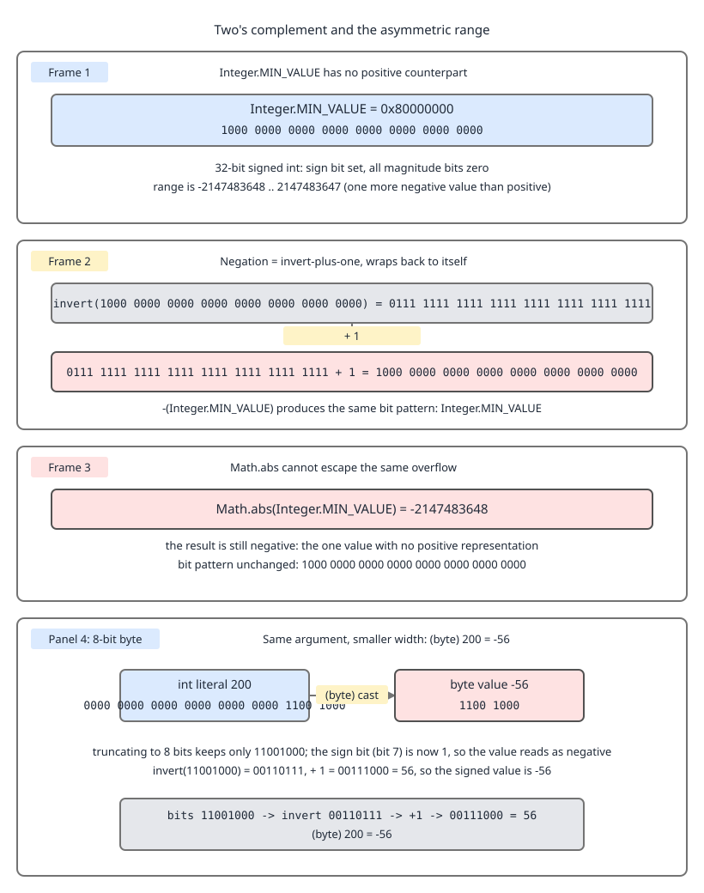

# 03 Java Core — Two's complement, overflow and integer division — BASICS (§1.3, 1.3.5–1.3.9, 1.3.21)

**Target version: Java 21 LTS.** | **Part 1 of 5** | [Index](../00-index.md)
Previous: [Primitive types: the eight kinds](01-basics.md) · Next: [Shifts and the unsigned story](01b-shifts-and-unsigned.md)

---

## 1. Two's complement and the asymmetric range (1.3.5, 1.3.21)

**Concept.** Two's complement is the encoding where the top bit is worth *negative* its place value. For 32 bits, bit 31 is worth -2^31 and bits 30..0 are worth +2^30..+2^0. Everything about negative numbers in Java follows from that one sentence, including the fact that `Math.abs` can return a negative number.

**Why it exists.** The alternatives — sign-and-magnitude, one's complement — both have two representations of zero, and both need the adder to inspect the sign bits. Two's complement has one zero and lets the *same* `iadd` circuit handle signed and unsigned operands. That is why the JVM has `iadd` but not `iadd_signed`, and why `int` addition needs no branch.

**How it works, worked through.** [PROVE] Count the patterns. 32 bits give 2^32 = 4,294,967,296 distinct patterns. One of them is zero. That leaves 4,294,967,295 non-zero patterns — an **odd** number, so it cannot split evenly between positives and negatives. Two's complement puts the extra one on the negative side: 2,147,483,648 negatives and 2,147,483,647 positives. Hence `Integer.MIN_VALUE = -2147483648` and `Integer.MAX_VALUE = 2147483647`.

Now negation. Two's complement negation is *invert every bit, then add one*. Apply it to `Integer.MIN_VALUE`:

[NUM]
```
MIN_VALUE      = 0x80000000 = 1000 0000 0000 0000 0000 0000 0000 0000
invert         = 0x7FFFFFFF = 0111 1111 1111 1111 1111 1111 1111 1111
add 1          = 0x80000000 = 1000 0000 0000 0000 0000 0000 0000 0000
```

The `+1` carries all the way through the 31 ones and lands back on the sign bit. The result is bit-identical to the input. So `-Integer.MIN_VALUE == Integer.MIN_VALUE`, and since `Math.abs(int)` is specified as "if the argument is negative, the negation of the argument", `Math.abs(Integer.MIN_VALUE)` is `-2147483648`. It is not a bug; it is the only 32-bit answer available, because `+2147483648` has no encoding.



**D-007** — Look at the second and third rows of the first panel: the invert-then-add-one round trip that returns the same bit pattern. The fourth panel repeats the identical argument at 8 bits, where `11001000` is both `200` unsigned and `-56` signed — that is the payout-file bug in one picture, and the unsigned reading of those same bits is taken up in [Shifts and the unsigned story](01b-shifts-and-unsigned.md).

The same argument at 8 bits gives leaf 1.3.21. `(byte) 200`: the literal `200` is an `int`, `0x000000C8`. A narrowing cast to `byte` keeps the low 8 bits, `0xC8 = 1100 1000`, and *reinterprets* the top bit as the sign. [NUM] `-128 + 64 + 8 = -56`. Equivalently, `200 - 256 = -56`: any `int` value `v` casts to the `byte` congruent to `v` modulo 256 in the range -128..127.

```java
final class TwosComplement {

    public static void main(String[] args) {
        System.out.println("MIN_VALUE          = " + Integer.MIN_VALUE);
        System.out.println("MIN_VALUE hex      = 0x" + Integer.toHexString(Integer.MIN_VALUE));
        System.out.println("MIN_VALUE bits     = " + Integer.toBinaryString(Integer.MIN_VALUE));
        System.out.println("-MIN_VALUE         = " + (-Integer.MIN_VALUE));
        System.out.println("Math.abs(MIN)      = " + Math.abs(Integer.MIN_VALUE));
        System.out.println("~MIN_VALUE         = " + (~Integer.MIN_VALUE));
        System.out.println("~MIN_VALUE + 1     = " + (~Integer.MIN_VALUE + 1));

        // Math.absExact, added in Java 15, refuses instead of lying.
        try {
            System.out.println("absExact(MIN)  = " + Math.absExact(Integer.MIN_VALUE));
        } catch (ArithmeticException e) {
            System.out.println("absExact(MIN) threw: " + e.getMessage());
        }

        // One byte of the banking partner's payout file: record type 200.
        int fromWire = 200;
        byte recordType = (byte) fromWire;
        System.out.println("(byte) 200         = " + recordType);
        System.out.println("bits               = "
            + Integer.toBinaryString(recordType & 0xff));
        System.out.println("recovered unsigned = " + Byte.toUnsignedInt(recordType));
    }
}
```

Output:

```
MIN_VALUE          = -2147483648
MIN_VALUE hex      = 0x80000000
MIN_VALUE bits     = 10000000000000000000000000000000
-MIN_VALUE         = -2147483648
Math.abs(MIN)      = -2147483648
~MIN_VALUE         = 2147483647
~MIN_VALUE + 1     = -2147483648
absExact(MIN) threw: Overflow to represent absolute value of Integer.MIN_VALUE
(byte) 200         = -56
bits               = 11001000
recovered unsigned = 200
```

[VERSION-TRAP] Before Java 15 there was no `Math.absExact`, so `Math.abs` was the only option and its `MIN_VALUE` behaviour had to be defended by hand. On Java 21, `Math.absExact(int)` and `Math.absExact(long)` both throw `ArithmeticException` on the minimum value. `Math.abs` itself has not changed and never will — too much code depends on it.

**Pitfall:** using `Math.abs(hash) % shardCount` to pick a ledger shard. Symptom: roughly one request in four billion — which at 19.8M ledger entries a day means about once every 217 days, in production, at 3am — lands on `Integer.MIN_VALUE`, `Math.abs` returns it unchanged, and `% shardCount` yields a *negative* index, so you get an `ArrayIndexOutOfBoundsException` from code that has run correctly for seven months. The fix is `Math.floorMod(hash, shardCount)` (§3) or `(hash & 0x7fffffff) % shardCount`.

**Interview:** "Why is `Math.abs(Integer.MIN_VALUE)` negative?" — Because two's complement has one more negative value than positive, so `+2147483648` has no 32-bit encoding; negation is invert-plus-one, which maps `0x80000000` to itself.

> Two's complement weights the top bit as negative its place value, giving a single zero, one extra negative value, and a negation (invert-plus-one) that is a fixed point at the minimum value.

---

## 2. Silent overflow, and the checked alternatives (1.3.6)

**Concept.** `int` arithmetic in Java is arithmetic modulo 2^32, and it never tells you. `iadd` wraps and moves on. There is no overflow flag you can read, no exception, no log line.

**Why it exists.** A hardware `add` is one cycle; a checked add is a compare and a branch. At 3,400 stake settlements per second in a burst, the JLS chose the cheap one and made wrapping *specified* rather than undefined — JLS 21 §15.18.2: "the built-in integer operators do not indicate overflow or underflow in any way". C says the same operation on signed ints is undefined behaviour; Java at least guarantees you get the wrapped value and not a compiler optimisation based on the assumption it never happened.

**How it works, with the number that matters.** [NUM] QuizStakes writes about 19.8M ledger entries a day. Suppose `ledgerEntryId` were an `int`:

```
int space above zero = 2,147,483,647
per day              =    19,800,000
2,147,483,647 / 19,800,000 = 108.46 days
```

So an `int` ledger id overflows into negative territory after roughly **108 days** — three and a half months after go-live, in the middle of the busiest quarter, and the failure mode is a duplicate-key violation or a silently negative id, not an exception at the point of the bug. With a `long`:

```
per year             = 19,800,000 x 365 = 7,227,000,000  (~7.2B, as quoted)
long space above zero = 9,223,372,036,854,775,807
9.223e18 / 7.227e9   = 1,276,000,000 years
```

That is the whole justification for the `long` in the D-006 table in [Primitive types: the eight kinds](01-basics.md).

`Math.*Exact` gives you the check when you want it. All of `addExact`, `subtractExact`, `multiplyExact`, `incrementExact`, `decrementExact`, `negateExact` and `toIntExact` arrived in Java 8; `absExact` in Java 15. They throw `ArithmeticException` rather than wrapping. `Math.toIntExact(long)` is the narrowing you should reach for whenever a `long` count has to become an `int` index.

```java
final class OverflowInTheLedger {

    /** Monotonic ledger entry id. A long, for the reason computed above. */
    static final class LedgerSequence {
        private long next = 1L;
        long nextId() {
            return next++;
        }
    }

    /** Reservation retry counter, capped at 3 by policy. */
    record Reservation(String roundId, int retryCount) {
        static final int MAX_RETRIES = 3;

        Reservation retried() {
            if (retryCount >= MAX_RETRIES) {
                throw new IllegalStateException("retry cap reached for " + roundId);
            }
            return new Reservation(roundId, Math.incrementExact(retryCount));
        }
    }

    public static void main(String[] args) {
        int entriesPerDay = 19_800_000;
        int days = Integer.MAX_VALUE / entriesPerDay;
        System.out.println("int ledger id survives " + days + " days");

        int atLimit = Integer.MAX_VALUE;
        System.out.println("MAX_VALUE + 1 (silent) = " + (atLimit + 1));

        try {
            System.out.println(Math.addExact(atLimit, 1));
        } catch (ArithmeticException e) {
            System.out.println("addExact threw: " + e.getMessage());
        }

        // The multiply that bites: minor units times a rate, at int width.
        int stakeMinorUnits = 420;            // 4.20
        int reservationsPerDay = 2_800_000;
        System.out.println("int product  = " + (stakeMinorUnits * reservationsPerDay));
        System.out.println("long product = " + ((long) stakeMinorUnits * reservationsPerDay));

        try {
            Math.multiplyExact(stakeMinorUnits, reservationsPerDay);
        } catch (ArithmeticException e) {
            System.out.println("multiplyExact threw: " + e.getMessage());
        }

        long totalEntries = 7_227_000_000L;
        try {
            Math.toIntExact(totalEntries);
        } catch (ArithmeticException e) {
            System.out.println("toIntExact threw: " + e.getMessage());
        }

        var r = new Reservation("round-1", 2).retried();
        System.out.println("retryCount = " + r.retryCount());
        try {
            r.retried();
        } catch (IllegalStateException e) {
            System.out.println("cap: " + e.getMessage());
        }
    }
}
```

Output:

```
int ledger id survives 108 days
MAX_VALUE + 1 (silent) = -2147483648
addExact threw: integer overflow
int product  = -3116117696
long product = 1176000000
multiplyExact threw: integer overflow
toIntExact threw: integer overflow: 7227000000
retryCount = 3
cap: retry cap reached for round-1
```

**Insight:** `(long) stakeMinorUnits * reservationsPerDay` works and `(long) (stakeMinorUnits * reservationsPerDay)` does not. The cast has to be *inside*, on an operand, so that binary numeric promotion picks `long` for the multiply itself. Widening the result after the fact widens a value that has already wrapped. This is the single most common form of the bug, and the promotion rules that decide it are worked through in [Promotion, boxing and inference](03a-promotion-boxing-and-inference.md), with the evaluation order that surrounds them in [Operators: precedence, evaluation order and constant expressions](02-operators-and-expressions.md).

**Gotcha.** `Math.addExact` is intrinsified by C2 into an add plus an overflow branch, so in hot loops it is close to free; the cost is that it can inhibit some vectorisation. Use it on the accumulator, not inside a per-element inner loop you have measured.

> Java integer arithmetic wraps silently modulo 2^n; the `Math.*Exact` family performs the same arithmetic but throws `ArithmeticException` instead of wrapping.

---

## 3. Division, remainder, and negatives (1.3.7, 1.3.8, 1.3.9)

**Concept.** Java's `/` rounds toward **zero**, not toward negative infinity, and `%` is defined to make `(a / b) * b + (a % b) == a` hold. That single identity forces `%` to take the sign of the *dividend*, which is why `-7 % 3` is `-1` and not `2`.

**Why it exists.** Truncation toward zero is what the underlying `idiv` instruction does on every mainstream CPU, and C did it too, so Java inherited it. Mathematicians want floor division, where the remainder is always non-negative; Java 8 added `Math.floorDiv` and `Math.floorMod` rather than change the operators.

**How it works.** [NUM] Take `a = -7`, `b = 3`.

```
-7 / 3            = -2.3 recurring, truncated toward zero  -> -2
-7 % 3            = -7 - (-2 * 3) = -7 + 6            -> -1
Math.floorDiv(-7, 3) = floor(-2.3 recurring)          -> -3
Math.floorMod(-7, 3) = -7 - (-3 * 3) = -7 + 9         -> 2
```

And `1 / 2 == 0`, `-1 / 2 == 0` — both truncate to zero, which is why the two disagree with `Math.floorDiv`: `Math.floorDiv(-1, 2)` is `-1`.

Division by zero splits by type. Integer `/` and `%` by zero throw `ArithmeticException: / by zero` — JLS 21 §15.17.2. Floating-point `/` by zero does not throw: it yields `Infinity`, `-Infinity`, or `NaN` for `0.0 / 0.0`, because IEEE 754 defines those results and the JLS adopts them wholesale. Those results, and what they do to a threshold comparison, are worked in [Floating point: IEEE 754, NaN and negative zero](01c-floating-point.md).

| Expression | Result | Rule |
|---|---|---|
| `7 / 3` | `2` | truncate toward zero |
| `-7 / 3` | `-2` | truncate toward zero |
| `-7 % 3` | `-1` | sign of the dividend |
| `7 % -3` | `1` | sign of the dividend |
| `Math.floorDiv(-7, 3)` | `-3` | round toward negative infinity |
| `Math.floorMod(-7, 3)` | `2` | sign of the divisor |
| `Math.floorMod(7, -3)` | `-1` | sign of the divisor |
| `1 / 0` | throws | `ArithmeticException: / by zero` |
| `1 % 0` | throws | `ArithmeticException: / by zero` |
| `1.0 / 0.0` | `Infinity` | IEEE 754 |
| `-1.0 / 0.0` | `-Infinity` | IEEE 754 |
| `0.0 / 0.0` | `NaN` | IEEE 754 invalid operation |
| `1.0 % 0.0` | `NaN` | IEEE 754 |

```java
final class DivisionAndRemainder {

    /** Bonus consumption: min(bonusAvailable, 10% of stake), rounded DOWN to the minor unit. */
    static long bonusPortionMinorUnits(long stakeMinorUnits, long bonusAvailableMinorUnits) {
        long tenPercentFloored = stakeMinorUnits / 10;    // integer division truncates
        return Math.min(bonusAvailableMinorUnits, tenPercentFloored);
    }

    /** Pick a ledger shard. Correct for negative hashes. */
    static int shardFor(int hash, int shardCount) {
        return Math.floorMod(hash, shardCount);
    }

    public static void main(String[] args) {
        System.out.println("-7 / 3            = " + (-7 / 3));
        System.out.println("-7 % 3            = " + (-7 % 3));
        System.out.println("7 % -3            = " + (7 % -3));
        System.out.println("floorDiv(-7, 3)   = " + Math.floorDiv(-7, 3));
        System.out.println("floorMod(-7, 3)   = " + Math.floorMod(-7, 3));
        System.out.println("floorMod(7, -3)   = " + Math.floorMod(7, -3));
        System.out.println("1 / 2             = " + (1 / 2));
        System.out.println("-1 / 2            = " + (-1 / 2));
        System.out.println("floorDiv(-1, 2)   = " + Math.floorDiv(-1, 2));

        // The canonical rounding example: stake 3.33 splits 0.33 bonus + 3.00 cash.
        long stake = 333;
        long bonus = bonusPortionMinorUnits(stake, 5_000);
        long cash = stake - bonus;
        System.out.printf("stake %d -> bonus %d + cash %d%n", stake, bonus, cash);

        // Average stake 4.20 -> 42 minor units of bonus cap.
        System.out.println("420 / 10          = " + (420 / 10));

        try {
            System.out.println(stake / 0);
        } catch (ArithmeticException e) {
            System.out.println("integer / 0 threw: " + e.getMessage());
        }
        System.out.println("1.0 / 0.0         = " + (1.0 / 0.0));
        System.out.println("-1.0 / 0.0        = " + (-1.0 / 0.0));
        System.out.println("0.0 / 0.0         = " + (0.0 / 0.0));

        System.out.println("shardFor(MIN, 8)  = " + shardFor(Integer.MIN_VALUE, 8));
        System.out.println("MIN % 8           = " + (Integer.MIN_VALUE % 8));
    }
}
```

Output:

```
-7 / 3            = -2
-7 % 3            = -1
7 % -3            = 1
floorDiv(-7, 3)   = -3
floorMod(-7, 3)   = 2
floorMod(7, -3)   = -1
1 / 2             = 0
-1 / 2            = 0
floorDiv(-1, 2)   = -1
stake 333 -> bonus 33 + cash 300
420 / 10          = 42
integer / 0 threw: / by zero
1.0 / 0.0         = Infinity
-1.0 / 0.0        = -Infinity
0.0 / 0.0         = NaN
shardFor(MIN, 8)  = 0
MIN % 8           = 0
```

**Insight:** truncation is exactly what the bonus rule wants. `stakeMinorUnits / 10` on a stake of 333 gives 33, not 34 — and the spec says the bonus portion rounds *down*, because rounding up to 0.34 + 3.00 = 3.34 pays out one minor unit more than the client staked and creates money out of nothing. Integer division is the rounding rule, not an approximation of it.

**Pitfall:** `Integer.MIN_VALUE / -1`. It is the one integer division that overflows: the mathematical answer `2147483648` does not exist, and Java specifies the result as `Integer.MIN_VALUE` itself (JLS §15.17.2) rather than throwing. Symptom: a "flip the sign" helper that silently returns the same negative value. Same story for `Math.floorDiv(Integer.MIN_VALUE, -1)`. There is no `divideExact`; guard the divisor.

**Pitfall:** `(a + b) / 2` for a binary-search midpoint over a 2.8M-element reservation array. Symptom: fine in test, wrong once indices exceed about 1.07 billion, because `a + b` overflows before the divide. The fix is `a + ((b - a) >>> 1)` — the zero-filling shift, and why it is the right operator here, is [Shifts and the unsigned story](01b-shifts-and-unsigned.md).

**Interview:** "What is `-7 % 3` in Java?" — `-1`. `%` takes the sign of the dividend because `/` truncates toward zero; `Math.floorMod(-7, 3)` is `2` and is what you want for hashing and wrap-around indexing.

> Integer `/` truncates toward zero and `%` takes the dividend's sign; `Math.floorDiv`/`floorMod` round toward negative infinity and take the divisor's sign; integer division by zero throws while floating-point division by zero produces `Infinity` or `NaN`.

---

## Pitfalls

### "`Math.abs` returns a non-negative number"

**Wrong**

```java
int shard = Math.abs("client-7f3a".hashCode()) % 8;
// works for 4,294,967,295 of 4,294,967,296 hashes
int worstCase = Math.abs(Integer.MIN_VALUE) % 8;
System.out.println(worstCase);      // 0 here, but Math.abs returned -2147483648
System.out.println(Math.abs(Integer.MIN_VALUE));   // -2147483648
```

**Right**

```java
int shard = Math.floorMod("client-7f3a".hashCode(), 8);
// or, if you want the exception instead of a wrap:
int checked = Math.absExact("client-7f3a".hashCode()) % 8;   // Java 15+
```

`Math.floorMod` is non-negative for a positive divisor for *every* input including `Integer.MIN_VALUE`, because it never negates. `Math.absExact` throws `ArithmeticException` on the minimum value rather than lying.

**Why people believe it:** the javadoc's own phrasing, "the absolute value", reads as a mathematical guarantee; the caveat about the minimum value is a sentence further down and the failure occurs on 1 input in 4.29 billion.

### "Casting the result to `long` rescues an `int` multiply"

**Wrong**

```java
static long dailyStakeMinorUnits() {
    int stakeMinorUnits = 420;                 // average stake 4.20
    int reservationsPerDay = 2_800_000;
    return (long) (stakeMinorUnits * reservationsPerDay);
}
// -3116117696 — the multiply already wrapped, the cast widened the wreckage
```

**Right**

```java
static long dailyStakeMinorUnits() {
    int stakeMinorUnits = 420;
    int reservationsPerDay = 2_800_000;
    return (long) stakeMinorUnits * reservationsPerDay;   // cast on an operand
}
// 1176000000, and Math.multiplyExact would have thrown on the int form
```

The cast has to sit on an *operand* so that binary numeric promotion picks `long` as the type of the multiply itself. `(long) (a * b)` evaluates `a * b` at `int` width first, wraps modulo 2^32, and then widens the already-wrong value — widening never recovers information. When you cannot restructure the expression, `Math.multiplyExact(a, b)` at least turns the silent wrap into an `ArithmeticException`.

**Why people believe it:** the cast is written to the left of the whole expression and reads like a declaration of the arithmetic's width, when it is actually an operation applied after the arithmetic has finished.

### "`%` gives me a non-negative remainder, so it is safe as an index"

**Wrong**

```java
static int ringSlot(int sequence) {
    return sequence % 1200;                    // ring of the last 1,200 reservations
}
// ringSlot(-7) -> -7 % 1200 = -7, an ArrayIndexOutOfBoundsException
// ringSlot(Integer.MIN_VALUE) -> -1648, also negative
```

**Right**

```java
static int ringSlot(int sequence) {
    return Math.floorMod(sequence, 1200);
}
// ringSlot(-7) -> 1193
// ringSlot(Integer.MIN_VALUE) -> 1136, non-negative for every input
```

`%` is pinned to the identity `(a / b) * b + (a % b) == a`, and `/` truncates toward zero, so the remainder must carry the sign of the *dividend*: `-7 % 1200` is `-7`, not `1193`. `Math.floorMod` is built on `Math.floorDiv`, which rounds toward negative infinity, so its result carries the sign of the *divisor* and is non-negative whenever the divisor is positive — including at `Integer.MIN_VALUE`, because it never negates and so has no `Math.abs`-style fixed point.

**Why people believe it:** every school definition of "remainder" and every other language's `mod` function in a maths library returns a value in `[0, b)`, and the majority of production inputs — positive sequence numbers — never expose the difference.

### "`Integer.MIN_VALUE / -1` throws, like `/ 0` does"

**Wrong**

```java
static int flipSign(int amountMinorUnits) {
    return amountMinorUnits / -1;              // "the only division that can go wrong is / 0"
}
// flipSign(Integer.MIN_VALUE) -> -2147483648, unchanged and silent
```

**Right**

```java
static int flipSign(int amountMinorUnits) {
    return Math.negateExact(amountMinorUnits); // Java 8+, throws on MIN_VALUE
}
// flipSign(Integer.MIN_VALUE) throws ArithmeticException: integer overflow
```

JLS 21 §15.17.2 specifies that when the dividend is the type's minimum value and the divisor is `-1`, the quotient *is* the minimum value — no exception, because `+2147483648` has no `int` encoding and the specification chose the wrapped answer over a throw. `Math.floorDiv(Integer.MIN_VALUE, -1)` behaves the same way. There is no `divideExact` in `Math`, so either guard the divisor or reach for `negateExact`/`multiplyExact` when the intent is a sign flip.

**Why people believe it:** integer division is the one arithmetic operator in Java that *does* throw, so people learn "division throws on the bad case" and assume the single bad case is a zero divisor.

---

## Cheat sheet

| Fact | Value |
|---|---|
| Two's complement | top bit worth -2^(n-1); one zero, one extra negative |
| Negation | invert all bits, add one — a fixed point at the minimum value |
| `-Integer.MIN_VALUE` | `Integer.MIN_VALUE` |
| `Math.abs(Integer.MIN_VALUE)` | -2147483648; `Math.absExact` throws (Java 15+) |
| `(byte) 200` | -56 (`200 - 256`, bits `11001000`) |
| Narrowing cast rule | keep the low n bits, reinterpret the top bit as sign |
| Overflow | silent, modulo 2^n; JLS 21 §15.18.2 |
| Checked family | `addExact`, `subtractExact`, `multiplyExact`, `incrementExact`, `decrementExact`, `negateExact`, `toIntExact` (Java 8); `absExact` (Java 15) |
| `int` ledger id at 19.8M/day | overflows in ~108 days; `long` lasts ~1.28e9 years |
| Widening a product | `(long) a * b` correct, `(long) (a * b)` wrong |
| `-7 / 3`, `-7 % 3` | -2, -1 (truncate toward zero, sign of dividend) |
| `Math.floorDiv(-7,3)`, `floorMod(-7,3)` | -3, 2 (toward -inf, sign of divisor) |
| `1/2`, `-1/2`, `floorDiv(-1,2)` | 0, 0, -1 |
| `Integer.MIN_VALUE / -1` | `Integer.MIN_VALUE` — the one overflowing division, does not throw |
| Integer `/ 0`, `% 0` | `ArithmeticException: / by zero` |
| Float `/ 0.0` | `Infinity` / `-Infinity` / `NaN` — never throws |
| Non-negative index | `Math.floorMod(seq, n)`, never `seq % n` or `Math.abs(seq) % n` |
| Binary-search midpoint | `a + ((b - a) >>> 1)`, never `(a + b) / 2` |
| Bonus split rule | `stakeMinorUnits / 10` truncates: 333 -> 33 bonus + 300 cash |

---

## Self-test

**Q1.** `FundsLedger` writes 19.8M entries a day. Argue from arithmetic whether `ledgerEntryId` can be an `int`, and say what the failure looks like if you get it wrong.

<details><summary>Answer</summary>

No. `Integer.MAX_VALUE` is 2,147,483,647, and 2,147,483,647 / 19,800,000 = 108.46, so an `int` sequence exhausts the positive range in about 108 days — three and a half months after go-live. At day 109 the increment wraps to `Integer.MIN_VALUE` and ids go negative. The failure is not an exception at the point of the bug: the wrap is silent (JLS §15.18.2 — the operators do not indicate overflow in any way), so what you actually see is either a primary-key violation when the sequence eventually revisits used values, or negative ids flowing into a downstream system that assumed non-negative and now shards to a negative array index. With a `long`, at 7.227B entries a year, `Long.MAX_VALUE` / 7.227e9 is about 1.28 billion years. Use `long`, and if you must narrow it to an `int` at a boundary, use `Math.toIntExact` so the narrowing throws rather than truncates.

</details>

**Q2.** Why does `Math.abs(Integer.MIN_VALUE)` return a negative number, and what should `ClientRestrictions` use instead when picking a shard from a hash?

<details><summary>Answer</summary>

Two's complement has one more negative value than positive: 32 bits give 2^32 patterns, one is zero, and the remaining odd count cannot split evenly, so the extra pattern goes to the negatives. That means `+2147483648` has no 32-bit encoding. Negation in two's complement is invert-then-add-one; applied to `0x80000000` it inverts to `0x7FFFFFFF`, and the `+1` carries through all 31 ones back into the sign bit, producing `0x80000000` again. So `-Integer.MIN_VALUE == Integer.MIN_VALUE`, and `Math.abs`, which is specified as "negate if negative", returns the same negative value. For sharding use `Math.floorMod(hash, shardCount)`, which is non-negative for a positive divisor on every input because it never negates; `(hash & 0x7fffffff) % shardCount` also works. `Math.absExact` (Java 15+) throws `ArithmeticException` instead of lying, which is right for validation but not for sharding.

</details>

**Q3.** Show why `stakeMinorUnits / 10` is the *correct* bonus rule for a stake of 3.33, not an approximation of it.

<details><summary>Answer</summary>

The bonus rule is `min(BONUS_AVAILABLE, 10% of the stake)`, with the bonus portion rounding **down** to the minor unit. A stake of 3.33 is 333 minor units. `333 / 10` in Java is integer division, which truncates toward zero, giving 33 — that is 0.33 bonus, leaving 3.00 cash, and 0.33 + 3.00 = 3.33 exactly, satisfying the `StakeSplit` invariant. Rounding the other way gives 34 minor units of bonus plus 300 of cash = 3.34, which is one minor unit more than the client staked: the split has created money, and `FundsLedger` will throw `LedgerImbalanceException` or, worse, will not. So integer truncation is not a lossy shortcut here; it *is* the specified rounding direction. The one caution is that `/` truncates toward zero rather than toward negative infinity, so it is only equivalent to floor for non-negative stakes — which is fine, since a stake is never negative, but if the operand could be negative you would want `Math.floorDiv`.

</details>

**Q4.** State `-7 % 3` and `Math.floorMod(-7, 3)`, derive both from first principles, and say which one belongs in a wrap-around index over a ring buffer of the last 1,200 reservations.

<details><summary>Answer</summary>

`-7 % 3` is `-1`; `Math.floorMod(-7, 3)` is `2`. The derivation starts from the identity the JLS requires of `%`: `(a / b) * b + (a % b) == a`. Java's `/` truncates toward zero, so `-7 / 3` is `-2` (not `-3`), and substituting gives `a % b = -7 - (-2 * 3) = -7 + 6 = -1`. Because the quotient is truncated toward zero, the remainder always has the sign of the *dividend* — hence `7 % -3` is `+1`, not `-1`. `Math.floorMod` is built on `Math.floorDiv`, which rounds toward negative infinity: `floorDiv(-7, 3)` is `-3`, so `floorMod(-7, 3) = -7 - (-3 * 3) = -7 + 9 = 2`, and the remainder takes the sign of the *divisor*. For a wrap-around index into a 1,200-slot ring you want `Math.floorMod(sequence, 1200)`, because it is non-negative for every input including negative sequence numbers and including `Integer.MIN_VALUE` — it never negates, so it has no `Math.abs`-style fixed point. Plain `%` would hand you a negative index the first time the sequence counter went negative, and `Math.abs(seq) % 1200` would still fail on `Integer.MIN_VALUE`.

</details>

**Q5.** A `Reservation` retry helper does `return amount / -1;` to flip a sign, and a validator does `if (amount / divisor > cap)`. Name the two integer divisions that misbehave and say exactly how each one fails.

<details><summary>Answer</summary>

The two are division by zero and `Integer.MIN_VALUE / -1`, and they fail in opposite ways. Integer `/` and `%` with a zero divisor throw `ArithmeticException: / by zero` (JLS 21 §15.17.2) — loud, at the point of the bug, and easy to spot in a stack trace. That is the *only* integer division that throws. `Integer.MIN_VALUE / -1` is the one that overflows, and it does not throw: the mathematical quotient `2147483648` has no `int` encoding, and the JLS specifies the result as `Integer.MIN_VALUE` itself. So the sign-flip helper silently returns the same negative value it was given, and any downstream check like "the flipped amount must be positive" fails in a way that looks like bad input rather than bad arithmetic. `Math.floorDiv(Integer.MIN_VALUE, -1)` has the same behaviour, and `Integer.MIN_VALUE % -1` is `0` and is fine. There is no `Math.divideExact`, so the remedies are: guard the divisor for zero, and use `Math.negateExact` (or `Math.multiplyExact(amount, -1)`) when the intent is a sign flip, since those throw `ArithmeticException` on the minimum value.

</details>

**Q6.** `ReservationIndex` binary-searches a sorted array of 2.8M reservation ids with `int mid = (low + high) / 2;`. It passes every test and every load run. Under what circumstances is it wrong, and what is the fix?

<details><summary>Answer</summary>

It is wrong whenever `low + high` exceeds `Integer.MAX_VALUE`, which needs indices summing above 2,147,483,647 — so roughly once either index passes about 1.07 billion. At 2.8M reservations the array never gets there, so the bug is latent rather than active; it becomes real the moment the same routine is reused over a `long`-backed offset table, a memory-mapped ledger file addressed by entry number, or any index space near 2^31. When it does trigger, `low + high` wraps silently modulo 2^32 to a negative value (JLS §15.18.2 — no flag, no exception), `/ 2` truncates that negative toward zero, and `array[mid]` throws `ArrayIndexOutOfBoundsException` with a negative index. The fix is `int mid = low + ((high - low) >>> 1);`. `high - low` is a non-negative difference that cannot overflow when both indices are non-negative, `>>> 1` halves it, and adding it back to `low` stays inside the range. `>>>` rather than `/ 2` also makes it correct if the difference is ever computed as a wrapped value. `Math.addExact(low, high) / 2` is the alternative if you would rather have the exception than the correct answer.

</details>

---

## Open questions

- The statement that `Math.addExact` is intrinsified by C2 into an add plus an overflow branch is based on `@IntrinsicCandidate` on the method and the `_addExactI` node in C2. The claim that this makes it "close to free in hot loops" is a general expectation, not a measurement of QuizStakes' settlement path; a JMH benchmark on the actual accumulator loop would settle it.

---

**Leaves covered:** 1.3.5, 1.3.6, 1.3.7, 1.3.8, 1.3.9, 1.3.21 (6 leaves)
**Leaves deferred:** none
**Diagrams included:** D-007
**Target version:** Java 21 LTS
**Lines:** 516
