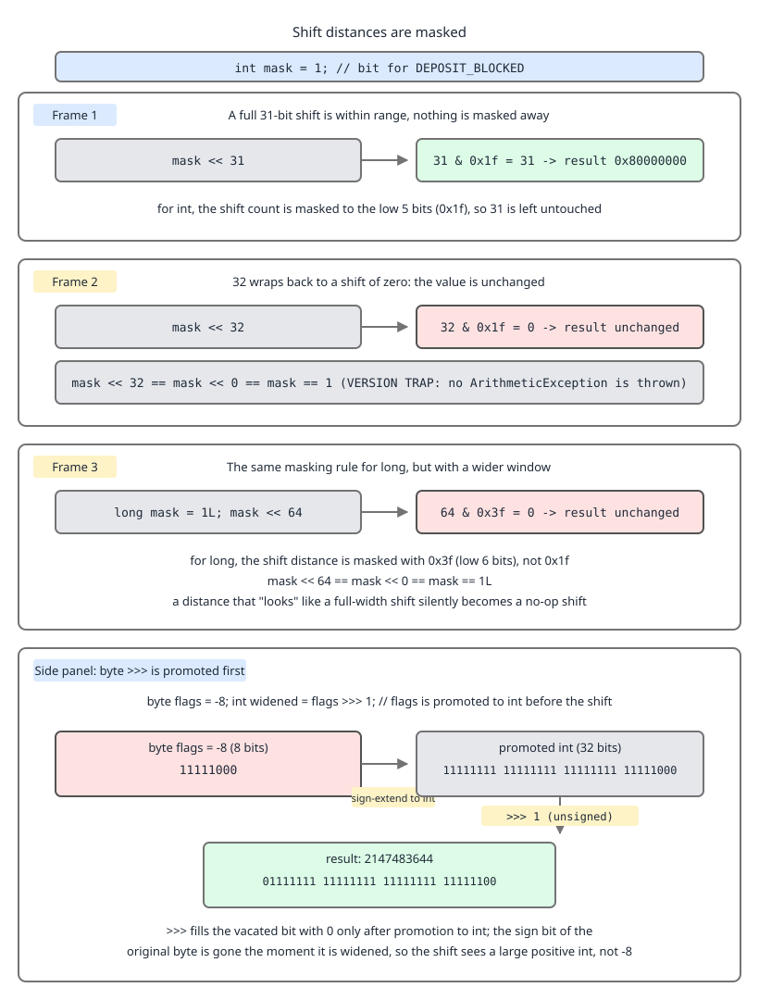

# 03 Java Core — Shifts and the unsigned story — BASICS (§1.3, 1.3.10–1.3.12, 1.3.20)

**Target version: Java 21 LTS.** | **Part 1 of 5** | [Index](../00-index.md)
Previous: [Two's complement, overflow and integer division](01a-integral-arithmetic.md) · Next: [Floating point: IEEE 754, NaN and negative zero](01c-floating-point.md)

---

## 1. Shifts, the masked distance, and the `byte` promotion (1.3.10, 1.3.11, 1.3.12)

**Concept.** Three shift operators, and the count is not the count you wrote. `<<` shifts left, filling with zeros. `>>` shifts right and fills with copies of the *sign bit* (arithmetic shift — it preserves sign, so `-8 >> 1 == -4`). `>>>` shifts right and fills with *zeros* (logical shift), which is Java's substitute for having no unsigned types. There is no `<<<`, because left-shifting fills with zeros regardless of sign, so signed and unsigned left shift are the same operation.

**Why it exists.** QuizStakes has exactly ten `RestrictionType` values. Ten `boolean` fields is ten bytes plus layout padding and no set algebra; one `int` mask is 4 bytes and gives you union (`|`), intersection (`&`), difference (`& ~`) and "any of" (`!= 0`) in one instruction each. `ClientRestrictions` can check "is this client blocked from staking *or* fully blocked" with a single `&`.

**How it works, worked through.** [PROVE] JVMS 21 §6.5, `ishl`: the two operands are popped as `int`s, and the result is "*value1* left-shifted by *s* bit positions, where *s* is the value of the low 5 bits of *value2*". Five bits hold 0..31 — every legal shift distance for a 32-bit value, and nothing else. So the JVM does not need a range check; it just masks.

[NUM] That gives the arithmetic:

```
32 & 0x1f = 100000b & 11111b = 000000b = 0   ->  x << 32  == x << 0  == x
33 & 0x1f = 100001b & 11111b = 000001b = 1   ->  x << 33  == x << 1
-1 & 0x1f = 32 ones     & 11111b = 11111b = 31 ->  x << -1  == x << 31
```

For `long`, `lshl`/`lshr`/`lushr` use the low **6** bits, mask `0x3f`, range 0..63:

```
64 & 0x3f = 1000000b & 111111b = 0  ->  y << 64 == y
```

Note the asymmetry that catches people: the shift *distance* operand is always an `int`, even for a `long` shift, but the *mask width* is chosen by the type of the left operand. `1 << 40` is `256`, because the left operand is an `int` and `40 & 0x1f = 8`; `1L << 40` is `1099511627776`.



**D-008** — Compare the `mask << 31` panel with the `mask << 32` panel: the second one produces an unchanged value, not zero, because `32 & 0x1f = 0`. Then read the side panel, where a negative `byte` is widened to 32 bits *before* `>>>` runs — the eight bits you wrote are now sitting at the bottom of 24 sign-extension ones.

[TRAP] Leaf 1.3.12: `>>>` on a `byte` or `short` is almost always a bug. Unary numeric promotion widens the operand to `int` first (JLS 21 §5.6), and widening a *negative* `byte` sign-extends, so `(byte) -56` becomes `0xFFFFFFC8`. Then `>>> 1` shifts a 32-bit value: `0xFFFFFFC8 >>> 1 = 0x7FFFFFE4 = 2147483620`. The "logical shift" was logical over 32 bits, not over your 8. The fix is to mask first: `(b & 0xff) >>> 1`. That `(byte) 200 == -56` narrowing is derived in [Two's complement, overflow and integer division](01a-integral-arithmetic.md), and the promotion rule that widens it is worked in full in [Promotion, boxing and inference](03a-promotion-boxing-and-inference.md).

```java
final class RestrictionMask {

    enum RestrictionType {
        DEPOSIT_BLOCKED, STAKE_BLOCKED, WITHDRAWAL_BLOCKED, DEPOSIT_LIMITED,
        WITHDRAWAL_HELD, SOURCE_OF_FUNDS_REQUIRED, ALL_BLOCKED, SELF_EXCLUDED,
        COOLING_OFF, DORMANT_FROZEN;

        int bit() {
            return 1 << ordinal();
        }
    }

    static int maskOf(java.util.Set<RestrictionType> types) {
        int mask = 0;
        for (RestrictionType t : types) {
            mask |= t.bit();
        }
        return mask;
    }

    static boolean blocksStaking(int mask) {
        int blocking = RestrictionType.STAKE_BLOCKED.bit()
                     | RestrictionType.ALL_BLOCKED.bit()
                     | RestrictionType.SELF_EXCLUDED.bit();
        return (mask & blocking) != 0;
    }

    public static void main(String[] args) {
        int mask = maskOf(java.util.EnumSet.of(
            RestrictionType.DEPOSIT_LIMITED, RestrictionType.SELF_EXCLUDED));
        System.out.println("mask bits      = " + Integer.toBinaryString(mask));
        System.out.println("blocksStaking  = " + blocksStaking(mask));
        System.out.println("popcount       = " + Integer.bitCount(mask));

        int one = RestrictionType.DEPOSIT_BLOCKED.bit();   // 1
        System.out.println("1 << 31        = " + (one << 31));
        System.out.println("1 << 32        = " + (one << 32) + "   (32 & 0x1f = " + (32 & 0x1f) + ")");
        System.out.println("1 << 33        = " + (one << 33));
        System.out.println("1 << -1        = " + (one << -1) + "   (-1 & 0x1f = " + (-1 & 0x1f) + ")");
        System.out.println("1 << 40        = " + (one << 40) + "   (40 & 0x1f = " + (40 & 0x1f) + ")");
        System.out.println("1L << 40       = " + (1L << 40));
        System.out.println("1L << 64       = " + (1L << 64) + "   (64 & 0x3f = " + (64 & 0x3f) + ")");

        System.out.println("-8 >> 1        = " + (-8 >> 1));
        System.out.println("-8 >>> 1       = " + (-8 >>> 1));

        byte wire = (byte) 200;                    // -56
        System.out.println("wire           = " + wire);
        System.out.println("wire >>> 1     = " + (wire >>> 1));
        System.out.println("(wire & 0xff) >>> 1 = " + ((wire & 0xff) >>> 1));
    }
}
```

Output:

```
mask bits      = 10001000
blocksStaking  = true
popcount       = 2
1 << 31        = -2147483648
1 << 32        = 1   (32 & 0x1f = 0)
1 << 33        = 2
1 << -1        = -2147483648   (-1 & 0x1f = 31)
1 << 40        = 256   (40 & 0x1f = 8)
1L << 40       = 1099511627776
1L << 64       = 1   (64 & 0x3f = 0)
-8 >> 1        = -4
-8 >>> 1       = 2147483644
```

…followed by:

```
wire           = -56
wire >>> 1     = 2147483620
(wire & 0xff) >>> 1 = 100
```

**Pitfall:** writing `1 << typeCount` to build an all-bits mask. With ten restriction types, `1 << 10 = 1024` and `(1 << 10) - 1 = 1023` is correct. But the same idiom on a 32-value enum gives `1 << 32 == 1`, so `- 1` yields `0` — a mask that matches nothing, and a `blocksStaking` that returns `false` for a self-excluded client. Symptom: restrictions silently stop applying the day someone adds the 32nd enum constant. The fix is `-1 >>> (32 - typeCount)`, or use `EnumSet`, which is a `long` mask internally for up to 64 constants and a `long[]` beyond that.

**Interview:** "What is `1 << 32`?" — `1`, because the JVM masks the shift distance to the low 5 bits for `int` (`32 & 0x1f == 0`) and the low 6 bits for `long`.

> `<<` and `>>` are signed shifts and `>>>` is the zero-filling shift; the distance is masked to the low 5 bits for `int` and the low 6 for `long`, and `byte`/`short` operands are promoted to `int` with sign extension before any shift runs.

---

## 2. The unsigned story (1.3.20)

**Concept.** Java has no unsigned integer types. What it has, since Java 8, is a set of *static methods that reinterpret* the same bits as unsigned. The storage is unchanged; only the operation changes. A `byte` holding `0xC8` is `-56` if you add it and `200` if you call `Byte.toUnsignedInt` on it.

**Why it exists.** Gosling's stated reason was that C's implicit signed/unsigned conversions were a top source of portability bugs. The cost landed on everyone parsing a binary protocol — including QuizStakes reading the banking partner's payout file, where a length byte of `200` is a perfectly normal length. Java 8 added the methods rather than the types, because adding `unsigned int` would have doubled the operator overload space and every numeric promotion rule.

**How it works.** [RESEARCH] Every method below is `@since 1.8` in the OpenJDK 21 javadoc except where noted:

| Method | Returns | Use in QuizStakes |
|---|---|---|
| `Byte.toUnsignedInt(byte)` | `int` 0..255 | one length or type byte of the payout file |
| `Byte.toUnsignedLong(byte)` | `long` 0..255 | same, into a `long` accumulator |
| `Short.toUnsignedInt(short)` | `int` 0..65535 | a 2-byte record count |
| `Integer.toUnsignedLong(int)` | `long` 0..4294967295 | a 4-byte unsigned file offset |
| `Integer.divideUnsigned(int, int)` | `int` | dividing an unsigned offset |
| `Integer.remainderUnsigned(int, int)` | `int` | as above |
| `Integer.compareUnsigned(int, int)` | `int` | ordering unsigned offsets |
| `Integer.toUnsignedString(int)` | `String` | logging the raw value |
| `Integer.parseUnsignedInt(String)` | `int` | reading `4294967295` from a text field |
| `Long.divideUnsigned(long, long)` | `long` | 64-bit unsigned arithmetic |
| `Long.compareUnsigned(long, long)` | `int` | comparing unsigned 64-bit ids |
| `Long.toUnsignedString(long)` | `String` | logging a raw 64-bit value |
| `Character` arithmetic | `int` | the *only* natively unsigned integer path |

[NUM] The arithmetic that makes the point: `-1` as an `int` is `0xFFFFFFFF`. `Integer.toUnsignedLong(-1)` is `4294967295` (= 2^32 - 1). `Integer.divideUnsigned(-1, 2)` is `2147483647`, because it divides 4294967295 by 2 and truncates; plain `-1 / 2` is `0`. And `Integer.compareUnsigned(-1, 1)` is positive, while `Integer.compare(-1, 1)` is negative — the same two bit patterns, opposite orders.

```java
final class PayoutFileWireFormat {

    /**
     * One record of the banking partner's payout file:
     *   byte  0     : record type, unsigned 0..255
     *   bytes 1..2  : payee count, unsigned big-endian 16-bit
     *   bytes 3..10 : amount in minor units, signed 64-bit big-endian
     */
    record PayoutRecord(int recordType, int payeeCount, long amountMinorUnits) {}

    static PayoutRecord parse(byte[] frame) {
        if (frame.length < 11) {
            throw new IllegalArgumentException("short frame: " + frame.length);
        }
        int recordType = Byte.toUnsignedInt(frame[0]);
        int payeeCount = (Byte.toUnsignedInt(frame[1]) << 8) | Byte.toUnsignedInt(frame[2]);
        long amount = 0L;
        for (int i = 3; i < 11; i++) {
            amount = (amount << 8) | Byte.toUnsignedInt(frame[i]);
        }
        return new PayoutRecord(recordType, payeeCount, amount);
    }

    public static void main(String[] args) {
        byte[] frame = new byte[11];
        frame[0] = (byte) 200;                  // record type 200
        frame[1] = (byte) 0x1B;
        frame[2] = (byte) 0x58;                 // payee count 7000
        frame[10] = (byte) 0xF4;
        frame[9] = (byte) 0x01;                 // amount 500 minor units

        System.out.println("raw frame[0] as byte = " + frame[0]);
        System.out.println(parse(frame));

        System.out.println("toUnsignedLong(-1)      = " + Integer.toUnsignedLong(-1));
        System.out.println("divideUnsigned(-1, 2)   = " + Integer.divideUnsigned(-1, 2));
        System.out.println("-1 / 2                  = " + (-1 / 2));
        System.out.println("remainderUnsigned(-1,3) = " + Integer.remainderUnsigned(-1, 3));
        System.out.println("compareUnsigned(-1, 1)  = " + Integer.compareUnsigned(-1, 1));
        System.out.println("compare(-1, 1)          = " + Integer.compare(-1, 1));
        System.out.println("toUnsignedString(-1)    = " + Integer.toUnsignedString(-1));
        System.out.println("Long.toUnsignedString   = " + Long.toUnsignedString(-1L));
        System.out.println("parseUnsignedInt        = "
            + Integer.parseUnsignedInt("4294967295"));
    }
}
```

Output:

```
raw frame[0] as byte = -56
PayoutRecord[recordType=200, payeeCount=7000, amountMinorUnits=500]
toUnsignedLong(-1)      = 4294967295
divideUnsigned(-1, 2)   = 2147483647
-1 / 2                  = 0
remainderUnsigned(-1,3) = 0
compareUnsigned(-1, 1)  = 1
compare(-1, 1)          = -1
toUnsignedString(-1)    = 4294967295
Long.toUnsignedString   = 18446744073709551615
parseUnsignedInt        = 4294967295
```

**Pitfall:** `(frame[1] << 8) | frame[2]` for a 16-bit big-endian field. Symptom: correct for values under 32768 and catastrophically wrong above it, because a negative `frame[2]` sign-extends to `0xFFFFFF__` and the `|` sets every high bit. With `frame[1] = 0x1B, frame[2] = 0x58` you get 7000 either way; with `frame[2] = (byte) 0x80` the naive version yields `-32768 | 0x1B00`, which is a large negative number. The fix is `& 0xff` or `Byte.toUnsignedInt` on **every** byte before combining — the mask is not optional on the low byte just because it looks harmless.

**Interview:** "How do you read an unsigned byte in Java?" — `Byte.toUnsignedInt(b)`, or equivalently `b & 0xff`. Java has no unsigned types; it has unsigned *operations* on signed storage.

> Java has no unsigned integer types; since Java 8 the `Byte`/`Short`/`Integer`/`Long` classes provide static methods that reinterpret the identical bits as unsigned for conversion, division, remainder, comparison and formatting.

---

## Pitfalls

### "`>>>` on a `byte` gives me an unsigned 8-bit shift"

**Wrong**

```java
byte lengthByte = (byte) 200;              // -56
int halfLength = lengthByte >>> 1;
System.out.println(halfLength);            // 2147483620
```

**Right**

```java
byte lengthByte = (byte) 200;
int halfLength = (lengthByte & 0xff) >>> 1;
System.out.println(halfLength);            // 100
System.out.println(Byte.toUnsignedInt(lengthByte) >>> 1);   // 100
```

Unary numeric promotion (JLS 21 §5.6) widens the `byte` to `int` with **sign extension** before the shift, so `>>>` zero-fills a 32-bit value whose top 24 bits are already ones. Masking with `& 0xff` clears them first. `>>` on the same operand happens to be correct for the sign-extended value, which makes the bug look intermittent.

**Why people believe it:** `>>>` is taught as "the unsigned shift", and the operand type is the thing that changes, not the operator.

### "`x << n` shifts a 32-bit value out to zero for large `n`"

**Wrong**

```java
int typeCount = 32;                                  // a 32-constant enum
int allRestrictions = (1 << typeCount) - 1;
System.out.println(1 << typeCount);                  // 1, not 4294967296
System.out.println(allRestrictions);                 // 0 - matches nothing
```

**Right**

```java
int typeCount = 32;
int allRestrictions = typeCount == 32 ? -1 : (1 << typeCount) - 1;
// or, with no branch:
int allBits = -1 >>> (32 - typeCount);               // 32 - 32 = 0, -1 >>> 0 = -1
System.out.println(Integer.toBinaryString(allBits)); // 32 ones
```

`ishl` masks the distance to the low 5 bits (JVMS 21 §6.5), so `32 & 0x1f = 0` and `1 << 32 == 1`. `-1 >>> (32 - n)` produces an n-bit all-ones mask for `n` in 1..32 without ever shifting by 32.

**Why people believe it:** on most other languages and on C with `unsigned`, shifting by the width is undefined but frequently *does* produce 0 on the hardware, so the wrong mental model is reinforced by observed behaviour elsewhere.

### "`<` and `>` order unsigned file offsets correctly once I have the bits"

**Wrong**

```java
static boolean isLaterInFile(int offsetA, int offsetB) {
    return offsetA > offsetB;                // both are unsigned 32-bit file offsets
}
// isLaterInFile(0xFFFFFF00, 0x00000100) -> false
// the first offset is 4,294,967,040 and the second is 256
```

**Right**

```java
static boolean isLaterInFile(int offsetA, int offsetB) {
    return Integer.compareUnsigned(offsetA, offsetB) > 0;
}
// isLaterInFile(0xFFFFFF00, 0x00000100) -> true
// or hold the value where the sign cannot bite:
static boolean isLaterInFileWide(int offsetA, int offsetB) {
    return Integer.toUnsignedLong(offsetA) > Integer.toUnsignedLong(offsetB);
}
```

`>` on an `int` is a signed comparison — `if_icmpgt` treats bit 31 as a sign, so every offset at or above 2^31 sorts *below* every small one. `Integer.compareUnsigned` flips bit 31 on both operands before comparing, which reorders the two halves of the range correctly; `Integer.toUnsignedLong` widens with zero extension so the ordinary `>` then works. The same trap sits under `Arrays.sort(int[])` on unsigned data — sort with `Integer::compareUnsigned` on a boxed array, or unsign into a `long[]` first.

**Why people believe it:** the bits are right and the value round-trips through `Integer.toUnsignedString` correctly, so the storage looks fine; it is only the *comparison* operator that carries the signed assumption, and it carries it invisibly.

### "`Integer.MAX_VALUE + 1` is fine for an unsigned counter because the bits keep counting"

**Wrong**

```java
static int nextSequence(int sequence) {
    return sequence + 1;                     // "unsigned, so it counts to 4,294,967,295"
}
static boolean isFresher(int a, int b) {
    return a > b;
}
// nextSequence(Integer.MAX_VALUE) -> -2147483648
// isFresher(-2147483648, Integer.MAX_VALUE) -> false, though it is one tick newer
```

**Right**

```java
static int nextSequence(int sequence) {
    return sequence + 1;                     // the bits really are correct
}
static boolean isFresher(int a, int b) {
    return Integer.compareUnsigned(a, b) > 0;
}
// isFresher(-2147483648, Integer.MAX_VALUE) -> true
// and to log or persist it, never String.valueOf:
// Integer.toUnsignedString(-2147483648) -> "2147483648"
```

The premise is half right: `+` really does produce the correct unsigned bit pattern, because two's complement addition is identical for signed and unsigned operands. What breaks is everything that *interprets* those bits — `>`, `<`, `Integer.compare`, `String.valueOf`, `%`, `/`, and any `assert sequence >= 0`. Java 8's unsigned methods exist exactly to cover the interpreting half: `compareUnsigned` to order, `toUnsignedString` to print, `divideUnsigned`/`remainderUnsigned` to divide, `toUnsignedLong` to widen.

**Why people believe it:** the addition and subtraction genuinely are shared between signed and unsigned two's complement, so the first thing anyone tests works, and the divergence only shows up in ordering, division and formatting.

---

## Cheat sheet

| Fact | Value |
|---|---|
| Shift ops | `<<`, `>>` (sign-fill), `>>>` (zero-fill). No `<<<` |
| Why no `<<<` | left shift zero-fills regardless of sign; signed and unsigned coincide |
| Shift mask | `int` low 5 bits (`0x1f`); `long` low 6 bits (`0x3f`) — JVMS 21 §6.5 |
| Mask width chosen by | the type of the **left** operand; the distance is always an `int` |
| `1 << 32`, `1L << 64`, `1 << 40` | `1`, `1L`, `256` |
| `1 << 33`, `1 << -1` | `2`, `1 << 31` = -2147483648 |
| `-8 >> 1`, `-8 >>> 1` | -4, 2147483644 |
| `(byte) 200 >>> 1` | 2147483620; use `(b & 0xff) >>> 1` = 100 |
| `byte`/`short` before a shift | promoted to `int` with **sign extension** (JLS 21 §5.6) |
| All-ones n-bit mask | `-1 >>> (32 - n)`, not `(1 << n) - 1` |
| Bit-set idioms | union `\|`, intersection `&`, difference `& ~`, any-of `!= 0`, count `Integer.bitCount` |
| `EnumSet` internals | `long` mask up to 64 constants, `long[]` beyond |
| Unsigned toolkit (Java 8+) | `Byte.toUnsignedInt`, `Integer.toUnsignedLong`, `divideUnsigned`, `remainderUnsigned`, `compareUnsigned`, `Long.toUnsignedString`, `parseUnsignedInt` |
| `Integer.toUnsignedLong(-1)` | 4294967295 |
| `divideUnsigned(-1, 2)` vs `-1 / 2` | 2147483647 vs 0 |
| `compareUnsigned(-1, 1)` vs `compare(-1, 1)` | 1 vs -1 — same bits, opposite order |
| `Long.toUnsignedString(-1L)` | 18446744073709551615 |
| Only natively unsigned type | `char` (16-bit, 0..65535) |
| Big-endian byte combine | unsign **every** byte: `(Byte.toUnsignedInt(hi) << 8) \| Byte.toUnsignedInt(lo)` |

---

## Self-test

**Q1.** A colleague writes `int allBits = (1 << typeCount) - 1;` to build an all-restrictions mask. It works today with 10 `RestrictionType` values. When does it break, and why?

<details><summary>Answer</summary>

It breaks the day `typeCount` reaches 32. JVMS 21 §6.5 specifies that `ishl` uses only the low 5 bits of the shift-distance operand, so the distance is effectively `n & 0x1f`. With `n = 32` that is `0`, and `1 << 32` evaluates to `1`, not 4,294,967,296. Then `- 1` gives `0` — a mask that matches nothing, so every `(mask & blocking) != 0` check returns false and restrictions silently stop applying. It also breaks at 33 (`1 << 33 == 2`), at 40 (`1 << 40 == 256`), and for any negative count (`1 << -1 == 1 << 31`). The fix is `-1 >>> (32 - typeCount)`, which produces an n-bit all-ones mask for n in 1..32 without shifting by 32, or move to `EnumSet`, which uses a `long` bitmask internally for up to 64 constants and a `long[]` above that. The same masking applies to `long` with the low 6 bits, so `1L << 64 == 1L`.

</details>

**Q2.** `PaymentRun` parses a payout frame with `int count = (frame[1] << 8) | frame[2];`. It passes every test. What input breaks it?

<details><summary>Answer</summary>

Any frame where `frame[2]` has its top bit set — that is, any low byte from 0x80 to 0xFF, which is half of all possible values. `byte` has no arithmetic instructions, so both operands undergo unary numeric promotion to `int` before the `<<` and the `|`, and widening a negative `byte` **sign-extends**: `(byte) 0x80` becomes `0xFFFFFF80`. The `|` then sets the high 24 bits, and the result is a large negative number instead of a count in 0..65535. The same trap hits `frame[1]`. The fix is to unsign every byte before combining: `(Byte.toUnsignedInt(frame[1]) << 8) | Byte.toUnsignedInt(frame[2])`, or equivalently `((frame[1] & 0xff) << 8) | (frame[2] & 0xff)`. The mask is not optional on the low byte. Tests miss it because small counts — 7000, encoded as 0x1B 0x58 — have a positive low byte and give the right answer either way.

</details>

**Q3.** Distinguish `>>` from `>>>` precisely, give the result of each on `-8`, and say which one belongs in a binary-search midpoint.

<details><summary>Answer</summary>

Both shift right; they differ only in the fill. `>>` is the *arithmetic* shift: it fills the vacated high bits with copies of the sign bit, which preserves sign and makes it equivalent to floor division by a power of two — `-8 >> 1` is `-4`, and `-7 >> 1` is `-4` as well, because it floors rather than truncating toward zero, unlike `-7 / 2` which is `-3`. `>>>` is the *logical* shift: it always fills with zeros, so the result is never negative, and `-8 >>> 1` is `2147483644` — the bit pattern `0xFFFFFFF8` shifted into `0x7FFFFFFC`. For a binary-search midpoint you want `low + ((high - low) >>> 1)`. The `>>>` is the right choice because it treats the difference as an unsigned quantity: even if `high - low` has somehow wrapped into a negative `int`, the zero-filling shift yields the correct unsigned half rather than a negative value, so the index stays in range. `>> 1` would sign-extend and hand back a negative midpoint. There is no `<<<` counterpart, because left shift fills with zeros in both interpretations, so a signed and an unsigned left shift are literally the same machine operation.

</details>

**Q4.** `1 << 40`, `1L << 40`, `1L << 64` and `1 << -1`. Give all four values and state the single rule that produces them.

<details><summary>Answer</summary>

`1 << 40` is `256`; `1L << 40` is `1099511627776`; `1L << 64` is `1`; `1 << -1` is `-2147483648`. The single rule is that the JVM masks the shift distance rather than range-checking it, and the mask width comes from the type of the **left** operand: the low 5 bits (`& 0x1f`) for an `int` shift (`ishl`/`ishr`/`iushr`), the low 6 bits (`& 0x3f`) for a `long` shift (`lshl`/`lshr`/`lushr`) — JVMS 21 §6.5. So `40 & 0x1f = 8` and `1 << 40` is `1 << 8 = 256`, whereas `40 & 0x3f = 40` so `1L << 40` is the full 2^40. `64 & 0x3f = 0`, so `1L << 64` shifts by nothing and returns `1L`. `-1 & 0x1f = 31`, because `-1` is 32 one-bits and the low five of those are `11111`, so `1 << -1` is `1 << 31 = Integer.MIN_VALUE`. The asymmetry worth stating out loud: the *distance* operand is always an `int` even for a `long` shift, but the *mask* is chosen by the left operand's type — which is why `1 << 40` and `1L << 40` differ even though the literal `40` is identical in both.

</details>

**Q5.** Why does Java have no unsigned integer types, and what did Java 8 add instead? Give the two calls that make the difference visible on the same bit pattern.

<details><summary>Answer</summary>

Gosling's stated reason was that C's implicit signed/unsigned conversions were among the largest sources of portability and correctness bugs, so Java shipped signed-only integers (`char` is the one exception — 16 bits, 0..65535, natively unsigned). The cost falls on anyone parsing a binary protocol, such as QuizStakes reading the banking partner's payout file where a record-type byte of 200 is entirely normal. Adding `unsigned int` later was rejected because it would have doubled the operator overload space and every numeric promotion rule; Java 8 added *unsigned operations on signed storage* instead — `Byte.toUnsignedInt`/`toUnsignedLong`, `Short.toUnsignedInt`, `Integer.toUnsignedLong`/`divideUnsigned`/`remainderUnsigned`/`compareUnsigned`/`toUnsignedString`/`parseUnsignedInt`, and the `Long` equivalents. The bits never change; only the interpretation does. The pair that shows it: on the identical `int` value `-1` (`0xFFFFFFFF`), `Integer.compare(-1, 1)` is `-1` and `Integer.compareUnsigned(-1, 1)` is `+1` — the same two bit patterns ordered in opposite directions. The second pair is `-1 / 2`, which is `0`, against `Integer.divideUnsigned(-1, 2)`, which is `2147483647`, because it divides 4,294,967,295 by two.

</details>

**Q6.** `ReconciliationCursor` stores an unsigned 32-bit file offset in an `int` and finds the furthest one with `if (offset > maxOffset) maxOffset = offset;`. The parse round-trips correctly through `Integer.toUnsignedString`. What is wrong, and give two fixes.

<details><summary>Answer</summary>

The storage is fine and the formatting is fine; the *comparison* is signed. `>` on `int` compiles to `if_icmpgt`, which reads bit 31 as a sign, so every offset at or above 2^31 (`0x80000000`..`0xFFFFFFFF`) sorts below every offset under 2^31. A payout file that grows past 2 GiB therefore reports its earliest small offset as the furthest, and the reconciliation cursor stops advancing — silently, with no exception, and with every logged value looking correct because `Integer.toUnsignedString` interprets the bits properly. Fix one: compare with `Integer.compareUnsigned(offset, maxOffset) > 0`, which conceptually flips bit 31 on both operands so the two halves of the range order correctly. Fix two: widen at the boundary with `Integer.toUnsignedLong(offset)` and hold `maxOffset` as a `long`, after which the ordinary `>` is correct because zero extension puts the value in 0..4,294,967,295 where a `long` has room to spare. The second is usually the better choice for a field that flows through business logic, because it removes the trap from every downstream use rather than from one comparison. The same defect appears in `Arrays.sort(int[])` over unsigned data — sort boxed with `Integer::compareUnsigned`, or unsign into a `long[]` first.

</details>

**Q7.** `RestrictionType` has ten constants and `ClientRestrictions` keeps them in one `int` mask. Write the four set operations as bit operations, and say when you should stop and use `EnumSet`.

<details><summary>Answer</summary>

Union is `a | b`, intersection is `a & b`, difference "in a but not b" is `a & ~b`, and "does a contain any of b" is `(a & b) != 0`; membership of a single constant is `(mask & (1 << ordinal())) != 0`, and the population count is `Integer.bitCount(mask)`. Each is a single machine instruction, against ten `boolean` fields that cost ten bytes plus object padding and give no set algebra at all — that is the whole reason `blocksStaking` can test `STAKE_BLOCKED | ALL_BLOCKED | SELF_EXCLUDED` in one `&`. You should stop hand-rolling the mask as soon as the constant count approaches 32, because `1 << 32` is `1` rather than 4,294,967,296 and the `(1 << n) - 1` all-bits idiom silently degenerates to `0`; also as soon as the mask escapes a hot path or a wire format, because an `int` in a log line or a debugger tells you nothing while an `EnumSet` prints its members. `EnumSet` is not slower in any way that matters: `RegularEnumSet` is one `long` bitmask for up to 64 constants and `JumboEnumSet` is a `long[]` beyond that, so it is the same bit arithmetic behind a type-safe `Set` API. Keep the raw `int` only where the bits are the contract — a serialised column, a protocol field, a JVM-level flag word.

</details>

---

## Open questions

None.

---

**Leaves covered:** 1.3.10, 1.3.11, 1.3.12, 1.3.20 (4 leaves)
**Leaves deferred:** none
**Diagrams included:** D-008
**Target version:** Java 21 LTS
**Lines:** 435
