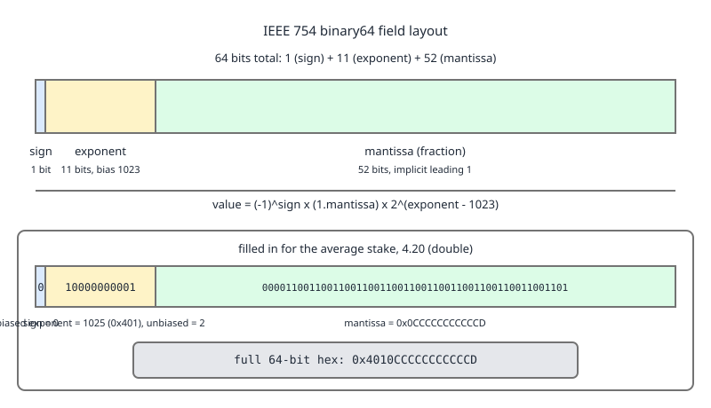

# 03 Java Core — Floating point: IEEE 754, NaN and negative zero — BASICS (§1.3, 1.3.13–1.3.16)

**Target version: Java 21 LTS.** | **Part 1 of 5** | [Index](../00-index.md)
Previous: [Shifts and the unsigned story](01b-shifts-and-unsigned.md) · Next: [Operators: precedence, evaluation order and constant expressions](02-operators-and-expressions.md)

---

## 1. IEEE 754 layout, and why the bonus balance drifts (1.3.13, 1.3.14)

**Concept.** A `double` is not a number with a decimal point. It is three bit fields — sign, exponent, mantissa — encoding `(-1)^sign x 1.mantissa x 2^(exponent - bias)`. The base is **two**. Any decimal fraction whose denominator is not a power of two has no exact representation, and `0.1`, `0.2` and `0.42` are all in that set.

**Why it exists.** Binary floating point is the only way to get a huge dynamic range in fixed width with single-instruction arithmetic. IEEE 754 (1985) standardised the layout so results are bit-identical across vendors, and Java adopted binary32/binary64 verbatim.

**How it works.** [NUM] binary64: 1 sign bit, 11 exponent bits with bias 1023, 52 stored mantissa bits with an *implicit* leading 1. binary32: 1 / 8 / 23, bias 127. So a `double` carries 53 significant bits, about 15.95 decimal digits; a `float` carries 24, about 7.22 decimal digits.

Work the average stake, 4.20, through the layout:

```
4.2 = 1.05 x 2^2
sign     = 0
exponent = 2 + 1023 = 1025 = 10000000001b
mantissa = 0.05 x 2^52 = 0.05 x 4503599627370496
         = 225179981368524.8   ->  rounds to 225179981368525 = 0x0CCCCCCCCCCCD
full 64 bits = 0x4010CCCCCCCCCCCD
```

The `.8` on that mantissa is the error, right there: 4.2 needs an infinitely repeating binary fraction (`100.0011001100` with the `0011` group repeating forever), the 53rd bit has to round, and the stored value is `4.20000000000000017763568394002504646778106689453125`.



**D-009** — Look at the mantissa field in the lower strip: `0x0CCCCCCCCCCCD`, ending in `D` where the repeating run of `C` nibbles was rounded up. That final nibble is the entire reason `0.1 + 0.2 != 0.3`, in one hex digit.

[TRAP] `Float.MIN_VALUE` is `1.4E-45` — the smallest positive *subnormal*, not the most negative `float`. The most negative is `-Float.MAX_VALUE`. This is the opposite convention from `Integer.MIN_VALUE`, which really is the most negative `int`, and the inconsistency exists because floating point is sign-magnitude: negating a `float` flips one bit, so "most negative" carries no information the max does not already give you.

```java
final class BonusBalanceDrift {

    public static void main(String[] args) {
        System.out.println("0.1 + 0.2         = " + (0.1 + 0.2));
        System.out.println("equals 0.3?       = " + (0.1 + 0.2 == 0.3));

        double avgStake = 4.20;
        System.out.printf("4.20 bits         = 0x%016X%n", Double.doubleToLongBits(avgStake));
        long bits = Double.doubleToLongBits(avgStake);
        System.out.println("sign              = " + (bits >>> 63));
        System.out.println("biased exponent   = " + ((bits >>> 52) & 0x7ff));
        System.out.printf("mantissa          = 0x%013X%n", bits & 0x000FFFFFFFFFFFFFL);
        System.out.println("exact value       = " + new java.math.BigDecimal(avgStake));

        // A bonus balance accumulated as double: 42.00 grant, spent 0.42 at a time.
        double bonusDouble = 0.0;
        for (int i = 0; i < 100; i++) {
            bonusDouble += 0.42;
        }
        System.out.println("double sum of 100 x 0.42 = " + bonusDouble);
        System.out.println("is it 42.0?              = " + (bonusDouble == 42.0));

        // The same accumulation in minor units, as a long. Exact.
        long bonusMinorUnits = 0L;
        for (int i = 0; i < 100; i++) {
            bonusMinorUnits += 42L;
        }
        System.out.println("long sum (minor units)   = " + bonusMinorUnits);

        System.out.println("Float.MIN_VALUE          = " + Float.MIN_VALUE);
        System.out.println("most negative float      = " + (-Float.MAX_VALUE));
        System.out.println("float digits (approx)    = " + (24 * Math.log10(2)));
        System.out.println("double digits (approx)   = " + (53 * Math.log10(2)));

        // float loses a ledger id outright.
        float f = 7_227_000_000L;
        System.out.println("float of 7,227,000,000   = " + (long) f);
    }
}
```

Output:

```
0.1 + 0.2         = 0.30000000000000004
equals 0.3?       = false
4.20 bits         = 0x4010CCCCCCCCCCCD
sign              = 0
biased exponent   = 1025
mantissa          = 0x0CCCCCCCCCCCD
exact value       = 4.20000000000000017763568394002504646778106689453125
double sum of 100 x 0.42 = 41.99999999999992
is it 42.0?              = false
long sum (minor units)   = 4200
Float.MIN_VALUE          = 1.4E-45
most negative float      = -3.4028235E38
float digits (approx)    = 7.224719895935549
double digits (approx)   = 15.954589770191003
```

…and:

```
float of 7,227,000,000   = 7227000320
```

**Pitfall:** holding a bonus balance in a `double`. Symptom: `FundsLedger` totals that fail the balance-check by 0.00000000000008, a `LedgerImbalanceException` at the end of a reconciliation run, and a ledger that cannot be re-summed to the same value twice because floating-point addition is not associative. The fix is `long` minor units for arithmetic and `BigDecimal` inside `Money` for anything that must round to a specified scale — see [Numbers and money](../numbers-and-money/02-numbers-and-money.md) — and `NUMERIC(19,4)` in the column, covered in **09 SQL databases**.

**Insight:** the `float` line is the sharpest argument for leaf 1.3.19's "never `float`", stated in [Primitive types: the eight kinds](01-basics.md). 24 significant bits cannot hold 7,227,000,000; the nearest `float` is 7,227,000,320. A `float` cannot even count QuizStakes' yearly ledger entries, let alone value them.

**Interview:** "Why is `0.1 + 0.2` not `0.3`?" — Because binary64 stores a binary fraction; neither 0.1 nor 0.2 nor 0.3 is a finite sum of powers of two, so each is rounded at bit 53 and the two roundings do not cancel. Compare with a tolerance, or use `long` minor units.

Subnormals, rounding modes, `Math.ulp`, `strictfp`, and the exact algorithm behind `Double.toString` are worked in [Floating point internals](../numbers-and-money/04-internals-floating-point.md).

> `float` and `double` are IEEE 754 binary32 and binary64: sign, biased exponent, and a mantissa with an implicit leading 1, carrying 24 and 53 significant bits respectively.

---

## 2. NaN and `-0.0`: the three-way inconsistency (1.3.15, 1.3.16)

**Concept.** There are three different notions of "the same value" for a `double` in Java, and for two specific inputs — `NaN` and `-0.0` — all three disagree. `==` follows IEEE 754. `Double.compare` imposes a *total order*, which IEEE 754 does not have. `Double.equals` follows the bit pattern, because a `HashMap` key must have a reflexive equality.

**Why it exists.** IEEE 754 needs `NaN != NaN` so that an unordered comparison propagates rather than silently claiming two unknown values match. But `Collections.sort` needs a total order or it corrupts arrays, and `HashSet.add(x)` followed by `contains(x)` must be `true` or the collection is broken. Three requirements, three answers.

**How it works, worked through.** [PROVE] Start with `NaN`.

- `Double.NaN == Double.NaN` is `false`: IEEE 754 says every comparison involving NaN except `!=` is false. The bytecode `dcmpg`/`dcmpl` push `1`/`-1` for the unordered case precisely so `javac` can emit the false branch.
- `Double.valueOf(Double.NaN).equals(Double.valueOf(Double.NaN))` is `true`. Here is why, from `java.lang.Double` in OpenJDK 21:

  [SOURCE]
  ```java
  public boolean equals(Object obj) {
      return (obj instanceof Double d) &&
          (doubleToLongBits(d.value) == doubleToLongBits(value));
  }
  ```
  Line 1 pattern-matches the argument to a `Double`, binding `d`. Line 2 does not compare `double` values at all — it compares `doubleToLongBits` of each. And `doubleToLongBits` *collapses* every NaN bit pattern to the single canonical `0x7ff8000000000000`, so any NaN equals any other NaN. The javadoc calls this out explicitly as the deliberate fix that makes `Double` usable as a hash key.
- `Double.compare(Double.NaN, Double.NaN)` is `0`, and `Double.compare(Double.NaN, Double.POSITIVE_INFINITY)` is `1`. `Double.compare` sorts NaN above everything, including `+Infinity`.

Now `-0.0`. Its bit pattern is `0x8000000000000000` — sign bit set, everything else zero.

- `0.0 == -0.0` is `true`: IEEE 754 says the two zeros compare equal.
- `Double.compare(0.0, -0.0)` is `1`: the total order puts `-0.0` strictly below `+0.0`, so they are distinct.
- `Double.valueOf(0.0).equals(-0.0)` is `false`: the bit patterns differ, and `doubleToLongBits` does *not* collapse the two zeros the way it collapses NaNs.

| Comparison | `(NaN, NaN)` | `(0.0, -0.0)` | `(1.0, 1.0)` |
|---|---|---|---|
| `x == y` | `false` | `true` | `true` |
| `Double.compare(x, y)` | `0` | `1` | `0` |
| `Double.valueOf(x).equals(y)` | `true` | `false` | `true` |

**D-010** — Read the two middle rows against each other: `==` and `compare` disagree in both of the first two columns, and in *opposite directions*. A `TreeSet<Double>` of bonus amounts uses the second row — `compareTo`, which delegates to `Double.compare` — so a `TreeSet` treats `0.0` and `-0.0` as two distinct elements and treats all NaNs as one, sorted last. A `HashSet<Double>` uses the third row and agrees with `TreeSet` on both of those cases; only bare `==` disagrees.

```java
final class BonusComparisonSemantics {

    public static void main(String[] args) {
        double nan = Double.NaN;
        double posZero = 0.0;
        double negZero = -0.0;

        System.out.println("NaN == NaN                  = " + (nan == nan));
        System.out.println("NaN != NaN                  = " + (nan != nan));
        System.out.println("isNaN                       = " + Double.isNaN(nan));
        System.out.println("valueOf(NaN).equals(NaN)    = "
            + Double.valueOf(nan).equals(nan));
        System.out.println("compare(NaN, NaN)           = " + Double.compare(nan, nan));
        System.out.println("compare(NaN, +Infinity)     = "
            + Double.compare(nan, Double.POSITIVE_INFINITY));
        System.out.printf("bits of NaN                 = 0x%016X%n",
            Double.doubleToLongBits(nan));

        System.out.println("0.0 == -0.0                 = " + (posZero == negZero));
        System.out.println("compare(0.0, -0.0)          = " + Double.compare(posZero, negZero));
        System.out.println("valueOf(0.0).equals(-0.0)   = "
            + Double.valueOf(posZero).equals(negZero));
        System.out.printf("bits of -0.0                = 0x%016X%n",
            Double.doubleToLongBits(negZero));

        // A TreeSet of bonus amounts. Uses Double.compare.
        var byValue = new java.util.TreeSet<Double>();
        byValue.add(posZero);
        byValue.add(negZero);
        byValue.add(42.0);
        byValue.add(nan);
        byValue.add(nan);
        System.out.println("TreeSet   = " + byValue + " size=" + byValue.size());

        var hashed = new java.util.HashSet<Double>();
        hashed.add(posZero);
        hashed.add(negZero);
        hashed.add(nan);
        hashed.add(nan);
        System.out.println("HashSet size = " + hashed.size());

        // Where a NaN bonus balance comes from in the first place.
        double reversedBonus = 0.0;
        double grantedBonus = 0.0;
        double utilisation = reversedBonus / grantedBonus;
        System.out.println("0.0 / 0.0 utilisation       = " + utilisation);
        System.out.println("utilisation > 0.5           = " + (utilisation > 0.5));
        System.out.println("utilisation <= 0.5          = " + (utilisation <= 0.5));
    }
}
```

Output:

```
NaN == NaN                  = false
NaN != NaN                  = true
isNaN                       = true
valueOf(NaN).equals(NaN)    = true
compare(NaN, NaN)           = 0
compare(NaN, +Infinity)     = 1
bits of NaN                 = 0x7FF8000000000000
0.0 == -0.0                 = true
compare(0.0, -0.0)          = 1
valueOf(0.0).equals(-0.0)   = false
bits of -0.0                = 0x8000000000000000
TreeSet   = [-0.0, 0.0, 42.0, NaN] size=4
HashSet size = 3
0.0 / 0.0 utilisation       = NaN
utilisation > 0.5           = false
utilisation <= 0.5          = false
```

**Pitfall:** `if (utilisation > threshold) { alert(); } else { ok(); }` on a ratio that can be `NaN`. Symptom: a bonus-utilisation monitor that reports "healthy" for a promotion with zero grants, because *both* the `>` and the `<=` branch tests are false and NaN silently takes the `else`. The fix is an explicit `Double.isNaN` guard before any threshold comparison. Note `x != x` is the classic NaN test and still works, but `Double.isNaN(x)` says what you mean.

**Pitfall:** `x == 0.0` as a "no bonus available" check. It passes for `-0.0`, which is what you get from `-1 * 0.0` or from `0.0 / -3.0` — usually harmless, until you print it and the client sees a balance of `-0.0`. Use `Math.abs(x) == 0.0` if you want both zeros, or format explicitly.

**Interview:** "How can a `HashMap<Double, ?>` find a NaN key when `NaN != NaN`?" — `Double.equals` compares `doubleToLongBits`, which canonicalises every NaN to `0x7ff8000000000000`, so all NaNs are `equals`. `==` on the primitives is the IEEE rule; `equals` deliberately is not.

> IEEE 754 comparison (`==`) makes NaN unequal to itself and the two zeros equal, while `Double.compare` and `Double.equals` impose a bit-pattern-based total order that reverses both of those answers.

---

## Pitfalls

### "Comparing `double` balances with `==` is fine if I only add exact amounts"

**Wrong**

```java
double bonus = 0.0;
for (int i = 0; i < 100; i++) bonus += 0.42;
System.out.println(bonus);            // 41.99999999999992
System.out.println(bonus == 42.0);    // false
```

**Right**

```java
long bonusMinorUnits = 0L;
for (int i = 0; i < 100; i++) bonusMinorUnits += 42L;
System.out.println(bonusMinorUnits);              // 4200, exactly
System.out.println(bonusMinorUnits == 4200L);     // true
```

0.42 is not representable in binary64, so each `+=` rounds and the errors accumulate; floating-point addition is not associative, so even the *order* of a reconciliation sum changes the answer. Minor units in a `long` are exact for every value QuizStakes can hold, and `Money`'s `BigDecimal` handles scaled rounding at the boundary.

**Why people believe it:** 0.42 is exact in decimal, and small `double` sums usually print with enough rounding in `toString` to hide the drift until the count gets large.

### "`Float.MIN_VALUE` is the most negative `float`, like `Integer.MIN_VALUE` is for `int`"

**Wrong**

```java
static float lowestRate(float[] rates) {
    float lowest = Float.MIN_VALUE;          // 1.4E-45, a tiny POSITIVE number
    for (float rate : rates) {
        if (rate < lowest) lowest = rate;
    }
    return lowest;
}
// lowestRate(new float[] {0.5f, 1.25f}) -> 1.4E-45, an element that was never there
```

**Right**

```java
static float lowestRate(float[] rates) {
    float lowest = Float.POSITIVE_INFINITY;   // or -Float.MAX_VALUE for a max-seed
    for (float rate : rates) {
        if (rate < lowest) lowest = rate;
    }
    return lowest;
}
// lowestRate(new float[] {0.5f, 1.25f}) -> 0.5
```

`Float.MIN_VALUE` and `Double.MIN_VALUE` are the smallest positive *subnormal* values, `1.4E-45` and `4.9E-324`. The most negative values are `-Float.MAX_VALUE` and `-Double.MAX_VALUE`. The convention differs from the integers because floating point is sign-magnitude: negating flips one bit, so a separate "most negative" constant would carry no information. For a min-seed, `POSITIVE_INFINITY` is the clean sentinel — nothing finite is above it.

**Why people believe it:** `Integer.MIN_VALUE` and `Long.MIN_VALUE` genuinely are the most negative values of their types, and the two families share the constant name while meaning opposite things.

### "A `NaN` ratio will fail the threshold check and take the safe branch"

**Wrong**

```java
static void checkUtilisation(double reversedBonus, double grantedBonus) {
    double utilisation = reversedBonus / grantedBonus;
    if (utilisation > 0.5) {
        System.out.println("ALERT: bonus reversal rate high");
    } else {
        System.out.println("healthy");
    }
}
// checkUtilisation(0.0, 0.0) prints "healthy" for a promotion with no grants at all
```

**Right**

```java
static void checkUtilisation(double reversedBonus, double grantedBonus) {
    double utilisation = reversedBonus / grantedBonus;
    if (Double.isNaN(utilisation)) {
        System.out.println("NO DATA: no bonus grants to compute a ratio from");
        return;
    }
    if (utilisation > 0.5) {
        System.out.println("ALERT: bonus reversal rate high");
    } else {
        System.out.println("healthy");
    }
}
// checkUtilisation(0.0, 0.0) prints the NO DATA line
```

Floating-point division by zero does not throw — only *integer* division does. `0.0 / 0.0` is the IEEE 754 invalid operation and yields `NaN`. Every ordered comparison against NaN is false, including `>`, `<`, `>=` and `<=`, so NaN falls through an `if/else` chain into whichever branch happens to be last. "No data" and "healthy" are different states and need different branches.

**Why people believe it:** an `else` reads as "everything not matched above", and for every ordinary value it is. NaN is the one input where the negation of a comparison is not the complement of it.

### "`float` is precise enough for a ledger entry count"

**Wrong**

```java
static float yearlyEntries() {
    float entries = 7_227_000_000L;          // 19.8M/day x 365
    return entries;
}
// (long) yearlyEntries() -> 7227000320, off by 320 entries
```

**Right**

```java
static long yearlyEntries() {
    long entriesPerDay = 19_800_000L;
    return entriesPerDay * 365L;
}
// 7227000000, exactly
```

binary32 carries 24 significant bits — about 7.22 decimal digits — so above 2^24 = 16,777,216 consecutive integers are no longer all representable, and by 7.2 billion the gap between neighbouring `float` values is 512. A `float` cannot count QuizStakes' yearly ledger entries, never mind value them. `long` is exact to 9.22e18, and `double` is exact for integers up to 2^53.

**Why people believe it:** `float` prints 7.227E9 without complaint and the type is described as "32-bit floating point", which sounds like it should hold what a 32-bit `int` holds. It holds a far wider *range* with far fewer *significant digits*.

---

## Cheat sheet

| Fact | Value |
|---|---|
| binary64 layout | 1 sign / 11 exponent (bias 1023) / 52 mantissa, implicit leading 1 |
| binary32 layout | 1 / 8 (bias 127) / 23; 24 significant bits ≈ 7.2 digits |
| Significant bits | `double` 53 ≈ 15.95 digits; `float` 24 ≈ 7.22 digits |
| Exact-integer ceiling | `float` 2^24 = 16777216; `double` 2^53 |
| `4.20` bits | `0x4010CCCCCCCCCCCD`, exp 1025, mantissa `0x0CCCCCCCCCCCD` |
| `4.20` exact value | 4.20000000000000017763568394002504646778106689453125 |
| `0.1 + 0.2` | 0.30000000000000004 — not `0.3` |
| 100 x `+= 0.42` | 41.99999999999992; `long` minor units give 4200 exactly |
| `float` of 7,227,000,000 | 7227000320 |
| `Float.MIN_VALUE` / `Double.MIN_VALUE` | 1.4E-45 / 4.9E-324 — smallest **positive** subnormal |
| Most negative | `-Float.MAX_VALUE` / `-Double.MAX_VALUE` |
| `1.0/0.0`, `-1.0/0.0`, `0.0/0.0`, `1.0%0.0` | `Infinity`, `-Infinity`, `NaN`, `NaN` — never throws |
| `NaN == NaN` / `compare` / `equals` | false / 0 / true |
| `0.0 == -0.0` / `compare` / `equals` | true / 1 / false |
| Canonical NaN bits | `0x7FF8000000000000` — `doubleToLongBits` collapses all NaNs to it |
| `-0.0` bits | `0x8000000000000000` — **not** collapsed |
| Every NaN comparison | false except `!=`; test with `Double.isNaN(x)` |
| `Double.compare` order | `-0.0` < `+0.0`; NaN above `+Infinity` |
| `TreeSet<Double>` uses | `Double.compare` — `-0.0` before `0.0`, NaN last, all NaNs one element |
| `HashSet<Double>` uses | `Double.equals` — agrees with `TreeSet`; only bare `==` disagrees |
| Money rule | `long` minor units for arithmetic, `BigDecimal` for scaled rounding, `NUMERIC(19,4)` in the column |

---

## Self-test

**Q1.** State all three answers for `(NaN, NaN)` and for `(0.0, -0.0)` under `==`, `Double.compare` and `Double.equals`, and say which one a `TreeSet<Double>` of bonus amounts uses.

<details><summary>Answer</summary>

For `(NaN, NaN)`: `==` is `false` (IEEE 754 makes every comparison with NaN false except `!=`), `Double.compare` is `0`, and `Double.valueOf(NaN).equals(NaN)` is `true` — because `equals` compares `doubleToLongBits`, which canonicalises every NaN bit pattern to `0x7ff8000000000000`. For `(0.0, -0.0)`: `==` is `true` (IEEE says the zeros compare equal), `Double.compare(0.0, -0.0)` is `1` (the total order puts `-0.0` strictly below `+0.0`), and `equals` is `false` (the bit patterns `0x0000000000000000` and `0x8000000000000000` differ, and unlike NaN they are not canonicalised). So `==` and `compare` disagree in both cases and in opposite directions. A `TreeSet<Double>` uses `Double.compareTo`, which delegates to `Double.compare`, so it holds `-0.0` and `0.0` as two distinct elements sorted in that order, treats all NaNs as a single element, and sorts NaN above `+Infinity`. `Double.compare` exists precisely because IEEE 754 ordering is not a total order and `Collections.sort` requires one.

</details>

**Q2.** `AssessmentService` computes `double utilisation = reversedBonus / grantedBonus;` and alerts when `utilisation > 0.5`. A promotion with no grants at all never alerts and never logs "healthy" either. Explain.

<details><summary>Answer</summary>

`0.0 / 0.0` in floating point does not throw — IEEE 754 defines it as the invalid operation returning `NaN`, and the JLS adopts that (only *integer* division by zero throws `ArithmeticException`). So `utilisation` is `NaN`. Every ordered comparison involving NaN is false: `NaN > 0.5` is false, and so is `NaN <= 0.5`. If the code is `if (u > 0.5) alert(); else ok();` then NaN takes the `else` branch and the monitor reports healthy; if it is a chain of `if (u > 0.5) alert(); else if (u <= 0.5) ok();` with no final `else`, neither branch runs and nothing is logged at all. The fix is an explicit `if (Double.isNaN(utilisation)) { /* no grants: not a ratio */ }` guard before any threshold comparison, plus a zero-denominator check on the input. `u != u` is the classic NaN test and still works, but `Double.isNaN` states the intent.

</details>

**Q3.** Derive the binary64 bit pattern of the average stake, 4.20, and point at the exact bit where the money is lost.

<details><summary>Answer</summary>

binary64 is 1 sign bit, 11 biased exponent bits (bias 1023) and 52 stored mantissa bits with an implicit leading 1, so the value is `(-1)^sign x 1.mantissa x 2^(exponent - 1023)`. Normalise 4.2 as `1.05 x 2^2`, so the sign is `0` and the biased exponent is `2 + 1023 = 1025`, binary `10000000001`. The stored mantissa is the fractional part `0.05` scaled by 2^52: `0.05 x 4503599627370496 = 225179981368524.8`. That `.8` is the whole problem — the true mantissa is not an integer, because 4.2 in binary is `100.0011001100…` with `0011` repeating forever, and 52 bits cannot hold a repeating expansion. Round-to-nearest takes it up to `225179981368525 = 0x0CCCCCCCCCCCD`, and the full pattern is `0x4010CCCCCCCCCCCD`. The loss is in the 52nd stored mantissa bit, visible as the final hex nibble `D` where the repeating run of `C` nibbles was rounded up. `new BigDecimal(4.20)` prints the consequence exactly: `4.20000000000000017763568394002504646778106689453125`. That residue is what accumulates into a `LedgerImbalanceException` after enough additions, which is why balances are `long` minor units and `Money` wraps `BigDecimal`.

</details>

**Q4.** A colleague proposes `float` for the ledger's yearly entry count "because it holds 3.4E38, far more than 7.2 billion". Answer them.

<details><summary>Answer</summary>

Range and precision are different properties, and `float` trades the second for the first. binary32 spends 8 bits on the exponent, which buys the 3.4E38 ceiling, and leaves only 23 stored mantissa bits — 24 significant bits with the implicit leading 1, about 7.22 decimal digits. Consecutive integers are exactly representable only up to 2^24 = 16,777,216; above that the gap between neighbouring `float` values doubles with each binade, and at 7.2 billion (between 2^32 and 2^33) the gap is 512. So `float f = 7_227_000_000L` stores 7,227,000,320 — off by 320 entries, and the error is not detectable from the value itself. QuizStakes writes ~19.8M ledger entries a day and ~7.2B a year, so `float` cannot even *count* them, let alone value them. Use `long`, which is exact to 9,223,372,036,854,775,807. If a floating type is unavoidable, `double` holds 53 significant bits and is exact for integers up to 2^53 — but for money the answer is `long` minor units with `BigDecimal` at the rounding boundary, not any binary floating type. This is leaf 1.3.19's "never `float`" in one number.

</details>

**Q5.** You add `0.0`, `-0.0`, `42.0`, `NaN` and `NaN` to a `TreeSet<Double>` of bonus amounts, and `0.0`, `-0.0`, `NaN` and `NaN` to a `HashSet<Double>`. Give both sizes, the `TreeSet`'s contents in order, and explain what each collection is really comparing.

<details><summary>Answer</summary>

The `TreeSet` holds four elements and prints `[-0.0, 0.0, 42.0, NaN]`. It orders and de-duplicates with `Double.compareTo`, which delegates to `Double.compare`: that is a total order in which `-0.0` sorts strictly below `+0.0` — so they are two distinct elements, and `-0.0` comes first — and in which NaN sorts above everything including `+Infinity`, so the second NaN is a duplicate and is dropped. The `HashSet` holds three. It de-duplicates with `Double.equals`, which compares `doubleToLongBits`: those bits differ for the two zeros (`0x0000000000000000` versus `0x8000000000000000`, which `doubleToLongBits` does *not* canonicalise) so both survive, and are identical for any two NaNs (every NaN pattern collapses to `0x7ff8000000000000`) so the second NaN is dropped. The two collections therefore *agree* on both awkward inputs: two zeros, one NaN. It is bare `==` on the primitives that disagrees with both — `0.0 == -0.0` is `true` and `NaN == NaN` is `false`, the exact opposite verdict in each case. `Double.equals` was specified against the IEEE rule deliberately, so that `Double` is usable as a `HashMap` key at all: `add(x)` followed by `contains(x)` has to be `true`.

</details>

**Q6.** `BonusService` prints a client's remaining bonus and a client reports seeing `-0.0`. Where does a negative zero come from, and what is wrong with `if (balance == 0.0)` as the guard?

<details><summary>Answer</summary>

`-0.0` has the bit pattern `0x8000000000000000`: sign bit set, exponent and mantissa zero. It arises from any operation whose exact result is zero but whose sign is negative — `-1 * 0.0`, `0.0 / -3.0`, `-0.42 + 0.42` under some roundings, or simply parsing the text `"-0.0"`. IEEE 754 keeps the sign because it carries the direction from which the value underflowed, which matters for `1.0 / x` (`Infinity` versus `-Infinity`). The guard `balance == 0.0` is not wrong for *detection* — IEEE says the two zeros compare equal, so it returns `true` for `-0.0` as well, which is usually what you want. What is wrong is assuming the check normalises the value: the variable still holds `-0.0`, so `String.valueOf(balance)` and `System.out.println` emit `-0.0` and the client sees it. Fix it at the formatting boundary — `Math.abs(balance) == 0.0` then print a literal `0.00`, or add `0.0` to the value (`-0.0 + 0.0` is `+0.0`), or use `BigDecimal`/`Money` for anything client-facing, which has no signed zero. Note also that `Double.valueOf(0.0).equals(-0.0)` is `false` and `Double.compare(0.0, -0.0)` is `1`, so a `Map<Double, ?>` or a `TreeSet<Double>` keyed on balances will treat the two zeros as different keys even though `==` says they match.

</details>

---

## Open questions

None.

---

**Leaves covered:** 1.3.13, 1.3.14, 1.3.15, 1.3.16 (4 leaves)
**Leaves deferred:** none
**Diagrams included:** D-009, D-010
**Target version:** Java 21 LTS
**Lines:** 447
