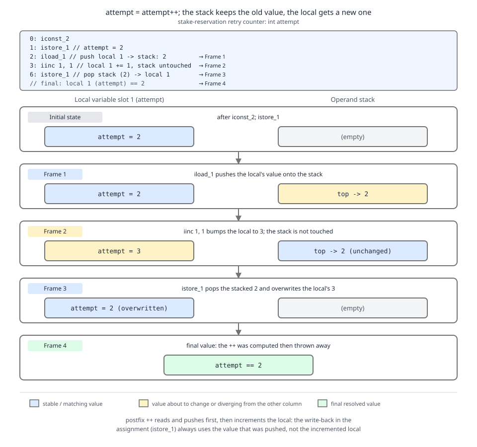

# 03 Java Core — Operators: precedence, evaluation order and constant expressions — BASICS (§1.6, 1.6.1–1.6.5, 1.6.19)

**Target version: Java 21 LTS.** | **Part 1 of 5** | [Index](../00-index.md)
Previous: [Floating point: IEEE 754, NaN and negative zero](01c-floating-point.md) · Next: [Compound assignment, short-circuit and bitwise operators](02a-assignment-and-bitwise.md)

Every bytecode listing and every printed value in this file was captured by compiling with `javac --release 21` and disassembling with `javap -c` on JDK 25 (`--release 21` fixes the class-file version and the language level, and none of these instructions changed between 21 and 25). Where a listing is reconstructed rather than captured, the text says so.

This part covers what the compiler decides about an expression *before any value exists*: the shape of the parse tree, the order the operands will run in, and which expressions `javac` can fold away entirely. The operators themselves are split across four siblings — compound assignment, short-circuit and bitwise work in [02a-assignment-and-bitwise.md](02a-assignment-and-bitwise.md), casts and comparison in [02b-casts-and-comparison.md](02b-casts-and-comparison.md), the conditional operator and pattern `instanceof` in [02c-conditional-operator.md](02c-conditional-operator.md), and string concatenation and poly expressions in [02d-string-concatenation.md](02d-string-concatenation.md).

---

## 1. Precedence and associativity: the parse tree you did not write (1.6.1)

**Concept.** Precedence is not "the order things happen". It is the shape of the tree the compiler builds out of your flat line of text. `stake - fee * rate` becomes a subtraction whose right child is a multiplication, and no amount of squinting at the source changes that. Associativity settles the remaining ambiguity when two operators of *equal* precedence meet: `a - b - c` groups left (`(a-b)-c`), `a = b = c` groups right (`a = (b = c)`).

**Why it exists.** Without precedence, every arithmetic expression would need full parenthesisation, as in Lisp. The precedence ladder is a purely syntactic convenience that buys readable arithmetic at the cost of one class of bug: expressions whose tree does not match the reader's intent. The bugs cluster at four boundaries — shift versus additive, equality versus bitwise-and, ternary versus assignment, and cast versus everything.

**How it works.** `javac`'s grammar (JLS 15) encodes the ladder as nested productions: an `AdditiveExpression` is built from `MultiplicativeExpression` operands, so multiplication binds tighter by construction. Two levels deserve memorising because they are inverted relative to C programmers' instincts and relative to mathematical convention:

- `<<`, `>>`, `>>>` bind **looser** than `+`. So `mask << 1 + 2` is `mask << 3`, not `(mask << 1) + 2`.
- `&`, `^`, `|` bind **looser** than `==`. So `flags & STAKE_BLOCKED == 0` parses as `flags & (STAKE_BLOCKED == 0)`, which does not even typecheck when `flags` is an `int`. That compile error is a gift; the same shape on `boolean` operands compiles and silently misbehaves.

| Level | Operators | Assoc. | QuizStakes expression that misreads without parentheses |
|---|---|---|---|
| 1 primary | `x.y` `x.m()` `a[i]` `x++` `x--` `Type::m` | left | `runs[i++].total()` — the index increments before the member access, not after the statement |
| 2 unary prefix | `++x` `--x` `+x` `-x` `~x` `!x` | right | `~STAKE_BLOCKED_BIT \| CASH_BIT` — `~` applies to the left bit only |
| 3 cast / new | `(Type) x` `new T(a)` | right | `(int) stake.amount().doubleValue() * 100` — cast binds to the call result, then multiplies |
| 4 multiplicative | `*` `/` `%` | left | `bonusPortion / total * 100` — integer division happens first and yields 0 |
| 5 additive | `+` `-` | left | `"AA-" + 8 + 01` — string-concatenates to `"AA-801"`, not arithmetic |
| 6 shift | `<<` `>>` `>>>` | left | `1 << STAKE_BLOCKED_ORDINAL + 1` — shifts by ordinal+1, off by one bit |
| 7 relational | `<` `>` `<=` `>=` `instanceof` | left | `attempt < MAX_RETRIES == retryAllowed` — legal, and almost never intended |
| 8 equality | `==` `!=` | left | `flags & STAKE_BLOCKED != 0` — the `!=` runs first |
| 9 bitwise AND | `&` | left | `flags & DEPOSIT_BLOCKED \| WITHDRAWAL_BLOCKED` — AND then OR |
| 10 bitwise XOR | `^` | left | `flags ^ ALL_BLOCKED & mask` — the AND runs first |
| 11 bitwise OR | `\|` | left | `flags \| COOLING_OFF == SELF_EXCLUDED` — equality binds tighter |
| 12 logical AND | `&&` | left | `hasBonus && cash > 0 \|\| override` — AND groups before OR |
| 13 logical OR | `\|\|` | left | `blocked \|\| held && signedOff` — the AND is the inner node |
| 14 conditional | `? :` | right | `attempt > 0 ? "retry" : attempt == 0 ? "first" : "bad"` — nests to the right |
| 15 assignment | `=` `+=` `-=` `*=` `/=` `%=` `&=` `^=` `\|=` `<<=` `>>=` `>>>=` | right | `split = bonus = cash` — the inner assignment's *value* propagates outward |
| 16 lambda arrow | `->` | right | `attempt -> attempt < 3 ? 1 : 0` — the whole conditional is the body |

**D-015** — Read the ladder downward and note the two inversions that produce real defects: level 6 (shift) sits *below* level 5 (additive), and levels 9–11 (bitwise) sit *below* level 8 (equality). Those two facts explain most parenthesisation bugs in flag code.

The operators at levels 8–11 are worked through in [02a-assignment-and-bitwise.md](02a-assignment-and-bitwise.md) and [02b-casts-and-comparison.md](02b-casts-and-comparison.md); level 14, the conditional operator, is in [02c-conditional-operator.md](02c-conditional-operator.md), and the `String` overload of level 5 is in [02d-string-concatenation.md](02d-string-concatenation.md).

```java
final class PrecedenceDemo {
    static final int DEPOSIT_BLOCKED   = 1 << 0;
    static final int STAKE_BLOCKED     = 1 << 1;
    static final int WITHDRAWAL_BLOCKED = 1 << 2;

    static boolean stakeBlockedWrong(int flags) {
        // Parses as: flags & (STAKE_BLOCKED != 0)  ->  int & boolean  ->  compile error.
        // Kept as a comment because it does not compile:
        // return flags & STAKE_BLOCKED != 0;
        return (flags & STAKE_BLOCKED) != 0;
    }

    static boolean stakeBlockedRight(int flags) {
        return (flags & STAKE_BLOCKED) != 0;
    }

    static int shiftTrap(int ordinal) {
        // 1 << ordinal + 1  ==  1 << (ordinal + 1): one bit too far left.
        return 1 << (ordinal + 1);
    }

    public static void main(String[] args) {
        int flags = DEPOSIT_BLOCKED | STAKE_BLOCKED;
        System.out.println(stakeBlockedRight(flags));           // true
        System.out.println(stakeBlockedWrong(flags));           // true
        System.out.println(shiftTrap(2));                       // 8, not 4
        System.out.println((flags & WITHDRAWAL_BLOCKED) != 0);  // false
    }
}
```

**Insight:** every one of the sixteen levels above `&&` has a *value*; assignment is an expression too. `while ((entry = ledger.poll()) != null)` works precisely because `=` yields the assigned value, and the extra parentheses are mandatory because `=` binds looser than `!=`.

**Interview:** "Why does `flags & MASK != 0` fail to compile?" — because `!=` has higher precedence than `&`, so the compiler sees `int & boolean`. In C the same line compiles and is wrong; Java turns a silent bug into a type error.

> Precedence determines how operators of different levels group; associativity determines how operators of the same level group. Neither has anything to do with the order in which operands are evaluated.

---

## 2. Left-to-right operand evaluation is guaranteed (1.6.2, 1.6.3)

**Concept.** Precedence built the tree. Evaluation order says how the JVM walks it: **left operand fully first, then right operand, then the operator.** Java pins this down completely. C and C++ leave it unspecified, which is why the same expression can print different answers under GCC and MSVC. In Java there is exactly one legal answer, and `javac` emits exactly one instruction sequence.

**Why it exists.** C left evaluation order free so compilers could reorder for register pressure. The cost was a whole genre of undefined behaviour and non-portable code. Java traded that micro-optimisation for determinism: the same source produces the same observable side effects on every conforming JVM. The JIT may still reorder *internally*, but only where the reordering is unobservable within a thread — cross-thread visibility is a separate problem, covered in guide **05 Concurrency**.

**How it works.** JLS 15.7.1, *Evaluate Left-Hand Operand First*, states the rule:

> "The Java programming language guarantees that the operands of operators appear to be evaluated in a specific evaluation order, namely, from left to right." — JLS 21 §15.7
>
> "If the operator is a compound-assignment operator, then evaluation of the left-hand operand includes both remembering the variable that the left-hand operand denotes and fetching and saving that variable's value for use in the implied binary operation." — JLS 21 §15.7.1

Read that second sentence twice; it is the whole explanation of leaf 1.6.4 (section 3 below) and leaf 1.6.6 (compound assignment, in [02a-assignment-and-bitwise.md](02a-assignment-and-bitwise.md)).

For a call chain, JLS 15.12.4 sequences it in three phases: **(1)** evaluate the receiver expression; **(2)** evaluate the argument expressions, left to right; **(3)** perform the invocation. So in `paymentService().reserve(bonusPortion(), cashPortion())` the order is `paymentService()`, then `bonusPortion()`, then `cashPortion()`, then the `reserve` call. Critically, if step 1 throws, no argument is evaluated; if `bonusPortion()` throws, `cashPortion()` is never called and the invocation never happens. A `NullPointerException` from a null receiver is raised at step 1 — **before** the arguments run.

```java
import java.util.ArrayList;
import java.util.List;

final class EvaluationOrderDemo {
    private static final List<String> trace = new ArrayList<>();

    record Money(java.math.BigDecimal amount, String currency) {}
    record StakeSplit(Money bonusPortion, Money cashPortion) {}

    static Money money(String v) { return new Money(new java.math.BigDecimal(v), "GBP"); }

    static EvaluationOrderDemo paymentService() {
        trace.add("receiver:paymentService");
        return new EvaluationOrderDemo();
    }

    static Money bonusPortion() { trace.add("arg1:bonusPortion"); return money("0.33"); }
    static Money cashPortion()  { trace.add("arg2:cashPortion");  return money("3.00"); }

    StakeSplit reserve(Money bonus, Money cash) {
        trace.add("invoke:reserve");
        return new StakeSplit(bonus, cash);
    }

    public static void main(String[] args) {
        StakeSplit split = paymentService().reserve(bonusPortion(), cashPortion());
        System.out.println(trace);
        // [receiver:paymentService, arg1:bonusPortion, arg2:cashPortion, invoke:reserve]
        System.out.println(split);
        // StakeSplit[bonusPortion=Money[amount=0.33, currency=GBP],
        //            cashPortion=Money[amount=3.00, currency=GBP]]

        trace.clear();
        EvaluationOrderDemo nullReceiver = null;
        try {
            nullReceiver.reserve(bonusPortion(), cashPortion());
        } catch (NullPointerException e) {
            System.out.println("NPE before any argument ran; trace=" + trace); // trace=[]
        }
    }
}
```

**Pitfall:** believing the JIT can reorder your side effects. It cannot, *within a thread*. What it can do is reorder writes as seen by *other* threads — so `stakeCount++` in two threads still loses updates even though each thread's own evaluation order is fixed. Left-to-right is a sequencing guarantee, not an atomicity or visibility guarantee.

**Interview:** "In `a().b(c(), d())`, what runs first?" — `a()`, then `c()`, then `d()`, then `b`. Guaranteed by JLS 15.7 and 15.12.4, unlike C where argument order is unspecified.

> Java specifies that operands, receivers and arguments are evaluated strictly left to right, and that a compound assignment saves the left-hand variable's old value before the right-hand operand is evaluated.

---

## 3. `attempt = attempt++` on the operand stack (1.6.4, 1.6.5)

**Concept.** A `Reservation` carries a retry counter, capped at 3. Someone writes `attempt = attempt++;` intending "bump it". The counter never moves. The reason is not a compiler bug and not undefined behaviour — it is the postfix operator doing exactly what it promises: yield the *old* value, then increment the variable. The assignment then writes the old value back over the increment.

**Why it exists.** Postfix `++` came from C, where it compiled to a single address-increment instruction on the PDP-11. Java kept the syntax and specified it precisely: JLS 15.14.2 says the value of the postfix expression is the value of the variable *before* the new value is stored. Before `++` existed, you wrote `attempt = attempt + 1` — which is what you should still write in an assignment, because the operator's value and its side effect point in opposite directions.

**How it works — worked through, not asserted.** Take `int attempt = 2; attempt = attempt++;`

1. The assignment's target variable `attempt` is remembered (JLS 15.26.1 step 1).
2. The right-hand side `attempt++` is evaluated. Its *value* is 2 (the pre-increment value), pushed to the operand stack.
3. As a side effect of step 2, the local slot holding `attempt` is set to 3.
4. The assignment stores the stacked value — 2 — into the remembered variable.
5. Final value: **2**. Step 3's write was overwritten by step 4.

Captured `javap -c` output for exactly `int attempt = 2; attempt = attempt++;` inside `main` (so `args` occupies slot 0 and `attempt` occupies slot 1), compiled with `javac --release 21 -g:none`:

```
public static void main(java.lang.String[]);
  Code:
       0: iconst_2        // push the constant 2
       1: istore_1        // pop it into local slot 1 -> attempt == 2
       2: iload_1         // push the CURRENT value of attempt (2) onto the stack
       3: iinc      1, 1  // add 1 IN PLACE to local slot 1 -> attempt == 3; stack untouched
       6: istore_1        // pop the stacked 2 back into slot 1 -> attempt == 2
       7: return
```

Instruction by instruction: `iload_1` copies the local into the stack, so the stack now holds a snapshot. `iinc` is the only JVM instruction that mutates a local *without* going through the stack — it takes an index and a signed byte delta, and it neither pushes nor pops. That asymmetry is the entire mechanism: the increment and the snapshot live in two different places, and `istore_1` at offset 6 clobbers the increment with the snapshot.



**D-016** — Four frames over `int attempt = 2; attempt = attempt++;`. Look first at frame 2 versus frame 3: `iload` copies 2 to the stack column, then `iinc` changes only the local-slot column to 3. Frame 4 shows `istore` writing the stack's stale 2 back over the 3.

Now `attempt++ + ++attempt` with `attempt` starting at 2. Left operand first (JLS 15.7): `attempt++` yields 2 and leaves the variable at 3. Right operand: `++attempt` sets the variable to 4 and yields 4. The addition is `2 + 4 = 6`, and `attempt` ends at 4. Captured listing for a static method whose only local is `attempt` in slot 0:

```
static int mixed();
  Code:
       0: iconst_2
       1: istore_0        // attempt == 2
       2: iload_0         // push 2  (value of attempt++)
       3: iinc      0, 1   // attempt == 3  (side effect of attempt++)
       6: iinc      0, 1   // attempt == 4  (side effect of ++attempt, applied first)
       9: iload_0         // push 4  (value of ++attempt)
      10: iadd            // 2 + 4 == 6
      11: ireturn
```

In C, `i++ + ++i` modifies `i` twice between sequence points, which is undefined behaviour: the compiler may fold, reorder or emit anything. In Java there is one legal answer, 6, because JLS 15.7 fixes the operand order and JLS 15.14/15.15 fix each operator's value-versus-side-effect split.

```java
final class RetryCounterDemo {
    static int selfAssignIncrement() {
        int attempt = 2;
        attempt = attempt++;   // yields 2, bumps to 3, then stores 2 back
        return attempt;        // 2
    }

    static int preIncrementAssign() {
        int attempt = 2;
        attempt = ++attempt;   // bumps to 3, yields 3, stores 3
        return attempt;        // 3
    }

    static int mixed() {
        int attempt = 2;
        return attempt++ + ++attempt;   // 2 + 4 == 6
    }

    static int correctBump() {
        int attempt = 2;
        attempt++;             // side effect only, value discarded
        return attempt;        // 3
    }

    public static void main(String[] args) {
        System.out.println(selfAssignIncrement()); // 2
        System.out.println(preIncrementAssign());  // 3
        System.out.println(mixed());               // 6
        System.out.println(correctBump());         // 3
    }
}
```

**Pitfall:** "`attempt = attempt++` is undefined, like in C." It is fully defined in Java and the answer is always the original value. The symptom in production is a retry loop that never reaches the cap of 3 and so retries forever, or a `Reservation` whose `attempt` field stays 0 in the audit trail while the log shows four `ReserveStake` calls. The fix is `attempt++;` as a statement, or `attempt = attempt + 1;` — never both forms fused.

**Insight:** `iinc` exists as a stack-bypassing instruction purely as a size optimisation for loop counters. Its existence is why the postfix trap has this exact shape; if `javac` had emitted `iload/iconst_1/iadd/istore`, the bug would be identical in outcome but far less surprising in the listing. Reading `javap` output is covered in guide **06 JVM internals**.

**Interview:** "What does `i = i++` leave `i` as?" — unchanged. The postfix expression's value is the pre-increment value; the assignment stores that value after the increment has already happened, overwriting it.

> Postfix `++` yields the variable's value before incrementing, so an assignment whose right-hand side is `x++` always stores the old value and discards the increment.

---

## 4. Constant expressions and the four places they change meaning (1.6.19)

**Concept.** A constant expression is one `javac` can fully evaluate at compile time, built only from literals, casts to primitive or `String`, the operators, and references to `final` variables that are themselves initialised with constant expressions. The distinction is not cosmetic: four language rules ask "is this a constant expression?" and behave differently depending on the answer.

**How it works.** JLS 21 §15.29, *Constant Expressions*, lists the permitted ingredients:

> "A *constant variable* is a `final` variable of primitive type or type `String` that is initialized with a constant expression (§15.29)." — JLS 21 §4.12.4
>
> Constant expressions are composed of: literals of primitive type and literals of type `String`; casts to primitive types and casts to type `String`; the unary, multiplicative, additive, shift, relational, equality, bitwise, conditional-and, conditional-or and conditional operators; parenthesized constant expressions; simple names referring to constant variables; and qualified names of the form `TypeName.Identifier` referring to constant variables. — JLS 21 §15.29

Notice what is absent: method calls, `new`, array access, and any `final` field whose value is assigned in a static initialiser rather than at the declaration. So `static final String PREFIX = "AA-";` is a constant variable and `PREFIX + "801 ACTIVATED"` is a constant expression, but `static final int MAX_RETRIES;` assigned in a `static` block is not, even though the value never changes.

The four consequences:

| Rule | With a constant expression | Without |
|---|---|---|
| `case` labels (JLS 14.11) | required; each label is folded to a value at compile time | `error: constant expression required` |
| `switch` on `String` (Java 7+) | labels must be constant `String` expressions; enables the hash-then-`equals` compilation | rejected |
| `static final` inlining (JLS 13.1) | the *value* is copied into every class that reads it | a field read at run time |
| Unreachable-code analysis (JLS 14.21) | `while (falseConstant) { }` is a compile error | `while (falseVariable) { }` is legal |

Every `switch` form is developed across [../control-flow/01a-switch.md](../control-flow/01a-switch.md) (the classic statement), [../control-flow/01b-string-and-enum-switch.md](../control-flow/01b-string-and-enum-switch.md) (the `String` and enum forms) and [../control-flow/01c-switch-expressions-and-patterns.md](../control-flow/01c-switch-expressions-and-patterns.md) (expressions and patterns); the unreachable-statement rules are in [../control-flow/01e-try-and-unreachable-code.md](../control-flow/01e-try-and-unreachable-code.md); the class-file mechanics of `static final` inlining are in [../classes-and-initialization/04-internals-final-and-constant-folding.md](../classes-and-initialization/04-internals-final-and-constant-folding.md).

Captured proof for the `case` rule — a `final` field initialised in a static block is rejected as a label:

```
Const2.java:5: error: constant expression required
        return switch (attempt) { case MAX_RETRIES -> "capped"; default -> "retry"; };
                                       ^
```

Captured proof for unreachable-code analysis, where `cap` is a local `final int` initialised to 100 and therefore a constant variable, making `cap > 1000` a constant `false`:

```
Const.java:14: error: unreachable statement
        while (cap > 1000) { int dead = 1; }
                           ^
```

`if` is deliberately exempt from that rule: `if (cap > 1000) { neverRuns(); }` compiles, which is what makes the `static final boolean DEBUG` conditional-compilation idiom legal.

The `static final` inlining rule is the one with an operational cost. When `PREFIX` is a constant variable, every class that reads `Codes.PREFIX` gets the string `"AA-"` baked into its own constant pool. Change `PREFIX` and recompile only `Codes`, and the other classes still carry the old value — a stale-binary bug that no test catches unless the whole tree is rebuilt. The escape hatch is to make the field non-constant on purpose: `static final String PREFIX = "AA-".intern();` or a static accessor method. The cost of that escape hatch is a real field read (or method call) per use instead of a folded literal — negligible outside the tightest loops, and worth it for anything whose value might change across releases.

```java
final class ConstantExpressionDemo {
    // Constant variables: final, primitive-or-String, initialised with constant expressions.
    static final String PREFIX = "AA-";
    static final String ACTIVATED = PREFIX + "801 ACTIVATED";   // constant expression
    static final int MAX_RETRIES = 3;                            // constant variable
    static final int BONUS_CAP_MINOR = 100 * 100;                // folded to 10000

    // NOT a constant variable: assigned in a static initialiser.
    static final int COUPON_VALIDITY_DAYS;
    static { COUPON_VALIDITY_DAYS = 14; }

    static String classify(String code) {
        return switch (code) {
            case ACTIVATED -> "activated";                        // legal: constant String
            case PREFIX + "900 DECLINED" -> "declined";           // legal: folded at compile time
            default -> "other";
        };
    }

    static String retryState(int attempt) {
        return switch (attempt) {
            case 0 -> "first";
            case MAX_RETRIES -> "capped";                         // legal: constant variable
            // case COUPON_VALIDITY_DAYS -> "?";                  // error: constant expression required
            default -> "retrying";
        };
    }

    static void deadButLegal() {
        final int cap = BONUS_CAP_MINOR;
        if (cap > 1_000_000) {                                    // constant false: still compiles
            System.out.println("never printed");
        }
        // while (cap > 1_000_000) { }                             // error: unreachable statement
    }

    public static void main(String[] args) {
        System.out.println(classify("AA-801 ACTIVATED"));   // activated
        System.out.println(classify("AA-900 DECLINED"));    // declined
        System.out.println(classify("AA-700 REVIEW_QUEUED")); // other
        System.out.println(retryState(3));                  // capped
        System.out.println(retryState(1));                  // retrying
        System.out.println(BONUS_CAP_MINOR);                // 10000
        System.out.println(COUPON_VALIDITY_DAYS);           // 14
        deadButLegal();
    }
}
```

**Pitfall:** "`static final` means the value is read from one place." For primitives and `String`, it means the value is *copied* into every reading class file at compile time. Bump `BONUS_CAP_MINOR` from 10000, recompile only the declaring class, and a `BonusService` compiled against the old value keeps capping at the old number with no error anywhere. Fix: full rebuilds in CI, or a non-constant accessor for anything tunable.

**Insight:** the same constant-expression machinery is what allows `byte retries = 10;` without a cast. Assignment of a constant expression of type `int` to `byte`, `short` or `char` gets an implicit narrowing conversion when the value fits (JLS 5.2) — which is why `byte retries = 10;` compiles but `byte retries = someInt;` does not. That interaction is developed in [03-conversions-and-contexts.md](03-conversions-and-contexts.md).

**Interview:** "Why can't a `switch` case label be a `final` field assigned in a static block?" — case labels require constant expressions (JLS 14.11), and JLS 4.12.4 makes a field a *constant variable* only when it is initialised at its declaration with a constant expression. A static-block assignment happens at class initialisation, too late for compile-time folding.

> A constant expression is one composed solely of literals, primitive-or-`String` casts, the operators and constant variables, so that `javac` can fold it to a value — which is what `case` labels, `switch` on `String`, `static final` inlining and unreachable-code analysis all require.

---

## Pitfalls

### `i = i++` is undefined behaviour, like in C

**Wrong**

```java
int attempt = 2;
attempt = attempt++;
System.out.println(attempt);   // 2 -- and the retry cap of 3 is never reached
```

**Right**

```java
int attempt = 2;
attempt++;                     // side effect only; nothing overwrites it
System.out.println(attempt);   // 3
```

**Why people believe it:** in C, modifying an object twice between sequence points is genuinely undefined, and the same source line is a classic C interview trap. Java specifies operand order (JLS 15.7) and the postfix operator's value (JLS 15.14.2) completely, so the answer is always the original value.

### Higher precedence means it runs first

**Wrong**

```java
final class PrecedenceOrderWrong {
    private static final StringBuilder order = new StringBuilder();

    static int bonusMinor()   { order.append("bonus,"); return 33; }
    static int cashMinor()    { order.append("cash,");  return 300; }
    static int feeMultiplier() { order.append("fee,");  return 2; }

    public static void main(String[] args) {
        int total = bonusMinor() + cashMinor() * feeMultiplier();
        // Expected, because "* binds tighter so it happens first": cash,fee,bonus,
        System.out.println(order);   // actually prints bonus,cash,fee,
        System.out.println(total);   // 633
    }
}
```

**Right**

```java
final class PrecedenceOrderRight {
    private static final StringBuilder order = new StringBuilder();

    static int bonusMinor()   { order.append("bonus,"); return 33; }
    static int cashMinor()    { order.append("cash,");  return 300; }
    static int feeMultiplier() { order.append("fee,");  return 2; }

    public static void main(String[] args) {
        // Precedence only shapes the tree: the multiplication is the addition's right child.
        // Operand order is still strictly left to right (JLS 15.7).
        int total = bonusMinor() + cashMinor() * feeMultiplier();
        System.out.println(order);   // bonus,cash,fee,
        System.out.println(total);   // 33 + (300 * 2) == 633

        // If you need the multiplication's side effects first, sequence them yourself.
        order.setLength(0);
        int fee = cashMinor() * feeMultiplier();
        int recomputed = bonusMinor() + fee;
        System.out.println(order);       // cash,fee,bonus,
        System.out.println(recomputed);  // 633
    }
}
```

**Why people believe it:** the phrase "order of operations" from school arithmetic conflates grouping with sequencing. Precedence is a *grammar* rule that decides which operand belongs to which operator; JLS 15.7 is a separate *evaluation* rule that fixes the order side effects happen in, and it is always left to right regardless of precedence.

### `static final` means the value is read from one place

**Wrong**

```java
// Codes.java   -- edited from 10000 to 20000 and recompiled alone
public static final int BONUS_CAP_MINOR = 20000;

// BonusService.class -- compiled earlier, never recompiled
System.out.println(Codes.BONUS_CAP_MINOR);   // 10000: the old value is in its constant pool
```

**Right**

```java
// Codes.java -- deliberately not a constant variable
private static final int[] CAP = { 20000 };
public static int bonusCapMinor() { return CAP[0]; }

// BonusService: a real call, so the current value is always read
System.out.println(Codes.bonusCapMinor());   // 20000
```

**Why people believe it:** every other kind of field really is read at run time. JLS 13.1 requires constant variables of primitive or `String` type to be inlined into referencing class files, so their values are frozen at the referencing class's compile time.

### A `final` field is automatically usable as a `case` label

**Wrong**

```java
final class RetryLabelsWrong {
    static final int MAX_RETRIES;
    static { MAX_RETRIES = 3; }

    static String retryState(int attempt) {
        return switch (attempt) {
            // error: constant expression required
            // case MAX_RETRIES -> "capped";
            default -> "retrying";
        };
    }

    public static void main(String[] args) {
        System.out.println(retryState(3));   // retrying -- the label never compiled
    }
}
```

**Right**

```java
final class RetryLabelsRight {
    static final int MAX_RETRIES = 3;   // initialised at the declaration: a constant variable

    static String retryState(int attempt) {
        return switch (attempt) {
            case 0 -> "first";
            case MAX_RETRIES -> "capped";
            default -> "retrying";
        };
    }

    public static void main(String[] args) {
        System.out.println(retryState(0));   // first
        System.out.println(retryState(3));   // capped
        System.out.println(retryState(1));   // retrying
    }
}
```

**Why people believe it:** `final` reads as "constant", and the value genuinely never changes after class initialisation. JLS 4.12.4 is stricter: a field is a *constant variable* only when it is `final`, of primitive or `String` type, **and** initialised at its declaration with a constant expression. A static-block assignment runs at class-initialisation time, which is far too late for `javac` to fold a `case` label.

---

## Cheat sheet

| Item | Rule | Value / gotcha |
|---|---|---|
| Precedence | grammar rule: shapes the parse tree | says nothing about side-effect order |
| Associativity | same-level grouping | `-` left, `=` right, `?:` right |
| Shift vs additive | shift is *looser* | `m << 1 + 2` == `m << 3` |
| Bitwise vs equality | bitwise is *looser* | `f & M != 0` == `f & (M != 0)` — usually a type error |
| Operand order | left to right, always (JLS 15.7) | one legal answer, unlike C |
| Call order | receiver, then args left to right, then invoke (JLS 15.12.4) | null receiver NPEs before any arg runs |
| Compound-assign order | left-hand variable and its old value saved first (JLS 15.7.1) | see 02a |
| `i = i++` | postfix yields the old value | stays 2; `iload`, `iinc`, `istore` |
| `i = ++i` | prefix yields the new value | 3 |
| `i++ + ++i` from 2 | 2 + 4 | == 6, `i` ends at 4; undefined in C |
| `iinc` | mutates a local without touching the stack | why the postfix trap looks the way it does |
| Assignment is an expression | yields the assigned value | `while ((e = ledger.poll()) != null)` |
| Constant expression | literals, primitive/`String` casts, operators, constant variables (JLS 15.29) | no method calls, no `new`, no array access |
| Constant variable | `final`, primitive or `String`, initialised at declaration (JLS 4.12.4) | static-block assignment disqualifies it |
| Constant expr matters for | `case` labels, `switch` on `String`, `static final` inlining, unreachable code | four rules, four different behaviours |
| `while (falseConst)` | `error: unreachable statement` | `if (falseConst)` is legal on purpose |
| `static final` inlining | value copied into every reader's constant pool (JLS 13.1) | stale binaries after a partial rebuild |

---

## Self-test

**Q1.** `int attempt = 2; attempt = attempt++;` — what is `attempt`, and which three bytecode instructions explain it?

<details><summary>Answer</summary>

`attempt` is 2. The instructions are `iload_1` (push the current value 2 onto the operand stack), `iinc 1, 1` (add 1 directly to local slot 1, making it 3, without touching the stack), and `istore_1` (pop the stacked 2 back into slot 1, overwriting the 3). The postfix operator's *value* is the pre-increment value, so the assignment writes the snapshot back over the increment. Unlike C, this is fully specified — JLS 15.7 fixes the order and JLS 15.14.2 fixes the value — so 2 is the only legal answer on any JVM.

</details>

**Q2.** In `paymentService().reserve(bonusPortion(), cashPortion())`, what is the evaluation order, and what happens if `paymentService()` returns null?

<details><summary>Answer</summary>

The order is: evaluate the receiver `paymentService()`, then the arguments left to right (`bonusPortion()`, then `cashPortion()`), then perform the invocation. This is JLS 15.12.4 refining the general left-to-right rule of JLS 15.7, and it is a hard guarantee, not a convention — unlike C, where argument evaluation order is unspecified.

If `paymentService()` returns null, the `NullPointerException` is raised at the receiver step, before any argument is evaluated. So `bonusPortion()` and `cashPortion()` never run, and any side effects they carry — a metric increment, a ledger read — do not happen. That is why a null receiver in an argument-heavy call produces suspiciously empty traces.

</details>

**Q3.** Why is `while (cap > 1000) { }` a compile error when `cap` is a `final int` local initialised to 100, while `if (cap > 1000) { }` compiles fine?

<details><summary>Answer</summary>

`cap` is a *constant variable* — final, primitive, initialised at its declaration with a constant expression (JLS 4.12.4) — so `cap > 1000` is itself a constant expression (JLS 15.29) that folds to `false`. JLS 14.21's unreachable-statement analysis says the body of a `while` whose condition is the constant `false` can never execute, so it is a compile error: `error: unreachable statement`.

`if` is explicitly exempted from that analysis. The specification carves out the exemption precisely so that the conditional-compilation idiom — `static final boolean AUDIT_ENABLED = false; if (AUDIT_ENABLED) { expensiveAudit(); }` — remains legal, with the dead branch removed by the compiler.

</details>

**Q4.** `int attempt = 2; int total = attempt++ + ++attempt;` — what are `total` and `attempt`, and why is the same line undefined behaviour in C?

<details><summary>Answer</summary>

`total` is 6 and `attempt` ends at 4.

JLS 15.7 evaluates the left operand fully first. `attempt++` has value 2 (the pre-increment value) and, as a side effect, sets the variable to 3. Then the right operand `++attempt` applies its side effect first, taking the variable to 4, and has value 4. The addition is `2 + 4 == 6`. The captured bytecode shows this literally: `iload_0` (push 2), `iinc 0, 1` (variable becomes 3), `iinc 0, 1` (variable becomes 4), `iload_0` (push 4), `iadd`.

In C the expression modifies `i` twice with no intervening sequence point, which the standard declares undefined behaviour: the compiler may fold the increments, reorder them, or emit anything at all, and different compilers genuinely print different numbers. Java removed that freedom deliberately — fixing operand order (15.7) and each operator's value-versus-side-effect split (15.14, 15.15) leaves exactly one legal answer on every conforming JVM.

</details>

**Q5.** What does `1 << STAKE_BLOCKED_ORDINAL + 1` compute when the ordinal is 1, and what is the general rule about shift precedence?

<details><summary>Answer</summary>

It computes `1 << (1 + 1)` == `1 << 2` == 4, not `(1 << 1) + 1` == 3. The shift operators sit at precedence level 6, *below* the additive operators at level 5, so `+` binds tighter and the addition becomes the shift's right operand.

This is the first of the two precedence inversions worth memorising, and it is the one that produces off-by-one-bit bugs in flag code: a `RestrictionType` bit computed as `1 << ordinal + 1` lands one position too far left, so `DEPOSIT_BLOCKED` at ordinal 0 occupies bit 1 instead of bit 0 and collides with `STAKE_BLOCKED`. The fix is always explicit parentheses — `(1 << ordinal) + 1` or `1 << (ordinal + 1)`, whichever you meant — and the reason the bug is hard to spot is that C and mathematical convention both prime you to expect the tighter-looking operator to win.

The second inversion is that `&`, `^` and `|` (levels 9–11) sit below `==` and `!=` (level 8), which is why `flags & STAKE_BLOCKED != 0` parses as `flags & (STAKE_BLOCKED != 0)`. That one is covered in 02a.

</details>

**Q6.** Why is `static final String PREFIX = "AA-";` usable as part of a `case` label while `static final int COUPON_VALIDITY_DAYS;` assigned in a static block is not?

<details><summary>Answer</summary>

`PREFIX` is a *constant variable* under JLS 4.12.4: it is `final`, its type is `String` (primitive and `String` are the only eligible types), and it is initialised at its declaration with a constant expression. That makes `PREFIX + "900 DECLINED"` itself a constant expression under JLS 15.29, so `javac` folds it to the literal `"AA-900 DECLINED"` and can use it as a `case` label, which JLS 14.11 requires to be a constant expression.

`COUPON_VALIDITY_DAYS` is `final` and of primitive type, but it is assigned in a `static` block rather than at its declaration, so it fails the third condition and is not a constant variable. Its value is only established when the class is initialised at run time, long after label folding would have to happen, so `javac` reports `error: constant expression required`. The value never changing is irrelevant — the rule is purely syntactic, which also means the same field becomes usable the moment you move the assignment up to the declaration.

</details>

---

## Open questions

None. The two corrections and the unverified items raised by this section set belong to the operators that live in the sibling parts: see the `## Open questions` section of [02c-conditional-operator.md](02c-conditional-operator.md) for the leaf-1.6.11 correction, and of [02b-casts-and-comparison.md](02b-casts-and-comparison.md) for the boxing-cache bound.

---

**Leaves covered:** 1.6.1, 1.6.2, 1.6.3, 1.6.4, 1.6.5, 1.6.19 (6 leaves)
**Leaves deferred:** none
**Diagrams included:** D-015, D-016
**Target version:** Java 21 LTS
**Lines:** 597
