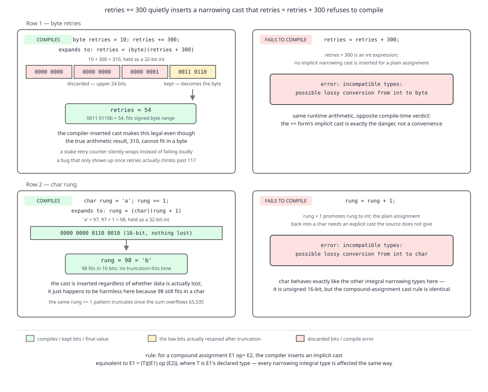

# 03 Java Core — Compound assignment, short-circuit and bitwise operators — BASICS (§1.6, 1.6.6–1.6.9)

**Target version: Java 21 LTS.** | **Part 1 of 5** | [Index](../00-index.md)
Previous: [Operators: precedence, evaluation order and constant expressions](02-operators-and-expressions.md) · Next: [Cast expressions and comparison](02b-casts-and-comparison.md)

Every bytecode listing and every printed value in this file was captured by compiling with `javac --release 21` and disassembling with `javap -c` on JDK 25 (`--release 21` fixes the class-file version and the language level, and none of these instructions changed between 21 and 25). Where a listing is reconstructed rather than captured, the text says so.

This part covers assignment and bit work: the cast that compound assignment inserts behind your back, the difference between skipping an operand and evaluating it anyway, and the flags idiom. The precedence ladder those operators sit on, and the left-to-right evaluation guarantee they rely on, are in [02-operators-and-expressions.md](02-operators-and-expressions.md). Cast syntax and the three meanings of `==` continue in [02b-casts-and-comparison.md](02b-casts-and-comparison.md).

---

## 1. Compound assignment hides a narrowing cast (1.6.6, 1.6.7)

**Concept.** `retries += 300` and `retries = retries + 300` look like the same statement written two ways. They are not. The compound form inserts a cast back to the left-hand side's type that you never wrote, so it compiles where the explicit form is rejected — and silently truncates.

**Why it exists.** Without the implicit cast, `+=` would be useless on every type narrower than `int`, because binary numeric promotion turns `byte + int` into `int`. `byte b = 0; b += 1;` would not compile. The language designers chose "always compiles, may truncate" over "never compiles on small types". The cost is a compile-time safety net removed exactly where narrow types live: wire-format fields, byte parsers, `char` cursors.

**How it works.** JLS 21 §15.26.2, *Compound Assignment Operators*:

> "A compound assignment expression of the form `E1 op= E2` is equivalent to `E1 = (T) ((E1) op (E2))`, where `T` is the type of `E1`, except that `E1` is evaluated only once."

Every clause matters. `(T)` is the hidden cast. `op` runs under normal binary numeric promotion, so both operands widen to at least `int` — the promotion rules themselves are in [03a-promotion-boxing-and-inference.md](03a-promotion-boxing-and-inference.md). "`E1` is evaluated only once" is what makes `positions[nextIndex()] += movement` safe — `nextIndex()` runs once, not twice — and it is the direct consequence of JLS 15.7.1's rule that evaluating the left-hand operand of a compound assignment both remembers the variable and saves its old value, quoted in [02-operators-and-expressions.md](02-operators-and-expressions.md).

Work the QuizStakes case through. A `byte retries` field comes off a wire format that packs a retry count into one octet.

- `retries = 10`, so bits `0000 1010`.
- `retries += 300` expands to `retries = (byte)(retries + 300)`.
- Promotion: `(int) 10 + 300 = 310`.
- 310 in 32 bits: `0000 0000 0000 0000 0000 0001 0011 0110`.
- `(byte)` keeps the low 8 bits: `0011 0110`.
- `0011 0110` = 32 + 16 + 4 + 2 = **54**. And the sign bit of that byte is 0, so the result is +54, not negative.

The explicit form `retries = retries + 300;` produces, captured verbatim from `javac --release 21`:

```
Bad.java:4: error: incompatible types: possible lossy conversion from int to byte
        retries = retries + 300;
                          ^
```



**D-017** — Left column: `retries += 300` expanded to `retries = (byte)(retries + 300)`, with 310's bit pattern and the low eight bits `0011 0110` boxed as 54. Right column: the same arithmetic written out longhand and rejected by the compiler. Second row: `rung += 1` on a `char`, yielding `'b'`. Look at the low-8-bits box first — that is the whole difference.

The bytecode makes the hidden cast visible as a single `i2b` instruction. Captured:

```
static byte compound();
  Code:
       0: bipush    10     // push 10
       2: istore_0         // retries == 10
       3: iload_0          // push retries, widened to int on the stack
       4: sipush    300    // push 300
       7: iadd             // 310
       8: i2b              // <-- the cast you did not write: int -> byte, keeps low 8 bits -> 54
       9: istore_0
      10: iload_0
      11: ireturn
```

`char` behaves identically with `i2c` instead of `i2b`. The stack has no `byte` or `char` slots — every integral value narrower than `int` lives on the stack as an `int`, and `i2b`/`i2c`/`i2s` are the explicit re-narrowing steps. Captured:

```
static char rung();
  Code:
       0: bipush    97     // 'a'
       2: istore_0
       3: iload_0
       4: iconst_1
       5: iadd             // 98
       6: i2c              // int -> char
       7: istore_0
       8: iload_0
       9: ireturn          // 'b'
```

```java
final class CompoundAssignmentDemo {
    static byte truncatingRetries() {
        byte retries = 10;
        retries += 300;        // == (byte)(10 + 300) == (byte) 310 == 54
        return retries;
    }

    static byte explicitFormRejected() {
        byte retries = 10;
        // retries = retries + 300;  // error: possible lossy conversion from int to byte
        retries = (byte) (retries + 300);   // legal once you accept the truncation in writing
        return retries;
    }

    static char nextRung() {
        char rung = 'a';
        rung += 1;             // == (char)(97 + 1) == 'b'
        // rung = rung + 1;    // error: possible lossy conversion from int to char
        return rung;
    }

    static int evaluatedOnce(int[] positions) {
        int cursor = 0;
        positions[cursor++] += 5;   // index expression runs ONCE: positions[0] += 5
        return cursor;              // 1, not 2
    }

    public static void main(String[] args) {
        System.out.println(truncatingRetries());        // 54
        System.out.println(explicitFormRejected());     // 54
        System.out.println(nextRung());                 // b
        int[] positions = { 100, 200 };
        System.out.println(evaluatedOnce(positions));   // 1
        System.out.println(positions[0] + "," + positions[1]); // 105,200
    }
}
```

**Pitfall:** "`x += y` is shorthand for `x = x + y`." It is shorthand for `x = (T)(x + y)`. On a `byte retries` parsed from a wire frame, `retries += deltaFromHeader` will wrap past 127 into negatives with no warning at all, so a retry counter reads `-102` in the audit trail and the cap-at-3 check passes forever. The fix on narrow types is to widen the field to `int` and range-check explicitly, or to write the cast by hand so a reader sees it.

**Insight:** the same hidden cast is why `int stakeCount = 0; stakeCount += 3.7;` compiles and leaves `stakeCount` at 3. The `double` result is cast back with `d2i`, which truncates toward zero. `+=` on an integral left-hand side will happily swallow a floating-point right-hand side.

**Interview:** "Why does `byte b = 10; b += 300;` compile when `b = b + 300;` does not?" — JLS 15.26.2 defines `E1 op= E2` as `E1 = (T)((E1) op (E2))`. The implicit `(byte)` cast satisfies assignment; the explicit form has no cast and fails the lossy-conversion check. The value is 54.

> Compound assignment expands to an assignment with an implicit cast back to the left-hand operand's type, and evaluates the left-hand operand exactly once.

---

## 2. Short-circuit versus eager boolean operators (1.6.8)

**Concept.** `&&` and `||` are the only Java operators that may leave an operand unevaluated. `&` and `|` on `boolean` operands compute the same truth table but always evaluate both sides. When the right-hand side is `ClientRestrictions.isBlocked(clientId, STAKE_BLOCKED)` — a call that hits the restrictions store — the difference is not stylistic.

**Why it exists.** Short-circuiting makes guard clauses expressible as a single expression: `account != null && account.isActive()` is safe only because the right side is skipped when the left is false. The eager forms survive on `boolean` for the rare case where you genuinely want both side effects, and because `&`/`|` must exist anyway for integral operands.

**How it works.** JLS 15.23 and 15.24: for `A && B`, `A` is evaluated; if it is `false`, the result is `false` and `B` **is not evaluated**. For `A || B`, if `A` is `true`, `B` is not evaluated. `A & B` and `A | B` on `boolean` fall under JLS 15.22.2 and evaluate both operands unconditionally. There is no `^^`; `^` on booleans is inherently eager because both operands are always needed.

The cost model at QuizStakes scale: stake reservations run 2.8M/day with a 1,200/sec peak. If the restrictions lookup is on the critical path of every reservation and the cheap in-memory check already answers "no restriction" for the vast majority of clients, ordering the operands cheap-first and using `&&` removes that call from the hot path entirely. The escape hatch — and the reason this is a tradeoff, not a free win — is that short-circuiting makes the number of calls data-dependent, so your latency histogram grows a long tail whenever the cheap predicate starts returning true more often, and any metric you increment inside the expensive predicate now under-counts.

| Form | Operands | Evaluates right side | Legal on `int` | Typical use |
|---|---|---|---|---|
| `&&` | `boolean` only | only if left is `true` | no | guard chains, cheap-first predicate ordering |
| `\|\|` | `boolean` only | only if left is `false` | no | early-accept chains |
| `&` | `boolean` or integral | always | yes | flag masking on integral; forced both-side evaluation on `boolean` |
| `\|` | `boolean` or integral | always | yes | flag setting on integral |
| `^` | `boolean` or integral | always | yes | flag toggling; "exactly one of" on booleans |

```java
import java.util.EnumSet;
import java.util.Map;
import java.util.Set;

final class ShortCircuitDemo {
    enum RestrictionType {
        DEPOSIT_BLOCKED, STAKE_BLOCKED, WITHDRAWAL_BLOCKED, DEPOSIT_LIMITED,
        WITHDRAWAL_HELD, SOURCE_OF_FUNDS_REQUIRED, ALL_BLOCKED, SELF_EXCLUDED,
        COOLING_OFF, DORMANT_FROZEN
    }

    record ClientId(java.util.UUID value) {}

    static final class ClientRestrictions {
        private final Map<ClientId, Set<RestrictionType>> store;
        private int lookups = 0;

        ClientRestrictions(Map<ClientId, Set<RestrictionType>> store) { this.store = store; }

        boolean isBlocked(ClientId clientId, RestrictionType type) {
            lookups++;   // stands in for the network round trip
            return store.getOrDefault(clientId, Set.of()).contains(type);
        }

        int lookups() { return lookups; }
    }

    static boolean canStakeShortCircuit(boolean accountActive, ClientId id, ClientRestrictions r) {
        return accountActive && !r.isBlocked(id, RestrictionType.STAKE_BLOCKED);
    }

    static boolean canStakeEager(boolean accountActive, ClientId id, ClientRestrictions r) {
        return accountActive & !r.isBlocked(id, RestrictionType.STAKE_BLOCKED);
    }

    public static void main(String[] args) {
        ClientId id = new ClientId(java.util.UUID.randomUUID());
        ClientRestrictions cheap = new ClientRestrictions(
                Map.of(id, EnumSet.of(RestrictionType.STAKE_BLOCKED)));
        System.out.println(canStakeShortCircuit(false, id, cheap)); // false
        System.out.println("lookups after short-circuit: " + cheap.lookups()); // 0

        ClientRestrictions eager = new ClientRestrictions(
                Map.of(id, EnumSet.of(RestrictionType.STAKE_BLOCKED)));
        System.out.println(canStakeEager(false, id, eager));        // false
        System.out.println("lookups after eager: " + eager.lookups()); // 1

        // The classic guard: the eager form dereferences null.
        Set<RestrictionType> maybeNull = null;
        System.out.println(maybeNull != null && maybeNull.isEmpty()); // false, no NPE
        try {
            System.out.println(maybeNull != null & maybeNull.isEmpty());
        } catch (NullPointerException e) {
            System.out.println("eager & on a null guard: NPE");
        }
    }
}
```

**Pitfall:** "`&` and `&&` differ only in speed." They differ in *whether the right operand runs at all*, which changes correctness whenever the right operand can throw or mutate. `restriction != null & restriction.isActive()` throws `NullPointerException` on every null. Conversely, writing `&&` when you needed both side effects — `advanced = cursor.next() && cursor.next()` — silently skips the second advance. Fix: use `&&`/`||` for every predicate, and if you need both side effects, put them on separate statements where the intent is visible.

**Insight:** short-circuiting is why operand *order* is a performance decision, and JLS 15.7's left-to-right guarantee is what makes that decision reliable. Put the cheap, high-selectivity predicate on the left; the guarantee means the compiler cannot undo your choice.

**Interview:** "When is `&` on booleans not a bug?" — when both operands have side effects you need, or when you are deliberately avoiding a branch in extremely hot numeric code. In predicate chains it is a defect waiting for a null.

> `&&` and `||` skip their right operand when the left already decides the result; `&`, `|` and `^` on booleans always evaluate both.

---

## 3. Bitwise operators and the restriction-flags idiom (1.6.9)

**Concept.** QuizStakes has exactly ten `RestrictionType` values. Ten booleans fit in ten bits of one `int`, and "does this client have any blocking restriction" becomes one AND instruction instead of ten map lookups. `&` tests and intersects, `|` sets and unions, `^` toggles and diffs, `~` inverts a whole mask.

**Why it exists.** Before `EnumSet`, a bitmask was the only compact way to carry a set of flags across a boundary — a database column, a wire frame, a JNI call. It survives because the operations are single instructions and the representation is one machine word. `java.lang.reflect.Modifier`, `java.nio.channels.SelectionKey` and `Pattern`'s flags all still use it.

**How it works.** All four operate on `int` or `long` after unary numeric promotion; `byte`, `short` and `char` operands are promoted to `int` first. `~x` is `-x - 1` in two's complement, so `~0b1010` is `-11`, not `0b0101` — the inversion covers all 32 bits including the sign bit. Idioms:

| Intent | Expression | Note |
|---|---|---|
| define flag *n* | `1 << n` | `n` is masked to its low 5 bits for `int`, low 6 for `long` |
| set a flag | `flags \|= STAKE_BLOCKED` | idempotent |
| clear a flag | `flags &= ~STAKE_BLOCKED` | the `~` is why clearing reads awkwardly |
| toggle a flag | `flags ^= COOLING_OFF` | `x ^ x == 0`, so applying twice restores |
| test a flag | `(flags & STAKE_BLOCKED) != 0` | parentheses mandatory (level 8 beats level 9) |
| test all of a set | `(flags & set) == set` | not `!= 0`, which tests *any* |
| test none of a set | `(flags & set) == 0` | |
| symmetric difference | `a ^ b` | which flags changed between two snapshots |

The tradeoff: a mask is 4 bytes and one instruction, versus an `EnumSet` which is 1 object header plus a `long` plus a reference to the universe array. At 2.4M registered clients, a per-client `int` mask costs about 9.6 MB of primitive data against roughly 100 MB for `EnumSet` instances — but the mask has no type safety (nothing stops you OR-ing a `Movement` type constant into a restriction mask), no `toString`, and no iteration without hand-written bit scanning. The escape hatch is `EnumSet`, which is itself a `long` bitmask behind an interface: use `EnumSet` in the domain model and convert to an `int` only at the persistence or wire boundary. `EnumSet`'s internals are in guide **02 Java collections**.

```java
import java.util.EnumSet;
import java.util.Set;

final class RestrictionMaskDemo {
    enum RestrictionType {
        DEPOSIT_BLOCKED, STAKE_BLOCKED, WITHDRAWAL_BLOCKED, DEPOSIT_LIMITED,
        WITHDRAWAL_HELD, SOURCE_OF_FUNDS_REQUIRED, ALL_BLOCKED, SELF_EXCLUDED,
        COOLING_OFF, DORMANT_FROZEN;

        int bit() { return 1 << ordinal(); }
    }

    static final int STAKE_BLOCKING_SET =
            RestrictionType.STAKE_BLOCKED.bit()
          | RestrictionType.ALL_BLOCKED.bit()
          | RestrictionType.SELF_EXCLUDED.bit()
          | RestrictionType.COOLING_OFF.bit();

    static int toMask(Set<RestrictionType> types) {
        int mask = 0;
        for (RestrictionType t : types) { mask |= t.bit(); }
        return mask;
    }

    static EnumSet<RestrictionType> fromMask(int mask) {
        EnumSet<RestrictionType> out = EnumSet.noneOf(RestrictionType.class);
        for (RestrictionType t : RestrictionType.values()) {
            if ((mask & t.bit()) != 0) { out.add(t); }
        }
        return out;
    }

    static boolean stakeBlocked(int mask)  { return (mask & STAKE_BLOCKING_SET) != 0; }
    static int     clear(int mask, RestrictionType t) { return mask & ~t.bit(); }
    static int     toggle(int mask, RestrictionType t) { return mask ^ t.bit(); }
    static int     changed(int before, int after) { return before ^ after; }

    public static void main(String[] args) {
        int mask = toMask(EnumSet.of(RestrictionType.DEPOSIT_LIMITED,
                                     RestrictionType.STAKE_BLOCKED));
        System.out.println(Integer.toBinaryString(mask));        // 1010
        System.out.println(stakeBlocked(mask));                  // true
        System.out.println(Integer.bitCount(mask));              // 2

        int cleared = clear(mask, RestrictionType.STAKE_BLOCKED);
        System.out.println(stakeBlocked(cleared));                // false
        System.out.println(fromMask(cleared));                   // [DEPOSIT_LIMITED]

        System.out.println(fromMask(changed(mask, cleared)));     // [STAKE_BLOCKED]
        System.out.println(toggle(toggle(mask, RestrictionType.COOLING_OFF),
                                  RestrictionType.COOLING_OFF) == mask); // true

        System.out.println(~0b1010);                             // -11, not 5
        System.out.println(1 << 32);                             // 1: shift count is 32 & 31 == 0
    }
}
```

**Pitfall:** "`~mask` gives me the complement of my ten flags." It gives the complement of all 32 bits, so bits 10 through 31 come back set and `(flags & ~STAKE_BLOCKED) != 0` starts reporting restrictions that do not exist. Fix: keep a `UNIVERSE` constant equal to the OR of every declared flag and write `~mask & UNIVERSE`.

**Insight:** the shift count is masked, not clamped — `1 << 32` is `1 << (32 & 31)` = `1 << 0` = 1, and `1L << 64` is `1L`. Any code that computes a shift amount from data must range-check it, because an out-of-range count fails silently rather than throwing. The bit-level details of shifting live in [01b-shifts-and-unsigned.md](01b-shifts-and-unsigned.md).

**Interview:** "How do you test whether *all* of a set of flags is present?" — `(flags & set) == set`. `(flags & set) != 0` tests whether *any* is present; confusing the two is the standard bug.

> `&`, `|`, `^` and `~` operate bitwise on `int` or `long` after promotion, and `~` inverts every bit of the promoted width, not just the bits you declared.

---

## Pitfalls

### `x += y` is just shorthand for `x = x + y`

**Wrong**

```java
byte retries = 10;
retries += 300;
System.out.println(retries);   // 54, and no warning
```

**Right**

```java
int retries = 10;                       // widen the field to match the arithmetic
retries = Math.addExact(retries, 300);  // 310, and throws ArithmeticException on overflow
System.out.println(retries);            // 310
```

**Why people believe it:** the expansion is true for `int` and `long`, which is where 95% of `+=` usage lives. JLS 15.26.2's actual expansion is `x = (T)(x + y)`, and the `(T)` only bites when `T` is narrower than the promoted arithmetic type.

### `&` and `&&` differ only in speed

**Wrong**

```java
Set<RestrictionType> restrictions = null;
if (restrictions != null & restrictions.isEmpty()) {   // NPE
    System.out.println("clear to stake");
}
```

**Right**

```java
Set<RestrictionType> restrictions = null;
if (restrictions != null && restrictions.isEmpty()) {  // false, no NPE
    System.out.println("clear to stake");
}
```

**Why people believe it:** the truth tables are identical, so the operators look interchangeable. JLS 15.23 makes `&&` skip its right operand entirely when the left is false; `&` (JLS 15.22.2) always evaluates both, so any right operand that can throw or hit the network does so unconditionally.

### `~mask` gives me the complement of my ten declared flags

**Wrong**

```java
final class RestrictionComplementWrong {
    static final int STAKE_BLOCKED = 1 << 1;     // RestrictionType ordinal 1
    public static void main(String[] args) {
        int complement = ~STAKE_BLOCKED;         // 11111111111111111111111111111101
        System.out.println(Integer.bitCount(complement));   // 31, not 9
        System.out.println(complement < 0);                 // true: the sign bit flipped too
    }
}
```

**Right**

```java
final class RestrictionComplementRight {
    static final int STAKE_BLOCKED = 1 << 1;
    static final int UNIVERSE = (1 << 10) - 1;   // ten declared RestrictionType values
    public static void main(String[] args) {
        int complement = ~STAKE_BLOCKED & UNIVERSE;
        System.out.println(Integer.toBinaryString(complement)); // 1111111101
        System.out.println(Integer.bitCount(complement));       // 9
        System.out.println(complement < 0);                     // false: inside the universe
    }
}
```

**Why people believe it:** `~` is described as "complement", and mentally the set being complemented is the set of flags you declared. The operator has no idea a `RestrictionType` exists — it complements all 32 bits of the promoted `int`, including the sign bit, so the result is negative and carries 22 phantom flags. Masking with a `UNIVERSE` constant restores the intended domain.

### `+=` on an `int` counter cannot accept a `double`

**Wrong**

```java
final class AverageStakeWrong {
    public static void main(String[] args) {
        int stakeMinorUnits = 0;
        stakeMinorUnits += 4.20;                    // compiles: d2i truncates to 4
        System.out.println(stakeMinorUnits);        // 4, not 420 and not a compile error
    }
}
```

**Right**

```java
import java.math.BigDecimal;

final class AverageStakeRight {
    public static void main(String[] args) {
        BigDecimal averageStake = new BigDecimal("4.20");
        long stakeMinorUnits = averageStake.movePointRight(2).longValueExact();
        System.out.println(stakeMinorUnits);        // 420, exact, and throws if it were not
    }
}
```

**Why people believe it:** every *explicit* assignment of a `double` to an `int` is a compile error, so the same rule is assumed for `+=`. JLS 15.26.2's implicit `(T)` cast is a full narrowing primitive conversion, `double` to `int` included, and it compiles to `d2i` which truncates toward zero with no diagnostic. Money never belongs in a primitive counter fed by `+=`; convert to minor units through `BigDecimal` where the failure is loud.

---

## Cheat sheet

| Item | Rule | Value / gotcha |
|---|---|---|
| `x op= y` | `x = (T)(x op y)`, `x` evaluated once | JLS 15.26.2 |
| `byte b=10; b+=300` | compiles, `i2b` | **54**; `b = b + 300` is a compile error |
| `char c='a'; c+=1` | compiles, `i2c` | `'b'`; `c = c + 1` is a compile error |
| `int n=0; n+=3.7` | compiles, `d2i` | 3, truncated toward zero |
| `arr[f()] += v` | index expression runs once | not twice |
| `&&` / `\|\|` | right operand may not run | order cheap predicate first |
| `&` / `\|` on boolean | both operands always run | null-guard chains break |
| `^` on boolean | always eager | there is no `^^` |
| Test any flag | `(f & set) != 0` | parentheses mandatory |
| Test all flags | `(f & set) == set` | not `!= 0` |
| Set / clear / toggle | `f \|= b` / `f &= ~b` / `f ^= b` | toggle twice restores |
| Flag diff | `before ^ after` | which flags changed |
| `~x` | `-x - 1`, all 32/64 bits | mask with a `UNIVERSE` constant |
| Shift count | masked to 5 bits (`int`) / 6 (`long`) | `1 << 32` == 1 |
| Mask vs `EnumSet` | `int` at the wire boundary, `EnumSet` in the model | mask has no type safety |

---

## Self-test

**Q1.** Why does `byte retries = 10; retries += 300;` compile while `retries = retries + 300;` does not, and what does `retries` hold?

<details><summary>Answer</summary>

JLS 15.26.2 defines `E1 op= E2` as `E1 = (T)((E1) op (E2))` with `E1` evaluated once, where `T` is the type of `E1`. The compound form therefore carries an implicit `(byte)` cast, which satisfies assignment conversion. The explicit form has no cast, and `10 + 300` is an `int` expression of value 310 which does not fit a `byte`, so `javac` reports `incompatible types: possible lossy conversion from int to byte`. The value is 54: 310 is `0000 0001 0011 0110`, the cast keeps the low eight bits `0011 0110` = 54. In bytecode the cast appears as a single `i2b` instruction.

</details>

**Q2.** `flags & STAKE_BLOCKED != 0` does not compile. Explain the error and give the two correct forms for "any of this set" and "all of this set".

<details><summary>Answer</summary>

`!=` is at precedence level 8 and `&` is at level 9, so `!=` binds tighter. The expression parses as `flags & (STAKE_BLOCKED != 0)`, which is `int & boolean` — no such operator, so `javac` rejects it. In C the same line compiles because the comparison yields an `int`, and the result is silently wrong; Java's stricter typing turns the precedence trap into a compile error.

For "any of these flags is present": `(flags & set) != 0`. For "all of these flags are present": `(flags & set) == set`. Substituting one for the other is the standard flags bug — `!= 0` on a multi-bit mask reports true when just one bit matches.

</details>

**Q3.** What does `1 << 32` evaluate to, and what does that imply for a shift amount computed from data?

<details><summary>Answer</summary>

`1 << 32` is 1. For an `int` left operand the shift distance is masked to its low five bits, so 32 becomes `32 & 31 == 0` and the shift is a no-op. For a `long` left operand the mask is six bits, so `1L << 64` is likewise `1L`.

The distance is *masked, not clamped*, and no exception is thrown, which makes this one of the quieter failure modes in the language. Any code that derives a shift amount from data — an ordinal read off a wire frame, a bit index parsed from a config string, a loop bound computed from a `RestrictionType` count — must range-check the amount itself, because an out-of-range value produces a plausible-looking wrong answer rather than a diagnostic. The related trap is precedence: `1 << ordinal + 1` is `1 << (ordinal + 1)`, since shift sits below additive on the ladder.

</details>

**Q4.** `int cursor = 0; positions[cursor++] += 5;` — which element changes, and what is `cursor` afterwards? Which clause of JLS 15.26.2 decides it?

<details><summary>Answer</summary>

`positions[0]` changes and `cursor` is 1, not 2. The deciding clause is the "except that `E1` is evaluated only once" exception in JLS 15.26.2. The naive expansion `positions[cursor++] = positions[cursor++] + 5` would evaluate the index expression twice, reading `positions[0]` and writing `positions[1]`, and would leave `cursor` at 2. The real semantics come from JLS 15.7.1: evaluating the left-hand operand of a compound assignment both determines *which* variable is being assigned — here the array reference plus the index 0 — and saves that variable's current value for the arithmetic. Both the array reference and the index are computed once and reused.

This is the one place where the compound form is not merely more concise but strictly safer than the longhand, and it holds for any side-effecting subexpression on the left: `ledger.entryAt(nextIndex()) += movement` calls `nextIndex()` once.

</details>

**Q5.** `int stakeCount = 0; stakeCount += 3.7;` compiles. What is `stakeCount`, and why is this not a lossy-conversion error?

<details><summary>Answer</summary>

`stakeCount` is 3. The implicit cast in JLS 15.26.2's expansion is `(int)`, and it applies to the *promoted* result of the arithmetic. Binary numeric promotion turns `int + double` into `double`, giving `3.7`, and the cast back to `int` is a narrowing primitive conversion that truncates toward zero. In bytecode the sequence is `iload`, `i2d`, `ldc2_w 3.7`, `dadd`, `d2i`, `istore`.

There is no error because the cast is present — it just is not present in the source you wrote. Every narrowing primitive conversion is legal when written explicitly, and compound assignment writes it for you unconditionally. That is why `+=` cannot be trusted as a type check: the only operators that will refuse a `double` on the right of an `int` target are plain `=` and the explicit-form `x = x + y`.

</details>

**Q6.** At a 1,200/sec reservation peak, `accountActive && !restrictions.isBlocked(id, STAKE_BLOCKED)` and the same line with a single `&` behave identically in every unit test you have. Name two production differences.

<details><summary>Answer</summary>

First, call volume and therefore latency. With `&&`, `isBlocked` runs only when `accountActive` is true, so the restrictions lookup disappears from the hot path for every inactive account. With `&` it runs on every one of the 2.8M daily reservations. The tests do not show it because they assert on the returned boolean, which is identical — the truth tables of `&&` and `&` on booleans agree everywhere.

Second, correctness under null and under exceptions. If the right operand can throw — a null `Set` of restrictions, a timed-out store call — `&` propagates that failure even in cases where the left operand had already decided the answer. `restrictions != null & restrictions.isEmpty()` is the canonical form of this bug and throws `NullPointerException` on every null.

A third, subtler consequence: any counter or metric incremented inside the expensive predicate under-counts with `&&`, because the number of invocations is now data-dependent. That is an argument for putting instrumentation outside the short-circuited operand, not for switching to `&`.

</details>

---

## Open questions

None.

---

**Leaves covered:** 1.6.6, 1.6.7, 1.6.8, 1.6.9 (4 leaves)
**Leaves deferred:** none
**Diagrams included:** D-017
**Target version:** Java 21 LTS
**Lines:** 508
