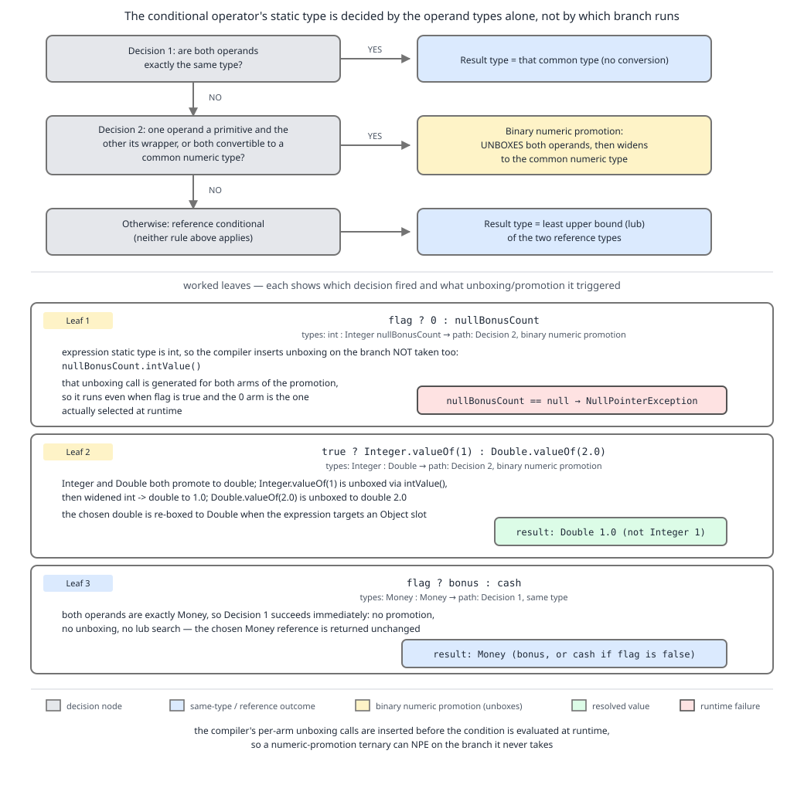

# 03 Java Core — The conditional operator and pattern `instanceof` — BASICS (§1.6, 1.6.10–1.6.13)

**Target version: Java 21 LTS.** | **Part 1 of 5** | [Index](../00-index.md)
Previous: [Cast expressions and comparison](02b-casts-and-comparison.md) · Next: [String concatenation and poly expressions](02d-string-concatenation.md)

Every bytecode listing and every printed value in this file was captured by compiling with `javac --release 21` and disassembling with `javap -c` on JDK 25 (`--release 21` fixes the class-file version and the language level, and none of these instructions changed between 21 and 25). Where a listing is reconstructed rather than captured, the text says so.

This part covers the two operators whose *type* is the interesting part: the conditional operator, which computes one static type from both of its branches, and `instanceof`, which can bind a narrowed variable whose scope is decided by flow analysis. The precedence ladder is in [02-operators-and-expressions.md](02-operators-and-expressions.md); assignment and bit work are in [02a-assignment-and-bitwise.md](02a-assignment-and-bitwise.md), and cast syntax and `==` are in [02b-casts-and-comparison.md](02b-casts-and-comparison.md). String concatenation and poly expressions continue in [02d-string-concatenation.md](02d-string-concatenation.md).

---

## 1. The conditional operator's type is computed, not chosen (1.6.10, 1.6.11, 1.6.12)

**Concept.** `flag ? a : b` does not have "the type of whichever branch runs". It has one static type, computed from **both** operands by a table in JLS 15.25, before anything runs. The branch that runs is then converted to that type. When the computed type is a primitive and the surviving branch is a boxed null, you get a `NullPointerException` out of an expression that contains no visible dereference.

**Why it exists.** The conditional operator must have a single type so that its result can be assigned, passed as an argument and used as a receiver. Choosing the type at runtime would make the expression untypeable. The cost is that adding autoboxing to the language in Java 5 grafted unboxing conversions onto a typing rule designed for primitives, and the seam shows.

**How it works.** JLS 21 §15.25 classifies the expression into three kinds, then applies a table:

- **Boolean conditional** — both operands are `boolean` or `Boolean`.
- **Numeric conditional** — both operands are convertible to numeric types. The result type is given by the table in §15.25.2: if the operands after unboxing are of different numeric types, **binary numeric promotion** applies, and the result is the wider type. `int` and `Integer` collapse to `int`. `Integer` and `Double` promote to `double`.
- **Reference conditional** — everything else. The result type is the least upper bound of the two operand types, and no unboxing happens.

That third bullet is why `flag ? bonus : cash` with both operands `Money` is completely safe: it is a reference conditional, the type is `Money`, and null is a legal value.

Binary numeric promotion and the unboxing conversion it depends on are developed in [03a-promotion-boxing-and-inference.md](03a-promotion-boxing-and-inference.md).



**D-018** — The decision spine: numeric conditional versus reference conditional, with three worked leaves. Start at the middle leaf (`Integer` and `Double` promoting to `double`), then read the left leaf to see how `int` plus `Integer` forces an unboxing that null cannot survive.

### Leaf 1.6.11, worked through rather than asserted

Take a `Map<Position, Integer>` lookup that misses, so `nullBonusCount` is null, and:

```java
int available = blocked ? 0 : nullBonusCount;
```

The operands are `int` (the literal 0) and `Integer`. Table §15.25.2 row for `int`/`Integer`: result type `int`. So the `Integer` branch, if selected, is subject to unboxing. Captured `javap -c` for exactly this shape (the condition is a non-constant method call, so no branch is folded away):

```
static int pick(java.lang.Integer);
  Code:
       0: invokestatic  #7   // Method flag:()Z
       3: ifeq          10   // if flag is false, jump to the else branch
       6: iconst_0           // then branch: push 0
       7: goto          14
      10: aload_0            // else branch: push the Integer reference
      11: invokevirtual #13  // Method java/lang/Integer.intValue:()I   <-- the unboxing
      14: ireturn
```

Read offsets 10 and 11: the `intValue()` call sits **inside the else branch**, after the `ifeq`. So the unboxing — and therefore the NPE — happens only when the `Integer` branch is actually selected. Running it confirms exactly that:

- `flag()` returns true, `int n = flag() ? 0 : nullBonusCount;` → `n == 0`, no exception.
- `flag()` returns true, `int n = flag() ? nullBonusCount : 0;` → `NullPointerException: Cannot invoke "java.lang.Integer.intValue()" because "<local2>" is null`.

**So the leaf's formulation needs sharpening.** The NPE is not thrown "even when the condition is true"; it is thrown whenever the *selected* branch is the null-valued boxed one. What genuinely surprises people, and what the leaf is reaching for, is the **third** case: the assignment target being `Integer` does not save you.

```java
Integer available = blocked ? 0 : nullBonusCount;   // blocked == false -> NPE
```

Here null is a perfectly legal value for `available`, yet the expression still throws. Captured listing:

```
static java.lang.Integer pick2(java.lang.Integer);
  Code:
       0: invokestatic  #7   // Method flag:()Z
       3: ifeq          10
       6: iconst_0
       7: goto          14
      10: aload_0
      11: invokevirtual #13  // Integer.intValue:()I     <-- unbox
      14: invokestatic  #19  // Integer.valueOf:(I)Ljava/lang/Integer;  <-- rebox
      17: areturn
```

The expression type is still `int`, computed from the operands alone; the target type is irrelevant to §15.25's table. So the value is unboxed at offset 11 and immediately reboxed at offset 14, and the round trip through `int` is what kills null. Change the `0` literal to `Integer.valueOf(0)` — or to a variable of type `Integer` — and the expression becomes a reference conditional, no unboxing occurs, and null passes through.

One extra wrinkle worth knowing: if the condition is a **compile-time constant**, `javac` folds the expression and emits only the taken branch, so `int n = true ? 0 : nullBonusCount;` prints `0` and never throws. The typing rule is unchanged — the dead branch simply has no code to execute. What makes a condition a compile-time constant is covered in [02-operators-and-expressions.md](02-operators-and-expressions.md).

### Leaf 1.6.12, worked through

```java
Object o = true ? Integer.valueOf(1) : Double.valueOf(2.0);
```

Both operands are convertible to numeric types, so this is a numeric conditional. Unbox: `int` and `double`. Binary numeric promotion: `double`. Result type `double`. The taken branch yields `1`, widened to `1.0d`. The assignment to `Object` then boxes it — as a `Double`. Confirmed at runtime: prints `1.0`, and `o.getClass().getName()` is `java.lang.Double`. The `Integer` you wrote is gone; nothing of it survives except the numeral 1.

If either operand were null, the same expression would NPE regardless of which branch was taken, because unboxing is applied to whichever operand is selected.

```java
import java.math.BigDecimal;
import java.util.Currency;
import java.util.HashMap;
import java.util.Map;

final class TernaryTypingDemo {
    enum Position { CLIENT_CASH_AVAILABLE, CLIENT_BONUS_AVAILABLE, SUSPENSE }
    record Money(BigDecimal amount, Currency currency) {
        static Money gbp(String v) { return new Money(new BigDecimal(v), Currency.getInstance("GBP")); }
    }

    static boolean blocked() { return false; }

    public static void main(String[] args) {
        Map<Position, Integer> counts = new HashMap<>();
        counts.put(Position.CLIENT_CASH_AVAILABLE, 7);
        Integer nullBonusCount = counts.get(Position.CLIENT_BONUS_AVAILABLE); // null

        // 1. Numeric conditional, type int. The else branch is selected and unboxed.
        try {
            int available = blocked() ? 0 : nullBonusCount;
            System.out.println("unreachable: " + available);
        } catch (NullPointerException e) {
            System.out.println("int target NPE: " + e.getMessage());
        }

        // 2. Target type Integer does not help: the expression type is still int.
        try {
            Integer available = blocked() ? 0 : nullBonusCount;
            System.out.println("unreachable: " + available);
        } catch (NullPointerException e) {
            System.out.println("Integer target NPE: " + e.getMessage());
        }

        // 3. Make it a reference conditional and null survives.
        Integer zero = 0;
        Integer safe = blocked() ? zero : nullBonusCount;
        System.out.println("reference conditional: " + safe);   // null

        // 4. Numeric promotion across wrapper types.
        Object promoted = true ? Integer.valueOf(1) : Double.valueOf(2.0);
        System.out.println(promoted + " / " + promoted.getClass().getName()); // 1.0 / java.lang.Double

        // 5. Both operands the same reference type: no promotion, no unboxing.
        Money bonus = Money.gbp("0.33");
        Money cash  = Money.gbp("3.00");
        Money chosen = blocked() ? bonus : cash;
        System.out.println(chosen.amount());   // 3.00
    }
}
```

**Pitfall:** "The ternary just returns whichever branch runs, so its type is that branch's type." The type is computed from both operands. Symptom one: `Integer x = cond ? 0 : mapMiss;` throwing NPE where null is a legal result. Symptom two: a `Money` amount silently becoming a `double` because someone wrote `cond ? bonusPennies : rate` mixing `int` and `double`. Fix: keep both operands the same type. If you want a nullable result, make both operands reference-typed; if you want a primitive, make both primitives.

**Insight:** the difference between `0` and `Integer.valueOf(0)` as the then-branch changes the expression's *kind* — numeric conditional versus reference conditional — and therefore whether unboxing is inserted at all. One literal decides whether the expression can produce null.

**Interview:** "What does `Object o = true ? Integer.valueOf(1) : Double.valueOf(2.0);` print?" — `1.0`, and `o` is a `Double`. Both operands are numeric-convertible, so binary numeric promotion makes the expression type `double`; the `Integer` is unboxed, widened and reboxed as `Double`.

> The conditional operator has a single static type derived from both operand types by JLS 15.25; the selected operand is converted to that type, which is why a primitive result type can unbox a null.

---

## 2. `instanceof` and pattern `instanceof` (1.6.13)

**Concept.** `o instanceof String` asks a question. `o instanceof String code` asks the question and, if the answer is yes, binds `code` to the narrowed value — the test and the cast fused into one expression, with the compiler tracking exactly where the binding is in scope.

**Why it exists.** The pre-Java-16 shape was three lines for one idea: test, cast, assign. That repetition is where `ClassCastException` bugs hid, because nothing forced the cast's type to match the test's type. Pattern `instanceof` (final in Java 16, JEP 394) removes the second mention of the type.

**How it works.** `x instanceof T` is `false` when `x` is null — always, with no exception. With a type pattern, the binding variable's scope is decided by **flow scoping**, not by braces: the variable is in scope exactly where the pattern is known to have matched. So `if (o instanceof String code) { use(code); }` scopes it to the then-block, while `if (!(o instanceof String code)) { return; } use(code);` scopes it to the rest of the method, because control reaching that point implies the match succeeded. Referring to it outside that region is a compile error, captured:

```
Poly3.java:3: error: cannot find symbol
    static void bad(Object o) { if (o instanceof String s) { } System.out.println(s.length()); }
                                                                                  ^
  symbol:   variable s
```

At the bytecode level the test compiles to a single `instanceof` instruction returning 0 or 1, followed by a `checkcast` when a binding is present — the JIT collapses the pair when the profile shows a monomorphic type. The unchecked `checkcast` form written by hand, and its failure mode, are in [02b-casts-and-comparison.md](02b-casts-and-comparison.md).

```java
sealed interface LedgerEvent permits Deposit, Stake, Settlement {}
record Deposit(String statusCode, long minorUnits) implements LedgerEvent {}
record Stake(String roundId, long minorUnits) implements LedgerEvent {}
record Settlement(String roundId, long payoutMinorUnits) implements LedgerEvent {}

final class InstanceofDemo {
    static String describeOldStyle(Object event) {
        if (event instanceof Deposit) {
            Deposit d = (Deposit) event;             // the second mention of the type
            return "deposit " + d.statusCode();
        }
        return "other";
    }

    static String describe(Object event) {
        if (event instanceof Deposit d && d.minorUnits() > 0) {
            return "deposit " + d.statusCode() + " of " + d.minorUnits();
        }
        if (event instanceof Stake s) {
            return "stake on round " + s.roundId();
        }
        return "other";
    }

    static String requireSettlement(Object event) {
        if (!(event instanceof Settlement settlement)) {
            throw new IllegalArgumentException("expected Settlement, got " + event);
        }
        // flow scoping: settlement is in scope for the whole remainder of the method
        return settlement.roundId() + " paid " + settlement.payoutMinorUnits();
    }

    public static void main(String[] args) {
        System.out.println(describe(new Deposit("DEP-301 CAPTURED", 6500)));
        System.out.println(describe(new Stake("round-42", 420)));
        System.out.println(describe(null));                       // other: null matches nothing
        System.out.println(requireSettlement(new Settlement("round-42", 900)));
        System.out.println(describeOldStyle(new Stake("round-7", 420))); // other
    }
}
```

**Pitfall:** assuming `null instanceof T` throws, or that it is `true` for a nullable reference type. It is `false`, unconditionally, which is usually what you want but means an `if (o instanceof Deposit d)` chain with a trailing `else` silently routes null into that `else`. If null needs distinct handling, test it first.

**Interview:** "What is flow scoping?" — the binding variable of a type pattern is in scope precisely where the compiler can prove the pattern matched, which includes the negated-guard-plus-early-return shape, not just the braces after the `if`.

Pattern matching goes much further than this: record deconstruction patterns, patterns in `switch`, guarded patterns and exhaustiveness over sealed hierarchies. All of that is guide **04 Modern Java**, with the `switch` forms themselves in [../control-flow/01-basics.md](../control-flow/01-basics.md); what belongs here is only that `instanceof` is a *relational* operator at precedence level 7, that it is null-safe, and that its binding variable's scope is flow-determined.

> `instanceof` tests a reference's runtime type, yielding `false` for null; the pattern form additionally binds a narrowed variable whose scope is determined by flow analysis.

---

## Pitfalls

### The ternary returns whichever branch runs, so its type is that branch's type

**Wrong**

```java
Map<Position, Integer> counts = new HashMap<>();
Integer nullBonusCount = counts.get(Position.CLIENT_BONUS_AVAILABLE);   // null
Integer available = blocked() ? 0 : nullBonusCount;   // blocked() is false
// NullPointerException: Cannot invoke "java.lang.Integer.intValue()"
```

**Right**

```java
Integer zero = 0;                                     // both operands now Integer
Integer available = blocked() ? zero : nullBonusCount; // reference conditional: null survives
System.out.println(available);                         // null
```

**Why people believe it:** it reads like an `if`/`else`, and for an `if`/`else` there is no unifying type to compute. JLS 15.25 computes a single static type from *both* operands before any branch is selected; with an `int` literal on one side the type is `int`, and the surviving `Integer` is unboxed.

### A trailing `else` after an `instanceof` chain handles every real case

**Wrong**

```java
sealed interface LedgerEvent permits Deposit, Stake {}
record Deposit(String statusCode, long minorUnits) implements LedgerEvent {}
record Stake(String roundId, long minorUnits) implements LedgerEvent {}

final class RoutingWrong {
    static String route(LedgerEvent event) {
        if (event instanceof Deposit d) {
            return "capture " + d.statusCode();
        } else if (event instanceof Stake s) {
            return "reserve for " + s.roundId();
        } else {
            // Intended for "a subtype we forgot"; actually also swallows null.
            return "unsupported event";
        }
    }

    public static void main(String[] args) {
        System.out.println(route(new Deposit("DEP-301 CAPTURED", 6500)));
        System.out.println(route(null));   // unsupported event -- a null slipped through silently
    }
}
```

**Right**

```java
sealed interface LedgerEvent permits Deposit, Stake {}
record Deposit(String statusCode, long minorUnits) implements LedgerEvent {}
record Stake(String roundId, long minorUnits) implements LedgerEvent {}

final class RoutingRight {
    static String route(LedgerEvent event) {
        java.util.Objects.requireNonNull(event, "event");
        if (event instanceof Deposit d) {
            return "capture " + d.statusCode();
        } else if (event instanceof Stake s) {
            return "reserve for " + s.roundId();
        } else {
            return "unsupported event";
        }
    }

    public static void main(String[] args) {
        System.out.println(route(new Deposit("DEP-301 CAPTURED", 6500)));
        try {
            System.out.println(route(null));
        } catch (NullPointerException e) {
            System.out.println("rejected at the boundary: " + e.getMessage());   // event
        }
    }
}
```

**Why people believe it:** `instanceof` feels like a dynamic type query, and a null reference has no type, so "throws" or "true for anything nullable" both feel plausible. JLS 15.20.2 is explicit: the result is `false` if the operand is null, with no exception and no pattern binding. That is convenient in a guard (`o instanceof Deposit d` never needs a null check first) and dangerous in a chain, because null quietly lands in the `else` branch that was written for a forgotten subtype and is reported as a data problem rather than a missing null check.

### A ternary over two wrappers keeps whichever wrapper type it selected

**Wrong**

```java
import java.math.BigDecimal;

final class BonusRateWrong {
    static boolean promoActive() { return true; }

    public static void main(String[] args) {
        Integer flatBonusCap = 100;              // whole units
        Double  proRataRate  = 0.25;

        Object cap = promoActive() ? flatBonusCap : proRataRate;
        System.out.println(cap);                             // 100.0, not 100
        System.out.println(cap.getClass().getName());         // java.lang.Double
        // and the "integer" cap is now a binary floating-point value
        System.out.println(new BigDecimal(cap.toString()).scale());  // 1
    }
}
```

**Right**

```java
import java.math.BigDecimal;

final class BonusRateRight {
    static boolean promoActive() { return true; }

    public static void main(String[] args) {
        BigDecimal flatBonusCap = new BigDecimal("100");
        BigDecimal proRataRate  = new BigDecimal("0.25");

        // Both operands are the same reference type: reference conditional, no conversion.
        BigDecimal cap = promoActive() ? flatBonusCap : proRataRate;
        System.out.println(cap);          // 100
        System.out.println(cap.scale());  // 0, exactly as written
    }
}
```

**Why people believe it:** the two operands are both *objects*, so the expression looks like a reference conditional whose type is the least upper bound — `Number`, say — with the selected object handed back untouched. JLS 15.25 checks numeric convertibility first: `Integer` and `Double` are both convertible to numeric types, so this is a *numeric* conditional. Both operands are unboxed, binary numeric promotion gives `double`, the selected `Integer` 100 is widened to `100.0d`, and the assignment to `Object` boxes a `Double`. The `Integer` is destroyed by the typing rule before any branch is chosen. Keeping both operands in one type — here `BigDecimal`, which is not numeric-convertible — forces the reference-conditional path and preserves the value exactly.

---

## Cheat sheet

| Item | Rule | Value / gotcha |
|---|---|---|
| `?:` type | computed from both operands (JLS 15.25) | not from the branch taken |
| `?:` kinds | boolean / numeric / reference conditional | the kind decides whether unboxing appears |
| `int` + `Integer` in `?:` | type `int` | selected boxed branch is unboxed; null NPEs |
| `Integer` + `Double` in `?:` | promote to `double` | `true ? Integer.valueOf(1) : Double.valueOf(2.0)` is `1.0` |
| `?:` with both refs | least upper bound, no unboxing | `flag ? bonus : cash` is safe |
| `?:` nullable target | target type is irrelevant | `Integer x = c ? 0 : boxedNull;` still NPEs |
| `?:` constant condition | folded; dead branch emits no code | `true ? 0 : boxedNull` is 0 |
| `?:` associativity | right, level 14 | `a ? x : b ? y : z` nests rightward |
| `0` vs `Integer.valueOf(0)` | changes the expression's *kind* | one literal decides nullability |
| `null instanceof T` | `false`, never throws | a trailing `else` swallows null |
| Pattern binding scope | flow scoping, not braces | negated guard + `return` widens it |
| Pattern inside `&&` | binding available on the right operand | `e instanceof Deposit d && d.minorUnits() > 0` |
| `instanceof` precedence | level 7, relational | `a instanceof T == b` parses oddly |
| Pattern bytecode | `instanceof` then `checkcast` | JIT collapses the pair when monomorphic |

---

## Self-test

**Q1.** What does `Object o = true ? Integer.valueOf(1) : Double.valueOf(2.0);` produce, and what is `o.getClass()`?

<details><summary>Answer</summary>

`o` prints as `1.0` and its class is `java.lang.Double`. Both operands are convertible to numeric types, so JLS 15.25 classifies this as a numeric conditional expression. Unboxing gives `int` and `double`; binary numeric promotion makes the expression type `double`. The taken branch's `Integer` is unboxed to 1, widened to `1.0d`, and then boxed to `Double` by the assignment to `Object`. The `Integer` you wrote does not survive; the typing happened before any branch was selected.

</details>

**Q2.** `Integer nullBonusCount = map.get(CLIENT_BONUS_AVAILABLE);` returns null. Which of these throw, and why? (a) `int n = true ? 0 : nullBonusCount;` (b) `int n = flag() ? nullBonusCount : 0;` with `flag()` returning true (c) `Integer n = flag() ? 0 : nullBonusCount;` with `flag()` returning false.

<details><summary>Answer</summary>

(a) does not throw. The condition is a compile-time constant, so `javac` folds the expression and emits only the `iconst_0` branch; the dead branch's unboxing code is never generated.

(b) throws `NullPointerException: Cannot invoke "java.lang.Integer.intValue()" because "<local2>" is null`. The expression type is `int`, and the selected branch is the boxed one, so `intValue()` is invoked on null.

(c) also throws, and this is the surprising one. The expression type is computed from the operands alone — `int` and `Integer` collapse to `int` — so the selected `Integer` branch is unboxed at offset 11 and the result is immediately reboxed by `Integer.valueOf` for the assignment. The declared target type `Integer` is irrelevant to §15.25's table, so making the target nullable does not save you. The fix is to make both operands reference-typed.

</details>

**Q3.** Explain flow scoping using `if (!(event instanceof Settlement settlement)) { throw new IllegalArgumentException(); }` followed by a use of `settlement`. Why is that legal when a use after `if (event instanceof Settlement settlement) { }` is not?

<details><summary>Answer</summary>

The binding variable of a type pattern is in scope exactly where the compiler can prove the pattern matched — that is flow scoping, and it is decided by flow analysis rather than by the enclosing braces.

In the negated-guard shape, the `if` body always completes abruptly (it throws, or returns). So any statement after the `if` is reachable only when the condition was false, which means `!(event instanceof Settlement settlement)` was false, which means the pattern matched. The compiler therefore puts `settlement` in scope for the whole remainder of the method — the shape that makes the guard-clause style work without a redundant cast.

In the plain shape, control can reach the statement after the `if` by two routes: the pattern matched and the block ran, or the pattern did not match and the block was skipped. On the second route `settlement` would have no value, so the compiler does not put it in scope there, and referring to it gives `error: cannot find symbol`. Inside the then-block, and inside the right operand of an `&&` whose left operand is the pattern (`event instanceof Deposit d && d.minorUnits() > 0`), the match is proven and the binding is available.

</details>

**Q4.** Why is `flag ? bonus : cash` with both operands of type `Money` completely safe with respect to null, while `flag ? 0 : bonusCount` with an `Integer bonusCount` is not?

<details><summary>Answer</summary>

The two expressions fall into different categories of JLS 15.25, and the category is what decides whether unboxing code is generated at all.

`Money` is not convertible to a numeric type, so `flag ? bonus : cash` is a *reference conditional*. Its type is the least upper bound of the operand types — here just `Money` — and the selected operand is used as-is. No conversion is applied, so null is simply one of the legal values the expression can produce.

`flag ? 0 : bonusCount` has operands `int` and `Integer`, both convertible to numeric types, so it is a *numeric conditional*. The §15.25.2 table collapses `int` and `Integer` to `int`, which means the `Integer` operand carries an unboxing conversion: in bytecode, an `Integer.intValue()` call inside the else branch. If that branch is selected and the reference is null, the call throws. The practical rule is to keep both operands in the same world — both reference-typed if the result may be null, both primitive if it may not — and to remember that replacing the literal `0` with `Integer.valueOf(0)` changes the expression's category, not just its style.

</details>

**Q5.** Replacing the literal `0` with `Integer.valueOf(0)` in `Integer available = blocked() ? 0 : nullBonusCount;` removes the `NullPointerException`. Name what actually changed, and say what it changes in the emitted bytecode.

<details><summary>Answer</summary>

What changed is the expression's *kind* under JLS 15.25, not its style and not its target type. With the literal `0`, one operand is of type `int` — a primitive, hence numeric — and the other is `Integer`, which is convertible to a numeric type. That makes it a **numeric conditional**, and the §15.25.2 table for `int` plus `Integer` gives result type `int`. With `Integer.valueOf(0)`, both operands are of type `Integer`, neither is a primitive, and the classification falls through to **reference conditional**: the result type is the least upper bound, `Integer`, and JLS 15.25 applies no conversion to the selected operand.

In bytecode the difference is the disappearance of two instructions. The numeric form emits `invokevirtual Integer.intValue()` inside the else branch to unbox, and then, because the assignment target is `Integer`, `invokestatic Integer.valueOf(I)` after the branches merge to rebox — the round trip through `int` that null cannot survive. The reference form emits neither: both branches just push a reference and the merge point is an `areturn` or `astore` of that reference. Null flows through untouched.

The reason this is worth internalising is that the two source forms are visually near-identical and reviewers read them as equivalent, yet one of them can throw on a map miss and the other cannot. The habit that removes the whole class of bug is to keep both operands of a conditional in the same world: both reference-typed when the result may be absent, both primitive when it may not.

</details>

---

## Open questions

- Leaf 1.6.11 as written states that `flag ? 1 : nullInteger` "throws NPE even when `flag` is true". Compiling and running the shape on JDK 25 with `--release 21` shows it does **not**: the `Integer.intValue()` call is emitted inside the else branch after the `ifeq`, so the NPE occurs only when the boxed null branch is actually selected. The genuinely surprising case, documented in section 1 above, is that the NPE still occurs when the *assignment target* is `Integer` — because the expression type is computed from the operands alone. What would settle whether the leaf intends a different shape: the original source of the claim, or a variant where the boxed operand is on the selected side. Nothing in JLS 15.25 supports the "even when true" formulation.
- *Effective Java* (3rd edition), Item 61 "Prefer primitive types to boxed primitives", is the standard reference for section 1. The item number is cited alongside its title so a wrong number is self-correcting against the book's table of contents.

---

**Leaves covered:** 1.6.10, 1.6.11, 1.6.12, 1.6.13 (4 leaves)
**Leaves deferred:** none
**Diagrams included:** D-018
**Target version:** Java 21 LTS
**Lines:** 449
