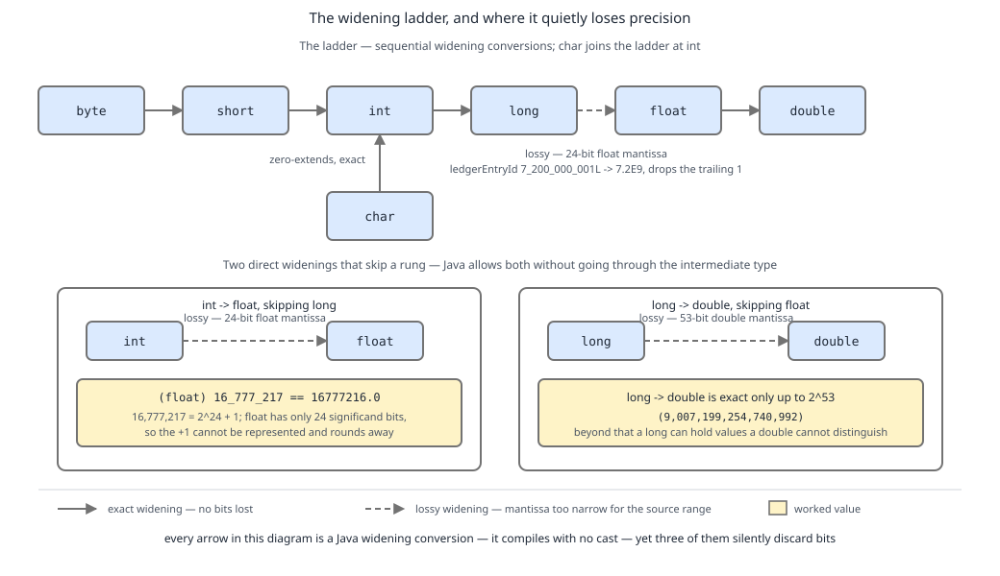

# 03 Java Core — Conversions and contexts: the ladder and the cast — BASICS (§1.7, 1.7.1–1.7.6, 1.7.11, 1.7.12)

**Target version: Java 21 LTS.** | **Part 1 of 5** | [Index](../00-index.md)
Previous: [String concatenation and poly expressions](02d-string-concatenation.md) · Next: [Numeric promotion, boxing and inference conversions](03a-promotion-boxing-and-inference.md)

A conversion changes the type of a value. A *context* is the syntactic position that decides **which** conversions the compiler is allowed to apply there without you asking. Java has eleven conversion kinds and six contexts, and almost every "why doesn't this compile" and "why is my number wrong" question in the primitive world is one cell of that grid. This file builds the grid first, then walks the cells that bite: the widening ladder, narrowing, and floating-point to integral. Promotion, boxing and the inference conversions continue in [03a Numeric promotion, boxing and inference conversions](03a-promotion-boxing-and-inference.md).

Throughout, the running system is QuizStakes: a `ledgerEntryId` is a `long` (the ledger writes ~19.8M entries/day, ~7.2B/year), a stake amount in minor units is an `int` (avg stake 4.20, i.e. 420 minor units, 2.8M reservations/day), and money in the domain model is `Money(BigDecimal amount, Currency currency)` — never a `double`, for reasons §4 makes arithmetic.

---

## 1. The map: eleven conversion kinds across six contexts (1.7.1, 1.7.2)

**Concept.** Think of the compiler at each expression position holding a *permit list*. At `long id = someInt;` the permit list is generous — it will silently widen. At `reserveStake(someInt)` where the parameter is `long`, the list is generous too, but a *different* generosity: some invocation phases refuse boxing entirely. At `(int) someDouble` the list is almost everything, because you signed for it with a cast. Nothing about `int → long` is inherently legal or illegal; legality is a property of *where the expression sits*.

**Why it exists.** Early languages either converted everything implicitly (C's usual arithmetic conversions, plus silent pointer punning) or nothing at all (forcing casts everywhere). Java's authors split the difference by making the *position* the authority: assignment and invocation get the safe, value-preserving conversions so ordinary code stays free of noise; the dangerous ones (narrowing, downcasts) are quarantined behind an explicit cast. That is why JLS chapter 5 is organised as "kinds" (§5.1) times "contexts" (§5.2–§5.6) rather than as one flat list of rules.

**How it works.** JLS 21 §5.1 enumerates the kinds and gives each its own subsection: §5.1.1 identity, §5.1.2 widening primitive, §5.1.3 narrowing primitive, §5.1.4 widening-and-narrowing primitive, §5.1.5 widening reference, §5.1.6 narrowing reference, §5.1.7 boxing, §5.1.8 unboxing, §5.1.9 unchecked, §5.1.10 capture, §5.1.11 string — eleven kinds — and then §5.1.12 *Forbidden Conversions* names the pairs no context ever allows (`boolean` to any numeric type, and either direction between a primitive and a non-corresponding reference type). The contexts are §5.2 assignment, §5.3 invocation (which itself has three phases: strict, loose, variable-arity), §5.4 string, §5.5 casting, §5.6 numeric.

**[SOURCE]** §5.1.2 opens by enumerating the widening set, then states the precision caveat:

> "A widening primitive conversion from `int` to `float`, or from `long` to `float`, or from `long` to `double`, may result in loss of precision — that is, the result may lose some of the least significant bits of the value. In this case, the resulting floating-point value will be a correctly rounded version of the integer value, using the round to nearest rounding policy."

Line by line: three of the nineteen widening conversions are *not* value-preserving; the loss is always of low-order bits, never of magnitude; and the result is not arbitrary — it is the IEEE 754 nearest representable value, ties to even. §2 works the arithmetic.

**[RESEARCH] Verified against JLS 21.** One structural claim is easy to get wrong from an older edition: §5.1 has **twelve** subsections, not eleven — §5.1.12 *Forbidden Conversions* is a subsection but not a conversion kind. "Eleven kinds" means §5.1.1–§5.1.11. (A second structural correction, about §5.6 having no §5.6.1/§5.6.2 in JLS 21, belongs with promotion and is stated in [03a §1](03a-promotion-boxing-and-inference.md).)

| Conversion kind | Assignment (§5.2) | Strict invocation (§5.3) | Loose invocation (§5.3) | Variable-arity invocation (§5.3) | String (§5.4) | Casting (§5.5) | Numeric (§5.6) |
|---|---|---|---|---|---|---|---|
| Identity (§5.1.1) | permitted | permitted | permitted | permitted | permitted | permitted | permitted |
| Widening primitive (§5.1.2) | permitted | permitted | permitted | permitted | not permitted | permitted | permitted |
| Narrowing primitive (§5.1.3) | not permitted, **except** a constant expression in range (§5.2) | not permitted | not permitted | not permitted | not permitted | permitted | permitted **only** in a numeric choice context (§5.6) |
| Widening reference (§5.1.5) | permitted | permitted | permitted | permitted | not permitted | permitted | not permitted |
| Narrowing reference (§5.1.6) | not permitted | not permitted | not permitted | not permitted | not permitted | permitted (run-time check, may throw `ClassCastException`) | not permitted |
| Boxing (§5.1.7) | permitted, optionally then widening reference | **not permitted** | permitted, optionally then widening reference | permitted, optionally then widening reference | not permitted | permitted | not permitted |
| Unboxing (§5.1.8) | permitted, optionally then widening primitive | **not permitted** | permitted, optionally then widening primitive | permitted, optionally then widening primitive | not permitted | permitted | permitted (first step of promotion) |
| Unchecked (§5.1.9) | permitted, with warning | permitted, with warning | permitted, with warning | permitted, with warning | not permitted | permitted, with warning | not permitted |
| Capture (§5.1.10) | permitted — applied implicitly to the expression's type, never chosen | permitted (implicit) | permitted (implicit) | permitted (implicit) | permitted (implicit) | permitted (implicit) | permitted (implicit) |
| String (§5.1.11) | not permitted | not permitted | not permitted | not permitted | permitted — this is the only context that applies it | not permitted | not permitted |
| Forbidden (§5.1.12) | not permitted | not permitted | not permitted | not permitted | not permitted | not permitted | not permitted |

**D-019** — Look down the *Casting* column first: it is the only column that is almost all "permitted", which is precisely what a cast buys you. Then look across the *Boxing* and *Unboxing* rows: they are the only rows where strict and loose invocation disagree, and that single disagreement is the whole reason method overload resolution runs in three phases. The *String* row is permitted in exactly one column — string conversion is not a general-purpose conversion you can trigger by assignment.

**Insight:** the three invocation phases exist to make overload resolution backward-compatible with pre-generics, pre-autoboxing code. Phase 1 (strict) tries every applicable overload using only identity, widening primitive, widening reference and unchecked. Only if no method is applicable does phase 2 (loose) re-run the search with boxing and unboxing enabled, and only if that also fails does phase 3 admit variable-arity methods. So an overload taking `long` beats an overload taking `Integer` for an `int` argument — the `long` one is applicable in phase 1 and the search never reaches phase 2.

```java
final class StakeReservations {

    record RoundId(java.util.UUID value) {}

    static String reserve(long amountMinor) {
        return "strict: long " + amountMinor;
    }

    static String reserve(Integer amountMinor) {
        return "loose: Integer " + amountMinor;
    }

    // A variable-arity int parameter is erased to int[]; declaring the array form
    // shows the shape phase 3 actually resolves against.
    static String reserve(int[] amountsMinor) {
        return "arity: int[] of " + amountsMinor.length;
    }

    public static void main(String[] args) {
        int stakeMinor = 420;                 // 4.20 in minor units
        System.out.println(reserve(stakeMinor));
        System.out.println(reserve(Integer.valueOf(stakeMinor)));
        System.out.println(reserve(new int[] { 420, 333 }));
    }
}
```

Output:

```
strict: long 420
loose: Integer 420
arity: int[] of 2
```

The first line is the point: `reserve(420)` picks `long`, not `Integer`, because widening primitive is available in phase 1 and boxing is not.

**Pitfall:** "available in this context" is not the same as "the compiler will search for a chain of them". Each context permits a *fixed, short* composite: boxing then widening *reference*, or unboxing then widening *primitive*. It never permits widening primitive then boxing, and it never chains three. [03a §3](03a-promotion-boxing-and-inference.md) proves the consequence with `Long ledgerCount = 3;`.

> A conversion kind (JLS 21 §5.1.1–§5.1.11) is a type-changing rule; a context (§5.2–§5.6) is a syntactic position that fixes which of those rules apply implicitly there.

---

## 2. The widening ladder and its lossy rungs (1.7.3, 1.7.4)

**Concept.** Picture a staircase: `byte → short → int → long → float → double`, with `char` stepping on at `int`. Climbing is free — no cast needed, no data lost — *except* for three rungs near the top where you step from an integer type onto a floating-point type that has fewer significand bits than your integer had value bits. On those rungs the compiler still lets you climb silently, and still drops digits.

**Why it exists.** The ladder is a promise: any value of a narrower type is a legal value of a wider type, so assigning up can never need a cast and can never throw. That promise is what lets you write `long ledgerEntryId = sequenceCounter;` without ceremony. The three lossy rungs are the price of putting floating-point types *above* integer types in the same ladder: `float` and `double` cover a vastly larger **range** than `long`, so by range they belong higher, but their **precision** is fixed at 24 and 53 significand bits. Java chose range ordering, kept the conversions implicit for source compatibility with C, and documented the precision loss in §5.1.2 rather than requiring a cast.

**How it works.** `byte → short → int → long` and `char → int → long` are exact: the target has strictly more bits and sign-extension (or zero-extension, for `char`, which is unsigned 16-bit) preserves the value. `float → double` is exact: every `float` is a `double`. The three lossy ones:

- **`int → float`.** `float` has a 24-bit significand (23 stored + 1 implicit). Integers are exact up to 2^24 = 16,777,216. Beyond that, only every 2nd, then every 4th, then every 8th integer is representable.
- **`long → float`.** Same 24-bit significand against 63 bits of magnitude.
- **`long → double`.** `double` has a 53-bit significand. Integers are exact up to 2^53 = 9,007,199,254,740,992. Beyond that, gaps.

**[PROVE] `(float) 16_777_217` (1.7.4).** 16,777,217 = 2^24 + 1. Writing it in binary: a leading 1, then 23 zeros, then a final 1 — 25 significant bits. A `float` stores 24. The two representable neighbours are 2^24 = 16,777,216 and 2^24 + 2 = 16,777,218; our value sits exactly halfway. Round-to-nearest-ties-to-even picks the neighbour whose last significand bit is 0, which is 16,777,216. So `(float) 16_777_217 == 16777216.0f`, and — the part that makes it a real bug — `16_777_217 == (int) (float) 16_777_217` is `false`, while `(float) 16_777_216 == (float) 16_777_217` is `true`. A widening conversion, requiring no cast, has lost data.

**[NUM] `ledgerEntryId = 7_200_000_001L → float`.** QuizStakes writes ~7.2B ledger entries a year, so IDs in the 7.2e9 range are the second year's normal traffic. 7,200,000,001 lies in [2^32, 2^33) = [4,294,967,296, 8,589,934,592). In that binade a `float`'s spacing is 2^(32−23) = 2^9 = **512**. Arithmetic: 7,200,000,001 = 512 × 14,062,500 + 1, so the two neighbours are 512 × 14,062,500 = 7,200,000,000 and 7,200,000,512; ours is 1 above the lower one, so it rounds down to **7,200,000,000** and prints as `7.2E9`. The trailing `1` — the digit that distinguishes one ledger entry from the next — is gone. To `double` the same value is exact, because 7,200,000,001 < 2^53 = 9,007,199,254,740,992; `double` stays exact for ledger IDs until entry number 9,007,199,254,740,992, which at 19.8M/day is roughly 1.2 million years away.



**D-020** — Follow the solid chain `byte → short → int → long → float → double` with `char` joining at `int`; then look only at the three arrows drawn differently and labelled lossy: `int → float`, `long → float`, `long → double`. The annotations carry the numbers to memorise — a 24-bit float significand with `(float) 16_777_217 == 16777216.0`, a 53-bit double significand exact to 2^53, and `ledgerEntryId` 7,200,000,001 arriving as 7,200,000,000 across `long → float`.

```java
final class WideningLadder {

    public static void main(String[] args) {
        // Exact rungs.
        byte retryCap = 3;                    // retries capped at 3
        short shortRetry = retryCap;
        int intRetry = shortRetry;
        long longRetry = intRetry;
        double doubleRetry = longRetry;
        System.out.println("exact chain: " + doubleRetry);

        char currencyMarker = 'G';            // 'G' for GBP-tagged references
        int markerCode = currencyMarker;      // char -> int, zero-extended
        System.out.println("char -> int: " + markerCode);   // 71

        // Lossy rung 1: int -> float.
        int boundary = 16_777_217;            // 2^24 + 1
        float asFloat = boundary;             // no cast required
        System.out.println("int -> float: " + asFloat);              // 1.6777216E7
        System.out.println("round trip equal? " + (boundary == (int) asFloat)); // false
        System.out.println("collides with 2^24? " + (asFloat == (float) 16_777_216)); // true

        // Lossy rung 2: long -> float, at QuizStakes ledger scale.
        long ledgerEntryId = 7_200_000_001L;
        float idAsFloat = ledgerEntryId;
        System.out.println("long -> float: " + idAsFloat);           // 7.2E9
        System.out.println("recovered: " + (long) idAsFloat);        // 7200000000
        System.out.println("lost by: " + (ledgerEntryId - (long) idAsFloat)); // 1

        // Lossy rung 3: long -> double, only past 2^53.
        long pastDoublePrecision = (1L << 53) + 1L;                  // 9007199254740993
        double idAsDouble = pastDoublePrecision;
        System.out.println("long -> double past 2^53: " + (long) idAsDouble); // 9007199254740992
        System.out.println("ledger id exact in double? "
                + (ledgerEntryId == (long) (double) ledgerEntryId)); // true
    }
}
```

**Pitfall:** the dangerous shape is not the cast — it is the *absence* of one. `float idAsFloat = ledgerEntryId;` compiles clean, raises no warning at any `-Xlint` level, and corrupts an identifier. Any `long` identifier or counter that reaches a `float` parameter (an old metrics API, a charting library, a JSON mapper configured to `float`) is silently truncated. Grep for `float` in signatures that receive IDs.

**Interview:** "Is widening always safe?" — "No. `int → float`, `long → float` and `long → double` are widening conversions that lose least-significant bits, because `float` carries a 24-bit significand and `double` a 53-bit one. `(float) 16_777_217` is 16777216.0. Magnitude is never lost; precision is."

> Widening primitive conversion (§5.1.2) is the nineteen implicit primitive conversions up the `byte → short → int → long → float → double` chain plus `char → int` and above, of which exactly three — `int → float`, `long → float`, `long → double` — round rather than preserve.

---

## 3. Narrowing needs a cast, and the constant exception (1.7.5, 1.7.6)

**Concept.** Going *down* the ladder throws bits away, so Java makes you sign for it: the cast operator is the signature. The signature is not a safety check — the compiler does not verify the value fits; it records that you accepted whatever happens. For integer narrowing what happens is brutally simple: keep the low-order bits of the two's-complement representation, discard the rest, reinterpret the sign bit at the new width.

**Why it exists.** Truncation is the only narrowing rule that is cheap and total: no branch, no exception, one machine instruction (`i2b`, `i2s`, `i2c`, `l2i`). Java could have thrown on overflow, but implicit exceptions from an assignment were considered worse than requiring a visible cast — and the compiler still helps you at the one place it can be certain, which is when the value is a compile-time constant. That help is the constant-narrowing exception, and without it `byte retryCap = 3;` would have to be written `byte retryCap = (byte) 3;` — noise on every line of every enum-ish `byte` field in the language.

**How it works.** JLS 21 §5.1.3 narrowing primitive conversion, integral to integral: discard all but the *n* lowest-order bits. `long → int` keeps the low 32; `int → short` the low 16; `int → byte` the low 8; `int → char` the low 16 reinterpreted as unsigned. §5.2 assignment context then adds the exception, quoted verbatim:

**[SOURCE]** JLS 21 §5.2 — "if the expression is a constant expression of type `byte`, `short`, `char`, or `int`: a narrowing primitive conversion may be used if the variable is of type `byte`, `short`, or `char`, and the value of the constant expression is representable in the type of the variable."

Every clause carries weight. *Constant expression* — a compile-time constant per §15.29, so literals, `final` locals initialised with constants, and arithmetic over them, but not a method call and not a non-final variable. *Of type byte, short, char, or int* — a constant `long` does not qualify, which is why `byte b = 3L;` fails while `byte b = 3;` succeeds. *Variable is byte, short or char* — never `int` from `long`. *Representable* — the compiler checks the range, so out-of-range constants are a compile error, not a silent wrap. §5.2 extends the same rule one step further for `Byte`, `Short` and `Character` targets: narrowing followed by boxing.

**Pitfall:** the wrong belief is "small literals are special-cased by value". They are special-cased by **compile-time constancy**, and `final` is the switch. Symptom: extracting `byte tier = 3;` into a helper's parameter or dropping the `final` from a local turns working code into `error: incompatible types: possible lossy conversion from int to byte`. Fix: keep the source `final` and constant-initialised, or add the explicit cast.

```java
final class StakeMinorUnits {

    // 2.8M reservations/day, avg stake 4.20 -> 420 minor units.
    static final int AVG_STAKE_MINOR = 420;

    public static void main(String[] args) {
        // Constant-narrowing exception: legal, no cast.
        byte retryCap = 3;
        short smallStake = 420;
        char gate = 65;                       // 'A'
        Byte boxedRetryCap = 3;               // narrowing then boxing, also legal
        System.out.println(retryCap + " " + smallStake + " " + gate + " " + boxedRetryCap);

        // Still constant: final local, and arithmetic over constants.
        final int bonusCap = 100;
        byte cappedBonus = bonusCap;          // legal, 100 fits a byte
        byte derived = bonusCap - 60;         // legal, 40 is a constant expression
        System.out.println(cappedBonus + " " + derived);

        // Not constant: non-final source.
        int stakeMinor = AVG_STAKE_MINOR;     // AVG_STAKE_MINOR is constant, stakeMinor is not
        // byte tooBig = stakeMinor;          // error: possible lossy conversion from int to byte
        byte truncated = (byte) stakeMinor;   // you sign for it
        System.out.println("420 as byte: " + truncated);   // -92

        // Show the arithmetic behind -92: 420 = 0x0001A4; low 8 bits 0xA4 = 164;
        // 164 >= 128, so as a signed byte it is 164 - 256 = -92.
        System.out.println("low byte of 420: " + (420 & 0xFF));            // 164
        System.out.println("as signed byte:  " + (byte) (420 & 0xFF));     // -92

        // long -> int truncation at ledger scale.
        long ledgerEntryId = 7_200_000_001L;
        int asInt = (int) ledgerEntryId;      // keep low 32 bits
        System.out.println("long -> int: " + asInt);                       // -1389967295
        System.out.println("check: " + (ledgerEntryId - 0x1_0000_0000L * 2)); // -1389967295

        // Out-of-range constant is a compile error, not a wrap:
        // byte overflowing = 200;            // error: possible lossy conversion
    }
}
```

The `long → int` line is the one that matters operationally: 7,200,000,001 does not fit in 32 bits, and `(int)` yields 7,200,000,001 − 2 × 4,294,967,296 = −1,389,967,295. A ledger ID handed to an `int` column or an `int` API becomes a negative number that may still pass a `> 0` check on some other, older row.

**Insight:** the cast operator in `(byte) stakeMinor` is doing double duty — it authorises the narrowing *and*, in a compound assignment like `smallStake += smallStake`, the compiler inserts the very same cast for you invisibly. That hidden insertion is treated in [02a Compound assignment, short-circuit and bitwise operators](02a-assignment-and-bitwise.md), and the promotion that makes it necessary is [03a §1](03a-promotion-boxing-and-inference.md).

> Narrowing primitive conversion (§5.1.3) requires an explicit cast, keeps only the low-order bits and never throws — except in assignment context, where a constant expression already known to be in range needs no cast (§5.2).

---

## 4. Floating-point to integral: truncate, saturate, and NaN (1.7.11, 1.7.12)

**Concept.** A cast from `double` to `int` is not rounding and it is not wrapping. It is a three-question decision: drop the fraction toward zero; if the result still doesn't fit, clamp to the nearest end of the range; and if the input was NaN, produce 0. That last answer is the one that turns a bad input into a plausible-looking zero.

**Why it exists.** Integer narrowing truncates bits because bits are what it has; floating narrowing cannot, because the bit pattern of a `double` bears no positional relationship to an `int`. The JVM needs a total function (`d2i` cannot throw), so the spec picks saturation over wrapping — clamping at least preserves the sign and the "very large" character of the value, whereas wrapping would produce an arbitrary number. NaN maps to 0 because NaN has no sign and no magnitude to clamp toward, and 0 is the additive identity, the least destructive constant available. It is still the wrong answer for money.

**How it works.** JLS 21 §5.1.3, floating-point to integral: the value is first rounded toward zero to an integer value *V*. If the target is `int` or `long` and *V* is representable, the result is *V*. If *V* is too large, the result is `Integer.MAX_VALUE` / `Long.MAX_VALUE`; too small, `MIN_VALUE`. NaN gives 0. If the target is `byte`, `short` or `char`, the conversion is a **two-step**: first to `int` by the rule just given, then a narrowing `int` conversion (low-order bits). That is why `(byte) 1e20` is not 0 but −1: `(int) 1e20` = 2,147,483,647 = `0x7FFFFFFF`, whose low byte `0xFF` is −1 as a signed `byte`.

**[NUM] The two canonical values (1.7.12).** `1e20` = 100,000,000,000,000,000,000, and `Integer.MAX_VALUE` = 2,147,483,647, so `1e20` exceeds it by a factor of about 4.66 × 10^10 → `(int) 1e20 == 2147483647`. `Long.MAX_VALUE` = 9,223,372,036,854,775,807 ≈ 9.22 × 10^18, and 1e20 ≈ 1.0 × 10^20 is about 10.8 times larger → `(long) 1e20 == 9223372036854775807`. And `(int) Double.NaN == 0`, as does `(long) Double.NaN`, `(int) Float.NaN`, and `Math.round(Double.NaN)`.

| Source value (`double`) | `(int)` | `(long)` | `Math.round` |
|---|---|---|---|
| `4.70` | `4` | `4` | `5L` |
| `3.0e9` (above `Integer.MAX_VALUE`, fits `long`) | `2147483647` | `3000000000` | `3000000000L` |
| `1e20` (above `Long.MAX_VALUE`) | `2147483647` | `9223372036854775807` | `9223372036854775807L` |
| `-1e20` (below `Long.MIN_VALUE`) | `-2147483648` | `-9223372036854775808` | `-9223372036854775808L` |
| `Double.NaN` | `0` | `0` | `0L` |
| `Double.POSITIVE_INFINITY` | `2147483647` | `9223372036854775807` | `9223372036854775807L` |
| `Double.NEGATIVE_INFINITY` | `-2147483648` | `-9223372036854775808` | `-9223372036854775808L` |
| `-0.9` | `0` | `0` | `-1L` |

**D-022** — Compare the last row against the first: a cast truncates *toward zero*, so `(int) -0.9` is `0`, while `Math.round` is defined as floor(x + 0.5) — half rounds up toward positive infinity — so `Math.round(-0.9)` is `-1`. Then compare the `(int)` and `(long)` columns on the `3.0e9` row: the same source value saturates in one and is exact in the other, because saturation is per target type. Note the return types: `Math.round(double)` returns `long`, `Math.round(float)` returns `int` — the only asymmetric pair in `java.lang.Math`.

```java
import java.math.BigDecimal;
import java.math.RoundingMode;
import java.util.Currency;

final class BonusFromDouble {

    record Money(BigDecimal amount, Currency currency) {
        Money {
            amount = amount.setScale(2, RoundingMode.HALF_UP);
        }
        static Money gbp(String v) { return new Money(new BigDecimal(v), Currency.getInstance("GBP")); }
    }

    public static void main(String[] args) {
        // The saturation table, executed.
        System.out.println((int) 4.70);                          // 4
        System.out.println(Math.round(4.70));                    // 5
        System.out.println((int) 3.0e9);                         // 2147483647
        System.out.println((long) 3.0e9);                        // 3000000000
        System.out.println((int) 1e20);                          // 2147483647
        System.out.println((long) 1e20);                         // 9223372036854775807
        System.out.println((int) -1e20);                         // -2147483648
        System.out.println((int) Double.NaN);                    // 0
        System.out.println((long) Double.NaN);                   // 0
        System.out.println((int) Double.POSITIVE_INFINITY);       // 2147483647
        System.out.println((int) -0.9);                           // 0
        System.out.println(Math.round(-0.9));                     // -1

        // Two-step rule for byte/short/char.
        System.out.println((byte) 1e20);                          // -1
        System.out.println("because (int) 1e20 = " + (int) 1e20
                + ", low byte = " + ((int) 1e20 & 0xFF));         // 2147483647, 255

        // Why bonus money is never a double. Deposit 43.50 -> 10% bonus -> 4.35.
        double clientSuppliedBonus = 4.35;
        int wrongMinorUnits = (int) (clientSuppliedBonus * 100);
        System.out.println("bonus minor units, double path: " + wrongMinorUnits);   // 434

        Money bonus = Money.gbp("4.35");
        int rightMinorUnits = bonus.amount().movePointRight(2).intValueExact();
        System.out.println("bonus minor units, BigDecimal:  " + rightMinorUnits);   // 435
        System.out.println("penny lost per grant: " + (rightMinorUnits - wrongMinorUnits));

        // 3.1k bonus grants/day at one lost penny each.
        System.out.println("pennies/day at 3.1k grants: " + (3_100 * (long) (rightMinorUnits - wrongMinorUnits)));

        // The canonical split still holds exactly in BigDecimal.
        Money stake = Money.gbp("3.33");
        Money bonusPortion = Money.gbp("0.33");
        Money cashPortion = stake.amount().subtract(bonusPortion.amount())
                .compareTo(new BigDecimal("3.00")) == 0
                ? Money.gbp("3.00")
                : Money.gbp("0.00");
        System.out.println("3.33 splits " + bonusPortion.amount() + " bonus + "
                + cashPortion.amount() + " cash");

        // And the classic that starts every money argument.
        System.out.println(0.1 + 0.2);                            // 0.30000000000000004
        System.out.println(new BigDecimal("0.1").add(new BigDecimal("0.2")));   // 0.3
    }
}
```

`4.35` as a `double` is 4.34999999999999964472863211995 — strictly below 4.35 — so `4.35 * 100` is 434.99999999999996 and truncating gives **434**, not 435. At 3.1k bonus grants/day that is a reconciliation break every day, in an audited ledger. The fix is structural, not a rounding call: keep money in `BigDecimal` with an explicit scale and `RoundingMode`, and persist it as `NUMERIC(19,4)` — see **09 SQL databases** for the storage side, and [numbers-and-money/04-internals-floating-point.md](../numbers-and-money/04-internals-floating-point.md) for the IEEE 754 internals behind the 4.35 representation.

**Pitfall:** the wrong belief is "an out-of-range cast wraps, like `int` narrowing does". It saturates. Symptom: a value computed from a `double` that is pinned at exactly 2147483647 or 0 rather than being obviously garbage — a saturated `Integer.MAX_VALUE` stake looks like a deliberate sentinel, and a NaN-derived `0` passes an `amount >= 0` validation. Fix: validate the `double` before the cast (`Double.isFinite`, explicit range check), or never let a `double` into the money path at all.

**Interview:** "`(int) 1e20` and `(int) Double.NaN`?" — "2147483647 and 0. Float-to-integral truncates toward zero, saturates at the target's MIN/MAX, and maps NaN to 0; `byte`/`short`/`char` targets go via `int` first, so `(byte) 1e20` is −1."

> Floating-point to integral conversion (§5.1.3) rounds toward zero, clamps to the target's `MIN_VALUE`/`MAX_VALUE` on overflow, yields 0 for NaN, and never throws.

---

## Pitfalls

### "Widening is always safe, so no cast means no loss"

**Wrong**

```java
long ledgerEntryId = 7_200_000_001L;
float forChart = ledgerEntryId;      // compiles clean, no warning at any -Xlint level
System.out.println((long) forChart); // 7200000000  -- the trailing 1 is gone
```

**Right**

```java
long ledgerEntryId = 7_200_000_001L;
double forChart = ledgerEntryId;                 // exact below 2^53 = 9007199254740992
System.out.println((long) forChart);             // 7200000001
// Or keep identifiers out of floating point entirely:
String forLabel = Long.toString(ledgerEntryId);  // 7200000001
```

**Why people believe it:** "widening" is taught as the safe direction, and it *is* safe for magnitude and never throws. The three rungs onto `float`/`double` are safe in range and lossy in precision, and no cast marks them.

### "Out-of-range floating casts wrap like integer casts do"

**Wrong**

```java
double clientSupplied = 1e20;
int amountMinor = (int) clientSupplied;
System.out.println(amountMinor);          // 2147483647, looks like a sentinel
System.out.println((int) Double.NaN);     // 0, passes an "amount >= 0" check
```

**Right**

```java
double clientSupplied = 1e20;
if (!Double.isFinite(clientSupplied)
        || clientSupplied < 0
        || clientSupplied > Integer.MAX_VALUE) {
    throw new IllegalArgumentException("amount out of range: " + clientSupplied);
}
int amountMinor = (int) clientSupplied;
System.out.println(amountMinor);
```

**Why people believe it:** `(int) someLong` truncates bits, so the same is assumed for `double`. Floating-to-integral has no bit correspondence to truncate, so §5.1.3 saturates instead — and maps NaN to 0, the most plausible wrong answer available.

### "The constant-narrowing exception is about the value being small"

**Wrong**

```java
int stakeMinor = 3;                 // holds 3, but the variable is not final
byte retryCap = stakeMinor;
// error: incompatible types: possible lossy conversion from int to byte
byte alsoWrong = 3L;                // a constant long does not qualify either
// error: incompatible types: possible lossy conversion from long to byte
```

**Right**

```java
final int stakeMinor = 3;           // now a constant expression per JLS 15.29
byte retryCap = stakeMinor;         // legal, no cast
byte fromLong = (byte) 3L;          // long source always needs the cast
byte derived = 100 - 60;            // constant arithmetic is still constant: 40
System.out.println(retryCap + " " + fromLong + " " + derived);
```

**Why people believe it:** the rule is only ever demonstrated with literals, so "3 is small enough" is the pattern people extract. The actual switch is compile-time constancy (§15.29) plus a source type of `byte`, `short`, `char` or `int`, plus a target of `byte`, `short` or `char`.

### "`(byte) 1e20` is 0, because the value is nowhere near a byte"

**Wrong**

```java
System.out.println((byte) 1e20);          // expected 0 or an error
System.out.println((short) Double.POSITIVE_INFINITY);   // expected 0
```

**Right**

```java
// Floating -> byte/short/char is a two-step: to int (saturating), then low-order bits.
int saturated = (int) 1e20;                       // 2147483647 = 0x7FFFFFFF
System.out.println(saturated);                    // 2147483647
System.out.println((byte) saturated);             // -1   (low byte 0xFF)
System.out.println((byte) 1e20);                  // -1   (identical path)
System.out.println((short) Double.POSITIVE_INFINITY);   // -1 (low 16 bits 0xFFFF)
```

**Why people believe it:** saturation is taught for `int` and `long` targets and then assumed to be uniform. §5.1.3 only saturates at `int`/`long`; narrower targets get the saturated `int` truncated to their low-order bits, so a huge positive `double` lands on −1 rather than on a maximum.

---

## Cheat sheet

| Situation | Rule | Result / example |
|---|---|---|
| Eleven conversion kinds | JLS 21 §5.1.1–§5.1.11; §5.1.12 *Forbidden* is a subsection, not a kind (§5.1 has twelve subsections) | identity, widen/narrow primitive, widen-and-narrow primitive, widen/narrow reference, box, unbox, unchecked, capture, string |
| Six contexts | §5.2 assignment, §5.3 invocation (strict/loose/variable-arity), §5.4 string, §5.5 casting, §5.6 numeric | legality is a property of the position, not the type pair |
| Casting column | almost everything permitted | that is what the cast buys |
| Strict vs loose invocation | strict phase excludes boxing/unboxing | `reserve(420)` picks `long` over `Integer` |
| Widening ladder | `byte→short→int→long→float→double`, `char→int` | 19 conversions, implicit, never throws |
| Lossy widening | `int→float`, `long→float`, `long→double` | `(float) 16_777_217 == 16777216.0f` |
| Float exactness | 24-bit significand | exact integers to 2^24 = 16,777,216 |
| Double exactness | 53-bit significand | exact integers to 2^53 = 9,007,199,254,740,992 |
| `long → float` at scale | spacing 512 in [2^32, 2^33) | 7,200,000,001 → 7,200,000,000 |
| Narrowing integral | explicit cast, keep low-order bits, never throws | `(byte) 420 == -92`; `(int) 7_200_000_001L == -1389967295` |
| Constant narrowing | §5.2, constant `byte/short/char/int` in range → `byte/short/char` (or `Byte/Short/Character`) | `byte b = 3;` legal; `byte b = i;` not; `byte b = 200;` compile error |
| Float → integral | truncate toward zero, saturate, NaN → 0 | `(int) 1e20 = 2147483647`; `(int) Double.NaN = 0`; `(int) -0.9 = 0` |
| Float → `byte/short/char` | two-step via `int` | `(byte) 1e20 == -1` |
| `Math.round` | floor(x + 0.5); `double`→`long`, `float`→`int` | `Math.round(-0.9) == -1` |
| Forbidden pairs | §5.1.12 | `boolean` ↔ numeric never; primitive ↔ unrelated reference never |
| Money | never `double`; `BigDecimal` + explicit scale/`RoundingMode` | `(int)(4.35 * 100) == 434` |

---

## Self-test

**Q1.** `float f = someLong;` compiles with no cast and no warning. What can go wrong, and at what magnitude?

<details><summary>Answer</summary>

`long → float` is a widening primitive conversion, so it needs no cast, but §5.1.2 lists it as one of three that may lose precision. `float` has a 24-bit significand, so it represents consecutive integers exactly only up to 2^24 = 16,777,216. Above that the spacing doubles each binade. At QuizStakes ledger scale — a `ledgerEntryId` of 7,200,000,001, which lies in [2^32, 2^33) — the spacing is 2^(32−23) = 512, so the value rounds to the nearest multiple of 512, which is 7,200,000,000, and the identifier loses its trailing digit. Two different ledger entries can therefore compare equal once they pass through a `float`. `double` is exact for the same value because 7,200,000,001 < 2^53 = 9,007,199,254,740,992.

</details>

**Q2.** Fill in `(int)`, `(long)` and `Math.round` for `1e20`, `Double.NaN` and `-0.9`.

<details><summary>Answer</summary>

`(int) 1e20` is 2147483647 and `(long) 1e20` is 9223372036854775807, because floating-to-integral saturates at the target type's `MAX_VALUE` rather than wrapping; `Math.round(1e20)` returns a `long` and is likewise 9223372036854775807. `(int) Double.NaN`, `(long) Double.NaN` and `Math.round(Double.NaN)` are all 0 — NaN maps to zero by §5.1.3. `(int) -0.9` and `(long) -0.9` are 0, because a cast truncates toward zero, but `Math.round(-0.9)` is −1, because `Math.round` is floor(x + 0.5) and −0.9 + 0.5 = −0.4, whose floor is −1. Note also `Math.round(double)` returns `long` while `Math.round(float)` returns `int`.

</details>

**Q3.** Why is `byte retryCap = 3;` legal but `byte retryCap = stakeMinor;` (where `stakeMinor` is a non-final `int` holding 3) not?

<details><summary>Answer</summary>

Assignment context (§5.2) does not normally permit narrowing primitive conversion, but it makes one exception: if the expression is a *constant expression* of type `byte`, `short`, `char` or `int`, and the value is representable in a `byte`, `short` or `char` target, the narrowing is applied without a cast. `3` is a constant expression, so the first line is legal. A non-final local is not a constant expression regardless of the value it currently holds — constancy is a compile-time property under §15.29, not a runtime one — so the second line is `error: incompatible types: possible lossy conversion from int to byte`. Making the source `final int stakeMinor = 3;` makes it a constant expression and the assignment legal. Also note the exception is range-checked: `byte b = 200;` is a compile error, not a silent wrap to −56.

</details>

**Q4.** Given overloads `reserve(long)` and `reserve(Integer)`, which does `reserve(420)` call, and why?

<details><summary>Answer</summary>

`reserve(long)`. Overload resolution runs in three phases (§5.3). Phase 1 uses the strict invocation context, which permits identity, widening primitive, widening reference and unchecked conversion but **not** boxing or unboxing. An `int` argument reaches `long` by widening primitive, so `reserve(long)` is applicable in phase 1 and resolution stops there — the `Integer` overload would only become applicable in phase 2 (loose invocation), which is never reached. Phase 3 adds variable-arity methods and is likewise never reached. This phased design is what keeps pre-Java-5 overload resolution behaviour intact after autoboxing was introduced.

</details>

**Q5.** Why does a bonus of 4.35 computed as `(int) (4.35 * 100)` produce 434, and what is the fix?

<details><summary>Answer</summary>

`4.35` is not representable in binary floating point; the nearest `double` is 4.34999999999999964472863211995…, strictly below 4.35. Multiplying by 100 gives 434.99999999999996, and the cast truncates toward zero (§5.1.3) to 434, losing a penny. Rounding instead of truncating (`Math.round`) papers over this one case but not the class of them. The real fix is structural: keep money in `BigDecimal` constructed from a `String` (never from a `double`), with an explicit scale and `RoundingMode` — `new BigDecimal("4.35").movePointRight(2).intValueExact()` is 435 — and persist as `NUMERIC(19,4)`. At 3.1k bonus grants/day, a one-penny truncation is a daily reconciliation break in an audited ledger.

</details>

**Q6.** Which conversions are forbidden in *every* context?

<details><summary>Answer</summary>

§5.1.12 *Forbidden Conversions* names them: there is no conversion between `boolean` and any numeric type in either direction (so `int flag = someBoolean;` and `(boolean) 1` are both errors — Java has no truthiness), and no conversion between a primitive type and a reference type other than that primitive's own boxing/unboxing partner and its supertypes (so `(String) 3` and `Integer i = 3L;` are errors). `null` cannot be converted to a primitive type, which is why unboxing a `null` reference is a run-time `NullPointerException` rather than a compile-time conversion. Note that §5.1 has twelve subsections but eleven conversion *kinds* — §5.1.12 catalogues non-conversions.

</details>

**Q7.** `(int) 7_200_000_001L` and `(byte) 420` are both narrowing casts. Work out both results from the bit rule.

<details><summary>Answer</summary>

Integral narrowing (§5.1.3) keeps only the *n* lowest-order bits of the two's-complement source and reinterprets the top surviving bit as the sign. For `(int) 7_200_000_001L`, n = 32, so the result is 7,200,000,001 reduced modulo 2^32 = 4,294,967,296 into the signed range: 7,200,000,001 − 4,294,967,296 = 2,905,032,705, which exceeds `Integer.MAX_VALUE`, so subtract 2^32 once more — equivalently 7,200,000,001 − 2 × 4,294,967,296 = **−1,389,967,295**. For `(byte) 420`, n = 8: 420 is `0x0001A4`, low byte `0xA4` = 164, and 164 ≥ 128, so as a signed byte it is 164 − 256 = **−92**. Neither cast throws and neither warns; the danger is that a ledger ID pushed through an `int` column becomes negative and can still pass a naive `> 0` check against older, smaller rows.

</details>

**Q8.** Why does `(short) Double.POSITIVE_INFINITY` give −1 rather than `Short.MAX_VALUE`?

<details><summary>Answer</summary>

Because saturation is only defined for `int` and `long` targets. §5.1.3 converts a floating-point value to `byte`, `short` or `char` in two steps: first to `int` — where rounding toward zero and saturation apply, so `Double.POSITIVE_INFINITY` becomes `Integer.MAX_VALUE` = 2,147,483,647 = `0x7FFFFFFF` — and then by an ordinary integral narrowing conversion that keeps the low-order bits. The low 16 bits of `0x7FFFFFFF` are `0xFFFF`, which as a signed `short` is −1. The same path gives `(byte) 1e20 == -1`. The practical lesson is that a narrow integral target never tells you an overflow happened: you get a small, plausible-looking, wrong number, so validate the `double` with `Double.isFinite` and an explicit range check before the cast.

</details>

---

## Open questions

None.

---

**Leaves covered:** 1.7.1, 1.7.2, 1.7.3, 1.7.4, 1.7.5, 1.7.6, 1.7.11, 1.7.12 (8 leaves)
**Leaves deferred:** none
**Diagrams included:** D-019, D-020, D-022
**Target version:** Java 21 LTS
**Lines:** 519
