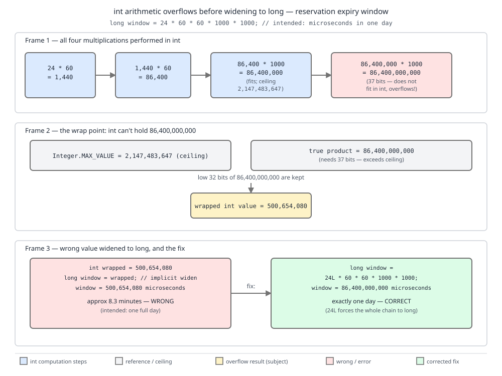

# 03 Java Core — Numeric promotion, boxing and inference conversions — BASICS (§1.7, 1.7.7–1.7.10, 1.7.13–1.7.17)

**Target version: Java 21 LTS.** | **Part 1 of 5** | [Index](../00-index.md)
Previous: [Conversions and contexts: the ladder and the cast](03-conversions-and-contexts.md) · Next: [Control flow](../control-flow/01-basics.md)

Part 1 built the grid of eleven conversion kinds against six contexts — the **D-019** map in [03 §1](03-conversions-and-contexts.md#1-the-map-eleven-conversion-kinds-across-six-contexts-171-172) — and walked the primitive conversions the compiler applies to a single value: the widening ladder, narrowing, and floating-point to integral. Keep that map open; this file works the cells driven by *promotion* and *inference* instead. Promotion is what happens when an operator needs its operands in a type the machine can actually compute in. Boxing and unboxing are what happens when a primitive meets a reference position. String, unchecked and capture conversion are the three that leave the numeric world entirely.

Same running system: QuizStakes. A `ledgerEntryId` is a `long` (~19.8M entries/day, ~7.2B/year), a stake in minor units is an `int` (avg stake 4.20 → 420 minor units, 2.8M reservations/day), retries are capped at 3, the bonus cap is 100, and money is `Money(BigDecimal amount, Currency currency)` — never a `double`.

---

## 1. Numeric promotion: unary, binary, and the `short + short` surprise (1.7.7, 1.7.8, 1.7.9)

**Concept.** The JVM has no arithmetic instructions for `byte`, `short` or `char`. There is `iadd` and there is `ladd`, `fadd`, `dadd` — nothing narrower. So before any arithmetic operator runs, the compiler *promotes* its operands to a type the machine can actually add, and the smallest such type is `int`. Everything narrower than `int` is an `int` the moment you do arithmetic on it, and the result type is that promoted type, not the type you started with.

**Why it exists.** The 32-bit operand stack slot is the unit of the JVM's design. Giving `byte` its own add instruction would have meant sixteen more opcodes for no speed gain (the hardware adds 32-bit words either way) and no space gain (a stack slot is 32 bits regardless). Promotion moves the whole problem to compile time: `javac` emits `iadd` and, where a narrow result is required, an explicit `i2b`/`i2s`/`i2c` truncation.

**How it works.** JLS 21 §5.6 defines one promotion algorithm and three applications of it.

- **Unary numeric promotion** — one operand. Unbox if it is a reference type; then if the type is `byte`, `short` or `char`, widen to `int`; otherwise leave it. Applies to the operands of `+` (unary), `-` (unary), `~`, to each shift operand *independently*, to array dimension and index expressions, and to the operand of `++`/`--` before the operation.
- **Binary numeric promotion** — two operands. Unbox both; then: if either is `double`, both become `double`; else if either is `float`, both become `float`; else if either is `long`, both become `long`; else both become `int`. Applies to `* / % + -`, to `< <= > >=`, to numeric `== !=`, and to `& ^ |` on numeric operands. **Not** to shifts.
- **General numeric promotion** — the numeric choice contexts, i.e. the second and third operands of a numeric conditional (`?:`) and the result expressions of a numeric `switch` expression. This is the one place where promotion may apply a *narrowing* conversion, to give a conditional over constants the narrow type you expect.

**[RESEARCH] Verified against JLS 21.** §5.6 *Numeric Contexts* in JLS 21 has **no** §5.6.1 / §5.6.2. Older editions (through Java SE 8-era numbering) had *5.6.1 Unary Numeric Promotion* and *5.6.2 Binary Numeric Promotion* as separate subsections; SE 21 folds them into the body of §5.6, which now defines *unary numeric promotion*, *binary numeric promotion* and *general numeric promotion* as three applications of one promotion algorithm across four context kinds (numeric arithmetic, numeric choice, numeric array, and numeric unary usage). Cite "JLS 21 §5.6" and name the promotion, never "§5.6.2" — a candidate who cites §5.6.2 in an interview is citing a stale edition of the specification. (The companion structural correction — that §5.1 has twelve subsections but eleven conversion *kinds* — is in [03 §1](03-conversions-and-contexts.md).)

**[SOURCE]** JLS 21 §5.6, the ordered rules, quoted: "If any expression is of type `double`, then the promoted type is `double`, and other expressions that are not of type `double` undergo widening primitive conversion to `double`. Otherwise, if any expression is of type `float`, then the promoted type is `float` […]. Otherwise, if any expression is of type `long`, then the promoted type is `long` […]. Otherwise, none of the expressions are of type `double`, `float`, or `long`. The promoted type depends on the context kind."

Reading it: the ladder is consulted top-down, so a single `double` operand drags everything to `double`; the fall-through case is where `byte`/`short`/`char` become `int`, and JLS 21 defers that last step to the context kind precisely because a numeric choice context can narrow instead. Note the first rule of §5.6, before the ladder: reference-typed operands are unboxed — which is why `Integer + Integer` works and why either operand being `null` throws `NullPointerException` at the unboxing, not at the `+`.

**Pitfall:** (1.7.9) `short + short` is an `int`. The wrong belief is "arithmetic returns the type of its operands". `short s = 1; s = s + s;` fails with `error: incompatible types: possible lossy conversion from int to short`, because `s + s` was promoted to `int` and assignment context does not narrow non-constant expressions ([03 §3](03-conversions-and-contexts.md)). Symptom: developers "fix" it by widening the variable to `int`, which changes the field's meaning, or by casting blindly. Fix: use `s += s;` — compound assignment carries an implicit narrowing cast to the left-hand type (JLS §15.26.2), so it compiles and truncates. That implicit cast is itself a trap covered in [02a Compound assignment, short-circuit and bitwise operators](02a-assignment-and-bitwise.md); the short version is `s += s` means `s = (short) (s + s)`.

```java
final class PromotionRules {

    public static void main(String[] args) {
        byte retryCount = 3;

        // 1.7.7 unary promotion: -retryCount is an int, not a byte.
        // byte negated = -retryCount;        // error: possible lossy conversion int -> byte
        int negated = -retryCount;
        System.out.println("unary promoted: " + negated);   // -3
        System.out.println("type witness: " + describe(-retryCount));   // int

        // ~ and shifts promote too, and shift operands promote independently.
        System.out.println("complement: " + describe(~retryCount));     // int
        long window = 1L;
        System.out.println("shift: " + describe(window << retryCount)); // long (left operand rules)

        // 1.7.8 binary promotion ladder.
        int stakeMinor = 420;
        long ledgerEntryId = 7_200_000_001L;
        float rate = 0.10f;
        double clientSuppliedBonus = 4.35;
        System.out.println(describe(stakeMinor + stakeMinor));            // int
        System.out.println(describe(stakeMinor + ledgerEntryId));         // long
        System.out.println(describe(ledgerEntryId + rate));               // float
        System.out.println(describe(rate + clientSuppliedBonus));         // double

        // 1.7.9 short + short.
        short smallStake = 420;
        // smallStake = smallStake + smallStake;   // does not compile
        System.out.println(describe(smallStake + smallStake));            // int
        smallStake += smallStake;                                        // legal, hidden (short) cast
        System.out.println("compound assigned: " + smallStake);           // 840

        // char arithmetic is int arithmetic.
        char gate = 'A';
        System.out.println(describe(gate + 1));                          // int
        System.out.println("value: " + (gate + 1));                      // 66, not 'B'
        System.out.println("as char: " + (char) (gate + 1));             // B

        // Unboxing happens before the ladder; a null reference fails here.
        Integer boxedStake = null;
        try {
            System.out.println(boxedStake + 1);
        } catch (NullPointerException e) {
            System.out.println("unboxing NPE before the addition");
        }

        // General numeric promotion in a numeric choice context may narrow.
        boolean bonusEligible = true;
        System.out.println(describe(bonusEligible ? 1 : 0));             // int
    }

    static String describe(int v)    { return "int "    + v; }
    static String describe(long v)   { return "long "   + v; }
    static String describe(float v)  { return "float "  + v; }
    static String describe(double v) { return "double " + v; }
}
```

The overloaded `describe` is the trick that makes promotion visible: whichever overload binds tells you the promoted type of the argument expression.

**Pitfall:** promotion also silences precision loss inside comparisons. `ledgerEntryId + rate` above is a `float`, so comparing a `long` ID against a `float`-typed threshold performs `long → float` first — the lossy rung of [03 §2](03-conversions-and-contexts.md) — and two distinct IDs can compare equal.

**Interview:** "Why doesn't `s = s + s` compile for `short s`?" — "Binary numeric promotion (§5.6) makes `s + s` an `int`, and assignment context won't narrow a non-constant `int` to `short`. `s += s` compiles because compound assignment has an implicit cast to the left-hand type."

> Numeric promotion (§5.6) unboxes, then widens all operands to the widest of `double`, `float`, `long`, `int` present — with `int` as the floor, so no arithmetic in Java ever has a `byte`, `short` or `char` result type.

---

## 2. `int` arithmetic widened too late (1.7.10)

**Concept.** The type of an expression is decided by the expression, not by where its result is going. Writing `long` on the left of `=` does not reach inside the right-hand side and upgrade the multiplications. The multiplication happens in `int`, wraps, and *then* the already-wrong 32-bit value is widened to 64 bits with perfect fidelity.

**Why it exists.** Java's expression typing is bottom-up and context-free for arithmetic — a deliberate simplification over languages where the target type propagates inward. It makes typing predictable and local, at the cost of this one very sharp edge. There is no compiler warning by default; `javac` has no `-Xlint` category for "constant integer overflow in a widened expression", which is why the idiom of writing the first factor as a `long` literal is taught as a rule rather than trusted to tooling.

**How it works.** [PROVE] [NUM] Take the QuizStakes reservation-expiry window — 24 hours expressed in microseconds, because the reservation store keeps microsecond timestamps:

```java
long window = 24 * 60 * 60 * 1000 * 1000;
```

Every factor is an `int` literal, so all four multiplications are `int` multiplications, left to right:

1. `24 * 60` = 1,440 — fits.
2. `1,440 * 60` = 86,400 — fits.
3. `86,400 * 1000` = 86,400,000 — fits (`Integer.MAX_VALUE` is 2,147,483,647).
4. `86,400,000 * 1000` = 86,400,000,000 — **does not fit.** This is the wrap point.

`int` multiplication is modulo 2^32 = 4,294,967,296. Divide: 86,400,000,000 ÷ 4,294,967,296 = 20.116…, so subtract 20 × 4,294,967,296 = 85,899,345,920. That leaves 86,400,000,000 − 85,899,345,920 = **500,654,080**. Since 500,654,080 < 2,147,483,647, the result is positive — which is what makes this bug so durable: no negative number appears to tip anyone off. The `long` conversion then faithfully widens 500,654,080 to 500,654,080L. A 24-hour reservation window has become 500,654,080 microseconds ≈ 500.65 seconds ≈ **8 minutes 20 seconds**, so stake reservations expire and are voided while the round is still live.



**D-021** — Read the three frames left to right: all four multiplications performed in `int`; the wrap where 86,400,000,000 crosses the `Integer.MAX_VALUE` = 2,147,483,647 ceiling and only the low 32 bits survive, giving 500654080; and that already-wrong value widened to `long`. Then look at the fix panel beside it — a single `L` on the first factor gives 86400000000.

```java
final class ReservationWindow {

    public static void main(String[] args) {
        long broken = 24 * 60 * 60 * 1000 * 1000;      // int arithmetic, then widened
        long fixed  = 24L * 60 * 60 * 1000 * 1000;     // long from the first multiply

        System.out.println("broken: " + broken);        // 500654080
        System.out.println("fixed:  " + fixed);         // 86400000000

        // The wrap arithmetic, printed.
        long trueValue = 86_400_000_000L;
        long modulus   = 1L << 32;                      // 4294967296
        System.out.println("true value:      " + trueValue);
        System.out.println("modulus 2^32:    " + modulus);
        System.out.println("wraps taken:     " + (trueValue / modulus));            // 20
        System.out.println("remainder:       " + (trueValue % modulus));            // 500654080
        System.out.println("matches broken?  " + (trueValue % modulus == broken));  // true

        // The seconds the window actually covers.
        System.out.println("broken window seconds: " + (broken / 1_000_000));       // 500
        System.out.println("fixed  window seconds: " + (fixed  / 1_000_000));       // 86400

        // Detection: Math.multiplyExact turns the silent wrap into an exception.
        try {
            int checked = Math.multiplyExact(86_400_000, 1000);
            System.out.println("unreachable: " + checked);
        } catch (ArithmeticException e) {
            System.out.println("caught: " + e.getMessage());   // integer overflow
        }

        // Best of all: say what you mean.
        long viaDuration = java.time.Duration.ofDays(1).toNanos() / 1_000L;
        System.out.println("via Duration:   " + viaDuration);                       // 86400000000
    }
}
```

**Pitfall:** the wrong belief is "the `long` on the left makes it `long` arithmetic". It does not; assignment conversion runs *after* the right-hand side has been fully evaluated at its own type. Symptom: a duration, byte count or ID product that is wrong by an exact multiple of 2^32 and often still positive — reservations expiring in 8m20s instead of 24h. Fix: make the **first** factor `long` (`24L * 60 * 60 * 1000 * 1000`), or use `Math.multiplyExact` to fail loudly, or use `java.time.Duration` / `TimeUnit` and never hand-multiply time units. Making a *later* factor `long` also works arithmetically only if no earlier partial product overflows — `24 * 60 * 60 * 1000 * 1000L` happens to be fine because the wrap is in the final multiply, but relying on where the wrap lands is not a policy.

**Interview:** "What does `long ms = 24 * 60 * 60 * 1000 * 1000;` hold?" — "500654080. All four multiplies are `int`; 86,400,000,000 mod 2^32 is 500,654,080, and that wrong value is then widened. Fix with `24L`."

> An expression's type is computed from the expression alone; assignment conversion applies to the finished value, so an `int` product that overflows is widened accurately to the wrong answer.

---

## 3. Boxing, unboxing, and why `Long l = 3;` is rejected (1.7.13, 1.7.14)

**Concept.** Boxing is not a language-level magic wrap; it is `javac` inserting a static factory call for you. Unboxing is `javac` inserting an accessor call. Once you see the two calls, every autoboxing puzzle becomes a question about ordinary method invocation.

**Why it exists.** Before Java 5, collections held `Object`, so every `int` put into a `List` needed a hand-written `new Integer(x)` and every read a `.intValue()`. Autoboxing removed the noise. `valueOf` rather than `new` was chosen so the platform could cache small instances — a decision with its own consequences (identity, `==`, cache bounds, `-XX:AutoBoxCacheMax`) that belong to [wrappers-and-boxing/01-basics.md](../wrappers-and-boxing/01-basics.md). Here we need only the mechanism.

**How it works.** JLS 21 §5.1.7 boxing inserts exactly one of: `Boolean.valueOf(boolean)`, `Byte.valueOf(byte)`, `Short.valueOf(short)`, `Character.valueOf(char)`, `Integer.valueOf(int)`, `Long.valueOf(long)`, `Float.valueOf(float)`, `Double.valueOf(double)`. §5.1.8 unboxing inserts `booleanValue()`, `byteValue()`, `shortValue()`, `charValue()`, `intValue()`, `longValue()`, `floatValue()`, `doubleValue()` — an instance call, hence `NullPointerException` when the reference is `null`.

**[PROVE] `Long ledgerCount = 3;` (1.7.14).** Work the permitted composites in assignment context from §5.2. The source type is `int` (the literal `3`); the target is `Long`. §5.2 offers, for a primitive source and a reference target, exactly: **boxing conversion, optionally followed by a widening reference conversion**. So:

1. Box `int` → `Integer`. Forced: boxing maps each primitive to its *own* wrapper; there is no `int → Long` boxing.
2. Optionally widen the reference `Integer` → target. `Integer`'s supertypes are `Number`, `Comparable<Integer>`, `Serializable`, `Object`. `Long` is **not** among them — `Integer` and `Long` are unrelated final classes, siblings under `Number`. No widening reference conversion exists.

Both steps exhausted, so the assignment is illegal: `error: incompatible types: int cannot be converted to Long`. And note what §5.2 does *not* offer: "widening primitive conversion followed by boxing". So `int → long → Long` is not a path either — the slogan "widen then box is fine" is false for primitive→wrapper, and any syllabus line claiming a widening-primitive-then-boxing composite exists is simply wrong. The two composites that *are* permitted, per §5.2 and §5.3, are **boxing then widening reference** (`int → Integer → Number`/`Object`) and **unboxing then widening primitive** (`Integer → int → long`). Fixes for the original line: `Long ledgerCount = 3L;` (boxing a `long`) or `long ledgerCount = 3;` (widening only).

```java
final class LedgerCounting {

    static void recordEntries(Number count) {
        System.out.println("as Number: " + count + " (" + count.getClass().getSimpleName() + ")");
    }

    static void recordEntries(long count) {
        System.out.println("as long: " + count);
    }

    public static void main(String[] args) {
        // Boxing: javac inserts Integer.valueOf(int).
        Integer perDay = 19_800_000;                 // ~19.8M ledger entries/day
        Object identical = Integer.valueOf(19_800_000);
        System.out.println("boxed equal? " + perDay.equals(identical));

        // Boxing then widening REFERENCE: permitted.
        recordEntries(19_800_000);                   // picks long overload in phase 1
        recordEntries((Integer) 19_800_000);         // Integer -> Number, widening reference

        // Unboxing then widening PRIMITIVE: permitted.
        Integer boxedPerDay = 19_800_000;
        long perYear = boxedPerDay;                  // intValue(), then int -> long
        System.out.println("per year approx: " + perYear * 365L);   // 7227000000

        // Boxing then widening PRIMITIVE: never permitted.
        // Long ledgerCount = 3;                     // error: int cannot be converted to Long
        Long ledgerCount = 3L;                       // Long.valueOf(3L)
        long plainCount = 3;                         // widening only
        System.out.println(ledgerCount + " " + plainCount);

        // Same rule, same rejection, in a generic position.
        // java.util.List<Long> ids = java.util.List.of(1, 2, 3);   // inferred List<Integer>
        java.util.List<Long> ids = java.util.List.of(1L, 2L, 3L);
        System.out.println("ids: " + ids);

        // Unboxing NPE: an instance call on null.
        Integer missing = null;
        try {
            long boom = missing;                     // missing.intValue()
            System.out.println(boom);
        } catch (NullPointerException e) {
            System.out.println("NPE from inserted intValue()");
        }
    }
}
```

**Pitfall:** the wrong belief is "`Long` is wider than `int`, so it should just work". Widening applies to primitives along the numeric ladder and to references along the subtype relation; `Integer` and `Long` are siblings, not related by subtyping, so neither notion of widening connects them. Symptom: `int cannot be converted to Long` on a line that looks obviously fine, most often when a `Map<String, Long>` gets a literal. Fix: write the `L` suffix, or declare the primitive.

**Interview:** "Why does `Long x = 3;` fail when `long x = 3;` succeeds?" — "Assignment context allows boxing optionally followed by widening *reference*. `3` boxes to `Integer`, and `Integer` is not a subtype of `Long`. Widening-primitive-then-boxing is not an available composite. Use `3L`."

> Boxing (§5.1.7) inserts the matching `Wrapper.valueOf`, unboxing (§5.1.8) inserts the matching `xxxValue()`, and the only permitted composites are boxing-then-widening-reference and unboxing-then-widening-primitive.

---

## 4. String conversion (1.7.15)

**Mechanism.** JLS 21 §5.1.11: "Any type may be converted to type `String` by string conversion." It applies in exactly one context — the string context of §5.4, i.e. an operand of `+` where the other operand is a `String` (and the operand of `+=` on a `String`). A primitive is converted as if by `String.valueOf` of that primitive; a `boolean` gives `"true"`/`"false"`; a reference is converted by calling `toString()`, and **if the reference is `null`, or `toString()` itself returns `null`, the four characters `null` are used**. Java 9+ compiles `+` chains to `invokedynamic` against `StringConcatFactory` rather than a chain of `StringBuilder.append` calls, but the *conversion rules* are unchanged; the codegen difference belongs to `strings/`.

**Pitfall:** a `char[]` is a reference type, so string conversion calls its inherited `Object.toString()` and you get `[C@` plus a hex identity hash — not the characters. `System.out.println(charArray)` prints the characters only because `PrintStream` has a `println(char[])` overload; the moment you concatenate, the overload is out of the picture. `String.valueOf(char[])` and `new String(char[])` give the characters, but `String.valueOf((char[]) null)` throws `NullPointerException` while `String.valueOf((Object) null)` returns `"null"` — the two overloads disagree on `null`.

```java
final class StatusCodeRendering {

    public static void main(String[] args) {
        // Status-code concatenation: int -> String by string conversion.
        int depCode = 301;
        String status = "DEP-" + depCode + " CAPTURED";
        System.out.println(status);                                  // DEP-301 CAPTURED

        // Order matters: + is left-associative, and int + int is arithmetic.
        System.out.println("codes: " + 301 + 141);                   // codes: 301141
        System.out.println("sum:   " + (301 + 141));                 // sum:   442
        System.out.println(301 + 141 + " :codes");                   // 442 :codes

        // char is a numeric type; only a String operand triggers string conversion.
        char rail = 'C';
        System.out.println("rail " + rail);                          // rail C
        System.out.println("rail code " + (rail + 0));               // rail code 67

        // A char[] account reference.
        char[] accountRef = { 'Q', 'S', '-', '4', '4', '1', '9' };
        System.out.println(accountRef);                              // QS-4419 (println(char[]) overload)
        System.out.println("ref " + accountRef);                     // ref [C@1b6d3586 (identity hash varies)
        System.out.println("ref " + String.valueOf(accountRef));     // ref QS-4419
        System.out.println("ref " + new String(accountRef));         // ref QS-4419

        // null in a concatenation.
        String restriction = null;
        System.out.println("restriction: " + restriction);            // restriction: null
        System.out.println("valueOf Object null: " + String.valueOf((Object) null));  // null
        try {
            System.out.println(String.valueOf((char[]) null));
        } catch (NullPointerException e) {
            System.out.println("String.valueOf(char[]) rejects null");
        }

        // A toString() that returns null still yields the four characters null.
        Object silent = new Object() {
            @Override public String toString() { return null; }
        };
        System.out.println("silent: " + silent);                      // silent: null

        // Control characters are written as escapes, never as literal bytes:
        System.out.println("tab-separated: AA-801" + '\t' + "ACTIVATED");
        // Control characters are written as escape text, never as literal bytes.
        char nul = '\u0000';
        System.out.println("nul as a number: " + (int) nul);          // 0
        System.out.println("one invisible code unit, length "
                + ("" + nul).length());                              // 1
    }
}
```

> String conversion (§5.1.11) applies only in a string context (§5.4), rendering primitives as by `String.valueOf` and references via `toString()`, with `null` — of the reference or of the `toString()` result — becoming the four characters `null`.

---

## 5. Unchecked conversion (1.7.16)

**Mechanism.** JLS 21 §5.1.9: an unchecked conversion goes from a **raw** type `G` to a parameterized type `G<T1..Tn>`. It is the compiler admitting "I cannot prove these elements are `LedgerEntry`; I will let it through and warn you." The direction matters and is routinely stated backwards: assigning `List<LedgerEntry>` **to** a raw `List` is a *widening reference* conversion (§5.1.5) and warns about nothing, because every `List<LedgerEntry>` is a `List`. The unchecked direction is raw **to** parameterized. The warning is emitted at the assignment or invocation site; `-Xlint:unchecked` makes `javac` print the details instead of the "recompile with -Xlint" summary line. The type system's guarantee degrades to a run-time `ClassCastException` at the point where a bad element is finally used, which can be arbitrarily far from the unchecked line. Erasure — why raw types exist at all, and what a heap-pollution `ClassCastException` looks like in a bytecode-level trace — is treated in [generics/01-basics.md](../generics/01-basics.md).

```java
import java.util.ArrayList;
import java.util.List;

final class LedgerBatch {

    record LedgerEntry(long id, String position, String amountMinor) {}

    @SuppressWarnings("rawtypes")
    static List rawBatch() {
        List batch = new ArrayList();
        batch.add(new LedgerEntry(7_200_000_001L, "CLIENT_CASH_AVAILABLE", "420"));
        batch.add("AA-801 ACTIVATED");     // not a LedgerEntry; nothing stops it
        return batch;
    }

    public static void main(String[] args) {
        List<LedgerEntry> typed = new ArrayList<>();
        typed.add(new LedgerEntry(7_200_000_002L, "CLIENT_BONUS_AVAILABLE", "33"));

        // Parameterized -> raw: widening reference conversion, no warning.
        @SuppressWarnings("rawtypes")
        List asRaw = typed;
        System.out.println("raw size: " + asRaw.size());

        // Raw -> parameterized: UNCHECKED conversion, warns here.
        @SuppressWarnings("unchecked")
        List<LedgerEntry> unchecked = rawBatch();
        System.out.println("first id: " + unchecked.get(0).id());

        // The cost lands later, at the implicit cast the compiler inserted for get(1).
        try {
            LedgerEntry bad = unchecked.get(1);
            System.out.println(bad);
        } catch (ClassCastException e) {
            System.out.println("ClassCastException at use, not at conversion: " + e.getMessage());
        }
    }
}
```

**Pitfall:** `@SuppressWarnings("unchecked")` on the wrong side of the boundary hides the only signal you get. Narrow it to the smallest possible declaration and add a comment stating why the elements really are `LedgerEntry`.

> Unchecked conversion (§5.1.9) converts a raw type to a parameterized one, trading a compile-time guarantee for a warning and a deferred `ClassCastException`.

---

## 6. Capture conversion (1.7.17)

**Mechanism.** JLS 21 §5.1.10: capture conversion rewrites `G<? extends E>` into `G<X>` where `X` is a **fresh type variable** whose upper bound is `E`. It happens implicitly, everywhere an expression of wildcard-parameterized type is used, and it never has a run-time effect — the spec notes capture conversion "never requires a special action at run time and therefore never throws an exception at run time." Its whole purpose is to give the unknown type a *name* so the compiler can check that two uses refer to the same unknown type. That is why the error message names it: when `javac` says `capture of ? extends LedgerEntry`, it is telling you "the element type here is *some specific* subtype of `LedgerEntry`, and I do not know which — so I will let you read elements as `LedgerEntry`, but I will not let you write anything in, because nothing you can name is guaranteed to be that subtype." `null` is the sole exception, being a member of every reference type. The full wildcard/erasure treatment lives in [generics/01-basics.md](../generics/01-basics.md).

```java
import java.util.ArrayList;
import java.util.List;

final class LedgerAudit {

    sealed interface LedgerEntry permits Movement, Reversal {
        long id();
    }
    record Movement(long id, String position, long amountMinor) implements LedgerEntry {}
    record Reversal(long id, long reversesId) implements LedgerEntry {}

    static long totalIds(java.util.Collection<? extends LedgerEntry> entries) {
        long total = 0;
        for (LedgerEntry entry : entries) {     // reading as LedgerEntry: fine
            total += entry.id();
        }
        // entries.add(new Reversal(1L, 2L));
        // error: no suitable method found for add(Reversal)
        //   required: capture of ? extends LedgerEntry
        //   found:    Reversal
        return total;
    }

    public static void main(String[] args) {
        List<Movement> movements = new ArrayList<>();
        movements.add(new Movement(7_200_000_001L, "CLIENT_CASH_AVAILABLE", 420));
        movements.add(new Movement(7_200_000_002L, "CLIENT_BONUS_AVAILABLE", 33));
        System.out.println("total: " + totalIds(movements));

        List<? extends LedgerEntry> readOnly = movements;
        System.out.println("read is fine: " + readOnly.get(0).id());
        // readOnly.add(new Movement(3L, "SUSPENSE", 1));   // capture of ? extends LedgerEntry
        System.out.println("null is the one writable value: " + acceptsNullOnly(readOnly));
    }

    static boolean acceptsNullOnly(List<? extends LedgerEntry> entries) {
        List<LedgerEntry> copy = new ArrayList<>(entries);   // copy out, then write freely
        copy.add(new Reversal(9L, 7_200_000_001L));
        return copy.size() == entries.size() + 1;
    }
}
```

**Pitfall:** "capture of" in an error message is never a bug in your generics syntax — it is the compiler correctly refusing a write to a collection whose element type is unknown. The fix is to change the signature's intent (`List<LedgerEntry>` if you must write, `Collection<? extends LedgerEntry>` if you only read) or to copy into a concrete list, not to add casts.

> Capture conversion (§5.1.10) replaces each wildcard in a parameterized type with a fresh, bounded type variable so the unknown type can be named and checked; it has no run-time effect.

---

## Pitfalls

### "`short s = 1; s = s + s;` compiles because both operands are `short`"

**Wrong**

```java
short smallStake = 420;
smallStake = smallStake + smallStake;
// error: incompatible types: possible lossy conversion from int to short
```

**Right**

```java
short smallStake = 420;
smallStake += smallStake;                                 // implicit (short) cast, = 840
smallStake = (short) (smallStake + smallStake);           // the same thing, spelled out
int stakeMinor = 420 + 420;                               // or just stop using short for arithmetic
System.out.println(smallStake + " " + stakeMinor);
```

**Why people believe it:** every other typed language they have used returns the operand type. The JVM has no sub-`int` arithmetic instruction, so §5.6 promotes to `int` and the result type is `int`.

### "The `long` on the left makes the right-hand side `long` arithmetic"

**Wrong**

```java
long window = 24 * 60 * 60 * 1000 * 1000;   // microseconds in a day
System.out.println(window);                  // 500654080  (~8m20s, not 24h)
```

**Right**

```java
long window = 24L * 60 * 60 * 1000 * 1000;
System.out.println(window);                                        // 86400000000
System.out.println(java.time.Duration.ofDays(1).toNanos() / 1_000); // 86400000000
```

**Why people believe it:** in many languages, and in most people's mental model, the target type propagates inward. In Java the right-hand side is typed on its own, so the `int` product wraps (86,400,000,000 − 20 × 2^32 = 500,654,080) and *then* widens faithfully.

### "`Long ledgerCount = 3;` should work — `Long` holds bigger numbers than `int`"

**Wrong**

```java
Long ledgerCount = 3;
// error: incompatible types: int cannot be converted to Long
java.util.Map<String, Long> counts = new java.util.HashMap<>();
// counts.put("AA-801", 3);   // same error
```

**Right**

```java
Long ledgerCount = 3L;                          // Long.valueOf(3L)
long plainCount = 3;                            // widening primitive only
java.util.Map<String, Long> counts = new java.util.HashMap<>();
counts.put("AA-801", 3L);
System.out.println(ledgerCount + " " + plainCount + " " + counts);
```

**Why people believe it:** they merge two unrelated notions of "wider". Assignment context permits boxing then widening *reference*; `3` boxes to `Integer`, and `Integer` is a sibling of `Long`, not a supertype. There is no widening-primitive-then-boxing composite.

### "Assigning a generic list to a raw list is the unchecked conversion"

**Wrong**

```java
List<LedgerEntry> typed = new ArrayList<>();
@SuppressWarnings("unchecked")    // suppressing a warning that was never going to fire
List raw = typed;                 // this is a widening reference conversion (§5.1.5)
```

**Right**

```java
List raw = legacyLedgerApi();                 // raw in, from old code
@SuppressWarnings("unchecked")                // the real unchecked conversion, raw -> parameterized
List<LedgerEntry> typed = raw;                // warning belongs here
```

**Why people believe it:** "raw" feels like the unsafe side of the boundary, so any line mentioning it feels like the warning site. Safety is directional: every `List<LedgerEntry>` is a `List`, but not every `List` is a `List<LedgerEntry>`.

---

## Cheat sheet

| Situation | Rule | Result / example |
|---|---|---|
| Promotion citation | JLS 21 **§5.6**, no §5.6.1/§5.6.2 | unary, binary, general promotion defined in the section body, four context kinds |
| Unary promotion | unbox, then narrower than `int` → `int` | `-byteValue` is an `int`; applies to `+ - ~ ++ --`, array index, each shift operand separately |
| Binary promotion | unbox both, then `double > float > long > int`, floor `int` | `short + short` is `int`; applies to `* / % + -`, `< <= > >=`, `== !=`, numeric `& ^ |` |
| Shifts | operands promote **independently**; result is the left operand's type | `1L << byteValue` is `long` |
| General numeric promotion | numeric choice contexts (`?:`, `switch` expression) | the one place promotion may *narrow* |
| `s = s + s` | illegal for `short`/`byte`/`char`; `s += s` legal | `+=` hides `(short)` — see 02a |
| `char` arithmetic | `char` is numeric, promoted to `int` | `'A' + 1` is `66`, not `'B'` |
| Unboxing in promotion | happens before the ladder | `null + 1` throws NPE at the unboxing |
| `int` overflow before widening | RHS typed alone | `24 * 60 * 60 * 1000 * 1000` = **500654080**; fix `24L * …` = 86400000000 |
| Overflow detection | `Math.multiplyExact` / `addExact` throw | `ArithmeticException: integer overflow` |
| Boxing | inserts `Wrapper.valueOf(p)` | `Integer.valueOf(19_800_000)` |
| Unboxing | inserts `p.xxxValue()` — an instance call | `null` → `NullPointerException` |
| Permitted composites (§5.2/§5.3) | box → widen **reference**; unbox → widen **primitive** | there is **no** widening-primitive-then-boxing composite |
| `Long l = 3;` | illegal — `Integer` is a sibling of `Long`, not a supertype | `Long l = 3L;` or `long l = 3;` |
| String conversion | §5.4 only; `String.valueOf` for primitives, `toString()` for references | `null` → `"null"`; `"ref " + charArray` → `[C@…` |
| `String.valueOf` null | `(Object) null` → `"null"`; `(char[]) null` → NPE | the overloads disagree |
| Unchecked conversion | raw → parameterized, warns; parameterized → raw is widening reference | deferred `ClassCastException` at use |
| Capture conversion | wildcard → fresh bounded type variable, no run-time effect | `capture of ? extends LedgerEntry` blocks writes; only `null` accepted |

---

## Self-test

**Q1.** What does `long window = 24 * 60 * 60 * 1000 * 1000;` evaluate to, and show the arithmetic.

<details><summary>Answer</summary>

500654080. All five factors are `int` literals, so all four multiplications are `int` multiplications: 24 × 60 = 1,440; × 60 = 86,400; × 1000 = 86,400,000 (still under `Integer.MAX_VALUE` = 2,147,483,647); × 1000 = 86,400,000,000, which does not fit. `int` multiplication is modulo 2^32 = 4,294,967,296, and 86,400,000,000 − 20 × 4,294,967,296 = 86,400,000,000 − 85,899,345,920 = 500,654,080. It is positive, so nothing looks wrong. That value is then widened to `long` exactly. The intended 24-hour window becomes about 500.65 seconds. Fix with `24L * 60 * 60 * 1000 * 1000` (86,400,000,000), or `Math.multiplyExact` to fail loudly, or `Duration.ofDays(1)`.

</details>

**Q2.** Explain, step by step from the JLS 5.2 permit list, why `Long ledgerCount = 3;` does not compile.

<details><summary>Answer</summary>

For a primitive source and a reference target, §5.2 permits exactly boxing conversion, optionally followed by a widening reference conversion. Step one boxes the `int` literal `3`, and boxing is fixed per type: `int` boxes to `Integer`, never to `Long`. Step two would need a widening reference conversion from `Integer` to `Long`, but `Integer`'s supertypes are `Number`, `Comparable<Integer>`, `Serializable` and `Object` — `Long` is a sibling final class, not a supertype. Both steps are exhausted, so the assignment is illegal. Critically, §5.2 offers no "widening primitive then boxing" composite, so `int → long → Long` is not a path either. The two composites that do exist are boxing then widening reference (`int → Integer → Number`) and unboxing then widening primitive (`Integer → int → long`). Write `Long ledgerCount = 3L;` or `long ledgerCount = 3;`.

</details>

**Q3.** `System.out.println(accountRef)` prints `QS-4419` for a `char[]`, but `System.out.println("ref " + accountRef)` prints `ref [C@1b6d3586`. Why?

<details><summary>Answer</summary>

The first line is not a conversion at all — `PrintStream` has a `println(char[])` overload that writes the characters directly. The second line puts the array in a string context (§5.4), which applies string conversion (§5.1.11): a `char[]` is a reference type, so its `toString()` is invoked, and `char[]` inherits `Object.toString()`, giving the type descriptor `[C` plus `@` plus the identity hash in hex. Use `String.valueOf(accountRef)` or `new String(accountRef)` to get the characters. Beware that the overloads disagree on `null`: `String.valueOf((Object) null)` returns the string `null`, while `String.valueOf((char[]) null)` throws `NullPointerException`.

</details>

**Q4.** What is `javac` telling you with `required: capture of ? extends LedgerEntry`?

<details><summary>Answer</summary>

Capture conversion (§5.1.10) has replaced the wildcard in `Collection<? extends LedgerEntry>` with a fresh type variable whose upper bound is `LedgerEntry`. That variable names *some specific but unknown* subtype. Reading elements is fine — whatever the subtype is, it is a `LedgerEntry`. Writing is not: the parameter type of `add` is that unknown subtype, and no type you can name is guaranteed to be it, so nothing but `null` is acceptable. The message is the compiler correctly enforcing that, not a syntax problem. Fix by changing the signature's intent — `List<LedgerEntry>` if you need to write, `Collection<? extends LedgerEntry>` if you only read — or by copying into a concrete `ArrayList` first. Capture conversion has no run-time effect and never throws.

</details>

**Q5.** Which section of JLS 21 defines unary and binary numeric promotion, and what changed from older editions?

<details><summary>Answer</summary>

JLS 21 §5.6 *Numeric Contexts*, in the body of the section — there is no §5.6.1 and no §5.6.2 in SE 21. Editions up to the Java SE 8-era numbering had *5.6.1 Unary Numeric Promotion* and *5.6.2 Binary Numeric Promotion* as separate numbered subsections, and that numbering is still what most blog posts, slide decks and interview crib sheets repeat. SE 21 folds both into §5.6 and defines three applications of one promotion algorithm — unary numeric promotion, binary numeric promotion and general numeric promotion — across four context kinds: numeric arithmetic, numeric choice, numeric array and numeric unary usage. The behaviour is unchanged; only the citation is. In an interview, say "JLS 21 §5.6, binary numeric promotion" rather than "§5.6.2", because the latter tells the interviewer you learned the spec from a secondary source written a decade ago.

</details>

**Q6.** Trace the type of `ledgerEntryId + rate` where `ledgerEntryId` is a `long` holding 7,200,000,001 and `rate` is a `float`. What is the hidden hazard?

<details><summary>Answer</summary>

Binary numeric promotion (§5.6) consults the ladder top-down: neither operand is `double`, but one is `float`, so the promoted type is `float` and the `long` undergoes a widening primitive conversion to `float`. That conversion is one of the three lossy rungs — `float` has a 24-bit significand, and in the binade [2^32, 2^33) the spacing is 512 — so 7,200,000,001 becomes 7,200,000,000 before the addition even happens. The hazard is that promotion applies to comparison operators too: `ledgerEntryId == someFloatThreshold` and `ledgerEntryId < someFloatThreshold` both convert the ID to `float` first, so two distinct ledger IDs 1 apart can compare equal. Keep identifiers out of any expression that has a `float` or `double` operand; compare `long` to `long`.

</details>

**Q7.** Why does `Integer boxedStake = null; boxedStake + 1;` throw `NullPointerException`, and precisely where?

<details><summary>Answer</summary>

Because unboxing is not magic — §5.1.8 makes the compiler insert an *instance* method call, `boxedStake.intValue()`. The first rule of §5.6 numeric promotion is that reference-typed operands are unboxed before the promotion ladder is consulted, so the inserted `intValue()` executes before the addition. Invoking an instance method on a `null` reference throws `NullPointerException`, so the exception comes from the unboxing step, not from `+`. With helpful NullPointerException messages (on by default since Java 15) the message names the method and variable, for example "Cannot invoke `java.lang.Integer.intValue()` because `boxedStake` is null". The practical consequence is that any `Map<String, Integer>` lookup used directly in arithmetic is an NPE waiting for a missing key — use `getOrDefault` or keep the nullable box out of the expression.

</details>

---

## Open questions

- The exact wording of JLS 21 §5.6's fall-through clause ("The promoted type depends on the context kind") was read through a fetched rendering of the specification rather than the PDF; the *numbering* claim — that JLS 21 §5.6 has no §5.6.1/§5.6.2 and defines unary, binary and general numeric promotion in the section body — was confirmed against the JLS 21 HTML at `docs.oracle.com/javase/specs/jls/se21/html/jls-5.html`. A direct read of the JLS 21 PDF §5.6 would settle the clause-by-clause wording for the numeric choice context's narrowing case.
- The identity hash shown in `ref [C@1b6d3586` is illustrative; the actual value varies per run and per JVM, so treat only the `[C@` prefix as reproducible.

---

**Leaves covered:** 1.7.7, 1.7.8, 1.7.9, 1.7.10, 1.7.13, 1.7.14, 1.7.15, 1.7.16, 1.7.17 (9 leaves)
**Leaves deferred:** none
**Diagrams included:** D-021
**Target version:** Java 21 LTS
**Lines:** 597
