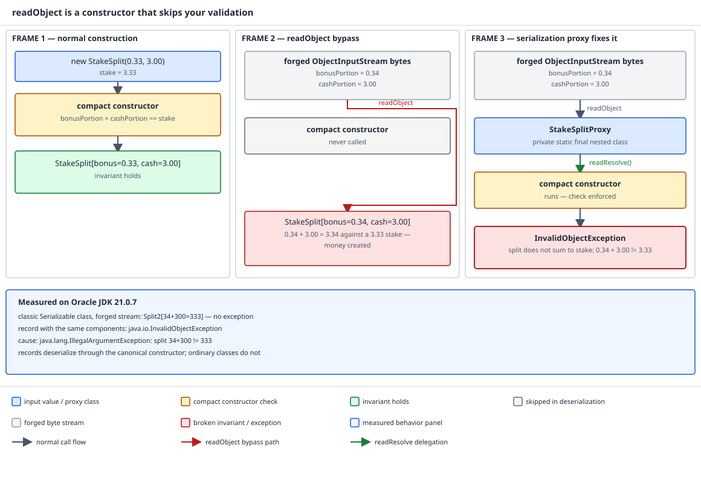

# 03 Java Core — Serialization: the magic methods and the constructor bypass — INTERMEDIATE (§2.10, 2.10.4–2.10.7)

**Target version: Java 21 LTS.** | **Part 2 of 5** | [Index](../00-index.md)
Previous: [Serialization: the default protocol](02-serialization.md) · Next: [Externalizable, records and lambdas](02b-externalizable-records-and-lambdas.md)

`02-serialization.md` owns the marker interface, the object graph, `serialVersionUID`, `transient`
and the compatibility rules for adding and removing fields. This file owns the five hook methods
that let a class customize that default protocol, the constructor bypass those hooks exist to
patch over, and the serialization proxy pattern that closes the hole properly. `02b` owns
`Externalizable`, records, and lambda serialization. `02c` owns the security case — why a
forgeable byte stream is not a hypothetical — and the practical rule for when to bother with any
of this. The question this file answers, in bold: **how does an object get rebuilt without its
constructor running, and what do you have to write to get your invariants back?**

## 1. The five hooks: `writeObject`, `readObject`, `readObjectNoData`, `writeReplace`, `readResolve` (2.10.4)

`ObjectOutputStream` and `ObjectInputStream` do not check whether a class implements some
`CustomSerializable` interface. They reflect over the class, one class at a time up the
hierarchy, looking for methods with *exactly* the right name, the right parameter types, the right
return type, and — for three of the five — the right access modifier. Get the shape wrong by one
character and the stream falls back to the default protocol silently. There is no `@Override` to
catch you, because there is no interface to override.

### Why it exists

The default protocol in `02-serialization.md` reads and writes every non-`transient`,
non-`static` field verbatim. That is enough for a plain data holder, but plenty of QuizStakes
types need more: a `Money` field that should serialize as a `long` minor-unit count instead of a
`BigDecimal` plus a `Currency`, a `ClientRestrictions` cache that should not serialize at all and
instead be rebuilt on read, or a `BonusRuleTable` singleton that must never produce a second
instance. The five hooks are the seams the specification leaves open for exactly these cases,
without touching the wire format's core mechanics.

### How it works

The three field-level hooks:

```java
private void writeObject(java.io.ObjectOutputStream out) throws IOException;
private void readObject(java.io.ObjectInputStream in) throws IOException, ClassNotFoundException;
private void readObjectNoData() throws ObjectStreamException;
```

and the two instance-substitution hooks:

```java
ANY-ACCESS-MODIFIER Object writeReplace() throws ObjectStreamException;
ANY-ACCESS-MODIFIER Object readResolve() throws ObjectStreamException;
```

The two groups behave differently, and blurring them is where most of the confusion starts.

`writeObject`, `readObject`, and `readObjectNoData` **must be declared exactly `private`**.
`ObjectStreamClass` looks each one up with `getDeclaredMethod` and an explicit access check; a
`protected`, package-private, or `public` declaration is invisible to it. Because the lookup is
per-class and `private` members are never inherited, each class in a serializable hierarchy gets
its **own** independent hook — a subclass's `readObject` does not override a superclass's, both
run, superclass first if the superclass also opts back into `defaultReadObject`. This is why the
signature is `private`: the mechanism is not virtual dispatch, it is "does this exact class
declare this exact method," and privacy is what keeps that lookup from colliding with subclass
behavior.

`writeReplace` and `readResolve` may have **any** access modifier and, unlike the other three,
they **are** inherited through normal method resolution. That is a real footgun: a `protected` or
package-private `readResolve` declared on a common superclass (say, a shared `BonusState`-like
base for enum-adjacent value types) silently applies to every subclass in the same package unless
the subclass declares its own. Nothing warns you; the subclass simply inherits instance
substitution it never asked for.

Inside `writeObject`/`readObject`, two more calls matter:

| Method | Called when | Return / throws | What it is for |
|---|---|---|---|
| `writeObject(ObjectOutputStream)` | Every write of an instance whose class declares it | `void`, `throws IOException` | Full control over what this class's slice of the stream contains |
| `readObject(ObjectInputStream)` | Every read of an instance whose class declares it | `void`, `throws IOException, ClassNotFoundException` | Full control over how this class's slice of the stream is consumed |
| `readObjectNoData()` | The stream has **no data for this class** (writer's hierarchy did not include it) | `void`, `throws ObjectStreamException` | Give transient/derived fields a sane default when the writer used an older or narrower type |
| `writeReplace()` | Before an instance is written, on the object about to be serialized | `Object`, `throws ObjectStreamException` | Substitute a different object into the stream (a proxy, a canonical instance) |
| `readResolve()` | After an instance is fully deserialized, before it is handed to the caller | `Object`, `throws ObjectStreamException` | Substitute a different object as the result (a singleton, the proxy's real target) |
| `out.defaultWriteObject()` | Called at most once, first, inside `writeObject` | `void` | Opt back in to writing all non-`transient` fields the default way |
| `in.defaultReadObject()` | Called at most once, first, inside `readObject` | `void` | Opt back in to reading all non-`transient` fields the default way |
| `out.putFields()` / `in.readFields()` | Instead of `defaultWriteObject`/`defaultReadObject` | `PutField` / `GetField` | Name-based field access that survives field reordering or type widening |

`readObjectNoData` is the mechanism behind the "adding a class into the middle of a hierarchy is
a compatible change" rule from `02-serialization.md`: if a `Restriction` subtype gains a new
serializable superclass after some streams were already written, those old streams have no bytes
for that superclass, and `readObjectNoData` runs instead of `readObject` so the new class can
initialize itself from nothing rather than choke on a missing slice.

**Pitfall:** declaring `public void readObject(ObjectInputStream in)`, or
`readObject(ObjectInput in)` (wrong parameter type — `ObjectInput` is the interface,
`ObjectInputStream` is the concrete class the lookup requires), or a `static` version, compiles
cleanly and is simply never invoked. The stream falls through to the default protocol as if the
method were not there, and the only way you find out is when your custom logic silently fails to
run.

> The five hooks are private, per-class, reflectively-located methods — not an interface — so a
> shape mismatch is invisible at compile time and produces silent fallback, not an error, at
> runtime.

## 2. `readObject` is effectively a hidden public constructor that bypasses all your validation (2.10.5)

`[TRAP]` `[PROVE]`

Deserialization is a second constructor for your class that you did not write, cannot see in your
source file, and cannot stop a hostile caller from invoking with arbitrary field values — as long
as they can produce bytes that look like a stream your class would have written.

### Why it exists

Object construction in Java is one atomic operation: allocate, then run exactly one constructor
chain, top to bottom, so every invariant a constructor checks is guaranteed to hold before any
code outside the class ever sees the instance. Serialization was designed before that guarantee
was treated as sacred for this exact case — its job is to *recreate* field state from bytes, and
the most direct way to do that is to skip the code that was written to reject bad field state in
the first place.

### How it works

Walk the mechanism in order:

1. `ObjectInputStream.readObject()` reads the class descriptor from the stream and resolves it to
   the local class with matching `serialVersionUID`.
2. It allocates an instance **without running any constructor declared on that class or any
   serializable superclass**. The JVM's reflection factory (`sun.reflect.ReflectionFactory` /
   `jdk.internal.reflect.ReflectionFactory` under the hood) synthesizes a special constructor that
   chains straight to the first **non-serializable** superclass's accessible no-arg constructor —
   for a direct `Object` subclass, that is `Object()` itself. Every declared field starts at its
   type default: `0`, `false`, `null`.
3. The stream then writes the field values it read **directly into the fields, through reflection,
   including `final` fields** — `Field.setAccessible(true)` plus a privileged field-set bypasses
   the normal "final fields are write-once, at construction" rule that `javac` enforces for
   ordinary code.
4. Only after every field is populated does the class's `readObject`, if declared, run — and by
   that point the object already exists with attacker-controlled field values.

So every guard you put in an ordinary constructor — the `StakeSplit` invariant that
`bonusPortion + cashPortion` sums to the stake, a `null` check on `ClientId`, a currency match
inside `Money`, the `(type, source)` pairing a `Restriction` requires — is simply not in this
path. Nothing calls the constructor, so nothing runs the check.



**D-085** — Frame 1 is the honest path: `new StakeSplit(0.33, 3.00)` for a 3.33 stake runs the
compact-constructor-style check and it passes, `0.33 + 3.00 == 3.33`. Frame 2 is a forged byte
stream reaching `readObject`: it routes **around** a greyed-out constructor labelled "never
called," lands directly on the fields, and produces `StakeSplit[bonus=0.34, cash=3.00]` — 3.34
against a 3.33 stake, money created out of nothing. Frame 3 is the fix from Concept 3: the
serialization-proxy form routes reconstruction back through the canonical constructor via
`readResolve()`, the same check fires on the way in, and the stream is rejected with
`InvalidObjectException: split does not sum to stake`. The annotation panel carries the measured
JDK 21.0.7 numbers below.

The measured proof, harness first — two classes, identical shape, identical
`serialVersionUID = 7L`, one validates and one does not:

```java
static final class Split1 implements Serializable {   // forge source, no validation
    private static final long serialVersionUID = 7L;
    final int bonusMinor, cashMinor, stakeMinor;
    Split1(int b, int c, int s) { bonusMinor = b; cashMinor = c; stakeMinor = s; }
}
static final class Split2 implements Serializable {   // real class, validates
    private static final long serialVersionUID = 7L;
    final int bonusMinor, cashMinor, stakeMinor;
    Split2(int b, int c, int s) {
        if (b + c != s) throw new IllegalArgumentException("split " + b + "+" + c + " != " + s);
        bonusMinor = b; cashMinor = c; stakeMinor = s;
    }
}
```

A stream written from `new Split1(34, 300, 333)` was byte-edited to swap the class name to
`Split2`, then read as `Split2`. Measured on Oracle JDK 21.0.7 (build 21.0.7+8-LTS-245), macOS
aarch64, it printed:

```
Split2[34+300=333]
```

No exception. `Split2`'s constructor, whose entire purpose is to reject `34 + 300 != 333`, never
ran. 0.34 bonus plus 3.00 cash claimed against a 3.33 stake — 3.34 total. The fields are declared
`final`, and they were populated anyway; `final` is a compile-time promise enforced by `javac`
against ordinary assignment, not a runtime guarantee against reflective field-set.

Consequences beyond the arithmetic example, stated plainly: broken class invariants across the
whole object graph, `final` fields holding values that were never checked, `null` sitting in a
field the type declares non-null everywhere else in the codebase, and one that people consistently
miss — **a `readObject` that calls an overridable method on `this` observes a partially
constructed object**, for exactly the same reason calling an overridable method from an ordinary
constructor is dangerous (see
`../classes-and-initialization/01d-class-initialization-triggers.md` for the general hazard of
code running before an object is fully formed). If a `LedgerEntry` subclass's `readObject` calls
`this.describe()` and a further subclass overrides `describe()` to read a field that subclass's
own `readObject` has not populated yet, the read observes a default value, not garbage — but a
default value is exactly as wrong as garbage when the caller assumed construction was complete.

Three partial defences, and why none of them is enough alone:

- **Validate at the top of `readObject`.** This works for a single object read in isolation, but
  it means writing the same invariant check twice — once in the constructor, once in every
  `readObject` — and every third one you add is a place to forget it.
- **`ObjectInputValidation` via `in.registerValidation(callback, priority)`.** The callback runs
  after the *entire* object graph has been read, not just this object, which matters for cycles: a
  `Reservation` that references a `Position` that references the same `Reservation` back cannot be
  validated mid-read because the back-reference is not populated yet, but a registered validation
  callback fires once the whole graph is consistent. It is still opt-in per class and still
  duplicates logic that already lives in the constructor.
- **Defensive copying inside `readObject`.** Necessary for mutable fields (an attacker's stream
  can hand you a `LimitSet` where two array-typed fields alias the same backing array, so a caller
  mutating one appears to mutate the other), but it is one more thing to remember per field, per
  class.

Concept 3 makes all three unnecessary by removing the bypass instead of patching around it.

**Interview:** "Does `readObject` call the constructor?" — no; the JVM synthesizes a constructor
that only runs the first non-serializable superclass's no-arg constructor, then populates fields
directly by reflection, so none of the serializable class's own constructors execute.

> `readObject` is a reflective field-populator that runs instead of your constructor, not through
> it, so any invariant your constructor enforces is absent unless `readObject` re-enforces it
> itself.

## 3. The serialization proxy pattern as the safe form (2.10.6)

`[BUILD]`

Stop trying to make the bypass safe from inside `readObject` and remove the bypass instead. The
real class never appears on the wire. In its place, a small, dumb, private stand-in class is
written; that stand-in's `readResolve` calls the real class's ordinary public constructor.
Reconstruction goes back through the front door, invariants and all.

### Why it exists

Every defence in Concept 2 is optional and per-field. A proxy makes the safe path the *only*
path: there is no field-by-field reflective population of the real class to forget to guard,
because the real class is never the thing deserialized.

### How it works

`StakeSplit` is deliberately a class here, not a record — `02b` shows that records take a
different, already-safe path through their canonical constructor, so a record would not need this
pattern at all. This is the case where the proxy earns its keep.

```java
public final class StakeSplit implements Serializable {
    private static final long serialVersionUID = 4L;

    private final Money bonusPortion;
    private final Money cashPortion;

    public StakeSplit(Money bonusPortion, Money cashPortion) {
        if (!bonusPortion.currency().equals(cashPortion.currency())) {
            throw new IllegalArgumentException(
                "bonus and cash portions must share a currency: "
                    + bonusPortion.currency() + " vs " + cashPortion.currency());
        }
        this.bonusPortion = bonusPortion;
        this.cashPortion = cashPortion;
    }

    public Money bonusPortion() {
        return bonusPortion;
    }

    public Money cashPortion() {
        return cashPortion;
    }

    public Money stake() {
        return new Money(
            bonusPortion.amount().add(cashPortion.amount()),
            bonusPortion.currency());
    }

    @Override
    public boolean equals(Object other) {
        return other instanceof StakeSplit that
            && bonusPortion.equals(that.bonusPortion)
            && cashPortion.equals(that.cashPortion);
    }

    @Override
    public int hashCode() {
        return Objects.hash(bonusPortion, cashPortion);
    }

    private Object writeReplace() {
        return new SerializationProxy(this);
    }

    private void readObject(ObjectInputStream in) throws InvalidObjectException {
        throw new InvalidObjectException("proxy required");
    }

    private static final class SerializationProxy implements Serializable {
        private static final long serialVersionUID = 1L;

        private final long bonusMinorUnits;
        private final long cashMinorUnits;
        private final String currencyCode;

        SerializationProxy(StakeSplit split) {
            this.bonusMinorUnits = split.bonusPortion.amount()
                .movePointRight(split.bonusPortion.currency().getDefaultFractionDigits())
                .longValueExact();
            this.cashMinorUnits = split.cashPortion.amount()
                .movePointRight(split.cashPortion.currency().getDefaultFractionDigits())
                .longValueExact();
            this.currencyCode = split.bonusPortion.currency().getCurrencyCode();
        }

        private Object readResolve() {
            Currency currency = Currency.getInstance(currencyCode);
            int digits = currency.getDefaultFractionDigits();
            Money bonus = new Money(
                BigDecimal.valueOf(bonusMinorUnits, digits), currency);
            Money cash = new Money(
                BigDecimal.valueOf(cashMinorUnits, digits), currency);
            return new StakeSplit(bonus, cash);
        }
    }
}
```

The proxy's fields are deliberately primitive `long`s and a `String` currency code, not a `Money`
reference — that keeps the proxy's own serial form stable and independent of whatever `Money`'s
internal representation happens to be, so a later change to `Money` does not also break the
proxy's `serialVersionUID` contract.

The `readObject` override on `StakeSplit` throwing `InvalidObjectException` is the single
most-forgotten line in the whole pattern, and it is load-bearing. `writeReplace` only controls
what happens when *this JVM* serializes a `StakeSplit` — it does nothing to stop an attacker who
crafts a stream claiming class `StakeSplit` directly, skipping the proxy on the way in. Without
the `readObject` override, that forged stream reaches the exact bypass from Concept 2, unguarded,
because `StakeSplit implements Serializable` and has no other defence. With the override, any
stream that names `StakeSplit` as its class — rather than `SerializationProxy` — is rejected
outright, and the only legitimate path in is through the proxy's `readResolve`, which is the real
constructor.

| Cost | What it means | Escape hatch |
|---|---|---|
| Extra object per (de)serialization | One `SerializationProxy` instance allocated on write and read, beyond the real object | Negligible against the identity-vendor and PSP latencies this note's domain already tolerates (hundreds of ms to tens of seconds); not worth avoiding for correctness |
| No cycles through the proxied object | `readResolve` on a proxy cannot return an object that is itself part of a cycle the proxy participates in, because the proxy's `readResolve` runs before the enclosing graph is fully wired, and the object it returns did not exist during the read | Restructure so the cyclic reference is rebuilt after construction (a setter or a registration step called by the owning aggregate), or accept the class cannot use a proxy and fall back to `ObjectInputValidation` |
| No subclassing with its own serial form | The proxy pattern assumes one canonical reconstruction path; a subclass wanting different wire behavior has nowhere to hook in | Make the class `final` (as `StakeSplit` is here) so the limitation is a design decision, not a bug someone hits later |
| A second schema to version | The proxy's field set is now itself subject to every compatibility rule from `02-serialization.md` — adding a proxy field needs the same care as adding a real field | Treat `SerializationProxy` as a first-class serializable type in its own right, with its own `serialVersionUID` bump discipline |

Cite *Effective Java*, Item 90, "Consider serialization proxies instead of serialized instances."
Item 88, "Write `readObject` methods defensively," is the fallback for when a proxy genuinely
cannot be used (the cyclic case above). Item 89, "For instance control, prefer enum types to
`readResolve`," is exactly Concept 4.

**Insight:** the proxy does not make `readObject` safe — it makes `readObject` on the real class
throw, so the only reconstruction path left is the constructor call inside `readResolve`, which is
ordinary application code subject to ordinary validation.

> A serialization proxy replaces the real class on the wire with a dumb data holder whose
> `readResolve` reconstructs the real object through its normal, validating constructor, so the
> bypass has nothing left to exploit.

## 4. `readResolve` for singletons, and enum serialization ignoring all of these hooks (2.10.7)

`[PROVE]`

Serialization is an instance factory nobody asked your class's authors to authorize. Any class
whose correctness depends on there being exactly one instance is broken by default the moment it
implements `Serializable`, because each `readObject` call — proxy or not — manufactures a brand
new object.

### Why it exists

Consider a `BonusRuleTable` or `ClientRestrictionsRegistry` held as a process-wide singleton,
caching the canonical bonus percentages and restriction lift rules. If either type is
`Serializable` and gets deserialized (say, restored from a snapshot after a restart), the naive
result is a second instance, distinct from the one every other component in the JVM already holds
a reference to. `==` identity checks against the "real" singleton now fail for the deserialized
copy, and if either instance holds mutable state, the two diverge silently.

### How it works

The direct fix:

```java
private Object readResolve() {
    return INSTANCE;
}
```

`readResolve` runs after the stream has fully populated a throwaway instance's fields, and its
return value — not the throwaway instance — is what the caller of `ObjectInputStream.readObject()`
actually receives. Returning the canonical `INSTANCE` discards the throwaway object, and the
caller can never observe the fact that a second instance briefly existed.

Except it can, in three specific ways:

- **Stolen-reference hazard.** Every non-`transient` reference field on a class protected by
  `readResolve` is a hole: an attacker can craft a stream containing two objects, one of which is
  the singleton-candidate and the other of which holds a reference to one of the singleton's
  fields, positioned so that the second object's `readObject` runs and captures the field
  *before* `readResolve` swaps the singleton candidate out. The captured reference is a real,
  live reference into what should have been a discarded object. The fix is that every reference
  field on a `readResolve`-protected singleton must be `transient`, with no exception — there is
  no field on that class an attacker should ever be able to read this way.
- **`readResolve` is inherited.** Because it is not restricted to `private`, a subclass of the
  singleton-bearing class inherits the superclass's `readResolve` unless it declares its own — so
  the subclass's deserialization returns the *superclass's* `INSTANCE`, silently discarding
  whatever distinct state the subclass thought it had.
- **It does nothing about reflection or a second class loader.** `readResolve` governs one code
  path, `ObjectInputStream.readObject()`. A reflective constructor call, or the same class loaded
  twice by two different class loaders (each producing a distinct `Class` object per
  `../classes-and-initialization/03b-internals-class-loaders-and-identity.md`), both produce
  additional instances `readResolve` never sees.

Now the enum contrast, proved rather than asserted. An enum with all four relevant hooks declared,
each one built to throw the moment it is called:

```java
enum BonusState implements Serializable {
    GRANTED, ACTIVE, CONSUMED, EXPIRED, CLAWED_BACK;

    private void writeObject(ObjectOutputStream o) throws IOException {
        throw new IOException("writeObject called");
    }
    private void readObject(ObjectInputStream i) {
        throw new RuntimeException("readObject called");
    }
    private Object readResolve() {
        throw new RuntimeException("readResolve called");
    }
    private Object writeReplace() {
        throw new RuntimeException("writeReplace called");
    }
}
```

Measured on Oracle JDK 21.0.7 (build 21.0.7+8-LTS-245), macOS aarch64:

- `BonusState.CLAWED_BACK`, written and read back, produced `CLAWED_BACK`. **None of the four
  declared hooks fired** — no exception from any of them, meaning none ran.
- `deserialized == BonusState.CLAWED_BACK` evaluated to **`true`**. Identity survived the round
  trip, so `==` comparisons and `switch` statements on the deserialized constant behave exactly as
  they do on the original.
- The stream was **79 bytes** for this five-constant enum, and the constant **name**
  (`CLAWED_BACK`) appeared as literal text in the bytes.
- `ObjectStreamClass.lookup(BonusState.class).getFields()` returned an **empty array**. No field
  data is written for an enum constant at all — the entire wire representation is the class
  identity plus the constant name.
- Byte-editing the name in a captured stream from `EXPIRED` to `XXPIRED` and reading it back
  produced, verbatim:
  `java.io.InvalidObjectException: enum constant XXPIRED does not exist in class Ver3$BonusState`

This is not a JVM quirk, it is specification: the Java Object Serialization Specification defines
enum constants as serialized by writing their name, and deserialized by calling
`Enum.valueOf(EnumType, name)` — a fixed, dedicated protocol that has no plug points for
`writeObject`, `readObject`, `readObjectNoData`, `writeReplace`, or `readResolve`, all of which are
ignored by specification if declared. `serialVersionUID` matching, likewise, is not enforced for
enum types.

The conclusion the specification licenses: **an enum is the only instance-control mechanism
serialization cannot defeat**. That is exactly *Effective Java* Item 89's advice, and exactly why
`BonusState` and `RestrictionType` are modeled as enums in QuizStakes rather than as singleton
classes carrying a hand-written `readResolve` — the enum protocol has no bypass to patch because
it never goes near field reflection or constructor synthesis in the first place.

The honest flip side: the constant **name is the wire format**. Renaming `CLAWED_BACK` to
something else is a breaking change against every stream already written with the old name, in
exactly the way a column rename breaks a database read — `../enums/03d-internals-enum-evolution.md`
owns the full treatment of enum evolution and what changes are safe, and
`../enums/01a-implicit-members-and-identity.md` owns the identity guarantee `==` relies on for
enum constants generally.

Version note: none of the mechanics in this file changed between Java 8 and Java 21 — the hook
signatures, the constructor bypass, the proxy pattern, and enum's fixed protocol are all identical
across that range. What changed is the surrounding defensive context: serialization filters
arrived in Java 9, and the filter factory mechanism in Java 17; `02c` owns that ground.

**Interview:** "Why are enums considered a safer way to implement a singleton than a class with a
private constructor plus `readResolve`?" — because `readResolve` is a patch applied after
deserialization has already run, and it is vulnerable to the stolen-reference and inheritance
problems above, whereas enum deserialization by specification never constructs a competing
instance at all — there is nothing for a patch to fix.

> `readResolve` lets a class substitute a canonical instance after the bypass has already run, and
> is vulnerable while it does so; enum deserialization has no bypass to substitute around, because
> it reconstructs by name through `Enum.valueOf`, never by field reflection.

---

## Pitfalls

### `readObject` declared `public` still gets called during deserialization

**Wrong**

```java
public final class Restriction implements Serializable {
    private static final long serialVersionUID = 2L;
    private final RestrictionType type;
    private final RestrictionSource source;

    Restriction(RestrictionType type, RestrictionSource source) {
        this.type = Objects.requireNonNull(type);
        this.source = Objects.requireNonNull(source);
    }

    public void readObject(ObjectInputStream in) throws IOException, ClassNotFoundException {
        in.defaultReadObject();
        if (type == null) throw new InvalidObjectException("type must not be null");
    }
}
// A stream with a null `type` field deserializes cleanly with a null type,
// because the public readObject above is never found by ObjectStreamClass —
// only a private method with this exact signature qualifies.
```

**Right**

```java
public final class Restriction implements Serializable {
    private static final long serialVersionUID = 2L;
    private final RestrictionType type;
    private final RestrictionSource source;

    Restriction(RestrictionType type, RestrictionSource source) {
        this.type = Objects.requireNonNull(type);
        this.source = Objects.requireNonNull(source);
    }

    private void readObject(ObjectInputStream in) throws IOException, ClassNotFoundException {
        in.defaultReadObject();
        if (type == null || source == null) {
            throw new InvalidObjectException("type and source must not be null");
        }
    }
}
```

**Why people believe it:** every other customization point in the class — getters, `equals`,
`toString` — is conventionally `public`, and nothing else in Java silently ignores a method for
having the "wrong" access modifier, so there is no instinct to suspect it here.

### `final` fields feel immune to being overwritten by a forged stream

**Wrong**

```java
static final class Split1 implements Serializable {
    private static final long serialVersionUID = 7L;
    final int bonusMinor, cashMinor, stakeMinor;
    Split1(int b, int c, int s) { bonusMinor = b; cashMinor = c; stakeMinor = s; }
}
static final class Split2 implements Serializable {
    private static final long serialVersionUID = 7L;
    final int bonusMinor, cashMinor, stakeMinor;
    Split2(int b, int c, int s) {
        if (b + c != s) throw new IllegalArgumentException("split " + b + "+" + c + " != " + s);
        bonusMinor = b; cashMinor = c; stakeMinor = s;
    }
}
// Writing new Split1(34, 300, 333), then reading the bytes back as Split2
// (class name byte-edited in the stream) printed, on JDK 21.0.7:
//   Split2[34+300=333]
// no exception — Split2's validating constructor never ran, even though
// every field involved is declared final.
```

**Right**

```java
public final class StakeSplit implements Serializable {
    private static final long serialVersionUID = 4L;
    private final Money bonusPortion;
    private final Money cashPortion;

    public StakeSplit(Money bonusPortion, Money cashPortion) {
        if (!bonusPortion.currency().equals(cashPortion.currency())) {
            throw new IllegalArgumentException("currency mismatch");
        }
        this.bonusPortion = bonusPortion;
        this.cashPortion = cashPortion;
    }

    private Object writeReplace() {
        return new SerializationProxy(this);
    }

    private void readObject(ObjectInputStream in) throws InvalidObjectException {
        throw new InvalidObjectException("proxy required");
    }
    // SerializationProxy as in Concept 3 — reconstruction only through
    // this constructor, so the currency check always runs.
}
```

**Why people believe it:** `final` is enforced by the compiler against every ordinary assignment
site in the source, so it reads as a runtime guarantee; in fact it is a compile-time-only promise,
and reflective field-set — exactly what deserialization uses to populate fields — is one of the
documented ways to write to a `final` field after construction regardless.

### Assuming a `readResolve()`-protected singleton is safe because the field references are private

**Wrong**

```java
public final class BonusRuleTable implements Serializable {
    private static final long serialVersionUID = 1L;
    public static final BonusRuleTable INSTANCE = new BonusRuleTable();

    private Map<String, BigDecimal> percentagesByTier = new ConcurrentHashMap<>();

    private BonusRuleTable() {}

    private Object readResolve() {
        return INSTANCE;
    }
}
// percentagesByTier is not transient. A crafted stream containing a
// second object whose field is wired to alias this map, positioned to run
// its own readObject before BonusRuleTable's readResolve swaps the
// throwaway instance out, walks away holding a live reference to
// mutable state that was never meant to leave this class.
```

**Right**

```java
public final class BonusRuleTable implements Serializable {
    private static final long serialVersionUID = 1L;
    public static final BonusRuleTable INSTANCE = new BonusRuleTable();

    private transient Map<String, BigDecimal> percentagesByTier = new ConcurrentHashMap<>();

    private BonusRuleTable() {}

    private Object readResolve() {
        return INSTANCE;
    }
}
```

**Why people believe it:** `private` reads as "nothing outside this class can reach it," which is
true for ordinary Java code but not for a hostile stream — the stream never goes through the
class's own accessors, it populates the field directly, so field-level privacy provides no
protection against a stream that targets the field by name.

## Cheat sheet

| Thing | Fact (Java 21 LTS) |
|---|---|
| `writeObject`/`readObject`/`readObjectNoData` access | Must be exactly `private`; wrong modifier = silently never called |
| `writeReplace`/`readResolve` access | Any modifier; inherited, unlike the other three |
| `readObjectNoData` fires when | Stream has no data for this class (writer's hierarchy lacked it) |
| Does `readObject` run the constructor? | No — JVM allocates via a synthesized constructor chaining to the first non-serializable superclass's no-arg constructor, then sets fields by reflection |
| Can deserialization set a `final` field? | Yes, via reflection; `final` is compile-time-only against ordinary assignment |
| Fix for the bypass | Serialization proxy: `writeReplace` emits a proxy, proxy's `readResolve` calls the real constructor |
| Most-forgotten proxy line | `readObject` on the real class throwing `InvalidObjectException` — without it, a forged stream can still name the real class directly |
| `readResolve` singleton hazard | Every reference field must be `transient` — stolen-reference attack captures fields before the swap |
| Enum + the four hooks | Ignored by specification even if declared; proved by measurement — none fired |
| Enum identity after round trip | `==` holds; measured `true` |
| Enum wire format | Constant name as text plus class identity; no field data (`getFields()` empty); unknown name throws `InvalidObjectException` |
| `serialVersionUID` on enums | Not enforced |
| Safest singleton form | Enum — no bypass exists to patch |

## Self-test

**Q1.** Why must `readObject` be declared `private`, and what happens if it is declared
`protected` instead?

<details><summary>Answer</summary>

The lookup `ObjectStreamClass` performs is an exact reflective match on name, parameter type, and
access modifier — `private` is required so the method is treated as class-specific rather than
inherited or overridable, since each class in a hierarchy needs its own hook fired independently.
A `protected` declaration fails that exact match, so the method is never invoked; the stream
silently falls back to the default field-by-field protocol as if no custom `readObject` existed,
with no compile or runtime error.

</details>

**Q2.** Trace exactly what happens, step by step, when a forged stream claiming to be a
`StakeSplit` (no proxy involved) is deserialized, assuming `StakeSplit` has no defensive
`readObject` override.

<details><summary>Answer</summary>

`ObjectInputStream` reads the class descriptor and resolves it to the local `StakeSplit` class. It
allocates an instance via a synthesized constructor that only runs `Object()`'s constructor — none
of `StakeSplit`'s own constructors execute. It then writes the stream's field bytes directly into
`bonusPortion` and `cashPortion` via reflection, bypassing the currency-match and sum checks
entirely. If `StakeSplit` declares no custom `readObject`, the object is now fully formed and
handed to the caller with whatever field values the stream specified, valid or not.

</details>

**Q3.** What specifically does the `readObject` override that throws `InvalidObjectException`
inside the serialization proxy pattern protect against, given that `writeReplace` already
substitutes the proxy on write?

<details><summary>Answer</summary>

`writeReplace` only governs what this JVM produces when it serializes an already-existing
`StakeSplit` instance. It does nothing to stop an attacker from constructing a stream from scratch
that declares its class as `StakeSplit` directly, never going through `SerializationProxy` at all.
Without the `readObject` override on `StakeSplit` itself, that forged stream reaches the ordinary
constructor-bypass hole. The override closes that path by making any stream naming `StakeSplit`
directly fail immediately, forcing all legitimate deserialization through the proxy's
`readResolve`, which calls the real, validating constructor.

</details>

**Q4.** Why can a `readResolve`-protected proxy not participate in a reference cycle?

<details><summary>Answer</summary>

A proxy's `readResolve` runs and returns its replacement object during the read of that specific
object, before the rest of the graph containing it has necessarily finished being read and wired
together. If some other object in the graph needs a reference back to the proxied object as part
of a cycle, that reference would have to point at the object `readResolve` is about to discard in
favor of its replacement, which is exactly the kind of stale reference the pattern is designed to
prevent, not create. Practically, the proxy's constructed replacement is not yet linked into the
graph at the moment other objects in a cycle would need to reference it.

</details>

**Q5.** Explain, using the measured `BonusState` results, why enum-based instance control cannot
be defeated the way a `readResolve`-based singleton class can.

<details><summary>Answer</summary>

`BonusState` declared `writeObject`, `readObject`, `writeReplace`, and `readResolve`, each built to
throw if invoked. None threw during a real round trip, meaning the specification's enum protocol
never calls any of them — it serializes the constant by name only (`getFields()` returned empty,
and the name appeared as literal text in the 79-byte stream) and deserializes via
`Enum.valueOf`, which either returns the existing singleton constant or throws
`InvalidObjectException` for an unrecognized name. There is no field reflection step and no
synthesized bypass constructor involved at all, so there is no equivalent of the stolen-reference
or inheritance problems that a hand-written `readResolve` singleton is exposed to.

</details>

**Q6.** A class declares `readObject(ObjectInput in)` instead of
`readObject(ObjectInputStream in)`. What happens at compile time and at run time?

<details><summary>Answer</summary>

It compiles without error or warning, because `ObjectInput` is a valid type and the method is
simply an ordinary, unrelated method from the compiler's point of view — there is no interface
being implemented, so there is nothing to check the signature against. At run time, deserialization
never finds it, since the reflective lookup requires the parameter type to be exactly
`ObjectInputStream`; the class falls back to the default field-by-field protocol as though no
custom `readObject` were declared.

</details>

**Q7.** Why does a `readResolve`-protected singleton require every reference field to be
`transient`, specifically?

<details><summary>Answer</summary>

Before `readResolve` runs and discards the throwaway instance in favor of the canonical one, that
throwaway instance briefly exists with its fields already populated by the stream. A crafted
stream can include a second object, positioned to run its own `readObject` before the singleton's
`readResolve` executes, that captures a reference to one of the throwaway instance's fields. If
that field is a live, mutable reference type, the attacker walks away holding a reference into
what was supposed to be a discarded object — the "stolen reference." Marking the field `transient`
removes it from the stream entirely, so there is nothing to steal.

</details>

## Open questions

None.

---

**Leaves covered:** 2.10.4–2.10.7 (4 leaves)
**Leaves deferred:** none
**Diagrams included:** D-085
**Target version:** Java 21 LTS
**Lines:** 779
