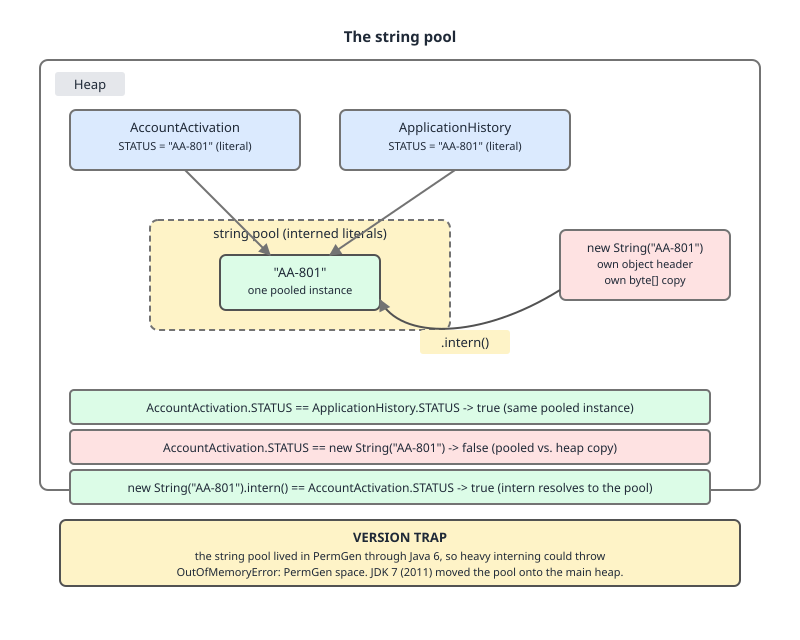

# 03 Java Core — The string pool — BASICS (§1.11, and §1.10's `intern()`)

**Target version: Java 21 LTS.** | **Part 1 of 5** | [Index](../00-index.md)
Previous: [`String`: the API surface](01-basics.md) · Next: [`String` performance and text](02-performance-and-text.md)

## The string pool and `intern()` (1.11.1–1.11.4, 1.11.7–1.11.9, 1.10.24)

The pool is one JVM-wide hash table — `StringTable`, `StringTableSize = 65536` buckets by default on JDK 21 — mapping string content to one canonical `String` instance. Think of it as a `HashMap<String, String>` that the class loader populates for you and the GC prunes for you.

### Why it exists, and how literals get in (1.11.1)

Every string literal is a `CONSTANT_String_info` entry in its class's constant pool. The first time a `ldc` instruction resolves that entry, the JVM looks the content up in `StringTable`; on a miss it creates the `String` and installs it. Resolution is per constant-pool entry and permanently cached, so the second execution of the same `ldc` is a field read. This is why `"AA-801" == "AA-801"` is `true` across different classes and even across different class loaders in the same JVM (1.11.3) — the table is one per JVM, not one per loader. Two classes loaded by unrelated loaders resolve to the same instance.

### PermGen is stale advice (1.11.2) `[VERSION-TRAP]`

Through Java 6 the pooled `String` objects lived in PermGen, which was small and separately sized, so aggressive interning produced `OutOfMemoryError: PermGen space` and interned strings were effectively never collected. **Java 7 moved the pool contents to the normal heap** (JDK-6962931), and JDK 8 removed PermGen entirely. On JDK 21 the `StringTable` holds *weak* references, so an interned string with no other strong reference is collected like any other object. The stale claim to correct: "interning leaks permanently." The true statement: interning keeps a string reachable from the table only while something else holds it — but the table entry itself is not free, and a table with far more entries than 65536 buckets degrades to long chains.



**D-032** — Follow the `==` annotations: two classes' `ldc` sites converge on one pooled `"AA-801"`, the `new String("AA-801")` sits outside the table with its own header, and `.intern()` on it returns the pooled instance rather than itself.

### `new String("AA-801") != "AA-801"` (1.11.4), and what `intern()` does (1.10.24)

```java
String pooled  = "AA-801";
String copied  = new String("AA-801");
String interned = copied.intern();

pooled == copied;     // false  - distinct headers
pooled.equals(copied);// true   - identical content
pooled == interned;   // true   - intern() returned the table's instance
copied == interned;   // false  - copied is still its own object
```

`intern()` is a `native` method: it looks the content up in `StringTable` and returns the existing entry, or installs `this` and returns `this`. Cost: a native call, a hash of the whole string, and a lock-free-but-contended table insert. It is roughly an order of magnitude more expensive than a `HashMap.putIfAbsent` on the same content, and it is uncancellable — you cannot evict one entry.

### When to intern, and when not (1.11.7)

`FundsLedger` writes ~19.8M `LedgerEntry` rows a day and reads them back at ~180 bytes a row. Every row carries a status code drawn from a fixed set of about 21 values. Parsed naively, that is 19.8M distinct `String` objects a day for 21 distinct contents.

**Do intern (or canonicalise) when** the value set is small, bounded, and known to repeat — status codes, currency codes, position names, restriction types. Benefit: 19.8M×48 bytes of headers-plus-arrays collapses to 21 instances, and downstream `equals` calls hit the identity fast path.

**Do not intern** unbounded input — client names, memo lines, free-text addresses, anything from an HTTP body. **Pitfall:** interning user input to "save memory". Symptom: `StringTable` grows past its 65536 buckets, average chain length climbs, every subsequent `intern()` and every literal resolution slows down, and a full GC's string-table walk lengthens; with a strong reference anywhere the entries never leave. Fix: use a bounded canonicaliser you control (below), or nothing at all.

### Alternatives (1.11.8)

| Approach | Bounded? | Cost | When it wins |
|---|---|---|---|
| `String.intern()` | No — one JVM-wide table | Native call, no eviction, shared with literals | Small fixed vocabularies, and you want `==` to work |
| `Map<String,String>` canonicaliser | Yes — you size and evict it | One hash + one lookup, plain Java, per-instance | Parsing hot paths; the recommended default |
| G1 string deduplication | Automatic | `-XX:+UseStringDeduplication` (off by default); GC threads dedupe `value` arrays after `StringDeduplicationAgeThreshold = 3` survivals | You cannot change the code; saves array bytes only, not headers, and `==` still fails |

```java
final class StatusCodeCanonicaliser {

    // 21 known status codes; sized once, never grows.
    private final Map<String, String> canonical = new ConcurrentHashMap<>(32);

    String canonicalise(String parsed) {
        String existing = canonical.get(parsed);
        if (existing != null) {
            return existing;
        }
        return canonical.size() < 64
                ? canonical.computeIfAbsent(parsed, String::valueOf)
                : parsed;                    // refuse to grow on unexpected input
    }
}
```

The `size() < 64` guard is the whole point: an unexpected status code cannot turn this cache into a leak, which `intern()` cannot promise.

### Never compare strings with `==` (1.11.9)

**Pitfall:** `==` on strings works often enough to hide the bug. Every literal, every compile-time-folded concatenation, and every `intern()` result compares correctly, so a unit test written with literals passes. It fails the moment the string comes from I/O: a JDBC `ResultSet.getString`, a JSON body, `Files.readString`, a `split` result, a `substring`, or a `StringBuilder`. Symptom: a status check that is `true` in tests and `false` in production against the same data — for example `row.getString("status") == "AA-801 ACTIVATED"`, which silently reports every activated account as not activated. Fix: `equals`, or `Objects.equals` when either side may be null, or an enum/`StatusCode` record so the compiler stops accepting the comparison at all.

> The string pool is a single weak-referencing JVM-wide hash table into which literals are installed at first `ldc` resolution; `intern()` returns its canonical instance for equal content, and identity comparison is only ever safe when every operand provably came from that table.

---

## Constant folding depends on `final` (1.11.5, 1.11.6)

Concatenation of two literals is not a runtime operation at all. `javac` evaluates it and emits one `ldc`. The rule that decides this is JLS §15.29 (constant expressions) plus §4.12.4 (constant variables), and it is sharper than most people assume: a `final` local initialised with a literal participates; a non-`final` one — even an effectively-final one — does not.

### Why it exists

Folding lets literal-assembled protocol constants cost nothing at runtime and become usable as `case` labels, annotation values, and `switch` selectors, all of which the JLS requires to be constant expressions. The cost of the rule being *syntactic* (`final` present, not merely inferred) is exactly the trap in 1.11.6: adding or removing one keyword changes both the bytecode and the result of `==`.

### The bytecode `[BYTECODE]`

```java
final class AccountActivation {
    static boolean folded() {
        final String prefix = "AA-";
        return (prefix + "801") == "AA-801";
    }

    static boolean notFolded() {
        String prefix = "AA-";                 // no 'final'
        return (prefix + "801") == "AA-801";
    }
}
```

```
  static boolean folded();
    Code:
       0: ldc           #7    // String AA-
       2: pop
       3: ldc           #9    // String AA-801
       5: ldc           #9    // String AA-801
       7: if_acmpne     14
      10: iconst_1
      11: goto          15
      14: iconst_0
      15: ireturn

  static boolean notFolded();
    Code:
       0: ldc           #7    // String AA-
       2: astore_0
       3: aload_0
       4: invokedynamic #13,  0  // InvokeDynamic #0:makeConcatWithConstants:(Ljava/lang/String;)Ljava/lang/String;
       9: ldc           #9    // String AA-801
      11: if_acmpne     18
      14: iconst_1
      15: goto          19
      18: iconst_0
      19: ireturn
```

Instruction by instruction. In `folded`: `ldc #7` loads `"AA-"` and `pop` throws it away — the local is dead because the compiler already evaluated the concatenation — then two `ldc #9` push the *same* pooled `"AA-801"` twice, `if_acmpne` compares references, and the method returns `true`. In `notFolded`: `astore_0`/`aload_0` keep the local live, `invokedynamic makeConcatWithConstants` (the JEP 280 indified concatenation strategy, Java 9+; Java 8 emitted `StringBuilder` calls here) builds a **fresh** `String` at runtime, `ldc #9` pushes the pooled literal, and `if_acmpne` compares two distinct objects — `false`.


**D-033** — The single `ldc` on the `final` side versus the `invokedynamic` and its freshly allocated result on the non-`final` side; note both sides reference the same pooled literal for the right-hand operand.

**Pitfall (1.11.6):** assuming "effectively final" is enough. Symptom: deleting an unused-looking `final` keyword during a cleanup flips a `==` from `true` to `false`, or breaks compilation of a `case` label that referenced the variable, with an error that names the label rather than the keyword. Fix: never rely on the folding for equality — compare with `equals` — and mark genuinely constant text `static final`, which is both foldable and self-documenting. `String.concat`, `StringBuilder`, and `formatted` are never folded, regardless of `final`.

**Interview:** "Is `"AA-" + phase == "AA-801"` ever true?" — "Only if `phase` is a constant variable: a `final` (or `static final`) `String` initialised with a constant expression. Otherwise `javac` emits `invokedynamic` and you get a new object."

> A concatenation folds to a single pooled constant only when every operand is a constant expression, which for a variable requires the `final` keyword and a constant-expression initialiser (JLS §4.12.4) — inference of effective finality does not qualify.

---

## Pitfalls

### Assuming "effectively final" is enough for constant folding

**Wrong**
```java
String prefix = "AA-";                       // no 'final'
boolean activated = (prefix + "801") == "AA-801";   // false
```

**Right**
```java
static final String PREFIX = "AA-";          // a constant variable (JLS 4.12.4)
boolean activated = "AA-801".equals(PREFIX + "801");   // true, and true for the right reason
```
Marking it `static final` restores the folding, and comparing with `equals` means the answer no longer depends on whether the folding happened at all.

**Why people believe it:** effective finality is enough for lambda capture, for `var` inference and for the compiler's dataflow analysis, so it feels like a general rule. Constant-variable status is the one place the JLS demands the keyword itself.

### Interning unbounded input to save memory

**Wrong**
```java
row.setMemo(request.memo().intern());        // free-text memo, 6.5k/day, unbounded
```

**Right**
```java
row.setStatus(statusCodeCanonicaliser.canonicalise(parsedStatus));   // bounded to 64 entries
row.setMemo(request.memo());                                          // not canonicalised
```
The canonicaliser refuses to grow past its cap; `StringTable` has no cap and no eviction API.

**Why people believe it:** interning genuinely does collapse duplicates, and the memory graph improves in a test with 21 distinct values — the degradation only shows up with a high-cardinality production key set.

### Comparing strings with `==`

**Wrong**
```java
String status = resultSet.getString("status");
if (status == "AA-801 ACTIVATED") {          // always false for a DB-sourced string
    balanceView.markActive(clientId);
}
```

**Right**
```java
if ("AA-801 ACTIVATED".equals(status)) {     // literal first: null-safe
    balanceView.markActive(clientId);
}
```

**Why people believe it:** it works for literals, for folded concatenations, and for interned values, so the first hundred experiments all agree with the wrong model — and the unit tests, written with literals on both sides, pass.

### Writing `new String("AA-801")` instead of the literal

**Wrong**
```java
private static final String ACTIVATED = new String("AA-801");   // outside the pool
ACTIVATED == "AA-801";                                          // false
```

**Right**
```java
private static final String ACTIVATED = "AA-801";               // the pooled instance
ACTIVATED == "AA-801";                                          // true, though you still use equals
```
The copy constructor shares the same `value` array, so the only thing `new` buys is a second 24-byte header and the loss of pooled identity.

**Why people believe it:** `new` reads as "give me my own copy", which is the right instinct for a mutable type and meaningless for an immutable one.

## Cheat sheet

| Thing | Answer |
|---|---|
| What the pool is | `StringTable`, one per JVM, native hash table of weakly-referenced `String` objects |
| Default size | `StringTableSize = 65536` buckets on JDK 21 |
| Pool location | Java heap since Java 7 (JDK-6962931); PermGen through Java 6; PermGen removed in 8 |
| When literals enter | First resolution of the class's `CONSTANT_String_info` by `ldc`; cached per constant-pool entry |
| Cross-class / cross-loader | `"AA-801" == "AA-801"` is `true` across classes and across class loaders in one JVM |
| `new String("AA-801")` | New header, shared `value` array, **not** pooled → `!=` the literal |
| `intern()` | Native; returns the table's instance for equal content, installing `this` on a miss |
| Folding rule | All operands must be constant expressions; a variable needs `final` **and** a constant initialiser |
| Non-folded concat | `invokedynamic makeConcatWithConstants` (Java 9+); `StringBuilder` calls on Java 8 |
| Never folded | `concat`, `StringBuilder`, `String.format`, `formatted`, regardless of `final` |
| Dedup flags | `UseStringDeduplication` off by default; `StringDeduplicationAgeThreshold = 3` |
| Safe `==` | Only when every operand provably came from the pool. In practice: never |

## Self-test

**Q1.** Where does the string pool live, and is the old "interning causes PermGen OOM" advice still true?

<details><summary>Answer</summary>

The `StringTable` itself has always been a native hash table, but the `String` objects it points at moved from PermGen to the ordinary Java heap in Java 7 (JDK-6962931); PermGen was removed entirely in Java 8. On JDK 21 the table holds weak references, so an interned string with no other strong reference is collectable. The PermGen advice is stale. What remains true: the table has no eviction API, and pushing far more than its 65536 default buckets into it lengthens chains, slowing every subsequent `intern()` and every literal resolution, and lengthening the string-table walk during a full GC.

</details>

**Q2.** `final String prefix = "AA-"; boolean b = (prefix + "801") == "AA-801";` — what is `b`, and what changes if you delete `final`?

<details><summary>Answer</summary>

`true` with `final`. JLS §4.12.4 makes a `final` variable of type `String` initialised with a constant expression a *constant variable*, so `prefix + "801"` is itself a constant expression; `javac` folds it and emits `ldc` for the same pooled `"AA-801"` on both sides of `if_acmpne`. Delete `final` and the variable is merely effectively final, which does not qualify: the compiler emits `invokedynamic makeConcatWithConstants`, which allocates a fresh `String` at runtime, and `b` is `false`.

</details>

**Q3.** Given `String copied = new String("AA-801");`, what do `copied == "AA-801"` and `copied.intern() == "AA-801"` evaluate to, and why?

<details><summary>Answer</summary>

`false` and `true`. The `new String(String)` copy constructor always allocates a fresh header, so `copied` is a different object from the pooled literal even though its `value` array is the very same array. `intern()` hashes the content, finds the literal already installed in `StringTable` — it was installed when the enclosing class's `ldc` first resolved — and returns *that* instance, not `copied`. So `copied.intern() == "AA-801"` is `true` while `copied == copied.intern()` is `false`.

</details>

**Q4.** `FundsLedger` parses 19.8M status codes a day out of ledger rows, drawn from a fixed set of 21 values. Should it call `intern()`?

<details><summary>Answer</summary>

Either `intern()` or a bounded canonicaliser works on the memory axis — 19.8M instances collapse to 21 — and the canonicaliser is the better default. `intern()` is a native call with a full-string hash, has no eviction, and shares one JVM-wide table with every literal in the process, so a single bug that feeds it an unbounded value degrades string resolution for the whole JVM. A `Map<String,String>` with a size cap costs one ordinary hash lookup, is sized and evicted by you, and fails safe by returning the uncanonicalised string. Reach for `intern()` only when you specifically want `==` to work across unrelated code paths.

</details>

**Q5.** Why does comparing strings with `==` pass every test and then fail in production?

<details><summary>Answer</summary>

Because the operands in tests are literals, and every literal is the pooled instance, so `==` and `equals` agree. In production the operands come from I/O: `ResultSet.getString`, a JSON body, `Files.readString`, a `split` result, a `substring`, a `StringBuilder`, or `invokedynamic` concatenation. All of those allocate fresh objects, so identity fails while content matches. The symptom is a status check that reports every activated account as not activated, with no exception and nothing in the logs. Fix: `equals`, `Objects.equals` when either side may be null, or a `StatusCode`/enum type so the compiler rejects the comparison outright.

</details>

**Q6.** Is `"AA-801" == "AA-801"` still `true` when the two literals sit in classes loaded by different class loaders?

<details><summary>Answer</summary>

Yes. `StringTable` is a single per-JVM structure, not per-loader. Each class has its own `CONSTANT_String_info` entry and its own `ldc` site, but both resolutions look the content up in the one table, and the second one hits the entry the first one installed. This is also why `intern()` gives you an identity that crosses module and loader boundaries — and why an unbounded `intern()` in one component is everybody's problem.

</details>

---

**Leaves covered:** 1.10.24, 1.11.1–1.11.9 (10 leaves)
**Leaves deferred:** none
**Diagrams included:** D-032, D-033
**Target version:** Java 21 LTS
**Lines:** 290
