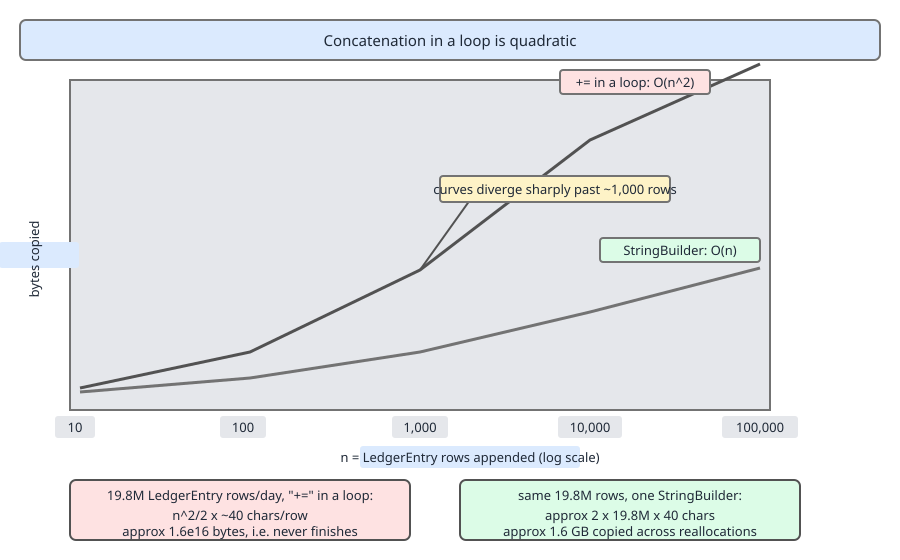
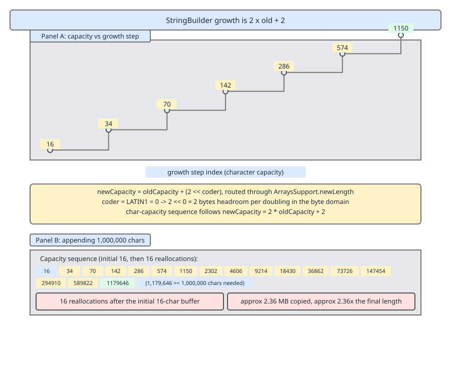

# 03 Java Core — `String` performance and formatting — INTERMEDIATE (§2.2, 2.2.1–2.2.12, 2.2.25)

**Target version: Java 21 LTS.** | **Part 2 of 5** | [Index](../00-index.md)
Previous: [The string pool](01b-the-string-pool.md) · Next: [Text, Unicode and encoding](02b-text-and-encoding.md)

## The map: five ways to build a string, and what each one costs

| Mechanism | What it compiles/expands to in Java 21 | Cost for one result of length *n* | Cost for *n* pieces appended in a loop | Reach for it when |
|---|---|---|---|---|
| `a + b + c` in one expression | `invokedynamic makeConcatWithConstants` → a `StringConcatFactory` method handle chain | one exact-size `byte[]`, one copy per argument | **O(n²)** — one full copy of the accumulator per iteration | the whole result is written in a single expression |
| `StringBuilder` | direct calls, mutable `byte[]` + `count` | amortised O(n), plus growth reallocations | **O(n)** amortised when the builder is hoisted out of the loop | you append across statements, branches or iterations |
| `String.format` / `Formatter` | a `Formatter` parses the format string at runtime, appends into a `StringBuilder` | O(n) plus format-string parsing per call | O(n) per call, parsing repeated every call | human-facing layout: widths, grouping, precision |
| `String.join` / `StringJoiner` | one `StringJoiner`, one `StringBuilder` inside it | O(n), length known only as it goes | O(n) | joining a known collection with one delimiter |
| `Collectors.joining` | a `StringJoiner` as the stream accumulator | O(n) | O(n) | the pieces arrive from a stream pipeline |

Two rules fall out of that table and the rest of this file is their mechanism: **the cost is in the copies, not the calls**, and **a loop is a different cost class from an expression**. The one cost that is *not* in this table is the encode/decode at the I/O boundary — that belongs to [`02b-text-and-encoding.md`](02b-text-and-encoding.md).

---

## `+` in a loop is quadratic (2.2.1)

Picture the accumulator as a photocopy. Each iteration you do not append to last iteration's paper — you take the whole sheet to the copier, copy it, and write one new row on the copy. Iteration 1 copies 1 row, iteration 2 copies 2 rows, iteration *k* copies *k* rows. Total copying is `1 + 2 + … + n = n(n+1)/2` rows: quadratic in the number of rows, for a linear amount of output.

### Why the shape exists

`String` is immutable. There is no operation that lengthens an existing `String`, so every `+` must produce a new object with a new backing array. In one expression that is fine — javac sees all the operands and builds the result once. In a loop javac sees one binary `+` per iteration and has no licence to fuse iterations: the intermediate value is observable (it lives in a local, could be read, could escape). The language gives the compiler nothing to work with, so the copies are real.

### When `+` is right, and when it loses

Use `+` freely for a fixed number of operands in a single expression — it is the fastest option there (next section). Never use `+=` where the number of appends grows with data. The sibling that wins is a `StringBuilder` declared **before** the loop, or better, a `Writer` when the result is going to a file or socket rather than to memory.

### The mechanism, and the version trap (2.2.2)

Folklore says `+=` in a loop "creates a new `StringBuilder` every iteration". That was true for javac up to Java 8, which desugared each `+` into `new StringBuilder().append(a).append(b).toString()` — two array allocations and two copies per iteration. **In Java 9 and later, including 21, javac emits `invokedynamic makeConcatWithConstants` for every `+`, loop or not** (JEP 280). Per iteration you now get: one call into the linked method handle chain, one length computation, one exact-size `byte[]`, one copy of the accumulator, one copy of the new row. The constant factor dropped — no builder object, no over-allocated array, one copy of the prefix instead of two — but the *asymptotics did not change*. It is still O(n²).

**Insight:** JEP 280 made the quadratic loop roughly twice as cheap per iteration, which made it harder to notice in profiling and easier to ship. The fix is unchanged.

Here is the loop compiled by javac 21. Offsets are indicative; the instruction sequence is the point.

```
// String report = "";
// for (LedgerEntry e : entries) { report += e.line() + "\n"; }
   0: ldc           #7      // String (empty)
   2: astore_2              // report = ""
   3: aload_1
   4: invokeinterface #9    // java/util/List.iterator:()Ljava/util/Iterator;
   9: astore_3
  10: aload_3
  11: invokeinterface #15   // java/util/Iterator.hasNext:()Z
  16: ifeq          45      // loop exit
  19: aload_3
  20: invokeinterface #21   // java/util/Iterator.next:()Ljava/lang/Object;
  25: checkcast     #27     // class LedgerEntry
  28: astore        4
  30: aload_2               // push report  (the whole accumulator)
  31: aload         4
  33: invokevirtual #31     // LedgerEntry.line:()Ljava/lang/String;
  36: invokedynamic #35,  0 // makeConcatWithConstants:(LString;LString;)LString;
  41: astore_2              // report = the NEW string
  42: goto          10
  45: aload_2
  46: areturn
```

Read it instruction by instruction. `ldc` at 0 loads the empty-string constant from the pool and `astore_2` parks it in the accumulator local. Offsets 3–9 obtain the iterator once, outside the loop. Offset 10 is the loop head: `hasNext`, then `ifeq` jumps past the body when it returns 0. Offsets 19–28 pull the next element and `checkcast` it, because the erased `Iterator.next` returns `Object`. Now the important pair: **`aload_2` at 30 pushes the *entire current accumulator* as argument 0 of the indy call, on every single iteration**, and `invokevirtual` at 33 produces the new row as argument 1. Offset 36 is the one and only `invokedynamic` call site (constant-pool entry `#35`) — it is *linked* once, on first execution, but *invoked* n times, and each invocation allocates a fresh array sized `report.length() + line.length()` and copies `report` into it. `astore_2` at 41 overwrites the local, making the previous accumulator garbage. `goto` at 42 closes the loop. The quadratic term is the copy behind offset 36, not the call itself.



**D-065** — Concatenation in a loop is quadratic: look at the two curves on the log scale. Bytes copied by `+=` rises as the square of the rows appended while the `StringBuilder` line stays linear; the annotation at the right gives the totals for a full 19.8M-entry ledger day.

`FundsLedger` builds a daily reconciliation report over roughly 19.8M `LedgerEntry` rows at about 180 bytes per formatted row. The arithmetic for the `+=` version, all figures in bytes:

- output size: `19,800,000 × 180 = 3.564 × 10⁹` — about 3.56 GB.
- bytes copied by `+=`: `n² × w / 2 = (1.98 × 10⁷)² × 90 = 3.53 × 10¹⁶` — about **35 petabytes** of `System.arraycopy` to produce 3.56 GB of answer.
- allocations: 19.8M byte arrays, average size about 1.78 GB. Every one is immediately garbage, and most are large enough to be allocated as humongous G1 regions, bypassing the young generation entirely.

```java
public final class FundsLedger {

    private final LedgerRepository repository;

    FundsLedger(LedgerRepository repository) {
        this.repository = repository;
    }

    // Quadratic. Never ship this.
    String reconciliationReportQuadratic(List<LedgerEntry> entries) {
        String report = "";
        for (LedgerEntry entry : entries) {
            report += formatRow(entry) + "\n";
        }
        return report;
    }

    // Linear in copies: one builder, hoisted out of the loop, pre-sized.
    String reconciliationReportLinear(List<LedgerEntry> entries) {
        StringBuilder report = new StringBuilder(entries.size() * 180);
        for (LedgerEntry entry : entries) {
            report.append(formatRow(entry)).append('\n');
        }
        return report.toString();
    }

    // Constant memory: the real fix at 19.8M rows — never hold the report at all.
    void writeReconciliationReport(List<LedgerEntry> entries, Writer sink) throws IOException {
        for (LedgerEntry entry : entries) {
            sink.write(formatRow(entry));
            sink.write('\n');
        }
    }

    private static String formatRow(LedgerEntry entry) {
        return entry.entryId() + "|" + entry.position() + "|"
                + entry.amount().amount().toPlainString() + "|" + entry.amount().currency();
    }
}
```

**Pitfall:** the `StringBuilder` version is linear in *copies* but still peaks at roughly 7.1 GB of live character data — the 3.56 GB result, plus the array being copied out of during the final growth, plus `toString`'s own copy. At 19.8M rows the escape hatch is `writeReconciliationReport`: streaming to a `Writer` is O(n) time **and** O(1) memory. "Use a `StringBuilder`" is the right interview answer and the wrong production answer above a few megabytes.

**Interview:** "Why is string concatenation in a loop slow?" — because each `+=` allocates a new array and copies the whole accumulator, so total copying is `n(n+1)/2` characters. Hoisting one `StringBuilder` out of the loop makes it amortised linear. Add that since Java 9 the desugaring is `invokedynamic`, not a per-iteration builder, and the asymptotics are unchanged.

> **Definition.** `+=` on a `String` inside a loop is quadratic because immutability forces a full copy of the accumulator per iteration, regardless of whether javac desugars to `StringBuilder` (≤ 8) or `StringConcatFactory` (9+).

---

## One-expression `+` beats a hand-rolled builder (2.2.2)

The mental model: a single `+` expression is not a sequence of appends, it is a **request for a string of a known shape**. javac hands the shape to the runtime — the constant parts as a recipe string, the variable parts as call-site arguments — and the runtime builds a bespoke method handle chain for that exact shape, once, at first execution.

### Why it exists

Before Java 9 javac made the decision at compile time and always chose `StringBuilder`, so the bytecode was frozen and could never improve: a class file compiled in 2011 was stuck with 2011's concatenation strategy forever. `StringConcatFactory` moves the decision to link time, which is why the same unchanged class file gets faster on a newer JVM.

### When it wins, and when it loses

The default strategy computes the exact total length by asking every argument for its length first, allocates the backing `byte[]` **once at exactly the right size**, and copies each argument in. A hand-written `StringBuilder` cannot do that: it starts at capacity 16, discovers the length as it goes, reallocates on overflow, and then `toString()` copies the whole thing one final time into the `String`'s array. So the builder does at least one extra full copy plus its growth copies; the indy path does zero extra copies. It also picks LATIN1 versus UTF-16 storage once, from the coders of all arguments, instead of possibly inflating mid-append. Where it loses is the loop, and only the loop — one indy call per iteration is still one full prefix copy per iteration. The cost of the win is a slower **first** execution: the call site must be linked, which spins method handles and, on a cold JVM, is measurably more expensive than the Java 8 builder path. That is why `-Djava.lang.invoke.stringConcat=BC_SB` exists as a startup-time escape hatch.

The bytecode walk-through — the bootstrap method, the recipe string with its `\1` and `\2` argument markers, the method handle chain — belongs to [`04-internals-stringbuilder-and-concat.md`](04-internals-stringbuilder-and-concat.md); the `javap` above gives you the call site, that file gives you what it links to.

```java
String paymentRunSummaryLine(PaymentRun run, Money total) {
    // One expression: one indy call site, one exact-size array, zero extra copies.
    return "PaymentRun " + run.runId() + " rail=" + run.rail()
            + " items=" + run.itemCount() + " total=" + total.amount().toPlainString();
}
```

**Pitfall (version trap):** "always use `StringBuilder` instead of `+`" is Java 8 advice. In Java 21 replacing a single `+` expression with a hand-written builder makes the code longer *and* slower. The rule that survives is narrower: `+` per expression, `StringBuilder` per loop.

> **Definition.** Since Java 9 each `+` expression compiles to one `invokedynamic` call site linked by `StringConcatFactory`, which allocates the result array at its exact final size — strictly fewer copies than a hand-written `StringBuilder` for the same expression.

---

## `StringBuilder` capacity, growth and pre-sizing (2.2.3, 2.2.4)

A `StringBuilder` is a `byte[] value`, an `int count` and a `byte coder`, exactly like `String` minus immutability. `count` is the logical length; `value.length` is the capacity. Appending writes at index `count` and bumps it — no allocation — until `count + needed > value.length`, at which point the array is replaced and copied.

### Why it exists

It is the mutable counterpart the language needs precisely because `String` is immutable: somewhere the copies have to be amortised, and the only way to amortise them is a buffer with slack. Before Java 5 the only such buffer was the synchronized `StringBuffer`, so every concatenation in every single-threaded method paid for a lock.

### The growth rule, from the source

`AbstractStringBuilder` in JDK 21:

```java
private int newCapacity(int minCapacity) {
    int oldLength = value.length;
    int newLength = minCapacity << coder;
    int growth = newLength - oldLength;
    int length = ArraysSupport.newLength(oldLength, growth, oldLength + (2 << coder));
    if (length == Integer.MAX_VALUE) {
        throw new OutOfMemoryError("Required length exceeds implementation limit");
    }
    return length >> coder;
}
```

Line by line: `oldLength` and `newLength` are in **bytes**, not characters — `<< coder` converts a character count to a byte count, since `coder` is 0 for LATIN1 and 1 for UTF-16. `growth` is the minimum extra bytes the caller demands. `ArraysSupport.newLength(oldLength, minGrowth, prefGrowth)` returns `oldLength + max(minGrowth, prefGrowth)` when that fits in the array size limit, so the *preferred* growth of `oldLength + (2 << coder)` gives byte capacity `2 × old + 2·(1 << coder)`, which in characters is exactly **`2 × old + 2`**. The final `>> coder` converts back to characters. The `Integer.MAX_VALUE` guard is `newLength`'s way of reporting that even the minimum growth overflowed the addressable array size.

So it is not plain doubling — the `+2` matters at small sizes and compounds upward. From the default 16 the character capacity sequence is:

`16 → 34 → 70 → 142 → 286 → 574 → 1150 → 2302 → 4606 → 9214 → 18430 → 36862 → 73726 → 147454 → 294910 → 589822 → 1179646`

Default capacity is **16** for `new StringBuilder()`, and **`16 + s.length()`** for `new StringBuilder(String s)` — a small buffer beyond the seed string, sized for the common "seed then append a little" case.



**D-066** — `StringBuilder` growth is `2 × old + 2`: follow the step plot from 16 up through 1150 and note that each riser is labelled with the `newCapacity` value that `ArraysSupport.newLength` returned, not a power of two. The panel on the right gives the reallocation count and total bytes copied to reach one million characters.

### What pre-sizing saves (2.2.4)

`PaymentRun` writes the daily bank payout file: about 7,000 bank withdrawals a day, one fixed-width row of 96 characters each, so 672,000 characters of LATIN1 output.

- Default capacity 16: the sequence above must climb past 672,000, so it stops at 1,179,646 — that is **16 reallocations** after the initial array, 17 arrays allocated in total.
- Bytes copied by those reallocations: `16 + 34 + 70 + … + 589,822 ≈ 1,179,630` bytes — about **1.18 MB copied to produce 672 KB**.
- Peak footprint: a 1,179,646-byte array holding 672,000 useful bytes, a **1.75×** overshoot, plus the 589,822-byte array still live during the final copy.
- Pre-sized to `7000 * 96`: **zero** reallocations, zero bytes copied by growth, peak array exactly 672,000 bytes.
- What pre-sizing does **not** save: `toString()` still copies the whole buffer into the new `String`'s array once. That copy is unavoidable, and it is why calling `trimToSize()` before `toString()` buys nothing — it adds a copy to save a copy.

```java
public final class PaymentRun {

    private static final int ROW_WIDTH = 96;

    private final RunId runId;
    private final List<WithdrawalTransaction> items;

    PaymentRun(RunId runId, List<WithdrawalTransaction> items) {
        this.runId = runId;
        this.items = List.copyOf(items);
    }

    public String payoutFile() {
        StringBuilder file = new StringBuilder(items.size() * ROW_WIDTH);
        for (WithdrawalTransaction item : items) {
            file.append(String.format("%-36s%-3s%,12d%-12s",
                    item.transactionId(),
                    item.amount().currency().getCurrencyCode(),
                    item.amount().amount().movePointRight(2).longValueExact(),
                    item.statusCode().variant()));
            file.append('\n');   // the partner spec says LF, so hard-code LF — see 2.2.11
        }
        return file.toString();
    }
}
```

**Pitfall:** pre-sizing helps only when the estimate is right. `new StringBuilder(1_000_000)` for a 200-character result wastes a megabyte per call and, at the card-deposit peak of 40 payment intents per second, pushes 40 MB per second of immediately-dead array through the young generation. An estimate that is too small is cheap — you rejoin the growth sequence from a higher rung. An estimate that is far too large is a memory bug.

> **Definition.** `StringBuilder` starts at capacity 16 (or `16 + seed.length()`) and grows to `2 × old + 2` characters via `ArraysSupport.newLength`, copying the whole buffer each time; pre-sizing to the known output length eliminates every one of those copies but not the final `toString` copy.

### Supporting: `StringBuffer` (2.2.5)

`StringBuffer` is the 1.0 class; `StringBuilder` arrived in Java 5 as the unsynchronized copy. Both extend `AbstractStringBuilder`; `StringBuffer` merely marks every method `synchronized` and caches `toString`'s result in a `toStringCache` field, invalidated on every mutation.

**Pitfall:** the belief is "`StringBuffer` is the thread-safe one, so it is the safer default". The lock is per-method, so it protects nothing you actually care about: `if (buffer.length() < limit) buffer.append(row);` is still a race, because the check and the append are two separately-locked operations with a gap between them. The symptom is code that pays uncontended-lock overhead on every append and still corrupts under concurrency. The fix is to keep the builder confined to one thread — which it almost always already is, since it is a local variable — and use `StringBuilder`.

### Supporting: the `StringBuilder` API surface (2.2.6)

| Method | Effect | Note |
|---|---|---|
| `append(x)` | 13 overloads: `boolean char int long float double char[] char[],int,int CharSequence CharSequence,int,int String StringBuffer Object` | the `Object` overload calls `String.valueOf` |
| `insert(int, x)` | the same value types, at an index | shifts the tail right: O(count − index) |
| `delete(int, int)` | removes `[start, end)` | `end` is clamped to `count`, so an over-long `end` does not throw |
| `deleteCharAt(int)` | removes one code unit | throws `StringIndexOutOfBoundsException` if out of range |
| `replace(int, int, String)` | splices a `String` over `[start, end)` | may grow or shrink the buffer |
| `reverse()` | in-place reverse | surrogate-pair aware; see 2.2.7 |
| `setLength(int)` | truncates, or extends with the null character `'\u0000'` (not spaces) | `setLength(0)` is the idiomatic reuse-the-buffer reset |
| `setCharAt(int, char)` | overwrite one code unit | never grows; index must be `< count` |
| `ensureCapacity(int)` | grows if needed | still routes through `newCapacity`, so you may get more than you asked for |
| `trimToSize()` | shrinks the array to `count` | pointless before `toString`, which copies anyway |
| `capacity()` | current `value.length` in characters | not `length()`, which is `count` |
| `chars()` / `codePoints()` | `IntStream` over code units / code points | inherited from `CharSequence` |
| `compareTo(StringBuilder)` | lexicographic, Java 11+ | there is no `equals` override, so `equals` is identity |
| `isEmpty()` | `count == 0`, Java 15+ | declared on `CharSequence` |

### Supporting: `reverse()` and combining marks (2.2.7)

`reverse()` swaps code units, then makes a second pass (`AbstractStringBuilder.reverseAllValidSurrogatePairs`) that swaps back any high/low surrogate pair it broke — so an emoji survives intact.

**Pitfall:** the belief is "`reverse()` is Unicode-safe". It is code-*point* safe, not grapheme safe. A display name stored as `e` followed by U+0301 (combining acute) reverses to U+0301 followed by `e`, and a combining mark attaches to whatever precedes it — so the accent detaches from its letter and lands on the previous character. Symptom: reversed names in a `NotificationService` template render with accents on the wrong letter. Fix: split into grapheme clusters with `BreakIterator.getCharacterInstance` and reverse the list of clusters. Grapheme clusters are covered in [`02b-text-and-encoding.md`](02b-text-and-encoding.md).

### Supporting: `append(null)` (2.2.8)

`append(String)` and `append(Object)` both handle `null` by appending the four characters `null`, because `String.valueOf` maps a null reference to `"null"`. `append(char[])` does not: it calls `arraycopy` on the array and throws `NullPointerException`.

**Pitfall:** the belief is "appending null throws". It usually does not, which is worse — a null `ClientId` silently produces the literal row `client=null` in the payout file, and the banking partner rejects the batch a day later with no stack trace anywhere. Symptom: the four characters `null` in production data. Fix: guard the value, not the append. Note the overload trap too: a bare `append(null)` resolves to the most specific applicable reference type, `char[]`, so it compiles and then throws at runtime; `append((Object) null)` and `append((String) null)` both yield `"null"`.

### Supporting: joining (2.2.9)

All three of these are one `StringJoiner` underneath, and a `StringJoiner` is one `StringBuilder`: `add` appends the delimiter then the element, and `toString` wraps the result with prefix and suffix. So they share the same amortised-linear cost model and differ only in ergonomics.

| Mechanism | Signature shape | Prefix/suffix | Empty-input result | Use when |
|---|---|---|---|---|
| `String.join` | `join(CharSequence delim, CharSequence[] varargs)` or `join(CharSequence delim, Iterable<? extends CharSequence>)` | none | `""` | you already hold the strings |
| `StringJoiner` | `new StringJoiner(delim, prefix, suffix)`, then `add`, plus `setEmptyValue` | yes | `prefix + suffix`, or `setEmptyValue`'s argument | you need brackets, or you add conditionally across branches |
| `Collectors.joining` | `joining()`, `joining(delim)`, `joining(delim, prefix, suffix)` | yes, in the 3-argument form | `prefix + suffix` | the pieces come from a stream pipeline |

`setEmptyValue` is the non-obvious one: with prefix `[` and suffix `]`, a joiner with nothing added returns `[]`, but `setEmptyValue("NO_RESTRICTIONS")` makes it return that text instead — the only way to distinguish "empty list" from "list of nothing" without an `isEmpty` branch at the call site.

```java
String activeRestrictions(Set<RestrictionKey> keys) {
    StringJoiner joiner = new StringJoiner(", ", "[", "]");
    joiner.setEmptyValue("NO_RESTRICTIONS");
    for (RestrictionKey key : keys) {
        joiner.add(key.type() + "/" + key.source());
    }
    return joiner.toString();
}
```

Guide 04 (Modern Java) covers the stream side of this — why `Collectors.joining` is the correct reduction, and why `stream.reduce("", String::concat)` is exactly the quadratic trap of 2.2.1 wearing stream clothing.

### Supporting: `String.format` grammar (2.2.10)

The specifier is `%[argument_index$][flags][width][.precision]conversion`.

| Specifier | Meaning | `PaymentRun` example → output |
|---|---|---|
| `%s` | `toString`, or `formatTo` if the argument implements `Formattable` | `format("%s", run.rail())` → `BANK` |
| `%d` | integral only; a decimal argument throws `IllegalFormatConversionException` | `format("%d", 7000)` → `7000` |
| `%f` | fixed-point, default precision 6 | `format("%f", 42.5d)` → `42.500000` |
| `%,d` | grouping separator, locale-dependent | `format("%,d", 19800000)` → `19,800,000` |
| `%-10s` | left-justify inside width 10 | `format("%-10s|", "BDP-101")` → `BDP-101   \|` |
| `%08.2f` | zero-pad to total width 8, 2 decimals | `format("%08.2f", 180.5d)` → `00180.50` |
| `%1$s` | explicit argument index, 1-based, reusable | `format("%1$s/%1$s", "GBP")` → `GBP/GBP` |
| `%n` | platform line separator | `\r\n` on Windows, `\n` elsewhere |
| `%%` | a literal percent sign | `format("%d%%", 10)` → `10%` |

`String.format(fmt, args)` allocates a `Formatter`, which parses `fmt` from scratch on every call and appends into a fresh `StringBuilder`. That per-call parse is why `format` is the slowest of the five mechanisms in the opening table — acceptable for a summary line or 7,000 payout rows, wrong inside the 2.8M-row stake settlement path unless the layout genuinely requires it. The escape hatch when you need both is to build one `Formatter` over one `StringBuilder` and call `format` on it repeatedly, which at least reuses the buffer, or to hand-assemble the row with `append` and pad manually.

Never use `%f` for `Money`. `Money` wraps a `BigDecimal`, and `%f` on a `BigDecimal` is exact but on a `double` inherits binary rounding — mixing the two in one report produces amounts that do not reconcile. Use `%s` over `amount().toPlainString()`, or `%,.2f` applied to the `BigDecimal` directly.

### Supporting: `%n` versus `\n` (2.2.11)

`%n` expands to `System.lineSeparator()`, which is the `line.separator` system property, read once at JVM startup. `\n` is always exactly U+000A.

**Pitfall:** the belief is "they are the same thing". Symptom: the bank payout file is generated on a developer's Linux machine with `%n` producing `\n`, then generated by a Windows batch host where `%n` produces `\r\n`, and the partner's fixed-width parser counts one extra byte per row and rejects the entire 7,000-row batch. Fix: for a **wire format or file format**, hard-code the separator the specification demands — `'\n'` or `"\r\n"` as a literal — and never use `%n` or `System.lineSeparator()` there. Reserve those two for console output intended for a human sitting at this machine.

### Supporting: `{}` placeholders and the log that formats anyway (2.2.12)

`MessageFormat.format("PaymentRun {0} total {1}", runId, total)` and SLF4J's `log.debug("PaymentRun {} total {}", runId, total)` share one property that concatenation structurally cannot have: **the arguments are passed unformatted**, so the formatting work happens inside the callee, after it has decided whether it needs the result at all.

**Pitfall:** the belief is "the log line is disabled, so it costs nothing". With `log.debug("PaymentRun " + run.runId() + " total " + total.amount().toPlainString())` the concatenation and the `toPlainString` allocation are **arguments to `debug`** — Java evaluates arguments before entering the method, so they run in full and the level check then discards the result. Symptom: a `PaymentService` at 40 payment intents per second burns allocation and CPU on debug lines nobody will ever read, and raising the log level in production does not remove the cost. Fix: the placeholder form, which allocates only the varargs array, and the 1- and 2-argument SLF4J overloads elide even that. Guide 20 (Observability) covers the structured-logging replacement for both forms and why a formatted message string is the wrong unit of telemetry.

### Supporting: text blocks for embedded JSON and SQL (2.2.25)

A text block is a compile-time construct only — it produces an ordinary `String` constant with no runtime cost and, being a constant expression, it is interned in the pool exactly like any other literal. The incidental-whitespace rule: javac computes the **minimum indentation** across all non-blank content lines *and the closing delimiter line*, then strips that many leading white space characters from every line. So the position of the closing `"""` is what controls indentation — pull it left of the content and you keep leading spaces, align it with the content and you get none. Trailing white space is always stripped from every line. A `\` at end of line suppresses that line's newline; `\s` is an explicit space that survives trailing-space stripping.

```java
String paymentIntentBody(PaymentIntent intent) {
    return """
            {
              "intentId": "%s",
              "rail": "CARD",
              "amountMinor": %d,
              "currency": "%s",
              "idempotencyKey": "%s"
            }""".formatted(
            intent.intentId(),
            intent.amount().amount().movePointRight(2).longValueExact(),
            intent.amount().currency().getCurrencyCode(),
            intent.idempotencyKey().value());
}
```

The closing `"""` sits on the same line as the final `}`, so the body has no trailing newline — which matters because the card PSP signs the raw bytes of the request body and a stray `\n` invalidates the signature. Guide 04 (Modern Java) covers the full escape grammar and `formatted` versus `String.format`.

---

## Pitfalls

### Building a report with `+=` in a loop

**Wrong**
```java
String report = "";
for (LedgerEntry entry : entries) {       // 19.8M rows, ~180 bytes each
    report += formatRow(entry) + "\n";    // 3.53e16 bytes copied, 19.8M dead arrays
}
```

**Right**
```java
for (LedgerEntry entry : entries) {
    sink.write(formatRow(entry));         // O(n) time, O(1) memory
    sink.write('\n');
}
```

**Why people believe it:** the code reads like appending, and at 100 rows it is instant. The quadratic term only becomes visible past the size where taking a heap dump is inconvenient.

### Replacing a single `+` expression with a `StringBuilder`

**Wrong**
```java
return new StringBuilder().append("PaymentRun ").append(run.runId())
        .append(" total=").append(total).toString();   // capacity 16, grows, then toString copies again
```

**Right**
```java
return "PaymentRun " + run.runId() + " total=" + total;   // one indy call, exact-size array, no extra copy
```

**Why people believe it:** it was correct advice for javac 8, and the blog posts that said it never carried a version stamp.

### Appending a value that might be null

**Wrong**
```java
file.append("client=").append(client.displayName());   // null becomes the four characters "null"
```

**Right**
```java
String name = client.displayName();
if (name == null) {
    throw new IllegalStateException("display name missing for " + client.clientId());
}
file.append("client=").append(name);
```

**Why people believe it:** they expect a `NullPointerException` to catch it, and the one overload that does throw — `append(char[])` — is the one nobody calls.

### Using `%n` in a file format

**Wrong**
```java
file.append(String.format("%-36s%-3s%,12d%n", id, ccy, minor));   // \r\n on a Windows batch host
```

**Right**
```java
file.append(String.format("%-36s%-3s%,12d", id, ccy, minor)).append('\n');   // LF, as the spec says
```

**Why people believe it:** `%n` is presented everywhere as the "portable" newline, and portable is read as "correct everywhere" rather than "adapts to the local console".

### Concatenating inside a disabled log statement

**Wrong**
```java
log.debug("PaymentRun " + run.runId() + " total " + total.amount().toPlainString());
```

**Right**
```java
log.debug("PaymentRun {} total {}", run.runId(), total.amount());
```

**Why people believe it:** the level check is inside `debug`, so it looks like the guard comes first. Argument evaluation order means it does not.

---

## Cheat sheet

| Fact | Value |
|---|---|
| `+` in one expression, Java 9+ | `invokedynamic makeConcatWithConstants`, exact-size array, fastest option |
| `+=` in a loop | O(n²) copies in every Java version; ≤ 8 desugars to a per-iteration `StringBuilder`, 9+ to indy |
| Startup escape hatch | `-Djava.lang.invoke.stringConcat=BC_SB` restores the Java 8 builder strategy |
| `StringBuilder` default capacity | 16; `new StringBuilder(String s)` → `16 + s.length()` |
| `StringBuilder` growth | `2 × old + 2` characters via `ArraysSupport.newLength`, not plain doubling |
| Capacity sequence from 16 | 16, 34, 70, 142, 286, 574, 1150, 2302, 4606, 9214, 18430, 36862 |
| Pre-sizing saves | every growth copy; never the final `toString` copy |
| `trimToSize()` before `toString()` | adds a copy to save a copy — pointless |
| `setLength(0)` | reuse the buffer without reallocating |
| `setLength(n)` beyond `count` | pads with the null character `'\u0000'`, not spaces |
| `append(null)` | `"null"` for the `String`/`Object` overloads; `NullPointerException` for `char[]` |
| `reverse()` | surrogate-pair safe, combining-mark unsafe |
| `StringBuilder.equals` | not overridden — identity. `compareTo` exists from Java 11 |
| `StringBuffer` | synchronized legacy; per-method lock, so composite operations still race |
| Joining | `String.join`, `StringJoiner` (plus `setEmptyValue`), `Collectors.joining` — all one `StringJoiner` |
| `Collectors.joining` on empty input | `prefix + suffix`, never `setEmptyValue` |
| `String.format` cost | parses the format string on every call; slowest of the five mechanisms |
| `%f` on `Money` | never — use `%s` over `toPlainString()`, or `%,.2f` on the `BigDecimal` |
| `%,d` `%-10s` `%08.2f` `%1$s` | grouping, left-justify width 10, zero-pad width 8 with 2 decimals, argument index |
| `%n` vs `\n` | `%n` is `System.lineSeparator()`; hard-code `\n` for file and wire formats |
| Logging | `log.debug("x {}", v)` defers formatting; `log.debug("x " + v)` formats even when disabled |
| Text blocks | indentation stripped from the minimum across content lines **and** the closing `"""` |
| Text block cost | zero at runtime — an ordinary interned `String` constant |

---

## Self-test

**Q1.** `+=` in a loop is quadratic. Since Java 9 javac emits `invokedynamic` rather than a per-iteration `StringBuilder`. Why did that not fix the complexity?

<details><summary>Answer</summary>

Because the quadratic term is the copy of the accumulator, not the builder allocation. Every iteration still passes the entire current string as argument 0 of the concat call site, and the call site still allocates a new array and copies that whole prefix in. JEP 280 removed the builder object and one of the two copies per iteration, so the constant factor roughly halved, but total copying is still `n(n+1)/2` characters. Only hoisting a single mutable buffer out of the loop — or streaming to a `Writer` — changes the class. Note there is exactly one `invokedynamic` *call site* in the bytecode, linked once; it is the n *invocations* of it that cost.

</details>

**Q2.** A `StringBuilder` starts at the default capacity and you append 672,000 LATIN1 characters. How many reallocations, and how many bytes get copied?

<details><summary>Answer</summary>

Growth is `2 × old + 2`, so the capacity sequence from 16 is 16, 34, 70, 142, 286, 574, 1150, 2302, 4606, 9214, 18430, 36862, 73726, 147454, 294910, 589822, 1179646. 672,000 first fits at 1,179,646, which is 16 reallocations after the initial array. Each reallocation copies the whole old array, so bytes copied is `16 + 34 + … + 589,822 ≈ 1.18 MB` to produce 672 KB of output, and the peak array is 1.75× larger than needed. Pre-sizing to `7000 * 96` makes all of that zero — but not the final `toString` copy, which always happens, which is also why `trimToSize()` beforehand is a net loss.

</details>

**Q3.** Why is one-expression `+` concatenation faster than a hand-written `StringBuilder` since Java 9?

<details><summary>Answer</summary>

javac emits one `invokedynamic makeConcatWithConstants` call site whose recipe describes the whole expression. `StringConcatFactory` links a method handle chain that first asks every argument for its length and its coder, then allocates the result `byte[]` **once at exactly the final size** and copies each argument in. Zero growth reallocations and zero final copy. A hand-written builder starts at capacity 16, must reallocate as it discovers the length, and then `toString()` copies the entire buffer once more into the new `String`. The builder strictly does more copying for the same expression. The cost is a slower first execution while the call site links, which is what `-Djava.lang.invoke.stringConcat=BC_SB` exists to avoid. The rule that survives is: `+` per expression, `StringBuilder` per loop.

</details>

**Q4.** What does `new StringBuilder("BDP-101").append((String) null).setLength(20)` leave in the buffer, and what is the capacity?

<details><summary>Answer</summary>

`new StringBuilder(String s)` gives capacity `16 + s.length()` = 23, and `count` = 7. `append((String) null)` appends the four characters `null` via `String.valueOf`, so the content is `BDP-101null` and `count` = 11; no growth, since 11 ≤ 23. `setLength(20)` extends `count` to 20 and pads positions 11–19 with the **null character** `'\u0000'`, not spaces — so the buffer is `BDP-101null` followed by nine U+0000 characters, and capacity is still 23 because 20 ≤ 23. Written into a fixed-width payout file, those NULs are real bytes the partner's parser will see. A bare `append(null)` would be different again: it binds to the `char[]` overload and throws `NullPointerException`.

</details>

**Q5.** A payout row is built with `String.format("%-36s%-3s%,12d%n", …)` and the partner rejects the batch. Give two independent defects.

<details><summary>Answer</summary>

First, `%n` is `System.lineSeparator()`, so the row terminator is `\r\n` on a Windows batch host and `\n` on Linux. A fixed-width parser counting bytes per row fails on one of them. Hard-code the literal the specification demands. Second, `%,d` inserts a locale-dependent grouping separator — `19,800,000` on an English locale, `19.800.000` on a German one, and a narrow no-break space in French — which both changes the field width and corrupts a numeric field. For machine-readable output use no grouping flag and, if a locale-sensitive conversion is unavoidable, pass `Locale.ROOT` explicitly as `String.format`'s first argument. As a third, latent one: `%,12d` on a value wider than 12 characters does not truncate — width is a minimum, so the field silently overflows and shifts every column after it.

</details>

**Q6.** `log.debug("PaymentRun " + runId + " total " + total)` with debug disabled — what does it cost, and why does the `{}` form differ?

<details><summary>Answer</summary>

It costs the full concatenation: the `invokedynamic` call, the `toString` invocations on `runId` and `total`, and the result `String` are all **arguments**, evaluated by the caller before `debug` is entered. The level check happens inside `debug`, after the work is done, and the result is thrown away. At 40 payment intents per second that is pure allocation churn, and raising the log level does not remove it. `log.debug("PaymentRun {} total {}", runId, total)` passes the pieces unformatted, so the level check runs first and the formatting never happens; the 1- and 2-argument overloads avoid even allocating a varargs array. `MessageFormat` with `{0}`-style placeholders has the same deferral property for the same reason — the arguments cross the call boundary unformatted.

</details>

---

**Leaves covered:** 2.2.1–2.2.12, 2.2.25 (13 leaves)
**Leaves deferred:** none
**Diagrams included:** D-065, D-066
**Target version:** Java 21 LTS
**Lines:** 524
