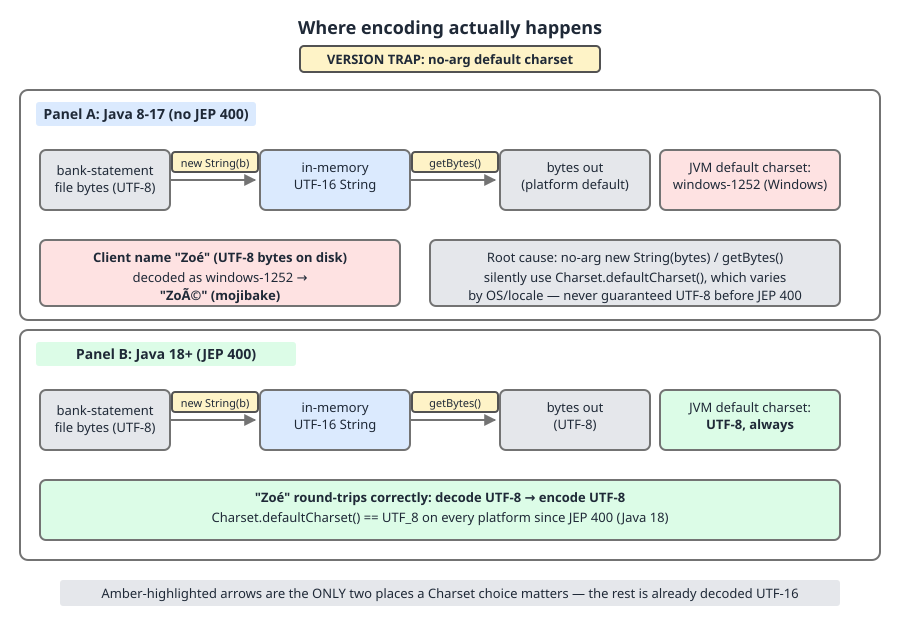
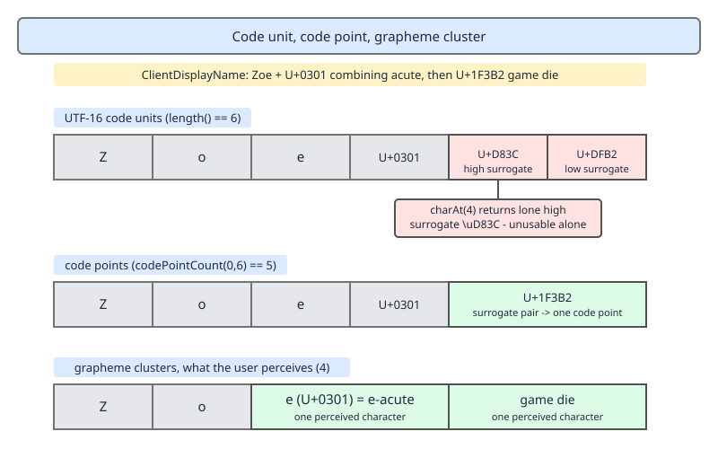

# 03 Java Core — Text, Unicode and encoding — INTERMEDIATE (§2.2, 2.2.13–2.2.24)

**Target version: Java 21 LTS.** | **Part 2 of 5** | [Index](../00-index.md)
Previous: [`String` performance and formatting](02-performance-and-text.md) · Next: [`String` internals](03-internals-string.md)

## The map: three boundaries where text goes wrong

The previous file was about the cost of *building* a string. This one is about the three boundaries where a string that was built correctly still comes out wrong.

| Boundary | What crosses it | The mechanism that decides correctness | The classic failure |
|---|---|---|---|
| **Pattern boundary** — `matches`, `replaceAll`, `split` | client-supplied text against a pattern | a backtracking engine compiled from pattern *and* replacement grammars | a recompiled `Pattern` per call; ReDoS on nested quantifiers |
| **Byte boundary** — `getBytes`, `new String(byte[], …)` | bytes to and from files, sockets, databases | the `Charset` you named, or the default one you did not | mojibake; silent U+FFFD substitution |
| **Human boundary** — `length`, `substring`, `equals`, `toLowerCase` | text you index, cut, compare or case-fold | code unit vs code point vs grapheme cluster; normalisation form; locale | a split surrogate pair; two identical names that are unequal |

Nothing in `substring`, `equals`, `charAt` or `+` involves a charset. Encoding exists at exactly one pair of methods, and everything mojibake-shaped in production is one of those two calls being handed the wrong argument.

---

## Regex cost and correctness (2.2.13, 2.2.14, 2.2.15)

A `Pattern` is a compiled program. `Pattern.compile` parses the pattern text into a linked chain of `Node` objects, each with a `match(Matcher, int, CharSequence)` method that either advances to the next node or returns false; a `Matcher` is the mutable execution state — the input, the region bounds, the group start/end arrays. The chain is immutable and thread-safe; the `Matcher` is neither. That split is the entire cost story and half the correctness story.

### Why it exists in this shape

`java.util.regex` chose backtracking over a finite automaton deliberately, because backreferences, lookaround and lazy quantifiers are not expressible in a DFA. The price of that expressiveness is that the engine explores a search tree rather than walking the input once — which is fine for the patterns you write and catastrophic for the patterns an attacker writes input for.

### `matches` anchors; `replaceAll` interprets the replacement (2.2.13)

`String.matches` requires the **entire input** to match: it delegates to `Pattern.matches`, which calls `matcher.matches()`, not `find()`. So `"CPN-2024-XY99 extra".matches("CPN-\\d{4}-[A-Z]{2}\\d{2}")` is `false`, while the same pattern with `find()` would be `true`. Leading `^` and trailing `$` in a `matches` pattern are therefore redundant — harmless, and worth writing anyway so the pattern still means the same thing if someone moves it to a `find()` call site.

**Pitfall:** the belief is "the replacement string in `replaceAll` is literal text". It is not — the replacement has its own small grammar. `$1` interpolates capture group 1, `${name}` interpolates a named group, a bare `$` followed by a non-digit throws `IllegalArgumentException: Illegal group reference`, and `\` escapes the next character. Symptom: a client-supplied coupon description containing `$` or `\` — perfectly legal input — makes `replaceAll` throw inside `BonusService`, converting a validation problem into a 500 and an alert at 03:00. Fix: `Matcher.quoteReplacement(text)` around any replacement that is data, and `Pattern.quote(text)` around any pattern that is data. Java 9 added `Matcher.replaceAll(Function<MatchResult, String>)`, whose return value is used **literally** with no `$` interpretation at all — the cleanest fix when the replacement is computed.

### Compile once (2.2.14)

`String.matches`, `String.replaceAll`, `String.replaceFirst` and `String.split` (outside its single-character fast path) all call `Pattern.compile` internally and then throw the compiled pattern away when they return. There is no pattern cache anywhere in `String` or `Pattern`, and there never has been in any JDK version.

The arithmetic for `BonusService` coupon validation at 3,100 bonus grants per day. The pattern `^CPN-[0-9]{4}-[A-Z]{2}[0-9]{2}$` is 30 characters and expands to a node chain with a distinct object per literal run, per character class and per bounded quantifier — on the order of a dozen `Node` instances, plus the `Pattern` itself, plus the `int[]` temporaries the parser uses, plus a `Matcher` with two `int[]` group arrays. Call it 15-plus allocations and a full 30-character parse. The match itself then inspects at most 13 characters of a 13-character coupon and never backtracks, because every quantifier is bounded.

So `String.matches` here does **more allocation and more character inspection to build the matcher than to run the match** — 3,100 times a day for successful grants, plus once per *rejected* attempt, and rejected attempts are unbounded because the coupon string is client-supplied. Hoisting the pattern to a `static final` field drops the steady-state per-call cost to exactly one `Matcher` allocation, and moves the compile to class initialisation where it happens once per JVM.

**Pitfall:** the belief is "`String.matches` caches the compiled pattern". It does not. Symptom: a validation method that reads as O(input) and is really O(pattern) + O(input), with allocation proportional to pattern complexity rather than input size — so making the pattern stricter makes the method slower, which is the opposite of the intuition.

### Catastrophic backtracking (2.2.15)

When a pattern contains nested quantifiers over overlapping character classes — the canonical shape is `(a+)+b` — the number of ways the engine can partition the input among the quantifiers grows exponentially in the input length. On a **non-matching** input the engine must try all of them before it can conclude failure. Twenty-four `a` characters against `(a+)+b` is on the order of 2²⁴ partitions; each additional character doubles it.

Because the coupon string arrives from the client, that is a denial-of-service vector with an unusually good ratio for the attacker: one HTTP request of 40 bytes occupies one request thread for minutes. With Tomcat's default 200 threads, 200 such requests take the whole `ApplicationGateway` offline, and no `ClientRestrictions` check ever runs because the request never gets that far. It presents as a CPU-saturation incident with no obvious hot endpoint, because the thread dump shows 200 threads inside `Pattern$Curly.match`.

The defences, in order of preference:

1. **Bound every quantifier.** `{4}`, `{2}`, `{1,64}` — never `+` or `*` nested inside another `+` or `*`.
2. **Possessive quantifiers or atomic groups.** `[0-9]++` and `(?>[0-9]+)` both forbid the engine from re-partitioning what they matched, which removes the exponential outright at the cost of rejecting some inputs a greedy pattern would accept.
3. **Length-gate before matching.** A cheap `length()` check bounds the exponent even if the pattern is imperfect.
4. **Timeout for genuinely untrusted patterns.** `java.util.regex` has no built-in match timeout, so the only mechanism is running the match on a bounded executor and abandoning the task — and note that `Matcher.matches()` does not check interrupts, so the thread leaks. That is the reason this is fourth and not first.

Guide 13 (Web security) covers ReDoS alongside the other input-driven resource exhaustions and the pattern-review checklist.

```java
public final class BonusService {

    // Compiled once at class initialisation. Fully anchored, every quantifier bounded.
    private static final Pattern COUPON = Pattern.compile("^CPN-[0-9]{4}-[A-Z]{2}[0-9]{2}$");
    private static final int COUPON_LENGTH = 13;
    private static final BigDecimal BONUS_RATE = new BigDecimal("0.10");
    private static final BigDecimal BONUS_CAP = new BigDecimal("100");

    private final Clock clock;

    BonusService(Clock clock) {
        this.clock = clock;
    }

    public boolean isCouponWellFormed(String supplied) {
        if (supplied == null || supplied.length() != COUPON_LENGTH) {
            return false;                        // length gate runs before the engine does
        }
        return COUPON.matcher(supplied).matches();
    }

    public Money grantFirstDepositBonus(Client client, Money deposit, String coupon) {
        if (!isCouponWellFormed(coupon)) {
            throw new BonusIneligibleException("malformed coupon");
        }
        if (Duration.between(client.registeredAt(), clock.instant()).toDays() > 14) {
            throw new BonusIneligibleException("coupon window expired");
        }
        BigDecimal capped = deposit.amount().multiply(BONUS_RATE).min(BONUS_CAP);
        return new Money(capped.setScale(2, RoundingMode.DOWN), deposit.currency());
    }
}
```

**Interview:** "How do you make regex validation safe and fast?" — a `static final Pattern`, fully anchored, every quantifier bounded or possessive, and a length check before the match; `String.matches` recompiles on every call, and an unbounded nested quantifier over client input is a ReDoS.

> **Definition.** A `Pattern` is a compiled, thread-safe node chain and a `Matcher` is the per-use mutable state; the cost model is compile-once-match-many, and the correctness model is that the pattern *and* the `replaceAll` replacement are both grammars, not literals.

### Supporting: the rest of the regex surface (2.2.16)

| Member | What it does | Watch for |
|---|---|---|
| `Pattern.quote(s)` | wraps `s` in `\Q` and `\E` so it matches literally | the only safe way to build a pattern from client input |
| `Matcher.quoteReplacement(s)` | escapes `$` and `\` in a replacement | needed whenever the replacement is data |
| `Pattern.split(input, limit)` | splits without recompiling per call | `limit` 0 drops trailing empty strings, negative keeps them, positive caps the array |
| named groups | `(?<coupon>CPN-[0-9]{4})`, read with `group("coupon")` | names are `[a-zA-Z][a-zA-Z0-9]*` only — no underscores, no digits first |
| `Matcher.results()` | Java 9: a lazy `Stream<MatchResult>` over every match | the `Matcher` must not be advanced while the stream is open |
| `Pattern.asMatchPredicate()` | Java 11: a `Predicate<String>` using `matches()` semantics | pairs well with a `static final` pattern in a Bean Validation validator |

---

## Where encoding actually happens (2.2.17, 2.2.18, 2.2.19)

A `String` has no charset. In memory it is a `byte[]` plus a `coder` flag: LATIN1, one byte per character, used when every code point is ≤ U+00FF; or UTF-16, two bytes per code unit. Both are internal *representations* of the same abstract sequence of UTF-16 code units, chosen by the JVM for footprint and invisible to your code.

### Why it exists this way

Java 1.0 fixed `char` as 16 bits when Unicode was a 16-bit standard, so UTF-16 code units became the abstract model of the API and cannot change. Compact strings (JEP 254, Java 9) then decoupled the *storage* from that model, which is why `coder` exists and why `length()` still reports UTF-16 code units regardless of how the bytes are actually laid out.

### The two boundaries

Encoding happens at exactly two places and nowhere else: **`new String(byte[], Charset)` decodes** bytes into the internal representation, and **`getBytes(Charset)` encodes** the internal representation back out. Reading a file, writing a socket, and storing a database column are all one of those two calls somewhere underneath.



**D-068** — Where encoding actually happens: trace the bytes left to right through the decode boundary into UTF-16-in-memory and back out through the encode boundary, and note the split panel at the bottom showing the no-arg form resolving to a platform charset on Java 17 versus always UTF-8 on Java 18 and later.

### The no-arg forms, and the version trap (2.2.18)

`getBytes()` and `new String(byte[])` use the **default charset**.

- **Java 18 and later, so Java 21: the default charset is UTF-8, always, on every platform.** JEP 400 made it so.
- **Java 17 and earlier: it was platform-dependent** — derived from the host locale and overridable with `-Dfile.encoding`. On a Linux container with `LANG=C` it was `US-ASCII`; on a Windows host in Western Europe it was `windows-1252`; on macOS it was typically UTF-8. The same jar produced different bytes on different machines, which is exactly the bug JEP 400 closed.

**Pitfall:** the belief is "the no-arg form is fine now that Java 18 fixed the default". It is fine only if every *producer and consumer* of those bytes is also on 18 or later. Symptom: `BankWithdrawal` on Java 21 writes the payout file with `getBytes()` as UTF-8, and the partner's reconciliation tool — or your own Java 17 batch job — decodes it with `windows-1252`, so a client display name `Zoé` from `PersonalDetails` becomes `Zoé`. The byte arithmetic: `Zoé` is `5A 6F C3 A9` in UTF-8, four bytes for three characters, because U+00E9 needs two. windows-1252 is a single-byte charset, so it reads four characters: `Z`, `o`, then `0xC3` = U+00C3 `Ã` and `0xA9` = U+00A9 `©`. Fix: name the charset explicitly at both boundaries, forever. `getBytes(StandardCharsets.UTF_8)` is not verbosity, it is the specification of the file format written down where it is enforced.

The second half of the trap: on Java 21 `new String(bytes)` **never throws** on malformed input. Both the no-arg and the `Charset` constructors use `CodingErrorAction.REPLACE`, substituting U+FFFD for anything that does not decode. Only an explicit `CharsetDecoder` configured with `onMalformedInput(REPORT)` tells you the bytes were wrong. Silent U+FFFD in a client name is how bad decoding survives all the way to the database and becomes permanent.

### The three properties (2.2.19)

| Property | Meaning in Java 21 | Settable at launch? |
|---|---|---|
| `file.encoding` | reports the default charset. Only `UTF-8` and `COMPAT` are recognised values; anything else is ignored and UTF-8 is used | yes, but only those two values do anything |
| `native.encoding` | new in Java 18: the host environment's charset, exposed separately from the default charset | no, read-only |
| `sun.jnu.encoding` | the charset used for filesystem path names and other native-interface strings | platform-derived, not a supported knob |

`-Dfile.encoding=UTF-8` was the standard fix on Java 8 through 17 and is now a no-op that merely restates the default. `-Dfile.encoding=COMPAT` is the JEP 400 escape hatch: it restores the pre-18 behaviour by setting the default charset to `native.encoding`. Reach for `COMPAT` only as a temporary bridge while a legacy consumer is migrated, give it an expiry date, and log which charset you actually got at startup so the bridge is visible.

```java
public final class BankWithdrawal {

    private static final Charset PARTNER_CHARSET = StandardCharsets.UTF_8;

    public void writePayoutFile(Path target, String content) throws IOException {
        // Explicit charset at the encode boundary. The file format is a contract.
        Files.write(target, content.getBytes(PARTNER_CHARSET),
                StandardOpenOption.CREATE, StandardOpenOption.TRUNCATE_EXISTING);
    }

    public String readSettlementFile(Path source) throws IOException {
        // REPORT, not REPLACE: bad bytes from the partner must fail loudly, not become U+FFFD.
        CharsetDecoder decoder = PARTNER_CHARSET.newDecoder()
                .onMalformedInput(CodingErrorAction.REPORT)
                .onUnmappableCharacter(CodingErrorAction.REPORT);
        ByteBuffer bytes = ByteBuffer.wrap(Files.readAllBytes(source));
        try {
            return decoder.decode(bytes).toString();
        } catch (CharacterCodingException e) {
            throw new IOException("settlement file is not valid " + PARTNER_CHARSET.name(), e);
        }
    }
}
```

The cost of `REPORT` over the default `REPLACE` is that a single corrupt byte fails the whole 7,000-row settlement file rather than one field. The escape hatch is to decode row by row and quarantine the failures into `SUSPENSE` rather than rejecting the batch — which is the right design, and it is still built on `REPORT`, because you cannot quarantine a failure you were never told about.

> **Definition.** A `String` is charset-free UTF-16 code units in memory; encoding exists only at `getBytes(Charset)` and `new String(byte[], Charset)`, and the no-arg forms of those are UTF-8 from Java 18 (JEP 400) and platform-dependent before it.

---

## Code unit, code point, grapheme cluster (2.2.20 – 2.2.23)

Three counts answering three different questions, and human intuition matches only the third.

| Level | What it is | How to count it | The `NotificationService` question it answers |
|---|---|---|---|
| **code unit** | one 16-bit `char` of the UTF-16 sequence | `length()`, `charAt(i)` | how much array does this occupy |
| **code point** | one Unicode scalar value, U+0000–U+10FFFF | `codePointCount(0, length())`, `codePoints()` | how many Unicode characters is this |
| **grapheme cluster** | what a reader calls "one character" | `BreakIterator.getCharacterInstance(locale)` | how wide will this render, and where may I cut it |

`length()` counts **code units**, and the javadoc says exactly that: "the number of `char` values in the sequence". It is not a character count and never was.

### Why the mismatch exists

Unicode outgrew 16 bits in version 2.0 (1996), after Java had already fixed `char` at 16 bits and exposed it across the whole API. Surrogate pairs were the compatibility answer: encode the 17 planes above U+FFFF as two reserved code units. So `length()` is not wrong, it is answering the storage question with the API's original vocabulary — and the reader's question was never the storage question.

### The arithmetic, proved (2.2.21)

Take a client display name from `PersonalDetails` built as `Z`, `o`, `e`, U+0301 (combining acute accent), U+1F3B2 (a game-die emoji).

- U+1F3B2 is above U+FFFF, so UTF-16 stores it as a surrogate pair, and the bit arithmetic is worth doing once. `0x1F3B2 − 0x10000 = 0xF3B2`, which as a 20-bit value is `0000 1111 0011 1011 0010`. The high 10 bits are `0000111100` = 0x03C, so the high surrogate is `0xD800 + 0x03C = 0xD83C`. The low 10 bits are `1110110010` = 0x3B2, so the low surrogate is `0xDC00 + 0x3B2 = 0xDFB2`. Check it back: `(0x03C << 10) | 0x3B2 = 61,440 + 946 = 62,386 = 0xF3B2`. Two code units, four bytes of the UTF-16 backing array, one code point.
- **`length()` = 6**: `Z`, `o`, `e`, U+0301, `\uD83C`, `\uDFB2`. Because U+0301 and the surrogates all exceed U+00FF, the whole string is stored UTF-16, so the backing array is 12 bytes.
- **`codePointCount(0, 6)` = 5**: the surrogate pair counts once; the combining accent is a code point in its own right.
- **grapheme clusters = 4**: `Z`, `o`, `e`+U+0301 as one cluster, and the emoji.
- **`charAt(4)` = `\uD83C`** — a lone high surrogate, which is not a character. `Character.isHighSurrogate(name.charAt(4))` is `true` and `Character.getType` reports `SURROGATE`.



**D-067** — Code unit, code point, grapheme cluster: read the four aligned rows for the same display name and note where the boundaries disagree — the combining accent merges two code points into one cluster, the emoji splits one code point into two code units, and the `charAt` callout shows the lone surrogate you get by indexing into the middle of a pair.

**Pitfall:** the belief is "`length()` gives me the number of characters, so `substring(0, 5)` gives me a five-character prefix". `NotificationService` truncates the display name to fit a fixed-width SMS field with `name.substring(0, 5)`, which cuts between `\uD83C` and `\uDFB2`. The result ends in an unpaired high surrogate. Symptom: encoding it to UTF-8 substitutes `?` (byte 0x3F), because a lone surrogate has no UTF-8 representation and the default encoder action is REPLACE; downstream the name renders with a replacement glyph, and a strict JSON serialiser rejects the whole payload rather than emitting an invalid `\uD83C` escape. Fix: cut on a grapheme-cluster boundary.

### Iterating text correctly (2.2.22)

```java
public final class NotificationService {

    /** Truncate to at most maxClusters grapheme clusters — never splits a pair or an accent. */
    public static String truncateForDisplay(String name, int maxClusters) {
        BreakIterator clusters = BreakIterator.getCharacterInstance(Locale.ROOT);
        clusters.setText(name);
        int end = clusters.first();
        int taken = 0;
        while (taken < maxClusters) {
            int next = clusters.next();
            if (next == BreakIterator.DONE) {
                return name;                     // already shorter than the limit
            }
            end = next;
            taken++;
        }
        return name.substring(0, end);
    }

    /** Code-point iteration: correct for surrogate pairs, still splits combining marks. */
    public static List<String> codePointsOf(String name) {
        List<String> out = new ArrayList<>();
        for (int i = 0; i < name.length(); ) {
            int codePoint = name.codePointAt(i);
            out.add(new String(Character.toChars(codePoint)));
            i = name.offsetByCodePoints(i, 1);   // advances 1 or 2 units, whichever is right
        }
        return out;
    }

    public static long visibleCodePoints(String name) {
        return name.codePoints().count();
    }
}
```

`offsetByCodePoints(index, n)` is the correct way to advance: it consults `Character.isHighSurrogate` and steps two units where a pair demands it, which is precisely why a bare `i++` is the bug. `codePoints()` gives the same walk as an `IntStream` and is the right tool when you are counting or filtering rather than slicing. `BreakIterator.getCharacterInstance` is the only one of the three that knows about combining marks — and it is locale-sensitive, and it is **not thread-safe**, so create one per use or hold it in a `ThreadLocal`; a `static final BreakIterator` shared across 14k concurrent sessions is a data race that produces wrong offsets rather than an exception.

The cost: `BreakIterator` is materially more expensive than `codePoints()` — it consults Unicode break-property tables and allocates per instance. Use `codePoints()` when you only need a count that is right for surrogate pairs, and pay for `BreakIterator` only where you actually cut or reverse human text.

### Normalisation (2.2.23)

The same visible text has more than one legal Unicode encoding. `é` is either U+00E9 precomposed (NFC) or `e` followed by U+0301 decomposed (NFD). `String.equals` compares code units, so those two strings are **not equal**, do not share a `hashCode`, and land in different `HashMap` buckets.

**Pitfall:** the belief is "two names that look identical are equal". A macOS client uploads a document whose filename is NFD — HFS+ normalised to NFD, and APFS preserves whatever it is given — while the web form submits the same name as NFC. `DocumentVerification` cannot match the upload to its `DocumentRequirement`, so the requirement stays `AA-600 DOCUMENTS_REQUESTED` while the client sees the file as uploaded, and the application stalls short of `AA-611 DOCUMENTS_VERIFIED`. Symptom: duplicate `PersonId` rows, lookups that fail for one client in a thousand, and a unique index that lets two visually identical names through. Fix: normalise at the input boundary, once, and store only the normalised form.

```java
String canonicalName = Normalizer.normalize(supplied, Normalizer.Form.NFC);
boolean alreadyCanonical = Normalizer.isNormalized(supplied, Normalizer.Form.NFC);
```

`isNormalized` is the cheap guard — check it first and skip the allocation when the input is already canonical, which it will be for the overwhelming majority of submissions.

| Form | What it does | Use it for | Cost |
|---|---|---|---|
| NFC | composes to precomposed characters where one exists | storage, comparison, hashing — the default choice | shortest output, so smallest arrays downstream |
| NFD | decomposes to base plus combining marks | accent-insensitive search: decompose, then strip `\p{M}` | longer strings, so higher `length()` for the same text |
| NFKC / NFKD | additionally fold compatibility characters — `fi` becomes `fi`, superscript `²` becomes `2` | search keys only | **destructive** — never store the result as the client's name |

### Supporting: case-insensitive comparison (2.2.24)

| Mechanism | Semantics | Locale | Cost | Use for |
|---|---|---|---|---|
| `a.equalsIgnoreCase(b)` | per-code-unit `toUpperCase`/`toLowerCase`, locale-**independent** | none | O(n), zero allocation, early exit on length mismatch | protocol tokens, status codes, header names |
| `a.toLowerCase(Locale.ROOT).equals(b.toLowerCase(Locale.ROOT))` | full locale-independent case mapping, and it handles multi-character mappings such as `ß` to `SS` under `toUpperCase` | ROOT, stated explicitly | O(n) plus two `String` allocations | canonicalising a value you will store, hash or index |
| `Collator.getInstance(locale)` with `setStrength(Collator.SECONDARY)` | locale-aware collation: ignores case, respects accent rules and language-specific ordering | the user's locale | O(n) plus collation-key construction; not thread-safe | sorting and matching human-facing text |

The difference between the first two is not just allocation: `equalsIgnoreCase` compares one code unit at a time, so it cannot see a mapping where one character becomes two. `toLowerCase`/`toUpperCase` on the whole string can. That makes `equalsIgnoreCase` the right tool for ASCII-shaped machine tokens and the wrong tool for human text.

The locale trap, once more: the no-arg `toLowerCase()` uses the **default locale**. On a JVM running with the Turkish locale, `"TITLE".toLowerCase()` produces `tıtle` with a dotless `ı` (U+0131), which does not equal `"title"`. Symptom: a `StatusCode` comparison or a `RestrictionType` lookup that passes every test everywhere and fails on one host in one region. Fix: `toLowerCase(Locale.ROOT)` for every machine-facing comparison, and reserve the locale-sensitive overload for text you are about to render to a human. For sorting a client list, neither is right — use a `Collator` for the user's locale, because `String.compareTo` orders by code unit, which puts every accented name after `Z`.

> **Definition.** `length()` counts UTF-16 code units, `codePointCount` counts Unicode scalar values, and only `BreakIterator.getCharacterInstance` counts what a reader calls a character; normalisation decides whether two visually identical strings are `equals`, and locale decides what case-folding means.

---

## Pitfalls

### Calling `String.matches` in a hot path

**Wrong**
```java
if (coupon.matches("^CPN-[0-9]{4}-[A-Z]{2}[0-9]{2}$")) {   // full Pattern.compile on every call
```

**Right**
```java
private static final Pattern COUPON = Pattern.compile("^CPN-[0-9]{4}-[A-Z]{2}[0-9]{2}$");
if (coupon != null && coupon.length() == 13 && COUPON.matcher(coupon).matches()) {
```

**Why people believe it:** the method lives on `String`, so it reads like `startsWith` — a cheap primitive. Nothing in the signature hints that there is a compiler behind it.

### Passing client text as a `replaceAll` replacement

**Wrong**
```java
return template.replaceAll("COUPON", suppliedCode);   // throws if suppliedCode contains $ or \
```

**Right**
```java
return template.replaceAll("COUPON", Matcher.quoteReplacement(suppliedCode));
```

**Why people believe it:** every tutorial explains that `$` and `\` are special in the *pattern*, and none mention that the replacement has a grammar of its own.

### An unbounded nested quantifier over client input

**Wrong**
```java
private static final Pattern COUPON = Pattern.compile("^(CPN-)+([A-Za-z0-9]+)+$");   // ReDoS
```

**Right**
```java
private static final Pattern COUPON = Pattern.compile("^CPN-[0-9]{4}-[A-Z]{2}[0-9]{2}$");
// or, where the shape must stay flexible, possessive: ^(?:CPN-)?+[A-Za-z0-9]{1,32}+$
```

**Why people believe it:** the pattern is correct — it accepts exactly the right strings. Its failure mode is only visible on inputs it *rejects*, which is the set nobody writes tests for.

### Writing bytes without naming the charset

**Wrong**
```java
Files.write(payoutFile, content.getBytes());   // UTF-8 on Java 21, windows-1252 on the Java 17 consumer
```

**Right**
```java
Files.write(payoutFile, content.getBytes(StandardCharsets.UTF_8));
```

**Why people believe it:** JEP 400 fixed the *producer*, so on one modern JVM the no-arg form now looks safe. The file format is a contract with a consumer whose JVM version you do not control.

### Truncating a display name by code units

**Wrong**
```java
String shortName = name.substring(0, 5);   // cuts the surrogate pair, leaves a lone high surrogate
```

**Right**
```java
String shortName = NotificationService.truncateForDisplay(name, 4);   // grapheme-cluster boundary
```

**Why people believe it:** `length()` is documented as a length, and every ASCII test passes. The first emoji in a client name is the first failure.

### Comparing names that render identically

**Wrong**
```java
if (uploaded.fileName().equals(requirement.expectedName())) {   // NFD vs NFC, so false
```

**Right**
```java
if (Normalizer.normalize(uploaded.fileName(), Normalizer.Form.NFC)
        .equals(Normalizer.normalize(requirement.expectedName(), Normalizer.Form.NFC))) {
```

**Why people believe it:** the two strings are pixel-identical in every log, editor, terminal and bug report, so the evidence in front of you says they are the same string.

---

## Cheat sheet

| Fact | Value |
|---|---|
| `String.matches` | anchors the whole input (`matches()`, not `find()`) and recompiles the pattern every call |
| No pattern cache | `matches`, `replaceAll`, `replaceFirst`, `split` all compile and discard; no JDK version caches |
| Compile once | `private static final Pattern`, then one `Matcher` per call |
| `Pattern` vs `Matcher` | `Pattern` immutable and thread-safe; `Matcher` mutable, never shared |
| `replaceAll` replacement grammar | `$1`, `${name}`, `\` escape; bare `$` throws → `Matcher.quoteReplacement` |
| Literal pattern text | `Pattern.quote(s)`, which wraps in `\Q` and `\E` |
| ReDoS shape | nested quantifiers over overlapping classes, e.g. `(a+)+b`; exponential on **non**-matching input |
| ReDoS fixes | bound quantifiers, possessive `++`, atomic `(?>…)`, length gate; no built-in match timeout |
| `Pattern.split` limit | 0 drops trailing empties, negative keeps them, positive caps the array |
| Named groups | `(?<name>…)`, names are `[a-zA-Z][a-zA-Z0-9]*` only |
| `Matcher.results()` | Java 9, lazy `Stream<MatchResult>`; `asMatchPredicate()` is Java 11 |
| Encoding boundaries | only `getBytes(Charset)` and `new String(byte[], Charset)` |
| Default charset | UTF-8 since Java 18 (JEP 400); platform-dependent on 17 and earlier |
| `native.encoding` | Java 18+, read-only, the host's charset |
| `-Dfile.encoding` | only `UTF-8` (a no-op) and `COMPAT` (pre-18 behaviour) are honoured |
| Malformed bytes | `new String(bytes, cs)` silently substitutes U+FFFD; use a `CharsetDecoder` with REPORT to fail |
| `é` in UTF-8 | `C3 A9`; read as windows-1252 it becomes `é` |
| `length()` | UTF-16 code units, not characters |
| Emoji above U+FFFF | `length() == 2`, `codePointCount == 1`, `charAt` returns a lone surrogate |
| Lone surrogate encoded to UTF-8 | `?` (0x3F), because it has no valid UTF-8 form |
| Correct walks | `codePoints()`, `offsetByCodePoints`; `BreakIterator.getCharacterInstance` for clusters |
| `BreakIterator` | locale-sensitive and **not** thread-safe — per use or `ThreadLocal` |
| Normalisation | NFC to store and compare, NFD for accent-stripping, NFKC/NFKD for search keys only |
| `Normalizer.isNormalized` | cheap guard — check before paying for `normalize` |
| Case-insensitive | `equalsIgnoreCase` (locale-free, no allocation) → `toLowerCase(Locale.ROOT)` → `Collator` SECONDARY |
| Turkish trap | `"TITLE".toLowerCase()` is `tıtle` under a Turkish default locale |
| Sorting human text | `String.compareTo` orders by code unit; use a `Collator` |

---

## Self-test

**Q1.** `coupon.matches("^CPN-[0-9]{4}$")` runs 3,100 times a day. What exactly is wasteful, and how much does hoisting the pattern save?

<details><summary>Answer</summary>

`String.matches` delegates to `Pattern.matches`, which calls `Pattern.compile` on every invocation and discards the result on return. There is no pattern cache in `String` or `Pattern` in any JDK version. Each call therefore parses the pattern text and allocates a node chain — an object per literal run, per character class and per bounded quantifier — plus the `Pattern`, the parser's temporaries, and a `Matcher` with its group arrays. For a 30-character pattern against a 13-character coupon that is more allocation and more character inspection to *build* the matcher than to *run* it, and the count is unbounded because rejected client attempts also hit it. Hoisting to a `static final Pattern` moves the compile to class initialisation, once per JVM, leaving one `Matcher` allocation per call. Note the counter-intuitive consequence of the un-hoisted form: making the pattern stricter makes the method slower.

</details>

**Q2.** `^(CPN-)+([A-Za-z0-9]+)+$` accepts exactly the coupons you want. Why is it a production incident waiting to happen?

<details><summary>Answer</summary>

Catastrophic backtracking. `java.util.regex` is a backtracking engine, not an automaton, so nested quantifiers over overlapping character classes give it an exponential number of ways to partition the input, and on a **non-matching** input it must try all of them before it can report failure. A 40-byte crafted string can occupy a thread for minutes. Since the coupon is client-supplied that is a denial of service: with Tomcat's default 200 threads, 200 requests take `ApplicationGateway` offline, and it presents as unexplained CPU saturation with 200 threads parked in `Pattern$Curly.match`. The fixes in order: bound every quantifier (`{4}`, `{1,32}`), use possessive quantifiers `++` or atomic groups `(?>…)` so the engine cannot re-partition, gate on `length()` first, and only then consider a bounded executor — `java.util.regex` has no match timeout and `matches()` does not check interrupts, so a cancelled task leaks its thread.

</details>

**Q3.** A display name is `Z`, `o`, `e`, U+0301, U+1F3B2. Give `length()`, `codePointCount`, the grapheme-cluster count, and `charAt(4)`.

<details><summary>Answer</summary>

`length()` is 6. U+1F3B2 is above U+FFFF so UTF-16 stores it as a surrogate pair: `0x1F3B2 − 0x10000 = 0xF3B2`, high 10 bits `0x03C` giving `0xD800 + 0x03C = 0xD83C`, low 10 bits `0x3B2` giving `0xDC00 + 0x3B2 = 0xDFB2`. So the units are `Z`, `o`, `e`, U+0301, `\uD83C`, `\uDFB2`. `codePointCount(0, 6)` is 5 — the pair counts once, and the combining accent is its own code point. There are 4 grapheme clusters: `Z`, `o`, `e`+U+0301, and the emoji. `charAt(4)` is `\uD83C`, a lone high surrogate that is not a character at all; encoding it to UTF-8 with the default REPLACE action yields `?` (0x3F), and a strict JSON serialiser rejects it outright. That is why fixed-width truncation must cut on a `BreakIterator.getCharacterInstance` boundary, not at `substring(0, 5)`.

</details>

**Q4.** A payout file written on Java 21 with `content.getBytes()` reads as mojibake at the partner. Diagnose it and give the fix, including the byte arithmetic.

<details><summary>Answer</summary>

`getBytes()` uses the default charset, which since Java 18 (JEP 400) is UTF-8 on every platform. The consumer decodes with something else — commonly `windows-1252`, a plausible default charset on Java 17 and earlier. `é` is U+00E9, which UTF-8 encodes as the two bytes `C3 A9`; windows-1252 is single-byte, so it reads two characters, `0xC3` = `Ã` and `0xA9` = `©`, and `Zoé` becomes `Zoé`. Fix: name the charset explicitly at both boundaries — `getBytes(StandardCharsets.UTF_8)` and `new String(bytes, StandardCharsets.UTF_8)` — because the file format is a contract with a JVM you do not control. Add a `CharsetDecoder` with `onMalformedInput(REPORT)` on the read side, since both `String` constructors default to `CodingErrorAction.REPLACE` and will silently write U+FFFD into your database instead of telling you the bytes were wrong.

</details>

**Q5.** Two client display names render identically, but `equals` is false and their hash codes differ. What is happening, and where do you fix it?

<details><summary>Answer</summary>

Different Unicode normalisation forms. `é` is either the precomposed U+00E9 (NFC) or `e` followed by the combining acute U+0301 (NFD). `String.equals` and `hashCode` operate on code units, so the two are unequal and land in different `HashMap` buckets. The classic source is a filename from a macOS client (HFS+ normalised to NFD) matched against a web-form submission (NFC), which strands a `DocumentRequirement` at `AA-600 DOCUMENTS_REQUESTED`. Fix at the input boundary, not at the comparison: `Normalizer.normalize(s, Normalizer.Form.NFC)` on the way in, store only the normalised form, and guard it with the cheap `Normalizer.isNormalized` so you skip the allocation for the majority of already-canonical inputs. NFD is the right form for accent-insensitive search — decompose, then strip `\p{M}`. NFKC and NFKD fold compatibility characters (`fi` to `fi`, superscript `²` to `2`) and are destructive, so they belong in search keys and never in stored client data.

</details>

**Q6.** You need a case-insensitive match. When is `equalsIgnoreCase` right, when is `toLowerCase(Locale.ROOT)` right, and when do you need a `Collator`?

<details><summary>Answer</summary>

`equalsIgnoreCase` is locale-independent and allocation-free, with an early exit on length mismatch, so it is right for machine tokens — status codes, header names, rail names. Its limitation is that it compares one code unit at a time, so it cannot represent a case mapping where one character becomes two. `toLowerCase(Locale.ROOT)` applies full case mapping to the whole string, which handles those multi-character mappings, at the cost of two `String` allocations — use it when you are canonicalising a value you will store, hash or index. A `Collator` at `SECONDARY` strength is the only one that is locale-aware: it applies the language's own accent and ordering rules, and it is what you need for sorting or matching human-facing text, remembering that it is not thread-safe. The trap across all three is the no-arg `toLowerCase()`, which uses the default locale: under a Turkish locale `"TITLE".toLowerCase()` is `tıtle` with a dotless `ı`, so a lookup that passes everywhere fails on one host.

</details>

---

**Leaves covered:** 2.2.13–2.2.24 (12 leaves)
**Leaves deferred:** none
**Diagrams included:** D-067, D-068
**Target version:** Java 21 LTS
**Lines:** 471
