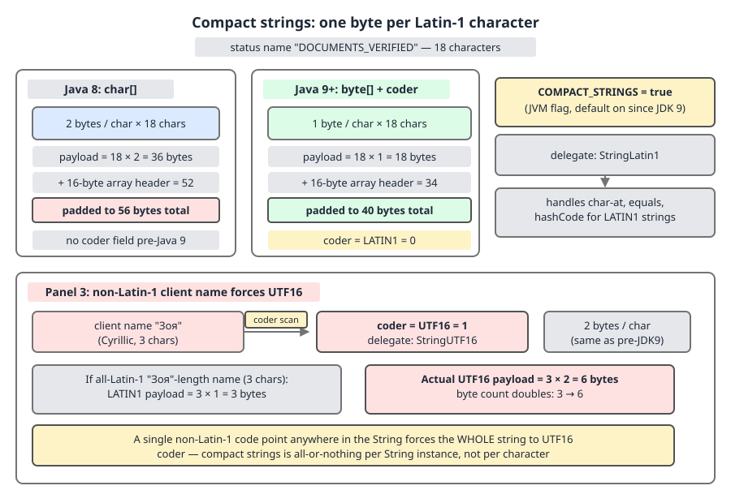

# 03 Java Core — `String` internals: layout and compact strings — INTERNALS (§3.2, 3.2.1–3.2.5, 3.2.16)

**Target version: Java 21 LTS.** | **Part 3 of 5** | [Index](../00-index.md)
Previous: [Text, Unicode and encoding](02b-text-and-encoding.md) · Next: [Hash and equality internals](03a-internals-hash-and-equality.md)

## The field set (3.2.1)

A `String` in Java 21 is a 24-byte shell pointing at a separately allocated byte array. Six declarations carry the whole design — read them before any mechanism.

```java
public final class String
    implements java.io.Serializable, Comparable<String>, CharSequence,
               Constable, ConstantDesc {

    @Stable
    private final byte[] value;

    private final byte coder;

    private int hash; // Default to 0

    private boolean hashIsZero; // Default to false;

    private static final long serialVersionUID = -6849794470754667710L;

    static final boolean COMPACT_STRINGS;

    static {
        COMPACT_STRINGS = true;
    }
```

Line by line: `@Stable` is a HotSpot-internal annotation telling C2 that the field is written once and may be treated as a constant after the first non-default read, which is what lets the JIT fold `"AA-801".length()` to a literal 6 (full treatment of `@Stable` and condy is in [03b](03b-internals-stringtable-and-interning.md)). `value` is `byte[]`, not `char[]` — that is the whole of JEP 254. `coder` is a single byte selecting the encoding of `value`. `hash` caches the hash code; `hashIsZero` disambiguates "not yet computed" from "computed, and it really is zero" — both are dissected in [03a](03a-internals-hash-and-equality.md). `serialVersionUID` is frozen at `-6849794470754667710L` so that a Java 8 serialized `String`, written from a `char[]`-backed instance, still deserialises into a `byte[]`-backed one — the serial form is the characters, not the layout. `COMPACT_STRINGS` is assigned in a static initialiser from the `-XX:±CompactStrings` VM flag, and being `static final` it is constant-folded by the JIT, so every `if (COMPACT_STRINGS)` in the class costs nothing at runtime.

| Field | Type | Width on heap | Since | What it buys |
|---|---|---|---|---|
| `value` | `byte[]` (`@Stable`) | 4 bytes (compressed `oop`) | 9 (was `char[]`) | One byte per Latin-1 character |
| `coder` | `byte` | 1 byte | 9 | Tells every method which of two layouts `value` holds |
| `hash` | `int` | 4 bytes | 1.0 | Caches the hash; benign data race, no synchronisation |
| `hashIsZero` | `boolean` | 1 byte | 13 | Stops re-hashing strings whose hash is genuinely 0 |
| `serialVersionUID` | `static final long` | 0 (static) | 1.0 | Wire compatibility across the `char[]` → `byte[]` change |
| `COMPACT_STRINGS` | `static final boolean` | 0 (static) | 9 | JIT-folded kill switch for the whole compaction scheme |

Two more constants, declared in `String` and used everywhere:

```java
    static final byte LATIN1 = 0;
    static final byte UTF16  = 1;
```

`LATIN1 = 0` is deliberate: `coder == 0` is the common case and compares against zero, the cheapest test a CPU has.

---

## 1. Compact strings and the memory arithmetic (3.2.2, 3.2.3, 3.2.16)

Picture two boxes. The left box is the `String` object itself: a header, a reference, an `int`, and two bytes — fixed at 24 bytes no matter how long the text is. The right box is the `byte[]`, and it is the only thing that grows. Compact strings is a change to the *width of one cell* in the right box: two bytes per character became one, whenever every character fits in Latin-1.

### Why it exists

Until Java 8, `value` was `char[]`, and a `char` is a UTF-16 code unit: always two bytes. JEP 254 states the motivation directly:

> Data gathered from many different applications indicates that strings are a major component of most heaps and, moreover, that most `String` objects contain only Latin-1 characters.

For `"DOCUMENTS_VERIFIED"` — 18 characters, all ASCII — Java 8 stored 36 bytes of payload of which 18 bytes were a zero high byte on every character. The pre-JEP-254 workarounds were application-level: store status codes as an `enum` ordinal, or as a `byte[]` you decode yourself. Both trade readability for bytes. Compaction moved the trade into the platform.

### The mechanism

`coder` is computed at construction. Everything downstream branches on it:

```java
    byte coder() {
        return COMPACT_STRINGS ? coder : UTF16;
    }

    private boolean isLatin1() {
        return COMPACT_STRINGS && coder == LATIN1;
    }

    public int length() {
        return value.length >> coder();
    }
```

`coder()` returns `UTF16` unconditionally when compaction is off, which is how a single flag disables every Latin-1 path without a second code base. `isLatin1()` is the same test phrased for the common direction. `length()` is the arithmetic that makes the layout visible: `value.length >> 0` for Latin-1 (one byte per character) and `value.length >> 1` for UTF-16 (two). A `String` therefore does not store its length; it derives it from the array length and the coder on every call.

### The saving, and the counter-case (3.2.3)

Do the arithmetic rather than quoting a percentage. Compressed `oop`s are assumed throughout — 12-byte object header, 4-byte reference, 8-byte alignment — which is the default for any heap below 32 GB, confirmed on Oracle JDK 21.0.7 (`UseCompressedOops = true`, `ObjectAlignmentInBytes = 8`).

`"DOCUMENTS_VERIFIED"`, 18 characters:

| | Java 8 (`char[]`) | Java 21 Latin-1 (`byte[]`) |
|---|---|---|
| `String` shell | 12 + 4 + 4 = 20, padded to **24** | 12 + 4 + 4 + 1 + 1 = 22, padded to **24** |
| Array header | 12 + 4 length = **16** | 12 + 4 length = **16** |
| Payload | 18 × 2 = **36** | 18 × 1 = **18** |
| Array total | 52, padded to **56** | 34, padded to **40** |
| **Grand total** | **80 bytes** | **64 bytes** |

16 bytes saved, 20% of the original. Now the counter-case. A `PersonalDetails` display name that is not Latin-1 — `"Łukasz Wiśniewski"`, 17 UTF-16 code units, `Ł` being U+0141 — forces `coder = UTF16`: shell 24 + array (16 + 34 = 50, padded to 56) = **80 bytes**, exactly what Java 8 charged. So the memory cost of a UTF-16 string under compaction is *not* worse; it is a wash. The real cost is CPU and code size: every operation now carries a coder branch, `length()` carries a shift, `charAt` on a UTF-16 string does two byte loads plus an `or`, and concatenating a Latin-1 string with a UTF-16 one must *inflate* the Latin-1 operand byte by byte. An application whose strings are overwhelmingly non-Latin-1 pays that branch and inflation for zero bytes back.

**Unverified:** the widely repeated "compact strings reclaim ~25% of the Java heap" figure. JEP 254 itself publishes no percentage, only the qualitative claim quoted above plus "prototyping work done to date confirms the expected reduction in memory footprint". The 25% number circulates via third-party write-ups (foojay.io, javaspecialists.eu Issue 306) and is workload-dependent by construction — it is a function of what fraction of your heap is `String` and what fraction of that is Latin-1. Measure your own heap with a histogram before quoting a number.



**D-093** — `"DOCUMENTS_VERIFIED"` as a Java 8 `char[]` (36 payload + 16 header = 52, padded to 56) against the Java 9+ `byte[]` (18 payload + 16 header = 34, padded to 40), with `LATIN1 = 0` and `COMPACT_STRINGS = true`; the third panel is the non-Latin-1 client display name forcing `UTF16 = 1`. Look at the padding rows — the alignment step, not the payload, decides several of these totals.

### The arithmetic in code

```java
record ClientId(UUID value) { }
record LedgerEntry(ClientId clientId, String position, String statusCode, Money amount) { }

final class LedgerFootprint {
    private static final int OBJECT_HEADER = 12;  // compressed oops, heap < 32 GB
    private static final int ARRAY_HEADER  = 16;  // 12-byte header + 4-byte length
    private static final int ALIGNMENT     = 8;   // ObjectAlignmentInBytes

    static int align(int bytes) {
        return (bytes + ALIGNMENT - 1) / ALIGNMENT * ALIGNMENT;
    }
    static boolean isLatin1(String text) {
        return text.chars().allMatch(codeUnit -> codeUnit <= 0xFF);
    }
    static int footprint(String text) {
        // shell = header + value ref (4) + hash (4) + coder (1) + hashIsZero (1)
        int shell = align(OBJECT_HEADER + 4 + 4 + 1 + 1);
        int bytesPerUnit = isLatin1(text) ? 1 : 2;
        return shell + align(ARRAY_HEADER + text.length() * bytesPerUnit);
    }

    static void report() {
        String status = "DOCUMENTS_VERIFIED";
        String displayName = "Łukasz Wiśniewski";
        System.out.println(footprint(status));        // 64
        System.out.println(footprint(displayName));   // 80
        long copiedPerRow = (long) footprint(status) * 19_800_000L;
        System.out.println(copiedPerRow / 1_048_576L + " MiB/day if copied per row");
    }
}
```

That prints 64, 80, and 1207 MiB. The last number is the one that matters operationally: the ledger writes ~19.8M entries per day, and if each `LedgerEntry` held its *own* copy of the status name, the status strings alone would be ~1.21 GiB of daily allocation churn. Sharing one instance instead — the JVM does this for free for string literals, and `intern()` does it for database-sourced strings, both covered in [03b](03b-internals-stringtable-and-interning.md) — reduces it to one 64-byte object plus a 4-byte reference per row, ~75 MiB of references. Under Java 8 the same per-row copies would have cost 19.8M × 80 = ~1.46 GiB, so compaction alone is worth ~250 MiB/day here.

| Latin-1 length | Payload | Array (padded) | Shell | Total |
|---|---|---|---|---|
| 0 (`""`) | 0 | 16 | 24 | **40** |
| 6 (`"AA-801"`) | 6 | 22 → 24 | 24 | **48** |
| 8 | 8 | 24 → 24 | 24 | **48** |
| 10 | 10 | 26 → 32 | 24 | **56** |
| 18 (`"DOCUMENTS_VERIFIED"`) | 18 | 34 → 40 | 24 | **64** |

**Insight:** the commonly quoted "a 10-character ASCII string is about 48 bytes" is off by one alignment step. 48 bytes is correct for **up to 8** Latin-1 characters; 10 characters land at 56 because 16 + 10 = 26 rounds up to 32. Padding, not payload, moves the total in 8-byte jumps — verify any figure of yours with JOL (`GraphLayout.parseInstance(text).toFootprint()`) rather than trusting the round number. Object layout, headers and `ObjectAlignmentInBytes` in full: **guide 06 JVM internals**. The self-contained rule you need for an interview: every Java object's size is (12-byte header + fields, arrays add a 4-byte length) rounded up to a multiple of 8, with references 4 bytes wide while the heap is under 32 GB.

**Pitfall:** believing compact strings made string operations faster across the board. They made *Latin-1* operations cheaper on memory and often on cache misses, and they made UTF-16 operations slightly *more expensive* on CPU by adding a branch and an inflation path. `-XX:-CompactStrings` exists precisely because that trade can go the wrong way.

### Turning it off (3.2.5)

`-XX:-CompactStrings` reverts `value` to two bytes per character for every string, forcing `coder()` to return `UTF16` always. It is a `{pd product}` flag, defaulting to `true` on all mainstream platforms (confirmed on JDK 21.0.7 macOS aarch64 via `java -XX:+PrintFlagsFinal -version`). It is the right choice in exactly one shape of application: heap is not the constraint, and essentially all string content is genuinely non-Latin-1 — CJK-dominated text processing, for example — so the coder branch and the Latin-1-to-UTF-16 inflation on concatenation are pure overhead. Measure before flipping it; if any meaningful share of your strings is ASCII you will lose more in footprint than you gain in branch elimination.

> **Compact strings** is the Java 9+ representation of `String` as a `byte[]` plus a one-byte `coder`, storing Latin-1 content at one byte per character and everything else as UTF-16, trading a coder branch on every operation for roughly half the payload on Latin-1 text.

---

## 2. `StringLatin1` and `StringUTF16` delegation (3.2.4)

`java.lang.String` is mostly a dispatcher. Almost every method is a coder test followed by a call into one of two package-private helper classes that do the real byte work: `StringLatin1` for one-byte-per-character arrays, `StringUTF16` for two. This is why the class is small and the JDK's string performance work happens somewhere else.

### Why it exists

The alternative would be one method body per operation containing both layouts interleaved — unreadable, and hostile to the JIT, because a method that handles both coders cannot be specialised on either. Splitting the implementations means each helper method sees a single layout, so it inlines small, vectorises well, and can be replaced wholesale by a HotSpot intrinsic.

### The mechanism

```java
    public char charAt(int index) {
        if (isLatin1()) {
            return StringLatin1.charAt(value, index);
        } else {
            return StringUTF16.charAt(value, index);
        }
    }
```

`isLatin1()` folds to a constant per call site once C2 has seen a stable coder, so one of the two arms usually disappears entirely. The helpers themselves are the byte arithmetic:

```java
// StringLatin1
    public static char charAt(byte[] value, int index) {
        if (index < 0 || index >= value.length) {
            throw new StringIndexOutOfBoundsException(index);
        }
        return (char)(value[index] & 0xff);
    }
```

`value[index] & 0xff` is the load: a Java `byte` is signed, so `(char) value[index]` alone would sign-extend `0x80`–`0xFF` into the wrong code point. The mask is not optional. `StringUTF16.charAt` instead reads index `index << 1` and `(index << 1) + 1` and combines them in the platform's byte order — twice the work for the same character.

| Operation | Latin-1 path | UTF-16 path | Split reason |
|---|---|---|---|
| `charAt`, `codePointAt` | `StringLatin1.charAt` | `StringUTF16.charAt` | One byte load versus two plus a shift |
| `length` | `value.length >> 0` | `value.length >> 1` | Units per character |
| `hashCode` | `StringLatin1.hashCode` | `StringUTF16.hashCode` | Element width fed to the polynomial |
| `indexOf`, `lastIndexOf` | `StringLatin1.indexOf` | `StringUTF16.indexOf` | Byte-wise versus code-unit-wise scan; intrinsified |
| `compareTo` | `StringLatin1.compareTo` | `StringUTF16.compareTo` | Plus two mixed-coder variants |
| `toUpperCase`, `toLowerCase` | `StringLatin1.toUpperCase` | `StringUTF16.toUpperCase` | Latin-1 case mapping can overflow into UTF-16 |
| `equals` | `StringLatin1.equals` | `StringLatin1.equals` | **No split** — raw bytes compare identically |
| `getChars`, `replace`, `trim`, `strip`, `regionMatches` | `StringLatin1.*` | `StringUTF16.*` | Element width |

The `equals` row is the interesting one: once both coders are known equal, string equality reduces to `byte[]` equality whatever the element width, so there is no `StringUTF16.equals` at all. That argument, and the four mixed-coder `compareTo` helpers, are worked line by line in [03a](03a-internals-hash-and-equality.md).

### Intrinsics

Some of these helpers never execute as bytecode in a hot loop; HotSpot replaces them with hand-written vector code. The one I can name and verify in JDK 21 is the polynomial hash: `StringLatin1.hashCode` and `StringUTF16.hashCode` both route into `ArraysSupport.vectorizedHashCode`, which carries `@IntrinsicCandidate` and is implemented as `_vectorizedHashCode` in the JIT (added in JDK 21 by JDK-8302163, following the manual loop unrolling of JDK-8282664). `String.equals`, `StringLatin1.indexOf` and `StringUTF16.compareTo` are also intrinsified on mainstream ports via `_string_equals`, `_string_indexof` and `_string_compareTo` stubs. **Unverified:** the precise per-method, per-platform intrinsic list for JDK 21 — it varies by CPU architecture and by `-XX:Use*` flags, and the authoritative list is `vmIntrinsics.hpp` for your exact build, not documentation. Do not claim a specific method is intrinsified on a specific platform without checking `-XX:+PrintIntrinsics`.

```java
final class StatusHashing {

    static boolean sameCoder(String left, String right) {
        return LedgerFootprint.isLatin1(left) == LedgerFootprint.isLatin1(right);
    }

    static void compareRoutes() {
        String activated = "AA-801 ACTIVATED";        // LATIN1: 16 bytes, StringLatin1
        String displayName = "Łukasz Wiśniewski";     // UTF16: 34 bytes, StringUTF16
        System.out.println(activated.hashCode());               // StringLatin1.hashCode
        System.out.println(displayName.hashCode());             // StringUTF16.hashCode
        System.out.println(sameCoder(activated, displayName));  // false
        System.out.println(activated.compareTo(displayName));   // mixed-coder path
    }
}
```

`"AA-801 ACTIVATED"` runs the whole comparison and hashing path through `StringLatin1` on 16 bytes; the display name runs the same logical operations through `StringUTF16` on 34 bytes, and `compareTo` between them takes neither same-coder path but one of the two mixed ones.

**Pitfall:** reasoning about string performance from `String`'s own source. The method you are reading is a two-line dispatcher; the cost lives in `StringLatin1`/`StringUTF16`, and in a hot loop it may not be Java at all. Benchmark with JMH, and read `-XX:+PrintIntrinsics` output before asserting what runs.

> **`StringLatin1` and `StringUTF16`** are the two package-private implementation classes holding all of `String`'s byte-level work, selected per call by the `coder`, kept separate so each sees exactly one layout and can be replaced by a JIT intrinsic.

---

## Pitfalls

### Quoting a universal heap-saving percentage

**Wrong**

```java
// "Compact strings cut heap by 25%" — used to justify a 25% smaller -Xmx.
// Capacity plan built on a number nobody measured on this application:
long plannedHeapBytes = (long) (currentHeapBytes * 0.75);
```

The surprise: the saving is `(String share of heap) × (Latin-1 share of strings) × 0.5` at best, minus alignment padding that swallows odd lengths. A service whose heap is dominated by primitive arrays, or whose text is CJK, saves close to nothing and starts throwing `OutOfMemoryError` under the new ceiling.

**Right**

```java
// Measure this heap, then plan. Two runs, one flag apart.
//   jcmd <pid> GC.class_histogram          -> byte[] and String shares
//   java -XX:-CompactStrings -jar app.jar  -> the same histogram without compaction
int documentsVerified = LedgerFootprint.footprint("DOCUMENTS_VERIFIED");   // 64, was 80
int displayName = LedgerFootprint.footprint("Łukasz Wiśniewski");         // 80, was 80
```

**Why people believe it:** JEP 254's motivation section is emphatic that most strings are Latin-1, and a widely-cited blog figure filled the vacuum left by the JEP publishing no percentage of its own.

### Believing compact strings made every string operation faster

**Wrong**

```java
String displayName = "Łukasz Wiśniewski";      // UTF16, from PersonalDetails
String greeting = "Welcome, " + displayName;   // Latin-1 literal inflated to UTF16
```

The surprise: this concatenation now inflates the Latin-1 literal byte by byte into a UTF-16 buffer, work that did not exist when everything was `char[]`. A UTF-16-dominated workload gets a coder branch on every operation and zero bytes back.

**Right**

```java
// Measure: Latin-1 wins on footprint, UTF-16 is a memory wash and a small CPU loss.
int latin1 = LedgerFootprint.footprint("DOCUMENTS_VERIFIED");   // 64
int utf16 = LedgerFootprint.footprint(displayName);             // 80
```

**Why people believe it:** the headline of JEP 254 is a footprint win, and footprint wins usually bring cache-locality speedups. They do — for Latin-1.

### Assuming the coder always matches the content

**Wrong**

```java
// Belief: coder is derived from content, so it cannot disagree with it.
String built = new StringBuilder("AA-801").append('Ł').deleteCharAt(6).toString();
System.out.println(LedgerFootprint.footprint("AA-801"));   // 48, LATIN1
System.out.println("AA-801".equals(built));                // may print false
```

The surprise: `StringBuilder` can retain a UTF-16 backing after a non-Latin-1 character has been appended and removed, so `toString()` may hand back a `coder == UTF16` string whose characters are all Latin-1 — twice the payload for the same text, and a string that compares unequal to its own Latin-1 twin, because `equals` disqualifies on `coder` before it looks at bytes (see [03a](03a-internals-hash-and-equality.md)). Whether it happens depends on the builder's compaction behaviour on your build; treat the outcome as unspecified.

**Right**

```java
// String's own constructors always pick the tightest coder for the content.
String built = String.valueOf(new char[] {'A','A','-','8','0','1'});
System.out.println("AA-801".equals(built));   // true, both LATIN1
```

**Why people believe it:** it is true of every `String` constructor and factory — `String` scans the content and picks the narrower coder. It is not guaranteed of every route that *produces* a string, and `StringBuilder` is the route that matters.

## Cheat sheet

| Item | Value |
|---|---|
| Fields | `@Stable final byte[] value`, `final byte coder`, `int hash`, `boolean hashIsZero` |
| `serialVersionUID` | `-6849794470754667710L` (frozen across the `char[]` → `byte[]` change) |
| Coders | `LATIN1 = 0`, `UTF16 = 1`; `COMPACT_STRINGS` from `-XX:±CompactStrings`, default on |
| `coder()` / `isLatin1()` | `COMPACT_STRINGS ? coder : UTF16` / `COMPACT_STRINGS && coder == LATIN1` |
| `length()` | `value.length >> coder()` — length is derived, never stored |
| `String` shell | 12 header + 4 ref + 4 hash + 1 + 1 = 22 → **24 bytes** (compressed oops) |
| `byte[]` | 12 header + 4 length = 16, plus payload, padded to 8 |
| `""` / 6 / 8 / 10 / 18 Latin-1 chars | 40 / 48 / 48 / 56 / 64 bytes |
| `"DOCUMENTS_VERIFIED"` | 64 bytes on 21, 80 on 8 — 20% saved |
| Non-Latin-1 string | Same bytes as Java 8; saving is zero, coder branch is not |
| Delegation | `StringLatin1` / `StringUTF16`; `equals` uses `StringLatin1` for both |
| Latin-1 byte load | `(char)(value[index] & 0xff)` — mask is mandatory, `byte` is signed |
| Verified intrinsic | `ArraysSupport.vectorizedHashCode` → `_vectorizedHashCode` (JDK 21, JDK-8302163) |
| Turn it off | `-XX:-CompactStrings`, `{pd product}`; only for all-non-Latin-1 workloads |
| Measure | `jcmd <pid> GC.class_histogram`, JOL `GraphLayout.parseInstance(s).toFootprint()` |

## Self-test

**Q1.** Work out the heap footprint of `"DOCUMENTS_VERIFIED"` on Java 21 and on Java 8, stating your assumptions.

<details><summary>Answer</summary>

Assume compressed oops (default below a 32 GB heap): 12-byte object header, 4-byte reference, 8-byte alignment. Java 21: shell is 12 + 4 (`value`) + 4 (`hash`) + 1 (`coder`) + 1 (`hashIsZero`) = 22, padded to 24; the array is 12 + 4 (length) = 16 plus 18 bytes of Latin-1 payload = 34, padded to 40; total **64 bytes**. Java 8: shell is 12 + 4 + 4 = 20, padded to 24; the `char[]` is 16 + 36 = 52, padded to 56; total **80 bytes**. A 20% saving. Note that the often-quoted "a 10-character string is about 48 bytes" is wrong by one alignment step — 48 covers up to 8 Latin-1 characters, and 10 characters cost 56.

</details>

**Q2.** `String` has no length field. Where does `length()` get its answer, and what does that cost?

<details><summary>Answer</summary>

From `value.length >> coder()`. The array knows its own length in bytes; dividing by the element width recovers the character count, and the width is `1 << coder`, so the division is a shift by the coder. The cost is a field load plus a shift on every call instead of a single field load — usually invisible, because `@Stable` on `value` plus a constant-folded `COMPACT_STRINGS` lets C2 fold `length()` on a literal to a compile-time constant. It also means `length()` returns UTF-16 code units, not characters, for anything outside the BMP.

</details>

**Q3.** When is `-XX:-CompactStrings` the right flag, and what does it cost?

<details><summary>Answer</summary>

Only when heap is not your constraint and essentially all string content is genuinely above Latin-1 — CJK-heavy text processing, for example. In that shape the coder branch on every operation and the Latin-1-to-UTF-16 inflation on concatenation are pure overhead, and there is no footprint saving to offset them, because a UTF-16 string costs the same under compaction as it did under Java 8's `char[]`. The cost of disabling is that every ASCII string in the process — status codes, position names, JSON keys, log messages — doubles its payload. Measure with a heap histogram first; if any meaningful share of your strings is ASCII, leave the default `true`.

</details>

**Q4.** Why does the JDK have two implementation classes instead of one method per operation handling both coders?

<details><summary>Answer</summary>

Because a method that sees both layouts cannot be specialised on either. Split into `StringLatin1` and `StringUTF16`, each helper sees a single element width, so it stays small enough to inline, vectorises cleanly, and can be swapped for a hand-written HotSpot intrinsic — `ArraysSupport.vectorizedHashCode` (`_vectorizedHashCode`, JDK 21) is the one that is easy to verify. The dispatch in `String` itself is `isLatin1()`, which C2 folds per call site once the coder is stable, so one arm typically vanishes from the compiled code entirely. The practical consequence: reading `String`'s source tells you nothing about cost.

</details>

**Q5.** `"Łukasz Wiśniewski"` is 17 code units. How many bytes does it occupy on Java 21 versus Java 8, and what does that say about the value of compaction?

<details><summary>Answer</summary>

`Ł` is U+0141, above Latin-1, so `coder = UTF16` and the payload is 17 × 2 = 34 bytes. Array: 16 + 34 = 50, padded to 56. Shell: 24. Total **80 bytes** — identical to Java 8, where the `char[]` was also 2 bytes per code unit. Compaction's saving on non-Latin-1 content is exactly zero, while the coder branch, the shift in `length()`, the two-load `charAt`, and the inflation of Latin-1 operands during concatenation are all still charged. That asymmetry, not a percentage, is the honest statement of the trade — and it is why `-XX:-CompactStrings` still exists.

</details>

## Open questions

- The universal "compact strings save ~25% of the heap" figure. JEP 254 publishes no percentage; the number comes from third-party measurements and is a function of the `String` share of your heap and the Latin-1 share of those strings. Settled by a heap histogram on the actual application (`jcmd <pid> GC.class_histogram`, or JOL footprints) run with and without `-XX:-CompactStrings`.
- The exact per-method, per-platform JIT intrinsic list for `StringLatin1`/`StringUTF16` on JDK 21. `ArraysSupport.vectorizedHashCode` is confirmed (`@IntrinsicCandidate`, JDK-8302163). The rest varies by CPU port and flags; settled by `-XX:+PrintIntrinsics` on the target build, or by reading `vmIntrinsics.hpp` for that exact JDK.
- Whether appending a non-Latin-1 character to a `StringBuilder`, deleting it, and calling `toString()` yields a UTF-16-coded string of pure Latin-1 content is implementation behaviour, not specification. Settled by inspecting `coder` reflectively on the target build; do not rely on either outcome.

---

**Leaves covered:** 3.2.1–3.2.5, 3.2.16 (6 leaves)
**Leaves deferred:** none
**Diagrams included:** D-093
**Target version:** Java 21 LTS
**Lines:** 387
