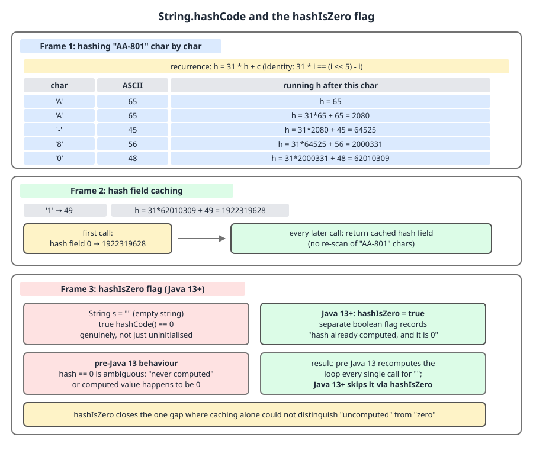
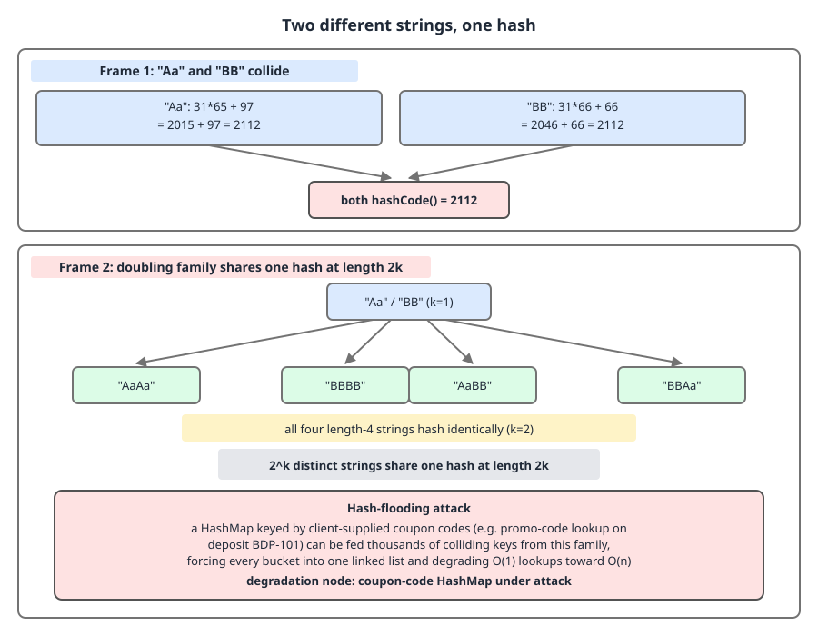
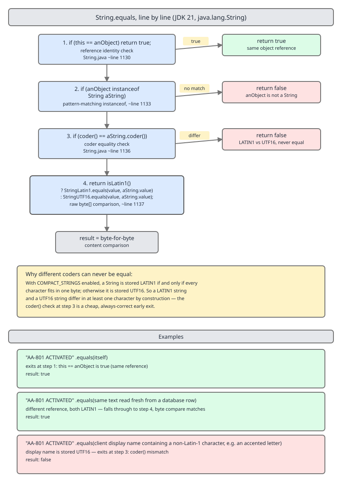

# 03 Java Core — `String` hash and equality internals — INTERNALS (§3.2, 3.2.6–3.2.10)

**Target version: Java 21 LTS.** | **Part 3 of 5** | [Index](../00-index.md)
Previous: [`String` internals: layout and compact strings](03-internals-string.md) · Next: [The StringTable, interning and deduplication](03b-internals-stringtable-and-interning.md)

## Three questions, three code paths

`hashCode`, `equals` and `compareTo` answer three different questions about the same two fields, and each takes a different route through the coder. The field set itself — `@Stable byte[] value`, `byte coder`, `int hash`, `boolean hashIsZero`, `COMPACT_STRINGS`, `LATIN1 = 0`, `UTF16 = 1` — is tabulated in [03-internals-string.md](03-internals-string.md); this file assumes it.

| Method | Question it answers | Uses `coder` how | Delegates to | Cached? |
|---|---|---|---|---|
| `hashCode()` | "Which bucket?" | Picks the helper by `isLatin1()` | `StringLatin1.hashCode` / `StringUTF16.hashCode` | Yes — `hash` plus `hashIsZero` |
| `equals(Object)` | "Same characters?" | Unequal coders **disqualify** immediately | `StringLatin1.equals` for **both** coders | No |
| `compareTo(String)` | "Which sorts first?" | Selects one of **four** helpers | `compareTo`, `compareToUTF16`, `compareToLatin1` | No |

Read that middle row twice: `equals` uses the coder to prove inequality, `compareTo` cannot — ordering across coders is meaningful and must be computed.

---

## 1. `hashCode` and the `hashIsZero` flag (3.2.6, 3.2.7)

`String.hashCode` is a lazily-computed, cached, deliberately unsynchronised value. The interesting part is not the polynomial — it is that two fields are needed to cache one `int` safely.

### Why the second field exists

`hash` defaults to 0. So `hash == 0` is ambiguous: it means either "never computed" or "computed, and the answer is 0". Before Java 13, the code tested only `hash == 0`, which meant the empty string — whose hash is exactly 0 by definition of the polynomial over zero characters — recomputed its hash on *every single call*. Cheap for `""`, but non-empty strings can hash to 0 too (`"polygenelubricants"` is the canonical example), and those recompute a full loop forever. Java 13 added `hashIsZero` to break the tie.

### When it matters, and when it does not

It matters for any string used repeatedly as a key: `FundsLedger`'s position index does ~19.8M `HashMap` lookups a day keyed by position name, and every `get` calls `hashCode()` on the key. Cached, that is a field load. Uncached, it is a loop over 20-odd bytes. It does not matter for a string hashed once and discarded — there the flag and the cache are pure overhead of one `int` and one `boolean` per instance, which is the cost everybody pays so that key-heavy code gets the win.

### The mechanism

```java
    public int hashCode() {
        // The hash or hashIsZero fields are subject to a benign data race
        int h = hash;
        if (h == 0 && !hashIsZero) {
            h = isLatin1() ? StringLatin1.hashCode(value)
                           : StringUTF16.hashCode(value);
            if (h == 0) {
                hashIsZero = true;
            } else {
                hash = h;
            }
        }
        return h;
    }
```

`int h = hash;` reads the field exactly once into a local — re-reading it later could see a different value under a race. `h == 0 && !hashIsZero` is the two-field test: compute only if the cache is empty *and* we have not previously learned that zero is the true answer. The `isLatin1()` branch picks the helper. Then the crucial asymmetry: exactly one of the two fields is ever written for a given instance — `hashIsZero = true` when the result is 0, `hash = h` otherwise. That is what makes the race benign. There is no `volatile` and no lock, so two threads may both run the loop, but the polynomial is a pure function of immutable state, so they compute the same value and write the same field with the same content. The worst case is duplicated work, never a wrong answer. `return h;` returns the local, so the value returned is the one just computed even if another thread is mid-write.

The Latin-1 helper in JDK 21:

```java
// StringLatin1
    public static int hashCode(byte[] value) {
        return ArraysSupport.vectorizedHashCode(value, 0, value.length, 0, ArraysSupport.T_BOOLEAN);
    }
```

`T_BOOLEAN` names the element width — one unsigned byte — and the initial accumulator is `0`. `vectorizedHashCode` carries `@IntrinsicCandidate` and is replaced by the JIT's `_vectorizedHashCode` (added in JDK 21 by JDK-8302163); the intrinsic caveats are in [03-internals-string.md](03-internals-string.md). This exact signature is JDK 21-specific: JDK-8332826, integrated after 21, renamed these into friendlier `hashCodeOf*` wrappers and made `vectorizedHashCode` private. The computed value is unchanged in every version; only the plumbing moved. Semantically it is still the loop the `String` javadoc specifies:

```
sum of s[i] * 31^(n-1-i) for i = 0 to n-1
```

### Why 31 (3.2.7)

Three properties, and they are worth deriving because interviewers ask for exactly this.

First, **odd**. An even multiplier would shift a zero bit into the low end on every round, so after `k` rounds the bottom `k` bits of the accumulator would be guaranteed 0 — and a `HashMap` selects its bucket from the *low* bits (`(table.length - 1) & hash`), so an even multiplier would collapse every long string into one bucket.

Second, **prime**. Being coprime with 2^32 means multiplication by 31 is a bijection on `int`, so no two accumulator states merge purely from the multiply; collisions can only come from the additions.

Third, **cheap**. `31 * i == (i << 5) - i`, because `i << 5` is `32 * i` and `32i - i = 31i`. Work it on `i = 2080` (the accumulator after `"AA"` below): `2080 << 5 = 66560`, minus `2080` = `64480`, and `31 * 2080 = 64480`. One shift plus one subtract, historically faster than a multiply on the CPUs of 1995. On modern hardware an integer multiply is single-cycle and the JIT no longer needs the trick, but the constant is frozen forever because it is specified in the javadoc — every serialized `HashMap` and every persisted hash bucket depends on the exact value.

The distribution argument, framed on the ledger's position index: position names are `CLIENT_CASH_AVAILABLE`, `CLIENT_CASH_RESERVED`, `CLIENT_BONUS_AVAILABLE`, `CLIENT_BONUS_RESERVED`, `SUSPENSE`, `PSP_RECEIVABLE` and their siblings — long strings sharing long prefixes. A multiplier of 31 gives each character position a distinct weight `31^k`, so a difference in *any* position propagates across the whole 32-bit word rather than staying local. With a multiplier of 1 (plain sum) `"CLIENT_CASH_AVAILABLE"` and `"CLIENT_CASH_RESERVED"` would hash close together and anagrams would hash identically; with 31 they diverge in the high bits, which is what `HashMap`'s spread function then folds back down. Bucket selection and treeification in full: **guide 02 Java collections**. The one-paragraph version: `HashMap` mixes with `hash ^ (hash >>> 16)` so the high bits influence the low-bit bucket index, then masks by `table.length - 1`.



**D-094** — `"AA-801"` hashed character by character with the running accumulator, the `31 * i == (i << 5) - i` identity shown on one step, the `hash` field filling on first call, and the empty string taking the `hashIsZero = true` branch. Follow the accumulator column: it grows past 2^31 and wraps, which is normal and specified.

### The arithmetic, in code

```java
record Money(BigDecimal amount, Currency currency) { }

final class PositionIndex {

    record Position(String name, Money balance) { }

    /** FundsLedger's position index: String keys, so every get() calls hashCode(). */
    private final Map<String, Position> byName = new HashMap<>();

    void put(Position position) {
        byName.put(position.name(), position);
    }
    Optional<Position> find(String name) {
        return Optional.ofNullable(byName.get(name));
    }
    /** Re-derivation of the specified polynomial, to prove the JDK value. */
    static int specifiedHash(String text) {
        int h = 0;
        for (int i = 0; i < text.length(); i++) {
            h = ((h << 5) - h) + text.charAt(i);   // h * 31 + c
        }
        return h;
    }

    static void proveHash() {
        String statusKey = "AA-801";
        System.out.println(statusKey.hashCode());        // 1922319628
        System.out.println(specifiedHash(statusKey));    // 1922319628
        System.out.println("".hashCode());               // 0, and hashIsZero becomes true
    }
}
```

Hand-walk `"AA-801"`: characters `A`=65, `A`=65, `-`=45, `8`=56, `0`=48, `1`=49.
`h = 65` → `31*65 + 65 = 2080` → `31*2080 + 45 = 64525` → `31*64525 + 56 = 2000331` → `31*2000331 + 48 = 62010309` → `31*62010309 + 49 = 1922319628`. That is the value the JDK returns, and both columns above agree.

**Pitfall:** assuming a cached zero hash is recomputed every call on Java 21. It is not — that was true up to Java 12 and is a favourite stale-knowledge question. State both: "before 13, `hash == 0` alone gated the computation, so `""` re-ran the loop on every call; 13 added `hashIsZero`".

> **`String.hashCode`** is the specified polynomial `sum of s[i] * 31^(n-1-i)` over the string's characters, computed lazily and cached in `hash`, with `hashIsZero` recording the case where the true hash is 0 so that it is never recomputed; the caching race is benign because only one of the two fields is ever written per instance.

---

## 2. Colliding strings and hash flooding (3.2.8)

Two different strings sharing a hash is not a bug; with 2^32 hash values and unbounded strings it is arithmetic. What matters is that the collisions are *cheap to construct*, which turns a map keyed by user input into a denial-of-service surface.

### Why it exists

The polynomial is invertible and linear in the characters, so you can solve for collisions rather than search for them. Take two characters `c0, c1`: the hash is `31*c0 + c1`. Increase `c0` by 1 and decrease `c1` by 31 and the hash is unchanged. `"Aa"`: `31*65 + 97 = 2015 + 97 = 2112`. `"BB"`: `31*66 + 66 = 2046 + 66 = 2112`. Same trick one letter along: `"Ea"` is `31*69 + 97 = 2139 + 97 = 2236` and `"FB"` is `31*70 + 66 = 2170 + 66 = 2236`.

Now the multiplicative step. Because the polynomial is a Horner evaluation, concatenating two blocks whose *block hashes* agree yields strings whose total hashes agree. `"AaAa"`: from 2112, `31*2112 + 65 = 65537`, then `31*65537 + 97 = 2031744`. `"BBBB"`: from 2112, `31*2112 + 66 = 65538`, then `31*65538 + 66 = 2031744`. Identical. So from one 2-character pair you get **2^k** distinct strings of length `2k` all sharing one hash — 1,024 colliding 20-character strings from ten free choices, generated in microseconds.

### When it matters, and when it does not

It matters exactly when an adversary chooses the keys and you do not bound how many. It does not matter for `FundsLedger`'s position index, where the key set is a closed list you wrote — accidental collisions among a dozen constants are a non-event, and even a full bucket of them costs nothing measurable.



**D-095** — `"Aa"` and `"BB"` both reaching 2112 with the arithmetic spelled out, then the doubling family `"AaAa"`/`"BBBB"`/`"AaBB"`/`"BBAa"` as a tree with the `2^k` count, and hash flooding on client-supplied coupon codes. Look at the tree's branching factor: every added block doubles the family for free.

### Where it bites in the domain

`BonusService` grants ~3.1k bonuses/day, each triggered by a **client-supplied coupon code**. If a request carries a batch of coupon codes and the service loads them into a `HashMap<String, Bonus>` or a `HashSet<String>`, the attacker controls the keys. `n` colliding keys land in one bucket; insertion and lookup degrade from O(1) to O(n), and building the map is O(n^2). A few thousand keys per request, repeated, saturates CPU with no unusual request volume — the classic 2011 hash-flooding disclosure that hit essentially every language runtime's dictionary.

Java's platform-level answer, in Java 8, was `HashMap` treeification: when a bin reaches `TREEIFY_THRESHOLD = 8` entries and the table is at least `MIN_TREEIFY_CAPACITY = 64`, that bin converts from a linked list to a red-black tree, so a flooded bin degrades to O(log n) instead of O(n). It works for `String` keys specifically because `String implements Comparable`, giving the tree a total order to fall back on when hashes tie. It is mitigation, not immunity: `HashMap`'s spread function `hash ^ (hash >>> 16)` cannot separate keys whose 32-bit hashes are *identical*, so the tree is the only thing standing between you and quadratic behaviour. Treeification mechanics: **guide 02 Java collections**. Hash flooding as an attack class, and why the real fix is a keyed hash or an input bound: **guide 13 Web security**.

```java
final class CouponFlooding {

    /** Generates 2^blocks coupon codes that all share one String hash. */
    static List<String> collidingCodes(int blocks) {
        List<String> codes = new ArrayList<>(List.of(""));
        for (int i = 0; i < blocks; i++) {
            List<String> next = new ArrayList<>(codes.size() * 2);
            for (String prefix : codes) {
                next.add(prefix + "Aa");
                next.add(prefix + "BB");
            }
            codes = next;
        }
        return codes;
    }

    static void demonstrate() {
        List<String> codes = collidingCodes(10);          // 1024 codes, 20 chars each
        long distinctHashes = codes.stream().map(String::hashCode).distinct().count();
        System.out.println(codes.size() + " codes, " + distinctHashes + " distinct hash");
    }

    /** The fix: bound the input and never accept unbounded client keys. */
    static Set<String> acceptCoupons(List<String> submitted) {
        if (submitted.size() > 8) {
            throw new BonusIneligibleException("too many coupon codes in one request");
        }
        return Set.copyOf(submitted);
    }
}
```

`distinctHashes` prints 1. The defensive method is the actual production answer: cap the number of client-supplied keys, validate each against the issued-coupon format before it reaches a hash structure, and if you must accept arbitrary volumes of untrusted keys, use a structure with a randomly seeded or keyed hash rather than `String.hashCode`.

**Pitfall:** treating `String.hashCode` as a security-grade digest. It is a 32-bit, unkeyed, publicly specified, trivially invertible checksum. It must never be used for a token, an `IdempotencyKey` derived from client data, a password comparison, or a de-duplication key where an adversary chooses the input. Use `SHA-256` for digests and `MessageDigest.isEqual` or a MAC for comparisons.

**Interview:** "give me two strings with the same hash code" — answer `"Aa"` and `"BB"`, show `31*65+97 = 31*66+66 = 2112`, then volunteer that concatenating members of the family doubles it, which is what makes flooding practical.

> **Hash flooding** is the attack in which an adversary supplies many keys engineered to share one `hashCode`, collapsing a hash structure's O(1) operations into O(n) — mitigated in Java 8+ by `HashMap` treeification at bin size 8, and prevented only by bounding or validating untrusted keys.

---

## 3. `equals` and `compareTo`, line by line (3.2.9, 3.2.10)

`equals` is three tests and a byte loop, arranged so that the cheapest test that can decide the answer runs first. `compareTo` is the same idea with four paths instead of two, because ordering must work across mixed coders.

### Why the arrangement matters

`AccountActivation` reads a `StatusCode` string out of a database row and compares it against a literal — `row.getString("status").equals("AA-801 ACTIVATED")` — millions of times a day. The database string is a fresh object, so reference identity fails; the literal is interned, so if the row string were interned too the first test would settle it in one instruction. Every ordering decision in `equals` is about reaching a decision without touching the payload.

### `equals` (3.2.9)

```java
    public boolean equals(Object anObject) {
        if (this == anObject) {
            return true;
        }
        return (anObject instanceof String aString)
                && (!COMPACT_STRINGS || this.coder == aString.coder)
                && StringLatin1.equals(value, aString.value);
    }
```

`this == anObject` is the identity short-circuit: one comparison, and for interned literals compared against themselves it is the whole method. `anObject instanceof String aString` is a pattern-matching `instanceof` (Java 16+), combining the type test and the cast, and it also returns `false` for `null` — which is why `equals(null)` is `false` with no explicit null check. `!COMPACT_STRINGS || this.coder == aString.coder` is the coder test, and it is a genuine correctness step, not an optimisation: if the two strings have different coders then one contains a character above U+00FF and the other cannot, so they *cannot* be equal — and comparing their raw bytes would be meaningless because the arrays have different element widths. When `COMPACT_STRINGS` is false the whole clause folds away to `true`, since then everything is UTF-16 and the coders trivially agree. Finally `StringLatin1.equals(value, aString.value)`:

```java
// StringLatin1
    public static boolean equals(byte[] value, byte[] other) {
        if (value.length == other.length) {
            for (int i = 0; i < value.length; i++) {
                if (value[i] != other[i]) {
                    return false;
                }
            }
            return true;
        }
        return false;
    }
```

**Insight:** `StringLatin1.equals` is called for **both** coders, and the name is a historical accident. Once the coders are known equal, equality of the two strings is exactly equality of the two `byte[]` arrays, byte for byte, whatever the element width — a UTF-16 string of `n` characters is `2n` bytes, and two such strings are equal precisely when all `2n` bytes match. So there is no `StringUTF16.equals` in the path at all. The length test first is the second early exit: `"AA-801 ACTIVATED"` (16 bytes) against `"AA-900 DECLINED"` (15 bytes) decides on the length, never entering the loop.



**D-096** — the four decision nodes of `String.equals` in source order — reference identity, `instanceof String`, `coder` equality, then the raw-byte loop — each annotated with the early exit it enables. Note that both the Latin-1 and UTF-16 branches converge on the same byte comparison.

### `compareTo` and the four coder combinations (3.2.10)

```java
    public int compareTo(String anotherString) {
        byte v1[] = value;
        byte v2[] = anotherString.value;
        byte coder = coder();
        if (coder == anotherString.coder()) {
            return coder == LATIN1 ? StringLatin1.compareTo(v1, v2)
                                   : StringUTF16.compareTo(v1, v2);
        }
        return coder == LATIN1 ? StringLatin1.compareToUTF16(v1, v2)
                               : StringUTF16.compareToLatin1(v1, v2);
    }
```

Both arrays are read into locals first so the coder tests and the byte work see one consistent snapshot. `coder()` — not the raw field — is used, so `-XX:-CompactStrings` funnels everything into the UTF-16 path. The same-coder case picks the matching helper; the mixed case needs a helper that widens one side as it walks, because a one-byte element and a two-byte element cannot be compared directly. Unlike `equals`, there is no cheap disqualifier here: ordering across coders is meaningful and must be computed.

| `this` coder | `other` coder | Helper called | What it does |
|---|---|---|---|
| `LATIN1` | `LATIN1` | `StringLatin1.compareTo` | Unsigned byte compare, `(b & 0xff)` per element |
| `UTF16` | `UTF16` | `StringUTF16.compareTo` | Code-unit compare, two bytes per element |
| `LATIN1` | `UTF16` | `StringLatin1.compareToUTF16` | Widens the Latin-1 side to code units as it walks |
| `UTF16` | `LATIN1` | `StringUTF16.compareToLatin1` | Same walk with the sign of the result flipped |

All four return the difference of the first differing element, or the difference in length when one string is a prefix of the other — the contract the javadoc specifies as lexicographic order **on UTF-16 code units**, which is not the same as any human's alphabetical order.

```java
record Jurisdiction(String country, String subdivision) { }

final class AccountActivation {

    private static final String ACTIVATED = "AA-801 ACTIVATED";

    /** Status strings arrive from a DB row: fresh objects, so identity never fires. */
    boolean isActivated(String statusFromRow) {
        return ACTIVATED.equals(statusFromRow);
    }

    /** Machine ordering: stable, locale-independent, correct for keys and indexes. */
    static List<Jurisdiction> sortedForIndex(List<Jurisdiction> jurisdictions) {
        return jurisdictions.stream()
                .sorted(Comparator.comparing(Jurisdiction::country)
                        .thenComparing(Jurisdiction::subdivision))
                .toList();
    }

    /** Human ordering: locale-aware, for anything a client actually reads. */
    static List<Jurisdiction> sortedForDisplay(List<Jurisdiction> jurisdictions, Locale locale) {
        Collator collator = Collator.getInstance(locale);
        collator.setStrength(Collator.SECONDARY);
        return jurisdictions.stream()
                .sorted(Comparator.comparing(Jurisdiction::country, collator))
                .toList();
    }
}
```

`sortedForIndex` uses `compareTo` through `Comparator.comparing`, and it is the right choice for a database index or a cache key: deterministic everywhere, no locale dependency. `sortedForDisplay` must not use `compareTo`, because code-unit order puts every uppercase letter before every lowercase one (`"Zimbabwe"` before `"austria"`), sorts `"Åland Islands"` after `"Zimbabwe"` since `Å` is U+00C5, and ignores locale conventions entirely. `Collator` at `SECONDARY` strength handles accents and case the way a reader expects.

**Pitfall:** using `compareTo` to order anything a client sees. The symptom is a support ticket about a country list where accented names are exiled to the bottom and casing splits the alphabet in two. The fix is `Collator.getInstance(locale)`; keep `compareTo` for indexes, keys and tests where determinism, not readability, is the requirement.

> **`String.equals`** decides equality by reference identity, then type, then `coder` inequality (which makes equality impossible), then a raw byte-for-byte comparison via `StringLatin1.equals` for both coders; **`compareTo`** returns lexicographic order on UTF-16 code units through one of four coder-specific helpers, and is not a human-facing sort order.

---

## Pitfalls

### Assuming a zero hash is recomputed on every call

**Wrong**

```java
// Belief: a zero hash re-runs the loop forever, so cache it yourself.
Map<String, Integer> ownCache = new HashMap<>();
int hashOf = ownCache.computeIfAbsent(statusFromRow, String::hashCode);
```

The surprise: this is slower than calling `hashCode()` directly, and `computeIfAbsent` itself calls `hashCode()` on the key to find the bin — so the "avoided" call happens anyway, plus a map lookup.

**Right**

```java
// JDK 21 String.hashCode guards on both fields: if (h == 0 && !hashIsZero),
// then writes hashIsZero = true when the computed hash is 0, else hash = h.
int h = "".hashCode();   // computes once, sets hashIsZero = true, never loops again
```

**Why people believe it:** it was true. Up to and including Java 12 the guard was `if (h == 0)` alone, so any string whose hash is genuinely 0 recomputed on every call. `hashIsZero` arrived in Java 13.

### Treating `String.hashCode` as a security-grade digest

**Wrong**

```java
String clientReference = request.reference();   // attacker-chosen
IdempotencyKey key = new IdempotencyKey(Integer.toHexString(clientReference.hashCode()));
```

The surprise: 32 bits, unkeyed, publicly specified and invertible. A client can compute a reference that collides with someone else's key, and a card deposit gets silently de-duplicated against a stranger's `PaymentIntent`.

**Right**

```java
MessageDigest digest = MessageDigest.getInstance("SHA-256");
byte[] hashed = digest.digest(clientReference.getBytes(StandardCharsets.UTF_8));
IdempotencyKey key = new IdempotencyKey(HexFormat.of().formatHex(hashed));
```

**Why people believe it:** `hashCode` is called a hash, and the word is overloaded. It is a bucket selector, not a digest.

### Expecting `compareTo` to sort the way a client reads

**Wrong**

```java
List<String> countries = new ArrayList<>(List.of("Zimbabwe", "Åland Islands", "austria"));
countries.sort(String::compareTo);   // [Zimbabwe, Åland Islands, austria]
```

The surprise: uppercase Z (U+005A) precedes accented Å (U+00C5), which precedes lowercase a (U+0061). Code-unit order, faithfully.

**Right**

```java
Collator collator = Collator.getInstance(Locale.UK);
collator.setStrength(Collator.SECONDARY);
countries.sort(collator);            // [Åland Islands, austria, Zimbabwe]
```

**Why people believe it:** for pure lowercase ASCII, `compareTo` and alphabetical order agree, and most test fixtures are pure lowercase ASCII.

## Cheat sheet

| Item | Value |
|---|---|
| `hashCode` | `sum of s[i] * 31^(n-1-i)`, lazy, cached in `hash`, benign race |
| Guard | `int h = hash; if (h == 0 && !hashIsZero)`; writes exactly one field |
| `hashIsZero` | Added Java 13; up to 12 a true-zero hash re-ran the loop every call |
| `"AA-801".hashCode()` | `1922319628` |
| `"".hashCode()` | `0`, and `hashIsZero` becomes `true` |
| `31 * i` | `(i << 5) - i`; odd (low bits survive), prime (bijective), cheap |
| Helper | `StringLatin1.hashCode` → `ArraysSupport.vectorizedHashCode(v, 0, len, 0, T_BOOLEAN)` |
| Collisions | `"Aa"` = `"BB"` = 2112; `"Ea"` = `"FB"` = 2236; `"AaAa"` = `"BBBB"` = 2031744 |
| Collision family | `2^k` strings of length `2k` from one colliding pair |
| Treeification | `TREEIFY_THRESHOLD = 8`, `MIN_TREEIFY_CAPACITY = 64`, needs `Comparable` |
| `HashMap` spread | `hash ^ (hash >>> 16)`, then `& (table.length - 1)`; cannot split equal hashes |
| `equals` order | `this ==` → `instanceof String` → `coder ==` → `StringLatin1.equals` (both coders) |
| Different coders | Never equal — one side has a character above U+00FF |
| `compareTo` | 4 helpers: `compareTo` ×2 same-coder, `compareToUTF16`, `compareToLatin1` |
| `compareTo` contract | Lexicographic on UTF-16 code units; length difference for a prefix |
| Human sort | `Collator.getInstance(locale)`, `SECONDARY` strength; never `compareTo` |
| Digest | Never `hashCode` for keys or tokens — `SHA-256` + `MessageDigest.isEqual` |

## Self-test

**Q1.** Why does `String` need both `hash` and `hashIsZero`, and which Java version added the second?

<details><summary>Answer</summary>

`hash` defaults to 0, so `hash == 0` cannot distinguish "not computed yet" from "computed, and the value is 0". Without a second field, any string whose true hash is 0 — the empty string always, and non-empty strings such as `"polygenelubricants"` — recomputes the full polynomial on every call. `hashIsZero`, added in Java 13, records that the zero is real. The guard is `if (h == 0 && !hashIsZero)`.

</details>

**Q2.** The `hashCode` cache uses no `volatile` and no lock. Why is that safe?

<details><summary>Answer</summary>

Three reasons together. The value is a pure function of immutable state, so any two threads compute the same result. Exactly one of the two fields is written per instance — `hashIsZero = true` if the result is 0, else `hash = h` — so no thread can observe a half-updated pair. And the method reads `hash` once into a local and returns the local, so the returned value is never a re-read that could see a different state. The worst outcome is duplicated computation.

</details>

**Q3.** Give two strings with the same `hashCode` and explain how to build a thousand of them.

<details><summary>Answer</summary>

`"Aa"` and `"BB"`: `31*65 + 97 = 2112` and `31*66 + 66 = 2112`. Raising the first character by 1 adds 31 to the hash; lowering the second by 31 subtracts it. Because the hash is a Horner evaluation, concatenating blocks with equal block-hashes preserves the equality: `"AaAa"`, `"AaBB"`, `"BBAa"`, `"BBBB"` all hash to 2031744. Ten blocks give `2^10 = 1024` colliding 20-character strings, generated in a loop. That cheapness is what makes hash flooding practical against any map keyed by client input, such as coupon codes. `HashMap` treeification at bin size 8 caps the damage at O(log n) but cannot separate identical hashes.

</details>

**Q4.** Two strings with different coders can never be equal, yet `String.equals` calls `StringLatin1.equals` even for two UTF-16 strings. Explain both.

<details><summary>Answer</summary>

`coder == UTF16` is only produced when the content contains at least one character above U+00FF, and `coder == LATIN1` only when no character does, so the two content sets are disjoint — the coder test is a correctness disqualifier, not merely a fast path, and it also protects the byte loop from comparing arrays of different element widths. Once the coders *are* known equal, string equality is exactly array equality: `StringLatin1.equals` compares two `byte[]` of equal length byte by byte, which is correct for UTF-16 too, since two `2n`-byte arrays represent the same `n` characters precisely when all `2n` bytes match. There is no `StringUTF16.equals` on the path; the helper's name is historical.

</details>

**Q5.** Why does `compareTo` need four helpers when `equals` needs one, and when must you not use it at all?

<details><summary>Answer</summary>

`equals` can reject a coder mismatch outright, so it only ever compares same-width arrays and needs one byte loop. Ordering across a coder mismatch is meaningful and must be computed, so `compareTo` has same-coder helpers for each width (`StringLatin1.compareTo`, `StringUTF16.compareTo`) plus two mixed ones that widen the Latin-1 side as they walk (`StringLatin1.compareToUTF16`, `StringUTF16.compareToLatin1`, the second flipping the result's sign). All four return the first differing element's difference, or the length difference for a prefix. Never use it for a list a client reads: it is lexicographic on UTF-16 code units, so every uppercase letter precedes every lowercase one and `"Åland Islands"` sorts after `"Zimbabwe"`. Use `Collator.getInstance(locale)` there, and keep `compareTo` for indexes, keys and deterministic tests.

</details>

---

**Leaves covered:** 3.2.6–3.2.10 (5 leaves)
**Leaves deferred:** none
**Diagrams included:** D-094, D-095, D-096
**Target version:** Java 21 LTS
**Lines:** 442
