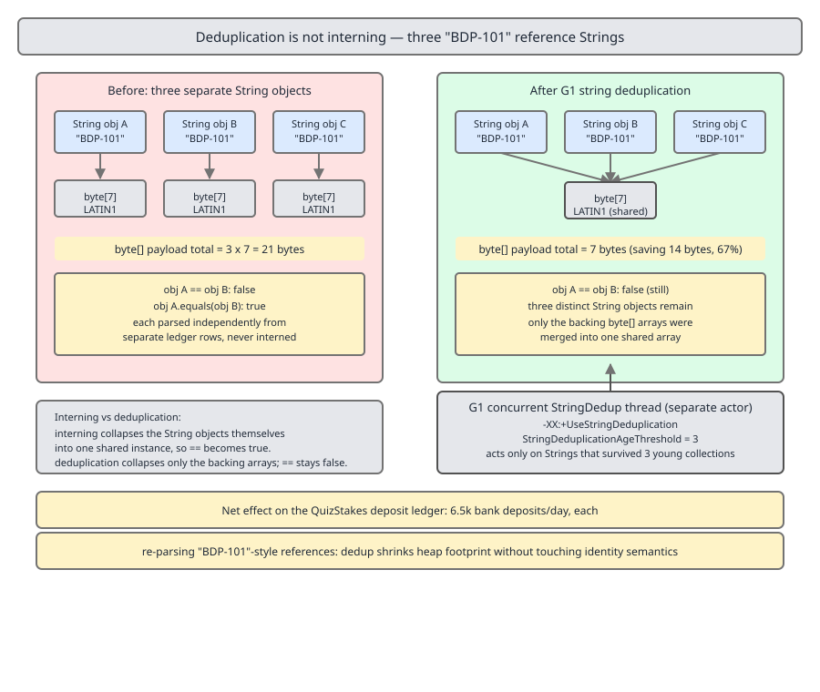

# 03 Java Core — The StringTable, interning and deduplication — INTERNALS (§3.2, 3.2.11–3.2.15, 3.2.17–3.2.19)

**Target version: Java 21 LTS.** | **Part 3 of 5** | [Index](../00-index.md)
Previous: [`String` hash and equality internals](03a-internals-hash-and-equality.md) · Next: [`StringBuilder` and indified concatenation](04-internals-stringbuilder-and-concat.md)

Three different machines in the JVM claim to give you "one copy of this string", and they do three different things at three different times. Almost every wrong answer about interning comes from collapsing them. The map first.

| Mechanism | Where it lives | What it collapses | When it acts | Does `==` become true? | Cost |
|---|---|---|---|---|---|
| Class-file constant pool (`CONSTANT_String`) | `javac` output plus JVM resolution, backed by the StringTable | Every occurrence of the same literal, across every class in the JVM | Compile time for the entry, first execution of the `ldc` for the object | Yes, for literals and compile-time constant expressions | Zero at runtime after resolution |
| StringTable (`String.intern()`) | Native HotSpot structure, weak references into the heap | Distinct `String` objects with equal contents, on explicit request | Every `intern()` call, synchronously, on the calling thread | Yes, but only between values you actually interned | One native call plus a hash probe per call |
| G1 (and since 18, any collector) string deduplication | Concurrent GC-side dedup table | The backing `byte[] value` arrays only, never the `String` objects | Asynchronously, during GC marking, when an object's age hits the threshold | **No** | Off by default; GC-thread CPU plus a dedup table |

**Insight:** the constant pool and `intern()` collapse *objects*; deduplication collapses *arrays*. That single distinction answers most of the interview questions on this page. The `String` object layout those arrays hang off — `value`, `coder`, `hash`, `hashIsZero` — and the memory arithmetic are derived in [`03-internals-string.md`](03-internals-string.md); this file assumes the 24-byte `String` figure computed there and the Latin-1/UTF-16 `coder` split. The `hashCode` polynomial, the `31` multiplier and `equals`/`compareTo` are in [`03a-internals-hash-and-equality.md`](03a-internals-hash-and-equality.md), which this file leans on wherever a hash is probed or a `String` is compared.

The flags, with defaults confirmed first-hand on Oracle JDK 21.0.7 (build 21.0.7+8-LTS, macOS aarch64) via `java -XX:+PrintFlagsFinal -version`:

| Flag | Type | Default (JDK 21.0.7, confirmed) | What it does |
|---|---|---|---|
| `-XX:StringTableSize` | `uintx` | `65536` | Initial bucket count of the StringTable, rounded up to a power of two |
| `-XX:+PrintStringTableStatistics` | `bool` | `false` | Dumps Symbol and String table statistics at VM exit |
| `-XX:+UseStringDeduplication` | `bool` | `false` | Enables GC-side deduplication of `String` backing arrays |
| `-XX:StringDeduplicationAgeThreshold` | `uint` | `3` | Object age at which a `String` becomes a dedup candidate |

---

## The StringTable and `intern()` (3.2.11, 3.2.12, 3.2.13)

### The shape of the thing

Picture a bucket array living in native HotSpot memory — not on the Java heap. Each bucket heads a chain of nodes, and each node holds a `WeakHandle`: a weak reference out into the Java heap at a `String` object. The table stores no characters and owns no strings. It is a native index *over* heap strings, and because the handles are weak, a heap `String` reachable only from the table is garbage and its entry becomes a dead node the table sweeps later.

`String.intern()` is `native`. It lands in `JVM_InternString`, which calls `StringTable::intern`, and in JDK 21 that reads:

```cpp
oop StringTable::intern(Handle string_or_null_h, const jchar* name, int len, TRAPS) {
  // shared table always uses java_lang_String::hash_code
  unsigned int hash = java_lang_String::hash_code(name, len);
  oop found_string = lookup_shared(name, len, hash);
  if (found_string != nullptr) {
    return found_string;
  }
  if (_alt_hash) {
    hash = hash_string(name, len, true);
  }
  found_string = do_lookup(name, len, hash);
  if (found_string != nullptr) {
    return found_string;
  }
  return do_intern(string_or_null_h, name, len, hash, THREAD);
}
```

Line by line. `java_lang_String::hash_code` is the VM's reimplementation of the same `s[0]*31^(n-1) + …` polynomial `String.hashCode()` computes in Java (derived in [`03a-internals-hash-and-equality.md`](03a-internals-hash-and-equality.md)), so a lookup does not need to touch the Java-side `hash` field — and cannot benefit from it being already cached. `lookup_shared` probes the CDS archive's read-only `CompactHashtable` first — strings archived at CDS dump time are found without ever touching the mutable table. `_alt_hash` is the rehash-under-attack switch: if any chain ever got pathological the table switched to `AltHashing::halfsiphash_32` with a per-VM seed, and every subsequent probe must use that function. `do_lookup` walks the live bucket. Only on a miss does `do_intern` allocate nothing (the string already exists), wrap it in a `WeakHandle`, and insert.

### Why it exists, and what it is not for

The StringTable exists because the JVMS requires it: `ldc` of a `CONSTANT_String` must yield *the same* object for equal literals across the whole VM, so literal resolution interns. `String.intern()` is that same machinery exposed to user code. It was never designed as a general memory-saving API — it was designed to make literal identity work. Reaching for it to shrink your heap is using a spec-mandated symbol table as a cache, and the alternative usually wins: a `HashMap<String,String>` canonicaliser you size, bound, evict and profile yourself.

Reach for `intern()` when the value set is small, closed, and known to the code — status codes, currency codes, column names. Do not reach for it when the input is client-supplied or unbounded.

### The mechanism at INTERNALS depth

Also from JDK 21 `stringTable.cpp`, the constants that govern the whole structure:

```cpp
typedef ConcurrentHashTable<StringTableConfig, mtSymbol> StringTableHash;

// We prefer short chains of avg 2
const double PREF_AVG_LIST_LEN = 2.0;
// 2^24 is max size
const size_t END_SIZE = 24;
// If a chain gets to 100 something might be wrong
const size_t REHASH_LEN = 100;
// If we have as many dead items as 50% of the number of bucket
const double CLEAN_DEAD_HIGH_WATER_MARK = 0.5;

void StringTable::create_table() {
  size_t start_size_log_2 = ceil_log2(StringTableSize);
  _current_size = ((size_t)1) << start_size_log_2;
  _local_table = new StringTableHash(start_size_log_2, END_SIZE, REHASH_LEN, true);
  _oop_storage = OopStorageSet::create_weak("StringTable Weak", mtSymbol);
}
```

**`-XX:StringTableSize` is the *start* size, not the size.** `ceil_log2` rounds it up to a power of two, and `PREF_AVG_LIST_LEN = 2.0` means the table grows concurrently — `StringTable::grow`, driven by a service thread, not a safepoint — whenever live items divided by buckets exceeds 2. This is a **version trap in its own right**: through JDK 9 the StringTable was a genuinely fixed-size `BasicHashtable` that never resized, which is why every pre-2018 article tells you to tune the flag. Since JDK 10 it is a `ConcurrentHashTable` that resizes itself.

`[NUM]` The arithmetic that follows:

- Default `65536` buckets = 2^16, so no rounding occurs.
- Growth trigger: `items / 65536 > 2.0`, i.e. the first growth happens past **131,072** live interned strings.
- Ceiling: `END_SIZE = 24` → 2^24 = **16,777,216** buckets, reached at roughly 33.5M live interned strings. Past that, chains grow without bound and probe cost becomes linear in chain length.
- Dead-entry cleaning is triggered when dead nodes reach 0.5 × bucket count = **32,768** at the default size.
- There is no shrink path. `do_concurrent_work` either grows or cleans dead entries; a table that ballooned to 2^22 buckets stays at 2^22 buckets for the life of the VM.

The historic default ladder, worth knowing because interviewers quote the old numbers: **1009** in JDK 6 and 7, **60013** in JDK 8, **65536** in modern JDKs (confirmed 65536 on 21.0.7 above — this project treats the figure as unciteable unless verified, hence the explicit provenance). Note the shape change: 1009 and 60013 are primes because the old table reduced the hash with a modulo. The `ConcurrentHashTable` masks off low bits instead, so the default became a power of two.


**D-097** — The StringTable: a native fixed-size bucket array of weak references into the heap, and what an `intern()` call does when it probes. Look at two things: the arrows all point *out* of the table into the heap and are weak, which is why interned strings are collectable; and the cost-curve inset, where probe cost is flat until the chain length rises and then tracks it linearly.

### 3.2.13 — the pool moved to the heap `[VERSION-TRAP]`

**What is true in Java 21:** the interned `String` objects and their `byte[]` arrays are ordinary Java heap objects, in the young or old generation like anything else. The StringTable's references to them are weak (`OopStorageSet::create_weak`), so an interned string with no other referent is collected and its table node is swept.

**What used to be true:** through Java 6, interned strings lived in PermGen, a separate fixed-size region sized by `-XX:MaxPermSize`. They were effectively uncollectable in practice, `intern()`-heavy code produced `OutOfMemoryError: PermGen space`, and the standing advice was to raise `MaxPermSize`. Java 7 moved the pool to the heap; Java 8 removed PermGen entirely (`MaxPermSize` is now ignored with a warning). If an interviewer says "interning leaks PermGen", the correct answer names Java 7 as the change and then says what actually goes wrong in 21: table bloat that never shrinks, plus a growing dead-node sweep, not a dedicated region filling up.

### Code: `FundsLedger` canonicalising status codes

19.8M `LedgerEntry` rows a day, each carrying a status code drawn from about twenty distinct values. Parsing allocates a fresh `String` per row regardless — canonicalisation does not remove the transient allocation, it removes the *retention*.

```java
public final class LedgerStatusCodes {

    private static final Map<String, String> CANONICAL = buildCanonical();

    private static Map<String, String> buildCanonical() {
        var codes = List.of("AO-400 SUBMITTED", "AA-500 SCREENING_IN_PROGRESS", "AA-501 SCREENING_CLEAR",
                "AA-600 DOCUMENTS_REQUESTED", "AA-610 DOCUMENTS_UPLOADED", "AA-611 DOCUMENTS_VERIFIED",
                "AA-650 DOCUMENTS_REFERRED", "AA-700 REVIEW_QUEUED", "AA-711 REVIEW_APPROVED",
                "AA-800 ACTIVATING", "AA-801 ACTIVATED", "AA-900 DECLINED", "DEP-301 CAPTURED", "BDP-101");
        var table = new HashMap<String, String>(codes.size() * 2);
        for (String code : codes) {
            table.put(code, code);
        }
        return Map.copyOf(table);
    }

    /** Returns the canonical instance, or the argument unchanged if the code is unknown. */
    public static String canonical(String parsed) {
        String hit = CANONICAL.get(parsed);
        return hit != null ? hit : parsed;
    }
}

public record LedgerEntry(long rowId, AccountId accountId, String statusCode, Money amount) {

    public LedgerEntry {
        statusCode = LedgerStatusCodes.canonical(statusCode);
    }
}
```

The record's compact constructor rewrites `statusCode` to the canonical instance before the field is assigned, so no caller can forget. The literals in `buildCanonical` are already interned by the JVM's own literal resolution, so `canonical()` hands back a StringTable-resident object without any `intern()` call — the `HashMap` probe replaces the native call entirely.

`[NUM]` The retention arithmetic, using the 24-byte `String` object derived in [`03-internals-string.md`](03-internals-string.md). `"AA-801 ACTIVATED"` is 16 Latin-1 characters, so its `byte[]` is 16 bytes of header plus 16 bytes of payload = 32 bytes exactly, no padding needed at `ObjectAlignmentInBytes = 8`. Per distinct status string: 24 + 32 = **56 bytes**.

- One hour of ledger entries held in memory is 19.8M / 24 = 825,000 rows. Uncanonicalised: 825,000 × 56 = 46,200,000 bytes = **44.06 MiB** of live status-code strings.
- Canonicalised: 14 distinct codes × 56 = **784 bytes** live, plus 825,000 references that were already there.
- The cost side: 825,000 `HashMap` probes an hour, 229/sec, each a hash (cached after first use) plus one bucket comparison. The escape hatch if that is still too much is to stop producing `String` at all — parse straight to an `enum` or a `StatusCode` record and never materialise the text.

**Pitfall: interning is free.** The belief is that `intern()` is just a map lookup so it may as well go in the hot path. The symptom is a profile where `JVM_InternString` dominates and the thread spends its time in native code rather than in the parse. The mechanism: every call crosses into the VM, recomputes the hash in native code over the string's characters (`java_lang_String::hash_code`, which does not read the cached Java-side `hash`), probes the shared CDS table, then probes the live table. A `HashMap<String,String>` probe reuses the cached `hash` field and stays in Java where the JIT can inline it. Shipilev measured the gap at roughly 8× on JDK 8u131 — 81,194.779 ± 4,905.934 us/op for a `HashMap` canonicaliser against 650,243.474 ± 36,680.057 us/op for `String.intern()`, interning 1M strings ([JVM Anatomy Quark #10](https://shipilev.net/jvm/anatomy-quarks/10-string-intern/)). That measurement predates the resizable table, and his run averaged 16.708 elements per bucket, which the modern growing table would not allow. **Unverified:** I have no equivalent JDK 21 measurement, so treat the 8× as an upper bound on the fixed-table era, not a JDK 21 figure. The direction of the result — native call plus uncached hash loses to an inlined Java probe — follows from the source regardless.

**Interview:** "Should you call `intern()` to save memory?" — Only for a small closed value set, and even then a `HashMap` canonicaliser you size and bound is usually faster and always more observable; `intern()` costs a native transition and an uncached hash per call, and the table it feeds grows but never shrinks.

> **Definition.** The StringTable is a native, weakly-referencing, concurrently-growing hash table over heap `String` objects that backs both JVM literal resolution and `String.intern()`, guaranteeing one canonical object per distinct character sequence that passes through it.

---

## Deduplication is not interning (3.2.14, 3.2.15)

### The shape of the thing

Interning gives you one `String` object. Deduplication leaves every `String` object exactly where it is and rewires their `value` fields to share one `byte[]`. Three `String` objects reading `"BDP-101"` stay three objects with three headers; after deduplication all three `value` fields point at the same seven-byte array and the other two arrays become garbage. `==` on the strings is still `false`, before and after. Nothing about program semantics changes, which is precisely the design goal — it is a GC-side memory optimisation that user code cannot observe except through footprint.

### Why it exists

JEP 192, delivered in 8u20, targeted the observation that duplicate string *contents* dominate many server heaps while the `String` headers are a minority of the bytes. Interning could not be used for this: it needs a call site, it changes identity, and it cannot be applied retroactively to strings already alive. Deduplication needed neither cooperation from the application nor any identity change, so it could be switched on for an existing deployment. Before it existed, the only options were a hand-written canonicaliser or `intern()` at every construction site.

### The mechanism

`-XX:+UseStringDeduplication` is **off by default in JDK 21** (confirmed `false {product} {default}` on 21.0.7). Original delivery was G1-only; the infrastructure was made collector-generic and from JDK 18 the flag is honoured by Serial, Parallel, G1, ZGC and Shenandoah.

The flow: during marking, when the collector encounters a `String`, it checks the object's age in the mark word against the threshold. From JDK 21 `stringDedup.hpp`:

```cpp
  // Return true if age == StringDeduplicationAgeThreshold and
  // deduplication is enabled.
  static bool is_threshold_age(uint age) {
    // Threshold is from option if enabled, or an impossible value (exceeds
    // markWord::max_age) if disabled.
    return age == _enabled_age_threshold;
  }
```

Read the comparison carefully: it is `==`, not `>=`. A `String` is a candidate at *exactly* the collection where its age reaches `StringDeduplicationAgeThreshold` (default **3**, confirmed), which is why the sticky `deduplication_requested` flag exists — it stops the same object being queued twice. Candidates are pushed onto a request queue; a dedicated concurrent deduplication thread drains it, looks the `value` array up in the dedup table by hash and contents, and either installs the existing canonical array into the `String`'s `value` field or adds this array to the table as the new canonical one.

`[NUM]` Why age 3 and not age 0: most strings die young. Deduplicating at first sight would spend the dedup thread's time on arrays that the next young collection reclaims anyway. Three young collections is the heuristic filter — survive three and you are probably long-lived enough to be worth the table entry. The cost is that a string is duplicated in the heap for its first three collections no matter what.



**D-098** — Three distinct `String` objects for the repeated bank-deposit reference, before and after G1 deduplication. Look at the object headers: there are still three of them after dedup, with three distinct addresses. Only the `value` arrows have converged.

### The marker: an interned string is deduplicated once, then never again (3.2.15)

`StringTable::do_intern` contains this, with the comment intact in JDK 21:

```cpp
  // Notify deduplication support that the string is being interned.  A string
  // must never be deduplicated after it has been interned.  Doing so interferes
  // with compiler optimizations done on e.g. interned string literals.
  if (StringDedup::is_enabled()) {
    StringDedup::notify_intern(string_h());
  }
```

And `notify_intern` in `stringDedup.cpp`:

```cpp
void StringDedup::notify_intern(oop java_string) {
  assert(is_enabled(), "precondition");
  // A String that is interned in the StringTable must not later have its
  // underlying byte array changed, so mark it as not deduplicatable.  But we
  // can still add the byte array to the dedup table for sharing, so add the
  // string to the pending requests.
  forbid_deduplication(java_string);
  StorageUse* requests = Processor::storage_for_requests();
  oop* ref = requests->storage()->allocate();
  if (ref != nullptr) {
    NativeAccess<ON_PHANTOM_OOP_REF>::oop_store(ref, java_string);
  }
  requests->relinquish();
}
```

The ordering matters and is the whole leaf. `forbid_deduplication` sets a sticky bit, then the string is still queued — so the interned string's array is offered to the dedup table as a *donor* other strings may share, while the interned string's own `value` field is frozen forever. The bit lives in a VM-injected `flags` byte on `String`, not in any Java-declared field — `javaClasses.hpp` declares the two masks as `_deduplication_forbidden_mask = 1 << 0` and `_deduplication_requested_mask = 1 << 1`, both documented as sticky: "once set it never gets cleared".

**Insight:** the reason for the freeze is in the first comment — "interferes with compiler optimizations done on e.g. interned string literals". The JIT constant-folds through `@Stable byte[] value` on constant strings (next section). If the dedup thread swapped that array under a folded literal, already-compiled code would be reading through a stale trusted constant. The freeze is a correctness requirement for the optimisation in 3.2.18, not a performance choice.

### Code: the repeated bank-deposit reference

```java
public final class BankDeposits {

    /** One statement line is roughly 4 KB; the reference sits in the first field. */
    public PaymentIntent parse(String statementLine) {
        int fieldEnd = statementLine.indexOf('|');
        if (fieldEnd < 0) {
            throw new IllegalArgumentException("malformed bank statement line");
        }
        String reference = statementLine.substring(0, fieldEnd);
        Money amount = Money.parse(statementLine, fieldEnd + 1);
        return new PaymentIntent(reference, amount, Rail.BANK_TRANSFER);
    }
}
```

At 6,500 bank deposits a day, the reference `"BDP-101"` recurs across thousands of `PaymentIntent` objects held for the day's `PaymentRun`. With `-XX:+UseStringDeduplication` on, those that survive three young collections converge on one seven-byte array, and the seven-byte payload plus 16-byte header means each collapsed duplicate returns 24 bytes. That is the honest scale of the win here: 6,500 × 24 = **156,000 bytes**, about 152 KiB. Deduplication pays on heaps where the duplicated strings are long or numerous — a 4 KB duplicated document body, not a 7-byte reference. **Unverified:** I have no measured heap-saving figure for a real deployment to quote; JEP 192 motivates the feature without a number I can attribute to a specific workload, so size it by measuring your own heap with a heap dump before enabling the flag.

**Pitfall: deduplication makes `==` work.** The belief is that switching on `-XX:+UseStringDeduplication` gives you the identity semantics interning gives. The symptom is an equality check that passes in a soak test — where duplicates happen to have converged and someone read too much into it — and fails in production, or vice versa, non-deterministically depending on GC timing. The fix: deduplication never touches object identity; only `String` objects that went through the StringTable compare `==`. Use `equals`, always — whose mechanism, including the `coder` guard and the `StringLatin1.equals` intrinsic, is in [`03a-internals-hash-and-equality.md`](03a-internals-hash-and-equality.md).

> **Definition.** String deduplication is a concurrent, GC-driven optimisation that makes equal-content `String` objects share one backing `byte[]` without changing object identity, applied once per object at the collection where its age equals `StringDeduplicationAgeThreshold`.


## Interning, deduplication, or your own canonicaliser

| Criterion | `String.intern()` | `-XX:+UseStringDeduplication` | `HashMap<String,String>` canonicaliser |
|---|---|---|---|
| Collapses | `String` objects | `byte[]` arrays only | `String` objects |
| Makes `==` true | Yes | No | Yes, within the map's scope |
| Needs code changes | Yes, one call per site | No | Yes, one call per site |
| Applies to existing live strings | No | Yes | No |
| Bounded | No, table grows and never shrinks | Yes, dedup table is GC-managed and weak | Yes, you choose the bound |
| Cost location | Caller thread, native call | Concurrent GC thread | Caller thread, inlined Java |
| Observable | `-XX:+PrintStringTableStatistics`, `jcmd VM.stringtable` | `-Xlog:stringdedup` | Your own metrics |
| Right when | Small closed set, and you want literal-style identity | Existing deployment, large duplicated payloads, no code change possible | Almost every other case |


## `substring` allocates, deliberately (3.2.17)

No diagram: the before-and-after picture for `substring` is D-030 in `01-basics.md`. This section is the internals half — the cost of each form and the arithmetic.

Through Java 6, `String` carried `char[] value`, `int offset` and `int count`. `substring` was O(1): it built a new `String` sharing the parent's `char[]` and adjusting `offset`/`count`. Java 7 update 6 removed `offset` and `count`; `substring` now calls `Arrays.copyOfRange` under the covers and is O(n) in the length of the result.

**The trade the JDK made.** The O(1) form leaked: any substring kept the entire parent array alive, however small the substring. It also cost every single `String` two extra fields whether or not it was ever sliced, and it put an addition on the critical path of `charAt`, `length` and every loop over characters.

`[NUM]` Take `BankDeposits.parse` above, pulling the 7-character `"BDP-101"` off the front of a 4,096-character statement line.

*Java 6 form, per parsed reference:*
- Retained parent array: `char[4096]` = 16 bytes header + 4 bytes length field folded into it + 8,192 bytes payload; on a 64-bit VM with compressed oops that is 16 + 8,192 = 8,208 bytes, already 8-aligned.
- The substring `String` object: 12-byte header + `value` reference 4 + `offset` 4 + `count` 4 + `hash` 4 = 28 bytes, padded to **32**.
- Total retained: 8,208 + 32 = **8,240 bytes**, of which 14 bytes are the characters anyone wanted.

*Java 21 form, per parsed reference:*
- `String` object: **24 bytes** (derivation in [`03-internals-string.md`](03-internals-string.md)).
- `byte[7]` Latin-1: 16 + 7 = 23, padded to **24**.
- Total retained: **48 bytes**. The 4 KB line becomes garbage the moment `parse` returns.

At 6,500 lines a day, all references retained for the day's `PaymentRun`: 6,500 × 8,240 = 53,560,000 bytes = **51.08 MiB** under the Java 6 form, against 6,500 × 48 = 312,000 bytes = **304.7 KiB** in Java 21. A factor of **171.7**, from a change whose headline was "substring got slower".

The escape hatch on the modern side: if you genuinely want O(1) slicing of a large buffer, do not fight `String`. Use `CharBuffer.subSequence`, a `ByteBuffer` slice, or index pairs into the original — all of which share and all of which retain, with the retention now explicit in your code rather than hidden in a `String`.

**Interview:** "Is `substring` O(1) or O(n)?" — O(n) since 7u6, and the copy is deliberate: the O(1) form retained the whole parent array and forced two extra fields onto every `String` in the heap.

---

## `@Stable`, constant folding and condy (3.2.18, 3.2.19)

### The mechanism, self-contained `[X-REF 06]`

`String` is not a value class, but the JIT is allowed to treat one as if its contents were immutable at the deepest level. The permission is granted by an annotation on the field, in JDK 21 `String.java`:

```java
    /**
     * @implNote This field is trusted by the VM, and is a subject to
     * constant folding if String instance is constant. Overwriting this
     * field after construction will cause problems.
     *
     * Additionally, it is marked with {@link Stable} to trust the contents
     * of the array. No other facility in JDK provides this functionality (yet).
     * {@link Stable} is safe here, because value is never null.
     */
    @Stable
    private final byte[] value;
```

`final` alone lets the JIT fold the *reference* when the receiver is constant. `@jdk.internal.vm.annotation.Stable` goes further: it tells C2 that once an element of the array is written non-default it never changes, so the JIT may fold the array's *contents*. That is why `"AA-801 ACTIVATED".length()` compiles to the constant `16`: `length()` is `value.length >> coder()`, the receiver is a constant string from the constant pool, `value` is a trusted final reference, its `length` is a trusted constant, and `coder` is a `final byte`. Every step folds and the whole expression collapses at compile time in C2. The same reasoning folds `charAt` on a constant string at a constant index, and `isEmpty`, and — once the `hash` field is set — `hashCode`, whose caching mechanism and `hashIsZero` flag are in [`03a-internals-hash-and-equality.md`](03a-internals-hash-and-equality.md). Note the asymmetry with the StringTable: `hash` is a non-`final`, non-`@Stable` field, so C2 folds through `value` but must re-read `hash`.

Two distinct folders act on a `static final String`, and confusing them is the usual error:

1. **`javac`**, for a *constant variable* — `static final String` initialised with a constant expression (JLS 4.12.4). `javac` copies the literal directly into every use site's constant pool. The JIT is not involved and the field may never be read at runtime at all.
2. **C2**, for a `static final String` that is not a constant variable — computed in a static initialiser, read from configuration, whatever. C2 reads the value once the holder is initialised, treats it as a constant for that compilation, and folds through `@Stable value` from there.

This is the surface of a much larger topic: how C2 decides a field is trustworthy, what a *trusted final* is, and where the boundary sits for records and hidden classes. Guide **06 JVM internals** covers `@Stable`, constant folding and the trusted-final rules in full; take the two folders above as the answer to the interview question and go there for the machinery.

**Pitfall:** because `javac` inlines constant variables into callers, changing the value of a `public static final String` and recompiling only its own class leaves every already-compiled client carrying the old literal. The symptom is a status code that changed in one module and did not change in another after a partial build.

### `describeConstable` and condy (3.2.19)

Java 12 (JEP 334, the Constants API) made `String` its own nominal descriptor, with the two identity methods:

```java
public final class String
    implements java.io.Serializable, Comparable<String>, CharSequence,
               Constable, ConstantDesc {

    @Override
    public Optional<String> describeConstable() {
        return Optional.of(this);
    }

    @Override
    public String resolveConstantDesc(MethodHandles.Lookup lookup) {
        return this;
    }
```

A `String` describes itself, and resolving that description returns itself. That looks like a joke until you see the use: `Constable` is the interface generic code uses to ask "can this value be written into a class file constant pool?" and `ConstantDesc` is the interface a bootstrap method's static arguments implement. A framework, an annotation processor or a `java.lang.invoke` bootstrap can handle `Integer`, `MethodType`, `MethodHandle`, a `DynamicConstantDesc` and a `String` uniformly — for `String` the conversion is free because `CONSTANT_String` already exists in the class file format.

Condy — `CONSTANT_Dynamic`, JEP 309, Java 11 — is the general form: a constant-pool entry whose value is produced by a bootstrap method on first resolution and then cached in the pool forever. A plain string literal does not need condy; it is already a `CONSTANT_String`. Condy earns its keep when the constant is *computed* — a lazily built canonical status code, an enum-like singleton, a `MethodHandle` — and the resolved value then enjoys exactly the same treatment as a literal, including C2's willingness to fold through `@Stable`.

```java
public final class AccountActivation {

    /** Constant variable per JLS 4.12.4: javac inlines this into every use site. */
    public static final String ACTIVATED = "AA-801 ACTIVATED";

    /** C2 folds ACTIVATED.length() to 16: constant receiver, @Stable value, final coder. */
    public boolean isActivationCode(String statusCode) {
        return statusCode.length() == ACTIVATED.length() && ACTIVATED.equals(statusCode);
    }

    public String describeActivatedConstant() {
        Optional<String> desc = ACTIVATED.describeConstable();
        return desc.map(d -> d.resolveConstantDesc(MethodHandles.lookup()))
                   .orElseThrow(() -> new IllegalStateException("String must be constable"));
    }
}
```

The length guard in `isActivationCode` is free after JIT compilation — the `ACTIVATED.length()` side folds to `16`, leaving one integer compare that rejects most non-matching codes before `equals` walks any bytes.

> **Definition.** `@Stable` on `String.value` licenses the JIT to treat the backing array's contents as an immutable constant whenever the `String` receiver is itself constant, which is what makes `"AA-801 ACTIVATED".length()` a compile-time `16` — and what makes freezing interned strings against deduplication a correctness requirement.

---

## Pitfalls

### Interning client-supplied input to save memory

**Wrong**

```java
public Bonus grant(ClientId clientId, Money deposit, String couponCode) {
    // Belief: interning collapses the duplicates and costs nothing.
    String canonical = couponCode.intern();
    if (!isEligible(clientId, canonical)) {
        throw new BonusIneligibleException(canonical);
    }
    return new Bonus(clientId, cap(deposit), canonical);
}
```

Coupon codes arrive from clients. Every distinct typo, every probe from a scraper, every rejected code becomes a StringTable entry. Load factor climbs past 2, the table grows to 2^17, 2^18, higher — and never shrinks for the life of the VM. Entries are weak so the strings themselves are collected, but you have paid a native call per request, a permanently enlarged native table, and a dead-node sweep proportional to it.

**Right**

```java
// Keys and values are the same three literals, already interned by literal resolution.
private static final Map<String, String> ACTIVE_COUPONS = Map.of(
        "WELCOME10", "WELCOME10", "REFERRAL10", "REFERRAL10", "REACTIVATE10", "REACTIVATE10");

public Bonus grant(ClientId clientId, Money deposit, String couponCode) {
    String canonical = ACTIVE_COUPONS.get(couponCode);
    if (canonical == null || !isEligible(clientId, canonical)) {
        throw new BonusIneligibleException(couponCode);
    }
    return new Bonus(clientId, cap(deposit), canonical);
}
```

Unknown input is rejected before anything canonicalises it, and the only retained strings are the three literals the JVM already interned at class load.

**Why people believe it:** `intern()` reads like `HashMap.putIfAbsent` returning the existing value, and the JVM does own the table, so it feels like the platform-blessed way to deduplicate.

### Deduplication gives you `==`

**Wrong**

```java
// Run with -XX:+UseStringDeduplication and assume identity converges.
if (intent.reference() == BDP_REFERENCE) {
    ledger.post(intent, LedgerPosition.BANK_SETTLEMENT);
}
```

**Right**

```java
if (BDP_REFERENCE.equals(intent.reference())) {
    ledger.post(intent, LedgerPosition.BANK_SETTLEMENT);
}
```

Deduplication rewires `value` fields and never moves or merges `String` objects. The `==` version fails or succeeds depending on whether the reference happened to come from a literal, and no GC setting changes that.

**Why people believe it:** both features are described as "removing duplicate strings", and the difference between sharing an object and sharing an array is invisible from Java.

### The string pool is in PermGen, so raise `MaxPermSize`

**Wrong**

```
java -XX:MaxPermSize=512m -jar funds-ledger.jar
```

On JDK 21 this prints `Ignoring option MaxPermSize; support was removed in 8.0` and does nothing.

**Right**

```
java -Xlog:stringtable*=debug -XX:+PrintStringTableStatistics -jar funds-ledger.jar
```

Measure the table: live item count, bucket count, whether it has grown. Interned strings are ordinary heap objects in Java 7 and later, so a heap that is too small is a `-Xmx` problem, and a table that is too large is an `intern()`-call-site problem.

**Why people believe it:** it was correct advice through Java 6, and it is still the top answer on a decade of blog posts and interview crib sheets.

### Sizing the StringTable because it cannot resize

**Wrong**

```
java -XX:StringTableSize=1000003 -jar funds-ledger.jar
```

**Right**

```
java -jar funds-ledger.jar   # leave the default; ceil_log2 rounds anyway
```

`create_table` applies `ceil_log2(StringTableSize)`, so `1000003` becomes 2^20 = 1,048,576 buckets, and `do_concurrent_work` would have grown the table there by itself had the load factor demanded it. Since JDK 10 the flag only sets a starting point, and pre-allocating 1M buckets costs native memory you may never use.

**Why people believe it:** through JDK 9 the table genuinely never resized, and the flag was the only lever.

### Holding a substring keeps the parent alive

**Wrong**

```java
// Belief: harmless, substring shares the buffer so this is cheap.
List<String> references = new ArrayList<>();
for (String statementLine : bankStatement.lines4Kb()) {
    references.add(statementLine.substring(0, statementLine.indexOf('|')));
}
```

Under Java 6 this retained one 8,208-byte `char[]` per reference — 51 MiB for a day's 6,500 lines, to hold 6,500 seven-character strings.

**Right**

```java
List<String> references = new ArrayList<>();
for (String statementLine : bankStatement.lines4Kb()) {
    // Java 7u6 and later: substring copies, so the 4 KB line is collectable here.
    // Pre-7u6 the defensive form was new String(statementLine.substring(0, idx)).
    int idx = statementLine.indexOf('|');
    references.add(statementLine.substring(0, idx));
}
```

On Java 21 the naive form is already correct — the fix was made in the platform. The `new String(substring)` idiom you will see in old code is now a redundant extra copy; delete it.

**Why people believe it:** the belief was true and the workaround was necessary, and both outlived the JDK change by a decade.

---

## Cheat sheet

| Item | Value / fact |
|---|---|
| `StringTableSize` default | 65536 (2^16), confirmed JDK 21.0.7; start size only, `ceil_log2` applied |
| Historic defaults | 1009 (JDK 6/7), 60013 (JDK 8), 65536 (JDK 10+) |
| Table type | `ConcurrentHashTable<StringTableConfig, mtSymbol>`, values are `WeakHandle` |
| Grows when | live items / buckets > `PREF_AVG_LIST_LEN` = 2.0 → first growth past 131,072 items |
| Max buckets | `END_SIZE = 24` → 2^24 = 16,777,216. Never shrinks |
| Rehash trigger | chain length reaches `REHASH_LEN = 100` → switch to `halfsiphash_32` |
| Dead cleaning | dead nodes ≥ 0.5 × buckets = 32,768 at default size |
| Pool location | Java heap since Java 7 (PermGen through 6, removed in 8); interned strings collectable since 7 |
| `intern()` cost | native call + hash recomputed in native code + shared-table probe + live probe |
| `UseStringDeduplication` default | `false` on JDK 21; G1-only until 18, all collectors from 18 |
| `StringDeduplicationAgeThreshold` | 3, and the test is `age == threshold`, not `>=` |
| Dedup collapses | `byte[] value` only. `==` unaffected |
| Interned + dedup | `forbid_deduplication` sticky bit set on intern; array still donated to the dedup table |
| Dedup marker location | VM-injected `flags` byte on `String`, bits `_deduplication_forbidden` / `_requested` |
| `substring` | O(n) copy since 7u6; O(1) shared `offset`/`count` through Java 6 |
| `@Stable` | On `String.value`; lets C2 fold array *contents* for constant receivers |
| Constant folders | `javac` for constant variables (JLS 4.12.4); C2 for other constant receivers |
| `describeConstable` | Since Java 12; returns `Optional.of(this)` — `String` is its own `ConstantDesc` |
| Observability | `-XX:+PrintStringTableStatistics`, `jcmd VM.stringtable`, `-Xlog:stringdedup`, `-Xlog:stringtable*` |

---

## Self-test

**Q1.** `-XX:StringTableSize=1009` on JDK 21 — what actually happens, and how does that differ from JDK 8?

<details><summary>Answer</summary>

`StringTable::create_table` computes `ceil_log2(1009)` = 10, so you get 2^10 = 1,024 buckets, not 1,009. On JDK 21 that is only a starting point: once live items divided by buckets exceeds `PREF_AVG_LIST_LEN` = 2.0 — past 2,048 items — a service thread runs `StringTable::grow` concurrently and doubles the table, repeatedly, up to `END_SIZE` = 2^24 buckets. On JDK 8 the table was a fixed-size `BasicHashtable` that never resized, so 1,009 buckets stayed 1,009 buckets and a million interned strings meant chains averaging nearly a thousand nodes. That is why the flag mattered then and barely matters now.

</details>

**Q2.** The pool moved out of PermGen in Java 7. Name the consequence that actually matters at runtime.

<details><summary>Answer</summary>

Interned strings became collectable. The StringTable holds `WeakHandle`s created from `OopStorageSet::create_weak`, so an interned `String` with no other referent is reclaimed by GC and its node is swept once dead nodes reach 0.5 × bucket count. Through Java 6 interned strings sat in PermGen and in practice were never reclaimed, giving `OutOfMemoryError: PermGen space`. The failure mode in 21 is different: the strings go away, but the native table that grew to hold them never shrinks, and every `intern()` call still cost a native transition.

</details>

**Q3.** What does G1 string deduplication collapse, and what stays distinct?

<details><summary>Answer</summary>

It collapses the `byte[] value` arrays of equal-content strings onto one canonical array held in a GC-side dedup table. The `String` objects themselves stay distinct — same count, same addresses, same headers, same `hash` fields — so `==` is completely unaffected, before and after. It runs on a concurrent deduplication thread, triggered when a marking thread sees a `String` whose object age equals `StringDeduplicationAgeThreshold` (default 3; the source test is `age == threshold`, so exactly one collection is the candidate window, with a sticky `deduplication_requested` bit preventing re-queueing). The flag is `-XX:+UseStringDeduplication`, off by default in JDK 21, G1-only until JDK 18 and honoured by all collectors from 18.

</details>

**Q4.** Why must an interned string never be deduplicated, and what does the JVM do about it?

<details><summary>Answer</summary>

Because the JIT constant-folds through `@Stable byte[] value` on constant strings, including interned literals. If the deduplication thread replaced that array afterwards, already-compiled code would read a trusted constant that is no longer the string's array. `StringTable::do_intern` therefore calls `StringDedup::notify_intern`, whose first action is `forbid_deduplication` — a sticky bit in a VM-injected `flags` byte on the `String`. The subtlety: the string is *still* queued as a request afterwards, so its array can be added to the dedup table and shared by other strings. It donates, it never receives.

</details>

**Q5.** `BankDeposits.parse` takes a 7-character reference off a 4,096-character statement line, and the result is retained. Work the per-call retained bytes for Java 6 and Java 21.

<details><summary>Answer</summary>

Java 6: the substring shared the parent `char[4096]`, so retention is 16 bytes of array header + 8,192 bytes of payload = 8,208 bytes, plus the `String` object at 12-byte header + `value` 4 + `offset` 4 + `count` 4 + `hash` 4 = 28 padded to 32. Total **8,240 bytes** per reference. Java 21: `substring` copies, so the 4 KB line is garbage on return; retention is the 24-byte `String` plus a `byte[7]` at 16 + 7 = 23 padded to 24. Total **48 bytes**, a factor of 171.7. At 6,500 lines a day that is 51.08 MiB against 304.7 KiB. The removal of `offset`/`count` in 7u6 also saved 8 bytes on every `String` in the heap and took an addition off the critical path of `charAt`.

</details>

**Q6.** Why does `"AA-801 ACTIVATED".length()` become the constant `16`, and what does `describeConstable` add on top of that?

<details><summary>Answer</summary>

`length()` is `value.length >> coder()`. The receiver is a constant string resolved from the constant pool, `value` is `final` so its reference folds, `@Stable` licenses C2 to trust the array's *contents* including its length, and `coder` is a `final byte` that folds too — so the whole expression collapses in C2. Separately, `javac` folds a `static final String` that is a constant variable (JLS 4.12.4) into every use site's constant pool before the JIT ever sees it, which is why changing such a constant needs clients recompiled. `describeConstable` (Java 12) is orthogonal: it makes `String` implement `Constable` and `ConstantDesc` with `Optional.of(this)` and `resolveConstantDesc` returning `this`, so generic code — annotation processors, `invokedynamic` and condy bootstraps — can treat a `String` as a nominal constant descriptor uniformly with `MethodHandle`, `MethodType` and `DynamicConstantDesc`.

</details>

---

## Open questions

- **Unverified:** the 8× `intern()`-versus-`HashMap` gap is Shipilev's JDK 8u131 measurement (81,194.779 ± 4,905.934 us/op against 650,243.474 ± 36,680.057 us/op for 1M strings) and predates the resizable table. A JMH run on JDK 21 with the growing `ConcurrentHashTable` would settle the modern figure.
- **Unverified:** no attributable measured heap saving for `-XX:+UseStringDeduplication` on a named workload. A before/after heap histogram on a real service would settle it.

---

**Leaves covered:** 3.2.11–3.2.15, 3.2.17–3.2.19 (8 leaves)
**Leaves deferred:** none
**Diagrams included:** D-097, D-098
**Target version:** Java 21 LTS
**Lines:** 598
