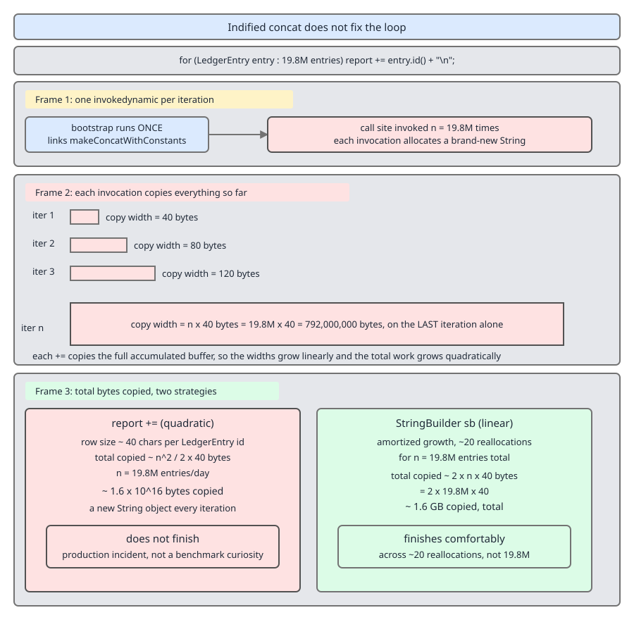

# 03 Java Core — Indified concatenation — INTERNALS (§3.3, 3.3.9–3.3.15)

**Target version: Java 21 LTS.** | **Part 3 of 5** | [Index](../00-index.md)
Previous: [`StringBuilder` internals](04-internals-stringbuilder-and-concat.md) · Next: [The object model, `==` versus `equals`](../objects-equality-and-lifecycle/01-basics.md)

The `+` operator has been compiled three different ways in three different eras, and the belief most engineers carry — "`+` becomes a `StringBuilder`" — describes the era that ended in 2017. Here is the map before the streets.

| Era | What `javac` emits for `a + b + c` | Where the result size is decided | Per-execution cost | Per-call-site one-off cost |
|---|---|---|---|---|
| Java 8 and earlier | `new StringBuilder`, a chain of `invokevirtual append`, `invokevirtual toString` | At compile time, badly: the builder starts at capacity 16 and grows by `2 * old + 2` | Builder object + one `char[]` per growth + a final copy in `toString` | none |
| Java 9 through 14 | one `invokedynamic` to `StringConcatFactory.makeConcatWithConstants`, plus a `BootstrapMethods` entry | At runtime, exactly, by the installed `MethodHandle` chain | one `byte[]` of the exact final size, written once, wrapped without copying | one bootstrap per call site; strategy selectable via `-Djava.lang.invoke.stringConcat` |
| Java 15 through 21 | identical bytecode to the above | identical: exact, at runtime | identical | one bootstrap per call site; **the strategy enum and its `-D` switch are gone** |

The bytecode shape did not change at Java 15. What changed is that the alternatives were deleted, so there is now exactly one code path (JDK-8246152, "Improve String concat bootstrapping", Claes Redestad, JDK 15). Verified locally: the string `java.lang.invoke.stringConcat` appears five times in the `jdk14u` source of `StringConcatFactory` and zero times in `jdk15u` and in the `src.zip` shipped with Oracle JDK 21.0.7.

---

## 1. What `+` compiled to before Java 9, and what it compiles to now (3.3.9, 3.3.10)

### Mental model

Java 8 compiled `+` into a **recipe for building the answer**: instructions that construct a mutable buffer, push pieces into it, and copy the buffer out. Java 9 and later compile `+` into a **request for a specialised function**: one instruction that says "give me the function that concatenates a `String` and a `String` into this exact shape", and the runtime hands back a `MethodHandle` chain that measures every argument, allocates one array of precisely the right length, and fills it backwards. The compiler stopped deciding *how* and started declaring *what*.

### Why it exists

`javac`'s Java 8 desugaring was frozen policy. The compiler had no idea how long `clientId` would be, so it emitted a builder with the default capacity 16, and every growth was a fresh array plus a copy. Worse, the desugaring was baked into every class file ever shipped: improving concatenation meant recompiling the world. JEP 280 ("Indify String Concatenation", JDK 9) moved the decision behind an `invokedynamic` linkage so the JDK owns it, and existing class files inherit improvements on the next JVM upgrade.

### When it matters, and when it does not

It matters for any expression evaluated at a real rate — `AccountActivation` writing an audit line on every state transition, `PaymentService` formatting confirmations at 40 card deposits a second. It does **not** matter for the shape of your code: you write `+` either way. And it does not matter at all for concatenation inside a loop, which is the subject of section 4.

### The mechanism, instruction by instruction

The expression under study is the audit line `AccountActivation` writes when a client reaches `AA-801 ACTIVATED`:

```java
public final class AccountActivation {
    public String activationLog(String clientId, String statusCode) {
        return "client " + clientId + " -> " + statusCode;
    }
}
```

Compiled with Oracle JDK 1.8.0_202 `javac` and disassembled with its `javap -c -p`:

```
  public java.lang.String activationLog(java.lang.String, java.lang.String);
    Code:
       0: new           #2                  // class java/lang/StringBuilder
       3: dup
       4: invokespecial #3                  // Method java/lang/StringBuilder."<init>":()V
       7: ldc           #4                  // String client
       9: invokevirtual #5                  // Method java/lang/StringBuilder.append:(Ljava/lang/String;)Ljava/lang/StringBuilder;
      12: aload_1
      13: invokevirtual #5                  // Method java/lang/StringBuilder.append:(Ljava/lang/String;)Ljava/lang/StringBuilder;
      16: ldc           #6                  // String  ->
      18: invokevirtual #5                  // Method java/lang/StringBuilder.append:(Ljava/lang/String;)Ljava/lang/StringBuilder;
      21: aload_2
      22: invokevirtual #5                  // Method java/lang/StringBuilder.append:(Ljava/lang/String;)Ljava/lang/StringBuilder;
      25: invokevirtual #7                  // Method java/lang/StringBuilder.toString:()Ljava/lang/String;
      28: areturn
```

Read it:

- `0: new` allocates an uninitialised `StringBuilder` and pushes its reference.
- `3: dup` duplicates that reference, because `invokespecial <init>` consumes one and the chain needs one left over.
- `4: invokespecial <init>:()V` runs the no-arg constructor, which allocates a `char[16]`. Capacity 16 is a guess made by a compiler that cannot see the arguments.
- `7: ldc #4` pushes the interned literal `"client "` from the constant pool. (`javap` prints trailing spaces invisibly; the literal carries its trailing space.)
- `9: invokevirtual append` appends it and returns the builder, so the reference stays on the stack for the next `append` — that is why the chain needs no reloads.
- `12: aload_1` / `13: invokevirtual append` push and append `clientId`.
- `16: ldc #6` / `18` do the same for `" -> "`.
- `21: aload_2` / `22` do the same for `statusCode`.
- `25: invokevirtual toString` copies the builder's live prefix into a brand-new `String`. This copy is unavoidable: the builder's array is mutable and cannot be shared.
- `28: areturn` returns it.

Nine method calls, one object allocation for the builder, and at least two array allocations. Now the same source compiled with Oracle JDK 21.0.7 `javac`, `javap -c -p -v`, method body first:

```
  public java.lang.String activationLog(java.lang.String, java.lang.String);
    descriptor: (Ljava/lang/String;Ljava/lang/String;)Ljava/lang/String;
    Code:
      stack=2, locals=3, args_size=3
         0: aload_1
         1: aload_2
         2: invokedynamic #7,  0              // InvokeDynamic #0:makeConcatWithConstants:(Ljava/lang/String;Ljava/lang/String;)Ljava/lang/String;
         7: areturn
```

- `0: aload_1` and `1: aload_2` push the two *variable* pieces. The literals `"client "` and `" -> "` are not on the stack at all — they moved into the linkage data.
- `2: invokedynamic #7, 0` is the whole concatenation. `#7` is the `InvokeDynamic` constant-pool entry; the trailing `0` is a reserved zero byte the JVMS requires. The entry names bootstrap method index `#0` and the call-site descriptor `(String, String) -> String`.
- `7: areturn` returns the result. `stack=2` — the frame never needs more than the two arguments.

The literals live in the `BootstrapMethods` attribute:

```
BootstrapMethods:
  0: #21 REF_invokeStatic java/lang/invoke/StringConcatFactory.makeConcatWithConstants:(Ljava/lang/invoke/MethodHandles$Lookup;Ljava/lang/String;Ljava/lang/invoke/MethodType;Ljava/lang/String;[Ljava/lang/Object;)Ljava/lang/invoke/CallSite;
    Method arguments:
      #19 client \1 -> \1
```

| Part of the linkage | Value in this class file | What it is for |
|---|---|---|
| Bootstrap method handle | `REF_invokeStatic StringConcatFactory.makeConcatWithConstants` | the function the JVM calls once, on first execution, to produce a `CallSite` |
| `Lookup` (first BSM parameter) | supplied by the JVM | proves the caller may access private JDK constructors; the factory rejects a lookup without `PRIVATE` mode |
| Invocation name, `MethodType` | `makeConcatWithConstants`, `(String,String)String` | the exact static types of the arguments, which is what makes exact sizing possible |
| Recipe (static argument 1) | `client \1 -> \1` | the literal text with `\1` marking each argument hole |
| Constant arguments (varargs tail) | empty here | pieces spliced in with a `\2` hole instead of being inlined into the recipe |

`\1` is `TAG_ARG`, `\2` is `TAG_CONST`, straight from the JDK 21 source:

```java
    private static final char TAG_ARG = '\u0001';
    private static final char TAG_CONST = '\u0002';
```

In the real `javap` output those two holes are raw control bytes, printed as `\u0001` by `javap` and written here as `\1` throughout; they are never source-visible. `parseRecipe` walks the recipe and splits it into a per-argument prefix array: every ordinary character accumulates into a `StringBuilder`, and each `\1` flushes the accumulator into `consts[oCount++]`, storing `null` when the accumulator is empty. For this recipe the result is `consts = ["client ", " -> ", null]` — two prefixes and a null suffix.

Then the factory installs the call site:

```java
        try {
            return new ConstantCallSite(
                    generateMHInlineCopy(concatType, constantStrings)
                            .viewAsType(concatType, true));
```

Every line matters. `generateMHInlineCopy` builds the `MethodHandle` combinator tree for *these* argument types. `viewAsType` retypes it to the call-site descriptor without inserting casts. `ConstantCallSite` is the load-bearing word: a constant call site's target can never change, so after linkage the JIT treats the concatenation as a directly inlinable call with no guard. The bootstrap has no second chance and needs none.


**D-100** — `+` before and after Java 9. Look at the instruction counts on each side, and then at the right-hand `CallSite` box: it is drawn running once, while the `invokedynamic` above it runs on every call. That asymmetry is the entire point of the redesign.

### The gotcha

`javap -c` alone is not enough evidence on Java 9+. Without `-v` you see `invokedynamic #7, 0` and no recipe, so you cannot tell what is being concatenated or how many arguments the call site takes. Always use `javap -c -p -v` when the question is about concatenation, and read the `BootstrapMethods` attribute.

**Interview:** "What does `+` on strings compile to?" — "One `invokedynamic` to `StringConcatFactory.makeConcatWithConstants` with a recipe constant, since Java 9. Before Java 9 it was `new StringBuilder().append(…).toString()`, which is what interviewers usually expect and what `javap` still shows on an 8-compiled class file."

> **Indified concatenation** is the Java 9+ compilation of `+` into a single `invokedynamic` whose bootstrap, run once per call site, installs a `ConstantCallSite` holding a `MethodHandle` chain specialised to that expression's static argument types.

---

## 2. Why indirection through a bootstrap is worth it (3.3.11, 3.3.12)

No diagram of its own; D-100 already carries the picture, and the sizing arithmetic below is the argument.

### The two payoffs, proved

**Payoff one: the strategy can change without recompiling.** The class file names a bootstrap method and a recipe. It does not name `StringBuilder`, does not name a capacity, does not name an allocation. Every decision about *how* is made by the JDK at link time. That is why JDK 15 could delete four of the five concatenation strategies and rewrite the combinator tree while class files compiled by JDK 9 kept working and got faster. Under the Java 8 desugaring the same improvement would have required recompiling every artefact in the estate.

**Payoff two: the runtime can size the result exactly.** Work it through for the activation line, with a 36-character UUID `ClientId` and the 16-character `StatusCode` text `AA-801 ACTIVATED`. Constants: `"client "` is 7 chars, `" -> "` is 4. Final length is 7 + 36 + 4 + 16 = **63 characters**, all Latin-1.

*Java 8 path.* `char[16]` from the constructor. Append 7 — fits. Append 36 — needs 43, exceeds 16, so `newCapacity` proposes `2 * 16 + 2 = 34`, which is still short, so 43 is used; allocate `char[43]`, copy the 7 chars already written. Append 4 — needs 47, exceeds 43, so `2 * 43 + 2 = 88`; allocate `char[88]`, copy 43 chars. Append 16 — 63 fits in 88. `toString` allocates the final 63-char array and copies 63. Total: **4 arrays** (16, 43, 88, 63), **113 characters copied**, plus the `StringBuilder` object itself. (The `2 * old + 2` rule, `newCapacity`, and the coder shift are derived in full in [`04-internals-stringbuilder-and-concat.md`](04-internals-stringbuilder-and-concat.md); this file only uses the result.)

*Java 21 path.* The `MethodHandle` chain first *mixes*: it walks the arguments accumulating length and coder into a single packed `long`, seeded with the constants' contribution. From `StringConcatHelper`:

```java
    static long mix(long lengthCoder, String value) {
        lengthCoder += value.length();
        if (value.coder() == String.UTF16) {
            lengthCoder |= UTF16;
        }
        return checkOverflow(lengthCoder);
    }
```

The low 32 bits hold the running length, the high bits hold the coder — `LATIN1 = 0`, `UTF16 = 1` — so one `long` carries both and a single `|=` promotes the whole result to UTF-16 the moment any piece is non-Latin-1. `checkOverflow` rejects a length that has wrapped negative with an `OutOfMemoryError` rather than allocating a corrupt array. Then it allocates once:

```java
    static byte[] newArray(long indexCoder) {
        byte coder = (byte)(indexCoder >> 32);
        int index = ((int)indexCoder) << coder;
        if (index < 0) {
            throw new OutOfMemoryError("Overflow: String length out of range");
        }
        return (byte[]) UNSAFE.allocateUninitializedArray(byte.class, index);
    }
```

`indexCoder >> 32` extracts the coder; `((int)indexCoder) << coder` converts a character count into a byte count — a free shift by 0 for Latin-1, by 1 for UTF-16. `allocateUninitializedArray` skips the JVM's zero-fill, which is safe only because the prependers are guaranteed to write every byte. The chain then fills the array **backwards** from the end, each prepender writing its piece and returning the new index, and finishes with:

```java
    static String newString(byte[] buf, long indexCoder) {
        // Use the private, non-copying constructor (unsafe!)
        if (indexCoder == LATIN1) {
            return new String(buf, String.LATIN1);
```

`indexCoder == LATIN1` means the index has walked all the way down to zero with coder 0 — every byte written, nothing left. Only then does it hand the array to the package-private `String(byte[], byte)` constructor, which **adopts** the array instead of copying it. If the index is not zero the else branch throws `InternalError`, because a partially written uninitialised array must never escape as a `String`.

Total for the Java 21 path: **1 array** of 63 bytes, **63 bytes written**, **0 bytes copied**, no builder object. Against Java 8's four arrays and 113 characters copied. At `PaymentService`'s 40 card-deposit confirmations a second the absolute saving is trivial — roughly 120 avoided allocations a second — but the *shape* of the saving is what matters: allocation count per expression drops from `2 + growths` to exactly 1, which is what removes concatenation from allocation-rate profiles entirely.

**Insight:** exact sizing is only possible because the `MethodType` at the call site is static. The bootstrap knows it is concatenating `(String, String)`, so it can specialise mixers and prependers per type with no boxing and no branching on argument kind. That information is exactly what the Java 8 desugaring threw away by funnelling everything through `append(Object)` overload resolution at compile time.

### The strategy switch: a version trap (3.3.12)

**Pitfall:** the strategy list `BC_SB`, `BC_SB_SIZED`, `MH_INLINE_SIZED_EXACT` and the `-Djava.lang.invoke.stringConcat` flag are **JDK 9–14 history**. Verified against the JDK 21.0.7 `src.zip`: `StringConcatFactory` contains no `Strategy` enum, no `DEFAULT_STRATEGY`, and no reference to that system property. JDK 11's copy has all of them (`Strategy.BC_SB`, `BC_SB_SIZED`, `BC_SB_SIZED_EXACT`, `MH_SB_SIZED`, `MH_SB_SIZED_EXACT`, `MH_INLINE_SIZED_EXACT`, with `MH_INLINE_SIZED_EXACT` as the default); JDK 17's does not. The removal is JDK 15. Symptom of the stale belief: you pass `-Djava.lang.invoke.stringConcat=BC_SB` to "get the old behaviour" on a Java 21 service, see no error and no change, and conclude the flag worked. It did not — an unrecognised `-D` is just a system property nobody reads. Fix: on Java 15+ there is exactly one strategy, the exact-sized `MethodHandle` inline copy, and nothing to tune. If you must compare against the builder shape, write the builder by hand.

One live limit did survive and is worth knowing: `MAX_INDY_CONCAT_ARG_SLOTS = 200`. A concatenation whose argument slots exceed 200 makes the bootstrap throw `StringConcatException("Too many concat argument slots: …")`, so `javac` splits very large expressions into several `invokedynamic` calls rather than emitting one oversized call site.

> The bootstrap indirection buys **upgradeability** (the JDK owns the strategy, class files do not) and **exactness** (the runtime sees the arguments, so it allocates once), at the price of one linkage per call site.

---

## 3. The bootstrap cost (3.3.13)

No diagram; this section is arithmetic and measurement.

### The mechanism

The first time a concatenation call site executes, the JVM resolves the `InvokeDynamic` constant, calls `makeConcatWithConstants`, and that call parses the recipe and assembles a `MethodHandle` combinator tree out of `mixer`, `prepender`, `newArray` and `newString` handles. Assembling handles means loading and spinning `LambdaForm` classes — real classloading work. The JDK acknowledges it in the source, immediately above the factory method:

```java
    // StringConcatFactory bootstrap methods are startup sensitive, and may be
    // special cased in java.lang.invoke.BootstrapMethodInvoker to ensure
    // methods are invoked with exact type information to avoid generating
    // code for runtime checks. Take care any changes or additions here are
    // reflected there as appropriate.
```

### What it actually costs

Measured on Oracle JDK 21.0.7, macOS aarch64, timing two distinct concatenation call sites in a trivial `main` with `System.nanoTime`, three runs:

| Event | Run 1 | Run 2 | Run 3 |
|---|---|---|---|
| First call site in the JVM (bootstrap + invoke) | 6.14 ms | 5.76 ms | 5.59 ms |
| Second execution of the same, now-linked call site | 3.04 us | 3.25 us | 2.71 us |
| A *different* call site's first execution | 63 us | 62 us | 69 us |

Read the three rows together. The ~6 ms is not the cost of a bootstrap; it is the one-time cost of waking the entire `java.lang.invoke` machinery, paid once per JVM by whichever call site happens to link first. Every later call site pays ~65 us. Once linked, a `ConstantCallSite` costs nothing extra — the ~3 us row is cold interpreted code plus `nanoTime` overhead, and after JIT compilation the concatenation inlines to the array allocation and the writes.

Put that against the domain budget: `CardPayments` sees a PSP authorise p50 of 240 ms and a p99 of 11 s. A handful of milliseconds of `invoke` warm-up on the first request after a deploy is invisible against a 240 ms downstream call, and it is a **startup** cost, not a steady-state one — it never appears again for the life of the JVM. It becomes a real problem only where startup *is* the budget: a short-lived function, a CLI, a scale-from-zero container. That is precisely why AOT-style work targets it — CDS archives the classes, and AOT linking of `invokedynamic` call sites removes the per-site assembly. **Full treatment of CDS, AOT and the JIT's view of a `ConstantCallSite` is in guide 06, JVM internals**; what you need here is the shape: bounded, one-off, per call site, and concentrated in the first requests after a deploy.

**Tradeoff:** indified concat is faster per expression and allocates once, **but** costs a linkage on first execution, **and** does nothing for a loop — escape hatches being CDS/AOT for the startup half and a hoisted builder for the loop half.

---

## 4. What indified concatenation does not fix: the loop (3.3.14, 3.3.15)

### Mental model

The bootstrap runs once. The **concatenation** runs every iteration, and every run produces a brand-new immutable `String` by copying everything accumulated so far. Exact sizing makes each individual copy optimal; it does not make the copies stop happening. A loop that reassigns a `String` is quadratic in Java 21 for exactly the reason it was quadratic in Java 5.

### The mechanism

`FundsLedger` building a reconciliation report over a day of ledger entries:

```java
public final class FundsLedger {
    // Quadratic. Do not ship this.
    public String reconciliationReport(List<LedgerEntry> entries) {
        String report = "";
        for (LedgerEntry entry : entries) {
            report += entry.id() + "\n";
        }
        return report;
    }
}
```

`javap -c -p` on the JDK 21 compilation of that loop body, cut to the loop itself (the array-iteration setup at offsets 3 through 22 and the `areturn` tail are omitted from this excerpt, not elided from the method):

```
      25: aload_2
      26: aload         6
      28: invokedynamic #9,  0              // InvokeDynamic #0:makeConcatWithConstants:(Ljava/lang/String;Ljava/lang/String;)Ljava/lang/String;
      33: astore_2
      34: iinc          5, 1
      37: goto          12
```

- `25: aload_2` pushes the accumulated `report` — the whole string built so far.
- `26: aload 6` pushes the current entry's contribution.
- `28: invokedynamic` concatenates them. The bootstrap for `#0` ran on iteration 1 and never runs again; this instruction executes once per iteration.
- `33: astore_2` overwrites `report` with the new `String`. The previous one becomes garbage immediately.
- `34: iinc` / `37: goto` close the loop.

One `invokedynamic` per iteration, and each one allocates a fresh array of the full accumulated length and writes every byte of it.



**D-101** — the loop. In frame 1, note that the bootstrap box has an arrow into iteration 1 only, while the `invokedynamic` fires on every iteration. In frame 2, watch the copy bars widen from iteration 1 to iteration n: that widening *is* the quadratic term.

### Proving the quadratic

Let n be the number of entries and k the bytes each contributes. A `LedgerEntry` id is a 36-character UUID plus the newline, so k = 37. `FundsLedger` writes ~19.8M entries a day, so n = 19,800,000.

Iteration i produces a string of length `i * k`, and producing it writes `i * k` bytes. Total bytes written across the loop:

`sum(i = 1 to n) of i*k = k * n * (n + 1) / 2 ≈ 37 * (1.98e7)² / 2 = 37 * 1.9602e14 ≈ 7.25e15 bytes`

About **7.25 petabytes** of memory traffic to produce a **732.6 MB** string, plus 19.8M dead `String` objects and 19.8M dead arrays for the collector. Exact sizing helped: it made each of those 19.8M copies exactly the right size instead of over-allocating. The total is still O(n²) and the job will never finish.

Hoist the builder and the same work becomes linear:

```java
public final class FundsLedger {
    public String reconciliationReport(List<LedgerEntry> entries) {
        StringBuilder report = new StringBuilder(entries.size() * 37);
        for (LedgerEntry entry : entries) {
            report.append(entry.id()).append('\n');
        }
        return report.toString();
    }
}
```

One buffer, each byte written once, one final copy in `toString` — about `n * k` bytes written plus `n * k` copied, roughly 1.5 GB of traffic instead of 7.25 PB. Presizing to `entries.size() * 37` removes the growth copies too; without it, `2 * old + 2` growth costs an amortised constant per character, which is still linear overall.

**Pitfall — "concatenation in a loop is fine now, the compiler optimises it."**
*Wrong belief:* since Java 9 replaced the builder with a single `invokedynamic`, `report += x` inside a loop is handled by the runtime.
*Symptom:* a report job that is instant on a 100-row fixture and hangs, then dies with `OutOfMemoryError` or a GC-thrashing stall, on production volumes. The profiler shows all time in `StringConcatHelper.newArray` and in the collector, and — the tell — the allocation *rate* looks reasonable while the *bytes copied* is enormous.
*Fix:* one mutable buffer for the whole loop. `StringBuilder` hoisted out, or `Collectors.joining`, or a `Writer` if the report is going to a file anyway. `javac` cannot do this for you: it would have to prove nothing else observes the intermediate `String` values, and reassignment across a loop back-edge defeats that.

**Pitfall — "a hand-written `StringBuilder` is always the wrong choice now."** False in two places. Inside a loop, the builder is the *only* correct choice. And when pieces are produced conditionally — a payout line that appends a fee only when one applies, or a bonus reference only on a first deposit — `+` cannot express "sometimes", so you either build with `+` on every branch (allocating per branch) or use one builder. Where `+` genuinely wins is a fixed, straight-line expression: there, `+` is both shorter and strictly cheaper than a builder, because the runtime sizes it exactly and the builder cannot.

### Measuring it (3.3.15)

Two things to measure, and they need different tools. **The emitted form** is a `javap -c -p -v` question: compile the same expression under JDK 8 and JDK 21 and diff the listings, exactly as section 1 did. **Cost** is a JMH question — anything less gives you JIT warm-up noise instead of steady-state throughput.

The table below is what `PaymentRun` should consult when choosing how to build its payout file lines. **The ordering is derived from mechanism — allocations per call, bytes copied, and whether a `Formatter` and a format-string parse happen — not measured.** No throughput figures are quoted because none were produced here.

| Construct | Allocations per call (fixed 4-piece line) | Format string parsed at runtime | Cost driver | When it is the right choice |
|---|---|---|---|---|
| `+` (indified) | 1 `byte[]`, adopted into 1 `String` | no | one exact-size write, no copy | fixed, straight-line expressions; the default |
| `StringBuilder` (presized, hoisted) | 1 `byte[]`, plus 1 copy in `toString`, plus the builder | no | one copy; zero growth copies if presized | loops, conditional pieces, incremental building |
| `String.format` | a `Formatter`, a `StringBuilder`, per-argument boxing, the result | **yes, every call** | format-string parse plus reflection-free but boxed argument dispatch | user-facing or locale-sensitive text where clarity beats cost |
| `String.join` | 1 `StringJoiner` internally, 1 result | no | single pass, sizes from the elements | a known collection joined by one fixed delimiter |
| `StringJoiner` | 1 internal `StringBuilder`, 1 result | no | one copy; adds prefix/suffix/empty-value handling | incremental joining that needs a delimiter, prefix, suffix, or an "empty" fallback |

For `PaymentRun`'s payout file — many lines, built in a loop, each line a fixed shape — the answer is a single hoisted `StringBuilder` (or a `BufferedWriter`) for the file, with `+` inside each line. **JMH harness design, warm-up and fork counts, and how to read the resulting allocation profiles belong to guide 06, JVM internals.**

**Interview:** "How would you prove `+` is faster than `String.format` here?" — "`javap -c -p -v` for the shape, JMH with `@BenchmarkMode(Throughput)` and a `-prof gc` run for the cost, and I would state the mechanism first: `format` parses the format string and constructs a `Formatter` on every call, `+` does neither."

---

## Pitfalls

### Believing `+` still compiles to a `StringBuilder`

**Wrong**

You explain in an interview that `"client " + clientId + " -> " + statusCode` becomes `new StringBuilder().append("client ").append(clientId).append(" -> ").append(statusCode).toString()`, then run `javap -c -p -v` on the class your JDK 21 build just produced and find a four-instruction method: `aload_1`, `aload_2`, `invokedynamic #7, 0`, `areturn`. No `StringBuilder` anywhere in the constant pool.

**Right**

`javac` emits one `invokedynamic` whose bootstrap is `StringConcatFactory.makeConcatWithConstants`, with the literals carried as a recipe constant `client \1 -> \1` in the `BootstrapMethods` attribute. The bootstrap runs once per call site and installs a `ConstantCallSite` wrapping a `MethodHandle` chain that measures the arguments, allocates one exactly sized `byte[]`, fills it backwards, and adopts it into a `String` without copying.

**Why people believe it:** it was true through Java 8, every pre-2017 blog post and most interview-prep material says so, and interviewers who learned it then still expect the old answer. Give both, and say which version each belongs to.

### Believing concatenation in a loop is fine now

**Wrong**

`report += entry.id() + "\n"` over 19.8M `LedgerEntry` rows, on the grounds that the runtime now handles concatenation. The job passes a 100-row test and dies in production.

**Right**

One `invokedynamic` executes per iteration, each producing a fresh `String` of the full accumulated length. Bytes written total `k * n * (n + 1) / 2` — roughly 7.25 PB for k = 37, n = 19.8M, to build a 732.6 MB result. Hoist one presized `StringBuilder` out of the loop: about 1.5 GB, linear.

**Why people believe it:** the bootstrap genuinely does run only once, and "runs once" gets over-generalised from linkage to execution. The `invokedynamic` instruction is inside the loop body; only its resolution is outside.

### Believing `-Djava.lang.invoke.stringConcat` still tunes it

**Wrong**

Adding `-Djava.lang.invoke.stringConcat=BC_SB` to a Java 21 service to reproduce the builder shape. The JVM starts cleanly, so it looks accepted; nothing changes.

**Right**

The `Strategy` enum and that property were removed in JDK 15 by JDK-8246152. JDK 21's `StringConcatFactory` has one code path, `generateMHInlineCopy`. An unrecognised `-D` sets a system property that nothing reads — silence is not confirmation. To compare shapes, hand-write the builder.

**Why people believe it:** the flag was documented in the JDK 9 javadoc and every JEP 280 write-up, and it worked for six releases. The javadoc stopped mentioning it without any deprecation cycle, because it was never a supported product flag.

### Believing a hand-written builder is always obsolete

**Wrong**

Rewriting every `StringBuilder` in the payout-file writer into `+` because "`+` is faster now".

**Right**

`+` wins only for a fixed, straight-line expression, where exact sizing beats the builder. Inside a loop, or where pieces are appended conditionally, one hoisted builder wins by an unbounded margin — and `+` cannot express a conditional append at all.

**Why people believe it:** the headline of JEP 280 is "`+` got faster", which is true per expression and says nothing about per loop.

---

## Cheat sheet

| Question | Answer |
|---|---|
| `+` on Java 8 | `new StringBuilder` / `append` chain / `toString`, capacity 16, grows `2 * old + 2` |
| `+` on Java 9–21 | one `invokedynamic` to `StringConcatFactory.makeConcatWithConstants` |
| JEP | 280, Indify String Concatenation, JDK 9 |
| Recipe tags | `\1` = `TAG_ARG` = the char `\u0001`; `\2` = `TAG_CONST` = the char `\u0002` |
| Recipe for `"client " + a + " -> " + b` | `client \1 -> \1`, constants array empty |
| Call site type | `ConstantCallSite` — target never changes, JIT inlines with no guard |
| Sizing | `mix` packs length + coder into one `long`; `newArray` allocates uninitialised; `newString` adopts without copying |
| Coder bits | `LATIN1 = 0`, `UTF16 = 1`, in the high bits of the packed `long` |
| Arg-slot limit | `MAX_INDY_CONCAT_ARG_SLOTS = 200`; over it, `StringConcatException` |
| Strategy switch | JDK 9–14 only; removed in JDK 15 (JDK-8246152) |
| Bootstrap cost (21.0.7, aarch64) | ~6 ms for the first call site in the JVM, ~65 us per later call site, once each |
| Loop concat | still O(n²): one `invokedynamic` per iteration, full copy each time |
| Loop fix | one presized `StringBuilder` hoisted out, or `Collectors.joining`, or a `Writer` |
| Evidence command | `javap -c -p -v` — without `-v` you cannot see the recipe |

---

## Self-test

**Q1.** On JDK 21, `javap -c` shows `invokedynamic #9, 0` for a concatenation. What is the trailing `0`, and what must you add to the command to see the literals?

<details><summary>Answer</summary>

The trailing `0` is a reserved zero byte mandated by the JVMS for the `invokedynamic` instruction; it carries no information. The literals are not in the code array at all — they live in the recipe constant inside the `BootstrapMethods` class-file attribute, which `javap` only prints with `-v`. Use `javap -c -p -v`.

</details>

**Q2.** The recipe for `"client " + clientId + " -> " + statusCode` is `client \1 -> \1` and the constants varargs array is empty. When would a piece appear in the constants array instead, marked `\2`?

<details><summary>Answer</summary>

When the constant cannot be embedded directly in the recipe string — chiefly when it would collide with the tag characters `\u0001` or `\u0002`, or when the caller (a non-`javac` producer such as the string-template machinery) chooses to pass it separately. `parseRecipe` treats `\2` as "take the next element of the constants array and append it to the accumulator", so `\1` and `\2` differ in that `\1` closes off a prefix and opens an argument hole while `\2` just splices more constant text in.

</details>

**Q3.** The bootstrap runs once. Why is concatenation in a loop still quadratic?

<details><summary>Answer</summary>

Only the *linkage* is outside the loop. The `invokedynamic` instruction sits in the loop body and executes every iteration, and each execution produces a new immutable `String` containing everything accumulated so far — a fresh array of length `i * k` and `i * k` bytes written on iteration i. Summing gives `k * n * (n + 1) / 2`, which is O(n²). Exact sizing makes each copy minimal; it does not remove the copies. A single hoisted `StringBuilder` writes each byte once, making the loop linear.

</details>

**Q4.** Explain why `newArray` can call `allocateUninitializedArray` — skipping the JVM's zero-fill — without ever risking uninitialised bytes escaping into a `String`.

<details><summary>Answer</summary>

Because the length came from `mix`, which summed the exact length of every piece, and the prepender chain is guaranteed to write from the end of the array down to index 0. `newString` then asserts that guarantee: it only adopts the array when `indexCoder` equals `LATIN1` or `UTF16` — that is, when the remaining index has reached zero — and throws `InternalError("Storage is not completely initialized, …")` otherwise. The uninitialised array is therefore either fully written or never published.

</details>

**Q5.** A colleague adds `-Djava.lang.invoke.stringConcat=BC_SB_SIZED` to a Java 21 service and reports that the JVM accepted it. What do you tell them?

<details><summary>Answer</summary>

The JVM accepts any `-D` as a system property; acceptance proves nothing. The `Strategy` enum and that property were removed in JDK 15 (JDK-8246152), so nothing in `StringConcatFactory` reads it — JDK 21 has a single path, `generateMHInlineCopy`. The flag existed and worked on JDK 9 through 14. If they want to compare against the builder shape on 21, they have to write the `StringBuilder` chain by hand.

</details>

**Q6.** `PaymentRun` builds one payout line per client from four fixed pieces, then writes 7,000 lines to a file. Where does `+` belong and where does it not, and why?

<details><summary>Answer</summary>

`+` belongs *inside* the line: four fixed pieces in a straight-line expression is exactly the case indified concatenation optimises — one `invokedynamic`, one exactly sized array, no copy, and it beats a per-line `StringBuilder` because the builder cannot size itself exactly. `+` does not belong *across* lines: accumulating the file with `file += line` would be one full copy per line and quadratic. Use one hoisted `StringBuilder` presized to the expected total, or better, a `BufferedWriter` so the whole file never has to be resident as a `String` at once.

</details>

---

**Leaves covered:** 3.3.9–3.3.15 (7 leaves)
**Leaves deferred:** none
**Diagrams included:** D-100, D-101
**Target version:** Java 21 LTS
**Lines:** 469
