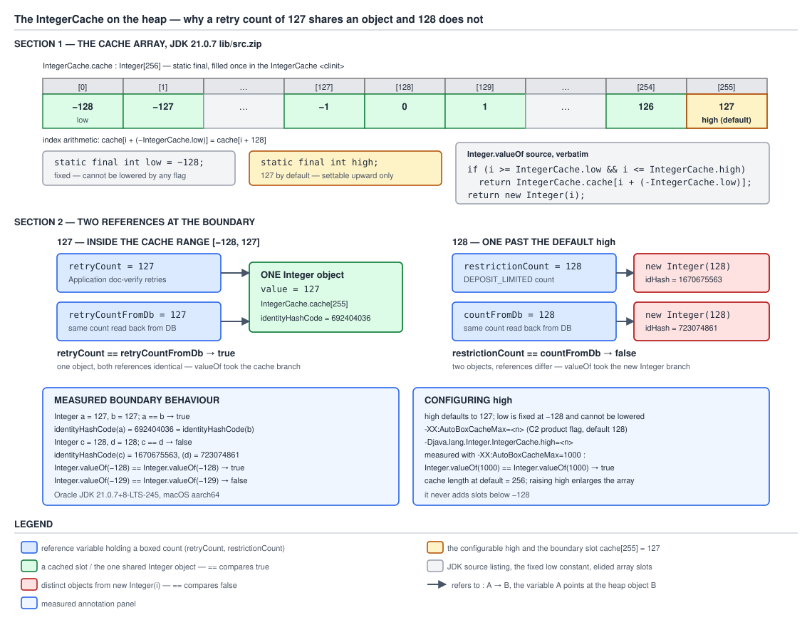

# 03 Java Core — The wrapper caches — BASICS (§1.9, 1.9.3, 1.9.4)

**Target version: Java 21 LTS.** | **Part 1 of 5** | [Index](../00-index.md)
Previous: [Wrappers and autoboxing](01-basics.md) · Next: [The archived cache](01a2-the-archived-cache.md)

[`01-basics.md`](01-basics.md) established that `Integer stakeRetries = 3;` is not a language
primitive operation but a compiler rewrite into `Integer.valueOf(3)`. That leaves the interesting
question untouched: what does `Integer.valueOf` actually *do*? The answer is why autoboxing is
affordable at all, why `==` on wrappers is the most-asked trick question in Java interviews, and —
in Java 21 — why a startup flag can silently change a program's identity semantics.

This file owns how the cache is **built** and **configured**. Where the array comes from on a modern
JVM — the CDS archived heap subgraph rather than the construction loop — is
[`01a2-the-archived-cache.md`](01a2-the-archived-cache.md). What the cache boundary does to `==`,
which of the eight wrappers cache what, and the `identityHashCode` walk-through belong to
[`01b-cache-coverage-and-reference-equality.md`](01b-cache-coverage-and-reference-equality.md). The
line-by-line source walk with the three-path flowchart belongs to
[`03-internals-boxing.md`](03-internals-boxing.md). Here you build the model.

---

## 1. `Integer.valueOf` hands out shared instances from a pre-built array (1.9.3)

`[SOURCE]` `[NUM]` Picture a 256-slot shelf, built once, reachable only through one door. On the
shelf sit 256 `Integer` objects, one for each value from −128 to 127, in order. `Integer.valueOf(i)`
is not a constructor call and not an allocation — it is an index computation and an array read. Slot
0 holds −128, slot 128 holds 0, slot 255 holds 127. Ask for the box of a small `int` twice and you
get the *same* object back both times, because there is only one on the shelf. Ask for the box of
128 and the shelf has nothing for you, so you get a freshly allocated object each time.

### Why it exists

Autoboxing arrived in Java 5 (JSR 201). Before it, every `Map<String, Integer>` insertion, every
`List<Integer>` element, every `Integer` counter was written by hand as `new Integer(n)`, so the
allocation was visible in the source and you noticed it. Autoboxing made the allocation invisible —
and instantly ubiquitous. A `Map<String, Integer>` of ledger position totals, a boxed retry counter
incremented in a loop, an `Integer` returned from a repository method: every one of those became a
heap allocation nobody wrote down.

The designers' answer was not to make boxing cheaper in general but to make the *common* case free.
Real programs box small numbers overwhelmingly more often than large ones: retry counts, attempt
numbers, status phase digits, collection sizes, loop indices, `0` and `1` and `-1`. So JLS 21
§5.1.7 *requires* that boxing an `int` between −128 and 127 yields a reference shared with every
other boxing of the same value. That guarantee — not a JIT optimisation — is what turns the most
common boxing into an array read.

**When to lean on it:** for cost only. Boxing small values in a hot path is genuinely cheap. Never
for identity. **When it stops helping:** the moment values leave the range, which for ledger amounts
in minor units or client ids is immediately. The alternative that wins there is not a wider cache
but not boxing at all — `int[]`, `IntStream`, primitive accumulators. See
[`01g-the-cost-of-boxing.md`](01g-the-cost-of-boxing.md).

### The mechanism

The whole of `Integer.valueOf` in JDK 21.0.7:

```java
@IntrinsicCandidate
public static Integer valueOf(int i) {
    if (i >= IntegerCache.low && i <= IntegerCache.high)
        return IntegerCache.cache[i + (-IntegerCache.low)];
    return new Integer(i);
}
```

Four lines, and every one matters.

- `@IntrinsicCandidate` marks the method as one the JVM is *allowed* to replace with a hand-written
  intrinsic rather than compiling the Java body. It is a permission, not a promise.
- `i >= IntegerCache.low && i <= IntegerCache.high` — the range test reads two `static final` fields
  of a nested class. Touching `IntegerCache.low` is what forces `IntegerCache` to initialise, which
  is where the array comes from.
- `IntegerCache.cache[i + (-IntegerCache.low)]` — the shared instance. The index is written as
  `i + (-low)`, not `i + 128`. Two reasons. It stays correct if `low` were ever moved; and `low` is a
  `static final int` initialised to a literal, so it is a *compile-time constant* under JLS §4.12.4.
  `javac` folds `-IntegerCache.low` to the literal `128`, so the emitted bytecode is an `iadd`
  against a constant, exactly as if someone had written `i + 128`. The readable form costs nothing.
  Constant folding of `static final` fields is
  [`../classes-and-initialization/04-internals-final-and-constant-folding.md`](../classes-and-initialization/04-internals-final-and-constant-folding.md).
- `return new Integer(i)` — outside the range, a genuine allocation, via the constructor that is
  terminally deprecated for public use (see
  [`01e-valueof-and-the-deprecated-constructors.md`](01e-valueof-and-the-deprecated-constructors.md); inside `java.lang`
  it is still the only way to make one).

`[NUM]` The arithmetic, explicitly. The array length is computed in the cache's initialiser as
`size = (high - low) + 1`. At the defaults that is `(127 − (−128)) + 1 = 127 + 128 + 1 = 256`
entries. The index for a value `v` is `v + (−low) = v + 128`:

| Value `v` | Index `v + 128` |
|---|---|
| −128 | `−128 + 128` = **0** |
| −1 | `−1 + 128` = **127** |
| 0 | `0 + 128` = **128** |
| 127 | `127 + 128` = **255** |
| 128 | 256 — **off the end**, which is why the range test comes first |

Now the cache itself. This is the array-building part of `IntegerCache`; the `high` half of the same
static initialiser is concept 2, and the CDS half is quoted and read in
[`01a2-the-archived-cache.md`](01a2-the-archived-cache.md).

```java
private static final class IntegerCache {
    static final int low = -128;
    static final int high;

    @Stable
    static final Integer[] cache;
    static Integer[] archivedCache;

    static {
        int size = (high - low) + 1;
        Integer[] c = new Integer[size];
        int j = low;
        for (int i = 0; i < c.length; i++) {
            c[i] = new Integer(j++);
        }
        cache = c;
        // range [-128, 127] must be interned (JLS7 5.1.7)
        assert IntegerCache.high >= 127;
    }

    private IntegerCache() {}
}
```

Reading it:

- `private static final class IntegerCache` — a **private static nested class**. Nothing outside
  `Integer` can name it, and its private constructor means nothing instantiates it. It exists purely
  as a namespace for three static fields.
- `static final int low = -128` — a literal. No property read, no flag, no branch. The lower bound is
  not configurable, by design (concept 2).
- `static final int high` — a **blank final**: declared without an initialiser, assigned exactly once
  in the static block. That is what lets it be computed from a VM property and still be `final`.
- `@Stable static final Integer[] cache` — `jdk.internal.vm.annotation.Stable` tells the JIT that
  although this is a reference to a mutable array, the compiler may treat its elements as
  effectively constant once written. Practically: after initialisation, C2 may fold a read of
  `cache[131]` to the address of a known object. A plain `static final Integer[]` would only make the
  *array reference* constant, never its contents.
- `static Integer[] archivedCache` — the one non-`final` field, and the subject of
  [`01a2-the-archived-cache.md`](01a2-the-archived-cache.md).
- The loop — 256 `new Integer` calls, `j` walking from `low` upward so `c[i]` holds `low + i` by
  construction. This is the only place these objects are made *when they are made in Java at all*;
  on a default JDK 21 JVM they usually are not, because the array arrives pre-built from the CDS
  archive instead.
- `assert IntegerCache.high >= 127`, with the JDK's own comment
  `// range [-128, 127] must be interned (JLS7 5.1.7)` — the source citing the specification at the
  exact point where it could be violated.

**Insight:** this is the **holder-class idiom**, and its thread safety is free. The array is built in
`IntegerCache`'s `<clinit>`, which the JVM runs at most once, under a per-class initialisation lock,
on first active use of `IntegerCache` — which is the first `Integer.valueOf` call that reads
`IntegerCache.low`. No `synchronized`, no `volatile`, no double-checked locking, and no eager cost if
`Integer.valueOf` is never called. Every reader that can see `cache` is guaranteed to see all 256
fully-constructed elements, because class initialisation establishes that ordering. The machinery is
[`../classes-and-initialization/03-internals-class-loading-and-init.md`](../classes-and-initialization/03-internals-class-loading-and-init.md);
what triggers a `<clinit>` at all is
[`../classes-and-initialization/01d-class-initialization-triggers.md`](../classes-and-initialization/01d-class-initialization-triggers.md).

### Diagram



**D-025** — The `IntegerCache.cache` array, indices 0..255 for values −128..127. Two references
holding a retry count of 127 point at the *same* cached object, so `==` is true; two holding 128
point at two distinct objects, so `==` is false. `low = -128` is fixed; `high` defaults to 127 and
can only be raised.

### A concrete example

`DocumentVerification` retries an identity-vendor call a handful of times before routing the case to
`AA-650 DOCUMENTS_REFERRED`. The retry count is a small `int` that gets boxed every time it goes into
a map or a structured log field.

```java
final class RetryCountProbe {

    /** Two independent boxings of the same retry count. */
    static boolean sharesInstance(int retryCount) {
        Integer first = Integer.valueOf(retryCount);
        Integer second = Integer.valueOf(retryCount);
        return first == second;
    }

    /** The same index arithmetic Integer.valueOf performs internally. */
    static int cacheIndexOf(int retryCount) {
        return retryCount + 128;
    }

    public static void main(String[] args) {
        System.out.println(sharesInstance(3));      // true  — slot 131
        System.out.println(sharesInstance(127));    // true  — slot 255
        System.out.println(sharesInstance(128));    // false — off the end of the shelf
        System.out.println(cacheIndexOf(-128) + " "
                + cacheIndexOf(0) + " " + cacheIndexOf(127));   // 0 128 255
    }
}
```

Measured on JDK 21.0.7: `Integer.valueOf(3) == Integer.valueOf(3)` is **true**, and so is the 127
case; the 128 case is **false**. For contrast, in the same measured run
`new Integer(3) == new Integer(3)` is **false** — the constructor never consults the cache, which is
the entire behavioural difference between the deprecated constructor and the factory.

**Interview:** *"Why is `Integer.valueOf(127) == Integer.valueOf(127)` true?"* Because JLS §5.1.7
requires boxing of −128..127 to yield a shared reference, and the JDK implements that with
`IntegerCache.cache`, a 256-element `Integer[]` built once at `IntegerCache` class initialisation;
`valueOf` returns `cache[i + 128]` inside that range and `new Integer(i)` outside it. Both calls
return the identical object, so `==`, which compares references, is true. The follow-up is always
128, and the answer is that 128 is outside the mandated range, so each call allocates.

### The gotcha

The cache is a *guarantee of identity reuse*, and that is precisely what makes `==` on wrappers a
landmine: the operator appears to work for small values because sharing makes reference equality
coincide with value equality, then stops working the moment a value crosses 127. The measured flip,
the `identityHashCode` evidence and the which-wrapper-caches-what table are in
[`01b-cache-coverage-and-reference-equality.md`](01b-cache-coverage-and-reference-equality.md). The
one-line rule: on wrappers, use `equals` or unbox explicitly, never `==`.

> **Definition.** `Integer.valueOf(int)` returns an element of `IntegerCache.cache` — a 256-entry
> `Integer[]` covering −128..127, built once at `IntegerCache`'s class initialisation and indexed by
> `i + 128` — for values in range, and a newly allocated `Integer` otherwise.

---

## 2. The upper bound moves; the lower bound does not (1.9.4)

`[NUM]` `[RESEARCH]` The shelf has two ends, made of different material. `low` is a `static final
int` initialised to the literal `-128`: frozen at compile time, by specification. `high` is a blank
`static final int` filled at class initialisation from a saved VM property: frozen for the life of
the JVM, but chosen at launch. So the range is half specification and half deployment configuration
— and the configurable half moves in only one direction.

### Why it exists

Some applications have hot values that are small but not *that* small. A QuizStakes deployment that
boxes status phase codes, ledger position ordinals or operator queue depths in the low thousands
boxes them constantly — the status-code space alone runs from `AO-099` to `AA-920`. Every boxing
outside 127 is a 16-byte allocation. Raising `high` converts those into array reads, and that is the
single legitimate reason to touch the flag: a measured allocation problem, on a known and bounded set
of small positive values.

**When not to.** Raising `high` to a large number pins that many `Integer` objects for the life of the
JVM — at 16 bytes each, a `high` of 1,000,000 is roughly 16 MB of permanently live objects plus a
4 MB reference array that can never be collected. Worse than the memory: it makes `==` behave
differently from every other JVM. A latent identity bug that reproduces reliably in test becomes
invisible in production, or code that happened to *work* because 128 was distinct now silently
shares. The flag changes program semantics, not just performance. That is why the first answer is
always to stop boxing — [`01g-the-cost-of-boxing.md`](01g-the-cost-of-boxing.md).

### The mechanism

The `high` half of the same static initialiser, quoted from JDK 21.0.7:

```java
static {
    // high value may be configured by property
    int h = 127;
    String integerCacheHighPropValue =
        VM.getSavedProperty("java.lang.Integer.IntegerCache.high");
    if (integerCacheHighPropValue != null) {
        try {
            h = Math.max(parseInt(integerCacheHighPropValue), 127);
            // Maximum array size is Integer.MAX_VALUE
            h = Math.min(h, Integer.MAX_VALUE - (-low) -1);
        } catch( NumberFormatException nfe) {
            // If the property cannot be parsed into an int, ignore it.
        }
    }
    high = h;
```

- `int h = 127` — the default, hard-coded, before any property is consulted.
- `VM.getSavedProperty("java.lang.Integer.IntegerCache.high")` — `jdk.internal.misc.VM`, not `System`. A *saved* property is captured
  during VM initialisation and then removed from the public system-property table. Measured on
  JDK 21.0.7 with `-XX:AutoBoxCacheMax=1000`,
  `System.getProperty("java.lang.Integer.IntegerCache.high")` returned **`null`**. Measured in the
  same run set, it returns `null` even when the property is passed explicitly as
  `-Djava.lang.Integer.IntegerCache.high=1000`. You cannot discover the configured range by asking
  `System`; you have to probe the behaviour.
- `Math.max(parseInt(integerCacheHighPropValue), 127)` — **the property can only raise `high`, never
  lower it.** Measured: `-XX:AutoBoxCacheMax=50` leaves the boundary exactly where it was, at 127
  shared and 128 distinct. Same for any value below 127, including negatives.
- `Math.min(h, Integer.MAX_VALUE - (-low) - 1)` — the array-size clamp. `[NUM]`
  `2147483647 − 128 − 1 = 2147483518`, which is the largest `high` for which
  `size = (high − low) + 1 = 2147483518 + 128 + 1 = 2147483647` still fits an `int` array length. Ask
  for more and you are silently clamped rather than getting an overflowed negative size.
- `catch (NumberFormatException nfe)` with an empty body — a garbage value is **ignored silently**.
  `-Djava.lang.Integer.IntegerCache.high=lots` produces no warning and no error; you simply keep 127.
- `high = h` — the blank final assigned exactly once.

The flag side, measured with `-XX:+PrintFlagsFinal -version` on JDK 21.0.7, printed exactly:

```
intx AutoBoxCacheMax                          = 128                                    {C2 product} {default}
```

Two surprises in that one line. First, it is a **`{C2 product}` flag** — it lives with the C2
compiler's options, because C2 also uses the boxing range when deciding whether a box can be
eliminated, not only because it feeds the library property. Second, its default prints **128** while
the effective `high` is **127**. There is no contradiction: at the default the JVM does not set the
property at all, so the library never reads one and falls through to its own hard-coded `h = 127`.
The `128` only takes effect once you override it.

Both configuration forms are measured working on JDK 21.0.7, with identical behaviour:

| Launch flags | `valueOf(127)` shared | `valueOf(128)` shared | `valueOf(1000)` shared |
|---|---|---|---|
| none (default) | true | **false** | false |
| `-XX:AutoBoxCacheMax=50` | true | **false** | false |
| `-XX:AutoBoxCacheMax=1000` | true | **true** | **true** |
| `-Djava.lang.Integer.IntegerCache.high=1000` | true | **true** | **true** |

Note that with `high = 1000` the value 1000 itself is *shared*: the flag value becomes `high`
directly, inclusively, not an exclusive bound.

### What the specification actually promises

Two primary sources. The JDK source's own comment:

```java
// range [-128, 127] must be interned (JLS7 5.1.7)
```

And the `Integer.valueOf` javadoc: *"This method will always cache values in the range -128 to 127,
inclusive, and may cache other values outside of this range."*

Read together, the asymmetry is exact:

| Claim | Status |
|---|---|
| −128..127 are shared | **Required.** JLS §5.1.7. Every conforming JVM, every vendor, every version since 5. |
| 128 is *not* shared | **Not promised by anything.** "May cache other values." |
| the sharing range can be widened | Implementation-specific, and HotSpot does expose it |
| the sharing range can be narrowed | Impossible in HotSpot, and would violate the JLS anyway |

**Insight:** code that relies on 127 being shared is relying on a specification guarantee. Code that
relies on 128 *not* being shared is relying on nothing at all — not the JLS, not the javadoc, not
even a stable default, since one JVM flag flips it. That asymmetry is the most useful thing on this
page: "`==` works for small numbers" is true and guaranteed; "`==` fails for big numbers" is true
today and guaranteed by nothing; therefore the only defensible rule is to not use `==` on wrappers
at all.

**Interview:** *"Can you change the cache range, and should you?"* You can raise the upper bound, with
`-XX:AutoBoxCacheMax=n` or `-Djava.lang.Integer.IntegerCache.high=n`; both work and are equivalent.
You cannot lower it — the source clamps with `Math.max(prop, 127)` — and you cannot move the lower
bound at all, because `low` is a `static final` literal that the JLS pins at −128. You should not,
except against a measured allocation profile on a bounded value range, because it pins objects for
the JVM's lifetime and makes your `==` semantics differ from every other JVM, turning latent identity
bugs into production-only ones. In Java 21 it also costs you the CDS archived cache — concept 3.

### Diagram

No diagram of its own for this concept: the configurable end is already annotated on **D-025** above,
where `high` is drawn as the movable boundary at slot 255 and `low = -128` as the fixed one at slot 0.

### A concrete example

The probe that produced the four-row table:

```java
public final class BoxCacheRange {

    static boolean shared(int value) {
        return Integer.valueOf(value) == Integer.valueOf(value);
    }

    public static void main(String[] args) {
        System.out.println("saved property visible? "
                + System.getProperty("java.lang.Integer.IntegerCache.high"));
        System.out.println("127  shared: " + shared(127));
        System.out.println("128  shared: " + shared(128));
        System.out.println("1000 shared: " + shared(1000));
    }
}
```

Its `shared(int)` results across the four launch configurations are the table above. Its first line
printed `saved property visible? null` in all four runs, including both runs that had widened the
range.

### The gotcha

The configuration is invisible from inside the process. `System.getProperty` returns `null` whether
or not the range was widened (measured, both forms), so a library cannot detect that it is running
under a widened cache and cannot defend itself. Any behaviour that depends on the range is
undiagnosable except by evaluating `Integer.valueOf(n) == Integer.valueOf(n)` — which is exactly the
expression you were told never to write.

> **Definition.** `IntegerCache.low` is fixed at −128 by JLS §5.1.7 and hard-coded as a literal;
> `IntegerCache.high` defaults to 127 and can only be **raised**, by `-XX:AutoBoxCacheMax=n` or
> `-Djava.lang.Integer.IntegerCache.high=n`, clamped below by `Math.max(n, 127)` and above by
> `Integer.MAX_VALUE - 128 - 1 = 2147483518`.

---

## Where the array actually comes from

One more mechanism sits in the same static initialiser and is deliberately not covered here: in
Java 21 the 256-element array can be **memory-mapped from the CDS archive** rather than constructed
by the loop above, via an unconditional `CDS.initializeFromArchive(IntegerCache.class)` call that
populates the non-`final` `archivedCache` field from outside Java code. It changes nothing about
which values are shared or about `==`; it changes who allocated the objects and when, and it
interacts badly with `-XX:AutoBoxCacheMax`. Full treatment, with the measured
`-Xlog:cds+heap=info` evidence and the `-Xshare:off` control, in
[`01a2-the-archived-cache.md`](01a2-the-archived-cache.md).

---

## Pitfalls

### Raising `-XX:AutoBoxCacheMax` to fix an allocation problem, and changing `==` semantics as a side effect

**Wrong**

```java
// A profiler shows Integer allocation on the ledger-position path, so the launch script gains:
//   java -XX:AutoBoxCacheMax=1000 -jar funds-ledger.jar
// Elsewhere in the codebase, written years earlier:
static boolean sameReservationAmount(Integer left, Integer right) {
    return left == right;          // reference comparison
}
```

Measured on JDK 21.0.7, `Integer.valueOf(1000) == Integer.valueOf(1000)`:

```
default                      -> false
-XX:AutoBoxCacheMax=1000     -> true
```

The buggy method used to return `false` for two 1000-minor-unit reservations, which the integration
suite caught. Under the flag it returns `true` — the bug's symptom disappears while the bug remains,
and any *other* site that depended on distinctness silently changes behaviour. There is a second
cost, in startup rather than in semantics; it is
[`01a2-the-archived-cache.md`](01a2-the-archived-cache.md)'s subject.

**Right**

```java
// Fix the comparison, not the JVM.
static boolean sameReservationAmount(Integer left, Integer right) {
    return Objects.equals(left, right);        // null-safe value comparison
}

// And fix the allocation by not boxing, which is what the profiler was really saying.
static long totalReservedMinorUnits(int[] reservationMinorUnits) {
    long total = 0L;                           // primitive accumulator, zero boxes
    for (int minorUnits : reservationMinorUnits) {
        total += minorUnits;
    }
    return total;
}
```

The escape hatches — `int[]`, `IntStream`, primitive accumulators, `long` totals — are in
[`01g-the-cost-of-boxing.md`](01g-the-cost-of-boxing.md).

**Why people believe it:** the flag is documented, trivial to add to a launch script, and it
demonstrably reduces allocation on the measured path. Everything about it looks like a pure
performance knob. Nothing in its name or its `PrintFlagsFinal` line hints that it edits the semantics
of `==` for a range of values, and no warning is printed when it does.

### Trying to lower the cache range, to force distinct objects or save memory

**Wrong**

```java
// "We box a lot of small numbers we never compare; shrink the cache to 51 entries."
//   java -XX:AutoBoxCacheMax=50 BoxCacheRange
// "Or force every box to be a fresh object, so identity bugs surface in test."
//   java -XX:AutoBoxCacheMax=-1 BoxCacheRange
```

Measured on JDK 21.0.7 with `-XX:AutoBoxCacheMax=50`:

```
saved property visible? null
127  shared: true
128  shared: false
1000 shared: false
```

Identical to the default run. The flag did nothing at all — no error, no warning, no change.

**Right**

```java
// The source is unambiguous: the property is clamped from below.
//   h = Math.max(parseInt(integerCacheHighPropValue), 127);
// So sharing inside -128..127 is not negotiable on any JVM.
Integer sharedA = Integer.valueOf(7);
Integer sharedB = Integer.valueOf(7);
assert sharedA == sharedB;          // always true, everywhere, by JLS 5.1.7

// To make an identity bug visible in test, test the comparison rather than reconfiguring the JVM:
static boolean buggyComparison(Integer left, Integer right) { return left == right; }
// assertFalse(buggyComparison(1000, 1000));   // values chosen outside the cache
```

**Why people believe it:** the flag is named `Max`, and every other `Max` flag in HotSpot sets a
ceiling you can move in both directions. Nothing in the name or the `PrintFlagsFinal` line says
one-directional, and the `Math.max` clamp lives in library source rather than in the VM's flag
validation, so no argument checking rejects the value.

### Reading `AutoBoxCacheMax = 128` from `PrintFlagsFinal` and concluding the cache covers −128..128

**Wrong**

```
$ java -XX:+PrintFlagsFinal -version | grep AutoBoxCacheMax
intx AutoBoxCacheMax                          = 128                                    {C2 product} {default}
```

```java
// "So the default upper bound is 128:"
Integer a = 128, b = 128;
System.out.println(a == b);                                                     // expected true
System.out.println(System.getProperty("java.lang.Integer.IntegerCache.high"));  // expected "128"
```

Measured on JDK 21.0.7, both expectations are wrong:

```
false
null
```

**Right**

```java
// The effective boundary is 127, and behaviour is the only reliable way to find it.
System.out.println(Integer.valueOf(127) == Integer.valueOf(127));   // true
System.out.println(Integer.valueOf(128) == Integer.valueOf(128));   // false
System.out.println(Integer.valueOf(-128) == Integer.valueOf(-128)); // true
System.out.println(Integer.valueOf(-129) == Integer.valueOf(-129)); // false
```

At the default the VM does not set `java.lang.Integer.IntegerCache.high` at all, so
`VM.getSavedProperty` returns `null`, the `if` is skipped, and `high` keeps its hard-coded `127`. The
flag's printed `128` is a C2-side default that only takes effect once you override it — and even
then the value you pass becomes `high` inclusively, so `-XX:AutoBoxCacheMax=1000` gives a *shared*
1000 (measured true), not an exclusive bound.

**Why people believe it:** `PrintFlagsFinal` is the canonical way to read the JVM's effective
configuration, and it prints `{default}` right there on the line, which reads as authoritative. The
off-by-one between a C2 flag default and a library constant is invisible unless you read
`Integer.java`, and `System.getProperty` — the obvious cross-check — returns `null` rather than
contradicting you.

### Assuming the cache means boxing is free, so a map of low-thousands codes is cheap

**Wrong**

```java
// "Integer is cached, so boxing costs nothing." Position totals in minor units,
// keyed by ledger position, sized for the 2.8M daily stake reservations:
static Map<String, Integer> positionTotalsMinorUnits(int[] reservationMinorUnits) {
    Map<String, Integer> totals = new HashMap<>();
    int running = 0;
    for (int minorUnits : reservationMinorUnits) {
        running += minorUnits;                                  // avg stake 4.20 -> 420 minor units
        totals.put("CLIENT_CASH_RESERVED", running);            // boxes `running` every iteration
    }
    return totals;
}
```

The cache covers −128..127. A running total of minor units passes 127 on the first reservation and
never comes back, so every single `put` allocates a fresh `Integer`. Measured on JDK 21.0.7, a
`List<Integer>` of 2,800,000 elements costs 56,000,376 bytes against 11,200,712 for the equivalent
`int[]` — **20.000 bytes per element versus 4.000**, a ratio of exactly **5.00×**. The 20 decompose
as a 4-byte compressed reference in the backing array plus a 16-byte `Integer`.

**Right**

```java
// Keep money in primitives while you are accumulating it, and box once at the boundary.
static long runningTotalMinorUnits(int[] reservationMinorUnits) {
    long running = 0L;                                          // no boxing at all
    for (int minorUnits : reservationMinorUnits) {
        running += minorUnits;
    }
    return running;
}

static Map<String, Long> positionTotalsMinorUnits(int[] reservationMinorUnits) {
    return Map.of("CLIENT_CASH_RESERVED", runningTotalMinorUnits(reservationMinorUnits));
}
```

One box for the whole traversal instead of 2,800,000. The full accounting — per-wrapper sizes, the
boxed-accumulator bytecode, escape analysis and the escape hatches — is
[`01g-the-cost-of-boxing.md`](01g-the-cost-of-boxing.md).

**Why people believe it:** the caching guarantee is the first thing anyone learns about `Integer`,
and it is genuinely free — for the values it covers. Nothing in the phrase "`Integer` is cached"
carries the range, and the cheap cases (`0`, `1`, list sizes, retry counts) are exactly the ones
people test with, so the free-looking behaviour generalises in the reader's head to values the cache
never touches.

---

## Cheat sheet

| Thing | Fact (Java 21 LTS) |
|---|---|
| `Integer.valueOf(i)` in range | returns `IntegerCache.cache[i + (-IntegerCache.low)]` |
| `Integer.valueOf(i)` out of range | returns `new Integer(i)` — a fresh allocation |
| `IntegerCache` shape | `private static final class` nested in `Integer`, private constructor |
| `IntegerCache.low` | `static final int low = -128` — a literal, not configurable |
| `IntegerCache.high` | blank `static final int`, default 127, assigned once in `<clinit>` |
| Default range | −128..127 inclusive |
| Default array length | `(high - low) + 1 = (127 - (-128)) + 1 = 256` |
| Index formula | `value + 128` (`-low` folds to the literal 128 at compile time) |
| Index of −128 / 0 / 127 | 0 / 128 / 255 |
| JLS mandate | §5.1.7 — −128..127 **must** be shared |
| JDK source comment | `// range [-128, 127] must be interned (JLS7 5.1.7)` |
| Javadoc wording | "always cache −128 to 127, inclusive, and **may** cache other values outside of this range" |
| 128 not shared | true today, guaranteed by nothing |
| Raise the bound | `-XX:AutoBoxCacheMax=n` or `-Djava.lang.Integer.IntegerCache.high=n` |
| Flag value semantics | becomes `high` **inclusively**; `=1000` makes 1000 itself shared |
| Lower the bound | impossible — `Math.max(parseInt(prop), 127)` |
| Move `low` | impossible — compile-time literal |
| Upper clamp | `Math.min(h, Integer.MAX_VALUE - 128 - 1)` = 2147483518 |
| Unparseable property value | silently ignored (empty `catch (NumberFormatException)`) |
| `PrintFlagsFinal` line | `intx AutoBoxCacheMax = 128 {C2 product} {default}` |
| Flag default 128 vs `high` 127 | at the default the property is never set, so the library's own 127 wins |
| `System.getProperty("java.lang.Integer.IntegerCache.high")` | `null`, measured, even when set on the command line |
| Property read through | `jdk.internal.misc.VM.getSavedProperty`, not `System.getProperty` |
| `IntegerCache` init trigger | the first `Integer.valueOf` call, via its read of `IntegerCache.low` |
| Thread safety of the cache | free — built in `<clinit>`, under the JVM's per-class init lock |
| Idiom | holder class: lazy, once-only, thread-safe with no synchronisation code |
| `@IntrinsicCandidate` on `valueOf` | permission for the JVM to substitute an intrinsic, not a promise |
| Cost of a cached box | no allocation — a static read, a folded `iadd`, an `aaload` |
| Cost of an uncached box | 16 bytes: 12-byte header + 4-byte `int`, already 8-aligned |
| Bulk cost, 2.8M elements | `List<Integer>` 56,000,376 bytes vs `int[]` 11,200,712 — exactly 5.00× |
| Where the array comes from | usually the CDS archive on a default JDK 21 JVM — `01a2-the-archived-cache.md` |
| `@Stable` on `cache` | JIT hint: elements effectively constant after init, so reads can fold |
| `new Integer(3) == new Integer(3)` | false — the constructor never consults the cache |
| `Integer.valueOf(3) == Integer.valueOf(3)` | true |
| Safe rule | never `==` on wrappers; use `equals`/`Objects.equals`, or unbox explicitly |

---

## Self-test

**Q1.** Walk through what `Integer.valueOf(120)` does, naming every field it touches.

<details><summary>Answer</summary>

It reads `IntegerCache.low`, which is the first active use of `IntegerCache` and therefore triggers
that class's `<clinit>` if it has not already run. The range test
`120 >= IntegerCache.low && 120 <= IntegerCache.high` is `120 >= -128 && 120 <= 127`, both true, so
it returns `IntegerCache.cache[120 + (-IntegerCache.low)]` = `cache[120 + 128]` = `cache[248]`. That
element was populated either by the 256-iteration construction loop or, on a default JDK 21 JVM, by
the CDS archived heap subgraph — see [`01a2-the-archived-cache.md`](01a2-the-archived-cache.md); the
two are indistinguishable from `valueOf`'s side. No allocation happens on this path: a static field
read, an `iadd`
against a folded constant, and an `aaload`. Because `cache` is annotated `@Stable`, C2 may fold the
whole expression to a known object address.

</details>

**Q2.** Why is the index written `i + (-IntegerCache.low)` rather than `i + 128`?

<details><summary>Answer</summary>

For readability and robustness, at zero runtime cost. Writing it in terms of `low` documents that the
offset *is* the negated lower bound, and keeps the expression correct if `low` were ever changed. It
costs nothing because `low` is a `static final int` initialised to a literal, which makes it a
compile-time constant under JLS §4.12.4, so `javac` folds `-IntegerCache.low` to the literal 128 and
emits exactly the same bytecode as if `i + 128` had been written. The general mechanism is the
constant-folding rules for `static final` fields.

</details>

**Q3.** How many `Integer` objects does the cache hold at the default, and how many with `-XX:AutoBoxCacheMax=1000`? Show the arithmetic.

<details><summary>Answer</summary>

The initialiser computes `size = (high - low) + 1`. At the default, `high` is 127 and `low` is −128,
so `size = (127 - (-128)) + 1 = 127 + 128 + 1 = 256`. With `-XX:AutoBoxCacheMax=1000`, `high` becomes
1000 — the flag value becomes `high` directly and inclusively, it is not an exclusive bound — so
`size = (1000 - (-128)) + 1 = 1000 + 128 + 1 = 1129`. The second case is also the one where the CDS
archived array, whose length is 256, gets discarded: `size > archivedCache.length` is `1129 > 256`,
true, so the loop runs and constructs all 1129 objects after the archived 256 were already mapped in.

</details>

**Q4.** Can `-XX:AutoBoxCacheMax=50` shrink the cache? What did it do when measured?

<details><summary>Answer</summary>

No. The source clamps with `h = Math.max(parseInt(integerCacheHighPropValue), 127)`, so any value
below 127 — including negatives — yields `high = 127`. Measured on JDK 21.0.7, a run with
`-XX:AutoBoxCacheMax=50` produced output identical to the default run: 127 shared, 128 not shared,
1000 not shared. No warning, no error, no change. `low` is even more fixed: a `static final` literal
`-128` with no property read anywhere near it, and JLS §5.1.7 requires that bound, so no conforming
implementation could move it. The flag is strictly one-directional.

</details>

**Q5.** `PrintFlagsFinal` reports `AutoBoxCacheMax = 128 {C2 product} {default}`. Why is `Integer.valueOf(128) == Integer.valueOf(128)` still false?

<details><summary>Answer</summary>

Because at the default the JVM does not set the `java.lang.Integer.IntegerCache.high` property at
all. `IntegerCache`'s static block calls `VM.getSavedProperty` for that key, gets `null`, skips the
whole `if`, and keeps its own hard-coded `int h = 127`. So the effective `high` is 127, 128 fails the
range test, and each `valueOf(128)` call allocates — measured false on JDK 21.0.7. The `128` printed
by `PrintFlagsFinal` is a C2-side flag default that only becomes meaningful when explicitly
overridden. Corroborating measurement: `System.getProperty("java.lang.Integer.IntegerCache.high")`
returns `null` on a default JVM, and — because it is a *saved* property removed from the public table
— also returns `null` when you set it on the command line.

</details>

**Q6.** Someone raises `-XX:AutoBoxCacheMax` to 1000 to cut allocation on a hot boxing path. What is the semantic consequence they probably did not intend?

<details><summary>Answer</summary>

`==` semantics change for every value in 128..1000, process-wide. Measured on JDK 21.0.7,
`Integer.valueOf(1000) == Integer.valueOf(1000)` is false by default and true under the flag. So any
latent reference-comparison bug on those values stops reproducing, and any code that happened to work
*because* those values were distinct silently changes behaviour. Worse, it changes only on this JVM,
so it will not reproduce on a colleague's machine or in a differently-configured environment — a
production-only identity bug. Also, 1129 `Integer` objects are pinned for the JVM's lifetime instead
of 256. There is a second, startup-side consequence involving the CDS archive, covered in
[`01a2-the-archived-cache.md`](01a2-the-archived-cache.md). The correct fix in every case is to stop
boxing rather than to widen the cache.

</details>

**Q7.** The JLS requires −128..127 to be shared. What exactly does it say about 128, and why does that asymmetry matter?

<details><summary>Answer</summary>

Nothing — and that is the point. The `Integer.valueOf` javadoc is explicit: it "will always cache
values in the range -128 to 127, inclusive, and **may** cache other values outside of this range",
and the JDK source carries the matching comment `// range [-128, 127] must be interned (JLS7 5.1.7)`.
So sharing inside the range is a hard guarantee you can rely on, while distinctness outside it is
guaranteed by nothing at all: not the JLS, not the javadoc, and not even a stable default, since
`-XX:AutoBoxCacheMax=1000` flips 128 to shared on any HotSpot JVM (measured true). The consequence is
that "`==` works for small numbers" is a true statement about a guarantee, "`==` fails for large
numbers" is a true statement about an accident, and a test suite that proves an identity bug by using
1000 is proving it against an accident. The only defensible rule is never to use `==` on wrappers.

</details>

---

## Open questions

- The `{C2 product}` categorisation of `AutoBoxCacheMax` implies C2 consumes the boxing range
  directly for box-elimination decisions, not merely to publish the library property. That the flag
  is a C2 flag and defaults to 128 is measured from `-XX:+PrintFlagsFinal`; the claim that C2 *also*
  reads the range internally is inferred from the categorisation and was not verified. Reading
  `library_call.cpp` / `c2compiler.cpp` in the HotSpot source for uses of `AutoBoxCacheMax` would
  settle it.

---

**Leaves covered:** 1.9.3, 1.9.4 (2 leaves)
**Leaves deferred:** none
**Diagrams included:** D-025
**Target version:** Java 21 LTS
**Lines:** 769
