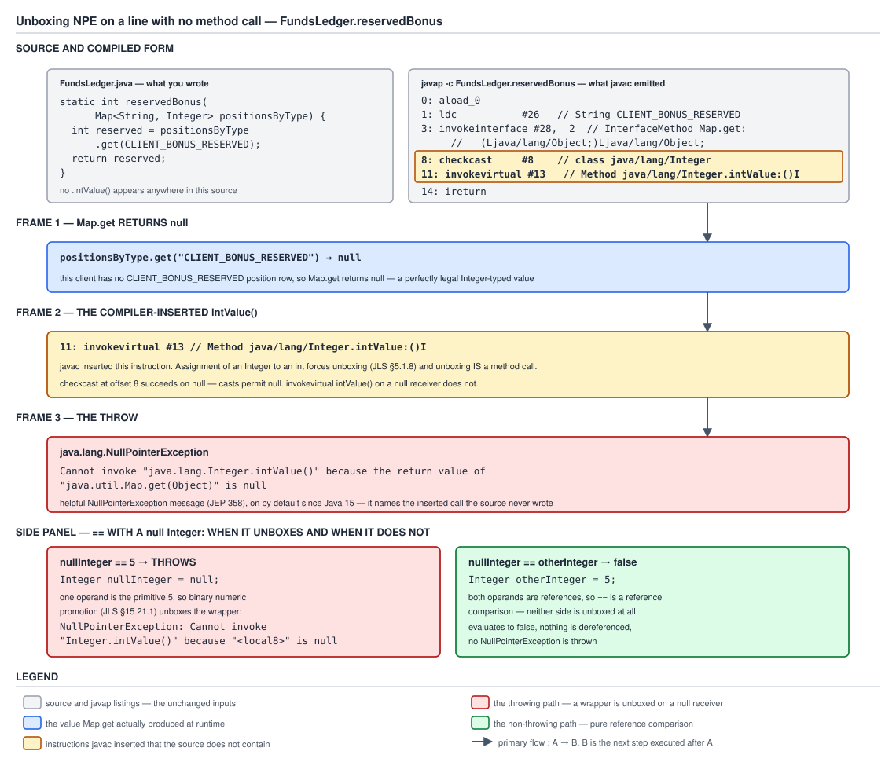

# 03 Java Core — Unboxing null — BASICS (§1.9, 1.9.9, 1.9.10)

**Target version: Java 21 LTS.** | **Part 1 of 5** | [Index](../00-index.md)
Previous: [Cache coverage and reference equality](01b-cache-coverage-and-reference-equality.md) · Next: [Wrapper `equals` and `hashCode`](01d-wrapper-equals-and-hashcode.md)

Two leaves, one root cause. Autoboxing and auto-unboxing are compiler rewrites, and a rewrite that
inserts a method call inserts everything that comes with a method call — including a receiver that
can be `null`. The first leaf is what happens when it is. The second is that `==` quietly picks a
different operation depending on whether that rewrite fired, which makes the same-looking source
line mean two incompatible things.

---

## 1. The NPE thrown by a method call you did not write (1.9.9)

`[TRAP]`

You are looking at a line that reads `int reserved = positionsByType.get(code);` and the stack trace
says `NullPointerException` at that line. Your model of the language says an assignment cannot throw
— assignment copies a value, and copying is not a call. That model is wrong, and the reason is that
`javac` put a call there. The line, after compilation, is `positionsByType.get(code)` followed by
`.intValue()` on whatever came back. It has a receiver. `null` receivers throw. The shift you need
is: **any assignment that crosses the wrapper/primitive boundary is a method call in disguise**, and
therefore it is a line that can throw, and it will not look like one in source.

### Why it exists

Unboxing has to compile to *some* operation. The only operation available on an `Integer` reference
that produces an `int` is `intValue()`, an instance method, and instance methods need a non-null
receiver. There is no null-tolerant form, and the language designers had two bad alternatives:

- **Return 0 for `null`.** Silently converting "absent" into "zero" is worse than throwing in every
  domain where those are different facts, and in a ledger they always are. A missing
  `CLIENT_BONUS_RESERVED` position means the client never had a bonus reservation; a
  `CLIENT_BONUS_RESERVED` of 0 means they had one and it settled. Collapsing the two produces a
  balance that reconciles and a story that is false.
- **Make unboxing a static null-checked helper** — some `Integer.intValueOrThrow(Integer)`. That is
  what the `invokevirtual` already is, only with an extra frame; the NPE still happens, one line
  further away from you.

So the JLS (§5.1.8, boxing/unboxing conversion) specifies unboxing of a `null` reference as throwing
`NullPointerException`, and `javac` gets that for free from the virtual call it already emits. Before
autoboxing existed at all (Java 1.4 and earlier) you wrote `map.get(code).intValue()` by hand, and
the NPE was *visible* in the source. Autoboxing did not add the failure; it hid it.

**Insight:** autoboxing traded a visible call for an invisible one. Every trap in this file is the
bill for that trade.

### The mechanism

The boundary that decides whether the call is emitted is the **target type of the assignment**, not
anything about the map. Measured on JDK 21.0.7, same source file, two methods that differ only in
return type:

```java
static int reservedBonus(Map<String, Integer> positionsByType) {
    return positionsByType.get("CLIENT_BONUS_RESERVED");
}
static Integer reservedBonusBoxed(Map<String, Integer> positionsByType) {
    return positionsByType.get("CLIENT_BONUS_RESERVED");
}
```

```
  static int reservedBonus(java.util.Map<java.lang.String, java.lang.Integer>);
    Code:
       0: aload_0
       1: ldc           #26                 // String CLIENT_BONUS_RESERVED
       3: invokeinterface #28,  2           // InterfaceMethod java/util/Map.get:(Ljava/lang/Object;)Ljava/lang/Object;
       8: checkcast     #8                  // class java/lang/Integer
      11: invokevirtual #13                 // Method java/lang/Integer.intValue:()I
      14: ireturn

  static java.lang.Integer reservedBonusBoxed(java.util.Map<java.lang.String, java.lang.Integer>);
    Code:
       0: aload_0
       1: ldc           #7                  // String CLIENT_BONUS_RESERVED
       3: invokeinterface #9,  2            // InterfaceMethod java/util/Map.get:(Ljava/lang/Object;)Ljava/lang/Object;
       8: checkcast     #15                 // class java/lang/Integer
      11: areturn
```

Instruction by instruction on the first one:

- **`0: aload_0`** — push the map reference. It is the receiver of the interface call.
- **`1: ldc #26`** — push the constant `String` `CLIENT_BONUS_RESERVED` from the constant pool.
- **`3: invokeinterface Map.get:(Ljava/lang/Object;)Ljava/lang/Object;`** — the lookup. Note the
  descriptor: it takes `Object` and returns `Object`. That is the *erased* signature. Generic type
  arguments do not survive into the class file, so `Map<String, Integer>` compiles to the same
  `Map.get(Object)` call as a raw `Map` would; the compiler checked your types and then discarded
  them. (That is the subject of the erasure chapter of this topic, which covers how the same
  mechanism produces heap pollution and unchecked warnings.)
- **`8: checkcast #8 // class java/lang/Integer`** — because `get` is declared to return `Object`,
  the compiler must insert a cast back to the type the generic signature promised. This is a
  *compiler-synthesised* cast, the visible residue of erasure, and it is the instruction that would
  throw `ClassCastException` if something had put a non-`Integer` into the map through a raw
  reference. Critically for us: `checkcast` **passes on `null`** — JVMS §6.5 specifies that if the
  operand is `null` the cast succeeds and the reference stays on the stack. So the null sails
  straight through.
- **`11: invokevirtual Integer.intValue:()I`** — the unboxing. This is the throwing instruction.
  Its receiver is the value `get` returned, and if that value is `null`, `invokevirtual` cannot
  resolve a method on it, so it throws `NullPointerException` before the method body runs.
- **`14: ireturn`** — return the `int`.

The second method is byte-for-byte the same up to offset 8 and then simply `areturn`s the reference.
No `invokevirtual`, therefore no receiver, therefore **it cannot throw**. That is your rule to
carry:

> `Integer reserved = positionsByType.get(code)` cannot throw. `int reserved = positionsByType.get(code)` must, when the key is absent.

Called with an empty map, the measured throw on JDK 21.0.7 is:

```
java.lang.NullPointerException: Cannot invoke "java.lang.Integer.intValue()" because the return value of "java.util.Map.get(Object)" is null
	at BoxProbe.reservedBonus(BoxProbe.java:24)
```

Read that message as a diagnostic, because it carries two independent facts:

| Clause | What it tells you |
|---|---|
| `Cannot invoke "java.lang.Integer.intValue()"` | which call failed — and since your source contains no `intValue()`, this alone identifies the failure as an unboxing |
| `because the return value of "java.util.Map.get(Object)" is null` | which call *produced* the null — the actual bug site, one step upstream of the throw |

The second clause is the one that matters. A bare NPE tells you a reference was null on a line with
several references on it; this message tells you *which* one and *where it came from*.

#### Version discipline: the message is not always there

Helpful NullPointerException messages are on by **default since Java 15** (JEP 358). They shipped in
Java 14 behind `-XX:+ShowCodeDetailsInExceptionMessages` and were switched on by default in 15.

- **Java 21 (and 15 through 20):** the message above, with no flags.
- **Java 14:** the same message, but only with `-XX:+ShowCodeDetailsInExceptionMessages`.
- **Java 8 and 11:** a bare `java.lang.NullPointerException` with `getMessage()` returning `null`,
  and no way to get more.

**Version trap.** Blog answers and Stack Overflow posts written before 2020 say "an unboxing NPE
gives you no information about what was null", and that is why the folklore fix is "add print
statements". On 21 the information is in the message. If you are reading a bare NPE on a 21
deployment, the absence of a message is itself a signal — see the fourth pitfall. Measured on JDK
21.0.7, `-XX:-ShowCodeDetailsInExceptionMessages` still works and turns `getMessage()` back to
`null`, so the switch is available in both directions.

### Diagram



**D-027** — Three frames. `positionsByType.get("CLIENT_BONUS_RESERVED")` returns `null`; the compiler-inserted `invokevirtual Integer.intValue:()I` is invoked on it; the NPE lands with a message naming a method the source does not contain. The side panel is the asymmetry: `nullInteger == 5` unboxes and throws, while `nullInteger == otherInteger` compares references and does not.

### A concrete example

A `FundsLedger` read model hands out a snapshot of a client's positions as a
`Map<String, Integer>` from position code to reserved minor units. Positions with no movement are
simply absent from the map — the read model builds it from ledger rows, and a client with no bonus
reservation has no `CLIENT_BONUS_RESERVED` row to build one from.

```java
public final class ReservedPositionsView {

    private final Map<String, Integer> positionsByType;

    public ReservedPositionsView(Map<String, Integer> positionsByType) {
        this.positionsByType = Map.copyOf(positionsByType);
    }

    // Broken: the target type is int, so javac inserts intValue().
    public int reservedBonusMinorUnitsBroken() {
        return positionsByType.get("CLIENT_BONUS_RESERVED");
    }

    // Fix A: zero is genuinely the right answer for "no reservation exists".
    public int reservedBonusMinorUnits() {
        return positionsByType.getOrDefault("CLIENT_BONUS_RESERVED", 0);
    }

    // Fix B: absence is a distinct fact the caller must handle.
    public OptionalInt reservedBonusIfPresent() {
        Integer reserved = positionsByType.get("CLIENT_BONUS_RESERVED");
        return reserved == null ? OptionalInt.empty() : OptionalInt.of(reserved);
    }

    // Fix C: absence is an inconsistency; fail with a message that names the fact.
    public int reservedBonusOrFail(ClientId clientId) {
        Integer reserved = positionsByType.get("CLIENT_BONUS_RESERVED");
        if (reserved == null) {
            throw new LedgerImbalanceException(
                "no CLIENT_BONUS_RESERVED position for client " + clientId
                + "; positions present: " + positionsByType.keySet());
        }
        return reserved;
    }

    public static void main(String[] args) {
        var view = new ReservedPositionsView(Map.of("CLIENT_CASH_AVAILABLE", 4_20));
        System.out.println(view.reservedBonusMinorUnits());          // 0
        System.out.println(view.reservedBonusIfPresent());           // OptionalInt.empty
        System.out.println(view.reservedBonusMinorUnitsBroken());    // throws
    }
}
```

Measured on JDK 21.0.7 for this shape: `getOrDefault("CLIENT_BONUS_RESERVED", 0)` returns `0`,
`Objects.requireNonNullElse(positionsByType.get("CLIENT_BONUS_RESERVED"), 0)` returns `0`, and
`Integer boxed = positionsByType.get("CLIENT_BONUS_RESERVED")` on an empty map returns `null`
without throwing.

The three fixes are not interchangeable, and choosing between them is a domain decision, not a
null-handling decision. Fix A is correct only where "no reservation" and "a reservation of zero"
are the same fact for the caller — a stakeable-balance sum, say, where adding zero is right. Fix C
is correct where they are different facts and the difference is a bug — a reconciliation job
asserting that every activated account has all four client bucket positions. Fix B pushes the choice
to the caller. **The null did not come from the map. It came from modelling absence and zero the
same way** and then reading the model with a primitive target type.

**Interview:** *"Why does `int n = map.get(k)` throw when the map has no such key?"* Because
`javac` compiles the primitive target type into an `invokevirtual Integer.intValue()` on the
lookup's result; `Map.get` returns `null` for an absent key, the synthesised `checkcast` passes
nulls through, and the virtual call throws. Change the target type to `Integer` and the same line
cannot throw. The give-away that you actually know this is naming the boundary as the *target type*
rather than saying "because the map returned null" — everybody says that part.

### The gotcha

Even with the helpful message, the surviving danger is **where the finger points**. The stack trace
names a source line whose text contains no method call, so the eye slides off it. Three situations
put you back in the pre-15 world:

- an older JDK in one environment of a mixed estate;
- a stack trace truncated by a log shipper, or a framework that wraps the cause and logs only the
  outermost `getMessage()` — a Spring `@RestControllerAdvice` that logs `ex.getMessage()` on a
  wrapping exception loses the NPE's message entirely;
- `-XX:-ShowCodeDetailsInExceptionMessages` set deliberately, which some shops do because the
  message can echo field and method names into logs.

The reflex to train is: **NPE on a line with no visible dot? The unboxing did it. Find the reference
whose value feeds a primitive.** Candidates, in order of frequency: a `Map.get` on an absent key, a
JDBC/JPA nullable column mapped to a wrapper field, a Jackson-deserialised field the JSON omitted,
and a `null` returned from a stream terminal such as `reduce` with an identity-less accumulator.

Two shapes that belong to siblings rather than here. The conditional operator has its own unboxing
NPE that is worse than this one: in `flag ? 1 : nullInteger` the operator's type is computed as
`int` from both branches, so it unboxes and throws **even when the branch actually taken is the
primitive `1`** — the full typing rules are
[`../primitives-and-conversions/02c-conditional-operator.md`](../primitives-and-conversions/02c-conditional-operator.md).
And the mixed `==` comparison throws the same way for the same reason, which is concept 2 below.

> **Definition.** Unboxing a `null` wrapper throws `NullPointerException` because the compiler
> implements unboxing as `invokevirtual` of `xxxValue()` on the reference, so the failure is a
> normal null-receiver failure on a call the source does not show.

---

## 2. Mixed `==` unboxes; two wrappers do not (1.9.10)

`[TRAP]` `[PROVE]`

`==` is not one operator. It is a name that resolves, at compile time, to one of two entirely
different machine operations depending on the **static types of both operands**. Two reference
operands: compare the references. One primitive operand and one wrapper: unbox the wrapper and
compare the numbers. Same six characters of source, opposite semantics, and nothing on the line
tells you which one you got — you have to look up the declared types of both sides, possibly in
another file.

### Why it exists

JLS §15.21 splits the equality operators by operand type, and the split is coherent:

- **§15.21.1 Numerical Equality Operators.** If the operands of `==` are both convertible to a
  numeric type, binary numeric promotion (§5.6) is performed on them, and the comparison is on
  numeric values. A wrapper is convertible to a numeric type — by unboxing — so a wrapper paired
  with a primitive lands here.
- **§15.21.3 Reference Equality Operators.** If both operands are of reference type (or the null
  type), the comparison is of references: `true` when both point at the same object or both are
  `null`.

The design follows from wanting `intValue == 5` to work without a cast while keeping `==` on
arbitrary objects meaning identity. It is the *invisibility* of the operand types at the call site
that makes it hard, not the rule.

### The mechanism

The two branches compile to two different bytecode instructions, which is the cleanest way to see
that they are different operations. Measured on JDK 21.0.7, one source file, two methods:

```java
static boolean atStakeCeilingMixed(Integer maxStakeMinorUnits, int requestedMinorUnits) {
    return requestedMinorUnits == maxStakeMinorUnits;
}
static boolean atStakeCeilingBoxed(Integer maxStakeMinorUnits, Integer requestedMinorUnits) {
    return requestedMinorUnits == maxStakeMinorUnits;
}
```

```
  static boolean atStakeCeilingMixed(java.lang.Integer, int);
    Code:
       0: iload_1
       1: aload_0
       2: invokevirtual #17                 // Method java/lang/Integer.intValue:()I
       5: if_icmpne     12
       8: iconst_1
       9: goto          13
      12: iconst_0
      13: ireturn

  static boolean atStakeCeilingBoxed(java.lang.Integer, java.lang.Integer);
    Code:
       0: aload_1
       1: aload_0
       2: if_acmpne     9
       5: iconst_1
       6: goto          10
       9: iconst_0
      10: ireturn
```

The source text of the `return` statement is character-for-character identical. The bytecode is not:

- **Mixed:** `invokevirtual Integer.intValue:()I` unboxes, then **`if_icmpne`** — integer compare,
  a value comparison of two `int`s on the stack.
- **Both wrappers:** no `invokevirtual` at all, and **`if_acmpne`** — *a*ddress compare, a
  comparison of two references.

`if_icmpne` versus `if_acmpne` is the whole leaf. And because the mixed form contains an
`invokevirtual` with the wrapper as receiver, it inherits concept 1's failure mode: it can throw.

#### Working the asymmetry through

Take the measured facts one at a time and predict the next.

```java
Integer big1 = 1000, big2 = 1000;
int prim = 1000;
```

**Fact one, measured:** `big1 == big2` is **false**.

Both operands are `Integer`, so §15.21.3 applies and this is `if_acmpne` on two references. `1000`
is outside the cached range, so each `Integer big = 1000;` boxed through `Integer.valueOf(1000)`,
which fell through the cache test and executed `return new Integer(i)` — two distinct objects, two
distinct addresses, `false`. The cache boundary and why 127 flips to 128 is
[`01b-cache-coverage-and-reference-equality.md`](01b-cache-coverage-and-reference-equality.md); do
not re-derive it, just note that had the value been `100` this comparison would have returned `true`
and taught you the wrong lesson.

**Fact two, measured:** `big1 == prim` is **true**.

One operand is `int`, so §15.21.1 applies: binary numeric promotion unboxes `big1` to `int` and the
comparison is `if_icmpne` on 1000 and 1000. `true`.

**So adding the primitive made the comparison more correct.** Two `Integer`s holding the same number
compared unequal; introducing a primitive on one side made them compare equal. That inversion — the
*less* type-safe-looking expression being the *correct* one — is exactly the asymmetry the leaf
names, and it is why "`==` on wrappers is reference comparison" fails to stick as a rule. The rule
as usually memorised does not predict fact two.

**Fact three, now predict it.** `Integer nullInteger = null;` What does `nullInteger == 5` do?

The right-hand operand is the `int` literal `5`, so §15.21.1 applies, so `nullInteger` is unboxed,
so there is an `invokevirtual Integer.intValue()` with a `null` receiver. It throws. Measured on
JDK 21.0.7:

```
Integer nullInteger = null;  Integer otherInteger = 5;
nullInteger == 5            THREW java.lang.NullPointerException: Cannot invoke "java.lang.Integer.intValue()" because "<local8>" is null
nullInteger == otherInteger  -> false      (no throw)
```

And `nullInteger == otherInteger`, both reference operands, is `if_acmpne` on `null` and a real
address: **`false`**, no unboxing, no throw. So a null-safe-looking comparison throws while an
unsafe-looking one does not, and which is which depends on the declared type of the other side.

**Insight:** `"<local8>"` in that message is worth recognising. The helpful-NPE machinery describes
the failing receiver from the bytecode, and when the receiver came from a local variable slot whose
name is not in the class file (no `-g` / `LocalVariableTable`, or a compiler temporary), it falls
back to naming the slot: `<local8>` is local variable slot 8. Compile with `-g` and you get the
real name instead. A `<localN>` in a production trace is not a JVM defect; it means the class was
compiled without local variable names, and slot 8 is still a real thing you can find by reading
`javap -c` for the method.

#### The four cases

| Left operand | Right operand | JLS clause | Bytecode | Operation | Measured result |
|---|---|---|---|---|---|
| `Integer` 1000 | `Integer` 1000 | §15.21.3 | `if_acmpne` | reference comparison | `false` |
| `Integer` 1000 | `int` 1000 | §15.21.1 | `invokevirtual intValue` + `if_icmpne` | unbox, value comparison | `true` |
| `int` 1000 | `int` 1000 | §15.21.1 | `if_icmpne` | value comparison | `true` |
| `Integer` `null` | `int` 5 | §15.21.1 | `invokevirtual intValue` + `if_icmpne` | unbox, then throw | `NullPointerException` |
| `int` 5 | `Integer` `null` | §15.21.1 | `invokevirtual intValue` + `if_icmpne` | unbox, then throw | `NullPointerException` |
| `Integer` `null` | `Integer` 5 | §15.21.3 | `if_acmpne` | reference comparison | `false` |
| `Integer` `null` | `Integer` `null` | §15.21.3 | `if_acmpne` | reference comparison | `true` |

Operand order does not matter: promotion looks at the pair, not at which side the primitive is on.
Which operand is the *receiver* of the inserted `intValue()` is the wrapper, always.

### Diagram

No diagram of its own. The side panel of **D-027** above is this concept: it sets `nullInteger == 5`
throwing beside `nullInteger == otherInteger` returning `false`, which is the asymmetry in one
picture. Look at it again with the `if_icmpne` / `if_acmpne` listing in mind.

### A concrete example

The genuinely nasty production shape is not a comparison that was always wrong. It is a comparison
that **was right, and became wrong because a field's type changed in a different file**, with no
edit to the comparison itself and therefore nothing for review to see.

`ClientRestrictions` guards a stake against the client's configured ceiling. Version one:

```java
public final class StakeCeilingGuard {

    // v1: primitive, always populated from LimitSet defaults.
    private final int maxStakeMinorUnits;

    public StakeCeilingGuard(int maxStakeMinorUnits) {
        this.maxStakeMinorUnits = maxStakeMinorUnits;
    }

    // int == int. if_icmpne. Correct for every value.
    public boolean isAtCeiling(int requestedMinorUnits) {
        return requestedMinorUnits == maxStakeMinorUnits;
    }
}
```

Then a story lands: a ceiling can now be "not yet assessed" — a prospect whose `AssessmentService`
run has not completed has no ceiling yet, and 0 is not a usable stand-in because 0 would mean "no
stake permitted". The obvious change is to make the field nullable:

```java
public final class StakeCeilingGuard {

    // v2: Integer, null == not yet assessed. Nothing else in the class was edited.
    private final Integer maxStakeMinorUnits;

    public StakeCeilingGuard(Integer maxStakeMinorUnits) {
        this.maxStakeMinorUnits = maxStakeMinorUnits;
    }

    public boolean isAtCeiling(Integer requestedMinorUnits) {
        return requestedMinorUnits == maxStakeMinorUnits;   // now if_acmpne
    }
}
```

The diff is two type names. The comparison compiles, the tests that use small ceilings still pass,
and in production the guard silently stops firing:

```java
var guard = new StakeCeilingGuard(1000);           // maxStakeMinorUnits = 10.00
System.out.println(guard.isAtCeiling(1000));       // v1: true    v2: false
```

Measured on JDK 21.0.7 for exactly these values: with both sides `Integer` and the value `1000`,
`==` is **false**; `equals` is **true**; with one side `int`, `==` is **true**. Small ceilings hide
it — a test fixture using a maximum stake of 100 minor units sits inside the cached range, both
boxes are the same array element, and `==` returns `true`. The guard fails only for ceilings above
127 minor units, which is every real ceiling and no test ceiling.

The fixes, in order of preference:

```java
// Best: keep the primitive, model absence separately. Absence is not a number.
private final OptionalInt maxStakeMinorUnits;

// Or: keep the wrapper, compare with equals, and decide what null means explicitly.
public boolean isAtCeiling(int requestedMinorUnits) {
    if (maxStakeMinorUnits == null) {
        throw new RestrictedActionException("stake ceiling not yet assessed");
    }
    return maxStakeMinorUnits.equals(requestedMinorUnits);   // int autoboxes to Integer here
}

// Or: unbox explicitly at the boundary, so the comparison is visibly numeric.
public boolean isAtCeiling(int requestedMinorUnits) {
    int ceiling = Objects.requireNonNull(maxStakeMinorUnits, "stake ceiling not assessed");
    return requestedMinorUnits == ceiling;
}
```

Note what the `equals` version relies on: `maxStakeMinorUnits.equals(requestedMinorUnits)` autoboxes
the `int` argument to `Integer` because `equals` takes `Object`, and `Integer.equals` compares
values. That works — but only within one wrapper type; `Integer.valueOf(1).equals(Long.valueOf(1))`
is **false**, measured, which is
[`01d-wrapper-equals-and-hashcode.md`](01d-wrapper-equals-and-hashcode.md).

**Interview:** *"Is `==` on an `Integer` a value comparison or a reference comparison?"* The answer
that separates understanding from memorisation is **"it depends on the other operand"**: two
reference operands give reference comparison under JLS §15.21.3 and compile to `if_acmpne`; one
primitive operand triggers binary numeric promotion under §15.21.1, unboxes the wrapper, and
compiles to `invokevirtual intValue` plus `if_icmpne` — which also means it can throw NPE if the
wrapper is null. A candidate who answers a flat "reference comparison" has memorised the puzzle, not
the rule.

### The gotcha

The rule almost everyone carries — "`==` on wrappers is reference comparison, so use `equals`" — is
**incomplete**, and its incompleteness is precisely why it does not survive contact with real code.
It gives no account of `big1 == prim` being `true`, no account of why `nullInteger == 5` throws while
`nullInteger == otherInteger` does not, and it teaches the wrong reflex: it says "look at the
wrapper", when the operation is chosen by the *other* operand. The complete rule:

> `==` inspects the static types of **both** operands. Both reference types: reference comparison,
> never throws. Either operand a primitive numeric type: the other is unboxed and the comparison is
> numeric, which throws NPE if that other operand is `null`.

Carry that, and all four rows of the table above are derivable rather than memorised.

`==`'s full operator-level treatment, including its behaviour on `boolean`, on `float`/`double` with
`NaN` and `-0.0`, and the cast rules that interact with it, is
[`../primitives-and-conversions/02b-casts-and-comparison.md`](../primitives-and-conversions/02b-casts-and-comparison.md).

> **Definition.** Mixed `==` between a primitive and a wrapper is a numeric comparison under JLS
> §15.21.1 — the wrapper is unboxed, so the test is on values and can throw NPE — while `==` between
> two wrappers is a reference comparison under §15.21.3, which tests identity and never throws.

---

## Supporting facts: the three null-tolerant reads

These are the tools the fixes above use. No tradeoff worth eight beats; three lines each.

- **`Map.getOrDefault(key, default)`** — one lookup, returns the default when the key is absent
  **or mapped to `null`**. The default is an `Integer` here, so `getOrDefault(code, 0)` boxes the
  literal `0` (from the cache, no allocation) and the result then unboxes into an `int` target. Safe
  because the returned reference is never null. Gotcha: it cannot distinguish "absent" from
  "present and mapped to null", so if your map legitimately stores nulls it silently merges the two.
- **`Objects.requireNonNullElse(value, default)`** — takes the already-retrieved reference, returns
  it or the default. Use it when the value came from somewhere that is not a `Map` (a JPA entity
  field, a deserialised DTO). Gotcha: the *default* argument is itself null-checked and
  `requireNonNullElse(null, null)` throws NPE naming `defaultObj`, so a computed default must be
  non-null.
- **`Optional.ofNullable(value)`** — wraps the possibly-null reference so the caller must decide.
  For an `int` result prefer `OptionalInt` and convert with an explicit ternary, because
  `Optional<Integer>.get()` unboxes on the way out and `Optional.orElse(0)` reintroduces the same
  "absent means zero" decision you were trying to make explicit. Gotcha: `Optional` as a *field* or
  a method parameter is a design smell; as a return type on a lookup it is the point.

---

## Pitfalls

### Assigning a map lookup straight into an `int`

**Wrong**

```java
// "positionsByType always has all four client buckets" — it does not; the read model
// builds it from ledger rows, and a client with no bonus has no bonus row.
int reserved = positionsByType.get("CLIENT_BONUS_RESERVED");
```

```
java.lang.NullPointerException: Cannot invoke "java.lang.Integer.intValue()" because the return value of "java.util.Map.get(Object)" is null
	at BoxProbe.reservedBonus(BoxProbe.java:24)
```

**Right**

```java
// Zero is genuinely the right answer for a stakeable-balance sum: no reservation adds nothing.
int reserved = positionsByType.getOrDefault("CLIENT_BONUS_RESERVED", 0);

// But in a reconciliation job, absence is an inconsistency and zero would hide it.
Integer reservedOrNull = positionsByType.get("CLIENT_BONUS_RESERVED");
if (reservedOrNull == null) {
    throw new LedgerImbalanceException(
        "no CLIENT_BONUS_RESERVED position for client " + clientId
        + "; positions present: " + positionsByType.keySet());
}
int reserved = reservedOrNull;
```

**Why people believe it:** the source line contains no method call the reader can see, so it reads
as an assignment, and assignments in every other part of the language cannot throw. The belief is
not "the key is present" — it is the deeper "this line is not a call site", and that belief is what
`javap` disproves. Reinforcing it: the same expression with an `Integer` target genuinely cannot
throw, so the author has probably written the safe form a hundred times without incident.

### Widening a field from `int` to `Integer` without auditing its `==` comparisons

**Wrong**

```java
// v2 of StakeCeilingGuard. The field became nullable for a new "not yet assessed" state.
private final Integer maxStakeMinorUnits;

public boolean isAtCeiling(Integer requestedMinorUnits) {
    return requestedMinorUnits == maxStakeMinorUnits;   // was if_icmpne, is now if_acmpne
}
```

```
new StakeCeilingGuard(1000).isAtCeiling(1000)   ->  false      (measured, JDK 21.0.7)
```

The guard stops firing for every ceiling above 127 minor units, and keeps passing every test whose
fixture ceiling is inside the cache.

**Right**

```java
// Model absence as absence; keep the arithmetic primitive.
private final OptionalInt maxStakeMinorUnits;

public boolean isAtCeiling(int requestedMinorUnits) {
    return maxStakeMinorUnits.isPresent()
        && maxStakeMinorUnits.getAsInt() == requestedMinorUnits;
}
```

```java
// Or keep the wrapper and make the comparison explicitly numeric.
public boolean isAtCeiling(int requestedMinorUnits) {
    int ceiling = Objects.requireNonNull(maxStakeMinorUnits, "stake ceiling not assessed");
    return requestedMinorUnits == ceiling;
}
```

**Why people believe it:** the type change and the comparison are in different places, and often
different commits — nobody edited the comparison, so nobody reviewed it. The compiler is silent
because `Integer == Integer` is perfectly legal. And the cache hides the regression in exactly the
place you would catch it: unit tests use small round numbers, small numbers box to shared cache
entries, and `==` returns `true`. A grep for `== max` finds nothing suspicious because the line did
not change.

### Null-checking the wrong reference, or catching the NPE

**Wrong**

```java
// Guards the map. The map was never null; its value is.
if (positionsByType != null) {
    int reserved = positionsByType.get("CLIENT_BONUS_RESERVED");   // still throws
    applyReservation(reserved);
}

// Or, worse: swallow it and continue with a fabricated zero.
try {
    int reserved = positionsByType.get("CLIENT_BONUS_RESERVED");
    applyReservation(reserved);
} catch (NullPointerException e) {
    applyReservation(0);      // now every unrelated NPE in applyReservation is a silent zero
}
```

**Right**

```java
// Check the retrieved value, not the container.
Integer reserved = positionsByType.get("CLIENT_BONUS_RESERVED");
if (reserved != null) {
    applyReservation(reserved);
}

// Or restructure so it cannot be null: one lookup, non-null result, explicit default.
applyReservation(positionsByType.getOrDefault("CLIENT_BONUS_RESERVED", 0));
```

**Why people believe it:** the NPE names a line, and the most conspicuous reference on that line is
the receiver you wrote — `positionsByType` — not the invisible receiver `javac` inserted. Pre-15
JDKs made this near-inevitable, since a bare NPE gave no way to tell the two apart; on 21 the
message says `because the return value of "java.util.Map.get(Object)" is null`, which names the
culprit outright. The `catch` variant survives because it appears to work: the symptom disappears
from the log, so the fix looks confirmed, while the `catch` block has quietly widened to cover
every NPE thrown anywhere inside `applyReservation`.

### Reading a bare NPE on Java 21 and concluding the message is unavailable

**Wrong**

```java
// The handler that produced the log line.
catch (NullPointerException e) {
    log.error("unboxing failure, no detail available on this JVM: {}", e.getMessage());
}
```

```
ERROR unboxing failure, no detail available on this JVM: null
```

Concluding "helpful NPE messages need a flag" and moving on. On a 21 deployment they do not — they
are on by default since 15 — so a `null` message means something else is going on.

**Right**

Treat the missing message as evidence and enumerate the causes. Measured on JDK 21.0.7 with the
`Map.get` unboxing above: default run gives
`Cannot invoke "java.lang.Integer.intValue()" because the return value of "java.util.Map.get(Object)" is null`;
running the same class with `-XX:-ShowCodeDetailsInExceptionMessages` gives `getMessage()` of
`null`. So the causes to check, in order:

```java
// 1. An explicitly constructed NPE has whatever message the author gave it - often none.
//    Objects.requireNonNull(x) with no message argument is the common source.
Objects.requireNonNull(maxStakeMinorUnits, "stake ceiling not assessed");   // give it one

// 2. A rethrow that dropped the cause. Chain it.
catch (NullPointerException e) {
    throw new LedgerImbalanceException("reservation read failed for " + clientId, e);
}

// 3. Log the throwable, not getMessage(), so the stack trace and cause chain survive.
catch (NullPointerException e) {
    log.error("reservation read failed for {}", clientId, e);
}
```

and check the JVM arguments for `-XX:-ShowCodeDetailsInExceptionMessages`, which some deployments
set deliberately because the message echoes field and method names into logs.

**Why people believe it:** every pre-2020 answer about unboxing NPEs says the message is empty,
because before Java 15 it was, and that material still dominates search results. The belief is
reinforced by JEP 358's own history — it really did ship behind a flag in 14 — so "you need
`-XX:+ShowCodeDetailsInExceptionMessages`" was true for exactly one release and is now the wrong
half of a version trap.

---

## Cheat sheet

| Thing | Fact (Java 21 LTS) |
|---|---|
| Unboxing compiles to | `invokevirtual Integer.intValue:()I` (and the `xxxValue` sibling per wrapper) |
| `int n = map.get(k)`, key absent | throws NPE — the target type forced the `intValue()` call |
| `Integer n = map.get(k)`, key absent | `n` is `null`, no throw, no `invokevirtual` emitted |
| What decides whether unboxing happens | the **target type** of the assignment or expression, not the map |
| `checkcast` on `null` | succeeds (JVMS §6.5); the null passes through to the `invokevirtual` |
| Why `checkcast` is there at all | `Map.get` erases to `(Object) -> Object`; `javac` restores the generic type |
| Measured NPE message | `Cannot invoke "java.lang.Integer.intValue()" because the return value of "java.util.Map.get(Object)" is null` |
| Helpful NPE messages default-on since | Java 15 (JEP 358); flag-only in 14; absent in 8 and 11 |
| Flag that turns them off | `-XX:-ShowCodeDetailsInExceptionMessages` (measured: `getMessage()` becomes `null`) |
| `<local8>` in an NPE message | the receiver was a local variable slot with no name in the class file |
| `==` with two reference operands | JLS §15.21.3, reference comparison, `if_acmpne`, never throws |
| `==` with one primitive operand | JLS §15.21.1, binary numeric promotion, unbox, `if_icmpne`, can throw |
| `Integer big1 = 1000, big2 = 1000; big1 == big2` | **false** (measured) — two `new Integer` objects |
| `int prim = 1000; big1 == prim` | **true** (measured) — unboxed, numeric |
| `nullInteger == 5` | **throws** NPE (measured) — mixed, so the wrapper is unboxed |
| `nullInteger == otherInteger` | **false** (measured), no throw — both references |
| `nullInteger == anotherNullInteger` | `true` — reference comparison, both `null` |
| Does operand order matter | no; promotion looks at the pair. The wrapper is always the receiver |
| Complete `==` rule | inspect the static types of **both** operands; a primitive on either side makes it numeric |
| Bytecode tell | `if_icmpne` = value comparison; `if_acmpne` = reference comparison |
| Why the guard regression hides in tests | ceilings under 128 box to shared cache entries, so `==` returns `true` |
| Conditional operator variant | `flag ? 1 : nullInteger` throws even when the `1` branch is taken |
| `Map.getOrDefault(k, 0)` | one lookup, never returns null, merges "absent" with "mapped to null" |
| `Objects.requireNonNullElse(v, d)` | null-checks `d` too; `requireNonNullElse(null, null)` throws |
| Safe absent-versus-zero shape | `OptionalInt`, or an explicit throw naming the client and the position |
| Domain rule | an absent position and a zero position are different facts in a ledger |
| Wrapper-to-wrapper equality across types | `Integer.valueOf(1).equals(Long.valueOf(1))` is **false** (measured) |
| First reflex on an NPE at a dot-free line | it was the unboxing; find the reference feeding a primitive |
| Frameworks that hide the message | anything logging `getMessage()` on a wrapping exception |
| JLS references | §5.1.8 (unboxing conversion), §5.6 (binary numeric promotion), §15.21.1, §15.21.3 |

---

## Self-test

**Q1.** Your stack trace says `NullPointerException` at `int reserved = positionsByType.get(code);`. There is no method call on that line as written. Explain the throw at bytecode level.

<details><summary>Answer</summary>

There is a method call — two, in fact — because `javac` inserted one. The primitive target type `int` makes this an unboxing conversion under JLS §5.1.8, and the only way to implement that is to call `intValue()` on the reference. The compiled sequence, measured with `javap -p -c` on JDK 21.0.7, is: `aload_0` to push the map, `ldc` for the key constant, `invokeinterface Map.get:(Ljava/lang/Object;)Ljava/lang/Object;` — note the erased descriptor, `Object` in and `Object` out — then `checkcast java/lang/Integer` which the compiler synthesised to restore the generic type, then `invokevirtual Integer.intValue:()I`, then `ireturn`. `Map.get` returns `null` for an absent key. `checkcast` on a `null` operand succeeds and leaves the null on the stack, per JVMS §6.5. Then `invokevirtual` has a `null` receiver and throws. The measured message on 21 is `Cannot invoke "java.lang.Integer.intValue()" because the return value of "java.util.Map.get(Object)" is null`, which names both the failing call and the call that produced the null.

</details>

**Q2.** Same line, but the target type is `Integer` instead of `int`. Does it throw? Why is that the rule to remember rather than "check whether the key is present"?

<details><summary>Answer</summary>

It does not throw. With an `Integer` target the bytecode is identical up to the `checkcast` and then just `areturn` — no `invokevirtual`, so no receiver, so nothing to fail. That is the useful formulation because it locates the decision in the code you are looking at. Whether the key is present is a runtime property of a map built somewhere else, possibly by a different service; whether unboxing is emitted is a compile-time property of the target type, visible on the line. So the rule to carry is: `Integer n = map.get(k)` cannot throw, `int n = map.get(k)` must when the key is absent. The presence of the key is the trigger; the target type is the vulnerability, and the target type is the part you control.

</details>

**Q3.** `Integer big1 = 1000, big2 = 1000; int prim = 1000;`. Give the results of `big1 == big2` and `big1 == prim`, and explain why the second is the more correct comparison.

<details><summary>Answer</summary>

Measured on JDK 21.0.7: `big1 == big2` is **false**, `big1 == prim` is **true**. The first has two reference operands, so JLS §15.21.3 applies and the compiler emits `if_acmpne` — an address comparison. `1000` is outside the `IntegerCache` range, so each boxing went through `Integer.valueOf`, failed the cache test, and executed `return new Integer(i)`, producing two distinct objects at two distinct addresses. The second has one `int` operand, so JLS §15.21.1 applies: binary numeric promotion unboxes `big1` with `invokevirtual Integer.intValue:()I` and the compiler emits `if_icmpne`, an integer comparison of 1000 with 1000. Adding the primitive made the expression *more* correct, which is the asymmetry that breaks the memorised rule — "`==` on wrappers is reference comparison" gives no account of the second result at all.

</details>

**Q4.** Explain why `nullInteger == 5` throws while `nullInteger == otherInteger` returns `false`, and say which bytecode instruction distinguishes them.

<details><summary>Answer</summary>

`nullInteger == 5` pairs a reference with an `int` literal, so JLS §15.21.1 governs: binary numeric promotion unboxes the wrapper, the compiler emits `invokevirtual Integer.intValue:()I` on `nullInteger`, and the null receiver throws. Measured: `java.lang.NullPointerException: Cannot invoke "java.lang.Integer.intValue()" because "<local8>" is null`. `nullInteger == otherInteger` has two reference operands, so JLS §15.21.3 governs: the compiler emits `if_acmpne` and compares addresses. `null` is not the same reference as the boxed 5, so the result is `false` with no unboxing and no throw. The distinguishing instruction is `if_icmpne` (integer compare, preceded by an `intValue()` call) versus `if_acmpne` (address compare, with no call at all). So the null-safe-looking comparison throws and the unsafe-looking one does not, decided entirely by the static type of the other operand.

</details>

**Q5.** A field changes from `int` to `Integer` so it can hold `null` for a "not yet assessed" state. Nothing else in the class is edited. What breaks, and why does the test suite still pass?

<details><summary>Answer</summary>

Every `==` comparison that field participates in silently changes operation. If both sides are now `Integer`, `if_icmpne` becomes `if_acmpne` — a numeric comparison becomes an identity test. In `StakeCeilingGuard`, `new StakeCeilingGuard(1000).isAtCeiling(1000)` returned `true` before and returns **false** after, measured on JDK 21.0.7, so the guard stops firing. The tests pass because of the `IntegerCache`: fixtures use small round ceilings, values in −128..127 box to the same shared array element, and `==` on two references to the same object is `true`. The regression appears only for ceilings above 127 minor units, which is every real ceiling and no test ceiling. It is also invisible to review: the comparison line did not change, and `Integer == Integer` is perfectly legal Java. The fixes are to keep the primitive and model absence as `OptionalInt`, or to compare with `equals`, or to unbox explicitly with `Objects.requireNonNull` at the boundary.

</details>

**Q6.** You see a bare `java.lang.NullPointerException` with a `null` message in a production log. The service runs on Java 21. What do you conclude?

<details><summary>Answer</summary>

Not that helpful messages need enabling — they have been on by default since Java 15 under JEP 358, and they were flag-gated for exactly one release, Java 14. So a `null` message on 21 means something else, and there are four candidates. First, the NPE was constructed explicitly and given no message: `Objects.requireNonNull(x)` without the message argument is the usual source. Second, a rethrow or a wrapping exception dropped the cause, and the log line is showing the wrapper's message rather than the NPE's. Third, the logging call passed `e.getMessage()` instead of the throwable, so the stack trace and cause chain never reached the log. Fourth, the JVM is running with `-XX:-ShowCodeDetailsInExceptionMessages`, which I measured on JDK 21.0.7 turns `getMessage()` back to `null` for exactly the `Map.get` unboxing case; some deployments set it deliberately because the message echoes field and method names into logs. Check the JVM arguments first, since that one is cheap to rule out.

</details>

**Q7.** Why is `getOrDefault(code, 0)` not automatically the right fix for an unboxing NPE on a ledger position lookup?

<details><summary>Answer</summary>

Because it answers a domain question by accident. `getOrDefault` makes the expression not throw by asserting that an absent `CLIENT_BONUS_RESERVED` position and a `CLIENT_BONUS_RESERVED` position of zero are the same fact. Sometimes they are: summing a stakeable balance, a missing bucket contributes nothing and zero is exactly right. Sometimes they are not: a reconciliation job that expects all four client buckets to exist for an activated account has found a real inconsistency, and defaulting to zero makes the totals balance while the ledger is broken. The NPE was a symptom of modelling absence and zero identically and then reading the model with a primitive target type; the fix is to decide which fact you mean. Options are `getOrDefault` where zero is genuinely correct, `OptionalInt` where the caller must choose, or an explicit throw carrying the client id and the positions actually present. There is also a smaller trap: `getOrDefault` cannot distinguish "key absent" from "key present, mapped to null", so if the map legitimately stores nulls it merges those two cases too.

</details>

**Q8.** What is the complete rule for `==` involving wrappers, stated so that all of the four-case table is derivable from it?

<details><summary>Answer</summary>

`==` inspects the static types of **both** operands and picks one of two operations. If both operands are of reference type, JLS §15.21.3 applies: the comparison is on references, compiles to `if_acmpne`, and never throws — so two equal-valued `Integer`s outside the cache compare `false`, a null wrapper against a non-null one compares `false`, and two nulls compare `true`. If either operand is a primitive numeric type, JLS §15.21.1 applies: binary numeric promotion under §5.6 unboxes the other side, the comparison is on values and compiles to `invokevirtual xxxValue` plus `if_icmpne`, and it throws NPE if the wrapper is null — regardless of which side the primitive is on, since promotion looks at the pair rather than at operand order. The wrapper is always the receiver of the inserted call. Everything in the table follows: pick the clause from the operand types, then read off the instruction and whether a null receiver is possible.

</details>

---

## Open questions

- None. Every claim in this file is either quoted from JDK 21.0.7 source, measured on JDK 21.0.7, or cited to the JLS.

---

**Leaves covered:** 1.9.9, 1.9.10 (2 leaves)
**Leaves deferred:** none
**Diagrams included:** D-027
**Target version:** Java 21 LTS
**Lines:** 838
