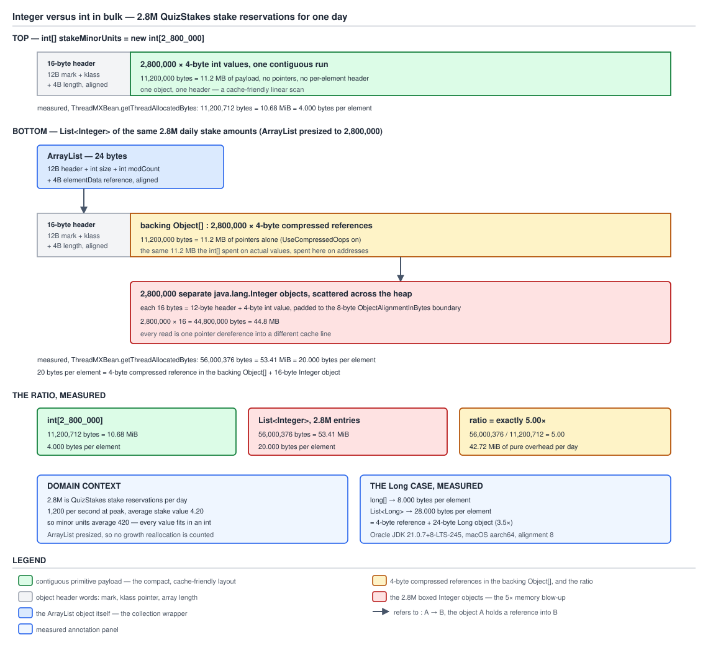

# 03 Java Core — The cost of boxing — BASICS (§1.9, 1.9.12, 1.9.19)

**Target version: Java 21 LTS.** | **Part 1 of 5** | [Index](../00-index.md)
Previous: [Parsing traps and the statics](01f-parsing-traps-and-the-statics.md) · Next: [When boxing is unavoidable](01h-when-boxing-is-unavoidable.md)

Boxing has two costs, different in kind. One is a **rate**: an operator that looks free manufactures a fresh
object every time it runs. The other is a **size**: the object is mostly bookkeeping and you need a pointer to
reach it, so a collection of numbers costs five times what an array of the same numbers costs. Both are
established below from evidence — the first from bytecode and an allocation counter, the second derived from the
object header and then confirmed by measurement — and the two routes meet on the same 24-byte figure, which is
why they belong in one file.

---

## 1. A boxed accumulator allocates once per iteration, and the bytecode says so (1.9.12)

`[NUM]` `[PROVE]` Picture `sum += minorUnits` where `sum` is a `Long`. It looks like one machine instruction. It
is not an addition at all — it is **unbox, add, rebox, reassign**. `Long` is immutable and `final`; there is no
`setValue`, no mutable field, nothing the `+=` could write into. So the only way for `sum` to hold a different
number after the statement than before it is for a *different object* to exist and for the local variable to be
repointed at it. The allocation is not a quirk of the compiler. It is the only thing that could possibly happen
given an immutable box and an assignment operator. Once you see that, the 24 bytes per iteration stop being
surprising and start being arithmetic.

### Why it exists

Nobody designed this. It is the intersection of two features that were each reasonable alone. Autoboxing (Java
5) exists so that `List<Integer>` can hold the result of `int` arithmetic without the reader writing
`Integer.valueOf` by hand. Compound assignment (`+=`) exists so that `sum = sum + minorUnits` can be written
once instead of twice. Put them together and you get an operator that JLS 21 §15.26.2 defines as "evaluate,
convert, assign" — and when the target type is a wrapper, "convert" means a call to `valueOf`. The specification
is honest about it; the syntax is what hides it.

**When to reach for a boxed accumulator, and when not.** Never, for a running total in a loop. The sibling that
wins is the primitive: `long`, or a primitive-specialised stream reduction (`Arrays.stream(int[]).sum()`,
`LongStream.reduce`). A boxed accumulator earns its place only when the accumulator genuinely must be a
reference — when `null` is a meaningful third state distinct from zero ("no stakes settled yet" versus "settled
to zero"), or when the value goes into an API that only accepts `Object`. That case is real, and it is the
subject of [When boxing is unavoidable](01h-when-boxing-is-unavoidable.md).

One scoping sentence, because the honest answer has two halves. Everything below is what the **bytecode** does,
and that is identical in the interpreter and in C1. Whether C2 later proves the box does not escape and erases
the allocation is a separate question with its own measured answer — see [Escape
analysis](03d-internals-escape-analysis.md). It does not apply to this shape (the accumulator's value crosses
iterations and is returned), which is why the allocation below is measured as real at full C2 speed rather than
merely predicted from the bytecode.

### The mechanism

The source, in `FundsLedger` — the boxed version, and below it the primitive version that differs by four
characters:

```java
static long sumStakeMinorUnitsBoxed(int[] stakeMinorUnits) {
    Long sum = 0L;
    for (int minorUnits : stakeMinorUnits) {
        sum += minorUnits;
    }
    return sum;
}
```

`javap -p -c` on JDK 21.0.7 (21.0.7+8-LTS-245), the boxed one:

```
  static long sumStakeMinorUnitsBoxed(int[]);
    Code:
       0: lconst_0
       1: invokestatic  #7                  // Method java/lang/Long.valueOf:(J)Ljava/lang/Long;
       4: astore_1
       5: aload_0
       6: astore_2
       7: aload_2
       8: arraylength
       9: istore_3
      10: iconst_0
      11: istore        4
      13: iload         4
      15: iload_3
      16: if_icmpge     43
      19: aload_2
      20: iload         4
      22: iaload
      23: istore        5
      25: aload_1
      26: invokevirtual #13                 // Method java/lang/Long.longValue:()J
      29: iload         5
      31: i2l
      32: ladd
      33: invokestatic  #7                  // Method java/lang/Long.valueOf:(J)Ljava/lang/Long;
      36: astore_1
      37: iinc          4, 1
      40: goto          13
      43: aload_1
      44: invokevirtual #13                 // Method java/lang/Long.longValue:()J
      47: lreturn
```

Read offset **1** first, before the loop. `Long sum = 0L` is *already* a boxing call: `lconst_0` pushes the
primitive, `invokestatic Long.valueOf:(J)Ljava/lang/Long;` converts it, `astore_1` stores the reference. That
one is free — `0L` is inside −128..127, so `LongCache` hands back a shared instance and nothing is allocated
(see [The wrapper caches](01a-the-wrapper-caches.md)). Worth noticing anyway: the initialiser and the loop body
go through the identical call, and only the *value* decides whether it allocates.

Now the loop body, offsets **26–36** — the whole cost of the file, in six instructions:

| Offset | Instruction | What it does |
|---|---|---|
| 25 | `aload_1` | push the current `Long sum` reference |
| **26** | `invokevirtual Long.longValue:()J` | **unbox** — read the `long` field out of the object |
| 29 | `iload 5` | push the loop element, an `int` |
| **31** | `i2l` | widen `int` to `long`, the binary numeric promotion |
| **32** | `ladd` | **the actual arithmetic — one instruction** |
| **33** | `invokestatic Long.valueOf:(J)Ljava/lang/Long;` | **rebox** — allocate a fresh `Long` |
| **36** | `astore_1` | repoint the local at the new object |

Four instructions of conversion and storage wrapped around one instruction of arithmetic. Offset 44, after the
loop, is a *third* boxing-related call — `longValue()` again, to unbox for the `long` return type.

Compare the primitive version — `long sum = 0L;` in place of `Long sum = 0L;`, everything else identical — same
class, same compile, freshly captured:

```
  static long sumStakeMinorUnits(int[]);
    Code:
       0: lconst_0
       1: lstore_1
       2: aload_0
       3: astore_3
       4: aload_3
       5: arraylength
       6: istore        4
       8: iconst_0
       9: istore        5
      11: iload         5
      13: iload         4
      15: if_icmpge     36
      18: aload_3
      19: iload         5
      21: iaload
      22: istore        6
      24: lload_1
      25: iload         6
      27: i2l
      28: ladd
      29: lstore_1
      30: iinc          5, 1
      33: goto          11
      36: lload_1
      37: lreturn
```

The loop body is offsets 24–29: `lload_1`, `iload`, `i2l`, `ladd`, `lstore_1`. Same `i2l`, same `ladd`; the two
conversion calls are simply gone, and so is the `invokestatic` at offset 1 — `lconst_0; lstore_1` instead. No
calls anywhere in the method body.

### The measurement, and the arithmetic

Bytecode tells you the shape; a counter tells you the price. Measured on JDK 21.0.7 with
`com.sun.management.ThreadMXBean.getThreadAllocatedBytes`, warmed to C2, over a 1,000,000-element `int[]`:

| Loop | Measured bytes allocated | Per iteration |
|---|---|---|
| `sumStakeMinorUnitsBoxed` (`Long` accumulator) | **24,000,000** | **24.0** |
| `sumStakeMinorUnits` (`long` accumulator) | **0** | **0.0** |
| `Arrays.stream(int[]).asLongStream().sum()` | **256** | **0.000256** |

Do the division on the page:

```
24,000,000 bytes / 1,000,000 iterations = 24 bytes per iteration
```

24 bytes is exactly one `Long`. One `+=`, one object, no rounding. The 256 bytes on the stream row is the fixed
cost of the spliterator and pipeline objects, allocated once rather than per element — a rounding error against
24 MB, which is why that reduction is a genuine escape hatch and not a trade of one allocation for another.

**Insight:** concept 2 derives the 24-byte figure *structurally*, from the object header and alignment rules,
without measuring anything. This concept arrives at the same 24 by dividing one measured byte count by one
iteration count, with no theory of object layout at all. Two completely independent routes landing on the same
number is the strongest evidence in this file: if the layout derivation were wrong the division would disagree
with it, and if the measurement were an artefact the derivation would not predict it. Keep both in your head as
a pair.

**Interview:** *"How many objects does `Long sum = 0L; for (int i = 0; i < n; i++) sum += i;` allocate?"* — n,
one per `+=`, plus zero for the initialiser because `0L` is cached. `Long` is immutable, so `+=` compiles to
`longValue`, `ladd`, `Long.valueOf`, `astore`, and `valueOf` allocates for any value outside −128..127. Measured
at 24 bytes each, so n × 24 bytes. Then add the part that gets candidates the offer: C2's escape analysis cannot
remove it here because the accumulator's value crosses iterations and is returned, so the allocation is real at
full speed.

### Scaling it to QuizStakes

The domain runs **2.8M stake reservations per day**, peaking at **1,200/sec**. One boxed accumulator on that
path:

```
per day:   2,800,000 × 24 bytes = 67,200,000 bytes
                                = 67,200,000 / 1,048,576 = 64.09 MiB of garbage per day
at peak:       1,200/sec × 24 bytes = 28,800 bytes/sec
```

Now the honest reading, because a number without its interpretation is a scare story. 64.09 MiB per day is
**not** 64 MiB of resident heap: every one of those `Long` objects dies before the next is created, so they are
pure young-generation churn — allocated by a bump pointer in a thread-local buffer, reclaimed by a young
collection that never even looks at them, because a generational collector's cost scales with *survivors*, not
garbage. Per byte it is close to the cheapest thing the JVM does. **And** that is exactly why it is worth fixing
rather than panicking about: the cost is not a latency cliff but a **rate**, and allocation rate sets young-GC
frequency, which sets how often every application thread reaches a safepoint pause. One loop is noise; the same
shape across the ledger, the balance view and the payment run is how a service collects several times more often
than it needs to for zero delivered value. The escape hatch is four characters wide, so there is nothing to
weigh.

### Diagram

No diagram for this concept. D-028 belongs to concept 2, where the picture being compared is two memory layouts;
the evidence here is a bytecode listing and one division, and both read better as text than as a drawing.

### A concrete example

`FundsLedger` computing the daily total of stake reservations in minor units, both ways, complete and runnable.
The domain's average stake is **4.20**, which is **420 minor units** — and 420 is outside −128..127, so every
reboxed value is a genuine allocation.

```java
import java.util.Arrays;

final class FundsLedger {

    private FundsLedger() {}

    /** Wrong. Measured 24,000,000 bytes over 1,000,000 elements -- 24 bytes, one Long, per pass. */
    static long sumStakeMinorUnitsBoxed(int[] stakeMinorUnits) {
        Long sum = 0L;
        for (int minorUnits : stakeMinorUnits) { sum += minorUnits; }
        return sum;
    }

    /** Right. Measured on the same array: 0 bytes. */
    static long sumStakeMinorUnits(int[] stakeMinorUnits) {
        long sum = 0L;
        for (int minorUnits : stakeMinorUnits) { sum += minorUnits; }
        return sum;
    }

    /** Also right, and often clearer. Measured: 256 bytes total, independent of length. */
    static long sumStakeMinorUnitsStreamed(int[] stakeMinorUnits) {
        return Arrays.stream(stakeMinorUnits).asLongStream().sum();
    }

    /**
     * The legitimate boxed case: null means "no reservations in the window", which is a
     * different fact from a total of zero. Note the accumulator is still primitive --
     * only the RESULT is boxed, so this allocates at most one Long per call.
     */
    static Long sumStakeMinorUnitsOrNull(int[] stakeMinorUnits) {
        if (stakeMinorUnits.length == 0) {
            return null;
        }
        return sumStakeMinorUnits(stakeMinorUnits);
    }
}
```

The last method is the shape to internalise: when the API genuinely needs a nullable total, box **once at the
boundary**, never once per element.

### The gotcha

The same unbox-operate-rebox shape hides behind four other constructs that do not look like `+=`, and each one
is worth recognising on sight:

- **`Map.merge` and `Map.compute` on a `Map<K, Long>`** — the remapping function takes and returns
boxed values, so `positionsByType.merge(key, 1L, Long::sum)` boxes on every call. A counter map over ledger
positions pays this per entry update.
- **`Stream.reduce` with a boxed identity** — `stream.reduce(0L, Long::sum)` reboxes at every
combine step. `mapToLong` then `sum()` does not.
- **`Optional<Long>` chains** — every `map` that returns a number reboxes, and there is no
primitive `OptionalLong.map` that keeps it primitive.
- **`Collectors.summingLong` versus `counting()`** — `counting()` accumulates into a `Long` and is
documented to; `summingLong` accumulates primitively and boxes once at the finish.

> **Definition.** Because a wrapper is immutable, compound assignment to a boxed variable compiles
> to unbox, arithmetic, and a fresh `valueOf` — one allocation per operation, measured at 24 bytes
> for `Long`, which the primitive form performs in a single instruction and zero bytes.

---

## 2. The structural cost: 16 bytes for an `Integer`, 24 for a `Long`, plus a reference to reach it (1.9.19)

`[NUM]` `[PROVE]` `[X-REF 06]` A boxed value is **a pointer to a tiny object whose payload is smaller than its
own header**. That single sentence is the entire argument. An `Integer` is 16 bytes, of which 4 are the number
you wanted and 12 are the JVM's bookkeeping — 75% overhead — and then you need a further 4-byte reference
somewhere else in memory just to find it. The primitive `int` is the 4 bytes and nothing else, sitting directly
where it belongs. Everything below is consequences of that picture.

### Why it exists

Not as an oversight. Every heap object must carry two things unconditionally. A **mark word**, holding the
identity hash once one has been requested, the lock state while a monitor is held, and the age and forwarding
bits the collector needs to move it. And a **class pointer**, without which the runtime could not answer
`getClass()`, dispatch a virtual call, or tell a collector how to trace the object's fields. There is no design
in which a reference points at something lacking those. So the moment you demand a *reference* to a number —
which is what `List<Integer>` demands, because generics erase to `Object` and `Object` means "reachable by
reference" — you have bought a header. The 12 bytes are the admission price for participating in the object
model at all, and they are the same 12 bytes whether the payload is a 4-byte `int` or a 4 KB array.

**When to care, and when not** is answered in the tradeoff subsection below rather than here, because the answer
needs the numbers first.

### The mechanism — derived, then measured

Two assumptions, both confirmed by `-XX:+PrintFlagsFinal -version` on the JDK 21.0.7 used for every figure in
this file:

```
bool UseCompressedOops       = true   {product lp64_product} {ergonomic}
int  ObjectAlignmentInBytes  = 8      {product lp64_product} {default}
```

Compressed oops means the class pointer in the header, and every reference on the heap, is stored as a 4-byte
offset rather than an 8-byte address. Object alignment of 8 means every object's total size is rounded up to a
multiple of 8.

**Deriving `Integer`:**

```
  8   mark word
+ 4   compressed class pointer
----
 12   header
+ 4   the int field
----
 16   -> already a multiple of 8, so NO padding
----
 16 bytes
```

**Deriving `Long`** — and this is the only non-obvious arithmetic in the file:

```
  8   mark word
+ 4   compressed class pointer
----
 12   header
+ 8   the long field
----
 20   -- but a long must start on an 8-byte boundary, and offset 12 is not one
```

The field cannot be placed at offset 12. The JVM inserts **4 bytes of padding** after the header so the `long`
starts at offset 16:

```
 12   header
+ 4   alignment padding
+ 8   the long field, now at offset 16
----
 24 bytes
```

This is why `Long` is 24 and not 20, and it is the step people skip. `12 + 8 = 20` is arithmetic that happens to
be irrelevant, and 20 is not a multiple of 8 either, so even a reader who forgets field alignment and only
remembers object alignment lands on 24 by a different route.

**Confirming both by measurement.** Two independent runs on JDK 21.0.7, neither of which knows anything about
headers:

| Measurement | Result | Confirms |
|---|---|---|
| Loop creating two non-escaping `Integer` boxes per iteration, run with `-XX:-DoEscapeAnalysis`, 5,000,000 iterations | 160,000,000 bytes = **32.0 per iteration** = 2 × 16 | `Integer` = **16** |
| `Long` accumulator of concept 1, 1,000,000 iterations, default flags | 24,000,000 bytes = **24.0 per iteration** | `Long` = **24** |
| 1,000,000 `Integer.valueOf(1000 + i)` stored into an `Object[]` | 16,000,000 bytes = **16.0 each** | `Integer` = **16** |
| 1,000,000 `Long.valueOf(1000L + i)` stored into an `Object[]` | 24,000,000 bytes = **24.0 each** | `Long` = **24** |

Derivation and measurement agree to the byte, four times over.

### The reference is extra, not included

**The box does not replace the 4 bytes — it adds to them.** When an `Integer` lives in a `List<Integer>`, the
backing `Object[]` still holds a slot, and that slot is a 4-byte compressed reference; the `Integer` it points
at is 16 more bytes somewhere else on the heap.

```
primitive element in an int[]      :  4 bytes                      = 4
boxed element in a List<Integer>   :  4 bytes reference + 16 object = 20
```

**20 against 4 is 5×, not 4×.** Anyone who says "boxing makes it four times bigger" has counted the object and
forgotten the pointer. The 64-bit pair: a `long[]` element is 8 bytes, a `List<Long>` element is 4 + 24 =
**28**, a factor of 3.5 — the *ratio* is worse for `Integer` because the fixed 12-byte header is amortised over
a smaller payload.

### The bulk table, all measured

Every figure below is a `getThreadAllocatedBytes` total on JDK 21.0.7, using the domain's own volumes:

| Shape | Measured bytes | As MiB | Per element |
|---|---|---|---|
| `int[]` of 2,800,000 | 11,200,712 | **10.68 MiB** | **4.000** |
| `List<Integer>` (`ArrayList` presized) of the same 2,800,000 | 56,000,376 | **53.41 MiB** | **20.000** |
| `long[]` of 1,000,000 | 8,000,016 | 7.63 MiB | **8.000** |
| `List<Long>` of 1,000,000 | 28,000,200 | 26.70 MiB | **28.000** |

The per-element ratio for the 2.8M pair is **20.000 / 4.000 = exactly 5.000×**. (The raw byte ratio is 4.9997,
not 5.0000, because the two shapes carry slightly different fixed overheads — see the next paragraph. Quote the
per-element figure, which is the one that means something.)

**Insight:** the residues are what make the measurement trustworthy rather than suspiciously round. 2,800,000 ×
4 = 11,200,000 against 11,200,712 measured, a residue of **712 bytes**; 2,800,000 × 20 = 56,000,000 against
56,000,376, a residue of **376**; the `long[]` row's residue is exactly **16**, an array header. Those are the
fixed structural overheads — an `ArrayList` is 24 bytes, its backing `Object[]` header 16 — plus a little
measurement harness. A separate 1,000,000-element run measured `List<Integer>` at **20,000,040** bytes: residue
exactly **40**, which is 24 + 16 to the byte. Tens of bytes against tens of millions is why the per-element
division is clean; a *perfectly* round figure would mean the counter was estimating rather than counting.



**D-028** — The same 2.8M daily stake amounts, twice. An `int[]` is a header plus 4 bytes per element, measured at 11,200,712 bytes. A `List<Integer>` is a 24-byte list, a 16-byte array header, a 4-byte reference per element and a separate 16-byte `Integer` per element, measured at 56,000,376 bytes — exactly 5.00 times as much.

### A concrete example

A `FundsLedger` in-memory index of one day's stake reservations, held both ways, with the measured footprint of
each. This is the decision a service actually faces when it caches a day's worth of minor-unit amounts for
reconciliation.

```java
import java.util.ArrayList;
import java.util.Arrays;
import java.util.List;

/** One day of stake reservations: 2,800,000 amounts, average 4.20 (420 minor units). */
final class DailyStakeIndex {

    private static final int DAILY_RESERVATIONS = 2_800_000;

    /** Measured 11,200,712 bytes = 10.68 MiB. 4.000 bytes per element. */
    static int[] primitiveIndex() {
        int[] stakeMinorUnits = new int[DAILY_RESERVATIONS];
        Arrays.fill(stakeMinorUnits, 420);
        return stakeMinorUnits;
    }

    /** Measured 56,000,376 bytes = 53.41 MiB. 20.000 bytes per element: 4 reference + 16 Integer. */
    static List<Integer> boxedIndex() {
        List<Integer> stakeMinorUnits = new ArrayList<>(DAILY_RESERVATIONS);
        for (int i = 0; i < DAILY_RESERVATIONS; i++) { stakeMinorUnits.add(420); }
        return stakeMinorUnits;
    }

    /**
     * Where the boxed form costs almost nothing: restriction counts are small integers, so every
     * Integer here is a shared IntegerCache instance and the list pays only its 4-byte references.
     * Measured for 1,000,000 elements of value 100: 4,000,040 bytes, 4.00004 per element -- an int[].
     */
    static List<Integer> restrictionCounts(int clientCount) {
        List<Integer> counts = new ArrayList<>(clientCount);
        for (int i = 0; i < clientCount; i++) { counts.add(i % 8); }   // inside the cache
        return counts;
    }
}
```

### Tradeoff, not fact

The 5× is real, and most of the time it is also irrelevant. Both halves need saying.

**Where it matters:** any structure holding a large number of numbers — an in-memory index, a cache, a
per-client counter map, a time series. 2.8M elements is the threshold at which 10.68 MiB becomes 53.41 MiB and a
heap budget stops working. The escape hatch is a primitive array, `IntStream`/`LongStream` for the traversal, or
a primitive-collection library when you genuinely need map or list semantics over primitives.

**Where it does not:** a few hundred boxed values. A `List<Integer>` of 200 restriction ids costs about 4 KB
against about 800 bytes for an `int[]`. That 3 KB is not worth losing `contains`, `stream`, generics, `List.of`
and every collections utility that only speaks `Object` — an `int[]` there is a premature optimisation that
makes the code worse. Readability wins outright below roughly the ten-thousand-element mark.

**And the case where the boxed form is genuinely cheaper than you would guess** — measured, not argued. When
every value is inside −128..127, `valueOf` returns a shared cached instance and allocates nothing, so the list
pays only its 4-byte references. Measured with 1,000,000 elements:

| `List<Integer>` contents | Measured bytes | Per element |
|---|---|---|
| all `420` (outside the cache) | 20,000,040 | **20.00004** |
| all `100` (inside the cache) | 4,000,040 | **4.00004** |

A `List<Integer>` of restriction counts, retry attempts or phase digits costs **the same per element as an
`int[]`**, because there are only 256 `Integer` objects in the process and they were built at startup. The 5× is
not a property of `List<Integer>`; it is a property of `List<Integer>` *holding values outside the cache*.

So the threshold question, rather than a rule: **how many elements, and are the values inside −128..127?** Small
collection or cached values — use the boxed form and stop thinking about it. Millions of uncached values — the
5× is your heap budget and you need the primitive.

**Interview:** *"How much memory does a `List<Integer>` of a million ints use compared with an `int[]`?"* — Five
times, not four: 20 bytes per element against 4, because the box does not replace the reference, it adds to it.
Measured at 2.8M elements, 56,000,376 against 11,200,712. For `Long` it is 28 against 8. Then close the loop: if
every value is inside −128..127 the boxes are shared cache instances and the boxed list drops to 4 bytes per
element, so the multiplier depends on the data, not just the type.

### Where these numbers come from `[X-REF 06]`

Three mechanisms, all three visible in the arithmetic above.

**The object header is two words.** Every heap object begins with a **mark word** — 8 bytes holding the identity
hash once computed, the lock bits while a monitor is held, and the GC age and forwarding bits — followed by a
**class pointer** identifying the class for dispatch and for tracing. Neither is optional; a reference must
point at something self-describing. For an `Integer` that is 12 bytes of header against 4 bytes of payload.

**Compressed oops shrink two of those.** With `UseCompressedOops` on, the JVM stores heap pointers as 4-byte
scaled offsets from the heap base rather than 8-byte addresses, halving both the class pointer in the header and
every reference on the heap. It is enabled ergonomically below a heap ceiling of roughly 32 GiB, above which a
4-byte scaled offset can no longer address the heap and the JVM turns it off — which is why every number in this
file is stated with the flag named.

**Alignment padding rounds the total.** `ObjectAlignmentInBytes = 8` means every object's size is a multiple of
8, and an 8-byte field must additionally *start* on an 8-byte boundary — that second rule inserts the 4 bytes
into `Long`.

For the layout chapter itself — the header's exact bit fields, field reordering to minimise padding, the full
`UseCompressedOops` treatment — see
[`../objects-equality-and-lifecycle/05-internals-object-layout.md`](../objects-equality-and-lifecycle/05-internals-object-layout.md);
for the mark word's role in identity hashing,
[`../objects-equality-and-lifecycle/04-internals-hashcode-and-identity.md`](../objects-equality-and-lifecycle/04-internals-hashcode-and-identity.md);
for the wrapper-specific source-level version,
[`03e-internals-wrapper-memory.md`](03e-internals-wrapper-memory.md). For the tooling to check any of this on
your own objects rather than deriving it — JOL for printing an instance's field-by-field layout, heap dumps and
JFR allocation profiling for finding which boxes your service actually makes — see guide **06 JVM internals**.

### The gotcha

Turn compressed oops off and every figure above changes — but **not in the way the arithmetic suggests**, which
is why this one was measured rather than reasoned about. The obvious prediction: `-XX:-UseCompressedOops` makes
the class pointer 8 bytes, so the header becomes 16, so an `Integer` becomes 16 + 4 = 20 rounded up to 24.
Measured on JDK 21.0.7:

| Flags | `Integer` | `Long` | `Object[]` of 1,000,000 |
|---|---|---|---|
| default | **16** | **24** | 4,000,016 |
| `-XX:-UseCompressedOops` | **16** | **24** | **8,000,016** |
| `-XX:-UseCompressedOops -XX:-UseCompressedClassPointers` | **24** | **24** | 8,000,016 |

The prediction is wrong for the middle row because **`UseCompressedOops` and `UseCompressedClassPointers` are
separate flags**, and disabling the first does not disable the second — `-XX:+PrintFlagsFinal` with
`-XX:-UseCompressedOops` still reports `UseCompressedClassPointers = true {default}`, so the header stays 12 and
the `Integer` stays 16. What *does* change is every **reference**: the `Object[]` doubles from 4,000,016 to
8,000,016 bytes, so a boxed element goes from 4 + 16 = **20** to 8 + 16 = **24**. Only when class pointers are
also uncompressed does the header reach 16 and the `Integer` reach 24 (16 + 4 = 20, rounded up to 24 by object
alignment) — and note that in that configuration `Long` is *still* 24, because 16 + 8 = 24 needs no padding at
all, so `Integer` and `Long` become the same size.

**Pitfall:** the belief that a heap above the compressed-oop threshold "doubles the header". On JDK 21.0.7 it
does not — it doubles the *references*, taking a boxed element from 20 to 24 bytes, a 20% increase and not a 50%
one; the header grows only if class-pointer compression is also lost. Check by grepping the output of
`-XX:+PrintFlagsFinal -version` for `Compressed` on the JVM you actually run, because the two flags move
independently.

> **Definition.** A boxed number costs a 12-byte object header plus its payload, rounded up to an
> 8-byte multiple — 16 bytes for `Integer`, 24 for `Long` after 4 bytes of field alignment — plus a
> 4-byte compressed reference to reach it, making a boxed collection element 20 bytes against 4 for
> a primitive array element: a measured factor of exactly five, unless the values fall inside the
> −128..127 cache, in which case the boxes are shared and the factor collapses to one.

---

## Pitfalls

### A boxed accumulator in a hot loop

**Wrong**

```java
// FundsLedger daily total. Measured: 24,000,000 bytes over 1,000,000 stake reservations.
static long dailyStakeTotal(int[] stakeMinorUnits) {
    Long sum = 0L;                       // boxes once (cached, free)
    for (int minorUnits : stakeMinorUnits) {
        sum += minorUnits;               // longValue + ladd + Long.valueOf + astore
    }                                    // -> 24 bytes allocated, EVERY iteration
    return sum;
}
```

```
measured, JDK 21.0.7, getThreadAllocatedBytes, 1,000,000 elements of 420:
  boxed accumulator -> 23,999,976 bytes, 23.999976 per iteration
at the domain's volume: 2,800,000/day x 24 = 67,200,000 bytes = 64.09 MiB/day of pure waste
```

**Right**

```java
static long dailyStakeTotal(int[] stakeMinorUnits) {
    long sum = 0L;                       // lconst_0 + lstore_1, no call at all
    for (int minorUnits : stakeMinorUnits) {
        sum += minorUnits;               // lload + iload + i2l + ladd + lstore
    }
    return sum;
}
// or, at the same cost: Arrays.stream(stakeMinorUnits).asLongStream().sum()
```

```
measured on the same array:
  primitive long              -> 0 bytes, 0.0 per iteration
  Arrays.stream(int[]).sum()    -> 256 bytes TOTAL, independent of array length
```

**Why people believe it:** `+=` is an operator, and operators feel like machine instructions rather than method
calls. Nothing in `sum += minorUnits` is visibly a call, `Long` differs from `long` by one keystroke, and the
code passes every test because it is functionally correct. Only `javap` or an allocation profiler shows the
cost.

### Benchmarking boxing with small values and concluding it is free

**Wrong**

```java
// A fixture that "proves" boxing is free -- because every value is inside the cache.
int[] fixture = new int[1_000_000];
Arrays.fill(fixture, 100);                       // 100 is inside -128..127
List<Integer> index = new ArrayList<>(1_000_000);
for (int v : fixture) { index.add(v); }
// measured: 4,000,040 bytes, 4.00004 per element -- IDENTICAL to an int[].
// Conclusion drawn: "List<Integer> costs the same as int[]." Wrong in production.
```

```
measured, JDK 21.0.7, 1,000,000 elements:
  List<Integer> of 100 (inside cache)  -> 4,000,040 bytes,  4.00004 per element
  List<Integer> of 420 (outside cache) -> 20,000,040 bytes, 20.00004 per element
the fixture understates the real cost by 5x
```

**Right**

```java
// Benchmark with the domain's real values, and report ALLOCATION, not only wall time.
int[] fixture = new int[1_000_000];
Arrays.fill(fixture, 420);                       // avg stake 4.20 = 420 minor units

ThreadMXBean bean = (ThreadMXBean) ManagementFactory.getThreadMXBean();
long threadId = Thread.currentThread().getId();
long before = bean.getThreadAllocatedBytes(threadId);
List<Integer> index = new ArrayList<>(1_000_000);
for (int v : fixture) { index.add(v); }
long after = bean.getThreadAllocatedBytes(threadId);
System.out.println((after - before) + " bytes, "
        + (after - before) / 1_000_000.0 + " per element");   // 20,000,040 / 20.00004
```

**Why people believe it:** the loop counter is the obvious fixture filler, and loop counters start at zero — `0`
through `99` is entirely inside the cache, so the benchmark measures shared instances and honestly reports
near-zero allocation. Wall-clock timing hides it further, because young-generation allocation is a pointer bump
and barely moves the clock.

**Insight:** the cache rescues **element** boxing, not **accumulator** boxing. Measured on JDK 21.0.7, the
concept-1 accumulator over 1,000,000 elements *all of value 100* still allocated 23,999,976 bytes — 23.999976
per iteration, identical to the 420 case. The value boxed at offset 33 is the **running total**, not the
element; `sum` passes 127 on the second iteration and never returns, so `Long.valueOf` misses the cache for the
whole loop however small the inputs are. A small-values fixture can make element boxing look free, never an
accumulator.

### Sizing a cache or an index from the primitive figure

**Wrong**

```java
// "2.8M ints is about 11 MB, so caching a day of stake amounts fits fine in a 512 MB heap."
List<Integer> dailyStakeCache = new ArrayList<>(2_800_000);
for (int i = 0; i < 2_800_000; i++) {
    dailyStakeCache.add(420);
}
// Budgeted: 11 MB. Actual, measured: 56,000,376 bytes = 53.41 MiB.
```

```
measured, JDK 21.0.7, 2,800,000 elements:
  int[]            -> 11,200,712 bytes = 10.68 MiB, 4.000 per element
  List<Integer>    -> 56,000,376 bytes = 53.41 MiB, 20.000 per element
per-element ratio: exactly 5.000x
and that is BEFORE ArrayList growth slack, and before any boxed key in a Map wrapper
```

**Right**

```java
// Size from the primitive array, or size from the measured boxed figure. Not from one
// figure applied to the other structure.
final class DailyStakeCache {
    // 11,200,712 bytes measured -- budget 11 MB and be right.
    private final int[] stakeMinorUnits = new int[2_800_000];

    void put(int i, int minorUnits) { stakeMinorUnits[i] = minorUnits; }
    int get(int i)                  { return stakeMinorUnits[i]; }
    long total()                    { return Arrays.stream(stakeMinorUnits).asLongStream().sum(); }
}
```

**Why people believe it:** `Integer` and `int` hold the same number, and the primitive figure is the one quoted
in every "an int is 4 bytes" sentence anyone has read. The list is also *declared* as holding integers, so the
mental model has one number per element and no room for a header or a pointer. The failure mode is nasty because
it is not a crash: the service runs, the old generation fills, GC frequency climbs, and the diagnosis arrives
weeks later as a latency regression.

---

## Cheat sheet

| Thing | Fact (Java 21 LTS) |
|---|---|
| `sum += i` on a `Long` | unbox, `ladd`, rebox, reassign — one allocation per iteration |
| Why `+=` must allocate | wrappers are immutable and `final`; no field to mutate |
| Bytecode for the rebox | `invokestatic Long.valueOf:(J)Ljava/lang/Long;` at offset 33 |
| The costly offsets | 26–36: four conversion instructions around one `ladd` |
| `Long sum = 0L` itself | boxes at offset 1 — but `0L` is cached, so free |
| Boxed loop, measured | 24,000,000 bytes over 1,000,000 elements |
| Primitive `long` loop, measured | **0 bytes** |
| `Arrays.stream(int[]).sum()`, measured | 256 bytes total, independent of length |
| QuizStakes daily cost of one boxed accumulator | 2.8M × 24 = 67,200,000 B = **64.09 MiB/day** |
| What that cost actually is | young-gen churn — sets GC *rate*, not resident heap |
| Object header | 8-byte mark word + 4-byte compressed class pointer = **12** |
| `Integer` size | 12 + 4 = **16**, already a multiple of 8, no padding |
| `Long` size | 12 + **4 padding** + 8 = **24** (not 20) |
| `UseCompressedOops` | `true`, `{ergonomic}`; off above roughly a 32 GiB heap |
| Boxed collection element | 4-byte reference + 16-byte `Integer` = **20** |
| The ratio | **5×**, not 4× — people forget the reference |
| `List<Long>` element | 4 + 24 = **28**, against 8 for `long[]` = 3.5× |
| `int[]` of 2,800,000 | 11,200,712 B = 10.68 MiB, 4.000/element |
| `List<Integer>` of 2,800,000 | 56,000,376 B = 53.41 MiB, 20.000/element |
| `List<Long>` of 1,000,000 | 28,000,200 B, 28.000/element |
| Why per-element figures are exact | `ArrayList` = 24 B, `Object[]` header = 16 B — negligible at millions |
| `List<Integer>` of values inside −128..127 | 4,000,040 B for 1M = **4.00004/element** — same as `int[]` |
| Does the cache rescue an accumulator? | **No** — measured 24 B/iteration even with all elements = 100 |
| `-XX:-UseCompressedOops` alone | `Integer` still **16**; references double, so element = 8+16 = **24** |
| `-XX:-UseCompressedOops -XX:-UseCompressedClassPointers` | header 16, `Integer` = **24**, `Long` = **24** |
| Independent confirmation of 16 | `-XX:-DoEscapeAnalysis`, 2 boxes/iteration → 32.0 B = 2 × 16 |
| Hidden accumulators | `Map.merge`/`compute`, `reduce(0L, Long::sum)`, `Optional<Long>`, `counting()` |
| Escape hatches | `long`, `IntStream`/`LongStream`, `Arrays.stream(int[]).sum()` |
| When the 5× does not matter | below roughly 10k elements — readability wins outright |
| Does C2 erase the accumulator's box? | No — the value crosses iterations and is returned |

---

## Self-test

**Q1.** How many objects does `Long sum = 0L; for (int i = 0; i < n; i++) { sum += i; }` allocate, and why?

<details><summary>Answer</summary>

n objects, one per `+=`, plus zero for the initialiser. The reason is immutability: `Long` is `final` with a
`final long` field, so `+=` cannot change the value in place. JLS 21 §15.26.2 defines compound assignment as
evaluate-convert-assign, and when the target is a wrapper the conversion is a `valueOf` call. The bytecode
confirms it — offsets 26 to 36 are `invokevirtual Long.longValue:()J`, `iload`, `i2l`, `ladd`, `invokestatic
Long.valueOf:(J)Ljava/lang/Long;`, `astore_1`: four instructions of conversion around one of arithmetic. The
initialiser at offset 1 is also a `Long.valueOf` call, but `0L` is inside −128..127 so `LongCache` returns a
shared instance and nothing is allocated there. Measured over 1,000,000 elements: 24,000,000 bytes, exactly 24.0
per iteration — one `Long`. The primitive `long` version measured 0 bytes.

</details>

**Q2.** How much memory does a `List<Integer>` of a million ints use compared with an `int[]` of the same million?

<details><summary>Answer</summary>

Five times as much, not four. The `int[]` is a 16-byte array header plus 4 bytes per element. The
`List<Integer>` is a 24-byte `ArrayList`, a 16-byte header on its backing `Object[]`, a 4-byte compressed
reference per slot, and separately a 16-byte `Integer` per element — a 12-byte header (8-byte mark word plus
4-byte compressed class pointer) plus the 4-byte `int`, already a multiple of 8 so no padding. That is 20 bytes
per element against 4. Measured at the domain's 2,800,000 stake reservations: 56,000,376 against 11,200,712,
per-element 20.000 against 4.000, a ratio of exactly 5.000. The critical part is the reference — the box does
not replace the 4 bytes, it adds to them, and anyone answering "four times" has counted the object and forgotten
the pointer. One caveat that shows real understanding: if every value is inside −128..127 the boxes are shared
cache instances and the measured cost drops to 4.00004 per element, identical to the `int[]`.

</details>

**Q3.** Derive the size of a `Long` from first principles. Why is it 24 and not 20?

<details><summary>Answer</summary>

Start with the header every heap object carries unconditionally: an 8-byte mark word holding the identity hash
once computed, the lock bits while a monitor is held, and the GC age and forwarding bits; then a class pointer,
4 bytes when `UseCompressedOops` is on — measured `true {ergonomic}`. That is 12. Add the 8-byte `long` and you
get 20, which is the answer most people give and it is wrong: an 8-byte field must *start* on an 8-byte
boundary, and offset 12 is not one, so the JVM inserts 4 bytes of padding and places the `long` at offset 16 —
12 + 4 + 8 = 24. Note 24 is also what the object-alignment rule alone gives (round 20 up to a multiple of 8),
which is why someone who has never heard of field alignment still lands on the right number by the wrong route.
Measured: 1,000,000 `Long.valueOf(1000L + i)` calls allocated 24,000,000 bytes, 24.0 each, and the accumulator
loop independently measured 24.0 per iteration.

</details>

**Q4.** A colleague benchmarks `List<Integer>` against `int[]`, fills the fixture with the loop counter, and reports that boxing is free. What went wrong, and what is the one shape where their conclusion would still be wrong even with small values?

<details><summary>Answer</summary>

They filled the fixture with `0` through `99`, entirely inside the −128..127 `IntegerCache` range, so
`Integer.valueOf` returned shared instances and the list allocated only its 4-byte references. Measured with
1,000,000 elements: values of 100 gave 4,000,040 bytes, 4.00004 per element — genuinely identical to an `int[]`
— while values of 420, the domain's average stake in minor units, gave 20,000,040 bytes, 20.00004 per element.
The fixture understated the real cost by 5×. Wall-clock timing hides it further, since young-generation
allocation is a pointer bump and barely moves the clock. The fix is to benchmark with the domain's real values
and report *allocation* via `getThreadAllocatedBytes`, not only elapsed time. The shape where small values do
not help at all is a boxed **accumulator**: measured at 24 bytes per iteration even when every element is 100,
because the value being boxed is the running total, which passes 127 on the second iteration and never comes
back into the cached range.

</details>

**Q5.** Does the JIT remove the allocation in a boxed accumulator loop? How would you answer this in an interview without overclaiming?

<details><summary>Answer</summary>

Not for this shape. C2's escape analysis can scalar-replace a box that provably does not escape its compilation
scope, and it is extremely effective when it applies — measured, a loop creating two non-escaping `Integer`
boxes per iteration allocated 0 bytes by default and 32.0 per iteration (2 × 16) once `-XX:-DoEscapeAnalysis`
was passed. The accumulator's box is not that shape: its value crosses every iteration and is then returned, so
it escapes and the allocation stands. The measurement confirms it — warmed to C2, the boxed loop still allocated
24,000,000 bytes over 1,000,000 elements. The honest framing separates two claims: the bytecode unconditionally
contains one `Long.valueOf` per iteration, true in the interpreter, C1 and C2, whereas whether the *allocation*
survives is a C2 question with a measured answer. Say which one you are asserting.

</details>

**Q6.** What does `-XX:-UseCompressedOops` do to the size of an `Integer` on JDK 21.0.7?

<details><summary>Answer</summary>

Nothing, and that is the interesting part, because the obvious prediction is wrong. The reasoning "the class
pointer becomes 8 bytes, so the header becomes 16, so an `Integer` becomes 16 + 4 = 20 rounded to 24" assumes
one flag controls both. It does not: `UseCompressedOops` and `UseCompressedClassPointers` are separate, and
`-XX:+PrintFlagsFinal` with `-XX:-UseCompressedOops` still reports `UseCompressedClassPointers = true
{default}`. Measured, `Integer` stayed at 16.0 bytes each over 1,000,000 allocations. What *does* change is
every reference: an `Object[]` of 1,000,000 went from 4,000,016 to 8,000,016 bytes, so a boxed element goes from
4 + 16 = 20 to 8 + 16 = 24 — a 20% increase, not the 50% the folklore predicts. Only with both flags off does
the header reach 16 and `Integer` reach 24 (16 + 4 = 20, rounded up by object alignment); in that configuration
`Long` is still 24, since 16 + 8 needs no padding, so the two become the same size.

</details>

**Q7.** Name four places a boxed accumulator hides where there is no visible `+=`.

<details><summary>Answer</summary>

`Map.merge` and `Map.compute` on a `Map<K, Long>` — the remapping function takes and returns boxed values, so a
counter map over ledger positions boxes on every entry update. `Stream.reduce` with a boxed identity —
`reduce(0L, Long::sum)` reboxes at every combine step, where `mapToLong` then `sum()` does not. `Optional<Long>`
chains — every `map` returning a number reboxes, and `OptionalLong` has no primitive `map`. And
`Collectors.counting()`, which accumulates into a `Long` by specification, where `Collectors.summingLong`
accumulates primitively and boxes once at the finish. The common thread: all four take a *function* over the
accumulator type, and a function's parameter and return type cannot be primitive when that type is a generic
parameter — the erasure constraint that makes boxing unavoidable in exactly these positions, and the subject of
the next file in this set.

</details>

**Q8.** At the domain's volume, what does one boxed accumulator on the stake-reservation path cost per day, and how should you characterise that cost to a sceptical reviewer?

<details><summary>Answer</summary>

2,800,000 stake reservations per day at a measured 24 bytes per iteration is 67,200,000 bytes, which is
67,200,000 / 1,048,576 = 64.09 MiB of garbage per day; at the 1,200/sec peak, 28,800 bytes/sec. The
characterisation matters more than the number. It is not 64 MiB of resident heap — every `Long` dies before the
next is created, so they are pure young-generation churn: allocated by a bump pointer in a thread-local buffer
and reclaimed by a young collection that never traces them, because a generational collector's cost scales with
survivors, not garbage. Per byte it is nearly the cheapest thing the JVM does. What it *is* is a rate:
allocation rate sets young-GC frequency, which sets how often every application thread hits a safepoint pause.
One loop is noise; the same shape across the ledger, the balance view and the payment run is how a service
collects several times more often than it needs to for zero delivered value. And the argument is unanswerable
because the fix costs nothing — `long` measured 0 bytes, `Arrays.stream(int[]).sum()` 256 bytes total.

</details>

---

## Open questions

- None. Every claim here is quoted from JDK 21.0.7 source, measured on JDK 21.0.7
(21.0.7+8-LTS-245, macOS aarch64), or cited to the JLS. The `-XX:-UseCompressedOops` figures were measured
rather than derived, because the derivation predicted the wrong answer: the flag state was read from
`-XX:+PrintFlagsFinal -version` and the sizes from `getThreadAllocatedBytes` over 1,000,000 allocations under
all three flag combinations shown.
- One measured result deliberately *not* explained here: `-XX:-EliminateAllocations` alone did not
restore the allocation on a non-escaping shape where `-XX:-DoEscapeAnalysis` did. That is a real measurement
whose cause was not established; it belongs to the escape-analysis file and is flagged there rather than
rationalised.

---

**Leaves covered:** 1.9.12, 1.9.19 (2 leaves)
**Leaves deferred:** none
**Diagrams included:** D-028
**Target version:** Java 21 LTS
**Lines:** 894
