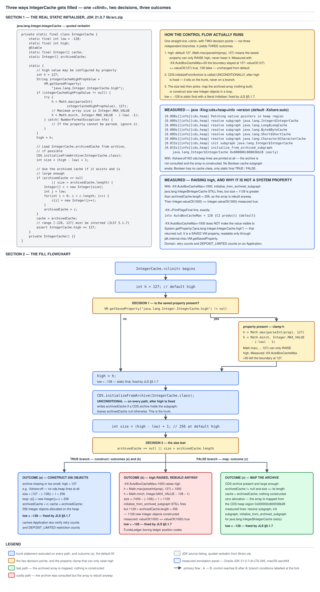

# 03 Java Core — Boxing internals — INTERNALS (§3.4, 3.4.1, 3.4.2)

**Target version: Java 21 LTS.** | **Part 3 of 5** | [Index](../00-index.md)
Previous: [When boxing is unavoidable](01h-when-boxing-is-unavoidable.md) · Next: [Cache configuration and the CDS archive](03a-internals-cache-configuration-and-cds.md)

Two pieces of code, forty lines between them, and they carry the cost model of every boxed integer in every Java process. `Integer.valueOf` is four lines: a two-sided bounds check, an array load, and a fallback allocation — and the interesting part is not the code but the three annotations around it and the one omission inside it. `Integer.IntegerCache` is a private nested holder class with two constants, one array, one deliberately-mutable staging field and a static block that has to satisfy a language specification, a tuning knob and a startup optimisation simultaneously; every oddity in it is one of those three pulling. Between them they answer the two questions this material actually gets asked as: *walk me through `Integer.valueOf`*, and *how much memory does the `Integer` cache occupy*.

Everything below is measured. Version-sensitive claims are stated against **Oracle JDK 21.0.7 (21.0.7+8-LTS-245, macOS aarch64)**, with `UseCompressedOops` on (ergonomic) and `ObjectAlignmentInBytes = 8`; library source is quoted from that build's `lib/src.zip`. Where a claim could not be confirmed against a primary source it is marked inline and repeated in `## Open questions`.

This file assumes the BASICS-tier model and does not rebuild it. [`01a-the-wrapper-caches.md`](01a-the-wrapper-caches.md) established that `valueOf` hands out shared instances from a 256-entry array and that `high` is tunable while `low` is not; [`01a2-the-archived-cache.md`](01a2-the-archived-cache.md) covered the CDS path at model level; [`01b-cache-coverage-and-reference-equality.md`](01b-cache-coverage-and-reference-equality.md) did the `==` consequences with the measured `identityHashCode` walk-through of the 127-versus-128 flip. None of that is repeated here. What is here is the line-by-line reading those files pointed at: every line of `valueOf`, every member of `IntegerCache`, what `@IntrinsicCandidate` and `@Stable` actually declare, why `archivedCache` is the one non-`final` field, and precisely which of this behaviour the specification requires versus which of it is a choice this implementation happens to make.

---

## 1. `Integer.valueOf`, all four lines (3.4.1)

`[SOURCE]` The hottest method in `java.lang` is a range test. Picture it as a toll booth in front of the heap: values that fall inside a 256-slot window are waved through to a pre-built array of objects that already exist and will exist forever; everything else pays for a fresh 16-byte allocation. The method itself does not decide the window's size and does not build the array — it only reads two `static` fields and indexes. That separation is the whole design: the *policy* lives in a nested class that initialises once, and the *hot path* is a comparison, a comparison, an array load, a return.

### Why it exists

`javac` needs a target for autoboxing. Before Java 5, converting an `int` into an `Integer` was written by hand as `new Integer(i)`, and that is a heap allocation on every single conversion, unconditionally — see [`01e-valueof-and-the-deprecated-constructors.md`](01e-valueof-and-the-deprecated-constructors.md) for the constructors and their deprecation. When JSR 201 added autoboxing, the compiler was going to start emitting that conversion implicitly, at sites the programmer could not see. Emitting a constructor call would have meant every implicit conversion allocated, which makes an invisible feature also an invisible cost.

So the compiler was pointed at a **static factory** instead of a constructor, for the one property a constructor cannot have: a factory is allowed to *not* allocate. `Integer.valueOf` is the reason autoboxing is affordable at all, and the reason the boxing bytecode is `invokestatic Integer.valueOf` rather than `new` / `dup` / `invokespecial` — [`03c-internals-boxing-bytecode.md`](03c-internals-boxing-bytecode.md) reads those instruction sequences side by side.

The second half of the design is the specification's. If the cache range were purely an implementation detail, a library author could not rely on it, and — more importantly — a *different* implementation could omit it and turn every autoboxing site into an allocation. JLS §5.1.7 therefore **mandates** that a documented range be interned. That mandate is what lets `javac` emit `valueOf` unconditionally at every boxing site without worrying about a performance cliff on small values, which in practice is most values: loop counters, ordinals, status phases, restriction counts.

**When to reach for `valueOf` directly, and when not.** Call it explicitly when you want the reader to see that a box is happening — a `Map<String, Integer>` population loop, a deliberate cache-hit optimisation. Let autoboxing do it when the box is incidental. Never call the constructor: it is terminally deprecated, it defeats the cache, and it makes `==` silently false where the reader expects true. And when the answer is "do not box at all", the sibling that wins is a primitive-specialised structure — `int[]`, `IntStream`, a primitive-keyed map — covered in [`01h-when-boxing-is-unavoidable.md`](01h-when-boxing-is-unavoidable.md) and [`01g-the-cost-of-boxing.md`](01g-the-cost-of-boxing.md).

### The mechanism

The whole method, quoted from JDK 21.0.7 `lib/src.zip`, `java/lang/Integer.java` (the annotation is at line 1069, the signature at 1070):

```java
@IntrinsicCandidate
public static Integer valueOf(int i) {
    if (i >= IntegerCache.low && i <= IntegerCache.high)
        return IntegerCache.cache[i + (-IntegerCache.low)];
    return new Integer(i);
}
```

Line by line.

**`@IntrinsicCandidate`.** This is `jdk.internal.vm.annotation.IntrinsicCandidate`, and its own javadoc is the only claim worth making about it:

> The `@IntrinsicCandidate` annotation is specific to the HotSpot Virtual Machine. It indicates that an annotated method **may be (but is not guaranteed to be) intrinsified** by the HotSpot VM. A method is intrinsified if the HotSpot VM replaces the annotated method with hand-written assembly and/or hand-written compiler IR — a compiler intrinsic — to improve performance.

Read the emphasis carefully, because this is the annotation most often over-read. It licenses HotSpot to substitute a hand-written implementation for the Java body; it does **not** assert that any such implementation exists for this method in this build, and it does not change the method's contract. The annotation's contract runs the other way — it is an obligation on JDK maintainers, not a promise to callers. The same javadoc continues: *"When modifying a method annotated with `@IntrinsicCandidate`, the corresponding intrinsic code in the HotSpot VM implementation must be updated to match the semantics of the annotated method,"* and then lists the null checks, range checks and store checks a hand-written replacement must perform itself because it no longer gets them free from bytecode semantics. So whichever path runs, the observable semantics of `Integer.valueOf` are the four lines above. `Integer.java` carries `@IntrinsicCandidate` on nine methods in JDK 21.0.7 (measured by `grep -c`), of which `valueOf(int)` is one.

**Unverified:** whether HotSpot 21.0.7 actually ships an intrinsic for `Integer.valueOf(int)`. `-XX:+UnlockDiagnosticVMOptions -XX:+PrintIntrinsics` on a 2.8M-iteration boxing loop produced **no output at all** on this build, so the question was not settled here. Nothing in this file depends on the answer, because every figure below is an allocation measurement of observable behaviour rather than a claim about generated code. See `## Open questions`.

**The signature.** `public static Integer valueOf(int i)` — one `int` in, one `Integer` out, and crucially a *reference* out, which the caller cannot distinguish from a fresh one except by `==`. Because the return type is a reference and the method is free to return a shared one, identity is not part of the contract in either direction. Hold that thought; it is the whole of the pitfall section.

**The bounds check.** `i >= IntegerCache.low && i <= IntegerCache.high`. Two-sided, short-circuiting, and reading *fields of another class* rather than literals. That last detail is the load-bearing one and it is asymmetric, which the bytecode shows plainly. Compiling a QuizStakes replica of exactly this shape — a holder with `static final int low = -128` and a blank-final `high` — and running `javap -p -c` on JDK 21.0.7 gives:

```
  static java.lang.Integer countOf(int);
    Code:
       0: iload_0
       1: bipush        -128
       3: if_icmplt     23
       6: iload_0
       7: getstatic     #9                  // Field CacheTriggerProbe$RestrictionCountCache.high:I
      10: if_icmpgt     23
      13: getstatic     #13                 // Field CacheTriggerProbe$RestrictionCountCache.cache:[Ljava/lang/Integer;
      16: iload_0
      17: sipush        128
      20: iadd
      21: aaload
      22: areturn
      23: iload_0
      24: invokestatic  #17                 // Method java/lang/Integer.valueOf:(I)Ljava/lang/Integer;
      27: areturn
```

The lower bound is `bipush -128` — an immediate operand baked into the instruction stream. The upper bound is `getstatic high` — a field read. **Insight:** that single asymmetry explains both halves of the cache's public behaviour. `low` is a `static final int` with a constant initialiser, so it is a compile-time constant (JLS §4.12.4), which is why it inlines into every caller and why it is *unconfigurable by construction* — no property could change it, because there is no read to intercept. `high` is a blank final assigned in a static block, so it is not a compile-time constant, which is what makes it tunable at all and what costs a field read on the upper comparison of every boxing operation in the process. One property of one field, and it accounts for the entire configuration surface. `final` semantics and constant folding are [`../classes-and-initialization/04-internals-final-and-constant-folding.md`](../classes-and-initialization/04-internals-final-and-constant-folding.md).

**The index expression.** `IntegerCache.cache[i + (-IntegerCache.low)]`, not `cache[i + 128]`. Since `low` is a compile-time constant, `-low` is a constant expression too and folds before any code is emitted; the two forms are byte-identical. Measured, on two methods differing only in that expression:

```
  static int slotViaLow(int);
    Code:
       0: iload_0
       1: sipush        128
       4: iadd
       5: ireturn

  static int slotViaLiteral(int);
    Code:
       0: iload_0
       1: sipush        128
       4: iadd
       5: ireturn
```

Identical. So the choice is not about code generation, it is about *correctness by construction*. Written as `i + 128` the offset is right by coincidence — it happens to equal the current `low`, and a future change to `low` would leave a silently-wrong index with no compile error. Written as `i + (-low)` the offset is right by definition: the expression *is* "distance from the array's first value". Both compile to `sipush 128`; only one of them stays correct if the class is edited. That is a style lesson worth stealing for your own offset arithmetic.

**The fallback: `return new Integer(i);`** This is a call to a constructor that is annotated `@Deprecated(since="9", forRemoval = true)`, and it is inside `java.lang.Integer` itself. It is the one remaining legitimate caller, and it is why the constructor cannot simply be deleted: the miss path needs a way to construct an `Integer` that is definitively *not* from the cache, and until Valhalla gives the JDK a different primitive for that, this is it. Compiled at the deprecation site the same call in your code produces `warning: [removal] Integer(int) in Integer has been deprecated and marked for removal` with no flags at all — see [`01e-valueof-and-the-deprecated-constructors.md`](01e-valueof-and-the-deprecated-constructors.md).

**The javadoc, and how to read the two modal verbs.** The method's documentation says:

> This method will **always** cache values in the range -128 to 127, inclusive, and **may** cache other values outside of this range.

That is a one-sided contract, and the asymmetry is the whole practical consequence. Code relying on `Integer.valueOf(127) == Integer.valueOf(127)` being true relies on the *specification* and is safe on every conforming implementation. Code relying on `Integer.valueOf(128) == Integer.valueOf(128)` being false relies on **nothing** — the javadoc explicitly reserves the right to cache it, and one JVM flag makes it true. Neither direction is a good thing to write, but only one of them is even defensible.

**Interview:** *"Walk me through `Integer.valueOf`."* The four-line answer, then the three details that show you have read it rather than heard about it: `low` is a compile-time constant and `high` is a field, so the bounds check is asymmetric in the bytecode; the index is written `i + (-low)` so the offset cannot drift from the array's base value; and the miss path calls the terminally-deprecated constructor, which is why that constructor still exists.

### Diagram

No diagram for this concept. The fill paths that D-102 draws belong to `IntegerCache`'s static block, which is concept 2; `valueOf` itself is a straight line whose one branch the quoted bytecode above renders more precisely than a picture would.

### A concrete example

The honest measurement of what the two paths cost, in the domain's own numbers: QuizStakes takes **2.8M stake reservations/day** at an average stake value of **4.20**, and each reservation carries a restriction count. Box the stake in minor units — average 420, comfortably outside the cache — and box the restriction count — small, comfortably inside it — and the difference is entirely allocation.

```java
import com.sun.management.ThreadMXBean;
import java.lang.management.ManagementFactory;

public class AllocProbe {
    static final int RESERVATIONS = 2_800_000;
    static Integer[] sink;

    static long boxAll(int value) {
        Integer[] boxes = new Integer[RESERVATIONS];
        for (int i = 0; i < RESERVATIONS; i++) {
            boxes[i] = value;                 // autoboxing -> Integer.valueOf(int)
        }
        sink = boxes;                          // publish, so escape analysis cannot help
        return boxes.length;
    }

    public static void main(String[] args) {
        ThreadMXBean bean = (ThreadMXBean) ManagementFactory.getThreadMXBean();
        long id = Thread.currentThread().threadId();
        for (int w = 0; w < 3; w++) { boxAll(420); boxAll(3); }   // warm to C2
        sink = null;

        long before = bean.getThreadAllocatedBytes(id);
        boxAll(420);
        long afterMiss = bean.getThreadAllocatedBytes(id);
        sink = null;
        boxAll(3);
        long afterHit = bean.getThreadAllocatedBytes(id);
        sink = null;

        long miss = afterMiss - before;
        long hit = afterHit - afterMiss;
        System.out.println("stake minor units, value 420 (outside cache): " + miss
                + " bytes, " + ((double) miss / RESERVATIONS) + " per element");
        System.out.println("restriction counts, value 3 (inside cache):   " + hit
                + " bytes, " + ((double) hit / RESERVATIONS) + " per element");
        System.out.println("difference:                                   " + (miss - hit) + " bytes");
        System.out.println("bare Integer[" + RESERVATIONS + "] header+refs: "
                + (4L * RESERVATIONS + 16) + " bytes");
    }
}
```

Measured output on JDK 21.0.7:

```
stake minor units, value 420 (outside cache): 56000016 bytes, 20.000005714285713 per element
restriction counts, value 3 (inside cache):   11200016 bytes, 4.000005714285714 per element
difference:                                   44800000 bytes
bare Integer[2800000] header+refs: 11200016 bytes
```

Read the last line against the second. The cache-hit run allocated **exactly** the bytes of the bare `Integer[]` — 11,200,016, which is a 16-byte array header plus 2,800,000 four-byte compressed references — and **not one byte more**. Zero `Integer` objects were created; the loop stored 2.8M copies of one reference that already existed before the process started. The cache-miss run allocated 56,000,016, and the difference is `44,800,000 = 2,800,000 × 16`, one 16-byte `Integer` per element. Both paths ran the same bytecode, the same `invokestatic`, the same branch. The per-element figures land on exact integers because 2.8M swamps the array's own 16-byte header, which is what makes the decomposition trustworthy rather than suspiciously round.

### The gotcha

Reading those four lines and concluding that **the branch is the cost**. It is not. The branch is two integer comparisons, one against an immediate and one against a `@Stable`-adjacent static field, and it is the same two comparisons on both paths. The cost is the allocation on the *miss* path: 16 bytes, a possible TLAB refill, and eventually a young-generation collection with 2.8M more objects to trace and copy. The measurement above is a 5× difference in bytes allocated with an identical instruction sequence.

The corollary catches people benchmarking this. A microbenchmark that boxes small values — a loop over `0` to `1000`, a JMH parameter of `42` — exercises **only the hit path** and reports that boxing is free. It is free, for those values. Feed it the stake amounts your production traffic actually carries and the same code allocates 44.8 MB per 2.8M conversions. If you take one benchmarking rule from this file: the input distribution *is* the experiment when the cache is involved, and 420 and 3 are different programs.

> **Definition.** `Integer.valueOf(int)` is the static factory `javac` emits for every autoboxing conversion: it returns a shared, pre-built instance from `IntegerCache.cache` when the argument lies in `[IntegerCache.low, IntegerCache.high]`, and otherwise allocates via the terminally-deprecated `Integer(int)` constructor.

---

## 2. `IntegerCache`'s five members, and which of them the specification pins (3.4.2)

`[SOURCE]` `[NUM]` A `private static final` nested class holding two constants, one array, one mutable staging field and a private constructor, whose static block is the only place in the JDK where a language mandate, a JVM tuning flag and a class-data-sharing archive all have to be satisfied by the same twenty lines. Read it as three forces in tension: JLS §5.1.7 fixes the floor, `-XX:AutoBoxCacheMax` can only push the ceiling up, and CDS wants to hand over an array that already exists in a mapped region rather than have the loop build one. Every unusual thing about the class — the blank final, the non-`final` field, the `assert`, the `Math.max` — is one of those three winning an argument.

### Why it exists as a nested class

This is the **holder-class idiom**, and it is here for exactly the reason it is used for lazy singletons. Class initialization in Java is lazy and per-class: `IntegerCache`'s `<clinit>` runs on first *active use* of `IntegerCache`, not when `Integer` initialises. So merely loading `Integer` — which every Java program does during startup — does not build a 256-element array of objects, and the array is built only if something actually boxes an in-range `int`. The machinery is [`../classes-and-initialization/03-internals-class-loading-and-init.md`](../classes-and-initialization/03-internals-class-loading-and-init.md); the exact list of triggers is [`../classes-and-initialization/01d-class-initialization-triggers.md`](../classes-and-initialization/01d-class-initialization-triggers.md).

Two consequences the idiom delivers for free.

**Thread safety with no code.** The JVM takes a per-class initialization lock (JVMS §5.5), so the static block runs exactly once, and every thread that reads `cache` afterwards is guaranteed to see the fully-constructed array with all 256 elements published. There is no `synchronized`, no `volatile`, no double-checked locking, and no way to observe a half-built cache. A hand-rolled lazy cache with the same guarantee needs a holder class or a correct DCL with a `volatile` field; the JDK simply used the holder.

**Reading a constant is not a trigger.** `Integer.MAX_VALUE` is a `static final int` with a constant initialiser, so it is inlined into the caller at compile time — the caller's class file contains the literal, not a reference to `Integer`. Reading it therefore does not initialise `Integer`, let alone `IntegerCache`. The same rule is why `IntegerCache.low` can be read without building the array, while `IntegerCache.high` cannot: reading `high` is a `getstatic` on `IntegerCache`, which *is* a trigger. Nothing in the JDK exploits that difference, but it is the mechanism behind the pitfall at the end of this file, and it is directly demonstrable — see the concrete example below.

### The mechanism

The whole class, quoted from JDK 21.0.7 `java/lang/Integer.java`:

```java
private static final class IntegerCache {
    static final int low = -128;
    static final int high;

    @Stable
    static final Integer[] cache;
    static Integer[] archivedCache;

    static {
        // high value may be configured by property
        int h = 127;
        String integerCacheHighPropValue =
            VM.getSavedProperty("java.lang.Integer.IntegerCache.high");
        if (integerCacheHighPropValue != null) {
            try {
                h = Math.max(parseInt(integerCacheHighPropValue), 127);
                // Maximum array size is Integer.MAX_VALUE
                h = Math.min(h, Integer.MAX_VALUE - (-low) -1);
            } catch( NumberFormatException nfe) {
                // If the property cannot be parsed into an int, ignore it.
            }
        }
        high = h;

        // Load IntegerCache.archivedCache from archive, if possible
        CDS.initializeFromArchive(IntegerCache.class);
        int size = (high - low) + 1;

        // Use the archived cache if it exists and is large enough
        if (archivedCache == null || size > archivedCache.length) {
            Integer[] c = new Integer[size];
            int j = low;
            for(int i = 0; i < c.length; i++) {
                c[i] = new Integer(j++);
            }
            archivedCache = c;
        }
        cache = archivedCache;
        // range [-128, 127] must be interned (JLS7 5.1.7)
        assert IntegerCache.high >= 127;
    }

    private IntegerCache() {}
}
```

Member by member.

**`static final int low = -128;`** A constant with a literal initialiser, therefore a compile-time constant under JLS §4.12.4, therefore inlined into every caller's class file and *not configurable by any mechanism at all*. There is no property read for it, no flag, and no code path that could observe an override even if one existed, because callers do not read the field. In a QuizStakes replica of the same shape, `javap -p -v` reports the difference explicitly:

```
  static final int LOW;
    descriptor: I
    flags: (0x0018) ACC_STATIC, ACC_FINAL
    ConstantValue: int -128

  static final int HIGH;
    descriptor: I
    flags: (0x0018) ACC_STATIC, ACC_FINAL
```

`LOW` carries a `ConstantValue` attribute; `HIGH` does not. That attribute is the whole story: it is what `javac` copies into callers, and it exists only for a field with a constant initialiser.

**`static final int high;`** A **blank final** — declared without an initialiser and assigned exactly once, at `high = h;`, in the static block. The compiler enforces the "exactly once on every path" rule; the JVM's initialization lock makes the single write visible to everyone. Because there is no constant initialiser there is no `ConstantValue` attribute, so `high` cannot be a compile-time constant, so `valueOf`'s upper comparison must be a `getstatic`. That is the asymmetry from concept 1, and it is a direct consequence of wanting the value configurable: configurability and constant-folding are mutually exclusive here.

**`@Stable static final Integer[] cache;`** `jdk.internal.vm.annotation.Stable` is a JIT hint, and it is worth quoting precisely because it does more for an array field than `final` does. Three passages from its javadoc, in the order they appear:

> If the field is an array type, then both the field value and all the components of the field value (if the field value is non-null) are indicated to be stable.

> The HotSpot VM relies on this annotation to promote a non-null (resp., non-zero) component value to a constant, thereby enabling superior optimizations of code depending on such a value (such as constant folding).

> Fields which are declared `final` may also be annotated as stable. Since final fields already behave as stable values, such an annotation conveys no additional information regarding change of the field's value, but still conveys information regarding change of additional components values if the type of the field is an array type.

That third passage answers the obvious objection. `final` already tells the JIT that `cache` — the reference — will not change; it says nothing about `cache[131]`, because array *elements* are never final in Java, and a JIT must normally assume any array slot can be written by any thread at any time. `@Stable` extends the promise to the elements. The payoff: for a `valueOf` call whose argument the JIT knows to be a constant, the entire body — bounds check, array load, and the resulting `Integer` reference — can fold to a single constant. Note the annotation's own `@implNote`: *"This annotation only takes effect for fields of classes loaded by the boot loader."* It is in `jdk.internal.vm.annotation`, unexported, and it does nothing whatsoever in application code even if you contrive to compile against it. Do not reach for it; it is listed here so you can read the JDK, not so you can imitate it.

**`static Integer[] archivedCache;`** The **only non-`final` member of the class**, and the reason is not sloppiness. `CDS.initializeFromArchive(IntegerCache.class)` may write this field from *outside Java code* — the JVM patches it to point at an object graph mapped out of the CDS archive, during the call, before the next Java statement runs. A `final` field would be a lie told to the JIT: HotSpot treats a `static final` field's post-initialization value as constant, and a write performed by the VM behind the JIT's back is exactly the "third value" case that `Stable`'s javadoc says is undefined. Declaring it plainly `static` keeps the truth — this field is mutated by machinery the compiler cannot see — visible in the source. **Insight:** the two array fields are not a redundancy, they are a division of labour between what the JIT is allowed to trust and what the VM is allowed to write. `archivedCache` is the mutable landing pad that CDS may stamp on and the `if` may overwrite; `cache` is written exactly once, at the very end, and carries every promise (`final`, `@Stable`) that makes `valueOf` fast. Collapse them into one field and you must either drop `@Stable` — losing the element-level constant folding — or lie to the JIT about a field the VM patches. Notice also the ordering discipline that follows from it: `archivedCache` is the staging field, `cache` is assigned from it exactly once at the end (`cache = archivedCache;`), so the `final`, `@Stable`, JIT-trusted field is written once with a fully-built array whichever path produced it. The property and CDS paths in full are [`03a-internals-cache-configuration-and-cds.md`](03a-internals-cache-configuration-and-cds.md).

**`private IntegerCache() {}`** A private constructor on a class nothing instantiates. It is the conventional marker for a pure holder: it removes the default constructor, so the class is uninstantiable, and it documents that the class is a namespace for statics rather than a type. The other five wrapper cache classes carry the same line — see [`03b-internals-the-other-wrapper-caches.md`](03b-internals-the-other-wrapper-caches.md), where `LongCache` puts it first in the class body and `IntegerCache` puts it last, which is the only difference between them on that point.

#### `[NUM]` The arithmetic, done on the page

The static block computes `int size = (high - low) + 1;`. At the default:

```
size = (high - low) + 1
     = (127 - (-128)) + 1
     = (127 + 128) + 1
     = 255 + 1
     = 256
```

So `cache` is a 256-element `Integer[]`. The index mapping follows from `i + (-low)` = `i + 128`:

| `int` value | index | note |
|---|---|---|
| −128 | 0 | first slot, `low` itself |
| −1 | 127 | |
| 0 | 128 | the midpoint |
| 3 | 131 | a QuizStakes restriction count |
| 127 | 255 | last slot, `high` at the default |

Now the footprint, which is the interview question. On JDK 21.0.7 with `UseCompressedOops` on and `ObjectAlignmentInBytes = 8`:

```
the Integer[] itself : 16-byte array header + 256 refs x 4 bytes
                     = 16 + 1024
                     = 1040 bytes            (already a multiple of 8, no padding)

the 256 Integer objects : 256 x 16 bytes      (12-byte header + 4-byte int value,
                        = 4096 bytes           already a multiple of 8, no padding)

total                = 1040 + 4096
                     = 5136 bytes
```

**5,136 bytes**, permanently, per JVM. That is the honest answer to "how much does the `Integer` cache cost": about five kilobytes, which is nothing, which is precisely why the design is uncontroversial. The 16-byte `Integer` is not asserted here — it is measured independently in this topic, both by the 20-bytes-per-element figure in concept 1 above (4-byte reference + 16-byte object) and by the escape-analysis experiment in [`03d-internals-escape-analysis.md`](03d-internals-escape-analysis.md), where disabling escape analysis restored exactly 32 bytes per iteration for two boxes. The layout itself is [`../objects-equality-and-lifecycle/05-internals-object-layout.md`](../objects-equality-and-lifecycle/05-internals-object-layout.md) and [`03e-internals-wrapper-memory.md`](03e-internals-wrapper-memory.md).

Then the knob. With `-XX:AutoBoxCacheMax=1000`:

```
size = (1000 - (-128)) + 1 = 1129            (measured: cache.length == 1129)

the Integer[] itself : 16 + 1129 x 4 = 16 + 4516 = 4532
                     -> padded up to a multiple of 8 = 4536 bytes

the 1129 Integer objects : 1129 x 16 = 18,064 bytes

total                = 4536 + 18,064 = 22,600 bytes
```

So raising `high` from 127 to 1000 takes the cache from 5,136 to **22,600 bytes** — an increase of 17,464 bytes, a factor of 4.4. Still trivial in absolute terms, which is the point worth making out loud: the reason not to raise `AutoBoxCacheMax` is *not* memory. It is that the resulting `==` behaviour is unportable, invisible in the source, and turns a bug that reproduces everywhere into a bug that reproduces only on the machines without the flag. **Interview:** *"How much memory does the `Integer` cache occupy?"* — 5,136 bytes at the default: a 1,040-byte array plus 256 × 16-byte objects; about 22.6 KB at `AutoBoxCacheMax=1000`; and the reason to leave it alone is portability of `==`, not footprint.

#### What the specification actually requires

The static block ends with two lines that exist purely to state and check the specification:

```java
// range [-128, 127] must be interned (JLS7 5.1.7)
assert IntegerCache.high >= 127;
```

The comment is the JDK's own, citing JLS §5.1.7 by section number. The `assert` is the executable form of it: `high` can only ever be raised, never lowered — `Math.max(parseInt(integerCacheHighPropValue), 127)` clamps upward and the flag path lands in the same place, which is why `-XX:AutoBoxCacheMax=50` was measured to leave the boundary **unchanged** at 127. So the invariant `high >= 127` is structurally guaranteed and the assertion can never fire. It is there as documentation that runs: with `-ea` enabled in a JDK developer's build, any future refactor that breaks the clamp fails immediately rather than silently shipping a JVM that violates the language specification. Assertions are disabled by default, so it costs nothing in production.

**Paraphrasing JLS §5.1.7** (paraphrase, not a quotation — the exact wording was not available in this environment): a boxing conversion is required to yield a reference to a *shared* instance, such that boxing the same value twice produces two references that are `==`, when the value being boxed is a `boolean`, a `byte`, a `char` in the range `'\u0000'` through `'\u007f'`, or a `short` or `int` in the range −128 through 127. Outside those ranges the specification permits but does not require sharing, and explicitly leaves it to the implementation. Two things follow. First, `Integer.valueOf(127) == Integer.valueOf(127)` is a *specified* truth, not an implementation detail — which is why `high` can only be raised. Second, `Float` and `Double` are absent from that list entirely and have no cache of any kind, which is why `Double.valueOf(1.0) == Double.valueOf(1.0)` is measured **false**; see [`01b-cache-coverage-and-reference-equality.md`](01b-cache-coverage-and-reference-equality.md) for the full identity matrix.

### Diagram



**D-102** — One `<clinit>`, two decision points, three outcomes. `high` is fixed first, from the default 127 or from the saved property clamped upward only; then `CDS.initializeFromArchive` runs unconditionally on the trunk; then the size test chooses between mapping the archived array and constructing `size` objects in a loop. `low = -128` is fixed by JLS §5.1.7 on every path.

### A concrete example

Two things only an internals file can show: that the holder really is lazy, and that `low` is inlined while `high` is read. A QuizStakes replica of `IntegerCache`, structurally identical, with a print statement in the static block so its initialization is observable:

```java
public class CacheTriggerProbe {

    private static final class RestrictionCountCache {
        static final int low = -128;
        static final int high;
        static final Integer[] cache;

        static {
            System.out.println("   <clinit> RestrictionCountCache RAN");
            high = 127;
            int size = (high - low) + 1;
            Integer[] c = new Integer[size];
            int j = low;
            for (int i = 0; i < c.length; i++) {
                c[i] = Integer.valueOf(j++);
            }
            cache = c;
        }

        private RestrictionCountCache() {}
    }

    static Integer countOf(int activeRestrictions) {
        if (activeRestrictions >= RestrictionCountCache.low
                && activeRestrictions <= RestrictionCountCache.high)
            return RestrictionCountCache.cache[activeRestrictions + (-RestrictionCountCache.low)];
        return Integer.valueOf(activeRestrictions);
    }

    public static void main(String[] args) {
        System.out.println("A: reading the low constant = " + RestrictionCountCache.low);
        System.out.println("B: first countOf(3)");
        System.out.println("   -> " + countOf(3));
        System.out.println("C: second countOf(3), same instance? "
                + (countOf(3) == countOf(3)));
    }
}
```

Measured output on JDK 21.0.7:

```
A: reading the low constant = -128
B: first countOf(3)
   <clinit> RestrictionCountCache RAN
   -> 3
C: second countOf(3), same instance? true
```

Read the order. Line `A` printed `-128` **before** the static block ran — reading a compile-time constant is not an active use of the class, so the array was not built. The `<clinit>` line then appears between `B` and its result, meaning initialization was triggered by the first `countOf(3)`, specifically by the `getstatic high` in the bounds check. And `C` confirms the array is built once and shared: two calls, same reference. The `javap` listing quoted in concept 1 is this exact `countOf` method, which is why the `bipush -128` / `getstatic high` asymmetry in it is not a coincidence — it is the compiled form of the trigger difference this output demonstrates.

For the real `IntegerCache`, `-Xlog:class+init=info` on JDK 21.0.7 reports it initialising **exactly once** — measured, one matching line in both `-Xshare:auto` (the default, CDS on) and `-Xshare:off` runs. What it also shows is that the laziness is theoretical in a real process, because the JDK boots and boxes on its own account long before `main`:

```
[0.016s][info][class,init] 136 Initializing 'jdk/internal/misc/Signal' (0x000000700006eb10)
[0.016s][info][class,init] 137 Initializing 'java/lang/Integer$IntegerCache' (0x000000700006f358)
[0.016s][info][class,init] 138 Initializing 'java/util/Hashtable$Entry'(no method) (0x000000700006ed10)
```

`jdk.internal.misc.Signal` registers handlers in a `Hashtable` keyed by boxed signal numbers, and that is initialization number 137 out of a startup sequence that runs to several hundred — well before any application class. So the honest statement is: the holder idiom means `IntegerCache` is built on first in-range box and not when `Integer` loads, and in every ordinary JVM that first box happens during platform startup rather than in your code. The laziness is real and structural; it just is not observable from `main`.

### The gotcha

Assuming the cache is per-classloader, per-instance, or clearable. It is none of those.

It is **one array per JVM**, held by a `static final` field of a nested class of `java.lang.Integer`, which is loaded by the bootstrap class loader. There is exactly one bootstrap loader per JVM, so there is exactly one `IntegerCache` class, so there is exactly one `cache` array — shared across every application class loader, every web application in a container, every module, every thread. It is unreachable from application code (`private` nested, in `java.base`, not opened), the field is `final` so it cannot be reassigned even with `--add-opens`, and there is no eviction, no expiry, no `clear()`, and nothing holding a weak reference to anything. The array and its 256 objects are allocated once and live until the process exits.

That immortality is the real reason `AutoBoxCacheMax` is a startup decision rather than a cache policy. There is no "warm up to 1000 under load and shrink back" — the size is read once from a saved VM property before the array exists and can never change afterwards. And because the instances are process-wide and shared by every unrelated component, they are the worst possible monitors: `synchronized (someBoxedInteger)` locks an object that another library in the same JVM may also be locking on for entirely different reasons, which is why `javac` emits `warning: [synchronization] attempt to synchronize on an instance of a value-based class`. That is [`03f-internals-monitors-and-valhalla.md`](03f-internals-monitors-and-valhalla.md).

> **Definition.** `Integer.IntegerCache` is a `private static final` holder class inside `java.lang.Integer` whose `<clinit>` fixes `high` (default 127, raisable only, from a saved VM property), consults the CDS archive via `CDS.initializeFromArchive`, and publishes a single process-wide `@Stable Integer[]` of `(high - low) + 1` shared instances covering `low = -128` upward — of which JLS §5.1.7 mandates only the range −128 through 127.

Handing off: the saved-property read and `CDS.initializeFromArchive` in full are [`03a-internals-cache-configuration-and-cds.md`](03a-internals-cache-configuration-and-cds.md); the other five wrappers' cache classes, and why `Long` has no tunable at all, are [`03b-internals-the-other-wrapper-caches.md`](03b-internals-the-other-wrapper-caches.md); the boxing and unboxing bytecode read instruction by instruction is [`03c-internals-boxing-bytecode.md`](03c-internals-boxing-bytecode.md).

---

## Pitfalls

### Reading "may cache other values outside of this range" as permission to rely on it

**Wrong**

```java
// A test asserting the boundary in the negative direction.
@Test
void largeStakeAmountsAreNotShared() {
    Integer first = 1000;
    Integer second = 1000;
    assertNotSame(first, second);   // "1000 is outside the cache, so these differ"
}
```

Measured on JDK 21.0.7: passes with no flags, and **fails** under `-XX:AutoBoxCacheMax=1000`, where `Integer.valueOf(1000) == Integer.valueOf(1000)` is measured `true`. The mirror-image test, `assertSame(first, second)`, fails everywhere *except* under that flag. Either way the suite is green on one developer's machine and red on the build agent, and the diff that "broke" it is a JVM argument in a start script.

**Right**

```java
// Identity is not part of the contract in either direction. Compare values.
@Test
void largeStakeAmountsCompareByValue() {
    Integer first = 1000;
    Integer second = 1000;
    assertEquals(first, second);            // Integer.equals, value comparison
    assertEquals(1000, first.intValue());   // or leave the boxed world entirely
}
```

And in production code, never write `==` between two `Integer` references at all. The javadoc's contract is one-sided: *always* for −128 through 127, *may* for everything else. "May" is not "does not", and it is not "does".

**Why people believe it:** the 127-versus-128 flip is the single most-repeated Java interview fact, and it is usually taught as "128 and above are not cached" — a flat statement of fact rather than "the specification does not require 128 to be shared, and this implementation does not share it by default". Once you have seen the boundary demonstrated ten times, the negative direction feels as solid as the positive one. It is not: only the positive direction is in the specification, and only the negative one has a JVM flag that changes it.

### Trying to reach, resize or reset `IntegerCache` reflectively

**Wrong**

```java
// "The cache is just a static array. Reflection can read it, and I can widen it at runtime."
Class<?> cacheClass = Class.forName("java.lang.Integer$IntegerCache");
java.lang.reflect.Field high = cacheClass.getDeclaredField("high");
high.setAccessible(true);
high.setInt(null, 1000);
```

Measured on JDK 21.0.7, three separate walls, in order. With no flags, `Class.forName` and `getDeclaredField` both **succeed** — the class object and the `Field` object are obtainable, which is what makes the attempt look promising — and then:

```
3. setAccessible THREW java.lang.reflect.InaccessibleObjectException: Unable to make field static final int java.lang.Integer$IntegerCache.high accessible: module java.base does not "opens java.lang" to unnamed module @14ae5a5
```

Add `--add-opens java.base/java.lang=ALL-UNNAMED` and `setAccessible` succeeds, reads work, writes do not:

```
3. setAccessible succeeded
4. high = 127
5. cache length = 256
6. writing high THREW java.lang.IllegalAccessException: Can not set static final int field java.lang.Integer$IntegerCache.high to (int)1000
7. replacing cache THREW java.lang.IllegalAccessException: Can not set static final [Ljava.lang.Integer; field java.lang.Integer$IntegerCache.cache to [Ljava.lang.Integer;
8. valueOf(1000) == valueOf(1000) : false
9. valueOf(7) == valueOf(7)       : true
```

So: reading is possible with a module flag, writing a `static final` field is refused outright since Java 9 regardless of `setAccessible`, and the cache is exactly as it was. Note lines 4 and 5 as an aside — they are an independent confirmation of the arithmetic in concept 2, and under `-XX:AutoBoxCacheMax=1000` the same probe measured `high = 1000` and `cache length = 1129`.

**Right**

```
# Decide it at startup, once, if you must decide it at all:
java -XX:AutoBoxCacheMax=1000 -jar quizstakes-payments.jar
```

Or, far better, do not depend on the cache. If a hot path is allocating boxes, remove the boxing — an `int[]` of stake minor units, an `IntStream`, a primitive-keyed map — rather than trying to widen a JDK-internal array. [`01h-when-boxing-is-unavoidable.md`](01h-when-boxing-is-unavoidable.md) lists where boxing is genuinely forced and what the escape hatches are.

**Why people believe it:** reflection defeats `private` so routinely that "private is not a real barrier" becomes a general instinct, and the first two calls in the snippet above really do succeed, which is exactly the wrong feedback. Two independent mechanisms are in the way and neither is an access-modifier check: the module system's strong encapsulation (Java 9+, and `--add-opens` is the only door), and the `final` write refusal in `Field.set`, which has nothing to do with visibility at all.

### Assuming `high` is a compile-time constant, so the bounds check folds away

**Wrong**

```java
// "Both bounds are static final ints, so the whole range test is constant-folded
//  and valueOf compiles down to a single array load."
Integer restrictionCount = activeRestrictions.size();   // "just an aaload"
```

The source says otherwise, and the class file proves it. `high` is a **blank final** — declared with no initialiser and assigned in the static block — so `javac` emits no `ConstantValue` attribute for it. Measured on the QuizStakes replica:

```
  static final int LOW;
    flags: (0x0018) ACC_STATIC, ACC_FINAL
    ConstantValue: int -128

  static final int HIGH;
    flags: (0x0018) ACC_STATIC, ACC_FINAL
```

and in the compiled bounds check, `bipush -128` for the lower bound against `getstatic high` for the upper. The two bounds are not symmetric at the bytecode level, and only one of them is a literal.

**Right**

State the two levels separately. **At the bytecode level**, measured: the lower comparison is against an immediate operand, the upper is a `getstatic` field read. **At the JIT level**, `cache` is `@Stable` and `high` is a `static final` field of a bootstrap-loaded class written once during `<clinit>`, both of which HotSpot is documented to treat as constant-foldable after initialization — `Stable`'s javadoc says the VM *"will process non-null stable fields (final or otherwise) in a similar manner to static final fields with respect to promoting the field's value to a constant."* **Unverified:** whether C2 in 21.0.7 does in fact fold the `high` read out of a compiled `valueOf`, and whether an intrinsic replaces the method entirely. `-XX:+PrintIntrinsics` produced no output on this build, and no compilation log was inspected. Recorded in `## Open questions`. If you need to reason about the cost, reason about the *allocation*, which is measured: 4 bytes per element on the hit path against 20 on the miss path.

**Why people believe it:** `static final int` is taught, correctly, as "compile-time constant, inlined into callers" — and that is true for `static final int low = -128;`. The rule people carry away drops the qualifier. The actual JLS §4.12.4 condition is `final` **plus a constant-expression initialiser in the declaration**; a blank final assigned in `<clinit>` satisfies neither half of the second clause. It is the same rule that makes `static final int MAX_STAKE = 5000;` inline into another compilation unit while `static final int MAX_STAKE = loadFromConfig();` does not.

### Believing that initialising `Integer` builds the cache

**Wrong**

```java
// "Reading Integer.MAX_VALUE touches java.lang.Integer, so the 256-element array
//  gets built right there. Startup cost I can avoid by not mentioning Integer."
int maxStakeGuard = Integer.MAX_VALUE;
```

Two errors stacked. `Integer.MAX_VALUE` is a `static final int` with a constant initialiser, so `javac` copies the literal `2147483647` into *this* class file and emits no reference to `Integer` at all — the line does not initialise `Integer`, never mind `IntegerCache`. And even a genuine active use of `Integer` would not build the cache, because `IntegerCache` is a *separate class* with its own independent `<clinit>`, which is the entire point of the holder idiom.

**Right**

```java
// The trigger is a getstatic on IntegerCache itself, which the bounds check performs.
// Measured with -Xlog:class+init on the QuizStakes replica:
//   A: reading the low constant = -128      <- no <clinit>
//   B: first countOf(3)
//      <clinit> RestrictionCountCache RAN   <- triggered HERE, by the getstatic on high
Integer activeRestrictions = restrictions.size();   // this is what builds the array
```

And if the real question was startup cost: it is 5,136 bytes and a 256-iteration loop, measured to initialise as class number 137 of the JVM's own boot sequence, triggered by `jdk.internal.misc.Signal` boxing signal numbers into a `Hashtable`. It has already happened before your `main` runs, so there is nothing to avoid.

**Why people believe it:** "a nested class is part of the outer class" is true in the source and false in the class file — `Integer` and `Integer$IntegerCache` are two separate class files with two separate initialization states, linked only by a nesting attribute. Add the widespread shorthand "touching a class initialises it", which drops the constant-field exception from JLS §12.4.1, and both halves of the wrong belief look reasonable. The list of what actually triggers `<clinit>` is [`../classes-and-initialization/01d-class-initialization-triggers.md`](../classes-and-initialization/01d-class-initialization-triggers.md).

---

## Cheat sheet

| Thing | Fact (Java 21 LTS) |
|---|---|
| `Integer.valueOf` body | 4 lines: two-sided bounds check, `cache[i + (-low)]`, else `new Integer(i)` |
| Its annotation | `@IntrinsicCandidate` — HotSpot **may** substitute hand-written assembly or IR; not a guarantee |
| `@IntrinsicCandidate` package | `jdk.internal.vm.annotation`; 9 occurrences in `Integer.java` on 21.0.7 |
| Whose obligation | JDK maintainers': modify the method, update the intrinsic to match its semantics |
| Bounds check, lower | `bipush -128` — an immediate. `low` is a compile-time constant |
| Bounds check, upper | `getstatic high` — a field read. `high` is a blank final, so not foldable by `javac` |
| Index expression | `i + (-IntegerCache.low)`; folds to `sipush 128` / `iadd`, byte-identical to `i + 128` |
| Why not `i + 128` | correct by construction rather than by coincidence if `low` ever changes |
| Miss path | `new Integer(i)` — the terminally-deprecated constructor's one legitimate caller |
| Javadoc contract | **always** for -128 to 127; **may** for other values — one-sided |
| Practical reading | `127 == 127` relies on the spec; `128 != 128` relies on nothing |
| `IntegerCache` shape | `private static final class` nested in `Integer`; holder-class idiom |
| `low` | `static final int low = -128;` — `ConstantValue: int -128`, inlined, unconfigurable |
| `high` | `static final int high;` — blank final, assigned once in `<clinit>`, no `ConstantValue` |
| `cache` | `@Stable static final Integer[]` — one array per JVM, immortal, unreachable |
| `archivedCache` | `static Integer[]` — the **only** non-`final` member; CDS writes it from outside Java |
| Why not `final` | a VM-side write to a `final` field would be a lie to the JIT |
| `private IntegerCache() {}` | uninstantiable-holder marker; every wrapper cache class has one |
| `@Stable` | `jdk.internal.vm.annotation`; extends constant-ness to array **elements**, which `final` does not |
| `@Stable` scope | boot-loader classes only, per its `@implNote`; inert in application code |
| `size` at default | `(high - low) + 1 = (127 - (-128)) + 1 = 256` |
| Index of 0 | 128. Index of −128 is 0; index of 127 is 255 |
| Footprint, default | 1,040-byte array (16 + 256 × 4) + 4,096 bytes of objects (256 × 16) = **5,136 bytes** |
| Footprint, `AutoBoxCacheMax=1000` | `size = 1129`; 4,536 + 18,064 = **22,600 bytes**. Measured `cache.length == 1129` |
| Why not raise it | portability of `==`, not memory. 17 KB more is irrelevant; unportable identity is not |
| `AutoBoxCacheMax=50` | boundary **unchanged**: the source's `Math.max(h, 127)` clamps upward only |
| Spec floor | JLS §5.1.7 (the source's own comment cites `JLS7 5.1.7`) |
| What §5.1.7 pins (paraphrase) | `boolean`; `byte`; `char` `'\u0000'`–`'\u007f'`; `short`/`int` −128–127 must be shared |
| Not pinned | anything outside those ranges; `Float` and `Double` have no cache at all |
| `assert IntegerCache.high >= 127;` | documents and, under `-ea`, checks the invariant the clamp guarantees. Can never fire |
| Initialization trigger | a `getstatic` on `IntegerCache` — the bounds check's read of `high` |
| Not a trigger | reading `Integer.MAX_VALUE` or `IntegerCache.low` (compile-time constants, inlined) |
| Thread safety | the JVM's per-class initialization lock. No `volatile`, no `synchronized`, no DCL |
| Measured init count | exactly **1** `class+init` line for `Integer$IntegerCache`, under both `-Xshare:auto` and `-Xshare:off` |
| Measured init position | class **137** of JVM startup, triggered by `jdk.internal.misc.Signal` |
| Hit vs miss, measured | 2.8M boxes: **11,200,016** bytes (value 3) vs **56,000,016** (value 420) |
| Per element | 4.000 vs 20.000 bytes; difference `2,800,000 × 16` = one `Integer` each |
| Reflective read | needs `--add-opens java.base/java.lang=ALL-UNNAMED`; then `high = 127`, `cache.length = 256` |
| Reflective write | `IllegalAccessException: Can not set static final int field` — even with `--add-opens` |
| Scope of the cache | one bootstrap-loaded class, one array, all class loaders, no eviction, no clear, immortal |

---

## Self-test

**Q1.** Walk me through `Integer.valueOf`.

<details><summary>Answer</summary>

Four lines, annotated `@IntrinsicCandidate`. It tests `i >= IntegerCache.low && i <= IntegerCache.high`; on success it returns `IntegerCache.cache[i + (-IntegerCache.low)]`, a pre-built shared instance; on failure it returns `new Integer(i)`. Three details that show you have read it. First, the bounds check is asymmetric in the bytecode: `low` is `static final int low = -128` with a `ConstantValue` attribute so it inlines to a `bipush -128` immediate, while `high` is a blank final assigned in the static block so it has no `ConstantValue` and compiles to a `getstatic`. That one asymmetry explains both why the lower bound is unconfigurable — there is no read to intercept — and why the upper one costs a field read on every boxing operation. Second, the index is written `i + (-low)` rather than `i + 128`; both fold to `sipush 128` / `iadd`, measured byte-identical, so the choice is about staying correct if `low` ever changed rather than about code generation. Third, the miss path calls `new Integer(i)`, a constructor that is `@Deprecated(since="9", forRemoval = true)` — this is its one remaining legitimate caller, which is why it cannot simply be deleted. And on the annotation: `@IntrinsicCandidate` declares that HotSpot *may* replace the method with hand-written assembly or compiler IR, not that it does; either way the semantics of those four lines are preserved, and it is an obligation on JDK maintainers rather than a promise to callers.

</details>

**Q2.** How much memory does the `Integer` cache occupy, and would you raise `AutoBoxCacheMax`?

<details><summary>Answer</summary>

At the default, 5,136 bytes per JVM, derived rather than remembered. `size = (high - low) + 1 = (127 - (-128)) + 1 = 256`. The `Integer[]` is a 16-byte array header plus 256 compressed references at 4 bytes each, so 1,040 bytes, already a multiple of 8 so no padding. The 256 `Integer` objects are 16 bytes each — 12-byte header plus a 4-byte `int`, again already aligned — so 4,096 bytes. Total 5,136. With `-XX:AutoBoxCacheMax=1000`, `size = (1000 - (-128)) + 1 = 1129` (measured reflectively: `cache.length == 1129`), the array becomes 16 + 4,516 = 4,532 padded to 4,536, the objects 1,129 × 16 = 18,064, total 22,600 bytes. So raising it 1,000-fold in range costs about 17 KB, which is nothing. And that is exactly why memory is the wrong reason to refuse: I would not raise it because the flag changes `==` semantics invisibly. Code that passes on a JVM with the flag and fails on one without it, with no diff in the source, is a far worse outcome than 17 KB, and the flag has to be set identically on every JVM the artefact ever runs on — developer laptops, CI agents, production, the debugger. If a hot path is allocating boxes, the fix is to stop boxing: `int[]`, `IntStream`, a primitive-keyed map.

</details>

**Q3.** `archivedCache` is the only non-`final` field in `IntegerCache`. Why?

<details><summary>Answer</summary>

Because the JVM writes it from outside Java code. The static block calls `CDS.initializeFromArchive(IntegerCache.class)`, and that call may patch `archivedCache` to point at an `Integer[]` and its 256 objects mapped straight out of the class-data-sharing archive, so the loop never has to construct them. A write performed by VM machinery is invisible to the JIT, and HotSpot treats a `static final` field's value after `<clinit>` as constant — so declaring `archivedCache` as `final` would be a lie: the JIT could fold in the pre-CDS value (null) while the actual field held the archived array. `Stable`'s own javadoc calls the analogous case — a stable field given a third value by means outside normal Java writes — explicitly undefined. Note the ordering discipline that follows. `archivedCache` is a *staging* field; whichever path fills it, the block ends with `cache = archivedCache;`, so the `final`, `@Stable`, JIT-trusted field is written exactly once with a fully-built array. That is what lets `cache` keep the strong annotation while the CDS interaction lives on a field with no promises attached. Measured evidence that the archive path is real: `java -Xlog:cds+heap=info -version` prints `initialize_from_archived_subgraph java.lang.Integer$IntegerCache` with an `(early)` marker, and with `-Xshare:off` no `cds,heap` lines appear at all.

</details>

**Q4.** What does `@Stable` on `cache` buy that `final` does not?

<details><summary>Answer</summary>

Constant-ness of the array *elements*. `final` on `cache` promises only that the reference will not change after `<clinit>`; array slots are never final in Java, so a JIT must otherwise assume `cache[131]` could be written by any thread at any time and must reload it. `@Stable` — `jdk.internal.vm.annotation.Stable` — extends the promise downward. Its javadoc: *"If the field is an array type, then both the field value and all the components of the field value (if the field value is non-null) are indicated to be stable,"* and it says outright that on a `final` field the annotation conveys nothing about the field itself but *"still conveys information regarding change of additional components values if the type of the field is an array type."* The payoff is that for a `valueOf` whose argument the JIT knows to be constant, the bounds check, the array load and the resulting reference can all fold to one constant. Two caveats worth volunteering. Its `@implNote` restricts it to fields of boot-loader classes, so it is inert in application code and there is no point imitating it. And whether C2 in 21.0.7 actually performs that fold in `valueOf` I have not measured — `-XX:+PrintIntrinsics` produced no output on this build — so I would state the annotation's documented contract and not a measured JIT outcome.

</details>

**Q5.** Prove that `IntegerCache` is lazy, and say why that laziness is invisible in practice.

<details><summary>Answer</summary>

Structurally, it is the holder-class idiom: `IntegerCache` is a separate class from `Integer` with its own `<clinit>`, so it initialises on first active use of `IntegerCache`, not when `Integer` loads. Demonstrated on a structurally identical QuizStakes replica with a print in its static block, measured on JDK 21.0.7: reading its `low` constant printed `-128` with no `<clinit>` line, because `static final int low = -128` carries a `ConstantValue` attribute and is inlined into the caller, and reading an inlined constant is not a trigger; then the first `countOf(3)` call printed the `<clinit>` line before its result, triggered by the `getstatic high` in the bounds check. Two more calls returned the same reference, so the array is built once. The same non-trigger rule is why `Integer.MAX_VALUE` does not build the cache. Why it is invisible: `-Xlog:class+init=info` on the real thing shows exactly one `Initializing 'java/lang/Integer$IntegerCache'` line — one, in both `-Xshare:auto` and `-Xshare:off` — at position **137** of the JVM's boot sequence, immediately after `jdk/internal/misc/Signal`, which registers handlers in a `Hashtable` keyed by boxed signal numbers. So the platform itself boxes an in-range `int` long before any application class loads. The laziness is real and structural; you just cannot observe it from `main`.

</details>

**Q6.** Can you read or change `IntegerCache.high` at runtime?

<details><summary>Answer</summary>

Read yes, with a flag; change no, at all. Measured on JDK 21.0.7 in order. `Class.forName("java.lang.Integer$IntegerCache")` succeeds and `getDeclaredField("high")` succeeds with no flags — the class object and the `Field` object are obtainable, which is what makes the attempt look promising. Then `setAccessible(true)` throws `InaccessibleObjectException: Unable to make field static final int java.lang.Integer$IntegerCache.high accessible: module java.base does not "opens java.lang" to unnamed module`, because `java.lang` is strongly encapsulated. With `--add-opens java.base/java.lang=ALL-UNNAMED` the read works: `high = 127`, `cache length = 256`, and under `-XX:AutoBoxCacheMax=1000` the same probe reports `high = 1000`, `cache length = 1129`, which independently confirms the size arithmetic. Writing is refused regardless: `Field.setInt` gives `IllegalAccessException: Can not set static final int field`, and replacing the array gives the same for `cache`. Two independent mechanisms, neither of them an access-modifier check — module encapsulation, and the `final` write refusal that has held since Java 9. The only supported lever is at startup, `-XX:AutoBoxCacheMax=N` or `-Djava.lang.Integer.IntegerCache.high=N`, and the array is immortal once built, so it is a startup decision rather than a cache policy.

</details>

**Q7.** Exactly what does JLS §5.1.7 require, and what does it leave open?

<details><summary>Answer</summary>

Paraphrasing rather than quoting, since I do not have the text in front of me: a boxing conversion must yield a reference to a *shared* instance — so that boxing the same value twice gives two references that are `==` — for `boolean`, for `byte`, for `char` in `'\u0000'` through `'\u007f'`, and for `short` and `int` in −128 through 127. Everything outside those ranges is explicitly left to the implementation. Three consequences. First, `Integer.valueOf(127) == Integer.valueOf(127)` is a specified truth on any conforming JVM, not an implementation detail — and that is enforced in the source: `Math.max(parseInt(integerCacheHighPropValue), 127)` clamps the property upward only, which is why `-XX:AutoBoxCacheMax=50` was measured to leave the boundary at 127, and why the block ends `assert IntegerCache.high >= 127;` under the JDK's own comment `// range [-128, 127] must be interned (JLS7 5.1.7)`. That assertion documents an invariant the clamp already guarantees, so it can never fire; with `-ea` it would catch a future refactor breaking the clamp. Second, `Integer.valueOf(128) == Integer.valueOf(128)` being false relies on nothing whatsoever — the javadoc says the method *may* cache values outside the range, and one flag makes it true — so depending on identity in the negative direction is strictly worse than depending on it in the positive one. Third, `Float` and `Double` are absent from the list and have no cache of any kind, which is why `Double.valueOf(1.0) == Double.valueOf(1.0)` is measured false. I would flag that this is a paraphrase; the exact clause text I would check in JLS 21 §5.1.7 before quoting it.

</details>

**Q8.** Someone benchmarks boxing, sees no allocation, and concludes it is free. What went wrong?

<details><summary>Answer</summary>

Almost certainly the input distribution, and possibly escape analysis on top of it. The cache means the *value* being boxed decides whether an allocation happens, so a benchmark over small values — 0 to 1000 as a loop counter, a JMH parameter of 42 — exercises only the hit path and measures the branch, which really is free. Measured on JDK 21.0.7 with `getThreadAllocatedBytes`, boxing 2,800,000 values into a published `Integer[]`: value 3 (inside the cache) allocated 11,200,016 bytes, which is exactly the bare `Integer[]` — a 16-byte header plus 2.8M four-byte compressed references — and not one byte more, so zero `Integer` objects; value 420 (a QuizStakes stake in minor units, average 4.20) allocated 56,000,016, and the difference is 44,800,000 = 2,800,000 × 16, one 16-byte `Integer` per element. Same bytecode, same `invokestatic`, same branch, 5× the bytes. The other trap is publication: if the box does not escape the method, C2's escape analysis scalar-replaces it and the allocation genuinely disappears — measured elsewhere in this topic as 0 bytes by default against 160,000,000 bytes with `-XX:-DoEscapeAnalysis` for two non-escaping boxes over 5M iterations. So a benchmark whose boxes are never stored anywhere measures nothing at all. Both fixes are the same discipline: use the value distribution production actually carries, and publish the result into a live structure so the optimiser cannot delete the work.

</details>

---

## Open questions

- **Unverified:** whether HotSpot 21.0.7 ships an actual compiler intrinsic for `Integer.valueOf(int)`, as opposed to merely marking it `@IntrinsicCandidate`. What was established: the annotation's own javadoc, quoted above, says intrinsification *"may be (but is not guaranteed to be)"* applied, and that the intrinsic must preserve the annotated method's semantics — so no observable behaviour in this file depends on the answer. `-XX:+UnlockDiagnosticVMOptions -XX:+PrintIntrinsics` on a 2.8M-iteration boxing loop produced **no output at all** on this build, so the flag did not settle it. What would settle it: the `vmIntrinsics` declaration list in the HotSpot source for the 21 update train (`src/hotspot/share/classfile/vmIntrinsics.hpp`), or a `-XX:+PrintCompilation -XX:+PrintInlining` run on a debug/fastdebug build where `PrintIntrinsics` is functional.
- **Unverified:** whether C2 in 21.0.7 folds the `getstatic IntegerCache.high` read out of a compiled `valueOf`, and whether `@Stable` on `cache` results in a fully constant-folded `valueOf` for a JIT-known-constant argument. What was established: the bytecode-level facts (measured — `bipush` for the lower bound, `getstatic` for the upper) and the documented contract of `@Stable`, which says HotSpot *"will process non-null stable fields (final or otherwise) in a similar manner to static final fields with respect to promoting the field's value to a constant."* Documented intent is not a measurement of generated code. What would settle it: `-XX:+UnlockDiagnosticVMOptions -XX:+PrintAssembly` (with hsdis) on a hot loop calling `Integer.valueOf` with a constant argument, or an IR dump via `-XX:+PrintIdeal`. Nothing in this file's cost claims rests on it — those are allocation measurements.
- **Unverified:** the exact normative wording of JLS 21 §5.1.7, which is paraphrased rather than quoted above. What was established: the JDK's own source comment cites it as `// range [-128, 127] must be interned (JLS7 5.1.7)`; the `Integer.valueOf` javadoc's *"will always cache values in the range -128 to 127, inclusive"* matches the `int` clause; and the clamp `Math.max(parseInt(integerCacheHighPropValue), 127)` plus `assert IntegerCache.high >= 127;` are the implementation enforcing it. The `char`, `short`, `byte` and `boolean` clauses are reported from the paraphrase and are consistent with the measured identity results for those wrappers, but the section text itself was not available in this environment. What would settle it: JLS 21 §5.1.7 (Boxing Conversion), read directly.
- **Unverified:** why `jdk.internal.misc.Signal` is the specific trigger for `Integer$IntegerCache` initialization during startup. What was established, measured with `-Xlog:class+init=info` on JDK 21.0.7: `Integer$IntegerCache` is initialization number **137**, immediately after `jdk/internal/misc/Signal` (136) and immediately before `java/util/Hashtable$Entry` (138), which is strongly suggestive of signal numbers being boxed as `Hashtable` keys. The `Signal` source was not read to confirm which line performs that boxing, and the ordering could change between builds or platforms. What would settle it: reading `jdk/internal/misc/Signal.java` from `src.zip`, or `-Xlog:class+init=info` combined with a stack trace captured at `IntegerCache`'s `<clinit>`. Nothing in this file depends on the identity of the trigger, only on the measured fact that initialization happens once and before `main`.

---

**Leaves covered:** 3.4.1, 3.4.2 (2 leaves)
**Leaves deferred:** none
**Diagrams included:** D-102
**Target version:** Java 21 LTS
**Lines:** 694
