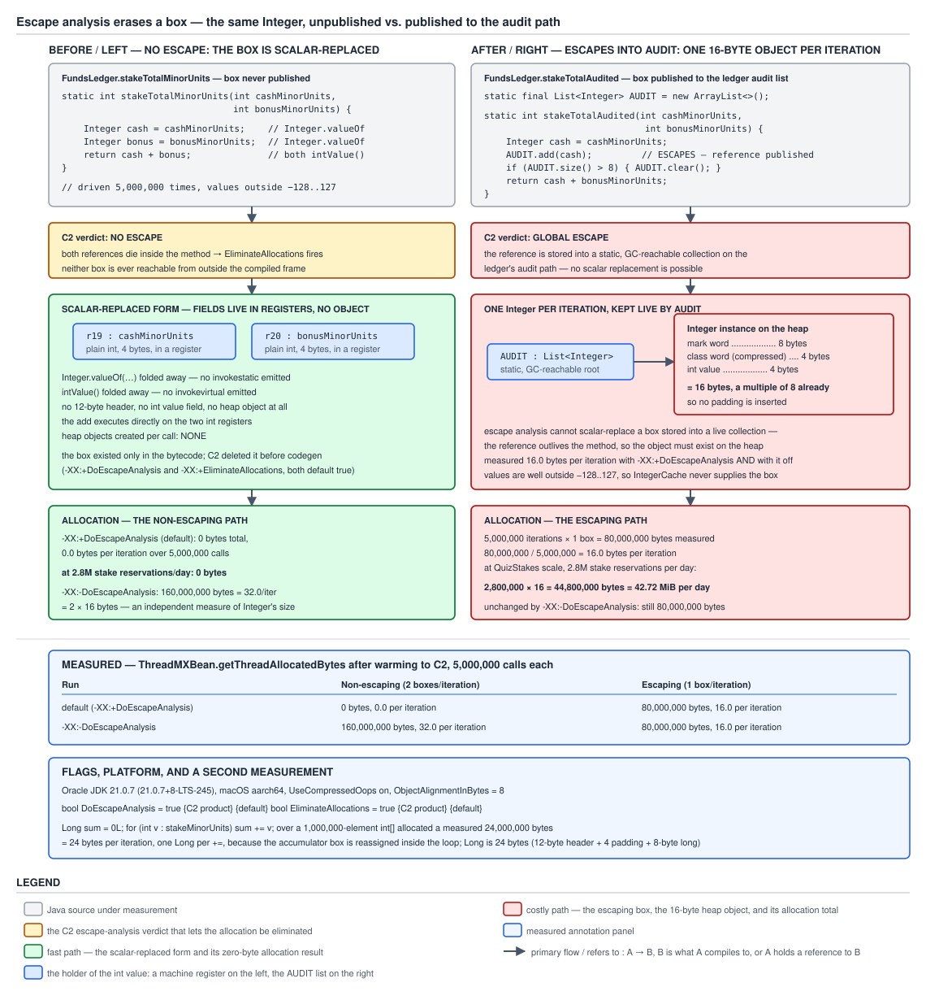

# 03 Java Core — Escape analysis and the box that never allocates — INTERNALS (§3.4, 3.4.8, 3.4.9)

**Target version: Java 21 LTS.** | **Part 3 of 5** | [Index](../00-index.md)
Previous: [The boxing bytecode](03c-internals-boxing-bytecode.md) · Next: [Wrapper memory arithmetic](03e-internals-wrapper-memory.md)

[`03c-internals-boxing-bytecode.md`](03c-internals-boxing-bytecode.md) ended at the bytecode: `invokestatic Integer.valueOf:(I)Ljava/lang/Integer;` at every boxing site, unconditionally, in every class file `javac` emits. This file is about the gap between that bytecode and what the machine actually executes, and it is a large gap — large enough that the same `invokestatic` allocates 16 bytes on one run and zero bytes on the next, with no source change and no flag change, purely because the second run got warm.

JIT behaviour is the easiest thing in Java to assert wrongly, so the discipline here is stricter than elsewhere in this topic. **Every claim below about what C2 does is backed by a measurement taken during this run**, on Oracle JDK 21.0.7 (`java.vm.version = 21.0.7+8-LTS-245`, macOS aarch64), with allocation read from `com.sun.management.ThreadMXBean.getThreadAllocatedBytes` on the measuring thread. Where a mechanism could not be observed on a product JVM it is marked `**Unverified:**` inline and recorded in `## Open questions` with what would settle it. Nothing here is inferred from how the optimisation "ought" to work.

The flag defaults that matter, from `-XX:+PrintFlagsFinal -version` on that JDK, verbatim:

```
bool DoEscapeAnalysis                         = true                                   {C2 product} {default}
bool EliminateAllocations                     = true                                   {C2 product} {default}
bool EliminateLocks                           = true                                   {C2 product} {default}
bool EliminateAutoBox                         = true                                   {C2 product} {default}
intx MaxTrivialSize                           = 6                                      {C2 product} {default}
intx MaxInlineSize                            = 35                                     {C2 product} {default}
intx FreqInlineSize                           = 325                                 {C2 pd product} {default}
intx InlineSmallCode                          = 2500                                {C2 pd product} {default}
intx MaxInlineLevel                           = 15                                     {C2 product} {default}
```

Every one is a `{C2 product}` flag. Read that as the headline of the whole file: **the optimisation lives in C2 and nowhere else**, so anything running below C2 — the interpreter, C1, a cold loop, a method the profile never made hot — allocates exactly what the bytecode says.

---

## 1. A box that cannot be observed does not need to exist (3.4.8)

`[PROVE]` `[X-REF 06]` C2 asks one question about every allocation it sees: can any reference to this object outlive the region I am compiling, or become visible to another thread? If the answer is no, the object is a fiction. Nobody can ever ask it a question, so it does not have to be built — its fields become ordinary SSA values in the compiler's graph and end up in registers. The allocation is not made cheaper, not moved to a stack frame, not pooled. It is **not performed**.

### Why it exists

Boxing is pervasive and almost always local. Erasure means every generic numeric operation goes through `Integer`, `Long` or `Double`, so a `Map<String, Integer>` lookup, a `Comparator.comparingInt` call, a stream `reduce` over boxed values, and the `min(BONUS_AVAILABLE, 10% of stake)` line at the centre of QuizStakes's stake consumption all produce boxes that are read once and thrown away. Without scalar replacement each of those would impose a real heap allocation and a real trip past the allocation pointer, and idiomatic Java — the generic, stream-shaped, `Optional`-returning Java people actually write — would be unusably slow.

Say it plainly, because it is the honest framing and it is rarely stated: **scalar replacement is what makes autoboxing survivable.** It plays exactly the same role as [the wrapper cache](01a-the-wrapper-caches.md), which is the other reason a `valueOf` call frequently costs nothing, and the two are constantly confused for each other. The cache avoids the allocation by *sharing* an object that already exists; scalar replacement avoids it by *deleting* an object that never needed to exist. Different mechanisms, different tiers, different consequences.

Before it existed, the only remedy was to hand-write the primitive form: a `long` accumulator instead of a `Long`, an `int[]` instead of a `List<Integer>`, a `TIntIntHashMap` from Trove or a `Long2LongOpenHashMap` from fastutil instead of a `HashMap<Long, Long>`. Those remedies are still correct and still necessary for anything *stored* — which is concept 2 — but they are no longer necessary for a box that is merely computed with.

### The mechanism

Three conditions have to hold before an allocation disappears, and the reader should be able to name all three.

1. **The method must be compiled by C2 at all.** Escape analysis is a phase in the C2 optimiser, operating on C2's IR. The interpreter has no optimiser, and C1 does not run this phase. A method the profile never promoted to C2 allocates every box, every time.
2. **The allocation must be inside the scope C2 is analysing.** That scope is the *inlined method tree* of the compilation unit, not a single method. This is the whole of concept 2.
3. **No reference may escape that scope**, either by outliving it (stored in a field, put in a collection, returned) or by becoming visible to another thread.

And the honest consequence, which is the `[PROVE]` payload of leaf 3.4.8: since conditions 1 and 2 depend on the profile, the tier, the inlining budgets and the shape of unrelated code, **the same source line allocates or does not allocate depending on runtime conditions you do not control from the source**. Boxing cost is not a static property of code. That sentence is the answer to most interview questions in this area.

**What "scalar replacement" actually means, and two things it is not.** When C2 proves an allocation non-escaping, it rewrites the graph so that the object's fields become independent values. `Integer cash = 4200;` becomes, in the IR, an `int` named `cash.value` with no object around it; `cash.intValue()` becomes a read of that value, which is then folded away entirely. The `Integer` header is never written, the allocation pointer never moves, and the GC never learns the object existed.

- **It is not stack allocation.** A common and wrong description is "the JVM allocates the object on the stack instead of the heap". HotSpot does not do that. There is no object. Its fields live wherever the register allocator puts them, which for a two-field box in a hot loop is typically two registers and no memory at all. The distinction matters because stack allocation would still write a header and still cost a few instructions, whereas scalar replacement costs zero, which is what the measurements below show.
- **It is not the cache.** `Integer.valueOf(100)` returns a shared instance from `IntegerCache.cache` in the interpreter, under C1, and under C2 alike — no optimiser involved, and the object genuinely exists. Scalar replacement is C2-only and the object genuinely does not.

Three ways a box can cost nothing, which is the table worth memorising:

| Path | What avoids the allocation | Which tier | Does the object exist | Is `==` identity preserved |
|---|---|---|---|---|
| Cache hit (`−128..127`, or up to `AutoBoxCacheMax`) | sharing one pre-built instance | interpreter, C1 and C2 | yes, one per value, process-wide | yes — and `==` is surprisingly `true` between separately-boxed equal values |
| Scalar-replaced (non-escaping) | deleting the object | **C2 only** | no | yes, by construction: C2 must prove identity unobservable before it may delete |
| Genuinely allocated | nothing | any tier | yes, one per box | yes — and `==` is `false` between separately-boxed equal values |

**Insight:** the cache and scalar replacement are two *independent* ways a box avoids allocation, operating at different tiers with different consequences for identity, and conflating them is the single reason people give contradictory answers about whether boxing is expensive. "My benchmark shows boxing is free" is true for cached values at every tier, true for non-escaping values under C2, and false everywhere else — three different facts wearing one sentence.

**Identity under scalar replacement.** This is the deep point. `==` on a scalar-replaced box has to produce the answer it would have produced had the object existed, so C2 may only delete the object once it has proved identity is unobservable. Anything that forces the object's identity into the open therefore blocks the optimisation. `System.identityHashCode` is the obvious candidate, because the identity hash is stored in the mark word of a real header (see [`../objects-equality-and-lifecycle/04-internals-hashcode-and-identity.md`](../objects-equality-and-lifecycle/04-internals-hashcode-and-identity.md)) and there is no header to store it in.

Measured, rather than asserted. Two boxes per iteration, both values outside the cache, 5,000,000 iterations, warmed to C2:

| Shape | Measured bytes | Per iteration |
|---|---|---|
| plain non-escaping, two boxes | **0** | 0.000 |
| plus `System.identityHashCode(cash)` | **80,000,000** | **16.000** |
| plus `synchronized (cash) { }` around the return | **0** | 0.000 |

Read those three rows carefully, because two of them are counter-intuitive.

`identityHashCode` cost **exactly one box, not two**: 16.000 bytes per iteration, when the fully-allocating figure for this shape is 32.000. So the optimisation did not collapse — C2 materialised the one box whose identity was demanded and scalar-replaced the other. That is per-allocation reasoning, not per-method.

`synchronized` on the local box cost **nothing**. The reason is `EliminateLocks`, and it is provable by turning that flag off:

| Run on the `synchronized` shape | Measured bytes | Per iteration |
|---|---|---|
| default | **0** | 0.000 |
| `-XX:-EliminateLocks` | **80,000,000** | **16.000** |
| `-XX:-DoEscapeAnalysis` | **160,000,000** | **32.000** |

Lock elision runs first: a monitor on a provably non-escaping object cannot be contended, so C2 deletes the `monitorenter`/`monitorexit` pair, and *then* the object is unremarkable and gets scalar-replaced. Deny lock elision and the monitor must be executed, which requires a real header, which forces exactly one box to be materialised — 16.000 bytes, the same one-box signature as `identityHashCode`. **Interview:** "does `synchronized` on a boxed local defeat escape analysis?" The measured answer on JDK 21.0.7 is no, because lock elision removes the monitor before the allocation is considered — but the reason to never write it is unrelated to performance and is a correctness argument about a shared cached monitor, which is [`03f-internals-monitors-and-valhalla.md`](03f-internals-monitors-and-valhalla.md).

`[PROVE]` **The core proof, and the flag that is the lever.** Same shape, 5,000,000 iterations, two non-escaping boxes per iteration:

| Run | non-escaping (2 boxes/iteration) | escaping (1 box/iteration) |
|---|---|---|
| default | **0** bytes, 0.000 per iteration | **80,000,000** bytes, 16.000 per iteration |
| `-XX:-DoEscapeAnalysis` | **160,000,000** bytes, 32.000 per iteration | **80,000,000** bytes, 16.000 per iteration |
| `-XX:-EliminateAllocations` | **0** bytes, 0.000 per iteration | **80,000,000** bytes, 16.000 per iteration |

That table is three separate results at once. It is evidence the boxes are genuinely gone by default. It is an **independent measurement of `Integer` being 16 bytes** — 32.000 restored bytes for two boxes, which agrees with the header arithmetic derived in [`03e-internals-wrapper-memory.md`](03e-internals-wrapper-memory.md) without borrowing it. And it identifies `DoEscapeAnalysis` as the lever, while showing that `EliminateAllocations` — the flag whose *name* says "allocation" and which everyone reaches for first — did not move the figure at all. That last result is measured and its cause was **not** established; it is in `## Open questions`, and it is not explained away below.

`[PROVE]` **The tier ladder, which is the most instructive measurement available here.** Identical class file, identical 5,000,000 iterations, identical values, on the non-escaping shape:

| Run | Measured bytes | Per iteration |
|---|---|---|
| default (C2 reached) | **0** | 0.000 |
| `-XX:TieredStopAtLevel=3` (C1 with full profiling, no C2) | **160,000,000** | 32.000 |
| `-XX:TieredStopAtLevel=1` (C1 only) | **160,000,000** | 32.000 |
| `-Xint` (interpreter only) | **160,000,000** | 32.000 |

Every tier below C2 allocates the full 32 bytes per iteration. This is the cleanest available demonstration that scalar replacement is not a property of the language, the compiler, or the bytecode — it is a property of one optimiser in one JIT, and the boxes are all really there until C2 arrives.

**The same code allocating and then not, in one run.** Cold versus warm at the same iteration count, no flags:

| Run | Measured bytes over 5,000,000 iterations | Per iteration |
|---|---|---|
| cold (no warmup at all; measurement starts on the first call) | **5,191,632** | **1.038** |
| warm (six 200,000-iteration warmup passes first) | **0** | 0.000 |

1.038 bytes per iteration averaged over the cold run, against 32.000 in the interpreter, means roughly 3% of those 5,000,000 iterations ran before C2's compiled code took over — and the other 97% allocated nothing. Same method, same values, same JVM invocation. Nothing about the source distinguishes the allocating iterations from the free ones.

`[X-REF 06]` **Where this sits in C2.** Escape analysis is a phase that runs on C2's IR *after* parsing and inlining have built the compilation unit's graph, and before macro-node expansion turns surviving allocations into real fast-path allocation code. Its input is therefore the whole inlined method tree, not one method; its output is, for each allocation node, a classification — no escape, argument escape, or global escape — and the no-escape ones are handed to the scalar-replacement transform, which removes the allocation node and replaces every field access on it with the corresponding SSA value. It runs once per compilation, so a method compiled twice (after a deoptimisation, or at a different tier) is analysed again from scratch with whatever profile is then available. Everything else about C2 — the tiered compilation policy, the profile counters that decide when a method is promoted, inline caches, the compiler queue, and how to read `-XX:+PrintCompilation` and JFR compilation events — belongs to **guide 06 JVM internals**, and its JIT chapter is where to go next; this file deliberately stops at the boundary where wrapper allocation stops being the subject.

### Diagram



**D-103** — The same boxed accumulator, twice. On the left the box never escapes, so C2 scalar-replaces it and the `int` lives in a register: measured zero bytes allocated over 5,000,000 iterations. On the right the box is published into a `List<Integer>` on the ledger's audit path, so it must exist: measured 16 bytes per iteration, 80,000,000 in total.

### A concrete example

QuizStakes's stake consumption rule is `min(BONUS_AVAILABLE, 10% of stake)`, with the remainder taken from cash. In minor units, with the domain's average bonus grant of 42 (4,200 minor units) and average stake of 4.20 (420 minor units), both operands go through `Integer` the moment the code is written in the obvious generic style — and neither box escapes.

```java
import com.sun.management.ThreadMXBean;
import java.lang.management.ManagementFactory;

public class StakeSplitProbe {

    static final ThreadMXBean TMX = (ThreadMXBean) ManagementFactory.getThreadMXBean();
    static final int RESERVATIONS = 5_000_000;

    static long alloc() {
        return TMX.getThreadAllocatedBytes(Thread.currentThread().getId());
    }

    /** min(BONUS_AVAILABLE, 10% of stake), minor units. Both boxes stay local. */
    static int bonusPortionMinorUnits(int bonusAvailableMinorUnits, int stakeMinorUnits) {
        Integer bonusAvailable = bonusAvailableMinorUnits;
        Integer tenPercentOfStake = stakeMinorUnits / 10;
        return Math.min(bonusAvailable, tenPercentOfStake);
    }

    static int sink;

    static void run(int reservations) {
        int s = 0;
        for (int i = 0; i < reservations; i++) {
            s += bonusPortionMinorUnits(4200 + (i & 1023), 420 + (i & 255));
        }
        sink += s;
    }

    public static void main(String[] args) throws Exception {
        for (int w = 0; w < 6; w++) {
            run(200_000);
        }
        Thread.sleep(200);
        long before = alloc();
        run(RESERVATIONS);
        long bytes = alloc() - before;
        System.out.printf("local bytes=%,d  perReservation=%.3f  sink=%d%n",
                bytes, bytes / (double) RESERVATIONS, sink);
    }
}
```

Measured output on JDK 21.0.7:

```
local      bytes=0  perReservation=0.000  sink=336684768
```

Zero. Five million stake reservations, ten million `Integer.valueOf` calls in the bytecode, no bytes allocated.

And with escape analysis denied:

```
local      bytes=80,000,000  perReservation=16.000  sink=336684768
```

**16.000, not 32.000, for two boxes** — which is worth stopping on, because it is the two mechanisms of the table above interfering with each other in the domain's own numbers. `bonusAvailable` ranges over 4,200 to 5,223, comfortably outside the cache, so it allocates. `tenPercentOfStake` is `(420 + (i & 255)) / 10`, which is 42 to 67 — every value inside `−128..127`, so `Integer.valueOf` returns a shared cached instance and there is nothing for escape analysis to remove. The bonus portion of a QuizStakes stake, at the domain's real stake sizes, is *always* a cache hit. One of the two boxes was free at every tier; the other was free only under C2.

An earlier version of this measurement used a bonus range of 42 to 297 and produced a stubbornly reproducible 26.625 bytes per iteration, which looked like partial optimisation and was not: 86 of those 256 values are inside the cache, and 16 + 16 × (170/256) = **26.625** exactly. A figure that is not a multiple of the object size is nearly always the cache, not the JIT.

The saving, in the domain's terms: at **2.8M stake reservations per day** the escaping form of this one line costs 16 × 2,800,000 = **44,800,000 bytes/day = 42.72 MiB/day**, or 16,352,000,000 bytes = **15.23 GiB/year** of pure garbage, and 1,200 × 16 = **19,200 bytes/sec = 18.75 KiB/s** at the 1,200/sec reservation peak. The non-escaping form costs nothing at all. That is not a large number against a ledger writing 19.8M entries/day — which is the point of stating it. The allocation rate matters through GC pressure and young-collection frequency, not through the bytes themselves, and 42 MiB/day is a rounding error on both.

### The gotcha

**Pitfall:** writing a microbenchmark, seeing boxing cost nothing, and concluding boxing is free. This is the JIT version of a trap that also has a cache version ([`01b-cache-coverage-and-reference-equality.md`](01b-cache-coverage-and-reference-equality.md) describes measuring only values under 128), and the JIT version is worse — because a microbenchmark is *precisely* the shape C2 optimises best. A small hot method, called in a tight loop, with no publication of the result: three conditions that make the box non-escaping, guarantee C2 compiles it, and guarantee the callee inlines. The benchmark is not measuring your production call shape; it is measuring the best case that shape can never reach.

Two fixes, both cheap. **Measure allocation, not time**: `getThreadAllocatedBytes` gives an exact byte count with no warmup ambiguity and no variance, and a zero is unmistakable. **Measure the real call shape**: put the value where production puts it — into the collection, into the field, across the interface with five implementations — and the number changes, as concept 2 demonstrates.

> **Definition.** Escape analysis is a C2-only phase, running on the inlined method tree after inlining, that classifies each allocation by whether any reference can outlive the compilation unit or reach another thread; a non-escaping allocation is *scalar-replaced* — deleted outright, with its fields becoming SSA values in registers rather than an object on the stack — so a boxing site's cost is a runtime property of the tier and the inlining, not a static property of the source.

---

## 2. The three ways a box escapes, and why "too big to inline" is the one that bites (3.4.9)

`[X-REF 06]` Escape analysis is *whole-scope* reasoning, and its scope is the inlined method tree. So the question is never "does my method leak the box" — it is "does the box leak anywhere in the tree C2 managed to inline". And inlining has hard byte budgets, which means a boundary C2 declined to cross is a wall the box cannot be seen through, and it must therefore be built.

### Why it matters

Two of the three escape routes are visible in the source. A reader can look at `AUDIT.add(cash)` or at a method whose return type is `Integer` and predict the allocation. The third is invisible: it depends on the callee's bytecode size, on the call site's profile, on inlining flags, and on entirely unrelated code that happened to grow. That asymmetry is the concept's point, and it is why a refactor that only *moved* code can change a service's allocation rate.

When to reach for the primitive form and when not falls straight out of this. If the value is *stored* — in a field, a collection, a cache, a queue, a return value that is retained — escape analysis will never help and the primitive form is the only fix. If the value is computed with and discarded, the optimisation almost certainly already applies and rewriting for it is churn.

### The mechanism

**Route 1 — stored in a collection or a field.** The QuizStakes audit path, where the boxed value is deliberately retained:

```java
static final List<Integer> BONUS_PORTION_AUDIT = new ArrayList<>();

static int bonusPortionAudited(int bonusAvailableMinorUnits, int stakeMinorUnits) {
    Integer bonusAvailable = bonusAvailableMinorUnits;
    Integer tenPercentOfStake = stakeMinorUnits / 10;
    BONUS_PORTION_AUDIT.add(bonusAvailable);
    if (BONUS_PORTION_AUDIT.size() > 8) { BONUS_PORTION_AUDIT.clear(); }
    return Math.min(bonusAvailable, tenPercentOfStake);
}
```

Measured, 5,000,000 reservations:

| Run | Measured bytes | Per reservation |
|---|---|---|
| default | **80,000,000** | **16.000** |
| `-XX:-DoEscapeAnalysis` | **80,000,000** | **16.000** |
| `-XX:-EliminateAllocations` | **80,000,000** | **16.000** |

**Insight:** the *invariance* is the evidence. Read the default row and the `-XX:-DoEscapeAnalysis` row together: the figure does not move by a single byte when the optimisation is switched off, which is the cleanest possible proof that escape analysis was never involved in this shape. There is nothing being optimised here to lose. `bonusAvailable` reaches a `static final List` that outlives every possible compilation unit, so it is a global escape and C2 does not even consider it a candidate. Note that `tenPercentOfStake` is still absent from the figure — 16.000, not 32.000 — because it is a cache hit, exactly as in concept 1.

**Route 2 — returned.** A method whose return type is `Integer` cannot have that box eliminated *in that method*, because the reference leaves through the return. But it may be eliminated in the **caller**, if the call is inlined and the box does not escape there — and after inlining, "returned" is no longer a boundary at all. Measured, with a 15-byte `Integer`-returning helper called in a hot loop whose result is only unboxed:

```java
static Integer bonusPortionMinorUnits(int stakeMinorUnits) {
    return Math.min(10_000, stakeMinorUnits) + 1_000;
}
static int stakeTotalViaReturn(int cashMinorUnits, int bonusMinorUnits) {
    return bonusPortionMinorUnits(cashMinorUnits) + bonusMinorUnits;
}
```

| Run | Measured bytes | Per iteration | `-XX:+PrintInlining` says |
|---|---|---|---|
| default | **0** | 0.000 | `BoxEscapeProbe::bonusPortionMinorUnits (15 bytes)   inline (hot)` |
| `-XX:FreqInlineSize=0` | **80,000,000** | **16.000** | `BoxEscapeProbe::bonusPortionMinorUnits (15 bytes)   too big` |

The box survives when — and only when — the inlining is denied. Nothing else changed: same class file, same values, same iteration count. So "returned" is a real escape route at the *method* level and not an escape route at all at the *compilation-unit* level, and which of those two applies is decided by an inlining budget.

**Route 3 — the method is too big to inline.** The budgets, measured with `-XX:+PrintFlagsFinal` rather than recalled: `MaxTrivialSize = 6`, `MaxInlineSize = 35`, `FreqInlineSize = 325`, `InlineSmallCode = 2500`, `MaxInlineLevel = 15`. `MaxInlineSize` is the bytecode-size ceiling for inlining a *cold* callee; `FreqInlineSize` is the much larger ceiling for a callee the profile says is hot; `InlineSmallCode` bounds the size of the callee's already-compiled machine code; `MaxInlineLevel` caps the depth of the inline tree.

Growing the callee past `FreqInlineSize` restores the allocation. The same helper, padded with pure integer arithmetic — no calls, no allocations — to 492 bytes of bytecode:

| Run on the bloated-callee shape | Measured bytes | Per iteration |
|---|---|---|
| default | **80,000,000** | **16.000** |
| `-XX:-DoEscapeAnalysis` | **80,000,000** | **16.000** |
| `-XX:FreqInlineSize=1000` | **0** | 0.000 |

The compiler's own explanation, from `-XX:+UnlockDiagnosticVMOptions -XX:+PrintInlining` on the default run:

```
@ 1   BoxEscapeProbe::bonusPortionBloated (492 bytes)   callee is too large
@ 1   BoxEscapeProbe::bonusPortionBloated (492 bytes)   hot method too big
```

Raise the budget past 492 and the identical source allocates nothing. **This is the finding to carry away:** the allocation behaviour of an unchanged line of code was controlled entirely by how many bytes of unrelated arithmetic sat next to it.

**A negative result worth reporting, because it corrects the obvious guess.** Growing the *enclosing* method — the one containing the local boxes — past `FreqInlineSize` does **not** restore the allocation. A 468-byte version of concept 1's non-escaping shape measured **0** bytes by default, and only `-XX:FreqInlineSize=0` (which also blocks the `Math.min` call from inlining) pushed it back to 160,000,000 = 32.000 per iteration. The reason is condition 2 from concept 1, applied correctly: a hot method that is too big to inline into its caller is still compiled by C2 *as its own compilation unit*, and escape analysis runs inside that unit. The box is local to it, so it disappears. "Too big to inline" only breaks escape analysis when the box has to cross the boundary that was not inlined — which is what routes 1 and 2 are about. Getting this backwards is easy and the measurement is what corrected it.

**A megamorphic call site is the same failure with a different cause.** Where the callee is small enough but C2 cannot resolve *which* callee, there is nothing to inline. Measured with a five-implementation `StakeRule` interface behind one call site, against the identical shape behind a monomorphic `static final` field:

| Shape | Measured bytes | Per iteration |
|---|---|---|
| monomorphic call site, one implementation | **0** | 0.000 |
| megamorphic call site, five implementations round-robin | **80,000,000** | **16.000** |

Same interface, same method bodies, same values; only the number of receiver types at the site differs. Inline caches, the bimorphic case, and why five types is past the cliff are dispatch mechanics — see [`../inheritance-and-dispatch/03-internals-dispatch.md`](../inheritance-and-dispatch/03-internals-dispatch.md) for that, and note only that a call C2 cannot devirtualise is a call it cannot inline, and therefore a boundary a box cannot cross.

**The fourth item the leaf does not list: deoptimisation.** A scalar-replaced object has no existence, but a frame that deoptimises has to hand the interpreter a state in which the object *does* exist — so the runtime must **rematerialise** it on the heap from the SSA values it kept in the compiled frame's debug information. The optimisation is therefore speculative and reversible, not a proof that the object is never built. **Unverified:** this description is taken from how the scalar-replacement transform must interact with deoptimisation given that it records the eliminated object in the compilation's debug info, and it was **not observed on this JVM**: the diagnostic flags that would show it, `-XX:+PrintEliminateAllocations` and `-XX:+PrintEscapeAnalysis`, are both refused by the product build with `Error: VM option 'PrintEliminateAllocations' is notproduct and is available only in debug version of VM.` It is recorded in `## Open questions`.

### Diagram

No second diagram for this concept. D-103 above already carries the escaping half — its right-hand panel is exactly route 1, the box published into `List<Integer>` on the ledger's audit path at a measured 16 bytes per iteration — so refer back to it rather than re-embedding.

### A concrete example

The audit path from route 1 is not a mistake, and that is what makes it the interesting case. QuizStakes's ledger has to retain the bonus portion of every stake reservation: the value goes into a `LedgerEntry`, the entry goes into a `PaymentRun`-shaped batch, and both outlive the method that computed them. No JIT optimisation can help with a value the program is required to keep. So the fix is structural, not a micro-optimisation: carry the number in a primitive.

```java
/** Primitive-carrying alternative: a record whose components are both int. */
record StakeSplitMinorUnits(int bonusPortion, int cashPortion) {}

static StakeSplitMinorUnits splitPrimitive(int bonusAvailableMinorUnits, int stakeMinorUnits) {
    int bonusPortion = Math.min(bonusAvailableMinorUnits, stakeMinorUnits / 10);
    return new StakeSplitMinorUnits(bonusPortion, stakeMinorUnits - bonusPortion);
}
```

Measured over 5,000,000 reservations, alongside the alternatives:

| Shape | Measured bytes | Per reservation |
|---|---|---|
| boxed, published to the audit list | **80,000,000** | **16.000** |
| `record StakeSplitMinorUnits(int, int)`, consumed locally, default | **0** | 0.000 |
| the same record, `-XX:-DoEscapeAnalysis` | **120,000,000** | **24.000** |
| `long[1024]` ring of bonus portions | **8,208** total | **0.002** |
| `IntStream.of(int[]).asLongStream().map(s -> Math.min(4200, s / 10)).sum()` over 2,800,000 | **6,448** total | **0.002** |

Four things in that table. The record is scalar-replaced exactly like a box — records are ordinary objects to C2, and `StakeSplitMinorUnits`'s invariant that the two portions sum to the stake costs nothing when consumed locally. Its 24.000-byte restored cost is a 12-byte header plus two `int`s plus 4 bytes of alignment padding, so it is *cheaper than two boxes* even when it does allocate, because it has one header instead of two. The `long[]` ring allocated 8,208 bytes in total — one 1,024-element array, 8,192 bytes of payload plus a 16-byte header — independent of the 5,000,000 reservations that wrote into it. And the `IntStream` reduction allocated 6,448 bytes in total for 2,800,000 elements, which is 0.002 per element: the pipeline's own objects, once, and nothing per element.

Where boxing genuinely cannot be avoided — a `Map<String, Integer>`, a `Comparator`, a `CompletableFuture<Integer>` — is [`01h-when-boxing-is-unavoidable.md`](01h-when-boxing-is-unavoidable.md). The bulk cost of the boxed form when you do store it, including the measured 5.00× memory ratio for a `List<Integer>` of 2,800,000 against an `int[]`, is [`01g-the-cost-of-boxing.md`](01g-the-cost-of-boxing.md).

**Tradeoff, not fact.** Relying on escape analysis is reasonable for local boxing on a hot path and unreasonable as a design principle, and the counterweight is not subtle. You cannot see it in the source. It vanishes under `-Xint` and under C1, measured at the full 32 bytes per iteration. It vanishes when a method grows past 325 bytes of bytecode, measured. It vanishes when a call site goes megamorphic, measured. It never applies to anything you store, measured as an 80,000,000-byte figure that does not move when the optimisation is disabled. And it is speculative, since a deoptimising frame has to rematerialise the object.

The rule to hand a reader is two-sided: **never *count on* it, and never *panic* about a box you can prove is local.** Choose `int` over `Integer` in every data structure, field and API where you have the choice — that decision is unconditional, and no optimiser will rescue a stored box. Then stop rewriting local arithmetic to avoid boxes, because the measurement is zero and the rewrite costs readability for nothing.

### The gotcha

**Pitfall:** reading a flame graph or an allocation profiler that shows no `Integer` allocation and concluding the code does not box. **Interview:** the strong answer to "is boxing expensive?" is not yes and not no — it is "it depends on whether the box escapes, and here is how I would measure it: `getThreadAllocatedBytes` around the real call shape, then the same shape under `-XX:-DoEscapeAnalysis` to see what the optimisation is worth, and `-XX:TieredStopAtLevel=1` to see what the cold path costs." The symptom of getting this wrong is a profile taken on a warm, low-cardinality, single-implementation, small-method run that reports zero, against a production shape where the enclosing method has grown past 325 bytes, the strategy interface has five implementations, or the value now reaches a cache — and the allocation the profiler said was absent is 42.72 MiB/day. The fix is to profile the shape, not the snippet, and to treat any allocation figure gathered without a stated warmup state as unreadable.

> **Definition.** A box escapes, and therefore must be allocated, if a reference to it can outlive the compilation unit or reach another thread: by being stored in a field or collection, by being returned across a boundary C2 did not inline, or because the boundary itself was not inlined — the callee exceeding `MaxInlineSize = 35` or `FreqInlineSize = 325`, or the call site being megamorphic — with the third route the dangerous one because it is invisible in the source and moves when unrelated code grows.

---

## Pitfalls

### Concluding from a microbenchmark that boxing is free

**Wrong**

```java
// The benchmark, and its measured result on JDK 21.0.7.
static int bonusPortionMinorUnits(int bonusAvailableMinorUnits, int stakeMinorUnits) {
    Integer bonusAvailable = bonusAvailableMinorUnits;
    Integer tenPercentOfStake = stakeMinorUnits / 10;
    return Math.min(bonusAvailable, tenPercentOfStake);
}
// warmed, 5,000,000 reservations:
//   local      bytes=0  perReservation=0.000
```

Zero bytes, therefore boxing is free. The benchmark is measuring the best case its own shape guarantees: a small method, made hot by the loop, with the result discarded.

**Right**

Measure the same shape three more ways, and report all four figures.

```java
// 1. publish the box, as the ledger's audit path does:
//      audited    bytes=80,000,000  perReservation=16.000
// 2. deny the optimisation, to price it:
//      -XX:-DoEscapeAnalysis   local   bytes=80,000,000  perReservation=16.000
// 3. run below C2, as every cold path does:
//      -XX:TieredStopAtLevel=1 local   bytes=80,000,000  perReservation=16.000
//      -Xint                   local   bytes=80,000,000  perReservation=16.000
```

The honest conclusion is that this line costs 16 bytes per reservation on a cold path and in every shape that retains the value, and zero once C2 has compiled the local form. Note also that a cold measurement of the *same* method with no warmup at all read **5,191,632 bytes over 5,000,000 iterations = 1.038 per iteration**, so even the fast case pays during ramp-up.

**Why people believe it:** because the measurement is real. Zero is zero, the benchmark is not lying, and the number is reproducible to the byte across runs. The error is inferential rather than experimental: a microbenchmark's shape — small hot method, no publication, one receiver type — happens to satisfy every condition scalar replacement needs, so it measures a best case rather than a typical one. The habit that fixes it is to vary the shape rather than the iteration count.

### Designing around escape analysis in a stored data structure

**Wrong**

```java
// "The JIT removes the boxes, so Integer is fine here."
final class ReservationLedgerIndex {
    private final Map<RoundId, Integer> bonusPortionMinorUnits = new HashMap<>();
    private final List<Integer> auditTrail = new ArrayList<>();

    void record(RoundId roundId, int bonusPortion) {
        bonusPortionMinorUnits.put(roundId, bonusPortion);
        auditTrail.add(bonusPortion);
    }
}
```

Measured on the equivalent published shape: **80,000,000 bytes over 5,000,000 reservations = 16.000 per reservation**, and — the part that settles it — **the identical 80,000,000 under `-XX:-DoEscapeAnalysis` and under `-XX:-EliminateAllocations`.** The figure is invariant under turning the optimisation off, which means the optimisation was never applied. There is nothing here for the JIT to remove.

**Right**

```java
// Carry the number as a primitive. A stored box is never a candidate.
record StakeSplitMinorUnits(int bonusPortion, int cashPortion) {}

final class ReservationLedgerIndex {
    private final Map<RoundId, StakeSplitMinorUnits> splits = new HashMap<>();
    private final long[] auditRing = new long[1024];
    private int auditCursor;

    void record(RoundId roundId, int bonusPortion, int stakeMinorUnits) {
        splits.put(roundId, new StakeSplitMinorUnits(bonusPortion, stakeMinorUnits - bonusPortion));
        auditRing[auditCursor++ & 1023] = bonusPortion;
    }
}
```

The `long[1024]` ring measured **8,208 bytes in total** — 8,192 of payload plus a 16-byte header, allocated once — across 5,000,000 writes, against 80,000,000 for the boxed list. The record still allocates when it is stored in the map, but at a measured 24 bytes it carries two values under one header rather than two boxes under two.

**Why people believe it:** because for *local* boxing the belief is exactly right, and they have probably measured it — concept 1's zero is real. The generalisation from "a box I compute with is free" to "a box I store is free" is the error, and nothing in the source distinguishes the two cases visually. `Map<RoundId, Integer>` and a local `Integer` look like the same language feature.

### Attributing the elimination to `EliminateAllocations` and disabling that flag to test it

**Wrong**

```
# "EliminateAllocations is the flag that removes allocations, so this proves it."
$ java -XX:-EliminateAllocations -cp classes BoxEscapeProbe nonescaping
nonescaping  warm  bytes=0  perIteration=0.000
```

Zero. Same as the default. The natural reading — that the boxes were never eliminated in the first place, or that the flag does nothing, or that the measurement is broken — is wrong on all three counts, and the experiment simply did not test what it looked like it tested. Adding `-XX:-EliminateLocks` alongside it also measured **0**.

**Right**

```
$ java -cp classes BoxEscapeProbe nonescaping
nonescaping  warm  bytes=0            perIteration=0.000
$ java -XX:-DoEscapeAnalysis -cp classes BoxEscapeProbe nonescaping
nonescaping  warm  bytes=160,000,000  perIteration=32.000
```

`-XX:-DoEscapeAnalysis` is the lever that moves this shape: 32.000 bytes per iteration restored for two boxes, which is 2 × 16 and an independent confirmation of `Integer`'s size. Use that flag to price the optimisation, and cross-check with `-XX:TieredStopAtLevel=1`, which restored the same 160,000,000 by never reaching C2 at all.

**Why people believe it:** the flag is named after the thing being observed, it is a `{C2 product}` flag defaulting to `true`, and the HotSpot documentation describes it as controlling scalar replacement — so reaching for it first is the reasonable move, not a careless one. **The cause of the measured invariance was not established here and is not explained away**: it is recorded in `## Open questions`, and the diagnostic flags that would settle it are refused by the product build.

### Assuming a `synchronized` block or `identityHashCode` on a local box behaves the same way

**Wrong**

```java
// "Both force the object's identity into the open, so both must defeat
//  scalar replacement equally."
static int stakeTotalIdentityHashed(int cashMinorUnits, int bonusMinorUnits) {
    Integer cash = cashMinorUnits;
    Integer bonus = bonusMinorUnits;
    return cash + bonus + (System.identityHashCode(cash) & 1);
}
static int stakeTotalSynchronized(int cashMinorUnits, int bonusMinorUnits) {
    Integer cash = cashMinorUnits;
    Integer bonus = bonusMinorUnits;
    synchronized (cash) { return cash + bonus; }
}
```

**Right**

Measure both. On JDK 21.0.7, warmed, 5,000,000 iterations, two boxes per iteration, both values outside the cache:

```
plain              bytes=0            perIteration=0.000
identityHashCode   bytes=80,000,000   perIteration=16.000
synchronized       bytes=0            perIteration=0.000
synchronized, with -XX:-EliminateLocks
                   bytes=80,000,000   perIteration=16.000
```

They behave differently. `identityHashCode` materialised **exactly one box** — the one whose identity it demanded — and left the other scalar-replaced, which shows the analysis is per-allocation rather than per-method. `synchronized` cost **nothing**, because `EliminateLocks` (measured `true` by default) removes a monitor on a provably non-escaping object *before* the allocation is considered; deny lock elision and the monitor needs a real header, and exactly one box comes back. The reason never to synchronize on a box is unrelated to allocation and is a correctness argument about a process-wide shared cached instance, in [`03f-internals-monitors-and-valhalla.md`](03f-internals-monitors-and-valhalla.md).

**Why people believe it:** both operations do genuinely need a real object header — one to store the identity hash in the mark word, one to hold the monitor — so grouping them is sound reasoning about *requirements*. What it misses is ordering: lock elision is an earlier transform that can remove the requirement entirely, whereas nothing can remove a demand for an identity hash that the program then uses.

---

## Cheat sheet

| Thing | Fact (Java 21 LTS) |
|---|---|
| What escape analysis is | a C2 IR phase, after inlining, classifying each allocation as no-escape / argument-escape / global-escape |
| What scalar replacement is | delete the object, keep its fields as SSA values in registers |
| What it is **not** | stack allocation (no header is written, no object exists) and not the cache (which shares an existing object) |
| Tier requirement | **C2 only**. Interpreter and C1 allocate every box |
| `DoEscapeAnalysis` | `bool DoEscapeAnalysis = true {C2 product} {default}` |
| `EliminateAllocations` | `bool EliminateAllocations = true {C2 product} {default}` |
| `EliminateLocks` | `bool EliminateLocks = true {C2 product} {default}` |
| Non-escaping, 2 boxes, default | **0** bytes over 5,000,000 iterations |
| Non-escaping, `-XX:-DoEscapeAnalysis` | **160,000,000** bytes = **32.000**/iteration = 2 × 16 |
| Non-escaping, `-XX:-EliminateAllocations` | **0** bytes — the flag did **not** move it; cause open |
| Non-escaping, `-Xint` | **160,000,000** = 32.000/iteration |
| Non-escaping, `-XX:TieredStopAtLevel=1` (C1) | **160,000,000** = 32.000/iteration |
| Non-escaping, `-XX:TieredStopAtLevel=3` | **160,000,000** = 32.000/iteration |
| Cold, no warmup, 5,000,000 iterations | **5,191,632** bytes = **1.038**/iteration; warm = 0 |
| Escaping into `List<Integer>`, default | **80,000,000** = **16.000**/iteration |
| Escaping, `-XX:-DoEscapeAnalysis` | **80,000,000** — unchanged. The invariance is the proof EA was never applied |
| `System.identityHashCode(box)` | materialises **exactly one** box: 16.000/iteration, the other still eliminated |
| `synchronized (box)` on a local box | **0** bytes. Lock elision removes the monitor first |
| `synchronized`, `-XX:-EliminateLocks` | 16.000/iteration — one box, to carry the monitor |
| `MaxTrivialSize` | `intx MaxTrivialSize = 6 {C2 product} {default}` |
| `MaxInlineSize` | `intx MaxInlineSize = 35 {C2 product} {default}` — cold-callee bytecode ceiling |
| `FreqInlineSize` | `intx FreqInlineSize = 325 {C2 pd product} {default}` — hot-callee ceiling |
| `InlineSmallCode` | `intx InlineSmallCode = 2500 {C2 pd product} {default}` — compiled-code-size ceiling |
| `MaxInlineLevel` | `intx MaxInlineLevel = 15 {C2 product} {default}` — inline-tree depth |
| 15-byte `Integer`-returning helper, default | **0** bytes; `PrintInlining` says `inline (hot)` |
| the same helper, `-XX:FreqInlineSize=0` | **80,000,000** = 16.000/iteration; `PrintInlining` says `too big` |
| 492-byte `Integer`-returning callee, default | **80,000,000** = 16.000/iteration; `callee is too large`, `hot method too big` |
| the same callee, `-XX:FreqInlineSize=1000` | **0** bytes — identical source, budget raised |
| Bloating the **enclosing** method (468 bytes) | still **0** — it is compiled as its own unit, so EA still runs inside it |
| Megamorphic call site, 5 implementations | **80,000,000** = 16.000/iteration; monomorphic equivalent = **0** |
| `record StakeSplitMinorUnits(int, int)` local | **0** default; **24.000**/iteration under `-XX:-DoEscapeAnalysis` |
| `long[1024]` ring over 5,000,000 writes | **8,208** bytes total = 8,192 payload + 16 header |
| `IntStream.asLongStream().map().sum()` over 2,800,000 | **6,448** bytes total = 0.002/element |
| QuizStakes cost of the escaping form | 16 × 2.8M/day = **44,800,000 bytes/day = 42.72 MiB/day = 15.23 GiB/year**; 18.75 KiB/s at 1,200/sec peak |
| Why a figure is not a multiple of 16 | almost always the cache: 16 + 16 × (170/256) = **26.625** exactly |
| Deoptimisation | a scalar-replaced object must be **rematerialised** on the heap. `**Unverified:**` — not observed |
| `-XX:+PrintEliminateAllocations` | refused: `notproduct and is available only in debug version of VM` |
| `-XX:+PrintEscapeAnalysis` | same refusal. `-XX:+PrintInlining` **is** available under `-XX:+UnlockDiagnosticVMOptions` |
| The rule | never *count on* it; never *panic* about a box you can prove is local. Primitives in anything stored |

---

## Self-test

**Q1.** "Is boxing expensive?" Give the answer you would actually give in an interview.

<details><summary>Answer</summary>

It depends on whether the box escapes, and I would measure it rather than assert it. If the box is local — computed with and discarded — C2's escape analysis scalar-replaces it and the cost is literally zero: measured on JDK 21.0.7, a method boxing two values outside the cache and returning their sum allocated **0 bytes over 5,000,000 iterations**. If the box is stored, the cost is the full object: the same computation publishing one box into a `List<Integer>` allocated **80,000,000 bytes = 16.000 per iteration**, and that figure did not move by a byte under `-XX:-DoEscapeAnalysis`, which proves the optimisation was never applied to it. So the interesting question is which shape the production code is. Then two caveats that matter more than the headline. First, scalar replacement is C2-only: the same non-escaping method measured **160,000,000 bytes = 32.000 per iteration** under `-Xint` and under `-XX:TieredStopAtLevel=1`, and a cold run with no warmup measured 1.038 bytes per iteration, so every cold path pays. Second, it depends on inlining: a 15-byte `Integer`-returning helper cost 0 by default and 16.000 per iteration under `-XX:FreqInlineSize=0`, and a 492-byte version of the same helper cost 16.000 by default and 0 once the budget was raised. My measurement recipe is `getThreadAllocatedBytes` around the real call shape, then repeat under `-XX:-DoEscapeAnalysis` to price the optimisation and under `-XX:TieredStopAtLevel=1` to price the cold path.

</details>

**Q2.** A colleague's benchmark shows boxing allocating nothing. What do you ask them to change, and what will happen?

<details><summary>Answer</summary>

I would ask them to change the *shape*, not the iteration count, because a microbenchmark is precisely the shape C2 optimises best: a small method, made hot by the loop, with no publication of the result, and one receiver type. That satisfies every condition scalar replacement needs. Four concrete changes, with the measured outcome of each on JDK 21.0.7. Publish the box where production publishes it, into a collection or a field: 0 becomes **80,000,000 bytes = 16.000 per iteration**, and stays there under `-XX:-DoEscapeAnalysis`. Run it under `-XX:TieredStopAtLevel=1` or `-Xint`: 0 becomes **32.000 per iteration**, because the optimisation is a C2 phase and nothing below C2 has it. Grow the callee past `FreqInlineSize = 325` — a 492-byte `Integer`-returning helper measured **16.000 per iteration** where its 15-byte equivalent measured 0, with `PrintInlining` reporting `callee is too large` and `hot method too big`. And make the call site megamorphic: five implementations of one interface behind one call site measured **16.000 per iteration** against **0** for the monomorphic equivalent. I would also switch the metric from time to allocation, using `getThreadAllocatedBytes`, because it is exact, has no variance, and a zero is unambiguous where a timing difference of a few percent is not.

</details>

**Q3.** Explain scalar replacement precisely, and name the two things it is commonly confused with.

<details><summary>Answer</summary>

When C2 proves that no reference to an allocation can outlive the compilation unit or reach another thread, it rewrites its IR so that the object's fields become independent SSA values. `Integer cash = 4200;` becomes an `int` in the graph with no object around it; `cash.intValue()` becomes a read of that value and then folds away. The header is never written, the allocation pointer never moves, and the GC never learns the object existed. The first confusion is **stack allocation** — the claim that HotSpot allocates the object on the stack instead of the heap. It does not. There is no object at all; the fields live wherever the register allocator puts them, which for a hot two-field box is typically registers and no memory. That distinction is measurable: stack allocation would still write a header and cost a few instructions, whereas the measured figure is exactly 0 bytes over 5,000,000 iterations. The second confusion is **the wrapper cache**. `Integer.valueOf(100)` returns a shared instance from `IntegerCache.cache` in the interpreter, under C1 and under C2 alike, with no optimiser involved and with the object genuinely existing. Scalar replacement is C2-only and the object genuinely does not exist. The two are independent, and conflating them is why people give contradictory answers about boxing cost. A practical tell: a measured figure that is not a multiple of the object size is almost always the cache. One shape here reproducibly measured 26.625 bytes per iteration, which looked like partial optimisation and was actually 16 + 16 × (170/256) exactly, because 86 of 256 values in one operand's range were inside `−128..127`.

</details>

**Q4.** Does `synchronized` on a boxed local defeat scalar replacement? Does `System.identityHashCode`? Justify both with measurements.

<details><summary>Answer</summary>

They behave differently, which is the interesting part, and the guess that both defeat it equally is wrong. Measured on JDK 21.0.7, warmed, 5,000,000 iterations, two non-escaping boxes per iteration, both values outside the cache. The plain shape allocated **0** bytes. Adding `System.identityHashCode(cash)` allocated **80,000,000 = 16.000 per iteration** — exactly *one* box, not two, when the fully-allocating figure for the shape is 32.000. So C2 materialised the one object whose identity the program demanded and scalar-replaced the other; the analysis is per-allocation, not per-method. Wrapping the return in `synchronized (cash) { }` allocated **0**. The reason is `EliminateLocks`, measured `bool EliminateLocks = true {C2 product} {default}`: a monitor on a provably non-escaping object cannot be contended, so C2 deletes the `monitorenter`/`monitorexit` pair, and the object is then unremarkable and gets scalar-replaced. Proof that this is the mechanism: under `-XX:-EliminateLocks` the same shape allocated **80,000,000 = 16.000 per iteration**, the same one-box signature, because an executed monitor needs a real header. The general principle behind both is that `==` on a scalar-replaced box must give the answer it would have given, so C2 may only delete an object once it has proved identity unobservable — but lock elision is an earlier transform that can remove the requirement entirely, whereas nothing can remove a demand for an identity hash the program then uses. Separately: the reason never to synchronize on a box is a correctness argument about a process-wide shared cached instance, not a performance one.

</details>

**Q5.** Name the three escape routes from leaf 3.4.9 and say which one is dangerous, with numbers.

<details><summary>Answer</summary>

Stored in a collection or a field; returned; and the method being too big to inline. The first two are visible in the source and a reader can predict them. Stored: the QuizStakes audit path publishing one box into a `static final List<Integer>` measured **80,000,000 bytes = 16.000 per reservation** over 5,000,000 reservations, and — the cleanest available proof that escape analysis was never involved — the identical **80,000,000** under `-XX:-DoEscapeAnalysis` and under `-XX:-EliminateAllocations`. The invariance is the evidence: there was nothing to lose. Returned: a method returning `Integer` cannot have the box eliminated in *that* method, but it can in the caller if the call is inlined, and after inlining "returned" is not a boundary at all — a 15-byte `Integer`-returning helper measured **0** bytes by default with `PrintInlining` reporting `inline (hot)`, and **80,000,000 = 16.000 per iteration** under `-XX:FreqInlineSize=0` with `PrintInlining` reporting `too big`. The third is the dangerous one, because it is invisible in the source and moves when unrelated code grows: the budgets are `MaxInlineSize = 35` for a cold callee and `FreqInlineSize = 325` for a hot one, and a 492-byte version of that same helper measured **16.000 per iteration** by default — `callee is too large`, `hot method too big` — dropping to **0** under `-XX:FreqInlineSize=1000`, identical source. A megamorphic call site is the same failure with a different cause: five implementations behind one site measured 16.000 per iteration against 0 monomorphic, because a call C2 cannot devirtualise is a call it cannot inline. I would add a fourth item the leaf does not list: deoptimisation, since a scalar-replaced object must be rematerialised on the heap if the frame deoptimises — though I could not observe that on a product JVM.

</details>

**Q6.** You grow the method that *contains* the boxes past `FreqInlineSize`. Does the allocation come back?

<details><summary>Answer</summary>

No, and this is the measurement that corrected the obvious guess. A 468-byte version of the non-escaping shape — padded with pure integer arithmetic, no calls and no allocations — still measured **0 bytes** over 5,000,000 iterations by default, well past the measured `FreqInlineSize = 325`. Only `-XX:FreqInlineSize=0`, which also blocks the small `Math.min` call from inlining, pushed it back to 160,000,000 = 32.000 per iteration. The reason follows from what the analysis scope actually is: a hot method too big to inline into its caller is still compiled by C2 *as its own compilation unit*, and escape analysis runs inside that unit on its own IR. The boxes are local to it, so they are still deleted. "Too big to inline" breaks escape analysis only when the box has to cross a boundary that was not inlined — which is what the returned case and the megamorphic case are. Contrast the callee experiment: bloating the *callee* to 492 bytes did restore the allocation, at 16.000 per iteration, because the box is created inside the callee and its reference then crosses a boundary C2 refused to inline. So the correct formulation is not "big methods allocate" but "a box that must cross an un-inlined boundary allocates", and the direction of the boundary is the whole of it.

</details>

**Q7.** Someone disables `-XX:-EliminateAllocations` to prove that the boxes were being eliminated, and the figure does not change. What do you conclude?

<details><summary>Answer</summary>

That the experiment did not test what it looked like it tested, and that the honest answer is "I do not know why, and here is what I do know." Measured on JDK 21.0.7: the non-escaping shape allocated **0** bytes by default, **0** under `-XX:-EliminateAllocations`, and **0** under `-XX:-EliminateAllocations -XX:-EliminateLocks` — but **160,000,000 = 32.000 per iteration** under `-XX:-DoEscapeAnalysis`. So `DoEscapeAnalysis` is the lever that moves this shape and `EliminateAllocations` is not, even though it is the flag whose name refers to allocation and even though HotSpot documentation describes it as controlling scalar replacement. What I would *not* do is invent a mechanism to explain it. Independent confirmation that the boxes really are being eliminated by default comes from two other directions: `-XX:TieredStopAtLevel=1` and `-Xint` both restore the same 160,000,000, which is consistent with a C2-only optimisation, and a cold run with no warmup measured 5,191,632 bytes over the same 5,000,000 iterations, which is the ramp-up visible as it happens. The 32.000 figure is also 2 × 16, an independent measurement of `Integer`'s size, which makes the restored figure trustworthy rather than arbitrary. What would settle the flag question is a fastdebug JVM: `-XX:+PrintEliminateAllocations` and `-XX:+PrintEscapeAnalysis` are both refused by the product build with `notproduct and is available only in debug version of VM`, so the phase's own decisions cannot be observed here.

</details>

**Q8.** The ledger's audit path genuinely has to retain the bonus portion of every stake reservation. What is the fix, and what does it cost?

<details><summary>Answer</summary>

The fix is structural rather than a micro-optimisation, because no JIT optimisation can help with a value the program is required to keep — measured, the published box cost **80,000,000 bytes = 16.000 per reservation** and stayed at exactly that under `-XX:-DoEscapeAnalysis`. So carry the number in a primitive. Three measured options over 5,000,000 reservations on JDK 21.0.7. A `record StakeSplitMinorUnits(int bonusPortion, int cashPortion)` measured **0** bytes when consumed locally — records are ordinary objects to C2 and get scalar-replaced exactly like boxes — and **24.000 per reservation** under `-XX:-DoEscapeAnalysis`, which is a 12-byte header plus two `int`s plus 4 bytes of alignment padding; so even when it does allocate it is cheaper than two boxes, because it carries two values under one header. A `long[1024]` ring of bonus portions measured **8,208 bytes in total** — 8,192 of payload plus a 16-byte header, allocated once — independent of the 5,000,000 writes into it. And an `IntStream.of(int[]).asLongStream().map(s -> Math.min(4200, s / 10)).sum()` reduction over 2,800,000 elements measured **6,448 bytes in total**, 0.002 per element: the pipeline's own objects once, and nothing per element. In domain terms the boxed form costs 16 × 2.8M/day = **44,800,000 bytes/day = 42.72 MiB/day**, or **15.23 GiB/year**, and 18.75 KiB/s at the 1,200/sec reservation peak. That is a rounding error against a ledger writing 19.8M entries/day, which is worth saying out loud: the reason to prefer the primitive is GC pressure and young-collection frequency at scale plus the memory of the retained structure itself, not these bytes.

</details>

---

## Open questions

- **Unverified: why `-XX:-EliminateAllocations` alone does not restore the allocation on the non-escaping shape.** Established by measurement: default **0** bytes over 5,000,000 iterations; `-XX:-EliminateAllocations` **0**; `-XX:-EliminateAllocations -XX:-EliminateLocks` **0**; `-XX:-DoEscapeAnalysis` **160,000,000 = 32.000 per iteration**. Both flags are `{C2 product}` and `true` by default. The boxes are certainly being eliminated by default, independently confirmed by `-Xint` and `-XX:TieredStopAtLevel=1` and `=3` all restoring the same 160,000,000, and by a cold no-warmup run measuring 1.038 bytes per iteration. What is *not* established is the relationship between the two flags on this shape, and it is deliberately not explained here. What would settle it: a fastdebug or slowdebug HotSpot build, where `-XX:+PrintEliminateAllocations` and `-XX:+PrintEscapeAnalysis` become available — both are refused on this product build with `Error: VM option 'PrintEliminateAllocations' is notproduct and is available only in debug version of VM.` Failing that, the C2 sources for the macro-expansion phase, to see which flag each transform actually consults.
- **Unverified: that a scalar-replaced object is rematerialised on the heap when its frame deoptimises.** The mechanism is stated in concept 2 as a requirement rather than an observation: a deoptimising frame must hand the interpreter a state in which the object exists, and the compiled frame's debug information is where the eliminated object's field values would have to come from. Nothing about this was observed on this JVM. What would settle it: a fastdebug build with `-XX:+PrintEliminateAllocations` plus `-XX:+TraceDeoptimization`, or forcing a deoptimisation of a compiled frame containing a known-eliminated allocation and observing the allocation counter move at that moment. The measurements this file relies on are all of steady-state warm code, so nothing above depends on the answer.
- **Unverified: whether escape analysis's position in the C2 phase order is exactly "after inlining, before macro expansion" as stated in concept 1's `[X-REF 06]` paragraph.** That ordering is what the observed behaviour requires — the analysis clearly sees across inlined boundaries, since inlining a 15-byte callee changed the result from 16.000 to 0.000 bytes per iteration, and it clearly runs before surviving allocations become real allocation code. But the phase order itself was read off behaviour, not off a source listing or a compilation log. What would settle it: the C2 compiler's phase-driving source, or `-XX:+PrintPhaseLevel`-style IR dumps on a debug build. Nothing measured here changes if the ordering is stated differently.
- **Not investigated:** `-XX:MaxInlineSize=0 -XX:FreqInlineSize=0` together crashed the JVM on this build with `Error: A fatal exception has occurred. Program will exit.` before any measurement was taken. Each flag alone worked. This is noted only so that a reader reproducing the inlining experiments does not read the crash as a fault in their own harness; the cause was not investigated and no claim in this file depends on that combination.

---

**Leaves covered:** 3.4.8, 3.4.9 (2 leaves)
**Leaves deferred:** none
**Diagrams included:** D-103
**Target version:** Java 21 LTS
**Lines:** 602
