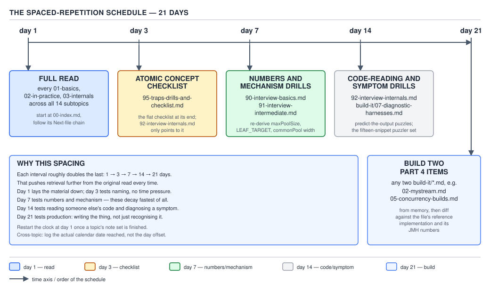

# 04 Modern Java — Traps, drills and the checklist — INTERVIEW (§5.2–§5.3)

**Target version: Java 21 LTS.** | **Part 5 of 5** | [Index](00-index.md)
Previous: [The 95 questions, part C — interview questions c](94-interview-questions-c.md)

This file is the scan sheet for the whole 69-file set. Everything below is compressed on purpose:
one row per belief, one sentence per mechanism, one line per drill answer. Read it last, and then
read only it.

## The trap index

**D-179 — The trap index.** The manifest types this diagram as a table, so it is rendered here as
Markdown rather than as an SVG. One row per `**Pitfall:**` argued somewhere in the set. The last
column is where to go when a row surprises you.

| The wrong belief | The symptom in production | The fix | Argued in |
|---|---|---|---|
| A lambda is sugar for an anonymous class | Nothing at runtime; you get the bytecode question wrong and mis-reason about class count and startup | It is an `invokedynamic` call site linked once by `LambdaMetafactory` into a hidden class | `lambdas/03-internals-translation.md` §3.1 |
| `this` inside a lambda ported from an anonymous class still means the old instance | A listener mutates the outer service instead of the adapter; `NullPointerException` on a field that was only ever set on the anonymous object | Lambdas are lexically transparent — `this` is the enclosing instance. Keep the anonymous class when you needed its own `this` | `lambdas/01-basics.md` §1.3 |
| A captured field is a snapshot | A `StakeReservation` handler reads the amount that was current at capture time, not at invocation time | Capture is by value on the *variable*; a captured `this.field` is a live read through a captured `this` | `lambdas/04-internals-capture-and-identity.md` §3.2 |
| A freshly-written lambda removes the listener you registered earlier | Listener registry grows without bound; heap climbs until an OOM in the `PaymentRun` scheduler | Lambda identity is unspecified. Hold the reference you registered and pass that same reference to remove | `lambdas/04-internals-capture-and-identity.md` §3.2 |
| A capturing lambda in a hot loop is free because "the JIT will fix it" | Allocation-rate spike and young-gen churn on the `FundsLedger` write path | Capturing lambdas allocate per evaluation unless escape analysis fires; hoist non-capturing ones to a `static final` field | `lambdas/02-cost-and-choice.md` §2.2 |
| `f.andThen(g)` and `f.compose(g)` are order-equivalent | Fees applied before conversion instead of after; every `Money` figure off by the FX spread | `andThen` runs `f` first, `compose` runs `g` first. Write the order out before you pick | `functional-interfaces/01-basics.md` §1.2 |
| `@FunctionalInterface` is required for a lambda to compile against a type | Wasted review cycles arguing about a missing annotation | The annotation is a compile-time assertion only; any interface with one abstract method is a target | `functional-interfaces/01-basics.md` §1.2 |
| A method reference re-reads its receiver on every call | A `ledger::post` reference keeps calling the ledger instance that existed at capture time after the field was swapped | `expr::method` evaluates `expr` once, at capture. Use a lambda if you want the read deferred | `method-references/01-basics.md` §1.4 |
| A constructor reference to a record bypasses the compact constructor | Invalid `LedgerEntry` rows land in the ledger through a `map(LedgerEntry::new)` | `Record::new` targets the canonical constructor, so the compact body runs. Validation is not the bug here | `method-references/01-basics.md` §1.4 |
| A pipeline without a terminal operation has done something | A "deduplication job" logs nothing and changes nothing; the `PaymentRun` still has the duplicates | Intermediate operations only build the stage chain; nothing executes until a terminal op | `streams/01-basics-the-model.md` §1.5 |
| A `Stream` reference is reusable plumbing | `IllegalStateException: stream has already been operated upon or closed` on the second call | One traversal per stream. Keep the collection and re-stream it | `streams/01-basics-the-model.md` §1.5 |
| A `Files.lines` stream does not need closing | File descriptors leak until `Too many open files` in the reconciliation job | Wrap resource-backed streams in try-with-resources | `streams/02-sources.md` §1.6 |
| `map.stream()` exists | Compile error, then someone reaches for `keySet()` and loses the values | Stream `map.entrySet()` | `streams/02-sources.md` §1.6 |
| `peek` always runs once per element | An audit line written from `peek` disappears the day someone appends `.count()` | `peek` is elidable. Never put a correctness-bearing side effect in it | `streams/08-internals-pipeline.md` §3.3 |
| `sorted()` fails at the call site for non-`Comparable` elements | `ClassCastException` thrown from the terminal operation, with a stack trace that names `collect`, not `sorted` | `sorted()` is a lazily-evaluated stateful barrier. The cast happens when elements flow | `streams/03-intermediate-operations.md` §1.7 |
| `dropWhile` removes every matching element | Later matching `LedgerEntry` rows survive the filter and reach the payout file | `takeWhile`/`dropWhile` are prefix operations, not `filter`/`filter`-negated | `streams/03-intermediate-operations.md` §1.7 |
| `distinct()` is cheap because duplicates are rare | Full `LinkedHashSet` retained for the whole pipeline; memory doubles on a large `PaymentRun` | `distinct()` is a full stateful barrier that buffers everything it has seen | `streams/03-intermediate-operations.md` §1.7 |
| `forEach` on a parallel stream preserves order | The payout CSV rows come out shuffled and the downstream diff fails | `forEach` is explicitly unordered in parallel; use `forEachOrdered`, or collect | `streams/04-terminal-operations.md` §1.8 |
| `stream.toArray()` can be cast to the element array type | `ClassCastException: [Ljava.lang.Object; cannot be cast to [LLedgerEntry;` | Pass the generator: `toArray(LedgerEntry[]::new)` | `streams/04-terminal-operations.md` §1.8 |
| `.toList()` and `collect(Collectors.toList())` are interchangeable | `UnsupportedOperationException` on a `sort` after a library upgrade, or a surprise `NullPointerException` where nulls used to pass | `.toList()` is unmodifiable and null-permitting; `Collectors.toList()` is a mutable `ArrayList` | `collectors/02-in-anger.md` §2.5 |
| `allMatch` on an empty collection is suspicious and needs a guard | A restriction check silently passes for a client with no restrictions, and the guard you added masks it | Vacuous truth is specified. Decide explicitly whether empty means allowed | `streams/04-terminal-operations.md` §1.8 |
| `reduce` with a shared mutable accumulator avoids `collect`'s overhead | Interleaved writes and lost rows under parallel; correct-looking output sequentially | `reduce` requires an associative, side-effect-free combiner. Use `collect` for mutable accumulation | `streams/04-terminal-operations.md` §1.8 |
| `String.chars()` streams characters | `68 69 80` printed where `DEP` was expected | `chars()` is an `IntStream` of code units. Map back with `(char) c`, or use `codePoints()` | `streams/05-primitive-streams.md` §1.9 |
| `IntStream.sum()`'s `int` return type proves it cannot overflow | A negative total on the daily deposit report | Sum in `long` via `mapToLong`, or in `BigDecimal` for money | `streams/05-primitive-streams.md` §1.9 |
| `average()`'s `0.0` fallback is always safe | An empty bucket reports an average stake of zero and skews the risk dashboard | `average()` returns `OptionalDouble`. Handle empty explicitly | `streams/05-primitive-streams.md` §1.9 |
| `OptionalInt` has `map`/`filter`/`flatMap` like `Optional<T>` | Compile error, then a boxing detour that undoes the point of the primitive stream | The primitive optionals are deliberately thinner. Box once with `boxed()` if you need the API | `streams/05-primitive-streams.md` §1.9 |
| `sorted().findFirst()` is a reasonable way to get the minimum | O(n log n) plus a full buffer where O(n) and constant space would do | `min(comparator)` | `streams/06-cost-model.md` §2.3 |
| `.parallelStream()` makes a blocking call concurrent | One core pegged, the shared common pool starved, every other parallel pipeline in the JVM stalled | Parallel streams are for CPU-bound work. Use virtual threads plus a bounded semaphore for I/O | `streams/07-parallel-streams.md` §2.4 |
| The common pool uses all your cores | Effective width is one less worker than you budgeted for | Common-pool parallelism is `availableProcessors() − 1`; the submitting thread also helps | `streams/10-internals-parallel-execution.md` §3.5 |
| Raising `ForkJoinPool.common.parallelism` fixes one hot call site | Every parallel pipeline in the process changes behaviour; a different service degrades | It is a process-wide knob. Isolate the call site instead | `streams/07-parallel-streams.md` §2.4 |
| `parallelStream().forEach(list::add)` gathers results | Corrupted `ArrayList`, missing rows, sometimes `ArrayIndexOutOfBoundsException` from `ArrayList.add` | Collect. Collectors are the supported mutable-reduction path and are parallel-safe by contract | `streams/07-parallel-streams.md` §2.4 |
| A `HashMap`-backed or `LinkedList`-backed stream splits evenly | Parallel makes it slower than sequential | Splitting quality is a property of the `Spliterator`. `IntStream.range` and arrays split perfectly; linked structures do not split at all | `streams/09-internals-spliterator.md` §3.4 |
| `Collectors.toList()` guarantees a mutable `ArrayList` | Code that sorts the result breaks the day the JDK changes the implementation | It is unspecified. Use `toCollection(ArrayList::new)` when you need mutability | `collectors/01-basics-a.md` §1.10 |
| Two-argument `toMap` is safe when keys "should be" unique | `IllegalStateException: Duplicate key CLIENT_CASH` at 3 a.m. on the one day the data has a repeat | Supply a merge function, always | `collectors/01-basics-a.md` §1.10 |
| `toMap` tolerates a null value like `HashMap.put` does | `NullPointerException` from deep inside `Collectors`, with no field name in the message | `toMap` NPEs on null values. Map absence to a sentinel before collecting | `collectors/01-basics-a.md` §1.10 |
| `Collectors.summingInt` cannot overflow because `averagingInt` does not | Silent negative totals in the ledger summary | `summingInt` accumulates in `int`. Use `summingLong`, or reduce into `BigDecimal` for money | `collectors/01-basics-a.md` §1.10 |
| `groupingBy` returns an ordered or unmodifiable map | Report rows change order between runs; a `put` on the result unexpectedly succeeds | It returns a `HashMap` of `ArrayList` by default. Pass `TreeMap::new` or `LinkedHashMap::new` if order matters | `collectors/01-basics-b.md` §1.10 |
| `groupingBy` tolerates a null classifier like `HashMap` tolerates a null key | `NullPointerException` when a `Verdict` has no decision yet | `groupingBy` NPEs on a null key. Map null to an explicit bucket name first | `collectors/01-basics-b.md` §1.10 |
| `groupingBy(predicate)` always yields both branches | `get(false)` returns `null` and the "no restrictions" total is missing from the report | Use `partitioningBy`, which always carries both `true` and `false` keys | `collectors/01-basics-b.md` §1.10 |
| Filtering upstream of `groupingBy` is the same as `filtering` downstream | Groups that filtered to empty vanish from the map instead of appearing with an empty list | Pre-`filter` drops keys; `Collectors.filtering` keeps them with empty downstream results | `collectors/02-in-anger.md` §2.5 |
| `Characteristics.CONCURRENT` is enforced by the framework | Interleaved writes into a supplier the author never made thread-safe | It is a promise by the collector's author. Three conditions must hold for a concurrent reduction to be chosen | `collectors/03-internals-collectors.md` §3.6 |
| `Optional.get()` is a safe accessor because of its name | `NoSuchElementException: No value present`, with no clue which lookup was empty | `orElseThrow` with a domain exception, or a chain that never unwraps | `optional/03-internals-optional.md` §3.7 |
| `orElse` and `orElseGet` are a style choice | The "fallback" vendor call fires on every request even when the cache hit | `orElse`'s argument is evaluated eagerly. Use `orElseGet` for anything with a cost | `optional/01-basics.md` §1.11 |
| `Optional` documents optionality nicely in a field or a DTO | `NotSerializableException` on the session store; Jackson emits `{"present":true}`; an extra 16 bytes per instance | Return types only. Model an absent field as null plus a nullability annotation, or as a sealed type | `optional/01-basics.md` §1.11 |
| `Optional<List<T>>` is more correct than an empty `List<T>` | Every caller writes two absence checks and one of them forgets the second | Return an empty collection. `Optional` around an already-empty-representable type is noise | `which-construct/02-which-construct.md` §2.15 |
| `Optional.empty() == Optional.empty()` is a documented identity | An `==` check that passes in a unit test and fails after a `@ValueBased` change | `Optional` is value-based. Never compare it by identity and never synchronize on it | `optional/03-internals-optional.md` §3.7 |
| `var list = new ArrayList<>()` keeps the type you meant | `List<Object>`; the type error surfaces three method calls later as a cast | Write the type argument, or the target type, when the diamond has nothing to infer from | `var/01-basics.md` §1.12 |
| `var` is resolved at runtime | Confident wrong answers about performance and about reflection | It is compile-time inference. The only trace in the class file is the `LocalVariableTable` | `var/03-internals-inference.md` §3.8 |
| Assigning `this.amount` inside a compact constructor is the same as assigning the parameter | Validation and normalization run, then the raw value is stored anyway | The compact constructor assigns the fields *after* its body. Reassign the parameter | `records/01-basics-a.md` §1.13 |
| A record with a `List` component is immutable | The caller mutates the `ArrayList` they passed in and the `PaymentRun` silently changes | Shallow immutability. `List.copyOf` in the compact constructor, `clone()` on both copy-in and copy-out for arrays | `records/01-basics-b.md` §1.13 |
| Two records with equal-content array components are equal | Deduplication silently fails; the same signed payout file is processed twice | Generated `equals` uses `Objects.equals`, which is `==` for arrays. Avoid array components; wrap in a `List` | `records/01-basics-b.md` §1.13 |
| A record's `hashCode()` is stable enough to persist | Every cached key misses after a JDK upgrade | The algorithm is unspecified. Persist an explicit fingerprint you control | `records/03-internals-records.md` §3.9 |
| A record can be a JPA `@Entity` | The provider needs a no-arg constructor and mutable fields; startup fails or the proxy misbehaves | Records are excellent DTOs and constructor projections, never entities | `records/02-in-practice.md` §2.8 |
| `-parameters` is what makes Jackson bind a record | Chasing a compiler flag while the real problem is the Jackson version | Jackson 2.12 and later use the `Record` class-file attribute. `-parameters` matters for non-record beans | `records/02-in-practice.md` §2.8 |
| A permitted subtype inherits closure from its sealed parent | Compile error the first time someone extends the subtype, or a subtype that was never actually closed | Every permitted subtype must itself be `final`, `sealed` or `non-sealed`. There is no default | `sealed-types/01-basics.md` §1.14 |
| A `default` arm on a switch over a sealed type is defensive good practice | The compiler stops checking exhaustiveness; adding a fifth `Verdict` becomes a runtime bug instead of a compile error | Drop the `default`. That compile error is the whole point of sealing | `sealed-types/01-basics.md` §1.14 |
| Adding a permitted subtype is a routine additive change | Every consumer's exhaustive switch is now non-exhaustive; they break on recompile, or `MatchException` at runtime after a partial redeploy | Adding a case to a published sum type is a breaking change. Version it | `sealed-types/03-internals-sealed.md` §3.10 |
| `ACC_SEALED` exists and can be checked with bytecode tooling | A tool that never finds the flag and reports every sealed class as open | Sealing lives in the `PermittedSubclasses` attribute. `non-sealed` emits nothing at all | `sealed-types/03-internals-sealed.md` §3.10 |
| A pattern variable is scoped to the enclosing braces | Compile error where you expected the binding, or a binding usable in a branch where the test failed | Flow scoping: the binding exists exactly where the pattern is definitely matched, including through `!` and `&&` | `pattern-matching/01-basics.md` §1.15 |
| `||` can unify two type tests under one binding | Compile error; then someone duplicates the body | Only `&&` propagates a binding forward. Use a sealed supertype or two cases | `pattern-matching/01-basics.md` §1.15 |
| A pattern switch routes `null` to `default` | `NullPointerException` from the switch itself, before any arm runs | Write `case null` — or `case null, default` — explicitly | `pattern-matching/01-basics.md` §1.15 |
| An unguarded case can sit before its guarded twin | Compile error for dominance, or the guard becomes dead code in the colon form | The specific, guarded label goes first. Guards never count toward exhaustiveness | `pattern-matching/02-in-anger.md` §2.10 |
| Every `MatchException` means "you forgot a case" | Hours spent on the switch when the real fault is an accessor that threw during deconstruction | `MatchException` also wraps an exception thrown by a record accessor mid-deconstruction | `pattern-matching/03-internals-pattern-matching.md` §3.11 |
| `return` is legal inside a switch expression's block arm | Compile error, and the reflex to convert the whole thing back to a statement | Use `yield`. `return` is legal only in a switch *statement* | `switch/01-basics.md` §1.16 |
| A colon-form switch listing every enum constant is exhaustiveness-checked | A new `RestrictionType` falls through and the restriction is silently ignored | Only switch *expressions* and Java 21 pattern switch statements are checked. Convert to the arrow expression form | `switch/01-basics.md` §1.16 |
| A `String` switch is unconditionally O(1) | A hot dispatch that degrades when every key hashes into one bucket | It is a two-stage `hashCode` `lookupswitch` plus `equals`. Density and collisions matter | `switch/03-internals-switch-compilation.md` §3.12 |
| A text block preserves source indentation exactly as typed | The SQL string carries eight leading spaces, or loses them, depending on where the closing delimiter sits | Incidental whitespace is stripped using the least-indented line, **including the closing delimiter line** | `text-blocks/01-basics.md` §1.17 |
| A text block needs fewer backslashes for a regex | A regex that silently matches the wrong thing | Text blocks do not process regex escapes. `\\d` is still `\\d` | `text-blocks/01-basics.md` §1.17 |
| A text block is safe to splice caller-supplied SQL into | SQL injection through a "read-only" filter parameter | Text blocks are a formatting feature, not an escaping one. Bind parameters | `text-blocks/02-in-practice.md` §2.11 |
| `STR."amount is \{amount}"` works on Java 21 | Compile error; then a preview flag gets added to production build settings | String templates were previewed in 21 and 22 and then withdrawn. Use `formatted` | `text-blocks/02-in-practice.md` §2.11 |
| Virtual threads make an individual task faster | The p99 does not move; the team concludes virtual threads "do not work" | They raise concurrency, not per-task speed. Little's law is the framing | `virtual-threads/01-basics.md` §1.18 |
| The virtual-thread scheduler's `maxPoolSize` default is a flat 256 | A confidently wrong interview answer | It is `max(parallelism, 256)` — 256 is a floor, not a cap | `virtual-threads/03-internals-virtual-threads.md` §3.14 |
| A `ThreadLocal` cache ports onto virtual threads unchanged | Memory multiplied by the number of in-flight requests instead of the number of pool threads | One instance per virtual thread. Use a scoped value or a shared immutable | `virtual-threads/01-basics.md` §1.18 |
| Virtual threads are safe to pool | You reintroduce the ceiling you just removed, and pay for both models | Create one per task. Bound with a `Semaphore` when you need bounding | `build-it/05-concurrency-builds.md` §4.6 |
| Removing the pool removes only the pool | The downstream JDBC pool or the vendor API becomes the new bottleneck, unbounded and unqueued | The pool was your queue and your backpressure. Add a semaphore and keep the timeout | `virtual-threads/02-in-production.md` §2.12 |
| `jstack` will show you a virtual-thread stall | A thread dump with a handful of carriers and none of the ten thousand stalled tasks | Use `jcmd Thread.dump_to_file -format=json`, plus the `jdk.VirtualThreadPinned` JFR event | `virtual-threads/02-in-production.md` §2.12 |
| The Spring virtual-threads flag covers every executor | `@Async` and the Kafka listener container keep their platform pools | The flag switches the Tomcat executor and the framework's task executor. Audit every other one | `virtual-threads/02-in-production.md` §2.12 |
| File I/O yields the carrier the way socket I/O does | A carrier pinned for the whole read; effective parallelism collapses to the carrier count | On Java 21 file I/O is not fully instrumented; it is offloaded, not unmounted | `virtual-threads/03-internals-virtual-threads.md` §3.14 |
| `StructuredTaskScope.fork` returns a `Future<T>` | Compile error, then confusion about where `get()` is legal | It returns a `Subtask<T>`. Check `state()` and call `get()` only after `join()` | `structured-concurrency/01-basics.md` §1.19 |
| `joinUntil` bounds each subtask individually | A single slow leg consumes the whole deadline and the fast legs are cancelled with it | It bounds the scope. Bound individual legs inside their own task bodies | `structured-concurrency/02-in-practice.md` §2.13 |
| A timeout on `CompletableFuture.allOf` stopped the losing branch | The abandoned vendor call completes minutes later and writes to a closed request context | `allOf` has no cancellation semantics. Structured concurrency guarantees the subtask is done before `close` returns | `build-it/05-concurrency-builds.md` §4.6 |
| `WrongThreadException` and `StructureViolationException` are the same failure | Debugging the wrong thing for an hour | The first is "wrong thread touched the scope"; the second is "the scope stack was violated" | `structured-concurrency/03-internals.md` §3.15 |
| `Set.of` and `Map.of` have a stable iteration order | A test that passes locally and fails in CI, because the order is salted per JVM run | The order is deliberately randomized per run. Use `LinkedHashSet` when order is part of the contract | `library-additions/01-basics.md` §1.20 |
| `list.reversed()` returns an independent copy | A mutation through the reversed view rewrites the original | It is a view. Copy explicitly if you need independence | `library-additions/01-basics.md` §1.20 |
| `getFirst()` on an empty sequenced collection returns `null` | `NoSuchElementException` on the first empty `PaymentRun` | It throws. Check `isEmpty()` first | `library-additions/01-basics.md` §1.20 |
| `-source`/`-target` is equivalent to `--release` | `NoSuchMethodError: java.util.List.of` in production against an older runtime | `--release` also constrains the API signatures, not just the bytecode version | `platform-and-releases/01-basics.md` §1.1 |
| A 17→18 upgrade is charset-neutral if no charset code changed | Payout files written in the platform charset yesterday and UTF-8 today; downstream parse failures | JEP 400 changed the default charset to UTF-8 in 18. Always pass an explicit `Charset` | `platform-and-releases/02-migration.md` §2.14 |
| A Java-9-era illegal-access warning stays a warning | The same code hard-fails on 17 with `InaccessibleObjectException` | The ladder is warn, then deny by default, then removed. Fix it when you see the warning | `platform-and-releases/02-migration.md` §2.14 |
| `--release 21` alone proves Java 21 runtime behaviour | A claim about runtime behaviour verified only against the compiler | `--release` is a compile-time constraint. Run on the target JDK to verify runtime behaviour | `build-it/07-diagnostic-harnesses.md` §4.8 |
| `javap -c` alone is enough evidence for a desugaring claim | A confident but unsupported statement about a bootstrap method's arguments | Use `javap -c -p -v` — the `BootstrapMethods` table lives in the verbose output | `platform-and-releases/04-internals-observability.md` §3.17 |
| A hand-timed loop is a benchmark | A conclusion that reverses under JMH once warm-up and dead-code elimination are handled | Use JMH, with a blackhole and a real warm-up | `platform-and-releases/04-internals-observability.md` §3.17 |
| `computeIfAbsent` is a safe memoization primitive for a recursive function | `IllegalStateException: Recursive update`, or a corrupted `HashMap`, in the risk-scoring recursion | Recursive `computeIfAbsent` on `HashMap` is forbidden. Do a `get`, compute, then `put` | `build-it/01-functional-toolkit.md` §4.1 |
| A `synchronized` block makes a stateful `map()` argument parallel-safe | Correct totals but arbitrary ordering — the running balance is nonsense | Synchronization fixes races, never ordering. Stateful mappers have no place in a parallel pipeline | `build-it/06-filling-the-21-gaps.md` §4.7 |
| A hand-rolled `Spliterator` is `SIZED` because `estimateSize()` returns a number | Wrong results from `count()`, or a `toArray` that trims or pads | `SIZED` must be *reported* in `characteristics()` and must be exact | `build-it/06-filling-the-21-gaps.md` §4.7 |
| `Map<String, Object>` is fine because the shape is not final yet | Every consumer casts; a rename ships silently and fails at runtime | A record costs one line and gives you the compile error | `cost-model/02-master-tables.md` §2.1 |
| `Arrays.asList` returns a resizable `java.util.ArrayList` | `UnsupportedOperationException` on `add` | It returns `Arrays$ArrayList`, a fixed-size view. Wrap in `new ArrayList<>(…)` when you need to grow it | `cost-model/02-master-tables.md` §2.1 |

**Insight:** almost every row above is the same failure at a different address — a specification that
says "unspecified" or "may", read as if it said "will". `Collectors.toList()`'s mutability, `peek`'s
execution, `groupingBy`'s map type, a record's `hashCode`, lambda identity, `Set.of` iteration order
and the virtual-thread `maxPoolSize` default are all cases where the JDK reserved the right to change
and someone took a dependency anyway.

## Version-stale claims

**D-180 — The version-stale claims table.** The manifest types this diagram as a table, so it is
rendered here as Markdown rather than as an SVG. These are the claims most likely to come out of an
interviewer's mouth, or out of a blog post the candidate read, and be either dated or simply wrong.

| What people still say | What was true, and until when | What is true on Java 21 | What changed after 21 | Release that changed it |
|---|---|---|---|---|
| "`synchronized` pins a virtual thread" | True from 19 through 23 | True — blocking inside `synchronized` pins the carrier; use `ReentrantLock` | Object monitors no longer pin; `synchronized` blocking unmounts normally | JDK 24, JEP 491 |
| "A guarded pattern uses `&&`" | True in the JDK 19 preview only | The keyword is `when`: `case DocumentVerdict d when d.outcome() == REJECTED` | Unchanged | JDK 20 preview, final in 21 (JEP 441) |
| "Record patterns work in an enhanced `for` header" | Proposed in the JDK 20 second preview | Illegal — record patterns are legal in `instanceof` and in `switch` only | Still not reinstated | Dropped before JDK 21 shipped (JEP 440) |
| "String templates are coming" | Previewed in 21 (JEP 430) and 22 (JEP 459) | Not available; a `STR."…"` build needs `--enable-preview` and will not compile without it | Withdrawn entirely; no replacement previewed | Not in JDK 23 |
| "`StructuredTaskScope.fork` returns a `Future`" | True in the JDK 19 and 20 incubator/preview shapes | It returns `Subtask<T>`; `get()` is legal only after `join()` and only when `state()` is `SUCCESS` | Shape changed again — the scope is created by static factories that take a `Joiner` | JDK 21 (JEP 453) for `Subtask`; JDK 25 (JEP 505) for `Joiner` |
| "`ShutdownOnFailure` is the API" | True on 21 through 24 | `new StructuredTaskScope.ShutdownOnFailure()` with `--enable-preview` | Replaced by `StructuredTaskScope.open(Joiner.allSuccessfulOrThrow())` and friends | JDK 25, JEP 505 |
| "`ScopedValue.runWhere` exists" | True in the 21 through 23 previews | `ScopedValue.runWhere(KEY, value, runnable)` is the 21 shape | Removed in favour of `ScopedValue.where(KEY, value).run(runnable)` | JDK 24, JEP 487 |
| "`peek` always runs once per element" | Never true after JDK 9 | Elidable — `count()` on a `SIZED` pipeline skips the whole traversal | Unchanged | JDK 9 |
| "`flatMap` cannot short-circuit" | True on JDK 8 and 9 | `findFirst` after `flatMap` stops at the first element, even over an infinite inner stream | Unchanged | JDK 10 (JDK-8075939) |
| "The default charset is platform-dependent" | True through JDK 17 | `Charset.defaultCharset()` is UTF-8 regardless of locale or `LANG` | Unchanged | JDK 18, JEP 400 |
| "Lambda classes are named `Payments$$Lambda$1`" | True through JDK 20 | The name is `Payments$$Lambda/0x00007f…` — a hidden-class form with no counter | Unchanged | JDK 21 (JDK-8288589) |

**Interview:** the trap here is the follow-up. If you say "you cannot use `synchronized` with virtual
threads", the good interviewer asks "is that still true?" The answer that lands is: *"On 21, yes —
that is the release we run. It was fixed in 24 by JEP 491, so on 24 and later `synchronized` blocking
unmounts like any other blocking call. I would still prefer `ReentrantLock` in code that has to run
on 21."*

### The five claims that are true but must be dated

These five are correct on Java 21 and wrong on a later release, or correct only with a qualifier.
Never state one without naming the release.

| Claim | Correct form, with its date |
|---|---|
| Pinning | "Blocking inside `synchronized` or a native frame pins the carrier **on Java 21**. JEP 491 removed the monitor case in Java 24; native frames still pin." |
| `toList` mutability | "`Collectors.toList()` returns a mutable list **as an unspecified implementation detail** — it has always been unspecified, so never depend on it. `Stream.toList()` is specified unmodifiable, **since Java 16**." |
| The default charset | "The default charset is UTF-8 **since Java 18, JEP 400**. On 17 and earlier it followed the platform. Either way, pass the `Charset` explicitly." |
| Exhaustiveness | "Switch *expressions* have been exhaustiveness-checked **since Java 14**. Pattern switch *statements* are checked **since Java 21**. Colon-form enum switch statements are still not checked." |
| The structured-concurrency API shape | "`StructuredTaskScope` is **preview on Java 21** (JEP 453) with `ShutdownOnFailure` and `Subtask`. It is **still preview through 24** and was reshaped around `Joiner` in **Java 25, JEP 505**. Nothing built on it should be in a public API yet." |

## The five most expensive mistakes

### 1. Blocking I/O inside a parallel stream

**What it costs.** Not one endpoint — the whole JVM. The common `ForkJoinPool` is one static pool
shared by every parallel pipeline in the process. A blocked worker is a worker that is not stealing.

**The QuizStakes incident shape.** The onboarding service enriched a batch of `ClientRestrictions`
with a synchronous identity-vendor lookup:

```java
List<ScreeningVerdict> verdicts = clientIds.parallelStream()
        .map(identityVendor::screen)   // blocking HTTP, roughly 400 ms per call
        .toList();
```

The vendor slowed down. Every common-pool worker parked in the socket read. Minutes later the
nightly `PaymentRun` reconciliation — a genuinely CPU-bound `parallelStream()` in a different
service class — stopped making progress, because it was queued behind the blocked workers in the
same pool. The alert fired on the payment job, not on onboarding, so the first hour of the
investigation looked at the wrong service.

**The fix.**

```java
try (var executor = Executors.newVirtualThreadPerTaskExecutor()) {
    var gate = new Semaphore(64);                      // the backpressure the pool used to give you
    List<Callable<ScreeningVerdict>> tasks = clientIds.stream()
            .<Callable<ScreeningVerdict>>map(id -> () -> {
                gate.acquire();
                try {
                    return identityVendor.screen(id);
                } finally {
                    gate.release();
                }
            })
            .toList();
    List<ScreeningVerdict> verdicts = executor.invokeAll(tasks).stream()
            .map(future -> {
                try {
                    return future.get();
                } catch (InterruptedException e) {
                    Thread.currentThread().interrupt();
                    throw new IllegalStateException("screening interrupted", e);
                } catch (ExecutionException e) {
                    throw new IllegalStateException("screening failed", e.getCause());
                }
            })
            .toList();
}
```

**Pitfall:** raising `-Djava.util.concurrent.ForkJoinPool.common.parallelism` looks like the fix and
is not. It widens the pool for every pipeline in the process and buys you one round of headroom
before the same failure returns.

### 2. Mutable state in a record component

**What it costs.** Silent, delayed data corruption with no stack trace pointing at the mutation.
Records are trusted as value objects, so nobody looks for aliasing.

**The QuizStakes incident shape.**

```java
public record PaymentRun(RunId id, List<WithdrawalTransaction> items) { }
```

The batch builder assembled an `ArrayList`, constructed the `PaymentRun`, then kept adding to its own
list for the next window. The already-submitted run grew. The signed total no longer matched the row
count, and the payment file was rejected by the bank with no indication of which run was wrong.

**The fix.**

```java
public record PaymentRun(RunId id, List<WithdrawalTransaction> items) {
    public PaymentRun {
        items = List.copyOf(items);   // reassign the parameter, never this.items
    }
}
```

For a `byte[] signature` component there is no `copyOf` shortcut — copy in the compact constructor
and copy again in an overriding accessor:

```java
public record SignedPaymentRun(RunId id, byte[] signature) {
    public SignedPaymentRun {
        signature = signature.clone();
    }

    @Override
    public byte[] signature() {
        return signature.clone();
    }
}
```

**Pitfall:** even with both copies, the generated `equals` on an array component is reference
equality. Two `SignedPaymentRun` values with byte-identical signatures are unequal. Prefer a
`List<Byte>`, a `String` in hex, or a dedicated value type.

### 3. `Optional` in an entity field

**What it costs.** A serialization failure in the session store, a wire format nobody wanted, 16
extra bytes per instance, and a framework that cannot bind the type.

**The QuizStakes incident shape.**

```java
public class ClientProfile implements Serializable {
    private Optional<String> nationalIdRef;   // "documents that it may be absent"
}
```

`Optional` is not `Serializable`. The HTTP session replicated fine in a single-node dev environment
and threw `NotSerializableException: java.util.Optional` the first time the second node came up. The
same field, exposed through Jackson without `Jdk8Module`, serialized as
`{"nationalIdRef":{"present":true}}` and a mobile client shipped against that shape.

**The fix.**

```java
public class ClientProfile implements Serializable {
    private @Nullable String nationalIdRef;

    public Optional<String> nationalIdRef() {   // Optional at the boundary, not in the state
        return Optional.ofNullable(nationalIdRef);
    }
}
```

**Insight:** the javadoc's own API note says `Optional` is intended as a *return type* for methods
that may have no result. Fields, parameters, and collection elements are all outside its design
brief, and each one fails differently.

### 4. Pooling virtual threads

**What it costs.** You pay the migration and keep the ceiling. Worse, the ceiling is now invisible,
because the queue that used to be visible as a pool metric is gone.

**The QuizStakes incident shape.** The team enabled
`spring.threads.virtual.enabled=true`, then — reasoning that "unbounded thread creation is scary" —
wrapped it:

```java
// The ceiling you just removed, reinstated
var pool = Executors.newFixedThreadPool(200, Thread.ofVirtual().factory());
```

Two hundred virtual threads, no more. Each one still blocks on the JDBC pool of 20. Throughput was
identical to the platform-thread version, plus the cost of continuation bookkeeping. The `DEP-301
CAPTURED` webhook backlog grew at peak exactly as before.

**The fix.** One virtual thread per task, and an explicit `Semaphore` sized to whatever downstream
resource actually limits you:

```java
try (var executor = Executors.newVirtualThreadPerTaskExecutor()) {
    var jdbcGate = new Semaphore(20);         // matches the connection pool, not a guess
    for (var deposit : captured) {
        executor.submit(() -> {
            jdbcGate.acquire();
            try {
                ledger.post(deposit);
            } finally {
                jdbcGate.release();
            }
            return null;
        });
    }
}
```

**Pitfall:** the two failure modes are symmetric and both are common. Pooling reinstates the ceiling;
removing the pool without a semaphore removes the backpressure. You need one virtual thread per task
*and* an explicit bound on the scarce resource.

### 5. Shipping a public API over a preview feature

**What it costs.** A published signature you cannot compile on the next JDK, and consumers who
cannot upgrade until you break them.

**The QuizStakes incident shape.** An internal `onboarding-client` library exposed:

```java
// In a published artifact, compiled with --enable-preview on 21
public StructuredTaskScope.Subtask<ScreeningVerdict> screenAsync(String clientId);
```

Two problems arrived together. First, every consumer had to add `--enable-preview` to their build,
which also enables every *other* preview feature and forbids running the class files on any JDK other
than the exact one that compiled them — preview class files carry minor version `65535` and the
runtime checks the major version matches exactly. Second, JEP 505 reshaped the API in 25, so the
published signature had no forward path.

**The fix.** Keep preview features strictly behind your own stable types.

```java
// Published: no preview type in the signature
public interface ScreeningClient {
    List<ScreeningVerdict> screenAll(List<String> clientIds);
}

// Internal, compiled with --enable-preview, swappable without touching the published shape
final class StructuredScreeningClient implements ScreeningClient {
    private final IdentityVendor vendor;

    StructuredScreeningClient(IdentityVendor vendor) {
        this.vendor = vendor;
    }

    @Override
    public List<ScreeningVerdict> screenAll(List<String> clientIds) {
        try (var scope = new StructuredTaskScope.ShutdownOnFailure()) {
            var subtasks = clientIds.stream()
                    .map(id -> scope.fork(() -> vendor.screen(id)))
                    .toList();
            scope.joinUntil(Instant.now().plusSeconds(2));
            scope.throwIfFailed(cause -> new IllegalStateException("screening failed", cause));
            return subtasks.stream().map(StructuredTaskScope.Subtask::get).toList();
        } catch (InterruptedException e) {
            Thread.currentThread().interrupt();
            throw new IllegalStateException("screening interrupted", e);
        } catch (TimeoutException e) {
            throw new IllegalStateException("screening deadline exceeded", e);
        }
    }
}
```

**Interview:** "would you use structured concurrency in production on 21?" The answer that lands:
*"Internally, behind an interface of my own, yes — the leak and cancellation guarantees are worth it.
In a published signature, no, because it is preview and the shape changed in 25."*

## The five interview-losing answers

### 1. "A lambda is an anonymous class"

**What the candidate says.** "Under the hood the compiler generates an anonymous inner class, so
`Payments$1.class`, `Payments$2.class`, one per lambda."

**Why it is wrong.** No class file is generated at compile time. `javac` desugars the body into a
private synthetic method — `lambda$screenAll$0` — and emits an `invokedynamic` instruction whose
bootstrap is `LambdaMetafactory.metafactory`. On first execution the bootstrap spins a *hidden* class
through `InnerClassLambdaMetafactory` and returns a `CallSite` that is then linked permanently. The
name is visible at runtime as `Payments$$Lambda/0x00007f9c01154000` — a hidden-class form with no
`$1` counter, changed in Java 21.

**What to say instead.** *"It is not an anonymous class. `javac` puts the body in a private synthetic
method and emits `invokedynamic`. `LambdaMetafactory` spins a hidden class on the first call and the
call site is linked after that, so the per-call cost afterwards is an interface invocation. The
practical consequences are: no class file per lambda so no jar bloat, a one-off linkage cost the
first time each call site runs, and `this` means the enclosing instance because there is no separate
object with its own `this`."*

### 2. "Streams are faster than loops"

**What the candidate says.** "Streams are optimised by the JVM so they beat a `for` loop."

**Why it is wrong.** A sequential stream over a `List` is a `Spliterator`, a chain of `Sink`
objects, a lambda instance per stage and a boxed element at every reference-stream boundary. On an
`ArrayList` of `LedgerEntry` a hand-written loop generally wins on small N and ties on large N once
the JIT has inlined the whole `Sink` chain. Where streams genuinely win is `IntStream.range` over
primitives — no boxing, perfect splitting — and anywhere the pipeline lets you avoid a materialised
intermediate collection.

**What to say instead.** *"Neither is faster as a property of the syntax. A sequential stream costs
you a spliterator, a sink chain and a lambda per stage before the first element moves, so on small
collections a loop wins; on large collections the JIT inlines the sink chain and they converge.
I choose streams for the shape of the transformation — grouping, multi-level reduction, laziness over
an expensive source — and a loop when I need early exit with an index, mutation in place, or a
stack trace I can read."*

### 3. "Parallel streams use all your cores so they are free"

**What the candidate says.** "Just add `.parallel()` — it uses all the cores."

**Why it is wrong.** Two errors in one sentence. It does not use all your cores: the common pool's
parallelism is `availableProcessors() − 1`, plus the submitting thread which also participates, so
the effective width is `n`, not `n` workers *and* the caller. And it is not free: you pay task
splitting, a combine tree, and — if the operation is ordered — buffering to restore encounter order.
It is also not local: the common pool is process-wide, so one blocking call in one pipeline degrades
every other.

**What to say instead.** *"Parallelism there is `availableProcessors` minus one, with the submitting
thread joining in, and it is one shared static pool for the whole JVM. It pays off only when four
things hold at once: N is large, per-element work Q is non-trivial — the N×Q rule of thumb is around
ten thousand — the source splits well, and there is no shared mutable state and no blocking. In a
server that is already running one request per thread, the default answer is sequential, because the
cores are already busy."*

### 4. "Records are immutable"

**What the candidate says.** "Records give you immutability for free."

**Why it is wrong.** Records are *shallowly* immutable. The component *fields* are final; whatever
they point at is not. A `record PaymentRun(RunId id, List<WithdrawalTransaction> items)` constructed
from a caller-held `ArrayList` shares that list, and the caller can keep mutating it. The generated
`equals` on a `byte[]` component is reference equality, so two byte-identical signatures compare
unequal.

**What to say instead.** *"Shallowly immutable. The fields are final and there are no setters, but a
mutable component is still mutable through the reference. I copy in the compact constructor —
`items = List.copyOf(items)` — and for an array component I also copy out in an overriding accessor.
Better still I avoid array components entirely, because the generated `equals` compares them by
reference."*

### 5. "Virtual threads make everything faster"

**What the candidate says.** "We moved to virtual threads and got a big performance win."

**Why it is wrong.** A virtual thread runs exactly as fast as a platform thread — same JIT, same
code, same carrier. What changes is how many you can have blocked at once. By Little's law, if
average service time is 200 ms and you want 5,000 requests per second in flight, you need 1,000
concurrent requests; with platform threads that is 1,000 stacks at roughly a megabyte of reserved
address space each, which is why you pooled. Virtual threads make the 1,000 cheap. CPU-bound work
gets nothing: the carrier count is still the core count.

**What to say instead.** *"They do not make a task faster; they make blocked tasks cheap, so you can
raise concurrency. Little's law is the framing: concurrency equals throughput times latency. If the
work is CPU-bound they buy nothing, because the carrier pool is still sized to the cores. If it is
I/O-bound they let you go thread-per-request again — and the first thing that happens is the
bottleneck moves downstream to the connection pool, so I add a semaphore where the pool used to
provide the backpressure."*

## The numbers drill

**D-181 — The numbers card.** The manifest types this diagram as a table, so it is rendered here as
Markdown rather than as an SVG. Recite the value and the source, not just the value.

| Constant | Value | Source and how to verify |
|---|---|---|
| Interfaces in `java.util.function` | **43** | Verified on this machine by listing `/modules/java.base/java/util/function` through the `jrt:` filesystem: 43 top-level types |
| `Collectors` factory-method names | **30** | Verified by reflection over `java.util.stream.Collectors`: 30 distinct public static method names |
| `Collectors` public static overloads | **44 measured on JDK 25** | Reflection over `Collectors` counts 44 public static methods here. The set states 54 elsewhere; see `## Open questions` |
| Common-pool parallelism | **`availableProcessors() − 1`** | `ForkJoinPool.getCommonPoolParallelism()`. The submitting thread also participates in the computation, so the effective width is `n` threads on an `n`-core box |
| `AbstractTask.LEAF_TARGET` | **`getCommonPoolParallelism() << 2`** | `java.util.stream.AbstractTask`; used by `suggestTargetSize`, which divides the estimated size by `LEAF_TARGET` and **truncates**, so it rounds down |
| `jdk.VirtualThreadPinned` JFR threshold | **20 ms** | The event's default `threshold` in the JFR configuration; a pin shorter than this is not recorded |
| Carrier `ForkJoinPool` `maxPoolSize` | **`max(parallelism, 256)`** | Verified against the JDK source for the virtual-thread scheduler: 256 is a **floor**, not a hard cap. `-Djdk.virtualThreadScheduler.maxPoolSize` raises it; setting parallelism above 256 raises it implicitly |
| Class-file major — Java 8 | **52** | `javap -v` header, or `xxd` bytes 6 and 7 of the class file |
| Class-file major — Java 9 | **53** | Same |
| Class-file major — Java 11 | **55** | Same |
| Class-file major — Java 17 | **61** | Same |
| Class-file major — Java 21 | **65** | Same |
| Class-file major — Java 25 | **69** | Same. The rule is `major = 44 + feature release` |
| Preview class-file minor version | **65535** | `javac --enable-preview --release 21` sets minor to `0xFFFF`; the runtime then requires an exact major-version match |
| `Spliterator.DISTINCT` | **`0x00000001`** | `java.util.Spliterator` constants |
| `Spliterator.SORTED` | **`0x00000004`** | Same |
| `Spliterator.ORDERED` | **`0x00000010`** | Same |
| `Spliterator.SIZED` | **`0x00000040`** | Same |
| `Spliterator.NONNULL` | **`0x00000100`** | Same |
| `Spliterator.IMMUTABLE` | **`0x00000400`** | Same |
| `Spliterator.CONCURRENT` | **`0x00001000`** | Same |
| `Spliterator.SUBSIZED` | **`0x00004000`** | Same. Eight characteristics in total |
| `LambdaMetafactory.FLAG_SERIALIZABLE` | **1** | `java.lang.invoke.LambdaMetafactory` |
| `LambdaMetafactory.FLAG_MARKERS` | **2** | Same |
| `LambdaMetafactory.FLAG_BRIDGES` | **4** | Same |
| `LambdaMetafactory.metafactory` parameter count | **6** | Three implicit — `MethodHandles.Lookup`, name, invoked type — plus `samMethodType`, `implMethod`, `instantiatedMethodType` |
| N×Q parallel rule of thumb | **≈ 10,000** | Brian Goetz's published guidance: elements times per-element cost should exceed roughly 10,000 before parallel pays for the split and combine |
| `Optional` instance footprint | **16 bytes** | Object header plus one reference field, on a 64-bit JVM with compressed oops |
| Virtual-thread creation cost order | **hundreds of bytes of heap, no reserved stack** | Against roughly 1 MB of reserved address space for a platform thread's stack |

**Interview:** interviewers rarely ask for a constant cold. They ask a question whose answer contains
one — "how wide is a parallel stream?" wants `n − 1`; "how does the framework decide when to stop
splitting?" wants `LEAF_TARGET`. Reciting the number and then the mechanism is what separates a
memorised answer from an understood one.

## The mechanism drill

One sentence each. If you cannot produce the sentence, the file in the last column is where it is
argued.

| Mechanism | One sentence | Argued in |
|---|---|---|
| `invokedynamic` | A call instruction whose target is unresolved in the class file and is decided once, at first execution, by a named bootstrap method that returns a permanently-linked `CallSite` | `lambdas/03-internals-translation.md` |
| `LambdaMetafactory` | The bootstrap method behind every lambda and method-reference call site: it takes six parameters and returns a `CallSite` producing an instance of the functional interface | `lambdas/03-internals-translation.md` |
| Hidden class | A class defined at runtime through `Lookup.defineHiddenClass` that is not discoverable by name, cannot be found by reflection on its defining loader, and is unloaded with its class-data owner | `lambdas/03-internals-translation.md` |
| `Sink` | The four-method push protocol — `begin(long)`, `accept(T)`, `cancellationRequested()`, `end()` — that every stream stage implements, and whose chaining is what makes a pipeline one fused pass | `streams/08-internals-pipeline.md` |
| `StreamOpFlag` | A lattice of per-stage bit pairs — `DISTINCT`, `SORTED`, `ORDERED`, `SIZED`, `SHORT_CIRCUIT` — each in a set/clear/preserve state, combined down the chain so the framework knows which optimisations are legal | `streams/08-internals-pipeline.md` |
| `Spliterator.trySplit` | Returns a *prefix* of the remaining elements as a new spliterator and mutates `this` to cover the suffix, returning null when splitting is not worthwhile | `streams/09-internals-spliterator.md` |
| `CollectorImpl` | The single package-private record-like implementation of `Collector` that every `Collectors` factory returns, carrying the five functions and one of six pre-built characteristic sets | `collectors/03-internals-collectors.md` |
| `ObjectMethods.bootstrap` | The `invokedynamic` bootstrap that supplies a record's generated `equals`, `hashCode` and `toString` at first use from the component accessors, rather than `javac` emitting the bodies | `records/03-internals-records.md` |
| `PermittedSubclasses` | The class-file attribute listing a sealed type's permitted subtypes, checked by the JVM at load time, which is why sealing survives bytecode manipulation and why there is no `ACC_SEALED` flag | `sealed-types/03-internals-sealed.md` |
| `SwitchBootstraps.typeSwitch` | The bootstrap behind a pattern switch: it takes the case labels as static arguments and returns a `MethodHandle` mapping `(selector, startIndex)` to the index of the first matching label, which then feeds a plain `tableswitch` | `pattern-matching/03-internals-pattern-matching.md` |
| `Continuation` | The internal delimited-continuation primitive under virtual threads: `yield` copies the live stack frames out to the heap and `run` copies them back onto a carrier | `virtual-threads/03-internals-virtual-threads.md` |
| `StackChunk` | The heap object a yielded continuation's frames are copied into, sized to the frames actually in use, which is why a virtual thread costs hundreds of bytes rather than a reserved megabyte | `virtual-threads/03-internals-virtual-threads.md` |
| `MatchException` | The exception a pattern switch throws when no label matches a selector the compiler proved exhaustive, and also the wrapper around an exception thrown by a record accessor during deconstruction | `pattern-matching/01-basics.md` |
| `StructureViolationException` | Thrown when the per-thread scope stack discipline is broken — a scope closed out of order, or a scoped-value binding escaped — as opposed to `WrongThreadException`, which means the wrong thread touched the scope | `structured-concurrency/03-internals.md` |

## The code-reading drill

Ten snippets. Every output below was produced by running the code; where the run was on JDK 25 and
the note targets 21 that is called out.

### Snippet 1 — `peek` and `count`

```java
import java.util.ArrayList;
import java.util.List;

public class PeekAndCount {
    public static void main(String[] args) {
        var ids = new ArrayList<>(List.of("AA-610", "AA-611", "AA-612"));
        long n = ids.stream()
                .peek(id -> System.out.println("peek " + id))
                .count();
        System.out.println("count=" + n);
    }
}
```

**Prints:**

```
count=3
```

**Why:** it is not what it looks like because the `peek` lambda never runs. `count()` on a pipeline
whose `SIZED` flag survived every stage asks the source spliterator for its exact size and returns
without traversing. `peek` is a stateless op that preserves `SIZED`, so the entire traversal is
elided. Add one `filter` — which clears `SIZED` — and all three `peek` lines appear. This is why an
audit line written from `peek` disappears the day someone appends `.count()`.

### Snippet 2 — `sorted` on non-`Comparable` elements

```java
import java.util.stream.Stream;

public class SortedBarrier {
    record LedgerEntry(String position) { }

    public static void main(String[] args) {
        var pipeline = Stream.of(new LedgerEntry("CLIENT_CASH"), new LedgerEntry("CLIENT_BONUS_RESERVED"))
                .sorted();
        System.out.println("built the pipeline, nothing thrown yet");
        try {
            pipeline.findFirst();
        } catch (ClassCastException e) {
            System.out.println("ClassCastException at the terminal operation");
        }
    }
}
```

**Prints:**

```
built the pipeline, nothing thrown yet
ClassCastException at the terminal operation
```

**Why:** it is not what it looks like because the failing line is not the failing call. `sorted()` is
lazy like every intermediate operation: it registers a stateful barrier and returns. The cast to
`Comparable` happens when elements actually flow, which is inside `findFirst`. The stack trace names
`SortedOps` and the terminal op, and the source line the developer wants — the `.sorted()` call — is
not on it.

### Snippet 3 — a record with an array component

```java
import java.util.Arrays;
import java.util.Set;

public class ArrayComponent {
    record SignedPaymentRun(String runId, byte[] signature) { }

    public static void main(String[] args) {
        var a = new SignedPaymentRun("RUN-1", new byte[] { 1, 2 });
        var b = new SignedPaymentRun("RUN-1", new byte[] { 1, 2 });
        System.out.println("equals=" + a.equals(b));
        System.out.println("contents equal=" + Arrays.equals(a.signature(), b.signature()));
        System.out.println("set size=" + Set.of(a, b).size());
    }
}
```

**Prints:**

```
equals=false
contents equal=true
set size=2
```

**Why:** it is not what it looks like because a record's generated `equals` compares each component
with `Objects.equals`, which for an array is `==`. Byte-identical signatures are unequal, so the
`Set` holds both and deduplication silently fails. There is no warning; the record *looks* like a
value type. Wrap the bytes in a `List<Byte>` or a hex `String`, or write a value type with a real
`equals`.

### Snippet 4 — `orElse` versus `orElseGet`

```java
import java.util.Optional;

public class EagerOrElse {
    static String vendorLookup() {
        System.out.println("  identity vendor called");
        return "AA-610";
    }

    public static void main(String[] args) {
        var cached = Optional.of("AA-609");
        System.out.println("orElse    -> " + cached.orElse(vendorLookup()));
        System.out.println("orElseGet -> " + cached.orElseGet(EagerOrElse::vendorLookup));
    }
}
```

**Prints:**

```
  identity vendor called
orElse    -> AA-609
orElseGet -> AA-609
```

**Why:** it is not what it looks like because the vendor call happens *before* the first line of
output, and happens even though the `Optional` is present. `orElse` takes a value, so Java's
left-to-right argument evaluation calls `vendorLookup()` unconditionally. `orElseGet` takes a
`Supplier` and never invokes it on the present path. In production this is a per-request outbound
call on the cache-hit path — invisible in correctness tests, obvious in the vendor's bill.

### Snippet 5 — `String.chars()`

```java
public class ChatsAreInts {
    public static void main(String[] args) {
        "DEP".chars().forEach(c -> System.out.print(c + " "));
        System.out.println();
        "DEP".chars().forEach(c -> System.out.print((char) c));
        System.out.println();
    }
}
```

**Prints:**

```
68 69 80 
DEP
```

**Why:** it is not what it looks like because `chars()` returns an `IntStream` of UTF-16 code units,
not a stream of `Character`. The lambda parameter is an `int`, so `c + " "` is integer-to-string
concatenation of the code point, not the character. The same trap sits in `map(c -> c + 1)`, which
performs arithmetic where the author meant a character shift.

### Snippet 6 — a null selector in a pattern switch

```java
public class NullSelector {
    sealed interface Verdict permits DocumentVerdict, ScreeningVerdict { }

    record DocumentVerdict(String outcome) implements Verdict { }

    record ScreeningVerdict(String outcome) implements Verdict { }

    public static void main(String[] args) {
        Verdict verdict = null;
        try {
            String label = switch (verdict) {
                case DocumentVerdict d -> "document";
                case ScreeningVerdict s -> "screening";
            };
            System.out.println(label);
        } catch (NullPointerException e) {
            System.out.println("NullPointerException from the switch itself");
        }
    }
}
```

**Prints:**

```
NullPointerException from the switch itself
```

**Why:** it is not what it looks like because the switch is exhaustive over the sealed hierarchy and
yet still throws. A pattern switch performs an explicit null check before any label is considered,
for backward compatibility with the legacy switch. Neither `default` nor a total type pattern
catches it — only a literal `case null` does, or `case null, default`. The exhaustiveness the sealed
type bought you says nothing about null.

### Snippet 7 — the diamond with `var`

```java
import java.util.ArrayList;

public class DiamondWithVar {
    public static void main(String[] args) {
        var references = new ArrayList<>();
        references.add("AA-610");
        references.add(610);
        System.out.println(references);
        Object first = references.get(0);
        System.out.println(first.getClass().getSimpleName());
    }
}
```

**Prints:**

```
[AA-610, 610]
String
```

**Why:** it is not what it looks like because the list accepted an `Integer` alongside a `String`
without a warning. `var` gives the diamond no target type, so `new ArrayList<>()` infers
`ArrayList<Object>`. Nothing fails here; the failure is three methods away, where a caller expecting
`List<String>` gets an incompatible-types error, or a cast that throws. Either write
`var references = new ArrayList<String>()` or declare the type.

### Snippet 8 — `IntStream.sum()` and its `int` return

```java
import java.util.stream.IntStream;

public class IntSumOverflow {
    public static void main(String[] args) {
        int overflowed = IntStream.of(2_000_000_000, 2_000_000_000).sum();
        long safe = IntStream.of(2_000_000_000, 2_000_000_000).asLongStream().sum();
        System.out.println("int  sum = " + overflowed);
        System.out.println("long sum = " + safe);
    }
}
```

**Prints:**

```
int  sum = -294967296
long sum = 4000000000
```

**Why:** it is not what it looks like because a total of pennies went negative with no exception.
`IntStream.sum()` accumulates in `int` and wraps silently at 2,147,483,647. The `int` return type
looks like a guarantee and is actually the bug. `Collectors.summingInt` has exactly the same
behaviour, which is the more dangerous form because the name implies a safe reduction.
`mapToLong`/`asLongStream`, or a `BigDecimal` reduction for money, are the fixes.

### Snippet 9 — text-block indentation and the closing delimiter

```java
public class ClosingDelimiter {
    public static void main(String[] args) {
        String flush = """
                SELECT position, amount
                  FROM ledger_entry""";
        String hanging = """
                SELECT position, amount
                  FROM ledger_entry
        """;
        System.out.println("[" + flush + "]");
        System.out.println("[" + hanging + "]");
    }
}
```

**Prints:**

```
[SELECT position, amount
  FROM ledger_entry]
[        SELECT position, amount
          FROM ledger_entry
]
```

**Why:** it is not what it looks like because the two blocks have identical content lines and
different values. Minimal indentation is computed over all non-blank content lines **and the closing
delimiter line**. In `flush` the delimiter is on the content line, so it does not participate and the
minimum is the content's 16 spaces. In `hanging` the delimiter sits at 8 spaces, dragging the minimum
down to 8 and leaving 8 spaces on every content line, plus a trailing newline. Reformatting a text
block silently changes its value.

### Snippet 10 — lambda identity

```java
public class LambdaIdentity {
    public static void main(String[] args) {
        Runnable postCash = () -> System.out.println("CLIENT_CASH");
        Runnable postCashAgain = () -> System.out.println("CLIENT_CASH");
        Runnable alias = postCash;
        System.out.println("postCash == postCashAgain : " + (postCash == postCashAgain));
        System.out.println("same class               : " + (postCash.getClass() == postCashAgain.getClass()));
        System.out.println("postCash == alias        : " + (postCash == alias));
        System.out.println("class name               : " + postCash.getClass().getName());
    }
}
```

**Prints:**

```
postCash == postCashAgain : false
same class               : false
postCash == alias        : true
class name               : LambdaIdentity$$Lambda/0x00007ff001120210
```

Run on JDK 25; the hidden-class naming shown here has been the form since JDK 21, so it is what you
would see on the target release too. The hex suffix varies per run.

**Why:** it is not what it looks like because two textually identical, non-capturing lambdas are
neither the same object nor even instances of the same class. Each `invokedynamic` call site is
linked independently, and each spins its own hidden class, so `postCash.getClass()` and
`postCashAgain.getClass()` differ. The only comparison that succeeds is the one against the alias,
because that is the same reference. The specification says nothing about lambda identity, class
identity or `hashCode` — all three are explicitly unspecified — so the only safe rule is to hold the
reference you registered and pass that same reference back when removing it. Passing a freshly
written, textually identical lambda to `removeListener` silently removes nothing, which is exactly
the registry leak argued in `lambdas/04-internals-capture-and-identity.md`.

## The "which construct" drill

Fifteen scenarios. One line each.

| Scenario | The right feature, and why |
|---|---|
| Fan out to four compliance vendors for one `ClientRestrictions` decision, with a single 2-second deadline, and cancel the rest when one fails | `StructuredTaskScope` with `ShutdownOnFailure` and `joinUntil` — it is the only option that guarantees no subtask outlives the scope |
| Serve 5,000 concurrent `DEP-301 CAPTURED` webhooks, each blocking 200 ms on the ledger | One virtual thread per task plus a `Semaphore` sized to the JDBC pool — Little's law says you need the concurrency, the semaphore keeps the backpressure |
| Sum 40 million `int` risk scores held in an `int[]` | `IntStream.range(0, scores.length).parallel()` or `Arrays.stream(scores).parallel()` — large N, perfect splitting, no boxing, genuinely CPU-bound |
| Return "the client's national ID reference, if we have one" from a service method | `Optional<String>` return type — this is precisely the case the javadoc's API note describes |
| Store "the client's national ID reference, if we have one" in a persistent entity | A nullable field plus a `@Nullable` annotation — `Optional` in a field is not `Serializable`, costs 16 bytes, and confuses every binder |
| Represent the four outcomes of onboarding review, exhaustively, so a fifth becomes a compile error | `sealed interface Verdict permits DocumentVerdict, ScreeningVerdict, ReviewVerdict, WealthVerdict` plus a switch with no `default` |
| Represent the fixed, closed set of restriction reasons with no per-case data | `enum RestrictionType` — no components means no reason to pay for a sealed hierarchy |
| Carry `(position, amount, postedAt)` from the repository to the HTTP layer | A record — it is a nominal tuple with correct `equals`, `hashCode` and `toString` for one line of source |
| Persist `(position, amount, postedAt)` through JPA | A class with a no-arg constructor and mutable fields; use a record for the constructor projection instead |
| Embed a 20-line reconciliation query in Java source | A text block, with `?` placeholders bound by the driver — never interpolation |
| Interpolate a client reference into a log message on Java 21 | `"reference %s rejected".formatted(reference)` — string templates were withdrawn and never shipped |
| Replace a nine-branch `instanceof` cascade over `Verdict` | A pattern switch with record deconstruction — the compiler checks exhaustiveness and the binding comes free |
| Group `LedgerEntry` rows by position and total the amounts, keeping positions with no rows visible | `groupingBy(LedgerEntry::position, filtering(predicate, reducing(ZERO, LedgerEntry::amount, BigDecimal::add)))` — `filtering` keeps empty groups, a pre-`filter` drops them |
| Find the earliest `postedAt` in a list of 200,000 `LedgerEntry` | `min(comparing(LedgerEntry::postedAt))` — O(n) and constant space, against `sorted().findFirst()`'s O(n log n) and full buffer |
| Walk a 4 GB payout file and stop at the first malformed row | `Files.lines` in try-with-resources plus `filter` and `findFirst` — laziness means you read only up to the bad row, and the resource still gets closed |

## The symptom drill

Given the symptom, name the mechanism. The five from the syllabus are the first five rows.

| Symptom | Mechanism | First thing to look at |
|---|---|---|
| A request storm pegs one core and every unrelated parallel pipeline in the JVM stalls | Blocking I/O inside a parallel stream starving the shared common `ForkJoinPool` | A thread dump filtered to `ForkJoinPool.commonPool-worker` frames; look for a socket read |
| A `List` component of a record is corrupted after an unrelated refactor | Shallow immutability — the caller kept a reference to the `ArrayList` they passed in | The compact constructor: is there a `List.copyOf`? |
| `UnsupportedOperationException` on a `sort` that worked before a library upgrade | The collection came from `Stream.toList()` or `List.of`, not `collect(Collectors.toList())` | The producing call site, not the `sort` |
| `IllegalStateException: Duplicate key CLIENT_CASH` at 3 a.m. | Two-argument `Collectors.toMap` on a classifier that is not provably unique | The `toMap` call; add a merge function |
| `MatchException` after a partial redeploy | A sealed hierarchy gained a permitted subtype that the switch's compilation unit was never recompiled against | The deployed artifact versions, then whether an accessor threw during deconstruction |
| Report rows come out in a different order on every run | `groupingBy`'s default `HashMap`, or `Set.of`/`Map.of` per-run order randomization | The collector's map factory, or the set factory |
| Throughput does not move after enabling virtual threads, and the JDBC pool is saturated | The bottleneck moved downstream; the thread pool was never the constraint | `HikariCP` pool metrics and the vendor's connection limit |
| Thread dump shows a handful of carriers and none of the ten thousand stalled requests | `jstack` cannot see virtual threads | `jcmd <pid> Thread.dump_to_file -format=json` |
| Effective parallelism collapses to the core count under virtual threads, with `synchronized` in the hot path | Pinning — the carrier cannot unmount inside a monitor on Java 21 | The `jdk.VirtualThreadPinned` JFR event, threshold 20 ms; then swap to `ReentrantLock` |
| A vendor call fires on every request even though the cache is hitting | `orElse(expensiveCall())` — eager argument evaluation | Every `orElse` in the path; convert to `orElseGet` |
| A negative total on the daily deposit report | `int` accumulation in `IntStream.sum()` or `Collectors.summingInt` | The reduction's accumulator width |
| An audit log line stopped appearing after a "harmless" pipeline tweak | `peek` elided because the new pipeline lets `count()` bypass traversal | Whether the side effect lives in `peek` |
| Heap climbs steadily in a long-lived service with an event bus | A listener registry holding lambdas that were never removed, because removal passed a fresh lambda | The registration and removal call sites: same reference or not? |
| `NotSerializableException: java.util.Optional` on the second node only | `Optional` in a field of a `Serializable` type | The entity's field declarations |
| Payout files parsed fine yesterday and fail today, after a JDK upgrade | JEP 400 — the default charset became UTF-8 in Java 18 | Every `getBytes()`, `new String(byte[])`, `FileReader` and `FileWriter` with no explicit `Charset` |

## The dating drill

For each feature: the release it was first previewed, and the release it became final. Ten features.

| Feature | First previewed | Became final |
|---|---|---|
| Switch expressions | JEP 325, Java 12 (preview) | JEP 361, Java 14 |
| Text blocks | JEP 355, Java 13 (preview) | JEP 378, Java 15 |
| `instanceof` pattern | JEP 305, Java 14 (preview) | JEP 394, Java 16 |
| Records | JEP 359, Java 14 (preview) | JEP 395, Java 16 |
| Sealed classes | JEP 360, Java 15 (preview) | JEP 409, Java 17 |
| Pattern matching for `switch` | JEP 406, Java 17 (preview) | JEP 441, Java 21 |
| Record patterns | JEP 405, Java 19 (preview) | JEP 440, Java 21 |
| Virtual threads | JEP 425, Java 19 (preview) | JEP 444, Java 21 |
| Sequenced collections | No preview — shipped final directly | JEP 431, Java 21 |
| Structured concurrency | JEP 428, Java 19 (incubator); JEP 453, Java 21 (preview) | Still not final on Java 25; reshaped by JEP 505, Java 25 |

**Insight:** the four features whose preview cycle ran longest — pattern matching for `switch` at four
previews, record patterns at two, virtual threads at two, structured concurrency at six and counting
— are exactly the four where blog posts written mid-cycle are still circulating with the wrong
syntax. The `&&` guard, `runWhere`, `fork` returning a `Future`, and record patterns in an enhanced
`for` are all fossils of that period.

## The refactor drill

Five imperative snippets, each rewritten as a stream. Then the argument for leaving two of them alone.

### Refactor 1 — total the credits by position

```java
// Imperative
Map<String, BigDecimal> totals = new HashMap<>();
for (LedgerEntry entry : entries) {
    if (entry.amount().signum() > 0) {
        totals.merge(entry.position(), entry.amount(), BigDecimal::add);
    }
}
```

```java
// Stream
Map<String, BigDecimal> totals = entries.stream()
        .filter(entry -> entry.amount().signum() > 0)
        .collect(Collectors.groupingBy(
                LedgerEntry::position,
                Collectors.reducing(BigDecimal.ZERO, LedgerEntry::amount, BigDecimal::add)));
```

The stream version names the operation — group, then reduce — where the loop leaves the reader to
infer it from a `merge` call. This is the shape streams exist for.

### Refactor 2 — the earliest posting

```java
// Imperative
LedgerEntry earliest = null;
for (LedgerEntry entry : entries) {
    if (earliest == null || entry.postedAt().isBefore(earliest.postedAt())) {
        earliest = entry;
    }
}
```

```java
// Stream
Optional<LedgerEntry> earliest = entries.stream()
        .min(Comparator.comparing(LedgerEntry::postedAt));
```

Four lines and a null sentinel become one line and an `Optional` that makes the empty case explicit
in the type. Clear win.

### Refactor 3 — index client restrictions by client

```java
// Imperative
Map<String, ClientRestrictions> byClient = new HashMap<>();
for (ClientRestrictions restrictions : all) {
    ClientRestrictions previous = byClient.put(restrictions.clientId(), restrictions);
    if (previous != null) {
        throw new IllegalStateException("duplicate client " + restrictions.clientId());
    }
}
```

```java
// Stream
Map<String, ClientRestrictions> byClient = all.stream()
        .collect(Collectors.toMap(
                ClientRestrictions::clientId,
                Function.identity(),
                (first, second) -> {
                    throw new IllegalStateException("duplicate client " + second.clientId());
                }));
```

Equivalent, and the merge function makes the duplicate policy a declared parameter rather than a
hand-rolled check. Note that the two-argument overload would also throw — with a message naming the
values, not the client — which is why the three-argument form is the default habit.

### Refactor 4 — the first malformed row in a payout file

```java
// Imperative
String bad = null;
try (BufferedReader reader = Files.newBufferedReader(payoutFile, StandardCharsets.UTF_8)) {
    String line;
    while ((line = reader.readLine()) != null) {
        if (!PAYOUT_ROW.matcher(line).matches()) {
            bad = line;
            break;
        }
    }
}
```

```java
// Stream
Optional<String> bad;
try (Stream<String> lines = Files.lines(payoutFile, StandardCharsets.UTF_8)) {
    bad = lines.filter(line -> !PAYOUT_ROW.matcher(line).matches()).findFirst();
}
```

Laziness plus short-circuiting means the stream reads exactly as far as the loop did. The
try-with-resources is mandatory in both versions.

### Refactor 5 — apply a running balance across a ledger

```java
// Imperative
BigDecimal running = BigDecimal.ZERO;
List<BalanceView> views = new ArrayList<>(entries.size());
for (LedgerEntry entry : entries) {
    running = running.add(entry.amount());
    views.add(new BalanceView(entry.postedAt(), running));
}
```

```java
// Stream, and this is the one to be suspicious of
var running = new BigDecimal[] { BigDecimal.ZERO };
List<BalanceView> views = entries.stream()
        .map(entry -> {
            running[0] = running[0].add(entry.amount());
            return new BalanceView(entry.postedAt(), running[0]);
        })
        .toList();
```

The stream version compiles, passes tests, and is wrong the moment anyone adds `.parallel()`: the
mapper is stateful and order-dependent, so the balances become arbitrary. Java 21 has no `scan`
operator; `Gatherers` arrived in Java 22 as a preview and became final in Java 24.

### The two to leave as loops

**Refactor 5 — the running balance.** The mapper carries state that depends on encounter order. A
stateful lambda in a `map` is a defect waiting for someone to type `.parallel()`, and the array-box
trick is a visible confession that the construct does not fit. Six lines of loop with a plainly
declared local is more correct, more readable, and impossible to break by adding one word. If you
must have it in a pipeline, write a `Gatherer` on Java 24 or later, or a custom `Spliterator` on 21
(built in `build-it/06-filling-the-21-gaps.md`), and mark it `ORDERED` and non-splittable.

**Refactor 4 — the first malformed row.** This one is genuinely close, and the argument for the loop
is diagnostics rather than correctness. When the row that fails is row 2,400,000 of a 4 GB file, the
loop version can carry a line counter and report it; the stream version needs a captured mutable
counter, which is the same defect as Refactor 5 in miniature. If all you need is the offending text,
take the stream. If you need "row 2,400,000, column 3", take the loop.

The other three — grouping and reducing, `min`, and `toMap` with an explicit merge policy — should
all be streams. Each replaces an accumulator plus a mutation with a named operation, and none of them
carries order-dependent state.

## The spaced-repetition schedule



| Day | What you do | Files to have open |
|---|---|---|
| **1** | Read this file end to end, then read the trap index a second time slowly | `95-traps-drills-and-checklist.md`, plus `cost-model/02-master-tables.md` and `which-construct/02-which-construct.md` for the two decision sheets |
| **3** | Work the atomic concept checklist below. For every line you cannot explain in one sentence, open the file the trap index cites for it | `95-traps-drills-and-checklist.md`, `90-interview-basics.md`, `91-interview-intermediate.md` |
| **7** | The numbers drill and the mechanism drill, from memory, written down before you look | `streams/08-internals-pipeline.md`, `streams/09-internals-spliterator.md`, `collectors/03-internals-collectors.md`, `records/03-internals-records.md`, `virtual-threads/03-internals-virtual-threads.md`, `92-interview-internals.md` |
| **14** | The code-reading drill and the symptom drill. Predict each output on paper, then run the snippet | `streams/01-basics-the-model.md`, `collectors/01-basics-a.md`, `records/01-basics-a.md`, `optional/01-basics.md`, `pattern-matching/01-basics.md`, `text-blocks/01-basics.md`, `build-it/07-diagnostic-harnesses.md` |
| **21** | Build two Part 4 items from scratch with the notes closed — pick one stream build and one concurrency build | `build-it/02-mystream.md` and `build-it/05-concurrency-builds.md`, with `93-interview-build-it.md` for the wrap-up questions |

**Insight:** the schedule is ordered by what decays fastest. Constants go first — nobody retains
`LEAF_TARGET = parallelism << 2` for a week without a review. Mechanisms go second, because they are
narrative and stick better. The code-reading drill goes last of the recall items because predicting
output exercises the mechanisms rather than testing them, so it is worth more once the mechanisms are
already retrievable. The day-21 build is there because typing a `Sink` chain or a pinning reproducer
from scratch is the only exercise on this list that cannot be passed by recognition.

## Summary table — Part 5

| Section | What it is for | When to use it | Where it points |
|---|---|---|---|
| §5.1 — The 95 questions | Full-length answers to every question this topic is actually asked, in the interviewer's order | Two weeks out: read a block a day and rehearse the answers out loud | `94-interview-questions-a.md`, `94-interview-questions-b.md`, `94-interview-questions-c.md` |
| §5.2.1 — The trap index | Every wrong belief in the set, with its production symptom and its fix, on one page | The morning of the interview, and whenever a code review turns up a belief you cannot immediately refute | The file and leaf column of D-179 |
| §5.2.2, §5.2.5 — Version-stale claims and dated truths | Separating "wrong" from "was right until release N" so you can answer the follow-up | Whenever a question is about a feature that had a long preview cycle | `platform-and-releases/03-internals-version-delta.md` |
| §5.2.3 — The five most expensive mistakes | The incidents worth being able to narrate: cause, symptom, fix | Behavioural and design rounds, where "tell me about a production incident" is the prompt | `streams/07-parallel-streams.md`, `records/01-basics-b.md`, `optional/01-basics.md`, `virtual-threads/02-in-production.md` |
| §5.2.4 — The five interview-losing answers | The five sentences that end a technical round, with the replacement to say instead | Rehearse the replacements verbatim; these are the highest-frequency questions in the set | `lambdas/03-internals-translation.md`, `streams/06-cost-model.md`, `records/01-basics-b.md`, `virtual-threads/01-basics.md` |
| §5.3.1–§5.3.2 — Numbers and mechanisms | Recall drills for the two things that decay fastest | Day 7 of the schedule, and again the day before | `92-interview-internals.md` and the four internals files it wraps up |
| §5.3.3–§5.3.5 — Code reading, construct choice, symptoms | Applied drills: predict output, pick a feature, diagnose a symptom | Day 14, and as a warm-up before any live-coding round | `build-it/07-diagnostic-harnesses.md`, `which-construct/02-which-construct.md` |
| §5.3.6 — The dating drill | Preview-to-final dates for the ten features whose dates get asked | Whenever you catch yourself saying "I think that's 17 or 21" | `platform-and-releases/03-internals-version-delta.md` |
| §5.3.7 — The refactor drill | Stream-versus-loop judgement, including the two cases where the loop wins | Before any round that involves rewriting existing code | `streams/06-cost-model.md`, `build-it/06-filling-the-21-gaps.md` |
| §5.3.8 — The schedule | A 21-day plan that puts the fastest-decaying material on the shortest interval | Set it up the day you finish reading the set | Every file listed in the schedule table |
| §5.3.9 — The atomic concept checklist | The parse target: one bullet per distinct concept across all 69 files | Day 3, as a gap finder — anything you cannot explain names the file to reopen | The whole set |

## Interview Q&As

**Q1. What is the single most common wrong belief you see about Java 8 streams?**

*"That a stream is a collection. It is a pipeline description. Nothing runs until the terminal
operation, it runs once, and it fuses all the stages into one pass rather than one pass per stage.
Every symptom follows from that: `IllegalStateException` on reuse because the traversal already
happened, a pipeline that does nothing because the terminal op is missing, and a `ClassCastException`
whose stack trace names the terminal op rather than the `sorted()` that caused it."*

**Q2. An interviewer says "you can't use `synchronized` with virtual threads". How do you respond?**

*"On Java 21 that is right in effect — blocking inside a monitor pins the carrier, so effective
parallelism collapses to the carrier count, and the fix is `ReentrantLock`. But it is a dated fact,
not a property of virtual threads. JEP 491 in Java 24 made monitor blocking unmount normally. Native
frames still pin on every release. So on 21 I would use `ReentrantLock` on any hot blocking path,
and I would not write it into the team's coding standard as a permanent rule."*

**Q3. Why is "run it and see" not enough to verify a claim in these notes?**

*"Because a lot of what looks like behaviour is unspecified implementation detail. `Collectors.toList()`
returning a mutable `ArrayList`, `groupingBy` returning a `HashMap`, a record's `hashCode` value,
lambda identity, `Set.of` iteration order — all of those are things you can observe today and that
the JDK explicitly reserves the right to change. So I check the specification for what is guaranteed,
and I use `javap -c -p -v` or JFR to check what actually happens, and I keep the two separate in my
head. I also note the JDK I ran on, because a claim verified on 25 is not automatically a claim about
21."*

**Q4. How do you tell "this feature is wrong for the job" from "this feature is fine but I'd write a loop"?**

*"Two different tests. Wrong for the job is structural: a stateful, order-dependent mapper in a
`map()` is wrong because one added `.parallel()` breaks it, and `Optional` in a field is wrong because
it is not serializable and no binder understands it. Fine but I'd write a loop is a judgement about
readability and diagnostics: a running balance, or a parse that needs to report the row number, reads
better as a loop even though a pipeline would work. I try to say which of the two I am arguing,
because interviewers hear 'I prefer loops' as dogma otherwise."*

**Q5. What are the three numbers you'd want a candidate to know about parallel streams?**

*"Parallelism is `availableProcessors` minus one, and the submitting thread joins in, so effective
width is the core count and not the core count plus one. The split target is
`LEAF_TARGET = parallelism << 2`, which is why the framework aims for roughly four leaf tasks per
worker, and `suggestTargetSize` truncates rather than rounds up. And N times Q — element count times
per-element cost — should be somewhere north of ten thousand before the split and combine pay for
themselves. Past those three, the important fact is not a number at all: it is one static pool for
the whole JVM."*

**Q6. Which of the traps in this set has the worst blast radius?**

*"Blocking I/O in a parallel stream, because the damage is not confined to the code that did it. The
common pool is process-wide, so a slow vendor call in the onboarding path can stall a completely
unrelated CPU-bound reconciliation job, and the alert fires on the innocent service. Runner-up is a
mutable component in a record, because there is no exception at all — you get data that quietly
diverges and no stack trace pointing at the mutation."*

**Q7. How would you rehearse for a Java-21 interview in three weeks?**

*"Day 1 read the trap index and the two decision sheets. Day 3 work a concept checklist and use every
line I can't explain as a pointer back to a file. Day 7 write out the constants and the mechanisms
from memory, because those decay fastest. Day 14 predict the output of ten snippets on paper and then
run them, and work symptoms back to mechanisms. Day 21 build two things from scratch with the notes
closed — a fused sink chain and a pinning reproducer — because typing them is the only exercise you
cannot pass by recognition."*

**Q8. What is the difference between a trap and a version-stale claim, and why keep them in separate tables?**

*"A trap is a belief that was never true — 'a lambda is an anonymous class', '`toMap` is safe on
unique-looking keys'. The fix is to learn the mechanism. A stale claim was true on some release and is
still being repeated — '`synchronized` pins', '`fork` returns a `Future`', 'the default charset is
platform-dependent'. The fix is a date, not a mechanism. They need separate tables because the
interview failure mode differs: a trap makes you wrong, while a stale claim makes you *sound* dated,
which is arguably worse in a senior interview because it suggests you stopped reading."*

**Q9. Which claims in modern Java should never be stated without a release number?**

*"Five, and I keep them as a list. Pinning — true on 21, fixed for monitors in 24. `toList`
mutability — `Stream.toList()` specified unmodifiable since 16, `Collectors.toList()` unspecified
always. The default charset — UTF-8 since 18. Exhaustiveness — expressions checked since 14, pattern
statements since 21, colon-form enum statements never. And the structured-concurrency API shape —
preview on 21 with `ShutdownOnFailure`, reshaped around `Joiner` in 25 and still preview."*

**Q10. What is the point of the atomic concept checklist rather than just re-reading the notes?**

*"Re-reading tests recognition, and recognition is what fails you in an interview. A checklist of
concept names with no explanation attached forces retrieval: I read '`StreamOpFlag` lattice' and
either I can say what it is in a sentence or I cannot, and if I cannot, that names the file to
reopen. It also gives me a coverage measure — a percentage I can move — instead of a vague sense that
I have read the material."*

## Predict-the-output puzzles

### Puzzle 1 — the collector that changes the map type

```java
import java.math.BigDecimal;
import java.util.List;
import java.util.TreeMap;
import java.util.stream.Collectors;

public class Puzzle1 {
    record LedgerEntry(String position, BigDecimal amount) { }

    public static void main(String[] args) {
        var entries = List.of(
                new LedgerEntry("CLIENT_CASH", new BigDecimal("40.00")),
                new LedgerEntry("CLIENT_BONUS_RESERVED", new BigDecimal("10.00")),
                new LedgerEntry("CLIENT_CASH", new BigDecimal("2.00")));

        var byDefault = entries.stream().collect(Collectors.groupingBy(LedgerEntry::position));
        var ordered = entries.stream().collect(
                Collectors.groupingBy(LedgerEntry::position, TreeMap::new, Collectors.counting()));

        System.out.println(byDefault.keySet());
        System.out.println(ordered);
        System.out.println(byDefault.getClass().getSimpleName() + " / " + ordered.getClass().getSimpleName());
    }
}
```

**Output:**

```
[CLIENT_CASH, CLIENT_BONUS_RESERVED]
{CLIENT_BONUS_RESERVED=1, CLIENT_CASH=2}
HashMap / TreeMap
```

**Why:** the default `groupingBy` returns a `HashMap`, so the key order is hash order — here it
happens to put `CLIENT_CASH` first, which is neither insertion order nor alphabetical, and is not
something to rely on. The three-argument overload takes a map factory, so the `TreeMap` version is
sorted by key. The lesson is that if the order of a report matters, it must be a parameter, not an
accident.

### Puzzle 2 — the guard that is not exhaustive

```java
public class Puzzle2 {
    sealed interface Verdict permits DocumentVerdict, ScreeningVerdict { }

    record DocumentVerdict(String outcome) implements Verdict { }

    record ScreeningVerdict(String outcome) implements Verdict { }

    static String label(Verdict verdict) {
        return switch (verdict) {
            case DocumentVerdict d when d.outcome().equals("REJECTED") -> "document rejected";
            case DocumentVerdict d -> "document " + d.outcome();
            case ScreeningVerdict s -> "screening " + s.outcome();
        };
    }

    public static void main(String[] args) {
        System.out.println(label(new DocumentVerdict("REJECTED")));
        System.out.println(label(new DocumentVerdict("PASSED")));
        System.out.println(label(new ScreeningVerdict("PASSED")));
    }
}
```

**Output:**

```
document rejected
document PASSED
screening PASSED
```

**Why:** this compiles and behaves as written *because* the unguarded `case DocumentVerdict d` sits
after its guarded twin. Swap those two lines and the compiler rejects the file: the unguarded label
dominates the guarded one, making the guarded arm unreachable. Delete the unguarded `DocumentVerdict`
arm entirely and the compiler rejects it too, for a different reason — a guarded pattern never counts
toward exhaustiveness, because the compiler cannot reason about the guard. Specific first, total
last, and never rely on a guard to close a hierarchy.

### Puzzle 3 — `flatMap` over an infinite inner stream

```java
import java.util.stream.Stream;

public class Puzzle3 {
    public static void main(String[] args) {
        int first = Stream.of(1, 2)
                .flatMap(seed -> Stream.iterate(seed, next -> next + 1))
                .findFirst()
                .orElseThrow();
        System.out.println("first=" + first);
    }
}
```

**Output:**

```
first=1
```

**Why:** on Java 8 and 9 this hangs forever. `flatMap` used to push the entire inner stream through
the sink without consulting `cancellationRequested()`, so an infinite inner stream never returned even
though the downstream had already short-circuited. JDK 10 fixed it (JDK-8075939) by making `flatMap`'s
sink honour cancellation. It is worth knowing because "`flatMap` cannot short-circuit" is still
repeated, and the honest answer names the release that changed it.

### Puzzle 4 — `Collectors.toMap` and a null value

```java
import java.util.HashMap;
import java.util.List;
import java.util.stream.Collectors;

public class Puzzle4 {
    record ClientRestrictions(String clientId, String reason) { }

    public static void main(String[] args) {
        var all = List.of(
                new ClientRestrictions("C-1", "AA-610"),
                new ClientRestrictions("C-2", null));

        var manual = new HashMap<String, String>();
        for (var r : all) {
            manual.put(r.clientId(), r.reason());
        }
        System.out.println("manual put accepted null: " + manual);

        try {
            all.stream().collect(Collectors.toMap(
                    ClientRestrictions::clientId, ClientRestrictions::reason));
        } catch (NullPointerException e) {
            System.out.println("toMap threw NullPointerException");
        }
    }
}
```

**Output:**

```
manual put accepted null: {C-1=AA-610, C-2=null}
toMap threw NullPointerException
```

**Why:** `HashMap.put` permits a null value; `Collectors.toMap` does not. The collector's accumulator
uses `map.merge`, and `merge` is specified to throw on a null value because a null in a `merge` means
"remove the mapping", which would be indistinguishable from "absent". The refactor from a hand-rolled
loop to `toMap` therefore changes behaviour on data the loop tolerated, and the exception arrives from
inside `Collectors` with no field name in the message.

### Puzzle 5 — the exhaustive switch and its synthetic default

```java
public class Puzzle5 {
    enum RestrictionType { STAKE_BLOCKED, WITHDRAWAL_BLOCKED }

    static String describe(RestrictionType type) {
        return switch (type) {
            case STAKE_BLOCKED -> "stake blocked";
            case WITHDRAWAL_BLOCKED -> "withdrawal blocked";
        };
    }

    public static void main(String[] args) {
        for (var type : RestrictionType.values()) {
            System.out.println(describe(type));
        }
    }
}
```

**Output:**

```
stake blocked
withdrawal blocked
```

**Why:** the interesting part is invisible in the output and visible in `javap -c`. Because this is a
switch *expression* over an enum with every constant listed, `javac` still emits a synthetic default
arm that throws — the enum could gain a constant after this class is compiled, and the expression must
produce a value or throw. On Java 21 that synthetic throw is a `MatchException`; on earlier releases
it was an `IncompatibleClassChangeError`. That is why "the exhaustive-enum-switch exception type" is
a version-stale claim rather than a fact: do not state the type without the release, and never write
a `catch` for it.

## Pitfalls

### "The trap index is a substitute for reading the files"

**Wrong**

```java
// Memorised from the trap index: "copy the list in the compact constructor"
public record PaymentRun(RunId id, List<WithdrawalTransaction> items, byte[] signature) {
    public PaymentRun {
        items = List.copyOf(items);
        signature = signature.clone();
    }
}
```

**Right**

```java
public record PaymentRun(RunId id, List<WithdrawalTransaction> items, byte[] signature) {
    public PaymentRun {
        items = List.copyOf(items);
        signature = signature.clone();
    }

    @Override
    public byte[] signature() {
        return signature.clone();   // copy OUT as well; the index row says "in and out"
    }

    @Override
    public boolean equals(Object other) {
        return other instanceof PaymentRun run
                && id.equals(run.id)
                && items.equals(run.items)
                && Arrays.equals(signature, run.signature);   // generated equals compares by reference
    }

    @Override
    public int hashCode() {
        return Objects.hash(id, items, Arrays.hashCode(signature));
    }
}
```

**Why people believe it:** a one-line fix in a table reads as complete. The array component has three
separate problems — copy in, copy out, and `equals` — and a scan sheet can only remind you they exist.
The row cites `records/01-basics-b.md` §1.13 precisely so that the reminder has somewhere to lead.

### "A drill answer I can recognise is a drill answer I know"

**Wrong**

```java
// Reading the code-reading drill and nodding: "right, peek gets elided"
long n = entries.stream().peek(auditLog::record).count();
```

**Right**

```java
// Predicting first, on paper: "SIZED survives peek, so count() bypasses traversal,
// so auditLog::record never runs and the audit is silently empty."
entries.forEach(auditLog::record);           // the side effect, stated as a side effect
long n = entries.size();                     // the count, taken from the source
```

**Why people believe it:** recognition feels like knowledge because both produce the sensation of
familiarity. The difference only shows up under retrieval, which is exactly why the schedule in
§5.3.8 asks you to write the answers down *before* looking, and why the day-21 item is a build rather
than a read.

### "If it is in the notes it is true on my JDK"

**Wrong**

```java
// Copied from a structured-concurrency example, into a service running on Java 25
try (var scope = new StructuredTaskScope.ShutdownOnFailure()) {
    var doc = scope.fork(() -> documentVerification.verify(clientId));
    scope.join();
    scope.throwIfFailed();
    return doc.get();
}
```

**Right**

```java
// Java 25: the 21-era shape no longer exists. JEP 505 replaced it with Joiner.
try (var scope = StructuredTaskScope.open(StructuredTaskScope.Joiner.<DocumentVerdict>allSuccessfulOrThrow())) {
    var doc = scope.fork(() -> documentVerification.verify(clientId));
    scope.join();
    return doc.get();
}
```

**Why people believe it:** every file in this set states its target version in the second line, and
that line is the easiest thing on the page to skip. The structured-concurrency API changed shape in
19, 21, 24 and 25; the guard is to check the target-version line before copying, and to keep preview
types out of anything you publish.

### "A negative total means a bug in the arithmetic"

**Wrong**

```java
int totalPence = deposits.stream()
        .collect(Collectors.summingInt(CardDeposit::amountPence));
if (totalPence < 0) {
    throw new IllegalStateException("negative total, check the deposit signs");
}
```

**Right**

```java
BigDecimal total = deposits.stream()
        .map(CardDeposit::amount)
        .reduce(BigDecimal.ZERO, BigDecimal::add);
```

**Why people believe it:** the symptom points at the data because the reduction *looks* safe.
`summingInt`'s name promises a sum and its `Integer` return type looks like a guarantee, while the
accumulator is an `int` that wraps at 2,147,483,647 with no exception. The sibling `averagingInt`
returns a `Double` and genuinely cannot overflow, which is where the false confidence comes from.
Money is `BigDecimal`; counts that can exceed two billion are `summingLong`.

## Cheat sheet

| Thing | The answer |
|---|---|
| Lambda translation | Private synthetic method plus `invokedynamic`; `LambdaMetafactory` spins a hidden class on first call |
| `this` in a lambda | The enclosing instance |
| Stream execution | Lazy, fused, single pass, one traversal per stream |
| `peek` | Elidable; never for correctness-bearing side effects |
| `sorted()` failure | Thrown at the terminal op, not at `sorted()` |
| `takeWhile`/`dropWhile` | Prefix operations, not filters |
| `.toList()` vs `collect(toList())` | Unmodifiable, null-permitting vs mutable `ArrayList` |
| `toMap` two-arg | Throws on duplicate keys and on null values; always supply a merge function |
| `groupingBy` default | `HashMap` of `ArrayList`; pass factories for order |
| Pre-`filter` vs `filtering` | Pre-`filter` drops empty groups; `filtering` keeps them |
| `summingInt` | Accumulates in `int` and wraps silently; use `summingLong` or `BigDecimal` |
| Common-pool parallelism | `availableProcessors() − 1`, plus the submitting thread |
| `LEAF_TARGET` | `parallelism << 2`; `suggestTargetSize` truncates |
| Parallel preconditions | Large N, non-trivial Q, splittable source, no shared state, no blocking |
| N×Q threshold | Roughly 10,000 |
| Blocking in parallel | Starves the whole JVM; use virtual threads plus a `Semaphore` |
| `orElse` vs `orElseGet` | Eager argument vs lazy supplier |
| `Optional` placement | Return types only; never fields, parameters or collection elements |
| `var` | Compile-time inference; `new ArrayList<>()` infers `ArrayList<Object>` |
| Compact constructor | Reassign the *parameter*, never `this.field` |
| Record immutability | Shallow; copy in and out; avoid array components |
| Record `hashCode` | Unspecified; never persist it |
| Records and JPA | Never an `@Entity`; excellent as a projection |
| Sealed subtype obligation | Every permitted subtype must be `final`, `sealed` or `non-sealed` |
| `default` on a sealed switch | Turns a compile error into a runtime bug; drop it |
| Pattern-switch null | NPEs unless you write `case null` |
| Guarded patterns | Keyword is `when`; guards never count toward exhaustiveness; specific label first |
| `MatchException` | No label matched a "proven exhaustive" switch, or an accessor threw during deconstruction |
| Switch expression `return` | Illegal; use `yield` |
| Colon-form enum switch | Not exhaustiveness-checked |
| Text-block indentation | Least-indented line **including the closing delimiter** |
| String templates on 21 | Do not exist; withdrawn after 22. Use `formatted` |
| Default charset | UTF-8 since Java 18 (JEP 400) |
| Virtual thread benefit | Concurrency, never per-task speed. Little's law |
| Pinning on 21 | `synchronized` or a native frame; use `ReentrantLock`. Monitors fixed in 24 (JEP 491) |
| Pooling virtual threads | Never. One per task, bound with a `Semaphore` |
| Carrier `maxPoolSize` | `max(parallelism, 256)` — 256 is a floor |
| Virtual-thread dumps | `jcmd Thread.dump_to_file -format=json`, not `jstack` |
| `fork` return type | `Subtask<T>`; `get()` only after `join()` and only when `state()` is `SUCCESS` |
| `joinUntil` | Bounds the scope, not each subtask |
| Structured concurrency vs `allOf` | Subtasks cannot outlive the scope; `allOf` has no cancellation semantics |
| Sequenced collections | `getFirst`, `getLast`, `reversed`; `reversed()` is a view; `getFirst()` throws when empty |
| `Set.of` iteration order | Randomized per JVM run |
| Class-file majors | 8→52, 9→53, 11→55, 17→61, 21→65, 25→69; preview minor is 65535 |
| Spliterator bits | `DISTINCT` 0x1, `SORTED` 0x4, `ORDERED` 0x10, `SIZED` 0x40, `NONNULL` 0x100, `IMMUTABLE` 0x400, `CONCURRENT` 0x1000, `SUBSIZED` 0x4000 |
| `LambdaMetafactory` flags | `FLAG_SERIALIZABLE` 1, `FLAG_MARKERS` 2, `FLAG_BRIDGES` 4 |
| `java.util.function` count | 43 interfaces; `Collectors` has 30 factory-method names |

## Self-test

**Q1.** A colleague's pull request adds `.count()` to the end of an existing pipeline that contains a
`peek` writing an audit row. Nothing else changed. What breaks, why, and what is the correct fix?

<details><summary>Answer</summary>

The audit rows stop being written. `count()` on a pipeline whose `SIZED` characteristic survived every
stage does not traverse at all: `ReduceOps`' counting sink checks whether the exact size is known from
the source spliterator and, if it is, returns that number directly. `peek` is a stateless operation
that preserves `SIZED`, so adding `.count()` makes the whole traversal — and therefore the `peek`
lambda — unnecessary and the JDK skips it. This has been the behaviour since JDK 9, and the javadoc
for `peek` says explicitly that in cases where the count can be computed from the source the action
will not be invoked.

The correct fix is not to make `peek` run. It is to stop using `peek` for anything the program's
correctness depends on. Write the audit rows from an explicit `forEach` (or from inside the operation
that already needs to touch each element), and take the count from the source's `size()` or from a
`mapToLong(x -> 1L).sum()` if you genuinely need to count post-filter. `peek` is a debugging aid; the
one-line rule is "if removing `peek` changes what the program means, it should never have been a
`peek`."

Adding any operation that clears `SIZED` — a `filter`, a `flatMap`, a `distinct` — makes the `peek`
run again, which is why this bug is intermittent across refactors and why "it worked when I tested it"
is common.
</details>

**Q2.** State the five claims from this set that must never be given without a release number, and
give each one with its number.

<details><summary>Answer</summary>

1. **Pinning.** Blocking inside `synchronized` or inside a native frame pins the carrier thread **on
   Java 21**. JEP 491 in **Java 24** removed the object-monitor case, so on 24 and later
   `synchronized` blocking unmounts like any other instrumented blocking call. Native frames still
   pin on every release.
2. **`toList` mutability.** `Stream.toList()` is **specified unmodifiable since Java 16**.
   `Collectors.toList()` has **always been unspecified** as to mutability — it happens to return an
   `ArrayList` today, and code must not depend on that. Use `toCollection(ArrayList::new)` when you
   need a mutable result.
3. **The default charset.** `Charset.defaultCharset()` is UTF-8 **since Java 18, JEP 400**. Before
   that it followed the platform and the locale. Either way, always pass an explicit `Charset`.
4. **Exhaustiveness.** Switch *expressions* have been exhaustiveness-checked **since Java 14**
   (JEP 361). Pattern switch *statements* are checked **since Java 21** (JEP 441). Colon-form enum
   switch *statements* are not checked on any release.
5. **The structured-concurrency API shape.** `StructuredTaskScope` is **preview on Java 21**
   (JEP 453) with `ShutdownOnFailure`, `ShutdownOnSuccess` and `Subtask`. It remained preview through
   24 and was reshaped around `Joiner` in **Java 25, JEP 505**. Nothing built on it belongs in a
   published API signature.
</details>

**Q3.** Someone reports that a `PaymentRun` in the database has a different item count from the signed
total that was computed for it. There is no exception anywhere in the logs. Walk the diagnosis.

<details><summary>Answer</summary>

The absence of an exception is the first clue: this is data divergence, not a failure. The mechanism
is a record's shallow immutability. `record PaymentRun(RunId id, List<WithdrawalTransaction> items)`
constructed from a caller-held `ArrayList` shares one list object with two references. If the batch
builder computes the signature at construction time and then keeps appending to *its* list for the
next window, the already-submitted `PaymentRun` grows after signing, and count and signature no
longer agree.

The diagnosis order is: (1) check whether the record's compact constructor contains a copy —
`items = List.copyOf(items)`; (2) check whether the accessor hands out the internal reference, because
even with copy-in a caller can mutate what `items()` returns if it is a mutable list; (3) check for
array components, where the same problem exists plus a reference-equality `equals`.

The fix is a copy in the compact constructor, reassigning the *parameter* rather than `this.items` —
assigning the field is a no-op because the compact constructor assigns fields after its body runs.
For an array component, copy in the constructor *and* copy out in an overriding accessor, and
override `equals`/`hashCode` with `Arrays.equals`/`Arrays.hashCode`, because the generated versions
compare arrays by reference.

The preventive rule is: no mutable components. `List.copyOf` for collections, no arrays at all.
</details>

**Q4.** In an interview you say "streams are slower than loops". The interviewer pushes back. Recover.

<details><summary>Answer</summary>

The recovery is to replace a blanket claim with a cost model, and to concede the part that was wrong.

*"That was too broad — let me be precise. A sequential reference stream costs a spliterator, a chain
of `Sink` objects and a lambda instance per stage before the first element moves, and every stage
boundary on a `Stream<T>` may box. So on a few hundred elements a hand-written loop generally wins,
measurably. On a large collection the JIT inlines the whole sink chain and the two converge. And
there are cases where the stream is clearly faster: `IntStream.range` over primitives avoids boxing
entirely and splits perfectly, and a lazy pipeline over an expensive source can avoid materialising an
intermediate collection that the loop version would need.*

*Where I actually make the choice is on shape rather than speed. Grouping, multi-level reduction and
laziness over an expensive source are what streams are for. I reach for a loop when I need early exit
with an index, mutation in place, order-dependent state like a running balance, or a stack trace I can
read at 3 a.m. If performance is the question I benchmark it with JMH rather than argue, because
hand-timed loops give the wrong answer often enough that I do not trust them."*

The three things that make this land are: naming the specific costs, conceding the primitive-stream
counterexample, and ending on measurement rather than preference.
</details>

**Q5.** Give the one-sentence mechanism for `SwitchBootstraps.typeSwitch`, `ObjectMethods.bootstrap`
and `LambdaMetafactory.metafactory`, and say what those three have in common.

<details><summary>Answer</summary>

- **`LambdaMetafactory.metafactory`** — the bootstrap behind every lambda and method-reference call
  site: given `samMethodType`, `implMethod` and `instantiatedMethodType` alongside the three implicit
  parameters, it spins a hidden class through `InnerClassLambdaMetafactory` and returns a `CallSite`
  producing an instance of the functional interface.
- **`ObjectMethods.bootstrap`** — the bootstrap supplying a record's generated `equals`, `hashCode`
  and `toString` at first use, built from the component accessor method handles, which is why `javac`
  emits no method bodies for them and why the `hashCode` algorithm is deliberately unspecified.
- **`SwitchBootstraps.typeSwitch`** — the bootstrap behind a pattern switch: it takes the case labels
  as static arguments and returns a `MethodHandle` from `(selector, startIndex)` to the index of the
  first matching label, which the compiled code then feeds into a plain `tableswitch`.

What they have in common is the strategy: `javac` emits an `invokedynamic` instruction rather than
generated code, and the JDK library decides the implementation at first execution and links it
permanently. The payoff is that the translation strategy for lambdas, records and pattern switch can
change between releases without recompiling anything, because the contract in the class file is a
bootstrap name and a set of static arguments rather than a body. The cost is a one-off linkage
expense per call site, which is why lambda-heavy startup paths show up in cold-start profiles.
</details>

**Q6.** A service migrated to virtual threads and throughput did not change. List the four things you
would check, in order, and say what each would look like if it were the cause.

<details><summary>Answer</summary>

**1. Is the pool still there?** Look for `Executors.newFixedThreadPool(n, Thread.ofVirtual().factory())`
or any bounded executor wrapping the virtual-thread factory. If it is, the ceiling was reinstated and
you paid for the migration without removing the constraint. The signature is that concurrency plateaus
at exactly the old pool size.

**2. Did the flag cover every executor?** `spring.threads.virtual.enabled=true` switches the Tomcat
request executor and the framework's task executor. `@Async` executors, Kafka listener containers,
scheduler pools and any hand-built `ThreadPoolExecutor` keep their platform threads. The signature is
that one endpoint improved and another did not.

**3. Is the bottleneck downstream?** This is the most common answer. With thread-per-request restored,
the constraint moves to the JDBC pool, the vendor's rate limit, or the database itself. The signature
is a saturated HikariCP `pending` metric and connection-acquisition time dominating the latency
breakdown. Widening the JDBC pool is usually wrong; the right move is a `Semaphore` sized to the real
downstream capacity, so that backpressure is explicit rather than emergent.

**4. Is it pinning?** On Java 21, blocking inside `synchronized` or inside a native frame keeps the
carrier. Effective parallelism collapses to the carrier count, which is the core count. The signature
is the `jdk.VirtualThreadPinned` JFR event firing — its default threshold is 20 ms — usually pointing
at a driver or a legacy cache with a `synchronized` method. The fix on 21 is `ReentrantLock`; JEP 491
removed the monitor case in Java 24.

A fifth check worth naming if the first four come up empty: the work may simply be CPU-bound, in
which case virtual threads were never going to help, because the carrier pool is still sized to the
cores.
</details>

**Q7.** Design your own three-week revision plan for this topic and justify the ordering.

<details><summary>Answer</summary>

**Day 1 — full read.** The trap index, then `cost-model/02-master-tables.md` and
`which-construct/02-which-construct.md`. The goal on day 1 is a complete map, not retention: knowing
that a decision sheet exists is what makes it reachable later.

**Day 3 — the atomic concept checklist.** Retrieval, not reading. Walk the flat concept list and try
to state each one in a sentence. Every miss names a file to reopen, so this doubles as a coverage
measure. Day 3 rather than day 2 because the first forgetting curve needs a little slope to be
informative.

**Day 7 — numbers and mechanisms, written from memory.** These two decay fastest because they are
arbitrary rather than narrative: nobody retains `LEAF_TARGET = parallelism << 2` or the eight
spliterator hex bits for a week without a review. Write them down before looking, then check against
the numbers card and the mechanism table.

**Day 14 — code reading and symptoms.** Predict the output of ten snippets on paper, then run them;
then work symptoms back to mechanisms. This goes later because it exercises the mechanisms rather
than testing them, so it pays more once the mechanisms are already retrievable. Running the snippets
matters — an incorrect prediction that you then see corrected by real output is worth more than a
correct one.

**Day 21 — build two things with the notes closed.** One stream build (a fused `Sink` chain from
`build-it/02-mystream.md`) and one concurrency build (a pinning reproducer plus its `ReentrantLock`
fix from `build-it/05-concurrency-builds.md`). This is last because it is the only item on the list
that cannot be passed by recognition, and it is the closest analogue to a live-coding round.

The overall justification is the same principle at every step: schedule by decay rate, and prefer
retrieval to review. Anything you can recognise but not produce has not been learned yet, and reading
the notes again will not tell you which of those you have.
</details>

## The 25 one-line assertions

- [ ] A functional interface has one abstract method; a lambda compiles to `invokedynamic`, not an anonymous class.
- [ ] `this` in a lambda is the enclosing instance, not the lambda.
- [ ] Streams are lazy and fused element-by-element; nothing runs until the terminal operation.
- [ ] A stream can be consumed only once.
- [ ] `peek` may be skipped entirely by the JDK — debugging only, never side effects.
- [ ] `Collectors.toMap` throws on duplicate keys and on null values; supply a merge function.
- [ ] `groupingBy` returns `HashMap`/`ArrayList` by default; pass factories for ordering.
- [ ] `stream.toList()` is unmodifiable; `collect(toList())` is a mutable `ArrayList`.
- [ ] Parallel streams run on the shared common pool; blocking in one starves the whole JVM.
- [ ] Parallel needs large N, expensive elements, a splittable source, and no shared mutable state.
- [ ] `orElse` evaluates eagerly; use `orElseGet` for anything expensive.
- [ ] `Optional` is for return types, not fields, parameters, or collection elements; never return null from one.
- [ ] `var` is compile-time inference with no runtime cost; `new ArrayList<>()` infers `ArrayList<Object>`.
- [ ] A record's compact constructor validates and normalizes by reassigning parameters.
- [ ] Records are shallowly immutable — copy mutable components in; avoid array components entirely.
- [ ] Sealed plus exhaustive switch turns "someone added a subtype" into a compile error instead of a runtime bug.
- [ ] A pattern switch NPEs on null unless you write `case null`.
- [ ] Text block indentation is set by the least-indented line including the closing delimiter.
- [ ] Switch expressions have no fallthrough and must be exhaustive.
- [ ] Virtual threads unmount from their carrier on instrumented blocking calls; that is the whole mechanism.
- [ ] Pinning — blocking inside `synchronized` or a native frame — defeats virtual threads; use `ReentrantLock` on 21.
- [ ] Do not pool virtual threads, and do not expect them to help CPU-bound work.
- [ ] Removing thread pools removes your backpressure; add a semaphore.
- [ ] Structured concurrency guarantees subtasks cannot outlive their scope, unlike `CompletableFuture.allOf`.
- [ ] Java 21 sequenced collections give `List`/`Deque`/`LinkedHashMap` a uniform `getFirst`/`getLast`/`reversed`.

## Deferred

None.

## Open questions

- **The `Collectors` overload count.** This set states "30 collectors across 54 overloads". Reflection
  over `java.util.stream.Collectors` on the JDK available here (25.0.1) counts **30 distinct public
  static method names and 44 public static methods**. The 30 matches; the 54 does not. Marked
  `**Unverified:**` in D-181. What would settle it: running the same reflection count on a JDK 21
  build, and identifying whether the 54 figure counted something else — for example private helpers,
  or the `Collector` interface's own methods alongside the factories.
- **The exact effective width of the common pool including the submitting thread.** The set states
  parallelism is `availableProcessors() − 1` and that the submitting thread also participates, giving
  an effective width of `n`. That the caller participates is documented behaviour of
  `ForkJoinTask.invoke`, but whether it contributes a full worker's throughput under a
  splitting-heavy pipeline is a benchmarking question, not a specification one. What would settle it:
  a JMH sweep with `availableProcessors` pinned via `-XX:ActiveProcessorCount` and per-thread task
  counts recorded.

## Atomic concept checklist

- the six-month release train
- LTS as a commercial not technical property
- preview/incubator/experimental as three maturity ladders
- `--release` vs `-source`/`-target`
- class-file major versions
- what breaks at 9/11/16/17/18/21
- JEP 400 UTF-8 as the silent behaviour change
- the library floor
- the mechanical refactors worth doing
- the safe rollout order
- the release-by-release delta 8 to 25
- the consolidated feature-to-version table
- the removed-or-disabled table
- how to answer "what is new in Java N"
- `javap -c -p -v` as the evidence for every desugaring claim
- `jshell` experiments
- JFR for this topic
- the JSON thread dump
- JMH discipline
- static analysis rules
- the SAM definition and the `Object`-method exclusion
- the six core shapes and their narrowings
- the 43-interface inventory and its naming scheme
- why the primitive specialisations exist
- the shapes the JDK withholds
- lambda syntax forms
- the poly expression and target typing
- `this` and lexical transparency
- capture by value and effectively-final
- loop-variable capture
- the recursion and checked-exception limits
- first-call linkage cost versus steady state
- non-capturing caching versus per-evaluation allocation
- the anonymous-class alternative
- megamorphic call sites
- composition
- the four checked-exception workarounds
- `lambda$` desugaring
- `invokedynamic` and `LambdaMetafactory.metafactory`'s six parameters
- static versus dynamic arguments
- `InnerClassLambdaMetafactory` and hidden classes
- the method-reference shortcut
- serializable lambdas
- capture by value into a spun field
- capturing `this` versus capturing a field read
- the listener-registry leak
- lambda identity and why `==` is meaningless
- what the JIT does with a lambda call site
- the six forms
- unbound receiver becoming the first parameter
- receiver evaluation at capture time
- the ambiguity cases
- constructor references to records
- the bytecode difference from a lambda
- the javadoc's five properties
- source/intermediate/terminal anatomy
- laziness and fusion
- short-circuiting
- encounter order
- non-interference and statelessness
- single consumption
- closing
- every stream source and its guarantees
- `IntStream.range` as the best-splitting source
- `Stream.iterate`'s two forms
- `Stream.concat`'s left-deep tree
- `StreamSupport` as the escape hatch
- the sources that need closing
- every intermediate operation with its flags
- `flatMap` versus `mapMulti`
- `takeWhile` as a prefix not a test
- `sorted` as a barrier that throws at terminal time
- `peek` elision
- the absent `zip`/windowing
- operation order as cost
- the three `reduce` overloads and their contracts
- identity and associativity in parallel
- `collect` versus `reduce` versus `forEach`
- `count()`'s Java 9 bypass
- vacuous `allMatch`
- `findFirst` versus `findAny`
- the null policy across the list-producing paths
- the three primitive streams and the conversions between the four shapes
- why there is no `CharStream`
- `OptionalInt`'s deliberately thinner API
- `IntStream.sum()` overflow
- the memory arithmetic for boxed versus primitive
- what a pipeline costs against a loop
- the allocation profile before the first element moves
- debuggability and stack depth
- ordering as optimisation
- `sorted().findFirst()` versus `min`
- when to use a loop and when a stream
- the common pool and its true effective width
- the four preconditions and the N×Q heuristic
- source splitting quality
- ordering and merge costs
- shared mutable state
- why collectors are safe
- the default answer in a server
- `AbstractPipeline`'s twelve fields and the stage chain
- `Sink`'s four-method protocol
- `opWrapSink` and `wrapSink` walking backwards
- `copyInto`/`copyIntoWithCancel`
- the `StreamOpFlag` lattice
- how `count()` bypasses the pipeline
- the eight characteristics with their hex bits
- `SIZED` versus `SUBSIZED`
- `trySplit` returning the prefix
- the per-collection spliterators
- the `IteratorSpliterator` batching fallback
- writing one that splits well
- `AbstractTask` and the leaf-size target
- the op implementation classes
- `ReduceTask` and the combine tree
- `ForEachTask` versus `ForEachOrderedTask`
- `SliceOps` ordering
- the common pool, work stealing and `ManagedBlocker`
- exception propagation
- the five-function `Collector` contract and the three characteristics
- the `toX` family
- `toMap`'s duplicate-key and null-value failures
- `joining`
- the summing/averaging/summarizing family and Kahan summation
- `mapping`/`filtering`/`flatMapping`/`collectingAndThen`
- `groupingBy`'s three overloads and the types it really returns
- the null-classifier NPE
- `partitioningBy` always carrying both keys
- `groupingByConcurrent` and the three conditions for a concurrent reduction
- `teeing`
- hand-writing a collector
- the collector inventory
- multi-level grouping and reading the nested type
- `filtering` versus a pre-`filter`
- choosing the map implementation
- `toMap` merge strategies
- a bounded top-N collector
- a boxing-free statistics collector
- three routes to an immutable result
- `CollectorImpl` and the six pre-built characteristic sets
- `toList`'s three functions and the O(n) combine tree
- `groupingBy`'s `computeIfAbsent` and its unchecked-cast finisher
- Kahan compensation in `summingDouble`
- what `IDENTITY_FINISH` saves
- the return-type-only purpose and the javadoc API note
- value-based and not `Serializable`
- the full method table by version
- `orElse`'s eager argument
- the `isPresent`+`get` anti-pattern
- the four places it must never appear
- `map`'s null-mapper behaviour
- the rule set in one place
- the chain style
- `orElse`/`orElseGet`/`orElseThrow` decision table
- `or` for a fallback chain
- `Optional` inside a stream
- the Spring Data and Jackson contracts
- the four absence strategies compared
- the single `value` field and the shared `EMPTY`
- `@jdk.internal.ValueBased` and what it forbids
- `map`'s one-line body
- `get` and `orElseThrow` being identical
- the 16-byte cost and when escape analysis removes it
- the Valhalla trajectory
- `var` as compile-time-only inference and a reserved type name
- where it is legal and where it is not
- `var x = null` and the array shorthand
- the diamond inferring `Object`
- poly expressions
- non-denotable types
- when `var` hurts
- a style policy defensible in review
- the cases where `var` clearly wins
- the interface-versus-implementation trap
- numeric-literal width
- `var` in lambda parameters
- what refactoring does to a `var` local
- standalone type plus upward projection
- the `LocalVariableTable` as the only trace
- why a field or parameter could never work
- diamond inference with no target type
- anonymous-class initialisers
- a record as a nominal tuple
- the generated members and implicit modifiers
- the canonical and compact constructors
- validation by reassigning the parameter
- alternate constructors and accessibility
- generic, local and nested records
- shallow immutability and the defensive-copy fix
- the array-component `equals` failure
- the generated `equals`/`hashCode`/`toString` semantics
- `NaN` and `-0.0` inside a record
- reflection
- record serialization closing the validation hole
- the record cliff
- records as DTOs at an HTTP boundary
- Jackson and Spring binding and the `-parameters` flag
- Bean Validation targets
- why a record cannot be a JPA entity but is an excellent projection
- compound map keys
- local records
- the wither pattern
- floating-point components
- the `Record` class-file attribute and its `record_component_info` entries
- `ObjectMethods.bootstrap` behind the three generated methods
- why the `hashCode` algorithm is unspecified
- the compact-constructor desugaring in `javap`
- record serialization and the ignored hooks
- blocked `setAccessible`
- `sealed` and `permits`
- the final/sealed/non-sealed obligation on every permitted subtype
- the same-module rule and direct extension
- the two ADT shapes
- sealed versus enum
- what sealing buys you and the compiler
- the cost across an API boundary
- sum of products
- data-oriented programming as Goetz frames it
- Visitor replaced by a sealed interface plus a pattern switch
- the expression problem
- a state machine and a `Result` type as sealed hierarchies
- sealed types across a published API
- serialising a sealed hierarchy
- the `PermittedSubclasses` attribute and the absence of `ACC_SEALED`
- `non-sealed` emitting nothing
- load-time enforcement surviving bytecode manipulation
- the same-module check
- narrowing reference conversion
- the separate-compilation hazard
- a pattern as test, extraction and binding
- flow scoping including negation and `&&`/`||`
- `case null` and the NPE without it
- `when` guards
- record patterns and nesting
- exhaustiveness and the exempt legacy selector types
- `MatchException`
- dominance
- refactoring an `instanceof` chain step by step
- record deconstruction replacing getter-plus-condition
- guards versus nested switches
- naming the total pattern
- handling null explicitly
- migration risk and exhaustiveness drift
- the `typeSwitch` cost model
- the readability limit
- `instanceof` patterns compiling to plain bytecode
- flow scoping as a compile-time analysis
- `SwitchBootstraps.typeSwitch` returning an index into a `tableswitch`
- the bootstrap's static arguments
- deconstruction as ordered accessor calls
- exhaustiveness and dominance in the JLS
- null routing
- switch expressions and the arrow form
- `yield` and why `return` is illegal
- exhaustiveness in expressions and in Java 21 pattern statements
- the colon form and fall-through
- the permitted selector types
- the `default`-in-an-enum-switch trade-off
- `tableswitch` versus `lookupswitch` and the density heuristic
- the two-stage `String` switch
- `$SwitchMap` protecting a separately compiled enum switch
- the arrow form compiling identically
- the operand stack at the join point
- the synthetic default in an exhaustive enum switch expression
- the syntax and the opening-delimiter rule
- the three compile-time steps in order
- incidental-whitespace computation including the closing delimiter
- trailing-whitespace stripping
- `\s` and `\` line continuation
- the runtime siblings
- text blocks as constant expressions
- SQL with bound parameters rather than interpolation
- JSON fixtures with `formatted`
- regex where the text block loses
- trailing-newline discipline
- text blocks in annotations and `case` labels
- the absence of interpolation in Java 21
- the whole transformation happening in `javac`
- the specified three-step algorithm
- the exact minimal-indent computation
- the result as a `CONSTANT_String_info` and therefore interned
- `String.stripIndent()` as the runtime sibling
- `==` on a text block and an equal literal
- a virtual thread as a `Thread` scheduled by the runtime
- Little's law as the framing
- carriers and the scheduler properties
- mounting and unmounting and what triggers each
- the cost arithmetic
- the creation API
- what a virtual thread refuses to do
- `ThreadLocal` economics
- pinning and its diagnosis
- the three standing rules
- the thread-per-request model restored and what the Spring flag switches
- losing the pool means losing the queue
- the bottleneck moving downstream
- pinning drivers
- `ThreadLocal` and MDC costs
- thread dumps and the four JFR events
- what to measure now
- memory sizing
- the migration checklist
- the three layers and `Continuation`
- frame copying to and from a heap `StackChunk`
- the nine-state machine
- the FIFO scheduler and its verified defaults
- the instrumented and non-instrumented blocking points
- pinning as a continuation property and JEP 491
- no preemption and pool compensation
- the leak/cancellation/dump problem
- the structured principle
- the Java 21 `StructuredTaskScope` shape with `Subtask`
- `ShutdownOnFailure` and `ShutdownOnSuccess`
- `joinUntil`
- the ownership and try-with-resources discipline
- cancellation by interrupt
- the comparison with `allOf` and `invokeAll`
- scoped values
- the fan-out call with one deadline and one failure policy
- hedged requests
- timeouts at scope versus subtask level
- which exception surfaces
- nesting scopes
- scoped values for request context
- rebinding as shadowing
- what to say in an interview
- `StructuredTaskScope` on virtual threads plus a per-thread scope stack
- the ownership check
- `StructureViolationException` and the stack discipline
- `shutdown()` versus `close()`
- `ScopedValue`'s immutable binding snapshot and its cache
- why it is cheaper than `ThreadLocal`
- the 19-to-26 churn table
- the collection factories and their null hostility
- the Java 9 stream and `Optional` additions
- the Java 11 `String` and `Files` surface and `HttpClient`
- `Stream.toList` and `mapMulti`
- `RandomGenerator`
- JEP 400's UTF-8 default
- sequenced collections and the retrofit
- `reversed()` as a view
- the master stream cost table
- the feature-by-version table
- the lambda/method-reference/anonymous-class table
- the absence-representation table
- the data-carrier table
- the concurrency-model table
- the list-factory table
- the ten construct decisions, each with a default answer and the condition that overrides it
- `MyFunction` and `MyPredicate` with composition
- `CheckedFunction` plus `unchecked`/`sneaky`
- a `Result<T,E>` sealed type
- a memoising decorator and the `computeIfAbsent` recursion deadlock
- curry/partial
- `TriFunction`
- `MySink`'s four methods
- `MyStream` fused through a sink chain
- proving fusion, short-circuiting and the stateful barrier
- reproducing the consumed-stream exception
- a `SIZED` flag reproducing `peek` elision
- a trivial parallel evaluation
- a JMH comparison
- `MyCollector` and the five-function contract
- `toList`/`joining`/`groupingBy` with correct combiners
- a bounded top-N and a boxing-free statistics collector
- a `CONCURRENT` collector harness
- `MyOptional` with the shared `EMPTY`
- eager-versus-lazy and allocation harnesses
- the hand-written pre-record equivalent counted in lines
- a `List` component written three ways
- an array component's `equals` failure and its fixes
- a sealed hierarchy with an exhaustive switch and the exact error a fourth case produces
- Visitor side by side
- an expression-tree interpreter
- a reflective wither
- the echo server written twice and measured
- a pinning reproducer and its `ReentrantLock` fix
- a `ThreadLocal` memory harness
- a `Semaphore`-bounded client
- `ShutdownOnFailure` against `allOf` with a deliberate failure
- a hedge
- a common-pool starvation reproducer
- fixed-window batching via a custom `Spliterator`
- `zip` via a paired spliterator
- `scan` and `distinctBy` as stateful mappers with their parallel failure demonstrated
- `takeUntil` and a `mapConcurrent` on virtual threads
- the `Gatherers` diff
- the fifteen-snippet puzzler set
- stream-versus-loop and parallel-versus-sequential JMH sweeps
- a source-splitting benchmark
- a lambda-startup harness
- a capture identity harness
- a `javap` walk
- a collector-combiner cost harness
- exhaustiveness drift
- record serialization
- text-block indentation
- a migration smoke harness
- the Part 1 basics-tier summary table
- ten spoken-length basics Q&As
- five basics predict-the-output puzzles
- the Part 2 intermediate-tier summary table
- ten spoken-length intermediate Q&As
- five intermediate predict-the-output puzzles
- the Part 3 internals-tier summary table
- ten spoken-length internals Q&As
- five internals predict-the-output puzzles
- the Part 4 build-tier summary table
- ten spoken-length build-it Q&As
- five build-it predict-the-output puzzles
- the 95-question answer bank part A
- the 95-question answer bank part B
- the 95-question answer bank part C
- the trap index as a single pre-interview scan
- the version-stale claims table
- the five most expensive real-world mistakes
- the five interview-losing wrong answers
- the five claims that are true but must be dated
- the numbers drill
- the mechanism drill
- the code-reading drill
- the which-construct drill
- the symptom drill
- the dating drill
- the refactor drill
- the spaced-repetition schedule
- the atomic concept checklist
- a lambda compiles to `invokedynamic` and not to an anonymous class
- `this` inside a lambda is the enclosing instance
- effectively-final capture by value
- a stream is consumable exactly once
- `peek` may be elided entirely by `count()`
- `Collectors.toMap` rejects duplicate keys and null values
- `stream.toList()` is unmodifiable while `collect(toList())` is a mutable `ArrayList`
- parallel streams share one JVM-wide common pool
- the four preconditions for parallel to pay off
- `orElse` is eager and `orElseGet` is lazy
- `Optional` belongs in return types only
- `var` is compile-time inference with no runtime cost
- the compact constructor validates by reassigning its parameter
- records are shallowly immutable
- sealed plus exhaustive switch turns a new subtype into a compile error
- a pattern switch throws `NullPointerException` unless you write `case null`
- text-block indentation is set by the least-indented line including the closing delimiter
- switch expressions have no fall-through and must be exhaustive
- virtual threads unmount on instrumented blocking calls
- pinning defeats virtual threads on Java 21
- never pool virtual threads
- removing the thread pool removes the queue and the backpressure with it
- structured concurrency guarantees subtasks cannot outlive their scope
- sequenced collections give `getFirst`, `getLast` and `reversed` a uniform home

---

**Leaves covered:** 5.2.1–5.2.5, 5.3.1–5.3.9 (14 leaves)
**Leaves deferred:** none
**Diagrams included:** D-179, D-180, D-181, D-182
**Target version:** Java 21 LTS
**Lines:** 2289
