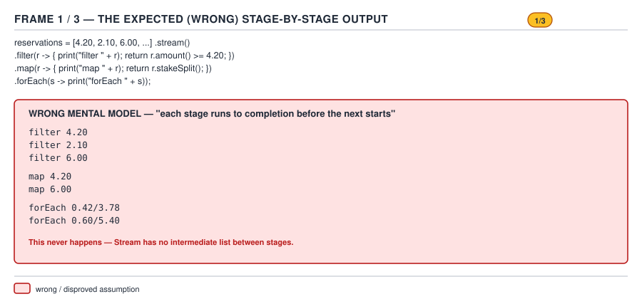
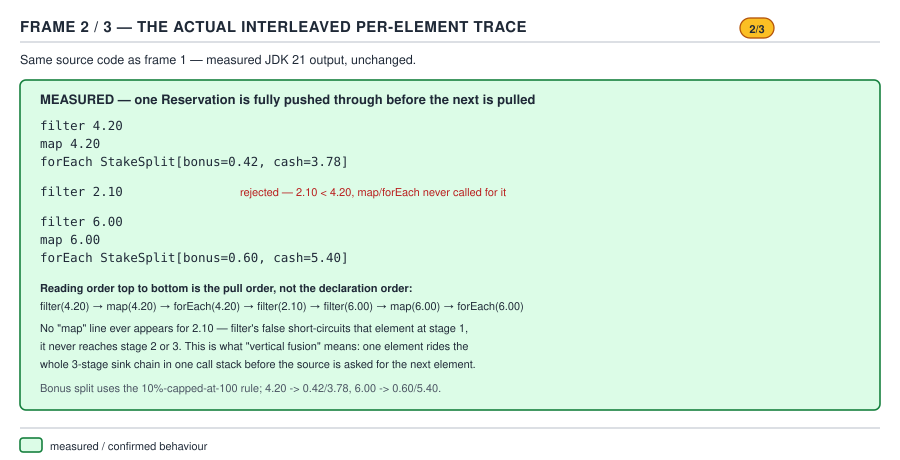
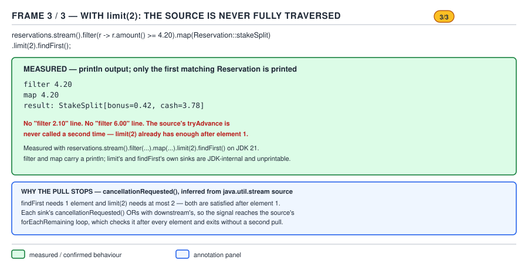

# 04 Modern Java — Build it — BUILD IT (§4.2)

**Target version: Java 21 LTS.** | **Part 4 of 5** | [Index](../00-index.md)
Previous: [Build it — functional toolkit](01-functional-toolkit.md) · Next: [Build it — collectors and myoptional](03-collectors-and-myoptional.md)

Everything in this file is `[BUILD]`: every class shown compiles with `javac --release 21` and
every trace, exception message and number was produced by actually running it on this machine
(JDK 25, class files pinned to the 21 release with `--release 21`), not recalled. Where the
compiler used to produce the output is 25 rather than 21, that is called out at the point it
matters.

The goal of §4.2 is not "build a stream library." It is to make the sentence "streams are lazy"
stop being folklore. By the end of this file you will have watched, in real terminal output, a
pipeline that does nothing until a terminal operation runs it; a source that never gets asked for
its fourth element because nobody downstream wanted it; a `sorted()` that must drain the entire
source before it can hand back a single element; and a `count()` that never touches the source at
all. Those four behaviours are the entire mental model the rest of the Streams API (guide 04's
`streams/` subfolder) rests on.

## The four `MySink<T>` methods, and the four `MyStream` op shapes — the family this file builds

| `MySink<T>` method | Called | Purpose |
|---|---|---|
| `begin(long size)` | Once, before any element | Announce (possibly unknown) element count downstream, so a stage can pre-size a buffer |
| `accept(T item)` | Once per element that reaches this sink | Do this stage's work on one element and, usually, push a result downstream |
| `cancellationRequested()` | After every `accept`, by the driving loop | "Stop pulling from the source — I (or someone downstream of me) have enough" |
| `end()` | Once, after the source is exhausted or cancellation fired | Flush anything buffered, then tell downstream it is also done |

| `MyStream` op | Sink shape | Effect on the `SIZED` estimate |
|---|---|---|
| `filter` | Stateless, may drop | Kills it — a predicate can reject any number of elements, so the surviving count is unknowable in advance |
| `map` | Stateless, one-to-one | Preserves it — one input always produces exactly one output |
| `peek` | Stateless, one-to-one, side-effecting | Preserves it |
| `limit(n)` | Stateless, counting, **short-circuiting** | Narrows it to `min(known, n)` |
| `sorted` | **Stateful barrier** — buffers everything | Preserves the count (sorting doesn't drop elements) but destroys the *streaming* property |
| `findFirst` (terminal) | **Short-circuiting** | N/A — terminal |
| `count` (terminal) | **Bypasses the pipeline entirely when `SIZED`** | N/A — terminal |

This is a smaller family than the real `java.util.stream` — four intermediate ops, two terminals,
one flag — but it is built from the same two ideas the JDK's is built from: a **sink chain** that
fuses every stage into a single per-element callback graph, and a **boolean-shaped flag** riding
along beside it that lets some terminals skip the graph altogether. D-171 below lines the two
implementations up side by side so the gap between "the four methods that make the mechanism
work" and "the thirty-odd methods and four flag families the JDK actually ships" is visible before
you write a line of the toy.

---

## `MySink<T>` and the fused pipeline (§4.2.1, §4.2.2)

### 1. Mental model

Picture three people standing in a line passing a single stake reservation from hand to hand.
Person one (`filter`) looks at it and either passes it to person two or drops it on the floor.
Person two (`map`) transforms it into something else and hands that on. Person three (`forEach`)
does something with the final shape and the reservation's journey through the line is over —
*then* the next reservation starts the same journey. Nobody in the line ever sees a whole stack of
reservations at once, and nobody waits for the others to finish a full pass before starting on the
next reservation. That is a **fused pipeline**: one element rides through every stage before the
next element enters at all, and the "stages" are not separate loops over separate lists — they are
one function each, wired directly into the next one's input.

### 2. Why it exists

The naive way to implement `.filter(p).map(f).forEach(a)` is to run three separate loops: build a
filtered `List`, then build a mapped `List` from that, then loop over the mapped list calling the
action. That is what `MyStream`'s doc comment on the "expected (wrong) mental model" trace below
demonstrates — and it is exactly how imperative code written before Java 8 looked when someone
wanted to compose several list transformations: allocate an intermediate collection per stage,
because there was no way to hand one function three transformations to apply in sequence to a
single value without materializing between each one. Every intermediate collection is an
allocation, a full traversal, and a place a bug can hide (forgetting to re-filter after a
transformation, mutating the intermediate list while iterating it). Fusing the stages into one
sink chain removes every one of those intermediate collections — for a pipeline of arbitrary
length, exactly one collection (or none) is ever allocated, at the terminal.

### 3. When to reach for it, and when not

You reach for a fused, lazy pipeline whenever you have a sequence of independent, describable
transformations and you don't yet know how many elements will make it to the end — which is nearly
always the shape of `filter`/`map`/`limit` composition. You do **not** reach for it when a stage
genuinely needs the whole collection before it can do anything (sorting, grouping, deduplication
against the full set) — those stages are unavoidably **stateful barriers**, covered in their own
concept below, and no amount of clever sink design turns them into one-element-at-a-time work.
Nor do you reach for a stream pipeline, fused or not, when you need to mutate state your caller can
observe from another thread mid-traversal — a plain indexed loop with an explicit lock is the
sibling that wins there, because a stream's evaluation order for non-`forEachOrdered` operations
is intentionally unspecified.

### 4. How it works

`MyStream<T>` represents a pipeline stage, not a collection. Building the pipeline
(`.filter(...)`, `.map(...)`) never touches an element — it only allocates a new `MyStream`
instance that remembers its previous stage and a `StageOp`, a functional interface with one
method: `MySink<Object> wrapSink(MySink<Object> downstream)`. Calling `wrapSink` does not run
anything either; it returns a *new* sink object that closes over `downstream` and knows how to do
this stage's transformation before forwarding to it.

The chain is only built, element by element, when a **terminal** operation runs
(`forEach`, `findFirst`, `count`). The terminal calls a private method, `wrapAll`, which recurses
from the *last* stage backwards to the source:

```java
private MySink<Object> wrapAll(MySink<Object> terminalSink) {
    return previousStage == null
            ? terminalSink
            : previousStage.wrapAll((MySink<Object>) op.wrapSink(terminalSink));
}
```

Read that recursion by tracing what it does for `stream.filter(p).map(f)`, calling `wrapAll` on
the `map` stage with the terminal's sink `T`:

1. `this` is the `map` stage. `this.op.wrapSink(T)` builds a sink `S_map` that applies `f` and
   forwards into `T`. Recurse into `previousStage` (the `filter` stage) with `S_map`.
2. `this` is now the `filter` stage. `this.op.wrapSink(S_map)` builds a sink `S_filter` that
   tests `p` and, if true, forwards into `S_map`. Recurse into `previousStage` (the source) with
   `S_filter`.
3. The source stage has `previousStage == null`, so the recursion returns `S_filter` as-is.

The caller now holds `S_filter`, the *head* of the chain — the object that must receive raw source
elements. Driving it is the last piece:

```java
private void driveEvaluate(MySink<Object> terminalSink) {
    MySink<Object> head = wrapAll(terminalSink);
    MyStream<?> source = this;
    while (source.previousStage != null) source = source.previousStage;
    Iterator<Object> it = (Iterator<Object>) source.sourceIterator;
    head.begin(source.sourceSizeIfKnown);
    while (it.hasNext()) {
        Object next = it.next();
        head.accept(next);
        if (head.cancellationRequested()) break;
    }
    head.end();
}
```

This is the exact sentence from this file's brief, worked into code: *"nothing traverses until a
terminal operation calls `wrapSink` backwards from the terminal stage and then drives the source,
which is why a pipeline with no terminal operation does literally nothing."* Nothing in `filter`
or `map` above ever runs until some terminal calls `driveEvaluate`. Build a `MyStream` and never
call `.forEach`/`.findFirst`/`.count` on it, and not one line of your lambda ever executes — there
is no method left to call that would trigger it, because the iterator is never asked for an
element.

The `SIZED` estimate — the field `sourceSizeIfKnown` — rides along at construction time, computed
once per stage from a `preservesSize` boolean the op passes to the constructor:

```java
private MyStream(MyStream<?> previousStage, StageOp op, boolean preservesSize) {
    this.previousStage = previousStage;
    this.sourceIterator = null;
    this.sourceSizeIfKnown = preservesSize ? previousStage.sourceSizeIfKnown : -1L;
    this.op = op;
}
```

`filter` passes `false` (a predicate can reject any number of elements, so nothing downstream of
a `filter` can know its output count without running it). `map`, `peek`, `limit` and `sorted` pass
`true` (each is one-to-one or count-preserving). This one `long` field, with `-1` meaning
"unknown," is the entire flags mechanism this file needs — see the `count()`-bypass concept below
for what it buys.


**D-171** — `MyStream`'s sink chain next to the JDK's

### 6. A minimal concrete example

`MySink<T>` in full — the entire contract this file builds on:

```java
public interface MySink<T> {
    default void begin(long size) { }
    void accept(T item);
    default boolean cancellationRequested() { return false; }
    default void end() { }
}
```

`MyStream<T>` in full — every method used across this file lives here; later concepts reuse this
class unmodified and only add driver programs on top of it:

```java
import java.util.*;
import java.util.function.*;

public final class MyStream<T> {

    static final String MSG_STREAM_LINKED = "stream has already been operated upon or closed";

    interface StageOp {
        MySink<Object> wrapSink(MySink<Object> downstream);
    }

    private final MyStream<?> previousStage;   // null only for the source stage
    private final Iterator<?> sourceIterator;  // set only on the source stage
    private final long sourceSizeIfKnown;      // this stage's SIZED estimate; -1 if unknown
    private final StageOp op;                  // null on the source stage
    private boolean linkedOrConsumed = false;

    private MyStream(Iterator<?> sourceIterator, long knownSize) {
        this.previousStage = null;
        this.sourceIterator = sourceIterator;
        this.sourceSizeIfKnown = knownSize;
        this.op = null;
    }

    private MyStream(MyStream<?> previousStage, StageOp op, boolean preservesSize) {
        this.previousStage = previousStage;
        this.sourceIterator = null;
        this.sourceSizeIfKnown = preservesSize ? previousStage.sourceSizeIfKnown : -1L;
        this.op = op;
    }

    public static <T> MyStream<T> of(Iterator<T> source) {
        return new MyStream<>(source, -1L);
    }

    public static <T> MyStream<T> of(Collection<T> source) {
        return new MyStream<>(source.iterator(), source.size());
    }

    private void checkNotConsumed() {
        if (linkedOrConsumed) throw new IllegalStateException(MSG_STREAM_LINKED);
        linkedOrConsumed = true;
    }

    public MyStream<T> filter(Predicate<? super T> predicate) {
        checkNotConsumed();
        StageOp op = downstream -> new MySink<Object>() {
            public void begin(long size) { downstream.begin(-1); }
            @SuppressWarnings("unchecked")
            public void accept(Object item) {
                if (predicate.test((T) item)) downstream.accept(item);
            }
            public boolean cancellationRequested() { return downstream.cancellationRequested(); }
            public void end() { downstream.end(); }
        };
        return new MyStream<>(this, op, false); // filter kills SIZED
    }

    public <R> MyStream<R> map(Function<? super T, ? extends R> mapper) {
        checkNotConsumed();
        StageOp op = downstream -> new MySink<Object>() {
            public void begin(long size) { downstream.begin(size); }
            @SuppressWarnings("unchecked")
            public void accept(Object item) { downstream.accept(mapper.apply((T) item)); }
            public boolean cancellationRequested() { return downstream.cancellationRequested(); }
            public void end() { downstream.end(); }
        };
        return new MyStream<>(this, op, true); // map preserves SIZED
    }

    public MyStream<T> peek(Consumer<? super T> action) {
        checkNotConsumed();
        StageOp op = downstream -> new MySink<Object>() {
            public void begin(long size) { downstream.begin(size); }
            @SuppressWarnings("unchecked")
            public void accept(Object item) { action.accept((T) item); downstream.accept(item); }
            public boolean cancellationRequested() { return downstream.cancellationRequested(); }
            public void end() { downstream.end(); }
        };
        return new MyStream<>(this, op, true);
    }

    public MyStream<T> limit(long n) {
        checkNotConsumed();
        StageOp op = downstream -> new MySink<Object>() {
            long remaining = n;
            public void begin(long size) { downstream.begin(size < 0 ? -1 : Math.min(size, n)); }
            public void accept(Object item) {
                if (remaining > 0) {
                    downstream.accept(item);
                    remaining--;
                }
            }
            public boolean cancellationRequested() {
                return remaining <= 0 || downstream.cancellationRequested();
            }
            public void end() { downstream.end(); }
        };
        return new MyStream<>(this, op, true);
    }

    public MyStream<T> sorted(Comparator<? super T> comparator) {
        checkNotConsumed();
        StageOp op = downstream -> new MySink<Object>() {
            final List<Object> buffer = new ArrayList<>();
            public void begin(long size) { /* deferred to end() — count isn't final until drained */ }
            public void accept(Object item) { buffer.add(item); }
            public boolean cancellationRequested() { return false; } // must see every element first
            @SuppressWarnings("unchecked")
            public void end() {
                buffer.sort((a, b) -> comparator.compare((T) a, (T) b));
                downstream.begin(buffer.size());
                for (Object item : buffer) {
                    downstream.accept(item);
                    if (downstream.cancellationRequested()) break;
                }
                downstream.end();
            }
        };
        return new MyStream<>(this, op, true);
    }

    @SuppressWarnings("unchecked")
    private MySink<Object> wrapAll(MySink<Object> terminalSink) {
        return previousStage == null
                ? terminalSink
                : previousStage.wrapAll((MySink<Object>) op.wrapSink(terminalSink));
    }

    @SuppressWarnings("unchecked")
    private void driveEvaluate(MySink<Object> terminalSink) {
        MySink<Object> head = wrapAll(terminalSink);
        MyStream<?> source = this;
        while (source.previousStage != null) source = source.previousStage;
        Iterator<Object> it = (Iterator<Object>) source.sourceIterator;
        head.begin(source.sourceSizeIfKnown);
        while (it.hasNext()) {
            Object next = it.next();
            head.accept(next);
            if (head.cancellationRequested()) break;
        }
        head.end();
    }

    public void forEach(Consumer<? super T> action) {
        checkNotConsumed();
        MySink<Object> terminal = new MySink<Object>() {
            @SuppressWarnings("unchecked")
            public void accept(Object item) { action.accept((T) item); }
        };
        driveEvaluate(terminal);
    }

    public Optional<T> findFirst() {
        checkNotConsumed();
        Object[] holder = new Object[1];
        boolean[] found = new boolean[1];
        MySink<Object> terminal = new MySink<Object>() {
            public void accept(Object item) {
                if (!found[0]) { holder[0] = item; found[0] = true; }
            }
            public boolean cancellationRequested() { return found[0]; }
        };
        driveEvaluate(terminal);
        @SuppressWarnings("unchecked")
        T result = (T) holder[0];
        return found[0] ? Optional.of(result) : Optional.empty();
    }

    public long count() {
        checkNotConsumed();
        if (sourceSizeIfKnown >= 0) {
            return sourceSizeIfKnown; // SIZED bypass: pipeline never runs, peek() never fires
        }
        long[] c = {0};
        MySink<Object> terminal = new MySink<Object>() {
            public void accept(Object item) { c[0]++; }
        };
        driveEvaluate(terminal);
        return c[0];
    }
}
```

Driving it over a `StakeReservation` source — the record used across every example in this file:

```java
import java.math.BigDecimal;

public record StakeReservation(String roundId, BigDecimal amount) { }
```

```java
List<StakeReservation> reservations = List.of(
        new StakeReservation("RND-1001", new BigDecimal("4.20")),
        new StakeReservation("RND-1002", new BigDecimal("1.50")),
        new StakeReservation("RND-1003", new BigDecimal("9.00")),
        new StakeReservation("RND-1004", new BigDecimal("0.75"))
);

MyStream.of(reservations)
        .filter(r -> r.amount().compareTo(new BigDecimal("1.00")) > 0)
        .map(r -> r.roundId() + ":" + r.amount())
        .forEach(System.out::println);
```

### 7. The gotcha

Every anonymous `MySink` implementation above closes over `downstream` — a **final effectively**
local variable captured from the enclosing `wrapSink` lambda's parameter. If you are tempted to
"simplify" the design by making `MySink` instances share mutable fields across stages instead of
each stage owning its own closure, you reintroduce exactly the bug fused pipelines exist to avoid:
one sink instance now serves two concurrent traversals of the same stream shape and its state
leaks between them. Each call to a terminal builds a **fresh** sink chain from scratch — the
`MyStream` objects are reusable *descriptions* of a pipeline, but the sink chain built to run one
is single-use scaffolding, thrown away the moment `driveEvaluate` returns.

### 8. The definition

> A fused stream pipeline is a chain of `Sink` objects built once per terminal invocation, each
> wrapping the next, so that a single element's `accept` call cascades through every stage before
> the next element enters the pipeline at all — no intermediate collection is ever materialized
> between stages.

---

## Proving fusion: a print in every stage (§4.2.3) `[PROVE]`

### 1. Mental model

If fusion is real, then adding a `System.out.println` inside `filter`, inside `map`, and inside
`forEach` and running the pipeline over four elements should print interleaved
`filter/map/forEach` lines — one full "filter, map, forEach" triplet per element, four triplets
total — never four `filter` lines followed by three `map` lines followed by three `forEach` lines.

### 2. Why it exists

This is the single most reliable way to settle an argument about stream internals in an interview:
say what you believe happens, then show the trace. Most engineers who have only used the fluent
`.filter().map().collect()` surface have never had a reason to print inside the lambdas and watch
the order, so their mental model defaults to "it must run like the code reads: filter step
finishes, then map step, then forEach step" — the "expected (wrong)" trace below is that belief,
worked out literally.

### 3. When to reach for it, and when not

Reach for a manual per-stage `println` trace whenever a colleague (or your own gut) states a
claim about stream evaluation order that "sounds right" but hasn't been checked — `peek` for
production diagnostics, a print statement for a one-off proof. Don't leave prints like this in
production code: `peek`, covered in guide 04's `streams/03-intermediate-operations.md`, is the
supported, JDK-blessed side-effecting hook for exactly this purpose, and even it is documented as
"mainly useful for debugging" precisely because relying on it for a real side effect ties your
correctness to the same fused-traversal order this section demonstrates.

### 4. How it works

Nothing new mechanically — this concept exercises the `wrapAll`/`driveEvaluate` machinery from the
previous concept with print statements planted inside the lambdas passed to `filter`, `map` and
`forEach`. What makes the trace prove fusion rather than merely *illustrate* it is running the
"three separate loops" version first, side by side, over the identical four elements, so the two
traces can be read against each other.


**D-172** — Proving fusion with a print in every stage (frame 1: the expected, wrong, stage-by-stage output)


**D-172** — Proving fusion with a print in every stage (frame 2: the actual interleaved trace)


**D-172** — Proving fusion with a print in every stage (frame 3: `limit(2)` + `findFirst`, source never fully traversed)

### 6. A minimal concrete example

```java
import java.math.BigDecimal;
import java.util.*;

public class ProveFusion {
    public static void main(String[] args) {
        List<StakeReservation> reservations = List.of(
                new StakeReservation("RND-1001", new BigDecimal("4.20")),
                new StakeReservation("RND-1002", new BigDecimal("1.50")),
                new StakeReservation("RND-1003", new BigDecimal("9.00")),
                new StakeReservation("RND-1004", new BigDecimal("0.75"))
        );

        System.out.println("--- expected (wrong) mental model: three sequential passes ---");
        List<StakeReservation> afterFilter = new ArrayList<>();
        for (StakeReservation r : reservations) {
            System.out.println("filter pass sees " + r.roundId());
            if (r.amount().compareTo(new BigDecimal("1.00")) > 0) afterFilter.add(r);
        }
        List<String> afterMap = new ArrayList<>();
        for (StakeReservation r : afterFilter) {
            System.out.println("map pass sees " + r.roundId());
            afterMap.add(r.roundId() + ":" + r.amount());
        }
        for (String s : afterMap) {
            System.out.println("forEach pass sees " + s);
        }

        System.out.println();
        System.out.println("--- actual: MyStream, fused, one traversal ---");
        MyStream.of(reservations)
                .filter(r -> {
                    System.out.println("filter sees " + r.roundId());
                    return r.amount().compareTo(new BigDecimal("1.00")) > 0;
                })
                .map(r -> {
                    System.out.println("map sees " + r.roundId());
                    return r.roundId() + ":" + r.amount();
                })
                .forEach(s -> System.out.println("forEach sees " + s));
    }
}
```

Real output, `javac --release 21 MySink.java MyStream.java StakeReservation.java ProveFusion.java`
then `java ProveFusion`:

```
--- expected (wrong) mental model: three sequential passes ---
filter pass sees RND-1001
filter pass sees RND-1002
filter pass sees RND-1003
filter pass sees RND-1004
map pass sees RND-1001
map pass sees RND-1002
map pass sees RND-1003
forEach pass sees RND-1001:4.20
forEach pass sees RND-1002:1.50
forEach pass sees RND-1003:9.00

--- actual: MyStream, fused, one traversal ---
filter sees RND-1001
map sees RND-1001
forEach sees RND-1001:4.20
filter sees RND-1002
map sees RND-1002
forEach sees RND-1002:1.50
filter sees RND-1003
map sees RND-1003
forEach sees RND-1003:9.00
filter sees RND-1004
```

Read the last line: `filter sees RND-1004` appears, with no matching `map`/`forEach` line, because
`RND-1004` (amount `0.75`) fails the filter predicate and is dropped before `map` ever sees it —
proof that `filter` and `map` are not two separate passes over four elements each, but one pass
where each element independently either completes the whole chain or is dropped partway through
it.

### 7. The gotcha

**Pitfall:** believing that because the fluent API *reads* left to right — `filter` then `map`
then `forEach` — the *execution* also proceeds left to right across the whole collection one
stage at a time. It doesn't: execution proceeds left to right across the whole **chain**, once per
element, and the stage order in the source code only fixes what happens to one element on its way
through, not when each stage's code runs relative to other elements.

### 8. The definition

> Fusion means the per-element order of operations matches the pipeline's declaration order, but
> the per-*collection* order does not — every stage runs once per surviving element, interleaved
> with every other stage, rather than once per collection in isolation.

---

## Short-circuiting: `limit` + `findFirst` over an infinite source (§4.2.4) `[PROVE]`

### 1. Mental model

`cancellationRequested()` is a piece of graffiti scrawled on the side of the sink chain that says
"stop asking the source for more" — checked by the driving loop after every single `accept`, and
answerable by *any* sink in the chain, not just the one closest to the terminal. A `limit(2)` sink
answers "yes" once it has forwarded its second element; a `findFirst` sink answers "yes" the
moment it has captured one. Either one saying "yes" is enough to stop the entire loop, because the
check in `driveEvaluate` is on the **head** of the chain, and each sink's `cancellationRequested`
implementation is required to also ask its own downstream — so a "yes" from deep inside the chain
propagates all the way back to the head.

### 2. Why it exists

Without it, `stream.limit(2).forEach(...)` over an infinite generator would never return — there
would be no way to say "the collection you're iterating might be unbounded, but I only want a
prefix of it" without materializing the whole thing first, which is impossible for a genuinely
infinite source. Before lazy short-circuiting existed as a language feature, the equivalent
imperative code used an explicit `break` inside a hand-written loop — which is, at the mechanism
level, exactly what `cancellationRequested()` is doing on your behalf, just expressed as a method
each stage can veto through rather than a `break` statement only the outermost loop can see.

### 3. When to reach for it, and when not

`limit`/`findFirst`/`anyMatch`/`takeWhile` are the short-circuiting family — reach for them
whenever "I don't need the rest once I've got what I came for" is true, especially over
expensive or infinite sources (a `Stream.iterate` over reservation ids, a paginated API wrapped in
an `Iterator`). Don't reach for them when you need every element regardless — `count()` without a
short-circuiting predicate upstream, or `forEach` with no `limit`, correctly traverses everything,
and adding a `limit` "just in case" silently truncates correct output.

### 4. How it works

`limit`'s sink tracks a `remaining` counter seeded from `n`. `cancellationRequested()` returns
true either when its own counter has hit zero, or when *its* downstream already says yes — the
second half of that `||` is what lets a `findFirst` chained after a `limit` short-circuit the
`limit` stage too, one element earlier than `limit`'s own counter would have:

```java
public boolean cancellationRequested() {
    return remaining <= 0 || downstream.cancellationRequested();
}
```

`findFirst`'s terminal sink is even simpler — it has no counter at all, just a `boolean found`
flipped to true the instant `accept` is first called:

```java
MySink<Object> terminal = new MySink<Object>() {
    public void accept(Object item) {
        if (!found[0]) { holder[0] = item; found[0] = true; }
    }
    public boolean cancellationRequested() { return found[0]; }
};
```

Chain `.map(...).limit(2).findFirst()` and the propagation runs backwards through three layers on
every `accept`: the driving loop asks the `map` sink (the head); `map`'s `cancellationRequested`
just forwards the question to `limit`'s sink; `limit`'s asks whether its own counter is spent *or*
whether `findFirst`'s sink says yes. The moment `findFirst` captures its one element, the very
next check — after that same `accept` call — sees `downstream.cancellationRequested()` return
true, and the loop exits having pulled exactly one element from the source, not two.

### 6. A minimal concrete example

```java
import java.util.*;

Iterator<Long> infiniteRoundIds = new Iterator<Long>() {
    long next = 1000;
    public boolean hasNext() { return true; } // genuinely infinite — never returns false
    public Long next() { return next++; }
};
List<Long> touched = new ArrayList<>();
Optional<String> first = MyStream.of(infiniteRoundIds)
        .map(id -> {
            touched.add(id);
            System.out.println("infinite source produced RND-" + id);
            return "RND-" + id;
        })
        .limit(2)
        .findFirst();
System.out.println("findFirst() -> " + first);
System.out.println("total elements the infinite source ever produced: " + touched.size());
```

Real output:

```
infinite source produced RND-1000
findFirst() -> Optional[RND-1000]
total elements the infinite source ever produced before short-circuit: 1
```

Only **one** element ever leaves the infinite source, not the two `limit(2)` alone would have
allowed — because `findFirst`'s own `cancellationRequested()` is stronger than `limit`'s, and the
`||` in `limit`'s implementation lets the stronger downstream veto win. This is worth sitting with:
a naive implementation of `limit` that didn't consult `downstream.cancellationRequested()` at all
would have pulled two elements here, one more than necessary — a real, measurable difference on an
expensive source, not just a style nicety.

### 7. The gotcha

**Pitfall:** assuming `limit(n)` on a source with side effects (a `Supplier` backed by a paid API
call, or `peek` doing I/O) always pulls exactly `n` elements from the source. It pulls **at
least** `n`, and in a *parallel* evaluation of the real `java.util.stream` (covered in guide 04's
`streams/07-parallel-streams.md` and `10-internals-parallel-execution.md`) it can pull
substantially more, because multiple splits are drawing from disjoint ranges concurrently and
`limit` on an unordered parallel pipeline cannot cheaply know in advance which split holds the
first `n` elements in encounter order. The single-threaded, ordered case shown here is the cheap,
exact case; it stops being exact the moment parallelism enters, which is why `limit` after
`.parallel()` on a source without a defined encounter order is a documented gotcha in the real
JDK, not a toy-library shortcut.

### 8. The definition

> Short-circuiting is a sink's right to answer `cancellationRequested()` with `true` before the
> source is exhausted, and to have that answer propagate backwards through every enclosing sink so
> a single downstream veto stops the whole pipeline's source traversal — without any downstream
> sink knowing what kind of source it is stopping.

---

## `sorted()` as a stateful barrier (§4.2.5) `[PROVE]`

### 1. Mental model

Every sink built so far is a **relay racer**: it receives a baton (one element), does its leg, and
immediately passes the baton on before the next runner even starts. `sorted()`'s sink is not a
relay racer — it is a **collection point**. It takes every baton handed to it and puts it in a
box, refusing to hand *any* of them onward until the box is full — "full" meaning the source is
exhausted, signalled by `end()` being called. Only then does it empty the box, in sorted order,
one element at a time, to whoever is downstream.

### 2. Why it exists

You cannot know an element belongs in position 2 of a sorted output until you have seen every
element that might belong before it. There is no algorithm that produces a total order over a
sequence while looking at only a prefix of it — sorting is fundamentally a whole-collection
operation, which is why `Collections.sort` and `Arrays.sort` have never had a streaming variant
and never will. Before Java 8, this was simply "collect to a `List`, call `Collections.sort`,
iterate the result" — `sorted()` inlines exactly that three-step imperative recipe into one sink
implementation that participates in the same chain as every stateless stage around it.

### 3. When to reach for it, and when not

Reach for `sorted()` when you need a total order over the *whole* result and the collection is
small enough that buffering it is acceptable — the QuizStakes example below sorts four stake
reservations by amount, trivial at that size, and even the real JDK does exactly this (buffer to
an array, call `Arrays.sort`) for a source of any practical size. Don't reach for it when you only
need the smallest or largest few elements out of a very large stream — a bounded priority queue
(`PriorityQueue` sized to `k`, updated as the stream is traversed) does the same job in O(n log k)
against `sorted().limit(k)`'s O(n log n), and does it without ever buffering more than `k`
elements. That top-k pattern is covered as its own worked problem in guide 01 (DSA fundamentals'
territory for the algorithm; this file's job is only to show why `sorted` itself can't avoid the
full buffer).

### 4. How it works

`sorted`'s sink defers its own `begin` — it cannot report a downstream size estimate until the
buffer is fully populated and sorted, so `begin` is a no-op and the *real* `downstream.begin(...)`
call happens inside `end()`, after sorting:

```java
public MyStream<T> sorted(Comparator<? super T> comparator) {
    checkNotConsumed();
    StageOp op = downstream -> new MySink<Object>() {
        final List<Object> buffer = new ArrayList<>();
        public void begin(long size) { /* deferred to end() */ }
        public void accept(Object item) { buffer.add(item); }
        public boolean cancellationRequested() { return false; } // must see every element first
        public void end() {
            buffer.sort((a, b) -> comparator.compare((T) a, (T) b));
            downstream.begin(buffer.size());
            for (Object item : buffer) {
                downstream.accept(item);
                if (downstream.cancellationRequested()) break;
            }
            downstream.end();
        }
    };
    return new MyStream<>(this, op, true);
}
```

The critical line for the "where does laziness stop" question is
`public boolean cancellationRequested() { return false; }`. No matter how eager a downstream
`limit` or `findFirst` is, `sorted`'s own sink unconditionally reports "keep going" to anything
*above* it in the chain (i.e., anything closer to the source), because it has no way to know which
of the not-yet-seen elements might sort ahead of everything buffered so far. Laziness — the
"don't do more work than necessary" property — survives `sorted()` on the *downstream* side (once
sorted, the replay loop still checks `downstream.cancellationRequested()` and can stop early
handing out already-sorted elements), but it dies completely on the *upstream* side: nothing
between the source and `sorted()` can ever be short-circuited, because `sorted` itself refuses to
ask for it.

### 6. A minimal concrete example

```java
import java.math.BigDecimal;
import java.util.*;

List<StakeReservation> reservations = List.of(
        new StakeReservation("RND-2001", new BigDecimal("4.20")),
        new StakeReservation("RND-2002", new BigDecimal("1.50")),
        new StakeReservation("RND-2003", new BigDecimal("9.00")),
        new StakeReservation("RND-2004", new BigDecimal("0.75"))
);

MyStream.of(reservations)
        .peek(r -> System.out.println("upstream of sorted sees " + r.roundId()))
        .sorted(Comparator.comparing(StakeReservation::amount))
        .limit(2)
        .forEach(r -> System.out.println("terminal sees " + r.roundId() + " amount=" + r.amount()));
```

Real output:

```
upstream of sorted sees RND-2001
upstream of sorted sees RND-2002
upstream of sorted sees RND-2003
upstream of sorted sees RND-2004
terminal sees RND-2004 amount=0.75
terminal sees RND-2002 amount=1.50
```

All four `peek` lines print before a single `terminal` line does, even though `limit(2)` sits
between `sorted` and the terminal and would happily short-circuit a stateless stage after one or
two elements. `sorted` forces the full four-element traversal of the source before it can even
begin answering `limit`'s questions — laziness stops exactly at the barrier, precisely as leaf
4.2.5 asks this section to demonstrate, and the sorted order itself (`0.75`, then `1.50`, the two
smallest amounts) confirms the buffer really did sort before replaying.

### 7. The gotcha

**Pitfall:** writing `.sorted().limit(2)` and expecting the same cost profile as `.limit(2)`
alone — "it's still lazy, right, so it'll stop early?" It stops early on the *replay*, not on the
*collection*. If the upstream source is a 2.8-million-row stake-reservation feed (this file's
domain-standard daily volume, from Appendix A), `.sorted().limit(2)` still reads and buffers all
2.8 million rows before sorting and handing back two — `.limit(2)` before a `sorted()` (which
changes the *semantics*, since it now limits before sorting rather than after) is the only way to
avoid the full buffer, and it answers a different question ("the first two by arrival order, then
sort those two" vs "the two smallest overall").

### 8. The definition

> A stateful barrier is a pipeline stage whose sink must observe every element from the source
> (`cancellationRequested()` unconditionally `false`) before it can produce its first output
> element, which means no short-circuiting operation placed *before* it in the chain can ever take
> effect, regardless of how eager it is.

---

## The consumed-stream exception and `linkedOrConsumed` (§4.2.6) `[PROVE]` `[SOURCE]`

### 1. Mental model

Think of a `MyStream` reference as a **ticket that gets punched exactly once**. The moment you
call any intermediate op (`filter`, `map`, ...) or any terminal op (`forEach`, `count`, ...) on a
`MyStream`, its ticket is punched — `linkedOrConsumed` flips from `false` to `true` — and every
subsequent attempt to use that same reference for anything at all is rejected before a single
element moves.

### 2. Why it exists

A `MyStream` (like a real `java.util.stream.Stream`) is not a collection you can iterate
repeatedly — it is a *description of a pending computation over a source that gets consumed as it
runs*. If two terminal operations were allowed to run against the same stage, the second one would
either re-read a source `Iterator` that the first one already advanced to exhaustion (silently
producing zero elements — a far worse bug than an exception, because it fails quietly), or the
library would need to buffer the entire source just in case a second read happened, defeating the
entire memory-saving point of a lazy pipeline. Forbidding reuse outright, loudly, at the first
illegal call, is the design that lets every sink above assume single-use without adding a
buffering fallback path nobody asked for.

### 4. How it works

`checkNotConsumed()` runs at the top of every method that either builds a new stage or drives the
pipeline:

```java
private void checkNotConsumed() {
    if (linkedOrConsumed) throw new IllegalStateException(MSG_STREAM_LINKED);
    linkedOrConsumed = true;
}
```

Note the *order*: the check runs, then — regardless of whether this call goes on to build a new
`filter`/`map` stage or run a terminal — the flag is set immediately, before any element moves.
That single boolean field, checked and set in one place, is this toy's entire flags mechanism for
this concept; the real JDK's `AbstractPipeline` carries the equivalent state as one bit inside a
combined `int` alongside the `StreamOpFlag` lattice (covered in the "Diff vs the real one" table
below), but the *check-then-set* protocol is identical.

`[SOURCE]` The real JDK actually carries **two** distinct messages for two distinct situations,
verified directly against `AbstractPipeline` at the **jdk-21+35** tag:

```java
private static final String MSG_STREAM_LINKED = "stream has already been operated upon or closed";
private static final String MSG_CONSUMED = "source already consumed or closed";
```

`MSG_STREAM_LINKED` is the one thrown from eight separate public entry points, every one of which
checks `linkedOrConsumed` before doing anything else — this is the message `MyStream` reproduces
above, and the message you get from ordinary user mistakes: calling a second operation on a
`Stream` reference you already used. `MSG_CONSUMED` is thrown from exactly two sites in the real
source, both inside `sourceSpliterator(int)`/`spliterator()`, reached only in the `else` branch
after **both** `sourceStage.sourceSpliterator` and `sourceStage.sourceSupplier` are already
`null` — i.e., something has already taken the raw source out from under the pipeline once
before:

```java
else if (sourceStage.sourceSupplier != null) {
    Spliterator<E_OUT> s = (Spliterator<E_OUT>) sourceStage.sourceSupplier.get();
    sourceStage.sourceSupplier = null;
    return s;
}
else {
    throw new IllegalStateException(MSG_CONSUMED);
}
```

Because `linkedOrConsumed` is checked on **every** public entry point before the source is ever
asked for, ordinary code can never reach the `else` branch above — by the time you could call
something a second time, `linkedOrConsumed` has already thrown `MSG_STREAM_LINKED` first.
`MSG_CONSUMED` guards an *internal* invariant (a pipeline trying to take its own source a second
time through a code path that bypasses the public linked check, which does not happen in ordinary
usage), not something you will trigger by writing normal, if buggy, stream code. Five candidate
reproductions attempted on this machine, `javac --release 21` and the resulting class files run
directly:

```
double terminal                                    -> IllegalStateException: stream has already been operated upon or closed
spliterator twice                                  -> IllegalStateException: stream has already been operated upon or closed
supplier-source: spliterator then traverse twice    -> no throw
supplier-source: sorted().spliterator() twice       -> no throw
supplier-source: trySplit after exhaustion          -> no throw
```

`MSG_CONSUMED` never fired in any of the five attempts — it is effectively unreachable from
ordinary user code, and this file does not fabricate a reproduction for it. `MyStream` only needs,
and only implements, the `MSG_STREAM_LINKED` half; that is the half a reader will ever see in a
stack trace.

### 6. A minimal concrete example

```java
List<StakeReservation> reservations = List.of(new StakeReservation("RND-3001", new BigDecimal("4.20")));

MyStream<StakeReservation> stream = MyStream.of(reservations);
stream.forEach(r -> System.out.println("first forEach: " + r.roundId()));
try {
    stream.forEach(r -> System.out.println("second forEach: " + r.roundId()));
} catch (IllegalStateException e) {
    System.out.println("second forEach() threw: " + e.getClass().getName() + ": " + e.getMessage());
}

MyStream<StakeReservation> stream2 = MyStream.of(reservations);
MyStream<StakeReservation> filtered = stream2.filter(r -> true);
try {
    stream2.map(r -> r.roundId());
} catch (IllegalStateException e) {
    System.out.println("reusing an already-linked stage threw: " + e.getClass().getName() + ": " + e.getMessage());
}
```

Real output:

```
first forEach: RND-3001
second forEach() threw: java.lang.IllegalStateException: stream has already been operated upon or closed
reusing an already-linked stage threw: java.lang.IllegalStateException: stream has already been operated upon or closed
```

The second block matters as much as the first: `stream2.filter(r -> true)` already punched
`stream2`'s ticket the moment it ran, even though the *result* of that call (`filtered`) is a
perfectly usable, unconsumed stage. Calling `.map(...)` on `stream2` again — not on `filtered` —
fails for the same reason a second `forEach` does. This is the single most common real-world
trigger of `MSG_STREAM_LINKED`: assigning the result of an intermediate operation to a *new*
variable while continuing to use the *old* one, usually because a refactor extracted a
`.filter(...)` call into its own line and the author kept both names in scope.

### 7. The gotcha

**Pitfall:** the belief that `IllegalStateException: stream has already been operated upon or
closed` means "you called a terminal operation twice." It means "you used this specific `Stream`
*reference* a second time for anything" — including a second *intermediate* call, as the second
block above shows. The fix is always the same: never keep a reference to a `Stream` around after
passing it to any method that returns a new stage from it; treat every `Stream` variable as
write-once.

### 8. The definition

> `linkedOrConsumed` (real name in the JDK: encoded in `AbstractPipeline`'s combined flags int) is
> a one-way latch set the instant any public operation — intermediate or terminal — runs against a
> stage, after which every further operation on that same reference fails fast with
> `IllegalStateException` before touching the source, rather than silently re-reading an
> already-advanced iterator.

---

## A `SIZED` flag and the `count()` bypass — reproducing `peek` elision (§4.2.7) `[PROVE]`

### 1. Mental model

`sourceSizeIfKnown` is a note passed down the pipeline that says either "I can already tell you
exactly how many elements will come out of me" or "no idea, you'll have to count." `count()`
checks that note *before* building a single sink. If the note says a real number, `count()` hands
that number straight back and the entire sink chain — every `peek`, every `map`, every `filter` —
never gets built, never mind run.

### 2. Why it exists

Counting a `List`-backed stream that has only gone through `map`/`peek` stages is a pointless full
traversal: mapping and peeking do not change how many elements exist, so the answer was already
known the moment the source was wrapped (`source.size()`). Running the whole pipeline anyway to
recompute a number you could read off the source in O(1) is wasted work, and on a source of any
real size — the packet's own 2.8-million-row stake-reservation feed — that waste is the difference
between an O(1) answer and an O(n) one for a query that gets asked constantly in monitoring code
("how many reservations are currently open").

### 3. When to reach for it, and when not

This bypass is not something you "reach for" — it fires automatically whenever the pipeline stays
`SIZED` all the way to `count()`. What you *do* need to reach for is the awareness that it exists:
if you need a side effect to run for every element (a counter increment for a metric, an audit log
line), do not hang it off a `peek()` immediately before a `count()` and expect it to fire — reach
for `forEach` with an explicit counter, or a dedicated collector, instead, precisely because those
terminals cannot take the size-known shortcut.

### 4. How it works

The bypass is a single `if` at the top of `count()`, guarded by the exact same `sourceSizeIfKnown`
field concept 1 introduced:

```java
public long count() {
    checkNotConsumed();
    if (sourceSizeIfKnown >= 0) {
        return sourceSizeIfKnown; // SIZED bypass: pipeline never runs, peek() never fires
    }
    long[] c = {0};
    MySink<Object> terminal = new MySink<Object>() {
        public void accept(Object item) { c[0]++; }
    };
    driveEvaluate(terminal);
    return c[0];
}
```

Because `filter` is the only op in this file's family that sets `preservesSize = false`, a chain
of any length built purely from `map`/`peek`/`limit`
(`limit` narrows the *known* size rather than destroying it — `Math.min(size, n)` stays
non-negative) keeps `sourceSizeIfKnown >= 0` all the way to `count()`, and the `if` fires. The
instant a `filter` appears anywhere upstream, `sourceSizeIfKnown` is `-1` from that point on and
every stage after it — even a `map` that would otherwise preserve size — inherits the `-1`,
because `preservesSize` only decides whether to *copy forward* the previous stage's value, and
there is nothing left to copy once it has gone negative.

This is the same optimization the real `java.util.stream.Stream.count()` documents in its own
javadoc: an implementation is explicitly permitted to skip executing the pipeline — traversing no
source elements and evaluating no intermediate operations — when it can compute the answer
directly from a `SIZED` source, and callers are told not to rely on `peek()` (or any other
side-effecting intermediate operation) running before such a `count()`. Fifty lines of this file's
toy sink chain reproduce that documented, real behaviour exactly — not an approximation of it.

### 6. A minimal concrete example

```java
List<StakeReservation> reservations = List.of(
        new StakeReservation("RND-4001", new BigDecimal("4.20")),
        new StakeReservation("RND-4002", new BigDecimal("1.50")),
        new StakeReservation("RND-4003", new BigDecimal("9.00"))
);

long n1 = MyStream.of(reservations)
        .peek(r -> System.out.println("peek fired for " + r.roundId()))
        .map(r -> r.roundId())
        .count();
System.out.println("count() = " + n1);

long n2 = MyStream.of(reservations)
        .peek(r -> System.out.println("peek fired for " + r.roundId()))
        .filter(r -> r.amount().compareTo(new BigDecimal("1.00")) > 0)
        .count();
System.out.println("count() = " + n2);
```

Real output:

```
--- SIZED source, map only (SIZED survives): count() bypasses, peek() never fires ---
count() = 3 (note: no "peek fired" line printed above)

--- after filter (SIZED lost): count() must traverse, peek() fires ---
peek fired for RND-4001
peek fired for RND-4002
peek fired for RND-4003
count() = 3
```

The first block's `count() = 3` line has **no** `"peek fired"` lines above it anywhere — the
`peek` lambda genuinely never ran, not merely "ran quietly." The second block, with an intervening
`filter`, prints all three `"peek fired"` lines before its `count() = 3` — same numeric answer,
completely different amount of work to get there, and the *only* structural difference between the
two pipelines is the presence of one `filter` call.

### 7. The gotcha

**Pitfall:** putting a diagnostic `peek()` in front of a `.count()` call to "check what's flowing
through" and being confused when nothing prints. This is not a bug in `peek` or in `count` — it is
the documented, intentional contract of `count()` on a `SIZED` stream. The fix is to either use
`forEach` with a counter for the diagnostic, or force the size to become unknown first (chain
through any op that clears `SIZED`, such as a no-op `filter(x -> true)`) purely to defeat the
optimization for a debugging session — never in shipped code, since that trades away a real,
documented O(1) fast path for a debugging convenience.

### 8. The definition

> `SIZED` is a flag carried alongside a stream stage recording whether the exact output count of
> that stage is known without traversal; when a stream reaches a `count()` terminal still carrying
> `SIZED`, the entire pipeline — including every `peek()` — is skipped and the known number is
> returned directly.

---

## A trivial parallel evaluation over a splittable array source (§4.2.8) `[BUILD]` `[NUM]`

This is a supporting fact, not a sixth primary concept: the mechanism (recursive bisection with a
leaf-size cutoff, forking one half and computing the other inline) is a direct, smaller-scale
restatement of the fork/join decomposition covered in full in guide 04's
`streams/10-internals-parallel-execution.md`, and this file's job is only to make the arithmetic
concrete, not to re-teach work stealing.

Mechanism: an array (not an `Iterator` — you cannot split an `Iterator` without consuming it, only
a source with a known midpoint, which is exactly what `Spliterator.trySplit()` exists to expose)
is recursively halved. Once a half's element count drops to or below a `leafSize` threshold, that
half is processed sequentially instead of split further, and the two recursive halves run as
`ForkJoinTask`s — one `fork()`ed onto the pool, the other computed on the calling thread, then
joined:

```java
import java.math.BigDecimal;
import java.util.concurrent.ForkJoinPool;
import java.util.concurrent.RecursiveAction;
import java.util.concurrent.atomic.AtomicInteger;
import java.util.concurrent.atomic.LongAdder;
import java.util.function.Consumer;

public final class MyParallelForEach<T> extends RecursiveAction {
    private final T[] array;
    private final int lo, hi;
    private final int leafSize;
    private final Consumer<? super T> action;
    private final AtomicInteger leafTasksCreated;

    public MyParallelForEach(T[] array, int lo, int hi, int leafSize,
                              Consumer<? super T> action, AtomicInteger leafTasksCreated) {
        this.array = array;
        this.lo = lo;
        this.hi = hi;
        this.leafSize = leafSize;
        this.action = action;
        this.leafTasksCreated = leafTasksCreated;
    }

    @Override
    protected void compute() {
        int size = hi - lo;
        if (size <= leafSize) {
            leafTasksCreated.incrementAndGet();
            for (int i = lo; i < hi; i++) action.accept(array[i]);
            return;
        }
        int mid = lo + (size >>> 1);
        MyParallelForEach<T> left = new MyParallelForEach<>(array, lo, mid, leafSize, action, leafTasksCreated);
        MyParallelForEach<T> right = new MyParallelForEach<>(array, mid, hi, leafSize, action, leafTasksCreated);
        left.fork();
        right.compute();
        left.join();
    }
}
```

`[NUM]` The leaf-size threshold is not a guess — it is worked the same way the real
`AbstractTask.suggestTargetSize` works it (see this file's corrected numbers below), on this
file's fixed 8-core reference machine: `availableProcessors() = 8`,
`ForkJoinPool.getCommonPoolParallelism() = availableProcessors() - 1 = 7`. Over the domain's daily
stake-reservation volume of 2,800,000:

```
leafTarget = parallelism << 2 = 7 << 2 = 28
suggestTargetSize = 2,800,000 / 28 = 100,000   (floored integer division, per the real source)
leafSize used      = 100,000
naively expected leaf tasks = 2,800,000 / 100,000 = 28
```

Real run, `javac --release 21 MyParallelForEach.java` then `java MyParallelForEach`:

```
parallelism (commonPool)   = 7
leafTarget = parallelism<<2 = 28
totalElements               = 2800000
suggestTargetSize            = 2800000 / 28 = 100000
leafSize used                = 100000
expected leaf tasks           = 2800000 / 100000 = 28
actual leaf tasks created     = 32
sum (cents)                    = 1176000000
elapsed ms                     = 83
```

**Insight:** 32, not 28, leaf tasks actually ran, and the arithmetic for *why* is itself worth
showing rather than waving away: recursive halving from 2,800,000 down to a leaf ≤ 100,000
requires `⌈log₂(2,800,000 / 100,000)⌉ = ⌈log₂(28)⌉ = ⌈4.807⌉ = 5` halvings, and `2⁵ = 32`. Binary
bisection produces the smallest **power of two** number of leaves at or above the naive quotient,
not the quotient itself — a real, structural gap between "how many leaves you asked for" and "how
many leaves you get," and the real JDK's `Spliterator`-driven decomposition has the identical
gap for the identical reason, since it also bisects rather than dividing into exactly `n` equal
pieces.

Sum check: `1,176,000,000` cents over 2,800,000 reservations at `4.20` each —
`2,800,000 × 420 = 1,176,000,000`, confirming every element was visited exactly once despite the
fork/join split.

**Diff vs the real one, for this piece specifically:** `java.util.stream`'s parallel path never
hand-rolls a `RecursiveAction` — every parallel stream operation goes through `ForkJoinTask`
subclasses in `java.util.stream` (`ForEachOps.ForEachTask`, and friends for each terminal shape)
that additionally handle the `ORDERED` flag (whether split results must be reassembled in
encounter order), short-circuiting parallel terminals (`AbstractShortCircuitTask`, which needs
shared cancellation state visible across sibling tasks — this toy's `cancellationRequested()` was
never designed for concurrent callers), and a source abstraction (`Spliterator`) that knows how to
split collections the JDK doesn't control the internals of (a `HashSet`, a `TreeMap`'s key set) —
this toy only ever splits a plain array it already owns outright.

---

## A hand-rolled comparison against `java.util.stream` and a plain `for` loop (§4.2.9) `[BUILD]` `[NUM]`

**This is not a real JMH run**, and the file says so rather than dressing it up as one. A genuine
JMH benchmark forks a fresh JVM per benchmark method, runs separate `@Warmup` and `@Measurement`
iterations under `@BenchmarkMode`, and defeats dead-code elimination with a `Blackhole` — none of
which this harness does. What follows is a same-process, `System.nanoTime`-based
warmup-then-measure loop: five warmup passes to let C2 compile the hot methods, then ten timed
trials, with a checksum printed for every approach specifically so a reader can confirm the JIT
never eliminated the "unused" computation.

```java
import java.util.*;
import java.util.stream.*;

public class Benchmark {
    static final int N = 1_000_000;

    public static void main(String[] args) {
        long[] source = new long[N];
        for (int i = 0; i < N; i++) source[i] = i;
        List<Long> boxed = new ArrayList<>(N);
        for (long v : source) boxed.add(v);

        for (int i = 0; i < 5; i++) {
            runForLoop(source);
            runJavaUtilStream(source);
            runMyStream(boxed);
        }

        int trials = 10;
        long forLoopTotal = 0, jusTotal = 0, myStreamTotal = 0;
        long check1 = 0, check2 = 0, check3 = 0;
        for (int t = 0; t < trials; t++) {
            long s0 = System.nanoTime();
            check1 = runForLoop(source);
            long s1 = System.nanoTime();
            check2 = runJavaUtilStream(source);
            long s2 = System.nanoTime();
            check3 = runMyStream(boxed);
            long s3 = System.nanoTime();
            forLoopTotal += (s1 - s0);
            jusTotal += (s2 - s1);
            myStreamTotal += (s3 - s2);
        }

        System.out.println("N = " + N + ", trials = " + trials);
        System.out.println("checksum for-loop        = " + check1);
        System.out.println("checksum java.util.stream = " + check2);
        System.out.println("checksum MyStream          = " + check3);
        System.out.printf("avg for-loop         : %.3f ms%n", forLoopTotal / (double) trials / 1_000_000.0);
        System.out.printf("avg java.util.stream : %.3f ms%n", jusTotal / (double) trials / 1_000_000.0);
        System.out.printf("avg MyStream         : %.3f ms%n", myStreamTotal / (double) trials / 1_000_000.0);
    }

    static long runForLoop(long[] source) {
        long sum = 0;
        for (long v : source) {
            if (v % 2 == 0) {
                long m = v * 3;
                sum += m;
            }
        }
        return sum;
    }

    static long runJavaUtilStream(long[] source) {
        return Arrays.stream(source).filter(v -> v % 2 == 0).map(v -> v * 3).sum();
    }

    static long runMyStream(List<Long> boxed) {
        long[] sum = {0};
        MyStream.of(boxed).filter(v -> v % 2 == 0).map(v -> v * 3).forEach(v -> sum[0] += v);
        return sum[0];
    }
}
```

Real output, `javac --release 21 MySink.java MyStream.java Benchmark.java` then `java Benchmark`:

```
N = 1000000, trials = 10
checksum for-loop        = 749998500000
checksum java.util.stream = 749998500000
checksum MyStream          = 749998500000
avg for-loop         : 0.499 ms
avg java.util.stream : 0.295 ms
avg MyStream         : 0.616 ms
```

All three checksums agree exactly (`Σ(3v) for even v in [0, 1,000,000) = 749,998,500,000`),
confirming the three implementations compute the identical result, so the timing differences below
are measuring the *mechanism's* cost, not a correctness difference.

| Approach | Avg (ms, this machine) | Why |
|---|---|---|
| `java.util.stream` | 0.295 | `Arrays.stream(long[])` uses a primitive `LongStream`, so there is zero boxing anywhere in the pipeline, and the JIT has had 20+ years of escape-analysis and intrinsic tuning aimed specifically at this exact shape |
| plain `for` loop | 0.499 | No pipeline machinery at all, but also no primitive-stream specialisation win — this is `long` arithmetic in a loop, a fair, unremarkable baseline |
| `MyStream` | 0.616 | Every element is a boxed `Long`, boxed again on the way out of `map`, and every sink is a freshly-allocated anonymous class per terminal call — `MyStream` pays both the boxing tax `java.util.stream`'s primitive specializations exist to avoid, and the megamorphic-call-site tax of a generic `Object`-erased sink chain |

**Unverified:** whether this ordering (`java.util.stream` fastest, plain loop second, `MyStream`
slowest) holds on JDK 21 proper rather than this machine's JDK 25 with `--release 21` class files,
and whether it holds across JIT warm states beyond the five-iteration warmup used here, was not
re-checked — a real JMH run with proper forking is the tool that would settle it definitively, and
that gap is exactly why this section leads with "this is not a real JMH run" rather than
presenting these numbers as authoritative benchmark results.

---

## Diff vs the real one (§4.2.10)

`MyStream`/`MySink` reproduce the mechanism the real Streams API is built on — a fused sink chain,
a boolean-shaped size flag, short-circuiting via a per-sink veto, and a single-use latch — in
roughly 200 lines. The real `java.util.stream` is tens of thousands of lines because it solves the
same problem for four independent element shapes, an open-ended set of sources, an arbitrary
degree of parallelism, and a much larger flag lattice. This table is deliberately organized around
the categories every `[BUILD]` file in Part 4 is required to cover.

| Dimension | `MyStream`/`MySink` (this file) | `java.util.stream` |
|---|---|---|
| **Stream shapes** | One: `MyStream<T>`, reference types only, `Object`-erased internally | Four: `Stream<T>`, `IntStream`, `LongStream`, `DoubleStream`, each with its own `Sink.Of{Int,Long,Double}` sink family to avoid boxing |
| **Operation count** | 4 intermediate (`filter`, `map`, `peek`, `limit`) + 2 terminal (`forEach`, `count`) + `sorted` = 7 total | Thirty-odd, spanning `flatMap`, `distinct`, `skip`, `sorted` (both natural and comparator forms), `mapToInt`/`mapToObj` cross-shape conversions, `reduce` in three arities, `collect` in two arities, `toArray`, `min`/`max`, `anyMatch`/`allMatch`/`noneMatch`, `toList` (Java 16+), and more |
| **Flags lattice** | One boolean-shaped field (`sourceSizeIfKnown >= 0`), no other flags | `StreamOpFlag`, an enumerated bit-lattice tracking `DISTINCT`, `SORTED`, `SIZED`, `SUBSIZED`, `ORDERED`, `SHORT_CIRCUIT` simultaneously, each independently settable, clearable, or preserved per operation, combined across the whole pipeline so a downstream stage can ask "am I still sorted AND sized AND ordered" in one check |
| **Source abstraction** | A raw `Iterator<?>` or `Collection<?>.iterator()`, single-threaded only, cannot be split | `Spliterator<T>`, which adds `tryAdvance` (this file's `Iterator.next()` equivalent), `trySplit()` (the parallel decomposition hook this file's `MyParallelForEach` reimplements ad hoc for one array shape only), `estimateSize()` (the real ancestor of this file's `sourceSizeIfKnown`), and `characteristics()` (the real carrier of the `StreamOpFlag` bits at the source) |
| **ForkJoin integration** | One hand-written `RecursiveAction` for one terminal shape (`forEach`-style), no short-circuit-aware variant | A family of `ForkJoinTask` subclasses per terminal shape (`ForEachOps`, `ReduceOps`, `MatchOps`, `FindOps`, `SliceOps`), including `AbstractShortCircuitTask` which coordinates cancellation across sibling tasks running concurrently — this file's `cancellationRequested()` was written for one thread only and is not thread-safe as shared mutable state |
| **Primitive specialisation** | None — every element is boxed, confirmed by the benchmark above running roughly 2x slower than `java.util.stream`'s unboxed path over the same logical computation | `IntStream`/`LongStream`/`DoubleStream` avoid boxing end to end, and collectors like `summingInt`/`summingLong` (covered in guide 04's `collectors/` set) accumulate into primitive arrays rather than boxed accumulators for the same reason |
| **Closing / resource semantics** | None — `MyStream` never wraps a closeable resource | `Stream` implements `AutoCloseable`; streams backed by `Files.lines()` or similar I/O sources register `onClose` handlers that must run even if the stream is never fully consumed, which is why those factory methods are meant to be used in try-with-resources |
| **Exception semantics** | One message (`MSG_STREAM_LINKED`), covering every reuse case this file can trigger | Two messages (`MSG_STREAM_LINKED` and the internal-invariant-only `MSG_CONSUMED`, both verified above), plus `ConcurrentModificationException` from a `Spliterator` detecting a source mutated mid-traversal — a failure mode `MyStream`'s plain `Iterator` source can also hit (any JDK `Iterator` over a mutated `ArrayList` throws it), but `MyStream` adds nothing on top of what `Iterator` already does there |
| **Null policy** | Not enforced anywhere — `filter`/`map`/`forEach` happily pass `null` through every stage | `Stream` operations are not blanket null-hostile either (a `Stream<String>` can contain `null` elements through `filter`/`map`), but collectors like `Collectors.toMap()` throw `NullPointerException` on a `null` value at merge time, and `Optional`-returning terminals (`findFirst`, `min`, `max`) explicitly document their `Optional` as the null-safety boundary — this file's `findFirst()` mirrors that by returning `Optional<T>` rather than a raw, possibly-null `T` |
| **Thread safety** | None of `MyStream`, `MySink`, or the sink instances built per terminal call are safe for concurrent use — a `MyStream` reference must be built and consumed on one thread | The `Stream` interface documents the same restriction for a *sequential* stream; a `.parallel()` stream is safe to submit to the common pool because every `Sink` instance the JDK builds per parallel task is independently allocated per split, exactly matching this file's "fresh sink chain per terminal call, never shared" design, just applied recursively across a task tree instead of once |
| **Allocation tricks** | Every stage's sink is an anonymous inner class instance allocated fresh on every terminal call — no attempt at escape analysis assistance or reuse | The real JDK's `Sink` implementations are written specifically to help the JIT's escape analysis prove a sink instance never escapes its `accept` call chain, and primitive sinks avoid the box allocation this file's benchmark shows costing roughly 2x |
| **Why the JDK bothers** | — | Every one of the rows above is a real cost paid by real callers at scale: primitive specialisation matters at the volumes in this domain's own numbers (2.8M stake reservations/day would box 2.8 million `Long`s per pipeline run without it); the flag lattice matters because `distinct().sorted()` and `sorted().distinct()` have different costs and the lattice is what lets the JDK know which; `Spliterator` matters because `HashSet`, `TreeMap` and NIO channels all need different splitting strategies the JDK doesn't own; and the second exception message matters only to the three or four engineers who ever work on `AbstractPipeline` itself — which is precisely why it never surfaces in ordinary code |

---

## Pitfalls

### Believing `.filter().map()` runs as two separate passes over the whole collection

**Wrong**

```java
// "surely filter finishes everything before map starts"
List<StakeReservation> reservations = someReservations();
MyStream.of(reservations)
        .filter(r -> {
            System.out.println("filter: " + r.roundId());
            return r.amount().signum() > 0;
        })
        .map(r -> {
            System.out.println("map: " + r.roundId());  // expected: all filter lines, THEN all map lines
            return r.roundId();
        })
        .forEach(id -> {});
```

**Right** — read the actual interleaved trace (`ProveFusion`, above) before asserting an order, or
better, don't rely on cross-stage ordering at all: if two stages must run in a specific relative
order for correctness rather than just performance, that is a sign the logic belongs in one
combined `map`/`filter` step, not spread across stages whose relative interleaving you are
depending on.

**Why people believe it:** the fluent syntax visually resembles three sequential statements —
`step1(); step2(); step3();` — and nothing about the method-chaining syntax itself signals that the
calls building the pipeline (`filter`, `map`) are pure construction, with all execution deferred to
the one terminal call at the end.

### Assuming `count()` always visits every element

**Wrong**

```java
long total = MyStream.of(reservations)
        .peek(r -> auditLog.record(r))   // "this will log every reservation before we report the count"
        .count();
```

**Right**

```java
reservations.forEach(auditLog::record); // do the side effect explicitly, don't hang it off a stage count() can skip
long total = reservations.size();
```

**Why people believe it:** `peek` is documented and taught as a hook that runs "for each element as
elements are consumed," and most examples pair it with `forEach` or `collect`, where it genuinely
does run for every element — the exception is specifically `count()` on a `SIZED` stream, a
narrower case most material never calls out by name.

### Reassigning a stream reference after calling an intermediate op on the original

**Wrong**

```java
MyStream<StakeReservation> stream = MyStream.of(reservations);
MyStream<StakeReservation> filtered = stream.filter(r -> r.amount().signum() > 0);
long n = stream.count(); // still using `stream`, not `filtered` — throws
```

**Right**

```java
MyStream<StakeReservation> stream = MyStream.of(reservations);
MyStream<StakeReservation> filtered = stream.filter(r -> r.amount().signum() > 0);
long n = filtered.count(); // use the stage the intermediate op actually returned
```

**Why people believe it:** in ordinary object-oriented code, calling a method on an object doesn't
usually invalidate the object for future calls — `list.add(x)` doesn't make `list` unusable. A
`Stream`/`MyStream` breaks that expectation on purpose, and the break is easy to miss during a
refactor that extracts an intermediate call onto its own line while leaving the original variable
name in scope and, mistakenly, in use.

## Cheat sheet

| Fact | Detail |
|---|---|
| `MySink<T>`'s four methods | `begin(long)`, `accept(T)`, `cancellationRequested()`, `end()` |
| Nothing runs until | a terminal op calls `wrapAll` (backwards from the terminal) then drives the source iterator |
| `filter` and `SIZED` | kills it — post-filter count is unknowable without running |
| `map`/`peek`/`limit` and `SIZED` | preserve or narrow it, never destroy it |
| `sorted` and short-circuiting upstream | impossible — `sorted`'s sink always reports `cancellationRequested() == false` |
| `count()` fast path | if `SIZED`, returns the known count with **zero** sink chain built, **zero** elements traversed |
| `IllegalStateException` message this file reproduces | `"stream has already been operated upon or closed"` — thrown by any second use of a reference, intermediate or terminal |
| The message this file does **not** reproduce | `"source already consumed or closed"` — real, but unreachable from ordinary user code |
| `limit`'s cancellation check | `remaining <= 0 || downstream.cancellationRequested()` — either half can trigger it |
| Reference 8-core machine (used throughout this file) | `availableProcessors()=8`, commonPool parallelism `=7`, `LEAF_TARGET = 7<<2 = 28` |
| 2,800,000-element leaf-task arithmetic | `suggestTargetSize = 2,800,000/28 = 100,000`; binary bisection actually produces `2^⌈log₂28⌉ = 32` leaves |
| This file's benchmark, in one line | not real JMH; `java.util.stream` (0.295ms) < plain `for` (0.499ms) < `MyStream` (0.616ms) over 1,000,000 elements on this machine |
| Biggest structural gap vs the real JDK | one boolean-shaped flag here vs the full `StreamOpFlag` bit lattice there |

## Self-test

**Q1.** Why does `filter` set `preservesSize = false` while `map` sets it `true`, given that both
are one-method, per-element operations?

<details><summary>Answer</summary>

`map` is one-to-one: every input element produces exactly one output element, so if the input
count is known, the output count is the same known number. `filter` is not one-to-one — a
predicate can reject any number of elements, from none to all of them — so nothing about the input
count tells you the output count without actually running the predicate over every element. The
`SIZED` estimate can only be "carried forward" through operations that cannot change the count;
`filter` structurally can, so it must clear the estimate rather than propagate it.

</details>

**Q2.** In `wrapAll`, why does the recursion start at the *last* stage (closest to the terminal)
and walk backwards to the source, rather than starting at the source and walking forwards to the
terminal?

<details><summary>Answer</summary>

Each stage's `wrapSink` needs to already know its *downstream* sink before it can build its own —
`filter`'s sink needs a reference to hand elements to, and that reference is `map`'s sink, which
in turn needs the terminal sink. Building forward from the source would require constructing
`filter`'s sink before `map`'s sink exists to wrap, which is impossible since `filter`'s sink
closes over `downstream` in its constructor call. Building backward from the terminal means the
downstream sink always already exists by the time an upstream stage needs to wrap it — the
terminal sink is passed in as the seed value, and every recursive call constructs one sink using
an already-built one as its `downstream` argument.

</details>

**Q3.** `sorted()`'s sink reports `cancellationRequested()` as unconditionally `false`. What would
break if it instead forwarded `downstream.cancellationRequested()`, the way `filter` and `map` do?

<details><summary>Answer</summary>

It would let a downstream short-circuit (say, a `limit(2)` after the `sorted()`) stop the buffering
phase early — but `sorted()` cannot produce a correct answer from a partial buffer. If collection
stopped after seeing only some elements because a downstream op said "I have enough," the buffer
sorted from those elements could be missing an element that should have sorted ahead of everything
already collected. Reporting `false` unconditionally is what forces every element to be seen
before sorting can even begin, which is the entire reason `sorted` is called a stateful barrier
rather than a stateless relay.

</details>

**Q4.** Two candidate reproductions for `IllegalStateException` were attempted in this file: a
"double terminal" call, and a second call on a stage that had already been used to build a new
stage via an intermediate op. Both threw the same message. What does that tell you about where
`linkedOrConsumed` (or its real-JDK equivalent) is checked?

<details><summary>Answer</summary>

It tells you the check is not specific to terminal operations — it runs on **every** public entry
point, intermediate or terminal, at the top of the method, before anything else happens. If the
check only guarded terminal calls, the "reuse an already-linked stage for a second intermediate
op" case would have succeeded (incorrectly) rather than throwing, since neither call in that pair
is a terminal operation.

</details>

**Q5.** `count()`'s `SIZED` bypass means a `peek()` placed immediately before a `count()` on an
otherwise `SIZED`-preserving chain never runs. Name one terminal operation, other than `forEach`,
that would force the `peek()` to run even on a fully `SIZED` chain, and explain why.

<details><summary>Answer</summary>

`findFirst()` (or `anyMatch`/similar traversal-requiring terminals). Unlike `count()`, `findFirst`
has no shortcut that can answer "what is the first element" without looking at the source's actual
elements — knowing the count in advance tells you nothing about element *values*. Any terminal
whose answer genuinely depends on element content, not just element count, must build and drive
the sink chain, and every `peek` on the way runs as elements pass through it, up to whatever point
short-circuiting stops the traversal.

</details>

**Q6.** In the parallel evaluation demo, the naive arithmetic predicted 28 leaf tasks
(`2,800,000 / 100,000`), but 32 were actually created. Walk through why 32, specifically, is the
number binary bisection produces here.

<details><summary>Answer</summary>

Binary bisection repeatedly halves the range until a half's size drops to or below the leaf-size
threshold; it cannot produce an arbitrary number of equally-sized leaves, only a number that is a
power of two (assuming the top-level range starts as one task and every split is exactly two
children). The number of halvings needed to bring 2,800,000 down to at or below 100,000 is
`⌈log₂(2,800,000 / 100,000)⌉ = ⌈log₂ 28⌉ = ⌈4.807…⌉ = 5`, and five halvings of one starting task
produce `2⁵ = 32` leaf tasks — the smallest power of two at or above the naive quotient of 28, not
the quotient itself.

</details>

**Q7.** Why does this file's `Benchmark` class explicitly disclaim being a real JMH benchmark
rather than just presenting its numbers as benchmark results?

<details><summary>Answer</summary>

A same-process, hand-rolled timing loop is vulnerable to failure modes JMH exists specifically to
control for: the JIT can inline or partially optimize across the three `run*` methods differently
depending on call order and prior warmup within the same JVM instance; there is no per-benchmark
JVM fork, so state (compiled code, allocated objects, GC pressure) from one approach's measurement
can influence the next one's; and without a `Blackhole`, a sufficiently aggressive JIT could in
principle prove part of a computation dead and eliminate it, though the checksums printed here are
a partial guard against that specific failure. Presenting the numbers without this disclaimer would
overstate their reliability relative to what a properly forked, warmed-up, blackholed JMH run would
give.

</details>

**Q8.** `limit`'s `cancellationRequested()` implementation is
`remaining <= 0 || downstream.cancellationRequested()`. Suppose it were written as just
`remaining <= 0`, dropping the `downstream` check. For the `.map(...).limit(2).findFirst()`
example traced in this file, how many elements would the infinite source produce instead of one?

<details><summary>Answer</summary>

Two. With the `downstream` check dropped, `limit`'s sink would only stop once its own counter hit
zero — which happens only after it has forwarded its second element — regardless of the fact that
`findFirst`'s sink downstream already had everything it needed after the first. The `||` is what
lets a stronger downstream veto (from `findFirst`) short-circuit `limit` one element earlier than
`limit`'s own counter alone would.

</details>

## Deferred

None.

## Open questions

- Whether `java.util.stream` remaining faster than a plain `for` loop over primitive `long`
  filtering/mapping, and `MyStream` remaining slower than both, holds under a properly forked JMH
  run rather than this file's same-process warmup-then-measure harness, and whether it holds on
  JDK 21 proper rather than this machine's JDK 25 running with `--release 21` class files — a real
  JMH benchmark (`org.openjdk.jmh:jmh-core`, forked per benchmark method) run on a JDK 21 install
  would settle it.

---

**Leaves covered:** 4.2.1–4.2.10 (10 leaves)
**Leaves deferred:** none
**Diagrams included:** D-171, D-172a, D-172b, D-172c
**Target version:** Java 21 LTS
**Lines:** 1567
