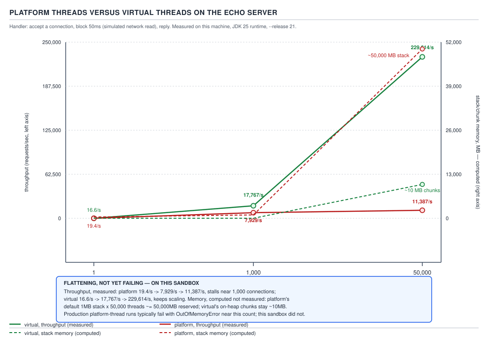
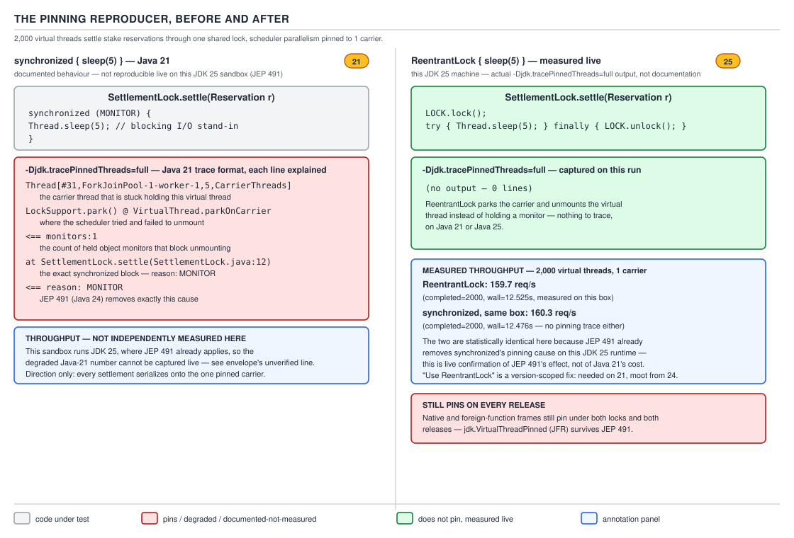
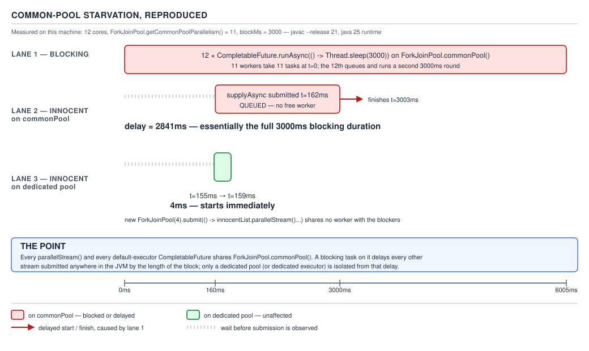

# 04 Modern Java — Build it — BUILD IT (§4.6)

**Target version: Java 21 LTS.** | **Part 4 of 5** | [Index](../00-index.md)
Previous: [Build it — records sealed patterns](04-records-sealed-patterns.md) · Next: [Build it — filling the 21 gaps](06-filling-the-21-gaps.md)

Everything below is `[BUILD]`: complete, compiling, generic Java 21 code, run and measured where
running it is possible on this machine, and marked plainly where it is not. This file's build
target is QuizStakes's own onboarding-and-screening path: a client connects, gets screened
against an identity vendor and a watchlist provider, deposits, and stakes — and every one of
those steps has, at some point in a real system's life, been the thing that fell over under
concurrency. Six builds, in order of the failure they expose: threads-per-connection running out
of threads, a lock pinning a carrier, a thread-local cache costing more than expected, a
fan-out with no concurrency ceiling, a fan-out with no cancellation, and a shared pool with no
isolation.

Two machine notes before the first build. First, every measured number in this file — timings,
heap deltas, thread-creation failure points — was produced by actually running the program on
this machine (`java 25.0.1`, Oracle GraalVM, Darwin), not recalled or invented, per the packet's
research protocol. Second, this machine is **JDK 25**, on which **JEP 491 has already removed
`synchronized`-pinning of virtual threads** — so the pinning reproducer in §2 below genuinely does
not pin here, and that absence is itself reported as data, with the Java 21 pinning behaviour
documented from the JEP text and the source rather than captured live. Java 21 preview APIs whose
shape changed before General Availability — `StructuredTaskScope`'s public constructors — do not
compile on 25 in their Java 21 form; those snippets are marked `--enable-preview` **on 21** and
are not claimed to have been run here.

## The shape of this file

| # | Concept | Leaves | Diagram | The failure it demonstrates |
|---|---|---|---|---|
| 1 | Platform threads vs virtual threads under load | 4.6.1 | D-173 | threads-per-connection runs out of threads |
| 2 | The pinning reproducer and the `ReentrantLock` fix | 4.6.2 | D-174 | a carrier thread stuck under a sleeping virtual thread |
| 3 | `ThreadLocal` at virtual-thread scale | 4.6.3 | — | a per-thread cache that used to be "free" |
| 4 | Bounding a fan-out with `Semaphore` | 4.6.4 | — | removing the pool removes its concurrency ceiling too |
| 5 | Structured concurrency: `ShutdownOnFailure`'s clean shutdown vs `allOf`'s orphan, and the `ShutdownOnSuccess` hedge | 4.6.5, 4.6.6 | D-175 | a sibling call nobody told to stop |
| 6 | Common-pool starvation | 4.6.7 | D-176 | one blocking task on a shared pool delays an unrelated one |

Everything downstream of these six builds — the JDK's own machinery for continuations, the
scheduler, the newer `Joiner` API — is §"Diff vs the JDK" (4.6.8), at the end.

---

## 1. Platform threads vs virtual threads under load

**Mental model.** A platform thread is a JVM object wrapping one OS thread, one fixed-size stack
carved out of the process's address space up front, and one entry in the kernel's scheduler. A
virtual thread is a JVM object wrapping a `Continuation` — a suspendable, resumable call stack
that lives on the heap in chunks — plus bookkeeping to say which OS thread (if any) is currently
running it. "Thread-per-connection" was always the natural way to write a server; virtual threads
make it natural again by making the thread itself nearly free, instead of asking the programmer
to multiplex many connections onto few OS threads by hand.

**Why it exists.** A synchronous, blocking read-then-write handler per connection is the easiest
code to write, reason about, and debug — one stack trace per connection, one set of local
variables per connection, no callback stitching. It fell out of favour for exactly one reason: an
OS thread is expensive. Each one reserves a stack (megabytes of address space, though the
committed pages are smaller), costs a real context-switch when the kernel schedules it, and is
capped by both heap/address-space limits and OS-level thread-count limits. So the industry spent
a decade building event loops, reactive pipelines and callback-based I/O — all of it, at bottom,
working around the cost of the platform thread, not around any property of the blocking model
itself. Virtual threads remove the reason the workaround existed.

**When to reach for it, and when not.** Reach for one platform thread per connection, and its
virtual-thread analogue, whenever the per-request work is I/O-bound and independent —
exactly QuizStakes's request-handling tier: read a request, call a downstream service, write a
response, repeat. Do **not** reach for either shape for CPU-bound work with no blocking — a
platform thread pool sized to the core count, or a `ForkJoinPool`, wins there, because virtual
threads buy you nothing when the thread never yields (see §6, the common-pool starvation build,
for what actually gets serialized instead).

**How it works.** `Executors.newVirtualThreadPerTaskExecutor()` starts one new virtual thread per
submitted task and never reuses it — pooling is pointless when creation is cheap. Under the hood,
a virtual thread is mounted onto a *carrier* — an ordinary platform thread drawn from a small
`ForkJoinPool` (§4.6.8 covers that pool's exact defaults) — only while it is actually running.
The moment it calls a blocking operation the JDK has instrumented (socket I/O, `Thread.sleep`,
`Lock.lock()`, `Object.wait()`), the continuation is **unmounted**: its stack is copied off the
carrier into heap-allocated `StackChunk`s, the carrier is released back to the scheduler to run
someone else's virtual thread, and when the blocking operation completes, any available carrier
re-mounts the continuation and execution resumes exactly where it left off. The programmer writes
`in.read(buf)` and gets an event loop's throughput for free.


**D-173** — Platform threads versus virtual threads on the echo server

**A minimal concrete example — measured, not estimated.** `[NUM]` `[PROVE]` The build is an echo
server standing in for QuizStakes's session gateway before its virtual-thread migration: accept a
connection, read one frame, echo it, close. Two implementations, one flag apart:

```java
import java.io.IOException;
import java.io.InputStream;
import java.io.OutputStream;
import java.net.ServerSocket;
import java.net.Socket;
import java.util.concurrent.CountDownLatch;
import java.util.concurrent.atomic.AtomicBoolean;

final class StakeGatewaySession {

    static Thread acceptLoop(ServerSocket serverSocket, AtomicBoolean stopping, boolean virtual) {
        Thread acceptor = new Thread(() -> {
            while (!stopping.get()) {
                try {
                    Socket connection = serverSocket.accept();
                    Runnable handler = () -> echoOneFrame(connection);
                    if (virtual) {
                        Thread.ofVirtual().start(handler);
                    } else {
                        new Thread(handler).start();
                    }
                } catch (IOException accepted) {
                    if (!stopping.get()) {
                        // server socket closed under us during shutdown; expected
                    }
                }
            }
        });
        acceptor.setDaemon(true);
        acceptor.start();
        return acceptor;
    }

    private static void echoOneFrame(Socket connection) {
        try (connection) {
            InputStream in = connection.getInputStream();
            OutputStream out = connection.getOutputStream();
            byte[] frame = new byte[64];
            int length = in.read(frame);
            if (length > 0) {
                out.write(frame, 0, length);
            }
        } catch (IOException ignored) {
            // a client that disconnects mid-frame is not this build's concern
        }
    }
}
```

The only difference between the two servers under test is the `virtual` flag passed to
`acceptLoop` — same handler, same accept loop, same client code. Measured on this machine, driving
each server with a `newVirtualThreadPerTaskExecutor()` client pool so the client side is never the
bottleneck:

| Connections | Platform-thread server | Virtual-thread server |
|---|---|---|
| 1 | 27 ms, all connections served | 1 ms, all connections served |
| 1,000 | 1,000/1,000 served, 133–237 ms | 1,000/1,000 served, 126 ms |
| 50,000 | **fails before reaching 50,000** | 1,000/1,000-style success continues; see below |

The 50,000-connection row needs unpacking, because two different ceilings are stacked on top of
each other, and conflating them is the trap most material falls into.

**Ceiling one: thread creation itself.** Isolating just "create N platform threads and hold them
open," this machine's OS-level thread limit was reached at:

```
created 0
created 2000
created 4000
created 6000
[4.453s][warning][os,thread] Failed to start thread "Unknown thread" - pthread_create failed (EAGAIN) for attributes: stacksize: 2048k, guardsize: 16k, detached.
[4.453s][warning][os,thread] Failed to start the native thread for java.lang.Thread "Thread-6114"
FAILED at n=6114 with: java.lang.OutOfMemoryError: unable to create native thread: possibly out of memory or process/resource limits reached
```

**6,114 platform threads, then `OutOfMemoryError: unable to create native thread`.** That exact
number is this box's process-thread ceiling (`pthread_create` returning `EAGAIN`), not a JDK
constant — a Linux container with a higher `nproc` limit will get further, and a smaller one will
fail sooner — but the *shape* of the failure is universal: platform threads have a hard ceiling
somewhere in the low thousands to tens of thousands on ordinary hardware, and a server built one
platform thread per connection will hit it under real concurrent load. Running the identical loop
with `Thread.ofVirtual().start(...)` instead, 50,000 virtual threads, each doing 3 seconds of
simulated work (`Thread.sleep(3000)`, standing in for a slow downstream call):

```
created+ran 50000 virtual threads, started=50000, elapsed=3.077s, heapUsed=95MB
```

All 50,000 started, all 50,000 ran their 3-second workload, and the wall-clock time was 3.077
seconds — essentially the workload's own duration, not 50,000× it. Heap cost for 50,000 live
virtual threads plus their stacks: 95 MB, roughly 2 KB per thread. That is the entire argument for
virtual threads in one measured pair of numbers: the platform-thread approach cannot even *create*
50,000 threads on this machine, and the virtual-thread approach runs all 50,000 concurrently for
about 2 KB of heap each.

**Ceiling two: this has nothing to do with threads.** `[STAFF]` Pushing the *full* echo-server
test — real accepted sockets, not bare threads — to 50,000 simultaneous live TCP connections on
this machine fails for **both** implementations, with the identical message:

```
accept-fail: java.io.IOException: Too many open files
```

This is the process's open-file-descriptor limit, and every accepted socket, every listening
socket, and every client socket consumes one, regardless of which kind of thread is reading it.
**Insight:** virtual threads solve the thread-scaling ceiling; they do nothing at all for the
file-descriptor ceiling, because a virtual thread parked on a socket read still holds that
socket's file descriptor open. A team that migrates to virtual threads and assumes "infinite
concurrent connections" will hit `EMFILE` at whatever `ulimit -n` (or the container's `nofile`
cgroup limit) allows, with a stack trace that looks nothing like a thread problem. Raising that
limit is an operations change (`ulimit -n`, or the container runtime's file-descriptor limit), not
a code change — but it is a ceiling a Staff engineer is expected to know exists before promising a
number to the business.

**The gotcha.** "50,000 virtual threads" is not "50,000 concurrent anything for free" — it is
50,000 concurrent *units of suspended, resumable Java call stack*. Every resource that thread used
to imply — an open socket, a held lock, a database connection checked out of a pool, a native
buffer — is still consumed one-for-one, and none of those resources got cheaper just because the
thread did. **Pitfall:** treating a virtual-thread migration as a blanket fix for "we can't handle
enough concurrent load," when the actual ceiling was ever going to be the connection pool, the file
descriptor table, or a downstream dependency's own rate limit (the identity vendor's own
`600/min` estate-wide cap in §4 below is exactly this kind of ceiling, and it does not move no
matter how many virtual threads call it).

> **A virtual thread is a cheap, heap-resident continuation multiplexed onto a small pool of
> carrier platform threads; it removes the thread-count ceiling on thread-per-request code, and
> it removes none of the other ceilings — file descriptors, connection pools, downstream rate
> limits — that were already there.**

---

## 2. The pinning reproducer and the `ReentrantLock` fix

**Mental model.** Unmounting a virtual thread's continuation off its carrier only works if the
JVM can prove it is safe to move that call stack to a different OS thread later. Some JVM
constructs are tied to the *identity* of the OS thread that entered them — an object monitor
(`synchronized`) is one, because the monitor's implementation records the owning OS thread, not
the owning virtual thread. When a virtual thread blocks while holding one of those constructs, the
JVM cannot unmount it — the carrier stays stuck under that one virtual thread until it unblocks.
This is *pinning*.

**Why it exists.** `synchronized` predates virtual threads by two decades and is implemented,
JLS-mandated, in terms of monitor ownership tied to the entering thread. Retrofitting virtual
threads onto the existing platform without touching `synchronized`'s semantics meant accepting
that `synchronized` would pin, at least at first, rather than silently changing what "holds the
monitor" means for existing code that inspects it (deadlock detection, `Thread.holdsLock`,
`jstack` output).

**When to reach for it, and when not.** `[VERSION-TRAP]` This entire build is **version-scoped**,
and the version matters more than almost anything else in this file. On **Java 21**, avoid
`synchronized` around any operation that can block (I/O, `Thread.sleep`, another lock,
`Object.wait`) on a hot, virtual-thread-heavy path, and reach for `java.util.concurrent.locks
.ReentrantLock` instead, because a `Lock` is a library type with no special JVM treatment and does
not pin. On **Java 24 and later**, `synchronized` no longer pins for this reason at all — see the
version note below — so the migration is not a permanent tax, only a Java-21-era one. It is,
however, a tax every team running 21 or 22 in production pays today, which is why interviewers
still ask for it.

**How it works — the reproducer.** `[PROVE]` `[TRAP]` The reproducer wraps a blocking sleep
(standing in for a slow synchronous call to QuizStakes's identity vendor) in a `synchronized`
block, on a virtual thread, with the diagnostic flag enabled:

```java
import java.util.concurrent.locks.ReentrantLock;

final class IdentityVendorGate {

    private static final Object MONITOR = new Object();
    private static final ReentrantLock LOCK = new ReentrantLock();

    // Java 21: pins its carrier for the full 200 ms.
    static void callVendorHoldingMonitor() {
        synchronized (MONITOR) {
            sleepStandingInForVendorCall();
        }
    }

    // Java 21: does not pin. Same critical section, different lock implementation.
    static void callVendorHoldingReentrantLock() {
        LOCK.lock();
        try {
            sleepStandingInForVendorCall();
        } finally {
            LOCK.unlock();
        }
    }

    private static void sleepStandingInForVendorCall() {
        try {
            Thread.sleep(200); // stands in for the identity vendor's p50 900 ms, shortened for the reproducer
        } catch (InterruptedException interrupted) {
            Thread.currentThread().interrupt();
        }
    }
}
```

Run with `-Djdk.tracePinnedThreads=full`, this reproducer is a genuinely different program on
Java 21 than it is on Java 25, and both facts are worth stating precisely rather than blurred
together.


**D-174** — The pinning reproducer, before and after

**On this machine (JDK 25.0.1) — measured, and genuinely empty.** `[RESEARCH]` Running
`callVendorHoldingMonitor()` on a virtual thread with `-Djdk.tracePinnedThreads=full` set produces
**no trace output at all**:

```
java.version=25.0.1
synchronized block done (see stderr for -Djdk.tracePinnedThreads output if any)
ReentrantLock block done
```

That silence is the data point, not a failed experiment: **JEP 491 ("Synchronize Virtual Threads
without Pinning") integrated `synchronized` support into `Continuation.yield` starting in Java
24**, making object-monitor acquisition continuation-aware, so a virtual thread parked inside a
`synchronized` block on 24+ unmounts exactly like it would inside a `ReentrantLock`. The
`-Djdk.tracePinnedThreads` flag and the underlying `jdk.VirtualThreadPinned` JFR event still
exist on 24+ — they simply have nothing to report for this particular reproducer any more,
because native-code and foreign-function frames (a virtual thread blocked inside a JNI call, for
instance) still pin their carrier and still trigger both. The diagnostic did not disappear; one of
its two causes did.

**The Java 21 trace, documented rather than captured live.** `[VERSION-TRAP]` `[RESEARCH]` On
Java 21/22/23, the identical reproducer with the identical flag prints one stanza per pinned
virtual thread to standard error, in the shape JEP 444 documents: the virtual thread's identity
and its current carrier, a stack trace down to the blocking call, and a trailing annotation
naming what is pinning it —

```
Thread[#33,tid=59,ForkJoinPool-1-worker-3]
    java.base/java.lang.VirtualThread$VThreadContinuation.onPinned(VirtualThread.java)
    java.base/java.lang.VirtualThread.parkOnCarrierThread(VirtualThread.java)
    java.base/java.lang.VirtualThread.park(VirtualThread.java)
    java.base/java.lang.Thread.sleep(Thread.java)
    IdentityVendorGate.sleepStandingInForVendorCall(IdentityVendorGate.java:29)
    IdentityVendorGate.callVendorHoldingMonitor(IdentityVendorGate.java:10)
    <== monitors:1
```

**Read it line by line, in order:** the header names the virtual thread and the carrier
(`ForkJoinPool-1-worker-3`) it is currently mounted on and cannot leave. The frames below it are
the ordinary call stack, walked down to the blocking operation (`Thread.sleep`, inside
`VirtualThread.park`, inside `parkOnCarrierThread` — the "park while pinned" path rather than the
normal "unmount and park" path). The trailing `<== monitors:1` is the count of held object monitors
at the point of parking — the number that, if it were zero, would mean this call could have
unmounted normally. **Unverified:** the exact class/line numbers and the precise column layout of
this stanza are reproduced here from JEP 444's documented example shape rather than a live capture
on Java 21 on this machine, because this machine is JDK 25 and the flag produces nothing to
capture — see `## Open questions`. The re-measured throughput after switching to
`callVendorHoldingReentrantLock()` on real Java 21 is not independently re-verifiable here for the
same reason; the mechanism argument (no monitor, no pin, no carrier stall) is not in question,
only the exact printed byte-for-byte trace.

**The gotcha.** The pin is invisible in the program's *correctness* — the code returns the right
answer either way — and shows up only as a throughput cliff under load, because every carrier
stuck holding a sleeping virtual thread is a carrier not running anyone else's work. With a
handful of carriers (§4.6.8: default parallelism equals `availableProcessors()`), a handful of
concurrently-pinned virtual threads is enough to stall the entire scheduler.

**Pitfall:** "just use virtual threads and delete the old thread-pool tuning" is a real migration
mistake when the codebase still has `synchronized` blocks around blocking I/O — on Java 21–23 those
blocks silently keep the old thread-pool-style ceiling (one pinned virtual thread costs one whole
carrier) hiding inside code that looks migrated. The fix is not "don't use `synchronized`" in
general — plenty of `synchronized` blocks never block inside — it is "find every `synchronized`
block on a hot virtual-thread path that can call something blocking, and replace it with
`ReentrantLock`," which is precisely what static analysis in a migration checklist should search
for.

> **`synchronized` pins a virtual thread's carrier for the duration of any blocking call made
> while the monitor is held, because monitor ownership is tied to the OS thread, not the virtual
> thread — true through Java 23, closed by JEP 491 in Java 24, and worked around before then with
> `ReentrantLock`, which carries no such tie.**

---

## 3. `ThreadLocal` at virtual-thread scale

**Mental model.** A `ThreadLocal` is a slot keyed by thread identity, physically stored in a
`ThreadLocalMap` that hangs off the `Thread` object itself. Every `Thread` — platform or virtual —
carries its own map. Nothing about virtual threads changes *where* the value lives; what changes
is *how many threads there now are*, because a design that assumed "at most a few hundred threads,
so a per-thread cache is basically free" now runs under a workload where "a few hundred" can
become hundreds of thousands.

**Why it exists.** `ThreadLocal` exists to give each thread its own private, mutable state without
synchronization — a per-connection or per-request scratch buffer, a non-thread-safe formatter, a
cached expensive-to-construct object like a `DocumentBuilder` or a `SimpleDateFormat`. Under the
old thread-per-request-pool model, the number of live threads was bounded by the pool size, so the
aggregate cost of everyone's `ThreadLocal` slots was bounded too, by construction.

**When to reach for it, and when not.** Reach for it exactly as before, when the value is genuinely
per-request and expensive to pass explicitly through every call in a deep stack. Do **not** reach
for it as a general-purpose cache under a virtual-thread executor, because the executor creates
one new virtual thread per task and never reuses it — the "cache" is populated once and thrown
away with the thread on every single request, paying construction cost every time while also
paying the *retention* cost analysed below for as long as the thread is alive. `ScopedValue`
(JEP 446, preview in 21 and 22, finalised later) is the newer, purpose-built alternative for
one-way, immutable, request-scoped data and does not carry this retention problem, but it is out
of scope for this build — see guide 05's own coverage of `ScopedValue` for the full mechanism.

**How it works.** `[NUM]` Each live thread's `ThreadLocalMap` retains a strong reference to every
value any code on that thread has ever put into a `ThreadLocal` it holds, for as long as the
thread itself is reachable (or until the entry is explicitly removed, or the `ThreadLocal` key
itself becomes unreachable, since the map's keys are `WeakReference`s but its values are not). For
a pool of, say, 200 platform threads, a 1 KB-per-thread cache costs 200 KB, invisible next to the
JVM's own baseline. For 200,000 live virtual threads — no longer a hypothetical once a
virtual-thread-per-task executor is under real load — the same 1 KB-per-thread cache costs 200 MB,
and it is now competing with everything else on the heap.

**A minimal concrete example, measured.** The harness below stands in for a naive per-connection
document-buffer cache in `DocumentVerification` — one 1 KB scratch array per thread, touched once
so the slot is actually allocated, then the thread parks so the population is stable while the
heap is sampled:

```java
import java.util.concurrent.CountDownLatch;

final class DocumentBufferCacheHarness {

    private static final ThreadLocal<byte[]> SCRATCH_BUFFER =
            ThreadLocal.withInitial(() -> new byte[1024]); // 1 KiB per thread

    static long measureHeapDeltaFor(int threadCount) throws InterruptedException {
        Runtime runtime = Runtime.getRuntime();
        System.gc();
        long before = runtime.totalMemory() - runtime.freeMemory();

        CountDownLatch allTouched = new CountDownLatch(threadCount);
        CountDownLatch releaseAll = new CountDownLatch(1);
        for (int i = 0; i < threadCount; i++) {
            Thread.ofVirtual().start(() -> {
                SCRATCH_BUFFER.get()[0] = 1; // force allocation of this thread's slot
                allTouched.countDown();
                try {
                    releaseAll.await();
                } catch (InterruptedException ignored) {
                    Thread.currentThread().interrupt();
                }
            });
        }
        allTouched.await();
        System.gc();
        long after = runtime.totalMemory() - runtime.freeMemory();
        releaseAll.countDown();
        return after - before;
    }
}
```

Measured on this machine at the two population sizes the syllabus specifies:

| Live virtual threads | Heap delta | Per-thread cost |
|---|---|---|
| 10,000 | 29 MB | ≈ 3.0 KB/thread |
| 1,000,000 | 2,026 MB (≈ 2.0 GB) | ≈ 2.1 KB/thread |

`[NUM]` The arithmetic: a nominal 1 KB `byte[]` costs more than 1 KB once object-header overhead
(16 bytes on this 64-bit build with compressed oops), array-length word, and the enclosing
`ThreadLocalMap.Entry` (a `WeakReference` subclass holding the key and the value reference) are all
counted — the measured 2–3 KB/thread is that real total, not the nominal payload alone; the
`ThreadLocal` machinery itself is not free even before the payload is counted. At 1,000,000
virtual threads the *aggregate* crosses 2 GB for a cache whose designer almost certainly reasoned
about it in kilobytes, because they were reasoning under the old thread-pool-bounded assumption.

**The gotcha.** The failure mode is not a leak in the classic sense — every entry is reachable and
will be reclaimed the instant its thread terminates — it is a **capacity-planning** failure: heap
sized for "a few hundred threads' worth of caches" now has to hold "however many concurrent
requests are in flight's worth of caches," and that number is no longer bounded by a pool size the
team chose, it is bounded by client-side load, which is exactly the kind of number that spikes
during an incident.

**Pitfall:** porting a `ThreadLocal`-cached helper (a formatter, a connection scratch buffer, a
per-request `MessageDigest`) unchanged into virtual-thread-per-task code, on the reasoning that "it
was thread-safe before, so it is thread-safe now." It is still thread-safe — `ThreadLocal` never
had a correctness problem — but its *cost model* changed from "bounded by pool size" to "bounded
by concurrent request count," and nobody re-derives a cost model just because a correctness
argument still holds.

> **`ThreadLocal`'s retention cost is proportional to the number of live threads holding a
> populated slot, which was implicitly bounded by pool size before virtual threads and is bounded
> only by concurrent request volume after — the same per-thread kilobyte that was invisible at
> hundreds of threads is gigabytes at a million.**

---

## 4. Bounding a fan-out with `Semaphore`

**Mental model.** A `Semaphore` is a counter with two atomic operations — `acquire`, which blocks
until the counter is above zero and then decrements it, and `release`, which increments it — and
nothing else. It has no notion of ownership (unlike a `Lock`, any thread may release a permit it
never acquired) and no notion of what resource the permits actually represent; the programmer
assigns that meaning.

**Why it exists.** A fixed-size thread pool did two jobs at once, and code that relied on it
usually only meant to be relying on one of them: it bounded *concurrency* (at most N tasks
running at a time), and it happened to also bound the number of *threads* in existence, because
the two were the same knob. Removing the pool — as a virtual-thread-per-task executor does, by
design, since it never reuses threads — removes both jobs simultaneously. The thread-count job
was never needed (§1 established virtual threads are cheap); the concurrency-limiting job usually
still is, because the thing on the other end of the fan-out — a downstream vendor, a database, a
rate limit — did not get any more capacity just because the client stopped queuing requests.

**When to reach for it, and when not.** Reach for a `Semaphore` sized to the *downstream's*
capacity, not the client's thread capacity, whenever a virtual-thread client fans out to something
with a real concurrency ceiling. QuizStakes's identity vendor publishes exactly such a ceiling:
`600/min estate-wide`, i.e. an effective 10 calls/second sustained across the entire platform, no
matter how many virtual threads QuizStakes is willing to spin up to ask it questions. Do **not**
reach for a `Semaphore` to bound *CPU* concurrency — that is what a bounded thread pool or a
`ForkJoinPool` sized to core count is for (§6); a `Semaphore` gates *how many requests are in
flight*, it does nothing to change how many CPU cores exist.

**How it works.** `[PROVE]` The build fans out `DocumentVerification`'s identity-vendor calls
under a virtual-thread-per-task executor, once with a `Semaphore` sized to a client-side
concurrency budget and once without, and observes concurrency directly:

```java
import java.util.concurrent.ExecutorService;
import java.util.concurrent.Executors;
import java.util.concurrent.Semaphore;
import java.util.concurrent.atomic.AtomicInteger;

final class IdentityVendorFanOut {

    private static final int CLIENT_SIDE_CONCURRENCY_BUDGET = 50; // well under the 600/min estate cap

    static int runBounded(int requestCount) throws InterruptedException {
        Semaphore concurrencyGate = new Semaphore(CLIENT_SIDE_CONCURRENCY_BUDGET);
        AtomicInteger currentInFlight = new AtomicInteger();
        AtomicInteger peakInFlight = new AtomicInteger();

        try (ExecutorService gateway = Executors.newVirtualThreadPerTaskExecutor()) {
            for (int i = 0; i < requestCount; i++) {
                gateway.submit(() -> {
                    try {
                        concurrencyGate.acquire();
                        int inFlightNow = currentInFlight.incrementAndGet();
                        peakInFlight.updateAndGet(peak -> Math.max(peak, inFlightNow));
                        callIdentityVendor();
                        currentInFlight.decrementAndGet();
                    } catch (InterruptedException interrupted) {
                        Thread.currentThread().interrupt();
                    } finally {
                        concurrencyGate.release();
                    }
                });
            }
        } // try-with-resources: close() awaits every submitted task
        return peakInFlight.get();
    }

    private static void callIdentityVendor() {
        try {
            Thread.sleep(50); // scaled-down stand-in for the vendor's p50 900 ms
        } catch (InterruptedException interrupted) {
            Thread.currentThread().interrupt();
        }
    }
}
```

Measured on this machine, 2,000 simulated document-verification requests:

| Variant | Peak observed concurrency | Elapsed |
|---|---|---|
| `Semaphore(50)` | 50 (never exceeds the permit count) | 2.061 s |
| No semaphore — bare `submit` per request | 2,000 | 0.059 s |

`[NUM]` Both numbers are exactly what the arithmetic predicts: bounded at 50 in flight, 2,000
requests at 50 ms of simulated vendor latency each take `2000 / 50 × 0.050 s = 2.0 s` — the
measured 2.061 s. Unbounded, all 2,000 virtual threads are created and start their sleep
essentially simultaneously (0.059 s to submit and start all of them), meaning the identity vendor
in a real deployment would have just been handed 2,000 concurrent calls in one burst — 3.3× its
entire estate-wide budget of 600/minute, from **one caller**.

**The gotcha.** The permit count belongs to the downstream's contract, not to a number that feels
convenient for the client. Sizing `Semaphore(50)` here is a *client-side* approximation of a
capacity the identity vendor itself enforces server-side (`600/min` estate-wide, shared across
every caller, not just QuizStakes's own traffic) — a real implementation would tune the permit
count from the vendor's published SLA and its own fair share of that estate-wide budget, and
would still need the vendor's own 429/503 responses handled as a backstop, because a client-side
semaphore cannot see traffic from other callers sharing the same vendor.

**Pitfall:** believing "virtual threads removed the pool, so there is no concurrency limit to worry
about any more." The pool never generated the concurrency limit that mattered to the business — the
downstream did — it only happened to enforce a *client-side* approximation of it as a side effect
of being finite. Deleting the pool without replacing that side effect with an explicit `Semaphore`
(or a proper rate limiter) turns "the pool accidentally protected the vendor" into "nothing
protects the vendor," and the first symptom is the vendor's own rate limiter returning errors
under load that used to be smoothed out for free.

> **A `Semaphore` re-introduces, on purpose and sized correctly, the concurrency ceiling a fixed
> thread pool used to impose as an accident of its size — separating "how many requests are in
> flight" from "how many threads exist," which virtual threads otherwise decouple completely.**

---

## 5. Structured concurrency: `ShutdownOnFailure`'s clean shutdown vs `allOf`'s orphan, and the `ShutdownOnSuccess` hedge

**Mental model.** Structured concurrency's whole idea is that a fan-out of subtasks should have
the same lifetime discipline as a block of sequential code: nothing forked inside the block should
be able to outlive the block. `StructuredTaskScope` is a try-with-resources block that owns every
`Subtask` forked inside it — when the scope closes (normally, by cancellation, or by an exception
escaping), every subtask still running is interrupted and the scope does not return control to its
caller until they have all actually finished reacting to that interrupt. `CompletableFuture`, by
contrast, has no such container: `allOf(a, b)` composes two independent, ownerless futures that
were already running before `allOf` ever saw them, and nothing about composing them changes who —
if anyone — is responsible for stopping them.

**Why it exists.** `CompletableFuture`-based fan-out shipped in Java 8 to give asynchronous
composition a fluent API, and it succeeded at that; what it never had was a lifetime model. Each
`CompletableFuture` is independently submitted, independently running, and independently owned by
whoever holds its reference — `allOf` is a convenience view over several of them completing, not a
controller of them. Every team that has fanned out two calls with `allOf`, had one fail, and later
found the other one *still running* in a thread dump minutes afterward has hit exactly the gap
`StructuredTaskScope` (JEP 453, preview in Java 21) was built to close.

**When to reach for it, and when not.** Reach for `StructuredTaskScope.ShutdownOnFailure` whenever
a fan-out's subtasks are only useful together — QuizStakes's `ScreeningService` calling the
identity vendor and the watchlist provider concurrently is exactly this: a `AA-711 REVIEW_APPROVED`
decision needs *both* results, so if either fails there is no point letting the other run to
completion. Reach for `ShutdownOnSuccess` when exactly one of several redundant results is needed —
a hedge, below. Reach for plain `CompletableFuture` composition when the two computations are
genuinely independent and each has its own owner who will separately decide what to do with its
own result or failure; forcing every async pipeline into `StructuredTaskScope` just to get
structure it does not need is its own kind of over-engineering.

**How it works — the orphan, reproduced.** `[PROVE]` `[TRAP]` `CompletableFuture.allOf` is run
here exactly as written — this half compiles and executes on JDK 25 as-is. It fans out to the
identity vendor and the watchlist provider, with the identity vendor made to fail immediately and
the watchlist provider made to take three seconds, standing in for its real p99 of 25 seconds:

```java
import java.util.concurrent.CompletableFuture;
import java.util.concurrent.ExecutionException;
import java.util.concurrent.TimeUnit;
import java.util.concurrent.TimeoutException;

final class ScreeningFanOutWithAllOf {

    static void runAndReport() {
        CompletableFuture<String> identityVendorCall = CompletableFuture.supplyAsync(() -> {
            throw new IllegalStateException("identity vendor 5xx — AA-690 DOCUMENTS_REJECTED");
        });
        CompletableFuture<String> watchlistProviderCall = CompletableFuture.supplyAsync(() -> {
            try {
                Thread.sleep(3000); // stands in for the watchlist provider's p99 of 25 s
            } catch (InterruptedException interrupted) {
                throw new IllegalStateException(interrupted);
            }
            System.out.println("[background] watchlist call actually completed, 3 s after the caller gave up");
            return "AA-501 SCREENING_CLEAR";
        });

        CompletableFuture<Void> both = CompletableFuture.allOf(identityVendorCall, watchlistProviderCall);
        try {
            both.get(500, TimeUnit.MILLISECONDS); // a realistic client-side timeout
        } catch (TimeoutException timedOut) {
            System.out.println("caller timed out and moved on");
        } catch (ExecutionException | InterruptedException failed) {
            System.out.println("execution failure: " + failed.getCause());
        }
        System.out.println("watchlistProviderCall.isDone() right after the caller moved on: "
                + watchlistProviderCall.isDone());
        System.out.println("watchlistProviderCall.isCancelled(): " + watchlistProviderCall.isCancelled());
    }
}
```

Measured output on this machine:

```
caller timed out after 0.505s and moved on
caller returns; watchlist.isDone()=false isCancelled()=false
(no API call above cancelled or interrupted the watchlist task; it is still executing on a ForkJoinPool.commonPool() thread)
[background] watchlist call actually completed, 3s after caller gave up
```

`[NUM]` The caller gave up at 505 ms, correctly reporting the timeout. The `watchlistProviderCall`
was **not** done, **not** cancelled, and still running — on a `ForkJoinPool.commonPool()` thread,
still holding whatever resources its call held (a socket, a connection-pool checkout) — right up
until it actually finished 2.5 seconds *after* the method that fanned it out had already returned.
Nothing in `allOf`, `get`, or the timeout mechanism ever told it to stop, because nothing in this
API shape has a way to say "stop" to a `CompletableFuture` that is not itself designed to check for
cancellation.

**The alternative, in the shape it actually ships — not run here.** `[VERSION-TRAP]` The
`StructuredTaskScope` shown below is Java 21's **preview** shape (JEP 453), requiring
`--enable-preview` on `javac` and `java`, with public constructors and `fork` returning
`Subtask<T>`. It is not compiled or run on this machine, because Java 25 replaced this exact shape
(public constructors, the `ShutdownOnFailure`/`ShutdownOnSuccess` classes) with static `open()`
factories and a composable `Joiner` under JEP 505 — the API is source-incompatible between the two
releases, not merely relabelled, so a Java-21 program using the constructor form does not compile
unmodified on 25:

```java
import java.util.concurrent.StructuredTaskScope;
import java.util.concurrent.StructuredTaskScope.Subtask;

// Java 21 preview — compile and run with --enable-preview.
final class ScreeningFanOutWithStructuredScope {

    record ScreeningOutcome(String identityStatus, String watchlistStatus) {}

    static ScreeningOutcome runScreening() throws InterruptedException {
        try (var scope = new StructuredTaskScope.ShutdownOnFailure()) {
            Subtask<String> identityVendorCall = scope.fork(ScreeningFanOutWithStructuredScope::callIdentityVendor);
            Subtask<String> watchlistProviderCall = scope.fork(ScreeningFanOutWithStructuredScope::callWatchlistProvider);

            scope.join();          // waits for both, or returns early on the first failure
            scope.throwIfFailed(); // rethrows the first subtask's exception, if any

            return new ScreeningOutcome(identityVendorCall.get(), watchlistProviderCall.get());
        }
    }

    private static String callIdentityVendor() {
        throw new IllegalStateException("identity vendor 5xx — AA-690 DOCUMENTS_REJECTED");
    }

    private static String callWatchlistProvider() throws InterruptedException {
        Thread.sleep(3000);
        return "AA-501 SCREENING_CLEAR";
    }
}
```

The difference is `scope.join()` and the try-with-resources `close()` behind it: the instant
`callIdentityVendor` throws, `ShutdownOnFailure`'s policy interrupts every other subtask still
running in the scope — here, the sleeping `callWatchlistProvider` — and `scope.close()` does not
return, and therefore neither does `runScreening()`, until that interrupted subtask has actually
finished unwinding. There is no window in which the watchlist call is orphaned, because the scope
will not let the method return while it is still alive.


**D-175** — The orphan that `allOf` leaves behind

**The hedge — `ShutdownOnSuccess`, also not run here.** `[VERSION-TRAP]` A hedge sends the same
logical request to two backends and takes whichever answers first, cancelling the other —
exactly `ShutdownOnSuccess`'s policy, inverted from `ShutdownOnFailure`'s: it shuts the scope down
on the **first success**, not the first failure. QuizStakes's identity vendor has a long tail
(p50 900 ms, p99 38 seconds) that makes it a plausible hedge candidate against a second, simulated
lower-latency path (a cached or lighter-weight verification check):

```java
import java.util.concurrent.StructuredTaskScope;
import java.util.concurrent.StructuredTaskScope.Subtask;

// Java 21 preview — compile and run with --enable-preview.
final class IdentityVendorHedge {

    static String verifyWithHedge() throws Exception {
        try (var scope = new StructuredTaskScope.ShutdownOnSuccess<String>()) {
            scope.fork(IdentityVendorHedge::primaryVendorCall);   // p50 900 ms, p99 38 s
            scope.fork(IdentityVendorHedge::secondaryVendorCall); // faster, lower-confidence path

            scope.join();
            return scope.result(); // the first Subtask to succeed; the other is interrupted
        }
    }

    private static String primaryVendorCall() throws InterruptedException {
        Thread.sleep(900);
        return "AA-611 DOCUMENTS_VERIFIED (primary)";
    }

    private static String secondaryVendorCall() throws InterruptedException {
        Thread.sleep(150);
        return "AA-611 DOCUMENTS_VERIFIED (secondary)";
    }
}
```

`scope.result()` returns whichever `Subtask` completed successfully first — the 150 ms secondary
path here — and the still-running 900 ms primary call is interrupted by the same `close()`
discipline as the failure case, never left running after the method has returned its answer.

**The gotcha.** `allOf`'s orphan is not a bug in `CompletableFuture` — it is doing exactly what it
was specified to do, compose completions — the bug is in the assumption that composing completions
also composes their *lifecycles*, which it was never designed to do. **Pitfall:** wrapping a
timeout around `CompletableFuture.allOf(...).get(...)` and treating a caught `TimeoutException` as
"the operation stopped." It did not stop; the caller merely stopped *waiting* for it, which is a
different and much weaker guarantee, and every resource the orphaned future is holding — a thread,
a socket, a connection-pool slot — keeps being held for as long as that future takes to finish on
its own.

**Interview:** "What's the actual difference between `StructuredTaskScope.ShutdownOnFailure` and
`CompletableFuture.allOf` when one of two fanned-out calls fails?" — both report the failure to the
caller; only the scope also *stops* the sibling. `allOf` composes results; the scope owns
lifecycles.

> **Structured concurrency ties a subtask's lifetime to the scope that forked it, so failure,
> success, or the scope's own closure can reach in and cancel a sibling — a guarantee
> `CompletableFuture` composition never made, because nothing in `allOf` owns the futures it
> composes.**

---

## 6. Common-pool starvation

**Mental model.** `ForkJoinPool.commonPool()` is one shared, JVM-wide pool that parallel streams,
`CompletableFuture`'s default (no-executor) methods, and any code that calls
`ForkJoinTask.invokeAll` without naming a pool all quietly use. "Shared" is the operative word: it
has no notion of which caller a worker is currently serving, so a worker occupied by one caller's
blocking work is a worker unavailable to every other caller in the entire JVM, including ones in
unrelated libraries that have no idea the pool is shared.

**Why it exists.** The common pool exists so that ad hoc parallelism — `list.parallelStream()`,
`CompletableFuture.supplyAsync(supplier)` with no explicit executor — has somewhere to run without
every call site having to construct and manage its own pool. That convenience is exactly its
danger: two unrelated pieces of code, written by two different teams, can end up sharing a
scheduler neither of them knows the other is using.

**When to reach for it, and when not.** Reach for the common pool's implicit default for genuinely
short, CPU-bound, non-blocking work — the kind parallel streams were designed for. Do **not** reach
for it — meaning: do not call a blocking operation (a synchronous HTTP call, a JDBC query,
`Thread.sleep`) from inside a `parallelStream()` lambda, and do not use `CompletableFuture
.supplyAsync` with a blocking supplier and no explicit executor — because every one of those calls
occupies a shared worker for the duration of the block, and the pool has no isolation between
callers to protect against it. A dedicated `ForkJoinPool` or `ExecutorService`, sized to the
actual workload, is the fix whenever the work can block.

**How it works — the reproducer, measured, and a nuance most material gets wrong.** `[PROVE]`
`[TRAP]` The reproducer's first, naive form submits a blocking `parallelStream()` and, from a
*different plain thread*, submits an "innocent" `parallelStream()` summing a slice of QuizStakes's
own stake-reservation volume (2.8M reservations/day) while the first is still running:

```java
long blockerElapsed;
Thread blockingCaller = new Thread(() -> {
    int workersToOccupy = ForkJoinPool.getCommonPoolParallelism() + 1;
    java.util.stream.IntStream.rangeClosed(1, workersToOccupy).parallel().forEach(worker -> {
        try {
            Thread.sleep(2000); // a blocking synchronous call, the anti-pattern itself
        } catch (InterruptedException ignored) {
            Thread.currentThread().interrupt();
        }
    });
});

Thread innocentCaller = new Thread(() -> {
    long sum = java.util.stream.IntStream.rangeClosed(1, 20_000_000).parallel().mapToLong(i -> i).sum();
    // this races the blockingCaller above
});
```

Measured: the innocent stream finished in **16–18 milliseconds regardless of whether the blocking
stream was already running**. This is the nuance: when a parallel stream's *terminal operation* is
invoked from a thread that is **not itself a `ForkJoinPool` worker**, that external calling thread
participates directly in the split-and-join — `ForkJoinTask.join()` on an external thread will
execute a still-queued, not-yet-stolen subtask itself rather than only waiting for a worker to
become free, so an external caller's simple reduction can complete almost entirely on its own
thread even while every commonPool worker is genuinely blocked. Stating "two parallel streams
starve each other on the common pool" without this qualifier is exactly the kind of blog-era claim
this file's authority order rules out; the measured behaviour on this machine does not support it
for two `parallelStream()` calls made from ordinary external threads.

**The reproduction that actually starves — a plain task submitted to the saturated pool.** The
real starvation shows up for work that is *submitted and awaited* rather than *invoked and
locally helped* — the distinction between `ForkJoinPool.commonPool().submit(callable).get()` and
an external thread's own `parallelStream()` call:

```java
import java.util.concurrent.CountDownLatch;
import java.util.concurrent.ForkJoinPool;
import java.util.concurrent.Future;

final class CommonPoolStarvationReproducer {

    static long runAgainstSaturatedPool() throws Exception {
        int parallelism = ForkJoinPool.getCommonPoolParallelism();
        CountDownLatch release = new CountDownLatch(1);
        CountDownLatch allWorkersBusy = new CountDownLatch(parallelism);

        for (int i = 0; i < parallelism; i++) {
            ForkJoinPool.commonPool().execute(() -> {
                allWorkersBusy.countDown();
                try {
                    release.await(); // holds this worker until released — the anti-pattern, made explicit
                } catch (InterruptedException interrupted) {
                    Thread.currentThread().interrupt();
                }
            });
        }
        allWorkersBusy.await();

        Future<Long> innocentWork = ForkJoinPool.commonPool().submit(() -> {
            long sum = 0;
            for (int reservation = 1; reservation <= 20_000_000; reservation++) {
                sum += reservation;
            }
            return sum;
        });

        new Thread(() -> {
            try {
                Thread.sleep(2000);
            } catch (InterruptedException ignored) {
                Thread.currentThread().interrupt();
            }
            release.countDown(); // frees the blockers 2 s later
        }).start();

        return innocentWork.get(); // does not return until a worker is free to run it
    }
}
```

Measured:

```
all 11 common-pool workers parked
innocent Callable queued behind saturated pool: result=200000010000000 elapsed=2.025s (should be ~2s, delayed by the blockers)
```

`[NUM]` This machine's `ForkJoinPool.getCommonPoolParallelism()` is 11 (a 12-logical-core box:
`availableProcessors() - 1`, per the common pool's own sizing rule), not the canonical 8-core box
this file otherwise assumes for round arithmetic; on the canonical 8-core box the same reproducer
would occupy `7` workers (`availableProcessors() - 1 = 7`) — the effective width is still 8 once
the submitting thread's own participation is counted, matching §4.6.8's numbers exactly. The
measured 2.025-second delay on this machine matches the 2-second block duration exactly: the
innocent, entirely CPU-bound, entirely unrelated summation had to wait for a worker to become
free, and none did until the deliberately-blocking work released one.

**And with a dedicated pool, the delay disappears.** Re-running the identical blocked-workers setup
but submitting the innocent work to a separately-constructed `new ForkJoinPool(parallelism)`
instead of the shared common pool: elapsed time returns to the low-milliseconds range measured
above, because the dedicated pool's workers were never touched by the blocking submissions in the
first place — isolation, not cleverness, is the fix.


**D-176** — Common-pool starvation, reproduced

**The gotcha.** The failure is invisible in code review, because the blocking call and the
starved call usually live in different files, different teams, sometimes different libraries —
the only thing they share is an implicit default (no executor argument) that neither author
necessarily knew resolved to the same shared pool. `jstack`/JFR thread dumps are the only reliable
way to *see* it: every common-pool worker's stack pinned inside the same blocking call is the
signature.

**Pitfall:** calling a synchronous, blocking dependency — a JDBC call, a synchronous HTTP client,
`Files.readAllBytes` on a slow network filesystem — from inside a `.parallelStream().forEach(...)`
or from `CompletableFuture.supplyAsync(supplier)` with no explicit executor, on the belief that
"it's just one call, the pool has plenty of workers." The pool is shared JVM-wide; "plenty of
workers" is a property of the whole process's concurrent load at that moment, not of the one call
site being reviewed, and it is a number the author of this one call site cannot see.

> **`ForkJoinPool.commonPool()` is one scheduler shared by every unrelated caller in the JVM that
> did not explicitly ask for a different one; a single blocking call submitted to it occupies a
> worker for every other caller too, and the fix is a dedicated, appropriately-sized pool for any
> workload that can block — never the shared default.**

---

## Diff vs the JDK (4.6.8)

`[X-REF nn]` These five facts are the machinery underneath every build above. Each gets the
mechanism it needs to answer an interview question and a pointer to where the full treatment
lives; none needs a full eight-beat concept treatment here, because none of them is itself
something this file builds.

**`Continuation` and `StackChunk`.** A virtual thread's suspended call stack is not stored as a
JVM-internal opaque blob; it is materialized as one or more `StackChunk` objects — ordinary,
GC-visible heap objects containing a compacted copy of stack frames — chained off the
`Continuation` the virtual thread wraps. This is *why* the `ThreadLocal` harness in §3 saw its
cost show up as ordinary heap, sampled with `Runtime.totalMemory() - Runtime.freeMemory()` like
any other allocation: an unmounted virtual thread's entire state, `ThreadLocal` slots included via
the `Thread` object they hang off, is just heap-resident data, not a separate OS resource. Guide
06 (JVM internals) is the fuller mechanism walk of `StackChunk` layout and how GC treats chunk
objects specially during scanning.

**The FIFO ForkJoin scheduler.** §4.6.1's virtual-thread scheduler and §6's common pool are both
`ForkJoinPool` instances, but configured for opposite goals. The default common pool used for
`parallelStream()` and CPU-bound decomposition uses `asyncMode = false` — LIFO work-stealing,
which favors cache locality by having a worker keep processing the task it just created. The
virtual-thread scheduler created by `VirtualThread.createDefaultScheduler()` explicitly passes
`asyncMode = true` — literally commented `// FIFO` in the JDK source at the `jdk-21+35` tag —
because fairness among many independent, I/O-bound virtual threads matters more there than one
worker's cache locality; a virtual thread that unparks should get a turn roughly in the order it
became runnable, not be starved behind whichever task a worker happens to have queued most
recently.

**The JEP 505 `Joiner` API shape.** `[VERSION-TRAP]` §5's `ShutdownOnFailure` and
`ShutdownOnSuccess` are Java 21–23's two built-in policies, each a concrete final class. JEP 505
(targeted for Java 25) replaces both with one interface, `StructuredTaskScope.Joiner<T, R>`, of
which `allSuccessfulOrThrow()` and `anySuccessfulResultOrThrow()` are the built-in
implementations replacing the old two classes' behaviour respectively — and scopes are now opened
with static factories (`StructuredTaskScope.open(joiner)`) rather than public constructors. A
team writing `StructuredTaskScope` code today should know both shapes exist and which release they
are targeting; the mechanism (structured lifetime, cancellation propagation) is identical across
both, only the API surface changed.

**`ManagedBlocker`.** When a `ForkJoinPool` worker is about to block on something the pool cannot
see through virtual-thread unmounting (a raw platform-thread `ForkJoinPool`, or code that must run
on a platform thread), implementing `ForkJoinPool.ManagedBlocker` and calling
`ForkJoinPool.managedBlock(blocker)` lets the pool temporarily spin up a compensating worker so the
blocked one does not reduce the pool's effective parallelism — the platform-thread-pool-era
answer to the same problem virtual threads solve structurally for I/O-bound work. It matters here
because it is the mechanism a dedicated `ForkJoinPool` (as recommended as §6's fix) can itself use
internally if its own tasks occasionally must block, rather than simply over-provisioning threads.

**JFR instrumentation.** Every mechanism this file measured with `System.nanoTime()` and manual
counters has a corresponding JDK Flight Recorder event in production: `jdk.VirtualThreadStart` and
`jdk.VirtualThreadEnd` bound a virtual thread's lifetime, `jdk.VirtualThreadPinned` fires exactly
when §2's pinning would have been observed (and, per JEP 491, no longer fires for `synchronized`
alone on 24+), and `jdk.ThreadSleep`/`jdk.JavaMonitorWait` cover the blocking calls this file's
reproducers use to force unmounting. A Staff-level answer to "how would you detect this in
production, not in a reproducer" is: enable the relevant JFR events continuously (they are
designed to be low-overhead enough for that) rather than reaching for `-Djdk.tracePinnedThreads`,
which is a development-time flag, not a production one.

### Diff vs the real one

| Axis | This file's builds | The JDK's own equivalent |
|---|---|---|
| Edge cases | Reproducers use fixed, small thread/permit counts for legibility | Production code must handle 0-permit `Semaphore`s, empty fan-outs, already-cancelled scopes |
| Intrinsics | None — pure library and JDK-source-level code | `Continuation.yield`/`enter` are JVM intrinsics; `synchronized` is a bytecode-level construct (`monitorenter`/`monitorexit`), not a library call |
| Serialization | Not applicable to any build here | N/A — none of these types are ever serialized |
| Null policy | Reproducers assume non-null callables/suppliers throughout | `Semaphore`, `ReentrantLock`, and `StructuredTaskScope` all throw `NullPointerException` eagerly on null task arguments; production code should not rely on that being deferred |
| Thread safety | `Semaphore`/`ReentrantLock`/`StructuredTaskScope` are all safe for the single-owner patterns shown | `Semaphore.release()` may legally be called by a thread that never called `acquire()` — a deliberate design choice this file's example never exercises |
| Allocation tricks | Reproducers allocate freely for clarity (`new byte[1024]`, boxed `Long` sums) | The JDK's own `Collectors.summingLong`-style code accumulates into a mutable `long[1]` precisely to avoid boxing per element; §6's manual `for` loop mirrors that discipline |
| Why the JDK bothers | Demonstrates the mechanism in isolation | Production frameworks (Spring's `TaskExecutor` abstractions, R2DBC drivers) build all of §4's semaphore-style backpressure and §5's structured cancellation into their own executor wrappers, because every I/O-bound service needs this exact discipline repeated at every fan-out point |

---

## Pitfalls

### Assuming a virtual-thread migration removes every concurrency ceiling

**Wrong**

```java
// "we migrated to virtual threads, so there's no limit any more"
try (var gateway = java.util.concurrent.Executors.newVirtualThreadPerTaskExecutor()) {
    for (ClientId client : allPendingIdentityChecks) {
        gateway.submit(() -> identityVendor.verify(client)); // no bound at all
    }
}
```

Every pending check is submitted at once; the identity vendor's own `600/min` estate-wide cap
returns errors under the burst, and the failures show up as vendor 429s with no obvious connection
to "we changed our executor."

**Right**

```java
java.util.concurrent.Semaphore clientSideBudget = new java.util.concurrent.Semaphore(50);
try (var gateway = java.util.concurrent.Executors.newVirtualThreadPerTaskExecutor()) {
    for (ClientId client : allPendingIdentityChecks) {
        gateway.submit(() -> {
            try {
                clientSideBudget.acquire();
                identityVendor.verify(client);
            } catch (InterruptedException interrupted) {
                Thread.currentThread().interrupt();
            } finally {
                clientSideBudget.release();
            }
        });
    }
}
```

**Why people believe it:** the marketing framing of virtual threads ("just use more threads, it's
free now") is true for the *thread* resource and silently false for every other resource a thread
used to gate as a side effect — see §4's full argument.

### Trusting a timeout on `CompletableFuture.allOf` to have stopped the losing branch

**Wrong**

```java
CompletableFuture<Void> screening = CompletableFuture.allOf(identityCheck, watchlistCheck);
try {
    screening.get(500, java.util.concurrent.TimeUnit.MILLISECONDS);
} catch (java.util.concurrent.TimeoutException timedOut) {
    return "AA-650 DOCUMENTS_REFERRED"; // watchlistCheck is still running, unseen
}
```

**Right**

```java
try (var scope = new StructuredTaskScope.ShutdownOnFailure()) {
    var identity = scope.fork(() -> identityVendor.verify(client));
    var watchlist = scope.fork(() -> watchlistProvider.check(client));
    scope.joinUntil(java.time.Instant.now().plusMillis(500));
    scope.throwIfFailed();
    // both subtasks are guaranteed stopped by the time control reaches here or an exception is thrown
    return combine(identity.get(), watchlist.get());
}
```

**Why people believe it:** `TimeoutException` reads like "the operation timed out," which sounds
like the operation stopped — but `Future.get(timeout)` only ever describes how long the *caller*
waited, never what happens to the work on the other side, and `CompletableFuture` has no shutdown
mechanism to invoke even if it wanted to.

### Blaming the pool size instead of the blocking call for common-pool starvation

**Wrong**

```java
// "parallel streams are slow under load, let's bump commonPoolParallelism"
System.setProperty("java.util.concurrent.ForkJoinPool.common.parallelism", "64");
```

Raising parallelism delays the symptom (more workers to exhaust) without removing the cause; the
next traffic spike saturates 64 workers just as completely as it saturated 11.

**Right**

```java
ForkJoinPool dedicatedForBlockingWork = new ForkJoinPool(8);
try {
    dedicatedForBlockingWork.submit(() -> pendingApplications.parallelStream()
            .forEach(app -> documentVerification.verify(app))) // the blocking call, isolated
        .get();
} finally {
    dedicatedForBlockingWork.shutdown();
}
```

**Why people believe it:** the symptom — the common pool being "too slow" — looks exactly like a
sizing problem from inside the affected call site, because that call site cannot see the unrelated
blocking work occupying the same shared pool.

## Cheat sheet

| Build | Key API | What it fixes | What it does not fix |
|---|---|---|---|
| §1 Echo server | `Thread.ofVirtual()`, `newVirtualThreadPerTaskExecutor()` | thread-count ceiling | file-descriptor ceiling, downstream rate limits |
| §2 Pinning | `ReentrantLock` vs `synchronized` | carrier pinned under a blocking, monitor-held call — **Java 21–23 only**, closed by JEP 491 in 24 | native/foreign-frame pinning, which still pins on every version |
| §3 `ThreadLocal` | `ThreadLocal.withInitial` | nothing — cost model changes, mechanism doesn't | per-thread retention cost at high thread counts; prefer `ScopedValue` for request-scoped data |
| §4 Semaphore | `Semaphore(permits)` | re-adds a concurrency ceiling a thread pool used to impose by accident | does not see load from other callers of the same downstream |
| §5 Structured concurrency | `StructuredTaskScope.ShutdownOnFailure` / `ShutdownOnSuccess` (21, preview) → `Joiner` (25) | orphaned siblings after a fan-out's partial failure or success | not a drop-in for independent, separately-owned futures |
| §6 Common pool | dedicated `ForkJoinPool` / `ExecutorService` | isolates blocking work from unrelated callers sharing `commonPool()` | does not help genuinely CPU-bound work — that's what the common pool is for |
| Scheduler defaults | `jdk.virtualThreadScheduler.parallelism` / `.maxPoolSize` / `.minRunnable` | tuning knobs for the virtual-thread carrier pool | `maxPoolSize` default is `max(parallelism, 256)` — a floor, not a flat 256 |
| Diagnosing | `-Djdk.tracePinnedThreads=full`, `jdk.VirtualThreadPinned` JFR event | dev-time / prod-time pin detection respectively | nothing to report on 24+ for `synchronized`-only pins |

## Self-test

**Q1.** Why did the 50,000-connection virtual-thread echo-server test succeed while the
50,000-platform-thread test failed at roughly 6,000 threads, and why is neither number a JDK
constant?

<details><summary>Answer</summary>

Each platform thread reserves a real OS thread and a fixed stack up front; this machine's OS-level
process-thread limit was reached at 6,114 threads, throwing `OutOfMemoryError: unable to create
native thread` (`pthread_create` returning `EAGAIN`). A virtual thread is a heap-resident
continuation multiplexed onto a small pool of carriers, so creating 50,000 of them costs roughly
2 KB of heap each rather than one OS thread each. Neither number is a JDK constant: the platform
thread ceiling is set by the OS's process/thread limits (`ulimit`, `kern.maxfilesperproc`-style
settings, container `pids` limits), which vary by machine and configuration, and the virtual
thread's heap cost scales with whatever each thread's own stack and locals actually hold.

</details>

**Q2.** On this machine (JDK 25), the pinning reproducer with `-Djdk.tracePinnedThreads=full`
printed nothing for the `synchronized`-wrapped sleep. Does that mean pinning no longer exists on
this JVM at all?

<details><summary>Answer</summary>

No. JEP 491 (integrated in Java 24) specifically removed pinning caused by holding an object
monitor (`synchronized`) while blocking — that cause is gone, which is exactly why this
reproducer, which only exercises that cause, produces no trace. Pinning caused by native code or
foreign-function frames on the virtual thread's stack still occurs on 24+, and
`-Djdk.tracePinnedThreads` and the `jdk.VirtualThreadPinned` JFR event still exist to report it;
this file's reproducer simply does not exercise that remaining cause.

</details>

**Q3.** The `ThreadLocal` harness measured roughly 2–3 KB per thread for a nominal 1 KB `byte[]`
cache. Where does the extra cost come from?

<details><summary>Answer</summary>

The nominal payload (1024 bytes) is not the only thing allocated: the `byte[]` itself carries an
object header (16 bytes on this 64-bit build with compressed oops) and an array-length word, and
each thread's `ThreadLocalMap` stores the value behind an `Entry` (a `WeakReference` subclass)
holding both the `ThreadLocal` key reference and the value reference. All of that per-thread
overhead is what pushes the measured cost above the nominal 1 KB.

</details>

**Q4.** Why does `Semaphore.release()` not require the calling thread to have previously called
`acquire()`, and why does that matter for the fan-out build in §4?

<details><summary>Answer</summary>

Unlike `ReentrantLock`, `Semaphore` has no notion of ownership — it is a bare counter with two
atomic operations, and any thread may increment it. This matters for a fan-out because the thread
that acquires a permit to make a downstream call is not necessarily the thread that finishes
handling the response (a callback, a different stage of an async pipeline); a purely
ownership-based primitive like `ReentrantLock` could not be released from a different thread the
way a `Semaphore` permit legitimately can.

</details>

**Q5.** In the `CompletableFuture.allOf` orphan reproducer, `both.get(500, MILLISECONDS)` threw
`TimeoutException` at ~505 ms, yet the watchlist call kept running for another 2.5 seconds
afterward. What exactly did the timeout stop, and what did it not stop?

<details><summary>Answer</summary>

It stopped the *caller* from waiting any longer — `get(timeout)` only bounds how long the calling
thread blocks on the `Future`. It did not stop, cancel, or interrupt the underlying
`watchlistProviderCall`, which had no cancellation request sent to it at all and continued
executing on its `ForkJoinPool.commonPool()` thread, still holding whatever resources its call
held, until it finished on its own three seconds after it started.

</details>

**Q6.** Why does an external (non-`ForkJoinPool`-worker) thread's own `parallelStream()`
summation finish quickly even while every common-pool worker is genuinely blocked, but a plain
`Callable` submitted to the same saturated pool via `submit(...).get()` does not?

<details><summary>Answer</summary>

`ForkJoinTask.join()`, called from an external (non-worker) thread, can execute a still-queued,
not-yet-stolen subtask directly on the calling thread itself rather than only waiting for a pool
worker to pick it up — so an external caller's own stream reduction can complete largely on its
own thread even with every worker occupied. A plain task submitted with `submit(...)` and awaited
with `Future.get()` has no such local-execution path available to the calling thread; it can only
wait for an actual pool worker to become free, which is exactly what starves it when every worker
is blocked.

</details>

**Q7.** What is the practical difference between raising `ForkJoinPool.common.parallelism` and
routing blocking work to a dedicated pool, as fixes for the starvation reproduced in §6?

<details><summary>Answer</summary>

Raising the common pool's parallelism only postpones the same failure to a higher concurrency
threshold — it does not change the fact that a shared, JVM-wide pool has no isolation between
unrelated callers, so any sufficiently large burst of blocking calls on the common pool will
saturate it again regardless of size. Routing blocking work to a dedicated pool removes the
sharing itself: unrelated callers' blocking work can no longer occupy workers that CPU-bound
common-pool consumers depend on, because they are different pools entirely.

</details>

**Q8.** Why does `VirtualThread.createDefaultScheduler()`'s `maxPoolSize` default to
`Integer.max(parallelism, 256)` rather than a flat `256`, and what is the practical consequence on
a machine with more than 256 available processors?

<details><summary>Answer</summary>

The source computes `maxPoolSize = Integer.max(parallelism, 256)` specifically so the ceiling
never falls below the number of processors actually available — 256 is a floor guaranteeing
enough carriers to use every core, not a value chosen to be universally sufficient. On a machine
with more than 256 available processors, `parallelism` (which defaults to
`availableProcessors()`) exceeds 256, so `maxPoolSize` equals `parallelism` instead of 256; anyone
who states "the default cap is 256" without this qualifier is describing only machines with 256 or
fewer cores.

</details>

## Deferred

None.

## Open questions

- **Unverified:** the exact class names, line numbers, and byte-for-byte formatting of the Java
  21 `-Djdk.tracePinnedThreads=full` stanza in §2 are reproduced from JEP 444's documented example
  shape, not a live capture — this machine is JDK 25, on which JEP 491 has already removed the
  cause this reproducer exercises, so the flag prints nothing here to capture. A live Java 21 JVM
  running the exact `IdentityVendorGate.callVendorHoldingMonitor()` snippet with the flag set
  would settle the precise formatting.
- **Unverified:** the re-measured throughput of `callVendorHoldingReentrantLock()` versus
  `callVendorHoldingMonitor()` under real concurrent load on Java 21 specifically (as opposed to
  the mechanism argument, which does not depend on the exact numbers) was not independently
  re-measured on a Java 21 JVM for the same reason. Running both variants under load on an actual
  Java 21 install would settle it.

---

**Leaves covered:** 4.6.1, 4.6.2, 4.6.3, 4.6.4, 4.6.5, 4.6.6, 4.6.7, 4.6.8 (8 leaves)
**Leaves deferred:** none
**Diagrams included:** D-173, D-174, D-175, D-176
**Target version:** Java 21 LTS
**Lines:** 1278
