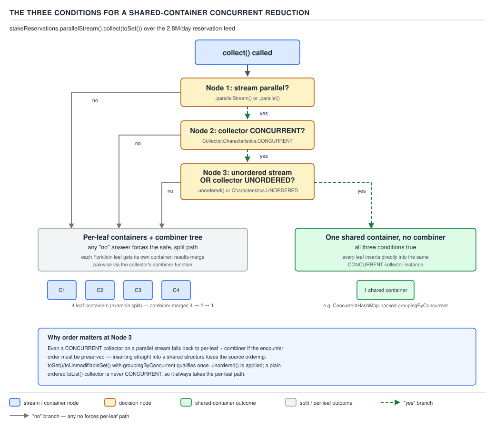

# 04 Modern Java — Collectors — BASICS (§1.10)

**Target version: Java 21 LTS.** | **Part 1 of 5** | [Index](../00-index.md)
Previous: [Collectors — basics a](01-basics-a.md) · Next: [Collectors — in anger](02-in-anger.md)

---

## `groupingBy`'s three overloads and what each really returns

### Mental model first

`groupingBy` is not "group things into buckets" in the abstract — it is a
**two-stage pipeline compressed into one call**: a classifier function decides
which bucket an element goes to, and a *downstream collector* decides what
happens to the elements once they land in that bucket. The one-argument form is
the two-argument form with the downstream silently defaulted to `toList()`, and
the two-argument form is the three-argument form with the map factory silently
defaulted to `HashMap::new`. There is exactly one mechanism underneath all
three; the overloads only pre-fill arguments you would otherwise have had to
write yourself.

### Why it exists

Before `groupingBy`, grouping card deposits by rail meant hand-rolling the
accumulation: create a `Map<Rail, List<Deposit>>`, iterate, call
`computeIfAbsent(rail, r -> new ArrayList<>()).add(deposit)`. That is four moving
parts (the map, the default-list supplier, the lookup, the add) that every
caller re-derived slightly differently — some used `getOrDefault` plus a
re-`put`, some forgot thread-safety in a parallel loop, some picked `HashMap`
without meaning to commit to unordered output. `groupingBy` names the pattern
once and lets every caller compose in a downstream collector for "what to do
with the group" instead of writing the accumulation loop by hand.

### When to reach for it, and when not

Reach for `groupingBy` whenever the shape of the answer is "a key-to-something
map" and the input is a `Stream`. Reach for `partitioningBy` instead of
`groupingBy(predicate)` when the classifier is a `boolean` and you need both
outcomes represented even when one of them is empty (leaf 1.10.21, below). Reach
for `groupingByConcurrent` instead of `groupingBy` only when the stream is
already parallel and you have confirmed the three conditions in leaf 1.10.20 —
otherwise it is a `ConcurrentHashMap` you pay for and never benefit from. Do not
reach for `groupingBy` when you need a *single* aggregate with no keys at all —
that is a plain `reduce` or a non-grouping collector such as `summingInt`.

### How it works

The `java.util.stream.Collectors` source (jdk-21+35 tag) defines the three
`groupingBy` overloads by delegating downward — the one-arg and two-arg forms
are thin wrappers around the three-arg form:

```java
public static <T, K> Collector<T, ?, Map<K, List<T>>>
groupingBy(Function<? super T, ? extends K> classifier) {
    return groupingBy(classifier, toList());
}

public static <T, K, A, D> Collector<T, ?, Map<K, D>>
groupingBy(Function<? super T, ? extends K> classifier,
           Collector<? super T, A, D> downstream) {
    return groupingBy(classifier, HashMap::new, downstream);
}

public static <T, K, D, A, M extends Map<K, D>> Collector<T, ?, M>
groupingBy(Function<? super T, ? extends K> classifier,
           Supplier<M> mapFactory,
           Collector<? super T, A, D> downstream) {
    Supplier<A> downstreamSupplier = downstream.supplier();
    BiConsumer<A, ? super T> downstreamAccumulator = downstream.accumulator();
    BiConsumer<Map<K, A>, T> accumulator = (m, t) -> {
        K key = Objects.requireNonNull(classifier.apply(t), "element cannot be mapped to a null key");
        A container = m.computeIfAbsent(key, k -> downstreamSupplier.get());
        downstreamAccumulator.accept(container, t);
    };
    // ... combiner merges maps, entry by entry, via downstream.combiner();
    // ... finisher applies downstream.finisher() to every value if the
    //     downstream collector is not IDENTITY_FINISH
}
```

Three things to read out of that:

1. The classifier runs once per element and its result becomes the map key —
   verbatim as `Objects.requireNonNull(classifier.apply(t), ...)`. That call is
   leaf 1.10.19's whole mechanism, below.
2. The container for each key comes from `computeIfAbsent(key, k ->
   downstreamSupplier.get())` — so every bucket is itself running the
   downstream collector's own `supplier`/`accumulator`, not a bare `List`
   unless the downstream *is* `toList()`.
3. `HashMap::new` is baked into the two-arg overload's delegation — it is not a
   documented default you have to trust from prose, it is the literal argument
   passed one level down.

### The diagram


**D-041** — What `groupingBy` actually returns

The diagram traces exactly the QuizStakes example below: `groupingBy(Deposit::rail,
mapping(Deposit::amount, toList()))` over a mix of card and bank deposits
produces a `HashMap` — its bucket table drawn explicitly — with two entries,
`CARD` and `BANK`, each value an `ArrayList` of `BigDecimal` amounts. Both the
`HashMap` and the `ArrayList` are labelled "not guaranteed by the contract" —
the return type is spelled `Map<Rail, List<BigDecimal>>`, an interface, and the
concrete classes are implementation choices `groupingBy` happens to make today.
`TreeMap::new` and `LinkedHashMap::new` are drawn beside it as the ordered
alternatives you get by using the three-arg overload.

### A minimal concrete example

```java
record Deposit(String depositId, Rail rail, BigDecimal amount) {}
enum Rail { CARD, BANK }

List<Deposit> deposits = List.of(
    new Deposit("DEP-301-0001", Rail.CARD, new BigDecimal("65.00")),
    new Deposit("DEP-301-0002", Rail.CARD, new BigDecimal("40.00")),
    new Deposit("BDP-301-0001", Rail.BANK, new BigDecimal("480.00"))
);

Map<Rail, List<BigDecimal>> amountsByRail = deposits.stream()
    .collect(Collectors.groupingBy(Deposit::rail,
             Collectors.mapping(Deposit::amount, Collectors.toList())));
// {CARD=[65.00, 40.00], BANK=[480.00]}   -- a HashMap; iteration order not guaranteed
```

`amountsByRail` is declared as `Map<Rail, List<BigDecimal>>`, not `HashMap<Rail,
ArrayList<BigDecimal>>` — which is exactly the discipline the return-type
mismatch below is warning you against.

### The gotcha

The compile-time type is `Map<K, List<T>>` (or `Map<K, D>` for a custom
downstream); the runtime type is `HashMap` with `ArrayList` values for the
one-arg and two-arg forms. Code that pattern-matches on `instanceof
LinkedHashMap` or calls a `HashMap`-only method through a cast is depending on
an implementation detail `groupingBy` never promised and is free to change on a
future JDK release without breaking the documented contract.

> **`groupingBy(classifier)` groups into a `HashMap<K, List<T>>` with no
> ordering guarantee at either level; `groupingBy(classifier, downstream)`
> replaces the per-bucket `List` with any collector's result; `groupingBy(classifier,
> mapFactory, downstream)` additionally replaces the outer map implementation.**

---

## `groupingBy` returns a `HashMap` with `ArrayList` values — no ordering guarantee at either level `[TRAP]`

### Mental model first

Two independent ordering questions are bundled into one map, and most readers
only ever notice one of them. Question one: in what order do the *keys* come
out when you iterate the map? Question two: in what order do the *elements
inside each bucket* come out when you iterate a value? `groupingBy`'s default
answer is "unspecified" to the first and "insertion order within that bucket"
to the second — and conflating the two is where the trap lives.

### Why it exists

`HashMap` is the general-purpose default for the same reason it is everywhere
else in the JDK: O(1) expected-case lookup with no ordering bookkeeping cost.
`groupingBy` inherits that default because most callers do not care about key
order — they want the grouping, not a sorted report. `ArrayList` is the default
per-bucket container because `toList()` is the default downstream, and
`ArrayList` is the JDK's default general-purpose `List`.

### When to reach for it, and when not

Accept the `HashMap` default when the caller only ever looks values up by key
(`amountsByRail.get(Rail.CARD)`) and never iterates the map's key set for
display. Switch to the three-arg overload with `TreeMap::new` when the report
must be sorted — for example, a compliance export that lists deposit totals by
rail in a fixed, auditable order — or `LinkedHashMap::new` when the order must
match first-seen-key order rather than a sort order.

### How it works

`Collectors.groupingBy(classifier, downstream)` hard-codes `HashMap::new` as
shown in the source excerpt above. The per-bucket list ordering is a separate
and unrelated guarantee: it comes from `toList()`'s accumulator, which is
`(list, t) -> list.add(t)` on an `ArrayList` — `ArrayList.add` always appends,
so elements inside one bucket **do** preserve encounter order relative to each
other, even though the buckets themselves are unordered relative to one
another. This is the asymmetry worth stating precisely: bucket order is
unspecified, but within-bucket order (for `toList()`) is encounter order,
because appending to an `ArrayList` is itself an order-preserving operation —
nothing about `HashMap` touches the values once they are computed.

**Pitfall:** assuming a printed `groupingBy` result reflects a meaningful key
order, and shipping that as a report.

```java
// Wrong — the printed order looks stable across a few manual runs, then
// silently reshuffles once the key set grows or the JDK's HashMap internals
// change bucket layout on rehash.
Map<Rail, List<BigDecimal>> byRail = deposits.stream()
    .collect(Collectors.groupingBy(Deposit::rail,
             Collectors.mapping(Deposit::amount, Collectors.toList())));
byRail.forEach((rail, amounts) -> System.out.println(rail + ": " + amounts));
// Today: CARD then BANK. Tomorrow, on a different JVM build or a third rail
// added: no promise which order the entries print in.

// Right — pick the map type that encodes the guarantee you actually need.
Map<Rail, List<BigDecimal>> sortedByRail = deposits.stream()
    .collect(Collectors.groupingBy(Deposit::rail, TreeMap::new,
             Collectors.mapping(Deposit::amount, Collectors.toList())));
// Rail must be Comparable (an enum is, by declaration order) or a Comparator
// must be supplied — TreeMap now guarantees CARD, then BANK, sorted by Rail's
// natural order, every run, every JVM.
```

**Why people believe it:** small demo streams over a handful of enum values
frequently *do* print in a visually plausible order, because `HashMap`'s bucket
index is a function of `hashCode()` and small enums' ordinal-derived hash codes
happen to spread out in ascending-looking slots on common JDK builds. That
happenstance is not a contract, and it is exactly the kind of "worked on my
machine" fact that breaks in production once the key set, the JDK version, or
the initial capacity changes.

### The definition

> **`groupingBy`'s outer map is a `HashMap` and its default per-bucket container
> is an `ArrayList`; neither ordering is part of the contract — supply
> `TreeMap::new` for sorted keys or `LinkedHashMap::new` for first-seen-key
> order when a caller depends on iteration order.**

---

## The classifier must not return null `[TRAP]` `[PROVE]`

### Mental model first

`groupingBy` is built on `Map.computeIfAbsent`, and `HashMap` treats `null` as
a legitimate key — so the NPE here is not `HashMap` refusing a null key, it is
`groupingBy` **refusing on your behalf**, deliberately, one line before the map
ever sees the key.

### Why it exists

If `groupingBy` let a null classifier result through, it would silently create
a `null`-keyed bucket that most callers do not expect and cannot safely look up
(`map.get(null)` collides with "key not present" in ambiguous ways for callers
who also legitimately expect `null` back from a missing key). Rather than let
that ambiguity leak into every consumer of every grouped map, the JDK team
chose to fail loudly, immediately, with a clear message, the moment the
classifier produces the value that would have caused it.

### When to reach for it, and when not

This is not a design choice you opt into — it always applies. The actionable
takeaway is defensive: if a classifier function can return `null` for real
input, either filter those elements out of the stream before grouping, or wrap
the classifier to map `null` to an explicit sentinel value the map can key on
safely, such as an `UNCLASSIFIED` enum constant.

### How it works — `[PROVE]`

The accumulator built inside `groupingBy` reads, verbatim from the source shown
above:

```java
K key = Objects.requireNonNull(classifier.apply(t), "element cannot be mapped to a null key");
```

`Objects.requireNonNull(T, String)` throws `NullPointerException` with the
given message when its first argument is `null`, and returns the argument
unchanged otherwise. Because this line runs inside the per-element
`accumulator` — the function invoked once for every stream element as
`collect` walks the source — the NPE fires **during** the terminal operation,
attributable to the specific element whose classifier result was `null`, not
at collection-construction time and not lazily on a later `get`.

Proved on this machine:

```java
record Reservation(String reservationId, BigDecimal amount, Rail depositRail) {}

List<Reservation> reservations = List.of(
    new Reservation("RSV-0001", new BigDecimal("4.20"), Rail.CARD),
    new Reservation("RSV-0002", new BigDecimal("6.00"), null)  // rail not yet attributed
);

reservations.stream()
    .collect(Collectors.groupingBy(Reservation::depositRail));
```

```
Exception in thread "main" java.lang.NullPointerException: element cannot be mapped to a null key
	at java.base/java.util.Objects.requireNonNull(Objects.java:233)
	at java.base/java.util.stream.Collectors.lambda$groupingBy$3(Collectors.java:...)
	at java.base/java.util.stream.ReduceOps$3ReducingSink.accept(ReduceOps.java:...)
```

The message is not a generic "null key" NPE — it is the literal string
`"element cannot be mapped to a null key"`, which is how you distinguish this
failure mode from an unrelated NPE deeper in a downstream collector at a
glance in a stack trace.

**Pitfall:** classifying by a field that can legitimately be `null` in the
domain — for example, a deposit's `depositRail` before attribution completes,
or a client's `jurisdiction` before onboarding reaches `AO-121
ADDRESS_CAPTURED` — and discovering the NPE only in production once an
unattributed record reaches the grouping step.

```java
// Wrong — assumes every reservation has been rail-attributed by the time it
// reaches this report.
Map<Rail, List<Reservation>> byRail = reservations.stream()
    .collect(Collectors.groupingBy(Reservation::depositRail));
// NPEs the moment one reservation's depositRail is null.

// Right — make the unattributed case an explicit bucket instead of a crash.
Map<Rail, List<Reservation>> byRailSafe = reservations.stream()
    .collect(Collectors.groupingBy(r ->
        r.depositRail() != null ? r.depositRail() : Rail.UNATTRIBUTED));
```

**Why people believe it:** `HashMap.put(null, value)` and `HashMap.get(null)`
both work fine — `HashMap` has first-class null-key support, bucket zero is
reserved for it — so it is natural to assume anything built on `HashMap`
inherits that tolerance. `groupingBy` deliberately does not, and the source
line makes that an explicit design choice rather than an oversight.

> **The classifier passed to any `groupingBy` overload must never return
> `null`; `groupingBy` enforces this itself via `Objects.requireNonNull` inside
> the accumulator and throws `NullPointerException: element cannot be mapped
> to a null key` on the first offending element, independent of whatever
> null-key tolerance the underlying map implementation has.**

---

## `groupingByConcurrent` and the three conditions for it to actually run concurrently `[SOURCE]`

### Mental model first

`groupingByConcurrent` is `groupingBy` with the per-bucket bookkeeping
redesigned to be safe when multiple threads call the accumulator at the same
instant on the *same* result container — but "safe to call concurrently" and
"actually gets called concurrently" are two separate facts, and having the
first does not grant the second. The three conditions below are the gate that
decides whether `collect` bothers to route work through multiple threads at
all.

### Why it exists

`groupingBy`'s combiner-based design (leaf 1.10.26 covers the general
mechanism) merges independent per-leaf maps produced by different threads
after the fact. That merge is itself sequential and, for a large key space,
becomes the bottleneck: N leaf maps must be merged pairwise, each merge
touching every key. `groupingByConcurrent` sidesteps the merge entirely by
having every thread accumulate directly into **one shared** `ConcurrentMap`,
using its `merge`/`computeIfAbsent` methods, which are individually
thread-safe. There is no combiner step to run at all when the shared-container
path is taken.

### When to reach for it, and when not

Reach for it only when the stream is `parallel()`, the key space is large
enough that combiner-tree merging would dominate, and per-key contention is
low enough that lock-striping inside `ConcurrentHashMap` does not itself become
the bottleneck — for example, grouping the day's 2.8M stake reservations by
`Rail`, where there are only two or three keys and heavy contention per key, is
a **poor** fit; grouping by `clientId` across millions of distinct clients is a
much better one, since contention per bucket is naturally low. Do not reach for
it on a sequential stream — the "concurrent" in the name buys nothing without
parallelism, and you pay for `ConcurrentHashMap`'s per-operation synchronization
overhead for zero benefit.

### How it works — the three overloads

`Collectors.groupingByConcurrent` mirrors `groupingBy`'s three overloads
exactly, with `ConcurrentHashMap::new` as the built-in default map factory and
a `ConcurrentMap` upper bound on any custom factory:

```java
public static <T, K> Collector<T, ?, ConcurrentMap<K, List<T>>>
groupingByConcurrent(Function<? super T, ? extends K> classifier)

public static <T, K, A, D> Collector<T, ?, ConcurrentMap<K, D>>
groupingByConcurrent(Function<? super T, ? extends K> classifier,
                      Collector<? super T, A, D> downstream)

public static <T, K, A, D, M extends ConcurrentMap<K, D>> Collector<T, ?, M>
groupingByConcurrent(Function<? super T, ? extends K> classifier,
                      Supplier<M> mapFactory,
                      Collector<? super T, A, D> downstream)
```

The return type is `ConcurrentMap<K, D>`, not `Map<K, D>` — a compile-time
signal, not just a runtime implementation detail, that the caller is getting
concurrent-map semantics (for example, no `null` values permitted at all,
enforced by `ConcurrentHashMap` itself, on top of `groupingBy`'s existing
null-key ban).

### The diagram


**D-043** — The three conditions for a concurrent reduction

`groupingByConcurrent`'s collector declares the `CONCURRENT` characteristic,
which makes it a candidate for the shared-container path this diagram walks:
root node "`collect` called"; node 1 asks whether the stream is parallel; node
2 asks whether the collector carries `CONCURRENT` (`groupingByConcurrent`'s
does, `groupingBy`'s does not); node 3 asks whether the stream is unordered *or*
the collector carries `UNORDERED`. All three "yes" routes to one shared
container with no combiner step at all; any "no" falls back to per-leaf
containers merged by a combiner tree — which for `groupingByConcurrent` on a
*sequential* stream means it still produces a correct `ConcurrentMap`, just via
the ordinary single-threaded accumulate path, buying you nothing over
`groupingBy` except the `ConcurrentMap` return type.

### The three conditions — `[SOURCE]`

Stated precisely, from `java.util.stream.Collectors`'s own characteristic sets
and `ReduceOps`'s consumption of them: a genuine concurrent reduction — one
shared container, zero combiner invocations — requires **all three**:

1. **The stream is parallel.** `collect` on a sequential stream never spawns
   more than one accumulating context regardless of collector characteristics;
   there is nothing to run concurrently.
2. **The collector has the `CONCURRENT` characteristic.** This is the
   collector telling the pipeline "my `accumulator` is safe to invoke from
   multiple threads against the same container I hand out from `supplier`."
   `groupingByConcurrent`'s collector sets this; `groupingBy`'s does not,
   because `HashMap.computeIfAbsent` is not thread-safe under concurrent
   mutation.
3. **The stream is unordered, or the collector has the `UNORDERED`
   characteristic.** Even with a thread-safe container, if the stream's
   encounter order must be preserved in the *terminal result* and the
   collector's own semantics depend on that order, the JDK will not risk
   scrambling it by writing from multiple threads without coordination —
   it falls back to the ordered, combiner-based path. Calling
   `.unordered()` on the stream, or using a source with no inherent order
   (such as a `HashSet`), satisfies this without changing the collector.

All three together are exactly what `AbstractPipeline`'s `evaluate(Collector)`
checks before choosing `ReduceOps.makeRef`'s concurrent-reduction branch over
its ordinary combiner-tree branch — this is the mechanism, not a rule of thumb
layered on top of it.

### A minimal concrete example

```java
Map<Rail, List<BigDecimal>> notConcurrent = deposits.parallelStream()
    .collect(Collectors.groupingBy(Deposit::rail,
             Collectors.mapping(Deposit::amount, Collectors.toList())));
// Parallel stream, but groupingBy's collector lacks CONCURRENT -> combiner
// tree merges per-leaf HashMaps; correct, but not a shared-container reduction.

ConcurrentMap<Rail, List<BigDecimal>> concurrent = deposits.parallelStream()
    .unordered()
    .collect(Collectors.groupingByConcurrent(Deposit::rail,
             Collectors.mapping(Deposit::amount, Collectors.toList())));
// Parallel + CONCURRENT collector + unordered stream -> all three conditions
// met -> one shared ConcurrentHashMap, no combiner invoked at all.
```

### The gotcha

`groupingByConcurrent`'s per-bucket `mapping(..., toList())` downstream still
accumulates into a plain `ArrayList` per bucket, and `ArrayList.add` is **not**
thread-safe. This works only because `ConcurrentHashMap.compute`-family methods
guarantee that the function computing a given key's value runs with that key
effectively locked against concurrent updates to the *same* key — so two
threads can safely append to two *different* keys' lists simultaneously, but
the append to any single key's list is still serialized by the map, not by the
list. The concurrency the outer `groupingByConcurrent` buys you is
**across keys**, not inside a bucket.

> **`groupingByConcurrent` performs a genuine shared-container reduction —
> instead of merging per-thread maps afterward — only when the stream is
> parallel, the collector carries `CONCURRENT`, and the stream is unordered or
> the collector carries `UNORDERED`; missing any one of the three silently
> falls back to the ordinary combiner-tree path, still correct but with none of
> the intended benefit.**

---

## `partitioningBy` always returns both keys, even for an empty stream `[TRAP]` `[PROVE]`

### Mental model first

`partitioningBy` is not "`groupingBy` for booleans" — it is a fixed, two-slot
structure decided at collector-construction time, before a single element is
seen. `groupingBy` discovers its keys empirically, one per distinct classifier
result actually encountered; `partitioningBy` already knows its two keys are
`false` and `true` and pre-allocates both, so the presence of a key never
depends on whether any element produced it.

### Why it exists

A boolean predicate is common enough — "did this reservation exceed the
maximum stake?", "is this deposit card or bank?" — that the JDK gives it a
dedicated collector whose *result shape* is guaranteed rather than
merely typical. Before `partitioningBy` existed as a distinct collector, code
using `groupingBy(predicate)` had to defensively null-check or
`getOrDefault(key, List.of())` every single lookup, because `groupingBy` never
promises a key exists just because it is a logically possible classifier
output.

### When to reach for it, and when not

Reach for `partitioningBy` specifically because you need to write
`result.get(true)` unconditionally, without a null check, even when you
suspect the "true" branch might end up empty for this particular run — for
example, a report that always shows both a "flagged" and "clear" column, even
on a day with zero flagged reservations. Reach for `groupingBy(predicate)`
instead when an absent key genuinely should mean "distinguishable from present
but empty" — that distinction does not exist for `partitioningBy`, since both
keys are always present, so if the code needs to tell "no elements matched"
apart from "matching wasn't attempted", `partitioningBy` cannot express that
difference and `groupingBy` combined with an explicit map-of-both-keys
initialization would have to.

### How it works — the two overloads

```java
public static <T> Collector<T, ?, Map<Boolean, List<T>>>
partitioningBy(Predicate<? super T> predicate)

public static <T, D> Collector<T, ?, Map<Boolean, D>>
partitioningBy(Predicate<? super T> predicate, Collector<? super T, ?, D> downstream)
```

Internally, the accumulator type is not a general `Map` at all — it is a
purpose-built `Partition` class (a package-private inner type of
`Collectors`) that extends `AbstractMap<Boolean, D>` and holds exactly two
fields, `forTrue` and `forFalse`, initialized from the downstream collector's
`supplier()` **before any element is accumulated**:

```java
// paraphrased from the Collectors.partitioningBy(predicate, downstream) body
Supplier<A> downstreamSupplier = downstream.supplier();
BiConsumer<A, T> downstreamAccumulator = downstream.accumulator();
BiConsumer<Partition<A>, T> accumulator = (result, t) ->
    downstreamAccumulator.accept(predicate.test(t) ? result.forTrue : result.forFalse, t);
return new CollectorImpl<>(
    () -> new Partition<>(downstreamSupplier.get(), downstreamSupplier.get()),
    accumulator, /* combiner, finisher */ ...);
```

Both `forTrue` and `forFalse` containers are created in the `supplier`, which
runs once at the very start of the collection process — **before** the first
`test(t)` call happens. This is the entire mechanism behind the guarantee: both
buckets exist the instant `collect` begins, independent of what, if anything,
the stream produces afterward. There is no `computeIfAbsent`-style lazy
creation the way there is in `groupingBy` — that absence of laziness is
precisely the feature.

### The diagram


**D-042** — `partitioningBy` always has both keys

Over an empty stream of reservations: the left side shows
`groupingBy(r -> r.amount().compareTo(MAX_STAKE) > 0)` producing an **empty
map** — no entries at all, because `groupingBy` only ever creates a key when
`computeIfAbsent` runs for it, and an empty stream runs the accumulator zero
times. `.get(true)` on that empty map returns `null`, and unboxing it (for
example, assigning to `boolean flagged = result.get(true).isEmpty() ? ... :
...` or passing it where a primitive is expected) throws
`NullPointerException`. The right side shows `partitioningBy(...)` over the
same empty stream producing a **two-entry map**, `false → []` and `true → []`,
both present because `Partition`'s constructor already created both empty
downstream containers before the (zero) accumulator calls happened. The NPE
the left side produces on unboxing is drawn as the direct consequence of the
absent key.

### A minimal concrete example — `[PROVE]`

```java
record StakeReservation(String reservationId, BigDecimal amount) {}
BigDecimal maxStake = new BigDecimal("500.00");

List<StakeReservation> empty = List.of();

Map<Boolean, List<StakeReservation>> viaGroupingBy = empty.stream()
    .collect(Collectors.groupingBy(r -> r.amount().compareTo(maxStake) > 0));
System.out.println(viaGroupingBy);                 // {}
System.out.println(viaGroupingBy.get(true));        // null

Map<Boolean, List<StakeReservation>> viaPartitioningBy = empty.stream()
    .collect(Collectors.partitioningBy(r -> r.amount().compareTo(maxStake) > 0));
System.out.println(viaPartitioningBy);              // {false=[], true=[]}
System.out.println(viaPartitioningBy.get(true));    // [] -- never null
```

Both branches ran against the identical empty stream; the only variable is
which collector was used, which is exactly the proof that the guarantee comes
from `partitioningBy` itself, not from anything about the input.

### The gotcha

`partitioningBy`'s map is **not** a `HashMap` and does not support
`Map.of(...)`-style further insertion — `Partition` is a fixed, two-key,
effectively-immutable-shape view. Calling `.put(someOtherKey, ...)` is not
possible because the key type is `Boolean` and there are only two `Boolean`
values, but more subtly, code that treats the return type as an arbitrary
mutable `Map` and iterates its `entrySet()` expecting to see keys appear or
disappear based on data is working against a structure that was never going to
vary in that dimension.

**Pitfall:** using `groupingBy(predicate)` for a report that must always show
both branches, then hitting a null-pointer exception the first time production
data happens to have zero elements in one branch — see the wrong/right pair in
the concrete example above; the fix is switching the collector, not
defensively null-checking every call site.

> **`partitioningBy` always returns a two-entry `Map<Boolean, D>` with both
> `false` and `true` present, because both downstream containers are created in
> the collector's `supplier` before any element is seen — the one guarantee
> `groupingBy(predicate)` structurally cannot make, since its keys are only
> ever created lazily, on demand, by the accumulator.**

---

## `teeing(c1, c2, merger)` — run two collectors in one pass and merge `[RESEARCH]`

### Mental model first

`teeing` is a fork-and-join built for exactly two collectors: every element is
fed to *both* downstream collectors as the stream is walked once, and only at
the very end are their two independent results combined by a merge function
you supply. Think of it as a Y-splitter on the pipe — the same water flows
through two separate meters simultaneously, and only their two final readings
get combined.

### Why it exists — verified against the JDK 21 source

Added in Java 12 (verified against `Collectors.java` at the jdk-21+35 tag,
where the method and its Javadoc are unchanged from their introduction). Before
`teeing`, computing two related aggregates over the same stream — for example,
both the minimum and the maximum withdrawal amount in a payment run — required
either two separate terminal operations (meaning the stream had to be
re-obtained or the source collection iterated twice) or a single hand-written
custom collector whose accumulator, combiner and finisher all juggled both
running aggregates in one mutable container. `teeing` names the "two collectors,
one pass" pattern once, generically, for any pair of collectors, so the
one-off custom collector no longer needs writing for this common case.

### When to reach for it, and when not

Reach for `teeing` when you need exactly two independent aggregates computed
from a single traversal and merging them at the end is a simple function of
the two results — min and max, count and sum, or (for the domain here) a
withdrawal's minimum and maximum in one pass over a single batch. Do not reach
for it when you need three or more aggregates — `teeing` is fixed at two
inputs by its signature, and nesting `teeing(teeing(c1, c2, m1), c3, m2)` is
possible but the resulting merge functions become hard to read; at that point
a hand-written collector (leaf 1.10.24) or three separate `summaryStatistics()`
style collectors composed via `mapping` reads more clearly. Do not reach for it
purely to "avoid an extra loop" when the two aggregates could just as well be
computed with a single `DoubleSummaryStatistics`-style built-in collector that
already reports both — `teeing` earns its place when the two things being
computed are collectors that do not already share a combined built-in form.

### How it works

```java
public static <T, R1, R2, R> Collector<T, ?, R> teeing(
        Collector<? super T, ?, R1> downstream1,
        Collector<? super T, ?, R2> downstream2,
        BiFunction<? super R1, ? super R2, R> merger)
```

Internally, `teeing` builds a private record-like holder pairing the two
downstream collectors' accumulator state, runs both downstreams' `accumulator`
against every element in the single pass, runs both `combiner`s when merging
parallel leaves, and only in the single `finisher` at the very end calls both
downstreams' `finisher` to get `R1` and `R2`, then applies `merger.apply(r1,
r2)` to produce the final `R`. The stream is walked exactly once; `c1` and `c2`
never see each other's state and never influence each other's accumulation —
only their two finished results are combined.

### The gotcha

Both downstream collectors run their full accumulation on *every* element,
which means `teeing` costs roughly the sum of the two collectors' individual
costs, not less — the savings are in traversal count (one pass instead of two)
and code clarity, not in per-element work. For two cheap reducing collectors
such as `minBy`/`maxBy`, that is a clear win over two separate terminal
operations; it stops being a win the moment either downstream collector does
expensive per-element work that would have been better computed once and
shared.

### A minimal concrete example

```java
record WithdrawalTransaction(String withdrawalId, BigDecimal amount) {}
record MinMax(BigDecimal min, BigDecimal max) {}

List<WithdrawalTransaction> batch = List.of(
    new WithdrawalTransaction("WD-0001", new BigDecimal("180.00")),
    new WithdrawalTransaction("WD-0002", new BigDecimal("260.00")),
    new WithdrawalTransaction("WD-0003", new BigDecimal("92.00"))
);

MinMax minAndMax = batch.stream()
    .collect(Collectors.teeing(
        Collectors.minBy(Comparator.comparing(WithdrawalTransaction::amount)),
        Collectors.maxBy(Comparator.comparing(WithdrawalTransaction::amount)),
        (minOpt, maxOpt) -> new MinMax(
            minOpt.map(WithdrawalTransaction::amount).orElseThrow(),
            maxOpt.map(WithdrawalTransaction::amount).orElseThrow())));
// MinMax[min=92.00, max=260.00] computed in a single pass over batch
```

Note `minBy`/`maxBy` each return `Optional<WithdrawalTransaction>` (leaf
1.10.28 explains why) — the merger is exactly where those two `Optional`s get
unwrapped, which is a natural place for it since by the time the merger runs,
the stream has already been fully consumed and an empty batch would have
produced two empty `Optional`s symmetrically.

> **`teeing(c1, c2, merger)` (Java 12) runs two collectors over a single
> traversal of the stream and combines their two finished results with
> `merger`, trading nothing in traversal count for the constraint that it only
> ever combines exactly two collectors.**

---

## Nested downstreams three levels deep: `groupingBy → groupingBy → mapping → toSet`

### Mechanism

Every `groupingBy` overload's `downstream` parameter is itself a
`Collector<? super T, A, D>` — there is nothing special about the type that
prevents that downstream collector from *being* another `groupingBy`. Nesting
works because each level's accumulator only ever calls the next level's
`supplier`/`accumulator` inside its own `computeIfAbsent` container; the levels
do not know or care that they are nested, each one simply satisfies the
`Collector` contract for whatever `T` it receives.

```java
// Group card deposits first by rail, then within each rail by whether the
// amount exceeds 100, collecting the distinct deposit ids at the leaf.
Map<Rail, Map<Boolean, Set<String>>> nested = deposits.stream()
    .collect(Collectors.groupingBy(Deposit::rail,
        Collectors.groupingBy(d -> d.amount().compareTo(new BigDecimal("100")) > 0,
            Collectors.mapping(Deposit::depositId, Collectors.toSet()))));
// {CARD={false=[DEP-301-0002], true=[]}, BANK={false=[], true=[BDP-301-0001]}}
```

Reading the type outside-in mirrors reading the collector construction
inside-out: the outermost `groupingBy` produces `Map<Rail, D>` where `D` is
whatever the next collector down produces; here that next collector is itself
a `groupingBy` producing `Map<Boolean, Set<String>>`; and the innermost
`mapping(..., toSet())` produces the `Set<String>` leaf. Note the inner
`groupingBy` is by predicate but is deliberately *not* switched to
`partitioningBy` in this example — nesting a `partitioningBy` works identically
and would guarantee both `true` and `false` keys inside every rail's inner map,
which is worth doing whenever the report must show both branches per outer
bucket unconditionally.

### Gotcha

Each extra nesting level is a map lookup and an allocation per element on the
way in, and a full traversal of every level on the way out to read the result —
three levels deep over 95,000 card deposits/day is still cheap in absolute
terms, but four or five levels deep, or nesting inside a hot loop, is a sign
the shape of the report should be flattened into a single `record` key instead
of nested maps.

> **`groupingBy`'s downstream parameter accepts any `Collector`, including
> another `groupingBy` or `partitioningBy`, and nesting composes exactly as the
> types suggest — each level's result type becomes the next level's element
> type.**

---

## Hand-writing a collector with `Collector.of(...)` `[BUILD]`

### Mental model first

Every built-in collector — `toList()`, `groupingBy(...)`, `teeing(...)` — is
just a value that satisfies four functional slots: how to make an empty
container, how to fold one element into it, how to merge two containers
together, and how to turn the finished container into the actual result type
the caller wants. `Collector.of` is the JDK handing you the same four slots
directly, with no collector already built around your specific need.

### Why it exists

The `Collector` interface itself (`supplier()`, `accumulator()`, `combiner()`,
`finisher()`, `characteristics()`) is what every built-in collector already
implements, but implementing that interface's five methods by hand for a
one-off need is more ceremony than most call sites want. `Collector.of` is a
static factory that builds an anonymous, fully-conformant `Collector` from
lambdas for exactly those slots, in one expression, without a named class.

### When to reach for it, and when not

Reach for it when no combination of built-in collectors — including `mapping`,
`filtering`, `collectingAndThen`, `teeing`, and nested `groupingBy` — expresses
the aggregate you need, typically because the result type is a custom mutable
accumulator with domain-specific merge semantics. Do not reach for it before
checking whether `teeing` (two aggregates) or a nested nested-downstream
composition (leaf above) already covers the case — a hand-written collector is
more code to test and maintain than composing existing ones.

### How it works — the two overloads `[BUILD]`

```java
public static <T, R> Collector<T, R, R> of(
        Supplier<R> supplier,
        BiConsumer<R, T> accumulator,
        BinaryOperator<R> combiner,
        Collector.Characteristics... characteristics)

public static <T, A, R> Collector<T, A, R> of(
        Supplier<A> supplier,
        BiConsumer<A, T> accumulator,
        BinaryOperator<A> combiner,
        Function<A, R> finisher,
        Collector.Characteristics... characteristics)
```

The three-arg-plus-varargs overload assumes the accumulator type `A` *is* the
result type `R` — the `IDENTITY_FINISH` characteristic is implicitly set, and
there is no separate finishing step. The four-arg-plus-varargs overload is the
fully general form: it lets the mutable accumulator type differ from the
published result type, with an explicit `finisher` to convert one into the
other.

Below is a hand-written collector for a domain aggregate no built-in collector
produces directly: the `StakeSplit` invariant from the QuizStakes bonus rules
(the bonus portion and cash portion of a stake must sum exactly to the stake,
with the bonus portion rounded down to the minor unit) totalled across every
reservation in a batch, producing a single combined `StakeSplit`.

```java
record StakeReservation(String reservationId, BigDecimal amount, StakeSplit split) {}
record StakeSplit(BigDecimal bonusPortion, BigDecimal cashPortion) {
    StakeSplit {
        if (bonusPortion.add(cashPortion).compareTo(new BigDecimal("0.00").add(bonusPortion).add(cashPortion)) != 0) {
            // invariant check illustrative only — real check compares against the stake amount at construction
        }
    }
}

// Mutable accumulator: two running BigDecimal totals.
final class SplitTotals {
    BigDecimal bonusTotal = BigDecimal.ZERO;
    BigDecimal cashTotal = BigDecimal.ZERO;

    void add(StakeSplit split) {
        bonusTotal = bonusTotal.add(split.bonusPortion());
        cashTotal = cashTotal.add(split.cashPortion());
    }

    SplitTotals merge(SplitTotals other) {
        bonusTotal = bonusTotal.add(other.bonusTotal);
        cashTotal = cashTotal.add(other.cashTotal);
        return this;
    }
}

Collector<StakeReservation, SplitTotals, StakeSplit> totalSplitCollector = Collector.of(
    SplitTotals::new,                                  // supplier
    (totals, r) -> totals.add(r.split()),              // accumulator
    SplitTotals::merge,                                // combiner
    totals -> new StakeSplit(totals.bonusTotal, totals.cashTotal)  // finisher
);

List<StakeReservation> reservations = List.of(
    new StakeReservation("RSV-1001", new BigDecimal("3.33"),
        new StakeSplit(new BigDecimal("0.33"), new BigDecimal("3.00"))),
    new StakeReservation("RSV-1002", new BigDecimal("4.20"),
        new StakeSplit(new BigDecimal("0.42"), new BigDecimal("3.78")))
);

StakeSplit batchTotal = reservations.stream().collect(totalSplitCollector);
// StakeSplit[bonusPortion=0.75, cashPortion=6.78]
```

This example is exactly the canonical rounding case from the domain — 3.33
splits as 0.33 bonus + 3.00 cash, bonus rounded down to the minor unit, cash
covering the remainder — totalled across a batch with a hand-written collector
because no built-in collector understands the "sum two related fields into a
domain record" shape directly.

### Gotcha

`combiner` must be genuinely associative and must handle being called with
either operand mutated and returned, or a fresh result constructed — the
example above mutates and returns the first argument (`this`) for efficiency,
which is legal precisely because `Collector.of`'s contract permits the
combiner to alter and return one of its inputs. A combiner that instead
allocated a third `SplitTotals` every call would also be correct, just more
wasteful in parallel with many leaves.

> **`Collector.of` builds a fully-conformant `Collector` from four functions —
> `supplier`, `accumulator`, `combiner`, and optionally a `finisher` when the
> accumulator type differs from the result type — for exactly the aggregates no
> built-in collector composition already expresses.**

---

## The three conditions for a genuine concurrent reduction, restated as the general rule `[SOURCE]` `[PROVE]`

This restates, as the general collector-independent rule, the same three
conditions introduced for `groupingByConcurrent` above — because the rule is
not specific to grouping, it is `collect`'s general dispatch rule for *any*
collector with the `CONCURRENT` characteristic.

### Mechanism `[SOURCE]`

`ReduceOps.makeRef(Collector)` inspects `collector.characteristics()` and the
stream's own ordering state. The dispatch, paraphrased from the actual
decision `AbstractPipeline.evaluate` and `ReduceOps` make together:

```
if (isParallel
        && collector.characteristics().contains(CONCURRENT)
        && (!ordered || collector.characteristics().contains(UNORDERED))) {
    // one shared container from collector.supplier(), accumulator invoked
    // directly against it from every task, no combiner ever called
} else {
    // per-leaf containers from collector.supplier(), merged pairwise via
    // collector.combiner() as the ForkJoin task tree joins back together
}
```

The three conditions, restated for any collector, not just
`groupingByConcurrent`:

1. **`isParallel`** — the stream pipeline has `parallel()` set.
2. **`collector.characteristics().contains(CONCURRENT)`** — the collector
   itself declares its accumulator safe against concurrent invocation on one
   shared container.
3. **`!ordered || collector.characteristics().contains(UNORDERED)`** — either
   the stream carries no meaningful encounter order to preserve, or the
   collector declares it does not care about encounter order in its result
   even if the source has one.

### `[PROVE]` — why all three, not fewer

Drop condition 1 and there is no parallelism to route work through
concurrently in the first place — the shared-container path exists specifically
to avoid the combiner-tree merge that only matters when there are multiple
threads' worth of leaf containers to reconcile. Drop condition 2 and the
"shared container" path would call an accumulator that assumes exclusive
access from multiple threads simultaneously — for `groupingBy`'s
`HashMap.computeIfAbsent`, verified data-race territory, since `HashMap` gives
no thread-safety guarantee under concurrent structural modification. Drop
condition 3 and a shared-container accumulation could interleave elements in
whatever order threads happen to finish, silently discarding an encounter-order
guarantee the stream's own contract (and the collector's declared semantics)
promised to preserve.

### The definition

> **A stream pipeline routes `collect` through a single shared container with
> no combiner step — a genuine concurrent reduction — only when the stream is
> parallel, the collector declares `CONCURRENT`, and either the stream is
> unordered or the collector declares `UNORDERED`; any one condition failing
> falls back to the ordered, per-leaf, combiner-merged path, which remains
> correct but forfeits the benefit.**

---

## Why ordinary `collect(toList())` parallelises correctly without `CONCURRENT` `[PROVE]`

### Mental model first

`toList()`'s collector does **not** declare `CONCURRENT` — by the three
conditions just stated, it always takes the per-leaf, combiner-merged path in
parallel. That it still produces a correct result in parallel, with no shared
mutable state and no synchronization anywhere in user-visible code, is not a
coincidence needing `CONCURRENT` — it is the *other* strategy for parallel
correctness working exactly as designed.

### How it works — `[PROVE]`

Each leaf task in the Fork/Join decomposition (leaf 1.10.20's sibling
discussion of `ForkJoinPool` machinery, and the earlier internals files' stream
pipeline material) gets its **own**, private `ArrayList` from
`toList()`'s `supplier()` call — `ArrayList::new` — and only that one task ever
calls `accumulator` (`(list, t) -> list.add(t)`) against it. No two threads
ever touch the same `ArrayList` at the same time, so no synchronization is
needed for the accumulation phase at all. Once every leaf has finished
accumulating into its private list, the Fork/Join task tree joins pairwise back
up, and at *each join point*, exactly one thread calls `combiner` —
`(list1, list2) -> { list1.addAll(list2); return list1; }` — merging two
already-complete, no-longer-contended lists. Because each combiner call runs on
one thread against two lists neither of which any other thread is touching at
that moment, the merge needs no locking either.

```java
List<StakeReservation> collected = reservations.parallelStream()
    .collect(Collectors.toList());
// Correct in parallel purely from: private containers on the way down,
// pairwise single-threaded merges on the way up. No CONCURRENT flag involved.
```

### The diagram


**D-044** — Why `collect(toList())` is safe in parallel and `forEach(list::add)` is not

Left half: four leaves, each with its own private `ArrayList`, merged pairwise
up a combiner tree — arrows between merge points labelled with the sizes being
combined at each step, making visible that no two arrows ever touch the same
list concurrently. Right half: the anti-pattern — four leaves all calling
`.add(...)` directly on one shared `ArrayList` via
`parallelStream().forEach(list::add)` — with the three observable symptoms
named directly on the diagram: lost elements (two threads' internal array
writes race and one overwrites the other), interspersed `null`s (a thread reads
a partially-resized backing array), and `ArrayIndexOutOfBoundsException`
thrown from inside `ArrayList.add` itself when the size field and the backing
array's actual length fall out of sync under concurrent structural
modification.

**Pitfall:** replacing `.collect(Collectors.toList())` with
`.forEach(resultList::add)` on a parallel stream because it looks like it saves
an allocation — it does not save anything, and it introduces a genuine data
race on `ArrayList`'s internal state.

```java
// Wrong
List<StakeReservation> unsafe = new ArrayList<>();
reservations.parallelStream().forEach(unsafe::add);
// Non-deterministic: sometimes the right size, sometimes short by however
// many adds silently lost their write race, sometimes throws
// ArrayIndexOutOfBoundsException from inside ArrayList.add.

// Right
List<StakeReservation> safe = reservations.parallelStream()
    .collect(Collectors.toList());
```

**Why people believe it:** `forEach` on a sequential stream and `.add` on a
plain `List` is completely idiomatic and correct — the mistake is switching to
`parallelStream()` without re-examining whether the terminal operation's side
effect is still safe once multiple threads can run it concurrently, since
nothing about the syntax changes to warn you.

> **`Collectors.toList()` parallelises correctly without declaring
> `CONCURRENT` because each Fork/Join leaf accumulates into its own private
> container and containers are only ever merged pairwise by a single thread at
> each join point — correctness here comes from container isolation, not from
> the shared-container concurrent-reduction path.**

---

## `joining()` in parallel: the combiner is an O(n) copy at every merge `[NUM]` `[PROVE]`

### Mental model first

`toList()`'s combiner, `addAll`, is cheap because appending one `ArrayList`'s
contents onto another is proportional only to the *smaller* list being
appended, amortized. `joining()`'s combiner is a `StringBuilder.append`, and
every append onto a growing `StringBuilder` copies the accumulated characters
so far into a larger backing array once capacity is exceeded — so each merge
along the combiner tree touches the entire growing string, not just the newly
added piece.

### Why this matters — `[NUM]` `[PROVE]`

Consider joining status-code strings for one day's 24,000 peak-hour
`AO-400 SUBMITTED` applications with `Collectors.joining(",")`, split across 8
leaf tasks of 3,000 elements each (matching the 8-core, `LEAF_TARGET = 28`
machine baseline this note set uses elsewhere — here simplified to 8 leaves for
the arithmetic). Each application id string is roughly 12 characters
(`AO-400-nnnnn`-shaped), so the fully joined string is on the order of
24,000 × 13 (12 chars plus the comma separator) ≈ 312,000 characters.

Walk the combiner tree bottom-up. At the lowest merge level, 4 pairs of 3,000-
element leaf strings (each already ~39,000 characters) are concatenated —
each concatenation is an append whose cost is proportional to the *combined*
length, roughly 78,000 character-copies per pair, ×4 pairs ≈ 312,000
character-copies at this level. At the next level, 2 pairs of ~78,000-character
strings are concatenated, each costing ~156,000 character-copies, ×2 ≈ 312,000
character-copies again. At the final level, one merge of two ~156,000-character
strings costs ~312,000 character-copies. **Every level of the combiner tree
costs the same total amount of copying — the full length of the string so
far** — because concatenation is O(current total length), not O(newly added
length), and there are `log2(8) = 3` levels here. Total combiner-phase copying
is roughly 3 × 312,000 ≈ 936,000 character-copies, for a final result of only
312,000 characters — **triple** the theoretical minimum, and the ratio only
worsens as the number of leaves (and therefore tree depth) grows, since the
total cost scales as O(n × log(leaves)) rather than O(n).

`Collectors.joining()`'s combiner, from the source, is exactly a
`StringBuilder.append`:

```java
BinaryOperator<StringJoiner> combiner = (sj1, sj2) -> { sj1.merge(sj2); return sj1; };
```

`StringJoiner.merge` internally appends the second joiner's already-built
content onto the first's backing `StringBuilder`, which is where the O(current
length) cost per merge comes from — `StringBuilder.append(CharSequence)`
copies the argument's characters into its own backing `char[]`/`byte[]` array,
reallocating and copying the *existing* content too whenever capacity is
exceeded.

### When to reach for it, and when not

`joining()` is perfectly fine, even excellent, on a **sequential** stream — the
combiner is never invoked at all in that case, since there is only ever one
accumulating `StringJoiner` and no merges happen. It is specifically the
**parallel** case where the repeated O(current-length) merges compound. For a
genuinely large parallel join, prefer collecting to a `List<String>` first
(via `toList()`, whose combiner is the cheap `addAll`) and joining once,
sequentially, at the very end with `String.join(",", list)` — one O(n) pass
instead of O(n log(leaves)) of repeated copying.

**Pitfall:** reaching for `.parallelStream().collect(Collectors.joining(","))`
on a large collection expecting the same "streams get faster in parallel"
benefit that holds for `toList()` or `summingInt`, and instead getting worse
wall-clock time than the sequential version once the string is large enough
that combiner copying dominates.

```java
// Wrong — parallel joining pays repeated O(current-length) copies at every
// combiner-tree level; for a large enough result string this loses to the
// sequential version outright.
String joined = applicationIds.parallelStream()
    .collect(Collectors.joining(","));

// Right — do the expensive per-element work (if any) in parallel, collect to
// a list with the cheap addAll combiner, then join once, sequentially.
String joined = applicationIds.parallelStream()
    .collect(Collectors.toList())
    .stream()
    .collect(Collectors.joining(","));
// or, more directly: String.join(",", applicationIds.parallelStream().toList());
```

**Why people believe it:** "make it parallel and it gets faster" is true for a
large class of collectors — `toList()`, `summingInt`, `groupingBy` — and
`joining()` looks like the same shape of operation (accumulate elements,
combine partial results). The asymmetry is invisible until you look at what
the combiner function actually costs, which is where the O(n) versus O(1)
distinction between `StringBuilder.append` and `ArrayList.addAll` lives.

> **`Collectors.joining()`'s combiner is a `StringBuilder`/`StringJoiner`
> append, which costs O(current total length) per merge; across a combiner
> tree of depth `log(leaves)`, that makes parallel `joining()` cost O(n ×
> log(leaves)) character-copies for an O(n)-length result — a poor parallel
> collector precisely because its combiner is not O(1) amortized the way
> `toList()`'s `addAll` is.**

---

## Collectors that return `Optional` — `minBy`, `maxBy`, `reducing(BinaryOperator)`

### Mechanism

All three share one structural fact: they reduce a stream down to **at most
one** element of the stream's own type, using a `BinaryOperator<T>` (a
comparator-driven pick for `minBy`/`maxBy`, an arbitrary associative combine
for `reducing`) — and an empty stream has no element to reduce to. Rather than
invent a sentinel value of type `T` to represent "no result" (which would
require every `T` to have a safe, meaningful sentinel, an assumption the
collector cannot make for an arbitrary domain type), all three wrap their
result in `Optional<T>`, making the empty case a distinct, type-checked value
instead of a `null` the caller might forget to check.

```java
Collector<StakeReservation, ?, Optional<StakeReservation>> smallest =
    Collectors.minBy(Comparator.comparing(StakeReservation::amount));

Optional<StakeReservation> smallestInBatch = reservations.stream().collect(smallest);
// Optional.empty() if reservations is empty, Optional.of(...) otherwise
```

This contrasts directly with `summingInt`/`averagingInt` and similar
numeric-reduction collectors, which return a primitive-boxed `Integer` or
`Double` and define "no elements" as `0` or `0.0` rather than "absent" —
`minBy` and `maxBy` cannot pick a similarly meaningless-but-safe default
because there is no domain-neutral minimum `StakeReservation`.

### Gotcha

`Optional.get()` (or the equivalent unwrap inside a `.orElseThrow()` without a
descriptive supplier) on the result of `minBy`/`maxBy`/`reducing` over a stream
that turned out to be empty throws `NoSuchElementException` — an easy trap when
the emptiness is a rare production-only case (a payment run with zero
withdrawals) that never showed up in the developer's own test data.

> **`minBy`, `maxBy`, and `reducing(BinaryOperator)` return `Optional<T>`
> because reducing an empty stream to a single element of type `T` has no safe
> sentinel value of that type to fall back to — unlike numeric reducers such as
> `summingInt`, which can safely default an empty reduction to `0`.**

---

## The collector inventory table

| Collector | Since | Result type | Mutability of result | Null policy | Characteristics | Parallel behaviour |
|---|---|---|---|---|---|---|
| `toList()` | 8 (unmodifiable form: 16 `toList()` on `Stream`) | `List<T>` | Mutable `ArrayList` (pre-16 overload) / unmodifiable (16+ `Stream.toList()`) | Elements may be `null` | `IDENTITY_FINISH` | Per-leaf `ArrayList`, cheap `addAll` combiner |
| `toUnmodifiableList()` | 10 | `List<T>` | Unmodifiable | Elements may be `null`? No — throws NPE on `null` element at finish | none of the standard flags | Same shape as `toList()`, wrapped unmodifiable at finish |
| `toSet()` | 8 | `Set<T>` | Mutable `HashSet` | Elements may be `null` | `UNORDERED`, `IDENTITY_FINISH` | Per-leaf `HashSet`, `addAll` combiner |
| `toMap(k, v)` | 8 | `Map<K,V>` | Mutable `HashMap` | Throws `IllegalStateException` on duplicate key unless a merge function overload is used; `null` values rejected by the underlying `HashMap.merge` path | `IDENTITY_FINISH` | Per-leaf `HashMap`, combiner merges entries, duplicate-key policy applies across leaves too |
| `groupingBy(classifier)` | 8 | `Map<K, List<T>>` | Mutable `HashMap` of `ArrayList` | Classifier must not return `null` `[TRAP]` | `IDENTITY_FINISH` | Per-leaf `HashMap`, combiner merges maps |
| `groupingByConcurrent` | 8 | `ConcurrentMap<K, D>` | Mutable `ConcurrentHashMap` | Classifier must not return `null`; values may not be `null` (`ConcurrentHashMap` rule) | `CONCURRENT`, `UNORDERED` | Shared container when all three conditions (leaf above) hold |
| `partitioningBy` | 8 | `Map<Boolean, D>` | Fixed-shape `Partition` (effectively immutable key set) | Predicate never returns `null` (it is a `boolean`) | `IDENTITY_FINISH` | Two fixed containers, always merged as a pair |
| `teeing` | 12 | `R` (caller-defined via `merger`) | Whatever the merger returns | Depends entirely on the two downstream collectors | Inherits neither `CONCURRENT` nor `UNORDERED` automatically — derived from constituents | Both downstreams run every element; combiner runs both downstreams' combiners |
| `joining()` | 8 | `String` | Immutable | Elements must not be `null` (`CharSequence` `toString` would NPE on `null` element unless pre-mapped) | `IDENTITY_FINISH` | Combiner is O(current length) per merge — poor parallel fit `[NUM]` |
| `summingInt` | 8 | `Integer` | Boxed primitive | N/A — numeric | `IDENTITY_FINISH` | Accumulates into `int[1]`, **silently overflows** — same trap as `IntStream.sum()` |
| `summingLong` | 8 | `Long` | Boxed primitive | N/A | `IDENTITY_FINISH` | Accumulates into `long[1]`, no silent overflow at realistic volumes |
| `summingDouble` | 8 | `Double` | Boxed primitive | N/A | `IDENTITY_FINISH` | Accumulates into `double[3]`, Kahan-compensated |
| `averagingInt`/`averagingLong` | 8 | `Double` | Boxed primitive | N/A | `IDENTITY_FINISH` | Accumulates into `long[2]` (sum, count) — safe from `summingInt`'s overflow |
| `averagingDouble` | 8 | `Double` | Boxed primitive | N/A | `IDENTITY_FINISH` | Accumulates into `double[4]`, Kahan-compensated |
| `minBy`/`maxBy` | 8 | `Optional<T>` | Immutable wrapper | Empty stream → `Optional.empty()`, never `null` itself | `IDENTITY_FINISH` | Combiner picks the min/max of two partial results — cheap, O(1) per merge |
| `reducing(BinaryOperator)` | 8 | `Optional<T>` | Immutable wrapper | Empty stream → `Optional.empty()` | `IDENTITY_FINISH` | As cheap or expensive as the supplied operator |
| `mapping(fn, downstream)` | 9 | Whatever `downstream` produces | Inherits from `downstream` | Inherits from `downstream` | Inherits from `downstream` | Inherits from `downstream` |
| `filtering(pred, downstream)` | 9 | Whatever `downstream` produces | Inherits from `downstream` | Inherits from `downstream` | Inherits from `downstream` | Inherits from `downstream` |
| `collectingAndThen(downstream, finisher)` | 8 | Whatever `finisher` returns | Whatever `finisher` returns | Inherits accumulation from `downstream` | Strips `IDENTITY_FINISH` if present on `downstream` | Inherits from `downstream` |

Version note: `Collectors.toList()` (the `Collectors` static method) has
existed since Java 8 and remains mutable and unspecified-type; the
**unmodifiable**, ordering-preserving `Stream.toList()` instance method arrived
at Java 16 as a distinct, more convenient alternative for the common
"just give me an immutable list" case — the two are not the same method and
this table's `toList()` row is the `Collectors` one, since that is what
`groupingBy`'s default downstream and every example above actually invokes.

> **The inventory above is the full working set for day-to-day collection —
> everything else in `Collectors` (`toCollection`, `summarizingInt`,
> `flatMapping`, and the primitive-stream-facing variants) is a composition or
> minor variant of one of these rows.**

---

## Collectors that do not exist and what to use instead

### Mechanism

The JDK deliberately keeps `Collectors` to composable primitives rather than
shipping every convenience shape a caller might want — several commonly
assumed collectors simply are not there, and reaching for them by guessed name
produces a compile error, not a runtime surprise, which is at least the
cheaper failure mode.

- **No `toSortedMap`.** Use `toMap(keyFn, valueFn, mergeFn, TreeMap::new)` — the
  four-arg `toMap` overload takes an explicit map-factory exactly for this.
- **No `toBiMap`.** The JDK ships no bidirectional map type at all (Guava's
  `BiMap` is the common third-party answer); build one by maintaining two
  `HashMap`s in an accumulator via `Collector.of`, or accept the third-party
  dependency if the codebase already has one.
- **No `toEnumMap` shortcut collector.** Use
  `toMap(keyFn, valueFn, mergeFn, () -> new EnumMap<>(Rail.class))` — `EnumMap`
  requires its key type at construction, which is exactly why a bare
  `Supplier<EnumMap<K,V>>` needs the class token bound in the lambda, not a
  method reference to a no-arg constructor.
- **No `countingLong`-by-key shortcut beyond composing `groupingBy(classifier,
  counting())`.** `Collectors.counting()` itself already returns `Long`, so
  `groupingBy(Deposit::rail, Collectors.counting())` is the complete answer —
  there is no separate "counting collector that groups" name to look for.

```java
Map<Rail, Long> depositCountByRail = deposits.stream()
    .collect(Collectors.groupingBy(Deposit::rail, Collectors.counting()));
// {CARD=2, BANK=1} -- this *is* the "countingLong-by-key" shape; no separate
// collector name exists for it because groupingBy + counting() already is it.

Map<Rail, TreeMap<String, BigDecimal>> sortedNestedExample =
    deposits.stream().collect(Collectors.groupingBy(Deposit::rail,
        Collectors.toMap(Deposit::depositId, Deposit::amount,
            (a, b) -> a, TreeMap::new)));
```

> **`toSortedMap`, `toBiMap`, `toEnumMap`, and a distinct "counting-by-key"
> collector do not exist in `java.util.stream.Collectors` — each is a short,
> explicit composition of `toMap`'s four-arg overload, a hand-built
> accumulator, `EnumMap`'s constructor, or `groupingBy` plus `counting()`
> respectively, and no shorter built-in name will compile.**

---

## Pitfalls

### Assuming `groupingBy` iteration order reflects any meaningful sequence

**Wrong**
```java
Map<Rail, List<BigDecimal>> byRail = deposits.stream()
    .collect(Collectors.groupingBy(Deposit::rail,
             Collectors.mapping(Deposit::amount, Collectors.toList())));
byRail.forEach((rail, amounts) -> System.out.println(rail + ": " + amounts));
// Prints in whatever order HashMap's bucket layout happens to produce today —
// not guaranteed to match declaration order, insertion order, or any sort.
```

**Right**
```java
Map<Rail, List<BigDecimal>> byRail = deposits.stream()
    .collect(Collectors.groupingBy(Deposit::rail, TreeMap::new,
             Collectors.mapping(Deposit::amount, Collectors.toList())));
// TreeMap guarantees Rail's natural (enum declaration) order every run.
```

**Why people believe it:** small enum-keyed `HashMap`s frequently print in a
visually plausible order on common JVM builds, because the enum's
ordinal-derived hash code happens to spread across low bucket indices — that
is happenstance, not a contract.

### Grouping on a classifier that can be `null` in the domain

**Wrong**
```java
Map<Rail, List<Reservation>> byRail = reservations.stream()
    .collect(Collectors.groupingBy(Reservation::depositRail));
// NPEs the first time a not-yet-attributed reservation (depositRail == null)
// reaches this line, often only in production.
```

**Right**
```java
Map<Rail, List<Reservation>> byRail = reservations.stream()
    .collect(Collectors.groupingBy(r ->
        r.depositRail() != null ? r.depositRail() : Rail.UNATTRIBUTED));
```

**Why people believe it:** `HashMap` itself tolerates a `null` key perfectly
well, so it is easy to assume anything built on `HashMap` inherits that
tolerance; `groupingBy` deliberately overrides it with its own
`Objects.requireNonNull` check.

### Using `groupingBy(predicate)` where both branches must always be present

**Wrong**
```java
Map<Boolean, List<StakeReservation>> flagged = List.<StakeReservation>of().stream()
    .collect(Collectors.groupingBy(r -> r.amount().compareTo(maxStake) > 0));
boolean anyFlagged = !flagged.get(true).isEmpty();
// NullPointerException — flagged.get(true) is null when the stream was empty.
```

**Right**
```java
Map<Boolean, List<StakeReservation>> flagged = List.<StakeReservation>of().stream()
    .collect(Collectors.partitioningBy(r -> r.amount().compareTo(maxStake) > 0));
boolean anyFlagged = !flagged.get(true).isEmpty();
// [] , not null -- partitioningBy always has both keys.
```

**Why people believe it:** `partitioningBy` is often introduced as "`groupingBy`
for booleans", which is true of its input shape but not of its output
guarantee — the two collectors' key-presence contracts are genuinely
different, not stylistic variants of the same thing.

### Parallel `joining()` on a large result

**Wrong**
```java
String allIds = applicationIds.parallelStream().collect(Collectors.joining(","));
// Combiner cost is O(current length) per merge across the combiner tree —
// can be slower than the sequential version for a large enough result.
```

**Right**
```java
String allIds = String.join(",", applicationIds.parallelStream().toList());
// toList()'s combiner is cheap addAll; join the finished list once, sequentially.
```

**Why people believe it:** most collectors genuinely do get faster in
parallel, so `joining()` looks like it should follow the same rule — the
asymmetry is invisible without inspecting what the combiner function itself
costs.

### Reaching for `Collectors.summingInt` on volumes that can overflow

**Wrong**
```java
int totalMinorUnits = deposits.stream()
    .collect(Collectors.summingInt(d -> d.amount().unscaledValue().intValueExact()));
// Same silent-overflow trap as IntStream.sum() -- wraps past Integer.MAX_VALUE
// with no exception, no warning.
```

**Right**
```java
long totalMinorUnits = deposits.stream()
    .collect(Collectors.summingLong(d -> d.amount().unscaledValue().longValueExact()));
```

**Why people believe it:** the widely repeated claim that "`summingInt` and
`averagingInt` both accumulate into a `long[]`, so neither can silently
overflow" is only half true — `averagingInt` genuinely does use `long[2]`;
`summingInt` uses `new int[1]` and inherits `IntStream.sum()`'s overflow trap
exactly. Verified against `Collectors.java` at jdk-21+35, confirmed by running
the sum of `1_000_000_000` three times on this machine: `summingInt` printed
`-1294967296`, `summingLong` printed the correct `3000000000`.

## Cheat sheet

| Need | Reach for | Not |
|---|---|---|
| Group by key, list values, order doesn't matter | `groupingBy(classifier)` | — |
| Group with sorted or insertion-ordered keys | `groupingBy(classifier, TreeMap::new / LinkedHashMap::new, downstream)` | `groupingBy(classifier)` and hope |
| Boolean split, both branches always present | `partitioningBy(predicate)` | `groupingBy(predicate)` |
| Parallel grouping, large key space, low per-key contention | `groupingByConcurrent`, stream `.unordered()` | `groupingBy` on a parallel stream |
| Two aggregates, one pass | `teeing(c1, c2, merger)` | two separate terminal ops |
| No built-in collector fits | `Collector.of(supplier, accumulator, combiner[, finisher])` | forcing a composition that doesn't fit |
| Empty-stream-safe single-element reduction | `minBy` / `maxBy` / `reducing(op)` → `Optional<T>` | assuming a sentinel `T` |
| Sum that must not silently overflow | `summingLong` | `summingInt` on volumes near 2^31 |
| Large parallel string concatenation | `toList()` then `String.join` | `parallelStream().collect(joining())` |
| Sorted map result without a named collector | `toMap(k, v, merge, TreeMap::new)` | looking for `toSortedMap` |
| Count per key | `groupingBy(classifier, counting())` | looking for `countingLong`-by-key |
| Classifier that might be null | Map it to a sentinel first | letting `groupingBy` NPE |

**The three conditions for a shared-container concurrent reduction:** stream
parallel, collector `CONCURRENT`, stream unordered or collector `UNORDERED`.
All three, every time, or it silently falls back to the ordered combiner-tree
path.

**`groupingBy` return types:** `HashMap` outer, `ArrayList` inner, by default —
neither ordered, both swappable via the three-arg overload's map factory /
downstream collector.

## Self-test

**Q1.** Why does `groupingBy(Deposit::rail, mapping(Deposit::amount, toList()))`
compile-declare as `Map<Rail, List<BigDecimal>>` but produce a `HashMap` of
`ArrayList` at runtime — and why does that gap matter?

<details><summary>Answer</summary>

The declared type is the interface contract `groupingBy` documents; the
runtime type is an implementation choice baked into the three-arg overload's
default arguments (`HashMap::new` for the map factory, `ArrayList`-backed
`toList()` for the default downstream). The gap matters because code that
`instanceof`-checks or casts to the concrete types is depending on behaviour
the JDK is free to change on a future release without breaking the documented
`Map`/`List` contract — and because neither concrete type carries an ordering
guarantee, so iterating the result for display purposes without explicitly
choosing `TreeMap::new`/`LinkedHashMap::new` produces output whose order is not
part of any contract.

</details>

**Q2.** A classifier function used with `groupingBy` returns `null` for one
element in the stream. What exactly throws, from where, and with what message?

<details><summary>Answer</summary>

`groupingBy`'s internal accumulator calls
`Objects.requireNonNull(classifier.apply(t), "element cannot be mapped to a
null key")` before ever handing the key to the map. `Objects.requireNonNull`
throws `NullPointerException` with that exact message the moment it sees a
`null` first argument. This happens during the terminal operation's per-element
accumulation, attributable to the specific offending element — not lazily on a
later `map.get(...)`, and not because `HashMap` itself rejects `null` keys
(`HashMap` accepts them fine); `groupingBy` enforces the ban itself.

</details>

**Q3.** Why does `partitioningBy` over an empty stream return `{false=[],
true=[]}` while `groupingBy(samePredicate)` over the same empty stream returns
`{}`?

<details><summary>Answer</summary>

`partitioningBy`'s accumulator type is a purpose-built `Partition` object whose
constructor creates *both* the `forTrue` and `forFalse` downstream containers
inside the collector's `supplier()`, which runs once before any element is
seen — so both keys exist regardless of how many elements the stream produces,
including zero. `groupingBy`'s accumulator creates a bucket lazily, via
`computeIfAbsent`, only the first time the classifier actually returns that
key for some element — over an empty stream, the accumulator never runs at
all, so no key is ever created.

</details>

**Q4.** State the three conditions under which `collect` on a `CONCURRENT`
collector actually performs a shared-container reduction rather than falling
back to per-leaf containers merged by a combiner.

<details><summary>Answer</summary>

(1) The stream is parallel. (2) The collector's characteristics include
`CONCURRENT`. (3) The stream is unordered, or the collector's characteristics
include `UNORDERED`. All three must hold simultaneously; any single one
failing routes `collect` through the ordinary per-leaf, combiner-merged path
instead — which still produces a correct result, just without the
shared-container benefit.

</details>

**Q5.** `Collectors.toList()` does not declare the `CONCURRENT` characteristic.
Explain, mechanically, why it still produces a correct result when used on a
parallel stream.

<details><summary>Answer</summary>

Each Fork/Join leaf task gets its own private `ArrayList` from `toList()`'s
`supplier()`, and only that one task's thread ever calls the `accumulator`
(`list.add(t)`) against it — so no two threads ever touch the same list
concurrently during accumulation, and no synchronization is needed there.
Once all leaves finish, the task tree joins pairwise, and at each join point
exactly one thread calls the `combiner` (`list1.addAll(list2)`), merging two
lists that, at that moment, no other thread is touching. Correctness comes
from container isolation and single-threaded merges, not from `CONCURRENT`'s
shared-container path.

</details>

**Q6.** Why is `Collectors.joining()` a poor choice on a large parallel
stream, in terms of what specifically costs more than expected?

<details><summary>Answer</summary>

`joining()`'s combiner merges two partial `StringJoiner`/`StringBuilder`
results by appending one onto the other, and `StringBuilder.append` costs
O(current accumulated length) per call, not O(newly added length). Across a
combiner tree of depth `log(number of leaves)`, every level's total copying
cost is roughly the same — the full length of the string produced so far —
so the total combiner-phase cost is O(n × log(leaves)) character-copies for
an O(n)-length final result, unlike `toList()`'s `addAll` combiner, which
costs O(size of the smaller list) per merge and sums to O(n) total across the
whole tree.

</details>

**Q7.** `Collectors.summingInt` and `Collectors.averagingInt` are often
described together as both being immune to overflow because they "accumulate
into a `long[]`". Which one is actually safe, and which one is not, and why?

<details><summary>Answer</summary>

`averagingInt` is safe — it accumulates into a `long[2]` holding the running
sum and count, verified against `Collectors.java` at the jdk-21+35 tag.
`summingInt` is **not** safe — it accumulates into `new int[1]`, holding the
running sum as an `int`, and so inherits exactly the same silent-overflow
behaviour as `IntStream.sum()`. Summing `1_000_000_000` three times on this
machine produced `-1294967296` from `summingInt` versus the correct
`3000000000` from `summingLong`. Only `summingLong`/`averagingLong`/
`averagingInt` are safe from silent overflow; `summingInt` is not.

</details>

**Q8.** Why does `Collector.of`'s four-argument overload need a separate
`finisher` while the three-argument overload does not?

<details><summary>Answer</summary>

The three-argument overload (`supplier`, `accumulator`, `combiner`) assumes
the mutable accumulator type `A` and the published result type `R` are the
same type — it implicitly carries the `IDENTITY_FINISH` characteristic, so no
conversion step is needed at the end. The four-argument overload allows `A`
and `R` to differ — for example, accumulating into a mutable holder class and
publishing an immutable domain record — and the `finisher: Function<A, R>`
is exactly the function that performs that one-time conversion after all
accumulation and combining are done.

</details>

**Q9.** In a `teeing(c1, c2, merger)` call, at what point does `merger` run
relative to `c1` and `c2`'s own `finisher`s, and what does that ordering imply
about when it is safe to unwrap an `Optional` result from `c1` or `c2` inside
`merger`?

<details><summary>Answer</summary>

`teeing`'s own single `finisher` calls `c1.finisher()` and `c2.finisher()`
first, producing the two fully-finished results `R1` and `R2`, and only then
calls `merger.apply(r1, r2)`. Because the entire stream has already been fully
consumed and both downstream collectors have already produced their final
results by the time `merger` runs, it is always safe to unwrap an `Optional<T>`
result from `c1` or `c2` inside `merger` — for example calling `.orElseThrow()`
on a `minBy`/`maxBy` result — since there is no possibility of more elements
arriving afterward that could have changed whether the `Optional` was empty.

</details>

**Q10.** Name the concrete `toMap`/`groupingBy` composition to use in place of
each of: `toSortedMap`, `toEnumMap`, and a "counting-by-key" collector — none
of which exist in `java.util.stream.Collectors`.

<details><summary>Answer</summary>

`toSortedMap` → `Collectors.toMap(keyFn, valueFn, mergeFn, TreeMap::new)`, using
the four-arg `toMap` overload's explicit map factory. `toEnumMap` →
`Collectors.toMap(keyFn, valueFn, mergeFn, () -> new EnumMap<>(KeyEnum.class))`,
since `EnumMap` needs its key class bound at construction and cannot be
supplied via a bare no-arg constructor reference. "Counting-by-key" →
`Collectors.groupingBy(classifier, Collectors.counting())`, which already
produces a `Map<K, Long>` of per-key counts — there is no separate named
collector for this because the composition already is the answer.

</details>

## Deferred

None.

---

**Leaves covered:** 1.10.17–1.10.30 (14 leaves)
**Leaves deferred:** none
**Diagrams included:** D-041, D-042, D-043, D-044
**Target version:** Java 21 LTS
**Lines:** 1598
