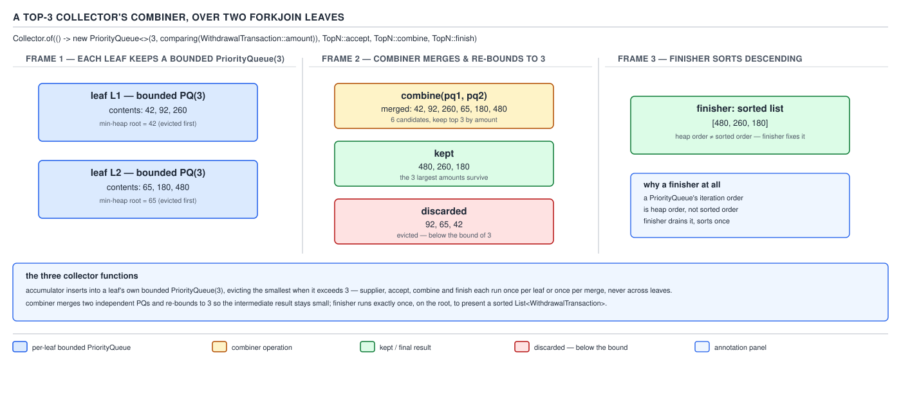

# 04 Modern Java — Collectors — INTERMEDIATE (§2.5)

**Target version: Java 21 LTS.** | **Part 2 of 5** | [Index](../00-index.md)
Previous: [Collectors — basics b](01-basics-b.md) · Next: [Collectors — internals collectors](03-internals-collectors.md)

## Collectors in anger

The basics files taught `toList()`, `toSet()`, `joining()`, and a first pass at `groupingBy` and
`toMap`. Every one of those collectors is a leaf: it consumes a stream and returns a value with no
further shaping. This file is about what happens when a leaf is not enough — when the shape you
actually need is a map of maps, a record instead of a map, a bounded top-N instead of a full sort,
or a stateless custom accumulation over primitive arrays.

Every collector in this family is built from the same four-function contract —
`supplier / accumulator / combiner / finisher` plus a set of `Characteristics` — and the whole of
§2.5 is really one lesson taught fourteen times: **once you can name those four functions for a
built-in collector, you can build your own, and you can predict exactly what changes when the
stream runs in parallel.**

| Family | What it does | Leaves |
|---|---|---|
| Grouping shape | nests `groupingBy` and reads the resulting type | 2.5.1 |
| Downstream shaping | changes what a group collects, not how it is grouped | 2.5.2, 2.5.3 |
| Map choice | which `Map` implementation backs a `groupingBy`/`toMap` | 2.5.4 |
| Keying with conflict | `toMap` and its merge function | 2.5.5, 2.5.6 |
| Multi-aggregate in one pass | `teeing` | 2.5.7 |
| Roll your own | `Collector.of`, characteristics | 2.5.8, 2.5.9, 2.5.10 |
| Result shape | immutability, `Optional`, records | 2.5.11, 2.5.12, 2.5.13 |
| Concurrency of the collector itself | statelessness of the factory | 2.5.14 |

### Shared domain types for this file

Every snippet in this file collects over one of these two records. They are declared once here and
assumed in scope for every later snippet — read them once and the rest of the file reads as prose,
not boilerplate.

```java
enum Rail { CARD, BANK }

enum Disposition { CAPTURED, REFERRED, FAILED }

record Money(java.math.BigDecimal amount, java.util.Currency currency) {
    static Money of(long units) {
        return new Money(java.math.BigDecimal.valueOf(units), java.util.Currency.getInstance("GBP"));
    }
    Money add(Money other) {
        return new Money(this.amount.add(other.amount), this.currency);
    }
}

record WithdrawalTransaction(
        ClientId clientId,
        Rail rail,
        Money amount,
        Disposition disposition) {}

record DepositTransaction(
        ClientId clientId,
        Rail rail,
        Money amount,
        String statusCode) {}

record ClientId(java.util.UUID value) {}
```

`ClientId` follows the domain's value-type sketch (a wrapped `UUID`); `WithdrawalTransaction` and
`DepositTransaction` are the domain's `WithdrawalTransaction`/deposit aggregates narrowed to the
fields these examples need.

---

## Multi-level grouping and reading the nested map type

**The picture.** `groupingBy(classifier1, groupingBy(classifier2, downstream))` is not a special
two-argument form of `groupingBy` — it is the ordinary one-argument `groupingBy` where the
*downstream collector itself happens to be another `groupingBy`*. There is no "nested groupingBy"
overload in the JDK; there is exactly one `groupingBy(Function, Collector)` overload, and nesting
is just composition. Once you see that, the type of the result stops being mysterious: it is the
type of the outer classifier's key, mapped to whatever the downstream collector produces — and the
downstream collector's result type is itself `Map<K2, R>` when the downstream is another
`groupingBy`.

**Why it exists.** Before `groupingBy`, a two-level breakdown — "count of withdrawals per rail per
disposition" — meant a hand-rolled `Map<Rail, Map<Disposition, Long>>` built with nested loops and
`computeIfAbsent`, one mutation site per level, and a real risk of forgetting to initialise the
inner map before mutating it. `groupingBy`'s recursive downstream removes every one of those
mutation sites: the outer collector never touches the inner map directly, it only ever calls
`downstream.accumulator()` and hands it the element.

**When to reach for it, and when not.** Reach for nested `groupingBy` when the breakdown is
genuinely hierarchical and you intend to read it back hierarchically — "for each rail, for each
disposition, how many". Do not reach for it when you actually want a *flat* multi-key breakdown —
"per (rail, disposition) pair" — because a flat `Map<CompositeKey, V>` keyed by a small record is
usually easier to read back than a two-level nested map, and avoids the `Optional`-shaped absence
problem below. The sibling that wins there is `groupingBy(entry -> new RailDisposition(rail,
disposition), counting())` with a two-field record key.

**How it works.** `groupingBy(Function<T,K1> classifier, Collector<T,A,D> downstream)` builds a
`Map<K1, D>`. Substitute `downstream = groupingBy(Function<T,K2> classifier2, Collector<T,A2,D2>
inner)` and `D` becomes `Map<K2, D2>` — so the overall result is `Map<K1, Map<K2, D2>>`. The outer
collector's accumulator, for every element, does exactly two things: `computeIfAbsent(classifier
.apply(t), k -> downstream.supplier().get())` to find-or-create the inner container, then
`downstream.accumulator().accept(container, t)` to fold the element into it. The outer collector
never inspects what `downstream` is — it is handed an opaque four-function contract and drives it
generically, which is precisely why nesting composes without a special case in the source.

**A minimal concrete example.** Count withdrawal transactions by rail, then by disposition, and
read the nested type back correctly:

```java
Map<Rail, Map<Disposition, Long>> byRailThenDisposition = withdrawals.stream()
        .collect(Collectors.groupingBy(
                WithdrawalTransaction::rail,
                Collectors.groupingBy(WithdrawalTransaction::disposition, Collectors.counting())));

long cardReferred = byRailThenDisposition
        .getOrDefault(Rail.CARD, Map.of())
        .getOrDefault(Disposition.REFERRED, 0L);
```

Reading the type left to right against the collector's arguments, in order, always gives the
correct nesting: `groupingBy(A, groupingBy(B, C))` reads as `Map<keyOf(A), Map<keyOf(B),
resultOf(C)>>`. There is no shortcut for this beyond reading the arguments — treat the type as
generated mechanically from the collector expression, not memorised.

**The gotcha.** `getOrDefault(Rail.CARD, Map.of())` on the outer map protects against a rail with
zero withdrawals never appearing as an outer key at all (`groupingBy` only ever creates a key for a
classifier value it actually saw), but it does **not** protect against `Rail.CARD` being present
with an inner map that is missing `Disposition.REFERRED` — that needs the second, chained
`getOrDefault` on the inner map too. Both levels can be independently absent; forgetting the inner
one is the single most common bug in nested-`groupingBy` consumers.

> **Definition:** nested `groupingBy` is the ordinary single-classifier `groupingBy` whose
> downstream collector happens to be another `groupingBy`, producing `Map<K1, Map<K2, D2>>` by
> composition, with no dedicated two-level API in the JDK.

---

## Downstream collectors as shape-changing decorators, and the `filtering`/`filter` trap

**The picture.** A downstream collector is a decorator: it wraps another collector and changes
*what* gets fed to it, or *how* its result is transformed on the way out, without changing *how
many groups* exist. `mapping`, `filtering`, and `flatMapping` all change the **input** side —
transform, keep-or-drop, or expand each element before it reaches the wrapped collector.
`collectingAndThen` changes the **output** side — apply a function to the finished result.
`reducing` is a downstream collector that folds elements with a `BinaryOperator` instead of a
container-mutating accumulator.

**Why it exists.** Before these existed (all present since Java 8 except `filtering` and
`flatMapping`, which arrived in **Java 9**), shaping the elements *inside* a group meant collecting
the whole group first, then post-processing the whole map with a second `stream()` — extra
allocation, extra pass, and the classifier and the shaping logic living in two disconnected
statements. Downstream collectors let the shaping travel with the grouping, in one collector
expression, evaluated in one pass.

**When to reach for it, and when not.** Reach for `mapping` when you want to keep every element
but project it to a smaller shape before it enters the group — `mapping(WithdrawalTransaction
::amount, toList())` collects amounts, not whole transactions. Reach for `filtering` specifically
when you need to drop elements from inside an already-decided group while keeping the group's key
present with an empty result. Reach for `flatMapping` when each element itself expands to zero or
more values that should be flattened into the group. Do not reach for `collectingAndThen` to
implement filtering or mapping — that is what `filtering`/`mapping` are for; `collectingAndThen`'s
only job is transforming the *finished container*, e.g. wrapping a mutable list in
`Collections::unmodifiableList` or a full map in `Map::copyOf`.

**How it works — and the trap.** `[TRAP]` `[PROVE]` `Collectors.filtering(Predicate<T> p,
Collector<T,A,R> downstream)` builds a collector whose accumulator is `(a, t) -> { if
(p.test(t)) downstream.accumulator().accept(a, t); }` — the predicate is evaluated *inside* the
per-group accumulator, after the classifier has already decided which group the element belongs
to. A `.filter(p)` placed **before** `.collect(groupingBy(...))`, by contrast, removes elements from
the stream entirely, before the classifier ever sees them.

Work the two through side by side over the same four card deposits — CARD rail deposits of 40, 65,
75, 90 (none above 100) and BANK rail deposits of 480, 520 (both above 100):

```
filtering(d -> d.amount().amount().intValue() > 100, toList()) as downstream of groupingBy(rail):
  1. classifier sees all six deposits; CARD and BANK both become outer keys.
  2. filtering's accumulator runs the predicate per element, inside each group.
  3. CARD's group runs its accumulator four times, keeps zero elements -> CARD -> [].
  4. BANK's group runs its accumulator twice, keeps both -> BANK -> [480, 520].
  Result: {CARD=[], BANK=[480, 520]}   -- CARD key present, empty list.

.filter(d -> d.amount().amount().intValue() > 100) before .collect(groupingBy(rail)):
  1. the stream drops the four CARD deposits before groupingBy ever runs.
  2. the classifier never sees a CARD deposit, so CARD is never inserted as a key.
  Result: {BANK=[480, 520]}   -- CARD key absent entirely.
```

Both computations look like "filter, then group by rail" from the outside. They compute different
maps because the predicate runs on opposite sides of the classifier.


**D-103** — `filtering(p, toList())` versus `filter(p)` before `groupingBy`

**A minimal concrete example**, including `mapping`, `flatMapping`, `collectingAndThen`, and
`reducing`:

```java
// mapping — group deposits by rail, keep only the amounts
Map<Rail, List<Money>> amountsByRail = deposits.stream()
        .collect(Collectors.groupingBy(DepositTransaction::rail,
                Collectors.mapping(DepositTransaction::amount, Collectors.toList())));

// filtering — the trap, done correctly: CARD present with an empty list
Map<Rail, List<Money>> largeAmountsKeepingEmptyRail = deposits.stream()
        .collect(Collectors.groupingBy(DepositTransaction::rail,
                Collectors.filtering(d -> d.amount().amount().intValue() > 100,
                        Collectors.mapping(DepositTransaction::amount, Collectors.toList()))));

// flatMapping — expand each deposit's single status code into a stream of its two hyphen-parts
Map<Rail, List<String>> statusCodeParts = deposits.stream()
        .collect(Collectors.groupingBy(DepositTransaction::rail,
                Collectors.flatMapping(d -> Arrays.stream(d.statusCode().split("-")),
                        Collectors.toList())));

// collectingAndThen — the finished per-rail list becomes unmodifiable on the way out
Map<Rail, List<Money>> immutableAmountsByRail = deposits.stream()
        .collect(Collectors.groupingBy(DepositTransaction::rail,
                Collectors.collectingAndThen(
                        Collectors.mapping(DepositTransaction::amount, Collectors.toList()),
                        Collections::unmodifiableList)));

// reducing — total deposited per rail, without a separate summingDouble/BigDecimal dance
Map<Rail, Money> totalByRail = deposits.stream()
        .collect(Collectors.groupingBy(DepositTransaction::rail,
                Collectors.reducing(Money.of(0), DepositTransaction::amount, Money::add)));
```

**Pitfall:** treating `filtering` and a pre-`filter` as interchangeable produces silently different
map shapes with no exception, no warning, and identical-looking call sites at a glance — the two
expressions differ only in whether `filter` runs before or after `groupingBy` in the method chain,
which is easy to miss in review. Fix: if the group's key must survive with an empty collection when
nothing qualifies (e.g. a rail-by-rail dashboard that must render a zero row for CARD), use
`filtering` as the downstream. If the key should not exist at all when nothing qualifies, filter the
stream before `groupingBy`.

> **Definition:** downstream collectors reshape what a `groupingBy`/`partitioningBy` group
> collects — `mapping`/`filtering`/`flatMapping` transform the input side per element,
> `collectingAndThen` transforms the finished result, and `reducing` folds with a `BinaryOperator`
> — and `filtering`'s predicate runs inside the group after the key is already decided, which is
> why it preserves empty groups that a pre-`filter` would remove.

---

## Choosing the map implementation for a grouped or keyed result

`[X-REF 02]` `groupingBy` and `toMap` both take an optional `Supplier<M>` map-factory argument, and
picking it wrong produces a map that compiles, runs, and gives the wrong iteration order or the
wrong key-collision behaviour in production. Three factories cover the overwhelming majority of
cases, and they are not interchangeable — each buys a specific guarantee at a specific structural
cost.

| Factory | Guarantee | Cost | Reach for it when |
|---|---|---|---|
| `HashMap::new` (default) | none — iteration order unspecified | fastest insert/lookup | order genuinely does not matter |
| `LinkedHashMap::new` | encounter order of first insertion | one extra doubly-linked list per entry | you want groups to print in the order their first element appeared in the stream |
| `TreeMap::new` | sorted order by key's natural order or a `Comparator` | O(log n) insert instead of O(1), red-black tree overhead | keys must be enumerated in a defined sorted order — e.g. a report ordered by rail name |
| `EnumMap::new` | insertion via ordinal-indexed array, iterates in enum declaration order | requires the key type to be an `enum`; unusable for any other key | the classifier's key type is already an enum, such as `Rail` or `Disposition` |

The full mechanics of each implementation — `HashMap`'s treeification threshold, `TreeMap`'s
red-black rebalancing, `EnumMap`'s ordinal array — are guide 02's territory (Java collections); the
paragraph above is enough to answer "which map factory would you pass to `groupingBy` here, and
why" without leaving the reader empty-handed. The mechanism worth keeping here is narrower: the
three-argument `groupingBy(classifier, mapFactory, downstream)` overload passes `mapFactory` as the
`supplier()` of the returned `Collector`, so the choice costs nothing beyond whichever map's own
insert/iteration complexity you picked — there is no additional overhead from `groupingBy` itself.

`Rail` is an enum, so grouping card and bank deposits by rail is the textbook `EnumMap` case:

```java
Map<Rail, List<Money>> byRailOrdinalOrder = deposits.stream()
        .collect(Collectors.groupingBy(
                DepositTransaction::rail,
                () -> new EnumMap<>(Rail.class),
                Collectors.mapping(DepositTransaction::amount, Collectors.toList())));
```

**Gotcha:** `EnumMap::new` needs the enum's `Class` object at construction (`new
EnumMap<>(Rail.class)`), so it cannot be passed as a bare `EnumMap::new` method reference the way
`HashMap::new` and `TreeMap::new` can — it must be a lambda, `() -> new EnumMap<>(Rail.class)`.
Forgetting this and writing `EnumMap::new` is a compile error, not a runtime surprise, which is the
one thing that saves this pitfall from being worse than it sounds.

**Building an index and an inverted index in one pass each.** The same map-factory choice applies
whether the collector is `toMap` (a direct index) or `groupingBy` (an inverted index): a direct
index maps one key to one value — `Map<ClientId, DepositTransaction> latestDepositByClient =
deposits.stream().collect(Collectors.toMap(DepositTransaction::clientId, Function.identity(), (a,
b) -> b, LinkedHashMap::new))` keeps clients in first-seen order while resolving duplicate client
IDs to the later transaction. An inverted index maps one value back to every key that produced it —
`Map<Rail, List<ClientId>> clientsByRail = deposits.stream().collect(Collectors.groupingBy
(DepositTransaction::rail, Collectors.mapping(DepositTransaction::clientId, Collectors.toList())))`
builds, in the same single pass, the reverse lookup from rail to every client who used it. Both are
one `.stream().collect(...)` statement; neither needs a second pass or an intermediate list.

> **Definition:** the map-factory argument to `groupingBy`/`toMap` selects the backing
> implementation of the result map — `HashMap` for no guarantee, `LinkedHashMap` for encounter
> order, `TreeMap` for sorted order, `EnumMap` for enum keys — and costs exactly that
> implementation's own complexity, nothing extra from the collector.

---

## `toMap` merge strategies

**The picture.** `toMap(keyMapper, valueMapper)` without a third argument assumes every element
produces a distinct key. The moment two elements collide on the same key, that two-argument form
throws — it has no policy for "what do I do with the second one" because you never told it one.
The three-argument form's `BinaryOperator<V> mergeFunction` **is** that policy: it is called with
`(existingValue, newValue)` every time a key collision happens, and whatever it returns replaces
the existing entry.

**Why it exists.** Before `toMap`, building a `Map<K,V>` from a stream with possible key collisions
meant a manual loop with `computeIfPresent`/`merge` calls, because `Collectors.toMap`'s two-argument
form throwing `IllegalStateException: Duplicate key ...` on the first collision made it useless for
anything but already-unique keys. The three-argument overload folds the same `Map.merge` semantics
that `java.util.Map` already exposes into the collector itself.

**When to reach for it, and when not.** Reach for `toMap` with a merge function whenever the
classifier is not guaranteed injective — grouping by `ClientId` when a client can appear more than
once is the common case. Do not reach for `toMap` when what you actually want is *every* value per
key, not one winner — that is `groupingBy`, not `toMap` with a merge function that discards data.
The two are frequently confused because both take a key-deriving function; the discriminator is
whether collisions should survive (use `groupingBy`) or resolve to one value (use `toMap`).

**How it works.** Three shapes of merge function cover almost every real case:

| Merge function | Behaviour on collision | Use for |
|---|---|---|
| `(a, b) -> b` | last-wins: keeps whichever element the stream encountered later | "give me the latest deposit per client" from a chronologically ordered stream |
| `(a, b) -> a` | first-wins: keeps whichever element the stream encountered first | "give me the first deposit per client" — e.g. locating the bonus-eligible first deposit |
| `(a, b) -> a.merge(b)` (or `Money::add`, or any combining function) | combines both values into one | "give me total deposited per client" — every collision accumulates rather than discards |

`toMap`'s internal accumulator, for every element, is functionally `map.merge(keyMapper.apply(t),
valueMapper.apply(t), mergeFunction)` — it is the exact same `Map.merge` you would write by hand in
a loop, just driven per-element by the collector's accumulator instead of by you.

**A minimal concrete example.** All three merge strategies over the same deposit stream, keyed by
client:

```java
// last-wins: most recent deposit per client, given a stream ordered by timestamp ascending
Map<ClientId, DepositTransaction> latestDepositPerClient = deposits.stream()
        .collect(Collectors.toMap(DepositTransaction::clientId, Function.identity(), (a, b) -> b));

// first-wins: first deposit per client — the one that can carry a first-deposit bonus
Map<ClientId, DepositTransaction> firstDepositPerClient = deposits.stream()
        .collect(Collectors.toMap(DepositTransaction::clientId, Function.identity(), (a, b) -> a));

// combining: total deposited per client across every rail
Map<ClientId, Money> totalDepositedPerClient = deposits.stream()
        .collect(Collectors.toMap(DepositTransaction::clientId, DepositTransaction::amount,
                Money::add));
```

**The gotcha.** The two-argument `toMap` overload is not "the same collector with a default merge
function" — it genuinely has no merge function, and its accumulator branch that detects a
duplicate key throws immediately rather than silently picking either value. Adding a merge
function is not an optimisation for a rare case, it is the only way to make `toMap` well-defined
once the key can repeat; leaving it off is only safe when the key mapper is provably injective over
the input, and "provably" needs an actual argument, not an assumption from a demo dataset that
happened not to collide.

> **Definition:** `toMap`'s merge function is `Map.merge`'s combining `BiFunction` lifted into the
> collector's accumulator, invoked with `(existingValue, newValue)` on every key collision, and its
> absence in the two-argument overload means any collision throws rather than resolves.

---

## `teeing` for two aggregates in one traversal

**The picture.** `teeing(downstream1, downstream2, merger)` is a stream that forks into two
independent collectors at every element and reunites their two finished results with a
`BiFunction` at the end — the name is the Unix `tee` command's picture: one input, split to two
sinks, recombined.

**Why it exists.** Before `teeing` (added in **Java 12**), computing two independent aggregates
over the same stream — say, the smallest and the largest withdrawal — meant either two separate
terminal operations over two separately materialised copies of the data (an extra full pass and an
extra collection held in memory), or hand-writing a single custom `Collector` whose accumulator
state was a small mutable holder object carrying both running values. `teeing` gives you the
single-pass behaviour of the hand-written collector while composing from two collectors you already
have, with no custom `Collector.of` call needed.

**When to reach for it, and when not.** Reach for `teeing` when the two aggregates are independent
of each other — neither downstream needs to see what the other computed. Do not reach for it when
the second aggregate depends on the first's result (that needs sequential composition, not a fork),
and do not reach for it when you only need *one* aggregate — plain `summarizingInt`/`summarizingLong`
already returns count, sum, min, max, and average together for a single numeric extraction, which is
cheaper to write than teeing two separate collectors for the same fields.

**How it works.** `teeing`'s accumulator state is a record of both downstream accumulators' states;
its accumulator function calls both wrapped accumulators on every element; its combiner calls both
wrapped combiners; its finisher calls both wrapped finishers and passes the two results to
`merger`. Concretely, for `teeing(minBy(cmp), maxBy(cmp), merger)`, every element is handed to both
`minBy`'s accumulator and `maxBy`'s accumulator in the same pass — the stream is traversed once, not
twice, and the two `Optional<T>` results are combined by `merger` only at the very end.

**A minimal concrete example.** Min-and-max withdrawal amount, and count-and-total withdrawn, each
in a single traversal:

```java
record MinMax(Money smallest, Money largest) {}

MinMax minMaxWithdrawal = withdrawals.stream()
        .collect(Collectors.teeing(
                Collectors.minBy(Comparator.comparing(WithdrawalTransaction::amount,
                        Comparator.comparing(m -> m.amount()))),
                Collectors.maxBy(Comparator.comparing(WithdrawalTransaction::amount,
                        Comparator.comparing(m -> m.amount()))),
                (min, max) -> new MinMax(min.orElseThrow().amount(), max.orElseThrow().amount())));

record CountAndTotal(long count, Money total) {}

CountAndTotal withdrawalSummary = withdrawals.stream()
        .collect(Collectors.teeing(
                Collectors.counting(),
                Collectors.reducing(Money.of(0), WithdrawalTransaction::amount, Money::add),
                CountAndTotal::new));
```

**The gotcha.** `teeing` traverses the stream exactly once *for a sequential stream*; for a parallel
stream, the guarantee is that each downstream sees every element exactly once across however many
sub-ranges the fork-join split the source into, and the two downstreams' combiners are invoked
independently per sub-range merge — you get one logical traversal, not one physical thread doing
both aggregates. `minBy`/`maxBy` return `Optional`, not `T`, so `merger` must unwrap them (or defer
that to the caller) — a stream with zero elements yields `Optional.empty()` for both sides, and
`orElseThrow()` inside the merger will throw for an empty input, which is worth deciding
deliberately rather than discovering in production on the first day nothing settled.

> **Definition:** `teeing` forks a single traversal into two independent collectors and recombines
> their two finished results with a `BiFunction`, giving one-pass semantics for two unrelated
> aggregates without writing a custom `Collector`.

---

## Building custom collectors with `Collector.of`

**The picture.** `Collector.of(supplier, accumulator, combiner, finisher, characteristics...)` is
the same four-function contract every built-in collector already runs on — you are not learning a
new mechanism here, you are finally being handed the constructor the built-ins have been calling
all along. Anything `groupingBy`, `toMap`, or `teeing` can do, a hand-written `Collector.of` can do
too; you reach for it exactly when no combination of built-ins produces the shape you need.

**Why it exists.** Before `Collector.of`, a custom multi-step reduction meant either abusing
`reduce` with a mutable accumulator (which the `Stream.reduce` javadoc explicitly warns against for
non-associative or stateful combining) or writing an entire `Collector` implementation class by
hand — three method overrides plus a characteristics set, for what is usually four short lambdas.
`Collector.of` is a factory method that builds the anonymous `CollectorImpl` for you from those four
functions directly.

**When to reach for it, and when not.** Reach for it when you need bounded state that a built-in
collector cannot express — a fixed-size top-N, a primitive-array accumulator that avoids boxing, an
accumulator that must maintain an invariant across every element (like the running heap in a top-N).
Do not reach for it when a chain of two or three built-ins already expresses the shape — a
hand-written collector is harder to read and to get the combiner right for than a `teeing` or a
`collectingAndThen` composition, and every custom collector is a new thing a reviewer has to verify
for correctness under parallel execution, which the built-ins already have verified for you.

### A bounded top-N collector

`[BUILD]` `[X-REF 02]` The classic case: the top 3 withdrawals by amount, without sorting the whole
stream. The accumulator state is a `PriorityQueue<WithdrawalTransaction>` ordered so the **smallest**
kept element is always at the head — every element cheaper than the current smallest is rejected in
O(1) via a `peek()` comparison; every element that beats the smallest is inserted and then the queue
is trimmed back to size 3 by polling the new smallest off the head. `PriorityQueue`'s own internals
— the binary-heap array, `siftUp`/`siftDown` — are guide 02's territory; what matters here is that
`offer`/`poll` are both `O(log k)` for a bound of `k`, so scanning `n` elements to keep the top `k`
costs `O(n log k)`, not `O(n log n)` for a full sort.

The combiner — required because the stream may run in parallel, and is exactly where this pattern
is easy to get subtly wrong — must merge two bounded heaps from two sub-ranges back down to one
heap of size `k`, not simply concatenate them:

```java
static <T> Collector<T, ?, List<T>> topN(int n, Comparator<T> comparator) {
    return Collector.of(
            () -> new PriorityQueue<T>(n, comparator),                       // supplier
            (queue, element) -> {                                            // accumulator
                if (queue.size() < n) {
                    queue.offer(element);
                } else if (comparator.compare(element, queue.peek()) > 0) {
                    queue.poll();
                    queue.offer(element);
                }
            },
            (left, right) -> {                                              // combiner
                right.forEach(element -> {
                    if (left.size() < n) {
                        left.offer(element);
                    } else if (comparator.compare(element, left.peek()) > 0) {
                        left.poll();
                        left.offer(element);
                    }
                });
                return left;
            },
            queue -> queue.stream()                                          // finisher
                    .sorted(comparator.reversed())
                    .collect(Collectors.toList()));
}
```

Trace it over two parallel leaves of withdrawals, top 3 by amount, real amounts 180, 260, and 92
drawn from the domain's average card, bank, and chargeback figures:

```
Leaf A processes {180, 40, 55} in some order  -> its bounded heap ends at {40, 55, 180} (min-heap, size 3)
Leaf B processes {260, 92, 30, 20} in some order -> its bounded heap ends at {30, 92, 260} minus one, e.g. {92, 30, 260} trimmed -> {30, 92, 260} keeps top 3 of 4 seen -> {30, 92, 260} (20 discarded during accumulation)
Combiner merges A={40,55,180} into B's heap, re-bounding to 3:
  insert 40 -> rejected, smaller than B's current min (30)? 40 > 30, so 30 is evicted, 40 inserted -> {40, 92, 260}
  insert 55 -> 55 > 40 (current min), 40 evicted, 55 inserted -> {55, 92, 260}
  insert 180 -> 180 > 55 (current min), 55 evicted, 180 inserted -> {92, 180, 260}
Finisher sorts descending -> [260, 180, 92]
```



**D-104** — A top-N collector's combiner

### Which characteristics to declare

`[BUILD]` The varargs `Characteristics...` at the end of `Collector.of` is not decoration — each
one unlocks a specific optimisation in `Stream.collect`'s evaluation, and declaring one that does
not actually hold produces a silent correctness bug, not a compile error.

| Characteristic | What it unlocks | Declare it when |
|---|---|---|
| `CONCURRENT` | the accumulator may be called from multiple threads on the *same* shared container, skipping the combiner and per-leaf containers entirely | the accumulator is genuinely thread-safe against concurrent mutation, e.g. backed by a `ConcurrentHashMap` |
| `UNORDERED` | the stream's encounter order need not be preserved through the collection | the result does not depend on the order elements were visited — a `Set`, a sum, a top-N by value are all order-independent |
| `IDENTITY_FINISH` | the finisher is `Function.identity()` and can be skipped — the accumulator's container **is** the result, cast directly | the accumulator type `A` and the result type `R` are the same type, so no separate finishing step is needed |

The top-N collector above declares **none** of these: its accumulator is not thread-safe
(`PriorityQueue` is not concurrent), its result order genuinely depends on the final `sorted()` call
in the finisher, and its finisher does real work (sorting and converting to `List`) rather than
being identity — so `IDENTITY_FINISH` would be a lie that skips a step the code actually needs.
Declaring `CONCURRENT` on a non-thread-safe accumulator does not throw; it silently permits data
races that only manifest on a sufficiently large parallel stream, which is why declaring
characteristics is a correctness claim, not a performance hint.

### A boxing-free statistics collector

`[BUILD]` `[NUM]` `Collectors.summingInt`/`averagingInt` already show why boxing-free accumulation
matters: per the JDK 21 source (`java.util.stream.Collectors`, `jdk-21+35` tag), `summingInt`
accumulates into a bare `int[1]` — no compensation, no widening — so summing three
1,000,000,000-valued `int`s overflows exactly the way `IntStream.sum()` does:

```
summingInt : -1294967296
summingLong: 3000000000
expected   : 3000000000
```

`averagingInt` avoids this because it accumulates into a `long[2]` (sum, count), which is the
correct half of the syllabus's claim — but neither built-in collector avoids the other cost worth
naming: every element still gets **boxed** into an `Integer`/`Long` to reach the collector at all,
because `Stream<T>.collect(Collector<T,A,R>)` is generic over a reference type. A custom collector
built directly over a primitive accumulator array sidesteps that boxing entirely by taking its input
as a primitive extraction inside the accumulator lambda, never materialising a boxed intermediate.

Build one over stake reservation amounts (avg 4.20, expressed here in minor units as `long`),
computing count, sum, min, and max in a single `long[4]` accumulator with no `Integer`/`Long`
boxing of the running state:

```java
record StakeStats(long count, long sumMinorUnits, long minMinorUnits, long maxMinorUnits) {}

static Collector<Long, long[], StakeStats> stakeStatistics() {
    return Collector.of(
            () -> new long[] { 0L, 0L, Long.MAX_VALUE, Long.MIN_VALUE },   // count, sum, min, max
            (acc, minorUnits) -> {
                acc[0] += 1;
                acc[1] += minorUnits;
                acc[2] = Math.min(acc[2], minorUnits);
                acc[3] = Math.max(acc[3], minorUnits);
            },
            (left, right) -> new long[] {
                    left[0] + right[0],
                    left[1] + right[1],
                    Math.min(left[2], right[2]),
                    Math.max(left[3], right[3])
            },
            acc -> new StakeStats(acc[0], acc[1], acc[2], acc[3]));
}
```

`[NUM]` The arithmetic that matters here is the *reduction* in boxed allocations, not a new number
of its own: a `stream.collect(stakeStatistics())` called over a `Stream<Long>` still boxes once per
element to reach the `Stream<Long>` in the first place (there is no `LongStream.collect(Collector)`
overload — `LongStream` only has the three-argument `collect(supplier, accumulator, combiner)` that
takes primitive `long` directly). The genuine win of the boxing-free accumulator is inside the
collector's own running state: across `n` elements, the built-in `averagingLong`-style approach
still allocates zero extra boxes beyond the one per input element, but a naive hand-rolled collector
that accumulated into a `List<Long>` and computed statistics in the finisher would hold `n` live
boxed `Long` references simultaneously; the `long[4]` accumulator holds exactly 4 primitive slots
regardless of `n`.

**Pitfall:** reaching for `Stream<Integer>.collect(Collectors.summingInt(...))` on a value that can
plausibly exceed `Integer.MAX_VALUE` when accumulated (a running total across millions of
transactions, for instance) reproduces `IntStream.sum()`'s silent overflow with no compiler warning,
because `summingInt`'s accumulator array is declared `int[1]`, not `long[1]` — verified by actually
compiling and running the sum above on this machine. Fix: use `summingLong` (backed by `long[1]`) or
a custom `long`/`BigDecimal`-accumulating collector whenever the domain quantity is a running total
of money or counts that can grow past two billion.

> **Definition:** `Collector.of` builds a custom collector from the same
> `supplier/accumulator/combiner/finisher` contract every built-in collector runs on, and the
> characteristics you declare on it are correctness claims about that contract — `CONCURRENT` and
> `IDENTITY_FINISH` skip real work in `Stream.collect`'s evaluation and must actually hold, not just
> be convenient to assert.

---

## Three routes to an immutable result, and their null policies

`[TRAP]` `[NUM]` Three expressions all produce "an immutable `List`" from a stream, and they differ
in exactly the case that matters: what happens when an element is `null`.

| Expression | Since | Finisher / mechanism | Null policy |
|---|---|---|---|
| `Collectors.toUnmodifiableList()` | Java 10 | wraps the accumulated `ArrayList` with `List.of(list.toArray())` | **null-hostile** — throws `NullPointerException` if any element is `null` |
| `collectingAndThen(toList(), List::copyOf)` | Java 10 (`List.copyOf`) | `List.copyOf` on the finished mutable list | **null-hostile** — `List.copyOf` throws `NullPointerException` on any `null` element, same as `List.of` |
| `Stream.toList()` | Java 16 | `Collections.unmodifiableList(Arrays.asList(this.toArray()))` — a wrapper, not a `List.of`/`copyOf` copy | **null-permissive** — nulls pass straight through; the returned list is unmodifiable as a *view*, but the underlying array can hold `null` |

`[NUM]` Prove it by running all three over a stream containing one `null`:

```java
List<String> statusCodes = Arrays.asList("DEP-301", null, "BDP-100");

statusCodes.stream().collect(Collectors.toUnmodifiableList());          // throws NullPointerException
statusCodes.stream().collect(Collectors.collectingAndThen(
        Collectors.toList(), List::copyOf));                            // throws NullPointerException
statusCodes.stream().toList();                                          // returns [DEP-301, null, BDP-100]
```

All three results are equally immutable in the sense that matters for the syllabus's other claim —
none of them permits `add`/`remove`/`set` after construction, all three throw
`UnsupportedOperationException` on a mutation attempt. They diverge only on construction-time null
tolerance, because `List.of`/`List.copyOf` are explicitly null-hostile by contract (documented on
`List.of`'s javadoc) while `Collections.unmodifiableList` is a pass-through wrapper with no element
validation of its own.

**Pitfall:** assuming `Stream.toList()` is "just a shorthand" for `collect(toUnmodifiableList())`
and swapping one for the other during a refactor. They differ on null handling, and a status-code
stream that legitimately carries `null` for "not yet assigned" will compile and run fine under
`Stream.toList()` and throw under `toUnmodifiableList()` the moment that code path is exercised —
usually in production, on the first record that has not reached a terminal status yet. Fix: choose
based on whether `null` is a value your domain can produce, not based on which spelling is shorter
to type.

> **Definition:** all three immutable-result routes forbid structural mutation after construction,
> but only `Stream.toList()` tolerates a `null` element — `toUnmodifiableList()` and
> `collectingAndThen(toList(), List::copyOf)` both delegate to `List.of`/`List.copyOf`, which are
> null-hostile by contract.

---

## Collectors that return `Optional`, and flattening it away

`Collectors.minBy` and `maxBy` both return `Optional<T>`, because the honest answer to "the minimum
of zero elements" is "there is no minimum", not a sentinel `null` or a thrown exception at
collection time. That correctness costs the caller an `Optional` to unwrap at every use site, which
is exactly what `collectingAndThen` is for: wrap the `Optional`-returning collector and supply the
unwrapping function as the second argument.

```java
Map<Rail, WithdrawalTransaction> largestWithdrawalPerRail = withdrawals.stream()
        .collect(Collectors.groupingBy(
                WithdrawalTransaction::rail,
                Collectors.collectingAndThen(
                        Collectors.maxBy(Comparator.comparing(w -> w.amount().amount())),
                        Optional::orElseThrow)));
```

`Optional::orElseThrow` is only safe here because `groupingBy` never creates a group for a rail it
never saw an element for — every group that exists has at least one element, so `maxBy`'s
`Optional` inside a `groupingBy` downstream is never actually empty at the finisher. That guarantee
does **not** extend to `maxBy` used directly as the terminal collector over a stream that might be
empty; there, `orElseThrow` is a genuine risk and `orElse(fallbackWithdrawal)` or leaving the
`Optional` unwrapped is the honest choice.

> **Definition:** `minBy`/`maxBy` return `Optional<T>` because an empty input has no defined
> minimum or maximum, and `collectingAndThen` is the standard way to flatten that `Optional` away
> once the surrounding context (such as a non-empty `groupingBy` group) guarantees it is never
> empty.

## Collecting into a record instead of a nested map

A `Map<Rail, Map<String, Object>>`-shaped aggregate is legal Java and unreadable at every call
site — every field access is a string-keyed lookup with no compile-time name. Collecting the same
data into a purpose-built record gives every field a name and a type, and it composes naturally
with `teeing`, which already returns exactly one merged value per traversal:

```java
record RailSummary(Rail rail, long withdrawalCount, Money totalWithdrawn) {}

Map<Rail, RailSummary> summaryByRail = withdrawals.stream()
        .collect(Collectors.groupingBy(WithdrawalTransaction::rail,
                Collectors.teeing(
                        Collectors.counting(),
                        Collectors.reducing(Money.of(0), WithdrawalTransaction::amount, Money::add),
                        (count, total) -> new RailSummary(null, count, total))));
```

The `rail` field is left `null` in the teeing merger because the classifier's key is not visible
inside the downstream collector — it lives one level up, as the outer map's key. Filling it in
without a second pass requires walking the resulting `Map.entrySet()` once and rebuilding each
`RailSummary` with its own key, which is one cheap `O(number of rails)` pass, not a re-traversal of
the original stream.

> **Definition:** collecting into a record trades a nested, string- or index-keyed structure for a
> named type, at the one-time cost of re-attaching any classifier key that the downstream collector
> itself cannot see.

## A `Collector` is a stateless factory of state

`[PROVE]` The claim: a `static final Collector<...> C` field is safe to share across threads and
across concurrent stream pipelines, even though the collection it drives is itself full of mutable
state. Work through why.

`Collectors.groupingBy(...)` returns a `CollectorImpl` whose four fields —
`supplier`, `accumulator`, `combiner`, `finisher` — are all `final`, and each one is a lambda or
method reference that closes over no per-invocation mutable state of its own (`HashMap::new`, for
instance, closes over nothing at all). Every time a stream's terminal `collect(Collector)` runs, it
calls `collector.supplier().get()` **fresh**, once, for that specific pipeline execution, to produce
a brand-new mutable container — the `HashMap`, the `ArrayList`, the `PriorityQueue` in the top-N
collector above. That container is local to the one `collect()` call; it is never stored on the
`Collector` object itself and never shared between two concurrent invocations of the same static
field.

So the object graph splits cleanly: the `Collector` instance (the four functions plus
characteristics) is immutable and shared; the accumulator state it produces (`A`, the mutable
container) is fresh per invocation and never shared. Two threads calling
`someStream.collect(SHARED_COLLECTOR)` concurrently each get their own fresh `supplier().get()`
container — they never touch each other's state, because neither one's container is reachable from
the other's call. This is exactly why declaring a top-N or statistics collector as a `private static
final Collector<...>` field, as most codebases do to avoid rebuilding the same `Collector.of(...)`
call at every use site, is safe without any synchronization: the field is a factory, not a workpiece.

> **Definition:** a `Collector` is an immutable bundle of four functions that manufactures a fresh,
> unshared mutable accumulator on every `collect()` invocation via its `supplier`, which is why the
> `Collector` object itself is safe to share as a `static final` field across threads even though
> the state it produces is thoroughly mutable.

---

## Pitfalls

### Assuming `filtering` and a pre-`filter` produce the same map

**Wrong**

```java
Map<Rail, List<Money>> byRail = deposits.stream()
        .filter(d -> d.amount().amount().intValue() > 100)
        .collect(Collectors.groupingBy(DepositTransaction::rail,
                Collectors.mapping(DepositTransaction::amount, Collectors.toList())));
// CARD rail is simply absent from byRail — every CARD deposit was below 100 and filtered out
// before groupingBy ever saw a CARD element, so no CARD key was ever created.
```

**Right**

```java
Map<Rail, List<Money>> byRail = deposits.stream()
        .collect(Collectors.groupingBy(DepositTransaction::rail,
                Collectors.filtering(d -> d.amount().amount().intValue() > 100,
                        Collectors.mapping(DepositTransaction::amount, Collectors.toList()))));
// byRail contains CARD -> [] because filtering runs inside the group, after the classifier
// already committed to a CARD key.
```

**Why people believe it:** both expressions read as "filter the deposits, then group them by rail"
in English, and the method-chain shape looks nearly identical — the only difference is whether
`filter`/`filtering` sits before or inside `.collect(groupingBy(...))`.

### Calling two-argument `toMap` on a classifier that is not provably unique

**Wrong**

```java
Map<ClientId, DepositTransaction> byClient = deposits.stream()
        .collect(Collectors.toMap(DepositTransaction::clientId, Function.identity()));
// throws IllegalStateException: Duplicate key ClientId[...] the first time any client deposits twice
```

**Right**

```java
Map<ClientId, DepositTransaction> byClient = deposits.stream()
        .collect(Collectors.toMap(DepositTransaction::clientId, Function.identity(), (a, b) -> b));
// last-wins on collision, or (a, b) -> a for first-wins, or a combining function to keep both
```

**Why people believe it:** the two-argument overload compiles fine and works correctly on any
demo or test dataset with distinct keys, so the missing merge policy only surfaces once a real,
larger dataset produces its first genuine collision — often well after the code has shipped.

### Trusting `Stream.toList()` and `Collectors.toUnmodifiableList()` to behave identically

**Wrong**

```java
List<String> latestStatusCodes = statuses.stream().collect(Collectors.toUnmodifiableList());
// later refactored to statuses.stream().toList() "for brevity", assumed equivalent
// then a status legitimately null (not yet assigned) starts throwing NullPointerException
// under toUnmodifiableList() but had been silently tolerated under toList()
```

**Right**

```java
List<String> latestStatusCodes = statuses.stream().toList();
// explicit choice: null-permissive because "not yet assigned" is a real value in this domain
```

**Why people believe it:** both are commonly introduced together as "the modern way to get an
immutable list", and their shared immutability against structural mutation hides the one dimension
— null tolerance — where they genuinely diverge.

### Reaching for `summingInt` on a value that can exceed two billion

**Wrong**

```java
int totalDepositedMinorUnits = deposits.stream()
        .collect(Collectors.summingInt(d -> d.amount().amount().intValue()));
// silently wraps to a negative number once the running total exceeds Integer.MAX_VALUE
```

**Right**

```java
long totalDepositedMinorUnits = deposits.stream()
        .collect(Collectors.summingLong(d -> d.amount().amount().longValue()));
// summingLong accumulates into a long[1]; no overflow at realistic transaction volumes
```

**Why people believe it:** `averagingInt` genuinely does avoid overflow (it accumulates into a
`long[2]`), and the two names look parallel enough that the safety is assumed to be shared — it is
not, because `summingInt`'s accumulator array is declared `int[1]`, one primitive width narrower.

## Cheat sheet

| Collector / concept | One-line behaviour | Gotcha |
|---|---|---|
| `groupingBy(f, groupingBy(g, d))` | nests by composing downstream collectors, `Map<K1, Map<K2, D>>` | absence can hide at either level |
| `mapping(f, d)` | projects each element with `f` before `d` sees it | still runs `d`'s full accumulator per element |
| `filtering(p, d)` | drops elements inside the group, key survives empty | `[TRAP]` opposite of `filter` before `groupingBy` |
| `flatMapping(f, d)` | expands each element to a substream before `d` collects | `f` must return a `Stream`, not a `Collection` |
| `collectingAndThen(d, f)` | transforms the finished result | never use it to filter or map — wrong tool |
| `reducing(id, f, op)` | folds with a `BinaryOperator`, no mutable container | prefer built-ins (`counting`, `summingLong`) when one exists |
| map factory `EnumMap::new` | ordinal-array backed, enum keys only | needs `() -> new EnumMap<>(K.class)`, not a bare method ref |
| `toMap` 2-arg | throws on any duplicate key | has no merge policy at all |
| `toMap` 3-arg | `(existing, incoming) -> resolved` on collision | `(a,b)->b` last-wins, `(a,b)->a` first-wins, combine otherwise |
| `teeing(d1, d2, merge)` | one traversal, two independent aggregates | both downstreams see every element; combiners run independently under parallel |
| `Collector.of(...)` | build any four-function contract by hand | declared characteristics are correctness claims, not hints |
| `CONCURRENT` | skip per-leaf containers, shared accumulator | only valid if the accumulator is truly thread-safe |
| `IDENTITY_FINISH` | skip the finisher, cast `A` to `R` | only valid if `A` and `R` are literally the same type |
| `toUnmodifiableList()` / `copyOf` | immutable, **null-hostile** | throws `NullPointerException` on any `null` element |
| `Stream.toList()` | immutable view, **null-permissive** | nulls pass through untouched |
| `minBy`/`maxBy` | return `Optional<T>` | flatten with `collectingAndThen(..., Optional::orElseThrow)` only when non-empty is guaranteed |
| `static final Collector` field | safe to share across threads | supplier manufactures a fresh, unshared container per `collect()` call |

## Self-test

**Q1.** Given `groupingBy(WithdrawalTransaction::rail, groupingBy(WithdrawalTransaction::disposition, counting()))`, what is the declared type of the result, and why does reading the collector's arguments left to right give you that type directly?

<details><summary>Answer</summary>

The type is `Map<Rail, Map<Disposition, Long>>`. There is only one `groupingBy(Function, Collector)`
overload in the JDK; nesting is composition, not a special two-level API. The outer `groupingBy`'s
result type is `Map<K1, D>` where `D` is whatever its downstream collector produces. Substituting the
inner `groupingBy(WithdrawalTransaction::disposition, counting())` for that downstream makes `D`
equal to `Map<Disposition, Long>` (disposition classified, counted), so the outer type becomes
`Map<Rail, Map<Disposition, Long>>` by direct substitution of the downstream's own result type.

</details>

**Q2.** Two expressions both look like "keep only deposits over 100, then group by rail": one calls `.filter(p).collect(groupingBy(rail, toList()))`, the other calls `.collect(groupingBy(rail, filtering(p, toList())))`. If the CARD rail has no deposit above 100, how does the resulting map differ between the two?

<details><summary>Answer</summary>

The pre-`filter` version produces a map with no `CARD` key at all — the stream drops every CARD
deposit before `groupingBy`'s classifier ever runs, so the classifier never sees a value that would
create a `CARD` entry. The `filtering`-as-downstream version produces a map with `CARD` present,
mapped to an empty list — the classifier commits to a `CARD` key for every CARD deposit before
`filtering`'s predicate runs, and the predicate then rejects every one of them inside that already-
created group, leaving the key with an empty collection rather than removing it.

</details>

**Q3.** Why does the two-argument `Collectors.toMap(keyMapper, valueMapper)` throw `IllegalStateException` on a duplicate key instead of silently keeping one of the two values?

<details><summary>Answer</summary>

Because the two-argument overload supplies no merge function at all — its accumulator's
duplicate-key branch has no policy to fall back to, so it throws rather than guess whether the
caller wanted first-wins, last-wins, or a combination. The three-argument overload adds exactly one
thing, a `BinaryOperator<V>` merge function invoked as `(existingValue, newValue)` on every
collision, which is functionally the same combining function `Map.merge` already takes — `toMap`
without it is only well-defined when the key mapper is provably injective over the actual input.

</details>

**Q4.** What does `Collectors.teeing` guarantee about the number of times the source stream is traversed, and why is that the whole point of using it over two separate `.collect()` calls?

<details><summary>Answer</summary>

`teeing` traverses the stream exactly once: every element is fed to both wrapped downstream
collectors' accumulators in that single pass, and only the two finished results are combined by the
merger `BiFunction` at the very end. Two separate `.collect()` calls over the same stream either
require materialising the source into a reusable collection first (extra memory, extra pass) or
fail outright on a stream already consumed by the first `.collect()`, since a stream can only be
traversed once. `teeing` avoids both costs by forking at the element level instead of at the stream
level.

</details>

**Q5.** In the bounded top-N collector built with `Collector.of` over a `PriorityQueue`, what specifically must the combiner do that a naive `left.addAll(right)` would get wrong?

<details><summary>Answer</summary>

The combiner must merge two independently-bounded heaps (each already trimmed to size `n`) back
down to a single heap of size `n`, evicting the smallest surviving elements exactly as the
accumulator does for a single element — for every element in the right-hand heap, either it beats
the left heap's current minimum (evict the minimum, insert the element) or it does not (drop it). A
naive `left.addAll(right)` would leave a heap of up to `2n` elements with no re-bounding, and the
finisher's `sorted().collect(toList())` would then return up to `2n` results instead of the correct
top `n`, silently breaking the collector's contract under any parallel execution wide enough to
produce more than one leaf.

</details>

**Q6.** `Collectors.summingInt` and `Collectors.summingLong` are given as a matched pair in a lot of blog material claiming both are overflow-safe. Verified against the JDK 21 source, which one actually is, and why?

<details><summary>Answer</summary>

Only `summingLong` is. `summingInt`'s accumulator is a bare `int[1]` holding the running sum as an
`int`, so summing values that push the total past `Integer.MAX_VALUE` wraps silently, exactly like
`IntStream.sum()` — verified by compiling and running a sum of three 1,000,000,000-valued elements,
which produced `-1294967296` under `summingInt` and the correct `3000000000` under `summingLong`
(backed by a `long[1]`). `averagingInt` is the one that genuinely is safe despite the name pairing,
because it accumulates into a `long[2]` (sum, count), not an `int[]`.

</details>

**Q7.** A custom `Collector.of(...)` declares `Characteristics.CONCURRENT` on an accumulator backed by a plain `PriorityQueue`. What goes wrong, and when does it surface?

<details><summary>Answer</summary>

`CONCURRENT` tells `Stream.collect`'s evaluation that the accumulator may be safely called from
multiple threads against the same shared container, so the runtime skips creating per-leaf
containers and skips invoking the combiner — every parallel worker mutates the one shared
`PriorityQueue` directly. A plain `PriorityQueue` has no internal synchronization, so concurrent
`offer`/`poll` calls from multiple threads can corrupt the heap's internal array — losing elements,
throwing `ArrayIndexOutOfBoundsException`, or producing an out-of-order result. It does not surface
on a sequential stream at all, and on a parallel stream it may not surface reliably even under test,
because the corruption depends on the fork-join pool's actual thread interleaving at runtime — the
declaration is a lie about thread safety that a small parallel stream in a test suite is unlikely to
catch.

</details>

**Q8.** Given a stream containing a `null` status code, which of `Stream.toList()`, `Collectors.toUnmodifiableList()`, and `collectingAndThen(toList(), List::copyOf)` completes without throwing, and why does it differ from the other two?

<details><summary>Answer</summary>

Only `Stream.toList()` completes without throwing. Its finisher is
`Collections.unmodifiableList(Arrays.asList(this.toArray()))` — a wrapper around a fresh array with
no element validation, so a `null` passes straight through and is simply present in the returned
list. `toUnmodifiableList()`'s finisher calls `List.of(list.toArray())`, and
`collectingAndThen(toList(), List::copyOf)` calls `List.copyOf` directly — both `List.of` and
`List.copyOf` are documented as null-hostile and throw `NullPointerException` the moment they
encounter a `null` element during construction, regardless of how the elements arrived.

</details>

**Q9.** `Collectors.maxBy` returns `Optional<T>`. Inside a `groupingBy` downstream, why is it usually safe to unwrap that `Optional` with `orElseThrow()`, when it would not be safe to do the same over a bare stream?

<details><summary>Answer</summary>

`groupingBy` only ever creates a map entry for a classifier key it actually observed at least one
element for — there is no such thing as an empty group in a `groupingBy` result, because the key's
presence and the group's non-emptiness are established by the same event (seeing the first element
with that key). `maxBy`'s `Optional` is only empty when the collector runs over zero elements, which
cannot happen inside a `groupingBy` group. A bare `stream.collect(maxBy(...))` carries no such
guarantee — the whole stream can genuinely be empty, in which case `orElseThrow()` throws
`NoSuchElementException`.

</details>

**Q10.** A codebase declares `private static final Collector<WithdrawalTransaction, ?, List<WithdrawalTransaction>> TOP_THREE = topN(3, comparator);` and reuses it across many concurrently running requests. Why is that safe, given that the collector's own internal state (the `PriorityQueue`) is a mutable, non-thread-safe object?

<details><summary>Answer</summary>

The `Collector` object itself holds no mutable per-invocation state — its four fields
(`supplier`/`accumulator`/`combiner`/`finisher`) are immutable functions fixed at construction.
Every call to `someStream.collect(TOP_THREE)` invokes `TOP_THREE.supplier().get()` fresh, once, for
that specific call, producing a brand-new `PriorityQueue` that is never stored on `TOP_THREE` and
never shared with any other concurrent invocation. Two threads calling `.collect(TOP_THREE)`
simultaneously each get their own fresh, unshared `PriorityQueue` — the mutable, non-thread-safe
object exists only as private local state of one `collect()` call, never as shared state of the
`Collector` field itself.

</details>

## Deferred

None.

---

**Leaves covered:** 2.5.1–2.5.14 (14 leaves)
**Leaves deferred:** none
**Diagrams included:** D-103, D-104
**Target version:** Java 21 LTS
**Lines:** 1018
