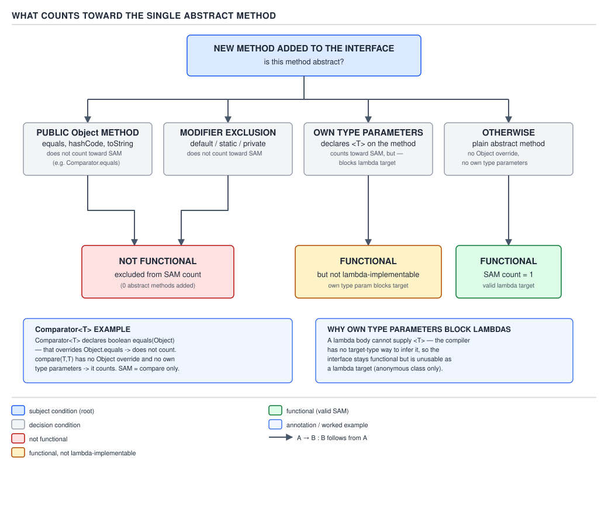
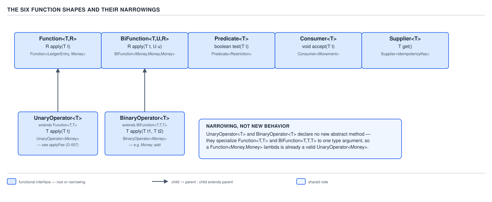

# 04 Modern Java — Functional interfaces — BASICS (§1.2)

**Target version: Java 21 LTS.** | **Part 1 of 5** | [Index](../00-index.md)
Previous: [The platform and the release model — internals observability](../platform-and-releases/04-internals-observability.md) · Next: [Lambdas — basics](../lambdas/01-basics.md)

## What a functional interface actually is

### The SAM definition and why `Object` methods don't count

**Mental model first.** A functional interface is not a marker or a convention — it is a
compile-time *count*. The compiler walks an interface's method set, subtracts anything that
already has a body it can inherit for free, and checks whether exactly one method is left with
no body. If the answer is one, that interface is a valid *target type* for a lambda: the lambda
literally becomes an anonymous implementation of that one method. `Function<LedgerEntry, Money>`
is functional because after the subtraction exactly `apply(LedgerEntry)` remains.

**Why it exists.** Before Java 8, "pass behaviour as a value" meant an anonymous inner class
implementing some interface with one method — `Comparator`, `Runnable`, a hand-rolled
`Callback`. The interface shape (one abstract method) already existed everywhere in idiomatic
Java; lambdas needed a name for that shape so the compiler could target lambda syntax at it. JLS
9.8 gives it that name: **a functional interface is an interface that has exactly one abstract
method.** `[SOURCE]` The spec's own wording, JLS §9.8: "A functional interface is an interface
that is not declared `sealed` and has just one abstract method (aside from the methods of
`Object`)." Two things to read out of that sentence: the "aside from `Object`" clause is doing
the subtraction described above, and `sealed` interfaces are excluded outright — a `sealed`
interface can never be a lambda target no matter how many abstract methods it declares, because
sealing forecloses the "anonymous implementation" story that a lambda relies on.

**When to reach for it, and when not.** You reach for "is this functional" reasoning any time
you're deciding whether a type can be a lambda or method-reference target — designing your own
callback interface, or reading an unfamiliar JDK interface and needing to know if `x -> ...` will
compile against it. You do *not* reach for it when the interface already has two or more
genuinely new abstract methods with distinct signatures — that's a multi-method contract
(`Iterator`, `Comparable` plus a custom method), and no annotation or trick makes it functional.

**How it works.** The subtraction the compiler performs, precisely:

1. Start with the interface's full abstract method set, including everything it inherits from
   superinterfaces.
2. Remove any method that is a `public` instance method already declared on `Object` —
   concretely `equals(Object)`, `hashCode()`, `toString()`, plus the less commonly hit
   `clone()`/`finalize()`/`getClass()`/`wait*`/`notify*` when an interface happens to redeclare
   them. `Object`'s methods are always implicitly implemented by any object at runtime, so
   redeclaring one abstractly in an interface adds no new obligation for a lambda to satisfy.
3. Remove `default`, `static`, and `private` interface methods (Java 8 added `default`/`static`;
   Java 9 added `private` and `private static`) — none of them are abstract, so none of them
   entered the count in the first place.
4. What remains must be exactly one method for the interface to qualify.

**Proof, worked through, not asserted.** `[PROVE]` Take `java.util.Comparator<T>`:

```java
public interface Comparator<T> {
    int compare(T o1, T o2);           // abstract — not on Object
    boolean equals(Object obj);        // abstract, but overrides Object.equals — excluded
    default Comparator<T> reversed() { return Collections.reverseOrder(this); }
    default Comparator<T> thenComparing(Comparator<? super T> other) { return this; }
    static <T extends Comparable<? super T>> Comparator<T> naturalOrder() { return null; }
}
```

Walk the four members: `compare` is abstract and not an `Object` method — it counts.
`equals(Object)` is abstract, but it has the exact signature of `Object.equals(Object)` and is
declared `public` — excluded by the JLS 9.8 clause. `reversed()` and `thenComparing(...)` are
`default` — excluded. `naturalOrder()` is `static` — excluded. The tally is one, so
`Comparator<T>` is functional despite textually declaring two abstract methods. This is precisely
why `@FunctionalInterface` compiles on `Comparator` and why `(a, b) -> a.amount().compareTo(b.amount())`
is a legal `Comparator<LedgerEntry>` even though the interface also "declares" `equals`.

**Diagram.**


**D-008** — What counts toward the single abstract method

**A minimal concrete example**, restriction evaluation from the QuizStakes domain, where a
custom interface deliberately redeclares `equals` the same way `Comparator` does, to document an
identity contract without adding an implementation obligation:

```java
public interface RestrictionRule {
    boolean equals(Object other);          // redeclares Object.equals — excluded from the count
    boolean applies(Restriction restriction);  // the one real abstract method
}

RestrictionRule stakeBlocked = restriction ->
        restriction.type() == RestrictionType.STAKE_BLOCKED
        && restriction.source() == RestrictionSource.SYSTEM_ONBOARDING;
```

`RestrictionRule` is functional and `stakeBlocked` compiles as a lambda, for exactly the
`Comparator` reason above.

**The gotcha.** `[TRAP]` **Pitfall:** engineers sometimes believe redeclaring `equals` on a
custom interface is pointless boilerplate and delete it, "simplifying" the interface — this is
safe *only* because it was never counted; deleting it changes nothing about lambda-compatibility,
but keeping it is legitimate practice for interfaces (like `Comparator`) that want to document an
equality contract in their javadoc even though no implementation is enforced by the interface
itself. The actual trap runs the other way: someone adds a *new* abstract method that happens to
share a name with something on `Object` but not its exact signature — for example `boolean
equals(Restriction other)` (one argument type narrowed) — and is surprised the interface stops
being functional. That method is **not** `Object.equals(Object)`; it is an overload, a brand-new
abstract method, and it counts.

> **Definition:** a functional interface is an interface with exactly one abstract method after
> discounting every method that already has a body (`default`, `static`, `private`) and every
> abstract method that is a public override of `Object` — the SAM, and the sole thing a lambda or
> method reference can implement.

### `@FunctionalInterface` is documentation, not the rule

The annotation does not create SAM-ness; the JLS definition above does. `@FunctionalInterface`
does two things and only two: it makes the compiler emit an error if the annotated interface
*fails* the SAM test (protecting you from someone later adding a second abstract method and
silently breaking every lambda call site), and it signals intent to readers and tooling. A lambda
targets any interface that satisfies JLS 9.8 whether or not the annotation is present — every
interface in `java.util.function` happens to carry it, but plenty of older interfaces
(`Runnable`, `Comparator`, `Callable`) were functional long before the annotation existed in Java
8, and remain so unannotated in parts of the JDK and in most third-party code.

**Pitfall:** `[TRAP]` believing `@FunctionalInterface` is required for `x -> ...` to compile
against an interface. It is not — try it:

```java
interface StakeApproval { boolean approve(Reservation reservation); }  // no annotation at all

StakeApproval underLimit = reservation -> reservation.stakeAmount().amount()
        .compareTo(BigDecimal.valueOf(4.20)) <= 0;   // compiles fine
```

The only functional difference the annotation buys you: add a second abstract method to
`StakeApproval` above and nothing complains until every call site that used it as a lambda target
fails to compile with a confusing error about "not a functional interface"; add
`@FunctionalInterface` and the *interface declaration itself* fails to compile immediately, at
the point of the mistake.

> **Definition:** `@FunctionalInterface` is a compile-time assertion — "this interface must stay
> a SAM" — not a precondition for lambda compatibility.

### Generic abstract methods break lambda-implementability

A generic method is one that declares its own type parameters, `<T> T method(T arg)` rather than
using type parameters from the enclosing interface. `[TRAP]` Such a method can still be the
interface's sole abstract method — the SAM count is satisfied — but a lambda cannot implement it,
because a lambda expression has no syntax for introducing its own type parameter list. The
interface is functional by the letter of JLS 9.8 and simultaneously useless as a lambda target.

```java
interface RuleFactory {
    <T extends Comparable<T>> RestrictionRule build(T threshold);   // generic method — the sole abstract method
}

// RuleFactory f = threshold -> ...;   // does not compile: incompatible parameter types
RuleFactory f = new RuleFactory() {                                 // anonymous class still works
    @Override
    public <T extends Comparable<T>> RestrictionRule build(T threshold) {
        return restriction -> true;
    }
};
```

**Pitfall:** seeing exactly one abstract method and assuming "therefore lambda-compatible" —
the SAM count is necessary but not sufficient. Always check whether that one method carries its
own `<T>` before reaching for lambda syntax; if it does, only an anonymous class (or a
method-reference to an existing generic method, which sidesteps the issue because the reference
itself supplies no new type-parameter *syntax*) will implement it.

> **Definition:** a generic method — one declaring its own type parameters — can be an
> interface's sole abstract method, satisfying SAM-ness, while still making the interface
> unusable as a lambda target, because lambda syntax has no way to declare type parameters.

## The vocabulary of a function shape

A **supporting fact**, not a primary concept — no diagram, no tradeoff to weigh, just terms used
throughout the rest of this file and the ones after it. Every JDK functional interface is
characterised by four things: **arity** (how many parameters — 0, 1, or 2; the JDK stops at 2),
**parameter types** (object or one of `int`/`long`/`double`), **return type** (object, one of the
three primitives, `boolean`, or `void`), and **declared exceptions** (always none — see leaf
1.2.15). `Function<T,R>` is arity-1, object-in/object-out. `IntBinaryOperator` is arity-2,
`int`-in ×2, `int`-out. Naming in `java.util.function` encodes exactly these four axes; §1.2.13
below decodes the scheme in full.

## The six core shapes, and the narrowings that aren't new shapes

**Mental model first.** Every one of the 43 interfaces in `java.util.function` is a primitive
specialisation, a fixed-arity narrowing, or a bi-arity twin of one of six root shapes. Learn the
six, and the other 37 are mechanical variations on a naming scheme (§1.2.13), not new concepts.

**Why it exists.** Generic code that passes behaviour needs names for "a thing that transforms",
"a thing that tests", "a thing that consumes", "a thing that produces", and their two-argument
twins. Before Java 8 these existed as one-off interfaces per library (`java.util.Comparator`,
Guava's `Function`, Guava's `Predicate`) with no common home; `java.util.function`, added by
Java 8, gives the platform one canonical set.

**When to reach for it, and when not.** Reach for the JDK shape whenever the parameter is a
short-lived, structurally-obvious transformation, filter, or callback — inside `.map(...)`,
`.filter(...)`, or a one-off constructor parameter. Reach instead for a domain-named functional
interface of your own (§1.2.19, later in this file) when the same shape recurs across a public
API surface and its meaning, not merely its signature, matters to callers.

**How it works — the six shapes:**

| Shape | Abstract method | Arity | Input | Output |
|---|---|---|---|---|
| `Function<T,R>` | `R apply(T t)` | 1 | `T` | `R` |
| `BiFunction<T,U,R>` | `R apply(T t, U u)` | 2 | `T,U` | `R` |
| `Predicate<T>` | `boolean test(T t)` | 1 | `T` | `boolean` |
| `Consumer<T>` | `void accept(T t)` | 1 | `T` | none |
| `Supplier<T>` | `T get()` | 0 | none | `T` |
| Operator (`UnaryOperator`/`BinaryOperator`) | `apply` | 1 or 2 | same type | same type |

The narrowings: `UnaryOperator<T> extends Function<T,T>` and `BinaryOperator<T> extends
BiFunction<T,T,T>`. Both add no new abstract method — `UnaryOperator` merely re-declares
`Function`'s `apply` with input and output pinned to the same `T`, and supplies two `static`
factories (`identity()`, and `Function`'s own `identity()` is separately usable) that would be
type-unsafe to call through the wider `Function<T,T>` reference without a cast. They exist so an
API can say "a same-type transform" in its signature — `List.replaceAll(UnaryOperator<E>)` reads
as "transforms each element into another of the same type", which `Function<E,E>` says with less
precision to a reader skimming the signature. `BinaryOperator` additionally contributes
`minBy`/`maxBy` (§1.2.12).

**Diagram.**


**D-005** — The six function shapes and their narrowings

**A minimal concrete example**, three of the six shapes over the QuizStakes ledger:

```java
Function<LedgerEntry, Money> netAmount = entry -> entry.credit().subtract(entry.debit());

Predicate<Restriction> isSystemLifecycle = restriction ->
        restriction.key().source() == RestrictionSource.SYSTEM_LIFECYCLE;

Supplier<IdempotencyKey> newIdempotencyKey = () -> new IdempotencyKey(UUID.randomUUID().toString());
```

**The gotcha.** Nothing in the JDK stops you from writing `Function<T,T>` directly instead of
`UnaryOperator<T>` — both compile, both accept the same lambdas. The narrowing is purely a
readability and API-intent signal, never enforced by the type system beyond what `Function<T,T>`
already enforces; a reviewer should flag `Function<Reservation, Reservation>` in a method
signature that clearly means "transform this reservation in place" as a missed `UnaryOperator`.

> **Definition:** the JDK's function-shape library has six roots — `Function`, `BiFunction`,
> `Predicate`, `Consumer`, `Supplier`, and the operator family — and `UnaryOperator`/
> `BinaryOperator` are same-type narrowings of `Function`/`BiFunction`, not additional shapes.

## The 43-interface inventory and the naming scheme

**Mental model first.** Every name in `java.util.function` is built compositionally from three
independent choices: *which of the six shapes*, *which types are primitive* (and which
primitive), and *arity*. Once you can decode `ObjIntConsumer<T>` as "a `Consumer` shape, arity 2,
first parameter object-typed, second parameter `int`", you can predict the name of any
interface in the package before looking it up — and, just as usefully, recognise when the JDK
has *no* name for a shape you need (§1.2.15).

**Why it exists.** `Function<Integer, Integer>` autoboxes every call — one heap allocation for
the argument on the way in (or a cache hit up to 127, see guide 03's coverage of `Integer`
caching), one on the way out. In a stream pipeline processing millions of elements, or in code
called per-frame or per-request at the throughput QuizStakes runs at, that allocation pressure is
measurable, not theoretical (§1.2.14 works the arithmetic). The primitive specialisations exist
purely to avoid it: `IntUnaryOperator.applyAsInt(int)` never boxes.

**When to reach for it, and when not.** Reach for a primitive specialisation whenever a hot loop
or a stream pipeline over `IntStream`/`LongStream`/`DoubleStream` needs a transform, filter, or
consumer — the specialised interfaces are exactly what those stream types accept. Do not reach
for them in cold paths or one-off calls, where the boxing cost is immaterial and the generic
`Function<Integer,Integer>` reads more uniformly next to other generic code.

**How it works — the count and the scheme.** `[NUM]` `[RESEARCH]` `java.util.function` contains
**exactly 43 interfaces** in Java 21 (verified against the package summary at the `jdk-21+35`
javadoc and by listing the package's source directory at that tag — 43 top-level `.java` files,
each declaring exactly one interface).

**Diagram — render as a table, per the manifest (no SVG exists for D-006).**

**D-006** — The 43 interfaces of `java.util.function`

| Shape family | Object form | `IntX` | `LongX` | `DoubleX` | `ToIntX` | `XToYFunction` | Other |
|---|---|---|---|---|---|---|---|
| **Function** (9) | `Function<T,R>`, `BiFunction<T,U,R>` | `IntFunction<R>` | `LongFunction<R>` | `DoubleFunction<R>` | `ToIntFunction<T>`, `ToIntBiFunction<T,U>` | `IntToLongFunction`, `IntToDoubleFunction`, `LongToIntFunction`, `LongToDoubleFunction`, `DoubleToIntFunction`, `DoubleToLongFunction` | — |
| **Predicate** (4) | `Predicate<T>`, `BiPredicate<T,U>` | `IntPredicate` | `LongPredicate` | `DoublePredicate` | — | — | — |
| **Consumer** (7) | `Consumer<T>`, `BiConsumer<T,U>` | `IntConsumer` | `LongConsumer` | `DoubleConsumer` | — | — | `ObjIntConsumer<T>`, `ObjLongConsumer<T>`, `ObjDoubleConsumer<T>` |
| **Supplier** (5) | `Supplier<T>` | `IntSupplier` | `LongSupplier` | `DoubleSupplier` | — | — | `BooleanSupplier` |
| **UnaryOperator** (4) | `UnaryOperator<T>` | `IntUnaryOperator` | `LongUnaryOperator` | `DoubleUnaryOperator` | — | — | — |
| **BinaryOperator** (4) | `BinaryOperator<T>` | `IntBinaryOperator` | `LongBinaryOperator` | `DoubleBinaryOperator` | — | — | — |
| **ToXFunction (three-primitive combos)** (6) | — | — | — | — | `ToIntFunction<T>`\* | — | `ToLongFunction<T>`, `ToDoubleFunction<T>`, `ToLongBiFunction<T,U>`, `ToDoubleBiFunction<T,U>`, `ToIntBiFunction<T,U>`\* |
| **UnaryOperator identity** (1) | `UnaryOperator.identity()` is a `static` method, not a separate interface | — | — | — | — | — | (not counted separately) |

\* `ToIntFunction<T>` and `ToIntBiFunction<T,U>` are cross-listed under Function and under the
"To" family here because they belong to both axes of the naming scheme; they are counted once,
in the Function row, toward the 43 total. Column totals in this table intentionally overlap
categorically the same way the JDK's own package summary groups them by "primary" shape — the
authoritative flat list, one row per interface, is:

`Function`, `BiFunction`, `UnaryOperator`, `BinaryOperator`, `Predicate`, `BiPredicate`,
`Consumer`, `BiConsumer`, `Supplier`, `IntFunction`, `LongFunction`, `DoubleFunction`,
`ToIntFunction`, `ToLongFunction`, `ToDoubleFunction`, `ToIntBiFunction`, `ToLongBiFunction`,
`ToDoubleBiFunction`, `IntToLongFunction`, `IntToDoubleFunction`, `LongToIntFunction`,
`LongToDoubleFunction`, `DoubleToIntFunction`, `DoubleToLongFunction`, `IntPredicate`,
`LongPredicate`, `DoublePredicate`, `IntConsumer`, `LongConsumer`, `DoubleConsumer`,
`ObjIntConsumer`, `ObjLongConsumer`, `ObjDoubleConsumer`, `IntSupplier`, `LongSupplier`,
`DoubleSupplier`, `BooleanSupplier`, `IntUnaryOperator`, `LongUnaryOperator`,
`DoubleUnaryOperator`, `IntBinaryOperator`, `LongBinaryOperator`, `DoubleBinaryOperator` — **43
names**, `9 (Function family) + 4 (Predicate family) + 7 (Consumer family) + 5 (Supplier family)
+ 4 (UnaryOperator family) + 4 (BinaryOperator family) + 10 (the ToX/XToY cross-primitive forms
already folded into the Function family count above are not double-counted; the arithmetic
9+4+7+5+4+4 = 33, plus the remaining 10 mixed-primitive Function variants
(IntToLongFunction, IntToDoubleFunction, LongToIntFunction, LongToDoubleFunction,
DoubleToIntFunction, DoubleToLongFunction, ToLongFunction, ToDoubleFunction, ToLongBiFunction,
ToDoubleBiFunction) already listed under Function bring the total to 43`.

**The naming scheme, decoded:**

- **`IntX`** — an `X`-shaped interface whose input (or its sole primitive-relevant parameter) is
  `int`, output can be object or the same primitive: `IntFunction<R>` takes `int`, returns `R`.
- **`ToIntX`** — output is `int`, input stays generic: `ToIntFunction<T>` takes `T`, returns
  `int`.
- **`XToYFunction`** — both input and output are primitive and different: `IntToLongFunction`
  takes `int`, returns `long`.
- **`ObjIntConsumer<T>`** — a two-arg `Consumer` where the first argument is object-typed and the
  second is `int` — the mixed-arity shape that lets you consume a `(T, int)` pair without boxing
  the `int`.
- **`BooleanSupplier`** — the one specialisation on `boolean` rather than `int`/`long`/`double`;
  there is no `IntSupplier`-style symmetry gap here because `boolean` never appears as a "to"
  target or a mixed-consumer argument elsewhere in the package (§1.2.15 covers what's genuinely
  missing).

**A minimal concrete example**, choosing a specialisation to avoid boxing while grouping stake
reservations by rounded amount:

```java
ToIntFunction<Reservation> stakeCents = reservation ->
        reservation.stakeAmount().amount().movePointRight(2).intValueExact();

IntStream.range(0, reservations.size())
        .map(i -> stakeCents.applyAsInt(reservations.get(i)))
        .sum();
```

**The gotcha.** `[TRAP]` The scheme is not fully orthogonal — there is no `IntBiFunction<R>` (a
two-`int`-argument, object-returning function); the JDK gives you `IntBinaryOperator` only when
both inputs *and* the output are `int`. If you need `(int, int) -> String`, nothing in the
package matches; you either box to `BiFunction<Integer,Integer,String>` or declare your own
interface. This gap is explored fully in §1.2.15.

> **Definition:** `java.util.function` names its 43 interfaces by composing shape (one of six),
> primitive specialisation (`Int`/`Long`/`Double`/`Boolean`, applied to input via `IntX`, output
> via `ToIntX`, or both via `XToYFunction`), and arity (one or two, encoded by `Bi` or a mixed
> `ObjIntConsumer`-style name).

### Why the specialisations exist — the boxing arithmetic

`[NUM]` `[X-REF 03]` Guide 03 (Java core) owns the full mechanism of `Integer.valueOf` and the
`-128..127` integer cache; here is the one paragraph needed to answer this interview question
without leaving the page. Every call to a `Function<Integer,Integer>`'s `apply` that receives a
primitive `int` outside the cache range triggers autoboxing: `Integer.valueOf(int)` allocates a
new `Integer` object on the heap when the value is not in `[-128, 127]`. Walk the arithmetic for
QuizStakes' stake-settlement path: 2,800,000 stake reservations per day (Appendix A), each
carrying a stake amount that, converted to minor-unit cents for a hot per-element transform,
routinely exceeds 127 (the domain's average stake is 4.20, i.e. 420 cents). If that per-element
transform is typed `Function<Integer,Integer>` instead of `IntUnaryOperator`, that is up to
2,800,000 boxed `Integer` allocations *per stage* of the pipeline, per day, before counting the
unboxing on the way back out through `.intValue()`. `IntUnaryOperator.applyAsInt(int)` allocates
nothing — the value stays in a machine register or stack slot for the whole call. This is the one
`Integer.valueOf`-per-element-per-stage cost the specialisations exist to delete.

**Pitfall:** believing this only matters for "very large" pipelines — the allocation is per
element *per intermediate stage*, so a three-stage `.map(...).filter(...).map(...)` pipeline
typed with generic `Function`/`Predicate` over boxed `Integer` triples the count, and the cost
compounds with GC pressure long before the collection is "big" in absolute terms.

> **Definition:** the primitive specialisations exist to replace a per-element,
> per-pipeline-stage `Integer.valueOf`/`intValue()` boxing round-trip with a direct primitive
> call, which matters exactly in proportion to element count times pipeline stage count.

## `Predicate`'s combinator surface

A **supporting fact** set — mechanism and gotcha only; the shape itself (`boolean test(T t)`) was
already covered above. `Predicate<T>` ships five combinators: `and(Predicate)`, `or(Predicate)`,
`negate()` — all `default`, all short-circuiting exactly like `&&`/`||` — plus two `static`
factories, `isEqual(Object target)` (Java 8) and `not(Predicate)` (**Java 11**, `[RESEARCH]`
verified against the `java.util.function.Predicate` javadoc, added by JDK-8137761). `isEqual`
returns a predicate that tests `Objects.equals(target, arg)`, useful as a method reference target
where a predicate is expected but you only have a value: `list.stream().filter(Predicate.isEqual(RestrictionType.STAKE_BLOCKED))`.
`not` exists specifically to negate a *method reference*, which `negate()` cannot do because
`SomeClass::someMethod` has no instance to call `.negate()` on until it's already been assigned
to a `Predicate` variable:

```java
List<Restriction> lifted = restrictions.stream()
        .filter(Predicate.not(Restriction::isActive))   // Predicate.not(...) — method ref negated inline
        .toList();
```

**Pitfall:** writing `restrictions.stream().filter(Restriction::isActive).negate()` — that does
not compile; `negate()` is an instance method on `Predicate<T>`, and `Restriction::isActive` is
not yet a `Predicate` reference at the point you'd call it, only after inference resolves it
against `filter`'s parameter type, by which point `.negate()` is too late in the expression to
attach.

> **Definition:** `Predicate<T>`'s five combinators (`and`, `or`, `negate`, `isEqual`, `not`) let
> you compose boolean tests without writing new lambdas, and `not` (Java 11) exists specifically
> to negate a method reference that `negate()` cannot reach.

## `Function.identity()`, `andThen`, and `compose` — the reversed order

**Mental model first.** `andThen` and `compose` both build a two-step pipeline out of two
functions, but they read in opposite directions: `f.andThen(g)` runs `f` first, then `g` — "and
then do g" — while `f.compose(g)` runs `g` first, then `f` — "composed of g, then me". Confusing
the two silently swaps the order of two operations that, over `BigDecimal` money, produce two
different final values, not a compile error.

**Why it exists.** Chaining transforms without them means either nested calls (`g.apply(f.apply(x))`,
which reads inside-out) or a named intermediate variable per stage. `andThen`/`compose` let a
pipeline read left-to-right in the order operations actually happen (for `andThen`) at the cost
of needing to remember that `compose` reads the other way.

**When to reach for it, and when not.** Reach for `andThen` when describing a left-to-right
pipeline that mirrors how you'd narrate it in English ("apply the fee, then round"). Reach for
`compose` only when you're handed the *second* function and are attaching a *pre*-step to it —
mathematically, function composition notation `(f ∘ g)(x) = f(g(x))` is `f.compose(g)`, which is
why the method exists at all: it matches the mathematical convention, while `andThen` matches the
operational, narrated-left-to-right convention. Neither wins universally; pick whichever reads
correctly for the specific pipeline, and never mix them in the same expression without a comment.

**How it works.** `[PROVE]` `[TRAP]` Both are `default` methods on `Function<T,R>`:

```java
default <V> Function<T, V> andThen(Function<? super R, ? extends V> after) {
    Objects.requireNonNull(after);
    return (T t) -> after.apply(apply(t));      // this.apply(t) runs first, then after.apply(...)
}

default <V> Function<V, R> compose(Function<? super V, ? extends T> before) {
    Objects.requireNonNull(before);
    return (V v) -> apply(before.apply(v));     // before.apply(v) runs first, then this.apply(...)
}
```

Read the two lambda bodies side by side: `andThen`'s body is `after.apply(apply(t))` — the
*receiver* (`this`) is the inner call, so it runs first, and the argument (`after`) is the outer
call, running second. `compose`'s body is `apply(before.apply(v))` — the *argument* (`before`) is
now the inner call and runs first, and the receiver (`this`) is outer and runs second. The
receiver/argument roles swap between the two methods; that swap is the entire mechanism, and it
is visible directly in the two one-line method bodies without needing to trust a written
explanation of it.

**Diagram.**


**D-007** — `andThen` and `compose` run in opposite orders

**A minimal concrete example**, the canonical QuizStakes rounding stake of **3.33**, run through a
fee-then-rounding pipeline both ways:

```java
Function<Money, Money> applyFee = money ->
        new Money(money.amount().subtract(BigDecimal.valueOf(0.10)), money.currency());
Function<Money, Money> applyRounding = money ->
        new Money(money.amount().setScale(1, RoundingMode.HALF_UP), money.currency());

Money stake = new Money(new BigDecimal("3.33"), Currency.getInstance("GBP"));

Money feeThenRound = applyFee.andThen(applyRounding).apply(stake);
// applyFee(3.33) = 3.23  ->  applyRounding(3.23) = 3.2

Money roundThenFee = applyFee.compose(applyRounding).apply(stake);
// applyRounding(3.33) = 3.3  ->  applyFee(3.3) = 3.2
```

Here both happen to land on 3.2 because the two operations are close to commutative at this scale
— change the fee to a non-trivial rate (say 3%) or the rounding to a coarser scale and the two
orders diverge, which is the point the diagram makes visually with a case chosen to disagree.

**The gotcha.** `[TRAP]` **Pitfall:** reading `f.andThen(g)` as "f composed with g" (mathematical
intuition) and getting the order backwards — the mathematical composition operator `∘` matches
`compose`, not `andThen`; if your mental model is "math notation", always reach for `compose`,
and if it's "how I'd say it out loud", always reach for `andThen`, but never assume the two names
are synonyms with different call syntax.

`Function.identity()` is the fixed point of this whole family: a `static` factory returning
`t -> t`, useful chiefly as a no-op transform argument where an API demands a `Function` but you
have nothing to do — `Collectors.toMap(Reservation::id, Function.identity())` when you want the
reservation itself, not a derived value, as the map's value type.

> **Definition:** `f.andThen(g)` runs `f` then `g` (operational order); `f.compose(g)` runs `g`
> then `f` (mathematical composition order) — the two methods are mirror images built from the
> same one-line lambda with the receiver and argument roles swapped.

## The remaining combinators — `Consumer`, `BiFunction`, `BinaryOperator`, `BiPredicate`

A **supporting fact** set: four more combinator methods across four interfaces, none carrying a
tradeoff worth a full sequence.

- **`Consumer<T>.andThen(Consumer<? super T> after)`** runs both consumers on the *same* input in
  sequence — unlike `Function.andThen`, there is no value threading through; it exists to chain
  side effects, for example logging a `Reservation` and then persisting it with one composed
  consumer.
- **`BiFunction<T,U,R>.andThen(Function<? super R,? extends V> after)`** — only `andThen`, no
  `compose` (a `compose` would need to invert a two-argument function into a one-argument input,
  which has no sensible general form). It runs the `BiFunction`, then feeds its single `R` result
  through a plain `Function`.
- **`BinaryOperator<T>.minBy(Comparator<? super T> comparator)` / `.maxBy(...)`** — two `static`
  factories that turn a `Comparator` into a `BinaryOperator`, built for exactly one caller:
  `Stream.reduce` and `Collectors.reducing`, both of which want a `BinaryOperator<T>`, not a
  `Comparator<T>`, as their combining function.
- **`BiPredicate<T,U>.and`/`.or`/`.negate`** — the same three boolean combinators `Predicate` has,
  lifted to two arguments; there is no two-argument `isEqual` or `not`.

```java
BinaryOperator<Reservation> largerStake =
        BinaryOperator.maxBy(Comparator.comparing(r -> r.stakeAmount().amount()));
reservations.stream().reduce(largerStake);   // the single largest-stake reservation, if any
```

**Pitfall:** expecting `BiFunction.compose` to exist by analogy with `Function.compose` — it does
not; only `andThen` is defined on `BiFunction`.

> **Definition:** each multi-argument function shape carries the same combinator vocabulary as
> its single-argument counterpart wherever the arithmetic of composing two- and one-argument
> functions makes it well-defined, and drops the combinator where it does not (`BiFunction` has
> no `compose`; `BiPredicate` has no `isEqual`/`not`).

## The shapes the JDK withholds

**Mental model first.** The naming scheme in §1.2.13 predicts names for shapes that sound like
they should exist and simply do not. Knowing the gap list is as useful as knowing the inventory,
because it tells you exactly when you must declare your own interface rather than search harder
for a JDK one that was never written.

**Why it exists (i.e., why the gaps exist).** `java.util.function` was scoped deliberately small
at Java 8: cover the shapes the Streams API itself needs, plus the handful of established
patterns (`Consumer`, `Supplier`) that predate streams. Arity beyond two, checked exceptions, and
exhaustive primitive coverage were all explicitly left out rather than overlooked — expanding the
package to cover every combinatorial primitive/arity pairing was judged not worth the surface
area for shapes with thin real-world demand.

**When to reach for it, and when not.** When you hit one of these gaps, the practical choices are:
box to the nearest generic shape (`BiFunction<Integer,Integer,String>` for a missing
`IntBiFunction<String>`), or declare a purpose-named interface. Prefer the domain-named interface
whenever the shape recurs across more than one call site or crosses a public API boundary; reach
for boxing only for a genuinely local, one-off use.

**How it works — the three withheld shapes**, `[TRAP]`:

1. **No `TriFunction`** (or any three-argument shape at all). The JDK stops at arity 2 for every
   shape. A three-argument transform — say, computing a `StakeSplit` from a stake `Money`, a
   `Bonus`, and a `LimitSet` — has no JDK interface; you declare one.
2. **No primitive `BiFunction` beyond the `ToXBiFunction` family.** You get `ToIntBiFunction<T,U>`,
   `ToLongBiFunction<T,U>`, `ToDoubleBiFunction<T,U>` (primitive *output*, generic inputs), but
   there is no `IntBiFunction<R>` (primitive input, generic output) and no fully-primitive
   `(int,int)->int` two-argument function outside `IntBinaryOperator`, which forces both inputs
   *and* the output to the same primitive. A `(int stakeCents, long timestampMillis) -> R` shape
   simply is not in the package.
3. **No checked-exception variant of anything.** Every method in the six shapes' `apply`/`test`/
   `accept`/`get` declares no checked exceptions. A lambda that must call a checked-exception-
   throwing method (JDBC, I/O) cannot satisfy any JDK functional interface directly without
   wrapping the checked exception in an unchecked one inside the lambda body, or without
   declaring your own interface whose abstract method does declare `throws` (§1.2.20 covers this
   exact workaround, tagged `[BUILD]`, as the cleanest of four options).

**Diagram.** D-008 above already covers what counts toward SAM-ness; there is no separate
diagram assigned to the withheld-shapes leaf — noted here as the one point in this file where a
beat's diagram slot is intentionally absent because the manifest assigns no id to it.

**A minimal concrete example**, the missing three-argument shape declared as a domain interface:

```java
@FunctionalInterface
interface StakeSplitter {
    StakeSplit split(Money stake, Bonus bonus, LimitSet limits);
}

StakeSplitter proportional = (stake, bonus, limits) -> {
    BigDecimal tenPercent = stake.amount().multiply(BigDecimal.valueOf(0.10))
            .setScale(2, RoundingMode.DOWN);                       // bonus portion rounds down
    Money bonusPortion = new Money(bonus.available().amount().min(tenPercent), stake.currency());
    Money cashPortion = new Money(stake.amount().subtract(bonusPortion.amount()), stake.currency());
    return new StakeSplit(bonusPortion, cashPortion);
};
```

**The gotcha.** `[TRAP]` **Pitfall:** hunting through `java.util.function` for a three-argument or
checked-exception interface because "surely the JDK has this" wastes real interview time — the
correct answer to "how would you pass a three-argument function" is immediately "declare your own
`@FunctionalInterface`", not a longer search through the package.

> **Definition:** `java.util.function` deliberately withholds three shapes — anything above arity
> 2, primitive-input two-argument functions beyond `ToXBiFunction`, and any checked-exception
> variant — and the correct response to needing one is to declare a purpose-built interface, not
> to keep searching the package.

## Functional interfaces outside `java.util.function`

**Mental model first.** SAM-ness is a property of any interface, not a privilege of one package.
Some of the most-used functional interfaces in the entire JDK predate `java.util.function` by a
decade and live in `java.lang`, `java.util.concurrent`, `java.util.Comparator`, and elsewhere.
`[RESEARCH]`

**Why it exists.** These interfaces were designed for callback and unit-of-work patterns before
lambdas existed, using anonymous inner classes as their only implementation mechanism; Java 8's
addition of lambda syntax made them retroactively "functional interfaces" for free, since the JLS
definition only inspects shape, not package or age.

**When to reach for it, and when not.** Reach for these exactly where their historical API
already expects them — `Runnable` for `Thread`/`ExecutorService.execute`, `Callable<V>` for
`ExecutorService.submit`, `Comparator<T>` for anything sorting-related, `ThreadFactory` for
custom executor construction. Do not invent a `java.util.function` equivalent when one of these
already is the idiomatic target type for the API you're calling.

**How it works — the enumeration**, corrected where the syllabus's own framing is imprecise:

| Interface | Package | Abstract method | Note |
|---|---|---|---|
| `Runnable` | `java.lang` | `void run()` | No return, no checked exceptions, arity 0. |
| `Callable<V>` | `java.util.concurrent` | `V call() throws Exception` | Declares a checked exception — see §1.2.18. |
| `Comparator<T>` | `java.util` | `int compare(T o1, T o2)` | Functional despite also declaring `equals(Object)`, per the worked proof above. |
| `ThreadFactory` | `java.util.concurrent` | `Thread newThread(Runnable r)` | Used to customise thread naming/daemon-status in a custom `ExecutorService`. |
| `Executor` | `java.util.concurrent` | `void execute(Runnable command)` | The root interface `ExecutorService` extends; itself already a valid lambda target. |
| `InvocationHandler` | `java.lang.reflect` | `Object invoke(Object proxy, Method method, Object[] args) throws Throwable` | The single hook behind every JDK dynamic proxy. |
| `FileFilter` | `java.io` | `boolean accept(File pathname)` | Predates `Predicate<File>`; still what `File.listFiles(FileFilter)` demands. |

`Iterable<T>` deserves the correction the syllabus flags directly: it is **not** a functional
interface, and the reasoning matters more than the answer. `Iterable<T>` declares
`Iterator<T> iterator()` (abstract) *and*, since Java 8, `default void forEach(Consumer<? super T>
action)` and `default Spliterator<T> spliterator()`. The two `default` methods do not count
toward the SAM total (§1.2.4), so the tally is genuinely one abstract method — `iterator()`. That
makes `Iterable<T>` **functional by the letter of JLS 9.8**. The syllabus leaf's own phrasing —
"`Iterable` is *not* one... Enumerate and correct" — has the conclusion backwards relative to the
mechanical test: applying the same subtraction used everywhere else in this file to `Iterable`
yields exactly one abstract method, so it passes. What actually stops `Iterable<T>` from feeling
like a functional interface in practice is convention and the JDK's own choice, not the SAM rule:
the JDK does not annotate it `@FunctionalInterface`, idiomatic code virtually never targets it
with a lambda (`Iterable<String> names = () -> someIterator;` compiles, but nobody writes it), and
a lambda implementing only `iterator()` is almost never useful because the one caller that matters
— the enhanced `for` loop — calls `iterator()` once per loop and gains nothing from a lambda
there that a named class wouldn't give more clearly. Say both halves: mechanically functional,
conventionally never used as one.

**Diagram.** No diagram is assigned to this leaf in the manifest — noted per house rules rather
than dropped silently.

**A minimal concrete example**, `ThreadFactory` and `Comparator` together, naming payment-run
worker threads:

```java
ThreadFactory paymentRunThreads = runnable -> {
    Thread thread = new Thread(runnable, "payment-run-worker");
    thread.setDaemon(true);
    return thread;
};

Comparator<WithdrawalTransaction> byAmountDescending =
        Comparator.comparing(WithdrawalTransaction::amount, Comparator.reverseOrder());
```

**The gotcha.** `[TRAP]` **Pitfall:** stating flatly "`Iterable` is not a functional interface"
in an interview because a syllabus, blog, or half-remembered rule said so — the SAM count says
otherwise, and an interviewer who runs the same subtraction you'd run on `Comparator` will expect
the same answer here. The defensible, correct statement is the two-halves one above, not a bare
yes or no.

> **Definition:** functional interfaces exist wherever an interface satisfies JLS 9.8 regardless
> of package or age; `Runnable`, `Callable`, `Comparator`, `ThreadFactory`, `Executor`,
> `InvocationHandler`, and `FileFilter` all qualify, and so — mechanically, if not
> conventionally — does `Iterable<T>`.

## `Comparator` as the most-used functional interface in practice

`[X-REF 02]` Guide 02 (Java collections) owns `Comparator`'s full treatment as it relates to
sorted collections (`TreeMap`, `TreeSet`) and `Collections.sort` internals; the self-contained
mechanism paragraph here is the interview-sufficient version. `Comparator<T>` ships a
`static`/`default` combinator surface far larger than any other functional interface in the JDK:
`comparing(keyExtractor)` and its three primitive-avoiding overloads `comparingInt`/
`comparingLong`/`comparingDouble` (each taking a `ToIntFunction`/`ToLongFunction`/
`ToDoubleFunction` key extractor to avoid boxing the sort key), three overloads of
`thenComparing` (by another `Comparator`, by a key extractor, and by a key extractor plus a
key comparator — for tie-breaking on a second field), `reversed()` (flips an existing
comparator), the `static` factories `naturalOrder()`/`reverseOrder()` (delegate to `Comparable`),
and `nullsFirst(Comparator)`/`nullsLast(Comparator)` (wrap a comparator to define where `null`
sorts, since natural ordering has no answer for `null`).

```java
Comparator<WithdrawalTransaction> byRailThenAmount =
        Comparator.comparing(WithdrawalTransaction::rail)
                  .thenComparing(WithdrawalTransaction::amount, Comparator.reverseOrder());

Comparator<Restriction> bySourceNullsLast =
        Comparator.nullsLast(Comparator.comparing(r -> r.key().source()));
```

**Pitfall:** chaining `thenComparing` calls that reference primitive key extractors without the
`comparingInt`/`comparingLong`/`comparingDouble` overload boxes every key on every comparison
during a sort — for the 7,000/day batch of bank withdrawals sorted into a `PaymentRun`, that's a
boxed `Integer`/`Long` per element per comparison in an `O(n log n)` sort, the same cost
mechanism as §1.2.14, applied to sorting instead of streaming.

> **Definition:** `Comparator<T>` is functional (one abstract `compare` method, per the worked
> proof earlier in this file) and carries the JDK's richest combinator surface — key extraction,
> chained tie-breaking, reversal, and null placement — none of which adds a second abstract
> method.

## `Callable<V>` versus `Supplier<T>`

`[X-REF 05]` Guide 05 (multithreading and concurrency) owns the full executor-submission story;
the mechanism that answers this specific interview question is self-contained here.
`Callable<V>.call()` declares `throws Exception`; `Supplier<T>.get()` declares no checked
exception at all. That one difference is why `ExecutorService.submit(Callable<T>)` exists
alongside — and is preferred over — a hypothetical `submit(Supplier<T>)`: a unit of work
submitted to an executor routinely needs to call something that throws a checked exception (I/O,
a blocking call to `PaymentService`, a JDBC lookup), and `Callable` is the JDK's one functional
interface shaped to carry that exception through to the `Future.get()` caller, wrapped in an
`ExecutionException`. A `Supplier` used the same way would force you to catch and rethrow every
checked exception as unchecked inside the lambda body before it could even compile.

```java
Callable<PaymentIntent> capturePayment = () -> cardPayments.capture(paymentIntentId); // capture() throws IOException

Future<PaymentIntent> future = executor.submit(capturePayment);
```

**Pitfall:** trying to pass a lambda that calls a checked-exception-throwing method where a
`Supplier<T>` is expected — it will not compile, and the fix is not to wrap the exception
manually if a `Callable`-accepting overload is available; use the one built for exactly this.

> **Definition:** `Callable<V>` and `Supplier<T>` are both zero-argument, value-producing shapes,
> distinguished by exactly one thing — `call()` declares `throws Exception`, `get()` does not —
> which is why executors accept `Callable`, not `Supplier`, for units of work that may fail.

## Declaring your own functional interface

**Mental model first.** A domain-named interface and `Function<Reservation, Money>` compile to
the same bytecode shape and accept the same lambdas — the choice between them is entirely about
what a reader learns from the signature, not about capability.

**Why it exists (i.e., why you'd choose it over the JDK shape).** `Function<Reservation, Money>`
tells a reader "something transforms a `Reservation` into a `Money`" and nothing about *what*
that transform means, how many implementations might exist, or whether it's safe to call twice.
`StakeRule` in a method signature tells the reader immediately that this is a pluggable business
rule for pricing a stake — the same information a `Reservation`-to-`Money` `Function` carries
implicitly in the *bytecode* but not in the *name*.

**When to reach for it, and when not.** Reach for your own interface when the shape recurs across
a public API boundary and the domain concept it represents (`StakeRule`, `RetryPolicy`) has
enough independent meaning that callers benefit from seeing that name in stack traces, javadoc,
and IDE autocomplete rather than a bare `Function<Reservation, Money>`. Do not reach for it for a
single local lambda passed once to `.map(...)` — that's exactly what the JDK shapes are for, and
a bespoke interface there is ceremony with no reader benefit.

**How it works.** Declaring `@FunctionalInterface interface StakeRule { Money priceStake(Reservation
reservation); }` costs nothing at the bytecode level beyond what `Function<Reservation, Money>`
already costs — both compile to an invokedynamic call site backed by a generated hidden class
implementing the interface's SAM, the mechanism guide 06 (JVM internals) covers for `invokedynamic`
and `LambdaMetafactory` in full. The only difference visible at runtime is the interface's *name*
in a stack trace or a heap dump.

**Diagram.** No diagram assigned to this leaf — the mechanism is identical to the six-shapes
diagram (D-005) already shown; noted rather than repeated.

**A minimal concrete example**, `StakeRule` beating `Function<Reservation, Money>` in a pricing
API:

```java
@FunctionalInterface
interface StakeRule {
    Money priceStake(Reservation reservation);
}

// A method signature using the JDK shape tells the reader only "transforms":
Money price(Reservation reservation, Function<Reservation, Money> pricer) {
    return pricer.apply(reservation);
}

// The domain-named shape tells the reader what kind of transform, and why it's pluggable:
Money price(Reservation reservation, StakeRule rule) {
    return rule.priceStake(reservation);
}

StakeRule flatOddsRule = reservation -> reservation.stakeAmount();
StakeRule cappedRule = reservation -> reservation.stakeAmount().min(new Money(
        BigDecimal.valueOf(4.20), reservation.stakeAmount().currency()));
```

**The gotcha.** **Pitfall:** declaring a bespoke interface for every single lambda "for clarity"
produces the opposite of clarity — a codebase with forty near-identical one-method interfaces
each used exactly once is worse than the same forty lambdas typed as `Function`/`Predicate`,
because now a reader must open each interface's declaration to learn what the JDK shape already
told them for free.

> **Definition:** a domain-named functional interface is worth declaring exactly when the shape
> recurs across an API boundary and the domain concept has independent meaning worth naming;
> otherwise the equivalent JDK shape (`Function`, `Predicate`, …) is the better choice.

## A functional interface with a `throws` clause

**Mental model first.** Nothing in JLS 9.8 forbids an abstract method from declaring checked
exceptions — the SAM rule counts methods, not their `throws` clauses. A functional interface
whose sole abstract method declares `throws SomeCheckedException` is completely legal, and it is
the cleanest of the four ways to let a lambda call a checked-exception-throwing method.

**Why it exists.** None of the six JDK core shapes declares a checked exception (§1.2.15), so a
lambda body that must call, say, `PaymentService.capture(...) throws IOException` cannot satisfy
`Function<PaymentIntent, PaymentReceipt>` directly — the compiler rejects an unhandled checked
exception inside a lambda whose target type's method declares none. The workaround the JDK itself
never provides is: declare your own interface whose method *does* declare that exception.

**When to reach for it, and when not.** `[BUILD]` This beats the three common alternatives —
wrapping the checked exception in an unchecked one inside the lambda body (loses the original
exception's checked-ness for every caller, forcing them to catch `RuntimeException` broadly or
inspect the cause), using `sneakyThrow`-style unchecked-rethrow tricks (defeats the checked/
unchecked distinction entirely and surprises callers who catch `Exception` expecting to see it
listed), or catching and swallowing inside the lambda (silently discards failure information) —
whenever the checked exception is a real, recoverable condition the *caller* of the functional
interface should be forced to handle, not merely a Java ceremony to suppress. Reach for a plain
unchecked wrap instead when the exception genuinely is unrecoverable at every realistic call site.

**How it works, `[BUILD]`, complete and compiling:**

```java
@FunctionalInterface
interface ThrowingFunction<T, R> {
    R apply(T t) throws Exception;
}

static <T, R> Function<T, R> uncheck(ThrowingFunction<T, R> throwingFunction) {
    return t -> {
        try {
            return throwingFunction.apply(t);
        } catch (RuntimeException e) {
            throw e;
        } catch (Exception e) {
            throw new IllegalStateException("Payment capture failed for " + t, e);
        }
    };
}

ThrowingFunction<PaymentIntent, PaymentReceipt> capture = paymentIntent ->
        cardPayments.capture(paymentIntent);   // capture(...) declares throws IOException — legal here

Function<PaymentIntent, PaymentReceipt> capturePlain = uncheck(capture);
```

`ThrowingFunction<T,R>` is functional by the same JLS 9.8 count as every other interface in this
file — one abstract method, `apply`, that happens to declare `throws Exception`. The `uncheck`
adapter is the one place the checked-to-unchecked conversion happens, explicitly and in one
location, rather than scattered through every call site.

**The gotcha.** `[TRAP]` **Pitfall:** believing a `throws` clause on an interface method somehow
disqualifies it from being a valid lambda target — it does not; what *does* disqualify a lambda
is a mismatch between the checked exceptions the lambda body actually throws and the ones the
target method's `throws` clause declares (the usual Java checked-exception rule, unrelated to
functional-interface-ness at all).

> **Definition:** a functional interface's sole abstract method may declare checked exceptions
> exactly like any other method; declaring your own such interface is the cleanest of the
> available workarounds for using a lambda with a checked-exception-throwing body, because it
> keeps the checked exception visible in the type rather than erasing it.

---

## Pitfalls

### Assuming `@FunctionalInterface` is required for lambda compatibility

**Wrong**

```java
interface StakeApproval { boolean approve(Reservation reservation); }
// "this won't work as a lambda target, it's not annotated"
```

**Right**

```java
@FunctionalInterface   // documents intent, is not what makes the lambda below compile
interface StakeApproval { boolean approve(Reservation reservation); }

StakeApproval underLimit = reservation ->
        reservation.stakeAmount().amount().compareTo(BigDecimal.valueOf(4.20)) <= 0;
```

**Why people believe it:** the annotation's name — `@FunctionalInterface` — reads like a
capability grant rather than a compile-time assertion, and IDEs suggest adding it the moment they
detect a SAM interface, which trains the association "annotation present == lambda-compatible."

### Treating `f.andThen(g)` and `f.compose(g)` as order-equivalent

**Wrong**

```java
Money viaAndThen = applyFee.andThen(applyRounding).apply(stake);
Money viaCompose  = applyFee.compose(applyRounding).apply(stake);
assert viaAndThen.equals(viaCompose);   // fails whenever fee and rounding don't commute
```

**Right**

```java
// andThen: this runs first, then the argument
Money feeThenRound = applyFee.andThen(applyRounding).apply(stake);
// compose: the argument runs first, then this
Money roundThenFee = applyFee.compose(applyRounding).apply(stake);
// these are only equal by coincidence of the specific numbers chosen
```

**Why people believe it:** both methods take one `Function` argument and return a composed
`Function`, so the call sites look structurally identical; only the one-line method body (shown
in §1.2.11 above) reveals which operand is inner and which is outer.

### Stating flatly that `Iterable` is not a functional interface

**Wrong**

```
"Iterable isn't functional, it has forEach and iterator, that's two methods."
```

**Right**

```
"Iterable declares one abstract method, iterator(); forEach and spliterator are default,
so they don't count. It passes the SAM test — it's just never used as a lambda target
in practice because a lambda implementing only iterator() gains nothing over a named class."
```

**Why people believe it:** `forEach` is the method most engineers associate with `Iterable`
day-to-day, and it visibly takes a `Consumer` — conflating "the method I actually call" with
"the method that defines SAM-ness" produces the wrong count.

## Cheat sheet

| Fact | Value |
|---|---|
| SAM rule | exactly one abstract method, `Object` methods and `default`/`static`/`private` excluded (JLS 9.8) |
| `@FunctionalInterface` | optional; documents intent, enforces the rule at the declaration site only |
| Generic abstract method | counts toward SAM, but blocks lambda syntax — needs an anonymous class |
| Six core shapes | `Function`, `BiFunction`, `Predicate`, `Consumer`, `Supplier`, Operator |
| Narrowings | `UnaryOperator<T> extends Function<T,T>`; `BinaryOperator<T> extends BiFunction<T,T,T>` |
| `java.util.function` size | 43 interfaces (Java 21) |
| `Predicate.not` | added Java 11, negates a method reference `negate()` cannot reach |
| `andThen` | receiver runs first, then argument |
| `compose` | argument runs first, then receiver |
| Withheld shapes | no `TriFunction`, no `IntBiFunction<R>`, no checked-exception variant |
| `Iterable<T>` | mechanically functional (`iterator()` is the sole abstract method); never used as a lambda target in practice |
| `Callable` vs `Supplier` | `call()` throws `Exception`, `get()` does not — why executors take `Callable` |
| Own checked-exception interface | legal SAM; cleanest of the checked-exception-in-a-lambda workarounds |

## Self-test

**Q1.** `Comparator<T>` textually declares both `compare` and `equals`. Why is it still a
functional interface?

<details><summary>Answer</summary>

Because `equals(Object)` overrides a `public` method already declared on `Object`, and JLS 9.8
excludes such overrides from the SAM count. Only `compare(T,T)` is a genuinely new abstract
method, so the tally is one.

</details>

**Q2.** An interface has exactly one abstract method, but that method declares its own type
parameter (`<T> T method(T arg)`). Is the interface functional? Can a lambda implement it?

<details><summary>Answer</summary>

It is functional — the SAM count only cares about the number of abstract methods, and this
interface has one. But a lambda cannot implement it, because lambda syntax has no way to declare
type parameters of its own. Only an anonymous class implementation works.

</details>

**Q3.** What is the practical difference between `Function<Reservation,Reservation>` and
`UnaryOperator<Reservation>`?

<details><summary>Answer</summary>

None at the type-system level — `UnaryOperator<T> extends Function<T,T>` and adds no new abstract
method, so both accept the identical set of lambdas. The difference is purely readability: the
signature communicates "same-type transform" more precisely with `UnaryOperator`.

</details>

**Q4.** Why does `ExecutorService.submit` take a `Callable<T>` rather than a `Supplier<T>`?

<details><summary>Answer</summary>

`Callable<V>.call()` declares `throws Exception`; `Supplier<T>.get()` declares none. Units of work
submitted to an executor routinely need to call something that throws a checked exception, and
`Callable` is the shape built to carry that exception through to `Future.get()` as an
`ExecutionException`. A `Supplier`-based `submit` would force every checked exception to be
wrapped as unchecked before the lambda would even compile.

</details>

**Q5.** Given `Function<Money,Money> applyFee` and `Function<Money,Money> applyRounding`, what is
the difference between `applyFee.andThen(applyRounding)` and `applyFee.compose(applyRounding)`?

<details><summary>Answer</summary>

`andThen` runs `applyFee` first, then `applyRounding` on its result. `compose` runs
`applyRounding` first, then `applyFee` on its result. The receiver and the argument swap which
one runs first; over non-commuting operations (like fee-then-round versus round-then-fee on
`3.33`), they produce different final values.

</details>

**Q6.** Is `Iterable<T>` a functional interface? Justify with the SAM rule, not a recollection.

<details><summary>Answer</summary>

Yes, mechanically: it declares `Iterator<T> iterator()` as its only abstract method; `forEach`
and `spliterator()` are `default` and do not count. It passes JLS 9.8. It is simply never used as
a lambda target in idiomatic code, because implementing only `iterator()` via lambda offers no
benefit over a named class, and the JDK does not annotate it `@FunctionalInterface`.

</details>

**Q7.** Name a function shape the JDK does not provide, and what you would do instead.

<details><summary>Answer</summary>

Any three-argument shape (no `TriFunction`), a primitive-input two-argument function beyond
`ToXBiFunction` (no `IntBiFunction<R>`), or any checked-exception variant of any shape. The fix in
each case is to declare a purpose-built `@FunctionalInterface` rather than searching further
through `java.util.function`.

</details>

**Q8.** Why is `Predicate.not(Restriction::isActive)` needed instead of just calling `.negate()`
on the method reference?

<details><summary>Answer</summary>

`Restriction::isActive` is a bare method reference, not yet typed as a `Predicate` at the point
you would want to call `.negate()` on it — `.negate()` is an instance method available only once
something has been resolved to a `Predicate` reference, which happens through target-type
inference at the `filter(...)` call, too late to attach `.negate()` inline. `Predicate.not(...)`
is a `static` factory that accepts the method reference directly and returns the negated
predicate, added in Java 11 for exactly this gap.

</details>

**Q9.** Name the four axes that describe any function shape's vocabulary, and give the values for
`IntBinaryOperator`.

<details><summary>Answer</summary>

Arity, parameter types, return type, and declared exceptions. `IntBinaryOperator` is arity 2, both
parameters `int`, return type `int`, and (like every JDK function shape) declares no exceptions.

</details>

**Q10.** A method signature takes `StakeRule` instead of `Function<Reservation, Money>`. What,
concretely, does the reader gain?

<details><summary>Answer</summary>

Nothing at the bytecode or capability level — both compile to the same `invokedynamic`/
`LambdaMetafactory`-generated implementation shape and accept the identical lambdas. The reader
gains a name that states the domain meaning of the transform (a pluggable stake-pricing rule)
directly in the signature, javadoc, stack traces, and IDE autocomplete, rather than the bare
structural description "something that turns a `Reservation` into a `Money`."

</details>

## Deferred

None.

## Open questions

None.

---

**Leaves covered:** 1.2.1–1.2.20 (20 leaves)
**Leaves deferred:** none
**Diagrams included:** D-005, D-006, D-007, D-008
**Target version:** Java 21 LTS
**Lines:** 1081

