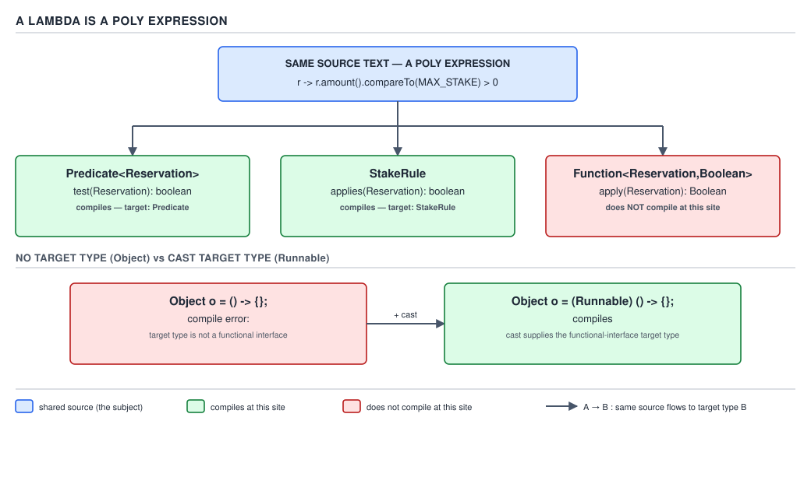
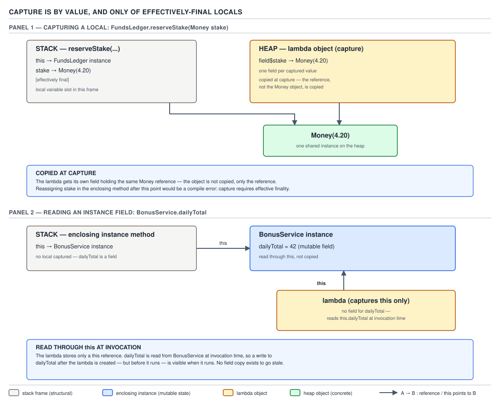
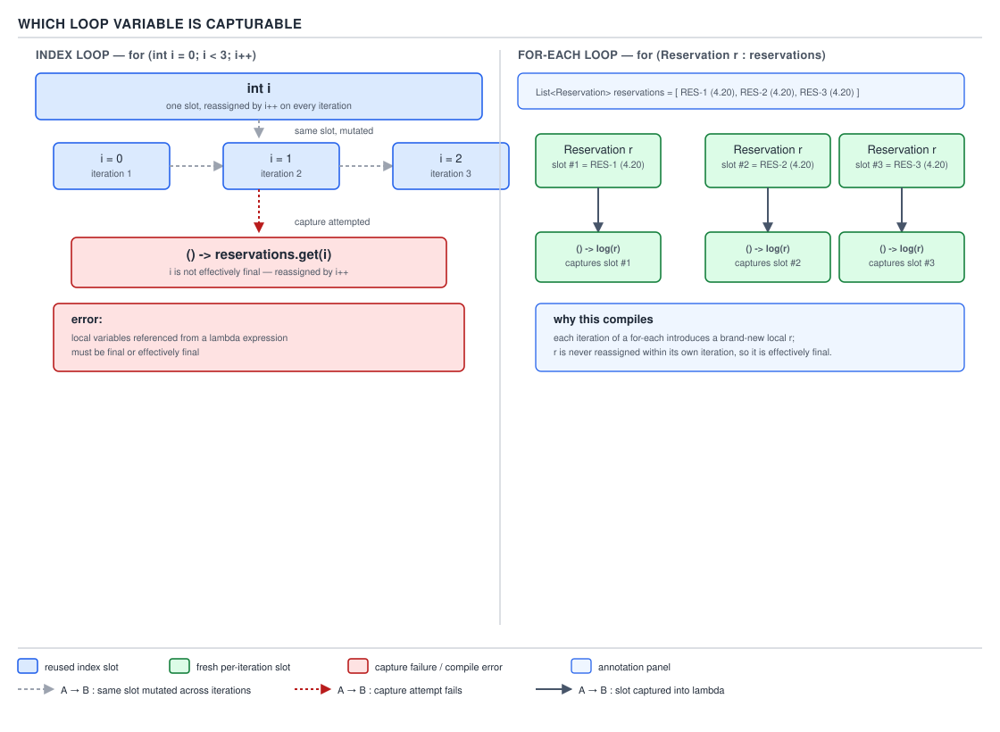

# 04 Modern Java — Lambdas — BASICS (§1.3)

**Target version: Java 21 LTS.** | **Part 1 of 5** | [Index](../00-index.md)
Previous: [Functional interfaces — basics](../functional-interfaces/01-basics.md) · Next: [Lambdas — cost and choice](02-cost-and-choice.md)

The previous file established what a functional interface is and why the compiler needs exactly
one abstract method to hang an implementation off. This file is about the implementation itself:
the lambda expression, the mechanism that turns four keystrokes of syntax into a working instance
of that interface, and the handful of scoping rules that make a lambda behave differently from the
anonymous class it superficially resembles.

## The syntax forms, and what "implicit" versus "explicit" costs you

### Mental model

A lambda is not a miniature method. It is an **expression that produces a value**, and the value it
produces is an instance of whatever functional interface the surrounding code demands. Read
`r -> r.amount().compareTo(MAX_STAKE) > 0` the way you would read `3 + 4`: it has no home of its
own, no declared type, no name — it is a shape that gets poured into whatever mold the compiler
hands it. Everything else in this file follows from taking that sentence literally.

### Why it exists

Before Java 8, the only way to hand a piece of behaviour to a method was an anonymous class:
`new Runnable() { public void run() { ... } }`. The boilerplate — the type name repeated, the
`public void run()` signature repeated, the braces nested one level deeper than the logic
warranted — buried one line of actual behaviour in six lines of ceremony. JSR 335 (lambda
expressions, JEP-less because it predates the JEP process for language changes) removed the
ceremony without removing the underlying mechanism: a lambda still becomes an instance of a
functional interface, it is just spelled without the class body.

### When to reach for it, and when not

Reach for a lambda when the target is a single functional interface and the body is a handful of
expressions. Reach for an anonymous class instead when you need more than one method, need to
declare additional fields, need a constructor, or — see the `this` discussion two sections below —
you specifically want the callback to see itself, not its enclosing object. Reach for a method
reference (covered in file `functional-interfaces/02-...`) when the lambda body is nothing but a
single existing method call; a lambda that only forwards its arguments is a method reference that
has not been simplified yet.

### How it works — the five surface forms

Every lambda has a parameter list and a body, and both vary independently:

| Form | Parameter typing |
|---|---|
| `() -> expr` | zero parameters |
| `x -> expr` | one parameter, no parentheses required |
| `(x, y) -> expr` | two or more parameters, parentheses required |
| `(Type x) -> { ... }` | explicit type, block body |
| `(var x) -> ...` | `var` typing, Java 11 (JEP 323) |

`1.3.2` **You may not mix implicit and explicit parameter typing in the same parameter list.**
`(x, int y) -> ...` is a compile error — every parameter in the list must pick the same lane:
all implicit, all explicit with a real type, or all `var`. The compiler resolves this per lambda,
not per parameter, because inference for one parameter can depend on the target type inferred
for the others, and letting them disagree would make that resolution ill-defined.

`1.3.3` `var` in a lambda parameter list, `(var x) -> ...`, does not add an inference capability
`x -> ...` lacked — both are implicitly typed and the compiler infers the same type either way.
**What `var` buys you is somewhere to attach an annotation or `final`** to a parameter that would
otherwise have to spell out its type just to have a place to put the modifier:
`(@NonNull var reservation) -> reservation.stake()` compiles; `(@NonNull reservation) -> ...`
does not, because a bare implicit parameter has no syntax slot for an annotation. JEP 323 states
this motivation directly — it exists for consistency with local-variable `var` and to let an
implicitly-typed parameter still carry a modifier, not to add a new typing mode. Since `var` is
one of the three lanes, a lambda parameter list is still "all `var`" or none — you cannot write
`(var x, Reservation y) -> ...`.

`1.3.4` The body is either an **expression** (`r -> r.amount()`) or a **block** (`r -> { return
r.amount(); }`). An expression body's value becomes the SAM's return value directly, or is
discarded if the SAM returns `void` (a *statement expression* like a method call is allowed as a
lambda's expression body even against a `void`-returning SAM — see the void/value-compatibility
discussion in the next concept). A block body has no implicit return: **every path that completes
normally, for a value-returning SAM, must reach an explicit `return`**, exactly like a method body.
Falling off the end of a block body that targets a non-`void` SAM is a compile error, not a runtime
one — `missing return statement`.

<a id="d-009"></a>

| Form | Since | Parameter typing | Mixing allowed | QuizStakes example |
|---|---|---|---|---|
| `() -> expr` | Java 8 | none (zero params) | n/a | `() -> bonusService.expireStaleGrants()` |
| `x -> expr` | Java 8 | implicit | no (list must be uniform) | `reservation -> reservation.stake()` |
| `(x, y) -> expr` | Java 8 | implicit | no | `(stake, limit) -> stake.amount().compareTo(limit) <= 0` |
| `(Type x) -> {...}` | Java 8 | explicit | no | `(Reservation r) -> { ledger.record(r); }` |
| `(var x) -> ...` | Java 11 (JEP 323) | `var` (implicit + modifier slot) | no | `(var r) -> r.clientId()` |
| `(final @NonNull var x) -> ...` | Java 11 (JEP 323) | `var` with modifiers/annotations | no | `(final @NonNull var stake) -> ledger.reserve(stake)` |
| block body with `return` | Java 8 | independent of typing lane | n/a | `r -> { if (r.stake().signum() <= 0) throw new IllegalArgumentException(); return r; }` |

**D-009** — Every lambda syntax form

```java
BonusService bonusService = new BonusService(clock);

// () -> expr : zero-arg Runnable registered for a scheduled sweep
Runnable expireSweep = () -> bonusService.expireStaleGrants();

// x -> expr : one implicit-typed parameter
Function<Reservation, Money> stakeOf = reservation -> reservation.stake();

// (x, y) -> expr : two implicit-typed parameters
BiPredicate<Money, Money> withinLimit =
        (stake, dailyLimit) -> stake.amount().compareTo(dailyLimit.amount()) <= 0;

// (Type x) -> { ... } : explicit type, block body
Consumer<Reservation> recordAndLog = (Reservation r) -> {
    System.out.println("recording " + r.clientId());
};

// (var x) -> ... : var typing, only to carry a modifier
Function<Reservation, ClientId> clientOf = (final var r) -> r.clientId();
```

**Pitfall:** writing `(Reservation r, y) -> ...` because "the second one is obvious from context."
It is obvious to the reader; it is not legal to the parser. The fix is either
`(Reservation r, Money y) -> ...` (both explicit) or `(r, y) -> ...` (both implicit, letting target
typing supply both types).

> A lambda expression is an unnamed block of parameters and a body — expression or block — whose
> parameter-list typing must be uniform across the list, and whose only job is to become an
> instance of whatever functional interface the surrounding context supplies.

## The lambda as a poly expression, and target typing

### Mental model

`1.3.5` A lambda is a **poly expression**: unlike `3 + 4`, which is an `int` no matter where you
write it, a lambda's meaning is not fixed by its own text. It behaves like the diamond operator
`<>` or a generic method invocation with no explicit type witness — the compiler has to look
*outward*, at the site the lambda sits in, before it can decide what type the lambda even is. A
lambda with no target is not "a `Runnable` that hasn't been assigned yet"; it is not a value at
all until a target type supplies one.

### Why it exists

The alternative would have been to give every lambda some universal built-in type — imagine
`java.lang.Lambda` — and let assignment conversion handle the rest, the way autoboxing lets an
`int` flow into `Object`. That design was rejected because it would have required a real runtime
type for every lambda, defeating the entire point of `invokedynamic`-based lambda translation
(covered in file `06-jvm-internals`): a lambda that is compiled once and rebound to different SAM
types at different call sites, with no interface implemented until the metafactory says so. Poly
expression status is what lets the same lambda body be converted to `Runnable` at one call site and
to a custom `StakeRule` at another, without ever committing to a fixed type.

### When to reach for it, and when it fights you

You do not "reach for" poly-expression status — it is not optional — but you do need to recognise
the contexts where the compiler *can* supply a target type, because outside them a lambda simply
will not compile.

`1.3.6` The target-typing contexts are: **assignment** (`Predicate<Reservation> p = r -> ...;`),
**method invocation argument** (`stream.filter(r -> ...)`), **cast** (`(Runnable) () -> {}`),
**return** (`return () -> logger.info("done");` from a method declared to return a functional
interface), **ternary branches** (`flag ? (Runnable) a : b`, both branches poly-typed together),
**array initialiser** (`Runnable[] tasks = { () -> {}, () -> {} };`), and **lambda body itself**
(a lambda returning a lambda: `Supplier<Runnable> s = () -> () -> {};`, where the outer lambda's
return position targets the inner one).

### How it works

`1.3.7` `Object o = () -> {};` does not compile, and the reason is not "lambdas can't be
`Object`" as a rule stated by fiat — it falls straight out of the poly-expression definition.
Assignment context does supply a target type here: `Object`. But `Object` is a concrete class, not
a functional interface, so there is no abstract method for the lambda to implement. No functional
interface, no conversion, no value. `[PROVE]` Trace it explicitly: the compiler sees
`Object o = <lambda>`, looks up the target type `Object`, checks whether `Object` is a functional
interface (exactly one abstract method, ignoring `Object`'s own methods per JLS §9.8), finds zero
qualifying abstract methods, and reports `incompatible types: the target type must be a functional
interface`. Adding a cast changes which type is offered as the target: `Object o = (Runnable) () ->
{};` compiles because the **cast operand's target type is `Runnable`**, not `Object` — the lambda
converts to `Runnable` first, and the resulting `Runnable` instance (which is also an `Object`,
because everything is) is what gets assigned. The assignment never needed a lambda-to-`Object`
conversion at all; it needed a `Runnable`-to-`Object` widening reference conversion, which is
unconditionally legal.

`1.3.8` `[PROVE]` Because the lambda has no type of its own, **the identical source text can
implement two unrelated interfaces at two call sites**, as long as each site's target has a
matching shape (one abstract method, matching arity, compatible return). Take
`r -> r.amount().compareTo(MAX_STAKE) > 0`:

```java
interface StakeRule {
    boolean allows(Reservation r);
}

Predicate<Reservation> asPredicate = r -> r.amount().compareTo(MAX_STAKE) > 0;
StakeRule asRule                    = r -> r.amount().compareTo(MAX_STAKE) > 0;
```

Both compile from the same text because `Predicate<Reservation>.test` and `StakeRule.allows` are
structurally identical SAMs: one `Reservation` parameter, `boolean` return. A third attempt,
`Function<Reservation, Boolean> asFunction = r -> r.amount().compareTo(MAX_STAKE) > 0;`, also
compiles — `Function.apply` returns `Boolean`, and the primitive `boolean` result is boxed to
satisfy it — but a fourth, `Function<Reservation, Boolean> broken = r ->
r.amount().compareTo(MAX_STAKE) > 0 ? 1 : 0;`, would not, because the conditional expression's type
is `int`, not compatible with `Boolean` without a lambda-level rule licensing that particular
mismatch (target typing fixes the SAM's shape, not the body's own type errors inside it).

**D-010** — A lambda is a poly expression



`1.3.9` `[TRAP]` `[PROVE]` Target typing gets harder when an overload offers two functional
interfaces with **different arity or incompatible return expectations** at the same argument
position. The classic pair is `Runnable` (`void run()`) versus `Callable<T>` (`T call()`):

```java
void schedule(Runnable task) { }
<T> void schedule(Callable<T> task) { }

schedule(() -> ledger.settleStake(reservationId));   // ambiguous only if settleStake returns T
schedule(() -> { ledger.settleStake(reservationId); });
```

Work through why javac resolves or refuses each. A lambda body is **void-compatible** if every
completing path is a statement expression or a `return;` with no value; it is **value-compatible**
if every completing path returns a value. An **expression body** that is a plain method-call
statement expression — `() -> ledger.settleStake(reservationId)` where `settleStake` returns
`void` — is void-compatible only, so it matches `Runnable` and cannot match `Callable<T>` at all;
no ambiguity. But if `settleStake` returns `SettlementResult`, the same text
`() -> ledger.settleStake(reservationId)` becomes **both**: void-compatible (a value-returning
call used as a statement, its result simply discarded) **and** value-compatible (the same call, its
result taken as `T`). When a lambda body is compatible with *both* shapes and *both* overloads are
otherwise equally applicable, javac cannot pick a most-specific method by return type alone (Java
has never overloaded on return type) and reports `reference to schedule is ambiguous`. The block
body `() -> { ledger.settleStake(reservationId); }` sidesteps this because a block with no explicit
`return` statement is void-compatible only, however the enclosed expression is typed — a block
never automatically returns its last expression's value.

**Pitfall:** assuming the ambiguity is about `Runnable` "versus" `Callable` in general. It is not —
the two coexist as overloads all the time. The ambiguity is specific to a lambda body shaped so
that it is legal under either interpretation; a lambda body that is unambiguously one or the other
never triggers it.

**Interview:** "Why does `executor.submit(() -> doWork())` sometimes fail to compile when
`ExecutorService` overloads `submit(Runnable)` and `submit(Callable<T>)`?" — one line: it only fails
when `doWork()`'s return type makes the lambda body both void- and value-compatible, at which point
javac has two equally applicable overloads and no return-type tiebreaker, so you disambiguate with
an explicit cast, e.g. `submit((Runnable) () -> doWork())`.

> A lambda has no type of its own; it is a poly expression whose meaning is filled in by the target
> type at its use site — a functional interface offered by assignment, an argument slot, a cast, a
> `return`, a ternary branch, an array initialiser, or an enclosing lambda's body — and it fails to
> compile at any site that cannot supply one.

## Lexical transparency: no new scope, and what that does to `this`

### Mental model

An anonymous class body is a real class body: it gets its own `this`, its own naming scope, its
own everything, wrapped around the one method you actually wanted. A lambda body is **spliced
into the enclosing method as-is** — as if you had pasted the lambda's statements directly at the
call site and let a private synthetic method carry them. `1.3.10` `[TRAP]` `[X-REF 03]` This
property is called **lexical transparency**, and it is the single fact that explains every
difference in this section: `this`, `super`, local-variable shadowing, and (as file 03 covers in
full) the compiled implementation as a synthetic private method rather than a nested class.

### Why it exists

Anonymous classes predate lambdas and already had a `this`-binding rule inherited from ordinary
inner classes — one that was invisible until you actually needed the enclosing instance and had to
write `Outer.this`. When lambdas were designed, giving them the same rule would have meant every
callback silently created a new naming scope and a new `this`, purely to preserve a translation
strategy inherited from a different feature. The language designers instead chose the strategy
that matches what most callback code actually wants: *this piece of logic belongs to the method it
was written in*, and should see exactly what that method sees.

### When it matters, and the anonymous-class alternative

Reach for the lexically transparent behaviour — i.e. write a lambda — whenever the callback
conceptually acts on behalf of its enclosing object. Reach for an anonymous class instead
specifically when the callback needs to refer to **its own identity**, not the enclosing one — for
example, a listener that needs to unregister itself by reference (`removeListener(this)` from
inside the listener body only works if `this` is the listener, which requires an anonymous or named
class, never a lambda).

### How it works

`1.3.11` `[TRAP]` Inside a lambda, `this` is the *enclosing* instance — the same `this` you would
get by writing `this` one line above the lambda, outside it. Inside an anonymous class, `this` is
the anonymous instance itself, and reaching the enclosing instance requires the qualified form
`Outer.this`. This is, in practice, the most consequential single fact when porting old anonymous-
class code to a lambda: any anonymous-class body that says `this.someField` almost always meant the
*anonymous* instance's field (usually none, falling through to the enclosing instance implicitly
only if the anonymous class declares no such field) — but the same text pasted into a lambda body
means the enclosing instance's field unconditionally, because a lambda never has fields of its own
to shadow with.

`1.3.12` `[TRAP]` `[PROVE]` A direct consequence of having no new scope: **a lambda parameter may
not shadow a local variable already in scope at the point the lambda is written.**

```java
Reservation reservation = ledger.reservationFor(clientId);
Function<Reservation, Money> stakeOf =
        reservation -> reservation.stake();   // compile error: variable reservation already defined in an enclosing scope
```

An anonymous class may shadow that same name freely, because its method parameter lives inside a
genuinely new scope:

```java
Function<Reservation, Money> stakeOf = new Function<>() {
    public Money apply(Reservation reservation) {   // legal: new scope, shadowing is fine
        return reservation.stake();
    }
};
```

**D-011** — `this` in a lambda versus an anonymous class


```java
class BonusService {
    private final Clock clock;

    void registerExpirySweepLambda() {
        Runnable sweep = () -> System.out.println(this.clock.instant());   // this == BonusService instance
        scheduler.submit(sweep);
    }

    void registerExpirySweepAnonymous() {
        Runnable sweep = new Runnable() {
            public void run() {
                System.out.println(this.clock);   // compile error: Runnable has no clock field —
                                                    // this is the anonymous Runnable$1 instance
                System.out.println(BonusService.this.clock.instant());   // qualified form required
            }
        };
        scheduler.submit(sweep);
    }
}
```

**Pitfall:** copy-pasting an anonymous-class callback into a lambda and finding a compile error on
a parameter name that used to shadow an outer local. The wrong belief is "lambda parameters behave
like method parameters everywhere, including shadowing." The right model: a lambda parameter lives
in the *same* scope as the code around it, so it collides with anything already declared there,
exactly the way a second declaration of the same local variable in the same block would. Rename
the parameter or the outer local; there is no annotation or syntax to force the shadow.

> A lambda body is lexically transparent — it introduces no new scope for names, `this`, or
> `super` — so `this` always denotes the enclosing instance and a lambda parameter can never
> shadow a local already visible at that point, unlike an anonymous class body, which is a real
> class with its own `this` and its own naming scope.

## Capture: by value, effectively-final only, and what the loop variable actually is

### Mental model

`1.3.13` A lambda that reads a local variable from its enclosing scope does not reach out and read
that variable live every time it runs — it takes a **snapshot at the moment the lambda object is
created**, one field per captured local, copied in. Reading an instance field, by contrast, is not
a capture of the field at all: the lambda captures `this`, and every field read goes through `this`
live, exactly as it would from an ordinary method body.

### Why it exists

A lambda frequently outlives the stack frame it was written in — it gets handed to an executor, a
stream pipeline, an event bus, and runs later, possibly on another thread, possibly after the
enclosing method has already returned and its local variables no longer exist on any stack. Copying
the value at capture time sidesteps that lifetime mismatch entirely: the lambda does not need the
original stack frame to still exist, because it never reads from it after construction. The price
of that safety is the restriction paired with it.

### When it bites, and the escape hatch

`[PROVE]` A captured local must be **effectively final**: never assigned again anywhere in its
scope after initialisation, whether or not you write the `final` keyword. This is not an arbitrary
style rule — it is required by the "copy once, at capture" mechanism itself. If the source local
could still be reassigned after the lambda captured its old value, the copy and the original would
silently diverge, and which value the lambda "should" see would be undefined. The compiler refuses
to let that ambiguity exist by rejecting the capture outright at compile time rather than leaving a
stale-read bug for runtime.

### How it works

```java
class FundsLedger {
    Reservation reserveStake(ClientId clientId, Money stake) {
        // stake is effectively final: never reassigned after this point
        Supplier<Movement> movementFactory =
                () -> new Movement(clientId, stake, MovementType.STAKE_RESERVED);
        return ledger.apply(movementFactory.get());
    }
}
```

`stake` is captured **by value**: the lambda gets its own field holding the same `Money` reference
`stake` held at the moment `reserveStake` created the lambda. Because `Money` itself is an
immutable record, "captured by value" and "captured by reference to an immutable object" collapse
into the same observable behaviour here — but the mechanism is still a value copy of the
*reference*, not a deep copy of the `Money` object; two lambdas capturing the same `stake` local
would each get their own field pointing at the *same* `Money` instance, and would observe any
mutation an aliasing caller performed on that instance's *mutable* fields, if it had any. `Money`
being immutable is what makes this observationally indistinguishable from "captured by value all
the way down" — it is not evidence that Java copies objects on capture.

**D-012** — Capture is by value, and only of effectively-final locals



Contrast the instance-field case directly, because it is the other half of the same diagram:

```java
class BonusService {
    private Money dailyTotal = Money.zero(Currency.GBP);

    Runnable creditSweep(Money amount) {
        return () -> {
            dailyTotal = dailyTotal.plus(amount);   // reads/writes dailyTotal through `this` at invocation time
        };
    }
}
```

`dailyTotal` is never captured as a field of the lambda — there is no snapshot of it at all. The
lambda captures `this` (a `BonusService` reference, itself effectively final in this method), and
every access to `dailyTotal` inside the lambda body compiles to a field access through that
captured `this`, resolved **at invocation time**, not at capture time. A write to `dailyTotal` by
some other code between capture and invocation is visible to the lambda; a reassignment of the
local `amount`, if the language allowed one, would not be, because `amount` is captured by value.

`1.3.15` `[TRAP]` `[PROVE]` Loop variables split cleanly along this same line, and it is one of the
most commonly misdiagnosed traps in the language:

```java
List<Runnable> tasks = new ArrayList<>();

for (int i = 0; i < reservations.size(); i++) {
    int index = i;                                    // extra local needed
    tasks.add(() -> System.out.println(reservations.get(index).clientId()));
    // tasks.add(() -> System.out.println(reservations.get(i).clientId()));
    // ^ compile error: i is reassigned by i++ every iteration, so it is not effectively final
}

for (Reservation r : reservations) {
    tasks.add(() -> System.out.println(r.clientId()));   // compiles: r is a fresh variable per iteration
}
```

The classic `for` loop's index `i` is **one variable**, mutated in place by `i++` on every
iteration — never effectively final, so a lambda inside the loop body cannot capture it directly;
you need a second, per-iteration local (`int index = i;`) to have anything capturable. The
enhanced `for` loop's `r` is different at the language level: the JLS specifies it as a **fresh
declaration on every iteration** — semantically equivalent to redeclaring `Reservation r =
iterator.next();` inside the loop body each time round — so each iteration's `r` is its own
variable, assigned exactly once, and each lambda created inside that iteration captures its own
copy. Three lambdas created across three iterations of the enhanced loop capture three different
`Reservation` values; three lambdas that somehow captured the classic loop's raw `i` (if the
compiler allowed it) would all have captured the same mutable variable and would all print
whatever `i` held at whatever moment each one happened to run — almost certainly the loop's final
value, not the value at the iteration that created them.

**D-013** — Which loop variable is capturable



**Pitfall:** believing "you can't capture loop variables in Java." You can — the enhanced `for`'s
variable, and any local you deliberately re-bind per iteration, are both fine. The rule that trips
people is narrower and more mechanical than "loops are dangerous": *any* local that is reassigned
after its first assignment, loop or not, fails effectively-final, and the classic `for` index is
simply the most common local that happens to violate it.

**Interview:** "Why does capturing the loop variable in a classic `for` fail to compile, but the
same pattern in a for-each loop works?" — one line: the classic `for`'s index is one variable
mutated by the increment, so it is never effectively final; the for-each's variable is a fresh
declaration every iteration, so each one individually satisfies effectively-final and is safe to
capture.

> Capture copies a local's value once, at the moment the lambda instance is created, and only
> compiles for locals that are effectively final; an instance field is never captured at all — the
> lambda captures the enclosing `this` and reads the field through it live, at invocation time, and
> the enhanced `for` loop's per-iteration variable is capturable for the same reason a classic
> `for` index is not: whether the variable is reassigned after its first assignment.

## Mutating something from inside a lambda: four ways, one right answer

### Mental model

Given that capture is a one-time value copy, "I want to increment a counter from inside a lambda"
is not a small syntax problem — it is a request to violate the mechanism directly. Every technique
below is a way of keeping the *thing being mutated* off the effectively-final local entirely, so
the lambda captures a stable reference to a mutable container instead of trying to capture a
changing primitive.

### Why it exists

`1.3.14` `[TRAP]` The itch is universal: a `forEach` or a stream pipeline that needs to accumulate
a running count, and the intuitive `int count = 0; stream.forEach(x -> count++);` does not compile
— `count` is reassigned by `count++`, so it fails effectively-final before the mutation problem
even gets considered.

### When to reach for which, and when not

The QuizStakes case: counting reservations belonging to a client currently under a
`STAKE_BLOCKED` restriction.

**D-014** — Four ways to mutate from inside a lambda, and the one that is right

| Approach | Compiles | Thread-safe in parallel | Allocation cost | Readability | Verdict |
|---|---|---|---|---|---|
| One-element array hack: `int[] count = {0}; stream.forEach(r -> { if (blocked(r)) count[0]++; });` | yes | no — unsynchronised `count[0]++` races | one array, one boxed-free slot | poor — signals "I am fighting the compiler" | never use it |
| `AtomicInteger count = new AtomicInteger(); stream.forEach(r -> { if (blocked(r)) count.incrementAndGet(); });` | yes | yes | one object allocation | mediocre — the type says "mutable box," not "count" | acceptable only as a stopgap |
| `long blocked = reservations.stream().filter(this::isBlocked).count();` | yes | yes (stateless pipeline) | none beyond the stream machinery | good — states the intent directly | preferred for simple counting |
| `Collectors.counting()` inside a `groupingBy` when the count is per-key: `Map<ClientId, Long> perClient = reservations.stream().filter(this::isBlocked).collect(groupingBy(Reservation::clientId, counting()));` | yes | yes | one map, boxed `Long` per key | good for the grouped case specifically | preferred when grouping is also needed |
| A plain loop: `long blocked = 0; for (Reservation r : reservations) { if (isBlocked(r)) blocked++; }` | yes (no lambda involved) | n/a — sequential by construction | none | best for a one-off sequential count | preferred when you are not already inside a stream pipeline |

```java
long blockedReservations = reservations.stream()
        .filter(r -> restrictions.hasActive(r.clientId(), RestrictionType.STAKE_BLOCKED))
        .count();
```

**Pitfall:** reaching for `AtomicInteger` as the default fix the moment `effectively final` shows
up in a compiler error. `AtomicInteger` earns its place when you genuinely need a mutable,
thread-visible counter shared across concurrently executing lambdas — a parallel stream's shared
accumulator that cannot be expressed as a proper reduction, or a callback fired from multiple
threads. For a plain sequential count, `count()`, `reduce`, or a collector is both faster (no
per-increment volatile write) and reads as what it is.

> Capture forces every technique for lambda-visible mutable state to route through a stable
> reference to a mutable object rather than through the captured local itself — `Collectors`,
> `reduce`, and `AtomicInteger` all follow this shape; the one-element-array hack follows it too,
> which is why it compiles, but it buys none of the safety the named alternatives do.

## Supporting facts

**Checked exceptions inside a lambda body.** `1.3.16` If a lambda body can throw a checked
exception that the SAM's abstract method does not declare in its `throws` clause, the lambda fails
to compile — the SAM's signature is the contract the lambda must satisfy, exactly as if you had
written a method with that signature and that body. `Callable<T>` declares `throws Exception`, so a
checked-throwing body compiles there; `Supplier<T>` declares nothing, so the same body does not.
File `02-cost-and-choice.md`, §2.2, covers the four workarounds in full: wrapping in an unchecked
exception, declaring a custom functional interface with the checked `throws`, catching and
rethrowing inside the lambda body, and library helpers (`Unchecked` variants) that sneaky-throw.
**Pitfall:** assuming you can simply add `throws IOException` to the lambda the way you would to a
method — a lambda expression has no syntax slot for its own `throws` clause; it inherits whatever
the target SAM declares, nothing more.

**Recursion.** `1.3.17` `[TRAP]` `[PROVE]` A lambda cannot refer to the local variable it is in the
process of being assigned to, because that local is not yet definitely assigned at any point during
the initializer's evaluation:

```java
Function<Integer, Integer> factorial = n -> n <= 1 ? 1 : n * factorial.apply(n - 1);
// compile error: cannot reference a variable before it is definitely assigned
```

Three fixes exist. Promote it to a field, which is definitely assigned (to `null`, then later to
the lambda) before the lambda body ever runs: `private Function<Integer, Integer> factorial = n ->
n <= 1 ? 1 : n * factorial.apply(n - 1);` compiles as a field initializer because instance fields
do not carry the local-variable definite-assignment restriction. Split the declaration from the
assignment: `Function<Integer, Integer>[] holder = new Function[1]; holder[0] = n -> n <= 1 ? 1 :
n * holder[0].apply(n - 1);` — the array element is not itself subject to definite-assignment
checking the way a bare local is. Or, cleanest, extract a real (possibly `private static`) method
and reference it: `private static int factorial(int n) { return n <= 1 ? 1 : n * factorial(n - 1);
}`, then `Function<Integer, Integer> factorial = Lambdas::factorial;` — a method reference, not a
lambda, sidesteps the whole problem because the method name resolves independently of any local's
assignment state. **Pitfall:** trying `final Function<Integer, Integer> factorial;` split across two
statements to "give javac time" — splitting declaration and assignment does not help, because the
reference inside the lambda body still executes before the assignment completes on first call, and
the compiler still reports the local as not definitely assigned at the point the lambda references
it.

**Generics on a lambda.** `1.3.18` A lambda's own syntax has no place to declare type parameters —
you cannot write `<T> (T x) -> x`. Any generic behaviour comes entirely from the **target SAM's**
type variables being instantiated by the target type at the point of conversion: assigning a
lambda to `Function<Reservation, Money>` instantiates the SAM's `T` and `R` as `Reservation` and
`Money` before the lambda body is even type-checked against it. This is why a lambda can be
polymorphic in effect (the same source reused against different instantiations of a generic SAM at
different call sites, per `1.3.8`) without ever being polymorphic in its own declaration.

**Serializable lambdas.** `1.3.19` `[RESEARCH]` A lambda is `Serializable` only if its **target
type** is the intersection `Runnable & Serializable` (or any functional interface that itself
extends `Serializable`), reached with an intersection cast: `Runnable r = (Runnable & Serializable)
() -> ledger.flush();`. On serialization, the JDK does not serialize the synthetic lambda class
directly — the metafactory generates a `writeReplace` that substitutes a `SerializedLambda` object,
which records the capturing class, the SAM's method descriptor, the implementation method handle
kind, and the captured argument values; deserialization resolves this back through a
`readResolve`-style hook on the capturing class, effectively re-running the metafactory logic to
reconstruct an equivalent lambda instance. This path is documented as expensive relative to
ordinary serialization and brittle across refactors — renaming the capturing class, or even
changing the lambda's position in the file (which shifts its synthetic method name, covered in
`1.3.22` below), can break deserialization of previously-serialized instances, because the
`SerializedLambda` payload references that synthetic method by name. **Unverified:** the exact set
of JDK version deltas to `SerializedLambda`'s field layout was not independently re-checked against
the jdk-21+35 source for this file; treat the mechanism description above as correct and the
byte-level payload shape as needing a source read before you rely on it in a compatibility-critical
system.

**Annotated and `final` lambda parameters.** `1.3.20` An explicitly typed lambda parameter may
carry annotations and `final` exactly like a method parameter: `(final @NonNull Reservation r) ->
...`. This is unremarkable for an explicit type; `1.3.3` above is the interesting case, because
it is what lets an *implicitly* typed parameter get the same treatment via `var`.

**Return-type inference for expression bodies.** `1.3.21` `[PROVE]` An expression body's "type" for
compatibility purposes is not a single fixed thing — it depends on which SAM shape you check it
against. `r -> ledger.record(r)`, where `record` returns `void`, is void-compatible only, matching
any SAM whose method returns `void`. `r -> ledger.reserveStake(r.clientId(), r.stake())`, where
`reserveStake` returns a `Reservation`, is value-compatible, matching any SAM whose method returns
a compatible type — but as `1.3.9` showed, a value-returning statement-expression body is
simultaneously void-compatible *and* value-compatible, because a value-returning method call is
always also legal as a bare statement with the result discarded. A body that is genuinely
value-compatible only — for instance `r -> r.stake()`, a field/accessor access rather than a call —
cannot be used against a `void`-returning SAM at all, because a bare local variable or field-access
expression is not a legal Java statement on its own.

**Debugging: what shows up in a stack trace.** `1.3.22` `[RESEARCH]` `[VERSION-TRAP]` A lambda has
no source-level name, so the JVM manufactures two names for diagnostics. The **synthetic
implementation method** the compiler generates for the lambda body appears in stack traces as
`EnclosingClass.lambda$enclosingMethodName$N` — for example `BonusService.lambda$registerExpirySweepLambda$0`
— where `N` is a zero-based index over the lambda expressions written inside that same enclosing
method, in source order; adding or removing an earlier lambda in the same method shifts every later
one's index. The **generated hidden class** created at first use by the `LambdaMetafactory` gets a
name of the shape `EnclosingClass$$Lambda/0x<hex-identity-hash>`, printed by `getClass().getName()`
or in a heap dump — the `0x...` suffix is derived from the class's identity at that JVM run and is
**not stable across runs or across JVM versions**, so it is safe to match on the `$$Lambda` shape in
tooling but never on the hex suffix itself. Both name shapes are compiler/runtime implementation
details rather than a specified format guaranteed by the JLS, and the exact naming scheme has
changed once already in the language's history (an older `$$Lambda$N` numeric-suffix shape,
pre-hidden-classes, on JDK releases before hidden-class-based lambda generation); state which shape
you observed and on which JDK when it matters, rather than asserting one shape as universal.

## Pitfalls

### Mixing implicit and explicit parameter typing in one lambda

**Wrong**
```java
BiFunction<Reservation, Money, Boolean> withinLimit =
        (r, Money limit) -> r.stake().amount().compareTo(limit.amount()) <= 0;
// error: lambda parameters (r, Money limit) cannot mix implicit and explicit types
```

**Right**
```java
BiFunction<Reservation, Money, Boolean> withinLimit =
        (r, limit) -> r.stake().amount().compareTo(limit.amount()) <= 0;   // both implicit
```

**Why people believe it:** ordinary method parameter lists never enforce this — a method can have
some parameters that "look inferred" via generics and others fully spelled out, so it feels like
lambda parameters should tolerate the same mix. They do not, because the compiler resolves the
whole parameter list's typing lane as one decision, not parameter by parameter.

### Treating `this` inside a ported lambda as the old anonymous instance

**Wrong**
```java
// ported from an anonymous class without re-checking `this`
Runnable sweep = () -> {
    this.notifyListener(this);   // now means BonusService.this, not "the Runnable itself"
};
```

**Right**
```java
// if the callback genuinely needs to reference its own instance, keep the anonymous class
Runnable sweep = new Runnable() {
    public void run() {
        notifyListener(this);   // this == the Runnable instance, as intended
    }
};
```

**Why people believe it:** the two forms look interchangeable at every other call site, so the
belief "a lambda is just a shorter anonymous class" survives until the one line that reads `this`
proves it wrong.

### Shadowing an enclosing local with a lambda parameter

**Wrong**
```java
Reservation reservation = ledger.reservationFor(clientId);
Function<Reservation, Money> stakeOf = reservation -> reservation.stake();
// error: variable reservation is already defined in the enclosing scope
```

**Right**
```java
Reservation currentReservation = ledger.reservationFor(clientId);
Function<Reservation, Money> stakeOf = reservation -> reservation.stake();   // no collision
```

**Why people believe it:** an anonymous class's method parameter shadows freely, and most engineers
learn lambdas by analogy to anonymous classes rather than by learning the lexical-transparency rule
directly.

### Capturing the classic `for` loop's index

**Wrong**
```java
for (int i = 0; i < reservations.size(); i++) {
    tasks.add(() -> System.out.println(reservations.get(i).clientId()));
    // error: variable i is not effectively final
}
```

**Right**
```java
for (int i = 0; i < reservations.size(); i++) {
    int index = i;
    tasks.add(() -> System.out.println(reservations.get(index).clientId()));
}
```

**Why people believe it:** the enhanced `for` loop's variable behaves as if it were fresh per
iteration, and engineers generalise that behaviour to "loop variables are always capturable"
without noticing the classic `for`'s index is a single mutated variable, not a fresh one.

### Overload ambiguity between `Runnable` and `Callable<T>`

**Wrong**
```java
void schedule(Runnable task) { }
<T> void schedule(Callable<T> task) { }

schedule(() -> ledger.settleStake(reservationId));
// error: reference to schedule is ambiguous, when settleStake(..) returns a value
```

**Right**
```java
schedule((Runnable) () -> ledger.settleStake(reservationId));
// or
schedule(() -> { ledger.settleStake(reservationId); });   // block body forces void-compatible only
```

**Why people believe it:** in ordinary overload resolution a value-returning versus `void`-returning
method call is never ambiguous, so engineers do not expect a lambda body to be classifiable as
*both* shapes at once — but a value-returning statement expression genuinely is both
void-compatible and value-compatible, which is the source of the ambiguity.

### Self-referencing a lambda from its own initializer for recursion

**Wrong**
```java
Function<Integer, Integer> factorial = n -> n <= 1 ? 1 : n * factorial.apply(n - 1);
// error: factorial might not have been initialized
```

**Right**
```java
private static int factorial(int n) {
    return n <= 1 ? 1 : n * factorial(n - 1);
}
Function<Integer, Integer> factorial = Lambdas::factorial;   // method reference, no self-capture problem
```

**Why people believe it:** the same pattern works for a named recursive method without any special
handling, so it looks like it should work identically for a variable holding a lambda — but the
local's definite-assignment state, not the lambda's own logic, is what blocks it.

## Cheat sheet

| Rule | One line |
|---|---|
| Mixing typing lanes | Every parameter in one lambda must be implicit, explicit-typed, or `var` — never mixed |
| `var` in a lambda parameter | Only buys a modifier/annotation slot on an implicitly-typed parameter (Java 11, JEP 323) |
| Block body | Must `return` on every value-returning path; no implicit last-expression return |
| Poly expression | A lambda has no type of its own; the target type at the use site supplies the functional interface |
| Target-typing contexts | assignment, method argument, cast, `return`, ternary, array initialiser, lambda body |
| `Object o = () -> {};` | Fails — `Object` is not a functional interface. Cast to the SAM first |
| Overload ambiguity | Value-returning statement-expression body is both void- and value-compatible → cast to disambiguate |
| `this` in a lambda | Always the enclosing instance — no new scope is created |
| `this` in an anonymous class | The anonymous instance; use `Outer.this` for the enclosing one |
| Parameter shadowing | Illegal in a lambda; legal in an anonymous class |
| Capture | By value, once, at lambda-creation time; requires the local be effectively final |
| Instance field access | Not a capture — reached live through the captured `this` |
| Classic `for` index | Not effectively final — cannot be captured directly |
| Enhanced `for` variable | Fresh per iteration — capturable, each lambda gets its own copy |
| Mutating a counter | Prefer `count()` / a collector / a plain loop; `AtomicInteger` only for genuine shared concurrent state; never the one-element-array hack |
| Checked exceptions | Lambda body may only throw what the target SAM's method declares |
| Recursive self-reference | Illegal from a local initializer; use a field, a two-step split, or a method reference |
| Generics on a lambda | None of its own — inherited entirely from the target SAM's instantiated type variables |
| Serializable lambda | `(Interface & Serializable) lambda`, backed by `SerializedLambda`; slow and brittle across refactors |
| Stack trace name | `Enclosing.lambda$method$N` (synthetic method) and `Enclosing$$Lambda/0x...` (generated hidden class) |

## Self-test

**Q1.** Why does `(x, int y) -> x + y` fail to compile even though `int y` is a perfectly legal
explicit parameter on its own?

<details><summary>Answer</summary>

Because a lambda's parameter-list typing is resolved as one decision across the whole list, not
parameter by parameter: every parameter must be implicit, every parameter must be explicitly
typed, or every parameter must use `var`. `x` is implicit and `int y` is explicit, so the list
mixes two lanes, which the compiler rejects regardless of whether each parameter would be legal in
isolation.

</details>

**Q2.** `Object o = () -> {};` fails to compile, but `Object o = (Runnable) () -> {};` succeeds.
Explain the mechanism, not just the outcome.

<details><summary>Answer</summary>

A lambda is a poly expression with no type of its own; it needs a target type that is a functional
interface. In the first line, the target type offered by the assignment context is `Object`,
which is a concrete class with no single abstract method, so there is nothing for the lambda to
implement and compilation fails. In the second line, the cast operand supplies `Runnable` as the
target type for the lambda specifically — the lambda converts to a `Runnable` instance first — and
only then does a `Runnable`-to-`Object` widening reference conversion (always legal) complete the
assignment. The `Object` variable never receives a lambda-to-`Object` conversion at all.

</details>

**Q3.** What is different, mechanically, about `this` inside a lambda versus inside an anonymous
class implementing the same interface?

<details><summary>Answer</summary>

A lambda body is lexically transparent — it introduces no new scope — so `this` inside it refers to
whatever `this` referred to immediately outside the lambda: the enclosing instance. An anonymous
class body is a genuine new class with its own instance, so `this` inside it refers to that
anonymous instance; reaching the enclosing instance from inside an anonymous class requires the
qualified form `Outer.this`.

</details>

**Q4.** Why can a lambda inside an enhanced `for` loop capture the loop variable, but a lambda
inside a classic `for` loop cannot capture the index variable directly?

<details><summary>Answer</summary>

Capture requires the captured local to be effectively final. The classic `for` loop's index is one
variable, reassigned every iteration by the increment expression, so it is never effectively final
and cannot be captured. The enhanced `for` loop's variable is specified as a fresh declaration on
every iteration — equivalent to redeclaring it inside the loop body each time — so each iteration's
instance of the variable is assigned exactly once and independently satisfies effectively-final,
making it capturable, with each lambda created in a given iteration capturing that iteration's own
copy.

</details>

**Q5.** A lambda passed to an overload of `schedule` accepting either `Runnable` or `Callable<T>`
sometimes compiles and sometimes reports an ambiguous-reference error, using the exact same call
site shape (`() -> someMethod()`). What decides which happens?

<details><summary>Answer</summary>

It depends on `someMethod`'s return type. If it returns `void`, the lambda body is void-compatible
only, so it matches `Runnable` and cannot match `Callable<T>` — no ambiguity. If it returns a value,
the same statement-expression body is both void-compatible (as a statement, the value discarded)
and value-compatible (as a `Callable<T>`'s returned value), so both overloads are equally
applicable and javac cannot pick one, since Java never overloads on return type. Disambiguate with
an explicit cast to whichever interface is intended, or force void-compatibility with a block body
that has no `return`.

</details>

**Q6.** Why does instance-field capture behave differently from local-variable capture, given that
both look like "the lambda reads something from outside itself"?

<details><summary>Answer</summary>

A local variable is captured by value: the lambda gets its own field holding a one-time copy of
the local's value, taken when the lambda instance is created, which is why the local must be
effectively final — the copy and the (hypothetically still-mutable) original could otherwise
diverge with no defined answer for which value is correct. An instance field is never captured at
all; the lambda instead captures the enclosing `this`, and every field access inside the lambda
body is a live access through that captured `this`, resolved at invocation time — so a later write
to the field, by any code holding the same instance, is visible inside the lambda.

</details>

**Q7.** Rank the one-element-array hack, `AtomicInteger`, and `Collectors.counting()` for counting
matching elements in a sequential stream, and justify the ranking.

<details><summary>Answer</summary>

`Collectors.counting()` (or the simpler `Stream.count()` for an unconditioned count) ranks highest:
it states the intent directly, needs no extra allocation beyond the stream machinery, and is
correct under both sequential and parallel execution without any locking concerns. `AtomicInteger`
ranks second: it compiles and is thread-safe, but it allocates an object purely to hold a counter
and reads less clearly than a proper terminal operation. The one-element-array hack ranks last: it
compiles by exploiting the fact that array-element mutation is not itself a reassignment of the
array reference (so the array variable stays effectively final), but the mutation `count[0]++` is
completely unsynchronised, so it silently produces wrong counts the moment the stream runs in
parallel, with no compiler warning anywhere in the chain.

</details>

**Q8.** What must be true of the `factorial.apply(n - 1)` self-reference for `Function<Integer,
Integer> factorial = n -> n <= 1 ? 1 : n * factorial.apply(n - 1);` to fail, and what is the
smallest change that fixes it without introducing a new named method?

<details><summary>Answer</summary>

It fails because, at the point the lambda body references `factorial`, the local variable
`factorial` is not yet definitely assigned — its own initializer is still being evaluated. Java's
definite-assignment rules apply to local variables regardless of whether the reference is "inside a
lambda that will only run later"; the compiler checks assignment state textually, not by reasoning
about when the lambda body will actually execute. The smallest fix that avoids introducing a
separately named method is to promote `factorial` to an instance or static field: a field is
definitely assigned (implicitly to its default value, then to the lambda) before any code that
could invoke the lambda runs, so the same self-reference inside the lambda body compiles
unchanged.

</details>

**Q9.** Why is a `Serializable` lambda described as "slow and brittle," and what specifically makes
it brittle across code changes rather than merely slow?

<details><summary>Answer</summary>

It is slow because serialization does not write the generated lambda class directly; it substitutes
a `SerializedLambda` object carrying enough metadata (capturing class, SAM descriptor,
implementation method reference, captured arguments) to reconstruct an equivalent lambda on
deserialization, and that reconstruction re-invokes metafactory-style resolution rather than a
plain field-by-field object read. It is brittle because that metadata includes the synthetic
implementation method's generated name (the `lambda$method$N` scheme covered under debugging), and
that name shifts whenever an earlier lambda in the same enclosing method is added, removed, or
reordered — a previously serialized `SerializedLambda` can therefore fail to resolve against a
recompiled version of the capturing class even when the capturing method's *logic* has not
meaningfully changed.

</details>

## Deferred

None.

## Open questions

- `1.3.19` The exact field layout and any version-to-version changes in
  `java.lang.invoke.SerializedLambda`'s serialized form were not verified against the jdk-21+35
  source for this file. Settle it by reading
  `https://raw.githubusercontent.com/openjdk/jdk/jdk-21%2B35/src/java.base/share/classes/java/lang/invoke/SerializedLambda.java`
  directly before relying on the byte-level shape in a compatibility-sensitive context.
- `1.3.22` The claim that lambda naming has changed exactly once across JDK history (pre- versus
  post-hidden-class generation) was stated from general knowledge of the feature's evolution, not
  from a side-by-side diff of `LambdaMetafactory` across specific release tags. Settle it by
  comparing `java.lang.invoke.InnerClassLambdaMetafactory` (or its successor) across two release
  tags that bracket the hidden-class transition.

---

**Leaves covered:** 1.3.1–1.3.22 (22 leaves)
**Leaves deferred:** none
**Diagrams included:** D-009, D-010, D-011, D-012, D-013, D-014
**Target version:** Java 21 LTS
**Lines:** 947
