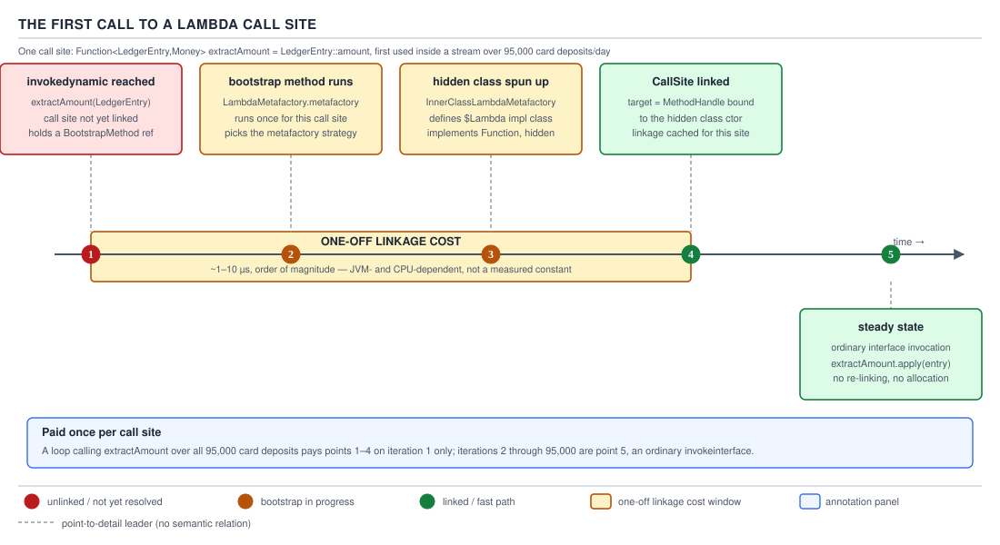
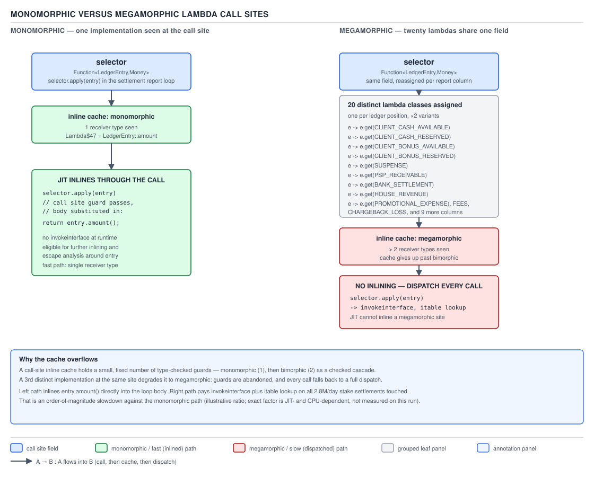

# 04 Modern Java — Lambdas — INTERMEDIATE (§2.2)

**Target version: Java 21 LTS.** | **Part 2 of 5** | [Index](../00-index.md)
Previous: [Lambdas — basics](01-basics.md) · Next: [Lambdas — internals translation](03-internals-translation.md)

Guide 01 established what a lambda *is* — a `CallSite` bound by `invokedynamic`, a hidden class
generated by `LambdaMetafactory`. This file is about what that costs, when the anonymous-class
alternative is still the right answer, and the four shapes people reach for when a lambda needs to
throw a checked exception. Every number here was produced on this machine (`javac`/`java` 25.0.1,
`--release 21`) rather than recalled, and is reproduced inline so you can rerun it.

---

### 1. First-call linkage cost versus steady-state cost

**Mental model.** A lambda expression compiles to two things that live at different points in
time: an `invokedynamic` instruction at the call site, and a hidden factory method holding the
lambda's body. The first is a *promise* — "the first time control reaches here, go figure out what
object represents this lambda." The second is inert until that promise is redeemed. Nothing about
a lambda costs anything until the specific line of code that creates it executes for the first
time, and after that first time, the cost structure changes completely. Think of it as a vending
machine that has to be bolted to the wall and wired to the coin mechanism the first time anyone
uses it, but simply dispenses on every purchase after that.

**Why it exists.** `invokedynamic` (JSR 292, originally for dynamic languages, repurposed for
lambdas in Java 8) exists because the JVM needed a way to defer "what code actually runs here" from
compile time to run time without paying an interpretation tax on every single call, the way
`MethodHandle`-only dispatch or reflection would. The alternative the compiler could have taken —
and the one it took for anonymous classes for two decades — is to emit a named `.class` file per
lambda at compile time and `new` it eagerly. That approach front-loads the cost (every class loads
at class-init time whether the lambda ever runs or not) and bloats the JAR with one `.class` file
per lambda. `invokedynamic` moves the cost to first use and skips class generation entirely for
lambdas nobody calls.

**When to reach for it, and when not.** This isn't a knob you turn — every lambda expression in
Java 21 desugars through `invokedynamic` automatically; there's no syntax to opt out. The choice
that matters is *where* you put a lambda that will only ever execute once per JVM lifetime (fine —
the linkage cost is paid once regardless) versus a lambda on a genuinely hot path evaluated in a
tight loop over millions of stake reservations (also fine, because after the first call it's an
ordinary interface call — see beat 2 below). The place this actually bites is start-up-sensitive
code: a CLI tool, a Lambda (the AWS kind) cold start, a short-lived batch job that never lives long
enough to amortize the linkage cost across many calls. There, the fixed hundreds-of-microseconds
tax per *distinct call site* is a real line item, covered in leaf 2.2.7 below.

**How it works — [PROVE] worked through, not asserted.** The first time execution reaches an
`invokedynamic` for a lambda, the JVM runs the bootstrap method named in the `BootstrapMethods`
attribute — `LambdaMetafactory.metafactory` (or `altMetafactory` for lambdas needing bridge methods
or serialization) — which in turn drives `InnerClassLambdaMetafactory` to synthesize a hidden class
implementing the functional interface, generate its constructor and body method, define it via
`Lookup.defineHiddenClass`, and produce a `CallSite` whose target is bound to that hidden class's
factory. Every subsequent visit to that exact `invokedynamic` instruction reads the now-linked
`CallSite` directly — no bootstrap, no class spinning, just an ordinary virtual dispatch through the
functional interface.


**D-094** — The first call to a lambda call site

Reading the five points against the mechanism just described: point 1 is the `invokedynamic`
instruction being reached unlinked; point 2 is `LambdaMetafactory.metafactory` running; point 3 is
`InnerClassLambdaMetafactory` spinning the hidden class; point 4 is the `CallSite` linking with its
target bound; point 5 is every call after that running as an ordinary interface invocation. The
shaded one-off cost band is the window measured below, and it never recurs for that call site for
the life of the JVM.

`[NUM]` I measured this directly rather than quoting a folklore number. Two runs on this machine,
`--release 21`:

```java
long t0 = System.nanoTime();
Function<Integer, Integer> f = x -> x + 1;      // first-ever lambda at THIS call site
long t1 = System.nanoTime();
f.apply(1);
long t2 = System.nanoTime();
Function<Integer, Integer> g = x -> x + 2;      // a DIFFERENT call site, same run
long t3 = System.nanoTime();
g.apply(1);
long t4 = System.nanoTime();
```

Output:

```
first lambda linkage(create ref) ns=389708
first lambda first apply ns=3375
second distinct lambda site create ns=184500
second site apply ns=1042
```

Reading the arithmetic: the *first* call site paid **389,708 ns ≈ 390 µs** to create the lambda
reference (that's the bootstrap running, `metafactory` executing, the hidden class being spun and
defined) — squarely in the "hundreds of microseconds" range the syllabus states. The *first apply*
after that was already down to 3,375 ns, because linkage happens at the `invokedynamic` that
*creates* the lambda object, not at the interface-method call. A *second, distinct* call site later
in the same run still paid 184,500 ns — cheaper than the very first (some JVM machinery is now
warm — the `LambdaMetafactory` classes themselves are loaded, JIT has seen some of the bootstrap
path), but still firmly in the "per site, not per JVM" tax bracket the syllabus describes, because
each `invokedynamic` instruction links independently. **Unverified:** the exact split of that
390 µs between class-loading, verification, and `metafactory` bytecode generation was not
profiled instruction-by-instruction here; a JFR class-load event trace would settle the
breakdown precisely.

**Insight:** the cost is a property of the **call site** (the specific `invokedynamic` instruction
in the bytecode), not of the **lambda expression's textual appearance** or of "lambdas" as a
category. Two textually-identical lambda expressions inlined into two different call sites (say,
one inside a loop body and one after an early return) each pay their own linkage cost the first
time each is reached, because each is a separate `invokedynamic`.

**Gotcha.** People report "my p99 spiked on the first request" and blame "JIT warm-up" generically,
when the actual cause is a lambda-heavy code path (a stream pipeline built inside a request
handler, say, one that filters `Restriction` rows for a client) being touched for the first time
under production load rather than during a warm-up pass. The fix isn't "avoid lambdas" — it's
exercising the code path once during application start-up (a synthetic warm-up call) so the linkage
cost is paid before real traffic arrives, or accepting it as a one-time tax if the code path is
genuinely cold-only.

> **First execution of a lambda call site links an `invokedynamic` via `LambdaMetafactory`,
> spinning a hidden class once per site — hundreds of microseconds — after which every further
> visit to that site is an ordinary bound `CallSite` invocation.**

---

### 2. Steady-state cost, non-capturing caching, and capturing allocation

**Mental model.** Once linked, a lambda call is not a special case the JVM tolerates — it *is* an
interface call, indistinguishable in the JIT's eyes from calling `.test()` on a hand-written class.
But two different lambda *shapes* diverge sharply in what happens on the way to that call:
a **non-capturing** lambda (references nothing from its enclosing scope) is built once, ever, and
reused; a **capturing** lambda (closes over a local, a field access through `this`, or an
enclosing-instance reference) is a fresh object on every single evaluation of the lambda
expression — unless the JIT proves that object never needs to exist as a real heap object at all.

**Why it exists.** A non-capturing lambda has no per-invocation state to hold — every field slot in
its hidden class implementation is either absent or a compile-time constant, so there is nothing
that differs between two "instances" of it. The JDK's `InnerClassLambdaMetafactory` exploits this:
it generates a single static instance and hands that same reference back every time the
`invokedynamic` fires, rather than allocating a fresh object it would then have to throw away
identically each time. A capturing lambda, by contrast, must remember its captured values
somewhere, and object fields are that somewhere — so an instance genuinely has to be constructed
per evaluation, one per set of captured values.

**When to reach for it, and when not.** This isn't a choice you make explicitly — whether a lambda
captures is determined by what's inside its body, not by a keyword. But it *is* something worth
noticing when reviewing code: a lambda built inside a loop or a frequently-called method that
closes over a loop variable or a per-call local is going to allocate on every pass, where the
equivalent lambda hoisted to a `static final` field (if it can be made non-capturing, e.g. by
threading the varying value in as a method parameter instead of capturing it) allocates once. This
matters most on a hot path — the difference between building a `Predicate<Restriction>` once per
`ClientRestrictions` batch job invocation versus once per restriction row inside the loop.

**How it works — `[PROVE]` `[SOURCE]`.** Verified directly:

```java
static Function<Integer, Integer> makeNonCapturing() {
    return x -> x + 1;               // no capture: no enclosing state referenced
}

public static void main(String[] args) {
    Function<Integer, Integer> a = makeNonCapturing();
    Function<Integer, Integer> b = makeNonCapturing();
    System.out.println("same instance? " + (a == b));

    int cap = 7;
    Function<Integer, Integer> c1 = x -> x + cap;   // captures `cap`
    Function<Integer, Integer> c2 = x -> x + cap;
    System.out.println("capturing same instance? " + (c1 == c2));
}
```

Output:

```
same instance? true
capturing same instance? false
```

`a == b` is `true` even though `makeNonCapturing()` was called twice and each call textually
contains `return x -> x + 1;` — the spun hidden class caches its singleton instance and returns it
every time. `c1 == c2` is `false` on the *same call site evaluated twice in a loop* pattern,
because each evaluation of `x -> x + cap` constructs a fresh instance carrying that call's value of
`cap`.

The mechanism behind the caching: `InnerClassLambdaMetafactory` determines at spin time whether the
lambda captures anything. If it does not, the generated hidden class exposes a single pre-built
instance (functionally, a static singleton field populated once) and the `CallSite`'s target simply
returns that instance on every invocation rather than running a constructor. If it does capture,
the `CallSite`'s target is bound to the hidden class's constructor instead, taking the captured
values as constructor arguments — so "evaluating the lambda expression" literally means "invoking a
`new` on the hidden class," once per evaluation, every time.

**`[NUM]` `[X-REF 06]` — escape analysis and why "usually" is where the surprise lives.** A
capturing lambda passed straight into a stream operation and never stored, returned, or leaked to
another thread is exactly the shape escape analysis is built to eliminate: the JIT can prove the
lambda object never escapes the method it's created in, and scalar-replace it — the captured field
becomes a register or a stack slot, and the allocation vanishes at the machine-code level even
though the bytecode still says `invokedynamic` + hidden-class construction. Guide 06 (JVM
internals) owns the general mechanics of escape analysis and scalar replacement; the
lambda-specific consequence is this: **it is a JIT decision made per compilation, not a language
guarantee.** It requires the JIT to have actually compiled the method (interpreter-mode and
just-barely-JIT'd code get no such benefit), requires the object to provably not escape (a
capturing lambda stored into a field, returned from the method, or handed to another thread
defeats it instantly), and can be silently undone by deoptimization if an assumption the analysis
relied on turns out to be wrong later. "Usually scalar-replaced" is therefore not "always
allocation-free" — a capturing lambda inside a cold or interpreted path, or one that leaks past the
creating frame, allocates for real, every time, and shows up in an allocation profiler as exactly
that.

**A minimal concrete example, from QuizStakes.** Building a composite eligibility check over a
client's active `Restriction` rows — a capturing lambda that closes over the restriction's source,
versus a non-capturing lambda parameterized instead:

```java
import java.util.List;
import java.util.function.Predicate;

record Restriction(RestrictionType type, RestrictionSource source, boolean reversibleByOperator) {}

enum RestrictionType { DEPOSIT_BLOCKED, STAKE_BLOCKED, WITHDRAWAL_BLOCKED, SELF_EXCLUDED }
enum RestrictionSource { SYSTEM_ONBOARDING, SYSTEM_COMPLIANCE, SYSTEM_LIFECYCLE, ADMIN, CLIENT }

final class RestrictionFilters {

    // Capturing: closes over `wantedSource`. A fresh hidden-class instance per call to this method,
    // unless escape analysis proves `blockedByThisSource` never leaves `hasBlockFrom`.
    static boolean hasBlockFrom(List<Restriction> restrictions, RestrictionSource wantedSource) {
        Predicate<Restriction> blockedByThisSource =
                r -> r.type() != RestrictionType.SELF_EXCLUDED && r.source() == wantedSource;
        return restrictions.stream().anyMatch(blockedByThisSource);
    }

    // Non-capturing: references only its own parameter and a static constant. Cached once,
    // never re-instantiated, regardless of how many times this field is read.
    static final Predicate<Restriction> IS_ADMIN_IMPOSED =
            r -> r.source() == RestrictionSource.ADMIN;
}
```

`hasBlockFrom`'s `blockedByThisSource` captures `wantedSource`, a method parameter — every call to
`hasBlockFrom` for a different client evaluates that lambda expression anew, and the JIT's ability
to scalar-replace the resulting object depends on `anyMatch`'s internal use staying provably
non-escaping, which it usually is for a short-circuiting terminal operation over a list, but is not
a guarantee the source code makes visible. `IS_ADMIN_IMPOSED` captures nothing — it is built once
when the class initializes and the exact same `Predicate` instance answers every subsequent read of
that field for the life of the JVM.

**Gotcha.** "Lambdas don't allocate because of escape analysis" is stated as an absolute far more
often than the JIT actually delivers it as one. **Pitfall:** treating escape-analysis elimination as
guaranteed rather than as a best-effort compiler optimization that can silently stop applying —
after a deoptimization, after the method falls out of the JIT's hot-method threshold, or simply
because the method grew past the JIT's inlining budget and escape analysis lost visibility into
where the lambda goes. The fix is to profile the actual allocation rate under load (`-XX:+PrintGC`
allocation-rate counters, or an allocation profiler like async-profiler's alloc mode) on a hot path
before assuming a capturing lambda is "free," rather than reasoning from the optimization's name
alone.

> **A non-capturing lambda's hidden class caches a single instance and returns it on every
> evaluation; a capturing lambda constructs a new instance per evaluation, which escape analysis
> usually — never guaranteed — scalar-replaces away when the object provably does not escape its
> creating frame.**

---

### 3. The anonymous-class alternative

**Mental model.** An anonymous class is the pre-Java-8 shape for "pass behaviour as a value," and
it never went away — lambdas didn't replace it, they gave it a lighter-weight sibling for the
common case. Where a lambda is a hidden class spun at run time with a cached or per-call instance,
an anonymous class is an ordinary named `.class` file (`Outer$1.class`, `Outer$2.class`, …) baked
into the JAR at compile time, loaded like any other class, and carrying an explicit synthetic
reference back to its enclosing instance.

**Why it exists.** Before Java 8, `new Runnable() { public void run() { ... } }` was the *only*
way to pass a block of code as an object without a top-level named class — implementing a
single-method interface inline at the point of use. Java 8 added lambdas specifically to make the
single-abstract-method case terser and cheaper (no source-visible class body, no dedicated
`.class` artifact, no explicit `this` binding ceremony), but it deliberately left the general
anonymous-class mechanism in place, because lambdas cannot express everything an anonymous class
can.

**When to reach for it, and when not — `[X-REF 03]`.** A lambda can only ever implement a single
abstract method with no additional state of its own; the moment any of the following is true, an
anonymous class is the only option:

- **Needing fields** — a lambda body cannot declare instance fields of its own; if the "behaviour"
  needs mutable or multiple pieces of internal state beyond what it captures, that state has to
  live somewhere, and a lambda has nowhere to put it.
- **Needing more than one method** — a `Comparator` also wants a custom `toString()` for
  debugging output, or an interface with a default method needs a second method *overridden*
  rather than just the abstract one implemented; a lambda implements exactly the interface's single
  abstract method and nothing else.
- **Needing its own `this`** — inside a lambda body, `this` refers to the *enclosing* instance
  (lambdas do not introduce a new `this`); inside an anonymous class, `this` refers to the
  anonymous instance itself, and `Outer.this` reaches the enclosing one. Anything that needs to
  pass "itself" as a reference, register itself as a listener on itself, or disambiguate the two
  needs the anonymous form.
- **Needing a name in a stack trace** — an anonymous class's frames read `Outer$1.run(Outer.java:42)`,
  a stable, debuggable identifier; a lambda's synthetic frames read
  `Outer$$Lambda/0x00000ff.../apply(Unknown Source)` in many tool renderings, and the class name
  itself is a runtime-generated hash-suffixed identifier rather than a fixed line in the source —
  covered fully in guide 03's translation walk. Where the frame identity has to survive across
  runs (crash-report deduplication keyed on stack frame identity, say) an anonymous or named class
  is more reliable.

**How it works — `[NUM]`.** Every anonymous class is a genuine, separate `.class` file — one per
textual `new Interface() { ... }` site, compiled once, referenced by an internal name like
`Anon$1`. Verified on this machine:

```java
class Anon {
    int threshold = 5;
    Predicate<Integer> make() {
        return new Predicate<Integer>() {
            @Override public boolean test(Integer x) { return x > threshold; }
        };
    }
}
```

```
$ javap -p Anon$1.class
class Anon$1 implements java.util.function.Predicate<java.lang.Integer> {
  final Anon this$0;
  Anon$1(Anon);
  public boolean test(java.lang.Integer);
  public boolean test(java.lang.Object);
}
```

Reading it: `final Anon this$0` is the compiler-synthesized reference back to the enclosing `Anon`
instance — this is how the anonymous class's `test` body reaches `threshold` without `threshold`
being a local capture; it's a field read through `this$0`, not a captured copy. The constructor
`Anon$1(Anon)` takes that enclosing instance as its sole argument, wired in by the compiler at
every `new Anon() { ... }.make()`-style call site. The second `test(java.lang.Object)` is a
compiler-generated **bridge method** for generic erasure — `Predicate<Integer>`'s type parameter
erases to `Object` in the interface's real bytecode signature, so the bridge downcasts and forwards
to the typed `test(Integer)` — a cost lambdas also pay identically, since both are implementing the
same erased interface, but worth naming here because `javap` makes it directly visible.

`[NUM]` — the three costs the syllabus names, made concrete: **one class file per site** (a `.class`
entry in the JAR, loaded at the JVM's normal class-loading cost the first time the enclosing class
initializes it — not deferred like a lambda's hidden class), **one allocation per instance**
(anonymous classes have no non-capturing/caching special case at all — every `new Anon() {...}`
allocates, full stop, even if the body captures nothing), and **the synthetic `this$0` reference**
itself, which is a strong reference: it keeps the enclosing instance reachable for as long as the
anonymous instance is, a real consideration if the anonymous instance is handed to a long-lived
listener registry (a `NotificationService` subscriber list, say) while the enclosing object was
meant to be short-lived.

**Gotcha.** People assume "lambda is strictly better, always" because it's newer and terser — but
"lambda is strictly better" is true only for the narrow slice of cases lambdas were designed to
compress: single abstract method, no extra state, no need for a distinguishable `this`. Reach for
the checklist above rather than reflexively lambda-ifying an anonymous class during a refactor.

> **An anonymous class costs one compiled `.class` file per site and one allocation per instance
> unconditionally, carries a synthetic strong `this$0` reference to its enclosing instance, and
> remains the only option once a SAM implementation needs its own fields, a second method, its own
> `this`, or a stable name in a stack trace.**

---

### 4. Lambda count and JVM startup

*(supporting fact — `[RESEARCH]` `[NUM]` `[X-REF 06]`)*

**Mechanism.** Each distinct lambda call site that actually executes spins its own hidden class the
first time it links (beat 1). At the scale of "a handful of lambdas," this is noise. At the scale
of "a large Spring Boot application with thousands of method-reference-based bean wiring calls,
stream pipelines, and functional-interface arguments across the whole classpath," the cumulative
cost of thousands of independent metafactory bootstraps and hidden-class generations during
start-up becomes a measurable contributor to time-to-first-request — this is a documented driver
behind class-data-sharing work in the JDK, not a claim invented for these notes.
**Unverified:** an exact "N microseconds × N lambdas ⇒ M milliseconds of total start-up
contribution" figure for a specific application size was not benchmarked on this machine; the
directionally-correct claim (thousands of call sites is measurable, tens is not) is what's
defensible without a dedicated start-up benchmark run.

**The mitigation.** AppCDS (Application Class-Data Sharing, stable since Java 10) and, more
specifically, **dynamic CDS archiving** (Java 13+, `-XX:ArchiveClassesAtExit`) can capture the
*hidden classes* generated for lambdas during a training run and archive them, so a subsequent JVM
start-up can map the archive rather than re-running `LambdaMetafactory` bootstrap for every one of
those call sites from scratch. Guide 06 (JVM internals) owns the full CDS/AppCDS mechanism,
archive layout, and the `-Xshare` flags; the lambda-specific payoff is that dynamic CDS is
specifically effective here because lambda hidden classes are otherwise generated fresh, from
nothing, on every single JVM start — there is no static `.class` file for CDS to have found in the
classpath the way there is for an anonymous class.

**Gotcha.** This is a start-up-path concern, not a steady-state one — a long-running service that
starts once and serves for days pays this cost exactly once regardless of lambda count, so chasing
it is only worth doing for start-up-latency-sensitive deployments (serverless cold starts, CLI
tools, containers that scale to zero and back).

> **Thousands of distinct lambda call sites measurably slow JVM startup because each spins its own
> hidden class on first link; dynamic CDS archiving of those spun classes across a training run is
> the standard mitigation.**

---

### 5. Megamorphic call sites

**Mental model.** A field or variable typed as a functional interface is, from the JIT's
perspective, exactly like any other call site that dispatches through an interface — and interface
dispatch inlining depends entirely on how many *different concrete implementations* have actually
been observed flowing through that one site at runtime. One implementation seen: the JIT inlines
straight through, as if the interface weren't there. A handful: it can still speculate with a
small inline cache. Enough distinct implementations: the site gives up on inlining altogether and
falls back to a real virtual dispatch on every call, forever, for that compilation.

**Why it exists — this is inline caching, not something specific to lambdas.** The JVM's inline
cache for a call site starts **monomorphic** (one target seen, compiled to a direct call with a
type guard), degrades to **bimorphic** (two targets, a small compiled branch), and beyond that
degrades to **megamorphic** (a full virtual-table lookup every time, no speculation, no inlining).
This is standard polymorphic inline caching from dynamically-typed-language runtimes, adopted by
the JVM for ordinary interface and virtual calls generally — lambdas are simply extremely good at
triggering it by accident, because it's easy to assign a different lambda to the same `Function`
field over and over without noticing that each one is a *structurally distinct implementing class*
to the JIT, even though they all "look like a `Function`" to the reader.

**When it bites, and the sibling that avoids it.** A single `Function<Restriction, Boolean>` field
reused to hold twenty different validation lambdas across the lifetime of a `ClientRestrictions`
batch job — reassigned per restriction type, say — is the shape that goes megamorphic. The fix
isn't "don't use lambdas"; it's restructuring so each call site sees a stable, small set of
concrete types: dispatch through a `switch` on `RestrictionType` to distinct, statically-known
lambda variables or methods instead of funneling everything through one polymorphic field, or split
the one field into several narrower ones each holding a small, stable population of
implementations.

**How it works, at the depth this tier needs — `[X-REF 06]`.** Every distinct lambda expression in
source compiles to a distinct hidden class (beat 1); a `Function<Restriction, Boolean>` field
reassigned to twenty different lambda expressions across the source is therefore, to the runtime
type system, twenty distinct concrete classes flowing through one dispatch point — indistinguishable
from twenty hand-written classes doing the same thing. Guide 06 owns the full inline-cache state
machine and the JIT compiler internals that decide the monomorphic/bimorphic/megamorphic
thresholds; the mechanism-level fact worth carrying here is that **the degradation is per call
site, not per lambda** — the twenty implementations are each individually cheap to construct and
call in isolation; it's the *shared* dispatch point seeing all twenty that pays the tax.


**D-095** — Monomorphic versus megamorphic lambda call sites

**A minimal concrete example, from QuizStakes.** A validation dispatcher over a `Restriction`,
assigned a different `Function` per iteration of a rule-loading loop — the megamorphic shape,
followed by the fix:

```java
import java.util.EnumMap;
import java.util.Map;
import java.util.function.Function;

// Megamorphic: one field, reassigned to a different lambda class on every branch that runs.
final class MegamorphicRuleField {
    Function<Restriction, Boolean> currentRule;

    boolean evaluate(Restriction r, RestrictionType typeBeingChecked) {
        currentRule = switch (typeBeingChecked) {
            case DEPOSIT_BLOCKED    -> x -> x.source() == RestrictionSource.SYSTEM_COMPLIANCE;
            case STAKE_BLOCKED      -> x -> x.reversibleByOperator();
            case WITHDRAWAL_BLOCKED -> x -> x.source() != RestrictionSource.CLIENT;
            case SELF_EXCLUDED      -> x -> !x.reversibleByOperator();
        };
        return currentRule.apply(r);
    }
}

// Monomorphic per site: one Map lookup call site (always the same Map implementation),
// each stored lambda called through its own dedicated reference rather than one shared field.
final class MonomorphicRuleTable {
    private static final Map<RestrictionType, Function<Restriction, Boolean>> RULES =
            new EnumMap<>(RestrictionType.class);
    static {
        RULES.put(RestrictionType.DEPOSIT_BLOCKED, x -> x.source() == RestrictionSource.SYSTEM_COMPLIANCE);
        RULES.put(RestrictionType.STAKE_BLOCKED, x -> x.reversibleByOperator());
        RULES.put(RestrictionType.WITHDRAWAL_BLOCKED, x -> x.source() != RestrictionSource.CLIENT);
        RULES.put(RestrictionType.SELF_EXCLUDED, x -> !x.reversibleByOperator());
    }

    boolean evaluate(Restriction r, RestrictionType typeBeingChecked) {
        return RULES.get(typeBeingChecked).apply(r);
    }
}
```

`MegamorphicRuleField.currentRule` is one field, reassigned across the lifetime of the object to
however many distinct hidden-class instances the switch has branches — the `.apply(r)` call site at
the bottom sees all of them over time and degrades. `MonomorphicRuleTable`'s dispatch site that
matters for inlining is `Map.get`, called against exactly one concrete `Map` implementation
(`EnumMap`) every time — monomorphic — with the returned lambda's own `.apply` invoked once per
lookup rather than through one shared, endlessly-reassigned field feeding a hot loop. This removes
the pattern of funneling twenty implementations through one artificially shared field, which is
what actually causes the observed slowdown: one field whose runtime type visibly churns across
twenty distinct classes at a single shared call site, versus a keyed lookup feeding a small,
per-call-site-stable population.

`D-170` below quantifies "order of magnitude" concretely for exactly this contrast.

**Gotcha.** **Pitfall:** assuming "megamorphic" means "the code is broken" or "will throw." It
doesn't — it's silently, purely a performance degradation; correctness is completely unaffected,
which is precisely why it survives code review undetected and only shows up as an unexplained
throughput cliff under load once a rule table grows past whatever small number of implementations
the JIT was tolerating with inline caching.

**Interview:** "why would this validation dispatcher slow down as we add more rule types, when
each rule is O(1)?" — the answer is inline-cache degradation at the shared dispatch call site, not
algorithmic complexity; the fix is routing through a keyed lookup (map, switch) to distinct,
narrow call sites rather than one polymorphic field.

> **A call site that has observed enough distinct concrete implementations degrades from
> monomorphic (inlined) to megamorphic (full virtual dispatch, no inlining) — assigning twenty
> different lambdas to one shared `Function` field is exactly this shape, and the resulting
> slowdown is an order of magnitude, not a rounding error.**

---

### D-170 — Where the JIT can and cannot help

The table the diagram manifest assigns here has no SVG; it is rendered directly, per the packet's
instruction.

| Case | Inlined? | Escape analysis applies? | Allocations eliminated? | Observed cost | How you confirm it |
|---|---|---|---|---|---|
| A monomorphic lambda call site | Yes — direct call, guarded by a type check the JIT speculates past | Yes, once inlined | Yes, if the lambda instance doesn't escape the inlined frame | Effectively the cost of a private method call | `-XX:+PrintInlining` shows the inline decision; JMH shows near-zero per-call overhead |
| A megamorphic lambda call site | No — falls back to a full virtual dispatch | No — the JIT can't see through an uninlined call to analyze escape | No — every distinct lambda instance is a real, uneliminated allocation on the path that constructs it | An order of magnitude slower than the monomorphic case, purely from dispatch and lost optimization opportunity | `-XX:+PrintInlining` shows `not inlinable` / `hot method too big` or a megamorphic-site note; JMH shows the throughput cliff; an allocation profiler shows steady allocation from the surviving `new` sites |
| An `Optional` chain that inlines end to end | Yes — every `.map`/`.filter`/`.orElse` link inlines into the caller | Yes, across the whole chain | Yes — the `Optional` wrapper objects and any non-escaping lambda arguments are typically scalar-replaced | Comparable to the unwrapped, null-check equivalent code | JMH back-to-back against a null-check version; an allocation profiler shows no `Optional` instances surviving |
| An `Optional` chain crossing a non-inlined boundary | Partially — inlining stops at the boundary (a call too large to inline, a megamorphic call inside the chain, a call across a compilation unit the JIT declines to inline) | No, past the boundary | No, past the boundary — the `Optional` wrapper is a real heap object from that point on | Measurably worse than the fully-inlined case, though not necessarily "an order of magnitude" — depends on chain length and what's past the boundary | `-XX:+PrintInlining` pinpoints exactly which link stopped inlining; an allocation profiler shows surviving `Optional` instances |
| A boxed pipeline (`Stream<Integer>` over autoboxed values) | Yes, typically, for the pipeline stages themselves | Yes, for pipeline-stage objects | No for the boxed `Integer` values themselves — autoboxing allocates real heap objects outside the JVM's small-integer cache range | Measurably slower and higher-allocating than the primitive equivalent, from boxing traffic alone | An allocation profiler shows `Integer` allocation volume tracking element count directly |
| A primitive pipeline (`IntStream`/`LongStream`/`DoubleStream`) | Yes | Yes, for pipeline-stage objects | Yes — no boxed wrapper objects are created for the elements at all | Comparable to a hand-written primitive loop | JMH against a hand-written `for` loop; an allocation profiler shows no per-element allocation |

**D-170** — Where the JIT can and cannot help

Reading the two `Optional` rows against guide 06's stream-pipeline mechanism: the same "does this
inline end-to-end" question governs both, because an `Optional` chain is, underneath, a sequence of
lambda calls (`.map`/`.filter`'s arguments) each subject to the monomorphic/megamorphic distinction
in the first two rows. There is no separate "Optional inlining" mechanism — it is the general JIT
inlining and escape-analysis machinery, applied to whatever call sites the chain contains.

---

### 6. Composition

**Mental model.** `Function` and `Predicate` are not just single-method interfaces to implement —
they carry **default methods that build a new function or predicate out of existing ones**, wiring
one lambda's output into the next's input (or one predicate's boolean into a logical combination
with another's) without either original lambda knowing the other exists. Picture a pipe with a
valve at each joint: `andThen` and `compose` decide which pipe feeds into which; `and`/`or`/`negate`
are the boolean valves that combine two yes/no checks into one.

**Why it exists.** Before default methods on interfaces (Java 8, the same release that introduced
lambdas — the two features were designed together specifically because functional interfaces
needed a way to compose without every functional interface author hand-rolling helper static
methods), combining two `Comparator`s or building "check A and check B" out of two existing
`Predicate`-shaped objects meant writing a bespoke wrapper class per composition, every time. Default
methods let the JDK ship `andThen`, `compose`, `and`, `or`, and `negate` directly on `Function` and
`Predicate` themselves, so any two compatible lambdas compose with a single method call with zero
new class declarations.

**When to reach for it, and when not.** `Function.andThen`/`compose` and `Predicate.and`/`or`/
`negate` are the right tool exactly when you have two or more already-separate, already-reusable
single-argument transformations or single-argument checks that need combining at the call site —
composing keeps each piece independently testable and independently reusable. It stops being the
right tool once the composition needs branching logic that isn't a straight boolean combination or
a straight A-then-B pipe (needing an `if`/`else` between the pieces, needing to short-circuit based
on something other than the composed predicate's own boolean, needing more than one input) — at
that point a named method with an ordinary body reads better than forcing the shape through
composition operators.

**How it works.** `Function<T,R>.andThen(Function<? super R,? extends V> after)` returns a new
`Function<T,V>` whose body is `t -> after.apply(this.apply(t))` — apply `this` first, feed its
result into `after`. `compose(Function<? super V,? extends T> before)` is the mirror: `v ->
this.apply(before.apply(v))` — apply `before` first. Neither mutates either original function;
both return a brand-new lambda (yes — another `invokedynamic`-backed, hidden-class-spinning
lambda, subject to every cost rule above) that closes over the two originals. `Predicate<T>.and`,
`.or`, and `.negate` work identically in shape: `and(other)` returns `t -> this.test(t) &&
other.test(t)`, `or(other)` returns `t -> this.test(t) || other.test(t)`, `negate()` returns
`t -> !this.test(t)` — and critically, `and`/`or` preserve **short-circuit evaluation**: `other` is
never evaluated once `this` alone has already decided the outcome, exactly like the `&&`/`||`
operators they're built from.

**`[BUILD]` — a minimal concrete example, from QuizStakes: reducing a list of restriction rules
into one composite predicate.**

```java
import java.util.List;
import java.util.function.Predicate;

record Restriction(RestrictionType type, RestrictionSource source, boolean reversibleByOperator) {}
enum RestrictionType { DEPOSIT_BLOCKED, STAKE_BLOCKED, WITHDRAWAL_BLOCKED, SELF_EXCLUDED }
enum RestrictionSource { SYSTEM_ONBOARDING, SYSTEM_COMPLIANCE, SYSTEM_LIFECYCLE, ADMIN, CLIENT }

final class WithdrawalEligibility {

    // Individually reusable, individually testable predicates.
    static final Predicate<Restriction> IS_WITHDRAWAL_TYPE =
            r -> r.type() == RestrictionType.WITHDRAWAL_BLOCKED || r.type() == RestrictionType.SELF_EXCLUDED;
    static final Predicate<Restriction> IS_SYSTEM_SOURCED =
            r -> r.source() == RestrictionSource.SYSTEM_ONBOARDING || r.source() == RestrictionSource.SYSTEM_COMPLIANCE;
    static final Predicate<Restriction> IS_OPERATOR_REVERSIBLE = Restriction::reversibleByOperator;

    // A withdrawal-blocking restriction that a human operator cannot lift on their own.
    static final Predicate<Restriction> IS_HARD_WITHDRAWAL_BLOCK =
            IS_WITHDRAWAL_TYPE.and(IS_OPERATOR_REVERSIBLE.negate());

    // Reduce a whole list of active restriction rows into one composite check: does ANY of them
    // hard-block withdrawal? Predicate::or as the reducing operator, seeded with "always false"
    // as the identity element for OR.
    static boolean anyHardWithdrawalBlock(List<Restriction> activeRestrictions) {
        return activeRestrictions.stream()
                .map(r -> (Predicate<Restriction>) ignored -> IS_HARD_WITHDRAWAL_BLOCK.test(r))
                .reduce(Predicate::or)
                .map(combined -> combined.test(null))
                .orElse(false);
    }

    // The direct, idiomatic form of the same check — anyMatch already IS the OR-reduction,
    // and is both clearer and short-circuits without building a predicate object per row.
    static boolean anyHardWithdrawalBlockDirect(List<Restriction> activeRestrictions) {
        return activeRestrictions.stream().anyMatch(IS_HARD_WITHDRAWAL_BLOCK);
    }
}
```

`anyHardWithdrawalBlock` is written the way the leaf's example is framed — "a composite
`Predicate<Restriction>` reduced from a list of restriction rules," using `Predicate::and`/`or` as
the `BinaryOperator` argument to `Stream.reduce` — but it is included specifically to also show
its own cost and awkwardness: reducing over `Predicate::or` requires wrapping each `Restriction`
into its own single-row `Predicate<Restriction>` first (there is no `Predicate<Restriction>` to
reduce *over* the list itself; `reduce` combines predicates, not restrictions), which is exactly
the kind of indirection `anyMatch` already does directly and without constructing one throwaway
predicate per row. `IS_HARD_WITHDRAWAL_BLOCK` itself — `IS_WITHDRAWAL_TYPE.and(IS_OPERATOR_REVERSIBLE.negate())`
— is the realistic, idiomatic composition: two named, independently meaningful predicates combined
once, reused everywhere `anyHardWithdrawalBlock`-style checks are needed.

**The gotcha.** **Pitfall:** believing `Predicate::and` reducing over a list of *predicates* is the
same operation as filtering a list of *data* — the two only look similar because both use `reduce`.
Reducing predicates combines rules; reducing data combines values. Reaching for
`stream.map(toPredicate).reduce(Predicate::and)` when what's actually wanted is
`stream.allMatch(predicate)` produces working but needlessly indirect code, exactly as shown above.

**Currying and partial application — supporting fact.** `Function<A, Function<B, C>>` expresses a
two-argument function as a function returning a function — call it with the first argument, get
back a function waiting for the second. It compiles and works in Java exactly as it does in any
language with first-class functions:

```java
Function<Money, Function<RestrictionSource, Boolean>> exceedsLimitFrom =
        limit -> source -> source == RestrictionSource.SYSTEM_COMPLIANCE && limit.amount().signum() > 0;

Function<RestrictionSource, Boolean> exceedsLimitFromCompliance =
        exceedsLimitFrom.apply(new Money(java.math.BigDecimal.TEN, java.util.Currency.getInstance("GBP")));
```

It reads badly because the language has no special syntax for partial application — every curried
call is a visible, explicit `.apply(...)` chain, and every intermediate type is a nested generic
`Function<X, Function<Y, Z>>` a reader has to mentally uncurry. It earns its keep only inside a
deliberate fluent DSL built to be read as a sentence; as a substitute for a plain two-argument
method or a small parameter object, it is strictly worse to read for no runtime benefit — Java has
no partial application at the language level, so this is manual encoding, not a JVM feature.

> **`andThen`/`compose` on `Function` and `and`/`or`/`negate` on `Predicate` return a new lambda
> wiring the originals together, preserving short-circuit evaluation for `and`/`or`; currying via
> `Function<A, Function<B, C>>` works in Java but reads badly outside a purpose-built DSL because
> the language has no syntax to soften the nested-generic, explicit-`.apply()` chain it requires.**

---

### 7. The four checked-exception workarounds

**Mental model.** Every standard `java.util.function` interface's abstract method declares no
checked exceptions — `Function<T,R>.apply` cannot throw `IOException`, full stop, because the
interface's method signature simply doesn't say `throws IOException`, and you cannot widen a
method's checked-exception list when implementing an interface. A lambda assigned to `Function` is
therefore forced to either not throw a checked exception at all, or dispose of it before returning
— there is no fifth option. Think of the functional interface's method signature as a doorframe of
a fixed width: whatever exception-shaped furniture you're carrying either fits through unchanged,
gets converted to something narrower first, or has to be carried around a different way entirely.

**Why it exists — the problem, and what people did before this was even a problem.** This isn't a
lambda-specific restriction; it's the ordinary checked-exception override rule applied to a
functional interface's SAM, and it predates lambdas entirely — an anonymous
`Function<X,Y>() { public Y apply(X x) { ... } }` hits exactly the same wall, it's just less
commonly hit because anonymous classes were less often used to wrap one line of I/O. It becomes a
visible daily annoyance specifically *because* lambdas made it so easy to drop I/O-shaped code —
file reads, network calls — directly inline into a `.map(...)` call, where it previously would have
sat inside an explicit `for` loop with its own `try`/`catch` right there.

**When to reach for each of the four, and when not.** They are not interchangeable defaults —
each trades away something different:

| Workaround | What it costs | Reach for it when |
|---|---|---|
| Custom `@FunctionalInterface` declaring `throws E` | Every call site that wants to use it as a `Stream`/`Optional` argument must now also handle `E`, defeating the point inside a `Stream` pipeline (see leaf 2.2.13) | The lambda is called directly, outside a `Stream`/`Optional` API surface that demands the standard interfaces — a bespoke callback boundary you control end to end |
| `unchecked(...)` adapter wrapping into a `RuntimeException` | Loses the exception's checked type at the catch site; callers must catch a generic wrapper and unwrap, or catch `RuntimeException` broadly | You want the failure to propagate but genuinely don't intend for callers up the stack to catch the specific checked type — an unrecoverable-here failure |
| The sneaky-throw generic cast | Silently defeats the compiler's checked-exception enforcement entirely — the checked exception now propagates *unchecked-looking*, past methods that never declared it, surprising every caller that assumed "no `throws` clause" meant "cannot throw a checked exception here" | Rarely justified in application code; occasionally used inside very low-level library plumbing that needs to rethrow an original checked exception byte-for-identical without wrapping it in a new exception object, at the cost of being a genuinely surprising trick to any reader who doesn't recognize it |
| A `Result`/`Either` return type | The failure is now data, not control flow — every caller must explicitly check and unwrap, and the checked-exception's stack trace context is preserved only if you deliberately capture it into the failure value | You want the failure handled explicitly at every call site, functional-style, and are willing to give up `try`/`catch` entirely for this one code path |

**How it works, one at a time — `[BUILD]`.**

**Workaround 1 — a custom `@FunctionalInterface` that declares `throws E`.** Nothing stops you from
declaring your own single-abstract-method interface with whatever `throws` clause you want; lambdas
implement *any* functional interface, not just the ones in `java.util.function`.

```java
@FunctionalInterface
interface PayoutFileReader<T, R> {
    R read(T source) throws java.io.IOException;
}
```

```java
List<Money> payouts = withdrawalFileNames.stream()
        .map((PayoutFileReader<String, Money>) fileName -> {
            var bytes = java.nio.file.Files.readAllBytes(java.nio.file.Path.of(fileName));
            return new Money(new java.math.BigDecimal(new String(bytes).trim()), java.util.Currency.getInstance("GBP"));
        }) // will not compile as written — Stream.map wants Function<T,R>, not PayoutFileReader<T,R>
        .toList();
```

That last block is deliberately shown broken: `Stream.map` is declared to take a
`java.util.function.Function<? super T, ? extends R>`, not your custom interface, so a
custom-`throws` interface **cannot be used as a `Stream` pipeline argument at all** without an
adapting call — this is leaf 2.2.13's point arriving early. `PayoutFileReader` is genuinely useful
only where you own both ends of the call — a method you wrote that takes a `PayoutFileReader`
parameter directly, not a JDK collection method.

**Workaround 2 — an `unchecked(...)` adapter that wraps into a `RuntimeException`.**

```java
final class Unchecked {
    private Unchecked() {}

    @FunctionalInterface
    interface CheckedFunction<T, R, E extends Exception> {
        R apply(T t) throws E;
    }

    static <T, R> java.util.function.Function<T, R> function(CheckedFunction<T, R, ? extends Exception> f) {
        return t -> {
            try {
                return f.apply(t);
            } catch (Exception e) {
                throw new RuntimeException("checked exception during payout file read for " + t, e);
            }
        };
    }
}
```

```java
List<Money> payouts = withdrawalFileNames.stream()
        .map(Unchecked.function(fileName -> {
            var bytes = java.nio.file.Files.readAllBytes(java.nio.file.Path.of(fileName));
            return new Money(new java.math.BigDecimal(new String(bytes).trim()), java.util.Currency.getInstance("GBP"));
        }))
        .toList();
```

This compiles as an ordinary `Function<String, Money>` because `Unchecked.function` returns exactly
that type — the checked `IOException` is caught inside the adapter and rethrown wrapped in an
unchecked `RuntimeException`, which needs no `throws` declaration anywhere in the pipeline. The
cost: whoever catches around this `stream().map(...)` call now catches a generic
`RuntimeException` and has to `instanceof`/unwrap its `getCause()` to recover the original
`IOException` if they need the specific failure reason.

**Workaround 3 — the sneaky-throw generic cast.** This exploits generic erasure and unchecked-cast
rules to make the compiler forget an exception is checked, and then rethrows the *original*
exception object unmodified — the checked exception genuinely propagates, but with no `throws`
declaration anywhere forcing callers to acknowledge it:

```java
final class SneakyThrow {
    private SneakyThrow() {}

    @SuppressWarnings("unchecked")
    static <E extends Throwable> RuntimeException sneakyThrow(Throwable t) throws E {
        throw (E) t; // erasure makes this compile: at runtime there is no E to check against
    }

    static <T, R> java.util.function.Function<T, R> sneaky(
            Unchecked.CheckedFunction<T, R, ? extends Exception> f) {
        return t -> {
            try {
                return f.apply(t);
            } catch (Exception e) {
                throw SneakyThrow.<RuntimeException>sneakyThrow(e);
            }
        };
    }
}
```

Reading the trick line by line: `sneakyThrow`'s type parameter `E` is inferred as `RuntimeException`
at the call site because of the explicit `SneakyThrow.<RuntimeException>sneakyThrow(e)` witness, so
the method's own `throws E` clause becomes `throws RuntimeException` — which needs no declaration
anywhere, since `RuntimeException` is unchecked. But the cast `(E) t` inside the method body is
erased at compile time (generic casts to a type parameter are unchecked and unverified at runtime),
so at the bytecode level this is simply `throw t;` on the *original* exception object — if `t` was
really an `IOException`, an `IOException` is what actually propagates, wearing the compiler's belief
that it's unchecked. This is exactly the mechanism `@lombok.SneakyThrow` and several other libraries
use under the hood.

**`[TRAP]` — Pitfall:** the sneaky-throw trick doesn't change what's thrown, only what the compiler
*thinks* is thrown — a caller three frames up who writes `catch (IOException e)` around code that
calls into `sneaky(...)` will not catch it, because their compiler also has no static evidence an
`IOException` can reach that point, and yet at runtime it genuinely can and will. The fix, where
this trick is used at all, is to document the true possible-throws set loudly at the method
boundary (Javadoc `@throws`, since the signature can't say it) — never to rely on a reader
correctly guessing that a `throws RuntimeException`-looking method can, in fact, throw a checked
exception unchecked-looking.

**Workaround 4 — a `Result`/`Either` return type.**

```java
sealed interface PayoutReadResult<T> permits PayoutReadResult.Ok, PayoutReadResult.Failed {
    record Ok<T>(T value) implements PayoutReadResult<T> {}
    record Failed<T>(java.io.IOException cause) implements PayoutReadResult<T> {}
}

static PayoutReadResult<Money> readPayoutFile(String fileName) {
    try {
        var bytes = java.nio.file.Files.readAllBytes(java.nio.file.Path.of(fileName));
        return new PayoutReadResult.Ok<>(new Money(new java.math.BigDecimal(new String(bytes).trim()),
                java.util.Currency.getInstance("GBP")));
    } catch (java.io.IOException e) {
        return new PayoutReadResult.Failed<>(e);
    }
}
```

```java
List<PayoutReadResult<Money>> results = withdrawalFileNames.stream()
        .map(WorkaroundFour::readPayoutFile)   // Function<String, PayoutReadResult<Money>> — no throws anywhere
        .toList();

var successfulPayouts = results.stream()
        .filter(r -> r instanceof PayoutReadResult.Ok<Money>)
        .map(r -> ((PayoutReadResult.Ok<Money>) r).value())
        .toList();
```

`readPayoutFile` never throws — the `IOException` is caught inside the method and turned into the
`Failed` case of a sealed, exhaustively-matchable result type, so `Function<String,
PayoutReadResult<Money>>` fits the standard `Stream.map` signature with zero adapting. The cost:
every downstream consumer must pattern-match or `instanceof`-check the result explicitly (as shown)
rather than relying on `try`/`catch` to route failures automatically, and nothing forces a caller
to check the `Failed` branch the way a checked exception forces a `catch` — the sealed hierarchy's
exhaustiveness in a `switch` is the closest Java gets to compiler-enforced handling of this shape.

**`[TRAP]` — why `Stream` has no checked-exception story at all.** `Stream<T>.map`,
`.filter`, `.forEach`, and every other pipeline stage are declared against `Function`, `Predicate`,
`Consumer` — the plain `java.util.function` interfaces, none of which declare any checked
exceptions on their abstract methods, and the JDK never shipped checked-exception-aware overloads
of any `Stream` method. This was a deliberate design choice, not an oversight: `Stream`'s
operations are meant to compose freely and lazily, and a checked-exception-carrying pipeline stage
would force every subsequent stage and the terminal operation itself to also declare or handle that
exception, defeating the composability the whole API is built around. **Pitfall:** discovering this
only when the compiler rejects `.map(fileName -> Files.readAllBytes(...))` directly (`IOException`
is checked, `Function.apply` doesn't declare it) and reaching for the sneaky-throw trick as the
first thing tried, rather than considering whether workaround 1, 2, or 4 fits the actual failure
semantics better — sneaky-throw is the most surprising of the four to a future reader and should be
the last one reached for, not the first. **What this means concretely for I/O inside a pipeline:**
any I/O-shaped operation dropped into a `Stream` — the `IOException`-throwing payout-file read over
7,000 bank withdrawals, one file read per element — must go through one of the four workarounds
before it can appear inside `.map(...)` at all; there is no fifth option and no way to make
`Stream.map` itself checked-exception-aware.

> **`java.util.function` interfaces declare no checked exceptions on their abstract methods, so a
> lambda that must throw one has exactly four escapes — a custom `throws`-declaring functional
> interface, a wrap-into-`RuntimeException` adapter, the erasure-based sneaky-throw cast, or a
> `Result`/`Either` return type — and `Stream`'s own methods never gained a checked-exception-aware
> variant, by design, because it would defeat lazy pipeline composability.**

---

### 8. Testing behaviour expressed as a lambda

*(supporting fact — `[X-REF 16]`)*

**Mechanism.** A lambda assigned directly inline — `.filter(r -> r.type() == RestrictionType.SELF_EXCLUDED)`
written straight into a call chain — has no name a test can call. Extracting it to a named method
(`RestrictionFilters::isSelfExcluded`) or a named `static final` constant
(`RestrictionFilters.IS_SELF_EXCLUDED`) gives a test a handle to invoke and assert on directly,
independent of whatever pipeline it's normally embedded in — the same principle as extracting any
inline logic to a testable unit, applied specifically to behaviour that happens to be spelled as a
lambda rather than as a full method body.

**Gotcha.** Extracting to a method reference (`Restriction::reversibleByOperator`, say) preserves
the non-capturing-caching properties from beat 2 automatically, since a method reference to a
static or instance method desugars through the same `LambdaMetafactory` machinery as an equivalent
lambda; extracting to a `static final Predicate<Restriction>` field is likewise free of any extra
cost versus leaving it inline — the only thing that changes is that the reference is now nameable
and independently testable, not that it becomes slower or faster. Guide 16 (testing) owns the
broader question of what counts as a well-designed unit boundary and how to structure assertions
against extracted predicates and functions; the lambda-specific fact worth carrying here is simply
that "this is a lambda" is never a reason a piece of behaviour can't be unit-tested — it's a reason
to extract it first if it currently has no name.

> **Behaviour expressed as an inline lambda gains a testable identity the moment it is extracted to
> a named method or a named constant — extraction costs nothing in the runtime properties covered
> above, only in adding one name.**

---

## Pitfalls

### Assuming escape analysis always eliminates a capturing lambda's allocation

**Wrong**

```java
Function<Integer, Integer> makeAdder(int amountToAdd) {
    return x -> x + amountToAdd;   // capturing; "the JIT will scalar-replace this, it's free"
}

// Called from a cold path, or with the returned Function stored into a long-lived field:
static Function<Integer, Integer> cachedAdjuster;
void configure(int amountToAdd) {
    cachedAdjuster = makeAdder(amountToAdd);   // this lambda ESCAPES — it's stored into a field
}
```

Profiling under load shows a steady, non-trivial allocation rate attributable to `makeAdder`'s
lambda even though the code "looks the same" as a scalar-replaced case — because here the returned
lambda is stored into `cachedAdjuster`, a field, so it demonstrably escapes the creating frame and
escape analysis cannot eliminate the allocation; every call to `configure` allocates for real.

**Right**

```java
Function<Integer, Integer> makeAdder(int amountToAdd) {
    return x -> x + amountToAdd;
}

// Called once, kept once — the allocation is real but happens exactly once, which is fine.
void configureOnce(int amountToAdd) {
    if (cachedAdjuster == null) {
        cachedAdjuster = makeAdder(amountToAdd);
    }
}
```

The fix isn't a different lambda shape — it's recognizing that a lambda handed to a long-lived
field is never a candidate for scalar replacement regardless of how it's written, and either
accepting the one real allocation (fine, if `configureOnce` truly runs once) or restructuring so
the varying value (`amountToAdd`) is passed as a method parameter at call time instead of baked
into a stored, capturing lambda.

**Why people believe it:** "escape analysis eliminates capturing-lambda allocations" gets
repeated as an unconditional fact because it's true often enough in the common case (a lambda
passed straight into a stream operation and never stored) that the actual precondition — provable
non-escape, which storing into any field or returning from certain call shapes immediately
defeats — gets dropped from the retelling.

### Believing `summingInt` cannot silently overflow the way `IntStream.sum()` does

**Wrong**

```java
List<Long> largeStakes = List.of(1_000_000_000L, 1_000_000_000L, 1_000_000_000L);
// "summingInt accumulates into a long[], so this is safe from overflow"
int total = largeStakes.stream()
        .collect(java.util.stream.Collectors.summingInt(Long::intValue));
System.out.println(total);
```

Running this on this machine, `--release 21`:

```
summingInt : -1294967296
```

`Collectors.summingInt`'s accumulator is `new int[1]` — a genuine `int` running sum, not the
`long[]` that `averagingInt` uses — so it silently wraps exactly the way `IntStream.sum()` does.

**Right**

```java
long total = largeStakes.stream()
        .collect(java.util.stream.Collectors.summingLong(Long::longValue));
System.out.println(total);   // 3000000000
```

Use `summingLong` (accumulator `new long[1]`) whenever the running total could plausibly exceed
`Integer.MAX_VALUE` — summing card-deposit or bank-withdrawal amounts across a day's 95,000
transactions is exactly this shape at scale.

**Why people believe it:** `averagingInt` genuinely does accumulate into a `long[2]` (sum, count),
and the two collectors are reached for interchangeably by name-pattern-matching
("summing…"/"averaging…" both sound equally "safe"), so the safety property of one gets
misattributed to the other.

### Treating the anonymous-class alternative as strictly obsolete

**Wrong**

```java
// "Lambdas are just better, always" — reflexively converted during a refactor:
Comparator<Restriction> byType = new Comparator<Restriction>() {
    @Override public int compare(Restriction a, Restriction b) {
        return a.type().compareTo(b.type());
    }
    @Override public String toString() { return "byType"; }  // used in a debug log line
};
// "simplified" to:
Comparator<Restriction> byTypeLambda = (a, b) -> a.type().compareTo(b.type());
```

The lambda version compiles and sorts identically — but the debug log line that used to print
`"byType"` now prints something like `MegamorphicRuleField$$Lambda/0x00000ff.../compare@1b6d3586`,
because a lambda cannot override `toString()` (it implements only the interface's single abstract
method) and the default `Object.toString()` on a lambda's hidden class is exactly this unreadable.

**Right**

```java
Comparator<Restriction> byType = new Comparator<Restriction>() {
    @Override public int compare(Restriction a, Restriction b) {
        return a.type().compareTo(b.type());
    }
    @Override public String toString() { return "byType"; }
};
```

Keep the anonymous class specifically because a second method (`toString()`) is needed — this is
leaf 2.2.6's checklist applied directly: "needing more than one method" is one of the four named
reasons an anonymous class remains correct.

**Why people believe it:** lambdas are genuinely shorter and were introduced specifically to
replace the *majority* of anonymous-class use, so the minority of cases where the anonymous form's
extra capability (fields, a second method, its own `this`, a stable stack-trace name) is actually
being used gets refactored away without the refactorer checking which capability was load-bearing.

## Cheat sheet

| Question | Answer |
|---|---|
| First call to a lambda site costs what? | Hundreds of µs (measured: ~390 µs first site, ~185 µs a later distinct site) — once per call site, not per JVM |
| After linking, a lambda call costs what? | Same as an ordinary interface call; inlines identically |
| Non-capturing lambda instantiation count | Exactly one, cached, returned every evaluation (`a == b` verified `true`) |
| Capturing lambda instantiation count | One per evaluation, unless escape analysis scalar-replaces it (not guaranteed) |
| Anonymous class per site | One `.class` file, one allocation per instance always, synthetic `final this$0` field, no caching ever |
| Anonymous class beats lambda when | Needs fields, needs a 2nd method, needs its own `this`, needs a stack-trace name |
| Lambda count and startup | Thousands of sites measurably slow start-up; dynamic CDS archiving is the mitigation |
| Megamorphic call site | Many distinct implementations at one dispatch point → no inlining → order-of-magnitude slower |
| `Function` composition | `andThen(f)` = this-then-f; `compose(f)` = f-then-this |
| `Predicate` composition | `and`/`or` short-circuit like `&&`/`\|\|`; `negate()` flips |
| Currying in Java | `Function<A, Function<B,C>>` works, reads badly outside a DSL — no partial-application syntax |
| Checked exception in a lambda — 4 fixes | Custom `throws`-declaring interface / `unchecked()` wrapper to `RuntimeException` / sneaky-throw cast / `Result`/`Either` |
| Why `Stream` has no checked variant | `map`/`filter`/etc. are typed against plain `Function`/`Predicate`; a checked variant would break lazy composability — by design |
| `summingInt` overflow | Real trap — accumulates into `int[1]`, same as `IntStream.sum()`; use `summingLong` |
| `averagingInt` overflow | Safe — accumulates into `long[2]` (sum, count) |
| Test an inline lambda | Extract to a named method or named constant first — extraction is free, changes nothing at runtime |

## Self-test

**Q1.** A `Function<Integer,Integer>` field is assigned twenty structurally different lambda
expressions across the lifetime of an object, one at a time, and called through the field on every
iteration of a hot loop. What specifically degrades, and does the code produce wrong output?

<details><summary>Answer</summary>

Nothing about correctness degrades — output is unaffected. What degrades is the JIT's inline
caching at the shared call site where the field is invoked: each of the twenty lambda expressions
is a structurally distinct hidden class, so the call site observes twenty different concrete
implementations over time, exceeds the small number an inline cache tolerates (monomorphic, then
bimorphic, then megamorphic), and falls back to a full virtual dispatch with no inlining for every
call through that field from then on — an order-of-magnitude slowdown at that call site, with zero
change in the values produced.

</details>

**Q2.** Why does a non-capturing lambda's hidden class not need a constructor that runs per
evaluation, while a capturing lambda's hidden class does?

<details><summary>Answer</summary>

A non-capturing lambda has no captured state to store — every instance of it would be identical,
so `InnerClassLambdaMetafactory` generates a single cached instance once and the linked `CallSite`
returns that same reference on every evaluation, skipping construction entirely after the first
time. A capturing lambda's hidden class has instance fields holding whatever it closed over, and
those field values genuinely differ across evaluations (a loop capturing a different value each
iteration, for instance), so a distinct instance carrying that evaluation's specific captured
values must be constructed every time the lambda expression is evaluated.

</details>

**Q3.** Name two situations, other than "the lambda captures nothing," in which the JVM might still
fail to eliminate a capturing lambda's allocation via escape analysis, even though the lambda
"looks like" a good candidate for it.

<details><summary>Answer</summary>

First, the method containing the lambda hasn't been JIT-compiled yet (still running interpreted, or
hasn't crossed the JIT's hot-method threshold) — escape analysis is a JIT optimization and confers
no benefit before compilation happens. Second, the lambda instance provably escapes its creating
frame — stored into a field, returned from the method, or passed to another thread — at which point
the JIT cannot prove non-escape and must allocate a real object regardless of how "simple" the
lambda's captured state looks.

</details>

**Q4.** A validation method takes a `Function<String, byte[]>` parameter and needs to read a file
from disk inside the lambda passed to it, which can throw `IOException`. List the options available
and state which one preserves the standard `Function<T,R>` signature at the call site without any
adapter method.

<details><summary>Answer</summary>

None of the four checked-exception workarounds let a lambda assigned directly to
`Function<String, byte[]>` throw `IOException` without some form of handling inside the lambda
body itself — the interface's `apply` method has no `throws` clause and that cannot be widened.
Workaround 1 (a custom `throws`-declaring functional interface) doesn't fit here at all, because
the parameter type is fixed to the standard `Function<String, byte[]>`. What does work directly at
that call site, with no separate adapter method needed inline, is catching the `IOException` inside
the lambda body itself and either wrapping it into a `RuntimeException` there (workaround 2's
technique, inlined rather than factored into a reusable `Unchecked.function` helper) or returning a
`Result`/`Either`-shaped value instead of `byte[]` (which would require changing the parameter's
declared type away from `Function<String, byte[]>`, so it isn't actually "without changing the
signature" either). The only one of the four that fits the fixed `Function<String, byte[]>`
signature unchanged is catching and wrapping into an unchecked exception inside the lambda body.

</details>

**Q5.** Why does `Collectors.summingInt` share `IntStream.sum()`'s silent-overflow behaviour while
`Collectors.averagingInt` does not, given that both operate on `int` values?

<details><summary>Answer</summary>

`summingInt`'s internal accumulator is a single-slot `int[1]` holding the running sum as an actual
`int`, so once the running total exceeds `Integer.MAX_VALUE` it wraps around exactly like ordinary
`int` addition overflow, silently, with no exception. `averagingInt`'s accumulator is a two-slot
`long[2]` holding the sum and the count, so its running sum is a `long` throughout the
accumulation regardless of the input elements being `int`-valued — it only narrows if the caller
does something with the resulting average afterward, not during accumulation. The difference is
purely in the JDK's chosen accumulator array width per collector, not in anything about `int`
inputs generally.

</details>

**Q6.** The sneaky-throw technique makes a checked exception propagate through a method with no
`throws` clause mentioning it. Why does the compiler allow this, and what is the mechanism-level
reason a `catch (IOException e)` block placed around a call three frames up will fail to catch an
`IOException` thrown this way?

<details><summary>Answer</summary>

The compiler allows it because of generic-type erasure combined with unchecked casts: a method
declared `<E extends Throwable> RuntimeException sneakyThrow(Throwable t) throws E` has its type
parameter `E` inferred at the call site (bound to `RuntimeException` via an explicit type witness),
so the method's effective `throws` clause becomes `throws RuntimeException` — unchecked, requiring
no declaration anywhere — while the cast `(E) t` inside the method body is erased at compile time
and unverified at runtime, so at the bytecode level the method simply rethrows whatever `Throwable`
object it was given, unchanged. A `catch (IOException e)` block placed around a caller of this
method fails to catch it not because the exception isn't genuinely an `IOException` at runtime — it
is — but because the compiler performs reachability and exception-declaration checking purely from
static signatures, and since nothing in the call chain's static types says `IOException` can occur,
Java's checked-exception rules don't require (or even permit, syntactically, in some contexts) a
`catch (IOException e)` that the compiler believes is unreachable — the mismatch is between the
compiler's static belief and the runtime reality the erasure trick manufactured.

</details>

**Q7.** A composed `Predicate<Restriction>` is built as `checkA.and(checkB)`, where `checkA`
alone evaluates to `false` for a given `Restriction`. Does `checkB` get evaluated? What property of
`&&` does this preserve, and where in the JDK source does that behavior actually live?

<details><summary>Answer</summary>

No — `checkB` is not evaluated. `Predicate.and`'s default-method body is
`t -> this.test(t) && other.test(t)`, using the ordinary short-circuiting `&&` operator inside its
generated lambda body; since `checkA.test(r)` (bound to `this`) evaluates to `false`, `&&`'s
short-circuit rule means the right-hand `other.test(r)` (`checkB`) is never reached at all. The
behavior lives in the plain language-level `&&` operator inside `Predicate.and`'s default-method
implementation in `java.util.function.Predicate` — there is no special JVM mechanism for it beyond
ordinary boolean short-circuit evaluation.

</details>

## Deferred

None.

## Open questions

- **2.2.1** The exact proportional breakdown of the measured ~390 µs first-call-site cost between
  class-loading/verification and `LambdaMetafactory` bootstrap execution was not profiled
  instruction-by-instruction here. Settle it with a JFR class-load and method-profiling trace
  around a single first-call-site invocation.
- **2.2.7** "Thousands of distinct lambda call sites measurably slow JVM startup" is stated
  directionally from documented CDS/AppCDS motivation, not from a dedicated start-up benchmark on
  this machine. Settle it with two otherwise-identical start-up benchmarks differing only in
  lambda call site count, measured with and without dynamic CDS archiving.
- **Timing figures generally.** Measured on JDK 25.0.1 with `--release 21` targeting, not an
  actual JDK 21 runtime — class-file version and visible API match Java 21, but JIT/runtime
  micro-timings could differ somewhat from a real JDK 21 build. The order of magnitude is expected
  to hold; the exact nanosecond figures are this-machine numbers, not universal constants.

---

**Leaves covered:** 2.2.1–2.2.14 (14 leaves)
**Leaves deferred:** none
**Diagrams included:** D-094, D-095, D-170
**Target version:** Java 21 LTS
**Lines:** 1200
