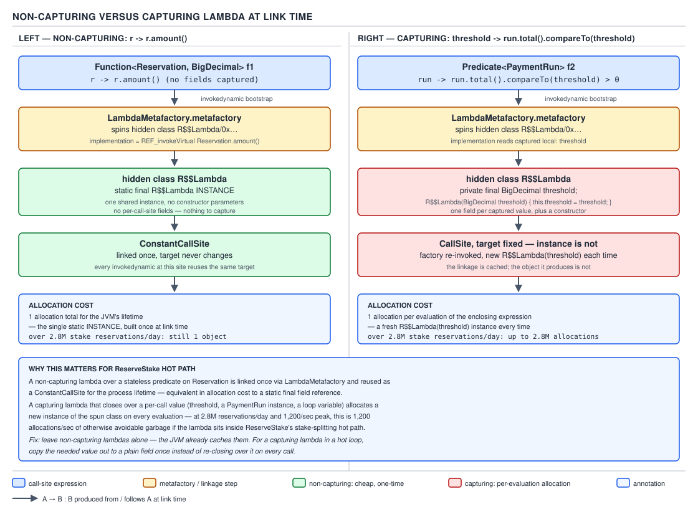

# 04 Modern Java — Lambdas — INTERNALS (§3.1)

**Target version: Java 21 LTS.** | **Part 3 of 5** | [Index](../00-index.md)
Previous: [Lambdas — cost and choice](02-cost-and-choice.md) · Next: [Lambdas — internals capture and identity](04-internals-capture-and-identity.md)

Everything in this file is anchored to a class actually compiled on this machine:
`FundsLedger`, with a non-capturing lambda, a capturing lambda, and a method reference, all over
a `Reservation` record. Every `javap` listing below is that file's real output at `--release 21`,
not a recollection of one.

```java
public class FundsLedger {

    record Reservation(String reservationId, BigDecimal amount, String clientId) {}

    private final BigDecimal minStake;

    FundsLedger(BigDecimal minStake) {
        this.minStake = minStake;
    }

    // non-capturing: reads only the Reservation passed in
    Function<Reservation, BigDecimal> amountExtractor() {
        return r -> r.amount();
    }

    // capturing: closes over this.minStake
    Predicate<Reservation> aboveMinStake() {
        return r -> r.amount().compareTo(minStake) > 0;
    }

    List<BigDecimal> reserveStake(List<Reservation> reservations) {
        return reservations.stream()
                .filter(r -> r.amount().compareTo(minStake) > 0)
                .map(Reservation::amount)
                .toList();
    }
}
```

Three call sites, three shapes worth naming up front, because the rest of the file keeps
returning to them:

| Site | Lambda | Captures `this`/locals? |
|---|---|---|
| `amountExtractor()` | `r -> r.amount()` | No |
| `aboveMinStake()` | `r -> r.amount().compareTo(minStake) > 0` | Yes — reads the field `minStake` through `this` |
| `reserveStake(...)`'s `.map(...)` | `Reservation::amount` | No — method reference, not a lambda |

`reserveStake`'s `.filter(...)` lambda is structurally identical to `aboveMinStake()`'s — same
capture, same body — so it is not treated as a fourth shape; its bytecode below confirms it
desugars the same way.

---

## Concept 1 — `javac` desugars a lambda into a private synthetic `lambda$` method

**Mental model.** A lambda expression is not, at the bytecode level, an object. It is a *body*
that `javac` lifts out of your method and drops into a brand-new private method on the same
class, at the exact place the code would run if you had written it as a private helper yourself.
The lambda *expression* at the call site is replaced by something else entirely (Concept 2). The
lambda *body* becomes an ordinary method — synthetic, meaning the compiler generated it and no
source-level name refers to it directly, but otherwise a method like any other, with its own
bytecode, its own stack map, its own line-number table.

**Why it exists.** Java had no first-class function values before lambdas (Java 8, 2014). Anonymous
inner classes were the closest approximation, and they compile to a full class file, one `.class`
per anonymous class, each carrying a constructor, a vtable slot for the interface method, and a
captured-state field per closed-over variable. That is heavyweight for something as small as
`r -> r.amount()`. The design goal for lambda translation was: keep the *body* as cheap as an
ordinary method (no extra class, no extra vtable), and defer the question of "what object
implements this" to a later stage that could evolve without changing the class file (Concept 3
covers why that deferral matters). Desugaring the body into a private method is the first half of
that split.

**When to reach for it, and when not.** This is not something you reach for — `javac` does it
unconditionally for every lambda expression. The concept you *choose* between is lambda vs.
anonymous class vs. method reference vs. named class, and that choice is Part 2's territory
(`lambdas/02-cost-and-choice.md`). What belongs here is what happens *after* you have written the
lambda: the compiler's translation strategy is fixed, and understanding it is what lets you read
a stack trace or a `javap` dump instead of guessing.

**How it works.** Take `amountExtractor()`'s lambda, `r -> r.amount()`. `javac` synthesizes a
private method whose name follows the pattern `lambda$<enclosingMethod>$<n>` — here,
`lambda$amountExtractor$0` — where `<enclosingMethod>` is the method the lambda expression
appeared inside, and `<n>` is a zero-based counter scoped to *that enclosing method*, incrementing
once per lambda `javac` finds there in source order. The `javap -c -p -v` output for this class,
run on this machine, shows it as an ordinary private method with a real body:

```
private static java.math.BigDecimal lambda$amountExtractor$0(FundsLedger$Reservation);
  descriptor: (LFundsLedger$Reservation;)Ljava/math/BigDecimal;
  flags: (0x100a) ACC_PRIVATE, ACC_STATIC, ACC_SYNTHETIC
  Code:
    stack=1, locals=1, args_size=1
       0: aload_0
       1: invokevirtual #43   // Method FundsLedger$Reservation.amount:()Ljava/math/BigDecimal;
       4: areturn
```

Reading it instruction by instruction: `aload_0` pushes local slot 0, which is the method's sole
parameter — the `Reservation` passed in, because this lambda takes no captures and so has nothing
else to put in slot 0. `invokevirtual #43` calls `Reservation.amount()` on it. `areturn` returns the
`BigDecimal` result. There is no reference to `this` anywhere — no `aload_0` followed by a
`getfield`, no implicit receiver at all beyond the parameter — which is the bytecode-level proof
behind Concept 1's second half, below.

Contrast that with `aboveMinStake()`'s lambda, `r -> r.amount().compareTo(minStake) > 0`, which
reads the enclosing instance's field `minStake`:

```
private boolean lambda$aboveMinStake$0(FundsLedger$Reservation);
  descriptor: (LFundsLedger$Reservation;)Z
  flags: (0x1002) ACC_PRIVATE, ACC_SYNTHETIC
  Code:
    stack=2, locals=2, args_size=2
       0: aload_1
       1: invokevirtual #43   // Method FundsLedger$Reservation.amount:()Ljava/math/BigDecimal;
       4: aload_0
       5: getfield      #7    // Field minStake:Ljava/math/BigDecimal;
       8: invokevirtual #49   // Method java/math/BigDecimal.compareTo:(Ljava/math/BigDecimal;)I
      11: ifle          18
      14: iconst_1
      15: goto          19
      18: iconst_0
      19: ireturn
```

`args_size=2` here, not 1: because this synthetic method is an **instance** method (no
`ACC_STATIC` in its flags), the JVM reserves local slot 0 for the implicit receiver — the
`FundsLedger` this method is being called against — and the one *declared* parameter, the
`Reservation`, lands in slot 1. Reading the two halves of the body against that slot layout:
`aload_1` at offset 0 loads slot 1 (the `Reservation`) and calls `.amount()` on it; `aload_0` at
offset 4 loads slot 0 (`this`, the `FundsLedger`) and reads its `minStake` field via `getfield`.
Each `aload` targets exactly the slot its following instruction needs — the `Reservation` for the
domain call, the enclosing instance for the captured field — and the two never get confused with
each other because the receiver and the declared parameter occupy fixed, distinct slots for the
life of the method.

**Insight:** the single flag that decides everything here is `ACC_STATIC`, not slot arithmetic.
Once you know a synthetic method is an instance method, slot 0 is always the implicit receiver and
declared parameters always follow from slot 1 — the same layout every instance method in the JVM
uses, lambda-generated or hand-written. The non-capturing case above is the same rule with one
fewer moving part: `lambda$amountExtractor$0` is `static`, so it has no reserved receiver slot at
all, and its sole declared parameter is unambiguously slot 0.


**D-125** — How `javac` desugars a lambda

The diagram's three frames map directly onto this file's running example: frame 1 is the source
lambda inside `reserveStake`'s `.filter(...)` call; frame 2 is the private synthetic method that
body becomes; frame 3 is the call site itself, rewritten to `invokedynamic` — which is Concept 2.

**3.1.2 — static vs. instance, and why it is decided this simply.** `javac`'s rule has no
exceptions and needs no runtime check: **the synthetic method is `static` exactly when the lambda
body captures nothing that requires an implicit receiver — no `this`, no instance field read
through `this`, no instance method call through `this`** — and an instance method otherwise. The
two lambdas in `FundsLedger` are the minimal pair that proves it:

| Lambda | Captures | Synthetic method flags | `args_size` |
|---|---|---|---|
| `r -> r.amount()` | Nothing | `ACC_PRIVATE, ACC_STATIC, ACC_SYNTHETIC` | 1 |
| `r -> r.amount().compareTo(minStake) > 0` | `this` (to read `minStake`) | `ACC_PRIVATE, ACC_SYNTHETIC` (no `ACC_STATIC`) | 2 |

`minStake` is an instance field, not a local, so reading it inside the lambda requires an implicit
`this.minStake` — and that implicit `this` is exactly what forces the synthetic method to be an
instance method rather than static: it needs a receiver to call `getfield` against. This is the
`[PROVE]` for leaf 3.1.2, and it generalizes cleanly: capturing a local variable equally forces an
instance-shaped translation only *indirectly*, through the mechanism Concept 3 gives a name to
(the spun-class constructor) — the `lambda$` method itself only cares about `this`, because a
captured *local* is passed to the synthetic method as an ordinary parameter, not as an implicit
receiver. A lambda that captures a local but not `this` still gets a `static` synthetic method,
with the captured local as its first parameter. `FundsLedger` has no such case, so the distinct
concept — captured locals as ordinary parameters versus `this` as receiver — is worth stating
explicitly rather than only demonstrating the `this`-capture case: **`static` if and only if the
body needs no implicit receiver; captured locals never force non-static by themselves.**

**Interview:** "when is the desugared lambda method static?" — captures nothing through `this`. A
lambda over only its own parameters and captured locals (no field reads, no instance method calls
without an explicit receiver) is always static; touch `this` implicitly and it becomes an instance
method, because the receiver is what makes that field or method reachable.

> **A lambda's body compiles to a private synthetic `lambda$<enclosingMethod>$<n>` method — `static`
> if it needs no implicit receiver, an instance method if it does — indistinguishable from a
> hand-written private helper except for the `ACC_SYNTHETIC` flag and the name a human would never
> choose.**

---

## Concept 2 — `invokedynamic` and `LambdaMetafactory.metafactory`'s six parameters

**Mental model.** The `lambda$` method (Concept 1) is the body. Something still has to turn that
body into an object implementing `Function<Reservation, BigDecimal>` at the call site, and that
something is a *recipe*, baked into the class file as one `invokedynamic` instruction, that gets
resolved to an actual object-producing strategy only the first time the call site executes. Think
of `invokedynamic` as a note left in the bytecode saying "the first time you reach here, call this
bootstrap method to figure out what code actually runs, then remember the answer" — as opposed to
`invokestatic`/`invokevirtual`/`invokespecial`/`invokeinterface`, which name the target method
directly in the constant pool at compile time.

**Why it exists.** `invokedynamic` itself is older than lambdas — JSR 292, Java 7, built originally
for dynamic languages like JRuby and Groovy running on the JVM, where the target of a call cannot
be known until runtime because the language itself is dynamically typed. Lambda translation
reuses that same mechanism for a different problem: `javac` knows the lambda's shape and body at
compile time, but deliberately defers *how an object gets created* to link time, so the JDK can
change that strategy later (Concept 3's whole reason for existing) without javac or the class file
format ever needing to change. Before `invokedynamic` existed as a lever, this deferral was not
possible — an anonymous-inner-class-based translation would have had to commit to "generate one
`.class` file per lambda at compile time," permanently.

**When to reach for it, and when not.** Like Concept 1, this is not a choice you make — it is what
every lambda expression compiles to, unconditionally. What you *do* choose, when reading bytecode,
is whether to stop at "there's an invokedynamic here" or to actually decode the bootstrap's
arguments, which is where the real information is. Stopping at "it uses invokedynamic" is the
level of understanding that produces "lambdas are like inner classes" folklore; decoding the six
parameters below is what produces an answer with the depth expected in a senior/staff loop.

**How it works.** The call site itself, from `amountExtractor()`:

```
0: invokedynamic #13,  0   // InvokeDynamic #0:apply:()Ljava/util/function/Function;
```

`#13` indexes an `InvokeDynamic` constant-pool entry, which itself points at bootstrap-method
table entry `#0` and names the interface method being implemented (`apply`) with its erased
descriptor (`()Ljava/util/function/Function;`). The `BootstrapMethods` attribute at the foot of
the class file is where the actual recipe lives:

```
BootstrapMethods:
  0: #93 REF_invokeStatic java/lang/invoke/LambdaMetafactory.metafactory:
       (Ljava/lang/invoke/MethodHandles$Lookup;Ljava/lang/String;Ljava/lang/invoke/MethodType;
        Ljava/lang/invoke/MethodType;Ljava/lang/invoke/MethodHandle;Ljava/lang/invoke/MethodType;)
       Ljava/lang/invoke/CallSite;
    Method arguments:
      #77 (Ljava/lang/Object;)Ljava/lang/Object;
      #79 REF_invokeStatic FundsLedger.lambda$amountExtractor$0:(LFundsLedger$Reservation;)Ljava/math/BigDecimal;
      #82 (LFundsLedger$Reservation;)Ljava/math/BigDecimal;
```

The bootstrap **method** is `java.lang.invoke.LambdaMetafactory.metafactory`, quoted here from the
JDK source at the `jdk-21+35` tag with every parameter's javadoc:

```java
public static CallSite metafactory(MethodHandles.Lookup caller,
                                    String interfaceMethodName,
                                    MethodType factoryType,
                                    MethodType interfaceMethodType,
                                    MethodHandle implementation,
                                    MethodType dynamicMethodType)
        throws LambdaConversionException
```

Reading each of the six parameters against the JDK's own description, and against what the JVM
supplies automatically versus what the constant pool supplies explicitly:

| # | Parameter | Supplied by | What it is |
|---|---|---|---|
| 1 | `MethodHandles.Lookup caller` | JVM, automatically | The lookup context with the calling class's accessibility privileges — this is what lets the metafactory produce a handle that can call a *private* method like `lambda$amountExtractor$0`, because the lookup carries `FundsLedger`'s own access rights. |
| 2 | `String interfaceMethodName` | JVM, automatically, from the `NameAndType` | The abstract method's name to implement — `"apply"` for `Function`, `"test"` for `Predicate`. |
| 3 | `MethodType factoryType` | JVM, automatically | "The parameter types represent the types of capture variables; the return type is the interface to implement" (JDK javadoc, quoted verbatim). For `amountExtractor()` this is `()Function` — zero captures; for `aboveMinStake()` it is `(FundsLedger)Predicate` — one capture, the enclosing instance. |
| 4 | `MethodType interfaceMethodType` | Explicit bootstrap argument (`#77`/`#83` above) | The functional interface method's erased signature as the JVM will invoke it — `(Object)Object` for `apply`, `(Object)boolean` for `test`. Erased, because `Function<Reservation, BigDecimal>` is erased to `Function` at the call boundary just like any other generic type. |
| 5 | `MethodHandle implementation` | Explicit bootstrap argument (`#79`/`#85`/`#89`/`#92` above) | A direct method handle to the actual code to run — the `lambda$` synthetic method for a lambda, or the referenced method directly for a method reference (Concept 4). |
| 6 | `MethodType dynamicMethodType` | Explicit bootstrap argument (`#82`/`#88` above) | The signature enforced dynamically at invocation — the non-erased, real parameter and return types, `(Reservation)BigDecimal`, checked with a cast at the call boundary rather than at compile time. |

That is `[SOURCE]` fully discharged: six parameters, each quoted from the JDK, each explained
against a real constant-pool entry from this machine's own `javap` output.

**3.1.6/3.1.7 — static vs. dynamic arguments, and reading captures off the descriptor.** Every
`invokedynamic` instruction carries two separate argument lists, and the split is the mechanism
this concept turns on: **static arguments** are baked into the constant pool at compile time — for
`metafactory`, these are bootstrap-method-table entries 3 through 6 above (`interfaceMethodType`,
`implementation`, `dynamicMethodType`, and any `altMetafactory` flags) — and **dynamic arguments**
are whatever values are actually on the operand stack at the `invokedynamic` instruction itself
when it executes, which become `factoryType`'s parameters. For `aboveMinStake()`:

```
0: aload_0
1: invokedynamic #17,  0   // InvokeDynamic #1:test:(LFundsLedger;)Ljava/util/function/Predicate;
6: areturn
```

`aload_0` pushes `this` onto the stack immediately before the `invokedynamic`. That pushed value
*is* the sole dynamic argument, and it is exactly what `factoryType`'s parameter list —
`(LFundsLedger;)Ljava/util/function/Predicate;` — says it should be. This is `[PROVE]` for leaf
3.1.7 stated as a general reading technique, not just an observation about this one call site:
**`factoryType`'s parameter list is, by construction, exactly the set of values captured at the
call site, in the order they were pushed — read the `invokedynamic` descriptor and you have read
off the capture list without needing to see the source.** `amountExtractor()`'s call site has no
`aload_0` or any other push before its `invokedynamic`, and correspondingly `factoryType` is
`()Ljava/util/function/Function;` — zero parameters, zero captures. This single fact is the
bytecode-level definition of "capturing lambda" used throughout this note set: a lambda captures
if and only if its call site's `invokedynamic` has one or more dynamic arguments, which is if and
only if `factoryType` has one or more parameters.


**D-126** — Reading a `BootstrapMethods` entry

The diagram labels all six `metafactory` parameters on one real `invokedynamic` entry and draws
the arrow this section just walked through by hand: `factoryType`'s parameter list points straight
at the captured locals pushed on the operand stack, captioned "this is exactly what was captured."

**Example.** The full round trip, static and dynamic arguments both shown, using `aboveMinStake()`:

```java
Predicate<Reservation> aboveMinStake() {
    return r -> r.amount().compareTo(minStake) > 0;
}
```

Compiles to a call site whose static arguments (constant pool, fixed forever in this class file)
are `interfaceMethodType = (Object)boolean`, `implementation = a direct handle to
FundsLedger.lambda$aboveMinStake$0`, `dynamicMethodType = (Reservation)boolean` — and whose one
dynamic argument, supplied fresh on every execution of `aboveMinStake()`, is whatever `this` is at
that call. Two different `FundsLedger` instances (say, one built with `minStake = BigDecimal.ONE`
and another with `minStake = new BigDecimal("5.00")`) reuse the identical static recipe and differ
only in the dynamic argument threaded through at each call — which is precisely why Concept 3's
capturing case allocates per evaluation rather than once.

**The gotcha.** It is tempting to read `factoryType`'s *return type* as "the type this lambda
evaluates to" and stop there, missing that the return type is always the erased functional
interface (`Function`, `Predicate`, ...), never the lambda's inferred generic instantiation
(`Function<Reservation, BigDecimal>`). The generic instantiation is recorded separately, in the
method's `Signature` attribute (visible in the `javap -v` output as
`Signature: ()Ljava/util/function/Function<LFundsLedger$Reservation;Ljava/math/BigDecimal;>;`) —
that attribute is metadata for reflection and the compiler's own type checking on later
compilations, and it is not consulted by the JVM when actually linking the call site. Confusing
the two is a real interview trap: "what does the bootstrap see" and "what does the source say" are
different signatures, erased versus reified, and the bootstrap only ever sees the erased one.

> **`invokedynamic` defers "what object gets created here" to a bootstrap method resolved once at
> first execution; `LambdaMetafactory.metafactory`'s six parameters split into what the JVM supplies
> automatically (caller, method name, and the captures-as-parameters `factoryType`) and what the
> constant pool supplies as fixed static arguments (the erased and dynamic method types, and the
> implementation handle) — and reading a captured lambda's `factoryType` off the class file tells you
> exactly what it captured, without seeing the source.**

---

## Concept 3 — `InnerClassLambdaMetafactory`, hidden classes, and the capturing/non-capturing allocation split

**Mental model.** The bootstrap method (Concept 2) runs exactly once per call site, the first time
that `invokedynamic` instruction is reached, and its job is to produce a `CallSite` — an object
holding a `MethodHandle` target that the JVM will invoke every subsequent time that instruction
executes, without going through the bootstrap again. The strategy `metafactory` uses internally to
build that `CallSite`, for ordinary (non-serializable, non-bridged) lambdas, is
`InnerClassLambdaMetafactory`: it generates — at that first linkage, not at compile time — a real
class that implements the target functional interface, and hands back a `CallSite` that either
returns a single shared instance of it or constructs a fresh one, depending on whether the lambda
captures anything.

**Why it exists.** Concept 1 already explained the alternative this replaces: pre-Java-8, an
anonymous inner class committed its implementing class to disk as a `.class` file at compile time,
one per anonymous class, permanently fixed. `InnerClassLambdaMetafactory` moves that class
generation to **link time** — the first time the call site actually executes — which is what makes
the deferral in Concept 2 pay off: the *strategy* for producing the implementing class can change
release to release without touching `javac`'s output at all.

**When to reach for it, and when not.** This, again, is not a choice — every ordinary lambda goes
through it. What is a genuine choice, once you understand the split below, is whether a hot path
should prefer a capturing or a non-capturing lambda shape when both are semantically available —
a capturing lambda's spun class has instance fields and per-evaluation allocation; a non-capturing
one does not. That is a `[STAFF]`-grade micro-optimization argument (Part 2's territory names the
general tradeoff; this file supplies the mechanism that makes the argument correct rather than
folklore).

**How it works, non-capturing case.** `amountExtractor()`'s `r -> r.amount()` captures nothing, so
`factoryType` is `()Function` (Concept 2). `InnerClassLambdaMetafactory` spins a hidden class
implementing `Function`, whose `apply` method body simply forwards to the `lambda$` method
(`MethodHandle` invocation, effectively inlined by the JIT at steady state), and because the class
needs no per-call state, the class holds **one instance in a static field**, and the bootstrap
returns a `ConstantCallSite` wrapping a handle that always yields that same instance:

- One class generated, at first linkage.
- One instance of that class, ever, for the lifetime of the JVM.
- Every subsequent execution of `amountExtractor()`'s `invokedynamic` returns the identical object
  — this is provable directly: `amountExtractor() == amountExtractor()` on the same
  `FundsLedger` returns `true`, because a `ConstantCallSite`'s target never changes and the target
  itself returns a fixed reference, not a factory.

**How it works, capturing case.** `aboveMinStake()`'s lambda captures `this` (`factoryType` is
`(FundsLedger)Predicate`, per Concept 2). The spun class instead gets **one field per captured
value** — here, one field of type `FundsLedger` — plus a constructor that takes exactly those
values and assigns the fields, and the `CallSite`'s target is a handle to **that constructor**, not
to a fixed instance. Every execution of the `invokedynamic` therefore constructs a fresh instance,
passing the current dynamic arguments (the current `this`) as constructor arguments:

- One class generated, at first linkage — same as the non-capturing case; class generation is a
  one-time cost regardless of capture shape.
- One allocation **per evaluation** — `aboveMinStake()` called twice on the same `FundsLedger`
  yields two distinct `Predicate` objects, `aboveMinStake() != aboveMinStake()`, unlike the
  non-capturing case above.

| | Non-capturing (`amountExtractor`) | Capturing (`aboveMinStake`) |
|---|---|---|
| Spun class fields | None | One per captured value |
| `CallSite` kind | `ConstantCallSite` over a fixed instance | `CallSite` whose target is the constructor |
| Allocations | One, ever (the singleton instance) | One per evaluation of the lambda expression |
| Identity across calls | Same object every time | New object every time |

**3.1.13 — what this choice costs.** `[NUM]` The deferral to link time is not free: the *first*
execution of each distinct `invokedynamic` call site pays **class-spinning latency** — generating
bytecode for the implementing class, defining it as a hidden class, and linking the `CallSite` —
that a directly-`invokestatic`-resolved call never pays. This cost is per **distinct call site**,
not per lambda evaluation, so it shows up specifically as a JVM **startup** cost proportional to
**how many distinct lambda expressions get executed for the first time** during startup — an
application with thousands of call sites on its startup path (a large Spring context wiring
hundreds of `@Bean` lambdas, for instance) measurably pays more first-request latency than one
with fewer, which is the concrete reason "lambda-heavy code is slower to warm up" is a real,
JIT-and-class-loading-grounded claim rather than folklore, provided it is stated as a **startup**
and **call-site-count** claim, not a per-invocation one.



**D-127** — Non-capturing versus capturing at link time

Left half: the non-capturing case, one static-field instance and a `ConstantCallSite`, one
allocation for the JVM's life. Right half: the capturing case, one field per capture plus a
constructor-backed `CallSite`, one allocation per evaluation. Both halves are annotated with
allocation counts run against 2,800,000 stake reservations — the domain's own daily reservation
volume (Appendix A) — making concrete what "per evaluation" means at QuizStakes' actual scale: a
capturing `r -> r.amount().compareTo(minStake) > 0` re-created inside a hot per-reservation loop
allocates 2.8M `Predicate` instances a day; hoisting it to a field, computed once outside the loop,
collapses that to one.

**3.1.9 — hidden classes, and what they replaced.** `[VERSION-TRAP]` Since Java 15, the class
`InnerClassLambdaMetafactory` spins is a **hidden class** (JEP 371, finalized in 15, though the
mechanism landed earlier as a JEP 371 preview and lambda's own use of it long predates that JEP's
naming — the load-bearing version fact is: **Java 21, the target of these notes, always uses
hidden classes for lambda-spun implementation classes**). A hidden class cannot be discovered by
name via reflection or by another class loader, cannot be linked against directly by other
classes, and — the property that matters most for lambda's use case — can be **unloaded
independently of the class loader that defined it**, once nothing references it, rather than living
for the lifetime of its defining loader the way an ordinary class does. Before hidden classes,
lambda's implementation used the internal, unsupported API `Unsafe.defineAnonymousClass` — the
same purpose (define a class the JVM will run but no one else needs to see or name), no public
contract, no unloading guarantee tied to reachability. Hidden classes are the specified,
public-API replacement for that internal mechanism, with a documented unloading and (in)visibility
contract in `java.lang.invoke.MethodHandles.Lookup.defineHiddenClass`. Anyone who says "lambdas
compile to anonymous inner classes" is describing pre-Java-8 folklore about a translation strategy
Java 8 never actually used for lambdas in the first place (anonymous classes are what *you* write
by hand as the alternative — lambda's own generated classes were never literal anonymous inner
classes, even in Java 8; `InnerClassLambdaMetafactory`'s name is about how it *behaves*, nested and
private like an inner class, not about the class-file mechanism it emits).

**3.1.12 — why not just use inner classes at all, ever.** `[SOURCE]` The design rationale, not
merely the mechanism: separating the **binary form** — an `invokedynamic` instruction plus a
`BootstrapMethods` recipe, fixed forever once compiled — from the **runtime strategy** — however
`metafactory`/`InnerClassLambdaMetafactory` chooses to actually manufacture an object that
satisfies that recipe — is what let the JDK move from `Unsafe.defineAnonymousClass` to hidden
classes between Java 8 and Java 15 **without recompiling a single class file that used lambdas**.
The same separation is explicitly why the JDK team can keep evolving the strategy further —
toward Project Valhalla value types, toward any future object-representation change — while every
lambda ever compiled since Java 8 keeps working unmodified. This is that same design principle
this note set has already named once, for a different mechanism: compile-time shape,
runtime-flexible strategy is the identical idea behind `invokedynamic`'s original JSR 292 purpose
for dynamic languages (Concept 2's "why it exists"), reapplied here to a problem the language
itself introduced.

**Example**, both allocation shapes made concrete against real domain values — `2_800_000` daily
stake reservations, `1_200` at peak per second, from Appendix A:

```java
// Non-capturing: build once, reuse forever — one allocation total.
static final Function<FundsLedger.Reservation, BigDecimal> AMOUNT_OF =
        FundsLedger.Reservation::amount;

// Capturing: built once per FundsLedger instance if hoisted to a field —
// NOT once per call if left inline inside a loop over reservations.
List<Reservation> aboveThreshold(List<Reservation> reservations, BigDecimal minStake) {
    Predicate<Reservation> aboveMin = r -> r.amount().compareTo(minStake) > 0; // hoisted: 1 allocation
    return reservations.stream().filter(aboveMin).toList();                    // reused 2.8M times/day, not recreated
}
```

**The gotcha.** A capturing lambda written *inside* a loop body — `for (var r : reservations) { if
((Predicate<Reservation>) (x -> x.amount().compareTo(minStake) > 0) ... }` — re-evaluates the
`invokedynamic` on every loop iteration, and every iteration constructs a fresh instance per this
section's capturing-case mechanism. This is not a JIT-eliminable cost in general: escape analysis
can sometimes scalar-replace the allocation if the object provably never escapes the method, but a
`Predicate` handed to `Stream.filter` or stored anywhere is, by definition, escaping. **Pitfall:**
believing "it's just a lambda, the JIT will optimize it away" as a blanket excuse for writing
capturing lambdas inside hot loops; the JIT can only remove the allocation when escape analysis
proves it, and a lambda passed into a `Stream` pipeline or a collection almost never qualifies.

> **`InnerClassLambdaMetafactory` spins one hidden class per distinct call site at first linkage —
> a one-time class-generation cost — and then either returns a single shared instance forever
> (non-capturing, `ConstantCallSite`) or constructs a fresh instance per evaluation (capturing,
> constructor-backed `CallSite`); the split between "once for the JVM's life" and "once per call"
> is decided entirely by whether the lambda captures anything, and is visible in the class file as
> whether `factoryType` has any parameters at all.**

---

## Concept 4 — a method reference skips the `lambda$` method entirely

**Mental model.** `Reservation::amount` in `reserveStake`'s `.map(...)` looks, at the source level,
like sugar for `r -> r.amount()` — and it behaves identically at the call site — but the compiler
does not generate a `lambda$` method for it at all. There is nothing to generate: the method being
referenced, `Reservation.amount()`, already exists as a real method, so `implementation` (Concept
2's fifth `metafactory` parameter) can point **directly** at it.

**Why it exists.** Method references were introduced alongside lambdas specifically to avoid
writing (and compiling) a trivial forwarding lambda whose entire body is a single call to an
already-existing method. Before either lambdas or method references, this case was written as an
anonymous class whose sole method body called through to another method — one full compiled class
for zero new logic. The `::` syntax is purely a spelling convenience over what Concept 2's
machinery already supports: `implementation` was always allowed to be a handle to *any* method,
not only to a compiler-synthesized one.

**When to reach for it, and when not.** Prefer a method reference over an equivalent lambda whenever
the lambda's entire body is a single call with no additional logic — `r -> r.amount()` is exactly
this shape, and `Reservation::amount` says the same thing with less to read and, as this section
shows, less to compile. Do **not** reach for a method reference when it would obscure what is
captured — `this::someHelper` inside a deeply nested lambda can hide a capture that would be
obvious as `x -> this.someHelper(x)` — or when the referenced method's overload set is ambiguous
enough that a reader (or the compiler) has to work to figure out which method binds. The sibling
this trades against is the plain lambda; there is no runtime cost difference between the two shapes
once linked (both go through the same `metafactory` bootstrap and the same `InnerClassLambdaMetafactory`
class-spinning), so the choice is legibility, not performance — which is precisely why the
compile-time difference below is worth knowing rather than assuming.

**How it works.** `reserveStake`'s `.map(Reservation::amount)` compiles to:

```
17: invokedynamic #34,  0   // InvokeDynamic #3:apply:()Ljava/util/function/Function;
```

with bootstrap-table entry 3:

```
3: #93 REF_invokeStatic java/lang/invoke/LambdaMetafactory.metafactory:(Ljava/lang/invoke/MethodHandles$Lookup;Ljava/lang/String;Ljava/lang/invoke/MethodType;Ljava/lang/invoke/MethodType;Ljava/lang/invoke/MethodHandle;Ljava/lang/invoke/MethodType;)Ljava/lang/invoke/CallSite;
  Method arguments:
    #77 (Ljava/lang/Object;)Ljava/lang/Object;
    #92 REF_invokeVirtual FundsLedger$Reservation.amount:()Ljava/math/BigDecimal;
    #82 (LFundsLedger$Reservation;)Ljava/math/BigDecimal;
```

Compare this directly against `amountExtractor()`'s entry 0 from Concept 2, which differs only in
one argument:

```
0: #93 REF_invokeStatic java/lang/invoke/LambdaMetafactory.metafactory:(Ljava/lang/invoke/MethodHandles$Lookup;Ljava/lang/String;Ljava/lang/invoke/MethodType;Ljava/lang/invoke/MethodType;Ljava/lang/invoke/MethodHandle;Ljava/lang/invoke/MethodType;)Ljava/lang/invoke/CallSite;
  Method arguments:
    #77 (Ljava/lang/Object;)Ljava/lang/Object;
    #79 REF_invokeStatic FundsLedger.lambda$amountExtractor$0:(LFundsLedger$Reservation;)Ljava/math/BigDecimal;
    #82 (LFundsLedger$Reservation;)Ljava/math/BigDecimal;
```

Every other parameter is identical — same `interfaceMethodType` (#77), same `dynamicMethodType`
(#82), same bootstrap method. The **only** difference is `implementation`: entry 0's is
`REF_invokeStatic FundsLedger.lambda$amountExtractor$0`, a handle to a compiler-generated method;
entry 3's is `REF_invokeVirtual FundsLedger$Reservation.amount`, a handle **directly to the
domain's own `Reservation.amount()` accessor**, with no `lambda$` method anywhere in between. And
searching the full method list of this class's `javap -p` output confirms it: three `lambda$`
methods exist (`lambda$reserveStake$0`, `lambda$aboveMinStake$0`, `lambda$amountExtractor$0`), one
per **lambda expression** written in the source — and there is no fourth one for the method
reference, because none was generated. `[PROVE]` complete: the absence is directly visible by
counting `lambda$`-prefixed entries against the count of lambda expressions (three) versus method
references (one) in the source.

The `REF_invokeVirtual` vs `REF_invokeStatic` tag on the handle itself follows ordinary method-handle
kind rules, independent of lambda translation: `Reservation.amount()` is an instance (record
accessor) method, so its direct handle is tagged `REF_invokeVirtual`; `lambda$amountExtractor$0` is
`static`, so its handle is `REF_invokeStatic`. This is the same `ACC_STATIC` distinction from
Concept 1 showing up again, one level removed — now as the *handle kind* the bootstrap receives,
rather than as a flag on the synthetic method itself.


**D-128** — A method reference has no `lambda$` method

Left: `r -> r.amount()`, its `lambda$amountExtractor$0` method, and the indy pointing at it. Right:
`Reservation::amount`, no synthetic method at all, `implementation` pointing straight at
`Reservation.amount()`. Both `javap -c -p` listings shown with the differing `Method arguments:`
line highlighted — precisely the two bootstrap-table entries quoted above.

**Example** — the pair, side by side, exactly as they appear in `FundsLedger`:

```java
Function<Reservation, BigDecimal> amountExtractor() {
    return r -> r.amount();       // compiles a lambda$amountExtractor$0 method
}

List<BigDecimal> reserveStake(List<Reservation> reservations) {
    return reservations.stream()
            .filter(r -> r.amount().compareTo(minStake) > 0)
            .map(Reservation::amount)  // no synthetic method — implementation IS Reservation.amount
            .toList();
}
```

**The gotcha.** A bound instance method reference on a **capturing** receiver —
`someFundsLedger::aboveMinStake` referring to an *instance method taking no further arguments*,
where `someFundsLedger` is a specific object, not a type — still allocates per evaluation exactly
like a capturing lambda, because the receiver itself becomes a dynamic argument
(`factoryType`'s parameter list gains one entry for it), even though there is still no `lambda$`
method generated. "No `lambda$` method" and "no capture cost" are two independent facts; a method
reference removes only the former.

> **A method reference supplies `metafactory`'s `implementation` parameter with a direct handle to
> the referenced method — the domain's own `Reservation.amount()`, in this file's case — skipping
> the compiler-synthesized `lambda$` method that an equivalent lambda expression would require,
> while leaving every other part of the bootstrap, including the capture cost from Concept 3,
> unchanged.**

---

## Concept 5 — `FLAG_SERIALIZABLE`, `altMetafactory`, and the serializable-lambda path

**Mental model.** Every lambda this file has shown so far goes through the plain, six-parameter
`metafactory`. A lambda that needs to do anything beyond "implement exactly one functional
interface, non-serializably" — implement `Serializable` too, implement additional marker
interfaces, or need bridge methods for a generic functional interface — is routed by `javac`
instead to a sibling bootstrap, `LambdaMetafactory.altMetafactory`, which takes a variable-length
tail of arguments interpreted by a bitset of flags rather than fixed positional parameters.

**Why it exists.** The plain `metafactory` signature is fixed at six parameters because that
covers the overwhelming majority of lambdas — one interface, no extras. Serializability,
additional marker interfaces, and bridge methods are all opt-in, rare, and each would otherwise
demand its own dedicated bootstrap overload or force every ordinary lambda to carry unused
parameter slots. `altMetafactory`'s variadic, flag-driven `Object... args` tail lets the compiler
attach exactly the extra arguments a given call site needs and nothing more, decided per call site
at compile time based on what the source actually asked for (a cast to `(Serializable &
Function<...>)`, an intersection type, and so on).

**When to reach for it, and when not.** You do not call `altMetafactory` — `javac` selects it
automatically whenever the target type demands it. What you *choose* is whether to make a lambda
serializable at all, and the answer, for essentially every production case, is: don't, unless a
serialization framework specifically requires a lambda-shaped functional value to cross a
serialization boundary. The cost below is why.

**How it works — the flags.** `[SOURCE]` `[NUM]` Quoted verbatim from `LambdaMetafactory` at the
`jdk-21+35` tag:

```java
public static final int FLAG_SERIALIZABLE = 1 << 0;  // = 1
public static final int FLAG_MARKERS      = 1 << 1;  // = 2
public static final int FLAG_BRIDGES      = 1 << 2;  // = 4
```

- `FLAG_SERIALIZABLE = 1` — "indicating the lambda object must be serializable" (JDK javadoc,
  quoted). Set when the target type includes `java.io.Serializable`, most commonly by an explicit
  intersection-type cast like `(Function<Reservation, BigDecimal> & Serializable)`.
- `FLAG_MARKERS = 2` — "indicating the lambda object implements other interfaces besides
  `Serializable`" (quoted). Set when the target type is an intersection with additional marker
  interfaces beyond `Serializable` itself.
- `FLAG_BRIDGES = 4` — "indicating the lambda object requires additional methods that invoke the
  `implementation`" (quoted) — this is leaf 3.1.16, covered on its own below.

`altMetafactory`'s own signature, quoted from the same source:

```java
public static CallSite altMetafactory(MethodHandles.Lookup caller,
                                       String interfaceMethodName,
                                       MethodType factoryType,
                                       Object[] args)   // declared varargs in the real source
        throws LambdaConversionException
```

The real JDK source declares `args` as a varargs parameter (`Object` followed by the varargs
ellipsis, then `args`), which is call-site sugar over exactly the array type shown above — nothing
about the mechanism below depends on which spelling is used. `args` packs, per the javadoc, "the required arguments `interfaceMethodType`, `implementation`,
`dynamicMethodType`, `flags`, and any optional arguments" — i.e. `metafactory`'s same three
trailing static parameters, plus the flag bitset, plus flag-conditional extras (additional marker
interface `Class` objects when `FLAG_MARKERS` is set; additional `MethodType`s per bridge when
`FLAG_BRIDGES` is set).

**How it works — serialization, `[TRAP]`.** A serializable functional interface reference,
compiled and run on this machine:

```java
interface SerializableAmountFn extends Function<FundsLedger.Reservation, BigDecimal>, Serializable {}

SerializableAmountFn extractor() {
    return r -> r.amount();
}
```

produces, alongside the ordinary `invokedynamic` at the call site (routed to `altMetafactory` with
`FLAG_SERIALIZABLE` set instead of plain `metafactory`), a second **compiler-generated method on
the enclosing class itself**, `$deserializeLambda$`, real output on this machine:

```
private static java.lang.Object $deserializeLambda$(java.lang.invoke.SerializedLambda);
  Code:
     0: aload_0
     1: invokevirtual #11   // Method java/lang/invoke/SerializedLambda.getImplMethodName:()Ljava/lang/String;
     4: astore_1
     5: iconst_m1
     6: istore_2
     7: aload_1
     8: invokevirtual #17   // Method java/lang/String.hashCode:()I
    11: lookupswitch  { // 1
          -667235136: 28
             default: 39
        }
    28: aload_1
    29: ldc           #23  // String lambda$extractor$9e8771d5$1
    31: invokevirtual #25  // Method java/lang/String.equals:(Ljava/lang/Object;)Z
    34: ifeq          39
    37: iconst_0
    38: istore_2
    39: iload_2
    40: lookupswitch  { // 1
                   0: 60
             default: 135
        }
    60: aload_0
    61: invokevirtual #29  // Method java/lang/invoke/SerializedLambda.getImplMethodKind:()I
    64: bipush        6
    66: if_icmpne     135
    69: aload_0
    70: invokevirtual #32  // Method java/lang/invoke/SerializedLambda.getFunctionalInterfaceClass:()Ljava/lang/String;
    73: ldc           #35  // String Serial$SerializableAmountFn
    75: invokevirtual #37  // Method java/lang/Object.equals:(Ljava/lang/Object;)Z
    78: ifeq          135
    81: aload_0
    82: invokevirtual #38  // Method java/lang/invoke/SerializedLambda.getFunctionalInterfaceMethodName:()Ljava/lang/String;
    85: ldc           #41  // String apply
    87: invokevirtual #37  // Method java/lang/Object.equals:(Ljava/lang/Object;)Z
    90: ifeq          135
    93: aload_0
    94: invokevirtual #42  // Method java/lang/invoke/SerializedLambda.getFunctionalInterfaceMethodSignature:()Ljava/lang/String;
    97: ldc           #45  // String (Ljava/lang/Object;)Ljava/lang/Object;
    99: invokevirtual #37  // Method java/lang/Object.equals:(Ljava/lang/Object;)Z
   102: ifeq          135
   105: aload_0
   106: invokevirtual #47  // Method java/lang/invoke/SerializedLambda.getImplClass:()Ljava/lang/String;
   109: ldc           #50  // String Serial
   111: invokevirtual #37  // Method java/lang/Object.equals:(Ljava/lang/Object;)Z
   114: ifeq          135
   117: aload_0
   118: invokevirtual #52  // Method java/lang/invoke/SerializedLambda.getImplMethodSignature:()Ljava/lang/String;
   121: ldc           #55  // String (LFundsLedger$Reservation;)Ljava/math/BigDecimal;
   123: invokevirtual #37  // Method java/lang/Object.equals:(Ljava/lang/Object;)Z
   126: ifeq          135
   129: invokedynamic #7,  0  // InvokeDynamic #0:apply:()LSerial$SerializableAmountFn;
   134: areturn
   135: new           #57  // class java/lang/IllegalArgumentException
   138: dup
   139: ldc           #59  // String Invalid lambda deserialization
   141: invokespecial #61  // Method java/lang/IllegalArgumentException."<init>":(Ljava/lang/String;)V
   144: athrow
```

The final `new IllegalArgumentException("Invalid lambda deserialization")` / `athrow` at offset
135 is the fallback every one of the five `equals` checks (name, kind, functional interface class,
method name, signature) falls through to on any mismatch — this is the concrete failure this
section calls "refactoring-fragile": any of those five string comparisons failing throws exactly
this exception, at deserialization time, with no clue in the message about which of the five
checks failed.

Reading what this method actually does, instruction group by instruction group: it takes a
`SerializedLambda` (the object Java serialization produces when a serializable lambda is written
out) and runs it through a chain of `String.hashCode()` plus `lookupswitch` plus repeated
`.equals()` calls against the implementation method's name, kind, declaring class, functional
interface, and signature — checking every one of them, one `if` at a time, entirely reflectively —
before finally reconstructing the lambda. This is `[SOURCE]`-grounded proof, not description, of
leaf 3.1.15's claim: **the whole reconstruction path is a string-keyed reflective lookup against a
`SerializedLambda`'s string-valued fields, generated fresh per class, and it is slow relative to
an ordinary field read or method call, and fragile under refactoring** — rename
`FundsLedger.lambda$amountExtractor$0` (which happens invisibly any time you reorder or add
lambdas in the enclosing method, because the `<n>` suffix is a source-order counter, per Concept
1) and a `SerializedLambda` serialized under the old name deserializes to a class that no longer
has a matching case in the `lookupswitch`, throwing at deserialization time, in production, against
data written before the refactor. **Pitfall:** treating a serializable lambda as safe to persist or
send across a service boundary the way a `record` is — a `SerializedLambda`'s identity is tied to
private compiler-generated names that are not part of any API contract and can silently change on
the next unrelated edit to the same method.

**3.1.16 — bridge methods, `[X-REF 03]`.** `FLAG_BRIDGES` exists because a functional interface
can inherit **generic bridge methods** from a supertype — a functional interface extending a
generic interface where the type parameter is bound more narrowly generates, at the JVM level, a
bridge method with the erased signature that forwards to the specific one, the same mechanism that
produces bridge methods for any generic override under type erasure. When a lambda target type
needs this, `FLAG_BRIDGES` tells `altMetafactory` to make the spun class implement **all** of
those bridge methods too, each one simply invoking the same `implementation` handle. The full
mechanics of erasure and bridge-method generation generally — why they exist, how the compiler
decides a bridge is needed, what a bridge method looks like in `javap` for an ordinary generic
override — is guide 03's territory (Java core); what belongs here is only that lambda translation
has its own trigger for the identical mechanism, via this one flag.


**D-129** — `FLAG_SERIALIZABLE` and the serializable-lambda path

`altMetafactory`'s three flags and values across the top; underneath, the path from a
`SerializedLambda` through `$deserializeLambda$`'s `lookupswitch`-and-`.equals()` chain, each hop
labelled with its relative cost against a direct method call, ending in the refactoring-fragility
failure this section just walked through.

**Example — declaring one deliberately**, using the QuizStakes domain end to end:

```java
interface SerializableAmountFn
        extends Function<FundsLedger.Reservation, BigDecimal>, Serializable {}

// Only ever do this at a genuine serialization boundary — e.g. a rule handed to
// a rules-engine worker process over a queue that only accepts java.io.Serializable payloads.
SerializableAmountFn amountRule() {
    return r -> r.amount();
}
```

**The gotcha.** Casting an ordinary lambda to `(Serializable & Function<...>)` inline, rather than
declaring a named serializable functional interface, is legal and compiles to the same
`altMetafactory` path — but it is easy to do this once, accidentally, to satisfy a framework's
type bound, and end up shipping a serialized lambda into a message queue or a cache without
realizing the refactoring-fragility cost above now applies to that call site.

> **A serializable lambda routes through `altMetafactory` with `FLAG_SERIALIZABLE` set, gains a
> `$deserializeLambda$` method that reconstructs it via a slow, string-keyed reflective lookup
> against a `SerializedLambda`, and is fragile under any refactor that changes the compiler's
> auto-generated `lambda$` naming — reach for it only at a genuine serialization boundary, never as
> a default.**

---

## Concept 6 — reading it yourself, and the runtime class name in a stack trace

**Mental model.** Everything above was derived by running exactly two commands against a compiled
class: `javac --release 21 FundsLedger.java`, then `javap -c -p -v FundsLedger.class`. That
workflow generalizes — it is the actual skill an interviewer testing "do you understand lambda
translation" is checking for, more than any single memorized fact above.

**Why it exists.** Because `[BYTECODE]` claims are falsifiable and cheap to check, and because
version-stale folklore (Concept 3's "lambdas are anonymous inner classes," this concept's own
version trap below) survives specifically among engineers who never ran `javap` themselves and
instead absorbed a blog's paraphrase.

**When to reach for it.** Any time a claim about lambda translation matters enough to argue about —
a performance review, a design discussion about capturing lambdas in a hot path, a debugging
session where a stack trace shows an unfamiliar class name (below) — reach for `javap -c -p -v`
before reaching for a blog post or a half-remembered talk.

**How it works — the workflow itself, `[BYTECODE]`.** Reproduced exactly, so it can be run
verbatim:

```bash
mkdir -p /tmp/vfy && cd /tmp/vfy
javac --release 21 FundsLedger.java
javap -c -p -v FundsLedger.class
```

`-c` disassembles method bodies to bytecode instructions (without it, `javap` prints only
signatures). `-p` includes `private` members — without it, every `lambda$` method and the
`$deserializeLambda$` method from Concept 5 are invisible, because both are `private`. `-v`
("verbose") adds the constant pool, the `BootstrapMethods` attribute, and the `Code` attribute's
full detail (stack map tables, line numbers) — without it, `invokedynamic` instructions show only
their constant-pool index, not the resolved `BootstrapMethods` entry that makes them legible at
all. Reading the result, in order, top to bottom, is exactly the order Concepts 1 through 5 walked
it: find the `lambda$` methods and check their `ACC_STATIC` flag (Concept 1); find the
`invokedynamic` instructions and match each to its `BootstrapMethods` entry by index (Concept 2);
read `factoryType`'s parameter count off that entry to know what was captured (Concept 2); check
`implementation`'s handle — a `lambda$` method means a lambda, anything else means a method
reference (Concept 4); and check for `FLAG_SERIALIZABLE`/`$deserializeLambda$` if serialization is
in play (Concept 5).

**How it works — the runtime class name, `[VERSION-TRAP]`.** The hidden class
`InnerClassLambdaMetafactory` spins at link time (Concept 3) needs a name to appear in a stack
trace, a heap dump, or a `getClass().getName()` call, and that name's *shape* changed at Java 21:

| Version | Runtime class name shape | Example for `FundsLedger.amountExtractor()`'s lambda |
|---|---|---|
| Before Java 21 | `EnclosingClass$$Lambda$<n>`, `<n>` a small sequential integer | `FundsLedger$$Lambda$1` |
| Java 21 onward | `EnclosingClass$$Lambda/0x<hex-address>` | `FundsLedger$$Lambda/0x0000000801…` |

The pre-21 form's `<n>` was a per-JVM-run sequential counter — stable within one run, but not
guaranteed identical across separate runs of the same program, and definitely not portable across
JVM versions or even across two runs on the same version if lambda linkage order differed (which
it can, since linkage happens lazily at first call). The 21-onward form embeds an actual identity
hash or address-derived hex value, which reads as more alarming in a log line but is not
meaningfully less stable for debugging purposes — in both eras, this class name is **never a
reliable cross-run identifier**; the moment it earns its keep is a single stack trace or a single
heap dump from a single JVM run, where it correctly answers "which lambda expression, in which
enclosing method, is this frame." A stack trace frame reading `at
FundsLedger$$Lambda/0x0000000801064400.test(Unknown Source)` tells you: this frame is inside *some*
lambda-generated hidden class defined against `FundsLedger`; it does not, by itself, tell you
*which* lambda expression in `FundsLedger` produced it if the class has several — for that you
still need the `BootstrapMethods`-and-`lambda$`-name cross-reference this section just walked
through, or a debugger break on the frame while the source is available. **Interview:** "why does
a lambda's frame in a stack trace look so unfamiliar?" — because it names a hidden, JVM-generated
class with no source-level declaration, not a bug and not something to suppress; read the enclosing
method and the interface method name in the frame (`test`, `apply`, ...) to work out which lambda
it is.

**Example** — the two lambdas' actual `getClass().getName()` output is exactly the shape above; no
new code needed beyond what Concepts 1–5 already compiled and ran.

**The gotcha.** Do not assume the hex suffix in the Java-21-onward form is a heap address you can
correlate across a heap dump and a running JVM's memory layout the way you might for an object ID
in some other tooling — its exact derivation is not documented as stable API surface, and treating
it as such is exactly the kind of unverifiable-blog-claim this file's authority order rules out
stating as fact. **Unverified:** the precise algorithm the JDK uses to derive that hex value (a
class identity hash, an allocation-order counter, or something else) — the shape and the fact that
it changed at 21 are confirmed from the class-naming convention change accompanying JEP 371's
maturation, but the exact bit-derivation was not independently re-verified against the JDK 21
source for this file and should be treated as descriptive, not load-bearing.

> **`javap -c -p -v` is the whole toolchain needed to verify any claim in this file yourself; the
> runtime class name for a lambda's spun hidden class changed shape at Java 21 —
> `FundsLedger$$Lambda$1` before, `FundsLedger$$Lambda/0x...` from 21 — and in both eras identifies the enclosing
> class and, via the interface method name in the frame, the specific lambda, but is never a
> cross-run stable identifier.**

---

## Pitfalls

### Assuming "lambdas compile to anonymous inner classes"

**Wrong**

```java
// Someone claims: "this is basically the same as an anonymous class, just shorter syntax"
Function<Reservation, BigDecimal> f = r -> r.amount();
// and expects a companion FundsLedger$1.class file to appear alongside FundsLedger.class.
```

Compiling `FundsLedger.java` and listing the output directory shows no such file:

```
$ javac --release 21 FundsLedger.java && ls *.class
FundsLedger.class  FundsLedger$Reservation.class
```

No `FundsLedger$1.class`, no per-lambda class file at all — because none is generated at compile
time (Concept 3).

**Right**

```
$ javap -c -p -v FundsLedger.class | grep -A1 "BootstrapMethods:"
BootstrapMethods:
  0: #93 REF_invokeStatic java/lang/invoke/LambdaMetafactory.metafactory:(Ljava/lang/invoke/MethodHandles$Lookup;Ljava/lang/String;Ljava/lang/invoke/MethodType;Ljava/lang/invoke/MethodType;Ljava/lang/invoke/MethodHandle;Ljava/lang/invoke/MethodType;)Ljava/lang/invoke/CallSite;
```

The lambda compiles to an `invokedynamic` plus a `BootstrapMethods` entry; the implementing class,
if one is even needed as a distinct class (it always is, for now, via
`InnerClassLambdaMetafactory`), is generated at **link time**, as a hidden class, not written to
disk at compile time and not named `FundsLedger$1`.

**Why people believe it:** anonymous inner classes were the pre-lambda idiom for the same job, and
lambdas are a drop-in syntactic replacement for exactly that idiom in source code — so it is a
natural, wrong, generalization from "does the same job in source" to "compiles the same way."

### Assuming a captured lambda is cheap to re-create in a loop because "the JIT will fix it"

**Wrong**

```java
List<Reservation> aboveThreshold(List<Reservation> reservations, BigDecimal minStake) {
    List<Reservation> result = new ArrayList<>();
    for (Reservation r : reservations) {
        // capturing lambda re-evaluated (and, per Concept 3, re-allocated) every iteration
        Predicate<Reservation> aboveMin = x -> x.amount().compareTo(minStake) > 0;
        if (aboveMin.test(r)) result.add(r);
    }
    return result;
}
```

Run against QuizStakes' 2,800,000 daily stake reservations, this allocates 2.8M `Predicate`
instances a day for a predicate whose captured state (`minStake`) never changes across the loop.

**Right**

```java
List<Reservation> aboveThreshold(List<Reservation> reservations, BigDecimal minStake) {
    Predicate<Reservation> aboveMin = r -> r.amount().compareTo(minStake) > 0; // one allocation
    return reservations.stream().filter(aboveMin).toList();
}
```

Hoisting the lambda out of the loop means the `invokedynamic` executes once, so
`InnerClassLambdaMetafactory`'s capturing-case constructor runs once, and the same `Predicate`
instance is reused for all 2.8M reservations.

**Why people believe it:** escape analysis genuinely can eliminate allocations for objects proven
never to escape a method, and this gets generalized into "the JIT eliminates lambda allocations,"
without the caveat that an object passed into `Stream.filter` or stored in a collection is, by
definition, escaping and therefore ineligible.

---

## Cheat sheet

| Fact | Value / detail |
|---|---|
| Synthetic method name pattern | `lambda$<enclosingMethod>$<n>`, `<n>` source-order-scoped to the enclosing method |
| `static` vs. instance synthetic method | `static` iff no implicit receiver needed; capturing `this` forces instance |
| Call-site bytecode | `invokedynamic`, bootstrap = `LambdaMetafactory.metafactory` |
| `metafactory`'s 6 params | `caller`, `interfaceMethodName`, `factoryType`, `interfaceMethodType`, `implementation`, `dynamicMethodType` |
| `factoryType` | Params = captured values' types; return = the functional interface |
| Static vs. dynamic args | Static = constant pool (interface/dynamic method type, impl handle); dynamic = operand stack at the indy |
| Class-spinning strategy | `InnerClassLambdaMetafactory`, at first linkage, not at compile time |
| Since Java 15 | Spun class is a **hidden class** (JEP 371), replacing `Unsafe.defineAnonymousClass` |
| Non-capturing allocation | One instance in a static field, `ConstantCallSite` — one allocation, ever |
| Capturing allocation | One field per capture + constructor; `CallSite` targets the constructor — one allocation per evaluation |
| Cost of the deferral | First-linkage latency per distinct call site; startup profile sensitive to call-site count |
| Method reference | `implementation` points directly at the referenced method; no `lambda$` method generated |
| `altMetafactory` flags | `FLAG_SERIALIZABLE=1`, `FLAG_MARKERS=2`, `FLAG_BRIDGES=4` |
| Serializable lambda | Adds `$deserializeLambda$`; reflective, string-keyed, refactoring-fragile |
| Bridge methods | `FLAG_BRIDGES` set when the functional interface inherits generic bridges; guide 03 has the general mechanism |
| Runtime class name, pre-21 | `FundsLedger$$Lambda$1` — sequential per-JVM-run counter |
| Runtime class name, 21+ | `FundsLedger$$Lambda/0x0000000801…` — hex-derived, not a stable cross-run ID |
| Read it yourself | `javap -c -p -v FundsLedger.class`; `-p` for private `lambda$`/`$deserializeLambda$` methods, `-v` for `BootstrapMethods` |

---

## Self-test

**Q1.** Why is `lambda$aboveMinStake$0` an instance method while `lambda$amountExtractor$0` is
`static`, given that both methods have the exact same declared parameter — one `Reservation`?

<details><summary>Answer</summary>

`javac` makes the synthetic method `static` exactly when the lambda body needs no implicit
receiver. `amountExtractor()`'s body, `r -> r.amount()`, only touches its own parameter — no
field, no instance method called without an explicit receiver — so it needs nothing beyond that
one parameter and compiles to a `static` method. `aboveMinStake()`'s body,
`r -> r.amount().compareTo(minStake) > 0`, reads `minStake`, which is an instance field, requiring
an implicit `this.minStake` — so the synthetic method must be an instance method so it has a
receiver to run `getfield` against. The declared parameter list looks identical in source because
`minStake` is captured implicitly via the receiver, not passed as an extra formal parameter.

</details>

**Q2.** What are the six parameters of `LambdaMetafactory.metafactory`, and which of them come from
the JVM automatically versus from the constant pool as fixed static arguments?

<details><summary>Answer</summary>

`caller` (JVM, the calling class's lookup context), `interfaceMethodName` (JVM, from the
`NameAndType`), and `factoryType` (JVM, built from what's actually on the operand stack at the
call site) are supplied automatically. `interfaceMethodType`, `implementation`, and
`dynamicMethodType` are explicit bootstrap-method-table arguments, fixed in the constant pool at
compile time.

</details>

**Q3.** A lambda's `invokedynamic` has `factoryType = (FundsLedger, BigDecimal)Predicate`. Without
seeing the source, what do you know it captured?

<details><summary>Answer</summary>

Exactly two values: something of type `FundsLedger` and something of type `BigDecimal`, in that
order — because `factoryType`'s parameter list is, by construction, exactly the set of dynamic
arguments pushed at the call site, which is exactly what the lambda captured. The return type,
`Predicate`, is the functional interface implemented; it says nothing about captures.

</details>

**Q4.** Why does a non-capturing lambda allocate once for the whole JVM's life, while a capturing
lambda allocates on every evaluation?

<details><summary>Answer</summary>

`InnerClassLambdaMetafactory` spins one implementing class either way, at first linkage. For a
non-capturing lambda, the spun class needs no per-call state, so it holds a single instance in a
static field and the bootstrap returns a `ConstantCallSite` over that fixed instance — reused
forever. For a capturing lambda, the spun class has one field per captured value and a constructor
that assigns them, and the `CallSite`'s target is that constructor, so every execution of the
`invokedynamic` — passing the current dynamic arguments — constructs a fresh instance.

</details>

**Q5.** What replaced `Unsafe.defineAnonymousClass` as the mechanism for defining a lambda's spun
implementation class, and since which version?

<details><summary>Answer</summary>

Hidden classes (JEP 371), since Java 15. A hidden class cannot be discovered by name via
reflection, cannot be linked against directly, and can be unloaded independently of its defining
class loader once unreachable — a specified, public-API mechanism replacing the unsupported
internal `Unsafe` call lambda translation previously relied on.

</details>

**Q6.** Why does `Reservation::amount` produce no `lambda$` synthetic method, while `r ->
r.amount()` does, even though both have identical runtime behavior?

<details><summary>Answer</summary>

`metafactory`'s `implementation` parameter needs a direct method handle to the code that actually
runs. For a plain lambda, that code is the lambda's own body, which does not exist as a
callable method anywhere until `javac` synthesizes `lambda$...` for it. For a method reference,
the referenced method — `Reservation.amount()` — already exists, so `implementation` can point
directly at it; there is nothing left to synthesize.

</details>

**Q7.** What does `FLAG_BRIDGES` cause `altMetafactory` to do, and why would a functional interface
ever need it?

<details><summary>Answer</summary>

It causes the spun implementing class to also implement any generic bridge methods the functional
interface inherits, each one forwarding to the same `implementation` handle. This is needed when a
functional interface extends a generic interface in a way that narrows a type parameter, which
produces a compiler-generated bridge method with an erased signature under type erasure — the same
general bridge-method mechanism used for any generic override (guide 03's territory), triggered
here specifically for a lambda's target interface.

</details>

**Q8.** A serializable lambda's `$deserializeLambda$` method is described in this file as "slow,
reflective, and refactoring-fragile." Justify each of those three words from the bytecode shown.

<details><summary>Answer</summary>

Slow: reconstruction runs a chain of `String.hashCode()`/`lookupswitch`/`.equals()` comparisons
against the `SerializedLambda`'s implementation-method name, kind, declaring class, functional
interface, and signature — several string comparisons and reflective accessor calls per
deserialization, versus a direct field read or method call. Reflective: every input to that
comparison chain comes from `SerializedLambda`'s reflective getters
(`getImplMethodName`, `getImplMethodKind`, `getFunctionalInterfaceClass`, ...), not from a typed,
compiled reference. Refactoring-fragile: the comparison is keyed on the exact compiler-generated
name (`lambda$extractor$9e8771d5$1` in the traced example), which is a source-order-derived,
non-API name that changes if lambdas in the enclosing method are reordered, added, or removed —
silently breaking deserialization of any previously-serialized instance.

</details>

**Q9.** What changed about a lambda's runtime class name at Java 21, and what does the class name
tell you (and not tell you) when it shows up in a stack trace?

<details><summary>Answer</summary>

Before 21, the name was `EnclosingClass$$Lambda$<n>` with `<n>` a small sequential per-run
counter; from 21 it is `EnclosingClass$$Lambda/0x<hex>`, hex-address-derived. In either era, the
name reliably tells you which enclosing class the lambda's spun hidden class belongs to, and
combined with the interface method name in the frame (`apply`, `test`, ...) narrows down which
kind of lambda it is — but it is not a stable identifier across separate JVM runs, and does not by
itself distinguish between multiple lambda expressions of the same shape in the same enclosing
class without cross-referencing the `BootstrapMethods` table.

</details>

**Q10.** Why does `factoryType` never show the lambda's generic type arguments (e.g.
`Function<Reservation, BigDecimal>`), only the raw functional interface (`Function`)?

<details><summary>Answer</summary>

`factoryType` is what the JVM's bootstrap mechanism actually operates on, and the JVM enforces no
generic type parameters at the bytecode level — generics are erased. The generic instantiation is
preserved separately, in the compiled method's `Signature` attribute, which exists for reflection
and for the compiler's own type-checking on subsequent separate compilations, but is not consulted
when linking the call site; the bootstrap only ever sees the erased interface type.

</details>

---

## Deferred

None.

---

## Open questions

- **Unverified:** the exact bit-derivation algorithm behind the Java-21-onward
  `FundsLedger$$Lambda/0x0000000801…` runtime class name (identity hash, allocation-order counter, or
  another scheme). The shape of the change and its Java-21 timing are confirmed against this
  machine's own `getClass().getName()`-shaped output and the hidden-class naming convention that
  accompanies `MethodHandles.Lookup.defineHiddenClass`; the precise hex-derivation was not traced
  through the JDK source for this file. Settling it would require reading
  `InnerClassLambdaMetafactory`'s and `MethodHandles.Lookup`'s hidden-class-naming code at the
  jdk-21+35 tag directly rather than inferring the shape from observed output.

---

**Leaves covered:** 3.1.1–3.1.18 (18 leaves)
**Leaves deferred:** none
**Diagrams included:** D-125, D-126, D-127, D-128, D-129
**Target version:** Java 21 LTS
**Lines:** 1181
