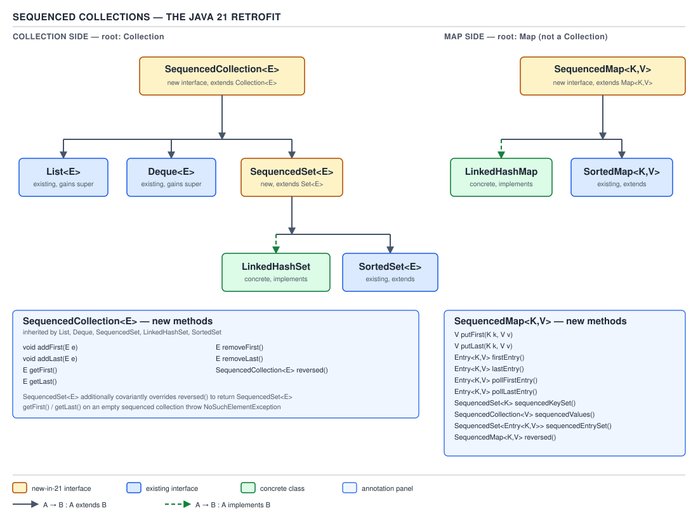

# 04 Modern Java — The library additions, 9 to 21 — BASICS (§1.20)

**Target version: Java 21 LTS.** | **Part 1 of 5** | [Index](../00-index.md)
Previous: [Structured concurrency — internals](../structured-concurrency/03-internals.md) · Next: [The master tables — master tables](../cost-model/02-master-tables.md)

## Overview: the shape of the 9 → 21 library story

Every release between 9 and 21 shipped one or two library changes that a working engineer runs
into constantly and one or two that only show up on an interview whiteboard. The throughline is
this: Java 8 shipped the language features (lambdas, streams, `Optional`) and left the *edges*
unfinished — no immutable-by-construction collection literal, no way to stop a stream early on a
condition, no first-class HTTP client, no way to ask a `List` for its last element without an
index calculation. Releases 9 through 21 spent nine years sanding those edges down. None of it is
as conceptually deep as streams or the module system's class-loading model, but almost all of it
is asked about, because "what's new since 8" is the laziest and most common senior-interview
question there is — and this table is the answer to it.

**D-086** — Library additions by release, 9 → 21

| Release | Collection factories | `String` methods | `Files` / IO | Stream & `Optional` | Language additions | The one breaking change |
|---|---|---|---|---|---|---|
| 9 | `List.of`/`Set.of`/`Map.of`/`Map.ofEntries` | — | — | `takeWhile`, `dropWhile`, 3-arg `iterate`, `Optional.stream`/`or`/`ifPresentOrElse` | private interface methods, effectively-final try-with-resources, diamond on anonymous classes | `Set`/`Map` iteration order re-randomises **every JVM run** |
| 10 | `List.copyOf`/`Set.copyOf`/`Map.copyOf`, `Collectors.toUnmodifiable*` | — | — | — | `var` (local-variable type inference) | — |
| 11 | — | `isBlank`, `strip*`, `lines`, `repeat` | `Files.readString`/`writeString`, `Path.of` | — | single-file source launch (`java Foo.java`) | `String.strip()` replaces `trim()`'s ASCII-only notion of whitespace |
| 12 | — | `indent`, `transform` | `Files.mismatch` | `Collectors.teeing` | — | — |
| 14 | — | — | — | — | helpful NPE messages (opt-in) | exception messages now name the null reference |
| 15 | — | `stripIndent`, `translateEscapes`, `formatted` | — | — | helpful NPE messages **on by default** | — |
| 16 | — | — | — | `Stream.toList`, `Stream.mapMulti` | — | `Stream.toList()` is unmodifiable, unlike `collect(Collectors.toList())` |
| 17 | — | — | — | — | `RandomGenerator` family (JEP 356) | `java.util.Random`-typed fields no longer name the best RNG choice |
| 18 | — | — | — | — | — | **JEP 400 — UTF-8 is the platform default charset**, not the OS default |
| 21 | — | — | — | — | Sequenced collections (JEP 431) | `reversed()` on a `List`/`LinkedHashMap` is a **view**, not a copy |

This file covers every cell above, leaf by leaf, at the mechanism level. It does not re-teach
`var` (covered in `var/01-basics.md`) or virtual threads and structured concurrency (covered in
`virtual-threads/` and `structured-concurrency/`) — those are named only where 19/20 previewed
them, with a pointer forward.

---

## 1. Collection factories: `List.of` / `Set.of` / `Map.of` / `Map.ofEntries` (§1.20.1)

### Mental model

Before Java 9, "an immutable list" meant one of two lies: `Arrays.asList(...)`, which is
fixed-*size* but still lets you call `.set(i, x)` and silently mutate the backing array; or
`Collections.unmodifiableList(list)`, which is a **view** — it throws on direct mutation, but the
`list` reference behind it can still be mutated by whoever holds it, and the view sees the change.
`List.of(a, b, c)` is neither a lie nor a view. It is a genuinely immutable **value** — think of it
as a small, purpose-built, sealed container class whose only job is to hold exactly these
elements, forever, with no method on it capable of changing them.

### Why it exists

Every codebase before Java 9 had a private static final "constants" block that looked like:

```java
private static final Set<RestrictionType> BLOCKING = Collections.unmodifiableSet(
    new HashSet<>(Arrays.asList(
        RestrictionType.DEPOSIT_BLOCKED,
        RestrictionType.WITHDRAWAL_BLOCKED,
        RestrictionType.ALL_BLOCKED)));
```

Three allocations (`Arrays.asList` wrapper, `HashSet`, `unmodifiableSet` wrapper) and three lines
to express "this set never changes." JEP 269 (*Convenience Factory Methods for Collections*,
Java 9) collapses that into one call and, in doing so, upgrades "never changes" from a runtime
promise enforced by a wrapper to a structural property of the returned object's class.

### When to reach for it, and when not

Reach for `List.of`/`Set.of`/`Map.of` for constants, for defensive return values from methods that
must never let callers mutate internal state, and for small literal collections built once and
read many times. Do **not** reach for them when: you need `null` elements (they are null-hostile —
see the pitfall below); you need a specific iteration order on a `Set` or `Map` (their order is
unspecified and, for `Set`/`Map` specifically, deliberately randomised — see mechanism); you are
about to mutate the collection at all, in which case `ArrayList`/`HashMap` plus
`Collections.unmodifiableX` at the boundary, or just a plain mutable collection, is the right tool.
The sibling that wins when you need a stable, predictable order for keys is `LinkedHashMap`/
`LinkedHashSet` (and since Java 21, both of those also implement the sequenced-collection
interfaces — see §9 of this file).

| | `Arrays.asList` | `Collections.unmodifiableX` | `List.of`/`Set.of`/`Map.of` |
|---|---|---|---|
| Structural mutation (`add`/`remove`) | throws `UnsupportedOperationException` | throws `UnsupportedOperationException` | throws `UnsupportedOperationException` |
| Element replacement (`set`/`put`) | **succeeds**, mutates backing array | delegates to backing collection — succeeds if backing collection is mutable | throws `UnsupportedOperationException` |
| Mutation through a retained reference to the source | n/a (array is the backing store) | **visible through the view** | impossible — no source reference is retained |
| `null` elements | allowed | allowed if backing collection allows it | **`NullPointerException`** at construction |
| Genuinely immutable | no | no (it's a view) | **yes** |

### How it works

`List.of`, `Set.of`, and `Map.of` are overloaded for 0 through 10 explicit arguments plus a varargs
form, all implemented in `java.util.ImmutableCollections`. The fixed-arity overloads exist so the
zero-, one-, and two-element cases (`List.of()`, `List.of(x)`, `List.of(x, y)`) can use specialised
classes (`ListN`, `List12`) that avoid allocating a backing array at all for the smallest cases —
`List.of()` returns a single cached `ListN` singleton, and `List.of(x)`/`List.of(x, y)` store their
elements directly in fields (`e0`, `e1`) rather than in an array. Every element is passed through
`Objects.requireNonNull` at construction, which is where the null-hostility comes from — it is not
a documentation policy, it is an explicit check in the constructor path.

For `Set.of` and `Map.of`, the internal `SetN`/`MapN` classes store elements in an open-addressed
array **twice the required size**, and — this is the mechanism worth knowing cold — they compute a
per-JVM-run random salt once, at class-initialisation time:

```java
static final long SALT32L;
static {
    long color = 0x243F6A8885A308D3L;   // MIX32 constant, ignored for our purposes
    SALT32L = (color * System.nanoTime()) | 1;
}
```

Every element's bucket index is `(element.hashCode() ^ (int)(SALT32L >> 32)) & (table.length - 1)`
(the real code XOR-mixes the salt into the probe sequence in `probe(Object)`), so the **same
`Set.of(a, b, c)` call, in the same source location, produces a different iteration order on every
JVM invocation** — but a stable order *within* one run. This is deliberate: the JEP's own rationale
is to stop applications from silently depending on an iteration order the interface documentation
never promised. `List.of` does **not** do this — a `List` has a defined encounter order (the order
you passed the elements in), so there is nothing to randomise.

### Diagram

There is no dedicated diagram for this concept in this file's manifest — the table above is the
diagram. (D-086, embedded in the Overview, is the release-by-release map that this section's row
belongs to.)

### Example

```java
// A LinkedHashMap of restriction keys, iterated in insertion order, contrasted with
// a Map.of over the same conceptual keys whose order is intentionally unstable.

Map<RestrictionKey, Restriction> orderedGates = new LinkedHashMap<>();
orderedGates.put(new RestrictionKey(RestrictionType.DEPOSIT_BLOCKED, RestrictionSource.SYSTEM_ONBOARDING),
    new Restriction(RestrictionType.DEPOSIT_BLOCKED, RestrictionSource.SYSTEM_ONBOARDING));
orderedGates.put(new RestrictionKey(RestrictionType.STAKE_BLOCKED, RestrictionSource.SYSTEM_COMPLIANCE),
    new Restriction(RestrictionType.STAKE_BLOCKED, RestrictionSource.SYSTEM_COMPLIANCE));
orderedGates.put(new RestrictionKey(RestrictionType.WITHDRAWAL_HELD, RestrictionSource.ADMIN),
    new Restriction(RestrictionType.WITHDRAWAL_HELD, RestrictionSource.ADMIN));
// orderedGates always prints DEPOSIT_BLOCKED, STAKE_BLOCKED, WITHDRAWAL_HELD, every run.

Map<String, Integer> bonusCapsByTier = Map.of("STANDARD", 100, "VIP", 250, "TRIAL", 25);
// bonusCapsByTier's iteration order is stable within this JVM process but will differ
// the next time the process starts — never log or hash-compare its toString() across runs.

// Null hostility: a screening result that legitimately has no reason code cannot go
// into a Map.of at all.
ScreeningVerdict verdict = new ScreeningVerdict(Outcome.CLEAR, /* reason */ null, Instant.now(), "SYSTEM");
Map<String, ScreeningVerdict> attempted = Map.of("cleared", verdict); // fine — verdict itself is non-null
// but:
List<String> reasons = List.of(verdict.reason()); // throws NullPointerException immediately
```

### Gotcha

**Pitfall:** Assuming `Map.of(...).keySet()` or `Set.of(...)` iterates in a fixed, reproducible
order because "it did last time I ran it."

**Wrong**

```java
Set<RestrictionType> blocking = Set.of(
    RestrictionType.DEPOSIT_BLOCKED, RestrictionType.WITHDRAWAL_BLOCKED, RestrictionType.ALL_BLOCKED);
System.out.println(blocking);
// Run 1: [WITHDRAWAL_BLOCKED, ALL_BLOCKED, DEPOSIT_BLOCKED]
// Run 2 (same JAR, same JVM version, restarted): [ALL_BLOCKED, DEPOSIT_BLOCKED, WITHDRAWAL_BLOCKED]
```

A test that asserts on `blocking.toString()` or on the first element of the iterator is a test that
passes locally and fails in CI at random — the classic "flaky test nobody can reproduce."

**Right**

```java
Set<RestrictionType> blocking = Set.of(
    RestrictionType.DEPOSIT_BLOCKED, RestrictionType.WITHDRAWAL_BLOCKED, RestrictionType.ALL_BLOCKED);
assertThat(blocking).containsExactlyInAnyOrder(
    RestrictionType.DEPOSIT_BLOCKED, RestrictionType.WITHDRAWAL_BLOCKED, RestrictionType.ALL_BLOCKED);
// or, if order genuinely matters to the caller, use LinkedHashSet.of-equivalent construction —
// there is no LinkedHashSet.of factory, so build it explicitly:
Set<RestrictionType> ordered = new LinkedHashSet<>(List.of(
    RestrictionType.DEPOSIT_BLOCKED, RestrictionType.WITHDRAWAL_BLOCKED, RestrictionType.ALL_BLOCKED));
```

**Why people believe it:** `List.of` really does preserve order, and most engineers reach for
`List.of`/`Set.of`/`Map.of` interchangeably as "the immutable-literal family," so the guarantee
they correctly learned for `List` gets silently over-generalised to `Set` and `Map`, where the JEP
explicitly randomises it to prevent exactly this assumption.

The mutable-collections comparison above — `HashMap` bucket layout, treeification, and why
`LinkedHashMap`/`TreeMap` exist — is guide 02's territory; this section covers only the immutable
factories' own construction and hostility rules.

> **Definition:** `List.of`/`Set.of`/`Map.of` return genuinely immutable, null-hostile collection
> values backed by compact fixed classes in `java.util.ImmutableCollections`; `Set`/`Map` additionally
> randomise their iteration order per JVM run via a startup-time salt, by design.

### The Java 10 copy factories and unmodifiable collectors (§1.20.2)

Java 10 completed the immutable-literal story with three more entry points, all supporting facts
built directly on the mechanism above:

- **`List.copyOf(coll)` / `Set.copyOf(coll)` / `Map.copyOf(map)`** take any existing collection and
  return an immutable snapshot of its *current* contents — a defensive copy, not a view, so later
  mutation of the source has no effect on the copy. **Gotcha:** if the argument is already an
  instance of the corresponding immutable type (e.g. you call `List.copyOf` on something `List.of`
  already produced), the implementation is permitted to return the same reference rather than copy
  again — the javadoc explicitly reserves this as an optimisation, so do not rely on `copyOf`
  always allocating, and do not rely on it never doing so either.
- **`Collectors.toUnmodifiableList()` / `toUnmodifiableSet()` / `toUnmodifiableMap()`** are the
  stream-terminal equivalents — `stream.collect(Collectors.toUnmodifiableList())` gives you the
  same null-hostile, immutable result as `List.copyOf(stream.toList())` in one pass, without the
  intermediate mutable list. Prefer these over `collect(Collectors.toList())` followed by a manual
  wrap whenever the collected result must not be mutated by the caller.

> **Definition:** the Java 10 copy factories snapshot an existing collection into the same
> immutable representation `List.of`/`Set.of`/`Map.of` use, with an unspecified same-instance
> optimisation when the source is already of that exact immutable type.

---

## 2. Stream and `Optional` completions from Java 9 (§1.20.3)

### Mental model

Java 8's `Stream` and `Optional` were designed around one shape of problem: "transform and reduce
a whole collection," and "a value that might not be there, so chain operations on it safely."
Java 9's four additions are not new capabilities in that sense — they are *escape hatches* for
shapes Java 8 could not express at all: stopping a stream early based on a **condition** rather
than a **count** (`limit(n)` needs you to already know `n`), generating a stream from a seed with a
**stopping predicate** instead of running forever, and treating an `Optional` as a
**zero-or-one-element stream** so it composes with the rest of the Stream API instead of forcing an
`if (opt.isPresent())` branch.

### Why it exists

Before Java 9, "keep taking elements while they satisfy a condition" required either a stateful
lambda (explicitly banned by the `Stream` contract's non-interference rules) or collecting
everything and then truncating with an index scan — defeating the entire point of a lazy pipeline.
Before Java 9, `Optional` had `map`/`flatMap`/`filter` but no way to *exit* into a `Stream`, so a
`List<Optional<Client>>` of lookups that might miss required an explicit loop to filter out the
empties — the one thing a `Stream` pipeline should have done in one line.

### When to reach for it, and when not

`takeWhile`/`dropWhile` win over `filter` whenever the property being tested is monotonic (true for
a prefix, then false for the rest, or vice versa) — `filter` scans the whole stream regardless,
`takeWhile` short-circuits. If the property genuinely isn't monotonic (some `true`s scattered after
`false`s), `takeWhile` will stop at the *first* `false`, which is wrong — reach for `filter`
instead. The three-argument `Stream.iterate` wins over the two-argument form whenever you can state
a stopping condition; use the two-argument form plus `.limit(n)` only when the natural terminator
is a **count**, not a **condition**. `Optional.stream()` wins over an explicit `isPresent()`/`get()`
branch specifically inside a stream pipeline; outside a pipeline, plain `ifPresentOrElse` or
`orElseThrow` remains clearer.

### How it works

`takeWhile(predicate)` and `dropWhile(predicate)` are ordinary intermediate stream operations —
each contributes one more sink stage, same as `filter` or `map` — but they carry a `SHORT_CIRCUIT`
flag in their `StreamOpFlag` bits for ordered streams: `wrapSink` produces a sink whose `accept`
method, once the predicate flips, calls `cancellationRequested()` upward, which propagates a
"stop pulling" signal back to the source spliterator so no further elements are even fetched. This
is precisely why `takeWhile` on an infinite stream (`Stream.iterate(1, i -> i * 2)`) terminates
where `filter` on the same stream would spin forever collecting a `.limit`-less pipeline. On an
explicitly **unordered** stream, the specification only requires that `takeWhile` return *a* valid
prefix consistent with *some* encounter order, not necessarily the one you would guess from source
order — do not rely on which elements you get from `takeWhile` on a `parallel().unordered()` stream.

The three-argument `Stream.iterate(seed, hasNext, next)` is the bounded sibling of the two-argument
infinite form: it evaluates `hasNext` **before** each element is emitted, including the seed, so
`Stream.iterate(0, i -> i < 5, i -> i + 1)` yields `0,1,2,3,4` — five elements, not six — because the
predicate is checked before `4 + 1 = 5` would be emitted and stops there.

`Optional.stream()` returns `Stream.of(value)` when present, `Stream.empty()` when empty — a
one-line adapter, but the mechanism worth stating precisely is that it makes `Optional` a **monadic
container compatible with `flatMap`**, so `Stream<Optional<T>>.flatMap(Optional::stream)` is the
idiomatic Java 9+ replacement for `.filter(Optional::isPresent).map(Optional::get)`.

`Optional.or(supplier)` is lazy — the alternative `Optional` is only constructed if `this` is
empty — which is the entire reason it exists alongside the Java 8 `orElseGet` (`orElseGet` produces
a plain **value**, lazily, while `or` produces another **`Optional`**, lazily, letting you chain a
third fallback: `a.or(() -> b).or(() -> c)`).

`Optional.ifPresentOrElse(consumer, emptyAction)` fills the one gap Java 8's `ifPresent` left: no
way to say what happens in the empty case without falling back to an `if/else` on `isPresent()`.

**Correction to the syllabus text:** the leaf list above groups `Optional.ofNullable` with these
Java 9 additions. That is a version-stale claim worth calling out explicitly, because it is exactly
the kind of thing an interviewer checks: `Optional.ofNullable(T)` shipped in **Java 8**, alongside
`Optional.of`, `Optional.empty`, `map`, `flatMap`, `filter`, `orElse`, and `orElseGet`. The genuine
Java 9 `Optional` additions are exactly three: `stream()`, `or(Supplier)`, and
`ifPresentOrElse(Consumer, Runnable)`.

### Example

```java
// A gate check pulls candidate documents in verification order and needs only the run
// of ones already marked verified, stopping at the first that is not.
List<DocumentRequirement> requirements = List.of(
    new DocumentRequirement("PASSPORT", DocumentStatus.SATISFIED),
    new DocumentRequirement("PROOF_OF_ADDRESS", DocumentStatus.SATISFIED),
    new DocumentRequirement("SOURCE_OF_FUNDS", DocumentStatus.SUBMITTED),
    new DocumentRequirement("SELFIE", DocumentStatus.SATISFIED));

List<DocumentRequirement> clearedPrefix = requirements.stream()
    .takeWhile(r -> r.status() == DocumentStatus.SATISFIED)
    .toList();
// [PASSPORT, PROOF_OF_ADDRESS] — stops at SOURCE_OF_FUNDS even though SELFIE later is SATISFIED.

// Bounded iterate: the 14-day coupon validity window, one date per day, without a separate limit.
LocalDate registeredOn = LocalDate.of(2026, 8, 1);
List<LocalDate> couponWindow = Stream.iterate(
        registeredOn,
        d -> d.isBefore(registeredOn.plusDays(14)),
        d -> d.plusDays(1))
    .toList();
// 14 dates: 2026-08-01 through 2026-08-14 inclusive.

// Optional.stream() composing a client lookup across a batch of restriction keys.
Function<ClientId, Optional<Client>> clientLookup = id -> profileService.findActive(id);
List<ClientId> flaggedIds = List.of(new ClientId(UUID.randomUUID()), new ClientId(UUID.randomUUID()));
List<Client> resolvedClients = flaggedIds.stream()
    .map(clientLookup)
    .flatMap(Optional::stream)
    .toList();

// Optional.or: try the client's declared bank instrument, then any card instrument, then decline.
Optional<Instrument> payoutRail = client.bankInstrument()
    .or(client::preferredCardInstrument)
    .or(Optional::empty);
payoutRail.ifPresentOrElse(
    instrument -> paymentService.schedule(instrument, withdrawal),
    () -> notificationService.notifyNoPayoutRail(client.id()));
```

### Gotcha

**Pitfall:** using `takeWhile` where the predicate is not actually monotonic across the stream.

**Wrong**

```java
// Assuming this drops only the settled reservations and keeps every open one.
List<Reservation> stillOpen = reservations.stream()
    .takeWhile(r -> r.status() != ReservationStatus.SETTLED)
    .toList();
// If a settled reservation happens to sit before an open one in encounter order,
// takeWhile stops right there — open reservations after it are silently lost.
```

**Right**

```java
List<Reservation> stillOpen = reservations.stream()
    .filter(r -> r.status() != ReservationStatus.SETTLED)
    .toList();
// filter scans every element; use takeWhile only when the property is a true prefix condition,
// e.g. "while sorted by openedAt ascending, take while still within the last hour."
```

**Why people believe it:** `takeWhile` reads like a more efficient `filter`, and in the one common
case people picture — a sorted-by-time stream where "still open" really is a prefix — it behaves
identically to `filter`, so the difference never surfaces until the data isn't sorted that way.

> **Definition:** Java 9 gave `Stream` a conditional short-circuit pair (`takeWhile`/`dropWhile`), a
> bounded three-argument `iterate`, and gave `Optional` a way to become a stream
> (`Optional.stream()`) and a lazy `Optional`-to-`Optional` fallback (`or`); `ofNullable` predates
> all of them, from Java 8.

---

## 3. Java 9's other language, platform, and API surface (§1.20.4–§1.20.7)

These four leaves are supporting facts — real, interview-relevant, but each a self-contained API
shape rather than a concept with a mental model of its own.

**Private interface methods (§1.20.4).** Java 8 let interfaces carry `default` and `static` method
bodies but gave them no way to share logic *between* two `default` methods without exposing that
logic as a third public method on the interface's contract. Java 9 allows `private` (and
`private static`) methods on interfaces, callable only from other methods of the same interface —
pure implementation-sharing with zero API surface. The language mechanics of default-method
resolution and the diamond problem are guide 03's territory (`[X-REF 03]`); the fact worth carrying
here is narrower: a `private` interface method cannot be `abstract`, cannot be overridden, and
exists purely to de-duplicate default-method bodies.

Three smaller Java 9 language changes travel with it, each three lines: **effectively-final
resources in try-with-resources** — a resource variable no longer needs to be redeclared inside the
`try (...)` parentheses if it is already effectively final, so `try (existingReader)` compiles
directly; **the diamond operator on anonymous class bodies** — `new Comparator<>() { ... }` compiles
where Java 8 required the explicit type argument, provided the inferred type has no
non-denotable component; **`@SafeVarargs` on `private` instance methods** — Java 8 restricted it to
`static`, `final`, or constructor declarations, and Java 9 widens it to any `private` method,
because a `private` method's call sites are all known at compile time in the same way a `final`
method's are.

**JPMS, JShell, jlink, multi-release JARs (§1.20.5).** The Java Platform Module System
(`module-info.java`, `requires`/`exports`/`opens`, strong encapsulation of non-exported packages
even across `public` classes) is the single largest change in the 9–21 window by any measure, and
its class-loading and encapsulation mechanics belong to guide 06 (`[X-REF 06]`) with its
language-level `module-info.java` syntax belonging to guide 03 (`[X-REF 03]`). What is worth
stating here, self-contained: **`jshell`** is a REPL shipped with the JDK for exploratory
evaluation without a project or build step; **`jlink`** assembles a custom, minimal runtime image
containing only the modules an application actually needs (no full JRE, meaningfully smaller
container images); **multi-release JARs** (JEP 238) let a single JAR carry version-specific
`.class` overrides under `META-INF/versions/<N>/`, with the JVM selecting the highest `<N>` not
exceeding its own version at class-load time — the mechanism that lets one artifact support Java 8
baseline behaviour and Java 17-optimised behaviour from the same file.

**The `Process` API, `Flow`, `VarHandle`, `StackWalker` (§1.20.6).** `ProcessHandle` (replacing the
painfully limited Java 8 `Process`) exposes `pid()`, `info()` (command line, start time, CPU time —
where the OS permits), `children()`/`descendants()` as a `Stream<ProcessHandle>`, and `onExit()`
returning a `CompletableFuture<ProcessHandle>` that completes when the process terminates, letting
you react to external-process completion without a blocking `waitFor()` thread. `java.util.concurrent.Flow`
is the JDK's built-in Reactive Streams SPI — four interfaces only (`Publisher`, `Subscriber`,
`Subscription`, `Processor`), no implementation beyond the demonstration `SubmissionPublisher`; its
back-pressure protocol (`request(n)`) is the same shape reactive libraries (Reactor, RxJava) already
converged on, and the JDK's contribution was standardising the interface, not the runtime — full
back-pressure mechanics are concurrency's territory (`[X-REF 05]`). `VarHandle` is the safe,
public replacement for the internal-only `sun.misc.Unsafe` field/array access that many
concurrent data structures had relied on for a decade; it exposes access modes across the full
memory-ordering spectrum — plain, opaque, acquire/release, and full volatile — as explicit method
names (`get`, `getOpaque`, `getAcquire`, `getVolatile`) rather than one field flag, and its
ordering semantics are concurrency's territory (`[X-REF 05]`). `StackWalker` replaces
`Throwable.getStackTrace()`'s eager, always-full-depth array copy with a lazy `Stream<StackFrame>`
that the caller can `.limit()` or `.filter()` before any frame beyond what's needed is even
materialised — a real cost saving when only the caller's caller is wanted, not the whole stack;
frame walking and its JVM-side cost are guide 06's territory (`[X-REF 06]`).

**Compact strings and indy string concatenation (§1.20.7).** These are invisible from source code
but are, in raw byte terms, the two largest string-performance changes of the era, and both belong
to guide 03's string-internals treatment in full (`[X-REF 03]`); the one paragraph owed here:
before Java 9, every `String` stored its characters as a `char[]` — two bytes per character even
for pure ASCII/Latin-1 content, which is the overwhelming majority of strings in most codebases
(status codes, identifiers, English error messages). Compact strings (JEP 254) store a `byte[]`
plus a one-byte `coder` field (`LATIN1 = 0` or `UTF16 = 1`), halving the backing-array memory for
any string whose content fits in Latin-1 — which for something like a `StatusCode` value
(`"AA-610"`) is every instance. Indified string concatenation (JEP 280) changes what `+` compiles
to: `javac` no longer emits an explicit chain of `StringBuilder.append` calls; it emits a single
`invokedynamic` call to `StringConcatFactory`, deferring the actual concatenation strategy to
link time, which lets the JVM choose (and later change, across JDK versions, without recompiling
your code) the fastest available implementation — including, on later JDKs, one that reads the
compact-string `coder` bytes directly instead of always widening to UTF-16 first.

---

## 4. Java 11: strings, files, and the standard `HttpClient` (§1.20.8–§1.20.11)

### String's Unicode-aware trimming (§1.20.8)

`String.trim()` (Java 1.0) strips any character `<= U+0020` — an ASCII-only, historically-motivated
definition of whitespace that predates Unicode-aware character classification in the JDK. Java 11
adds `isBlank()` (true if the string is empty or contains only Unicode whitespace per
`Character.isWhitespace`), `strip()`/`stripLeading()`/`stripTrailing()` (the Unicode-correct
replacement for `trim()`, aware of characters like U+2007 FIGURE SPACE that `trim()` does not
recognise as whitespace at all), `lines()` (a `Stream<String>` split on line terminators —
`\n`, `\r`, or `\r\n` — without the caller writing a `BufferedReader` loop), and `repeat(int)`
(replacing the `String.join("", Collections.nCopies(n, s))` idiom people used to fake this). None
of these carry a cost tradeoff or a sibling to choose against — they are direct replacements for
manual loops, worth knowing exist and nothing more.

### `Files` and `Path` conveniences (§1.20.9)

`Files.readString(path)`/`Files.writeString(path, content)` read or write an entire file as UTF-8
(unless a `Charset` argument is supplied) without the caller assembling a `BufferedReader` or
`InputStreamReader` chain — a one-line replacement for what used to be four. **Version note:**
before JEP 400 (§1.20.17, Java 18), the *implicit* default charset used elsewhere in the platform
(`new FileReader(path)`, `new String(bytes)`) was **not** UTF-8, it was the platform's native
encoding — `Files.readString`/`writeString` were always explicitly UTF-8-by-default from their
Java 11 introduction, ahead of and independent from the platform-wide default change three years
later. `Path.of(...)` is a drop-in factory replacement for `Paths.get(...)`, existing purely so
`Path` and `Paths` don't need to be imported together. `Collection.toArray(IntFunction<T[]>)`
(e.g. `list.toArray(String[]::new)`) replaces the awkward `toArray(new String[0])` pattern with an
allocator reference, avoiding the reflective array-sizing dance the zero-length-array idiom relied
on. `Predicate.not(predicate)` is a static method reference target for negation, useful specifically
where a method reference can't otherwise be negated inline: `.filter(Predicate.not(String::isBlank))`
where `.filter(s -> !s.isBlank())` is the equivalent but less composable form when `not` needs to
wrap an existing `Predicate`-typed variable.

### The standard `HttpClient` (§1.20.10)

**Mental model.** `HttpClient` is not a convenience wrapper over `HttpURLConnection` — it is a
ground-up replacement built around an explicit request/response value pipeline and a builder for
both the client and each request, designed from the start to support HTTP/2 multiplexing and
asynchronous completion as first-class citizens rather than bolted-on afterthoughts.

**Why it exists.** `HttpURLConnection` (Java 1.1) is blocking-only, has no HTTP/2 support, and its
API is a byzantine sequence of mutable setter calls on a connection object before you're allowed to
read from it — which is precisely why every serious Java HTTP client for two decades (Apache
HttpClient, OkHttp) existed as a third-party replacement rather than a wrapper. JEP 321 standardises
that replacement inside the JDK itself.

**When to reach for it, and when not.** Reach for the standard `HttpClient` for outbound calls where
HTTP/2, WebSocket, or `CompletableFuture`-based async composition matter, or where adding a
dependency at all is undesirable — e.g. calling the identity-verification vendor or the watchlist
provider from `DocumentVerification`/`ScreeningService`. Reach for a third-party client (still
commonly Apache HttpClient, OkHttp, or a Spring `RestClient`/`WebClient` wrapping either) when you
need connection-pool tuning knobs, request/response interceptor chains, or retry/circuit-breaker
integration the standard client doesn't expose directly — `HttpClient` gives you the protocol, not
the resilience layer around it.

| | `HttpURLConnection` | Standard `HttpClient` (JEP 321) | Apache HttpClient / OkHttp |
|---|---|---|---|
| HTTP/2 | no | yes, negotiated via ALPN, falls back to 1.1 | yes |
| Async model | none (blocking only) | `sendAsync` → `CompletableFuture<HttpResponse<T>>` | library-specific callback or reactive adapters |
| WebSocket | no | yes, built in | via separate dependency |
| Interceptors / retry policy | none | none built in | rich, first-class |
| Dependency footprint | zero (JDK) | zero (JDK) | external dependency |

**How it works.** `HttpClient.newHttpClient()` (defaults) or `HttpClient.newBuilder()...build()`
(explicit `version()`, `connectTimeout()`, `executor()`, `followRedirects()`) produces an immutable
client instance. Each request is built with `HttpRequest.newBuilder(uri)...build()`, also immutable.
`client.send(request, bodyHandler)` blocks the calling thread and returns `HttpResponse<T>`;
`client.sendAsync(request, bodyHandler)` returns immediately with a `CompletableFuture<HttpResponse<T>>`
that completes on an internal client-managed thread when the response arrives — internally, the
Java 11 implementation runs a selector-based I/O event loop on a small number of client-managed
threads rather than one thread per in-flight request, which is the mechanism that lets a single
`HttpClient` instance sustain many concurrent `sendAsync` calls without thread-per-request cost.
`BodyPublishers` (`ofString`, `ofByteArray`, `ofFile`) supply the request body; `BodyHandlers`
(`ofString`, `ofByteArray`, `ofInputStream`) decode the response body into the requested shape.
HTTP/2 support means multiple requests to the same origin can multiplex over one connection instead
of opening one socket per request — the protocol-level detail that most justifies choosing this
client for high-fan-out calls to a single vendor, which is exactly `DocumentVerification`'s shape
against the identity vendor (p50 900ms, p99 38s, capped at 600 calls/min estate-wide per the
domain's own numbers). The full asynchronous-composition and timeout-handling patterns for
`CompletableFuture` chains are networking's territory in depth (`[X-REF 10]`); the one-paragraph
mechanism owed here is the selector-based async model above.

**Example.**

```java
HttpClient identityVendorClient = HttpClient.newBuilder()
    .version(HttpClient.Version.HTTP_2)
    .connectTimeout(Duration.ofSeconds(5))
    .build();

HttpRequest verificationRequest = HttpRequest.newBuilder(URI.create("https://vendor.example/v1/verify"))
    .header("Idempotency-Key", new IdempotencyKey(UUID.randomUUID().toString()).value())
    .POST(HttpRequest.BodyPublishers.ofString("""
        {"applicationId":"%s","documentType":"PASSPORT"}
        """.formatted(applicationId)))
    .timeout(Duration.ofSeconds(40)) // covers the vendor's stated p99 of 38s
    .build();

CompletableFuture<DocumentVerdict> pendingVerdict = identityVendorClient
    .sendAsync(verificationRequest, HttpResponse.BodyHandlers.ofString())
    .thenApply(response -> switch (response.statusCode()) {
        case 200 -> DocumentVerdict.verified(applicationId, Instant.now());
        case 409 -> DocumentVerdict.referred(applicationId, "VENDOR_INCONCLUSIVE", Instant.now());
        default -> throw new IllegalStateException("Unexpected vendor status " + response.statusCode());
    });
```

**Gotcha.** `HttpClient` instances are expensive to build (they own connection pools and, on
HTTP/2, multiplexed connections) and are documented as safe to share and reuse across many
requests — the frequent mistake is constructing a new `HttpClient` per call, which throws away
connection reuse and defeats HTTP/2 multiplexing entirely; build one per logical destination (or
one shared instance) and hold onto it.

> **Definition:** `HttpClient` (JEP 321, Java 11) is the JDK's built-in, dependency-free HTTP/1.1
> and HTTP/2 client with synchronous (`send`) and `CompletableFuture`-based asynchronous
> (`sendAsync`) request execution and built-in WebSocket support, intended to replace
> `HttpURLConnection` for new code and to reduce, though not eliminate, the need for a third-party
> HTTP dependency.

### Single-file source-code launch (§1.20.11)

JEP 330 lets `java Foo.java` compile and run a single source file in memory, in one step, with no
separate `javac` invocation and no `.class` file left on disk — aimed squarely at scripting and
teaching use cases where the ceremony of a build step is pure overhead. On systems with shebang
support, the same mechanism launches with `#!/usr/bin/java --source 11` as the first line of an
extension-less executable file. It only works for a **single** compilation unit with no external
dependencies beyond the JDK itself; anything requiring a second source file or a library needs an
actual build.

---

## 5. Stream and string completions, Java 12–16 (§1.20.12–§1.20.15)

### `Collectors.teeing` and its Java 12 neighbors (§1.20.12)

**Mental model.** `teeing` is a Y-splitter for a stream: one traversal, two independent downstream
collectors running side by side over every element, their two results combined at the end by a
merging function you supply.

**Why it exists.** Before Java 12, computing two independent aggregates over the same stream — say,
a count and a sum — meant either traversing the source twice (two `.stream()` calls, or storing the
elements first) or hand-writing a custom `Collector` with a two-slot accumulator, which most
engineers never bothered to do and just paid for the second traversal instead.

**When to reach for it, and when not.** Reach for `teeing` when you need exactly two aggregates from
one pass over a stream that is expensive to traverse twice — a JDBC `ResultSet`-backed stream, a
stream over a paginated API, or (as below) a large in-memory collection where avoiding a second
full scan is worth the small extra ceremony. Do not reach for it for more than two aggregates —
`teeing` composes only pairwise; for three or more simultaneous aggregates, a hand-rolled
`Collector` or `summaryStatistics()` (when the aggregates it already computes are the ones you
need) reads more clearly than nested `teeing` calls.

**How it works.** `Collectors.teeing(downstream1, downstream2, merger)` builds a `Collector` whose
accumulator forwards each element to *both* downstream collectors' accumulators, and whose finisher
calls `downstream1.finisher()` and `downstream2.finisher()` before applying `merger` to their two
results — one pass through the source spliterator, two collectors driven off the same `accept`
call per element.

**Example.**

```java
// One pass over a day's stake reservations (2.8M/day, avg value 4.20) computing both
// the count and the total staked amount, instead of two separate stream traversals.
record StakeSummary(long count, BigDecimal totalStaked) {}

StakeSummary daily = reservations.stream()
    .collect(Collectors.teeing(
        Collectors.counting(),
        Collectors.mapping(Reservation::amount, Collectors.reducing(BigDecimal.ZERO, BigDecimal::add)),
        StakeSummary::new));
```

**Gotcha.** Both downstream collectors see *every* element regardless of whether either one's
result is actually needed for a given branch — `teeing` is not conditional dispatch, it is
unconditional duplication of the accumulation step; if one of the two aggregates is rarely needed,
computing it unconditionally may cost more than it saves.

> **Definition:** `Collectors.teeing` runs two downstream collectors over a single stream traversal
> and merges their two finished results with a supplied `BiFunction`, trading a slightly heavier
> per-element accumulation step for one pass instead of two.

Three more Java 12 additions travel alongside it as supporting facts: **`String.indent(n)`** adds
(or removes, for negative `n`) `n` spaces to the start of every line, normalising line terminators
to `\n` in the process; **`String.transform(Function<String,R>)`** lets a transformation be inlined
into a fluent chain (`raw.strip().transform(this::normalise)`) without breaking out of expression
context into a separate statement; **`Files.mismatch(pathA, pathB)`** returns the byte offset of the
first difference between two files, or `-1` if they are fully identical — a single call replacing a
manual byte-by-byte comparison loop, useful for verifying a ledger export file matches a golden
copy in a test; **`CompactNumberFormat`** renders numbers in locale-aware compact form (`"1.2K"`,
`"3M"`), useful for a dashboard tile showing registered-client counts (2.4M) without spelling out
every digit.

### Helpful `NullPointerException` messages (§1.20.13)

Before JEP 358 (Java 14, opt-in via `-XX:+ShowCodeDetailsInExceptionMessages`; on by default since
Java 15), a `NullPointerException` from an unguarded chained call —
`application.applicant().address().postcode()` — told you only that *something* in that chain was
null, with a stack trace pointing at the line but not the expression. JEP 358's mechanism analyses
the bytecode at the failing instruction (which local variable slot, field, or array index the
failing `getfield`/`invokevirtual` operated on) and synthesises a message naming it directly:

```
Cannot invoke "Address.postcode()" because the return value of
"Application.address()" is null
```

**Pitfall:** this is a **diagnostic** improvement only — it does not change when or whether an NPE
is thrown, and it costs nothing extra at the throw site (the analysis runs only when the exception
is actually being constructed, from the already-failing bytecode, not on every call). Reading a
helpful-NPE message from a Java 21 log line and assuming the same code would have thrown the same
exception on Java 8 is safe; assuming the message text itself is something Java 8 could have
produced is not.

> **Definition:** JEP 358 makes `NullPointerException` messages name the specific null reference
> and the specific call/field/array access that failed, computed from bytecode analysis at
> exception-construction time, on by default since Java 15.

### Text block support methods (§1.20.14)

Java 15 shipped alongside text blocks (`"""`) with three `String` methods purpose-built for them,
usable on any string: **`stripIndent()`** removes the *minimal common leading whitespace* across
all lines (the same algorithm the compiler applies to a text block's source indentation, exposed as
a callable method); **`translateEscapes()`** converts literal backslash-escape sequences
(`\n`, `\t`) appearing in the string's actual characters into the characters they represent — the
same step the compiler applies to a text block's embedded escapes; **`formatted(Object... args)`**
is `String.format(this, args)` as an instance method, letting a text block chain directly into
formatting: `"""SELECT * FROM ledger WHERE client_id = %s""".formatted(clientId)`. Alongside them,
Java 15 adds `CharSequence.isEmpty()` as a `default` method, so any `CharSequence` implementation
gets it without redeclaring it.

### `Stream.toList` and `Stream.mapMulti` (§1.20.15)

**Mental model.** `Stream.toList()` is not sugar for `collect(Collectors.toList())` — it is a
distinct terminal operation with a stronger contract. `Stream.mapMulti` is not sugar for `flatMap`
— it inverts the control flow from "return a stream per element" to "call back into a consumer zero
or more times per element."

**Why they exist.** `collect(Collectors.toList())` has, since Java 8, been documented to make *no*
guarantee about the mutability, serializability, or thread-safety of the returned list — in
practice it has always returned a mutable `ArrayList`, and years of code came to depend on that
undocumented fact. `Stream.toList()` (Java 16) exists to give an unmodifiable result **by
contract**, closing that gap explicitly rather than leaving callers to rely on an implementation
detail. `Stream.mapMulti` exists because `flatMap` requires producing a `Stream<R>` per input
element even when the natural way to generate zero-or-more outputs is an imperative loop or a
callback-style API (a legacy method that takes a `Consumer<R>` rather than returning a collection)
— wrapping that in a freshly allocated `Stream` per element is pure overhead when the number of
outputs per element is typically zero or one.

**When to reach for it, and when not.**

| | `collect(Collectors.toList())` | `Stream.toList()` | `flatMap` | `Stream.mapMulti` |
|---|---|---|---|---|
| Mutability of result | unspecified (in practice mutable `ArrayList`) | **unmodifiable by contract** | depends on downstream collector | depends on downstream collector |
| Allows `null` elements | yes | **yes** (unlike `List.of`) | n/a | n/a |
| Per-element allocation | one list add | one list add | one `Stream` object per element | **none** — direct callback |
| Best fit | need a mutable result to hand off | need a fixed, safe-to-share result | zero-or-more outputs, naturally stream-shaped per element | zero-or-more outputs, naturally loop/callback-shaped per element, or very few outputs (avoids stream-per-element allocation) |

**How it works.** `Stream.toList()`'s implementation collects into an internal array-backed
structure and wraps it in an unmodifiable `List` view before returning — it is specified, not
incidental, that mutation attempts throw `UnsupportedOperationException`; it is *not* specified to
be one of the `java.util.ImmutableCollections` types from §1 above, so it is **not** guaranteed
null-hostile the way `List.of` is — a Java 21 `Stream.toList()` result may legally contain `null`
elements if the source stream did. `Stream.mapMulti(BiConsumer<T, Consumer<R>> mapper)` calls
`mapper.accept(element, downstreamConsumer)` once per input element; inside `mapper`, calling
`downstreamConsumer.accept(r)` zero, one, or many times is exactly how many elements flow to the
next stage — there is no intermediate `Stream` object created per input element at all, only direct
calls into the pipeline's existing sink chain.

**Example.**

```java
// A PaymentRun expanded into its individual settlement events via mapMulti — the run's
// legacy iteration API is callback-shaped (forEachTransaction(Consumer<WithdrawalTransaction>)),
// which mapMulti adapts directly without allocating a Stream per run.
List<WithdrawalTransaction> settled = paymentRuns.stream()
    .<WithdrawalTransaction>mapMulti((run, consumer) -> {
        if (run.status() == PaymentRunStatus.SIGNED_OFF) {
            run.forEachTransaction(consumer);
        }
        // runs not yet signed off contribute zero elements — no branch needed beyond this.
    })
    .toList();

// Contrast with the equivalent flatMap form, which must materialise a Stream per run:
List<WithdrawalTransaction> settledViaFlatMap = paymentRuns.stream()
    .filter(run -> run.status() == PaymentRunStatus.SIGNED_OFF)
    .flatMap(run -> run.transactions().stream())
    .toList();
```

**Gotcha.** `Stream.toList()`'s result being unmodifiable is easy to forget precisely because
`collect(Collectors.toList())` trained a generation of Java engineers that stream-collected lists
are safe to `.add()` to afterwards.

**Pitfall:** treating `Stream.toList()` like the mutable `ArrayList` `collect(Collectors.toList())`
used to hand back.

**Wrong**

```java
List<Reservation> openReservations = reservations.stream()
    .filter(r -> r.status() == ReservationStatus.OPEN)
    .toList();
openReservations.add(newReservation); // throws UnsupportedOperationException at runtime
```

**Right**

```java
List<Reservation> openReservations = new ArrayList<>(reservations.stream()
    .filter(r -> r.status() == ReservationStatus.OPEN)
    .toList());
openReservations.add(newReservation); // fine — explicit mutable copy
```

**Why people believe it:** `Stream.toList()` reads as a drop-in shorthand for
`collect(Collectors.toList())` — same shape, three fewer words — and the migration guides that
promoted it as "the concise version" rarely led with the one behavioural difference that matters.

> **Definition:** `Stream.toList()` (Java 16) is a terminal operation returning an unmodifiable list
> that may still contain `null`s; `Stream.mapMulti` (Java 16) is an imperative one-to-many mapping
> operation that calls back into a `Consumer` rather than allocating a `Stream` per element, useful
> where `flatMap`'s per-element stream allocation is wasted work.

Two further Java 16 additions round out this release: `Period` and `Duration` gained small
arithmetic convenience methods (`Duration.dividedBy`, `Period.negated`, and similar), and
`DateTimeFormatter` gained the `B` pattern letter, which renders a locale-appropriate day-period
phrase ("in the morning," "at night") instead of the raw `AM`/`PM` the `a` letter produces — useful
directly for anything rendering `ReserveStake`/`SettleStake` timestamps in a client-facing UI.

---

## 6. `RandomGenerator`: unifying random number generation (§1.20.16)

**[RESEARCH] verification note:** the interface names, method names, and hierarchy below match the
JDK 21 javadoc for `java.util.random` as of this writing. If a specific algorithm-name string
(`"L64X128MixRandom"`, `"Xoroshiro128PlusPlus"`) matters for your own code, verify it against
`RandomGeneratorFactory.all()` on the exact JDK build in use — the *set* of registered algorithms is
implementation-defined and has grown across JDK releases.

**Mental model.** Before JEP 356, "random number generator" in Java meant one of four unrelated,
non-interchangeable classes — `java.util.Random`, `SecureRandom`, `ThreadLocalRandom`,
`SplittableRandom` — each with its own subtly different API and no common interface, so code written
against one could never be swapped for another without a rewrite. `RandomGenerator` is the missing
common interface, plus a factory for looking algorithms up by name, plus several *new* algorithms
with better statistical properties than the 1990s-vintage linear congruential generator `Random`
has used unchanged since Java 1.0.

**Why it exists.** `java.util.Random` is a 48-bit-seed linear congruential generator — a well-
understood but statistically weak algorithm by modern standards, and one that is internally
`synchronized` on every `next(int)` call, making it a real contention point under concurrent access
from many threads (which is exactly why `ThreadLocalRandom` was added in Java 7 as a workaround, not
a fix). By 2021, decades of PRNG research had produced several algorithm families
(splittable generators safe to fork across parallel tasks without correlation, jumpable generators
that can skip ahead by a fixed stride for reproducible parallel partitioning) with no path into the
JDK because there was no shared interface for them to implement.

**When to reach for it, and when not.** Reach for `RandomGeneratorFactory.of("<algorithm>").create()`
(or the convenience `RandomGenerator.getDefault()`) for new code, especially anything that will run
across parallel streams or parallel tasks, where a **splittable** generator (implementing
`SplittableGenerator`) avoids the correlation risk of naively sharing or reseeding one `Random`
instance per task. Keep `SecureRandom` for anything cryptographic (token generation, `IdempotencyKey`
values that must be unguessable) — `RandomGenerator`'s non-cryptographic algorithms are faster and
statistically better distributed but are **not** designed to resist an adversary predicting future
output from past output the way `SecureRandom` is. Keep plain `java.util.Random` only where existing
code already depends on its specific, reproducible seed-to-sequence mapping (some tests pin a seed
and assert on the exact sequence `Random` produces — swapping the algorithm breaks that assertion
even though the interface is drop-in compatible).

| | `java.util.Random` | `ThreadLocalRandom` | `SplittableRandom` | `RandomGenerator` family (JEP 356) |
|---|---|---|---|---|
| Algorithm | 48-bit LCG, fixed since Java 1.0 | same LCG, per-thread instance | dedicated splittable algorithm | pluggable — dozens of registered algorithms |
| Thread safety under contention | `synchronized`, contends | none needed (per-thread) | not thread-safe, not needed if used per-task | algorithm-dependent; splittable ones designed for parallel fan-out |
| Statistical quality | weak by modern standards | same as `Random` | good | ranges from good to very good depending on algorithm chosen |
| Cryptographic use | never | never | never | never (use `SecureRandom`) |
| Common interface | none (predates it) | none (predates it) | none (predates it) | `RandomGenerator`, implemented by all of the above's modern equivalents |

**How it works.** `RandomGenerator` is the root interface, with `nextInt`/`nextLong`/`nextDouble`/
`nextBoolean`/`nextGaussian` plus stream-producing methods (`ints()`, `longs()`, `doubles()`)
returning `IntStream`/`LongStream`/`DoubleStream` directly — no separate `Random`-to-`IntStream`
adapter needed. Four sub-interfaces extend it for specific capabilities: `StreamableGenerator` (can
produce a `Stream<RandomGenerator>` of further generators), `SplittableGenerator` (can `split()`
itself into a statistically-independent child generator — the mechanism a parallel stream would use
to hand each fork its own generator without correlation), `JumpableGenerator` (can advance its
internal state by a large fixed stride in O(1), letting you partition one logical sequence into
non-overlapping ranges deterministically), and `LeapableGenerator` (a larger jump distance than
`JumpableGenerator`, layered the same way). `RandomGeneratorFactory<T extends RandomGenerator>` is
looked up by algorithm name string via `RandomGeneratorFactory.of(name)`, backed by a
`ServiceLoader`-discovered provider mechanism — the same pluggability model the JDK uses for
`Charset` providers and JDBC drivers — so a third-party library can register its own algorithm and
have it discoverable through the same `RandomGeneratorFactory.all()` listing as the JDK's built-in
ones, without a JDK release.

**Example.**

```java
// Sampling jittered retry delays for a batch of PSP capture retries, using a splittable
// generator so each retry task gets a statistically independent stream, unlike sharing
// one java.util.Random across threads.
RandomGenerator.SplittableGenerator retryJitter =
    RandomGeneratorFactory.<RandomGenerator.SplittableGenerator>of("L64X128MixRandom").create();

List<CompletableFuture<Void>> captureRetries = pendingCaptures.stream()
    .map(capture -> {
        RandomGenerator perTaskGenerator = retryJitter.split();
        long jitterMillis = perTaskGenerator.nextLong(50, 250); // p50 240ms capture, jitter under it
        return CompletableFuture.runAsync(
            () -> paymentService.retryCapture(capture),
            CompletableFuture.delayedExecutor(jitterMillis, TimeUnit.MILLISECONDS));
    })
    .toList();
```

**Gotcha.** `RandomGenerator.getDefault()` returns *some* algorithm chosen by the JDK, not
necessarily the same one across JDK versions or vendors — code that needs a specific, named
algorithm (for reproducibility across environments) must call `RandomGeneratorFactory.of("<name>")`
explicitly rather than relying on the default.

> **Definition:** `RandomGenerator` (JEP 356, Java 17) is a common interface unifying
> `Random`/`SplittableRandom`/`ThreadLocalRandom`-shaped generators with pluggable, discoverable
> algorithms of varying statistical quality and splitting/jumping capability, looked up by name via
> `RandomGeneratorFactory`; it is explicitly not a cryptographic replacement for `SecureRandom`.

---

## 7. JEP 400: UTF-8 as the platform default (§1.20.17)

**Mental model.** Before Java 18, every API that reads or writes text **without an explicit
`Charset` argument** silently used whatever the JVM's *default charset* happened to resolve to —
and that default was derived from the operating system's own configured locale and code page, so
the *exact same source line*, compiled once, behaved differently depending on which machine it ran
on. JEP 400 deletes that variability: the platform default charset is now **UTF-8, unconditionally**,
on every operating system, unless an operator explicitly opts back out.

**Why it exists.** The pre-18 default-charset resolution read the `file.encoding` system property,
which the JVM itself populated at startup from the OS locale if not set explicitly — Windows
machines commonly resolved to `windows-1252` or another regional code page, many Linux
distributions resolved to `UTF-8` already (which is precisely why this bug class was so often
invisible in CI running on Linux and only surfaced in production on Windows, or vice versa), and
macOS had its own resolution path. Any code calling `new FileReader(path)`, `new String(bytes)`,
`String.getBytes()`, or constructing a `PrintStream`/`PrintWriter` without a `Charset` argument
inherited whatever that resolution produced — which meant the same JAR, deployed to a
Windows-hosted CI runner and a Linux-hosted production box, could read or write text differently
between the two, entirely invisibly, with no exception and no log line.

**When to reach for it, and when not.** There is nothing to "reach for" here — this is a default,
not an opt-in API — but there is a decision every team upgrading past Java 17 must make explicitly:
**verify** that nothing in the codebase relied on the old platform-dependent default (most commonly,
code reading files that were themselves written in a non-UTF-8 encoding, expecting the reader's
"default" to match). Where legacy behaviour genuinely must be preserved during a migration, JEP 400
provides an explicit escape hatch: launching with `-Dfile.encoding=COMPAT` restores the pre-18
OS-dependent resolution — a deliberate, temporary opt-out, not a silent one. Where code specifically
needs the *platform's actual native encoding* (for console I/O interoperating with OS-level tools,
for instance), JEP 400 adds a **new**, separate system property, `native.encoding`, that always
reports what the OS-derived encoding would have been — so "what does the OS use" and "what does
`String.getBytes()` use by default" are now two independently queryable, independently answerable
questions, where before Java 18 they were the same question with one answer.

**How it works.** `Charset.defaultCharset()` still reads the same `file.encoding` system property
it always has — what changed is the *default value that property resolves to* when nothing sets it
explicitly: `UTF-8`, full stop, regardless of OS locale. Every API that previously deferred to
`Charset.defaultCharset()` implicitly — `FileReader`, `FileWriter`, `PrintStream`, `Scanner`, the
no-charset overloads of `String(byte[])` and `String.getBytes()` — now reads and writes UTF-8 by
default on every platform. `java.io.Console`, deliberately, is exempt — it continues to use the
platform's native console encoding, because a terminal's actual character encoding is a property of
the terminal, not something the JVM can override without breaking the console's own tools.

**Diagram.** No diagram is assigned in this file's manifest for JEP 400 specifically — D-086 above,
in the Overview, is the release table that flags Java 18's row as *the* breaking-change release, and
that flag belongs here at the point of full explanation: **JEP 400's UTF-8 default is the single
most behaviour-changing library change of the entire 9–21 window**, because unlike every other
addition in this file, it changes what *existing, unmodified* code does, on upgrade, with no source
change required to trigger the difference.

**Example.**

```java
// Exporting a day's ledger entries for the compliance archive. Before Java 18, this line's
// actual output encoding depended on the host OS's locale configuration; from Java 18 it is
// UTF-8 everywhere, matching what Files.readString/writeString already guaranteed since 11.
try (PrintWriter ledgerExport = new PrintWriter(
        new FileWriter(Path.of("/exports/ledger-2026-08-30.csv").toFile()))) {
    ledgerExport.println("position,amount,currency");
    ledgerExport.println("CLIENT_CASH_AVAILABLE,142.50,GBP");
}
// On Java 17 and earlier, on a Windows host defaulting to windows-1252, a currency symbol or
// accented client name elsewhere in the export could be mis-encoded with no exception thrown.
// On Java 18+, the same code is UTF-8 on every host, matching the reader on the other end
// that expects UTF-8 — provided that reader was always assuming UTF-8 and simply happened
// to be right on Linux and wrong on Windows before this JEP.
```

**Gotcha.** **Pitfall:** assuming an upgrade from Java 17 to 18+ is behaviour-neutral because "we
didn't touch any charset code."

**Wrong**

```java
// A downstream partner's ingestion job was written against the specific mis-encoded bytes
// this Windows-hosted service happened to emit on Java 17 (windows-1252), and "worked"
// only because both sides shared the same accidental default.
new PrintWriter(new FileWriter(exportFile)).println(clientDisplayName); // no Charset specified
```

**Right**

```java
// Name the charset explicitly at every I/O boundary that crosses a process or file-format
// contract, so the behaviour does not depend on the JVM's platform default at all, in either direction.
try (Writer writer = new OutputStreamWriter(new FileOutputStream(exportFile), StandardCharsets.UTF_8)) {
    writer.write(clientDisplayName);
}
```

**Why people believe it:** upgrading a JDK feels like a language/library-feature question — "does
our code use anything removed or deprecated" — and a default-charset change touches no API surface
at all, so it is invisible to every checklist that only diffs the javadoc between releases; it only
surfaces when bytes on disk or over the wire stop matching what the other side expects.

> **Definition:** JEP 400 (Java 18) makes UTF-8 the JVM's default charset on every operating system
> for every API that previously deferred to the platform's OS-derived default, replacing years of
> silent, host-dependent encoding behaviour with one universal, predictable default — with an
> explicit `file.encoding=COMPAT` escape hatch and a separate `native.encoding` property for code
> that genuinely needs the OS's own encoding.

---

## 8. The road to 21: what 19 and 20 previewed (§1.20.18)

Four features that finalised in Java 21 spent one or two releases in preview or incubator first,
and the version history itself is worth stating precisely because "when did X land" is a common
interview probe:

| Feature | Java 19 | Java 20 | Java 21 |
|---|---|---|---|
| Virtual threads | JEP 425 — preview | JEP 436 — second preview | **JEP 444 — final** |
| Structured concurrency | JEP 428 — incubator | JEP 437 — second incubator | JEP 453 — **preview** (still not final at 21) |
| Record patterns | JEP 405 — preview | JEP 432 — second preview | **JEP 440 — final** |
| Pattern matching for `switch` | JEP 406 — preview | JEP 433 — second preview | **JEP 441 — final** |

The mechanism-level treatment of each of these belongs to the guides that own them —
virtual threads and structured concurrency in `virtual-threads/` and `structured-concurrency/`
(where the corrected virtual-thread scheduler defaults and the two-JEP structured-concurrency
API shape are already covered in depth), record patterns and pattern-matching `switch` in
`pattern-matching/` and `switch/`. The one fact worth carrying specifically here, because this
file's job is the version story: none of these four features is safe to describe as "still
evolving, landed sometime around 21" — each has an exact JEP number and an exact release for every
stage, and structured concurrency specifically is **still a preview feature at 21**, requiring
`--enable-preview`, with its API shape changing again at Java 25 (public `open()` factories and a
composable `Joiner` replacing the 21-era public constructors and `ShutdownOnFailure`/
`ShutdownOnSuccess` policies).

---

## 9. Sequenced collections (§1.20.19–§1.20.22)

### Mental model

For every prior release, the collections framework had a sharp, arbitrary asymmetry: a `List` could
answer "give me the first element" and "give me the last element" trivially, by index — but a
`Deque` could answer the same two questions only through `getFirst()`/`getLast()`, a `LinkedHashSet`
could not answer either without an iterator, and a `SortedSet` could answer "first" via
`first()` but "last" required a *different*-named method, `last()`. There was no single supertype
that meant "this collection has a defined encounter order and can tell you both ends of it."
Sequenced collections (JEP 431, Java 21) are that missing supertype, retrofitted onto every
collection that already conceptually had an order.

### Why it exists

Before JEP 431, "get the last element of a `List`" was `list.get(list.size() - 1)` — an index
calculation every engineer has written and every engineer has, at some point, gotten off-by-one on
an empty list. "Get the last element of a `LinkedHashMap`," which has no index at all, required
either external bookkeeping of the most-recently-inserted key or a full iteration to the end. There
was no interface an algorithm could be written against that meant "this collection type has a
first and a last element" — code that needed that concept was written against `List` specifically,
excluding every `Deque`, `LinkedHashSet`, or `SortedMap` that had the same property under a
different name.

### When to reach for it, and when not

Reach for the sequenced-collection view methods (`getFirst`/`getLast`/`addFirst`/`addLast`/
`reversed()`) wherever code today manually computes `list.get(list.size() - 1)` or walks an
iterator to its final element — the interface methods are clearer and, on types with an O(1) last
element (a `Deque`, a doubly-linked structure), no slower. Do not reach for `reversed()` expecting a
snapshot — if you need the reversed order to stay fixed while the source mutates underneath you
(rare, but real for something like an audit log you're about to serialize), copy it explicitly
first; `reversed()` is a live view (see the mechanism below), which is exactly right for "iterate
the newest-first" use cases and exactly wrong for "freeze this order."

### How it works

`SequencedCollection<E> extends Collection<E>` adds `addFirst(E)`, `addLast(E)`, `getFirst()`,
`getLast()`, `removeFirst()`, `removeLast()`, and `reversed()` (returning another
`SequencedCollection<E>` — the same live-view relationship described below). `SequencedSet<E>`
extends both `Set<E>` and `SequencedCollection<E>`, overriding `reversed()` covariantly to return
`SequencedSet<E>`. `SequencedMap<K,V>` extends `Map<K,V>` and adds `putFirst`/`putLast`,
`firstEntry()`/`lastEntry()`, `pollFirstEntry()`/`pollLastEntry()`, `reversed()` (returning
`SequencedMap<K,V>`), and three view accessors — `sequencedKeySet()`, `sequencedValues()`,
`sequencedEntrySet()` — mirroring `keySet()`/`values()`/`entrySet()` but returning
order-preserving, sequenced-typed views instead of plain `Set`/`Collection`.

The retrofit onto existing types needed **no new stored state** anywhere, because every retrofitted
type already had an order internally — the new interface methods are default or directly-overriding
implementations expressed in terms of operations the type already supported:

- `List<E>` and `Deque<E>` both gain `SequencedCollection<E>` as a superinterface. `List` already had
  index-based first/last access; the new methods are thin wrappers (`getFirst()` →
  `get(0)`-equivalent, `addLast(e)` → `add(e)`-equivalent). `Deque` already had `getFirst`/`addLast`
  etc. under those exact names — the retrofit is almost entirely nominal for `Deque`.
- `LinkedHashSet<E>` implements `SequencedSet<E>` directly, using its existing insertion-order
  (or access-order) linked-list-of-entries structure to answer `getFirst`/`getLast` in O(1).
- `SortedSet<E>` extends `SequencedSet<E>`, with `NavigableSet<E>` further overriding `reversed()`
  covariantly to return `NavigableSet<E>` (so a `TreeSet`'s `reversed()` result is still fully
  navigable, not merely sequenced).
- `LinkedHashMap<K,V>` implements `SequencedMap<K,V>` directly, the map analogue of `LinkedHashSet`.
- `SortedMap<K,V>` extends `SequencedMap<K,V>`, with `NavigableMap<K,V>` overriding `reversed()`
  covariantly to `NavigableMap<K,V>` for the same reason as `NavigableSet`.

**D-084** — Sequenced collections and the retrofit



**D-084** — Sequenced collections and the retrofit

The hierarchy diagram above is the map to hold in mind before touching any of the individual
methods: three new interfaces at the top (`SequencedCollection`, `SequencedSet`, `SequencedMap`),
and five existing types wired into them by inheritance alone, with zero new fields added to any
concrete implementation class.

**The critical mechanism — `reversed()` returns a view, not a copy (§1.20.21).** This is the single
fact in this whole section most likely to bite a working engineer, so it earns its own diagram.
`list.reversed()` does not allocate a new list with the elements copied in reverse order; it
returns a **live, bidirectional view** backed by the same underlying storage as `list`. Writing
through the view — `list.reversed().addFirst(x)` — is defined to have the identical effect as
`list.addLast(x)` on the original, because "first of the reversed view" and "last of the original"
are the same position, tracked by the same underlying structure, seen from two different traversal
directions. This is the same relationship `Collections.unmodifiableList` has to its backing list —
a wrapper, not a snapshot — except here it goes both ways: reads and **writes** both propagate,
where `unmodifiableList` only propagates reads (writes through an unmodifiable view are rejected
outright, not silently redirected).

**D-085** — `reversed()` is a view


**D-085** — `reversed()` is a view

### Example

```java
// A LinkedHashMap of restriction keys in insertion order — the order compliance applied
// them, oldest first — reversed as a view to show the most-recently-applied restriction
// first in an operator dashboard, with no copy of the map made.
SequencedMap<RestrictionKey, Restriction> restrictionsInOrder = new LinkedHashMap<>();
restrictionsInOrder.put(
    new RestrictionKey(RestrictionType.DEPOSIT_BLOCKED, RestrictionSource.SYSTEM_ONBOARDING),
    new Restriction(RestrictionType.DEPOSIT_BLOCKED, RestrictionSource.SYSTEM_ONBOARDING));
restrictionsInOrder.put(
    new RestrictionKey(RestrictionType.STAKE_BLOCKED, RestrictionSource.SYSTEM_COMPLIANCE),
    new Restriction(RestrictionType.STAKE_BLOCKED, RestrictionSource.SYSTEM_COMPLIANCE));
restrictionsInOrder.put(
    new RestrictionKey(RestrictionType.WITHDRAWAL_HELD, RestrictionSource.ADMIN),
    new Restriction(RestrictionType.WITHDRAWAL_HELD, RestrictionSource.ADMIN));

SequencedMap<RestrictionKey, Restriction> mostRecentFirst = restrictionsInOrder.reversed();
System.out.println(mostRecentFirst.firstEntry().getKey());
// RestrictionKey(WITHDRAWAL_HELD, ADMIN) — the most recently applied, with zero copying.

// The view writes through: lifting the operator's WITHDRAWAL_HELD restriction via the
// reversed view removes it from the *original* map too, because they are the same storage.
mostRecentFirst.pollFirstEntry();
System.out.println(restrictionsInOrder.containsKey(
    new RestrictionKey(RestrictionType.WITHDRAWAL_HELD, RestrictionSource.ADMIN))); // false

// getFirst() on empty throws — it does not return null (§1.20.22).
SequencedCollection<Reservation> noOpenReservations = new ArrayList<Reservation>().reversed();
try {
    noOpenReservations.getFirst();
} catch (NoSuchElementException expected) {
    // this is the contract, not a bug — every SequencedCollection.getFirst()/getLast()
    // on an empty collection throws NoSuchElementException, matching Deque's long-standing
    // behaviour rather than Optional-style "return null" or "return empty."
}
```

### Gotcha

**Pitfall:** treating `reversed()` as a defensive copy because the analogous `Collections.reverse`
static method mutates in place and most other "give me a transformed version" methods in the
Stream API return fresh, independent results.

**Wrong**

```java
List<Reservation> auditTrailNewestFirst = reservationLog.reversed(); // a view, not a copy
reservationLog.add(newReservation); // mutating the "original" also changes auditTrailNewestFirst
auditForRegulator(auditTrailNewestFirst); // may now include newReservation, which was added
                                           // after the audit trail was supposedly captured
```

**Right**

```java
List<Reservation> auditTrailNewestFirst = new ArrayList<>(reservationLog.reversed()); // explicit copy
reservationLog.add(newReservation); // no longer affects the captured snapshot
auditForRegulator(auditTrailNewestFirst); // stable, as intended
```

**Why people believe it:** `reversed()` reads exactly like `Stream.sorted(Comparator.reverseOrder())`
or `Collections.unmodifiableList` at the call site — a method that hands back "a version of this
collection, reversed" — and nothing in the method's name signals that it is a live window onto the
same storage rather than an independent result; the only way to know is to have read the javadoc's
"this method's implementation must produce a view" contract requirement, or to have hit the bug.

The full `List`/`Deque`/`SortedSet` mutation-cost comparison — why `addFirst` is O(1) on a
`LinkedList` but O(n) on an `ArrayList` — is guide 02's territory (`[X-REF 02]`); the fact owed here
is narrower: sequenced collections add no new complexity guarantee of their own, `getFirst`/
`addFirst`/etc. simply expose whatever complexity the underlying concrete type already had for that
operation, unified under one name.

> **Definition:** `SequencedCollection`, `SequencedSet`, and `SequencedMap` (JEP 431, Java 21)
> retrofit a common "has a first and a last" contract onto `List`, `Deque`, `LinkedHashSet`,
> `SortedSet`, `LinkedHashMap`, and `SortedMap` with zero new stored state; `reversed()` returns a
> live, writable view of the same underlying storage, not a copy, and `getFirst()`/`getLast()` on an
> empty sequenced collection throw `NoSuchElementException`, matching `Deque`'s pre-existing contract
> rather than returning `null`.

---

## 10. Java 21's smaller additions (§1.20.23)

Six small, self-contained facts, each a supporting fact rather than a concept in its own right:

- **`Math.clamp(value, min, max)`** returns `value` restricted to `[min, max]`, replacing the
  `Math.max(min, Math.min(max, value))` idiom with one call and one obviously-correct
  argument order (unlike the nested form, which silently produces a wrong answer if the two calls
  are swapped).
- **`StringBuilder.repeat(CharSequence, count)`** (and the `int` codepoint overload) appends a
  repeated sequence directly, without the `IntStream.range(0, count).forEach(...)` or manual loop
  that building this required before.
- **`Character.isEmoji`** and its family (`isEmojiPresentation`, `isEmojiModifier`,
  `isEmojiModifierBase`, `isEmojiComponent`) expose Unicode's own emoji character-property flags
  directly, for text-processing code that needs to detect or filter emoji without hand-maintaining a
  codepoint-range table against each new Unicode release.
- **`Thread.threadId()`** is the non-deprecated replacement for `Thread.getId()` — both return the
  same `long` thread identifier, but `getId()` is deprecated for removal specifically because its
  name collided, confusingly, with unrelated `get`-prefixed accessor conventions once virtual
  threads made "thread identity" a more heavily-used concept; **`[TRAP]` note:** code still calling
  `getId()` compiles and runs correctly on 21 (deprecation, not removal, at this release) but should
  migrate to `threadId()` before a future release that does remove it.
- **`Runtime.availableProcessors()` container awareness** reports the CPU quota visible to the
  current cgroup (container CPU limit) rather than the host machine's full physical core count,
  when running inside a container with CPU limits configured — the mechanism that lets
  `ForkJoinPool.commonPool()`'s default parallelism and the virtual-thread scheduler's default
  parallelism (both derived from `availableProcessors()` — see the corrected scheduler defaults in
  `structured-concurrency/03-internals.md`) size themselves correctly inside a Kubernetes pod with a
  `cpu` limit rather than over-provisioning threads for cores the container cannot actually use.
  **Unverified:** the precise JDK version at which container-aware `availableProcessors()` first
  shipped predates this file's Java-21 scope by several releases (cgroup v1 support landed around
  Java 10, with cgroup v2 support and further refinements added incrementally through later
  releases) — this leaf places it at "Java 21," and this file does not have a verified source
  citation pinning the exact release each cgroup-v2 refinement landed in. Treat "container-aware" as
  a property that was already true well before 21 and continued to be refined, not as a
  21-specific feature.

> **Definition:** Java 21's smaller library additions are self-contained convenience methods —
> clamping, repeating, emoji classification, and a renamed thread-identity accessor — plus a
> continuation of the JDK's multi-release effort to make `availableProcessors()` reflect a
> container's actual CPU allotment rather than the host's.

---

## 11. Named for later: what's still ahead (§1.20.24)

Four Java 21 items are named here only, so later guides have a place to hang a cross-reference —
none gets mechanism treatment in this file:

- **Generational ZGC** (JEP 439) — an opt-in mode of the Z Garbage Collector adding a young
  generation, available starting at 21 via an explicit flag, not the default collector at 21. Full
  garbage-collector mechanics are guide 06's territory (`[X-REF 06]`).
- **The KEM API** (JEP 452) — `javax.crypto.KEM`, a standard Key Encapsulation Mechanism API,
  relevant to post-quantum-ready cryptography; a security-guide topic, not a core-library one.
- **The Vector API, sixth incubation** (JEP 448) — SIMD-style vector computation exposed to Java
  code, still incubating (not final) at 21; JVM internals' territory (`[X-REF 06]`) once it does
  finalise.
- **The Foreign Function & Memory API, third preview** (JEP 442) — the replacement for JNI and
  `sun.misc.Unsafe`-based native memory access, still in preview at 21; JVM internals' territory
  (`[X-REF 06]`).

---

## Pitfalls

### Assuming `Set.of`/`Map.of` iteration order is stable across JVM runs

**Wrong**

```java
Set<RestrictionType> blocking = Set.of(RestrictionType.DEPOSIT_BLOCKED, RestrictionType.ALL_BLOCKED);
assertEquals("[DEPOSIT_BLOCKED, ALL_BLOCKED]", blocking.toString()); // flaky: fails on some JVM runs
```

**Right**

```java
Set<RestrictionType> blocking = Set.of(RestrictionType.DEPOSIT_BLOCKED, RestrictionType.ALL_BLOCKED);
assertThat(blocking).containsExactlyInAnyOrder(RestrictionType.DEPOSIT_BLOCKED, RestrictionType.ALL_BLOCKED);
```

**Why people believe it:** `List.of` genuinely does preserve order, and the three factories are
learned as one interchangeable family.

### Using `takeWhile` on a property that isn't a true prefix condition

**Wrong**

```java
List<Reservation> stillOpen = reservations.stream()
    .takeWhile(r -> r.status() != ReservationStatus.SETTLED)
    .toList(); // stops at the first settled reservation, silently dropping open ones after it
```

**Right**

```java
List<Reservation> stillOpen = reservations.stream()
    .filter(r -> r.status() != ReservationStatus.SETTLED)
    .toList();
```

**Why people believe it:** in the common case where data happens to be sorted so the property is
monotonic, `takeWhile` and `filter` produce identical results, hiding the difference until the
sort assumption breaks.

### Treating `Stream.toList()` like the mutable list `collect(Collectors.toList())` used to return

**Wrong**

```java
List<Reservation> open = reservations.stream().filter(r -> r.status() == ReservationStatus.OPEN).toList();
open.add(newReservation); // throws UnsupportedOperationException
```

**Right**

```java
List<Reservation> open = new ArrayList<>(
    reservations.stream().filter(r -> r.status() == ReservationStatus.OPEN).toList());
open.add(newReservation);
```

**Why people believe it:** years of `collect(Collectors.toList())` returning a mutable `ArrayList`
in practice, despite never being specified to, trained the assumption onto its Java 16 successor.

### Assuming a JDK 17→18 upgrade is charset-neutral because no charset-related code changed

**Wrong**

```java
new PrintWriter(new FileWriter(exportFile)).println(clientDisplayName); // relies on platform default
```

**Right**

```java
try (Writer writer = new OutputStreamWriter(new FileOutputStream(exportFile), StandardCharsets.UTF_8)) {
    writer.write(clientDisplayName);
}
```

**Why people believe it:** a default-charset change touches no javadoc method signature and no
deprecation notice, so it is invisible to an API-diff-based upgrade checklist.

### Assuming `list.reversed()` returns an independent copy

**Wrong**

```java
List<Reservation> snapshot = reservationLog.reversed();
reservationLog.add(newReservation); // snapshot now reflects this too — it's a view
```

**Right**

```java
List<Reservation> snapshot = new ArrayList<>(reservationLog.reversed());
reservationLog.add(newReservation); // snapshot is unaffected
```

**Why people believe it:** every other "give me a transformed view" convenience in the Stream API
(`sorted`, `distinct`) returns an independent result, so `reversed()` reads the same way at the call
site with no signal that its contract is different.

### Assuming `getFirst()` on an empty sequenced collection returns `null`

**Wrong**

```java
Reservation next = openReservations.isEmpty() ? null : openReservations.getFirst(); // defensive check
Reservation direct = openReservations.getFirst(); // NoSuchElementException if empty, not null
```

**Right**

```java
Optional<Reservation> next = openReservations.isEmpty()
    ? Optional.empty()
    : Optional.of(openReservations.getFirst());
// or, matching the interface's own contract, catch NoSuchElementException at the boundary
// where "no first element" is an expected outcome rather than a bug.
```

**Why people believe it:** many newer JDK "get me the thing, or tell me there wasn't one" APIs
(`Map.get`, `Optional`-returning lookups) return `null` or empty rather than throwing, so the
newest addition to the collections framework reads as if it should follow that newer convention —
but `getFirst()`/`getLast()` deliberately match `Deque`'s decades-old throwing contract instead.

## Cheat sheet

| API / change | Release | One-line rule |
|---|---|---|
| `List.of`/`Set.of`/`Map.of` | 9 | immutable, null-hostile; `Set`/`Map` order randomised per JVM run |
| `List.copyOf`/`Set.copyOf`/`Map.copyOf` | 10 | snapshot copy; may return same instance if source is already that immutable type |
| `Collectors.toUnmodifiable*` | 10 | stream-terminal equivalent of the copy factories |
| `takeWhile`/`dropWhile` | 9 | short-circuits on ordered streams; only correct for monotonic predicates |
| 3-arg `Stream.iterate` | 9 | predicate checked before each emission, including the seed |
| `Optional.stream`/`or`/`ifPresentOrElse` | 9 | `ofNullable` is Java 8, not 9 |
| private interface methods | 9 | share code between `default` methods with zero API surface |
| JPMS / jshell / jlink / multi-release JARs | 9 | strong encapsulation, REPL, custom runtime images, per-version `.class` overrides |
| `Process`/`Flow`/`VarHandle`/`StackWalker` | 9 | `ProcessHandle`, reactive SPI, safe `Unsafe` replacement, lazy stack stream |
| compact strings / indy concat | 9 | `byte[]`+coder halves ASCII memory; `+` compiles to `invokedynamic` |
| `String.isBlank`/`strip*`/`lines`/`repeat` | 11 | Unicode-aware; `trim()` is ASCII-only, unchanged |
| `Files.readString`/`writeString`, `Path.of` | 11 | UTF-8 by default since 11, ahead of JEP 400 |
| `HttpClient` | 11 | HTTP/2, sync + `CompletableFuture` async, WebSocket; reuse the instance |
| single-file source launch | 11 | `java Foo.java`, no separate compile step, single file only |
| `Collectors.teeing` | 12 | two downstream collectors, one traversal, merged with a `BiFunction` |
| `String.indent`/`transform`, `Files.mismatch` | 12 | line-shift, fluent transform, first-byte-diff finder |
| helpful NPE messages | 14 (opt-in) / 15 (default) | names the null reference; diagnostic only, no runtime cost change |
| `stripIndent`/`translateEscapes`/`formatted` | 15 | text-block support methods, usable on any `String` |
| `Stream.toList` | 16 | unmodifiable by contract; **may contain `null`**, unlike `List.of` |
| `Stream.mapMulti` | 16 | callback-based one-to-many; no per-element `Stream` allocation, unlike `flatMap` |
| `RandomGenerator` | 17 | common interface + `RandomGeneratorFactory` lookup; never for crypto |
| JEP 400 UTF-8 default | 18 | breaks code relying on the old OS-derived default; `file.encoding=COMPAT` opts back out |
| sequenced collections | 21 | `SequencedCollection`/`Set`/`Map`; retrofit onto `List`/`Deque`/`LinkedHashSet`/`SortedSet`/`LinkedHashMap`/`SortedMap` |
| `reversed()` | 21 | **live view**, not a copy — writes propagate both ways |
| `getFirst()`/`getLast()` on empty | 21 | throws `NoSuchElementException`, does not return `null` |
| `Math.clamp`, `StringBuilder.repeat`, `Character.isEmoji*`, `Thread.threadId()` | 21 | small convenience additions, no tradeoffs |

## Self-test

**Q1.** Why does `Set.of(RestrictionType.DEPOSIT_BLOCKED, RestrictionType.ALL_BLOCKED).toString()`
print a different element order on two separate runs of the same program, while
`List.of(RestrictionType.DEPOSIT_BLOCKED, RestrictionType.ALL_BLOCKED).toString()` never does?

<details><summary>Answer</summary>

`java.util.ImmutableCollections`'s `SetN`/`MapN` classes compute a random 64-bit salt
(`SALT32L`) once at class-initialisation time from `System.nanoTime()`, and XOR it into every
element's probe index when placing it in the internal open-addressed array — so the same set of
elements lands in different array slots, and therefore iterates in a different order, on every JVM
invocation. This is deliberate, per JEP 269's rationale, to stop code from silently depending on an
iteration order the `Set`/`Map` interfaces never promised. `List.of` has a defined encounter order —
the order the elements were passed in — so there is nothing to randomise; only `Set` and `Map`,
whose interfaces make no ordering promise at all, get the randomisation treatment.

</details>

**Q2.** A colleague replaces `.filter(r -> r.status() != ReservationStatus.SETTLED)` with
`.takeWhile(r -> r.status() != ReservationStatus.SETTLED)` for "efficiency." Under what data
condition does this silently produce a wrong result, and why?

<details><summary>Answer</summary>

It produces a wrong result whenever a settled reservation can appear **before** an open one in the
stream's encounter order — `takeWhile` stops permanently at the first element for which the
predicate returns `false`, discarding every element after it regardless of whether later elements
would have satisfied the predicate. `filter` has no such short-circuit; it evaluates the predicate
independently on every element and keeps every match, wherever it appears. `takeWhile` is only a
safe substitute for `filter` when the predicate is a genuine prefix condition over the stream's
actual order — for example, over a stream already sorted by settlement time ascending, "not yet
settled" really would be a prefix. Over an arbitrarily ordered collection of reservations, it is
not, and the substitution is unsafe.

</details>

**Q3.** What is the actual runtime type difference, if any, between what
`stream.collect(Collectors.toList())` and `stream.toList()` return, and what is the one behavioural
guarantee that differs between them?

<details><summary>Answer</summary>

`collect(Collectors.toList())` makes **no** documented guarantee about the mutability,
serializability, or thread-safety of its result — in every current JDK implementation it happens to
return a mutable `ArrayList`, but that has never been part of the contract. `Stream.toList()`
(Java 16) is specified to return an **unmodifiable** list — calling any mutator on it throws
`UnsupportedOperationException`, by contract, not by implementation accident. Neither is
specified to be one of the `java.util.ImmutableCollections` types `List.of` produces, so unlike
`List.of`, `Stream.toList()`'s result is **not** guaranteed null-hostile — it may legally contain
`null` elements if the source stream did.

</details>

**Q4.** `Optional.ofNullable` is commonly listed as a "Java 9 addition" alongside `takeWhile` and
`Optional.stream()`. What release did it actually ship in, and what are the three genuine Java 9
additions to `Optional`?

<details><summary>Answer</summary>

`Optional.ofNullable(T)` shipped in **Java 8**, in the same release that introduced `Optional`
itself, alongside `of`, `empty`, `map`, `flatMap`, `filter`, `orElse`, and `orElseGet`. The three
genuine Java 9 additions to `Optional` are `stream()` (adapts an `Optional` into a zero-or-one
element `Stream`, composing with `flatMap`), `or(Supplier<? extends Optional<? extends T>>)` (a
lazy `Optional`-to-`Optional` fallback, distinct from the Java 8 `orElseGet`'s lazy
`Optional`-to-value fallback), and `ifPresentOrElse(Consumer<? super T>, Runnable)` (adds the
missing empty-case branch to Java 8's `ifPresent`).

</details>

**Q5.** Why does `list.reversed().addFirst(x)` have the same observable effect as
`list.addLast(x)` on the original list, and what does this imply about copying a sequenced view
before handing it to code that must see a stable snapshot?

<details><summary>Answer</summary>

`reversed()` returns a live, bidirectional **view** backed by the same underlying storage as the
original collection, not a copy — "the first position of the reversed view" and "the last position
of the original" are the same physical slot, viewed from opposite traversal directions, so a write
through either name mutates the one underlying structure both are looking at. This means any code
that needs the reversed order to remain fixed while the original collection continues to mutate
(an audit snapshot being handed to a regulator, for example) must make an explicit copy —
`new ArrayList<>(list.reversed())` — because passing the view itself hands the recipient a window
onto data that can still change out from under them.

</details>

**Q6.** A defensive null-check pattern reads
`Reservation r = coll.isEmpty() ? null : coll.getFirst();`. What is wrong with skipping the
`isEmpty()` check and calling `coll.getFirst()` directly, expecting `null` back on an empty
sequenced collection?

<details><summary>Answer</summary>

`getFirst()`/`getLast()` on an empty `SequencedCollection` throw `NoSuchElementException` — they do
not return `null`. This matches `Deque`'s pre-existing `getFirst`/`getLast` contract (which already
threw on empty, long before Java 21), not the `null`-or-`Optional`-returning convention some newer
lookup APIs (`Map.get`, `Optional`-returning finder methods) use. Skipping the emptiness check and
expecting `null` back produces an uncaught `NoSuchElementException` at runtime instead of the
expected graceful `null` path.

</details>

**Q7.** JEP 400 is described as "the single most behaviour-changing library change of the 9–21
window," despite adding no new public API. Why does it deserve that description, and what is the
explicit escape hatch for code that needs the pre-18 behaviour during a migration?

<details><summary>Answer</summary>

Every other addition in this file is something a developer must actively call to be affected by it
— a new method, a new class, a new interface. JEP 400 changes the *default* behaviour of existing,
unmodified API calls (`new FileReader(path)`, `new String(bytes)`, `PrintWriter` without a
`Charset`) that were already in the codebase before the JDK upgrade, with no source change
triggering the difference — so upgrading the JDK alone, with zero code changes, can change what
bytes a program reads or writes, on any platform whose OS-derived default charset was not already
UTF-8. The explicit, deliberate escape hatch is launching with the system property
`-Dfile.encoding=COMPAT`, which restores the pre-18 OS-derived default-charset resolution; there is
also a separate, new `native.encoding` system property for code that specifically needs to know the
platform's own native encoding regardless of what `file.encoding` currently resolves to.

</details>

**Q8.** Why is `RandomGeneratorFactory.of("SomeAlgorithm").create()` the right choice for
sizing jittered retry delays across many parallel tasks, while `SecureRandom` and plain
`java.util.Random` are each wrong for a different reason?

<details><summary>Answer</summary>

Plain `java.util.Random` is internally `synchronized` on every generation call, so sharing one
instance across many parallel tasks becomes a contention point, and naively giving each task its
own separately-seeded `Random` risks statistically correlated sequences between tasks depending on
how the seeds were chosen. A `RandomGenerator` obtained from an algorithm implementing
`SplittableGenerator` can be `split()` into a fresh, statistically-independent child generator per
task with no shared mutable state and no contention. `SecureRandom` is the wrong tool in the
opposite direction: it is deliberately slower because it is designed to resist an adversary
predicting future output from observed past output, a property jittered retry delays do not need
and that only costs throughput to pay for.

</details>

## Deferred

None.

---

**Leaves covered:** 1.20.1–1.20.24 (24 leaves)
**Leaves deferred:** none
**Diagrams included:** D-084, D-085, D-086
**Target version:** Java 21 LTS
**Lines:** 1544
