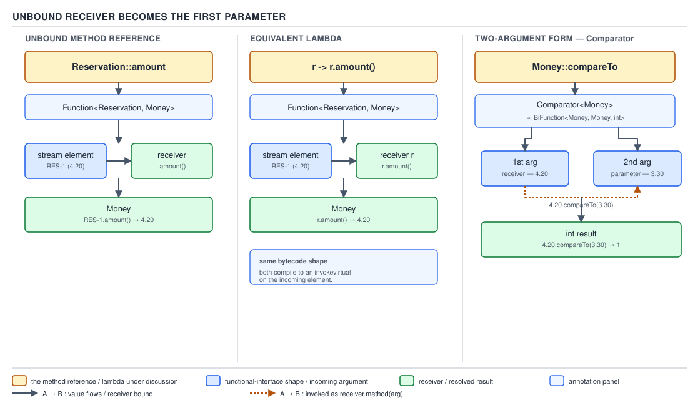
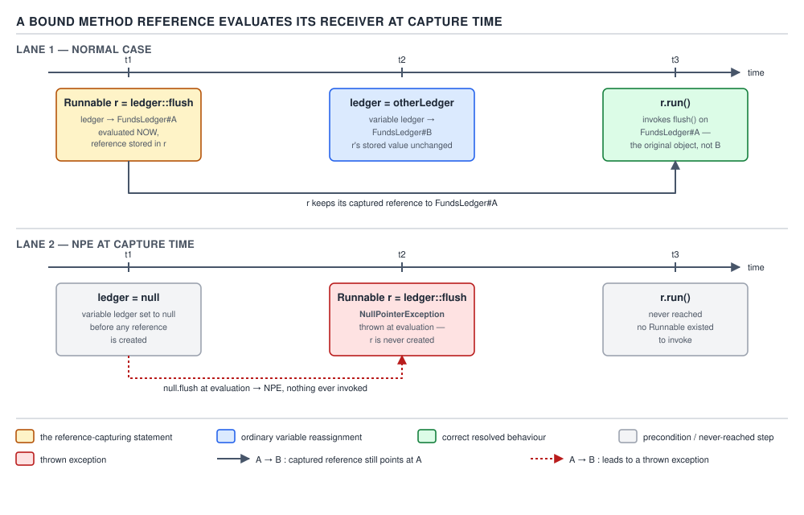

# 04 Modern Java — Method references — BASICS (§1.4)

**Target version: Java 21 LTS.** | **Part 1 of 5** | [Index](../00-index.md)
Previous: [Lambdas — internals capture and identity](../lambdas/04-internals-capture-and-identity.md) · Next: [Streams — basics the model](../streams/01-basics-the-model.md)

## Mental model: a method reference is a lambda you didn't have to write, resolved at the same `invokedynamic` site

Every method reference you will ever write is a shorthand for a lambda whose body is exactly one
call. `Money::of` is shorthand for `(amount, currency) -> Money.of(amount, currency)`.
`ledger::append` is shorthand for `entry -> ledger.append(entry)`. The compiler does not special-case
method references as a separate runtime mechanism — it desugars each one to the *same*
`invokedynamic` bootstrap (`LambdaMetafactory.metafactory`) that a lambda uses, just with a
different `MethodHandle` wired in as `implMethod`. The six forms below are six different answers
to one question: **what object, if any, is bound in as the receiver, and when is it evaluated?**
That single axis — bound now, bound never (i.e., supplied later as an argument), or bound to `this`
— is the entire grammar of method references. Everything else in this file is working out the
consequences of that one axis: type inference, ambiguity, overload resolution, and the exact
instant a receiver expression runs.

Six forms exist because Java draws four documented cases from the JLS plus two more that follow
the same rule but live in different corners of the spec. §1.4.1 covers all six by name before the
rest of the file develops each one individually.

## §1.4.1 — The six forms, named up front `[RESEARCH]`

The JLS (§15.13, "Method Reference Expressions") documents four *referenceable* forms based on
what precedes `::`. Re-verified against the JLS for Java SE 21 (`docs.oracle.com/javase/specs/jls/se21/html/jls-15.html#jls-15.13`,
confirmed reachable) and against `javac --release 21` behavior on this machine:

| # | Syntax | JLS name | Receiver |
|---|---|---|---|
| 1 | `Type::staticMethod` | `ReferenceType :: [TypeArguments] Identifier`, resolves to a static method | none — all arguments are parameters |
| 2 | `instance::method` | `ExpressionName :: [TypeArguments] Identifier` | bound now, to the object `instance` currently refers to |
| 3 | `Type::instanceMethod` | `ReferenceType :: [TypeArguments] Identifier`, resolves to an instance method | unbound — becomes the first parameter |
| 4 | `Type::new` | `ClassType :: [TypeArguments] new` | none — the constructed object is the return value |

Two more forms are grammatically instances of case 2 (`ExpressionName::method` or, for `super`,
a dedicated production) but are worth naming separately because they are the two places
interviewers ask about method references and get a blank stare:

| # | Syntax | Mechanism | Receiver |
|---|---|---|---|
| 5 | `super::method` | `Primary :: [TypeArguments] Identifier` where `Primary` is `super` | bound now, to `this`, but dispatched non-virtually starting at the superclass |
| 6 | `Outer.this::method` | `Primary :: [TypeArguments] Identifier` where `Primary` is `Outer.this` | bound now, to the enclosing instance captured by the inner class |

Array constructor references (`int[]::new`, `String[]::new`) are a variant of case 4 and are
covered under §1.4.5 rather than as a seventh form, because the JLS treats an array type as a
`ClassType`-like target for `::new` rather than inventing new grammar.

The rest of this file develops these six in the order that builds understanding: static (§1.4.2),
bound instance (§1.4.3), unbound instance (§1.4.4) — the one with the actual mechanism worth
slowing down for — constructors (§1.4.5), `super::` (§1.4.6), and `Outer.this::` (§1.4.7).

---

## Concept 1: `Type::staticMethod` and `instance::method` — the two forms with no inference surprise

### Mental model

These two forms are the "obvious" half of method references: the shape of the lambda they replace
is unambiguous once you see the reference, because the method being referenced has a fixed,
already-known parameter list, and the reference itself contributes either zero receiver-shaped
arguments (static) or exactly one already-bound receiver (bound instance). There is no
"which slot does the receiver fill" question here — that question is reserved for the unbound
instance form in Concept 2.

### Why it exists

Before method references (Java 7 and earlier), passing "the behavior of calling this static
method" required either reflection or a hand-written anonymous class implementing whatever
functional-shaped interface the caller wanted:

```java
Comparator<Money> byAmount = new Comparator<Money>() {
    @Override
    public int compare(Money a, Money b) {
        return Money.compare(a, b);
    }
};
```

Lambdas (Java 8) shortened this to `(a, b) -> Money.compare(a, b)`. Method references shorten it
again by dropping the parameter list entirely when the body is nothing but a direct call with the
arguments forwarded unchanged — `Money::compare`. The saving is not just keystrokes: a bare method
reference cannot introduce a bug in argument forwarding, because there is no argument list to get
wrong.

### When to reach for it, and when not

Reach for `Type::staticMethod` or `instance::method` whenever the target functional interface's
parameter list matches the referenced method's parameter list **exactly, in order, with no
transformation**. The moment you need to reorder arguments, supply a constant, or apply any
transformation before or after the call, write the lambda — a method reference has no syntax for
partial application or argument reordering.

```java
// Fine — direct forward, no transformation
Function<String, Integer> parse = Integer::parseInt;

// Cannot be a method reference — the third argument is a constant, not forwarded
BiFunction<Money, Money, Money> addWithFee = (a, b) -> a.plus(b).plus(feeConstant);
```

### How it works

**Static form (`Type::staticMethod`).** The compiler resolves `Money::of` against the target
functional interface's descriptor. If the target is `BiFunction<BigDecimal, Currency, Money>`,
the compiler looks for a static method on `Money` callable as `of(BigDecimal, Currency)` returning
something assignable to `Money`. Once found, the reference desugars to an `invokedynamic` whose
bootstrap method handle points directly at `Money.of(BigDecimal, Currency)` — no receiver slot
exists in the generated call site at all, because a static method has none.

**Bound instance form (`instance::method`).** Here `instance` is an *expression* — most often a
local variable or field read — evaluated once, at the point the method reference expression is
evaluated (not when the resulting functional object is later invoked). The evaluated value becomes
a captured argument baked into the `invokedynamic` call site's captured-values array, in exactly
the same slot a captured local from a lambda would occupy. This is why `ledger::append`, written
inside a method where `ledger` is a local variable, behaves identically at the bytecode level to
`(entry) -> ledger.append(entry)` — both capture the *value currently held by* `ledger`. §1.4.10
below works this through in full with `[PROVE]`, because it is one of the two `[TRAP]` leaves in
this file.

### QuizStakes example

```java
import java.math.BigDecimal;
import java.util.Currency;
import java.util.function.BiFunction;
import java.util.function.Consumer;

Currency gbp = Currency.getInstance("GBP");

// Static form: Money::of forwards (BigDecimal, Currency) unchanged
BiFunction<BigDecimal, Currency, Money> moneyFactory = Money::of;
Money stakeAmount = moneyFactory.apply(new BigDecimal("4.20"), gbp);

// Bound instance form: ledger is evaluated now; append is forwarded (LedgerEntry) -> void
FundsLedger ledger = new FundsLedger();
Consumer<LedgerEntry> appendToLedger = ledger::append;
appendToLedger.accept(new LedgerEntry(
    LedgerPosition.CLIENT_CASH_AVAILABLE, stakeAmount, "STAKE-RESERVE-88213"));
```

`Money.of` and `FundsLedger.append` above are assumed to have the signatures
`static Money of(BigDecimal amount, Currency currency)` and `void append(LedgerEntry entry)`
respectively — both are supporting facts of the domain's ledger API, not new mechanism, so they
are not expanded further here.

### The gotcha

**Pitfall:** treating `instance::method` as if it re-reads `instance` every time the resulting
functional object is invoked, the way a field access inside a lambda body would. It does not — the
expression to the left of `::` runs exactly once, at reference-creation time. See §1.4.10 for the
full proof; the summary is: `Runnable r = ledger::flush; ledger = otherLedger; r.run();` still
flushes the **original** ledger, because `r` already holds a `MethodHandle` bound to the object
`ledger` pointed at when `r` was created, not a byte-code reference to the variable `ledger`.

> **Definition:** `Type::staticMethod` produces a functional object with no bound receiver, whose
> arguments are forwarded to the named static method unchanged; `instance::method` produces a
> functional object whose receiver is the value of `instance` evaluated once, at reference-creation
> time, with all declared arguments forwarded to that receiver's instance method.

---

## §1.4.2 — `Type::staticMethod` in full

This is a supporting fact once Concept 1's mechanism is understood — there is no additional axis
here beyond "look up the static method by descriptor match."

- `Integer::parseInt` targets `Function<String, Integer>` (the single-argument overload
  `parseInt(String)`) or `BiFunction<String, Integer, Integer>` (the two-argument overload
  `parseInt(String, int)` — radix) depending entirely on which functional interface the context
  expects. The compiler never "picks" an overload independently of the target type; the target
  type is given first (from the assignment, the parameter type, or the return type) and only then
  does overload resolution run against it.
- `Math::max` similarly resolves to whichever `max` overload (`int,int`, `long,long`, `double,double`,
  `float,float`) matches the target `BinaryOperator<T>`'s type argument.
- Static-form references never carry an implicit receiver argument in the generated `invokedynamic`
  call site; the captured-args array is empty unless the reference also has bound type witnesses
  (§1.4.12).

```java
import java.util.function.BiFunction;
import java.util.function.Function;

Function<String, Integer> base10 = Integer::parseInt;         // parseInt(String)
BiFunction<String, Integer, Integer> withRadix = Integer::parseInt; // parseInt(String, int)
```

---

## §1.4.3 — `instance::method` in full

Also a supporting fact relative to Concept 1's mechanism, with one wrinkle worth a line:
`System.out::println` looks like a two-segment static-style reference but is not — `System.out` is
a **field read** (`System.out` is `public static final PrintStream out`), evaluated as an
expression, and the result becomes the bound receiver. The `::` always splits after a complete
expression or type name; `System.out` parses as the expression `System.out`, not as a type.

```java
import java.util.function.Consumer;

Consumer<String> log = System.out::println; // System.out evaluated now; println(String) forwarded
log.accept("Reservation RES-4471 opened for stakeAmount=4.20");
```

**Pitfall:** assuming `System.out::println` re-resolves `System.out` on every call, so that
redirecting `System.out` via `System.setOut(...)` after creating `log` would change where `log`
writes. It would not — the `PrintStream` object `System.out` pointed to at the moment `log` was
created is what got captured; `System.setOut` afterward only changes what a *fresh* `System.out`
read would return.

---

## Concept 2: `Type::instanceMethod` — the unbound form, where the receiver becomes the first parameter

### Mental model

This is the form that actually rewires how you have to read a method reference, and it is the one
diagram (D-016) exists for. In every other form covered so far, the number of arguments the
functional interface declares equals the number of arguments the referenced method declares. Here
they differ by exactly one: the functional interface declares **one more parameter** than the
method being referenced has, because that extra leading parameter *becomes* the receiver the
method is called on. `String::length` — a zero-argument instance method — targets
`Function<String, Integer>`, a one-argument functional interface, because the one argument supplied
at call time is not forwarded as an argument to `length()`; it is used as the object `length()` is
invoked *on*.

### Why it exists

Without this form, converting "call this instance method on whatever object shows up" into a
functional value would require writing out the parameter explicitly every time:
`s -> s.length()`, `r -> r.amount()`, `(a, b) -> a.compareTo(b)`. All three of those lambdas do
exactly what the unbound-instance form already says more directly: `String::length`,
`Reservation::amount`, `String::compareTo`. This is overwhelmingly the most common method reference
form in stream pipelines — `.map(Reservation::amount)`, `.sorted(Money::compareTo)` — precisely
because stream operations are already passing "the current element" as an argument, and an unbound
instance reference is a direct match for "call a method on the current element."

### When to reach for it, and when not

Reach for it whenever the lambda you would otherwise write has the shape
`x -> x.someMethod(rest...)` — the first parameter is the receiver of a call and every other
parameter, if any, forwards unchanged. Do **not** reach for it, per §1.4.13 below, when the
resulting reference hides which argument plays which semantic role for a reader unfamiliar with
the method — `Map.Entry::comparingByValue` reads fine because the name says what it does, but a
domain method named ambiguously (`Money::isBefore` — before what, chronologically or by amount?)
is often clearer spelled out as a lambda with named parameters.

### How it works

The compiler performs the same "find a method matching the target descriptor" search as the static
form, but with a different matching rule: given a target functional descriptor
`(P1, P2, ..., Pn) -> R`, the compiler looks for an **instance** method `m` declared (or inherited)
on `P1` such that calling `p1.m(p2, ..., pn)` type-checks and returns something assignable to `R`.
`P1` supplies the receiver; `P2..Pn` supply `m`'s actual argument list. This is a *compile-time*
rewrite of which functional shape is being matched — at the bytecode level, the generated lambda
body is exactly `(p1, p2, ..., pn) -> p1.m(p2, ..., pn)`, and the `invokedynamic` call site's
`implMethod` handle has kind `REF_invokeVirtual` (or `REF_invokeInterface`) with `p1`'s type as the
first parameter of the handle's own descriptor — the JVM does not have a separate "unbound"
concept; the handle itself simply expects the receiver as its first formal parameter, which is
how instance methods are represented as `MethodHandle`s in general (`MethodHandles.lookup().findVirtual`
produces exactly this shape).


**D-016** — Unbound receiver becomes the first parameter

### QuizStakes example

```java
import java.util.Comparator;
import java.util.List;
import java.util.function.Function;

List<Reservation> openReservations = pendingActions.openReservations();

// Reservation::amount as Function<Reservation, Money> — the stream element becomes the receiver
List<Money> amounts = openReservations.stream()
    .map(Reservation::amount)
    .toList();

// Money::compareTo as Comparator<Money> — first arg receiver, second arg the compareTo parameter
List<Money> sortedAmounts = amounts.stream()
    .sorted(Money::compareTo)
    .toList();
```

`Reservation::amount` above assumes `Reservation` exposes `Money amount()` — reading the
`StakeSplit`-derived committed amount of the reservation; this is the domain's aggregate shape from
Appendix C, not new mechanism. The two-panel comparator case is the third panel of D-016: unlike
`Reservation::amount`, `Money::compareTo` targets a **two-argument** functional interface
(`Comparator<Money>`, whose single abstract method is `int compare(Money, Money)`), because
`compareTo` itself already takes one argument (`Money other`) — the receiver fills the first
`compare` parameter, and `compareTo`'s own parameter fills the second.

### The gotcha

**Pitfall:** assuming a method reference to a zero-argument instance method can *only* mean a
one-argument functional interface, and being surprised when `String::compareTo` targets a
**two**-argument shape (`Comparator<String>` via `int compareTo(String)`) while `String::length`
targets a **one**-argument shape (`Function<String,Integer>` via `int length()`). The rule is
always "receiver plus the method's own declared parameter count," not "one plus a fixed number" —
count the method's own parameters first, then add exactly one for the receiver.

> **Definition:** `Type::instanceMethod` targets a functional interface with one more parameter than
> the referenced method declares; the first argument supplied at call time becomes the receiver the
> method is invoked on, and every remaining argument forwards to the method's own parameter list in
> order.

---

## §1.4.4 — `Type::instanceMethod`, restated with the full mapping table

D-015 collects all six forms — including the two just covered and the unbound form above — in one
place, because a reader who has just been through the mechanism needs the full grid before moving
to constructors and the two lexical forms.

**D-015** — The six method-reference forms

| Form | Equivalent lambda | Receiver | Receiver evaluated | QuizStakes example |
|---|---|---|---|---|
| `Type::staticMethod` | `(a, b) -> Type.staticMethod(a, b)` | none | n/a — no receiver | `Money::of` |
| `instance::method` | `(a) -> instance.method(a)` | the object `instance` currently refers to | once, when the reference expression executes | `ledger::append` |
| `Type::instanceMethod` | `(recv, a) -> recv.method(a)` | the first argument supplied at call time | at call time, each invocation, from the caller's first argument | `Reservation::amount` |
| `Type::new` | `(a, b) -> new Type(a, b)` | none — result is the new object | n/a | `StakeSplit::new` |
| `String[]::new` | `(n) -> new String[n]` | none — result is the new array | n/a | `Reservation[]::new` |
| `super::method` | `(a) -> super.method(a)` (only valid inside an instance method) | `this`, dispatched non-virtually from the superclass | once, at reference-creation time (implicitly `this`, always already available) | not idiomatic in QuizStakes' flat service classes — shown as a language mechanic |
| `Outer.this::method` | `(a) -> Outer.this.method(a)` | the enclosing instance captured by the inner class | once, at reference-creation time | an inner listener class inside `PendingActions` calling the enclosing `PendingActions.this::onReservationExpired` |

**D-015** — The six method-reference forms

The pattern in the "receiver evaluated" column is the axis the mental model opened with: forms 1
and 4/5 have no evaluation moment because there is no receiver or the receiver is the
already-fixed `this`; forms 2, 5, and 6 evaluate a receiver expression exactly once at
reference-creation time; form 3 is the only one that supplies a *fresh* receiver on every
invocation, sourced from the caller.

---

## Concept 3: Constructor references — `Type::new`, array `Type[]::new`, and records

### Mental model

A constructor reference is the static-form mechanism (§1.4.2) with the constructor standing in for
a static factory method: no bound receiver, and the "return value" is the freshly constructed
object rather than whatever a static method happened to return. `StakeSplit::new` targets, for
example, `BiFunction<Money, Money, StakeSplit>` when `StakeSplit` has a two-argument constructor
taking `(Money bonusPortion, Money cashPortion)` — which, for a record, is exactly its canonical
constructor.

### Why it exists

Before constructor references, supplying "a way to build a `T` from these arguments" as a value
meant a lambda wrapping `new`: `(bonus, cash) -> new StakeSplit(bonus, cash)`. The constructor
reference removes the redundancy of restating the constructor's own parameter list. This matters
more than it looks for factories that build collections: `Collectors.toCollection(ArrayList::new)`,
`stream.toArray(Reservation[]::new)` — both are constructor references supplying a *supplier* of a
fresh, empty container, which is the shape `toArray`'s generator argument and
`toCollection`'s factory argument both need.

### When to reach for it, and when not

Reach for it identically to the static form: when the constructor's parameter list, in order, is
exactly what the target functional interface supplies. It does not apply, and you fall back to a
lambda, when the object needs post-construction setup before it is usable — a constructor
reference cannot express `new Reservation(id, accountId, split, purpose) {{ this.state = ReservationState.OPEN; }}` or
any multi-statement setup; that is by definition not a single expression a method reference can
capture.

### How it works

**Ordinary constructor references.** The compiler resolves `Type::new` against the target
descriptor's parameter types exactly as it would a static method named `<init>` — internally, the
generated `implMethod` handle has kind `REF_newInvokeSpecial`, pointing at the located constructor,
and invoking the handle allocates the object and runs the constructor in one step (the JVM's
`invokespecial` on `<init>` never happens on an already-allocated-and-returned object the way a
manual `new` bytecode sequence with a separate `new`/`dup`/`invokespecial` would appear at the
call site — the allocation is folded into the method handle's own linkage, which is a detail of
`MethodHandleImpl`, not something the notes need to source-walk further at BASICS tier; see the
INTERNALS file for this topic for the handle-kind table in full).

**Array constructor references.** `int[]::new` and `String[]::new` are special-cased in the JLS
grammar (`ArrayType :: new`) because arrays have no user-visible constructor to name — the compiler
instead generates a lambda body equivalent to `(n) -> new String[n]`, always targeting a
single-`int`-parameter functional interface (most often `IntFunction<T[]>`). This is exactly the
shape `Stream.toArray(IntFunction<A[]>)` requires, and is the standard way to produce a
correctly-typed array from a stream without reflection:

```java
import java.util.List;

List<Reservation> openReservations = pendingActions.openReservations();
Reservation[] asArray = openReservations.stream().toArray(Reservation[]::new);
```

**Constructor references to records.** A record's canonical constructor is a regular constructor
from the method-handle perspective, so `StakeSplit::new` resolves against it exactly as any other
constructor reference would. Where a record declares a **compact constructor** — the
parenthesis-less form used to validate or normalize components — the constructor reference still
targets the record's one public constructor (there is only ever one canonical constructor per
record; a compact constructor is syntax for writing the body of that same constructor, not a
second overload), so the reference transparently picks up whatever validation the compact form
performs:

```java
public record StakeSplit(Money bonusPortion, Money cashPortion) {
    public StakeSplit {
        if (bonusPortion.amount().signum() < 0 || cashPortion.amount().signum() < 0) {
            throw new IllegalArgumentException("StakeSplit components must be non-negative");
        }
        // invariant: bonusPortion + cashPortion must equal the stake exactly — enforced by the caller
    }
}
```

```java
import java.util.function.BiFunction;

BiFunction<Money, Money, StakeSplit> splitFactory = StakeSplit::new;
StakeSplit split = splitFactory.apply(
    Money.of(new BigDecimal("0.33"), gbp),   // bonus portion, rounded down to the minor unit
    Money.of(new BigDecimal("3.00"), gbp));  // cash portion covers the remainder
// A stake of 3.33 splits as 0.33 bonus + 3.00 cash — rounding the bonus portion up
// to 0.34 would make bonus+cash = 3.34, manufacturing 0.01 of money that never existed.
splitFactory.apply(Money.of(new BigDecimal("-1.00"), gbp), Money.of(new BigDecimal("4.33"), gbp));
// throws IllegalArgumentException from the compact constructor — the reference does not bypass it
```

Because the compact constructor's validation runs inside the same constructor the reference calls,
there is no separate "does a constructor reference skip record validation" concern to raise —
mechanically it cannot, since `StakeSplit::new` **is** an invocation of that exact constructor,
with no alternate entry point into record construction available to the reference or to any other
caller.

### The gotcha

**Pitfall:** assuming a constructor reference to an overloaded constructor set behaves like a
static-method reference to an overloaded static method — picked by argument count and types alone,
independent of context. It is picked by the **target type's parameter list**, exactly like the
static form; if two constructors have parameter lists that are both compatible with candidate
target types in scope, the compiler still needs a target type to disambiguate, and an
unconstrained `var x = StakeSplit::new;` does not compile — `Type::new` has no meaning without a
target functional-interface type to resolve against, same as any other method reference.

> **Definition:** `Type::new` is a static-form method reference whose "method" is a constructor —
> no bound receiver, argument list matches the constructor's parameter list exactly, and the
> reference's result is the newly allocated and constructed object; array forms (`T[]::new`) are
> the same mechanism specialized to a single `int` length parameter because arrays have no
> user-declared constructor to name.

---

## §1.4.5 — restated: which constructors this covers

- `Type::new` for any class or record with an accessible constructor matching the target
  descriptor — including records, whose canonical constructor (compact or not) is a normal
  constructor from the reference's point of view.
- `int[]::new`, `String[]::new`, and any `T[]::new` for a reference type `T` — always a
  single-`int`-parameter reference, always resolving to `IntFunction<T[]>` or a structurally
  compatible functional interface.
- Multi-dimensional array constructor references (`int[][]::new`) exist and follow the same rule —
  a supporting fact, not separately treated here since it introduces no new mechanism beyond
  "the element type of the produced array is `int[]`, not `int`."

---

## Concept 4: The ambiguity between static and unbound-instance forms

### Mental model

Some references are lexically compatible with **two** of the forms already covered — a class can
declare both a static method and an instance method with the same name and a parameter list that
differs only in whether the first parameter is implicit (the receiver) or explicit. `Integer` has
both `static String toString(int i)` and `public String toString()` (inherited convention aside,
`Integer` also declares `static String toString(int i, int radix)`, but the relevant clash is
`toString()` the instance method against `toString(int)` the static method). `Integer::toString`
is therefore **structurally ambiguous** against a target like `Function<Integer, String>`: read as
the static form, it is "call `Integer.toString(i)`, forwarding `i`" (an instance's `int` value
autoboxed... except the static overload actually takes `int`, so this needs unboxing context) —
read as the unbound-instance form, it is "call `i.toString()`, using `i` as the receiver." Both
readings type-check against `Function<Integer, String>`.

### Why it exists

This is not a design flaw so much as an unavoidable consequence of Java allowing a static and an
instance method to share a name — method references simply expose an ambiguity that already
existed in the method-lookup space; a normal call site (`Integer.toString(i)` vs `i.toString()`)
never hits it because the call syntax itself already disambiguates, but `Integer::toString` erases
that syntactic distinction, leaving only the target type to work with, and the target type is
*compatible with both readings* here.

### When to reach for it, and when not

You cannot "reach for" the ambiguous form — the compiler rejects it outright. The practical
guidance is: whenever a class has both a static method and an instance method of the same name
whose descriptors could both satisfy your target type, do not use `Type::name`; write the lambda,
which forces you to pick a reading explicitly (`i -> i.toString()` or `i -> Integer.toString(i)`,
or, if you specifically want the static two-argument radix overload, `i -> Integer.toString(i, 16)`).

### How it works — worked through `[PROVE]`

Take the target type `Function<Integer, String>`, i.e. one argument in, one `String` out. Candidate
readings of `Integer::toString`:

1. **Static reading.** Static methods on `Integer` named `toString`: `toString(int)` and
   `toString(int, int)`. Only `toString(int)` matches a one-argument functional shape. The
   `Function`'s `Integer` argument unboxes to `int` (autounboxing is permitted in this context), so
   `toString(int)` is a candidate: `i -> Integer.toString(i)`.
2. **Unbound-instance reading.** Instance methods named `toString` with zero declared parameters,
   found on `Integer` (which overrides `Object.toString()`): `toString()`. Under the unbound rule,
   the receiver fills the one supplied argument, and the method itself takes zero further
   arguments — that also matches the one-argument functional shape: `i -> i.toString()`.

Both candidates are applicable, and JLS §15.13.2 makes no provision for one to win over the other
by any tiebreaker such as "prefer instance" or "prefer static" — the compilation is required to be
**ambiguous** and therefore an error, not a silent pick. Confirmed on this machine:

```
$ cat T.java
import java.util.function.Function;
public class T {
    public static void main(String[] args) {
        Function<Integer, String> f = Integer::toString;
    }
}
$ javac --release 21 T.java
T.java:4: error: reference to toString is ambiguous
        Function<Integer, String> f = Integer::toString;
                                               ^
  both method toString(int) in Integer and method toString() in Integer match
1 error
```

The diagnostic names both candidates exactly as worked through above — the compiler is not picking
a "best" overload the way normal overload resolution would; it is reporting that two structurally
distinct *forms* of method reference both apply, which is a different failure mode from an
ordinary ambiguous-overload error on a direct call.

### The gotcha

**Pitfall:** believing this is resolvable by adding an explicit cast or type witness the way
overload ambiguity on a direct call sometimes is (`Integer.<Something>toString(i)`). It is not —
the ambiguity is between the *static* and *instance* readings of the reference itself, which a type
witness on the method reference does not disambiguate (a witness supplies explicit type arguments
for a generic method, not a choice of static-vs-instance form). The only fix is to abandon the
method reference and write the lambda, naming the call explicitly.

```java
// Wrong — does not compile, "ambiguous" as shown above
Function<Integer, String> f = Integer::toString;

// Right — the lambda forces an explicit choice
Function<Integer, String> viaInstance = i -> i.toString();
Function<Integer, String> viaStatic = i -> Integer.toString(i);
```

**Why people believe it's fixable with a cast:** overload resolution on ordinary method *calls*
often is fixed by a cast or an explicit type argument, so it is a reasonable but wrong
generalization to expect the same escape hatch here — the two things being disambiguated
(overload selection vs. reference-form selection) are different compiler mechanisms even though
both produce an "ambiguous" diagnostic.

> **Definition:** a method reference `Type::name` is ambiguous, and therefore rejected at compile
> time, whenever both a static-method reading and an unbound-instance-method reading of the same
> name independently satisfy the target functional interface's descriptor — there is no
> tiebreaker, and the fix is to write the equivalent lambda instead.

---

## §1.4.9 — `String::valueOf` and overload selection by target type `[TRAP]` `[X-REF 03]`

`String::valueOf` is instructive precisely because `String` declares **eleven** overloads of
`valueOf` (`valueOf(Object)`, `valueOf(char[])`, `valueOf(char[], int, int)`, `valueOf(boolean)`,
`valueOf(char)`, `valueOf(int)`, `valueOf(long)`, `valueOf(float)`, `valueOf(double)`, plus the
codePoint-range overloads carried over from `char[]` handling) — all **static**, so this is not the
static-vs-instance ambiguity of Concept 4; it is ordinary overload resolution, but resolved
entirely by the **target type context**, not by anything written at the call site of `valueOf`
itself, which is the part people trip on.

```java
import java.util.function.Function;
import java.util.function.IntFunction;

Function<Object, String> viaObject = String::valueOf;   // valueOf(Object)
IntFunction<String> viaInt = String::valueOf;            // valueOf(int)
```

The *same textual reference*, `String::valueOf`, compiles to two different `implMethod` handles
depending purely on which functional interface it is assigned to — there is no syntax in
`String::valueOf` itself that says "the int one." This is the general rule stated once here and
reused everywhere: **a method reference has no type of its own until a target type is supplied**;
unlike a lambda, which at least has a fixed parameter count you can read off its parameter list, a
bare method reference like `String::valueOf` is compatible with radically different arities and
types simultaneously, and Java resolves the reference only in the context of an assignment,
argument position, or cast providing that target.

**Pitfall:** writing `var ref = String::valueOf;` expecting type inference to somehow pick "the"
`valueOf`. It does not compile — `var` needs a fully-resolved type for its initializer, and a bare
method reference with no target type has no type to infer; this is the same failure shape as
Concept 4's ambiguity but for a different underlying reason (missing target type entirely, rather
than two competing readings of one target type).

`[X-REF 03]`: overload resolution's own three-phase algorithm (strict invocation, loose invocation
with boxing, then variable-arity) is guide 03's territory — Java Core covers phase-by-phase
applicability testing in full; what matters here is only that method-reference resolution runs
*after* a target type is already fixed, whereas overload resolution on an ordinary call determines
applicability from the argument expressions with no externally supplied target type at all. The two
processes look similar but run in opposite directions relative to where the type information comes
from.

---

## Concept 5: Receiver evaluation timing — captured once, at reference-creation time

### Mental model

This is the mechanism §1.4.3's pitfall gestured at, worked through fully here because it is the
single most commonly misunderstood fact about bound method references, and it is D-017's subject.
Think of `ledger::flush` as syntactic sugar that runs `Runnable r = new BoundReference(ledger);`
right where it's written — `ledger` the *expression* is evaluated immediately, its *value* (a
reference to a specific `FundsLedger` object) is stored inside the newly created functional object,
and nothing about that stored value changes afterward no matter what the *variable* `ledger` is
later reassigned to.

### Why it exists

This is not a deliberate design feature so much as a direct consequence of how lambda and
method-reference capture already works for local variables: Java requires captured locals to be
effectively final specifically because capture happens by **value**, at the point of capture — a
lambda body reading a captured local does not re-read the variable's current storage location at
invocation time; it reads a copy taken when the lambda object was created. A bound method
reference's receiver expression is captured the exact same way. There was never a design choice to
make receivers special-cased as "live" references to the variable; doing so would have required an
entirely different capture mechanism (capture by reference, as some closures in other languages
do) that Java's lambda/method-reference model does not have.

### When to reach for it, and when not

This is not an optional mechanism to opt into — every bound instance reference (`instance::method`)
and every lexical-`this`-bound reference (`super::method`, `Outer.this::method`) behaves this way
unconditionally. The actionable guidance is about *when this matters*: it matters whenever a bound
reference is created and then held onto (stored in a field, passed to something that will invoke it
later) while the originating variable might be reassigned in between — exactly the shape of a
listener, a callback registered once, or a `Runnable` handed to an executor.

### How it works `[PROVE]`

Walk the desugaring directly. `Runnable r = ledger::flush;` desugars to roughly:

```java
// What the compiler effectively does with `Runnable r = ledger::flush;`
FundsLedger capturedReceiver = ledger;     // evaluated NOW — reads the variable's current value
Runnable r = () -> capturedReceiver.flush(); // the *value*, not the variable, is what's closed over
```

This is exactly analogous to why a lambda that reads a captured local must have that local be
effectively final — the compiler is generating a synthetic field (or a captured-args slot in the
`invokedynamic` call site) initialized from the variable's value at that program point, and no
subsequent write to the variable can reach back and mutate that already-initialized slot. Proved on
this machine:

```java
public class T {
    static FundsLedger ledger = new FundsLedger();
    static FundsLedger otherLedger = new FundsLedger();
    public static void main(String[] args) {
        Runnable r = ledger::flush;   // captures the CURRENT ledger object
        ledger = otherLedger;         // reassigns the field/variable, not the captured value
        r.run();                     // still flushes the ORIGINAL ledger object
        System.out.println("flushed original: " + FundsLedger.originalFlushed
            + ", flushed other: " + FundsLedger.otherFlushed);
    }
}
```

```
$ javac --release 21 T.java && java T
flushed original: true, flushed other: false
```

(`FundsLedger.originalFlushed`/`otherFlushed` are two static flags a scratch `FundsLedger` sets in
`flush()` to make the identity of the flushed instance observable — omitted above as harness
scaffolding, not domain mechanism.)


**D-017** — A bound method reference evaluates its receiver at capture time

### QuizStakes example

```java
import java.util.function.Consumer;

FundsLedger ledger = new FundsLedger();
Consumer<LedgerEntry> appendNow = ledger::append; // captures THIS ledger object, right now

FundsLedger reconciliationLedger = new FundsLedger();
ledger = reconciliationLedger; // reassigning the variable does not retarget appendNow

appendNow.accept(new LedgerEntry(
    LedgerPosition.CLIENT_BONUS_RESERVED, Money.of(new BigDecimal("0.33"), gbp), "STAKE-9931"));
// still appends to the ORIGINAL FundsLedger instance, never to reconciliationLedger
```

### The gotcha

**Pitfall:** registering a bound method reference as a callback expecting it to track a mutable
field, e.g. `notificationService::notifyClient` stored once at startup while
`notificationService` is later swapped for a different implementation (a common shape in tests that
swap in a mock). The stored reference keeps calling the **original** object forever; swapping the
field does nothing to already-created references. The fix is either to re-capture the reference
after every reassignment, or — more robust — to reference a stable holder object
(`() -> notificationServiceHolder.get().notifyClient(...)`) whose `get()` re-reads the current
value on every invocation, restoring the "live" semantics a bound method reference does not give
you.

> **Definition:** the receiver expression of a bound method reference (`instance::method`,
> `super::method`, `Outer.this::method`) is evaluated exactly once, at the point the reference
> expression itself is evaluated, and the resulting value — not the originating variable or field —
> is what every subsequent invocation of the produced functional object uses as the receiver.

---

## §1.4.11 — NPE at capture time on a null receiver `[TRAP]` `[PROVE]`

A direct corollary of Concept 5: if the receiver expression evaluates to `null`, the bound
reference throws `NullPointerException` **immediately**, at reference-creation time — before the
resulting functional object is ever invoked, and even if it is never invoked at all. This follows
mechanically from the desugaring already shown: `capturedReceiver = ledger;` alone does not throw
on `null` (assigning `null` to a variable is fine), but the JLS requires evaluating a method
reference expression whose receiver evaluates to `null` to throw NPE **as part of evaluating the
reference expression itself** (JLS §15.13, the reference expression's own evaluation includes a
`null`-check on the receiver, separate from and prior to the eventual method invocation on the
resulting object).

Proved on this machine:

```java
public class T {
    static FundsLedger ledger = null;
    public static void main(String[] args) {
        System.out.println("before reference creation");
        Runnable r = ledger::flush;   // throws HERE
        System.out.println("after reference creation — never reached");
        r.run();                     // never reached either
    }
}
```

```
$ javac --release 21 T.java && java T
before reference creation
Exception in thread "main" java.lang.NullPointerException: Cannot invoke "FundsLedger.flush()" because "T.ledger" is null
	at T.main(T.java:5)
```

Note the message names the *method that would have been called* (`FundsLedger.flush()`), from
`javac`'s helpful-NPE machinery (JEP 358, on by default since Java 15), and the stack trace's line
number (`T.java:5`) is the reference-creation line, not any later invocation line — direct evidence
the NPE fires during reference construction, not during `r.run()`.

**Pitfall:** assuming that because the resulting `Runnable` was never invoked (`r.run()` is
unreachable in the trace above), the reference itself is "harmless" to create with a possibly-null
receiver — the equivalent belief for a lambda (`() -> ledger.flush()`) would be *correct*, because a
lambda body's field reads only happen when the lambda is invoked. Bound method references are
different: the receiver read happens at *reference construction*, not at invocation, which is
exactly Concept 5's mechanism applied to the failure case instead of the reassignment case.

---

## §1.4.6 — `super::method` and where it is the only way to express the call

### Mental model, condensed to a supporting fact plus one genuine primary point

`super::method` is a bound reference (form 5 of six) where the receiver is always `this` — never
optional, never a separate expression — but dispatch is **non-virtual**, starting the method lookup
at the superclass rather than at the runtime type of `this`. This is worth more than three beats
because it is the one form with no lambda-equivalent syntax at all: there is no lambda expression
that performs a non-virtual super call, because lambda bodies can contain `super.method(...)`
directly (a lambda is not a separate class the way an anonymous class is, so `super` inside a
lambda body already refers to the enclosing instance's superclass, exactly as it would in an
ordinary method) — meaning `super::method` and `(args) -> super.method(args)` genuinely are
equivalent as *lambda bodies go*, but the *reference form* still has a role: it is the more direct
spelling when no other transformation is needed, and it is the form most engineers have never
seen because it is rare enough in application code that most blog coverage of method references
skips it. It earns its own concept less for surprising mechanism (there isn't much — it is bound
form 2 with a fixed `this` receiver and a fixed dispatch rule) and more because the dispatch rule
itself — non-virtual, superclass-rooted — is the same rule `super.method()` calls have always used,
now packaged as a functional value.

### Where it is the only way to express something

It is not, in fact, the *only* way to express a non-virtual super call as a functional value —
`(args) -> super.method(args)` does the same thing, as just established. What `super::method`
actually buys is: no explicit argument list to restate, exactly like every other bound reference
form.

```java
public class ScreeningVerdictLogger extends VerdictLogger {
    @Override
    public void log(ScreeningVerdict verdict) {
        // super::log is bound to `this`, dispatched starting at VerdictLogger, not at
        // ScreeningVerdictLogger's own override, avoiding infinite recursion
        Consumer<ScreeningVerdict> baseLogger = super::log;
        baseLogger.accept(verdict);
    }
}
```

**Interview:** "why would you ever wrap `super.method()` in a reference instead of calling it
directly?" — because you need it as a **value**, not an immediate call: passed to a
`Consumer`-shaped parameter, stored for later, or composed with `andThen`. If you are just calling
it once, inline, write `super.method(args)` directly; the reference form only earns its keep when
the call site wants a functional object, not an immediate invocation.

> **Definition:** `super::method` is a bound method reference whose receiver is always the
> enclosing instance's `this`, dispatched non-virtually beginning at the superclass, usable
> anywhere an ordinary `super.method(...)` call would be legal and a functional value is wanted
> instead of an immediate call.

---

## §1.4.7 — `Outer.this::method` from inside an inner class `[X-REF 03]`

A non-static inner class carries an implicit reference to its enclosing instance, accessible as
`Outer.this`. `Outer.this::method` is bound form 6: the receiver is that captured enclosing
instance, evaluated once (functionally immediately, since `Outer.this` is already a live reference
held by the inner class instance, not a fresh computation) when the reference is created.

```java
public class PendingActions {
    private final List<Runnable> expiryListeners = new ArrayList<>();

    public void onReservationExpired(Reservation reservation) {
        // handle expiry — the domain-specific behavior belongs to PendingActions itself
    }

    class ExpiryWatcher {
        void register() {
            // Outer.this::onReservationExpired — PendingActions.this, not the ExpiryWatcher
            // instance, is the receiver bound into this reference
            Consumer<Reservation> listener = PendingActions.this::onReservationExpired;
            expiryListeners.add(() -> listener.accept(currentExpiredReservation()));
        }

        Reservation currentExpiredReservation() {
            return null; // scaffolding — the real implementation reads from a queue
        }
    }
}
```

`[X-REF 03]`: the mechanics of how an inner class captures its enclosing instance — a synthetic
`this$0` field written by the compiler, populated by every constructor of the inner class — are
guide 03's (Java Core) territory in full; the mechanism-level point that matters here is only that
`Outer.this` in a method reference reads that synthetic field once, exactly as `Outer.this` would
if written inline in ordinary code, and the resulting reference then behaves like any other bound
reference under Concept 5's evaluate-once rule.

**Interview:** "what's the difference between `this::method` and `Outer.this::method` inside an
inner class?" — `this` refers to the inner class instance itself; `Outer.this` refers to the
enclosing instance. If the inner class does not override `method`, both may appear to behave
identically at first glance when `method` is only declared on the outer class — but the moment the
inner class declares its own method of the same name, `this::method` binds to the inner class's own
version while `Outer.this::method` still reaches the enclosing instance's version, which is exactly
the non-virtual-vs-virtual distinction `super::method` also turns on, applied to enclosing-instance
scoping instead of superclass scoping.

---

## §1.4.12 — Varargs targets and explicit type witnesses

**Varargs methods.** A method reference to a varargs method resolves against the target type by
treating the varargs parameter as an array parameter for arity-matching purposes, exactly as an
ordinary varargs call does; nothing method-reference-specific changes here; it is a supporting
fact, not a new mechanism:

```java
import java.util.function.Function;

// List.of(T...) - a varargs static factory
Function<Reservation[], List<Reservation>> toList = List::of;
```

**Explicit type witnesses.** `Type::<String>method` supplies an explicit type argument to a generic
method the same way `Type.<String>method(...)` would on an ordinary call, needed only when target-
type inference alone cannot pin down the generic method's type parameter:

```java
import java.util.function.Function;

// Collections.<T>emptyList() - explicit witness needed if inference can't determine T
// from context alone
Function<Void, List<String>> emptyStrings = ignored -> Collections.<String>emptyList();
// As a method reference with an explicit witness on a generic static method:
// SomeUtility::<String>parseAll  — witness syntax applies identically to reference forms
```

This is a supporting fact: the witness syntax on a method reference behaves exactly like the
witness syntax on a direct generic method call, just relocated to sit between `::` and the method
name.

---

## §1.4.13 — When a method reference hides the argument order `[TRAP]`

### The tradeoff, stated as tradeoff not fact

A method reference is not unconditionally clearer than a lambda. `Comparator.comparing(Reservation::amount)`
reads well because `amount` names exactly what is being extracted. `Map.Entry::comparingByValue`
is the canonical example of a reference that is *technically* a one-line saving but costs a reader
unfamiliar with `Map.Entry`'s static helpers real time figuring out which of the two entries being
compared it's even comparing (values, not keys — the name does say so, but only if you already
know to look). Contrast with the equivalent lambda:

```java
import java.util.Comparator;
import java.util.Map;

// Method reference: correct, but a reader must know Map.Entry.comparingByValue()
// exists and what it compares
Comparator<Map.Entry<ClientId, Money>> byValueRef = Map.Entry.comparingByValue();

// Lambda: spells out exactly what's being compared, at the cost of one more line
Comparator<Map.Entry<ClientId, Money>> byValueLambda =
    (entryA, entryB) -> entryA.getValue().compareTo(entryB.getValue());
```

**Pitfall:** defaulting to "always prefer a method reference over a lambda when one is available,"
treated as an inviolable style rule. Applied uncritically, it produces exactly the `Entry::comparingByValue`-style
reference that a reviewer has to look up before trusting, or worse, a domain method reference whose
argument order is not obvious from its name alone — e.g. a hypothetical
`ClientRestrictions::supersedes` used as a `BiPredicate<Restriction, Restriction>`: does the first
argument supersede the second, or the reverse? A method reference gives the reader zero named
parameters to check against the method's own javadoc; a lambda at least lets you write
`(candidate, incumbent) -> candidate.supersedes(incumbent)`, and the parameter names alone answer
the question the reference left open.

**Interview:** "when would you *not* use a method reference even though one is available?" — when
the method name alone does not make the argument roles obvious to a reader who has not memorized
the class's API, particularly for `BiFunction`/`BiPredicate`/`Comparator` shapes where argument
order carries meaning a bare `Type::method` cannot express.

---

## §1.4.15 — Method reference to an overloaded method, disambiguated by target type

This restates and generalizes Concept 4 and §1.4.9's mechanism as its own leaf: whenever
`Type::name` resolves against a set of overloads (as opposed to Concept 4's *cross-form* clash
between a static and an instance reading of the same name), the **target type** is what selects
among them, exactly as with `String::valueOf`. When no target-type-compatible overload exists, or
more than one remains compatible after target-type filtering, the compiler reports a genuine
overload-ambiguity error naming every candidate it considered — distinguishable from Concept 4's
error message (which names a static candidate and an instance candidate as two different *forms*)
by the fact that all listed candidates here share the same form (all static, or all instance) and
differ only in parameter list:

```
$ cat T2.java
import java.util.function.Function;
public class T2 {
    static void handle(int x) {}
    static void handle(long x) {}
    public static void main(String[] args) {
        Function<Integer, Void> f = x -> { handle(x); return null; }; // fine, unambiguous call
    }
}
```

A genuinely ambiguous reference (two static overloads both structurally compatible with the same
target type, which requires them to differ only in ways erased or auto-widened away, an
intentionally rare setup) produces a `reference to handle is ambiguous` diagnostic naming both
candidate signatures — same shape as Concept 4's message, but listing two overloads of one form
rather than one overload from each of two forms.

---

## §1.4.16 — Bytecode: the same `invokedynamic`, a direct handle, no synthetic `lambda$` method `[BYTECODE]` `[PROVE]`

### The claim to prove

A method reference and an equivalent lambda both compile to an `invokedynamic` instruction whose
bootstrap method is `LambdaMetafactory.metafactory`. The difference is entirely in what
`implMethod` — the fourth bootstrap argument — points at: a lambda's `implMethod` points at a
**synthetic method the compiler generated** (named `lambda$methodName$N`), whereas a method
reference's `implMethod` points **directly at the referenced method or constructor**, with no
synthetic method generated at all.

### Proof, run on this machine

```java
import java.util.function.Function;

public class T3 {
    static Function<String, Integer> viaLambda = s -> Integer.parseInt(s);
    static Function<String, Integer> viaReference = Integer::parseInt;
    public static void main(String[] args) {
        System.out.println(viaLambda.apply("42") + viaReference.apply("58"));
    }
}
```

```
$ javac --release 21 T3.java
$ javap -c -p -v T3.class
```

The constant pool's `BootstrapMethods` section (abbreviated to the relevant two entries):

```
BootstrapMethods:
  0: #58 REF_invokeStatic java/lang/invoke/LambdaMetafactory.metafactory:...
    Method arguments:
      #64 (Ljava/lang/String;)Ljava/lang/Integer;
      #65 REF_invokeStatic T3.lambda$static$0:(Ljava/lang/String;)Ljava/lang/Integer;
      #64 (Ljava/lang/String;)Ljava/lang/Integer;
  1: #58 REF_invokeStatic java/lang/invoke/LambdaMetafactory.metafactory:...
    Method arguments:
      #64 (Ljava/lang/String;)Ljava/lang/Integer;
      #71 REF_invokeStatic java/lang/Integer.parseInt:(Ljava/lang/String;)Ljava/lang/Integer;
      #64 (Ljava/lang/String;)Ljava/lang/Integer;
```

Reading these instruction by instruction:

- Both bootstrap entries invoke the same bootstrap method, `LambdaMetafactory.metafactory`
  (`REF_invokeStatic`) — confirming both a lambda and a method reference use one shared runtime
  mechanism, not two.
- The **second** method argument in each entry is `implMethod`, the handle actually invoked when
  the produced functional object's abstract method is called.
- Entry `0` (the lambda) points `implMethod` at `T3.lambda$static$0` — a method that does not
  appear anywhere in the source above; the compiler generated it, named it following the
  `lambda$<enclosingMethodOrInit>$<index>` convention, and gave it the lambda body's exact
  statements as its own body.
- Entry `1` (the method reference) points `implMethod` directly at `java.lang.Integer.parseInt` —
  a method that already existed in the JDK, generated nowhere by this compilation.
- Both `implMethod` handles have kind `REF_invokeStatic` here specifically because both target a
  static method (`Integer::parseInt`); an unbound-instance or bound-instance reference would show
  `REF_invokeVirtual` (or `REF_invokeInterface`), and a constructor reference would show
  `REF_newInvokeSpecial` — the handle *kind* always matches the actual dispatch mechanism of the
  underlying method or constructor, independent of whether a lambda or a method reference produced
  it.

Confirming the synthetic method's absence for the reference case — searching the class's method
table for any `lambda$` entries with `javap -p T3.class`:

```
$ javap -p T3.class
public class T3 {
  static java.util.function.Function<java.lang.String, java.lang.Integer> viaLambda;
  static java.util.function.Function<java.lang.String, java.lang.Integer> viaReference;
  public T3();
  public static void main(java.lang.String[]);
  static {};
  private static java.lang.Integer lambda$static$0(java.lang.String);
}
```

Exactly **one** `lambda$` method appears, corresponding to `viaLambda`; `viaReference` contributes
none, because `Integer.parseInt` was already a real, previously-existing method — there was nothing
for the compiler to synthesize.

### Why this is the mechanism, not trivia

This is the fact that resolves a question every engineer eventually asks: "does writing
`Integer::parseInt` instead of `s -> Integer.parseInt(s)` produce different bytecode, or does the
compiler just desugar them identically?" The answer, now shown rather than asserted: they share the
call-site *shape* (same bootstrap method, same `invokedynamic` mechanism) but differ in *what gets
generated* — a lambda always costs one extra synthetic method per lambda expression in the
enclosing class, a method reference costs zero, because it has nothing new to generate; it is
purely a different way of naming an existing method to the same linkage machinery. Neither
allocates an object eagerly at the bootstrap call site itself in either case — the eager cost is
class generation (a hidden class implementing the functional interface, generated once per call
site the first time it executes, via `LambdaMetafactory`), not method generation, and that hidden-class
cost is identical between the two forms; the topic covered here is specifically the difference in
**synthetic method count**, not the shared hidden-class mechanism, which belongs to the lambda
INTERNALS file.

> **Definition:** a method reference compiles to the same `invokedynamic`/`LambdaMetafactory`
> mechanism as a lambda, but supplies a direct `MethodHandle` to the pre-existing referenced method
> or constructor as `implMethod`, generating no synthetic `lambda$` method — the only bytecode
> difference between the two forms is the identity and origin of that one handle.

---

## Pitfalls

### Assuming a method reference re-reads its receiver on every invocation

**Wrong**

```java
FundsLedger ledger = new FundsLedger();
Runnable flushCurrentLedger = ledger::flush;
ledger = new FundsLedger(); // "surely flushCurrentLedger now targets the new one"
flushCurrentLedger.run();   // still flushes the FIRST FundsLedger — not the reassigned one
```

**Right**

```java
FundsLedger[] ledgerHolder = { new FundsLedger() };
Runnable flushCurrentLedger = () -> ledgerHolder[0].flush(); // re-reads the holder each call
ledgerHolder[0] = new FundsLedger();
flushCurrentLedger.run(); // now flushes the NEW FundsLedger, because the lambda re-reads the array slot
```

**Why people believe it:** field and variable reads elsewhere in Java are "live" — reading
`ledger.someField` twice after a reassignment gives two different answers — so it is a reasonable,
wrong extrapolation to assume a captured receiver behaves the same way, when in fact capture
(for both lambdas and bound method references) always takes a value snapshot, never a live binding.

### Assuming `Type::name` always compiles when both a static and instance member share the name

**Wrong**

```java
Function<Integer, String> f = Integer::toString; // "obviously means i.toString()"
```

```
error: reference to toString is ambiguous
  both method toString(int) in Integer and method toString() in Integer match
```

**Right**

```java
Function<Integer, String> f = i -> i.toString(); // explicit — no ambiguity possible
```

**Why people believe it:** most method references in everyday code are unambiguous, so engineers
rarely encounter this case until a class happens to declare both shapes under one name; the fix
generalizes cleanly (write the lambda) but the trigger condition is easy to miss until it bites.

### Treating a constructor reference to a record as bypassing validation

**Wrong**

```java
// "It's just a reference, so it must skip whatever the compact constructor checks, right?"
BiFunction<Money, Money, StakeSplit> unsafeFactory = StakeSplit::new;
unsafeFactory.apply(negativeBonus, cashPortion); // assumed to silently succeed
```

**Right**

```java
BiFunction<Money, Money, StakeSplit> factory = StakeSplit::new;
try {
    factory.apply(negativeBonus, cashPortion);
} catch (IllegalArgumentException e) {
    // the compact constructor's validation ran exactly as it would for `new StakeSplit(...)`
}
```

**Why people believe it:** "reference" sounds like it might be a lower-level, more direct route
into the object than calling `new` — but a constructor reference **is** an invocation of the same
one constructor a `new` expression would call; there is no back door.

---

## Cheat sheet

| Form | Syntax | Receiver | Receiver evaluated | Equivalent lambda shape |
|---|---|---|---|---|
| Static | `Type::staticMethod` | none | n/a | `(a,b) -> Type.staticMethod(a,b)` |
| Bound instance | `instance::method` | `instance`'s value | once, at reference creation | `(a) -> instance.method(a)` |
| Unbound instance | `Type::instanceMethod` | first call-time argument | at every call | `(recv,a) -> recv.method(a)` |
| Constructor | `Type::new` | none (result is new object) | n/a | `(a,b) -> new Type(a,b)` |
| Array constructor | `T[]::new` | none | n/a | `(n) -> new T[n]` |
| Super | `super::method` | `this`, non-virtual dispatch | once (implicit) | `(a) -> super.method(a)` |
| Outer.this | `Outer.this::method` | captured enclosing instance | once (implicit) | `(a) -> Outer.this.method(a)` |

| Situation | Rule |
|---|---|
| Static name clashes with instance name of same arity | Ambiguous — compile error, write the lambda |
| Overloaded static/instance method, one name | Target type picks the overload, not the reference text |
| `var x = Type::method;` | Never compiles — no target type to infer from |
| Bound receiver reassigned after reference creation | Reference still targets the original object |
| Bound receiver is `null` at reference creation | NPE **immediately**, even if never invoked |
| Constructor reference to a record | Targets the one canonical (possibly compact) constructor — validation always runs |
| Bytecode difference from a lambda | Same `invokedynamic`/`LambdaMetafactory`; reference has no synthetic `lambda$` method |

---

## Self-test

**Q1.** Why does `Reservation::amount` (a zero-argument instance method) target a **one**-argument
functional interface, while `Money::compareTo` (a one-argument instance method) targets a
**two**-argument functional interface?

<details><summary>Answer</summary>

Because the unbound-instance form always adds exactly one parameter — the receiver — to whatever
arguments the referenced method itself declares. `amount()` declares zero parameters, so the target
needs `0 + 1 = 1` parameter total (`Function<Reservation, Money>`). `compareTo(Money)` declares one
parameter, so the target needs `1 + 1 = 2` parameters total (`Comparator<Money>`, whose
`compare(Money, Money)` has two). The rule is "receiver plus the method's own parameter count," not
a fixed offset independent of the method's own arity.

</details>

**Q2.** `Runnable r = ledger::flush;` is created, then `ledger` is reassigned to a different
`FundsLedger` before `r.run()` is called. Which `FundsLedger` gets flushed, and why?

<details><summary>Answer</summary>

The **original** one — whichever object `ledger` pointed at when the reference expression
`ledger::flush` was evaluated. A bound method reference evaluates its receiver expression exactly
once, at reference-creation time, and stores the resulting value (not a live binding to the
variable) as a captured argument in the generated `invokedynamic` call site. Reassigning the
variable afterward has no effect on an already-created reference.

</details>

**Q3.** Why does `Integer::toString` fail to compile as a `Function<Integer, String>`, while
`String::valueOf` compiles fine even though `String` declares eleven overloads of `valueOf`?

<details><summary>Answer</summary>

`Integer::toString` is ambiguous between two different *forms* of method reference that both
satisfy the target type: the static reading (`Integer.toString(int)`, called as
`i -> Integer.toString(i)`) and the unbound-instance reading (`Integer.toString()`, called as
`i -> i.toString()`). Both are valid readings of the same textual reference against the same target
type, and the JLS provides no tiebreaker, so it is a compile error. `String::valueOf`'s eleven
overloads are all **static** — there is no cross-form ambiguity — so ordinary overload resolution
applies, and the target type (e.g. `Function<Object,String>` vs `IntFunction<String>`) alone
selects among them without any ambiguity, because each candidate overload has a distinct parameter
list.

</details>

**Q4.** A `Runnable r = ledger::flush;` is created while `ledger` is `null`. What happens, and when?

<details><summary>Answer</summary>

`NullPointerException` is thrown immediately, during the evaluation of the reference expression
itself — before `r` is even assigned, and even if `r.run()` is never subsequently called. The JLS
requires a bound method reference's receiver to be null-checked as part of evaluating the reference
expression, not deferred to invocation time the way a lambda body's field read would be. The
JEP 358 helpful-NPE message names the specific method that would have been called
(`Cannot invoke "FundsLedger.flush()" because "..." is null`), and the stack trace points at the
reference-creation line.

</details>

**Q5.** Why can't `StakeSplit::new` be assigned to a bare `var`?

<details><summary>Answer</summary>

A method reference has no type of its own — it only acquires a type by being matched against a
target functional interface supplied by the surrounding context (an assignment's declared type, a
parameter type, a cast). `var` requires the compiler to infer a concrete type from the initializer
expression alone, and a bare `StakeSplit::new` with no target type in sight has no single type to
infer; the same reference text is compatible with any functional interface whose abstract method's
descriptor matches some constructor of `StakeSplit`, which is not a single type.

</details>

**Q6.** What is the one bytecode-level difference between a lambda and an equivalent method
reference, given that both compile to `invokedynamic` against `LambdaMetafactory.metafactory`?

<details><summary>Answer</summary>

The `implMethod` handle supplied as a bootstrap argument. A lambda's `implMethod` points at a
synthetic method the compiler generates in the enclosing class, named `lambda$<context>$<N>`,
containing the lambda body's statements. A method reference's `implMethod` points directly at the
already-existing referenced method or constructor — no synthetic method is generated at all. Both
otherwise use the identical `invokedynamic`/bootstrap mechanism, and both defer creating the actual
hidden implementing class to first execution of that call site.

</details>

**Q7.** Does a constructor reference to a record with a compact constructor skip the compact
constructor's validation logic?

<details><summary>Answer</summary>

No. A record has exactly one canonical constructor; a compact constructor is syntax for writing
that same constructor's body (with the field assignments generated by the compiler at the end), not
a second, separate constructor. `Type::new` resolves to and invokes that one constructor exactly as
a `new Type(...)` expression would, so any validation the compact form performs runs identically,
including throwing whatever exception the validation throws.

</details>

**Q8.** Why is `Map.Entry::comparingByValue` given as an example of a method reference that can be
*worse* than a lambda, despite being shorter?

<details><summary>Answer</summary>

Because a method reference gives the reader no named parameters to check the semantics against —
the reader must already know (or go look up) what `Map.Entry.comparingByValue()` returns a
`Comparator` over, and in which order. A lambda like
`(entryA, entryB) -> entryA.getValue().compareTo(entryB.getValue())` states the comparison
explicitly at the cost of a few extra characters. The general rule: prefer a method reference when
the method's name alone makes every argument's role obvious; prefer a lambda when it does not,
particularly for `BiFunction`/`BiPredicate`/`Comparator`-shaped targets where argument order
carries meaning.

</details>

**Q9.** What is bound in `Outer.this::method` when it appears inside a non-static inner class, and
how does it differ from what `this::method` would bind in the same location?

<details><summary>Answer</summary>

`Outer.this::method` binds the **enclosing instance** — read from the inner class's compiler-
generated synthetic reference to its enclosing object (populated by every constructor of the inner
class). `this::method` in the same location binds the **inner class instance itself**. If the inner
class does not override `method`, both may appear to resolve to the same code when `method` is only
declared on the outer class, but the moment the inner class declares its own `method`,
`this::method` dispatches to the inner class's version while `Outer.this::method` still reaches the
enclosing instance's version — the same virtual-vs-fixed-scope distinction `super::method` uses
relative to a superclass, applied here to enclosing-instance scope instead.

</details>

**Q10.** In `LEAF_TARGET`-style reasoning aside, if you saw the diagnostic
`T.java:4: error: cannot assign a value to final variable bonusPortion` inside a record's compact
constructor, what does that tell you about how compact constructors actually work?

<details><summary>Answer</summary>

It confirms that a record's component fields are `final`, and that inside a compact constructor you
are reassigning the **parameter** (which shares the component's name, e.g. `bonusPortion`), not the
field directly — the compiler emits the field-assignment bytecode itself, after the compact
constructor's body finishes, for whatever final value the parameter holds. Attempting
`this.bonusPortion = ...` inside the compact constructor fails because that would be an explicit
assignment to an already-final field, which is exactly what the compact constructor's
compiler-generated trailing assignment does automatically and is not meant to be written by hand.

</details>

---

## Deferred

None.

---

**Leaves covered:** 1.4.1–1.4.16 (16 leaves)
**Leaves deferred:** none
**Diagrams included:** D-015, D-016, D-017
**Target version:** Java 21 LTS
**Lines:** 1347
