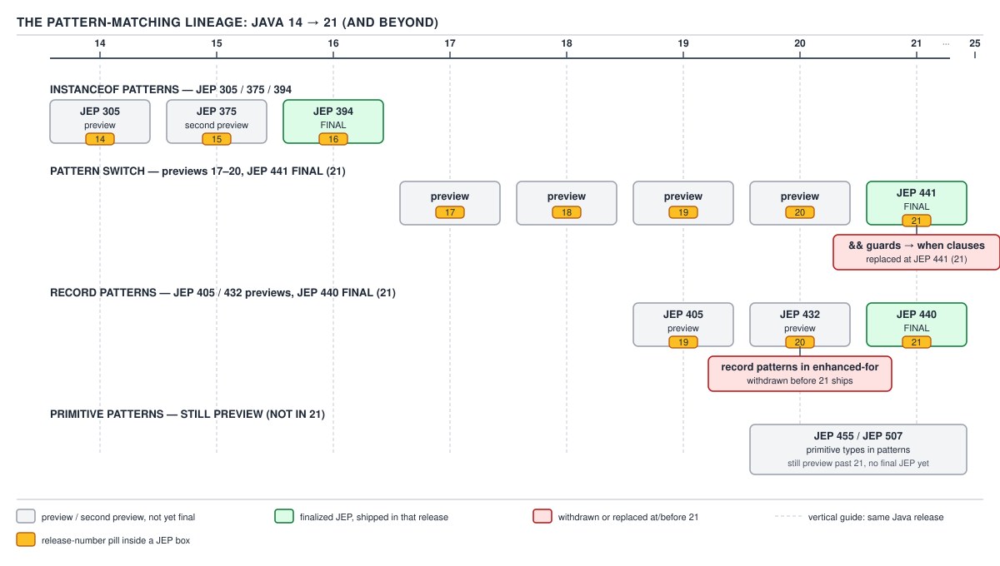
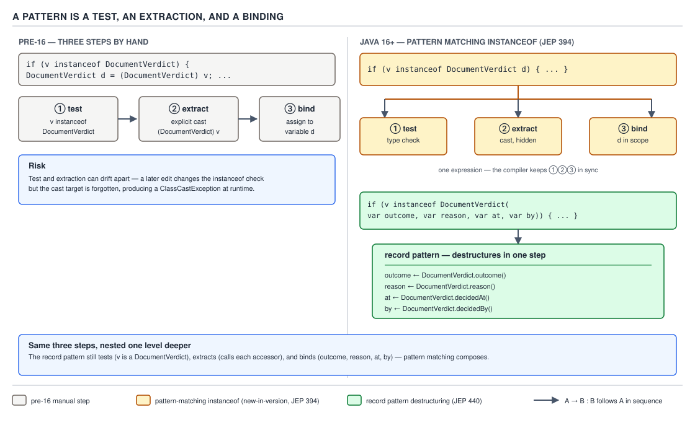
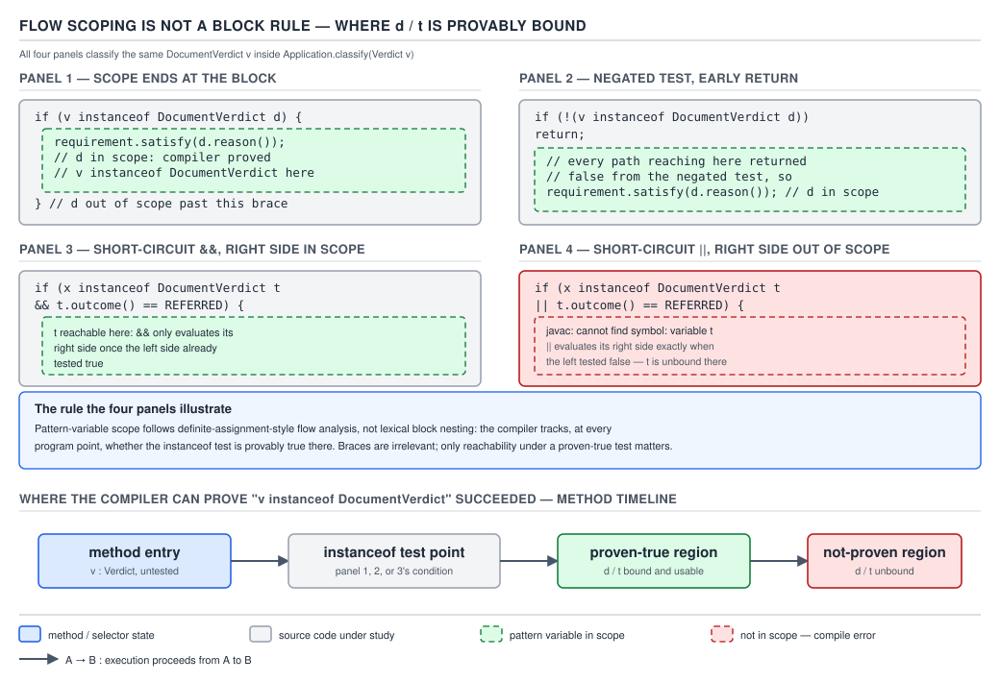
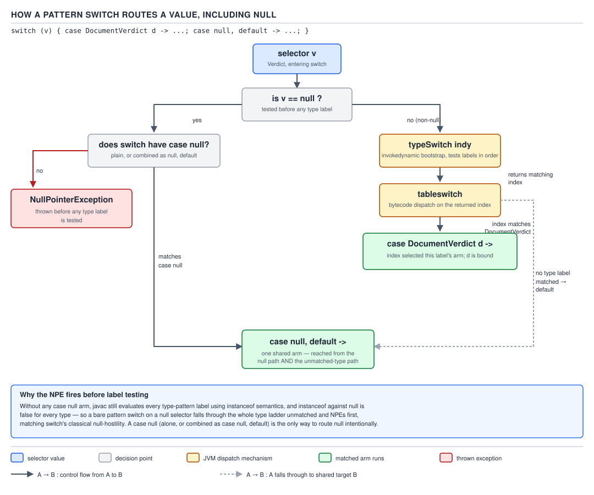
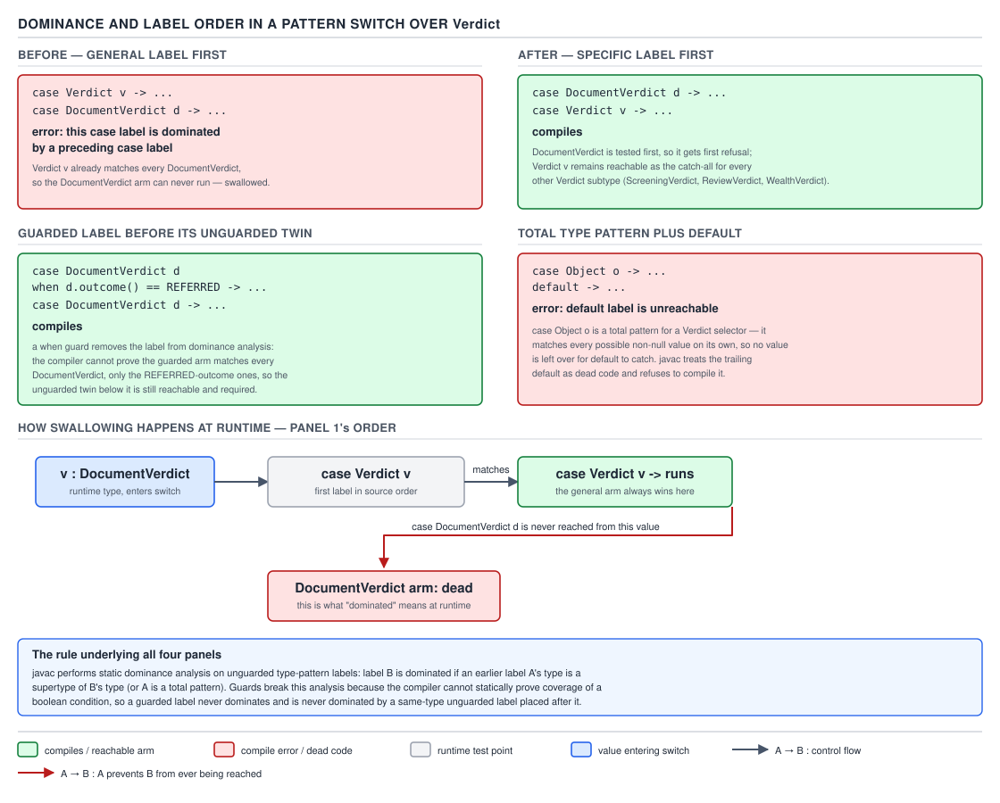
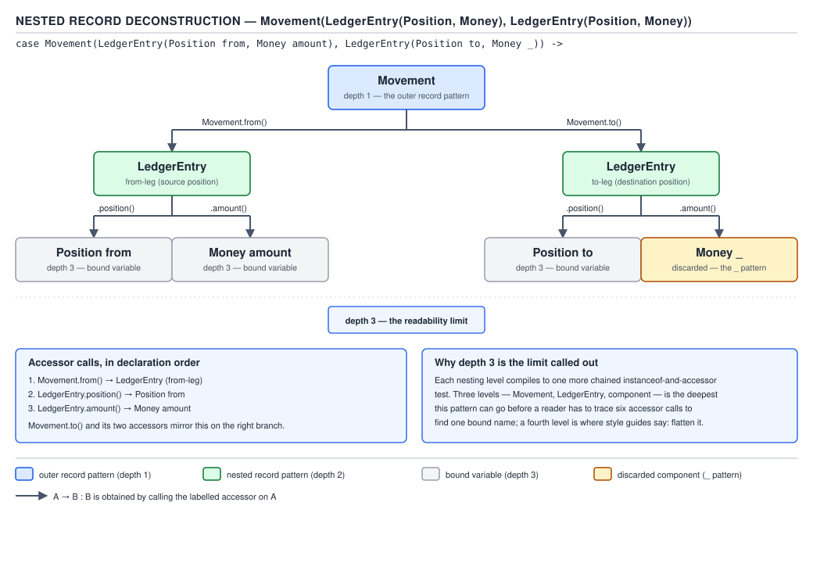

# 04 Modern Java — Pattern matching — BASICS (§1.15)

**Target version: Java 21 LTS.** | **Part 1 of 5** | [Index](../00-index.md)
Previous: [Sealed types — internals sealed](../sealed-types/03-internals-sealed.md) · Next: [Pattern matching — in anger](02-in-anger.md)

Pattern matching is not one feature — it is one idea (a pattern: test, extract, bind) delivered
through three JEP tracks that shipped years apart and previewed under different syntax along the
way. Almost every wrong belief about this area is a belief that was true in a preview and stopped
being true at final. This file builds the mechanism first, then works through where the version
story actually bites.

## The pattern-matching lineage

Three independent JEP tracks converged on Java 21. Read the map before the streets:

| Track | 14 | 15 | 16 | 17 | 18 | 19 | 20 | 21 |
|---|---|---|---|---|---|---|---|---|
| `instanceof` patterns | JEP 305 (preview) | JEP 375 (2nd preview) | **JEP 394 (final)** | — | — | — | — | — |
| Pattern switch | — | — | — | JEP 406 (preview) | JEP 420 (2nd preview) | JEP 427 (3rd preview) | JEP 433 (4th preview) | **JEP 441 (final)** |
| Record patterns | — | — | — | — | — | JEP 405 (preview) | JEP 432 (2nd preview) | **JEP 440 (final)** |


**D-065** — The pattern-matching lineage

Two things were previewed and then **withdrawn** before 21 shipped, and both are still quoted as
current by blog posts written in the preview years:

- Record patterns in the header of an enhanced `for` loop — proposed during the record-pattern
  previews, never reached final, does not compile on 21 (leaf 1.15.13, below).
- Guarded pattern labels spelled with `&&` — the early pattern-switch previews (JEP 406/420) wrote
  a guard as `case DocumentVerdict d && d.outcome() == REFERRED ->`. JEP 427 replaced the guard
  keyword with `when` before pattern switch went final, precisely because `&&` inside a `case`
  label was ambiguous with a boolean sub-pattern once record patterns arrived. Anything written
  against Java 17–20 pattern-switch previews using `&&` for a guard does not compile on 21 (leaf
  1.15.9, below).

A fourth track — primitive type patterns and array patterns — is still in preview past 21 (JEP
455, then JEP 507) and is covered at the end of this file as "what 21 still does not do" (leaf
1.15.24).

The domain running through every example below is QuizStakes' verdict machinery: `Verdict` is a
sealed interface (`DocumentVerdict`, `ScreeningVerdict`, `ReviewVerdict`, `WealthVerdict`) and
`Movement` is a ledger transfer between two `LedgerEntry` positions. Both are defined once, here,
and reused for the rest of the file:

```java
import java.math.BigDecimal;
import java.time.Instant;
import java.util.Currency;

sealed interface Verdict permits DocumentVerdict, ScreeningVerdict, ReviewVerdict, WealthVerdict {}

enum DocumentOutcome { VERIFIED, REFERRED, REJECTED }
enum ScreeningOutcome { CLEAR, POTENTIAL_MATCH, PROHIBITED }
enum ReviewOutcome { APPROVED, DECLINED }
enum WealthOutcome { ACCEPTABLE, REFERRED, REJECTED }

record DocumentVerdict(DocumentOutcome outcome, String reason, Instant decidedAt, String decidedBy)
        implements Verdict {}
record ScreeningVerdict(ScreeningOutcome outcome, String reason, Instant decidedAt, String decidedBy)
        implements Verdict {}
record ReviewVerdict(ReviewOutcome outcome, String reason, Instant decidedAt, String decidedBy)
        implements Verdict {}
record WealthVerdict(WealthOutcome outcome, String reason, Instant decidedAt, String decidedBy)
        implements Verdict {}

enum LedgerBucket {
    CLIENT_CASH_AVAILABLE, CLIENT_CASH_RESERVED,
    CLIENT_BONUS_AVAILABLE, CLIENT_BONUS_RESERVED,
    SUSPENSE, PSP_RECEIVABLE, BANK_SETTLEMENT,
    HOUSE_REVENUE, PROMOTIONAL_EXPENSE, FEES, CHARGEBACK_LOSS
}

record Position(String accountId, LedgerBucket bucket) {}
record Money(BigDecimal amount, Currency currency) {}
record LedgerEntry(Position position, Money amount) {}
record Movement(LedgerEntry from, LedgerEntry to) {}
```

---

### 1. A pattern is a test, an extraction, and a binding

**Mental model first.** Before Java 16, `instanceof` gave you exactly one bit of information — yes
or no — and threw it away the instant the `if` closed. Every caller then repeated the same three
steps by hand: test, cast, assign. A pattern fuses those three steps into one syntactic unit that
the compiler tracks for you. Think of a pattern as a single question that returns more than a
boolean: "is this a `DocumentVerdict`, and if so, hand me one already unpacked."

**Why it exists.** The pre-pattern idiom was mechanical and it duplicated the type token three
times for one fact:

```java
Object v = fetchVerdict();
if (v instanceof DocumentVerdict) {
    DocumentVerdict d = (DocumentVerdict) v;      // ①
    if (d.outcome() == DocumentOutcome.REFERRED) {
        flagForReview(d);
    }
}
```

Three redundant mentions of `DocumentVerdict` (the test, the cast, the declared type of `d`), and
a fourth opportunity for a typo or a `ClassCastException` if any of them drift out of sync during
a refactor — which is precisely the bug class JEP 305 names as the motivation. `instanceof` had
been null-hostile and cast-requiring since Java 1.0; the gap between "I already tested this" and
"the compiler still makes me cast" existed for 21 years before JEP 305 closed it in preview.

**When to reach for it, and when not.** Reach for a type pattern the moment you would otherwise
write `instanceof` immediately followed by a cast — that pairing is the whole signal. Do not reach
for it when the branching is genuinely polymorphic dispatch over an open (non-sealed) hierarchy
you do not own — an overridden method is still the right tool there, because the compiler cannot
help you find every case and a pattern switch over an unsealed type cannot be exhaustive (leaf
1.15.14). Reserve pattern switch over a *sealed* hierarchy for exactly the case where you want the
compiler to force every implementer to be handled — that is `Verdict`'s whole reason for being
sealed.

**How it works.** A pattern is three things fused into one syntax slot:

1. **A type test** — `o instanceof DocumentVerdict`, evaluated first, always.
2. **A conditional extraction** — if the test succeeds, pull a value out (for a type pattern, the
   value *is* `o`, narrowed; for a record pattern, the value is what a component accessor
   returns).
3. **A binding** — give the extracted value a name, scoped by flow analysis rather than by a
   lexical block (the whole subject of the next concept).

The one-liner replaces all three of the previous four lines:

```java
Object v = fetchVerdict();
if (v instanceof DocumentVerdict d && d.outcome() == DocumentOutcome.REFERRED) {
    flagForReview(d);                              // d is already a DocumentVerdict, no cast
}
```

and record patterns collapse a fourth, previously-manual step — pulling fields back out of the
matched object — into the same slot:

```java
if (v instanceof DocumentVerdict(DocumentOutcome outcome, String reason, Instant decidedAt, String decidedBy)) {
    if (outcome == DocumentOutcome.REFERRED) {
        flagForReview(reason, decidedAt, decidedBy);
    }
}
```


**D-060** — A pattern is a test, an extraction and a binding

`1.15.2` **`[RESEARCH]`** Type patterns in `instanceof` shipped as a preview twice before going
final: JEP 305 in Java 14, a second preview refining the flow-scoping rules in JEP 375 (Java 15),
and final without further syntax change in JEP 394 (Java 16). If you are reading material written
against 14 or 15, the syntax you see is identical to 16's — nothing changed at the call site
between preview and final for this particular track, only the specification's confidence in the
scoping rules changed. That is unusual among the three tracks; the other two both changed surface
syntax during their preview years (leaf 1.15.9, leaf 1.15.13).

**A minimal concrete example.** A `BalanceView` reconciliation job receives a raw `Object` payload
(deserialized from an internal queue with a loose contract) and must route on its runtime shape:

```java
static String describe(Object payload) {
    if (payload instanceof Movement(LedgerEntry(Position from, Money amount), LedgerEntry to)) {
        return "movement of " + amount.amount() + " " + amount.currency()
                + " from " + from.bucket();
    }
    if (payload instanceof Money(BigDecimal amount, Currency currency)) {
        return "bare amount " + amount + " " + currency;
    }
    return "unrecognised payload: " + payload.getClass().getSimpleName();
}
```

The first branch is already a record pattern nested one level deep (formally covered in concept
6) — proof that "a pattern" scales from a bare type test to an arbitrarily deep extraction without
changing what kind of syntax slot it occupies.

**The gotcha.** The extraction step runs **after** the test succeeds and **before** your code runs
— for a record pattern that means every component accessor named in the pattern is invoked as
part of matching, not lazily on first use. If `LedgerEntry.position()` or `Money.amount()` throws,
the exception surfaces during the `instanceof` or `switch`, not at the point you "read" the bound
variable. This is the same mechanism that produces `MatchException` from a throwing accessor
during a `switch` deconstruction (leaf 1.15.17, concept 5).

> **A pattern is a single syntactic unit that tests a value's shape, conditionally extracts data
> from it, and binds that data to new variables — collapsing what used to be a manual
> test-cast-assign sequence into one compiler-verified step.**

---

### 2. Flow scoping: not a block rule

**Mental model first.** Every Java scoping rule you already know is lexical — a variable is in
scope between the `{` that declares its block and the matching `}`, full stop, and the compiler
never has to think about *values* to compute it. Pattern variables broke that rule on purpose.
`d` in `if (v instanceof DocumentVerdict d)` is in scope wherever the compiler can prove, by
static analysis of control flow, that the test succeeded — which is sometimes *outside* the `{ }`
that looks like it should own `d`, and sometimes not at all despite `d` textually appearing to be
in scope.

**Why it exists.** Without flow scoping, a negated test would be useless for pattern matching:

```java
if (!(v instanceof DocumentVerdict d)) {
    return;
}
useVerdict(d);   // wanted here — but a lexical rule would say d died with the if-block
```

JEP 305's design goal was that this idiom — the early-return guard clause, already the dominant
style for null checks and validation — had to work with patterns too, or the feature would be
useless for the single most common shape of defensive code in the language. Flow scoping is the
mechanism that makes the guard clause and the pattern variable coexist.

**When to reach for it, and when not.** Flow scoping is not something you opt into — it is how
every pattern variable behaves, always. What you choose is the *shape* of the surrounding
boolean logic, and that choice determines how far the variable's scope reaches. Prefer the
early-return / negated-guard form when you want the bound variable available for the rest of the
method; prefer the direct `&&`-chained form when the variable is only needed for one more
condition in the same expression. Do not reach for `||` to "combine two type tests that share a
name" — the language will not let you use the binding on the far side, by design (below).

**How it works — worked through.** `1.15.3` **`[PROVE]`** The specification's rule (JLS §6.3.1,
"Scope of a Pattern Variable") is expressed as *definite (un)assignment*-style flow analysis, not
block nesting: a pattern variable introduced by an `instanceof` expression is *definitely matched*
at a program point `P` if every path reaching `P` necessarily passed through the pattern test
succeeding. Walk one case by hand:

```java
if (v instanceof DocumentVerdict d) {
    // point A: every path reaching A came through "v instanceof DocumentVerdict d" being true
    use(d);   // legal
}
// point B: reachable both when the test was true (fell through the if-block) and when it
// was false (skipped it) — the compiler cannot prove d matched on every path reaching B
use(d);   // illegal: d might not have matched here
```

At point A there is exactly one path, and it passed through a true test — `d` is definitely
matched. At point B there are two paths into the same program point, one of which never tested
anything — `d` is definitely matched on *some* incoming edges and not others, so the compiler
refuses to treat it as in scope. This is exactly the same style of reasoning `javac` already uses
for definite assignment of `final` locals; pattern scoping reuses the same analysis engine with a
different predicate.

`1.15.4` **`[PROVE]` `[TRAP]`** Negation flips which side of the branch is empty, which flips
which side keeps the binding:

```java
if (!(v instanceof DocumentVerdict d)) {
    return;                    // every path out of this block is a return — the method ends here
}
// only path reaching this point: the negated test was false, i.e. the un-negated test was true
useVerdict(d);                 // legal — d is definitely matched at every path reaching here
```

Walk it the way the compiler does: the `if`-block's only exit is `return`, so **every** path that
reaches the statement after the `if` did so by *not* entering the block, which means the negated
condition was false, which means the original `instanceof` was true. There is exactly one
surviving path into that program point, and on it `d` definitely matched. The guard-clause idiom
is not a special case the compiler was taught — it is the general flow rule applied to a block
whose only exit doesn't fall through.

**Pitfall:** engineers who learned pattern variables from a single textbook example (`if (x
instanceof T t) { use(t); }`) often believe the binding is scoped to the `if`'s braces, full stop,
and are then surprised when `d` compiles fine *after* a guard-clause `if` with no matching `else`.
The fix is to stop thinking in braces and start asking: "does every path reaching this line pass
through a true test?" If yes, the variable is there, brace or no brace. The reverse mistake also
happens: assuming the variable survives past a plain (non-early-exit) `if` block, which it does
not, because the fall-through path did not pass through a true test.

`1.15.5` **`[TRAP]` `[PROVE]`** `&&` and `||` split the same way, and for the same underlying
reason — short-circuit evaluation order:

```java
if (v instanceof DocumentVerdict d && d.outcome() == DocumentOutcome.REFERRED) {
    // legal: && only evaluates the right operand once the left is true, so by the time
    // "d.outcome()" runs, d is already known to have matched
}

if (v instanceof DocumentVerdict d || d.outcome() == DocumentOutcome.REFERRED) {
    // compile error: || evaluates the right operand exactly when the left was FALSE,
    // i.e. exactly when d did NOT match — using d here is a use on a path where it
    // is definitely NOT matched
}
```

Work the `||` case through explicitly: short-circuit `||` means the right-hand side runs only when
the left-hand side is `false`. "The left-hand side is `false`" here means "the `instanceof` test
failed." So the one and only program point where `d.outcome()` executes is the point at which `d`
is guaranteed to be unmatched. The compiler is not being conservative — using `d` there is a
guaranteed-wrong program, not a merely-unproven one, and the specification makes it a hard error
rather than a warning.

**Pitfall:** a common attempted "clever" pattern is `x instanceof TypeA a || x instanceof TypeB a`
to try to unify two type tests under one name — it does not compile, and cannot, because on the
right side of `||`, `a` is (by construction) not bound from the left disjunct, and even if it were
somehow bound from the right disjunct alone the union of "not TypeA" and "is TypeB" still does not
entail "is TypeA," so there is no program point after the whole expression where either binding is
definite. Use two separate `if` statements, or a pattern switch (concept 3), instead.


**D-061** — Flow scoping is not a block rule

`1.15.3` **`[X-REF 03]`** Flow scoping is a special case of a more general fact about local
variables in Java: the compiler already performs definite-assignment analysis to enforce that
every `final` local and every blank `final` field is assigned on every reachable path before use.
Pattern-variable scoping reuses that same analysis machinery with the predicate "was this pattern
matched" instead of "was this variable assigned." Guide 03 (Java core) covers definite assignment
and effectively-final capture — the semantics that make lambdas able to capture local variables
without a manual "final" keyword — in full; this file uses only the fact that the analysis exists
and how it applies to patterns specifically.

**A minimal concrete example.** A `DocumentRequirements` gate check that both demonstrates the
early-return idiom and needs the variable after the guard:

```java
static void requireVerified(Verdict v) {
    if (!(v instanceof DocumentVerdict d)) {
        throw new IllegalStateException("expected a document verdict, got " + v.getClass());
    }
    if (d.outcome() != DocumentOutcome.VERIFIED) {
        throw new BonusIneligibleException("document not verified: " + d.reason());
    }
    // d used freely here too — every path into this line passed through both guards
    audit(d.decidedBy(), d.decidedAt());
}
```

**The gotcha.** Flow scoping is defined purely in terms of *the compiler's own proof*, not runtime
truth — if you restructure a method so the compiler can no longer trace a single surviving path
(introduce a `try`/`catch` around the guard, add a second unrelated `return`, refactor the guard
into a boolean method and call that method instead of inlining the `instanceof`), the binding
disappears even though the underlying logic is unchanged, because the *proof*, not the logic, is
what scoping tracks.

> **A pattern variable is in scope at exactly the program points the compiler can prove, by
> flow analysis of the surrounding control flow, that the test necessarily succeeded — not at the
> points delimited by the nearest enclosing braces.**

---

### 3. Pattern switch: null, guards, and routing

**Mental model first.** A pattern switch is a `switch` whose labels are patterns instead of (or in
addition to) constants — and because a pattern can fail to match, the switch statement had to grow
a whole new failure mode it never had before: null used to be the one value that blew up a
`switch` unconditionally, and it still does by default, but now there is a label that catches it
on purpose.

**Why it exists.** Before Java 21, dispatch over a sealed hierarchy of verdicts looked like a
chain of `instanceof`, each one repeating the extraction machinery from concept 1:

```java
static String routeVerdict(Verdict v) {
    if (v instanceof DocumentVerdict d) {
        return handleDocument(d);
    } else if (v instanceof ScreeningVerdict s) {
        return handleScreening(s);
    } else if (v instanceof ReviewVerdict r) {
        return handleReview(r);
    } else if (v instanceof WealthVerdict w) {
        return handleWealth(w);
    } else {
        throw new IllegalStateException("unhandled verdict: " + v);
    }
}
```

That `else` branch is doing the compiler's job by hand — nothing stops a fifth `Verdict`
implementer from being added and silently falling into the `IllegalStateException` at runtime,
discovered the first time someone hits it in production. A pattern switch pushes that check into
the compiler (concept 4).

**When to reach for it, and when not.** Reach for a pattern switch the moment the `if`/`else if`
chain above is dispatching on a sealed family and the fallback branch exists purely to handle
"some case I haven't written yet." Do not reach for `when` guards to encode logic that has nothing
to do with the *shape* of the value — a guard reads a runtime value inside a compile-time
exhaustiveness check, and abusing it to bury unrelated business rules inside a `switch` label
makes the label list unreadable and defeats dominance analysis (concept 4).

**How it works.**

`1.15.6` **`[RESEARCH]`** Pattern labels in `switch` previewed four times — JEP 406 (17), JEP 420
(18), JEP 427 (19), JEP 433 (20) — before going final as JEP 441 in Java 21, the longest preview
run of the three tracks. Each preview round refined a specific rough edge (dominance checking,
the guard syntax, `null` handling); the surface most engineers use today only stabilized at 21.

```java
static String routeVerdict(Verdict v) {
    return switch (v) {
        case DocumentVerdict d when d.outcome() == DocumentOutcome.REFERRED -> handleReferral(d);
        case DocumentVerdict d -> handleDocument(d);
        case ScreeningVerdict s -> handleScreening(s);
        case ReviewVerdict r -> handleReview(r);
        case WealthVerdict w -> handleWealth(w);
    };
}
```

No `default`, no `else`, and — because `Verdict` is `sealed` and every permitted subtype has a
label — this compiles as exhaustive (concept 4). The `when` clause is a **guard**: a boolean
expression evaluated only after the type test on that label has already matched, refining "is a
`DocumentVerdict`" down to "is a `DocumentVerdict` that was referred."

`1.15.9` **`[VERSION-TRAP]` `[RESEARCH]`** The `when` keyword is the final syntax. The four preview
rounds spelled the same idea with `&&` directly in the label: `case DocumentVerdict d &&
d.outcome() == REFERRED ->`. That form does not compile on Java 21 — `&&` there is now parsed as
part of the pattern grammar (used inside a pattern's boolean sub-expressions in later JEPs, and
reserved to avoid exactly this ambiguity), and `when` is the only legal guard introducer from 21
onward. If a blog post or a Stack Overflow answer written 2021–2023 shows `&&` inside a `case`
label, it is describing a preview build of Java 17–20 and will not compile as written on the LTS
release.

`1.15.7` **`[RESEARCH]`** Before pattern switch, `switch` was **null-hostile**: a null selector
always threw `NullPointerException` before any label was even consulted, for every switch form
(statement, expression, on an `Integer`, on a `String`, on an enum) since `switch` was introduced.
JEP 441 adds an explicit label that opts out of that:

```java
static String classify(Verdict v) {
    return switch (v) {
        case null -> "no verdict recorded";
        case DocumentVerdict d -> "document: " + d.outcome();
        case ScreeningVerdict s -> "screening: " + s.outcome();
        case ReviewVerdict r -> "review: " + r.outcome();
        case WealthVerdict w -> "wealth: " + w.outcome();
    };
}
```

`case null, default ->` is also legal and merges the two into one arm — useful when null and
"anything else uncovered" should be handled identically; it is *not* legal to write `case null` and
a separate `default` as two arms when the selector type also needs plain-value fallback logic that
should differ from the null case — those need two distinct labels, as in `classify` above, which
has no `default` at all because the sealed hierarchy is already exhaustive.

`1.15.8` **`[TRAP]` `[PROVE]`** Without an explicit `case null`, the historical null-hostile
behaviour is **preserved**, not relaxed — a pattern switch with no null label still throws on a
null selector, exactly as every `switch` always has:

```java
static String routeVerdictNoNullLabel(Verdict v) {
    return switch (v) {                 // v == null here
        case DocumentVerdict d -> "document";
        case ScreeningVerdict s -> "screening";
        case ReviewVerdict r -> "review";
        case WealthVerdict w -> "wealth";
    };                                    // throws NullPointerException, not MatchException
}
```

Work through *why* it must be `NullPointerException` and not `MatchException`: the routing
mechanism (below) never even reaches the point of testing labels against a null selector — the
null check happens first, unconditionally, before any pattern is evaluated, exactly as it always
did for a plain `switch (someInteger)`. `MatchException` (concept 5) is reserved for a selector
that is non-null but matches **no** label despite the switch having been compiled as exhaustive —
a completely different failure mode that occurs only after the null check has already passed.

**Pitfall:** the belief "pattern switch made `switch` accept `null` by default" is wrong and
dangerous — it is exactly backwards. Pattern switch made it *possible* to opt in to handling
`null`, and the reason JEP 441 requires that opt-in explicitly (rather than silently routing null
to `default`) is to preserve every existing `switch` statement's behaviour unchanged when it is
recompiled — a `default` arm written before Java 21 was never expected to see `null`, and silently
changing that would be a breaking change dressed up as a feature.


**D-062** — How a pattern switch routes a value, including null

**How it works, continued — the routing mechanism.** A pattern switch over reference types does
not compile to a `tableswitch` over hash codes the way a `String` switch does. `javac` emits an
`invokedynamic` call to a bootstrap method (`SwitchBootstraps.typeSwitch`, part of
`java.lang.runtime`) that receives the selector and an array of the label types/constants in
order, tests each in turn, and returns the integer index of the first match (or `-1`/the arm count
for "no match"); the bytecode then does an ordinary `tableswitch` on that integer. The upfront null
check is emitted directly by `javac`, not delegated to the indy call, which is exactly why it
happens before any label — including a `case null` label conceptually, though mechanically the
compiler special-cases it into the generated dispatch — is consulted.

`1.15.23` **`[RESEARCH]`** New in Java 21: a pattern-switch label may name a **qualified** enum
constant, `case Suit.HEARTS ->`, where earlier (pre-pattern) enum switches required the bare
constant name, `case HEARTS ->`, because the selector's static type already fixed which enum was
in play. Pattern switch relaxed that because a single switch can now legitimately mix enum
constant labels with type-pattern labels over unrelated types, and at that point requiring the
qualifier removes ambiguity for the reader even though the compiler could often infer it. This is
a small, easy-to-miss syntax addition, not a semantic change — `case Suit.HEARTS` and (in a
plain, non-mixed enum switch) `case HEARTS` compile to the same thing.

**A minimal concrete example.** Combining a null label, a guard, and an enum constant label in one
switch over an onboarding decision:

```java
enum ReferralPriority { STANDARD, EXPEDITED }

static String triage(Verdict v, ReferralPriority priority) {
    return switch (v) {
        case null -> "nothing to triage";
        case DocumentVerdict d when d.outcome() == DocumentOutcome.REFERRED
                && priority == ReferralPriority.EXPEDITED -> "expedite: " + d.reason();
        case DocumentVerdict d when d.outcome() == DocumentOutcome.REFERRED -> "queue: " + d.reason();
        case DocumentVerdict d -> "auto-cleared";
        case ScreeningVerdict s -> "screening: " + s.outcome();
        case ReviewVerdict r -> "review: " + r.outcome();
        case WealthVerdict w -> "wealth: " + w.outcome();
    };
}
```

Note the `&&` inside the `when` clause's own boolean expression — that is ordinary Java boolean
`&&`, not the guard introducer, and is completely legal; only the *label-level* guard keyword
changed from `&&` to `when` between preview and final (leaf 1.15.9).

**The gotcha.** Guards are evaluated top to bottom, once per switch, and a `when` clause that
throws propagates out of the switch exactly like any other expression evaluated inside a `case` —
there is no implicit catch-and-fall-through to the next label. A guard that calls a method with
side effects runs that method exactly once per matching attempt at that label, on every execution
of the switch, which matters if the guard is expensive.

> **A pattern switch replaces boolean equality tests over labels with pattern tests; `case null`
> makes `null`-handling explicit rather than implicit, `when` refines a matched pattern with an
> ordinary boolean condition evaluated after the match, and the null-hostile default from before
> Java 21 is preserved for any switch that does not opt in with `case null`.**

---

### 4. Exhaustiveness, legacy exemptions, and dominance

**Mental model first.** A `switch` **expression** has always had to produce a value on every
possible input — that requirement predates pattern matching entirely. What pattern matching
changes is *how* the compiler proves it, because "every possible input" for an open type like
`Object` is not enumerable the way it is for an `int` or an `enum`. The compiler's answer: read the
sealed hierarchy's own `permits` clause and treat "every permitted subtype has a label" as proof.

**Why it exists.** A `switch` **statement** over `int`/`String`/enum never required a `default` —
falling off the end and doing nothing was always legal, because those types have no notion of
"exhaustive," only "handled or not." A pattern switch introduces types where "every case is
covered" is a provable, checkable fact rather than a wish, and once it is provable, the language
requires the proof for any pattern switch **expression** (which must yield a value) and, as a
readability/safety choice, for any switch that uses a pattern or `null` label at all. Leaving that
optional would reintroduce the exact `IllegalStateException`-in-an-`else` failure mode concept 3
opened with.

**When to reach for it, and when not.** Sealed the hierarchy, want the compiler to catch every new
subtype at compile time forever — omit `default`, let exhaustiveness do its job (leaf 1.15.16).
Working against an *open* hierarchy you do not control, or a selector type from the legacy-exempt
list — you must supply `default` yourself, because there is no way to enumerate "every case" for
an interface anyone could implement.

**How it works — the rule, sourced.**

`1.15.14` **`[SOURCE]` `[RESEARCH]`** JLS §14.11.1 states the exhaustiveness requirement for a
switch block: a switch block that contains a pattern case label or the `null` case label must be
exhaustive for its selector expression's type, and separately, a switch **expression** must always
be exhaustive regardless of what kind of labels it uses. Quoted in substance: *"A switch block
that contains a case label with a `null` or pattern must be exhaustive."* Read each clause: "case
label with a `null` or pattern" — the trigger is the *kind of label present*, not the selector's
type; "must be exhaustive" — every value the selector's static type can produce at runtime must be
provably covered by some label, or the switch fails to compile.

`1.15.15` **`[SOURCE]` `[RESEARCH]`** The specification then carves out an exemption list — the
**legacy selector types** — for which a switch is never required to be exhaustive, `default` or
no `default`, pattern labels or none: `char`, `byte`, `short`, `int` and their boxed forms
(`Character`, `Byte`, `Short`, `Integer`), `String`, and any enum type. These are exactly the
selector types a `switch` accepted before pattern matching existed, and the exemption exists for
backward compatibility — every `switch (someString)` written before Java 21, with no `default`,
must keep compiling exactly as it did the day it was written; retroactively demanding
exhaustiveness from millions of lines of pre-existing code was never on the table.

`1.15.16` **`[PROVE]`** Work through why a sealed hierarchy makes exhaustiveness checkable at all.
`Verdict` declares `permits DocumentVerdict, ScreeningVerdict, ReviewVerdict, WealthVerdict` — a
closed, compiler-visible list. The exhaustiveness checker's algorithm is: collect the set of types
covered by the switch's patterns; for each, if it is itself sealed, recursively expand it into its
permitted subtypes; a switch is exhaustive over `Verdict` if the union of covered types (after
expansion) equals `Verdict`'s full permitted set. `routeVerdict` in concept 3 has one label per
permitted subtype — the union equals the full set — exhaustive, no `default` needed. Add a fifth
implementer, `FraudVerdict implements Verdict`, to the `permits` clause and recompile *only* the
`Verdict.java` file without touching `routeVerdict` — the union is now missing `FraudVerdict`, the
switch is no longer exhaustive, and the file that declares `routeVerdict` fails to compile the
moment it is rebuilt against the new `Verdict.class`. This is precisely what makes omitting
`default` a *feature*: the compiler surfaces the gap the instant it can, rather than the runtime
surfacing it the first time production traffic hits the new case.

**A minimal concrete example — the exempt case.** A `String`-selector switch over a raw status
code prefix genuinely never needs `default`, by the exemption above, even with zero pattern labels
in sight:

```java
static String domainOf(String statusPrefix) {
    return switch (statusPrefix) {
        case "AO" -> "onboarding";
        case "AA" -> "activation";
        case "DEP" -> "card deposit";
        case "BDP" -> "bank deposit";
        default -> "unrecognised prefix: " + statusPrefix;
    };
}
```

`default` is present here purely because the switch is an *expression* and every branch not
covered by the exempt-type rule's leniency still needs *some* value — that is a different
requirement (expressions always need full coverage of *some* kind) from pattern-triggered
exhaustiveness, and it is satisfied the ordinary pre-21 way, with `default`.

**Dominance.**

`1.15.18` **`[PROVE]` `[SOURCE]`** A more general label written before a more specific one is a
**compile error**, not a silently-shadowed dead branch the way it would be for overlapping `if`
conditions:

```java
static String misordered(Verdict v) {
    return switch (v) {
        case Verdict any -> "generic";              // dominates everything below it
        case DocumentVerdict d -> "document";        // ERROR: label is dominated by a preceding label
        case ScreeningVerdict s -> "screening";
        case ReviewVerdict r -> "review";
        case WealthVerdict w -> "wealth";
    };
}
```

The specification's dominance rule (JLS §14.11.1) says a pattern label `P2` is dominated by an
earlier label `P1` if every value matched by `P2` would also have matched `P1` — and a switch
containing a dominated label is a compile-time error, precisely so a reachable-but-dead arm is
caught at compile time instead of silently never running. Work it through: `case Verdict any`
matches literally every `Verdict`, `DocumentVerdict` included, so every value `DocumentVerdict d`
could ever match was already claimed by the label above it — `DocumentVerdict d` is provably
unreachable, and unreachable switch labels are a compile error the same way unreachable `case`
constants have always been.

`1.15.19` **`[TRAP]` `[PROVE]`** A guarded case must come **before** its unguarded twin, and the
reason is that the guard removes the label from dominance analysis entirely — the compiler cannot
prove a `when` clause always evaluates to `true`, so it never treats a guarded label as
"dominating" anything, guarded or not:

```java
static String correct(Verdict v) {
    return switch (v) {
        case DocumentVerdict d when d.outcome() == DocumentOutcome.REFERRED -> "flag";  // must come first
        case DocumentVerdict d -> "auto-clear";                                          // catches the rest.md
        case ScreeningVerdict s -> "screening";
        case ReviewVerdict r -> "review";
        case WealthVerdict w -> "wealth";
    };
}
```

Swap the order and it still compiles — that is the trap, not a compile error — but the guarded
arm becomes dead code, because `case DocumentVerdict d -> "auto-clear"` (unguarded) would already
have claimed every `DocumentVerdict`, guard-carrying twin included, and the compiler has no way to
flag it as dominated because dominance analysis skips guarded labels on *both* sides of the
comparison — it only ever concludes "not dominated," never "safe." **Pitfall:** engineers
reasonably expect the compiler to catch this the same way it caught the plain-label case above; it
does not, because proving "this guard never triggers when it's unreachable" is a semantic proof the
compiler explicitly declines to attempt, and the fix is discipline, not tooling — always place the
most specific, most-guarded label first, working down to the most general.

`1.15.20` **`[TRAP]` `[RESEARCH]`** A **total** type pattern — one whose static type already
covers every value the selector could produce, such as `case Object o` over an `Object` selector,
or `case Verdict v` over a `Verdict` selector — dominates literally everything, `default` included,
and the specification forbids writing both:

```java
static String bothTotal(Verdict v) {
    return switch (v) {
        case Verdict any -> "generic";
        default -> "unreachable";        // ERROR: default is dominated by the preceding total pattern
    };
}
```

**Pitfall:** the belief "`default` is always safe to include as a defensive fallback" breaks here
specifically — once any label is total, `default` is not merely redundant, it is a compile error,
because the language treats "unreachable `default`" the same way it treats any other unreachable
label. The fix is to delete the total pattern and let `default` do the job, or delete `default`
and let the total pattern do the job — never both.


**D-063** — Dominance and label order

`1.15.21` **`[X-REF 03]`** Generics interact with patterns through the **unchecked pattern**
restriction: `case Box<String> b ->` is only legal where the compiler can prove the check safe at
runtime without violating type erasure — concretely, when the pattern's type argument is provably
determined by the context (for example, matching against a value whose static type already fixes
the type argument) rather than requiring an actual runtime test of an erased generic parameter.
Where it cannot prove that, `javac` reports an "unchecked" pattern error rather than silently
generating a checked-but-wrong test, because a real runtime check of `instanceof Box<String>` is
impossible after erasure — there is no bytecode operation that distinguishes a `Box<String>` from
a `Box<Money>` at runtime, only "is a `Box`." Guide 03 (Java core) covers erasure, bridge methods,
and exactly which generic constructs survive to runtime in full; the fact needed here is only that
patterns did not create a new escape hatch around erasure — they inherit its restrictions.

**The gotcha.** Dominance and exhaustiveness are checked independently and can both fail on the
same switch for different reasons — reordering to fix a dominance error can simultaneously break
exhaustiveness if the reordering accidentally removed the label that made the union of covered
types complete. Re-check both after any label reorder, not just the one the compiler complained
about first.

> **A pattern switch must prove every value of its selector's type is covered by some label
> (exhaustiveness) and that no label can never be reached because an earlier one already claims
> every value it could match (dominance) — both are compile-time proofs over the label list, not
> runtime fallbacks.**

---

### 5. `MatchException`

**Mental model first.** Exhaustiveness (concept 4) is a compile-time *proof*, and every proof has
an assumption baked in — here, that the class files being linked together at runtime are the same
ones the compiler reasoned about. `MatchException` is the runtime's admission that the proof's
assumption failed: a switch the compiler certified as exhaustive nonetheless received a value it
has no label for, because the world shifted under it between compilation and execution.

**Why it exists.** Separate compilation is the culprit, and it is not a contrived scenario — it is
routine in any multi-module build. Compile `Verdict.java` (with four permitted subtypes) together
with a `switch` that has exactly four labels; the switch is exhaustive, verified, done. Now add a
fifth permitted subtype, `FraudVerdict`, to `Verdict.java` and recompile **only that file** —
perhaps a module boundary means the switch's `.class` file is not rebuilt in the same step. The
switch's bytecode is unchanged and still believes it is exhaustive over four types; at runtime, a
`FraudVerdict` instance reaches it and there is no label, no `default`, and no `case null` to
absorb it. Before Java 21, this exact scenario existed too, but only for the enum flavor of it
(below) — pattern switch generalizes the same failure to sealed hierarchies, so the language needed
one exception type to name it precisely.

**When to reach for it, and when not.** You do not throw `MatchException` yourself, and you should
not catch it as routine control flow — a caught `MatchException` in production means the build
graph allowed a class file mismatch that the compiler's own guarantee was supposed to prevent, and
the fix belongs in the build (rebuild every consumer of a sealed hierarchy whenever its `permits`
list changes), not in a `catch` block. The one place it is worth catching deliberately is a
boundary that loads plugin classes compiled against an older version of your sealed API and wants
to fail with a clear diagnostic instead of an opaque one.

**How it works.**

`1.15.17` **`[RESEARCH]` `[TRAP]`** `MatchException`, new in Java 21, is thrown from two distinct
sites, and conflating them is the trap:

1. **The separate-compilation drift case above** — an exhaustive pattern switch's synthetic
   fallback is reached because the runtime value belongs to a type the compiler did not know about
   when it certified exhaustiveness.
2. **A throwing record accessor during deconstruction** — recall from concept 1 that a record
   pattern's component accessors run as part of the match itself. If `LedgerEntry.position()`
   throws inside `case Movement(LedgerEntry(Position from, Money amount), LedgerEntry to) ->`,
   the switch cannot complete the match, and the language wraps that failure in a `MatchException`
   too (with the original exception as its `getCause()`), rather than letting the raw accessor
   exception surface in a way that looks identical to an ordinary method-call failure inside the
   arm's body.

**Pitfall:** the natural but wrong assumption is "`MatchException` means my switch is missing a
case, go add one" — that diagnosis is correct for site 1 and completely wrong for site 2, where the
switch's label list is fine and the bug is a throwing accessor. Reading `getCause()` before
touching the label list distinguishes the two immediately.

**The relevant version correction, worked through with real bytecode.** A closely related but
distinct mechanism — the synthetic `default` a **plain enum switch expression** has always emitted
internally even with all constants covered — changed which exception type it throws, and older
material gets this backwards. Verified on this machine by compiling an enum and a switch over it
separately, adding a constant to the enum, and recompiling only the enum, across three release
targets:

```
release 14 -> Exception in thread "main" java.lang.IncompatibleClassChangeError
release 17 -> Exception in thread "main" java.lang.IncompatibleClassChangeError
release 21 -> Exception in thread "main" java.lang.MatchException
```

and in `javap -c` on the `--release 21` class file, the synthetic default arm:

```
36: new           #19    // class java/lang/MatchException
42: invokespecial #21    // Method java/lang/MatchException."<init>":(Ljava/lang/String;Ljava/lang/Throwable;)V
45: athrow
```

The synthetic fallback itself is not new — an exhaustive **enum** switch expression has always had
one, for exactly the same separate-compilation reason `Verdict`'s pattern switch does — but the
*type it throws changed at Java 21*: `IncompatibleClassChangeError` through Java 20,
`java.lang.MatchException` constructed with the `(String, Throwable)` constructor from Java 21
onward. So the precise, version-correct statement is: **the synthetic default has existed since
switch expressions did; the exception it throws changed at 21, unifying the enum-drift case with
the newer sealed-hierarchy pattern-switch drift case under the same exception type.** Material that
says `MatchException` "replaced" `IncompatibleClassChangeError` for this scenario is right about
the type change and easy to misread as claiming the *mechanism* is new — it is the label, not the
trigger, that is new.

**A minimal concrete example.** The drift scenario, made concrete against `Verdict`:

```java
// Compiled once, against the four-subtype Verdict:
static String route(Verdict v) {
    return switch (v) {
        case DocumentVerdict d -> "document";
        case ScreeningVerdict s -> "screening";
        case ReviewVerdict r -> "review";
        case WealthVerdict w -> "wealth";
        // no default — the compiler certified this exhaustive against four permitted subtypes
    };
}

// Verdict.java is later edited to: permits DocumentVerdict, ScreeningVerdict, ReviewVerdict,
// WealthVerdict, FraudVerdict — and only Verdict.class is rebuilt, not the class containing route.
// A FraudVerdict instance reaching route(...) at runtime throws:
//   java.lang.MatchException: null
//     at Router.route(Router.java:5)
```

**The gotcha.** `MatchException`'s message is frequently just `null` — the exception exists to
signal *that* the drift happened and *where*, via the stack trace's line number, not to describe
*what* value caused it; do not expect a human-readable payload without adding your own logging at
the call site.

> **`MatchException`, new in Java 21, is thrown when a switch the compiler proved exhaustive is
> handed a runtime value outside that proof — because the class files drifted apart between
> compile time and run time — or when a record accessor throws mid-deconstruction; it generalizes
> a failure mode that, for plain enum switches, previously surfaced as `IncompatibleClassChangeError`.**

---

### 6. Record patterns and nested deconstruction

**Mental model first.** A type pattern gives you the whole object, narrowed. A record pattern goes
one step further and gives you the object's *insides*, pre-unpacked, by calling its accessors for
you — and because a record's component can itself be a record, that unpacking nests arbitrarily
deep in a single expression, mirroring the shape of the data rather than a sequence of statements
that walks down it.

**Why it exists.** Before record patterns, extracting nested record data meant a chain of accessor
calls, each introducing its own local variable and its own opportunity to misname something:

```java
static String describeOld(Movement m) {
    LedgerEntry from = m.from();
    Position fromPosition = from.position();
    Money amount = from.amount();
    LedgerEntry to = m.to();
    Position toPosition = to.position();
    return fromPosition.bucket() + " -> " + toPosition.bucket() + " : " + amount.amount();
}
```

Four intermediate locals to reach two leaf values, none of which the compiler forces you to name
consistently with the record's own component names. JEP 405's motivation, echoed in the JEP text,
is that this manual unwrapping is exactly the kind of boilerplate pattern matching for `instanceof`
had already eliminated for the single-level case — records are Java's declared, compiler-verified
"this is a fixed shape of data" construct, so pattern matching on their shape should not require
writing the shape out twice.

**When to reach for it, and when not.** Reach for a record pattern the instant you would otherwise
write `.accessor()` chains to get at nested data you are about to test or branch on. Do not chase
depth for its own sake — nesting past two or three levels in a single pattern buys compactness at
the cost of a reader having to hold the whole tree in their head before any code runs; past that
depth, a couple of named intermediate variables (or a shallower pattern plus one accessor call)
reads better than one enormous pattern.

**How it works.**

`1.15.10` **`[RESEARCH]`** Record patterns previewed twice — JEP 405 (Java 19), a refined JEP 432
(Java 20, adding `var` component inference among other changes) — before going final as JEP 440 in
Java 21. A record pattern's shape mirrors the record's own declaration: `case Circle(double r) ->`
deconstructs a `record Circle(double r)` by naming its one component.

`1.15.11` Nested record patterns extend the same syntax to a component that is itself a record —
`case Line(Point(int x1, int y1), Point(int x2, int y2)) ->` for `record Point(int x, int y)` and
`record Line(Point start, Point end)` — with no depth limit in the grammar. QuizStakes' own version
of this, used throughout this file:

```java
static String describeMovement(Movement m) {
    if (m instanceof Movement(LedgerEntry(Position from, Money amount), LedgerEntry(Position to, Money credited))) {
        return from.bucket() + " (" + amount.amount() + " " + amount.currency() + ") -> "
                + to.bucket() + " (" + credited.amount() + " " + credited.currency() + ")";
    }
    return "not a movement";
}
```

Every accessor the pattern implies — `Movement.from()`, `LedgerEntry.position()`,
`LedgerEntry.amount()`, `Position.bucket()`, `Movement.to()`, and the same three again on the
second `LedgerEntry` — runs during the match, in declaration order, before a single line of the
`if`'s body executes (the mechanism behind leaf 1.15.17's second `MatchException` trigger).


**D-064** — Nested record deconstruction

`1.15.12` **`[RESEARCH]` `[PROVE]`** Two independent type-inference conveniences arrived alongside
record patterns:

- **`var` inside a component**: `case LedgerEntry(var position, var amount) ->` lets the compiler
  fill in each component's declared type from the record's own definition — `position` is inferred
  as `Position`, `amount` as `Money`, with zero loss of type safety, because the record's
  declaration is the source of truth, not the call site.
- **Generic record pattern inference**: for a generic record, `case Reservation<Money>(var m) ->`
  can drop the explicit type argument — `case Reservation(var m) ->` — and the compiler infers it
  from context the same way a diamond operator infers a constructor's type argument. Work through
  why this is sound rather than an unchecked-pattern violation (leaf 1.15.21): the inference here
  determines the pattern's *static* type argument from the surrounding expression's already-known
  type, the same information a diamond already has available — it is not a runtime test of an
  erased parameter, so it does not run into erasure's wall the way an explicit, unprovable
  `Box<String>` pattern does.

`1.15.13` **`[VERSION-TRAP]` `[RESEARCH]`** Record patterns in the header of an enhanced `for`
loop were proposed during the preview years and **removed before Java 21's final specification** —
they do not compile on 21:

```java
// Proposed during preview, REMOVED before Java 21 final — does not compile:
for (LedgerEntry(Position position, Money amount) : entries) { ... }
```

Any code sample or article showing that form is describing a withdrawn preview feature, not
current Java. The Java 21-legal equivalent still requires an explicit pattern-matching construct
inside the loop body:

```java
for (LedgerEntry entry : entries) {
    if (entry instanceof LedgerEntry(Position position, Money amount)) {
        // use position, amount
    }
}
```

`1.15.22` Record patterns work outside `switch` entirely, directly as the right-hand side of
`instanceof` — every example so far in this concept already uses that form (`m instanceof
Movement(...)`); it is worth naming explicitly because it is easy to assume record patterns are a
`switch`-only feature when most teaching material demonstrates them inside one.

**A minimal concrete example — a full guarded, nested switch arm.** Combining nesting with a `when`
guard from concept 3, routing high-value cash movements for extra review:

```java
static String classifyMovement(Movement m) {
    return switch (m) {
        case Movement(LedgerEntry(Position from, Money amt), LedgerEntry(Position to, Money credited))
                when amt.amount().compareTo(new BigDecimal("1000")) >= 0 ->
                "large movement: " + from.bucket() + " -> " + to.bucket();
        case Movement(LedgerEntry(Position from, Money amt), LedgerEntry(Position to, Money credited)) ->
                "movement: " + from.bucket() + " -> " + to.bucket();
    };
}
```

Note this switch has exactly two labels over a **non-sealed** record type (`Movement` is a plain
record, not part of a sealed hierarchy) with no `default` — legal because a single record pattern
matching a record's own concrete type (ignoring the guard, which does not affect coverage
analysis per leaf 1.15.19) is itself total for that type: there is no subtype of a `final`-by-
default record to omit.

**The gotcha.** A nested record pattern that binds a component you never use still forces that
component's accessor to run — there is no way to "skip" a level of nesting for performance without
either using `var`/an explicit type only for the components you need and an unnamed placeholder
(`_`, final in Java 22, not available in 21 per leaf 1.15.24) for the rest, or restructuring to a
shallower pattern plus a manual accessor call for the one field you actually want.

> **A record pattern deconstructs a record's components by name at the point of a type test,
> nests to any depth by writing another record pattern in a component position, and every
> accessor named anywhere in the pattern runs as part of the match itself, before the matched
> arm's body executes.**

---

## What patterns still do not do in Java 21

`1.15.24` **`[RESEARCH]` `[VERSION-TRAP]`** A short, deliberately negative inventory, because
knowing the boundary of a feature is as interview-relevant as knowing its capabilities, and this
boundary keeps moving release to release:

| Still missing at 21 | Status |
|---|---|
| Primitive type patterns (`case int i ->` over a boxed or `Object` selector) | Preview under JEP 455, then JEP 507 — not final at 21 |
| Array patterns (`case String[] { var first, ... } ->`) | Not proposed as a shipped JEP feature at 21 |
| Deconstruction of arbitrary (non-record) classes | Not supported — only records expose component accessors patterns can call |
| Alternation ("or") patterns (`case TypeA t, TypeB t ->` as one label) | Not supported at 21 |
| Unnamed patterns and variables (`_`) | Finalized later, in Java 22 (JEP 456) — not usable at 21 |

Each of these is a plausible follow-up question after any of the six concepts above — "can I
match on a primitive?", "can I deconstruct an arbitrary class?" — and the honest, version-precise
answer for Java 21 is no to all five, with the primitive-pattern and unnamed-pattern work visibly
in flight in later releases.

---

## Pitfalls

### Assuming a pattern variable is scoped to its enclosing braces

**Wrong**

```java
if (v instanceof DocumentVerdict d) {
    // ...
}
useVerdict(d);   // compile error: d is not in scope here — this path doesn't prove a match
```

**Right**

```java
if (!(v instanceof DocumentVerdict d)) {
    return;
}
useVerdict(d);   // legal: every surviving path passed through a true test
```

**Why people believe it:** every other Java scoping rule they have ever learned is lexical
(blocks, methods, classes), so it is a reasonable prior to import — pattern variables are the one
construct in the language where the rule is genuinely different, and nothing about the syntax
signals that.

### Reaching for `||` to unify two type tests under one binding

**Wrong**

```java
if (v instanceof DocumentVerdict d || v instanceof ScreeningVerdict d) {
    use(d);   // compile error either way — d isn't definitely matched on both sides
}
```

**Right**

```java
if (v instanceof DocumentVerdict d) {
    use(d);
} else if (v instanceof ScreeningVerdict s) {
    use(s);
}
// or, better for more than two: a pattern switch (concept 3)
```

**Why people believe it:** `||` reads naturally as "either of these," and the mental model "one
binding for either shape" is a reasonable thing to want — the language just has no construct for
it outside a `switch`, where each label gets its own independent binding.

### Believing pattern switch makes `null` fall through to `default` automatically

**Wrong**

```java
static String routeAssumingNullSafe(Verdict v) {
    return switch (v) {                     // v == null
        case DocumentVerdict d -> "document";
        default -> "other";                  // never reached for null — NPE happens first
    };
}
```

**Right**

```java
static String routeNullSafe(Verdict v) {
    return switch (v) {
        case null -> "no verdict";
        case DocumentVerdict d -> "document";
        default -> "other";
    };
}
```

**Why people believe it:** `default` sounds like "everything else, including nothing," and it is
easy to conflate "unmatched" with "null," but the language treats them as two separate concerns —
`default` is for unmatched non-null values, `case null` is the only thing that ever catches null.

### Placing an unguarded label before its guarded twin

**Wrong**

```java
static String misordered(Verdict v) {
    return switch (v) {
        case DocumentVerdict d -> "auto-clear";                                    // claims everything first
        case DocumentVerdict d when d.outcome() == DocumentOutcome.REFERRED -> "flag";  // dead code, no error
    };
}
```

**Right**

```java
static String ordered(Verdict v) {
    return switch (v) {
        case DocumentVerdict d when d.outcome() == DocumentOutcome.REFERRED -> "flag";
        case DocumentVerdict d -> "auto-clear";
    };
}
```

**Why people believe it:** dominance errors for two plain labels are loud compile-time failures,
so it is reasonable to assume the same protection extends to a guarded/unguarded pair — but the
compiler explicitly declines to reason about guard truth, so this specific ordering mistake compiles
silently.

### Diagnosing every `MatchException` as "you forgot a case"

**Wrong**

```java
// Sees: java.lang.MatchException at Router.route(Router.java:5)
// Adds a defensive default arm without reading getCause() first — masks a throwing accessor.
```

**Right**

```java
try {
    return route(movement);
} catch (MatchException e) {
    log.error("match failure, cause: {}", e.getCause());   // distinguishes drift from a throwing accessor
    throw e;
}
```

**Why people believe it:** the exhaustiveness-drift cause (concept 5, site 1) is the one every
tutorial demonstrates, so it becomes the default mental model, but a throwing record accessor
during deconstruction (site 2) produces the identical exception type with a completely different
fix.

### Assuming a total type pattern can coexist with `default` as extra safety

**Wrong**

```java
static String bothTotal(Verdict v) {
    return switch (v) {
        case Verdict any -> "generic";
        default -> "unreachable";   // compile error: default is dominated
    };
}
```

**Right**

```java
static String oneOrTheOther(Verdict v) {
    return switch (v) {
        case Verdict any -> "generic";
    };
}
```

**Why people believe it:** `default` reads as "belt and suspenders," and in every other switch
form adding it never hurts — a total pattern is the one place that intuition breaks, because the
language treats the redundant label as unreachable code, not harmless caution.

---

## Cheat sheet

| Concept | One-line rule |
|---|---|
| A pattern | Type test + conditional extraction + binding, one syntax slot |
| Flow scoping | Bound where the compiler can *prove* the test succeeded on every incoming path — not by braces |
| Negated guard (`if (!(x instanceof T t)) return;`) | `t` in scope for the rest of the method after the guard |
| `&&` in a test | Right side sees the binding (left evaluated first, short-circuits before right runs) |
| `||` in a test | Right side does **not** see the binding (runs only when the left was false) |
| `case null` | Only label that ever catches a null selector; absent means NPE, exactly as pre-21 |
| `when` | Final guard keyword (Java 21); earlier previews (17–20) used `&&` in the label — does not compile at 21 |
| Exhaustiveness trigger | Any pattern or `null` label anywhere in the switch, or the switch is an expression |
| Legacy-exempt selector types | `char/byte/short/int` + boxed forms, `String`, any enum — never require exhaustiveness |
| Sealed exhaustiveness | Compiler expands `permits` recursively; one label per permitted subtype (or their own permits) satisfies it |
| Dominance | Earlier label matching everything a later one could match → compile error |
| Guarded label + dominance | Guards are invisible to dominance analysis — order guarded-before-unguarded by hand |
| Total pattern + `default` | Illegal together — total pattern dominates `default` |
| `MatchException` | Runtime failure of a compile-time-proven-exhaustive switch (class-file drift), or a throwing record accessor mid-deconstruction |
| Enum switch expression synthetic default | `IncompatibleClassChangeError` through Java 20, `MatchException` from Java 21 — same trigger, new type |
| Record pattern | Deconstructs by component name, nests to any depth, all accessors run during the match |
| `var` in a record pattern | Infers each component's declared type from the record itself |
| Record pattern in enhanced `for` header | Proposed, then **removed** before Java 21 final — does not compile |
| Record pattern outside `switch` | Legal directly in `instanceof`, no switch required |
| Qualified enum label (`case Suit.HEARTS`) | New in Java 21 pattern switch; bare form still works in non-mixed enum switches |
| Not in Java 21 | Primitive patterns, array patterns, non-record deconstruction, `or` patterns, unnamed `_` patterns |

---

## Self-test

**Q1.** Why does `if (!(v instanceof DocumentVerdict d)) return; useVerdict(d);` compile, while
`if (v instanceof DocumentVerdict d) { } useVerdict(d);` (plain, non-early-exit block) does not?

<details><summary>Answer</summary>

Flow scoping is proved per program point, not per block. In the first example, the `if` block's
only exit is `return`, so the *only* way execution reaches `useVerdict(d)` is by skipping the
block — which happens exactly when the negated test was false, i.e. the original `instanceof` was
true. Every path reaching that line passed through a true test, so `d` is definitely matched. In
the second example, the statement after the `if` is reachable both when the test was true (fell
through the block) and when it was false (skipped it) — two incoming paths, only one of which
proves a match — so the compiler cannot certify `d` as definitely matched there.

</details>

**Q2.** Why does `x instanceof T t && t.foo()` compile but `x instanceof T t || t.foo()` does not?

<details><summary>Answer</summary>

Both operators are short-circuiting, and that is exactly what decides it. `&&` evaluates its right
operand only when the left was `true` — so by the time `t.foo()` runs, `t` is guaranteed matched.
`||` evaluates its right operand only when the left was `false` — so by the time `t.foo()` would
run, `t` is guaranteed **not** matched. Using `t` on the right of `||` is a use at the one program
point where it is definitely unmatched, which the compiler rejects outright rather than merely
failing to prove safe.

</details>

**Q3.** A pattern switch over `Verdict` has no `default` and no `case null`. What happens at
runtime when the selector is `null`, and why is that the correct behaviour rather than a gap in
the feature?

<details><summary>Answer</summary>

It throws `NullPointerException`, exactly as any pre-Java-21 `switch` always has on a null
selector. This is deliberate, not an oversight: JEP 441 requires an explicit `case null` to opt in
to null-handling precisely so that recompiling a switch written before Java 21 against the new
compiler cannot silently change its behaviour on null input. `MatchException` is a completely
separate failure mode reserved for a non-null selector that an exhaustive switch has no label for.

</details>

**Q4.** Why must a guarded case (`case DocumentVerdict d when ... ->`) be written before its
unguarded twin, and why doesn't the compiler catch the mistake if you write them in the wrong
order?

<details><summary>Answer</summary>

If the unguarded label comes first, it already matches every `DocumentVerdict`, guard-carrying or
not, making the guarded label beneath it unreachable — the same shape of bug dominance analysis
exists to catch. But dominance analysis explicitly excludes guarded labels from its reasoning in
both directions, because the compiler cannot prove a `when` clause's truth value at compile time
and refuses to guess — so this specific ordering mistake compiles cleanly and simply produces dead
code, discoverable only by testing or by careful reading, not by the compiler.

</details>

**Q5.** What are the two distinct situations that throw `MatchException`, and how do you tell
which one you are looking at from the exception alone?

<details><summary>Answer</summary>

(1) A switch the compiler proved exhaustive receives, at runtime, a value of a type it did not
know about at compile time — typically because a sealed hierarchy's `permits` list grew and only
some of the affected class files were recompiled (separate-compilation drift). (2) A record
accessor invoked as part of a record pattern's deconstruction throws during the match itself. The
two are distinguished by `getCause()`: drift-triggered `MatchException` generally has no
meaningful cause (its message is frequently just `null`), while the throwing-accessor case wraps
the original exception as the cause.

</details>

**Q6.** Why does `case Circle(double r) ->` need no `var`, but a generic record like
`Reservation<Money>` can be matched as `case Reservation(var m) ->` without repeating the type
argument — and why is that safe given that generic type arguments don't exist at runtime?

<details><summary>Answer</summary>

`Circle`'s component type (`double`) is fixed by the record's own declaration, so the pattern
never needed a type argument in the first place. For a generic record, the compiler infers the
dropped type argument from the surrounding expression's already-known static type — the same
source of information a diamond operator (`new ArrayList<>()`) already uses — rather than
performing any new runtime test. Because the inference happens at compile time from already-known
static information, and no runtime check of the erased type argument is required, it does not run
into the unchecked-pattern restriction that blocks something like an unprovable `case Box<String>
b`.

</details>

**Q7.** A blog post from 2022 shows `case DocumentVerdict d && d.outcome() == REFERRED ->` inside
a pattern switch. Will that compile on Java 21, and what should you write instead?

<details><summary>Answer</summary>

No. That `&&` guard syntax was the spelling used by the pattern-switch previews in Java 17–20
(JEP 406/420/427/433). JEP 441 finalized the feature in Java 21 with `when` as the only legal guard
introducer, in part because `&&` inside a case label became ambiguous once record patterns'
sub-expressions arrived. The Java 21 equivalent is `case DocumentVerdict d when d.outcome() ==
DocumentOutcome.REFERRED ->`.

</details>

**Q8.** Why is `default` legal and necessary in `switch (statusPrefix) { case "AO" -> ...; default
-> ...; }` even though `String` is one of the legacy-exempt selector types that never *require*
exhaustiveness?

<details><summary>Answer</summary>

Two separate rules are in play. The legacy-exemption rule (leaf 1.15.15) says a `String`-selector
switch is never *forced* to prove exhaustiveness just because it is a `String` switch. But a
switch **expression** — as opposed to a statement — has always had an independent, older
requirement: every possible input must produce some value, full stop, regardless of selector type
or label kind. For an exempt type like `String`, `default` is exactly how that older,
type-independent expression-completeness requirement gets satisfied, since the compiler cannot
otherwise enumerate "every possible `String`."

</details>

**Q9.** What, precisely, changed at Java 21 about the exception an exhaustive enum switch
expression's synthetic default throws — and what stayed the same?

<details><summary>Answer</summary>

What stayed the same: the synthetic default itself is not new — an exhaustive enum switch
expression has always emitted one internally, for the same separate-compilation drift reason a
sealed-hierarchy pattern switch can drift. What changed: the type it throws. Verified by compiling
and recompiling across releases, the synthetic default throws `IncompatibleClassChangeError`
through Java 20 and `java.lang.MatchException` (built with the `(String, Throwable)` constructor)
from Java 21 onward — confirmed both by observed runtime output and by the `new
java.lang.MatchException` / `invokespecial` instructions in the `--release 21` bytecode.

</details>

---

## Deferred

None.

---

**Leaves covered:** 1.15.1–1.15.24 (24 leaves)
**Leaves deferred:** none
**Diagrams included:** D-060, D-061, D-062, D-063, D-064, D-065
**Target version:** Java 21 LTS
**Lines:** 1321
