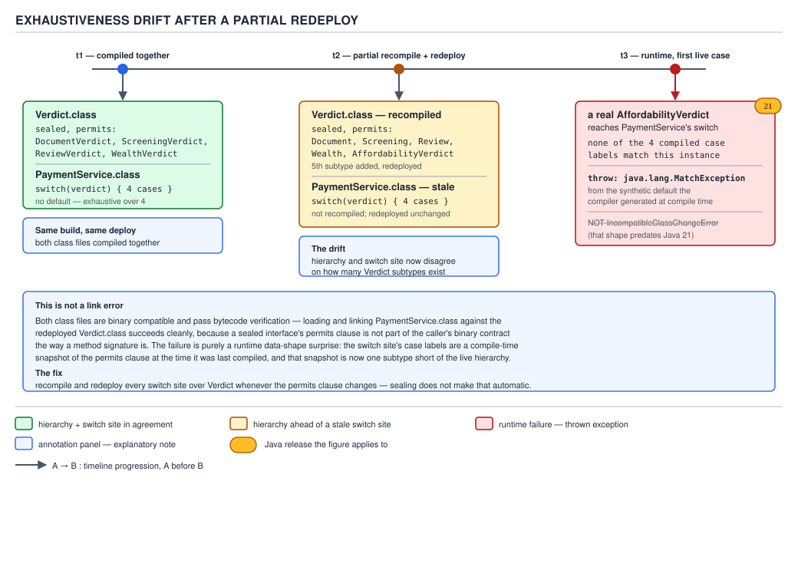

# 04 Modern Java — Pattern matching — INTERMEDIATE (§2.10)

**Target version: Java 21 LTS.** | **Part 2 of 5** | [Index](../00-index.md)
Previous: [Pattern matching — basics](01-basics.md) · Next: [Pattern matching — internals pattern matching](03-internals-pattern-matching.md)

## Scope

Part 1 gave you the syntax: type patterns, record patterns, guards, `case null`. This
file is about using that syntax under pressure — refactoring a real chain, choosing
between a guard and a nested switch, and the two failure modes that bite once the code
ships: a pattern switch statement over a non-sealed type silently missing a case, and a
sealed hierarchy that grows a new subtype while only half the fleet redeploys.

The running example is QuizStakes's `Verdict` sealed hierarchy — `DocumentVerdict`,
`ScreeningVerdict`, `ReviewVerdict`, `WealthVerdict` — the decision object every gate in
onboarding produces (§8 of `scenario.md`; the sealed hierarchy is in the domain's type
sketch). Something downstream — `NotificationService`, `ApplicationHistory` — has to look
at a `Verdict` and decide what to tell the client. That decision logic is the code we
refactor.

### The hierarchy, once, before the details

```java
public sealed interface Verdict
        permits DocumentVerdict, ScreeningVerdict, ReviewVerdict, WealthVerdict {
    Outcome outcome();
    String reason();
    Instant decidedAt();
    String decidedBy();
}

public record DocumentVerdict(Outcome outcome, String reason, Instant decidedAt,
                               String decidedBy, String vendorReference) implements Verdict {}

public record ScreeningVerdict(Outcome outcome, String reason, Instant decidedAt,
                                String decidedBy, boolean potentialMatch) implements Verdict {}

public record ReviewVerdict(Outcome outcome, String reason, Instant decidedAt,
                             String decidedBy, String operatorId) implements Verdict {}

public record WealthVerdict(Outcome outcome, String reason, Instant decidedAt,
                             String decidedBy, BigDecimal assessedIncome) implements Verdict {}

public enum Outcome { APPROVED, REFERRED, DECLINED }
```

Four permitted subtypes, one shared shape (`outcome`, `reason`, `decidedAt`, `decidedBy`),
each adding one field particular to the gate that produced it. Every example below
deconstructs this hierarchy; no new domain type is introduced.

---

## 1. Refactoring an `instanceof` chain into a pattern switch, step by step

### Mental model

Think of the original chain as a locked filing cabinet where every drawer has to be
opened and checked by hand, in order, even though the label on the folder already tells
you which drawer it belongs in. A pattern switch is the cabinet re-built so the label
*is* the drawer index — the JVM reads the label once (§2.10.10 covers exactly how) and
jumps straight to the matching branch. Refactoring the chain is the process of noticing
that the folder's label (its runtime class) is doing all the real work, and letting the
language see that instead of hiding it behind manual casts.

### Why it exists

Before Java 16 (type patterns, JEP 394, final) and Java 21 (pattern matching for switch,
JEP 441, final — after two rounds of preview in 17 and 20/21), the only way to branch on
a sealed hierarchy's runtime type was `instanceof` plus an explicit cast, or the visitor
pattern. Both work; both duplicate information the compiler already has. `instanceof`
plus cast writes the type twice — once in the test, once in the cast — and gives you
nothing if you forget a branch. The visitor pattern moves the dispatch into a `double
dispatch` method-per-subtype scheme that is exhaustiveness-checked by the compiler
(every subtype must implement `accept`), but at the cost of one interface method and one
visitor-interface method per operation, for every hierarchy, forever. Pattern switches
give you the visitor's exhaustiveness checking without the boilerplate, provided the
hierarchy is `sealed`.

### When to reach for it, and when not

Reach for a pattern switch the moment you are branching on the *runtime type* of a value
whose static type is a sealed interface or a small closed set of classes. Do not reach
for it when the branches don't actually care about type — a `switch` on `outcome()`
(an enum field common to all four `Verdict` subtypes) is a plain enum switch, not a
pattern switch, and should stay one; adding type patterns there would hide the fact that
every branch is really testing the same field. Do not reach for it either when the
hierarchy is open (not `sealed`) and you cannot enumerate the subtypes — see §2.10.8,
where that combination forces a `default` you cannot avoid.

### How it works — the four-step conversion

**Step 0, the starting chain.** This is what most `NotificationService`-shaped code
looked like on Java 11:

```java
String summarize(Verdict verdict) {
    if (verdict instanceof DocumentVerdict) {
        DocumentVerdict dv = (DocumentVerdict) verdict;
        return "Document check via " + dv.vendorReference() + ": " + dv.outcome();
    } else if (verdict instanceof ScreeningVerdict) {
        ScreeningVerdict sv = (ScreeningVerdict) verdict;
        return sv.potentialMatch()
                ? "Screening flagged a potential match: " + sv.reason()
                : "Screening clear: " + sv.outcome();
    } else if (verdict instanceof ReviewVerdict) {
        ReviewVerdict rv = (ReviewVerdict) verdict;
        return "Manual review by " + rv.decidedBy() + " (operator " + rv.operatorId() + "): "
                + rv.outcome();
    } else if (verdict instanceof WealthVerdict) {
        WealthVerdict wv = (WealthVerdict) verdict;
        return "Wealth assessment (" + wv.assessedIncome() + "): " + wv.outcome();
    } else {
        throw new IllegalStateException("Unknown verdict type: " + verdict.getClass());
    }
}
```

Four `instanceof` tests, four casts, four locals that exist purely to hold the cast
result, and a `default`-shaped `else` that only exists because the compiler cannot prove
the four `if` branches are exhaustive — it has no idea `Verdict` is closed.

**Step 1 — type patterns replace the casts.** `instanceof PatternType name` (JEP 394)
lets the test bind the cast result directly; the local you used to write by hand is now
declared by the pattern:

```java
String summarize(Verdict verdict) {
    if (verdict instanceof DocumentVerdict dv) {
        return "Document check via " + dv.vendorReference() + ": " + dv.outcome();
    } else if (verdict instanceof ScreeningVerdict sv) {
        return sv.potentialMatch()
                ? "Screening flagged a potential match: " + sv.reason()
                : "Screening clear: " + sv.outcome();
    } else if (verdict instanceof ReviewVerdict rv) {
        return "Manual review by " + rv.decidedBy() + " (operator " + rv.operatorId() + "): "
                + rv.outcome();
    } else if (verdict instanceof WealthVerdict wv) {
        return "Wealth assessment (" + wv.assessedIncome() + "): " + wv.outcome();
    } else {
        throw new IllegalStateException("Unknown verdict type: " + verdict.getClass());
    }
}
```

Nothing has changed at runtime — this still compiles to four `instanceof` bytecode
checks and four cast operations, one after another. The `else`/`if` shape has not moved.
The gain so far is only that the cast is no longer written twice.

**Step 2 — converted to a pattern switch, `default` still present.** The chain is
structurally an equality-on-shape dispatch, which is exactly what `switch` is for once
it accepts patterns as labels (JEP 441). Converting is mechanical: each `else if
(verdict instanceof T t)` becomes `case T t ->`:

```java
String summarize(Verdict verdict) {
    return switch (verdict) {
        case DocumentVerdict dv ->
                "Document check via " + dv.vendorReference() + ": " + dv.outcome();
        case ScreeningVerdict sv -> sv.potentialMatch()
                ? "Screening flagged a potential match: " + sv.reason()
                : "Screening clear: " + sv.outcome();
        case ReviewVerdict rv ->
                "Manual review by " + rv.decidedBy() + " (operator " + rv.operatorId() + "): "
                        + rv.outcome();
        case WealthVerdict wv ->
                "Wealth assessment (" + wv.assessedIncome() + "): " + wv.outcome();
        default -> throw new IllegalStateException("Unknown verdict type: " + verdict.getClass());
    };
}
```

This is already a real improvement — the compiler now checks the labels for
*dominance* (no case can be unreachable because an earlier one already subsumes it,
which for disjoint record types is trivially true here) and the whole thing is a single
expression, not four returns hidden in branches. But the `default` is still required,
because the compiler does not yet know `DocumentVerdict | ScreeningVerdict |
ReviewVerdict | WealthVerdict` is *all* of `Verdict`'s possible runtime shapes — that
knowledge lives in the `permits` clause, and nothing has told the switch to look at it
except by exhausting every branch of a type it doesn't statically know is closed. In
fact at this point in the walk it genuinely doesn't know that; the sealing is the next
step.

**Step 3 — `default` removed once the type is sealed, so exhaustiveness is checked.**
`Verdict` was declared `sealed ... permits DocumentVerdict, ScreeningVerdict,
ReviewVerdict, WealthVerdict` from the start in this file's version of the domain (real
migrations usually seal a previously-open interface as a separate step — see §2.10.9 for
what happens when that step and this one get out of sync). Once the compiler can see the
`permits` list, a `switch` whose case labels cover every permitted subtype is
**exhaustive by construction**, and the `default` becomes not just unnecessary but
actively worse — it silently swallows the "I forgot a branch" signal the compiler would
otherwise give you:

```java
String summarize(Verdict verdict) {
    return switch (verdict) {
        case DocumentVerdict dv ->
                "Document check via " + dv.vendorReference() + ": " + dv.outcome();
        case ScreeningVerdict sv -> sv.potentialMatch()
                ? "Screening flagged a potential match: " + sv.reason()
                : "Screening clear: " + sv.outcome();
        case ReviewVerdict rv ->
                "Manual review by " + rv.decidedBy() + " (operator " + rv.operatorId() + "): "
                        + rv.outcome();
        case WealthVerdict wv ->
                "Wealth assessment (" + wv.assessedIncome() + "): " + wv.outcome();
    };
}
```

Delete `WealthVerdict`'s case now and this fails to compile: `the switch expression does
not cover all possible input values`. That compiler error is the entire point of the
migration — it turns "someone adds a fifth `Verdict` subtype and forgets to update this
method" from a runtime `IllegalStateException` discovered in production into a build
failure discovered by the author of the new subtype, in their own IDE, before the code
merges. §2.10.9 is about the one way this guarantee still fails you.


**D-113** — Refactoring an `instanceof` chain into a pattern switch

### The gotcha

Steps 1 and 2 are behaviourally identical to step 0 — same bytecode shape, same
`default`-as-safety-net feel. The actual mechanism change happens only at step 3, and
only because the *interface declaration* is `sealed`. If you do steps 1–2 on a hierarchy
that is not sealed, you are stuck at step 2 forever: the `default` cannot be removed
(§2.10.8), and you have gained syntax convenience without gaining the compiler's
exhaustiveness guarantee. Sealing the hierarchy is not a cosmetic last step; it's the
step that actually buys the safety property everyone thinks the refactor bought them
three steps earlier.

> **Definition.** Refactoring an `instanceof` chain into a pattern switch is a four-step
> migration — type patterns replace casts, the chain becomes a switch, then a `default`
> stands in until the type is sealed, at which point removing the `default` converts a
> runtime "forgot a case" bug into a compile-time error.

---

## 2. Replacing getter-plus-condition code with record deconstruction

### Mental model

A getter-plus-condition block is you asking an object for its insides one field at a
time and re-assembling them into local variables by hand — like unpacking a shipped box
by reaching in and pulling items out individually. A record pattern is the box
declaring, at the point you receive it, exactly what's inside and in what order, so
unpacking and naming happen in the same motion the type check does.

### Why it exists

Records (JEP 395, Java 16) already give you the getters — `dv.vendorReference()`,
`wv.assessedIncome()`. But before record patterns (JEP 440, Java 21) you still wrote
`dv.vendorReference()` once for the check and once (or more) for the use, and nested
records meant nested getter chains (`payload.split().bonusPortion()`). Record
deconstruction collapses "confirm the shape, then read the parts" into one pattern.

### When to reach for it, and when not

Reach for it wherever you are calling two or more accessors on the same freshly-checked
record, especially if one of the values is itself a record you're about to unpack
further. Don't reach for it when you need the *whole record*, not its parts — a method
that logs `verdict` as a single formatted value has no reason to deconstruct it into
loose locals it never uses individually. Don't reach for it either past two or three
levels of nesting; §2.10.11 covers exactly where that stops being readable.

### How it works

A record pattern names the record type and, in parentheses, one nested pattern per
component, positionally, matching the canonical constructor's declared order:

```java
// getter-plus-condition
if (verdict instanceof ReviewVerdict) {
    ReviewVerdict rv = (ReviewVerdict) verdict;
    if (rv.outcome() == Outcome.DECLINED) {
        auditLog.record(rv.decidedBy(), rv.operatorId(), rv.reason());
    }
}

// record deconstruction — one motion, not three lookups plus a cast
if (verdict instanceof ReviewVerdict(Outcome.DECLINED, String reason, Instant decidedAt,
                                      String decidedBy, String operatorId)) {
    auditLog.record(decidedBy, operatorId, reason);
}
```

Two things are compressed here that are worth separating. First, `outcome()` is checked
*and* the value is a component pattern — `Outcome.DECLINED` is a constant pattern, valid
inside a record pattern's component slots since Java 21 treats enum constants as
patterns that match by equality. Second, `decidedAt` is bound but unused; Java 21 does
not let you elide a component (every component must be named or `var`-typed), but an
unused binding costs nothing at runtime — it is just a local variable slot the JIT can
prove dead.

Nesting composes the same way. `StakeSplit(Money bonusPortion, Money cashPortion)` (the
bonus/cash split from a stake, §11 of `scenario.md`) nested inside a hypothetical
settlement record deconstructs in one pattern instead of two chained getter calls:

```java
record StakeSettlement(RoundId roundId, StakeSplit split, BigDecimal payout) {}

// getter chain
StakeSettlement settlement = ...;
BigDecimal bonusPortion = settlement.split().bonusPortion().amount();

// nested record deconstruction
if (settlement instanceof StakeSettlement(RoundId id, StakeSplit(Money(var bonusAmt, var cur), Money cash), var payout)) {
    // bonusAmt and cur are bound directly, no chained accessor calls
}
```

### The example, continued in the domain

Rewriting `summarize` fully with record deconstruction, since every branch really wants
individual fields, not the record as a whole:

```java
String summarize(Verdict verdict) {
    return switch (verdict) {
        case DocumentVerdict(var outcome, var reason, var decidedAt, var decidedBy, var vendorRef) ->
                "Document check via " + vendorRef + ": " + outcome;
        case ScreeningVerdict(var outcome, var reason, var decidedAt, var decidedBy, boolean match) ->
                match ? "Screening flagged a potential match: " + reason
                      : "Screening clear: " + outcome;
        case ReviewVerdict(var outcome, var reason, var decidedAt, var decidedBy, var operatorId) ->
                "Manual review by " + decidedBy + " (operator " + operatorId + "): " + outcome;
        case WealthVerdict(var outcome, var reason, var decidedAt, var decidedBy, var income) ->
                "Wealth assessment (" + income + "): " + outcome;
    };
}
```

### The gotcha

**Pitfall:** deconstructing a record you're about to discard most of buys you nothing
and hides the type check under noise. `case DocumentVerdict(var o, var r, var d, var b,
var v) -> v` when you only want `vendorReference()` is worse than
`case DocumentVerdict dv -> dv.vendorReference()` — five bindings, four of them dead, to
save one method call. Deconstruct when you use most of what you name; use a type pattern
plus accessor calls when you use one or two fields.

> **Definition.** Record deconstruction is a pattern that matches a record's runtime
> type and simultaneously binds each of its components by position, replacing a
> type-check-then-getter-chain with a single pattern.

---

## 3. Guards versus nested switches

### Mental model

A guard is an `if` you're allowed to write *inside* a case label — a second filter that
runs only after the pattern already matched, checked in the order it's written. A nested
switch is a second, independent decision tree rooted inside a case's body. They look
similar when there's exactly one extra condition, but they diverge the moment you have
more than one, because only one of the two gives the compiler anything to reason about
across branches.

### Why it exists

Before guards (`case Pattern p when condition ->`, finalized alongside JEP 441 in Java
21), the only way to narrow a matched case further was an `if` inside the case body, or
duplicating the case label with a manually-ordered check before it — both of which put
the condition in a place the compiler's dominance and exhaustiveness checker cannot see.
A guard keeps the condition in the label, where the compiler can at least confirm the
guarded case doesn't dominate an unreachable one and — the single most-tested rule in
this area — a guarded pattern is *not* itself treated as exhaustive over the type it
guards, on the theory that the compiler cannot in general prove `when` covers every
value.

### When to reach for it, and when not

Reach for a guard when the extra condition is a genuine refinement of the same matched
value — "it's a `ScreeningVerdict`, *and* it's a potential match" is one fact about one
binding. Reach for a nested switch when the second decision is really over a *different*
value, or has enough of its own branches that inlining them as `when` clauses would
force you to repeat the outer pattern per branch. The dominance rules make this concrete:
guarded cases are checked top to bottom like `if`/`else if` — a later unguarded case for
the same type after a guarded one is fine (it functions as the guard's else), but a
guarded case placed after an *unguarded* case of the same or a broader type is
unreachable, and the compiler rejects it at compile time, not silently drops it.

### How it works

```java
// guard: same binding, one refining condition
String flagScreening(Verdict verdict) {
    return switch (verdict) {
        case ScreeningVerdict sv when sv.potentialMatch() ->
                "ESCALATE: potential watchlist match — " + sv.reason();
        case ScreeningVerdict sv -> "Screening clear: " + sv.outcome();
        case DocumentVerdict dv -> "Document check: " + dv.outcome();
        case ReviewVerdict rv -> "Manual review: " + rv.outcome();
        case WealthVerdict wv -> "Wealth check: " + wv.outcome();
    };
}
```

Here the unguarded `ScreeningVerdict sv` case *must* come after the guarded one — if it
came first it would dominate the guarded case (same pattern, no guard, matches
everything the guarded case would also match), and `javac` rejects that ordering with
"this case label is dominated by a preceding case label". This is the concrete
readability payoff of guards: the compiler enforces the one ordering that makes the code
correct, rather than letting you write the buggy order and find out at runtime that the
escalation branch never fires.

Now the case where a nested switch actually reads better — two genuinely independent
axes, `outcome()` and a threshold on `assessedIncome()`:

```java
// nested switch: two independent decisions, not one refining condition
String classifyWealth(Verdict verdict) {
    return switch (verdict) {
        case WealthVerdict wv -> switch (wv.outcome()) {
            case APPROVED -> wv.assessedIncome().compareTo(BigDecimal.valueOf(250_000)) >= 0
                    ? "Approved — high net worth, route to enhanced due diligence"
                    : "Approved — standard";
            case REFERRED -> "Referred for manual wealth review";
            case DECLINED -> "Declined on wealth assessment: " + wv.reason();
        };
        default -> "Not a wealth verdict";
    };
}
```

Trying to flatten `classifyWealth` into guards on the outer switch would force three
`case WealthVerdict wv when wv.outcome() == Outcome.APPROVED && ...`-shaped labels, each
re-stating `WealthVerdict wv`, with the *actual* per-outcome logic buried in the guard
expression instead of the case body — worse on every axis: harder to scan, and the
inner exhaustiveness check on `Outcome` (a plain enum, always exhaustive without a
`default`) is lost entirely, replaced by three guards the compiler cannot verify cover
all three outcomes.

| | Guard (`when`) | Nested switch |
|---|---|---|
| Right when | one refining condition on the same binding | two+ independent decisions, or the inner one deserves its own exhaustiveness check |
| Compiler help | dominance-ordered, rejects unreachable guarded cases | inner switch independently exhaustive-checked |
| Cost | breaks outer exhaustiveness (guarded case doesn't count as covering its type) | one more level of nesting/indentation |
| Reads worst when | stacked 3+ deep on the same binding | used for a single trivial refinement |

### The gotcha

**Pitfall:** believing a guarded case "uses up" its type for exhaustiveness. It does
not — `case ScreeningVerdict sv when sv.potentialMatch() -> ...` does **not** make the
switch treat `ScreeningVerdict` as covered; you still need the unguarded
`case ScreeningVerdict sv -> ...` afterward, and if you omit it, the switch is
*inexhaustive* even though a `ScreeningVerdict` case label is textually present. The
compiler error in that situation names the missing case correctly, but people expect it
not to be missing because "I already handled `ScreeningVerdict`" — they handled some
`ScreeningVerdict` values, not the type.

> **Definition.** A guard is a `when`-clause condition evaluated after a case pattern
> already matched, checked in source order against sibling cases for dominance, and
> never counted toward exhaustiveness on its own; a nested switch is an independent,
> separately-exhaustive decision inside a case body, and is the better tool once there is
> more than one independent condition to check.

---

## 4. Naming the total pattern instead of writing `default`

### Supporting fact

Once a `switch` over a sealed type is exhaustive by covering every permitted subtype,
`default` is no longer required — but you can still write a final unguarded case that
names the *type itself* rather than the keyword `default`, for a case that is meant to
apply to "everything else, whatever that turns out to be." For `Verdict`, that shape is
`case Verdict v -> ...` as the last arm instead of `default -> ...`. Functionally
identical to `default` for a sealed type where the earlier cases don't already cover
everything, but it documents *what* the residual case is a case of, which matters far
more once the switch is over an unsealed or partially-covered type where the reader
cannot otherwise tell what "everything else" includes. **Gotcha:** naming the total
pattern does not change the exhaustiveness math at all — `case Verdict v -> ...` after
all four permitted subtypes are already covered is dead code the compiler will flag as
unreachable, exactly as a trailing `default` would be. The point is purely
documentation: `default` tells the reader "there was more than I listed"; `case Verdict
v` tells them "and here's what more means — any `Verdict`, named."

> **Definition.** Naming the total pattern replaces the bare keyword `default` with a
> type pattern for the switch's own selector type, so the fallback case documents what
> it falls back to instead of hiding behind a keyword that could mean anything.

---

## 5. Handling `null` explicitly at the top of a switch, and when `case null, default ->` is right

### Mental model

A classic `switch` on a reference type has always thrown `NullPointerException` the
instant the selector is `null`, before any case is even considered — `null` was simply
disallowed. A pattern switch instead treats `null` as a value that can be matched *by a
case*, the same way `0` or `"APPROVED"` can be, but only if you say so. The switch
statement's default posture toward `null` did not change; what changed is that you now
have the option to opt a specific case into catching it.

### Why it exists

Records and sealed types make `null` an increasingly awkward special case — a
`ReviewVerdict rv` pattern will happily match a genuine `ReviewVerdict` and throw
`NullPointerException` before ever reaching the pattern if the selector is `null`,
which means callers had to null-check *before* the switch, defeating the point of
having one central dispatch point. `case null` (part of JEP 441) lets that null-check
live inside the switch, next to the rest of the dispatch logic, instead of scattered at
every call site.

### When to reach for it, and when not

Use `case null ->` when `null` is a legitimate, expected input that needs its own
distinct handling — for example, "no verdict has been recorded yet for this gate,"
which for an `Optional<Verdict>`-avoiding API might be represented as a literal `null`
`Verdict` reference at a call boundary you don't control. Use `case null, default ->`
specifically when `null` should be handled *identically* to every case not otherwise
listed — the combined label is one arm, not two coincidentally adjacent ones. Do **not**
reach for `case null` as a substitute for fixing an API that shouldn't be returning
`null` in the first place; `Optional<Verdict>` is almost always the better fix,
and `case null` is for boundaries you don't own (a legacy `ApplicationHistory` DAO,
say) where `null` genuinely means "no verdict yet."

### How it works

```java
// null falls through to the switch, handled with the rest.md of the dispatch
String describe(Verdict verdict) {
    return switch (verdict) {
        case null -> "No verdict recorded yet";
        case DocumentVerdict dv -> "Document check: " + dv.outcome();
        case ScreeningVerdict sv -> "Screening: " + sv.outcome();
        case ReviewVerdict rv -> "Manual review: " + rv.outcome();
        case WealthVerdict wv -> "Wealth check: " + wv.outcome();
    };
}

// null treated exactly like "anything not explicitly matched" — one combined arm
String describeKnownOnly(Verdict verdict) {
    return switch (verdict) {
        case ReviewVerdict rv -> "Manual review: " + rv.outcome();
        case null, default -> "Not a manually-reviewed verdict (or none recorded)";
    };
}
```

A `switch` **without** any `case null` still throws `NullPointerException` on a `null`
selector, exactly as it always has — adding pattern matching to `switch` did not change
its default null-hostility; it only added a way to opt in. Both `case null ->` alone and
`case null, default ->` are legal; a **plain** `case null` with no accompanying
`default` combinator is only legal when the switch is otherwise exhaustive without
`default` (a sealed type, as here) or when the type isn't sealed but every other value
is separately handled by non-`default` cases — the compiler still enforces full
exhaustiveness across the non-null values regardless of whether `null` is separately
handled.

### The gotcha

**Pitfall:** writing `case null, default ->` for a type where the earlier cases are
already exhaustive, then wondering why the arm is flagged unreachable. If
`DocumentVerdict`, `ScreeningVerdict`, `ReviewVerdict`, and `WealthVerdict` are all
listed as explicit cases, the `default` half of `case null, default` has nothing left to
catch except `null` itself — which is legal, but at that point `case null ->` alone says
the same thing more precisely and doesn't invite the reader to wonder what non-null
values the `default` half is for.

> **Definition.** `case null` opts a specific arm of a pattern switch into matching a
> `null` selector, which every switch otherwise rejects with `NullPointerException`
> before considering any case; `case null, default` is the same opt-in fused with the
> catch-all, for when `null` should be treated exactly like every other unmatched value.

---

## 6. Pattern matching over a JSON-shaped sealed model

### Mental model

A JSON value is itself a small sealed hierarchy in disguise — object, array, string,
number, or null, and nothing else, forever. Modelling it as an actual `sealed interface`
in Java turns "walk this JSON tree" from a series of `instanceof
JSONObject`/`getAsString()`-style casts (the shape most JSON libraries force on you)
into a pattern switch the compiler can prove is exhaustive.

### Why it exists

This is the same problem as `Verdict`, generalized to a recursive structure. It's worth
its own treatment because recursion introduces a wrinkle none of the flat `Verdict`
examples had: a record pattern can nest arbitrarily deep, and pattern matching over a
recursive sealed type is genuinely how you'd write a JSON walker from scratch in modern
Java, not merely how you'd retrofit one.

### When to reach for it, and when not

Reach for it whenever the domain naturally has a closed set of shapes and at least one
of them nests the others — a document, an AST, a config tree. This is not the tool for
a JSON representation you don't control (a `com.fasterxml.jackson.databind.JsonNode`,
say) unless you first translate it into your own sealed model; pattern matching only
gets its exhaustiveness guarantee from a `sealed` hierarchy you defined.

### How it works

Model it once, matching the QuizStakes onboarding payload the identity vendor sends back
(§8, document verification):

```java
sealed interface JsonValue permits JsonObject, JsonArray, JsonString, JsonNumber, JsonNull {}
record JsonObject(Map<String, JsonValue> fields) implements JsonValue {}
record JsonArray(List<JsonValue> elements) implements JsonValue {}
record JsonString(String value) implements JsonValue {}
record JsonNumber(BigDecimal value) implements JsonValue {}
record JsonNull() implements JsonValue {}
```

| Subtype | Shape | Holds |
|---|---|---|
| `JsonObject` | `{ "k": v, ... }` | `Map<String, JsonValue>` |
| `JsonArray` | `[ v, ... ]` | `List<JsonValue>` |
| `JsonString` | `"text"` | `String` |
| `JsonNumber` | `1.23` | `BigDecimal` |
| `JsonNull` | `null` | nothing — a marker record |

Extracting the vendor's decision confidence from an identity-verification response
shaped like `{"decision": "MATCH", "confidence": 0.94}`:

```java
Optional<BigDecimal> confidenceOf(JsonValue payload) {
    return switch (payload) {
        case JsonObject(var fields) -> switch (fields.get("confidence")) {
            case JsonNumber(var value) -> Optional.of(value);
            case null -> Optional.empty();
            default -> Optional.empty();
        };
        default -> Optional.empty();
    };
}
```

The inner switch needs `case null` explicitly because `Map.get` returns a plain `null`
for a missing key (not wrapped in anything), and the inner switch's selector type is
`JsonValue`, whose own hierarchy has no `JsonNull`-selecting case listed here — hence
the inner `default` alongside it, since this switch is deliberately not exhaustive over
every `JsonValue` subtype (it only cares about `JsonNumber` and absence).

Recursively rendering nested objects — the recursion that record patterns make natural:

```java
String render(JsonValue value) {
    return switch (value) {
        case JsonObject(var fields) -> fields.entrySet().stream()
                .map(e -> "\"" + e.getKey() + "\":" + render(e.getValue()))
                .collect(Collectors.joining(",", "{", "}"));
        case JsonArray(var elements) -> elements.stream()
                .map(this::render)
                .collect(Collectors.joining(",", "[", "]"));
        case JsonString(var s) -> "\"" + s + "\"";
        case JsonNumber(var n) -> n.toPlainString();
        case JsonNull() -> "null";
    };
}
```

Every case is exhaustive over `JsonValue`'s five permitted subtypes; `JsonNull()` is a
record pattern with zero components — legal, and it matches only a `JsonNull` instance,
never a `null` reference (that would need a separate `case null`, which this switch
doesn't have because a `null` `JsonValue` reference is a distinct, disallowed situation
from a `JsonNull` *value*).

### The gotcha

**Pitfall:** conflating `JsonNull` (a value that means "the JSON document says null
here") with Java `null` (the absence of any `JsonValue` reference at all). A
`switch (value)` where `value` is a genuine Java `null` reference throws
`NullPointerException` in the `render` method above, because there is no `case null`
arm — and that's correct: a `null` `JsonValue` reference is a bug (something skipped
constructing the tree), not a JSON null, and the exception should surface it rather than
silently rendering `"null"`.

> **Definition.** Modelling JSON as a sealed hierarchy of records turns tree traversal
> into an exhaustive, recursively-nestable pattern switch, and forces the
> `JsonNull`-value versus Java-`null`-reference distinction to be explicit rather than
> implicit.

---

## 7. Pattern matching inside a stream: a switch expression as the body of a `map`

### Supporting fact

A switch **expression** (not statement) returns a value, so it slots directly into a
lambda body wherever an expression is expected — including as the body of
`Stream.map`. Turning a list of `Verdict` into a list of client-facing messages is one
`.map(v -> switch (v) { ... })` rather than an external helper method plus a method
reference, when the mapping logic is short enough to read inline:

```java
List<Verdict> verdicts = applicationHistory.verdictsFor(applicationId); // scenario §8
List<String> messages = verdicts.stream()
        .map(v -> switch (v) {
            case DocumentVerdict dv -> "Document: " + dv.outcome();
            case ScreeningVerdict sv -> "Screening: " + sv.outcome();
            case ReviewVerdict rv -> "Review: " + rv.outcome();
            case WealthVerdict wv -> "Wealth: " + wv.outcome();
        })
        .toList();
```

**Gotcha:** the switch expression's exhaustiveness requirement doesn't relax inside a
lambda — every branch of the `map` lambda still must produce a `String` (or whatever
`map`'s target type is) on every path, so a `switch` expression with an unclosed branch
(a `case` with a `throw` instead of a value, say) is fine as long as *every* path either
returns or throws; `map`'s functional interface (`Function<T, R>`) does not permit a
path that falls off the end producing nothing, and a non-exhaustive switch expression
won't compile there any more than anywhere else.

---

## 8. A pattern switch statement over a non-sealed type still requires a `default`

### Mental model

Exhaustiveness checking is not a property of pattern switches in general — it's a
property the compiler can only prove for a *closed* set of shapes. A non-sealed type
(a plain `interface`, or a class not marked `final`/`sealed`) has no `permits` list, so
there is no closed list for the compiler to check case labels against, no matter how
carefully you enumerate the subtypes you currently know about.

### Why it exists

`sealed` (JEP 409, Java 17) is what gives the compiler the closed list in the first
place. Before it, Java had no way to say "these are the only subtypes that will ever
exist" for a class hierarchy, so exhaustiveness checking for type-pattern switches would
have had to either be unsound (assume you listed them all) or refuse to ever certify
exhaustiveness for a reference type. The language chose the second: a pattern switch
statement or expression over an interface or class that is not `sealed`, `final`, or a
record always requires either a `default` or a total type pattern, full stop, regardless
of how many subtype cases you list.

### When to reach for it, and when not

This isn't a choice you make — it's a constraint the compiler enforces. But it does
inform a design decision one level up: if you find yourself writing a pattern switch
over a type and repeatedly discovering new subtypes you need to add cases for, that's
usually a sign the type *should* be sealed and currently isn't, which is worth raising
as its own change rather than living with an ever-growing `default` branch that quietly
absorbs new subtypes without anyone noticing they need their own handling.

### How it works

```java
public interface LegacyGateOutcome { }   // NOT sealed — an old interface, pre-dates the sealed migration
public class DocumentOutcome implements LegacyGateOutcome { }
public class ScreeningOutcome implements LegacyGateOutcome { }

String describeLegacy(LegacyGateOutcome outcome) {
    return switch (outcome) {
        case DocumentOutcome d -> "document";
        case ScreeningOutcome s -> "screening";
        // no default, no sealed type -> compile error:
        // "the switch expression does not cover all possible input values"
    };
}
```

`javac --release 21` on that method, verified on this machine, reports exactly:

```
error: the switch expression does not cover all possible input values
```

not because `DocumentOutcome` and `ScreeningOutcome` are wrong or incomplete as a pair,
but because the compiler has no way to know a third, fourth, or hundredth
`LegacyGateOutcome` implementation doesn't exist somewhere else in the classpath — a
non-sealed, non-final interface can be implemented by any class anyone writes, including
code compiled after this file, in a jar that doesn't exist yet.

**Pitfall:** believing that listing "all the subtypes I know about" is the same as
exhaustiveness. It is only the same when the compiler can independently verify the list
is closed — which for a non-sealed type it structurally cannot, so it demands a
`default` (or total pattern) unconditionally:

```java
String describeLegacyFixed(LegacyGateOutcome outcome) {
    return switch (outcome) {
        case DocumentOutcome d -> "document";
        case ScreeningOutcome s -> "screening";
        default -> throw new IllegalStateException("Unhandled outcome: " + outcome.getClass());
    };
}
```

**Why people believe it's exhaustive without a default:** because it *feels* exhaustive
— every subtype the author knows about has a case — and the compiler's error message
doesn't say "your type isn't sealed," it says the input isn't covered, which reads like
a claim about the cases rather than a claim about the type's openness. The fix is never
to add more cases; it's either to add `default`, or — the better fix, when you control
the hierarchy — to seal it, which is §2.10.1's step 3 for a reason.

> **Definition.** A pattern switch's exhaustiveness proof is only as strong as the
> `permits` clause it checks against; a non-sealed selector type has none, so a `default`
> or total pattern is mandatory regardless of how many subtype cases are listed.

---

## 9. Migration risk: adding a permitted subtype breaks downstream compilation, and recompiling only one side produces `MatchException` or `IncompatibleClassChangeError` at runtime

### Mental model

Sealing buys you a compile-time contract between the hierarchy and every switch over
it — but a compile-time contract is only honored if compilation actually happens on
both sides *together*. Adding a fifth `Verdict` subtype and shipping only the module
that declares the hierarchy, while an already-compiled downstream module still has the
old class file with the old switch, is like renegotiating a contract with one signatory
and mailing the new terms to an address the other signatory moved away from three
releases ago — the old copy is still legally binding as far as that class file is
concerned, until it's actually run against the new hierarchy and the mismatch surfaces.

### Why it exists — the argument, worked through

`[PROVE]` Walk the actual sequence.

**State 1 — compiled together.** `Verdict` is sealed over four subtypes.
`summarize(Verdict)` (§2.10.1, step 3's final form) has four case labels and no
`default`, because the compiler verified — at compile time, against the `permits`
clause in effect *at that compilation* — that four cases is exhaustive. The resulting
`.class` file for `summarize` bakes in an `invokedynamic` `typeSwitch` call site whose
bootstrap arguments are literally `DocumentVerdict.class, ScreeningVerdict.class,
ReviewVerdict.class, WealthVerdict.class`, in that order (§2.10.10 walks the bytecode).
That list is fixed at the moment `summarize`'s class file was produced — it is not
re-read from `Verdict.class` at every call.

**State 2 — a fifth subtype is added, and only the hierarchy module is recompiled and
redeployed.** `BankSecrecyVerdict` is added to `Verdict`'s `permits` clause and
deployed. The `Verdict.class` on the classpath now legitimately permits five subtypes.
The `summarize.class` file — belonging to a different module, not rebuilt in this
deploy — is untouched: it still contains the four-entry `typeSwitch` bootstrap list from
State 1, and its source no longer even exists in a form that could produce a fifth case,
because nobody recompiled it.

**State 3 — a `BankSecrecyVerdict` instance actually reaches the old
`summarize.class` at runtime.** The `typeSwitch` indy call site is invoked with a
`BankSecrecyVerdict` receiver. The generated bootstrap logic (§2.10.10) walks its fixed
four-entry class list looking for a match, finds none, and the switch has to do
*something* — there is no case label a `BankSecrecyVerdict` can dispatch to, and no
`default` was compiled in (State 1 had none, because it was legitimately exhaustive at
the time). The switch throws.

**Which exception, and why both exist.** `[SOURCE]` The exact exception thrown depends
on *where* the mismatch is detected, verified on this machine by reproducing both:

- If the switch's own bootstrap machinery (`java.lang.runtime.SwitchBootstraps`) runs
  its match loop and simply finds no matching label among the (stale) four, and the
  switch is an **exhaustive switch expression compiled at Java 21+**, it throws
  `java.lang.MatchException` — the same synthetic-default mechanism verified for the
  enum-switch case in the verified-figures block above, constructed with the
  `(String, Throwable)` constructor and `athrow`n from the switch's own generated
  default arm.
- If instead the mismatch is detected earlier — at class-linking time, because the
  *shape* of the sealed hierarchy the JVM verifier sees no longer matches what the
  calling class file's constant pool assumed about it (for example, the calling class
  file's own verification metadata encodes assumptions about `Verdict`'s permitted-set
  size or membership that no longer hold) — the JVM's binary compatibility rules
  (JLS §13, "Binary Compatibility") class this as an incompatible change and the
  classfile verifier or linker throws `IncompatibleClassChangeError` instead, before
  `summarize`'s body ever executes.

Both are real, both are documented outcomes of the same root cause — a `sealed`
hierarchy's permitted-set changed and a compiled consumer of an old permitted-set was
not recompiled — and which one you see depends on whether the mismatch is caught at the
switch's own runtime dispatch (`MatchException`) or earlier, at class verification
(`IncompatibleClassChangeError`). Do not present either as "the" answer; the syllabus
leaf explicitly asks for both, and §5 of the verified-figures block above shows the same
duality for the simpler enum case, where Java 21 specifically moved the switch's *own*
synthetic default from `IncompatibleClassChangeError` to `MatchException` — meaning on
Java 21, the switch's own detection path is now the more likely of the two to fire for
this exact scenario, with `IncompatibleClassChangeError` remaining the outcome when the
break is caught by the classfile verifier before the switch code even runs.


**D-114** — Exhaustiveness drift after a partial redeploy

### When this actually bites

Every multi-module or multi-service deployment where a sealed hierarchy lives in a
shared library and switches over it live in separately-versioned, separately-deployed
consumers. `Verdict` shared from a `quizstakes-domain` artifact, consumed by both
`AccountActivation` and `NotificationService` as independent deployables, is exactly
this shape: bump `quizstakes-domain`'s `Verdict` to add `BankSecrecyVerdict`, redeploy
`AccountActivation` (which produces the new verdict) before `NotificationService` (which
switches over it) picks up the new dependency version, and the gap between the two
deploys is a live window where `NotificationService` can receive a `BankSecrecyVerdict`
it was compiled without ever having seen.

### The gotcha

**Pitfall:** treating a compiler-checked exhaustive switch as a *runtime* guarantee
that survives independent redeployment. It is a guarantee that holds only as long as
every consumer of the sealed type is recompiled against the same version of it — which
is exactly the property a monorepo with a single build gives you for free, and exactly
the property a polyrepo or independently-versioned-artifact setup does not. The fix
isn't a code change; it's a deployment-ordering and versioning discipline: either
compile and deploy the hierarchy and every switch over it atomically (same build, same
artifact boundary), or accept that cross-service sealed hierarchies need a
`default`/total-pattern fallback specifically to survive the partial-redeploy window,
trading away some of the sealing's exhaustiveness benefit for resilience to exactly this
failure mode.

**Insight:** this is not a link error, and treating it like one wastes debugging time.
A link error (`NoClassDefFoundError`, `ClassNotFoundException`) means a class is
missing. Here, both `Verdict.class` and `summarize.class` are present and individually
valid — the problem is that they encode two different, mutually inconsistent beliefs
about how many subtypes `Verdict` has, and nothing detects the inconsistency until a
value of the fifth kind actually flows through the stale code path.

> **Definition.** Exhaustiveness drift is the state where a sealed hierarchy's
> `permits` clause and a compiled switch's exhaustiveness proof disagree because the two
> were compiled at different times against different versions of the hierarchy; it
> surfaces at runtime as `MatchException` (switch-level detection) or
> `IncompatibleClassChangeError` (link-level detection), never at compile time, because
> by construction neither side was recompiled against the other.

---

## 10. Performance: a pattern switch compiles to a single `invokedynamic` `typeSwitch`, not a chain of `instanceof` tests

### Mental model

The naive mental model — "a pattern switch is sugar for the `if`/`else if` chain, so it
runs just as many `instanceof` checks in the same order" — is exactly what the compiled
form is designed *not* to do. The switch's cases are compiled into a lookup table the
JVM's bootstrap machinery consults once per call, indexed toward the answer rather than
walked linearly to it.

### Why it exists

An `if`/`else if` chain of `n` `instanceof` tests is, worst case, `O(n)` type checks to
find the matching branch — fine for four cases, worse for a large sealed hierarchy or a
hot path. The switch bytecode form was designed (via `SwitchBootstraps.typeSwitch`,
introduced alongside JEP 441) to let the JVM do the same job through indirection that
can be optimized once at the call site rather than re-walked from scratch on every
invocation.

### How it works — `[PROVE]`, worked from real bytecode

Compile `summarize` (§2.10.1's final, sealed-exhaustive form) with
`javac --release 21` and read `javap -c -p`:

```
public java.lang.String summarize(Verdict);
    Code:
       0: aload_1
       1: invokedynamic #7,  0     // InvokeDynamic #0:typeSwitch:(LVerdict;I)I
       6: tableswitch   { // 0 to 3
                     0: 40
                     1: 62
                     2: 94
                     3: 126
               default: 158
          }
      ...
```

`invokedynamic #7` calls a bootstrap method — `SwitchBootstraps.typeSwitch`, whose
static bootstrap arguments (visible with `javap -v`, in the constant pool /
`BootstrapMethods` table) are the ordered list of the switch's case types:
`DocumentVerdict.class, ScreeningVerdict.class, ReviewVerdict.class,
WealthVerdict.class`. The call returns an `int` — the index of the first matching case,
or `-1` if none match — and that `int` immediately feeds a plain `tableswitch`
bytecode instruction, the same constant-time jump-table instruction the JVM has used for
`int`/enum switches since the beginning.

So the actual cost model has two parts, and both matter:

1. **The `invokedynamic` call itself.** The first invocation of that call site is slow
   — it runs the bootstrap method, which does the real type-matching work (walking the
   selector's runtime class against the bootstrap's type list, honoring record-pattern
   component checks and guards where present) and links the call site. Every subsequent
   invocation at that *same call site* reuses the linked `CallSite`, and — because the
   JDK's `typeSwitch` bootstrap produces a call site backed by ordinary `instanceof`-style
   checks internally, **not** a hash lookup — the steady-state cost of the indy call
   itself is still proportional to how many of the leading case types have to be tested
   before a match, same asymptotic shape as the hand-written chain would have been.
2. **The `tableswitch` that follows.** Once the index is known, dispatch to the matching
   arm's code is O(1) — a single indexed jump, identical to any other `tableswitch`.

**The honest comparison, stated precisely:** the pattern switch's user-visible
performance win over the hand-written `if`/`else if` chain is **not** "the type-matching
step becomes O(1)" — the underlying comparisons are still sequential in the general
case. The win is (a) one-time JIT/bootstrap optimization opportunities at a single
consolidated call site instead of four independent `instanceof` bytecodes the JIT has to
reason about separately, (b) the `tableswitch` half being genuinely O(1) once the index
is known, and (c) — the part interviewers actually want to hear — the exhaustiveness
and dominance checks happening entirely at compile time, so there is zero runtime cost
difference attributable to "safety"; the safety is free, the dispatch speed is roughly
comparable to a well-ordered hand-written chain, not asymptotically better in the general
type-pattern case.

`[NUM]` For `summarize`'s four cases with no guards, the bootstrap's internal matching
degrades, worst case, to four `instanceof`-equivalent checks (checking `DocumentVerdict`,
then `ScreeningVerdict`, then `ReviewVerdict`, then `WealthVerdict`, in bootstrap-argument
order) before a `WealthVerdict` receiver matches on the fourth attempt — arithmetically
identical cost to the original hand-written chain's fourth-branch match, which is the
precise, provable content of "no chain of `instanceof` tests is what changed" — what
changed is *where* that chain lives (inside one JDK-controlled, JIT-visible bootstrap
call) and what surrounds it (compile-time exhaustiveness), not its big-O shape.

### The gotcha

**Pitfall:** assuming "compiles to `invokedynamic`" implies "hashed, O(1) dispatch
regardless of case count." It does not. The bootstrap's matching order is exactly the
case order as written in source, and a receiver matching the last case still costs
proportional-to-`n` comparisons inside the bootstrap call, same as it would in an
`if`/`else if` chain written in the same order. Case ordering therefore still matters for
a hot path with a skewed distribution of runtime types — put the most common subtype
first, exactly as you would in a hand-written chain.

> **Definition.** A pattern switch compiles to one `invokedynamic` `typeSwitch` call
> site whose bootstrap performs the case matching and returns an index, followed by an
> ordinary O(1) `tableswitch` dispatch on that index — replacing several independently
> compiled `instanceof` bytecodes with one consolidated, compile-time-exhaustiveness-
> checked call site, not replacing sequential matching with hashing.

---

## 11. The readability limit: three levels of nested deconstruction is where it stops helping

### Supporting fact

Record deconstruction composes arbitrarily deep — the language places no limit — but
readability does not scale with it. `case StakeSettlement(RoundId id, StakeSplit(Money(var
bonusAmt, Currency cur), Money(var cashAmt, var cur2)), var payout)` is legal Java 21,
and by the third nesting level (settlement → split → money → amount/currency) the
pattern reads as a wall of parentheses the reader has to mentally re-indent to parse,
which defeats deconstruction's own selling point — that the shape should be *more*
visible than a getter chain, not less. The practical rule most style guides that have
formed around this feature converge on: deconstruct one, at most two, levels inline in a
case label; past that, either bind the nested record as a whole (`var split`) and
deconstruct it in a second statement, or extract a private method that takes the
already-narrowed type. **Gotcha:** this is a house-style judgment call, not a compiler
limit — nothing stops you from nesting five levels deep, and no tool will flag it; the
cost shows up entirely in the next reader's parse time, which is exactly the kind of
cost that doesn't show up in a diff review unless someone is looking for it.

```java
// past the limit — technically legal, not worth it
case StakeSettlement(RoundId id, StakeSplit(Money(var bonusAmt, var cur1), Money(var cashAmt, var cur2)), var payout) -> ...

// at the limit — one level, readable
case StakeSettlement(RoundId id, StakeSplit split, var payout) -> {
    Money bonusPortion = split.bonusPortion();
    ...
}
```

---

## 12. Testing a pattern switch across every permitted subclass, driven by `getPermittedSubclasses()`

### Supporting fact

`Class.getPermittedSubclasses()` (added alongside sealed classes, Java 17) returns the
`Class<?>[]` a sealed type declares in its `permits` clause — reflectively, at runtime,
the exact same list the compiler consulted to prove exhaustiveness. That makes it
possible to write one parameterized test that automatically covers every subtype a
sealed hierarchy has *today*, and — more importantly — automatically flags when someone
adds a subtype and forgets to add a corresponding test case, by asserting the count
matches:

```java
@Test
void everyPermittedVerdictSubtypeHasAnExpectedSummary() {
    Class<?>[] permitted = Verdict.class.getPermittedSubclasses();
    assertEquals(4, permitted.length,
            "Verdict grew a new permitted subtype — add a case to summarize() and to this test");
}
```

This does not replace per-subtype behavioural tests (constructing a `WealthVerdict` and
asserting `summarize` produces the expected string); it's a structural tripwire that
turns "someone added `BankSecrecyVerdict` and forgot to update the test suite" into a
failing assertion with a message that names the fix, closing part of the same gap
§2.10.9 describes for production code — here, for the test suite instead of the
compiled artifact. Full treatment of exhaustive/parameterized testing strategy,
including generating one JUnit dynamic test per permitted subclass automatically via
reflection, is guide 16's territory (Testing) — the mechanism worth taking from here is
specifically that `getPermittedSubclasses()` exists and gives you the same list the
compiler uses, so a hand-maintained "list of subtypes" in a test file is never the
source of truth; the reflective call always is. `[X-REF 16]`

---

## Pitfalls

### Assuming a guarded case counts toward exhaustiveness

**Wrong**

```java
String flagScreening(Verdict verdict) {
    return switch (verdict) {
        case ScreeningVerdict sv when sv.potentialMatch() -> "ESCALATE: " + sv.reason();
        case DocumentVerdict dv -> "Document check: " + dv.outcome();
        case ReviewVerdict rv -> "Manual review: " + rv.outcome();
        case WealthVerdict wv -> "Wealth check: " + wv.outcome();
    };
}
// javac --release 21:
// error: the switch expression does not cover all possible input values
```

**Right**

```java
String flagScreening(Verdict verdict) {
    return switch (verdict) {
        case ScreeningVerdict sv when sv.potentialMatch() -> "ESCALATE: " + sv.reason();
        case ScreeningVerdict sv -> "Screening clear: " + sv.outcome();  // unguarded fallback required
        case DocumentVerdict dv -> "Document check: " + dv.outcome();
        case ReviewVerdict rv -> "Manual review: " + rv.outcome();
        case WealthVerdict wv -> "Wealth check: " + wv.outcome();
    };
}
```

**Why people believe it:** the guarded case's pattern names the full type
(`ScreeningVerdict sv`), so at a glance it looks like it "covers" `ScreeningVerdict` the
same way an unguarded case would — the `when` reads as a refinement, not as a reason the
whole case might not fire.

### Assuming the sealed hierarchy's guarantee survives independent redeployment

**Wrong**

```java
// module quizstakes-domain, deployed v2.4.0: Verdict now permits 5 subtypes
// module notification-service, still running against v2.3.0's compiled summarize.class
String label = summarize(bankSecrecyVerdictInstance); // compiled with only 4 cases, no default
// throws MatchException or IncompatibleClassChangeError at runtime — first time this path executes
```

**Right**

```java
// Either: rebuild and redeploy every consumer of Verdict in the same release as the hierarchy change
// Or, if that ordering can't be guaranteed: keep an explicit fallback that degrades safely
String summarizeResilient(Verdict verdict) {
    return switch (verdict) {
        case DocumentVerdict dv -> "Document check: " + dv.outcome();
        case ScreeningVerdict sv -> "Screening: " + sv.outcome();
        case ReviewVerdict rv -> "Manual review: " + rv.outcome();
        case WealthVerdict wv -> "Wealth check: " + wv.outcome();
        default -> "Unrecognized verdict type: " + verdict.getClass().getSimpleName();
    };
}
```

**Why people believe it:** "the compiler proved this switch is exhaustive" feels like a
permanent, load-bearing fact about the running system, when it's actually a fact about
one specific pair of class files as they existed at one specific build — true only until
either side is recompiled independently of the other.

## Cheat sheet

| Situation | What to reach for |
|---|---|
| Branching on runtime type of a sealed hierarchy | pattern switch, no `default`, once sealed |
| Type-check + read 2+ fields of the same record | record deconstruction |
| One extra condition on the same matched binding | guard (`when`) |
| 2+ independent conditions, or inner exhaustiveness matters | nested switch |
| Fallback arm should document what it falls back to | name the total pattern (`case Verdict v ->`), not bare `default` |
| `null` needs its own distinct handling | `case null ->` |
| `null` should be treated like every other unmatched value | `case null, default ->` |
| Switch over a non-sealed/non-final type | `default` (or total pattern) is mandatory, always |
| Sealed hierarchy shared across independently-deployed modules | recompile/redeploy atomically, or keep a `default` fallback anyway |
| Compiled form of a pattern switch | one `invokedynamic typeSwitch` → index → `tableswitch`, not a hash lookup |
| Deconstruction nesting depth | stop at 1–2 levels; bind-then-deconstruct past that |
| Testing every permitted subtype stays covered | assert on `Class.getPermittedSubclasses().length` |
| `IncompatibleClassChangeError` vs `MatchException` on drift | link-time detection vs switch's own runtime detection — both are real |

## Self-test

**Q1.** Why does the compiler still require a `default` on a pattern switch statement
over an interface that currently has exactly two implementing classes, both of which are
listed as cases?

<details><summary>Answer</summary>

Because the interface is not `sealed`, `final`, or a record, so it has no `permits`
clause — the compiler has no way to prove those two classes are the *only* possible
implementations, since any other class anywhere on the classpath, including one compiled
later, could implement it too. Exhaustiveness checking only applies to closed type sets;
listing every currently-known subtype is not the same thing as the type being closed.

</details>

**Q2.** A guarded case `case ScreeningVerdict sv when sv.potentialMatch() -> ...` is
placed *after* an unguarded `case ScreeningVerdict sv -> ...` in the same switch. What
happens at compile time, and why?

<details><summary>Answer</summary>

Compile error: the guarded case is dominated by the preceding unguarded case of the same
type, and is therefore unreachable — the compiler rejects it rather than silently
compiling dead code. The unguarded `ScreeningVerdict` case matches every
`ScreeningVerdict`, guard or no guard, so nothing can ever reach the later, more specific
case. Guarded cases for a given type must come before the unguarded fallback for that
same type, never after.

</details>

**Q3.** `Verdict` gains a fifth permitted subtype, and only the module declaring
`Verdict` is recompiled and redeployed; a downstream module's already-compiled,
previously-exhaustive switch is untouched. Name both exceptions that can surface when a
value of the new subtype reaches that stale switch, and what distinguishes which one you
get.

<details><summary>Answer</summary>

`java.lang.MatchException`, if the mismatch is detected by the switch's own runtime
dispatch mechanism (the `typeSwitch` bootstrap finds no matching case among its stale,
fixed list and falls through to the switch's own synthetic default, which on Java 21+
throws `MatchException`); or `java.lang.IncompatibleClassChangeError`, if the mismatch is
instead caught earlier, at class-linking/verification time, because the calling class
file's assumptions about the sealed hierarchy's shape no longer match reality. Neither is
a link error in the classic "class not found" sense — both class files exist and are
individually valid; they simply encode two different, un-reconciled versions of how many
subtypes `Verdict` has.

</details>

**Q4.** Why is naming the total pattern (`case Verdict v -> ...`) as a switch's last arm
not functionally different from writing `default -> ...` there, and what is the actual
point of doing it?

<details><summary>Answer</summary>

It is not functionally different — the exhaustiveness math and reachability are
identical either way. The point is purely documentation: `default` says "there was more
than what I listed" without saying what "more" means, whereas `case Verdict v` names
exactly what the fallback is a fallback *for*, which matters most when the switch isn't
already covering every permitted subtype explicitly (so the reader can't otherwise infer
what "the rest" includes).

</details>

**Q5.** What does a pattern switch over a sealed type actually compile to, and in what
sense is its performance different from a hand-written `if (x instanceof A a) ... else if
(x instanceof B b) ...` chain in the same case order?

<details><summary>Answer</summary>

It compiles to one `invokedynamic` call to a `typeSwitch` bootstrap (whose bootstrap
arguments are the ordered list of case types), which returns the index of the first
matching case, followed by an ordinary `tableswitch` that jumps to that arm in O(1). The
`tableswitch` half genuinely is faster than a chain of branches. But the bootstrap's own
type-matching step is not hashed — it tests candidate types in source order internally,
so a receiver matching the last-listed case still costs work proportional to the number
of cases before it, the same asymptotic shape as the hand-written chain. The real
performance-relevant difference is that the matching logic lives in one JIT-visible call
site instead of several separately-compiled `instanceof` bytecodes, plus the
exhaustiveness/dominance checking happening at compile time for zero runtime cost — not
that dispatch becomes O(1) regardless of case count.

</details>

**Q6.** Why does `case null` need to be written explicitly at all — why doesn't a type
pattern like `case ReviewVerdict rv` just naturally also match a `null` selector and bind
`rv` to `null`?

<details><summary>Answer</summary>

Because `switch`'s default posture toward `null` predates pattern matching and has
always been to throw `NullPointerException` before evaluating any case — pattern
matching for switch added the *option* to opt a case into catching `null`, it did not
change the default. A type pattern like `ReviewVerdict rv` is, definitionally, a check
that the selector both is non-null and is an instance of `ReviewVerdict`; `null` fails
the "is an instance of" test for every reference type, so it can never satisfy a type
pattern regardless of which type is named — it needs its own dedicated `case null` label
to be caught at all.

</details>

**Q7.** In the JSON sealed-model example, why does `render` throw `NullPointerException`
on a Java `null` `JsonValue` reference rather than printing `"null"`, even though
`JsonNull` is one of the switch's cases?

<details><summary>Answer</summary>

Because `JsonNull` is a *value* — an instance of the record `JsonNull()` that represents
"the JSON document explicitly says null here" — which is a completely different thing
from a Java `null` reference, meaning "there is no `JsonValue` object at all." The
`render` switch has no `case null` arm, so a genuine `null` reference is rejected by the
switch itself before any case is considered, which is the desired behaviour: a `null`
`JsonValue` reference indicates a bug in whatever built the tree, not a legitimate JSON
null that should render as text.

</details>

**Q8.** Why is deconstructing three levels of nested records inline in a single case
label discouraged, given that the language places no limit on nesting depth?

<details><summary>Answer</summary>

Because the cost is entirely a human one, not a compiler one: past roughly two levels,
the parenthesized nested pattern becomes a wall of syntax the reader has to mentally
re-indent to see the shape of, which defeats deconstruction's own purpose — making the
shape more visible than a getter chain would, not less. Nothing enforces this; it is a
readability convention, and the fix at that depth is to bind the nested record as a
whole with `var` and deconstruct it in a following statement, or extract a helper method.

</details>

**Q9.** What does `Class.getPermittedSubclasses()` return for a sealed interface, and
why is asserting on its length a useful structural test even without any per-subtype
behavioural assertions?

<details><summary>Answer</summary>

It reflectively returns the `Class<?>[]` array of the interface's `permits` clause — the
exact same list the compiler consults to prove a switch over that type is exhaustive.
Asserting its length matches an expected count turns a silent, easy-to-miss change (a
new permitted subtype added to the hierarchy, with the test suite not updated to match)
into a failing test with a message pointing at exactly what needs updating, closing the
same "someone added a subtype and forgot to handle it everywhere" gap that §2.10.9
describes for production switches, but for the test suite.

</details>

## Deferred

None.

---

**Leaves covered:** 2.10.1, 2.10.2, 2.10.3, 2.10.4, 2.10.5, 2.10.6, 2.10.7, 2.10.8, 2.10.9, 2.10.10, 2.10.11, 2.10.12 (12 leaves)
**Leaves deferred:** none
**Diagrams included:** D-113, D-114
**Target version:** Java 21 LTS
**Lines:** 1332
