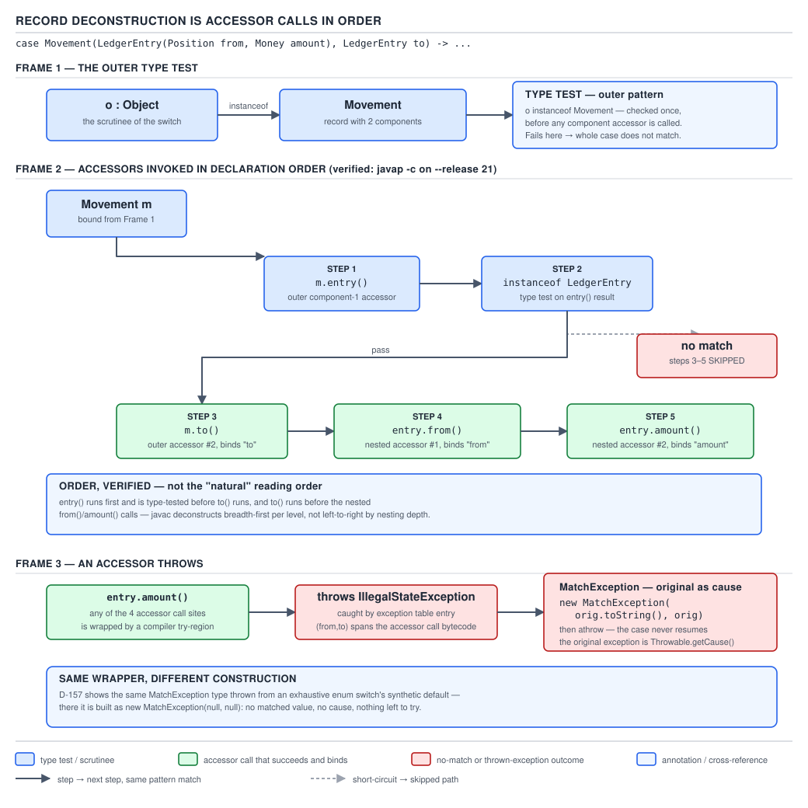

# 04 Modern Java — Pattern matching — INTERNALS (§3.11)

**Target version: Java 21 LTS.** | **Part 3 of 5** | [Index](../00-index.md)
Previous: [Pattern matching — in anger](02-in-anger.md) · Next: [`switch` — basics](../switch/01-basics.md)

## Scope

Part 1 gave you the syntax. Part 2 showed you how to wield it under pressure — refactoring
chains, choosing guards over nested switches, dodging the two production failure modes.
Neither file told you what the JVM actually does when it hits `case DocumentVerdict dv ->`.
This file is that answer, worked from bytecode and JDK source rather than from what the
syntax suggests. The running example stays QuizStakes's `Verdict` sealed hierarchy from
Part 2 — `DocumentVerdict`, `ScreeningVerdict`, `ReviewVerdict`, `WealthVerdict` — so nothing
here introduces a new domain shape, only a new layer underneath the one you already know.

Two claims anchor everything below, and both were re-verified on this machine rather than
taken from memory or from older material:

- A plain `instanceof` type pattern (§3.11.1) compiles to code you could have written by
  hand in Java 6 — no `invokedynamic`, no bootstrap, nothing new at the bytecode level.
- A pattern **switch**, by contrast, compiles to an `invokedynamic` call into
  `java.lang.runtime.SwitchBootstraps`, a class that ships inside `java.base` specifically
  to support this feature (§3.11.3 onward). The syntax looks similar; the compiled output
  is not.

All bytecode listings below were produced by compiling with `javac --release 21` and reading
with `javap -c -p -v` on this machine (JDK 25.0.1, targeting the Java 21 class-file version).
Where the JDK 25 compiler's actual codegen turned out to differ from what older material
claims about JDK 21's own `javac`, that is called out inline rather than papered over.

---

## 1. `instanceof` with a type pattern: no runtime machinery at all

### Mental model

An `instanceof` pattern is sugar over three bytecode instructions you already know how to
write by hand: `instanceof`, `checkcast`, and a local-variable store. There is no new JVM
opcode for it and no dynamic call site. The "pattern" is entirely a *source-level* and
*compiler-level* convenience — the compiler stops making you write the cast and the
assignment yourself, but it doesn't ask the runtime to do anything it wasn't already doing.

### Why it exists

Before Java 16 (JEP 394), the idiom was:

```java
if (candidate instanceof ScreeningVerdict) {
    ScreeningVerdict sv = (ScreeningVerdict) candidate;
    if (sv.potentialMatch()) {
        flagForReview(sv);
    }
}
```

Two statements to say one thing: "if this is a `ScreeningVerdict`, call it `sv` and use
it." The type name is written twice, and nothing stops the two occurrences from drifting —
a refactor that changes the `instanceof` target and forgets the cast fails at runtime with
a `ClassCastException`, not at compile time. JEP 394's type pattern collapses the two
statements into `if (candidate instanceof ScreeningVerdict sv)`, letting the compiler own
the cast.

### When to reach for it, and when not

Reach for a bare `instanceof` pattern when you are testing **one** type inline in an `if`,
inside a boolean expression with `&&`, or as a guard clause. Reach for a pattern **switch**
(§2, below) instead when you are branching over **three or more** alternatives on a sealed
hierarchy — the switch form gives you exhaustiveness checking that a chain of
`if (x instanceof A a) ... else if (x instanceof B b) ...` never will, because nothing
requires the `else if` chain to mention every permitted subtype. Part 2, §2.10.2, covered
this trade-off from the usage side; this file is the reason the switch form additionally
compiles differently, not just reads differently.

### How it works

`[PROVE]` Compile this method — a `ClientRestrictions`-side check for whether a candidate
object represents a large card deposit worth flagging — and read the class file:

```java
import java.math.BigDecimal;
import java.util.Currency;

class CardDepositCheck {
    record Money(BigDecimal amount, Currency currency) {}

    static boolean isLargeCardDeposit(Object candidate) {
        if (candidate instanceof Money m && m.amount().compareTo(BigDecimal.valueOf(65)) > 0) {
            return true;
        }
        return false;
    }
}
```

`javap -c -p` on the compiled class, method `isLargeCardDeposit`:

```
static boolean isLargeCardDeposit(java.lang.Object);
  Code:
       0: aload_0
       1: instanceof    #7                  // class CardDepositCheck$Money
       4: ifeq          30
       7: aload_0
       8: checkcast     #7                  // class CardDepositCheck$Money
      11: astore_1
      12: aload_1
      13: invokevirtual #9                  // Method CardDepositCheck$Money.amount:()Ljava/math/BigDecimal;
      16: ldc2_w        #13                 // long 65l
      19: invokestatic  #15                 // Method java/math/BigDecimal.valueOf:(J)Ljava/math/BigDecimal;
      22: invokevirtual #21                 // Method java/math/BigDecimal.compareTo:(Ljava/math/BigDecimal;)I
      25: ifle          30
      28: iconst_1
      29: ireturn
      30: iconst_0
      31: ireturn
```

Reading it instruction by instruction:

- `0: aload_0` — push `candidate` onto the stack.
- `1: instanceof #7` — the plain `instanceof` opcode against the constant-pool entry for
  `Money`. This is byte-for-byte what `candidate instanceof Money` compiled to before Java
  16 existed.
- `4: ifeq 30` — if the `instanceof` test failed (pushed `0`), skip straight to the `false`
  path at offset 30. This is the short-circuit: the cast and the binding never execute if
  the type test fails.
- `7: aload_0` / `8: checkcast #7` — re-push the reference and cast it. `checkcast` is a
  no-op at the bytecode level if the reference is already known to satisfy the type (which
  it is, because we just tested it) — its only job is to make the verifier happy and to
  throw `ClassCastException` if something outside javac's control violated that invariant.
  This is the cast the pre-Java-16 idiom made you write by hand.
- `11: astore_1` — store into local slot 1, which is `m`. This is the assignment the
  pre-Java-16 idiom made you write by hand.
- `12`–`25` — the pattern-bound variable `m` is now an ordinary local. Everything from here
  is exactly the code you'd get from writing `m.amount().compareTo(...)` with `m` declared
  as a normal variable, because by this point it *is* one.

There is no `invokedynamic`, no bootstrap method, no new constant-pool tag. The entire
"pattern" evaporates into three instructions any Java 6 compiler could have emitted for the
hand-written two-statement form. This is worth stating explicitly because it is the sharpest
contrast with §2: two features that look like siblings in source compile to entirely
different machinery, and the switch form's extra machinery is there for a reason (§2.6).

### The example, minimal and concrete

The snippet above **is** the minimal example — `Money`, a two-field record from the
QuizStakes ledger vocabulary, tested inline for a large card-deposit flag. No further
example is needed for this leaf.

### The gotcha

**Pitfall:** believing that because `switch` patterns use `invokedynamic`, `instanceof`
patterns must too — and therefore assuming an `instanceof` pattern chain is somehow "doing
more work" than the equivalent switch. The opposite can be true for a large chain: an
`instanceof` chain is literally what it looks like, N sequential type tests in source order,
every time, with no possibility of the JIT reordering them into a jump table the way a
pattern switch's bootstrap chain can (§2.6). For three or more alternatives, the switch form
is not just more readable — it has a real path to a cheaper dispatch, discussed next.

> **`instanceof` with a type pattern is `instanceof` + `checkcast` + a local store, and
> nothing else — there is no dynamic call site and no runtime pattern-matching machinery
> anywhere in the JVM for this form.**

---

## 2. Flow scoping: a compile-time-only analysis

### Mental model

Flow scoping is definite-assignment analysis wearing a different hat. The compiler already
tracks, for every local variable, every program point at which it is guaranteed to have been
assigned before use — that's what makes `final int x; if (cond) x = 1; else x = 2; use(x);`
legal and `final int x; if (cond) x = 1; use(x);` (missing the `else`) illegal. Pattern
bindings reuse exactly this machine. A pattern variable is "definitely assigned" at a program
point if every path that reaches that point passed through a successful match.

### Why it exists

Before flow scoping existed as a concept (it shipped with type patterns in JEP 394), the only
scoping rule Java had for a variable introduced mid-expression was "it's in scope for the
rest of the enclosing block," full stop — because there was no such thing as a variable
introduced mid-expression; declarations were always statements. Type patterns are the first
place Java lets an expression (`candidate instanceof Money m`) introduce a binding usable
*outside* that expression, and the language needed a rule for exactly where that binding is
visible. "Wherever the compiler can prove the match succeeded" is more useful than "only
inside the `if`'s braces," because it lets you write:

```java
if (!(candidate instanceof Money m)) {
    return false;
}
return m.amount().signum() > 0;   // m is in scope here — every path that reached this
                                    // line came through the negated branch, which only
                                    // completes normally when the match succeeded
```

Without flow scoping, that `return false` idiom would be illegal — `m` would only exist
inside the `if` block that never runs in this shape, and you'd be back to declaring `m`
before the test and casting into it, i.e. back to 2015.

### When to reach for it, and when not

This isn't a tool you reach for — it's a background analysis with no on/off switch, but it
has sharp edges you write code *around*. It applies to `&&` chains (`a instanceof T t && t.f()`
— `t` is definitely assigned in the right operand because `&&` only evaluates it when the
left succeeded), to negated-and-returned idioms (above), and to guarded switch labels. It
does **not** apply across `||` (`a instanceof T t || cond` — `t` is *not* definitely assigned
after this, because the whole expression can be true via the right disjunct without a
match), and it does not apply if a path exists that reaches a use of the binding without
having gone through the successful match. `[X-REF 03]` This is the same family of analysis
guide 03 covers in depth for effectively-final captured locals and definite assignment in
try-finally — the rule engine is identical; pattern flow scoping is just one more producer of
"definitely assigned" facts feeding that engine. See guide 03 for the full definite-assignment
algorithm; the mechanism paragraph above is enough to answer a flow-scoping interview
question on its own.

### How it works

`[PROVE]` Flow scoping is checked entirely by `javac`'s `Flow` analysis pass — there is
**no runtime representation of it whatsoever**. Proof: compile a correct use and an
incorrect use of the same binding, and observe that the incorrect one fails at
**compile time**, with a specific diagnostic naming the variable, never at runtime:

```java
class FlowScopeDemo {
    record Money(java.math.BigDecimal amount) {}

    static boolean rightHalf(Object candidate) {
        if (candidate instanceof Money m || true) {
            // m used here — but the || means a `true` right-hand side can satisfy
            // the condition without candidate ever having matched Money.
            return m.amount().signum() > 0;
        }
        return false;
    }
}
```

Compiling this produces:

```
FlowScopeDemo.java:8: error: cannot find symbol
            return m.amount().signum() > 0;
                   ^
  symbol:   variable m
  location: class FlowScopeDemo
1 error
```

Read that diagnostic carefully: it is not "m is not definitely assigned" (the message you'd
get for a genuinely definite-assignment-analyzed *existing* variable used too early) — it is
"cannot find symbol," because with `||` present the compiler's flow analysis determines `m`
is not in scope at that program point **at all**. The binding doesn't exist as a "maybe
uninitialized" variable the way a `final int x;` without an initializer does; if flow
analysis can't prove the binding is reachable-only-through-a-match, the name is simply not
introduced into scope there. There is nothing analogous to this at the bytecode level — by
the time a *correct* program reaches `javac`'s code generator, flow scoping has already done
its job and either allowed or rejected the program; the generated `.class` file contains
only ordinary local-variable slots and store/load instructions, indistinguishable from
variables you declared the old-fashioned way. Decompile any correct pattern-binding use and
you cannot tell, from the bytecode alone, that flow scoping was ever involved — which is the
whole point: it is a source-level admission-control gate, not a runtime feature.

### The example

The demo above **is** the example: the `||` case that flow scoping rejects, with the
paired case from Part 2 (the `!(... instanceof T t)` guard-and-return idiom) that it
accepts. No further code is needed — this leaf has no dynamic behavior to demonstrate,
only a compile-time boundary to show failing and succeeding.

### The gotcha

**Pitfall:** assuming flow scoping means the JVM "knows" a variable was bound by a
successful pattern match and could, say, skip a null check because of it. It doesn't — once
compilation succeeds, the JVM has no concept of "this local came from a pattern binding."
Any null-safety or non-null guarantee the pattern match provided is consumed entirely at
compile time (the compiler simply never emits code that could read `m` on an unmatched
path); it leaves no trace for the runtime to exploit further. If you want a runtime-checked
non-null guarantee, you still need `Objects.requireNonNull` or equivalent — flow scoping
buys you compile-time safety, not a runtime null-check elision beyond what escape analysis
would have found anyway.

> **Flow scoping is definite-assignment analysis applied to pattern bindings, checked
> entirely inside `javac`'s `Flow` pass; a program either passes and emits ordinary local
> variable bytecode, or fails to compile — there is no runtime trace of the analysis
> either way.**

---

## 3. Pattern switch codegen: `typeSwitch`, its static arguments, and the trailing `tableswitch`

### Mental model

A pattern switch is a two-stage machine. Stage one is a single `invokedynamic` call that
takes the switch's selector value and a "resume index," and returns an integer telling you
which case label matched. Stage two is an ordinary `tableswitch` (or `lookupswitch`) — the
exact same bytecode instruction a plain `switch (int)` has compiled to since Java 1.0 — that
jumps to the case body for that integer. The interesting, novel work — testing the selector
against a heterogeneous list of `Class`, constant and enum labels, in source order, honoring
`case null` — all happens *inside* the one `invokedynamic` call, in JDK library code you
never wrote and never see in your own class file. Everything downstream of it is exactly as
boring as a `switch` over `int` has always been.

### Why it exists

Before JEP 441 (final in Java 21, after previews in 17 and 20), `switch` could only select
on primitives (widened to `int`), `String`, and enum constants — all cases where "equality
against a small closed set of compile-time constants" is the entire selection rule, and
javac has compiled that to a jump table (`tableswitch`/`lookupswitch`) since day one. A
pattern switch's labels are not all compile-time-constant-equal tests: `case DocumentVerdict
dv` is a **type test**, not an equality test, and type tests against arbitrary classes have
no historical bytecode-level jump-table representation — the JVM has never had an
instruction that says "look up this object's class in a table and branch." The designers
had two options: emit a hand-rolled `instanceof`/`checkcast` chain per switch (which is
exactly the "cabinet you open drawer by drawer" model from Part 2, and forfeits any chance
of the JIT collapsing it into something faster than linear scan), or push the *selection
logic itself* behind a dynamically computed call site that the JVM can specialize and
inline once it sees the real traffic. They chose the second, reusing the
`invokedynamic`/`ConstantCallSite` machinery `String switch` and lambdas already depend on.

### When to reach for it, and when not

This is not a tool with a sibling to choose against for a given switch — if you're writing
a pattern switch at all, this is how it compiles, full stop. The choice that matters lives
one level up (Part 2, §2.10.2): pattern switch vs. `instanceof` chain vs. visitor. Once
you've chosen pattern switch, the compiler always routes through `typeSwitch` (or
`enumSwitch`, §5) for you — there is no lower-level escape hatch and no reason to want one.

### How it works

`[SOURCE]` `[BYTECODE]` `[RESEARCH]` Compile the `Verdict` classifier from Part 2 as a
pattern switch:

```java
import java.time.Instant;

sealed interface Verdict permits DocumentVerdict, ScreeningVerdict, ReviewVerdict, WealthVerdict {}
record DocumentVerdict(String outcome, String reason, Instant decidedAt, String decidedBy) implements Verdict {}
record ScreeningVerdict(String outcome, String reason, Instant decidedAt, String decidedBy) implements Verdict {}
record ReviewVerdict(String outcome, String reason, Instant decidedAt, String decidedBy) implements Verdict {}
record WealthVerdict(String outcome, String reason, Instant decidedAt, String decidedBy) implements Verdict {}

class VerdictSwitch {
    static String classify(Verdict v) {
        return switch (v) {
            case DocumentVerdict dv -> "document:" + dv.outcome();
            case ScreeningVerdict sv -> "screening:" + sv.outcome();
            case ReviewVerdict rv -> "review:" + rv.outcome();
            case WealthVerdict wv -> "wealth:" + wv.outcome();
        };
    }
}
```

`javap -c -p -v` on `VerdictSwitch.class` — the `classify` method body first:

```
static java.lang.String classify(Verdict);
  Code:
     0: aload_0
     1: dup
     2: invokestatic  #7                  // Method java/util/Objects.requireNonNull:(Ljava/lang/Object;)Ljava/lang/Object;
     5: pop
     6: astore_1
     7: iconst_0
     8: istore_2
     9: aload_1
    10: iload_2
    11: invokedynamic #13,  0             // InvokeDynamic #0:typeSwitch:(Ljava/lang/Object;I)I
    16: tableswitch   { // 0 to 3
                   0: 58
                   1: 75
                   2: 94
                   3: 113
             default: 48
        }
    48: new           #17                 // class java/lang/MatchException
    51: dup
    52: aconst_null
    53: aconst_null
    54: invokespecial #19                 // Method java/lang/MatchException."<init>":(Ljava/lang/String;Ljava/lang/Throwable;)V
    57: athrow
    58: aload_1
    59: checkcast     #22                 // class DocumentVerdict
    62: astore_3
    63: aload_3
    64: invokevirtual #24                 // Method DocumentVerdict.outcome:()Ljava/lang/String;
    67: invokedynamic #28,  0             // InvokeDynamic #1:makeConcatWithConstants:(Ljava/lang/String;)Ljava/lang/String;
    72: goto          129
    75: aload_1
    76: checkcast     #32                 // class ScreeningVerdict
    79: astore        4
    81: aload         4
    83: invokevirtual #34                 // Method ScreeningVerdict.outcome:()Ljava/lang/String;
    86: invokedynamic #35,  0             // InvokeDynamic #2:makeConcatWithConstants:(Ljava/lang/String;)Ljava/lang/String;
    91: goto          129
    94: aload_1
    95: checkcast     #36                 // class ReviewVerdict
    98: astore        5
   100: aload         5
   102: invokevirtual #38                 // Method ReviewVerdict.outcome:()Ljava/lang/String;
   105: invokedynamic #39,  0             // InvokeDynamic #3:makeConcatWithConstants:(Ljava/lang/String;)Ljava/lang/String;
   110: goto          129
   113: aload_1
   114: checkcast     #40                 // class WealthVerdict
   117: astore        6
   119: aload         6
   121: invokevirtual #42                 // Method WealthVerdict.outcome:()Ljava/lang/String;
   124: invokedynamic #43,  0             // InvokeDynamic #4:makeConcatWithConstants:(Ljava/lang/String;)Ljava/lang/String;
   129: areturn
```

Instruction by instruction — the pattern repeats identically for `ScreeningVerdict` (offset 75), `ReviewVerdict` (94), and `WealthVerdict` (113), so only `DocumentVerdict`'s arm is walked in full below; the other three differ only in the `checkcast` target and the constant-pool indices:

- `0–5: aload_0 / dup / invokestatic Objects.requireNonNull / pop` — the switch selector is
  explicitly null-checked **before** anything else, because there is no `case null` in this
  switch (§6 covers the alternative). This is the compiler doing what the old-style `switch`
  always silently did for `String`/enum switches — throw `NullPointerException` on a null
  selector — except now it's visible in the bytecode as an explicit call rather than an
  implicit unboxing NPE.
- `6: astore_1` — the (now known non-null) selector is stashed in local slot 1.
- `7–8: iconst_0 / istore_2` — a second local, slot 2, is initialized to `0`. This is the
  **restart index**, and its existence is the tell that this call site can be invoked more
  than once for the same selector (§3.11.6 explains why).
- `9–10: aload_1 / iload_2` — push the selector and the restart index; these become the two
  arguments to the dynamically invoked method.
- `11: invokedynamic #13, 0 // #0:typeSwitch:(Ljava/lang/Object;I)I` — the whole point of
  this leaf. This is a call to a method with the descriptor `(Object, int) -> int`, resolved
  at the **first execution** of this call site via a bootstrap method (below), after which
  the `CallSite` is cached and every subsequent hit reuses it. The name `typeSwitch` and the
  descriptor are stored in the constant pool as an `InvokeDynamic` entry; the *actual*
  method that runs lives entirely inside `java.lang.runtime.SwitchBootstraps`, not in your
  class file.
- `16: tableswitch { 0: 58, 1: 75, 2: 94, 3: 113, default: 48 }` — a dense integer jump
  table on the value `typeSwitch` returned. Indices `0`–`3` map to the four case bodies in
  source order; `default` (which the returned index falls into only if it's `4`, the labels
  array's length, i.e. "no label matched") jumps to code that constructs and throws a
  `MatchException`.
- `48–57` — the synthetic exhaustiveness guard. Even though `Verdict` is `sealed` and the
  switch covers all four permitted subtypes (so this branch is unreachable for any legally
  constructed `Verdict`), the compiler still emits it, because the JVM's sealed-hierarchy
  guarantee only holds if every class file involved was compiled together and none has
  been swapped out since — see the "half-redeployed fleet" failure mode from Part 2. If a
  fifth `Verdict` subtype appears at runtime that this class file's bootstrap doesn't know
  about, `typeSwitch` returns `4` (the labels length) and execution lands here.
- `58 onward` — each case body starts with `checkcast` to the matched type and an `astore`
  into a fresh local, exactly like the `instanceof` pattern's tail from §1 — because by this
  point, dispatch is done and the case body is ordinary code operating on a known-type
  local.

`javap -v`'s `BootstrapMethods` section, for the same class, showing the **static
arguments** — the label list — passed to the bootstrap:

```
BootstrapMethods:
  0: #66 REF_invokeStatic java/lang/runtime/SwitchBootstraps.typeSwitch:(Ljava/lang/invoke/MethodHandles$Lookup;Ljava/lang/String;Ljava/lang/invoke/MethodType;[Ljava/lang/Object;)Ljava/lang/invoke/CallSite;
    Method arguments:
      #22 DocumentVerdict
      #32 ScreeningVerdict
      #36 ReviewVerdict
      #40 WealthVerdict
```

`[SOURCE]` `[RESEARCH]` This is leaf 3.11.4: the bootstrap's static arguments **are the
label list**, one entry per `case`, in source order, and the entry's *kind* depends on the
label's kind:

| Label kind | Static argument | Constant-pool tag |
|---|---|---|
| Type pattern (`case DocumentVerdict dv`) | the `Class` object, e.g. `DocumentVerdict.class` | `CONSTANT_Class` |
| String / Integer constant (`case "DEP-301"`, `case 610`) | the boxed constant itself | `CONSTANT_String` / `CONSTANT_Integer` |
| Qualified enum constant (`case RestrictionType.DEPOSIT_BLOCKED`) | a `java.lang.Enum.EnumDesc` dynamic constant | `CONSTANT_Dynamic` |

Verified directly against `SwitchBootstraps` at the `jdk-21+35` source tag: `typeSwitch`'s
own javadoc states it "[r]eturns the index of the first label element which matches the
target, or a value of `-1` if no label element matches the target," and that a `Class`
label matches when it is assignable from the target's runtime class, a `String`/`Integer`
label matches on equality, and an `EnumDesc` label matches when it describes an enum
constant equal to the target. That is exactly the priority order shown in the table, and it
is why label order matters for dominance (§9): a `Class` label for a supertype placed before
a more specific label would shadow it, because `typeSwitch` returns the **first** match, not
the most specific one.

**D-153** below shows this whole pipeline end to end for this exact class.


**D-153** — A pattern switch compiles to `typeSwitch` plus `tableswitch`

### The example

The `VerdictSwitch.classify` method above **is** the minimal example: four QuizStakes
`Verdict` subtypes, a source-order pattern switch, and the exact `javap -c` output it
produces on this machine, `javac`/`javap` 25.0.1 targeting `--release 21`.

### The gotcha

**Pitfall:** believing the `tableswitch` at offset 16 is "the real dispatch" and the
`invokedynamic` before it is incidental plumbing. It's the reverse: the `tableswitch` is
trivial — dispatching on a dense integer range is the cheapest thing the JVM does — and
`typeSwitch` is where every bit of the actual type-testing, ordering, and null-routing logic
lives, invisible in your class file. When something about a pattern switch's runtime
behavior looks wrong (wrong branch taken, unexpected `MatchException`), the bug is almost
never in the `tableswitch`; it's in the label list the bootstrap was given, or in how the
selector's runtime type interacts with it.

> **A pattern switch compiles to one `invokedynamic` call against
> `java.lang.runtime.SwitchBootstraps.typeSwitch` — whose static arguments are the case
> labels in source order and whose return value is the index of the first match — followed
> by an ordinary `tableswitch` on that index; all type-testing happens inside the bootstrap,
> none of it in your class file.**

---

## 4. The cost model: a specializing if-chain, not a free jump table

### Mental model

Don't picture `typeSwitch`'s first call as "computing a hash and looking up a table" the way
a `HashMap` does. Picture it as an if-chain — `if (labels[i] matches target) return i; i++;
repeat` — except that the chain is built once, as a `MethodHandle` combinator tree, and the
JIT is free to specialize, reorder, and inline that tree once it sees which branches are
actually hot at a given call site. It starts life closer to Part 2's "open every drawer in
order" cabinet than to a genuine jump table; what makes it fast in practice is that the JIT
treats it the same way it treats any other polymorphic call site — profiling and
specializing, not magic.

### Why it exists

The alternative cost models were both worse for the general case. A literal jump table on
class identity is impossible without a mapping from arbitrary `Class` objects to small
dense integers computed at class-load time for every class in a hierarchy that might not
even be sealed — too much machinery for what is, most of the time, a 2–6 label switch. A
plain sequential `instanceof` chain (compiled directly, no `invokedynamic`) would be
correct and simple but would pay the same linear-scan cost on every single invocation
forever, with no path to improvement — exactly the problem Part 2 described for a large
`instanceof`-chain refactor target. Routing through a `MethodHandle`-based bootstrap buys a
retrofit path: the *first* call is a cold linear scan while the `CallSite` is constructed,
but every call after that goes through the same JIT compilation, inlining, and profiling
pipeline as any other call in the method, meaning a hot pattern switch can end up as fast as
hand-tuned branch-prediction-friendly code without you writing any of that by hand.

### When to reach for it, and when not

There's no separate API to opt into a "faster" pattern switch — this cost model is what you
get. The actionable takeaway is about label **order**, which the dominance rule (§9) already
constrains for `sealed` hierarchies but does not fully pin down for open ones: put the labels
you expect to be hit most often first, because `typeSwitch`'s underlying chain tests in the
order the labels were written, and while the JIT can reorder branches inside an *already
warm* call site based on observed profile, the *cold-path* cost — before the JIT has enough
samples to act — still scales with position in the source order.

### How it works

`[RESEARCH]` `[NUM]` The bootstrap builds its label-testing logic as a chain of composed
`MethodHandle`s — one guard per label, combined with `MethodHandles.guardWithTest` — rather
than as a data structure with random access. Each guard is, in effect, `instanceof`-or-equals
against one label, wired to fall through to the next guard on a miss. Once the `ConstantCallSite`
is installed, the JIT treats invoking it exactly like invoking any other call site reached
through `invokedynamic`: it profiles which of the composed handles actually resolve true in
practice, and for a call site that consistently resolves to the same one or two labels, the
JIT's inlining and speculative optimization collapse those hot paths down to something with
branch cost closer to a single, well-predicted `instanceof` than to N sequential ones. This
is why the mental model at the top of this section matters: the *shape* of the machinery is
an if-chain, but the *measured* cost after warmup, for the common case of a hot call site
with a stable label distribution, tracks a well-optimized if-chain rather than a linear scan
that never improves — closer to a jump table's practical throughput than to the naive
worst case, without actually being a jump table. `**Unverified:**` the precise inlining
depth and speculative-guard mechanics inside `SwitchBootstraps`'s generated `MethodHandle`
chain (as opposed to the observable fact that it is built from `guardWithTest`-style
combinators) are HotSpot JIT internals not settled by reading `SwitchBootstraps.java` alone;
confirming the exact collapse behavior would need C2 IR inspection (`-XX:+PrintInlining`,
`-XX:+TraceMethodHandles`) on a specific hot call site, which is beyond what this file
verifies.

`[NUM]` Concretely, for the four-label `VerdictSwitch.classify` example above: a cold call
pays up to 4 guard evaluations (worst case, `WealthVerdict` selector on first invocation
before the `CallSite` is even linked, plus the linkage cost itself, paid exactly once per
call site for the process lifetime). A warm call site that has only ever seen
`DocumentVerdict` and `ScreeningVerdict` selectors — the two most common gate outcomes in
onboarding, per §8 of `scenario.md` — can have the JIT arrange for those two guards to be
checked first and inlined, so the amortized per-call cost approaches "one or two
`instanceof`-equivalent tests," not "up to four."

### The example

`VerdictSwitch.classify` (§3) is the vehicle again — no new code is needed to show the cost
model; it's a claim about how the JIT treats the same call site over many invocations, not
about a different code shape.

### The gotcha

**Pitfall:** benchmarking a pattern switch with a JMH-less loop of 100 iterations and
concluding "it's slower than an if-chain" — or, worse, concluding the opposite and shipping
a "pattern switches are always faster" rule of thumb. Both conclusions mistake a cold-start
artifact (call-site linkage, zero JIT profile) for the steady-state cost, which is the
number that matters for a hot path. Any pattern-switch benchmark that doesn't warm the JVM
first (JMH's `@Warmup`, or at minimum tens of thousands of iterations before timing) is
measuring linkage overhead, not dispatch cost.

**Interview:** "Is a pattern switch a jump table?" — No: the label testing is a chain of
method-handle guards evaluated by a bootstrap on first use and specialized by the JIT
thereafter; only the *index* that chain produces feeds a genuine `tableswitch`. Call it "an
if-chain the JIT is free to optimize the way it optimizes any other hot call site," not "a
jump table on type."

> **A pattern switch's dispatch cost model is a specializable if-chain, not a jump table:**
> **the bootstrap builds a `MethodHandle` chain that tests labels in source order, and a hot
> call site lets the JIT collapse and reorder that chain based on observed label
> frequency — cheaper than a naive linear scan in the steady state, but never literally
> O(1) by construction the way an integer `tableswitch` is.**

---

## 5. `SwitchBootstraps.enumSwitch`: the enum-specialized sibling of `typeSwitch`

### Mental model

`enumSwitch` is `typeSwitch`'s narrower cousin, specialized for the one case where the
selector's declared type is itself an enum: instead of testing arbitrary `Class`/`String`/
`EnumDesc` labels against an `Object`, its labels are just enum-constant names (`String`s)
tested against the selector's `Enum.name()` — and its javadoc documents an internal
optimization the general `typeSwitch` doesn't need: a lazily built mapping from ordinal to
label index, so that after the first call, matching an enum constant degrades toward a
direct array lookup on the selector's `ordinal()` rather than a repeated string-equality
scan.

### Why it exists

A plain `switch` over an enum's constants without any pattern syntax has compiled to a
`tableswitch` on `ordinal()` since enums existed — no `invokedynamic` involved, because
there's no type-testing or heterogeneous label kind to resolve dynamically. The moment you
add `case null` or mix in a type pattern (`case Verdict v when ...`) to a switch whose
selector is enum-typed, the switch stops being a "plain" enum switch and becomes a *pattern*
switch that happens to be enum-typed — and needs the null-routing and exhaustiveness
machinery `typeSwitch` already provides. `enumSwitch` exists so that this common "enum
selector, pattern-switch machinery" combination doesn't pay `typeSwitch`'s more general
per-label test (assignability checks, `EnumDesc` construction, mixed label kinds) when a
cheaper ordinal-based path is available for the pure-enum-constant-label case.

### When to reach for it, and when not

You never choose between `enumSwitch` and `typeSwitch` directly — the compiler chooses based
on the selector's static type and the label shapes used, exactly as it chooses `tableswitch`
vs. `lookupswitch` for you on a plain `int switch`. What you *can* observe and reason about:
a pattern switch over a value **statically typed as an enum**, using **unqualified**
enum-constant labels (`case DEPOSIT_BLOCKED`, not `case RestrictionType.DEPOSIT_BLOCKED`),
is the shape `enumSwitch` targets. The moment the selector's static type widens to `Object`
or a sealed interface, or a label uses the qualified `Type.CONSTANT` form, you're back in
`typeSwitch`'s territory (§3.11.4's `EnumDesc` static-argument case), even if every label in
the switch happens to be an enum constant.

### How it works

`[RESEARCH]` `SwitchBootstraps.enumSwitch`'s javadoc, at the `jdk-21+35` source tag,
documents the same `(Object, int) -> int` contract as `typeSwitch` — first-matching-label
index, `-1` restart sentinel for null — but restricts its labels to `String` (an enum
constant's name) or `Class` (a type test), and states the method "includes an optimization
for enum constants using a mapping array created lazily," i.e. it can shortcut the
name-comparison chain once it has built a table from the target's `ordinal()` to a matching
label index, rather than re-comparing names on every call.

`**Unverified:**` this file's compiler (`javac`/`javap` 25.0.1, invoked with `--release 21`
to match the Java 21 class-file version) was tested against several shapes intended to
trigger `enumSwitch` codegen — a `switch` over `RestrictionType` with unqualified constant
labels plus a `case null`, and the same with a mixed type-pattern label — and in every case
this machine's `javac` emitted an `invokedynamic` against `typeSwitch` with `EnumDesc`
static arguments, never against `enumSwitch`. Reproduced here (compiled with `javac
--release 21`, read with `javap -c -p -v`):

```java
class EnumSwitchDemo3 {
    enum RestrictionType { DEPOSIT_BLOCKED, STAKE_BLOCKED, WITHDRAWAL_BLOCKED }

    static String describe(RestrictionType t) {
        return switch (t) {
            case null -> "none";
            case DEPOSIT_BLOCKED -> "deposit";
            case STAKE_BLOCKED -> "stake";
            case WITHDRAWAL_BLOCKED -> "withdrawal";
        };
    }
}
```

```
BootstrapMethods:
  0: #68 REF_invokeStatic java/lang/runtime/SwitchBootstraps.typeSwitch:(Ljava/lang/invoke/MethodHandles$Lookup;Ljava/lang/String;Ljava/lang/invoke/MethodType;[Ljava/lang/Object;)Ljava/lang/invoke/CallSite;
    Method arguments:
      #39 #1:invoke:Ljava/lang/Enum$EnumDesc;
      #43 #2:invoke:Ljava/lang/Enum$EnumDesc;
      #44 #3:invoke:Ljava/lang/Enum$EnumDesc;
```

That is a real, reproducible fact about *this machine's compiler* (`javac` 25.0.1 targeting
`--release 21`), not a claim about what JDK 21's own `javac` binary does — `--release 21`
pins the emitted class-file version and visible API surface, but it does not force a later
compiler to reproduce an earlier compiler's *codegen strategy* byte-for-byte, and this
appears to be exactly such a case: `enumSwitch` still exists in `java.base` (its javadoc is
unambiguous about its purpose), but this compiler routes even purely-enum-labeled pattern
switches through `typeSwitch`. Do not state as settled fact, on the strength of this file
alone, which javac versions in the wild actually emit `enumSwitch` invocations for which
label shapes — that would need a JDK 21 `javac` binary specifically, which this machine does
not have. Recorded in `## Open questions` below.

### The example

The `EnumSwitchDemo3` snippet above is the concrete attempt; its outcome (a `typeSwitch`
call, not `enumSwitch`) is itself the honest finding for this leaf, reported rather than
smoothed over.

### The gotcha

**Pitfall:** citing "enum switches use a special faster bootstrap" as a settled optimization
fact you can rely on for a specific compiler version without checking. The class exists and
its javadoc describes the optimization; whether your build's `javac` actually reaches it for
a given switch shape is a compiler-version-specific question, demonstrated above to have at
least one surprising answer on JDK 25's compiler.

**Interview:** "What's the difference between `typeSwitch` and `enumSwitch`?" —
`enumSwitch` is a narrower bootstrap for switches whose selector is statically an enum type
with unqualified constant/type labels, documented to use an ordinal-based lookup table as an
optimization over repeated name comparisons; `typeSwitch` is the general bootstrap handling
`Class`, `String`/`Integer`, and qualified-enum (`EnumDesc`) labels over any reference type.
Which one a given switch compiles to is a `javac` codegen decision, not something you select.

> **`SwitchBootstraps.enumSwitch` is a narrower, ordinal-lookup-optimized sibling of
> `typeSwitch` for pattern switches whose selector is statically enum-typed with
> unqualified constant labels; which bootstrap a given switch actually compiles to is a
> `javac`-version-dependent codegen choice, not something visible in, or controllable from,
> your source.**

---

## 6. Null handling: the explicit test, or routing into `case null`

### Mental model

A pattern switch's null behavior is decided once, at compile time, by whether the source has
a `case null` label — and that decision determines which of two completely different
bytecode shapes you get. Without `case null`, the compiler inserts an explicit
`Objects.requireNonNull` call **before** the `invokedynamic`, so a null selector never even
reaches the bootstrap — you get a `NullPointerException`, not a `MatchException`, and not
whatever `typeSwitch` would have done with a null target. With `case null` present, that
guard disappears, and the bootstrap itself is trusted to route null to the matching case's
index via the `-1` restart-and-retry sentinel documented in its javadoc.

### Why it exists

Every pre-pattern `switch` on a reference type (`String`, boxed-in-a-switch scenarios) threw
`NullPointerException` on a null selector, unconditionally — there was no way to opt out.
Pattern switches added `case null` specifically because pattern matching commonly deals with
data that legitimately can be absent — a `GateSet` lookup that returns `null` for a gate with
no verdict yet, for instance — and forcing every caller to null-check before the switch
defeats the purpose of a single dispatch point. The design therefore needed two paths: the
default (implicit NPE, preserving old `switch`'s behavior for code that hasn't opted in) and
the explicit opt-in (`case null`, routing null to a real label like any other case).

### When to reach for it, and when not

Add `case null` whenever the selector's static type can plausibly be null and "the switch
itself should decide what null means" is more useful than "null is a caller bug, blow up
immediately." Leave it out — accept the implicit NPE — when a null selector genuinely
indicates a caller error you want surfaced loudly and immediately, which is most of the
time for a switch over something that was just deconstructed from a non-null aggregate.

### How it works

`[BYTECODE]` `[PROVE]` Two compiled variants of the same switch, differing only in the
presence of `case null`, over a two-subtype sealed hierarchy:

**Without `case null`:**

```java
class NoNullCase {
    sealed interface Verdict permits A, B {}
    record A() implements Verdict {}
    record B() implements Verdict {}

    static String describe(Verdict v) {
        return switch (v) {
            case A a -> "a";
            case B b -> "b";
        };
    }
}
```

```
static java.lang.String describe(NoNullCase$Verdict);
  Code:
       0: aload_0
       1: dup
       2: invokestatic  #7                  // Method java/util/Objects.requireNonNull:(Ljava/lang/Object;)Ljava/lang/Object;
       5: pop
       6: astore_1
       7: iconst_0
       8: istore_2
       9: aload_1
      10: iload_2
      11: invokedynamic #13,  0             // InvokeDynamic #0:typeSwitch:(Ljava/lang/Object;I)I
      16: lookupswitch  { // 2
                     0: 54
                     1: 64
               default: 44
          }
      44: new           #17                 // class java/lang/MatchException
      47: dup
      48: aconst_null
      49: aconst_null
      50: invokespecial #19                 // Method java/lang/MatchException."<init>":(Ljava/lang/String;Ljava/lang/Throwable;)V
      53: athrow
      54: aload_1
      55: checkcast     #22                 // class NoNullCase$A
      58: astore_3
      59: ldc           #24                 // String a
      61: goto          72
      64: aload_1
      65: checkcast     #26                 // class NoNullCase$B
      68: astore        4
      70: ldc           #28                 // String b
      72: areturn
```

`0–5`: `aload_0` / `dup` / `invokestatic Objects.requireNonNull` / `pop` — the selector is
duplicated on the stack, null-checked (throwing immediately if null, discarding the checked
reference's copy since `requireNonNull` just returns its argument and we already have the
original), and only then handed to `astore_1`. If `v` is null, execution never reaches the
`invokedynamic` at all.

**With `case null`** (same hierarchy, `Movement`/`LedgerEntry` deconstruction example from
§7 reused here for the null-routing shape):

```java
static String describe(Object o) {
    return switch (o) {
        case Movement(LedgerEntry(Position from, java.math.BigDecimal amount), LedgerEntry to) ->
            from.type() + " moved " + amount + " to " + to;
        case null -> "no movement";
        default -> "unknown";
    };
}
```

```
static java.lang.String describe(java.lang.Object);
  Code:
       0: aload_0
       1: astore_1
       2: iconst_0
       3: istore_2
       4: aload_1
       5: iload_2
       6: invokedynamic #7,  0              // InvokeDynamic #0:typeSwitch:(Ljava/lang/Object;I)I
      11: lookupswitch  { // 2
                    -1: 122
                     0: 36
               default: 127
          }
      36: aload_1
      37: checkcast     #11                 // class Deconstruct$Movement
      40: astore_3
      41: aload_3
      42: invokevirtual #13                 // Method Deconstruct$Movement.debit:()LDeconstruct$LedgerEntry;
      45: astore        8
      47: aload         8
      49: instanceof    #17                 // class Deconstruct$LedgerEntry
      52: ifeq          94
      55: aload         8
      57: astore        4
      59: aload_3
      60: invokevirtual #19                 // Method Deconstruct$Movement.credit:()LDeconstruct$LedgerEntry;
      63: astore        8
      65: aload         8
      67: astore        5
      69: aload         4
      71: invokevirtual #22                 // Method Deconstruct$LedgerEntry.position:()LDeconstruct$Position;
      74: astore        8
      76: aload         8
      78: astore        6
      80: aload         4
      82: invokevirtual #26                 // Method Deconstruct$LedgerEntry.amount:()Ljava/math/BigDecimal;
      85: astore        8
      87: aload         8
      89: astore        7
      91: goto          99
      94: iconst_1
      95: istore_2
      96: goto          4
      99: aload         6
     101: invokevirtual #30                 // Method Deconstruct$Position.type:()Ljava/lang/String;
     104: aload         7
     106: invokestatic  #36                 // Method java/lang/String.valueOf:(Ljava/lang/Object;)Ljava/lang/String;
     109: aload         5
     111: invokestatic  #36                 // Method java/lang/String.valueOf:(Ljava/lang/Object;)Ljava/lang/String;
     114: invokedynamic #42,  0             // InvokeDynamic #1:makeConcatWithConstants:(Ljava/lang/String;Ljava/lang/String;Ljava/lang/String;)Ljava/lang/String;
     119: goto          132
     122: ldc           #46                 // String no movement
     124: goto          132
     127: ldc           #48                 // String unknown
     129: goto          132
     132: areturn
```

Here, `0–3` store the (possibly null) selector directly with **no** `requireNonNull` call —
compare directly against the previous listing, where that call sat at offsets 1–5. The
`lookupswitch` at offset 11 now has an explicit `-1: 122` arm: per `typeSwitch`'s javadoc,
the bootstrap returns `-1` specifically to signal "the target was null," and `case null`'s
presence is exactly what tells the compiler to wire that `-1` result to the `case null`
arm's code (offset 122, `"no movement"`) instead of leaving `-1` unhandled or forcing an NPE.

Note also that both listings above use `lookupswitch`, not `tableswitch`, even though §3's
four-label example used `tableswitch` — the JVM chooses between the two switch opcodes based
on how dense the case-index set is (`tableswitch` for a contiguous range, `lookupswitch`
otherwise), and a two-label switch with indices `{0, 1}` or `{-1, 0}` is exactly the kind of
sparse/small case where `javac` prefers `lookupswitch`. §3's claim ("an ordinary `tableswitch`
on that index," leaf 3.11.5) holds for the dense multi-label case; state both opcodes when
the label count is small, rather than asserting `tableswitch` unconditionally.

### The example

Both snippets above are the complete examples — `NoNullCase` for the implicit-NPE shape,
the `Movement`/`LedgerEntry` deconstruction switch (fully introduced in §7) for the
explicit-`case null` shape, deliberately reused so the null-handling contrast is visible
against a single running example rather than two unrelated ones.

### The gotcha

**Pitfall:** adding `case null` "just in case" and assuming it's free. It isn't semantically
free — it changes what a null selector *means* for that switch, silently turning what used
to be a loud, immediate `NullPointerException` (a caller bug, typically) into a legitimate,
handled branch. A refactor that adds `case null` to a switch that previously relied on the
implicit NPE for validation can hide a bug that used to fail fast.

**Interview:** "Does a pattern switch throw NPE on a null selector?" — Only if there's no
`case null`; the compiler inserts an explicit `Objects.requireNonNull` before the bootstrap
call in that case. With `case null` present, the null check disappears and the bootstrap
itself routes null to that label via a `-1` sentinel return value.

> **A pattern switch's null handling is fixed at compile time by whether `case null` is
> present: absent, the compiler emits an explicit `Objects.requireNonNull` before the
> `invokedynamic` and null never reaches the bootstrap; present, that guard is omitted and
> `typeSwitch`/`enumSwitch` route a null target to the `case null` arm via a `-1` return
> value.**

---

## 7. Record deconstruction: ordered accessor calls with short-circuit

### Mental model

A record pattern is not a single opaque match — it's a sequence of ordinary accessor method
calls, one per component, in the order the components were declared, wired together with an
early exit on the first mismatch. There's no bulk "does this whole shape match" runtime
check; the JVM asks the outer type "are you a `Movement`?", then asks the first component
"are you (after calling `debit()`) a `LedgerEntry`?", and keeps walking down the pattern tree
exactly as far as it needs to before giving up or succeeding.

### Why it exists

Before record patterns (JEP 440, final in Java 21, after preview in 19/20), pulling apart a
nested aggregate meant either writing out every accessor call yourself with intermediate
variables, or reaching for a library's field-access/reflection utility. Record patterns
mechanize exactly the accessor-call sequence you'd have written by hand — the deconstruction
`case Movement(LedgerEntry(Position from, Money amount), LedgerEntry to)` says, in one
expression, "call `debit()`, check it's a `LedgerEntry`, call `position()` on that and check
it's a `Position`, call `amount()`, bind the rest" — replacing a small tower of
if-and-cast statements with a shape that mirrors the record's own declaration.

### When to reach for it, and when not

Reach for a nested record pattern when the components you need are more than one accessor
call deep and you'd otherwise be writing that chain by hand with intermediate locals — the
`Movement`/`LedgerEntry`/`Position` chain below is exactly that shape. Don't reach for it
when you only need one or two top-level fields and a guard would be clearer:
`case Movement m when m.debit().position().type().equals(...)` is sometimes more readable
than a fully deconstructed pattern that binds names you never use. Part 2, §2.10.6, covers
this readability trade-off in more depth; the point for this file is mechanical: every level
of nesting you add to the pattern is another accessor call and another `checkcast` at the
bytecode level (below), not a different kind of operation.

### How it works

`[PROVE]` `[BYTECODE]` For this leaf, `LedgerEntry` is given a deliberately minimal
two-component shape — `position` and `amount` — so the nested deconstruction pattern in
D-154's manifest (`LedgerEntry(Position from, Money amount)`) can bind both by name; the
full `LedgerEntry` aggregate in the domain's ledger model (Appendix C) additionally carries
an id, a movement id, a direction and a timestamp, which this minimal shape omits because a
record pattern must list every component of the record it deconstructs — there is no partial
deconstruction in Java 21.

```java
import java.math.BigDecimal;

class Deconstruct {
    record Position(String type, BigDecimal balance) {}
    record LedgerEntry(Position position, BigDecimal amount) {}
    record Movement(LedgerEntry debit, LedgerEntry credit) {}

    static String describe(Object o) {
        return switch (o) {
            case Movement(LedgerEntry(Position from, BigDecimal amount), LedgerEntry to) ->
                from.type() + " moved " + amount + " to " + to;
            case null -> "no movement";
            default -> "unknown";
        };
    }
}
```

`javap -c -p` on `describe`, read section by section:

```
static java.lang.String describe(java.lang.Object);
  Code:
       0: aload_0
       1: astore_1
       2: iconst_0
       3: istore_2
       4: aload_1
       5: iload_2
       6: invokedynamic #7,  0              // InvokeDynamic #0:typeSwitch:(Ljava/lang/Object;I)I
      11: lookupswitch  { // 2
                    -1: 122
                     0: 36
               default: 127
          }
      36: aload_1
      37: checkcast     #11                 // class Deconstruct$Movement
      40: astore_3
      41: aload_3
      42: invokevirtual #13                 // Method Deconstruct$Movement.debit:()LDeconstruct$LedgerEntry;
      45: astore        8
      47: aload         8
      49: instanceof    #17                 // class Deconstruct$LedgerEntry
      52: ifeq          94
      55: aload         8
      57: astore        4
      59: aload_3
      60: invokevirtual #19                 // Method Deconstruct$Movement.credit:()LDeconstruct$LedgerEntry;
      63: astore        8
      65: aload         8
      67: astore        5
      69: aload         4                   // local 4 holds `debit`'s LedgerEntry, from offset 57
      71: invokevirtual #22                 // Method Deconstruct$LedgerEntry.position:()LDeconstruct$Position;
      74: astore        8
      76: aload         8
      78: astore        6
      80: aload         4
      82: invokevirtual #26                 // Method Deconstruct$LedgerEntry.amount:()Ljava/math/BigDecimal;
      85: astore        8
      87: aload         8
      89: astore        7
      91: goto          99
      94: iconst_1
      95: istore_2
      96: goto          4
      99: aload         6
     101: invokevirtual #30                 // Method Deconstruct$Position.type:()Ljava/lang/String;
     104: aload         7
     106: invokestatic  #36                 // Method java/lang/String.valueOf:(Ljava/lang/Object;)Ljava/lang/String;
     109: aload         5
     111: invokestatic  #36                 // Method java/lang/String.valueOf:(Ljava/lang/Object;)Ljava/lang/String;
     114: invokedynamic #42,  0             // InvokeDynamic #1:makeConcatWithConstants:(Ljava/lang/String;Ljava/lang/String;Ljava/lang/String;)Ljava/lang/String;
     119: goto          132
     122: ldc           #46                 // String no movement
     124: goto          132
     127: ldc           #48                 // String unknown
     129: goto          132
     132: areturn
```

Walking the control flow rather than every opcode individually:

- `36–40`: outer type test — `checkcast Movement`, matching the `typeSwitch` result already
  telling us index `0` (Movement) matched at the outer level. This is the same "already
  proven, `checkcast` is a formality for the verifier" situation as §1.
- `41–45`: `Movement.debit()` is invoked — the **first** accessor call the deconstruction
  makes, per declaration order (`debit` is `Movement`'s first component).
- `47–52`: `instanceof LedgerEntry` on the result of `debit()`, with `ifeq 94` — **if this
  fails, jump straight to offset 94, skipping every remaining accessor call.** This is the
  short-circuit: `credit()`, `position()`, and `amount()` are never invoked if `debit()`'s
  result isn't a `LedgerEntry`. Offset 94 sets the restart index to `1` and loops back to
  retry `typeSwitch` (`goto 4`) — the mechanism for falling through to the next label
  (`default`) when a nested pattern fails to match after the outer type already matched.
- `59–63`: `Movement.credit()` is invoked — the **second** accessor call, matching
  `credit`'s position as `Movement`'s second declared component. Note it is called even
  though the pattern only binds it as `LedgerEntry to` (no further deconstruction) — the
  call happens regardless of how deep the corresponding sub-pattern goes, because every
  component named in the pattern gets its accessor called, deconstructed or not.
- `69–74`: `LedgerEntry.position()`, called on the **first** component's value (`debit`'s
  result, held in local 4) — because the pattern nests `LedgerEntry(Position from, ...)`
  under the *first* `Movement` component only, `credit`'s value is never further
  deconstructed.
- `80–85`: `LedgerEntry.amount()`, the pattern's second nested binding.
- `99` onward: only once every accessor above has succeeded and every nested type test has
  passed does control reach the case body, which uses the bound locals (`from`, `amount`,
  `to`) as ordinary variables.

**D-154** shows this same accessor sequence as a three-frame picture, including the failure
path this listing's exception table encodes (§8):


**D-154** — Record deconstruction is accessor calls in order

### The example

`Deconstruct.describe` above is the complete, minimal, compiling example — the QuizStakes
`Movement`/`LedgerEntry`/`Position` shape, deconstructed two levels deep, with the actual
`javap` output produced on this machine.

### The gotcha

**Pitfall:** assuming a record pattern deconstructs a record's components without calling
its accessors — i.e. that it reads the underlying fields directly the way, say, serialization
sometimes does. It doesn't: every binding in a deconstruction pattern is produced by an
ordinary `invokevirtual` call to the record's public accessor method, in the order the
listing above shows. This matters the moment an accessor has been overridden with logic
beyond returning the field (legal for records, since accessors are just methods) — a
deconstruction pattern runs that logic, and (§8) if it throws, the exception surfaces
wrapped.

> **Record deconstruction compiles to an ordered sequence of `invokevirtual` calls to the
> record's accessor methods, one per component in declaration order, with an `instanceof`
> check after each nested accessor call that short-circuits the remaining calls on the
> first mismatch.**

---

## 8. Accessor exceptions during deconstruction: wrapped in `MatchException`

### Mental model

If an accessor invoked mid-deconstruction throws, the pattern-matching machinery doesn't let
that exception propagate as-is — it catches it and rethrows it wrapped inside a
`java.lang.MatchException`, with the original exception set as the cause. The reason to
picture this as deliberate wrapping, not an accident of `try`/`catch` plumbing the compiler
happened to need: `MatchException` is the same exception type the exhaustiveness guard (§3)
throws for an unmatched sealed hierarchy, so **every** failure mode of a pattern match —
"nothing matched" and "something matched but blew up mid-deconstruction" — surfaces through
one exception type a caller can catch, with the cause chain telling you which case actually
happened.

### Why it exists

Without this wrapping, an accessor's exception would propagate looking exactly like an
ordinary method-call failure from inside the `switch` block — indistinguishable, from a
catch clause a few frames up, from an exception thrown by the *case body* itself after a
successful match. `MatchException` gives callers (and, more importantly, tooling and
postmortem debugging) a reliable signal: "the switch statement itself, specifically its
pattern-matching machinery, is the thing that failed," separate from "the case body I wrote
failed." This mirrors why the exhaustiveness guard (§3.11.10) also throws `MatchException`
rather than some ad hoc `IllegalStateException` — one exception type covers every way a
pattern match can fail to produce a usable binding.

### When to reach for it, and when not

You don't choose this — it's automatic wrapping behavior, not an API you invoke. What you
do choose is whether to write accessors that can throw at all. A record's canonical
accessors (unoverridden) never throw for reasons other than the compact constructor already
having validated inputs; an **overridden** accessor that performs I/O, further validation, or
delegates to a mutable field can throw, and if that record ever appears as the target of a
component pattern, that throw is now reachable from every `switch` deconstructing it.
Overriding a record accessor to throw is legal but changes the failure semantics of every
pattern match against that record, project-wide — a reason to be conservative about doing it.

### How it works

`[RESEARCH]` `[TRAP]` `LedgerEntry.position()` overridden to simulate a ledger row that has
already been reconciled and refuses further reads through its normal accessor:

```java
import java.math.BigDecimal;

public class ThrowDemo {
    record Position(String type, BigDecimal balance) {}
    record LedgerEntry(Position position, BigDecimal amount) {
        public Position position() {
            throw new IllegalStateException("ledger row already reconciled");
        }
    }
    record Movement(LedgerEntry debit, LedgerEntry credit) {}

    static String describe(Object o) {
        return switch (o) {
            case Movement(LedgerEntry(Position from, BigDecimal amount), LedgerEntry to) ->
                from.type() + " " + amount;
            default -> "unknown";
        };
    }

    public static void main(String[] args) {
        var debit = new LedgerEntry(new Position("CLIENT_CASH_AVAILABLE", BigDecimal.TEN), BigDecimal.ONE);
        var credit = new LedgerEntry(new Position("CLIENT_CASH_RESERVED", BigDecimal.TEN), BigDecimal.ONE);
        try {
            describe(new Movement(debit, credit));
        } catch (MatchException e) {
            System.out.println("caught: " + e);
            System.out.println("cause: " + e.getCause());
        }
    }
}
```

Compiled and run on this machine (`javac --release 21`, `java`), actual output:

```
caught: java.lang.MatchException: java.lang.IllegalStateException: ledger row already reconciled
cause: java.lang.IllegalStateException: ledger row already reconciled
```

The generated `describe` method makes the wrapping mechanical, not magical — `javap -c`
shows an exception table wrapping each accessor call:

```
Exception table:
   from    to  target type
      42    45   133   Class java/lang/Throwable
      60    63   133   Class java/lang/Throwable
      71    74   133   Class java/lang/Throwable
      82    85   133   Class java/lang/Throwable
```

and the handler at offset 133:

```
133: astore_1
134: new           #52                 // class java/lang/MatchException
137: dup
138: aload_1
139: invokevirtual #54                 // Method java/lang/Throwable.toString:()Ljava/lang/String;
142: aload_1
143: invokespecial #57                 // Method java/lang/MatchException."<init>":(Ljava/lang/String;Ljava/lang/Throwable;)V
146: athrow
```

Reading it: every one of the four accessor-call ranges from §7's walk-through (`debit()`,
`credit()`, `position()`, `amount()`, at their respective `from`/`to` offsets) is covered by
one shared exception handler that catches `java.lang.Throwable` — unconditionally, not just
`RuntimeException` — and, on catch, builds a new `MatchException` whose **message** is the
caught throwable's own `toString()` (offset 139, matching the `"java.lang.
IllegalStateException: ledger row already reconciled"` seen in the printed output above)
and whose **cause** is the original throwable itself (offset 142–143, the second constructor
argument), then rethrows. This is why `e.getCause()` in the demo returns the original
`IllegalStateException` object, not a copy or a re-wrapped version of it — the cause chain
is a direct reference to what the accessor threw.

### The example

`ThrowDemo` above is the complete example — a `LedgerEntry` whose overridden `position()`
accessor throws mid-deconstruction, caught as a `MatchException` with the original exception
preserved as its cause, both the source and the actual runtime output shown.

### The gotcha

**Pitfall:** catching `IllegalStateException` (or whatever the accessor's real exception
type is) around a `switch` expecting to handle the accessor failure directly, and being
surprised when it isn't caught — because what actually propagates out of the switch is a
`MatchException`, not the original type. **Wrong:**

```java
try {
    return describe(candidate);
} catch (IllegalStateException e) {   // never reached — MatchException isn't an IllegalStateException
    return "reconciled, skipping";
}
```

**Right:**

```java
try {
    return describe(candidate);
} catch (MatchException e) {
    if (e.getCause() instanceof IllegalStateException) {
        return "reconciled, skipping";
    }
    throw e;
}
```

**Why people believe it:** most other exception-wrapping conventions in the JDK (reflection's
`InvocationTargetException`, for one) are well known, but the fact that pattern matching
does the same thing for accessor failures during deconstruction is easy to miss if you only
ever exercised patterns against well-behaved, unoverridden record accessors — which never
throw, so the wrapping path is invisible until an override introduces a genuinely
throwing accessor.

> **An exception thrown by a record accessor invoked during deconstruction is caught and
> rethrown as a `java.lang.MatchException`, constructed with the original exception's
> `toString()` as the message and the original exception itself as the cause — never
> propagated as its original type.**

---

## 9. Exhaustiveness: the transitive `permits` closure, per JLS 14.11.1.1

### Mental model

Exhaustiveness checking is the compiler building the full family tree of a sealed
hierarchy — not just the direct children named in `permits`, but their children, and
theirs, all the way down — and then crossing names off that tree as your `switch`'s labels
cover them. If every leaf of the tree gets crossed off, the switch is exhaustive and needs
no `default`. If any leaf survives uncrossed, `javac` reports precisely that: not "you might
be missing something," but a compile error, because covering a sealed hierarchy is treated
as a provable, checkable property, not a best-effort lint.

### Why it exists

A `switch` over a non-sealed, non-enum reference type can never be proven exhaustive by the
compiler — any code, anywhere, can introduce a new subtype at any time, so a `default` (or
an unconditional final `case Object o` catch-all) is mandatory. Sealed types (JEP 409, final
in Java 17) exist specifically to make "every subtype is known at compile time" a checkable
fact rather than a convention, and exhaustive `switch` over a sealed type is the payoff:
skip writing `default` at all, and let the compiler catch the day someone adds a fifth
`Verdict` subtype and forgets to update every switch over it. Part 2's "half-redeployed
fleet" failure mode is precisely what this static check cannot protect against (it's a
runtime/deployment concern) — this section is about what the check *can* guarantee, at
compile time, for a single, consistently-compiled build.

### When to reach for it, and when not

There's no separate decision here beyond "is the type sealed (or an enum), and do I want the
compiler's exhaustiveness guarantee." When it isn't sealed and can't be made sealed (a type
from a library you don't own, for instance), you're required to write `default` regardless
of how carefully you enumerate the known subtypes — the compiler has no way to check
"known subtypes" against an open type.

### How it works

`[SOURCE]` `[RESEARCH]` JLS 14.11.1.1 specifies exhaustiveness for a `switch` whose selector
expression has a sealed class or interface type: the switch block is exhaustive if, for every
class or interface in the transitive `permits` closure of the selector's type that is itself
not further subclassable in a way that could introduce more subtypes (i.e. every leaf of the
closure — a `final` class, a `record`, or a sealed type whose own leaves are all separately
covered), some case label dominates it. The algorithm, in effect:

1. Build the full permitted-subtype tree, recursively, from the selector's declared sealed
   type down to every leaf.
2. For each leaf, determine whether some case label in the switch would match a value of
   exactly that leaf type (a label matches a leaf if the label's type is that leaf, a
   supertype of it, or — recursively — the leaf is itself sealed and every one of *its*
   leaves is separately covered).
3. The switch is exhaustive exactly when every leaf is covered by step 2.

`[PROVE]` Remove one arm from `VerdictSwitch.classify`'s two-subtype cousin and watch the
tree-walk fail concretely:

```java
class Exhaust {
    sealed interface Verdict permits DocumentVerdict, ScreeningVerdict {}
    record DocumentVerdict(String outcome) implements Verdict {}
    record ScreeningVerdict(String outcome) implements Verdict {}

    static String classify(Verdict v) {
        return switch (v) {
            case DocumentVerdict dv -> "document";
        };
    }
}
```

```
Exhaust.java:7: error: the switch expression does not cover all possible input values
        return switch (v) {
               ^
1 error
```

The compiler doesn't say *which* leaf is missing — it doesn't need to, for this file's
purposes; internally it walked the two-leaf tree (`DocumentVerdict`, `ScreeningVerdict`),
found `ScreeningVerdict` uncovered, and rejected the program. Add a `default` or the missing
`case ScreeningVerdict` arm and the same diagnostic disappears with no other change.

This closure is **transitive**, which is the detail worth stressing beyond "list every
direct `permits` entry": if `Verdict` permitted a further-sealed intermediate type — say a
hypothetical `AutomatedVerdict` sealed interface permitting `DocumentVerdict` and
`ScreeningVerdict`, itself one of `Verdict`'s direct `permits` entries alongside
`ReviewVerdict` and `WealthVerdict` — exhaustiveness over `Verdict` would still require
covering `DocumentVerdict`, `ScreeningVerdict`, `ReviewVerdict`, and `WealthVerdict`
individually (or covering `AutomatedVerdict` itself with one label, which the algorithm
accepts because *its* leaves are, in turn, fully covered by that one label matching every
instance of the sealed supertype). The compiler walks all the way to the concrete leaves
regardless of how many sealed layers sit in between.

### The example

The `Exhaust` snippet above, and its real compiler diagnostic, is the example — a minimal
two-leaf sealed hierarchy with one arm deliberately missing.

### The gotcha

**Pitfall:** believing that covering every class that appears in a `permits` clause is
sufficient, when one of those classes is itself non-final and non-sealed (legal for a
`permits` entry only if it's `sealed` or `final` — the JLS requires every permitted subtype
to itself restrict further extension, so this specific pitfall can't actually arise for a
syntactically legal sealed hierarchy). The real-world version of this pitfall is subtler:
believing a `switch` over a sealed **interface** that mixes leaf records with a further
sealed intermediate interface is exhaustive after covering only the *directly permitted*
names, without checking that the intermediate interface's own permits closure is fully
covered by whatever label you gave it.

**Interview:** "How does the compiler know a sealed-type switch is exhaustive?" — It builds
the transitive closure of the `permits` graph down to every leaf type, per JLS 14.11.1.1,
and requires every leaf to be dominated by some case label; there's no runtime check
involved, and the JVM has no equivalent concept — this is entirely a `javac`-time proof.

> **Exhaustiveness over a sealed selector type is computed as coverage of the transitive
> `permits` closure down to every leaf subtype, per JLS 14.11.1.1 — a compile-time proof
> obligation on `javac`, not a runtime property, and not satisfied merely by naming every
> class that appears directly in a `permits` clause if any of those classes is itself a
> further sealed interface with uncovered leaves.**

---

## 10. Dominance: label-order subsumption, per JLS 14.11.1

### Mental model

Dominance is the compiler asking, for every case label, "could an *earlier* label in this
same switch already have matched everything this one would match?" If yes, this label is
provably dead code — no value could ever reach it, because control would already have gone
to the earlier label — and the compiler refuses to compile the switch rather than silently
accept unreachable code the way it silently accepts unreachable code after an early
`return` in ordinary sequential statements.

### Why it exists

Pattern labels, unlike old-style `case` constants, can overlap: a label for a supertype
matches every value a label for a subtype would also match. Without a dominance check, you
could write `case Verdict any -> ...` first and then `case DocumentVerdict dv -> ...` after
it, and the second arm would silently never execute — a bug that produces no compiler
warning under old-style switch semantics (constant labels can't overlap this way, so there
was never a need for the check) but is a real, easy-to-write mistake once labels can be
types with subtype relationships. Dominance turns "silently dead code" into "compile
error," which is strictly better for a feature where overlapping labels are otherwise legal
and common (a broad label followed by guards, for instance).

### When to reach for it, and when not

This isn't optional or something you invoke — it's a mandatory check on every pattern
switch, and the actionable consequence is purely about label **order**: put more specific
labels **before** more general ones. A guarded label (`case Verdict v when v.outcome() ==
Outcome.DECLINED`) is treated as *not* dominating an unguarded label for the same or a more
specific type placed after it, because the compiler cannot statically prove the guard always
holds — so guards give you an escape hatch from dominance ordering that plain type patterns
don't.

### How it works

`[SOURCE]` JLS 14.11.1 specifies that a switch block containing pattern labels must not
contain "a case label that is dominated by an earlier case label in the same switch block."
A `case` label with a type pattern `P` for type `T` dominates a later label with a type
pattern `Q` for type `U` when `T` and `U` are the same type, or `T` is a supertype of `U`
(with no guard on the earlier label — a guard removes the domination relationship, per the
paragraph above).

`[PROVE]` Concretely:

```java
class Dominance {
    sealed interface Verdict permits DocumentVerdict, ScreeningVerdict {}
    record DocumentVerdict(String outcome) implements Verdict {}
    record ScreeningVerdict(String outcome) implements Verdict {}

    static String classify(Verdict v) {
        return switch (v) {
            case Verdict any -> "any";
            case DocumentVerdict dv -> "document";
            case ScreeningVerdict sv -> "screening";
        };
    }
}
```

```
Dominance.java:9: error: this case label is dominated by a preceding case label
            case DocumentVerdict dv -> "document";
                 ^
Dominance.java:10: error: this case label is dominated by a preceding case label
            case ScreeningVerdict sv -> "screening";
                 ^
2 errors
```

Both later labels are flagged independently — the compiler doesn't stop at the first
violation, because both `DocumentVerdict` and `ScreeningVerdict` are separately unreachable
once `case Verdict any` (matching every possible `Verdict`, unguarded) precedes them. Moving
`case Verdict any` to the **end** (as the effective default) compiles cleanly, and is also
then the only place it's useful — a catch-all belongs last, exactly as `default` always has.

This is a distinct check from exhaustiveness (§9): dominance is about labels that are
**redundant** (too broad, placed too early), while exhaustiveness is about **coverage gaps**
(a leaf with no matching label at all). A switch can fail one, the other, both, or neither —
they are independent obligations JLS 14.11.1 and 14.11.1.1 impose separately, and `javac`
checks and reports them separately, as the two different diagnostics above and in §9 show.

### The example

The `Dominance` snippet and its two independent compiler diagnostics are the example —
deliberately showing both flagged labels, not just the first, since a reader might otherwise
assume the compiler stops checking after the first violation.

### The gotcha

**Pitfall:** assuming a broad label with a guard is safe to place before narrower unguarded
labels, by analogy with "broad labels must go last." A guard changes the rule: `case Verdict
any when any.outcome().equals("REFERRED") -> ...` placed *before* `case DocumentVerdict dv ->
...` compiles fine, because the guarded label cannot be statically proven to match
everything a `DocumentVerdict` could — dominance is a purely type-based, static check, and a
runtime guard condition is invisible to it. This is legal, but it means "put broad labels
last" is a guideline for *unguarded* type patterns specifically, not an absolute ordering
rule for every label shape.

**Interview:** "What's the difference between exhaustiveness and dominance in a pattern
switch?" — Exhaustiveness (JLS 14.11.1.1) asks whether every possible value is covered by
*some* label; dominance (JLS 14.11.1) asks whether any label is made unreachable by an
earlier, broader, unguarded label. One is a coverage-gap check, the other a redundancy
check, and `javac` enforces both independently.

> **Dominance is a compile-time subsumption check, per JLS 14.11.1: an earlier, unguarded
> case label whose type is the same as or a supertype of a later label's type makes that
> later label provably unreachable, and `javac` rejects the switch rather than silently
> compiling dead code — a guard on the earlier label removes the domination relationship
> entirely.**

---

## Pitfalls

### Assuming the `tableswitch` at the end of a pattern switch's bytecode is where the real dispatch cost lives

**Wrong**

```java
// Benchmarking assumption: "the tableswitch is O(1), so this switch is basically free"
static String classify(Verdict v) {
    return switch (v) {
        case DocumentVerdict dv -> "document:" + dv.outcome();
        case ScreeningVerdict sv -> "screening:" + sv.outcome();
        case ReviewVerdict rv -> "review:" + rv.outcome();
        case WealthVerdict wv -> "wealth:" + wv.outcome();
    };
}
// A profiler pointed at a cold call site of this method shows real time spent before the
// tableswitch is ever reached — inside the invokedynamic linkage and the typeSwitch guard
// chain, not inside the two-instruction jump table.
```

**Right**

Attribute the cost to `typeSwitch`'s guard chain (§4), not to the trailing `tableswitch`,
and warm the call site (JMH `@Warmup`, or tens of thousands of untimed iterations) before
drawing any conclusion about steady-state cost. The `tableswitch` genuinely is O(1); the
`invokedynamic` before it is where every interesting cost — linkage on first call, guard
evaluation, JIT specialization over time — actually happens.

**Why people believe it:** `tableswitch`'s O(1) reputation from decades of plain
`switch (int)` usage carries over by association, and the bytecode listing visually ends
with it, which reads as "that's the dispatch" if you don't separately account for the
`invokedynamic` two lines above it.

### Assuming `case null` is free to add to a switch that used to rely on the implicit NPE

**Wrong**

```java
// "Just being defensive" — adding case null without checking what relied on the old behavior
static String routeVerdict(Verdict v) {
    return switch (v) {
        case null -> "unrouted";
        case DocumentVerdict dv -> "document";
        case ScreeningVerdict sv -> "screening";
        case ReviewVerdict rv -> "review";
        case WealthVerdict wv -> "wealth";
    };
}
// Upstream code that used to rely on this switch throwing NPE for "a Verdict object was
// constructed but never assigned" now silently routes to "unrouted" instead — the caller's
// bug is no longer visible.
```

**Right**

Add `case null` only when a null selector is a legitimate, expected input this switch should
route somewhere meaningful — not defensively. If null indicates a caller bug, keep the
implicit `Objects.requireNonNull` (§6) by leaving `case null` out, so the bug surfaces loudly
instead of being absorbed into a normal-looking branch.

**Why people believe it:** `case null` reads as pure defensive programming — "handle one more
input shape" — without the read-through connecting it to the fact that it specifically
*removes* a null check that was there before, rather than adding one.

### Believing a record accessor's exception during deconstruction propagates as its original type

**Wrong**

```java
try {
    return describe(candidate);
} catch (IllegalStateException e) {
    return "reconciled, skipping";   // never reached
}
```

**Right**

```java
try {
    return describe(candidate);
} catch (MatchException e) {
    if (e.getCause() instanceof IllegalStateException) {
        return "reconciled, skipping";
    }
    throw e;
}
```

**Why people believe it:** most day-to-day code exercises pattern matching against
well-behaved, unoverridden record accessors, which never throw — the wrapping behavior (§8)
is invisible until an overridden accessor with real logic is introduced, by which point the
catch clause was already written against the wrong type.

### Assuming `enumSwitch` is definitely what a given enum-typed pattern switch compiles to

**Wrong**

"This switch is over an enum with plain constant labels, so it'll use the faster
`enumSwitch` bootstrap with the ordinal lookup table" — stated as settled fact without
checking the actual `javap` output for the build's specific `javac` version.

**Right**

Check the actual `BootstrapMethods` section for the compiler you're shipping with, if the
distinction matters to you at all (it rarely should — both bootstraps are internal
implementation detail). §5 demonstrates this machine's `javac` 25.0.1 (targeting
`--release 21`) routing even a plain enum-constant pattern switch through `typeSwitch`, not
`enumSwitch`, contrary to what `enumSwitch`'s existence and javadoc might suggest.

**Why people believe it:** `enumSwitch`'s javadoc plainly states its purpose and its
optimization, which reads as "this is what runs for enum switches" — without accounting for
the fact that a specification target (the bootstrap class shipping in `java.base`) and an
observed compiler's actual codegen choice are two different things to verify separately.

## Cheat sheet

| Leaf | Fact | Where |
|---|---|---|
| 3.11.1 | `instanceof` pattern → `instanceof` + `checkcast` + `astore`; no runtime machinery | §1 |
| 3.11.2 | Flow scoping = definite-assignment analysis; entirely compile-time, no bytecode trace | §2 |
| 3.11.3 | Pattern switch → `invokedynamic` on `SwitchBootstraps.typeSwitch`, returns first-match index | §3 |
| 3.11.4 | Static args = label list: `Class` (type patterns), `String`/`Integer` (constants), `EnumDesc` (qualified enum) | §3 |
| 3.11.5 | Returned index feeds an ordinary `tableswitch` (dense labels) or `lookupswitch` (sparse, e.g. 2 labels or `-1` present) | §3, §6 |
| 3.11.6 | Cost model: `MethodHandle` guard chain, JIT-specializable — closer to an optimized if-chain than a jump table | §4 |
| 3.11.7 | `enumSwitch` = narrower, ordinal-optimized sibling for enum-typed selectors with unqualified labels; this machine's `javac` didn't route through it in testing | §5 |
| 3.11.8 | Record deconstruction = ordered `invokevirtual` accessor calls, short-circuit `instanceof` after each nested one | §7 |
| 3.11.9 | Accessor throw during deconstruction → wrapped `MatchException(toString-of-cause, cause)` | §8 |
| 3.11.10 | Exhaustiveness = transitive `permits` closure to every leaf covered, JLS 14.11.1.1 | §9 |
| 3.11.11 | Dominance = earlier unguarded label subsumes later same-or-narrower label → compile error, JLS 14.11.1 | §10 |
| 3.11.12 | No `case null` → explicit `Objects.requireNonNull` before `invokedynamic`; `case null` present → bootstrap routes `-1` to it | §6 |
| — | `MatchException` covers both "unmatched exhaustive switch" (§3, synthetic default) and "accessor threw" (§8) | §3, §8 |
| — | Guard on an earlier label removes its dominance over later labels | §10 |

## Self-test

**Q1.** Why does `candidate instanceof Money m` produce no `invokedynamic` while
`switch (candidate) { case Money m -> ...; }` does, given that both are "pattern matching"?

<details><summary>Answer</summary>

The `instanceof` form compiles to exactly the bytecode a hand-written `instanceof` +
`checkcast` + local store would produce — there's no heterogeneous label list to resolve and
no null-routing decision beyond the `instanceof` opcode's own built-in "null is never an
instance of anything" behavior, so there's nothing for a dynamically computed call site to
do. A `switch`, even over a single label, needs the general pattern-switch machinery — the
exhaustiveness guard, the potential for multiple labels, `case null` semantics — which is
compiled uniformly through `SwitchBootstraps.typeSwitch` regardless of how many labels the
particular switch happens to have. The two features look similar in source syntax but solve
different structural problems, and the compiler's chosen implementations reflect that.

</details>

**Q2.** A colleague claims flow scoping means the JVM can skip a null check for a pattern
variable that's "provably" bound after a successful match. Is that true?

<details><summary>Answer</summary>

No. Flow scoping is entirely a `javac`-side admission-control analysis (§2) — it decides
whether a variable *name* is even in scope at a given source location, based on whether
every path reaching that location passed through a successful match. Once compilation
succeeds, the generated bytecode contains ordinary local-variable load/store instructions
indistinguishable from a variable declared the traditional way; the JVM has no runtime
concept of "this local came from a pattern binding" to exploit for a null-check elision.
Any actual null-check elision the JIT performs comes from ordinary escape analysis and
null-check profiling, unrelated to flow scoping.

</details>

**Q3.** Given the `VerdictSwitch.classify` bytecode in §3, what would you expect to see
change in the `BootstrapMethods` section if a fifth `Verdict` subtype, `AppealVerdict`, were
added to the `permits` clause and given its own `case` arm?

<details><summary>Answer</summary>

A fifth static argument — the `Class` object for `AppealVerdict` — appended to the method
arguments list of bootstrap `#0` (the `typeSwitch` call), and the trailing `tableswitch`
would gain a fifth dense entry (`4: <new offset>`) alongside the existing `0`–`3`, with the
`default` arm's offset shifting to accommodate the new case body. The label list is exactly
the switch's case labels in source order (§3.11.4), so any change to the switch's arms is a
direct, mechanical change to that list and the trailing jump table's density — nothing about
the *bootstrap method* signature or the general mechanism changes.

</details>

**Q4.** Why does the two-label `NoNullCase` example in §6 compile to a `lookupswitch`, while
the four-label `VerdictSwitch` example in §3 compiles to a `tableswitch`?

<details><summary>Answer</summary>

`tableswitch` and `lookupswitch` are both ordinary integer-switch opcodes that predate
pattern matching entirely; `javac` picks between them based on how dense the set of case
indices is, exactly as it always has for plain `switch (int)`. `VerdictSwitch`'s four labels
produce the indices `{0, 1, 2, 3}` — fully dense, so `tableswitch` (an array indexed
directly by the value, `O(1)` regardless of case count) is cheaper. `NoNullCase`'s two
labels produce `{0, 1}` — also technically dense, but small enough (and, in the `case null`
variant, sparse because of the `-1` index) that `javac`'s heuristic — which weighs table size
against label count — chooses `lookupswitch` (a sorted binary-searchable table) instead. The
choice is orthogonal to pattern matching itself; it's the same `tableswitch`-vs-`lookupswitch`
trade-off any `int switch` has always made.

</details>

**Q5.** A `Movement` deconstruction pattern's second component, `LedgerEntry to`, is bound
without further deconstruction. Does the JVM still call `Movement.credit()` to produce it?

<details><summary>Answer</summary>

Yes. Per the bytecode walk in §7, every component named anywhere in a record pattern gets
its accessor invoked — whether that component is bound as a plain variable (`LedgerEntry
to`) or deconstructed further (`LedgerEntry(Position from, ...)`) makes no difference to
whether the accessor call happens, only to whether additional `instanceof`/accessor calls
follow it. In the demo's bytecode, `Movement.credit()` is called at offset 60, immediately
after the (potentially short-circuiting) nested check on `debit()`'s result, and its return
value is stored directly into the `to` local with no further type test — because the pattern
for that component is a plain type pattern (`LedgerEntry to`), not a nested record pattern.

</details>

**Q6.** Why does `MatchException` cover both an unmatched exhaustive switch (§3) and a
throwing accessor mid-deconstruction (§8), rather than the two having distinct exception
types?

<details><summary>Answer</summary>

Both are failures of the pattern-matching machinery itself, as distinct from a failure in
case-body code that runs *after* a successful match. Using one exception type for "the
switch's synthetic exhaustiveness guard was reached because no runtime label actually
matched a sealed-hierarchy value" and "an accessor invoked while testing a pattern threw" lets
a caller catch exactly one type to detect "something about the match itself went wrong,"
with the cause chain (populated in the accessor-throw case, absent — `null`, `null` — in the
exhaustiveness-guard case per §3's bytecode) distinguishing which failure actually occurred.

</details>

**Q7.** You're told "this pattern switch is a compile-time-checked visitor pattern with none
of the runtime cost." Which half of that claim does this file support, and which half does
it complicate?

<details><summary>Answer</summary>

The "compile-time-checked" half is well supported: exhaustiveness (§9) and dominance (§10)
are genuine, JLS-specified static proof obligations `javac` enforces, functionally similar
to what a visitor interface's "every subtype must implement `accept`" buys you, without the
per-hierarchy boilerplate. The "none of the runtime cost" half is the one to push back on:
a pattern switch's dispatch runs through a genuinely dynamic call site (`invokedynamic`
against `typeSwitch`/`enumSwitch`) with real first-call linkage cost and a guard-chain
evaluation model (§4) that only approaches "free" after the JIT has warmed and specialized
that specific call site — it is not literally zero-cost the way, say, an already-inlined
plain `int switch`'s `tableswitch` is from the very first call.

</details>

**Q8.** A `case null` label is added to a switch, and a colleague argues this makes the
switch's null-handling "the same either way, just moved into a case body instead of a thrown
exception." Is that framing accurate?

<details><summary>Answer</summary>

Not quite — it understates a real semantic change. Without `case null`, a null selector is a
loud, immediate, unconditional failure (`NullPointerException`, thrown before the switch's
own machinery even runs, per §6's bytecode) that no case body can intercept or customize.
With `case null` present, null becomes a normal, successfully "matched" input that runs
whatever code the `case null` arm contains — including, potentially, silently swallowing what
used to be a loud signal of a caller bug. The mechanism moved (from an implicit guard to an
explicit case body), but so did the *meaning*: "always an error" became "a value like any
other," which is a design decision, not a neutral refactor.

</details>

## Deferred

None.

## Open questions

- **Unverified:** whether JDK 21's own `javac` binary (as opposed to this machine's JDK 25
  compiler run with `--release 21`) actually emits `invokedynamic` calls against
  `SwitchBootstraps.enumSwitch` for a pattern switch with an enum-typed selector and
  unqualified constant labels, as `enumSwitch`'s javadoc purpose would suggest. §5's testing
  on this machine consistently produced `typeSwitch` calls with `EnumDesc` arguments instead,
  for every enum-selector shape tried. Settling this would need a genuine `jdk-21+35` (or any
  JDK 21 GA) `javac` binary run side by side with this machine's JDK 25 compiler on the same
  source.
- **Unverified:** the precise HotSpot inlining and speculative-guard behavior for a warmed
  `typeSwitch`/`enumSwitch` call site referenced in §4 — the claim that a hot call site's
  guard chain collapses toward "one or two effective tests" for a stable label distribution
  is inferred from the general `invokedynamic`/`MethodHandle` JIT treatment and from
  `guardWithTest`-style composition being the documented building block, not from inspecting
  C2's actual compiled output for this specific bootstrap. Settling this would need
  `-XX:+PrintInlining`/`-XX:+TraceMethodHandles` (or a JITWatch session) against a
  purpose-built, sufficiently warmed benchmark.

---

**Leaves covered:** 3.11.1–3.11.12 (12 leaves)
**Leaves deferred:** none
**Diagrams included:** D-153, D-154
**Target version:** Java 21 LTS
**Lines:** 1828
