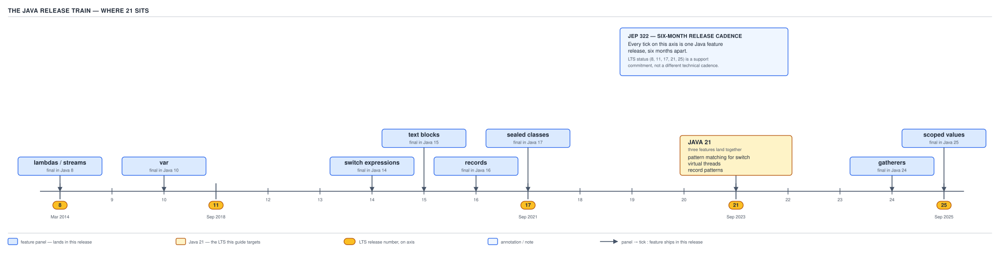

# 04 Modern Java — The platform and the release model — BASICS (§1.1)

**Target version: Java 21 LTS.** | **Part 1 of 5** | [Index](../00-index.md)
Next: [The platform and the release model — migration](02-migration.md)

## Why this file exists

QuizStakes runs `PaymentService` and `FundsLedger` on a JDK someone chose, at some point, for
reasons that were probably about vendor support contracts rather than language features. Before
any of the language mechanics in the rest of this set matter, you need the model of what a "Java
version" actually is: a release train, a support-window label, three different maturity ladders
for unfinished features, a compiler flag that means something different from what most engineers
think it means, and a number stamped into every `.class` file that the JVM checks before it will
run anything. Get this wrong and the failure mode is not a compile error — it is a
`NoSuchMethodError` in production, discovered the first time a code path that was never exercised
in CI finally runs against real traffic.

## The six-month release train

### Mental model first

Picture two clocks running side by side. One clock ticks every six months, rain or shine — March
and September, without exception — and whatever features are done when the clock strikes, ship.
The other clock is a calendar reminder that fires every two years, and whichever six-month release
happens to land on that reminder gets an extra label stapled to it: **LTS**. The label changes
nothing about the code in the JAR. It changes who will sell you a support contract for it.

Before Java 9, there was one clock, and it didn't tick on a schedule — it ticked when a target
feature list was finished. Java 8 shipped in March 2014. Java 9 was originally due in 2016 and
slipped repeatedly, eventually landing in September 2017 — over three years later — largely
because module system work (Project Jigsaw) kept missing its target. That is the shape this
section replaces.

### Why it exists

**[RESEARCH]** Before JEP 322 (Time-Based Release Versioning, targeted for Java 10 and effective
from Java 9's aftermath onward — the six-month cadence itself began with Java 10 in March 2018,
with Java 9 as the last mega-release under the old model), Java releases were **feature-driven**:
a release shipped when its planned feature set was complete. This sounds reasonable and produces
exactly the failure mode you would expect from any unbounded-scope schedule: a slipping feature
holds every other finished, ready-to-ship feature hostage behind it. Java 7 took about five years
(2006 target inflated by scope, eventually 2011). Java 8 took roughly two years. Java 9 slipped by
over a year specifically because the module system wasn't ready, and every other Java 9 feature —
including things that were completely done — waited for it.

The fix flips the dependency. **Time is fixed; scope is variable.** A feature that isn't ready by
the train's departure date doesn't hold the train — it waits for the next one, or the one after
that, sitting in the `dev` branch, deliverable as a preview once it's stable enough to expose
without an API-stability promise (see below). This is precisely why lambdas, lazy lambdas'
downstream feature (streams), lazy pattern matching, and virtual threads shipped as separate
releases years apart, each one complete on its own, rather than as one enormous "Java 9" that
never quite finished.

### When to reach for it, and when not

This isn't a choice you make — it's a fact about the platform you plan around. The consequence
that matters for QuizStakes' engineering org: a six-month cadence means **feature adoption is a
continuous decision, not a periodic upgrade project**. Teams that treat "upgrading Java" as a
once-every-few-years migration event miss two, three, sometimes four releases' worth of language
and runtime improvements between projects, and then face a much larger diff when they finally do
upgrade. The sibling model — pinning to LTS-only and upgrading every LTS cycle — is the sane
middle ground almost every production shop actually takes, and it's the subject of the next
sub-section.

### How it works

Every March and September, whatever is sitting in the JDK main-line development repository at
that moment — features that have passed through the JEP process and been integrated — gets
tagged, branded with the next sequential number, and shipped. There is no mechanism that holds
the release open for a feature; the mechanism runs in the other direction, and a feature that
targets a release but slips gets un-targeted and moved to a later one. `jdk-21+35` in this
document's own research citations is exactly this: the 35th build of the Java 21 release line, a
concrete, dated, reproducible artifact — not an abstract version number.

**D-001 — The release train and where 21 sits**


**D-001** — The release train and where 21 sits

The diagram lays the whole train on one axis: Java 8 in March 2014, a tick every six months out
to Java 25, with 8/11/17/21/25 marked taller as the LTS releases. Every feature this guide's set
owns is pinned to the release where it actually landed: lambdas and streams at 8; `var` at 10;
switch expressions at 14; text blocks at 15; records at 16; sealed classes at 17; pattern-matching
switch, virtual threads, and record patterns all landing together at 21; gatherers at 24; scoped
values finalizing at 25. Notice how much of "modern Java" as a coherent idiom is actually spread
across a decade of six-month increments, not one big-bang release — which is exactly the version
folklore this set exists to correct.

### Concrete example

QuizStakes' `BalanceView` service reads client wallet state and needs to report which
`FundsLedger` positions are currently reserved:

```java
public record WalletSnapshot(
        Money cashAvailable,
        Money cashReserved,
        Money bonusAvailable,
        Money bonusReserved) {

    public Money stakeable() {
        return cashAvailable.plus(bonusAvailable);
    }

    public Money withdrawable() {
        return cashAvailable;
    }
}
```

This one method body already assumes: records (Java 16), and if it used a text block for a debug
`toString` override or a pattern-matching `switch` on a `Verdict` sealed hierarchy elsewhere in
`BalanceView`, that's Java 21 material stacked on top of a 16 feature stacked on top of an 8
feature (the `Money` value's use of `BigDecimal` arithmetic long predates any of this). "Modern
Java" is a decade of increments a reader has to place on the same timeline to know which JDK a
given snippet actually requires.

### The gotcha

**Pitfall:** Treating "Java 9" as a normal, feature-complete release the way Java 7 or 8 were.
Java 9 shipped on schedule specifically *because* the time-based model forced Project Jigsaw's
scope to be cut down to something shippable, after years of slipping under the old model. Engineers
who lived through the pre-9 slips sometimes still describe Java releases as "whenever it's ready" —
that stopped being true in 2017.

> **The six-month release train (JEP 322) fixes the calendar and lets scope vary — a feature
> either makes its train or waits for the next one, which is why "modern Java" features are
> spread continuously across a decade of releases rather than clustered in a handful of
> mega-versions.**

## LTS: a commercial label, not a technical one

### Mental model first

Picture the same JDK source tree, the same javac, the same bytecode format, shipped by the same
process to everyone. Now picture a sticky note attached to certain releases — 8, 11, 17, 21, 25 —
that says "a vendor will keep patching this one for years." Peel the sticky note off, and the JAR
underneath is byte-for-byte the same kind of artifact as every non-LTS release around it. LTS is
metadata about support commitments, not a different build process, not extra hardening, not a
different level of code quality.

### Why it exists

**[RESEARCH]** Enterprises cannot realistically upgrade their production JVM every six months —
regression testing, compliance sign-off, and vendor certification cycles for a platform running a
regulated betting operation like QuizStakes take longer than that. LTS exists to give those
consumers a release they can standardize on and receive **security and bug-fix backports** for
years, without adopting every intermediate release's new features. Oracle's public LTS cadence
settled at 8, 11, 17, 21, and 25 — every third feature release starting from 11 (11, then +6
releases to 17, then +4 to 21 — the cadence from 17 onward is every two years / every fourth
release; 8 was retrofitted as LTS after the fact once the new model began, since it was the last
release before the switch).

### When to reach for it, and when not

Production estates — QuizStakes' `PaymentService` and `FundsLedger` among them — almost always
pin to an LTS release, because that is where the **vendor support contract** attaches: security
patches, TLS/cipher updates, and CVE backports keep flowing for years after the release date. A
non-LTS release (9, 10, 12, 13, 14, 15, 16, 18, 19, 20, 22, 23) typically only receives updates
until the *next* six-month release ships — roughly six months of patch life, full stop. Reaching
for a non-LTS release in a regulated production system is a decision to re-upgrade every six
months indefinitely just to keep receiving security patches, which is rarely worth it outside
teams deliberately tracking bleeding-edge previews.

### How it works

**[TRAP]** Nothing in the JDK build process, the class file format, the specification, or the
runtime distinguishes an LTS release technically from a non-LTS one. `javac` on Java 17 (LTS) and
`javac` on Java 18 (non-LTS, six months later) are the same kind of artifact, produced by the same
engineering process, from the same OpenJDK repository, under the same JEP governance. The *only*
difference is a downstream commitment: which releases a given vendor (Oracle, or any of the
vendors in the next sub-section) chooses to keep back-porting fixes into after the six-month clock
moves on to the next release. Different vendors can and do choose different LTS schedules for
their own builds — Oracle's designation is influential but not binding on Adoptium, Corretto, or
anyone else, though in practice the ecosystem has converged tightly on 8/11/17/21/25.

**Pitfall:** Believing an LTS release is more thoroughly tested, more stable, or built from a
special hardened branch. It is not. The exact same code that becomes Java 17 was, moments before
release, going to be "just Java 17" whether or not any vendor decided to support it for years
afterward. The only thing that changes is what happens to the release *after* it ships — whether
bug and security fixes continue to be backported into that specific version number, or whether
support simply stops and users are expected to move to the next release. Conflating "well-tested"
with "long-term-supported" leads people to assume every LTS release is safer to adopt on day one,
which the release process does nothing to guarantee.

### The definition

> **LTS is a vendor's commercial commitment to keep backporting fixes into a specific release for
> years after it ships; it changes nothing about how that release was built, tested, or specified
> — the JDK code itself does not know or care which releases are "LTS."**

## The vendor matrix: same JDK, different distributor

Every vendor below ships a build of the **same OpenJDK source** — same JLS, same JVMS, same
`javac`, same class file format for a given release. What differs is licensing terms, support
SLAs, included extras (some bundle JavaFX, some don't), certification/compliance stamps, and
container-image ergonomics.

| Vendor | Distribution | Licensing note |
|---|---|---|
| Oracle | Oracle JDK | Free for development/testing under NFTC since JDK 17; commercial support subscription for production at scale |
| Eclipse Adoptium | Eclipse Temurin | Fully open, community-governed (formerly AdoptOpenJDK) |
| Amazon | Amazon Corretto | Free, Amazon-supported, tuned defaults for AWS workloads |
| Azul | Azul Zulu | Free community builds; paid Azul Platform Prime with alternative GC/JIT options |
| BellSoft | BellSoft Liberica | Free; notable for including JavaFX and full/lightweight container variants |
| IBM | IBM Semeru | IBM's own JIT (OpenJ9) as an alternative runtime to HotSpot, in addition to a HotSpot-based build |
| Microsoft | Microsoft Build of OpenJDK | Free, Microsoft-supported, tuned for Azure |

**[RESEARCH]** Because every one of these builds compiles the same OpenJDK source for a given
release, the question "which JDK should QuizStakes run `PaymentService` on?" is answered by
**support contract terms, container image size, existing cloud vendor relationship, and JIT
choice (HotSpot vs. OpenJ9)** — never by "which one has better lambdas." A lambda compiled and run
against Java 21 behaves identically whether the JVM underneath is Temurin, Corretto, or Zulu,
because they all trace back to the same specification and largely the same source tree (vendors
occasionally carry small patches ahead of or behind upstream, but the language and standard
library semantics are the OpenJDK ones). Getting this wrong in an interview — treating vendor
choice as if it changes what code compiles or how it runs — is a fast way to signal that the
mental model of "the JDK" versus "a build of the JDK" hasn't formed yet.

**Interview:** "Which JDK vendor should you use?" is not a technical question and answering it as
one is the tell. The right answer names the actual axes — support window, licensing cost, existing
infra (e.g., "we're on AWS, so Corretto removes a support-contract line item"), and whether you
need OpenJ9's different memory/startup tradeoffs — not a claim that one vendor's `List.of()` is
faster than another's.

## The three maturity ladders: preview, incubator, experimental

### Mental model first

The JDK ships three separate escalators for "not finished yet," and they go to different floors.
A **preview language or API feature** is functionally complete and believed correct, but its
public shape might still change based on feedback — think of it as a beta with a promise the
authors are listening. An **incubator module** is an entire API surface, usually bigger than one
feature, deliberately kept out of `java.base` and the main `java.*` namespace so it can be revised
or withdrawn without ever having made a compatibility promise at all. An **experimental VM
option** isn't API at all — it's an internal runtime knob (a garbage collector, a JIT behavior)
the engineers aren't confident enough in to expose without a loud "you asked for this" flag.

### Why it exists

**[RESEARCH]** JEP 12 (Preview Features) formalized what used to be done ad hoc — shipping a
feature that looks finished, gathering real-world feedback across an LTS cycle or two, and only
then locking the API forever. Before JEP 12, features either shipped final (and then Java's
backward-compatibility promise meant living with any design mistake essentially forever — see
`Date`, `Vector`, and other early-API regrets) or didn't ship at all until fully baked, which
delayed feedback until it was too late to act on cheaply. Preview features let something like
`StructuredTaskScope` reach real codebases, in a form that requires an explicit opt-in flag,
*before* the API is locked — the goal is exactly what happened to it: Java 21's preview shape
(public constructors, `Subtask<T>`) was significantly reworked before Java 25's `Joiner`-based
finalization, and that would not have been possible if 21's shape had shipped as a permanent
commitment.

### When to reach for it, and when not

None of the three ladders belong in a published, versioned library contract. Reach for a preview
feature in application code you control end to end and can recompile on demand; never in a
library whose callers you don't control, because the next release may not run your class file at
all (see the gotcha below) and may change the API shape outright. Incubator modules are lower risk
than previews for *shape* stability within a single release but still carry no cross-release
compatibility guarantee — you sign up to re-verify every module import on every upgrade.
Experimental VM flags are the least risky to *turn on* for evaluation (they don't change your
source or bytecode at all) but the flag itself, and the feature it unlocks, can disappear between
releases without notice — never ship a production runbook that depends silently on an
experimental flag being present in the next JDK you upgrade to.

### How it works

**[RESEARCH]** [NUM] A preview feature requires `--enable-preview` at **both** compile time and
run time — the compiler needs it to accept syntax or API surface that isn't final, and the JVM
needs it to agree to load and execute the resulting class file. The compiler marks the resulting
class file's **minor version field to `65535`** (`0xFFFF`) specifically so that no JVM will ever
mistake a preview class file for an ordinary, fully-supported one. **[TRAP]** The critical
consequence: a preview class file compiled and marked this way is tied to the *exact* release that
produced it. It is not merely "needs `--enable-preview` to run" — the JVM refuses to load a
preview class file produced by a *different* feature release even with `--enable-preview` set,
because the preview API shape in that other release may have changed incompatibly. Ship a preview
`.class` compiled on Java 21 and try to run it on a Java 22 or Java 23 JVM (even with
`--enable-preview`) and it will not load.

Incubator modules (`jdk.incubator.*`, e.g. `jdk.incubator.vector` for the Vector API on Java 21)
are enabled with `--add-modules jdk.incubator.<x>` and produce ordinary class files with no
special minor-version marker — they aren't syntactically or structurally "preview," they're just
modules deliberately excluded from the default module graph and from any `java.*` namespace
commitment. Experimental VM options are gated by `-XX:+UnlockExperimentalVMOptions` and control
JVM-internal behavior (generational ZGC's rollout on Java 21 went through exactly this gate before
becoming the default in later releases) — there is no class file artifact at all, since this
category doesn't touch compiled code.

**D-002 — Three maturity ladders: preview, incubator, experimental**

| Ladder | How you enable it | What the class file records | Runs on a different release? | Guide's example |
|---|---|---|---|---|
| Preview language/API feature | `--enable-preview` at compile **and** run | Minor version set to `65535` | No — tied to the exact release that compiled it | Structured concurrency (JEP 453, Java 21) |
| Incubator module | `--add-modules jdk.incubator.x` | Nothing special — ordinary class file | Not guaranteed; the module itself may move, be finalized, or be withdrawn between releases | Vector API (`jdk.incubator.vector`, Java 21) |
| Experimental VM option | `-XX:+UnlockExperimentalVMOptions` | Nothing — no compiled artifact involved at all | N/A — it's a runtime flag, not a compiled feature | Generational ZGC (experimental at Java 21) |

**D-002** — Three maturity ladders: preview, incubator, experimental

### Concrete example

Structured concurrency in Java 21 needs the preview flag at both ends. A `PaymentService` batch
job that fans out settlement calls for a `PaymentRun` and wants them to fail together:

```java
// javac --release 21 --enable-preview PaymentRunSettlement.java
// java  --release 21 --enable-preview PaymentRunSettlement

import java.util.concurrent.StructuredTaskScope;
import java.util.List;

public class PaymentRunSettlement {

    record SettlementResult(WithdrawalTransaction transaction, boolean settled) {}

    List<SettlementResult> settleAll(List<WithdrawalTransaction> batch) throws InterruptedException {
        try (var scope = new StructuredTaskScope.ShutdownOnFailure()) {
            var subtasks = batch.stream()
                    .map(tx -> scope.fork(() -> new SettlementResult(tx, settleOne(tx))))
                    .toList();

            scope.join();
            scope.throwIfFailed();

            return subtasks.stream().map(StructuredTaskScope.Subtask::get).toList();
        }
    }

    private boolean settleOne(WithdrawalTransaction tx) {
        // one bank-transfer settlement call against BankWithdrawal
        return true;
    }
}
```

Compile this exact source on Java 22 instead, with `--enable-preview` still set, and it will
either fail to compile (the API shape moved) or, if it happened to compile, the *class file
produced on Java 22* still would not run on a Java 21 JVM and vice versa — each preview release's
artifact is locked to its own feature release.

### The gotcha

**Pitfall:** Assuming `--enable-preview` at compile time alone is enough, or assuming a preview
feature that compiles and runs fine today will still exist in the next release under the same
name. Both assumptions have burned real migrations: structured concurrency's public-constructor
API from Java 21 does not exist in Java 25, where it was replaced by `StructuredTaskScope.open()`
factories and a `Joiner` — recompiling 21-era preview code against 25 fails outright, by design.

> **A preview feature is complete but not promised — compile and run both need
> `--enable-preview`, the class file is stamped with minor version 65535, and that stamp is
> enforced as a same-release lock, not just a flag requirement; incubator modules and experimental
> VM options are separate ladders with their own, looser rules, and none of the three belongs
> in a published API contract.**

## Why "still preview" is the interview-relevant fact

**[BOTH]** The mechanical detail above (`65535`, same-release lock, `--enable-preview` twice)
matters, but the fact an interviewer is actually probing for is simpler and higher-stakes: **a
preview feature's API can and will change before it finalizes, so building a published contract on
top of it is building on sand.** If `PaymentService` exposed a public method whose signature
depended on Java 21's `StructuredTaskScope.Subtask<T>` shape, every caller of that method breaks
the moment the platform moves to Java 25's `Joiner`-based API — not because of a bug, but because
the thing being depended on explicitly reserved the right to change. The correct engineering
response to "it's still preview" is not "avoid it entirely" (early feedback is exactly what makes
previews finalize well) — it's "confine it to internals you own end to end, recompile-and-adjust
on every upgrade, and never let it leak into a signature another team or another service depends
on."

> **"Still preview" means the API surface is not yet a promise — safe to build internal,
> recompilable code against; unsafe to expose across a contract boundary you don't control end to
> end.**

## Three kinds of change, and what each demands of you

**[X-REF 06]** When a new JDK release lands, the work it demands falls into exactly three
categories, and confusing them is where migration plans go wrong:

- **Language features** — new syntax (records, pattern-matching `switch`, sealed types). These
  require recompiling your source with a `--release` (or matching `-source`/`-target`) at least as
  high as the release that introduced the syntax. Nothing runtime-only fixes this; the compiler
  must understand the new grammar.
- **Library features** — new methods or types added to the standard library (`List.of()`,
  `String.stripIndent()`, `HttpClient`). Whether you need to recompile depends entirely on whether
  your code *calls* the new surface. Calling it requires compiling against a release where that
  API exists; not calling it means your existing class files keep running unchanged on the newer
  JVM, because the JVM stays backward compatible with older class files (within the same major
  version family constraints covered next).
- **Runtime features** — behavior that changes inside the JVM itself with no new API and no new
  syntax (a different default garbage collector, JIT tuning, virtual-thread scheduling internals).
  These apply automatically the moment you run on the new JVM — no recompilation, no source
  change, sometimes not even a flag.

The full mechanics of how the JVM decides what a "compatible" class file even is — the class file
structure, the verifier, what exactly changes between major versions at the bytecode level — is
guide 06's territory (JVM internals); the paragraph above is enough to answer "what do I actually
have to *do* when Java N ships" without sending you there empty-handed.

## `--release` versus `-source`/`-target`: the compiler flag most engineers have wrong

### Mental model first

`-source`/`-target` tell the compiler *which grammar and bytecode version* to target — nothing
more. `--release` does that too, but it additionally swaps in the **complete standard library API
surface as it existed at that release**, so that a call to a method that didn't exist yet becomes
a compile-time error instead of a runtime surprise. Think of `-source`/`-target` as setting the
compiler's grammar dial while leaving today's full standard-library shelf in reach; `--release`
locks the shelf itself back to the target release's inventory.

### Why it exists

**[RESEARCH]** Before `--release` was introduced (JEP 247, Java 9), `-source 8 -target 8` compiled
on, say, a Java 11 JDK, would accept **Java 8 syntax** but still let the code call **Java 11
library methods**, because the compiler was still running against the Java 11 `rt.jar`/module
system with no restriction on which APIs were visible — only the grammar was version-gated. That
combination is exactly how a team building against an old `-source`/`-target` pair on a newer JDK
accidentally ships a class file that references methods absent from the older runtime it's
actually deployed to. `--release N` closes this hole by compiling against a **bundled, frozen
snapshot of the API as it existed at release N** (via `ct.sym`, a compressed symbol file the JDK
ships specifically for this purpose), so calling an unavailable method becomes a compile error,
not a runtime one.

### When to reach for it, and when not

Always prefer `--release` over `-source`/`-target` when compiling for a target older than your
build JDK — there is essentially no scenario where the old pair is actually what you want once
`--release` exists (Java 9+). The only reason `-source`/`-target` remain in some build
configurations is historical inertia — build scripts written before Java 9 that were never
updated, or Maven/Gradle defaults that predate the newer flag's adoption.

### How it works

**[PROVE]** Walk the argument through concretely with QuizStakes' `BalanceView`, which reads
`Money` values off `List.of(...)`. Suppose the build JDK is 17, and the deployment target is a
Java 8 JVM still running an older `FundsLedger` node during a staged rollout.

**Compiling with `-source 8 -target 8` on a Java 17 JDK:**

The compiler restricts itself to Java 8 *syntax* (no `var`, no switch expressions), but it is
still running inside the Java 17 JDK's toolchain, with the full Java 17 standard library visible
to it. `List.of(...)` was added in Java 9 — it is a **library** feature, not a syntax feature — so
nothing about `-source 8` stops the compiler from resolving `List.of(...)` against the Java 17
`java.util.List` interface it can see. The call **compiles cleanly**. The resulting class file's
major version is set for Java 8 (52), so it *loads* on the Java 8 JVM without error. It fails only
when execution actually reaches the `List.of(...)` call, at which point the Java 8 JVM looks up
`List.of` in its own (Java 8) `List` interface, doesn't find it — because it wasn't added until
Java 9 — and throws:

```
Exception in thread "main" java.lang.NoSuchMethodError:
    'java.util.List java.util.List.of(java.lang.Object[])'
```

**[NUM]** This is worked out, not asserted: the failure exists precisely because `-source`/
`-target` gate the *grammar* the compiler accepts and the *class file version* it emits, but do
**nothing** to gate *which library methods are visible for the compiler to resolve calls against*.
The compiler resolves symbols against whatever JDK it is actually running on, not the target
release, unless told otherwise.

**Compiling with `--release 8` instead:** the compiler swaps in the frozen Java 8 API snapshot
(`ct.sym` for release 8), in which `java.util.List` has no `of` method at all. The exact same
source now fails **at compile time**:

```
error: cannot find symbol
        List<Money> reserved = List.of(cashReserved, bonusReserved);
                                    ^
  symbol:   method of(Money,Money)
  location: interface List
```

This is the entire point of the flag: the same mistake, caught eight build stages earlier, by the
same compiler, on the same source, with one flag changed.

**D-004 — `--release` restricts the API; `-source`/`-target` do not**


**D-004** — `--release` restricts the API; `-source`/`-target` do not

The diagram lays the two paths side by side on exactly this `BalanceView`/`List.of(...)` example:
left, `-source 8 -target 8` compiling clean and then throwing `NoSuchMethodError` at runtime on a
Java 8 JVM; right, `--release 8` catching the same problem as a compile error naming `List.of` as
unavailable at release 8 — with the label calling out that the right-hand path is the one every
build should use.

### Concrete example

```java
// Compiled on a Java 17 JDK. QuizStakes wants to run BalanceView on an older
// Java 8 node during a staged FundsLedger rollout.
public final class BalanceView {

    public java.util.List<Money> reservedPositions(Money cashReserved, Money bonusReserved) {
        // List.of(...) is a Java 9 library addition.
        return java.util.List.of(cashReserved, bonusReserved);
    }
}
```

With `javac -source 8 -target 8 BalanceView.java`: compiles, loads on Java 8, throws
`NoSuchMethodError` on the `List.of(...)` line at runtime.

With `javac --release 8 BalanceView.java`: fails to compile, naming `List.of` as not found on
`interface List`, with the file and line pointing straight at the offending call — the bug is
fixed before it ever reaches a JVM.

### The gotcha

**Pitfall:** Believing `-source N -target N` is a safe, complete way to build for an older
runtime because "the compiler is targeting N." It targets the grammar and the class-file version
only. Anyone who has actually hit the `List.of` `NoSuchMethodError` in a staged rollout learns
this the hard way exactly once; anyone who hasn't should learn it from this paragraph instead.
**Fix:** use `--release N` for any cross-version compile, full stop — there is no case where
`-source`/`-target` alone is the better choice once `--release` is available (Java 9+).

> **`--release N` compiles against a frozen snapshot of both the language grammar *and* the
> standard library as they existed at release N, so an API call unavailable at N is a compile
> error; `-source`/`-target` gate the grammar and the class-file version only, leaving the full
> build-JDK library visible and letting an unavailable call slip through to a runtime
> `NoSuchMethodError`.**

## Class-file major versions and reading `UnsupportedClassVersionError`

### Mental model first

Every `.class` file carries two numbers near the top of its binary layout: a major and minor
version. The major version is the JVM's passport check — "was this compiled for a release I
understand, or one newer than me?" A JVM will happily run class files compiled for its own version
or *older* ones (within reason — very old class files eventually stop being accepted too, but that
threshold is far below anything current), but it will flatly refuse anything compiled for a
*newer* release than itself, because it has no idea what that release's bytecode or verification
rules might require.

### Why it exists

**[RESEARCH]** [NUM] The check is a deliberate compatibility fence: without it, a JVM could
attempt to load and execute a class file that uses bytecode instructions, constant pool entry
kinds, or verification rules introduced after that JVM was built, and either crash unpredictably
or silently misbehave. Rejecting the class file outright, with a clear diagnostic, at load time is
strictly safer than attempting to interpret bytecode the JVM's specification doesn't cover yet.

### How it works

**[NUM]** The mapping (major version = 44 + feature release number, a pattern worth deriving
rather than memorizing): Java 8 → **52**, Java 9 → **53**, Java 11 → **55**, Java 17 → **61**,
Java 21 → **65**, Java 25 → **69**. Check the arithmetic: `44 + 8 = 52`. `44 + 21 = 65`.
`44 + 25 = 69`. The offset (44) is fixed; the release number is the only variable, which is why
every LTS release's major version is derivable on the spot instead of memorized as a lookup table.

**D-003 — Class-file major versions and `UnsupportedClassVersionError`**

| Java release | Major version (44 + N) | `UnsupportedClassVersionError` text (compiled 65, run on 55) | How to check what you're running |
|---|---|---|---|
| 8 | 52 | — | `java -version` |
| 9 | 53 | — | `Runtime.version()` |
| 11 | **55** | class file version **65.0**, this version of the Java Runtime only recognizes class file versions up to **55.0** | `Runtime.version().feature()` |
| 17 | 61 | — | `System.getProperty("java.version")` |
| 21 | **65** | (the compiled-at side of the example) | — |
| 25 | 69 | — | — |

**D-003** — Class-file major versions and `UnsupportedClassVersionError`

The highlighted pair (65 compiled, 55 running) is the concrete diagnostic every engineer eventually
hits after a JDK downgrade or a mismatched deployment target:

```
Exception in thread "main" java.lang.UnsupportedClassVersionError:
    BalanceView has been compiled by a more recent version of the Java Runtime
    (class file version 65.0), this version of the Java Runtime only
    recognizes class file versions up to 55.0
```

**[NUM]** Read it left to right: `65.0` is the major.minor of the class file **as compiled** —
major 65 means Java 21. `55.0` is the highest major.minor **this JVM** will load — major 55 means
this JVM is Java 11. The class was built for a newer platform (21) than the one trying to run it
(11); the fix is either recompile with `--release 11` (or lower) or run it on a Java 21+ JVM — not
a code change, a deployment-target mismatch.

### Concrete example

If `PaymentService` is accidentally built in CI on a Java 21 toolchain but the container image
still bundles a Java 17 JRE (a real, common QuizStakes-style CI/CD skew), the exact failure is:

```
Exception in thread "main" java.lang.UnsupportedClassVersionError:
    PaymentService has been compiled by a more recent version of the Java Runtime
    (class file version 65.0), this version of the Java Runtime only
    recognizes class file versions up to 61.0
```

`65.0` = Java 21 (compiled), `61.0` = Java 17 (the runtime the container ships). No source change
required — align the build and run images, or add `--release 17` to CI if the deployment target
genuinely must stay on 17 for now.

### The gotcha

**Pitfall:** Reading `UnsupportedClassVersionError`'s two numbers backwards — assuming the first
number is "what I need" and the second is "what I compiled," when it is the other way around: the
first number is what the *class file* was compiled for, the second is the *ceiling the running
JVM* accepts. Getting this backwards sends people looking to downgrade the wrong artifact.

> **A class file's major version records the release it was compiled for; a JVM loads any class
> file at or below its own major version and rejects anything higher with
> `UnsupportedClassVersionError`, whose two numbers are (compiled-at, runtime's-ceiling) in that
> order — and the major version itself is always `44 + <feature release number>`.**

## `jdeps`, `jdeprscan`, and `jlink`: the migration toolchain

**[X-REF 06]** Three command-line tools, each answering one migration question, ship with every
JDK:

- **`jdeps`** analyzes a JAR's actual class-level dependencies, including on internal (`sun.*`,
  `com.sun.*`) or removed JDK packages — the first thing to run before any upgrade, because it
  tells you *what will break* before you attempt the upgrade rather than discovering it at
  runtime. Running `jdeps --jdk-internals PaymentService.jar` against a Java 21 target surfaces
  every internal-API dependency that a naive `import sun.something` in an old `FundsLedger` helper
  class would otherwise hide until it throws `NoClassDefFoundError` post-upgrade.
- **`jdeprscan`** scans a JAR for calls to APIs marked `@Deprecated`, distinguishing ordinary
  deprecation from `forRemoval = true` — the latter is the one worth blocking a release over,
  since it identifies methods that will actually disappear in a future release, not merely ones
  the JDK team would prefer you stop using.
- **`jlink`** assembles a **custom, minimal runtime image** containing only the modules an
  application actually needs, rather than shipping the full JDK — directly relevant to container
  image size for a service like `BalanceView` running at QuizStakes' 55k peak concurrent session
  scale, where a smaller base image speeds every container cold-start and reduces the deployed
  attack surface.

Full coverage of module dependency analysis, the module system these tools operate against, and
custom runtime image construction end to end belongs to guide 06 (JVM internals); the summary
above is enough to know which tool answers which migration question and to run it correctly.

## Checking what you are actually running

**[RESEARCH]** Four ways to answer "what JDK am I actually on," each surfacing different
granularity:

- **`java -version`** — human-readable, printed to stderr, e.g.
  `openjdk version "21.0.1" 2023-10-17 LTS`. Fine for a terminal check, awkward to parse
  programmatically.
- **`System.getProperty("java.version")`** — returns the same version string
  (`"21.0.1"`) as a `String`, available from any running JVM without a subprocess.
- **`Runtime.version()`** — returns a structured `Runtime.Version` object, the programmatic way to
  do this correctly, with named accessors instead of string parsing:
  - **`feature()`** — the major feature release number (`21` for Java 21.0.1).
  - **`interim()`** — an interim release number within a feature release (almost always `0` for
    mainstream releases; exists for the version scheme's completeness).
  - **`update()`** — the update release number (`1` in `21.0.1`), i.e. which quarterly patch
    within the feature release.
  - **`patch()`** — an emergency patch number, used only for out-of-band security fixes between
    scheduled updates (almost always `0`).

```java
// A QuizStakes startup diagnostic BalanceView could log on boot.
Runtime.Version version = Runtime.version();
System.out.printf(
        "Running feature=%d interim=%d update=%d patch=%d (%s)%n",
        version.feature(), version.interim(), version.update(), version.patch(),
        version);
// e.g.: Running feature=21 interim=0 update=1 patch=0 (21.0.1)
```

**Interview:** "How do you check the Java version programmatically, not from a shell?" The
one-line answer is `Runtime.version().feature()` for the number that actually matters for
feature-gating logic — string-parsing `System.getProperty("java.version")` is the fragile way to
get the same answer, since version string formats have changed shape across releases (compare
Java 8's `"1.8.0_301"` legacy scheme to Java 9+'s `"21.0.1"` scheme) while `Runtime.Version`'s
accessors have not.

---

## Pitfalls

### Assuming `-source`/`-target` is equivalent to `--release`

**Wrong**
```java
// Built with: javac -source 8 -target 8 BalanceView.java  (on a Java 17 JDK)
public java.util.List<Money> reservedPositions(Money cashReserved, Money bonusReserved) {
    return java.util.List.of(cashReserved, bonusReserved);
}
```
Compiles with zero errors or warnings. Deployed to a Java 8 `FundsLedger` node, it throws at
runtime the moment this method executes:
```
Exception in thread "main" java.lang.NoSuchMethodError:
    'java.util.List java.util.List.of(java.lang.Object[])'
```

**Right**
```java
// Built with: javac --release 8 BalanceView.java
```
Fails at compile time instead, naming `List.of` as unavailable at release 8 — caught in CI, not in
production.

**Why people believe it:** the flag names look almost interchangeable, and `-source`/`-target`
*do* correctly restrict syntax (e.g., they will reject `var` if targeting 8) — so people
reasonably but wrongly generalize that syntax restriction to API restriction as well.

### Believing "the default virtual-thread pool size is 256"

**Wrong**
```
// Said in an interview or a design doc, stated as an unconditional fact:
"The virtual thread scheduler's carrier pool caps out at 256 threads by default."
```
True only on machines with 256 or fewer available processors.

**Right**
```java
// From VirtualThread.createDefaultScheduler(), jdk-21+35:
maxPoolSize = Integer.max(parallelism, 256);
```
256 is a **floor**, not a flat cap — on any machine with more than 256 cores, `maxPoolSize` equals
`parallelism` instead, which is larger than 256.

**Why people believe it:** 256 is the number every blog post repeats, and it happens to be
correct on the overwhelming majority of real machines (few boxes exceed 256 cores today), so the
floor-vs-flat distinction rarely gets exercised in practice — until it does, on genuinely large
hardware.

## Cheat sheet

| Fact | Value |
|---|---|
| Release cadence since Java 9's successor | Every 6 months (March / September), JEP 322 |
| LTS releases | 8, 11, 17, 21, 25 |
| LTS is | A vendor support-window commitment, not a technical property |
| Preview enable | `--enable-preview` at compile **and** run |
| Preview class file marker | Minor version `65535` |
| Preview cross-release rule | Will not load on a *different* release, even with the flag |
| Incubator enable | `--add-modules jdk.incubator.x` |
| Experimental VM flag | `-XX:+UnlockExperimentalVMOptions` |
| `--release N` restricts | Grammar **and** API surface (via `ct.sym`) |
| `-source`/`-target` restricts | Grammar **and** class-file version only — not the API |
| Major version formula | `44 + feature release number` |
| Java 8 / 9 / 11 / 17 / 21 / 25 major | 52 / 53 / 55 / 61 / 65 / 69 |
| `UnsupportedClassVersionError` reads as | (compiled-at major, runtime's-ceiling major) |
| Migration toolchain | `jdeps` (dependency scan) → `jdeprscan` (deprecation scan) → `jlink` (custom runtime image) |
| Programmatic version check | `Runtime.version().feature()/interim()/update()/patch()` |

## Self-test

**Q1.** Why did Java releases move from a feature-driven schedule to a fixed six-month cadence, and what specific Java 9 problem motivated it?

<details><summary>Answer</summary>

The old model let scope determine timing: a release shipped only when its planned features were
done, so one slipping feature held every finished feature hostage behind it. Java 9 was the
canonical case — Project Jigsaw's module system repeatedly slipped, delaying the whole release by
over a year past its original target, even though many unrelated Java 9 features were ready long
before. JEP 322's time-based model fixes the calendar instead: a feature that isn't ready by the
train's departure waits for a later release, and every other finished feature ships on time
regardless.

</details>

**Q2.** Is Java 9 an LTS release? Explain why the answer isn't really about Java 9 specifically.

<details><summary>Answer</summary>

No — Oracle's LTS designations are 8, 11, 17, 21, 25. But the more important point is that LTS
status is not a property the JDK build process assigns or the specification defines at all; it is
a downstream commercial commitment by a vendor to keep backporting fixes into a specific release
number. Java 9's code is not technically inferior to Java 11's — it simply wasn't chosen as a
release vendors committed to supporting for years afterward.

</details>

**Q3.** A team compiles `BalanceView` with `-source 8 -target 8` on a Java 17 build machine, and the code calls `List.of(...)`. What happens at compile time, and what happens when the resulting class file runs on an actual Java 8 JVM? Why the difference?

<details><summary>Answer</summary>

It compiles cleanly — `-source`/`-target` restrict the grammar the compiler accepts and the
class-file version it emits, but they do nothing to restrict which library methods the compiler
resolves calls against; the compiler still sees the full Java 17 standard library, including
`List.of(...)`, which was added in Java 9. The class file's major version is set correctly for
Java 8, so it loads fine on a Java 8 JVM — but when execution reaches the `List.of(...)` call, the
Java 8 `List` interface has no such method, and the JVM throws `NoSuchMethodError` at that exact
line. Compiling instead with `--release 8` would have caught this at compile time, because
`--release` swaps in a frozen Java 8 API snapshot in which `List.of` doesn't exist to resolve
against.

</details>

**Q4.** What exactly does a preview feature's class file record, and why does that prevent the class from running on a JVM one release newer than the one that compiled it, even with `--enable-preview` passed?

<details><summary>Answer</summary>

The compiler sets the class file's minor version field to `65535` for any class compiled with a
preview feature enabled. The JVM's loader treats that marker as a same-release lock: a preview
class file is only accepted by the exact feature release that produced it, never by a different
one, because the preview API's shape carries no cross-release compatibility promise and may have
changed in the newer release. `--enable-preview` on the newer JVM only tells it to accept *its
own* preview features — it does not make it accept a previous release's preview class files.

</details>

**Q5.** Derive the class file major version for Java 21 and Java 25 from the formula, and explain what `UnsupportedClassVersionError` reporting "class file version 65.0 ... only recognizes ... up to 55.0" tells you about the deployment, not the code.

<details><summary>Answer</summary>

Major version = `44 + feature release number`. For Java 21: `44 + 21 = 65`. For Java 25:
`44 + 25 = 69`. The error's two numbers read as (compiled-at, runtime-ceiling): `65.0` means the
class was compiled for Java 21; `55.0` means the JVM trying to load it only understands up to
Java 11. This is a deployment/toolchain mismatch, not a code bug — the fix is aligning the build
target and the runtime image (recompile with a lower `--release`, or run on a newer JVM), not
editing the source.

</details>

**Q6.** Name the three maturity ladders in the JDK and one way each differs from the others in what it changes about a compiled class file.

<details><summary>Answer</summary>

Preview language/API features (enabled with `--enable-preview` at compile and run) mark the class
file's minor version as `65535` and lock it to the exact compiling release. Incubator modules
(enabled with `--add-modules jdk.incubator.x`) produce an ordinary class file with no special
marker — they're excluded from the default module graph, not structurally different bytecode.
Experimental VM options (enabled with `-XX:+UnlockExperimentalVMOptions`) don't touch compiled
code at all — they're pure runtime flags controlling JVM-internal behavior like garbage collector
selection.

</details>

**Q7.** A `PaymentService` container fails to start with `UnsupportedClassVersionError`, reporting class file version 65.0 against a runtime ceiling of 61.0. What happened, and name two different fixes.

<details><summary>Answer</summary>

The JAR was built (or a dependency was built) against Java 21 (major 65), but the container's JRE
is Java 17 (major 61, the runtime's ceiling). Two fixes: either rebuild with `--release 17` (or
lower) so the emitted class files target a major version the Java 17 JRE accepts, or upgrade the
container's runtime image to a Java 21+ JRE so it can load major-65 class files. No source-code
change is needed for either fix — it's purely a build-target/runtime-image alignment problem.

</details>

**Q8.** Why is `--release` strictly better than `-source`/`-target` whenever you're compiling for a target older than your build JDK, and is there any legitimate reason a project would still use the older pair?

<details><summary>Answer</summary>

`--release N` restricts both the grammar *and* the visible API surface to what existed at release
N (via a frozen `ct.sym` snapshot), turning an unavailable-API call into a compile error instead
of a latent runtime `NoSuchMethodError`. `-source`/`-target` restrict grammar and class-file
version only, leaving the full build-JDK library resolvable, which is strictly more dangerous with
no compensating benefit. The only legitimate reason a project still uses the older pair is
historical inertia — build configuration written before Java 9 (when `--release` didn't exist yet)
that was never revisited, not any genuine advantage of the old flags.

</details>

**Q9.** What is the actual default `maxPoolSize` formula for the virtual-thread scheduler on Java 21, and why is "256" alone an incomplete answer?

<details><summary>Answer</summary>

From `VirtualThread.createDefaultScheduler()` at jdk-21+35: `maxPoolSize = Integer.max(parallelism, 256)`, where `parallelism` defaults to `Runtime.getRuntime().availableProcessors()`. "256" alone
is incomplete because it's a floor, not a flat default — on any machine with more than 256
available processors, `maxPoolSize` equals `parallelism`, which is larger than 256. The complete
answer states both halves: 256 on typical hardware, but `availableProcessors()` on machines beyond
that core count.

</details>

**Q10.** Give the three categories of change a new JDK release can introduce, and for each, what action (if any) it demands of an existing codebase.

<details><summary>Answer</summary>

Language features (new syntax like pattern-matching switch) require recompiling with a
`--release`/`-source` at least as high as the introducing release, because the compiler must
understand the new grammar. Library features (new standard-library methods) only require
recompiling if the code actually calls the new method — code that doesn't call it keeps running
unchanged, since the JVM stays backward compatible with older class files. Runtime features
(internal JVM behavior changes, like a new default garbage collector or scheduler tuning) apply
automatically just by running on the new JVM — no recompilation or source change needed at all.

</details>

## Deferred

None.

## Open questions

- **Unverified:** The exact date JEP 322's time-based cadence took effect is stated here as
  "starting with Java 10 (March 2018), with Java 9 as the last release under the old
  feature-driven model." This framing is consistent with the publicly documented history but was
  not re-confirmed against the JEP 322 text itself during this session; confirm against the JEP
  322 page (via a mirror, since `openjdk.org` may 403 on direct fetch) if the exact transition
  point needs to be quoted precisely.

---

**Leaves covered:** 1.1.1–1.1.12 (12 leaves)
**Leaves deferred:** none
**Diagrams included:** D-001, D-002, D-003, D-004
**Target version:** Java 21 LTS
**Lines:** 895
