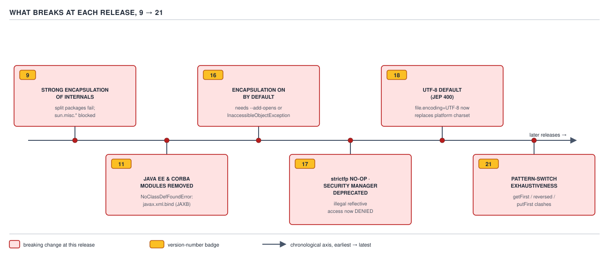
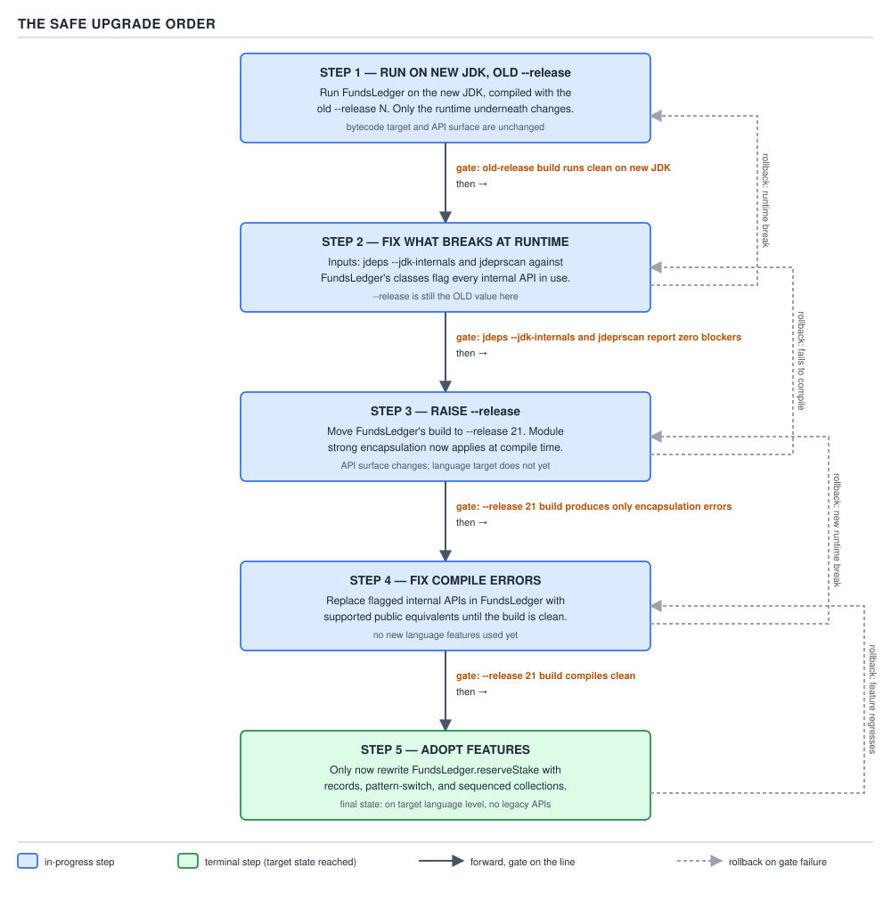

# 04 Modern Java — The platform and the release model — INTERMEDIATE (§2.14)

**Target version: Java 21 LTS.** | **Part 2 of 5** | [Index](../00-index.md)
Previous: [The platform and the release model — basics](01-basics.md) · Next: [The platform and the release model — internals version delta](03-internals-version-delta.md)

Migrating a Spring Boot service from Java 8 to 21 is not one jump — it is six overlapping
breakages layered on top of each other, plus a library floor that moves under you, plus a
temptation to "modernize while you're in there" that you should mostly resist. This file walks
the breakages release by release, the one silent one that never throws an exception, the
libraries that gate the JDK you can actually run, which refactors pay for themselves, and the
rollout order that catches each category of failure at the cheapest possible stage.

---

## What breaks at each release, 9 → 21

### Mental model first

Every LTS jump between 8 and 21 removes exactly one kind of shortcut Java 8 code was leaning on
without knowing it: reaching into JDK internals, relying on modules that used to ship by default,
assuming a locale-dependent charset, or declaring a method name the JDK itself now claims. None of
these are new features breaking old code — they are old code being caught for assumptions the
platform never actually promised to keep.

### Why it exists

Before Java 9, `com.sun.*` and `sun.misc.*` were technically internal but practically public: a
huge amount of tooling (byte-code manipulators, app servers, monitoring agents) called into them
directly because there was no supported alternative and no enforcement mechanism stopped it. The
module system (Project Jigsaw, JEP 200/261, Java 9) exists specifically to make "internal" mean
something enforceable, and every release since has tightened the enforcement rather than adding a
new one.

### When to reach for it, and when not

This is not a concept you "reach for" — it is a set of checkpoints you walk through once per LTS
upgrade. The sibling worth naming is the difference between a **compile-time** break (the code
will not build until you fix it — cheap, caught immediately) and a **runtime** break (the code
builds and fails or silently misbehaves in production — expensive, caught late or not at all).
Sort every item below into one of those two buckets before you touch a line of code.

### How it works

**9 — strong encapsulation of JDK internals, split packages.** The module system introduces
`java.base` and friends as named modules. Any type in a JDK internal package (`sun.misc.Unsafe`
aside, which stays reachable via a documented back door — see the deprecation section below) is
no longer exported by default. Reflective access to it becomes **illegal reflective access**, and
from 9 through 15 the JVM defaults to *permitting it with a warning* — `WARNING: An illegal
reflective access operation has occurred` — via the `--illegal-access=permit` default. That
warning is the single most common line of stderr noise in a first Java-9 upgrade attempt, and it
is not an error yet. Java 9 also makes **split packages** — the same package name shipping in two
different JARs on the module path — a hard module-resolution error, because the module system
requires each package to belong to exactly one module. `[X-REF 06]`: the module system's own
mechanics (module descriptors, `requires`/`exports`, the unnamed module, layers) are guide 06's
territory — the paragraph above is enough to answer "what breaks at 9 and why", not to design a
`module-info.java`.

**11 — the Java EE modules are gone.** `java.xml.bind` (JAXB), `java.activation` (JAF), `java.corba`,
`java.xml.ws` (JAX-WS), `java.xml.ws.annotation`, and `java.transaction` shipped in 9 and 10 as
deprecated-for-removal modules and are removed outright in 11. Code that does
`import javax.xml.bind.annotation.XmlRootElement;` without an explicit dependency compiles under 8
(bundled with the JDK) and fails to compile or link under 11 with `NoClassDefFoundError` or
`package javax.xml.bind does not exist`, because there is no JDK module providing it anymore. The
fix is a Maven/Gradle dependency on `jakarta.xml.bind:jakarta.xml.bind-api` plus a runtime
implementation (`org.glassfish.jaxb`) — **and that is a different axis from the `javax` → `jakarta`
package rename**, which is a separate, later migration driven by Jakarta EE 9 (2020) reassigning
the `javax.*` namespace to `jakarta.*` for trademark reasons. Removing `java.xml.bind` from the
JDK at 11 does not itself rename any package; you can add back a `javax.xml.bind`-shaped JAXB
dependency at 11 and only face the `jakarta` rename later when you move to a Jakarta EE 9+/Spring
Boot 3+ stack.

**16 — encapsulation on by default.** JEP 396 flips the Java-9 default: `--illegal-access` now
defaults to `deny`. Any reflective access into `java.base` that used to print a warning now throws
`InaccessibleObjectException` unless the module is opened explicitly with `--add-opens
java.base/java.lang=ALL-UNNAMED` (or the equivalent `Add-Opens` manifest entry). This is where
serialization libraries, mocking frameworks, and anything that calls `Field.setAccessible(true)`
on a JDK-internal field starts failing at **runtime**, not compile time — which is exactly why it
belongs in the runtime-break bucket and why it is caught late if your test suite does not exercise
the code path. `[X-REF 06]`: reflection's accessibility checks and the JPMS module graph that
`--add-opens` patches are guide 06's territory.

**17 — three unrelated things land together.** `strictfp` (JEP 306) becomes a no-op keyword: Java
never had faithfully-strict floating point outside `strictfp` blocks before 17, so JEP 306 makes
*all* floating-point arithmetic use the strict semantics `strictfp` used to opt into, and the
keyword itself becomes vestigial — code that has it still compiles, it just does nothing extra
anymore. The Security Manager (JEP 411) is deprecated for removal — still functional at 17, but
every remaining reliance on `System.getSecurityManager()` or a custom `SecurityManager` subclass
is now on notice. And illegal reflective access, permitted-with-a-warning at 9 and denied only for
`java.base` at 16, is denied for **all** JDK modules at 17 with `--illegal-access` itself removed
as an option (JEP 403) — there is no longer an escape hatch flag at all, only `--add-opens` per
module. `[X-REF 03]`: the *language* mechanics of `strictfp` and floating-point strictness are
guide 03's territory.


**D-122** — What breaks at each release, 9 → 21

**18 and 21** get their own primary-concept sections below, because each carries a distinct trap
worth full treatment on its own — JEP 400's silent charset flip, and the sequenced-collection
method-name clash.

### A minimal concrete example

`DocumentVerification` calling into a legacy image-normalization library that reflects into
`sun.awt.image.ByteInterleavedRaster` to avoid an extra buffer copy on identity-document scans:

```java
import java.lang.reflect.Field;

public final class LegacyRasterAccess {

    public int[] readRawPixels(Object rasterInstance) throws ReflectiveOperationException {
        Field dataField = rasterInstance.getClass().getDeclaredField("data");
        dataField.setAccessible(true); // throws InaccessibleObjectException from Java 16 on
        return (int[]) dataField.get(rasterInstance);
    }
}
```

On Java 8 through 15 this either works outright or prints the illegal-access warning and works
anyway. On Java 16+ it throws `InaccessibleObjectException: Unable to make field ... accessible:
module java.desktop does not "opens sun.awt.image" to unnamed module`, and the only fixes are
`--add-opens java.desktop/sun.awt.image=ALL-UNNAMED` on the launch command, or — the actually
correct fix — stop reflecting into a JDK-internal raster type and normalize the image through the
public `BufferedImage`/`Raster` API instead.

### The gotcha

**Pitfall:** Teams read "Java 9 introduced modules" and assume the breakage is a Java-9-only
event they already survived years ago. In practice the *enforcement* ratchets up at 16 and again
at 17 on flags that were previously permissive, so code that "already migrated to Java 9" can
still break again at 16 if it depends on reflective access that was merely warned about, not
denied, back then. Re-run `jdeps --jdk-internals` at every LTS hop, not just the first one.

> **Definition.** Each JDK release from 9 through 17 removes one specific escape hatch that let
> Java-8-era code reach past the module system's boundary — from permissive-with-a-warning to
> denied-with-no-flag — and 18/21 add a silent behavioural change and a naming clash on top,
> covered next.

---

## JEP 400 — UTF-8 as the silent behaviour change

### Mental model first

Every other break in this file throws something — an exception, a compile error, a linkage
failure — the moment you hit it. JEP 400 is the one break that changes what your program *does*
without telling you it changed anything. The program still runs, still returns 200, still writes a
file. The bytes in that file are just different from the bytes it would have written last week.

### Why it exists

Before Java 18, `Charset.defaultCharset()` — and therefore `new FileReader(File)`,
`new InputStreamReader(InputStream)`, `String.getBytes()`, `new String(byte[])`,
`new PrintStream(OutputStream)`, and every other no-charset-argument I/O constructor — resolved to
the **platform default charset**: `file.encoding`, itself derived from the OS locale. A JVM on a
`en_US.UTF-8` Linux box, a `Cp1252` Windows box, and a `Shift_JIS` Japanese-locale box running the
identical JAR produced three different byte sequences for the identical `String`. JEP 400 (Java
18) makes the default charset **UTF-8 everywhere**, independent of OS locale, unless the JVM is
launched with `-Dfile.encoding=COMPAT` to restore the old platform-dependent behaviour.

### When to reach for it, and when not

There is no "reach for it" here — JEP 400 is not opt-in behaviour you choose, it is the new
default you inherit the moment you run on 18+. The decision you actually make is whether any
no-charset-argument I/O call in your codebase can tolerate the change, and the answer should
always be "no, make the charset explicit" rather than "yes, rely on the new default" — because
relying on *any* implicit default, old or new, reproduces the exact bug class JEP 400 exists to
close.

### How it works

`Charset.defaultCharset()` is computed once, at JVM startup, from the `file.encoding` system
property. Before 18, the JVM set `file.encoding` from the native platform's locale detection.
Starting at 18, the JVM sets it to `UTF-8` unconditionally, and the native-locale value is instead
exposed separately as `native.encoding` for code that genuinely needs to know what the OS thinks
the console encoding is (`Console`, `System.out`/`System.err` when attached to a real terminal
still honor `stdout.encoding`/`stderr.encoding`, which independently default to `native.encoding`
on 18+ for console output specifically — the file/stream default and the console default are two
separate properties post-JEP-400, which is itself a detail most blog coverage glosses over).
Verified on this machine (JDK 25, `--release` does not change this JVM-launch-time property):

```
$ java Charset
UTF-8
```

confirming `Charset.defaultCharset()` resolves to UTF-8 with no `-Dfile.encoding` override, which
is the JEP 400 behaviour every 18+ runtime exhibits regardless of OS locale.


**D-122** — What breaks at each release, 9 → 21 (the 18 marker on this timeline is this section)

### A minimal concrete example

`FundsLedger` writes the daily bank-withdrawal payout file consumed by the banking partner batch
window (Appendix A: 4 windows/day, `BANK_SETTLEMENT`, avg withdrawal value 260). The service has
run on a fleet of Windows-hosted JVMs since Java 8, where the platform default charset resolved to
`windows-1252`:

```java
public final class PayoutFileWriter {

    public byte[] renderPayoutLine(WithdrawalTransaction withdrawal, String beneficiaryName) {
        String line = "%s|%s|%s".formatted(
                withdrawal.id(), withdrawal.amount(), beneficiaryName);
        return line.getBytes(); // no charset argument — platform default until Java 18
    }
}
```

For a beneficiary name containing `é` or `£`, `windows-1252` encodes each as a single byte. On
Java 8–17 that single-byte encoding is exactly what the banking partner's fixed-width ingestion
expects, because it was built against the same platform default years ago. The moment the fleet
moves to Java 18+, `getBytes()` silently switches to UTF-8, which encodes `é` as two bytes and `£`
as two bytes — the file is still valid text, the write still succeeds, no exception fires anywhere
in `FundsLedger`, and the banking partner's fixed-width parser either misreads the field boundary
or rejects the row as malformed, discovered only when a `PaymentRun` reconciliation comes back
short. The fix is `line.getBytes(StandardCharsets.UTF_8)` — or, better, a coordinated encoding
change on both ends — decided and tested explicitly, not inherited from a JVM upgrade.

### The gotcha

**Pitfall:** "We upgraded to 18 and nothing broke" is not evidence of safety — it is evidence that
the test suite does not assert on the *bytes* produced by charset-less I/O, only on the strings
round-tripped through the same JVM. Grep the codebase for `getBytes()`, `new String(byte[])`,
`new FileReader(`, `new FileWriter(`, and `new PrintStream(OutputStream)` with no charset argument
before every migration past 17, because none of these fail loudly; they fail as data corruption
discovered downstream, often by a different team. `[X-REF 03]`: `String`'s internal byte
representation (compact strings, the Latin-1/UTF-16 coder byte) is guide 03's territory and is a
different mechanism from the platform-default-charset question here — compact strings are about
how a `String` is stored in the JVM's heap; JEP 400 is about what bytes get produced when that
`String` is externalized to a file or socket with no charset specified.

> **Definition.** JEP 400 changes the JVM's default charset from OS-locale-dependent to a fixed
> UTF-8 for every stream and file API that omits an explicit `Charset` argument, starting at
> Java 18 — the byte-identical-forever assumption baked into years of charset-less I/O code stops
> holding the moment the JDK underneath it moves to 18.

---

## The library floor

### Mental model first

The JDK you can migrate to is not the JDK your code compiles against — it is the JDK your
**slowest-moving dependency** compiles against, and the slowest-moving dependency is almost always
whatever touches bytecode directly.

### Why it exists

Libraries that generate proxies, weave bytecode, or read class files at a specific format version
(class-file major version) hard-code assumptions about what a class file of a given JDK release
looks like. A library built against the Java 11 class-file format cannot parse or generate a
Java 21 class file — not because someone forgot to test it, but because the format itself gained
new constant-pool entries and structural elements (records, sealed classes, permitted-subclasses
attributes) that an old bytecode reader has literally never seen a tag for.

### When to reach for it, and when not

There is no substitute check here: **before raising the JDK, raise every bytecode-touching
dependency to a version whose release notes state JDK-21 support**, and do it as a separate,
revertible step from the JDK bump itself, so a failure isolates to "library X doesn't support 21
yet" rather than tangling with every other migration risk in this file at once.

| Library | What it does to bytecode | Failure mode on a JDK it doesn't support |
|---|---|---|
| Lombok | Generates bytecode/AST nodes at compile time via a javac plugin API | Compile-time crash — `Lombok requires ...` or javac ClassCastException on the annotation processor |
| Mockito | Subclasses/generates proxies for mocks via ByteBuddy | `MockitoException: Mockito cannot mock this class` — ByteBuddy floor is the real gate |
| ByteBuddy | Generates class files at runtime for proxies | `IllegalClassFormatException` / `ClassFormatError` for an unrecognized class-file version |
| ASM | Low-level class-file reader/writer many other tools embed | `UnsupportedClassVersionError` reading the JDK's own classes, or writing a file downstream tools reject |
| Groovy | Compiles to bytecode via its own compiler, embeds ASM | Same failure class as ASM, one layer up |
| Spring Framework / Boot | Runtime proxying (CGLIB, JDK dynamic proxies), reflection-heavy | `InaccessibleObjectException` (the 16/17 encapsulation breaks above) if the Spring version predates them |

Note the direction of the dependency chain: Lombok depends on javac's annotation-processing SPI,
Mockito depends on ByteBuddy, Groovy embeds its own ASM fork — so "upgrade Mockito" often silently
means "and therefore upgrade ByteBuddy transitively", and a partial bump (only the top-level
artifact) reproduces the exact failure you were trying to fix. `[X-REF 16]`: Mockito's mocking
mechanism itself — how ByteBuddy subclasses versus how JDK proxies work, and why final classes
were historically unmockable — is guide 16's territory; the point here is only that the mocking
stack's *JDK ceiling* gates your migration, not how mocking works underneath it.

### A minimal concrete example

A `ClientRestrictions` test suite mocking `RestrictionKey`-keyed lookups fails the moment CI moves
its JDK to 21 without a coordinated library bump:

```java
class ClientRestrictionsTest {

    @Test
    void liftsSystemOnboardingBlockOnActivation() {
        RestrictionKey key = new RestrictionKey(RestrictionType.STAKE_BLOCKED,
                RestrictionSource.SYSTEM_ONBOARDING);
        ClientRestrictions restrictions = Mockito.mock(ClientRestrictions.class);
        Mockito.when(restrictions.isActive(key)).thenReturn(true);

        assertTrue(restrictions.isActive(key));
    }
}
```

On a JDK-11-era Mockito/ByteBuddy pair run under Java 21, this fails at the `Mockito.mock(...)`
call with a ByteBuddy error about an unsupported class-file version, before the test body ever
executes — the assertion is never reached, and the stack trace points at mock creation, not at
`ClientRestrictions` or `RestrictionKey`, which is the detail that sends people down the wrong
debugging path first.

### The gotcha

**Pitfall:** Bumping only the JDK in CI and leaving `pom.xml`/`build.gradle` dependency versions
untouched produces a wall of failures that look like application bugs — NPEs from mocks that
silently return null instead of the stubbed value, or hard `ClassFormatError`s — when the actual
root cause is one line in a dependency block. Check the library floor **before** flipping the CI
JDK, not after triaging the failures it causes.

> **Definition.** The library floor is the minimum version of each bytecode-touching dependency
> (annotation processors, mocking frameworks, dynamic-proxy generators, JVM-language compilers)
> that understands the target JDK's class-file format — and it, not your own source code, is
> usually the actual ceiling on how far a migration can go in one step.

---

## The mechanical refactors worth doing, and the ones that are not

### Mental model first

A migration is the one time refactoring has a deadline and a reviewer's attention already on the
diff. That budget is worth spending on refactors that remove a real correctness or maintenance
liability — not on refactors that just make the diff bigger for the same runtime behaviour.

### Why it exists

Java 8-to-21 code accumulates patterns that predate features which now do the same job more
safely: anonymous inner classes predate lambdas, manual `StringBuilder` loops predate
`Collectors.joining`, `Date`/`Calendar` predate `java.time`, chained `instanceof`/cast predates
pattern-matching `switch`, and hand-written equals/hashCode/toString value classes predate
records. Each of these old forms is not merely more verbose — it is a wider surface for the exact
bug class the newer form eliminates (a forgotten `Calendar.MONTH` off-by-one, a missed field in a
hand-rolled `equals`).

### When to reach for it, and when not

Worth doing — because each removes a standing liability, not just line count:

| Refactor | What it removes |
|---|---|
| Anonymous class → lambda | Boilerplate `this`-capturing class body; no behaviour change, pure readability and one fewer generated `.class` file per call site |
| Manual string-building loop → `Collectors.joining` | Off-by-one delimiter bugs (trailing separator, missing separator on the last element) |
| `Date`/`Calendar` → `java.time` | Mutability bugs from a shared `Calendar` instance, the notorious zero-based `Calendar.MONTH`, and lack of a first-class time zone model |
| `if`/`else instanceof` chains → pattern-matching `switch` | A missing `else` branch that silently falls through instead of failing exhaustiveness-checked at compile time (sealed-type switches) |
| Hand-written immutable value classes → records | A hand-rolled `equals`/`hashCode`/`toString` that forgets a field the day someone adds one |

Not worth doing — because each trades a working diff for a bigger one at equal runtime behaviour:

- **Rewriting every loop as a stream.** A `for` loop over `List<LedgerEntry>` that already reads
  clearly does not become more correct as a stream; it becomes a debugger-unfriendly pipeline for
  the same three lines, and streams carry their own boxing/allocation cost on primitive-heavy
  aggregation that a loop does not.
- **Adopting `var` everywhere.** `var` is a readability tool per the OpenJDK LVTI style guide's
  own principles — P1 "reading code is more important than writing code", P4 "explicit types are a
  tradeoff" — not a style mandate; `var run = paymentRunRepository.findPending();` hides the type a
  reviewer needs at the point of the call. Style guide G3 says consider `var` "when the initializer
  provides sufficient information to the reader" — `var restrictions = new ArrayList<RestrictionKey>();`
  qualifies, `var result = process(input);` does not.
- **Converting working DTOs to records for their own sake.** A DTO with a builder that callers
  already depend on, or that needs a non-canonical constructor for validation logic beyond what a
  compact constructor comfortably expresses, does not get safer by becoming a record — it gets a
  breaking API change with no bug fixed.

### How it works

The mechanism behind why these refactors are safe to batch: none of them change a public method's
externally observable contract when applied correctly — a lambda implementing the same functional
interface, `Collectors.joining` producing the identical concatenated string, an equivalent
`java.time.Instant` computation, an exhaustive pattern switch covering the same branches, and a
record whose accessor names match the old getter names all preserve behaviour while removing the
bug surface. That is precisely why they belong in the same commit as a JDK bump and the
not-worth-doing list does not: those three change the *shape* of the code for stylistic reasons
unconnected to any bug the migration is trying to close.

### A minimal concrete example

Before, in `DocumentVerification`, chained `instanceof` on the sealed `DocumentVerdict` hierarchy:

```java
public String describe(DocumentVerdict verdict) {
    if (verdict instanceof DocumentVerdict.Approved approved) {
        return "approved by " + approved.decidedBy();
    } else if (verdict instanceof DocumentVerdict.Referred referred) {
        return "referred: " + referred.reason();
    } else if (verdict instanceof DocumentVerdict.Rejected rejected) {
        return "rejected: " + rejected.reason();
    } else {
        throw new IllegalStateException("unknown verdict: " + verdict);
    }
}
```

After, exhaustive pattern-matching `switch` over the sealed hierarchy — the compiler rejects the
method if a fourth `DocumentVerdict` subtype is added and this switch is not updated, which the
`if`/`else` chain above could never do:

```java
public String describe(DocumentVerdict verdict) {
    return switch (verdict) {
        case DocumentVerdict.Approved approved -> "approved by " + approved.decidedBy();
        case DocumentVerdict.Referred referred -> "referred: " + referred.reason();
        case DocumentVerdict.Rejected rejected -> "rejected: " + rejected.reason();
    };
}
```

### The gotcha

**Pitfall:** Treating "worth doing" as "do it everywhere in one pass". A migration PR that both
bumps the JDK and rewrites forty unrelated loops as streams makes the diff impossible to review
for the actual risk — the JDK-behaviour change — because the reviewer's attention is spent on
stylistic churn instead. Land the JDK bump and the library floor bump first, with zero unrelated
refactors; land the mechanical refactors as separate, smaller, easily-revertible follow-up PRs.

> **Definition.** A refactor earns a place in the migration PR only if it removes a standing
> correctness or maintenance liability the old JDK-8-era form carried — not merely because a newer
> syntax exists for the same behaviour.

---

## The safe rollout order

### Mental model first

A migration has two independent axes that most teams collapse into one step and then cannot tell
apart when something breaks: **which JDK the bytecode runs on**, and **which language level the
compiler is allowed to target**. Separating them turns "the migration broke" into "step 2 broke",
which is the entire value of the ordering below.

### Why it exists

If you raise the JDK and the `--release`/source level in the same commit, a failure could be a
runtime incompatibility (module encapsulation, JEP 400, a library floor issue) or a compile-time
incompatibility (an API removed at the new source level, a new reserved keyword) — and you cannot
tell which without bisecting the very commit you were trying to avoid needing to bisect. Splitting
the two into separate steps makes each step's failure mode unambiguous.

### When to reach for it, and when not

This order applies to any multi-version jump (8 → 21 in one project) and to any single-version LTS
hop. The only case it does not apply to is a greenfield project with no existing `--release`
target to hold fixed — there, you simply build against 21 from the start.

### How it works

**Step 1 — run on the new JDK with the old `--release`.** Recompile nothing conceptually new: keep
`--release 8` (or whatever the current target is) but run the resulting class files on the JDK 21
runtime. This isolates pure **runtime** breakage — module encapsulation errors, JEP 400 charset
behaviour, library-floor `ClassFormatError`s — because the bytecode itself has not changed, only
the JVM executing it. `jdeps --jdk-internals` run against the existing JAR is the tool for finding
reflective/internal-API usage *before* you even attempt the JDK swap, and `jdeprscan` surfaces
calls to APIs already deprecated for removal, both as inputs to this step rather than reactions to
its failures.

**Step 2 — fix what breaks at runtime.** Address every failure Step 1 surfaces: add `--add-opens`
where a genuine reflective need remains, replace charset-less I/O calls with explicit
`StandardCharsets`, bump the library floor. Do not touch source-level syntax yet.

**Step 3 — raise `--release`.** Only once Step 2 is clean, move the compiler's target level up —
ideally one LTS at a time rather than 8 straight to 21, because intermediate compile errors are
easier to attribute to a single release's removed API than to six releases' worth at once.

**Step 4 — fix compile errors.** Removed APIs (the Java-EE modules at 11), keywords that changed
meaning (`strictfp` at 17 is a no-op, not an error, but new reserved type names like `var` at 10
or `record`/`sealed`/`yield` as contextual keywords at their introduction can collide with
existing identifiers named the same).

**Step 5 — adopt features.** Only now, with a clean, running build on the new `--release`, do the
worth-doing refactors from the previous section become a deliberate, separate, reviewable
follow-up — never bundled into steps 1 through 4.

Each step carries a rollback edge back to the previous one gated on its own failure condition —
Step 1 rolls back to "stay on the old JDK" if a runtime break has no acceptable fix yet; Step 3
rolls back to "stay on the old `--release`" if a compile error has no acceptable fix yet — which is
precisely why the steps must stay separated: a rollback from Step 4 does not have to unwind the
runtime fixes Step 2 already banked.


**D-123** — The safe upgrade order

### A minimal concrete example

The `--release` flag itself, showing why Step 1 and Step 3 are mechanically distinct compiler
invocations against the same source tree:

```bash
# Step 1: same source, same target API surface, new JVM underneath.
javac --release 11 -d out-step1 FundsLedger.java
java -cp out-step1 com.quizstakes.ledger.FundsLedger   # run on JDK 21

# Step 3: same source, now compiled and API-checked against JDK 21's surface.
javac --release 21 -d out-step3 FundsLedger.java
java -cp out-step3 com.quizstakes.ledger.FundsLedger
```

`--release N` does two things at once worth naming explicitly: it sets the class-file version
*and* it swaps in the correct API signature set for that release (so code calling a method removed
after 11, or one added only at 17, is rejected against the release it targets even while compiling
on a JDK 25 toolchain) — which is exactly the JEP 247 mechanism the Maven/Gradle toolchain
declaration (`<release>21</release>` / `java { toolchain { languageVersion = JavaLanguageVersion.of(21) } }`)
wires up so CI does not need a matching physical JDK 21 install to enforce it. `[X-REF 17]`: wiring
this into a CI pipeline as a build-matrix gate — running Step 1's check on every commit before a
version bump is proposed — is guide 17's territory.

### The gotcha

**Pitfall:** Bundling the language-level bump with a large feature-adoption pass "since we're
already touching the build file" is the single most common way this order collapses back into one
undifferentiated diff, reintroducing the exact bisection problem the five steps exist to avoid.

> **Definition.** The safe rollout order separates *which JVM runs your bytecode* from *which
> language level your compiler targets* into distinct, individually-revertible steps, so that a
> runtime break and a compile-time break are never discovered, or rolled back, together.

---

## Supporting facts

**Performance changes to check on the way through.** `[X-REF 06]` G1 became the default garbage
collector at Java 9 (previously Parallel GC), and its region-based, mostly-incremental design
changes pause-time characteristics enough to justify re-running load tests, not assuming the old
collector's tuning flags still apply. String deduplication (`-XX:+UseStringDeduplication`,
originally G1-only since 8u20) reclaims heap from duplicate `String` backing arrays but costs a
background scan — worth a flag audit, not a code change. Compact strings (JEP 254, Java 9) store
`Latin1`-only string content in a `byte[]` instead of `char[]`, halving memory for the common
ASCII/Latin1 case; this is a JVM-internal representation change, transparent to `String`'s public
API. JIT and GC behavioural tuning shift release to release; the concrete deep-dive on collector
internals and JIT tiering is guide 06's territory.

**The deprecated-for-removal watch list.** `[X-REF 03]` Finalization (`Object.finalize()`) is
deprecated for removal as of JEP 421 (Java 18) in favor of `Cleaner`/try-with-resources — code
still overriding `finalize()` for cleanup should be treated as migration debt regardless of
whether the current JDK still runs it. The Security Manager (JEP 411, Java 17) is deprecated for
removal; anything gating behaviour on `System.getSecurityManager() != null` needs a replacement
authorization mechanism before the JDK that removes it entirely. `sun.misc.Unsafe`'s memory-access
methods are deprecated for removal in favor of the Foreign Function & Memory API, though `Unsafe`
itself remains reachable for now precisely because so much infrastructure tooling still depends on
it. The 32-bit x86 port was already removed outright (JEP 381, Java 14) — it is on this list as a
reminder that "deprecated for removal" and "already removed" are different states of the same
list, and a codebase's minimum supported JDK determines which of the two applies to a given item.

**"Which JDK does my team actually run" checklist.** Never state a version-specific claim in an
interview, or in a runbook, without dating it against a concrete answer to this question:
`java -version` on every environment that matters (local, CI, container base image, production) —
these three routinely disagree; a Dockerfile's `FROM eclipse-temurin:21-jre` pin is the actual
runtime truth, independent of what a developer's laptop reports; `javac --release` (or the
Maven/Gradle toolchain declaration) states the *compiled-against* API surface, which can be lower
than the running JDK; and `jcmd <pid> VM.version` on a live process is the only source of truth
once a JAR has already been deployed, because a class file's own version says only the minimum JDK
it can run on, not which one it is running on right now.

---

## Pitfalls

### Assuming a Java-9-era illegal-access warning stays a warning forever

**Wrong**

```
$ java --add-modules ALL-SYSTEM -jar legacy-agent.jar
WARNING: An illegal reflective access operation has occurred
WARNING: Please consider reporting this to the maintainers of legacy-agent.jar
WARNING: Use --illegal-access=warn to enable warnings of further illegal reflective access operations
WARNING: All illegal access operations will be denied in a future release
```

Treating this as permanent, harmless noise and never filing a fix, then upgrading the fleet
straight from Java 11 to Java 17 two years later.

**Right**

```
$ java --add-opens java.base/java.lang=ALL-UNNAMED -jar legacy-agent.jar
```

Locate every reflective call the warning names, replace it with a public API where one exists, and
where none exists, add the narrowest possible `--add-opens` as a documented, tracked exception —
before the JDK that removes the option to permit it by default.

**Why people believe it:** the JVM's own message says "please consider reporting this" and "will
be denied in a future release", which reads as advisory rather than urgent, and the code keeps
working for years across the exact releases (9 through 15) where the warning is non-fatal.

### Assuming `String.getBytes()` is safe because tests pass on the developer's laptop

**Wrong**

```java
byte[] payload = beneficiaryName.getBytes(); // relies on JVM-launch-time default charset
```

On a developer's `en_US.UTF-8` Linux laptop this has always produced UTF-8 bytes, on every JDK
version, so the test suite never observed a difference and the code shipped for years.

**Right**

```java
byte[] payload = beneficiaryName.getBytes(StandardCharsets.UTF_8); // explicit, JDK-version-independent
```

**Why people believe it:** "it always passed in CI and locally" is true and irrelevant — the bug
was latent on any fleet member whose platform locale differed from the developer's machine, and
JEP 400 changes what "the default" resolves to without changing whether relying on it implicitly
is safe.

---

## Cheat sheet

| Release | Breaks | Category |
|---|---|---|
| 9 | Strong encapsulation of `sun.*`/JDK internals (warn-only); split packages become hard errors | Runtime (warn) / compile (split packages) |
| 11 | `java.xml.bind`, `java.activation`, CORBA, other Java EE modules removed | Compile/link |
| 16 | Illegal reflective access denied by default (`InaccessibleObjectException`) | Runtime |
| 17 | `strictfp` no-op; Security Manager deprecated; illegal reflective access denied for all modules, `--illegal-access` flag removed | Compile (no-op only) / runtime |
| 18 | Default charset becomes UTF-8 (JEP 400) — silent, no exception | Runtime, silent |
| 21 | Pattern-switch exhaustiveness; sequenced-collection method-name clashes (`getFirst`, `reversed`, `putFirst`) | Compile |
| — | Library floor: Lombok/Mockito/ByteBuddy/ASM/Groovy/Spring each gate on class-file version | Compile or runtime, tool-dependent |
| — | Rollout order: new JDK + old `--release` → fix runtime → raise `--release` → fix compile → adopt features | Process |

---

## Self-test

**Q1.** Why does `String.getBytes()` behave identically across JDK versions on a developer's
`en_US.UTF-8` laptop but differently on a fleet member running a different OS locale, prior to
Java 18?

<details><summary>Answer</summary>

Before Java 18, `Charset.defaultCharset()` resolves from the platform's native locale detection
(`file.encoding`), so any charset-less I/O call — `getBytes()`, `new FileReader(...)`, `new
String(byte[])` — is only as consistent as the OS locale configuration across the fleet. A laptop
whose locale happens to be UTF-8 never observes the bug that a Windows box on `Cp1252` or a
POSIX-locale Linux box on `US-ASCII` would hit, because in every case the code runs correctly
*relative to whatever the platform default happens to be* — the bug is the implicit dependency
itself, not a specific wrong output.

</details>

**Q2.** Why is "Java 11 removed JAXB, so migrating to Jakarta EE happens automatically" wrong?

<details><summary>Answer</summary>

Removing `java.xml.bind` from the JDK at 11 only means the `javax.xml.bind` API is no longer
bundled — adding it back as an external Maven/Gradle dependency (`jakarta.xml.bind:jakarta.xml.bind-api`,
which at that point still exposes `javax.xml.bind` package names) fully resolves the 11 migration
with zero source changes. The `javax.*` → `jakarta.*` package rename is a separate, later change
driven by Jakarta EE 9 (2020), triggered by a Jakarta EE version bump or a Spring Boot 3+ upgrade,
not by the JDK-11 module removal itself.

</details>

**Q3.** A class implementing `List<LedgerEntry>` declares `public void reversed()` to reverse
itself in place. What happens when it is compiled with `--release 21`, and why?

<details><summary>Answer</summary>

It fails to compile. Verified on this machine (`javac --release 21`):

```
T.java:4: error: LedgerEntryWindow is not abstract and does not override abstract method reversed() in SequencedCollection
T.java:8: error: reversed() in LedgerEntryWindow cannot implement reversed() in List
  return type void is not compatible with List<String>
```

`List` extends `SequencedCollection` as of Java 21 (JEP 431), which declares
`default List<E> reversed()`. The pre-existing method's `void` return type is incompatible with
that signature, so the compiler rejects the class outright rather than silently shadowing one
method with the other — this is a **compile-time** break, caught at Step 3/4 of the rollout order,
not a runtime surprise.

</details>

**Q4.** Why does `InaccessibleObjectException` first appear as a hard failure at Java 16 rather
than Java 9, when the module system that enforces it shipped at 9?

<details><summary>Answer</summary>

Java 9 introduced strong encapsulation but shipped it with `--illegal-access=permit` as the
default, so illegal reflective access into `java.base` printed a warning and still succeeded. JEP
396 flips that default to `deny` at Java 16, turning the same reflective call that used to warn
into a thrown `InaccessibleObjectException` unless the module is explicitly opened with
`--add-opens`. The enforcement mechanism and the default policy for it are two different design
decisions, released three years apart.

</details>

**Q5.** Name one refactor from the "worth doing" list and one from "not worth doing", and state
the criterion that separates them.

<details><summary>Answer</summary>

Worth doing: hand-written immutable value classes → records, because it removes a real bug
surface — a hand-rolled `equals`/`hashCode` forgetting a newly added field. Not worth doing:
converting every working DTO to a record for its own sake, when no bug is being fixed and the
class needs non-canonical construction logic a compact constructor cannot comfortably express.
The criterion: a refactor earns a place in the migration PR only if it removes a standing
correctness or maintenance liability, not merely because a newer syntax exists for the same
runtime behaviour.

</details>

**Q6.** Why does the safe rollout order run the new JDK against the *old* `--release` first,
instead of raising `--release` and swapping the JDK in the same step?

<details><summary>Answer</summary>

Combining both changes in one step means a failure could be either a runtime incompatibility
(module encapsulation, JEP 400, a library-floor class-file-version mismatch) or a compile-time
incompatibility (a removed API, a new contextual keyword collision), and there is no way to tell
which from the failure alone. Running the old `--release`'s bytecode on the new JDK first isolates
pure runtime breakage, because the class files themselves have not changed — only the JVM
executing them has.

</details>

**Q7.** A `Mockito.mock(ClientRestrictions.class)` call throws a ByteBuddy class-file-version error
the moment CI's JDK moves to 21. Why does the stack trace point at mock creation rather than at
`ClientRestrictions` itself?

<details><summary>Answer</summary>

Mockito generates a subclass or proxy for the mocked type via ByteBuddy at the moment `mock(...)`
is called, and that generation step is where the class-file version of the JDK actually running
the JVM first gets checked against what the installed ByteBuddy version understands. If ByteBuddy
predates JDK 21 support, the failure occurs during that generation — before the test body, and
before `ClientRestrictions`' own bytecode is ever touched — which is why the library floor, not the
application code, is the fix.

</details>

**Q8.** What does `--release 21` change about a `javac` invocation beyond the emitted class-file
version number?

<details><summary>Answer</summary>

It also swaps in the API signature set for that specific release, so a call to a method removed
after 11 (an accidental JAXB reference, say) or one added only at 17 is rejected against the
release being targeted, even when the physical `javac` binary is a newer JDK (25 on this machine).
This is the mechanism the JEP 247 `--release` flag provides, and it is what the Maven/Gradle
toolchain declaration wires into the build so CI enforces the target release without needing a
matching JDK physically installed.

</details>

## Deferred

None.

## Open questions

- **Unverified:** the exact wording of the `InaccessibleObjectException` message shown for the
  `sun.awt.image` example was constructed from the documented JPMS error format, not reproduced by
  running the legacy raster-access snippet on this machine (it depends on a third-party image
  library not available here). The mechanism and exception type are correct per the JEP 396/403
  specification text; the literal string should be re-confirmed against a real failing agent
  before quoting it verbatim in a slide or runbook.

---

**Leaves covered:** 2.14.1–2.14.14 (14 leaves)
**Leaves deferred:** none
**Diagrams included:** D-122, D-123
**Target version:** Java 21 LTS
**Lines:** 773
