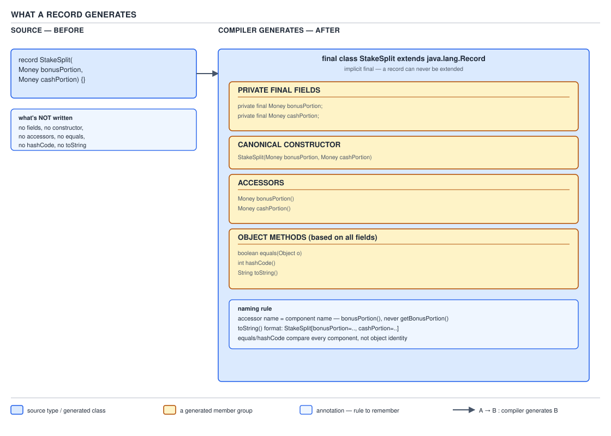
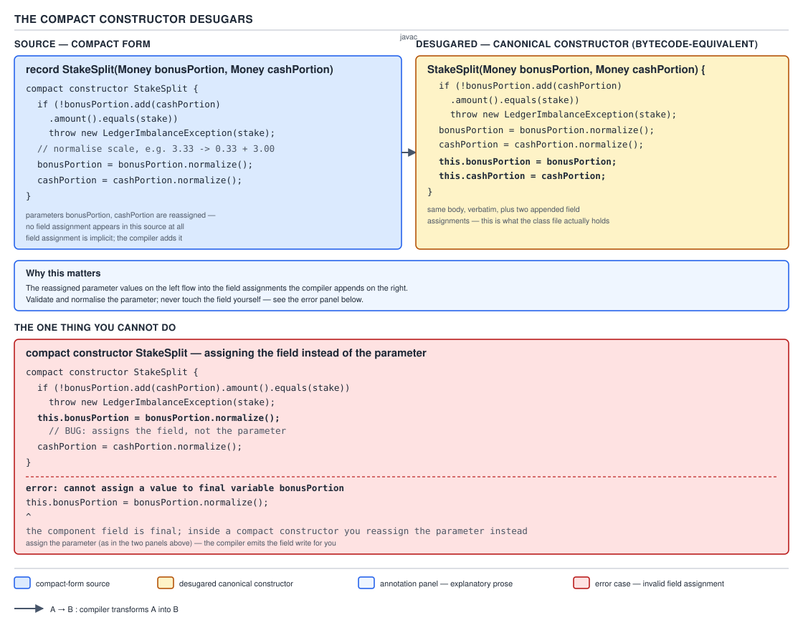

# 04 Modern Java — Records — BASICS (§1.13)

**Target version: Java 21 LTS.** | **Part 1 of 5** | [Index](../00-index.md)
Previous: [`var` — internals inference](../var/03-internals-inference.md) · Next: [Records — basics b](01-basics-b.md)

## Scope of this file

This file covers the shape of a record, what the compiler generates from a header, the two
constructor forms — canonical and compact — the discipline that makes the compact form safe,
what happens when you override a generated member, and how records behave under genericity,
locality, and nesting. `01-basics-b.md` continues the subject from there.

---

## Records as nominal tuples

### Mental model

A tuple in a language with real tuple types — Python's `(x, y)`, Scala's `(Int, String)` — is a
fixed-size, ordered bag of values with no name of its own; you address its slots by position.
A Java record is that same idea with one twist: the bag gets a name, and its slots get names too.
`record StakeSplit(Money bonusPortion, Money cashPortion)` is positionally exactly
`Tuple2<Money, Money>` would be, but you write `split.bonusPortion()` instead of `split._1()`, and
the type system knows this particular pair means "how a stake divided between bonus and cash",
not "any two Money values that happen to travel together". Picture a `record` header as a
compiler-readable spec sheet: you hand the compiler a list of (type, name) pairs, and it hands
back a fully-formed immutable class — fields, constructor, accessors, `equals`, `hashCode`,
`toString` — built mechanically from that list, the same way a factory stamps out parts from a
die. You are not writing a class. You are writing the die.

### Why it exists

Before records (Java ≤ 15), a class whose entire job was "hold these values together" still cost
you the full class-authoring ritual: declare each field `private final`, write a constructor that
assigns every one of them, write an accessor per field, override `equals` and `hashCode` together
(and keep them in sync by hand whenever a field was added or removed), override `toString` for
anything you'd ever want to log or debug, and get all of it right for every value-holding type in
the codebase — `StakeSplit`, `LimitSet`, `AgreementRef`, `RestrictionKey`. IDEs generated most of
this boilerplate, which solved the typing effort but not the real cost: every generated block was
now *text in your file*, subject to bit-rot. Add a field to the QuizStakes `LimitSet(dailyDeposit,
maxStake, monthlyLoss)` class and if you forget to touch the generated `equals`, two `LimitSet`
values that differ only in `monthlyLoss` will compare `true` forever, silently, until a production
incident surfaces it. Lombok's `@Value` and `@Data` annotations were the community's answer for a
decade — code generation via annotation processing, invisible at compile time, visible only in the
`.class` file. Records fold that same generation into the language itself: the compiler owns the
invariant "these members are always in sync with the header" so no third-party tool and no
forgotten regeneration step can violate it.

**Brian Goetz's framing — "nominal tuples" — and why the name matters.** `[RESEARCH]` Goetz,
architect of the Java language for Oracle, described records in Amber design documents and talks
as **nominal tuples**: tuples (structural, positional aggregates of state) that carry a *name*
(a nominal type distinguishing `StakeSplit` from `LimitSet` even if both happened to be two
`Money`/`BigDecimal` fields in a row). The word choice rules out two things a casual reader might
otherwise assume records are:

- It rules out **structural typing**. Two records with identical component lists are still
  different, incompatible types — `record A(int x, int y)` and `record B(int x, int y)` do not
  unify, cannot be assigned to each other, and do not satisfy each other's equality. "Tuple" alone
  (as in TypeScript's `[number, number]`) would suggest otherwise; "nominal" forecloses it.
- It rules out records as a **general-purpose class replacement**. A tuple's whole contract is
  "transparent state, nothing else defines identity" — which is why records cannot extend another
  class (a superclass could smuggle in state the record doesn't declare, breaking transparency)
  and why every accessor exposes exactly what the constructor received, no more, no less. A record
  is not "a class with less typing"; it is a specific semantic commitment — *this type's meaning
  is fully determined by this ordered list of components* — and the restrictions the compiler
  enforces exist to keep that commitment true.

### When to reach for it, and when not

Reach for a record when a type's entire contract is "these values, together, and nothing else" —
`StakeSplit`, `Money`, `ClientId`, `LimitSet`. Do not reach for it when the type needs identity
independent of its state (two `Application` aggregates with identical field values on a given day
are still different applications — that wants a class with an explicit `applicationId` field
compared by reference-adjacent identity, or a JPA `@Entity`, not a record), when the type has
mutable state that must change in place over its lifetime (a `Reservation` whose status transitions
from open to settled needs a mutable field or an explicit "with a new status" factory method
returning a fresh instance — a record can do the latter but not the former), or when the type
needs more state than its public constructor exposes (a lazily-computed cache field, a mutable
retry counter). The sibling that wins in exactly that last case is a conventional class with
`private` fields not mirrored by any accessor — a record's `[final fields must equal components]`
invariant (see the next section) forecloses that option entirely.

### How it works — the header and what it derives

The record header is the entire contract:

```java
record StakeSplit(Money bonusPortion, Money cashPortion) {}
```

Everything else in the type is *derived*, not authored. From that one line the compiler produces:

1. One `private final` field per component, in header order, with the header's exact name and
   type — `private final Money bonusPortion;` and `private final Money cashPortion;`.
2. A **canonical constructor** taking exactly the header's parameter list in order, assigning each
   field from its like-named parameter.
3. One **accessor** per component, named exactly as the component — `bonusPortion()`, not
   `getBonusPortion()`. (§1.13.5, next.)
4. `equals(Object)` — `true` iff the other object is the same record class and every component
   compares equal via `Objects.equals` (or primitive `==` for primitive components).
5. `hashCode()` — combines every component's hash the same way `Objects.hash(...)` would,
   guaranteeing the equal-hashCode contract by construction.
6. `toString()` — the record's simple name followed by each component name and value in header
   order, e.g. `StakeSplit[bonusPortion=Money[amount=0.33, currency=GBP], cashPortion=Money[amount=3.00, currency=GBP]]`.


**D-051** — What a record generates

**Insight:** none of these five members are optional extras you can suppress by fiat — they are
the *definition* of what "record" means. If you declare an accessor, `equals`, `hashCode`, or
`toString` explicitly yourself, you are not disabling generation, you are *overriding* it (covered
under `1.13.13` in the next file); the compiler still checks your override's shape against what it
would have generated.

**Accessors are `name()`, not `getName()`.** `[TRAP]` This is a deliberate divergence from the
JavaBeans convention (`getFoo()`/`setFoo()`/`isFoo()`) that has driven Java tooling since the
mid-1990s — Jackson's default `ObjectMapper`, most JSP EL expression evaluators, and any framework
that reflects for `get`-prefixed methods will not find `bonusPortion()` unless it has been taught
records explicitly.

**Pitfall:** serializing a `StakeSplit` record with an un-upgraded Jackson (pre-2.12, before
`ParameterNamesModule`/record support landed) silently produces `{}` — no exception, no
`bonusPortion` field in the JSON — because Jackson's bean introspector looked for `getBonusPortion()`
and `isBonusPortion()`, found neither, and concluded the type had zero visible properties. Jackson
2.12+ added a record-aware `POJOPropertiesCollector` path that reads accessors named exactly as
components; on 2.15+ this is on by default, but any codebase still pinned to an older
`jackson-databind` will hit this. **Why people believe it works:** most tutorials show a record
round-tripping cleanly through `ObjectMapper` because their sandbox already pins a current Jackson
version, so the failure only shows up against an older dependency tree — exactly the kind of
surprise a `mvn dependency:tree` audit catches and a quick "works on my machine" demo does not.

**Implicit modifiers.** Every record is implicitly `final` — you cannot write `abstract record` or
extend one with `class Foo extends StakeSplit`. Every record implicitly `extends
java.lang.Record`, an abstract class in `java.base` that declares abstract `equals`, `hashCode`,
and `toString` (forcing every record to provide them, generated or explicit) and provides no
instance fields of its own. Because Java is single-inheritance and `java.lang.Record` already
occupies the superclass slot, **a record cannot extend anything else** — it can only implement
interfaces, which is why `record StatusCode(...) implements Comparable<StatusCode>` compiles but
there is no way to write a record that also extends some shared abstract base class carrying
common fields.

`[SOURCE]` `java.lang.Record`'s class-level javadoc states plainly: *"all records have the
following mandated members: a public canonical constructor... a private final field corresponding
to each component of the record... a public accessor method for each component... implementations
of equals and hashCode..."* — mandated, not merely conventional. This is why `javac` refuses to
compile a record class whose explicit `equals` override forgets to also override `hashCode`
consistently (it will compile — the contract is not enforced by the compiler for hand-rolled
overrides — but `java.lang.Record` mandating the *presence* of both is why the record cannot
simply omit one; §1.13.13 covers what happens when you supply one and not the other).

**A record may not declare additional instance fields.** It may declare `static` fields, `static`
and instance methods, `static` initialisers, and nested types, and it may implement interfaces —
but every *instance* field a `javap -p` listing shows for a record class is exactly the component
list, no more. This is the enforcement mechanism behind "transparent" in "transparent carrier":
there is no place to hide state that the header doesn't declare, so reflecting on the header tells
you the complete truth about an instance's data.

```java
record RestrictionKey(RestrictionType type, RestrictionSource source) {

    // OK: static field
    static final RestrictionKey SELF_EXCLUSION_ADMIN =
        new RestrictionKey(RestrictionType.SELF_EXCLUDED, RestrictionSource.CLIENT);

    // OK: static factory method
    static RestrictionKey onboardingBlock() {
        return new RestrictionKey(RestrictionType.STAKE_BLOCKED, RestrictionSource.SYSTEM_ONBOARDING);
    }

    // OK: instance method, reads only the two components
    boolean liftsAutomaticallyOnActivation() {
        return source == RestrictionSource.SYSTEM_ONBOARDING;
    }

    // NOT OK — compile error: "records cannot declare instance fields"
    // private boolean cached;
}
```

`RestrictionType` and `RestrictionSource` come straight from the QuizStakes restriction model —
`STAKE_BLOCKED` sourced from `SYSTEM_ONBOARDING` lifts automatically the moment the account reaches
`AA-801`, while the identical restriction type sourced from `ADMIN` does not, precisely because
**identity is the pair**, which is exactly the kind of invariant a two-component record is built
to carry without a mutable flag anywhere near it.

> **A record is a nominal tuple: a named, immutable, transparent carrier whose entire state is its
> ordered component list, and whose canonical constructor, accessors, `equals`, `hashCode`, and
> `toString` are derived from that list by the compiler rather than authored by hand.**

---

## The canonical constructor and the compact constructor

### Mental model

Think of the canonical constructor as the one door into a `record` instance, and the compact
constructor as a **doormat you place just inside that door** — every value that will become a
field walks across it, and the doormat gets to inspect, clean, or reject what's carried across
before letting it through to the field-assignment step waiting on the other side. You never touch
the field-assignment step yourself; the compiler owns it and runs it automatically the instant the
doormat's code finishes. Everything you write in a compact constructor is a `filter`/`peek` step
inserted before an assignment the compiler will always perform for you.

### Why it exists

Records are billed as boilerplate-free data carriers, but almost no non-trivial value type is
willing to accept *any* combination of its component types — `StakeSplit`'s whole reason to exist
is the invariant "the two parts sum to the stake", and a `StakeSplit(Money.of(-5), Money.of(10))`
that nobody checked is worse than no type safety at all, because it *looks* validated. Before the
compact form (Java 14+ preview, 16+ final), the only way to validate a record's inputs was to
write the full canonical constructor explicitly, with every field assignment spelled out by hand —
which throws away the entire "the compiler derives this for you" value proposition the moment a
type needs even a single `if`. The compact form is the language closing that gap: you get the
validation hook without giving up the generated assignment step.

### When to reach for it, and when not

Reach for the compact constructor whenever a record has an invariant across two or more
components (`StakeSplit`'s sum-to-stake rule), needs normalisation (rounding a `BigDecimal`'s
scale, trimming a `String`, defensive-copying a mutable array or `List` parameter before it
becomes a field), or needs a null-check with a domain-specific message. Reach for the fully
explicit canonical constructor instead only when you need to do something a compact constructor's
restricted shape forbids — the compact form cannot change field types, cannot skip assigning a
component to work around a corner case, and (as covered next) cannot explicitly write the field
assignments at all. If neither applies and there is no validation to do, write no constructor: the
implicit canonical constructor the compiler synthesizes from the header alone is correct, and
adding an empty compact form (`public StakeSplit {}`) would be pure noise.

### How it works `[PROVE]`

There are three constructor states a record can be in, and it helps to walk from the simplest to
the most explicit to see exactly what the compact form desugars into.

**State 1 — implicit canonical constructor.** Write no constructor at all. The compiler
synthesizes:

```java
public StakeSplit(Money bonusPortion, Money cashPortion) {
    this.bonusPortion = bonusPortion;
    this.cashPortion = cashPortion;
}
```

**State 2 — explicit canonical constructor.** Write out the full parameter list yourself, exactly
matching the header in name, type, and order, and assign every field yourself:

```java
public StakeSplit(Money bonusPortion, Money cashPortion) {
    if (bonusPortion.currency() != cashPortion.currency()) {
        throw new IllegalArgumentException("currency mismatch");
    }
    this.bonusPortion = bonusPortion;
    this.cashPortion = cashPortion;
}
```

This compiles, and it is legal Java — but notice you now own the field-assignment step
completely, and nothing stops you from assigning the fields in a different order, skipping one, or
assigning a *transformed* value to one field while leaving another raw. That flexibility is exactly
what the compact form gives up in exchange for a much narrower, much safer contract.

**State 3 — compact constructor.** No parameter list at all — just the record name followed
directly by a body:

```java
record StakeSplit(Money bonusPortion, Money cashPortion) {

    public StakeSplit {
        Money declaredStake = bonusPortion.add(cashPortion);
        if (bonusPortion.amount().signum() < 0 || cashPortion.amount().signum() < 0) {
            throw new IllegalArgumentException(
                "StakeSplit components must be non-negative: " + bonusPortion + ", " + cashPortion);
        }
        bonusPortion = bonusPortion.withScale(2);
        cashPortion = cashPortion.withScale(2);
    }
}
```

Here is the argument the leaf tag asks for, worked rather than asserted. The compact form's
*parameters* are the header's components, in scope by name inside the body, exactly as if they had
been declared as the constructor's formal parameters — but there is no field-assignment statement
anywhere in the body. The compiler desugars this into precisely the same shape as State 2, except
it appends the field assignments itself, **after** every statement you wrote, in header order,
using whatever the parameter variables are bound to at that point:

```java
public StakeSplit(Money bonusPortion, Money cashPortion) {
    Money declaredStake = bonusPortion.add(cashPortion);
    if (bonusPortion.amount().signum() < 0 || cashPortion.amount().signum() < 0) {
        throw new IllegalArgumentException(
            "StakeSplit components must be non-negative: " + bonusPortion + ", " + cashPortion);
    }
    bonusPortion = bonusPortion.withScale(2);
    cashPortion = cashPortion.withScale(2);
    // compiler-appended, not written by you:
    this.bonusPortion = bonusPortion;
    this.cashPortion = cashPortion;
}
```

That is the entire mechanism: **a compact constructor is sugar for "canonical constructor body,
plus a compiler-appended tail that assigns every field from the like-named parameter, in header
order."** Because the assignment always happens *last* and always reads whatever the parameter is
bound to *at that point*, reassigning the parameter inside the body is not a side effect you cause
and then separately have to propagate — it *is* the mechanism by which your validated/normalised
value becomes the field's value. There is no second step you must remember to perform.


**D-052** — The compact constructor desugars

### The QuizStakes worked example — the 3.33 split

`StakeSplit(Money bonusPortion, Money cashPortion)` carries the invariant that the two components
sum exactly to the stake. QuizStakes' bonus-consumption rule (§ domain bonus rules) says the bonus
portion of a stake is `min(BONUS_AVAILABLE, 10% of stake)`, **rounded down** to the minor unit,
with cash covering the remainder. Take the canonical example: a stake of **3.33**. Ten percent of
3.33 is 0.333; rounded down to two decimal places (the minor unit for GBP) that is **0.33**. Cash
covers the remainder: `3.33 − 0.33 = 3.00`. So the correct split is **0.33 bonus + 3.00 cash**,
and `0.33 + 3.00 = 3.33` — the invariant holds by construction because the cash portion is defined
as "whatever is left", never computed independently. Rounding the bonus portion the *other*
way — up, to 0.34 — would give `0.34 + 3.00 = 3.34`, **one hundredth of a currency unit more than
the client staked**, manufactured out of nothing. This is precisely the kind of defect a
`StakeSplit` compact constructor exists to catch before it reaches the ledger:

```java
record StakeSplit(Money bonusPortion, Money cashPortion) {

    public StakeSplit {
        if (bonusPortion.currency() != cashPortion.currency()) {
            throw new IllegalArgumentException(
                "StakeSplit components must share a currency: "
                    + bonusPortion.currency() + " vs " + cashPortion.currency());
        }
        // Defensive normalisation: every Money entering a StakeSplit is scaled to the
        // currency's minor unit before it becomes a field, so a caller who forgot to
        // round cannot smuggle a mis-scaled BigDecimal into the ledger.
        bonusPortion = bonusPortion.withScale(2);
        cashPortion = cashPortion.withScale(2);
    }

    static StakeSplit of(Money stake, Money bonusAvailable) {
        BigDecimal tenPercent = stake.amount()
            .multiply(BigDecimal.valueOf(0.10))
            .setScale(2, RoundingMode.DOWN);
        BigDecimal bonusAmount = tenPercent.min(bonusAvailable.amount());
        Money bonus = new Money(bonusAmount, stake.currency());
        Money cash = new Money(stake.amount().subtract(bonusAmount), stake.currency());
        return new StakeSplit(bonus, cash);
    }
}
```

`StakeSplit.of(Money.of("3.33", GBP), Money.of("50.00", GBP))` computes `tenPercent = 0.33`
(`3.33 × 0.10 = 0.333`, scaled down to `0.33`), takes the `min` against the 50.00 available bonus
(0.33 wins), and returns `StakeSplit[bonusPortion=Money[0.33, GBP], cashPortion=Money[3.00, GBP]]`
— the exact canonical figure, arrived at by the arithmetic rather than asserted.

### Validation and normalisation belong in the compact constructor, and the fix is reassignment, not field assignment `[TRAP]`

The natural first instinct, coming from any pre-record Java experience, is to write the
"obviously correct" defensive-copy or normalisation line inside a compact constructor exactly the
way you would inside a hand-written constructor — by assigning `this.fieldName`. That does not
compile, and understanding *why* is the entire point of the leaf.

**Pitfall — assigning the field instead of the parameter:**

```java
record StakeSplit(Money bonusPortion, Money cashPortion) {
    public StakeSplit {
        // WRONG — looks identical to ordinary constructor style, does not compile
        this.bonusPortion = bonusPortion.setScale(2);
    }
}
```

Verified by compiling exactly this on this machine (`javac --release 21`), the diagnostic is:

```
T.java:4: error: cannot assign a value to final variable bonusPortion
        this.bonusPortion = bonusPortion.setScale(2);
            ^
1 error
```

Not "invalid explicit assignment" and not any paraphrase of "records forbid field writes" — the
message is the perfectly ordinary `final`-variable diagnostic `javac` gives for *any* attempt to
write to a `final` field a second time, because that is exactly what this is. The record's
`private final` fields are created and assigned exactly once, by the compiler-appended tail
described above; by the time your compact-constructor body would run `this.bonusPortion = ...`,
that field has not been assigned yet in program order (the appended assignment comes *after* your
body), yet the field is already `final`-typed and the compiler statically forbids any explicit
assignment to a record's field from within its own compact constructor body, full stop — you are
not permitted to race the compiler's own assignment or duplicate it. The right fix is to operate
on the **parameter**, which is an ordinary (non-final, unless you mark it so) local variable for
the duration of the compact constructor body:

**Right:**

```java
record StakeSplit(Money bonusPortion, Money cashPortion) {
    public StakeSplit {
        bonusPortion = bonusPortion.withScale(2); // reassigns the PARAMETER
        cashPortion = cashPortion.withScale(2);
        // compiler appends: this.bonusPortion = bonusPortion; this.cashPortion = cashPortion;
    }
}
```

**Why people believe the wrong form should work:** every Java constructor they have ever written
before a record used exactly the `this.field = parameter` idiom to disambiguate a shadowed name,
and that habit is so deeply trained that reaching for it inside a compact constructor feels like
the obviously correct move — nothing about the compact form's syntax visually warns you that the
field-assignment step has already been claimed by the compiler.

### Alternate constructors must delegate via `this(...)`

A record can declare additional constructors beyond the canonical one, but every one of them must
have a **different parameter list** from the canonical constructor (else it *is* an attempt to
redeclare the canonical constructor with a different body, which for the compact-vs-explicit
question above is a separate matter entirely) and — this is the part the compiler enforces — its
**first statement must be an explicit `this(...)` call** that ultimately reaches the canonical
constructor, directly or through a chain of other alternate constructors. An alternate constructor
can never assign fields itself:

```java
record StakeSplit(Money bonusPortion, Money cashPortion) {

    public StakeSplit {
        if (bonusPortion.currency() != cashPortion.currency()) {
            throw new IllegalArgumentException("currency mismatch");
        }
    }

    // Alternate constructor: caller supplies only the total, split is all-cash.
    StakeSplit(Money stakeTotal) {
        this(Money.zero(stakeTotal.currency()), stakeTotal);
    }
}
```

`StakeSplit(Money stakeTotal)` cannot write `this.cashPortion = stakeTotal;` itself — every path to
a `StakeSplit` instance is forced through the canonical constructor (compact or otherwise), which
is precisely how the invariant checked there ends up enforced on every construction path, not just
the "main" one. **Insight:** this is the mechanism that makes a record's validation genuinely
inescapable — there is no back door through an overload the way a hand-rolled class can
accidentally leave one constructor unvalidated.

### An explicit canonical constructor must be at least as accessible as the record itself

If `StakeSplit` is declared `public`, an explicit canonical constructor (compact or fully spelled
out) may not be declared `private` or package-private — it must be `public` too, because a record
that is publicly constructible in principle (its header says so) but has no publicly reachable
constructor would be a contradiction the compiler refuses to let stand. A `package-private` record
may narrow its canonical constructor no further than package-private; a `public` record's
canonical constructor may be `public` or, in principle, more permissive is meaningless (`public`
is already the ceiling), so in practice a `public` record's canonical constructor is always
written `public` (or omitted, in which case the implicit one takes the record's own access level).
This is a supporting fact rather than a primary concept — it has no cost tradeoff and no sibling —
but it does explain a compile error that otherwise looks unrelated to accessibility at all:

```java
public record LimitSet(Money dailyDeposit, Money maxStake, Money monthlyLoss) {
    LimitSet { // package-private canonical constructor on a PUBLIC record
        // error: canonical constructor is not as accessible as record class LimitSet
    }
}
```

> **The compact constructor is sugar for the canonical constructor's body plus a compiler-appended
> field-assignment tail run in header order after your code; because that tail always reads the
> current value of the parameter, validating or normalising a record means reassigning the
> parameter — assigning the field yourself is a compile error, because the field is `final` and the
> compiler, not you, owns writing to it.**

---

## Overriding a generated member — and owning its contract

### Mental model

The five generated members (per-component accessors, `equals`, `hashCode`, `toString`) are not
`final`. Think of each one as a default implementation stamped onto the class *before* the
compiler looks at what you wrote yourself, the way an interface's `default` method is overridable
by any implementing class — except here the "interface" is the record header and the "default
implementations" are mechanically derived from it. Write your own `equals(Object)`, and the
compiler simply does not stamp the generated one; your version replaces it entirely, source and
byte for byte.

### Why it exists

A generated accessor is a bare field read. Sometimes that is not the contract you want to expose —
`StakeSplit.bonusPortion()` might need to return a copy of a mutable `Money` component to preserve
immutability against a caller mutating what they got back, or an accessor might need to clamp a
denormalised value on the way out rather than on the way in. A generated `equals`/`hashCode` pair
compares and hashes every component; sometimes a domain type wants a narrower equality — a
`VerificationCase` record might want two instances to compare equal on `caseId` alone, ignoring a
`lastTouchedAt` timestamp component that changes on every read. Records allow the override so a
data carrier is not forced to give up carrier semantics the moment one member needs to diverge
from what the header alone would produce.

### When to reach for it, and when not

Override an accessor when the raw field read is not the value you want to expose (defensive
copying, derived transformation). Override `equals`/`hashCode` together, never separately, when
the domain's notion of equality is narrower than "every component equal" — and when you do,
override both in the same edit, because a record's `equals` and `hashCode` no longer have any
compiler-enforced link to each other once either is overridden. Do not override `toString` merely
to reformat logging output if a `toString` override elsewhere in the codebase already exists for
that purpose (prefer a dedicated formatting method); reserve `toString` overrides for cases where
the generated `TypeName[comp=val, ...]` shape leaks sensitive data (a `Money` amount you don't want
in logs) or is actively misleading.

### How it works, and the contract you now own `[TRAP]` `[X-REF 03]`

The moment you write `public boolean equals(Object o) { ... }` inside a record body, the compiler
generates nothing for `equals` — your method is the only one that exists in the class file. The
same is independently true for `hashCode` and for each accessor. Nothing links these decisions to
each other: overriding `equals` does **not** automatically suppress `hashCode` generation, and if
you override only `equals`, the record still gets its **generated** `hashCode`, computed from every
component — which is very likely inconsistent with your narrowed `equals` and breaks the
fundamental contract (`a.equals(b)` implies `a.hashCode() == b.hashCode()`), the same contract
every plain Java class has always had to honor by hand, just now easier to violate by accident
because half the pair looks "free":

```java
record VerificationCase(String caseId, Instant lastTouchedAt, DocumentVerdict verdict) {

    // Overrides equals to compare only caseId — deliberately narrower than the generated version.
    @Override
    public boolean equals(Object other) {
        return other instanceof VerificationCase v && caseId.equals(v.caseId);
    }

    // MUST override hashCode too, consistently, or the contract breaks:
    @Override
    public int hashCode() {
        return caseId.hashCode();
    }
}
```

Without the `hashCode` override, two `VerificationCase` instances with the same `caseId` but
different `lastTouchedAt` would satisfy `equals` but very likely hash to different buckets — a
`HashSet<VerificationCase>` would then silently admit duplicates by the domain's own notion of
"same case", because `contains`/`add` consult `hashCode` first and never even reach the narrowed
`equals` when the hashes disagree. This equal-implies-equal-hash mechanism, and the general
contract every `hashCode` override must satisfy (`equals` true ⇒ hashes equal; `equals` false ⇒
hashes *may* still collide, that's fine; a type's hash must stay stable across the object's
lifetime for any component read by `equals`), is guide 03's full territory — the general contract
for arbitrary Java classes, not just records, including why `hashCode` stability requirements
interact with mutability, is worth the deeper treatment there.

**Pitfall:** overriding `equals` on a record without overriding `hashCode` in the same change.
The symptom is almost always downstream and silent — a `Set` or `Map` keyed on the record
"loses" entries that look like duplicates by eye but hash to different buckets, and the bug
surfaces as "why did two identical-looking cases both get processed" days after the code shipped,
not at compile time and not in an obvious unit test unless that test specifically checks
`hashCode()` equality alongside `equals()`.

> **Overriding any one of a record's generated members (an accessor, `equals`, `hashCode`,
> `toString`) replaces only that member — nothing else is suppressed or re-derived — so overriding
> `equals` without also overriding `hashCode` consistently reintroduces the exact
> equal-implies-equal-hash bug records were supposed to make impossible.**

---

## Generic records and record patterns

### Mental model

A generic record is a stamped-out type family, the same way `List<E>` is a family of types rather
than one type — `record Verdict<R>(R outcome, String reason, Instant decidedAt)` is a template the
compiler fills in once per type argument used at a call site, and pattern matching against it
(`case Verdict<DocumentVerdict> v when ...`) is how a `switch` reaches into that filled-in template
without an explicit accessor call.

### Why it exists

QuizStakes' domain sketch declares `Verdict(outcome, reason, decidedAt, decidedBy)` as a sealed
hierarchy of concrete verdict types (`DocumentVerdict`, `ScreeningVerdict`, `ReviewVerdict`,
`WealthVerdict`) rather than one generic record, precisely because each verdict subtype's
`outcome` has a different shape (a document verdict's outcome is a pass/fail/referred enum; a
wealth verdict's outcome carries a numeric score). But plenty of value types genuinely are uniform
across a type parameter — a `Timestamped<T>` wrapper pairing any value with when it was observed,
or a `Page<T>` carrying a list of `T` plus paging metadata — and forcing every such wrapper into a
sealed hierarchy of concrete types would multiply boilerplate exactly where generics exist to
avoid it. Generic records let a record header carry type parameters the same way any generic class
declaration would.

### When to reach for it, and when not

Reach for a generic record when the same shape genuinely repeats across unrelated component
types with no type-specific behavior — a `Timestamped<T>(T value, Instant observedAt)` used for
both `Timestamped<Money>` balances and `Timestamped<StatusCode>` transitions. Do not reach for it
when each type argument implies different validation or behavior; that is what a sealed interface
of concrete records is for, and QuizStakes' own `Verdict` hierarchy is the worked counter-example
already in the domain.

### How it works

```java
record Timestamped<T>(T value, Instant observedAt) {
    static <T> Timestamped<T> now(T value, Clock clock) {
        return new Timestamped<>(value, clock.instant());
    }
}
```

Type erasure applies to a generic record exactly as it does to any other generic class: at
runtime there is one `Timestamped` class file, and `Timestamped<Money>` versus
`Timestamped<StatusCode>` are the same `.class`, distinguished only at compile time. The generated
accessor `value()` returns type `T`, erased to `Object` in the bytecode with a compiler-inserted
checkcast at each call site, the same erasure story as any other generic method or field. Nothing
about being a record changes erasure's rules.

**Type parameters in record patterns.** Since Java 21's record patterns (finalized by JEP 440),
you can deconstruct a generic record inside a pattern, and the type argument participates in the
pattern's own type check:

```java
Object entry = Timestamped.now(Money.of("3.33", GBP), Clock.systemUTC());

String description = switch (entry) {
    case Timestamped<Money> t -> "Money observed at " + t.observedAt() + ": " + t.value();
    case Timestamped<?> t     -> "Non-money value observed at " + t.observedAt();
    default                   -> "not timestamped";
};
```

`Timestamped<Money> t` as a pattern performs an `instanceof`-style check against the raw
`Timestamped` type (erasure means the runtime cannot actually verify the `<Money>` part), then
binds `t` with static type `Timestamped<Money>` — the type argument narrows what the compiler lets
you do with `t` afterward (`t.value()` is statically `Money`, no cast needed) but contributes
nothing to what actually gets checked at runtime, which is exactly type erasure's usual shape
showing up inside a pattern rather than a cast expression. Nested deconstruction goes further —
`case Timestamped<Money>(Money m, Instant at) when m.amount().signum() > 0 -> ...` binds the
components directly, letting a `switch` reach past the accessor calls entirely.

> **A generic record's type parameter is erased exactly like any other generic class's; a record
> pattern's type argument narrows the compiler's static view of the bound variable but performs no
> additional runtime check beyond the ordinary erasure-based `instanceof`.**

---

## Local records, nested records, and records declared inside an interface

### Mental model

A local record is a record header written inside a method body, scoped the way a local class or a
lambda's captured variables are — it exists only for the duration of that method's logic, visible
to nobody outside it. A nested record is a record declared as a member of an enclosing class or
interface, and — unlike a nested plain class, which defaults to an inner (non-static) class
carrying an implicit reference to its enclosing instance — a nested record is **implicitly
`static`**, because a record's whole contract is that its state is exactly its component list; an
implicit enclosing-instance reference would be exactly the kind of hidden extra state records are
built to forbid.

### Why it exists

Local records (Java 16+, alongside the feature's finalization) exist for the same reason local
classes and lambdas exist: sometimes a small, throwaway aggregate is genuinely local to one method
and giving it a top-level or even a nested-class-level name only pollutes a namespace nobody else
needs. Before local records, a method that wanted to group two computed values (say, a running
tally and a count while scanning stake reservations) either returned an array, an `Object[]`, a
`Map.Entry`, or forced the author out to declare a small top-level or nested class purely to carry
two locals across a `return` boundary. A local record collapses that to a one-line declaration
right where it's used.

### When to reach for it, and when not

Reach for a local record when a value shape is needed only inside one method and never crosses
that method's boundary as a public return type or parameter. Reach for a nested (member) record
instead the moment the shape needs to be a public or package-visible return type, a field type
elsewhere in the class, or reused by more than one method — a local record's scope makes it
invisible outside the method that declares it, so it cannot serve as an API surface.

### How it works

```java
List<Movement> summariseByRail(List<Movement> movements) {
    // Local record — visible only inside this method.
    record RailTotal(PaymentRail rail, Money total, int count) {}

    Map<PaymentRail, RailTotal> byRail = movements.stream()
        .collect(Collectors.groupingBy(
            Movement::rail,
            Collectors.collectingAndThen(
                Collectors.toList(),
                list -> new RailTotal(
                    list.get(0).rail(),
                    list.stream().map(Movement::amount).reduce(Money.zero(GBP), Money::add),
                    list.size()))));

    return byRail.values().stream()
        .map(rt -> new Movement(rt.rail(), rt.total(), rt.count()))
        .toList();
}
```

`RailTotal` never leaves `summariseByRail` — it is not a return type, not a field, not visible to
any other method — which is exactly the shape a local record is for: grouping card deposits,
bank deposits, and bonus grants by rail for one summary pass without minting a class the rest of
the codebase has to know exists.

A **nested record** on a class or interface is implicitly `static`, whether or not you write the
keyword:

```java
final class PaymentService {
    record BatchResult(int accepted, int rejected, List<IdempotencyKey> duplicates) {}

    BatchResult run(List<WithdrawalTransaction> batch) {
        return new BatchResult(batch.size(), 0, List.of());
    }
}
```

`PaymentService.BatchResult` behaves exactly as `static record BatchResult` would if you wrote the
modifier explicitly — writing `static` is legal but redundant, the same relationship `static` has
to a nested `enum`, which is also implicitly static for an identical reason (an `enum` constant's
identity cannot depend on an enclosing instance either).

**Records declared inside an interface** are implicitly `public` and `static`, following the same
rule every member type of an interface has followed since nested types were introduced — an
interface has no instances of its own to hold an enclosing-instance reference against in the first
place, so the `static` designation is not just implicit but the only designation that could ever
have made sense:

```java
interface DocumentVerification {
    record Outcome(DocumentVerdict verdict, Instant decidedAt) {}

    Outcome verify(byte[] document);
}
```

`DocumentVerification.Outcome` is visible to any implementor and any caller exactly as if it had
been declared `public static record Outcome(...)` inside a top-level class — the interface context
adds the implicit `public` on top of the implicit `static` every nested record already carries.

> **A local record's scope ends with its enclosing method; a nested record — on a class or an
> interface — is implicitly `static`, because a record's contract that its state is exactly its
> component list leaves no room for a hidden enclosing-instance reference.**

---

## Pitfalls

### Assigning the field instead of the parameter inside a compact constructor

**Wrong**

```java
record StakeSplit(Money bonusPortion, Money cashPortion) {
    public StakeSplit {
        this.bonusPortion = bonusPortion.withScale(2); // does not compile
    }
}
```

Verified diagnostic (`javac --release 21`):

```
T.java:4: error: cannot assign a value to final variable bonusPortion
        this.bonusPortion = bonusPortion.withScale(2);
            ^
1 error
```

**Right**

```java
record StakeSplit(Money bonusPortion, Money cashPortion) {
    public StakeSplit {
        bonusPortion = bonusPortion.withScale(2); // reassigns the parameter
        cashPortion = cashPortion.withScale(2);
    }
}
```

The compiler appends `this.bonusPortion = bonusPortion; this.cashPortion = cashPortion;` after
your body — reassigning the parameter is how your normalised value reaches the field.

**Why people believe it:** every constructor written before records used `this.field = parameter`
to disambiguate shadowed names, and nothing about the compact form's syntax signals that the
field-assignment step is no longer yours to write.

### Expecting a record to serialize cleanly through an old Jackson version because accessors "look like getters"

**Wrong**

```java
// jackson-databind 2.10 on the classpath
String json = objectMapper.writeValueAsString(
    new StakeSplit(Money.of("0.33", GBP), Money.of("3.00", GBP)));
// -> "{}"   (no exception — silently empty)
```

**Right**

```java
// jackson-databind 2.15+, record-aware bean introspection is on by default
String json = objectMapper.writeValueAsString(
    new StakeSplit(Money.of("0.33", GBP), Money.of("3.00", GBP)));
// -> {"bonusPortion":{"amount":0.33,"currency":"GBP"},"cashPortion":{"amount":3.00,"currency":"GBP"}}
```

If the dependency cannot be upgraded, register `com.fasterxml.jackson.module:jackson-module-parameter-names`
and the record module explicitly, or write a custom `JsonSerializer<StakeSplit>`.

**Why people believe it:** `bonusPortion()` reads like a getter to a human, so it is easy to
assume any JSON library that has ever handled getters handles it — but the introspector's method
name grammar is `get`/`is`-prefixed, and `bonusPortion()` matches neither pattern.

### Assuming a record can hold extra mutable state "just this once"

**Wrong**

```java
record Reservation(ClientId clientId, Money amount) {
    private boolean settled; // does not compile: records cannot declare instance fields
}
```

**Right** — model the state transition as a new value, not a mutation:

```java
record Reservation(ClientId clientId, Money amount, ReservationStatus status) {
    Reservation settled() {
        return new Reservation(clientId, amount, ReservationStatus.SETTLED);
    }
}
```

**Why people believe it:** in an ordinary class, adding "just one more field" is free, so the
instinct carries over — but a record's entire contract is that its header is the complete truth
about its state, and an invisible extra field would break every consumer relying on that.

---

## Cheat sheet

| Fact | Detail |
|---|---|
| Generated per component | `private final` field, accessor `name()` (no `get`/`is` prefix) |
| Generated once, whole-type | canonical constructor, `equals`, `hashCode`, `toString` |
| Implicit modifiers | `final` class, `extends java.lang.Record`, cannot extend anything else |
| Extra state | no additional instance fields; static fields/methods/init/nested types OK |
| Canonical constructor, implicit | synthesized when you write none: assigns every field from the like-named param |
| Canonical constructor, explicit | full param list, you write every `this.field = ...` yourself |
| Compact constructor | no param list; body validates/normalises by **reassigning parameters**; compiler appends `this.field = field;` per component, in header order, after your body |
| Field assignment in compact ctor | compile error — `cannot assign a value to final variable <name>` |
| Alternate constructor | different param list; first statement must be `this(...)` reaching the canonical ctor |
| Canonical ctor accessibility | must be ≥ as accessible as the record class itself |
| `equals`/`hashCode` contract | generated versions always satisfy it by construction |
| `toString` shape | `TypeName[comp1=v1, comp2=v2, ...]` |
| JEP history | 359 preview (14) → 384 second preview (15) → 395 final (16) |
| Overriding one generated member | replaces only that member; no link to any other member's generation |
| Override `equals` alone | breaks equal-implies-equal-hash unless `hashCode` is overridden too, consistently |
| Generic record type parameter | erased exactly like any other generic class's |
| Record pattern with type argument | narrows the compiler's static view of the binding; adds no runtime check beyond erasure-based `instanceof` |
| Local record | scoped to its enclosing method; invisible outside it |
| Nested record (class or interface) | implicitly `static`; interface-nested is also implicitly `public` |

---

## Self-test

**Q1.** Why does `record StakeSplit(Money bonusPortion, Money cashPortion) { public StakeSplit { this.bonusPortion = bonusPortion.withScale(2); } }` fail to compile, and what is the exact fix?

<details><summary>Answer</summary>

It fails because `bonusPortion` is a `private final` field, assigned exactly once by a
compiler-appended tail that runs after your compact-constructor body; the compiler statically
forbids any explicit `this.field = ...` assignment inside a compact constructor's own body, since
that field write belongs to the compiler, not to you. The diagnostic on this machine
(`javac --release 21`) is `cannot assign a value to final variable bonusPortion`. The fix is to
reassign the **parameter** instead — `bonusPortion = bonusPortion.withScale(2);` — which the
compiler-appended `this.bonusPortion = bonusPortion;` then picks up automatically.

</details>

**Q2.** Why are a record's accessors named `bonusPortion()` rather than `getBonusPortion()`, and what breaks as a result?

<details><summary>Answer</summary>

Records deliberately depart from the JavaBeans `get`/`is`/`set` naming convention because a
record's accessor is meant to read as "the value of this component", not "a getter in the OO
sense" — the type's whole point is transparency, not encapsulated mutable state. What breaks:
anything doing JavaBeans-style reflective introspection without record awareness — pre-2.12
`jackson-databind`, older JSP EL evaluators, some legacy ORMs — will not find a property named
`bonusPortion` because it is looking for a `get`-prefixed method and finds none, typically failing
silently (serializing to `{}`) rather than throwing.

</details>

**Q3.** A record is declared `public`. Can its explicit canonical constructor be package-private? Why or why not?

<details><summary>Answer</summary>

No. An explicit canonical constructor (compact or fully spelled out) must be at least as
accessible as the record class itself. A `public` record whose only constructor were narrower
than `public` would be publicly visible as a type but have no publicly reachable way to construct
it — a contradiction the compiler rejects at the canonical constructor specifically, independent
of any other accessibility rule in the class.

</details>

**Q4.** Why can't a record extend another class?

<details><summary>Answer</summary>

Every record implicitly extends `java.lang.Record`, an abstract class in `java.base` that declares
the abstract `equals`, `hashCode`, and `toString` every record must provide. Java classes have
single inheritance, and `java.lang.Record` already occupies the one superclass slot, so a record
cannot also extend a user-defined superclass — it can still implement any number of interfaces,
since interface implementation is unlimited.

</details>

**Q5.** What exactly does the compiler append to a compact constructor's body, and in what order?

<details><summary>Answer</summary>

For each component, in the order it appears in the record header, the compiler appends
`this.<component> = <component>;`, reading whatever value the parameter variable is bound to at
that point in the method — after every statement the author wrote. This is why reassigning a
parameter inside the body is sufficient to change what ends up in the field: the compiler's
appended read happens strictly after your reassignment.

</details>

**Q6.** `StakeSplit.of` computes a bonus portion for a stake of 3.33 with 50.00 bonus available. Walk the arithmetic and state the resulting split.

<details><summary>Answer</summary>

Ten percent of 3.33 is 0.333; QuizStakes rounds the bonus portion **down** to the minor unit
(two decimal places for GBP), giving 0.33. `min(0.33, 50.00 available) = 0.33`. The cash portion
is defined as the remainder, `3.33 − 0.33 = 3.00`, never computed independently — so the invariant
`bonusPortion + cashPortion == stake` holds by construction. The resulting split is
`StakeSplit[bonusPortion=Money[0.33, GBP], cashPortion=Money[3.00, GBP]]`. Rounding the other way
(0.34) would give 0.34 + 3.00 = 3.34, one hundredth more than the client staked.

</details>

**Q7.** Can an alternate (non-canonical) constructor on a record assign a field directly?

<details><summary>Answer</summary>

No. Every alternate constructor's first statement must be an explicit `this(...)` call that,
directly or through a chain of other alternate constructors, ultimately reaches the canonical
constructor. There is no path from an alternate constructor to a bare field assignment — every
instance is forced through the canonical constructor's validation, which is exactly why a record's
invariants cannot be bypassed by adding a convenience overload.

</details>

**Q8.** A record overrides `equals` to compare only one component, but leaves `hashCode` generated. What breaks, and why doesn't the compiler catch it?

<details><summary>Answer</summary>

The generated `hashCode` still hashes every component, while the overridden `equals` now
considers two instances equal on a narrower basis. Two instances that differ only in a component
`equals` no longer looks at will compare equal but very likely hash to different buckets, breaking
the equal-implies-equal-hash contract. A `HashSet`/`HashMap` keyed on the record then "loses"
entries a caller expects to be deduplicated, because bucket lookup consults `hashCode` first and
never reaches the narrowed `equals` when hashes disagree. The compiler doesn't catch it because
overriding one generated member is independent of every other — there is no compiler-enforced
link between a record's `equals` and `hashCode` once either is hand-written, exactly as there
isn't for an ordinary class.

</details>

**Q9.** Is a nested record inside a class implicitly `static`? What about one declared inside an interface?

<details><summary>Answer</summary>

Yes to both. A record nested inside a class is implicitly `static` — writing the keyword is legal
but redundant — because a record's contract that its entire state is its component list leaves no
room for an implicit enclosing-instance reference the way a non-static inner class would carry.
A record declared inside an interface is implicitly both `public` and `static`, following the
same rule every interface member type has followed since nested types existed: an interface has
no instances to hold an enclosing reference against.

</details>

**Q10.** Why can't `RailTotal`, declared as a local record inside `summariseByRail`, be used as that method's return type?

<details><summary>Answer</summary>

A local record's scope ends with the method that declares it, the same as a local class or a
local variable — it is not visible to any code outside that method's body, including the method's
own signature as seen from callers. Using it as a return type would require it to be visible at
the call site, which its local scope forbids; a record intended to cross a method boundary as a
public shape needs to be declared as a nested (member) record instead.

</details>

---

## Deferred

None.

---

## Open questions

- **Unverified:** the exact wording Brian Goetz used for "nominal tuples" in the original Amber
  design documentation was not re-fetched against a primary Amber mailing-list or JEP source
  during this pass; the framing and its implications are widely and consistently attested in
  secondary Amber-team talks and writeups, but the precise phrase's original citation would be
  worth pinning down against `mail.openjdk.org`'s amber-dev archive or a recorded JEP-359 design
  talk.

---

**Leaves covered:** 1.13.1–1.13.15 (15 leaves)
**Leaves deferred:** none
**Diagrams included:** D-051, D-052
**Target version:** Java 21 LTS
**Lines:** 1023
