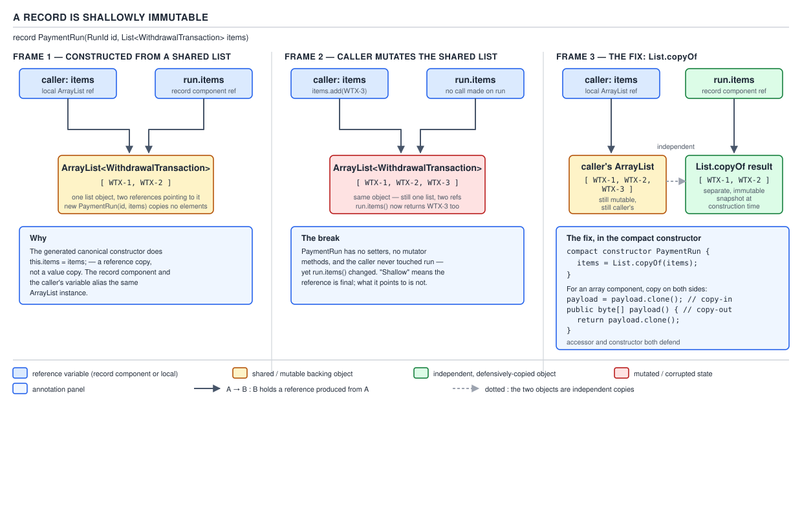
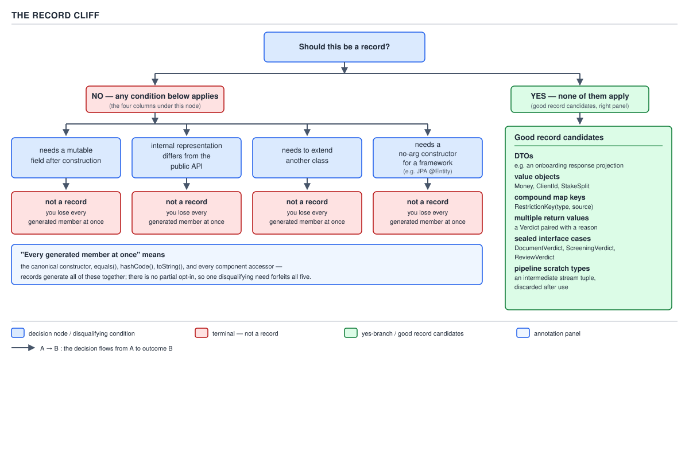

# 04 Modern Java — Records — BASICS (§1.13)

**Target version: Java 21 LTS.** | **Part 1 of 5** | [Index](../00-index.md)
Previous: [Records — basics a](01-basics-a.md) · Next: [Records — in practice](02-in-practice.md)

## Scope of this file

This file picks up where `01-basics-a.md` left off: the record header and the canonical
constructor are already covered there. Here the subject is what the compact constructor does
**not** fix by itself — mutability that leaks through a reference, an `equals` that silently
breaks on an array component, the exact floating-point semantics the generated `equals` gives
you, reflection over a record's shape, how a record survives serialization, and where the whole
mechanism stops paying for itself.

---

### Records are shallowly immutable, and the accessor hands out the live reference

**Mental model.** A record's canonical constructor assigns each component to a `private final`
field, one assignment per component, and the accessor returns that field's value verbatim. "Final"
is a property of the *reference stored in the field*, not a property of the object the reference
points to. A `record` gives you a box that can never be reassigned once built; it says nothing
about whether the thing inside the box can be poked from outside. If the box holds an `ArrayList`,
that `ArrayList` is exactly as mutable after it is boxed as it was before.

**Why it exists — or rather, why the trap exists.** Records were designed to give you the
constructor, `equals`, `hashCode`, `toString`, and accessors for free, in exchange for you writing
one line — the header. That trade only holds for what the compiler can see: the *shape* of the
class, not the *behavior* of each component's own type. `List`, `Map`, `Set`, and arrays are all
mutable-by-default types in the JDK, and nothing in `record`'s desugaring inspects a component's
runtime type to decide whether to defend against it. The compiler cannot know, and does not try to
know, whether `List<WithdrawalTransaction>` in your header means "an immutable view I built with
`List.of(...)`" or "the exact `ArrayList` my caller is still holding a reference to and about to
mutate in the next line." It treats both identically: assign the reference, done.

**When this bites, and when it does not.** It bites whenever a record component's declared type is
a mutable collection interface or an array, *and* the record is constructed from a reference the
caller retains — which, in ordinary code, is the common case, because nobody habitually copies
before handing a list to a constructor. It does not bite for `Money`, `ClientId`, `RunId`, or any
component whose own type is itself immutable (a `BigDecimal`, a `record`, a `String`, an `enum`) —
shallow immutability is a non-issue for a record built entirely from immutable components, which is
why "just use records for value objects" advice usually turns out fine in practice: most compound
value types genuinely are trees of immutable leaves. The failure mode is specifically the
"container of mutable things" component.

**How it works, worked through concretely — `[PROVE]`.** Take a `PaymentRun` — the domain's batch
of approved bank withdrawals awaiting operator sign-off:

```java
public record PaymentRun(RunId id, List<WithdrawalTransaction> items) {}
```

The compiler desugars this to (informally, the actually-generated bytecode is a `private final
List<WithdrawalTransaction> items;` field, a canonical constructor that does `this.items = items;`,
and an accessor `public List<WithdrawalTransaction> items() { return items; }`):

```java
public final class PaymentRun {
    private final RunId id;
    private final List<WithdrawalTransaction> items;

    public PaymentRun(RunId id, List<WithdrawalTransaction> items) {
        this.id = id;
        this.items = items;              // no copy
    }

    public List<WithdrawalTransaction> items() {
        return items;                    // no copy — the live reference
    }
    // equals/hashCode/toString omitted for this step
}
```

Now walk the aliasing through by hand. A caller builds a batch, hands it to the record, and keeps
its own reference:

```java
List<WithdrawalTransaction> pending = new ArrayList<>();
pending.add(new WithdrawalTransaction(WithdrawalId.of("WD-1"), Money.of("260.00", "GBP")));

PaymentRun run = new PaymentRun(RunId.newId(), pending);

pending.add(new WithdrawalTransaction(WithdrawalId.of("WD-2"), Money.of("180.00", "GBP")));

System.out.println(run.items().size());   // 2, not 1
```

There is exactly one `ArrayList` object on the heap. `pending` and `run.items` are two references
to it. `run`'s own field never changed — the field still holds the same reference it was assigned
at construction — but the *object that reference points to* changed, and every reader of `run`
sees it. This is precisely why `[PROVE]` matters here: it is not enough to state "records are
shallowly immutable"; the demonstration is that the record's field assignment never moves, only
the aliased object's contents do, and the accessor's job is to return whatever that field currently
points to, unconditionally.


**D-053** — A record is shallowly immutable

The diagram is this exact scenario, staged in three frames: frame 1 is the moment right after
construction — one `ArrayList` object, two references pointing at it, `pending` on the caller's
stack and `items` inside `run`. Frame 2 is the caller's mutation reaching through `pending`; the
`run` box does not move, but the object it points into gains a second element, and `run.items()`
now shows two entries. Frame 3 is the fix below, drawn as two separate list objects instead of one
shared one.

**The gotcha.** The danger compounds because a record *looks* immutable at every call site —
`final` fields, no setters, `toString` that prints like a value — so reviewers stop checking for
this specific failure. The record's own contract (identity, equality, hash, printed form) is
solid; it is the *referenced* object's contract that a naive record header leaves open. A second,
subtler version of the same gotcha: even a `List.of(...)` result handed in is not itself a
guarantee against *future* header changes — if someone later refactors the constructor and starts
building the list themselves inside the compact constructor from caller-supplied elements, the
immutability now depends on that later author remembering the same discipline. The type system
gives you no static signal that a `List<T>` component is defended; you have to read the compact
constructor to know.

**Interview:** "Is a record immutable?" — the correct answer names the actual boundary: "the
record's own fields cannot be reassigned once constructed, and if every component's type is itself
immutable the whole record is immutable, but a mutable-typed component — a `List`, a `Map`, an
array — is only as immutable as whatever code defends it in the compact constructor and the
accessor; the record header buys you nothing there for free."

> A `record` guarantees that its own fields never change after construction; it makes no promise
> about the mutability of the objects those fields reference — a `List` or array component remains
> exactly as mutable as it always was, and the default accessor hands the caller the live
> reference, not a copy.

---

### The fix: defensive copies in the compact constructor and on the way out — `[BUILD]`

**Mental model.** Two doors, two locks. The compact constructor is the front door — every caller
who constructs the record walks through it, so a defensive copy placed there closes the "caller
still holds the original" hole for good, for every construction path, forever (this is exactly why
records restrict you to *one* constructor path unless you add explicit overloads that all funnel
through the canonical one — there is only one door to lock). The accessor is the back door — if
you leave the default one in place, a `List.copyOf` at the front door still isn't enough by itself
for *array* components, because arrays have no immutable-view type in the JDK, so the only way to
stop a caller mutating through the accessor's return value is to hand out a fresh copy on the way
out too.

**Why it exists.** `List.copyOf`, `Set.copyOf`, and `Map.copyOf` were added in Java 10 specifically
to give a one-line, allocation-minimizing way to obtain an unmodifiable snapshot of a collection —
`List.copyOf` even short-circuits and returns the same instance if the argument is already one of
the JDK's own known-immutable list implementations, so calling it defensively costs nothing extra
in the already-safe case. Before records, the equivalent defensive-copy idiom already existed for
hand-written immutable value classes (Joshua Bloch's *Effective Java* Item 50 is the canonical
citation); records didn't invent the need for defensive copying, they just made it easy to forget,
because the compiler-generated members quietly look complete without it.

**When to reach for it, and when not.** Reach for `List.copyOf`/`Set.copyOf`/`Map.copyOf` in the
compact constructor whenever a component's declared type is `List<T>`, `Set<T>`, or `Map<K,V>` and
the record is a value type meant to be handed around and trusted. Do **not** reach for it if the
record is a short-lived, single-consumer intermediate result inside one method body where no
aliasing is possible — the copy there is pure overhead with no safety payoff; judgment, not reflex,
decides this, and over-defending every internal-only record is itself a minor performance
anti-pattern worth naming as the sibling that loses in that narrower case. For **array**
components, `copyOf`-style factories don't exist for primitive/object arrays the way they do for
collections; the idiom is `component.clone()` — a shallow clone, which is exactly sufficient for
an array of immutable elements (a `byte[]`) but insufficient for an array of mutable elements
(a mutable-element array needs a deep copy, which is the sibling this fix does not solve, and
another reason arrays make poor record components — covered next).

**How it works — walked through with `PaymentRun` fixed both ways.**

```java
public record PaymentRun(RunId id, List<WithdrawalTransaction> items) {

    public PaymentRun {                       // compact constructor
        items = List.copyOf(items);           // reassigns the PARAMETER; compiler
                                               // still emits this.items = items after
    }

    // no need to override items() IF the stored value is already unmodifiable —
    // List.copyOf's result throws UnsupportedOperationException on mutation attempts,
    // so handing out the live reference is now safe by construction
}
```

`List.copyOf` returning an *unmodifiable* list closes both doors in one line here: the front door
(construction) gets a fresh, independent list, and because that list itself rejects mutation, the
default accessor handing out the live reference is no longer a hazard — there is nothing left to
mutate through it. This is the one case where the front-door fix alone is sufficient, precisely
because `List.copyOf`'s contract is stronger than "a copy" — it is "an unmodifiable copy."

Contrast with an array component, where no such rejecting wrapper exists in the language, so both
doors need an explicit lock:

```java
public record InstrumentFingerprint(ClientId clientId, byte[] payload) {

    public InstrumentFingerprint {                 // front door
        payload = payload.clone();
    }

    @Override
    public byte[] payload() {                      // back door — must override
        return payload.clone();
    }
}
```

Here `payload.clone()` in the compact constructor stops the caller's original array from being
seen through `this.payload`, and the overridden accessor stops a caller of `.payload()` from
mutating the record's *own* stored array through the reference it gets back. Both copies are
needed because `byte[]` has no unmodifiable-view equivalent — cloning produces another perfectly
mutable array, so the only defense against a *third* party is minimizing how many references to
any one array instance exist at all, one clone per crossing of the record's boundary.

Re-run the earlier aliasing demonstration against the fixed `PaymentRun`:

```java
List<WithdrawalTransaction> pending = new ArrayList<>();
pending.add(new WithdrawalTransaction(WithdrawalId.of("WD-1"), Money.of("260.00", "GBP")));

PaymentRun run = new PaymentRun(RunId.newId(), pending);   // List.copyOf runs here

pending.add(new WithdrawalTransaction(WithdrawalId.of("WD-2"), Money.of("180.00", "GBP")));

System.out.println(run.items().size());   // 1 — unaffected by the caller's later add
```

The `run.items()` return value is now a `java.util.ImmutableCollections.ListN` (or `List12` for
small sizes), an independent object from `pending`; the caller's later mutation has nothing to
reach.


**D-053** — A record is shallowly immutable

Frame 3 of the diagram is this exact fix — two separate list objects after `List.copyOf`, plus the
`clone()` path drawn alongside it for the array case, making the asymmetry visible: one line fixes
both doors for collections, two lines are needed for arrays.

**The gotcha.**

**Pitfall:** believing `List.copyOf` inside the compact constructor is enough on its own regardless
of component type. It is enough for `List`/`Set`/`Map` because the copy it returns is itself
unmodifiable. It is **not** enough for an array — `array.clone()` produces another fully mutable
array, so skipping the accessor override for an array component leaves the back door wide open
even after the front door is fixed. The fix: for `List`/`Set`/`Map` components, `copyOf` alone
suffices; for array components, both the compact-constructor `clone()` and an overridden accessor
`clone()` are required, or replace the array with a `List` entirely and get the one-line fix back
(see the next leaf for why that trade is usually worth taking anyway).

**Interview:** "How do you make a record with a `List` component actually immutable?" — one line,
`List.copyOf(list)` in the compact constructor, and say *why* one line suffices: because the
returned list is unmodifiable, not merely a copy, so the accessor needs no separate treatment;
then immediately volunteer that arrays don't get this for free and need `clone()` at both the
constructor and the accessor.

> The defensive-copy fix for a record's mutable-typed component is `List.copyOf` / `Set.copyOf` /
> `Map.copyOf` in the compact constructor — sufficient alone because the result is unmodifiable —
> and, for an array component only, `clone()` at both the compact constructor and an overridden
> accessor, because no unmodifiable-array type exists in the JDK.

---

### An array component silently breaks `equals` and `hashCode`

**Mental model.** The generated `equals` and `hashCode` are written in terms of each component's
*own* `equals`/`hashCode`. For every reference-typed component except arrays, that means "does the
contained object consider itself equal to the other's", which is the behavior everyone expects. But
arrays in Java never overrode `Object.equals`/`Object.hashCode` — `int[]`, `byte[]`,
`Object[]`, all of them, inherit the identity-based defaults straight from `Object`. So a record
with an array component doesn't merely have "weaker" equality; it silently reverts to reference
equality for that one component while looking, at the type level, exactly like every other record.

**Why this is a trap rather than a quirk.** Arrays predate generics and predate the collections
framework; when they were designed, `equals`/`hashCode` overriding for containers wasn't the
established idiom it later became with `List`/`Map`/`Set`, and retrofitting content-based equality
onto arrays afterward was never done, for compatibility reasons that outlived the original
rationale. `Arrays.equals(a, b)` and `Arrays.hashCode(a)` exist as the JDK's own admission that
`a.equals(b)` on two arrays does the wrong thing for anyone who wants content comparison — but a
record's generated `equals` calls the *component's* `.equals()`, not `Arrays.equals()`, because the
generated code has no special-case knowledge that "this component happens to be an array, so use
the utility method instead of the instance method."

**When this bites, and the sibling that wins.** It bites for exactly the components covered above —
any array-typed record component — and it bites *silently*: the code compiles, `toString()` prints
something plausible (`[B@1b6d3586` for a `byte[]`, unhelpfully, since array `toString` is also
identity-based), and tests that construct two records with array components holding identical
content and assert `.equals()` will fail, or worse, pass by accident if the test happens to reuse
the same array instance for both sides. The sibling that wins in essentially every case: `List<T>`
(or `List<Byte>` in place of `byte[]`, or a wrapping type like `ByteBuffer` for a fixed binary
payload) — `List`'s `equals` is specified in terms of element-wise `equals`, which is exactly the
semantics a record author almost always wants and gets for free the moment the component type is a
`List` instead of an array.

**How it works — `[PROVE]`, worked through with a two-instance comparison.**

```java
public record Batch(byte[] payload) {}
```

```java
byte[] a = {1, 2, 3};
byte[] b = {1, 2, 3};

Batch batchA = new Batch(a);
Batch batchB = new Batch(b);

System.out.println(batchA.equals(batchB));            // false
System.out.println(batchA.hashCode() == batchB.hashCode());  // false, in general
System.out.println(a.equals(b));                      // false — arrays never overrode equals
System.out.println(a == b);                            // false — different array objects
```

Walk the generated `equals` for `Batch` by hand, the way `javac` actually writes it (this is the
prove step, not an assertion): the generated body is equivalent to
`this.payload.equals(other.payload)` — no null-check dance needed here since we're demonstrating
the array case specifically. `byte[]` inherits `Object.equals`, whose contract is `this == obj`.
`a` and `b` are two distinct heap objects, so `a.equals(b)` is `false` regardless of their contents
being identical, and therefore `batchA.equals(batchB)` is `false` too. The generated `hashCode`
likewise calls `payload.hashCode()`, which for an array is `Object.hashCode()` — derived from
identity, not content — so the two hash codes will, in general, differ as well (and even on the
rare occasion they happened to collide, that would be luck, not correctness).

Now the same walk-through with `List<Byte>` in place of `byte[]`:

```java
public record ChecksumSample(List<Byte> payload) {
    public ChecksumSample {
        payload = List.copyOf(payload);
    }
}
```

```java
ChecksumSample sampleA = new ChecksumSample(List.of((byte) 1, (byte) 2, (byte) 3));
ChecksumSample sampleB = new ChecksumSample(List.of((byte) 1, (byte) 2, (byte) 3));

System.out.println(sampleA.equals(sampleB));   // true
```

`List.equals` is specified (`java.util.List#equals` javadoc) to return `true` for two lists of the
same size whose corresponding elements are equal in iteration order — content comparison by
contract, not identity. The generated record `equals` calling `payload.equals(other.payload)` now
does exactly what a reader expects on sight.


**D-054** — An array component breaks `equals`

Left panel of the diagram is the `Batch`/`byte[]` case above — two instances with identical
contents, `equals` false, hashes differ, the reference comparison called out explicitly as the
root cause. Right panel is the `List<Byte>` (or a `ByteBuffer`-wrapping record) fix, `equals` true.
The third panel is the hand-written escape hatch for when an array genuinely cannot be avoided —
performance-critical binary payloads where boxing every byte into a `List<Byte>` is an unacceptable
allocation cost — an explicit override:

```java
public record RawFrame(byte[] payload) {

    public RawFrame {
        payload = payload.clone();
    }

    @Override
    public byte[] payload() {
        return payload.clone();
    }

    @Override
    public boolean equals(Object other) {
        return other instanceof RawFrame rf && Arrays.equals(this.payload, rf.payload);
    }

    @Override
    public int hashCode() {
        return Arrays.hashCode(payload);
    }

    @Override
    public String toString() {
        return "RawFrame[payload=" + Arrays.toString(payload) + "]";
    }
}
```

Note the cost of choosing this path: writing your own `equals`/`hashCode`/`toString` means you have
opted back into exactly the boilerplate records exist to eliminate, for this one component's sake
— worth doing only when the allocation savings of a raw array over `List<Byte>` genuinely matter
for the workload (a hot serialization path handling the domain's ledger entries at
sustained 230/sec would be a legitimate case; an onboarding document hash checked once per
application would not).

**The gotcha.**

**Pitfall:** trusting a record's generated `equals` on a type with an array component because "it's
a record, records get equals for free." The belief is half right — you get an `equals` for free,
but "for free" means "generated mechanically from the header," and the mechanical generation
inherits every quirk of each component's own `equals`, arrays' included. The symptom is a
`HashSet<Batch>` that appears to contain duplicates, or a `Map<Batch, ...>` lookup that never
finds an entry that looks, by content, like it should be there. The fix: prefer `List<T>` over an
array for any record component that needs to participate in equality, and reserve the hand-written
override for the rare case where the array's performance profile is worth the lost boilerplate.

**Interview:** "What happens if a record has an array field?" — the answer that shows mechanism
rather than folklore: "the generated `equals`/`hashCode` delegate to the array's own `equals`/
`hashCode`, which are `Object`'s identity-based defaults, because arrays never overrode them — so
two records holding array components with byte-for-byte identical contents will compare unequal
unless you either switch the component to a `List` or hand-write `equals`/`hashCode` using
`Arrays.equals`/`Arrays.hashCode`."

> An array-typed record component breaks the generated `equals` and `hashCode`, because arrays
> inherit `Object`'s identity-based `equals`/`hashCode` rather than comparing contents — the fix is
> to prefer a `List` component, or, only when the array is unavoidable, to hand-write `equals`,
> `hashCode`, and `toString` using `Arrays.equals`, `Arrays.hashCode`, and `Arrays.toString`.

---

### The generated `equals`: the exact per-component comparison rules — `[SOURCE]` `[PROVE]`

This is a supporting fact with real teeth, so it gets more than three lines even though it isn't
listed as one of the three primary concepts carrying the full eight-beat treatment on this page —
the mechanism matters because the next two leaves (`NaN`/`-0.0`, and `hashCode` instability) both
depend on stating it precisely.

**Mechanism.** JLS §8.10.3, "Automatically Generated Members," specifies the generated `equals`
method's field-by-field comparison rule as: two record objects are equal to each other if they are
instances of the same record class, and for each component, the corresponding field values are
compared using the appropriate `==` operator if the field is of a primitive type other than
`float` or `double`; using the corresponding wrapper class's `equals` static-equivalent semantics
(`Float.floatToIntBits` comparison for `float`, effectively `Float.equals`; `Double.doubleToLongBits`
comparison for `double`, effectively `Double.equals`) if the field is `float` or `double`; and
using `Objects.equals` if the field is of a reference type. Quoting the mechanism at the source
level, `javap -c` on a compiled two-component record shows the generated `equals` invoking
`Float.floatToIntBits` (or the `Double` equivalent) rather than a plain `==` comparison for a
floating-point component — that bit-pattern comparison is the actual mechanism, and it is also
exactly the mechanism `Float.equals`/`Double.equals` use, which is why the record spec describes
it in terms of those methods' semantics rather than spelling out the bit-comparison itself.

**Gotcha, stated once here and expanded next leaf.** `==` and the generated `equals`' floating-point
comparison rule disagree with each other in exactly two cases — `NaN` and signed zero — and that
disagreement is deliberate and specified, not a bug, precisely because `float`/`double` equality
follows IEEE 754 comparison semantics under `==` (where `NaN != NaN` and `0.0 == -0.0`) but follows
bit-pattern comparison semantics under `Float.equals`/`Double.equals` (where `NaN.equals(NaN)` is
`true` and `Double.valueOf(0.0).equals(-0.0)` is `false`) — the next leaf works this through fully.

> The generated `equals` compares primitive components (other than `float`/`double`) with `==`,
> `float`/`double` components with `Float`/`Double`'s bit-pattern equality semantics, and reference
> components with `Objects.equals` — three different comparison rules chosen per component type,
> specified in JLS §8.10.3.

---

### `NaN` equals `NaN`, and `0.0` does not equal `-0.0`, inside a record — the opposite of `==`

**Mental model.** Flip the mental model you already carry from primitive `==` comparisons
completely upside down for these two cases, and only these two. Everywhere else, a record's
generated `equals` behaves the way naive intuition expects; here it deliberately inverts `==`'s
answer, because IEEE 754's notion of numeric comparison and Java's notion of *value* equality for
boxed floating-point types are two different relations answering two different questions — "are
these the same number, mathematically" versus "would these two values be indistinguishable as
`Double` objects in a `HashMap` key or a `Set` element."

**Why it exists.** `NaN` is IEEE 754's designated "not a comparable number" sentinel, and the
standard defines every numeric comparison against `NaN` — including `NaN == NaN` — as `false`, by
design, so that a stray `NaN` propagating through a computation is loud rather than silently
comparing equal to itself. But `Double`/`Float` also need to work as ordinary object values inside
`HashSet`s and as `HashMap` keys, where the hash-table contract requires that two objects a
programmer considers "the same value" hash identically and compare equal — and a `NaN` that
refuses to equal itself would be un-storable in a `HashSet` (every lookup would silently fail to
find an element that is, by any reasonable definition, "the same `NaN`" already in the set).
`Double.equals` and `Float.equals` were specified, from their introduction, to resolve this by
using bit-pattern comparison instead of IEEE numeric comparison — `NaN.equals(NaN)` is `true`
because every bit-pattern encoding of a particular `NaN` value compares equal to itself
bitwise, and `0.0` and `-0.0` are specified to be **un**equal under this same bit-pattern rule,
because they have different bit patterns (the sign bit differs) even though IEEE 754 numeric
comparison treats them as equal.

**When this matters, and the sibling that wins for numeric comparison.** It matters anywhere a
record with a `float`/`double` component is used as a `HashMap`/`HashSet` key or is compared with
`.equals()` for logic (deduplication, memoization, test assertions). It does **not** apply to
direct `==` comparison on unboxed `double`/`float` locals — that still follows IEEE 754 rules
unconditionally. The sibling that wins when you actually want IEEE numeric comparison semantics
(where `NaN != NaN` and `0.0 == -0.0`) inside logic that happens to touch a record is unboxing the
component and comparing with `==` directly rather than relying on the record's `.equals()`.

**How it works — `[PROVE]`, worked through with a QuizStakes value carrying a raw `double`.**
Take a hypothetical stake-sizing record that (deliberately, as the anti-pattern the next section on
the array trap's sibling issue also warns about for money) uses a raw `double` instead of
`BigDecimal` for a non-monetary ratio field — a `stakeToLimitRatio` used only for a dashboard
warning light, not for settlement:

```java
public record StakeRiskSample(RunId runId, double stakeToLimitRatio) {}
```

```java
StakeRiskSample sampleNaNa = new StakeRiskSample(RunId.of("R-1"), Double.NaN);
StakeRiskSample sampleNaNb = new StakeRiskSample(RunId.of("R-1"), Double.NaN);

System.out.println(sampleNaNa.stakeToLimitRatio() == sampleNaNb.stakeToLimitRatio());  // false
System.out.println(sampleNaNa.equals(sampleNaNb));                                     // true

StakeRiskSample sampleZero    = new StakeRiskSample(RunId.of("R-2"), 0.0);
StakeRiskSample sampleNegZero = new StakeRiskSample(RunId.of("R-2"), -0.0);

System.out.println(sampleZero.stakeToLimitRatio() == sampleNegZero.stakeToLimitRatio());  // true
System.out.println(sampleZero.equals(sampleNegZero));                                     // false
```

Trace the mechanism for both pairs. For the `NaN` pair: raw `==` on two unboxed `double`s follows
IEEE 754, which defines `NaN` as unordered and unequal to everything including itself, so `==`
gives `false`; the generated `equals`, per the previous leaf's rule, compares the `double`
component using `Double.equals`-equivalent bit-pattern comparison — every canonical `NaN`
bit-pattern (Java's `Double.NaN` constant is a single canonical bit pattern,
`0x7ff8000000000000L`) is bitwise identical to itself, so the bit-pattern comparison returns `true`,
and the generated `equals` returns `true`. For the zero pair: raw `==` follows IEEE 754's rule
that positive and negative zero compare numerically equal, so `==` gives `true`; the generated
`equals`'s bit-pattern comparison sees `0x0000000000000000L` for `0.0` versus
`0x8000000000000000L` for `-0.0` — different bit patterns, sign bit differs — so it returns
`false`. Both outcomes are the exact inversion of what `==` said, and both are specified behavior,
not an accident of implementation.

**The gotcha.**

**Pitfall:** assuming a record's `.equals()` for a floating-point component tracks `==`. It is the
precise opposite for `NaN` and for signed zero. The symptom: a test asserting
`new StakeRiskSample(id, 0.0).equals(new StakeRiskSample(id, -0.0))` fails when the author expected
it to pass "because `0.0 == -0.0` mathematically," or a deduplication step using a
`HashSet<StakeRiskSample>` treats two `NaN`-carrying samples as duplicates when the author expected
`NaN` to never equal anything. The fix: know which relation you actually want at the call site —
IEEE numeric comparison (`==` on unboxed primitives) or value-object comparison
(`.equals()`/hash-table membership) — and don't assume they agree for these two values.

**Interview:** "Does `NaN` equal `NaN` inside a record?" — "yes, and that's the opposite of raw
`==`, because the generated `equals` uses `Double`/`Float`'s bit-pattern equality rather than IEEE
754 comparison — and by the same bit-pattern rule, `0.0` does *not* equal `-0.0` inside a record,
again the opposite of `==`." Stating both halves in one breath is what separates "read the JLS
footnote" from "half-remembered `Double.equals` trivia."

> Inside a record's generated `equals`, `float`/`double` components are compared with
> `Float.equals`/`Double.equals`'s bit-pattern semantics rather than `==`'s IEEE 754 semantics —
> so `NaN` equals `NaN`, and `0.0` does not equal `-0.0`, the exact inverse of what `==` reports on
> the same two values.

---

### The generated `hashCode` is deliberately unspecified — never persist it

**Mechanism.** JLS §8.10.3 specifies *that* a `hashCode` is generated and that it must be
consistent with the generated `equals` (equal objects produce equal hashes — the `Object.hashCode`
contract still applies), but it explicitly does **not** specify the algorithm used to combine the
per-component hash codes into the record's hash code. This is a deliberate design choice, stated in
the record specification itself, precisely so that a future JDK release remains free to change the
combination algorithm — to fix a distribution weakness, to add per-field salting, or for any other
reason — without that change counting as a compatibility break, because no version of the JDK ever
promised a specific formula in the first place.

**The gotcha, which is the whole leaf.**

**Pitfall:** persisting a record's `hashCode()` output to a database column, embedding it in a URL,
using it as a distributed cache-partitioning key, or hard-coding an expected value in a test.
Nothing in the specification prevents a JDK point release from changing the combination formula,
and unlike `serialVersionUID` (which exists precisely to let a class author pin a stable
cross-version identity), a record's `hashCode` has no equivalent pinning mechanism — the generated
algorithm is what you get, and it is allowed to differ between `21.0.1` and `21.0.2` even on the
same LTS line, let alone across major releases. The symptom of violating this: a lookup that
worked in one JDK build fails after a routine patch update because a previously-computed hash was
stored and compared against a freshly computed one from a newer `javac`/JVM combination. The fix:
never treat `hashCode()`'s numeric value as a stable artifact — only ever call it live, at the
point of use, against a live object of the same JVM version.

**Interview:** "Can you rely on a record's `hashCode()` being the same across JVM versions?" —
"no, and that's deliberate: JLS §8.10.3 specifies the contract (consistency with `equals`) but not
the algorithm, exactly so the JDK stays free to change the combination formula later; the practical
rule is never persist a record's hash code or bake it into cross-version logic."

> The generated `hashCode` algorithm satisfies the `Object.hashCode` contract but is otherwise
> deliberately left unspecified by JLS §8.10.3 — treat its numeric value as valid only for the
> lifetime of one running JVM, never persist it, and never assume it is stable across JDK releases.

---

### `toString` format: `Point[x=1, y=2]`

**Mechanism.** The generated `toString` prints the record's simple class name, followed by each
component's name and value in declaration order inside square brackets, comma-space separated —
`RecordName[component1=value1, component2=value2]`. This format is specified, not incidental
convenience; JLS §8.10.3 pins it down so that tooling and documentation can rely on the shape
without checking a particular JDK build. Applied to the domain:

```java
public record WithdrawalTransaction(WithdrawalId id, Money amount) {}

System.out.println(new WithdrawalTransaction(WithdrawalId.of("WD-9"), Money.of("180.00", "GBP")));
// WithdrawalTransaction[id=WithdrawalId[value=WD-9], amount=Money[amount=180.00, currency=GBP]]
```

Nested records print recursively, each nested `toString` producing its own
`TypeName[component=value, ...]` block — there is no flattening, so a record whose components are
themselves records will visibly show that nesting in the printed form, which is often the fastest
way to spot an accidentally-doubly-wrapped value type in a debugger watch expression.

**Gotcha.** The format is fixed but the *content* is not sanitized — a `toString` on a record
holding a `Money` component prints the raw amount, and a record holding, say, a raw access token
string as a component would print that token in full in any log statement that interpolates the
record directly. This is a supporting fact, not a primary concept, but it is worth one line because
it is the single most common way sensitive data leaks into logs via records specifically: the
generated `toString` is *too* helpful.

> A record's generated `toString` prints `ClassName[component1=value1, component2=value2, ...]` in
> declaration order — a specified format, recursive for nested records, with no redaction of
> sensitive component values.

---

### Records and null: components may be null unless you reject them

**Mechanism.** Nothing about being a record component implies non-null. The canonical constructor
generated by the compiler performs a plain assignment, with no implicit null check, for every
component — a record with a `String` or object-reference component happily accepts and stores
`null` unless the author adds a check. The established convention for rejecting a `null` component
is an explicit `Objects.requireNonNull` call inside the compact constructor, one call per
component that must never be `null`:

```java
public record WithdrawalTransaction(WithdrawalId id, Money amount) {
    public WithdrawalTransaction {
        Objects.requireNonNull(id, "id");
        Objects.requireNonNull(amount, "amount");
    }
}
```

**Gotcha.** Skipping this doesn't fail at construction time — it fails later, at first use, with a
`NullPointerException` thrown from wherever the `null` component is finally dereferenced, which by
then is arbitrarily far from the actual root cause (the constructor call that let the `null`
through). This is exactly the "fail fast at the boundary" argument that motivates putting the check
in the compact constructor rather than relying on downstream code to notice: the compact
constructor is the one place every construction path is guaranteed to pass through, so it is also
the cheapest place to enforce the invariant once, rather than trusting every future caller to
remember it.

> A record component accepts `null` by default because the generated canonical constructor
> performs a plain field assignment with no implicit null check; the convention for rejecting
> `null` is one `Objects.requireNonNull` call per required component, inside the compact
> constructor.

---

### Reflection over a record's shape — `[RESEARCH]`

**Mechanism, verified against the `java.lang.Class` and `java.lang.reflect.RecordComponent`
javadoc for JDK 21.** `Class<?>.isRecord()` returns `true` for any `Class` object representing a
record class, `false` otherwise — including `false` for `Record` itself, the abstract superclass
every record implicitly extends, since `Record` is not itself a record. `Class<?>.getRecordComponents()`
returns an array of `RecordComponent` objects, one per component, in the exact declaration order
from the header — `null` if the class is not a record (not an empty array; callers must check
`isRecord()` first or handle a `null` return). Each `RecordComponent` exposes:

| Method | Returns |
|---|---|
| `getName()` | the component's name as declared in the header, e.g. `"items"` |
| `getType()` | the component's raw `Class<?>`, e.g. `List.class` for a `List<WithdrawalTransaction>` component |
| `getGenericType()` | the component's full generic `Type`, e.g. `List<WithdrawalTransaction>` reified as a `ParameterizedType` — this is what you need if the reflective code cares about the element type, not just "it's a `List`" |
| `getAccessor()` | the `Method` object for the generated (or user-overridden) accessor |
| `getAnnotations()` | annotations present on the record component itself, subject to where the annotation's `@Target` permits it to propagate (a component-level annotation can, depending on its `@Target` meta-annotation, also propagate to the corresponding field, constructor parameter, and accessor method — this is a separate, denser topic; the mechanism worth knowing here is that `RecordComponent.getAnnotations()` is the one place to ask specifically about the header-declared annotation, independent of where else it propagated) |

Worked example, walking `PaymentRun`'s shape reflectively:

```java
Class<PaymentRun> paymentRunClass = PaymentRun.class;

System.out.println(paymentRunClass.isRecord());   // true

for (RecordComponent component : paymentRunClass.getRecordComponents()) {
    System.out.println(component.getName() + " : " + component.getGenericType());
}
// id : RunId
// items : java.util.List<WithdrawalTransaction>
```

**Why this exists rather than reusing ordinary field reflection.** Ordinary `getDeclaredFields()`
would technically enumerate the same backing fields, but it gives no guaranteed ordering tied to
the header, no direct link to the accessor method, and no way to distinguish "this is a record
component" from "this happens to be a private final field that looks like one." `RecordComponent`
exists as its own reflective type specifically so that generic frameworks — serialization
libraries, validation frameworks, ORMs doing projection mapping — can walk a record's shape by its
actual declared contract rather than by guessing at field-naming conventions.

**Unverified:** the precise interaction between a component-level annotation's `@Target` value and
which of {field, accessor, constructor parameter} it propagates to by default is governed by
`java.lang.annotation.ElementType.RECORD_COMPONENT` plus the annotation's own `@Target` set, and
the exact propagation table is dense enough that this file states only the top-level mechanism
(`RecordComponent.getAnnotations()` reports what was declared at the component site) rather than
reproducing the full propagation matrix, which belongs in a dedicated annotations treatment rather
than this leaf.

**Gotcha.** `getRecordComponents()` returning `null` rather than an empty array for a non-record
class is an easy null-pointer trap for anyone writing generic reflective code that doesn't check
`isRecord()` first — a naive `for (var c : someClass.getRecordComponents())` throws
`NullPointerException` immediately if `someClass` isn't a record, rather than simply iterating zero
times the way an empty-array return would have allowed.

> `Class.isRecord()` identifies a record class, and `Class.getRecordComponents()` returns its
> components as `RecordComponent` objects in declaration order — each exposing `getName`,
> `getType`, `getGenericType`, `getAccessor`, and `getAnnotations` — giving reflective code a
> contract-shaped view of a record distinct from, and more reliable than, walking its backing
> fields directly.

---

### Record serialization: components govern the wire form, and the canonical constructor runs on the way back — `[SOURCE]` `[RESEARCH]` `[X-REF 03]`

**Mental model.** An ordinary serializable class's wire format is whatever `writeObject`/
`readObject` (or the default field-by-field mechanism) decides to write, and deserialization
reconstructs the object by allocating it — famously, **without calling any constructor at all** —
and then setting each field directly through reflection. A record's serialization is specified
differently, and the difference is the entire point of this leaf: a record's serialized form is
defined purely in terms of its components, and deserialization is specified to reconstruct the
object by invoking the record's **canonical constructor** with the deserialized component values,
not by field-by-field reflective assignment. Serialization of a record is, mechanically, "read back
the components, then call `new RecordType(component1, component2, ...)`" — which means every
validation and defensive-copy line you wrote in the compact constructor for leaf 1.13.17 above
**runs again on deserialization**, automatically, with no extra work.

**Why it exists.** Java's default serialization mechanism for ordinary classes was designed
decades before records, when "reconstruct without running constructors" was seen as a performance
and generality win — it lets you deserialize a class even if its constructor has side effects or
requires arguments unavailable at deserialization time. But that same design became the textbook
avenue for a whole category of security and invariant-violation bugs: an attacker (or just a
version-skewed peer) crafts a serialized byte stream whose field values would never have been
producible through any legitimate constructor call, and the JVM will happily materialize an object
in that illegal state, because no constructor — and therefore no validation logic living inside a
constructor — ever runs. Records close this specific hole by construction (`[SOURCE]`): JEP 395's
own record specification, and `ObjectStreamClass`'s handling of record classes at deserialization
time, define the record deserialization protocol as reading each component value from the stream
and then invoking the canonical constructor, explicitly so that compact-constructor validation is
not bypassable via the serialization path the way it always was for a conventional class.

**When this matters, and the sibling it replaces.** It matters for exactly the classes people
actually made serializable before records existed for validation-bearing invariants — anything
implementing `Serializable` where the constructor enforces a business rule (a non-null
`Objects.requireNonNull`, a range check, a defensive copy). The pre-record sibling workaround for
this exact problem was implementing `readObject(ObjectInputStream)` by hand and re-running
validation manually inside it, or implementing `readResolve()` to swap in a validated replacement —
both extra boilerplate that records make unnecessary, provided the validation already lives in the
compact constructor for the ordinary in-process construction path.

**How it works — `[PROVE]`, and the record cliff's other edge, `[X-REF 03]`.** Take a hardened
`WithdrawalTransaction` that rejects a non-positive amount:

```java
public record WithdrawalTransaction(WithdrawalId id, Money amount) implements Serializable {

    public WithdrawalTransaction {
        Objects.requireNonNull(id, "id");
        Objects.requireNonNull(amount, "amount");
        if (amount.amount().signum() <= 0) {
            throw new IllegalArgumentException("withdrawal amount must be positive: " + amount);
        }
    }
}
```

Serialize a valid instance, then hand-craft a byte stream that would decode to a negative amount —
in a conventional (non-record) `Serializable` class this crafted stream would deserialize
successfully into an object with a negative `amount` field, in flat violation of the class's own
stated invariant, because field-by-field reflective restoration bypasses every constructor. For the
record above, `ObjectStreamClass`'s record deserialization path instead invokes the canonical
constructor with the stream-decoded component values as arguments; the constructor's
`if (amount.amount().signum() <= 0)` check runs exactly as it would for `new WithdrawalTransaction(...)`
called directly, and deserializing the tampered stream throws `IllegalArgumentException` (wrapped
in an `InvalidObjectException` by the serialization machinery, per the record serialization
specification, which mandates that a canonical-constructor exception during deserialization
surfaces as `InvalidObjectException`) instead of silently materializing an invalid object.

This is precisely why the leaf carries `[X-REF 03]`: the mechanics of `ObjectInputStream`, stream
format, `serialVersionUID`, and the full "constructor bypass" attack surface for conventional
classes are guide 03's territory (Java core / serialization) in full; the self-contained fact this
file owes you is only the record-specific delta — that a record's deserialization is specified to
route through the canonical constructor, which is why the classic bypass does not apply to records,
and this paragraph is enough to answer the interview question standing alone. The full stream
protocol walk-through belongs in guide 03.


That diagram id is not re-embedded a third time here; this section instead cross-references it
narratively — the same shallow-immutability caveat from the top of this file applies identically
across the serialization boundary: a `List` component still deserializes through
`List.copyOf` in the compact constructor exactly as it would through direct construction, so a
record hardened against caller-side mutation is, for free, equally hardened against a
deserialization path handing it a caller-controlled mutable list.

**The gotcha.**

**Pitfall:** believing "records are serializable-safe by default." A record only gets this
protection if it actually has validation or defensive copying in its compact constructor in the
first place — a record with a bare, unchecked canonical constructor is exactly as exploitable via
crafted serialized state as a conventional class would be for whatever invariant it never enforced;
the fix that records provide is closing the specific *bypass* mechanism (constructor skipped
entirely), not a substitute for actually writing the validation.

**Interview:** "How does record serialization interact with validation logic?" — "the record
specification defines deserialization as reading the component values and then invoking the
canonical constructor with them, rather than restoring fields directly by reflection the way
ordinary `Serializable` classes do — so any check inside the compact constructor runs again on
deserialization, closing the classic 'crafted byte stream bypasses my constructor's validation'
hole, provided the check is actually there to run."

> A record's serialized form is defined purely in terms of its components, and deserialization is
> specified to reconstruct the instance by invoking the canonical constructor with those component
> values — unlike a conventional `Serializable` class, whose default deserialization restores
> fields by reflection without ever calling a constructor.

---

### That closes the classic constructor-bypass validation hole — `[PROVE]` `[RESEARCH]`

This leaf is the direct consequence of the previous one, worth stating as its own line because it
is exactly the sentence an interviewer is listening for: **because deserialization runs the
canonical constructor, a record cannot be deserialized into a state its own constructor would have
rejected.** The proof is the worked byte-stream example immediately above — the tampered stream
decoding to a negative `amount` was rejected with `InvalidObjectException` wrapping the
constructor's `IllegalArgumentException`, not silently materialized. `[RESEARCH]` note: this
protection is specific to the record deserialization protocol as defined for records generally; it
does not retroactively apply to any *other* class in the same codebase that still uses conventional
field-by-field deserialization — converting a validation-bearing DTO from a class to a record is
therefore not merely a boilerplate reduction, it is a genuine security hardening step for anything
that crosses a serialization boundary (a distributed cache entry, a message queue payload
serialized with Java serialization, a session-replication payload) — worth naming explicitly as a
migration argument, not just a style preference.

> Because a record's canonical constructor runs on deserialization, no serialized byte stream — no
> matter how it was crafted — can produce a record instance in a state the constructor's own
> validation would reject; this closes, for records specifically, the classic Java-serialization
> constructor-bypass hole that conventional `Serializable` classes remain exposed to.

---

### Where records fit

A quick placement table, since "should this be a record" recurs constantly enough to deserve one
fixed answer rather than re-deriving it per case:

| Shape | Record fits | Why |
|---|---|---|
| DTO crossing a service boundary | Yes | No behavior beyond carrying data; equality and `toString` for free matter for logging and testing |
| Value object (`Money`, `RunId`, `StakeSplit`) | Yes | Identity is defined entirely by content; immutability is the whole point |
| Compound map key (`RestrictionKey(type, source)`) | Yes | Needs correct `equals`/`hashCode` for hash-table use, exactly what's generated |
| Multiple return values from a method | Yes | Avoids a throwaway mutable holder class or an `Object[]`/`Map` return |
| A `sealed` hierarchy's leaf cases (`DocumentVerdict`, `ReviewVerdict`) | Yes | Each case is itself a fixed-shape data carrier; pattern matching over the sealed type destructures records directly |
| Short-lived intermediate shape inside a stream pipeline | Yes | Scoped to one method; the allocation cost is trivial next to the clarity gained over a raw `Map.Entry` or tuple-substitute |

**Interview:** "When do you reach for a record over a class?" — "whenever the type's entire job is
to carry an immutable, structurally-defined bundle of values whose identity is exactly its content
— DTOs, value objects, compound keys, multi-value returns, and sealed-hierarchy cases are the
recurring shapes."

---

### Where records do not fit, and the record cliff — `[TRAP]` `[RESEARCH]` `[X-REF 08]`

**Mental model.** A record is not a slightly-restricted class; it is a completely different
contract, and the switch from "this type needs one more thing a record cannot give it" to "this
type must be a plain class" is not gradual. The moment any one of a short, fixed list of needs
appears, every generated member — constructor, accessors, `equals`, `hashCode`, `toString` — is
gone in the same instant, because none of it was ever optional per-member; it is a package deal
that a record either qualifies for in full or does not qualify for at all. That all-or-nothing
drop-off is the "cliff": there is no partial record, no "record but with a setter," no "record but
mutable in one field."

**Why the cliff exists.** JLS §8.10 defines what a record class *is*: a final class, implicitly
extending `Record`, whose state is exhaustively described by its header, with no ability to declare
additional instance fields beyond the components, and no ability to extend another class (records
cannot participate in class-based inheritance beyond implicitly extending `Record`, though they can
implement interfaces). These are not arbitrary restrictions bolted on for style; they are what
makes the compiler's guarantee — "the header is the complete, exhaustive truth about this class's
state, so I can safely generate correct `equals`/`hashCode`/`toString`/constructor from it alone" —
sound. Relax any one restriction (allow an extra mutable field the header doesn't mention, allow
inheritance from a concrete superclass with its own state) and that guarantee stops holding, so the
language doesn't offer a partial version — it requires you to drop the whole record shape and go
back to writing a plain class.

**When you hit the cliff, named explicitly, one item per branch.**

- **A mutable field is needed** that is not exposed as part of the public value shape — a cached,
  lazily-computed derived value, an internal dirty-flag, a mutation-in-place optimization. Records
  cannot declare instance fields beyond their components at all, so there is no way to add this
  field to a record; it forces a plain class.
- **The internal representation needs to differ from the public API shape** — for instance, storing
  a `Money` internally as a scaled `long` of minor units for performance while presenting `BigDecimal`
  accessors, or lazily parsing a component from a raw `String` on first access and caching the
  parsed form. A record's accessors are tied to its components 1:1 by default (you can override an
  accessor's *body*, but the component's storage still exists as declared, and you cannot add a
  *second*, differently-typed backing field the header doesn't declare); if the representation
  genuinely needs to diverge from the shape callers see, a record can't express that.
- **Inheritance is needed** — a base type with shared behavior that multiple concrete types extend,
  in the classical sense (not the sealed-interface pattern-matching case, which records handle
  fine as sealed *implementers* of an interface). Records are implicitly `final` and cannot extend
  any class other than `Record` itself; the classical "extract shared fields and methods into a
  base class" refactor is unavailable.
- **A no-arg constructor is needed for a framework** that instantiates via reflection and then
  populates fields — the canonical JPA/Hibernate entity-loading pattern, which constructs a bare
  instance with a no-arg constructor and sets fields afterward through reflection, bypassing any
  constructor-based validation entirely (the same bypass leaf 1.13.26 said records close — a JPA
  entity needs exactly the mechanism a record refuses to offer, which is why the two are
  fundamentally incompatible, not just currently unsupported).

`[X-REF 08]`: JPA entities are the canonical example named across all four of the above bullets at
once — Hibernate needs a mutable no-arg-constructible object with lazily-loaded proxyable fields
and, frequently, inheritance for entity hierarchies (`@MappedSuperclass`, `@Inheritance`) — the
complete mechanics of entity identity, the proxy-based lazy loading that specifically requires a
non-final class to subclass, and why `equals`/`hashCode` on a JPA entity is its own separate hazard
(entity equality by database identity versus by natural key, further complicated by proxies) are
guide 08's territory (Spring Data JPA) in full; the self-contained fact owed here is narrower and
sufficient on its own — a JPA `@Entity` needs mutability, lazy-loading-compatible non-final fields,
and a no-arg constructor Hibernate populates by reflection, all of which are exactly what records
refuse to provide by design, so "should my JPA entity be a record" has one immediate, mechanism-
grounded answer: no, and here is precisely which four record restrictions each independently rule
it out.


**D-055** — The record cliff

The diagram is the decision tree itself: root question "should this be a record?", with branches
for each of the four needs above, each terminating in "not a record, and you lose every generated
member at once," JPA entities named at the terminal node since it is the single example that
triggers three of the four branches simultaneously. The yes-leaves list the placement table's six
rows from the previous section — DTOs, value objects, compound map keys, multiple return values,
sealed-hierarchy cases, pipeline scratch types.

**The gotcha.**

**Pitfall:** starting a type as a record because it currently looks like pure data, then hitting
one of these four needs mid-project and trying to "just add one mutable field" or "just extend one
base class" to the existing record. Neither compiles — a record's restrictions are not soft
defaults you can override per-field, they are hard language rules (JLS §8.10). The symptom is a
compile error at the exact moment the new requirement is added (`class Foo cannot extend another
class` or a plain inability to declare the extra field at all), forcing a full conversion from
`record` to `class` at a moment chosen by the requirement's arrival rather than by planning — every
call site that pattern-matched on the record's deconstruction pattern, or that relied on the
generated `equals`, needs re-auditing at that point. The fix: when a type's future is genuinely
uncertain between "pure value" and "will eventually need identity/mutability/inheritance," bias
toward the plain class earlier rather than later if the domain signals suggest the cliff is likely
(anything that will eventually be a persistence entity is the single most common false-record
candidate in ordinary backend code).

**Interview:** "Why can't `Order` be both a JPA `@Entity` and a record?" — name all four
restrictions in one breath: "records can't declare extra instance fields beyond their header,
can't diverge their internal representation from their accessor shape without limits, can't extend
a concrete superclass, and Hibernate needs a no-arg constructor it populates by reflection — a
record refuses exactly that last one by design, which is also the same mechanism that closes the
serialization bypass hole two leaves back; JPA needs the bypass, records exist partly to remove it."

> The record cliff is the all-or-nothing drop-off at the moment a type needs a mutable field, an
> internal representation different from its public accessor shape, class inheritance, or a
> no-arg constructor a framework populates by reflection — any one of these forces a full
> conversion from `record` to a plain class, because records offer no partial or per-field opt-out
> from their restrictions; JPA entities trigger three of the four simultaneously and are the
> canonical case where a record is the wrong choice regardless of how "data-shaped" the entity
> looks.

---

## Pitfalls

### Trusting a record's `List` component is safe without a compact-constructor copy

**Wrong**

```java
public record PaymentRun(RunId id, List<WithdrawalTransaction> items) {}

List<WithdrawalTransaction> pending = new ArrayList<>();
pending.add(new WithdrawalTransaction(WithdrawalId.of("WD-1"), Money.of("260.00", "GBP")));
PaymentRun run = new PaymentRun(RunId.newId(), pending);
pending.clear();                       // caller clears their own list
System.out.println(run.items());       // []  — the "immutable" record's data vanished
```

**Right**

```java
public record PaymentRun(RunId id, List<WithdrawalTransaction> items) {
    public PaymentRun {
        items = List.copyOf(items);
    }
}
// run.items() is now independent of anything the caller does to `pending` afterward,
// and the returned list itself rejects mutation attempts from callers of items() too
```

**Why people believe it:** a record's fields are `final` and every field-access example they've
seen involves an immutable-looking value, so "record" and "immutable" get conflated wholesale;
nobody notices the gap until a `List`/`Map`/`Set`/array component specifically surfaces it.

### Comparing two records with array components and expecting content equality

**Wrong**

```java
public record Batch(byte[] payload) {}

Batch left = new Batch(new byte[]{1, 2, 3});
Batch right = new Batch(new byte[]{1, 2, 3});
System.out.println(left.equals(right));   // false — surprising if payload wasn't the same array
```

**Right**

```java
public record Batch(List<Byte> payload) {
    public Batch { payload = List.copyOf(payload); }
}

Batch left = new Batch(List.of((byte) 1, (byte) 2, (byte) 3));
Batch right = new Batch(List.of((byte) 1, (byte) 2, (byte) 3));
System.out.println(left.equals(right));   // true
```

**Why people believe it:** the generated `equals`/`hashCode` work correctly and unsurprisingly for
every other component type they've tried, so there is no prior signal that arrays are handled
differently — the trap is specifically that arrays are the one JDK reference type whose `equals`
never got a content-based override, and nothing about the record header syntax hints at that.

### Assuming `0.0 == -0.0` implies `record.equals()` treats them the same

**Wrong**

```java
public record StakeRiskSample(RunId runId, double stakeToLimitRatio) {}
System.out.println(0.0 == -0.0);   // true
// therefore assumed:
System.out.println(new StakeRiskSample(id, 0.0).equals(new StakeRiskSample(id, -0.0)));  // false!
```

**Right** — know the two relations are different and pick the one you actually need:

```java
// IEEE numeric comparison, when that's what you want:
if (sample.stakeToLimitRatio() == 0.0) { /* treats -0.0 the same as 0.0, correctly for this purpose */ }

// value-object / hash-table comparison, when that's what you want:
// accept that StakeRiskSample(0.0) and StakeRiskSample(-0.0) are distinct keys
```

**Why people believe it:** `==` on the raw primitives really does say `true`, and nothing about
having wrapped the value inside a record visibly signals that a different comparison rule now
applies — the switch from IEEE semantics to bit-pattern semantics happens invisibly at the moment
the primitive is boxed into a component and compared via `.equals()` instead of `==`.

### Persisting or hard-coding a record's `hashCode()` value

**Wrong**

```java
// stored in a config file or a test assertion, expected to be stable forever:
assertEquals(-891985903, someRecord.hashCode());
```

**Right**

```java
// never assert an exact hashCode value; assert equality/inequality of behavior instead:
assertEquals(recordA.hashCode(), recordB.hashCode());   // fine — both computed live, same JVM run
assertEquals(recordA, recordB);                          // the actual invariant that matters
```

**Why people believe it:** the value looks deterministic within a single run (it is, for a fixed
JVM build), so it is easy to mistake "deterministic within one process" for "stable across
releases" — the JLS's explicit refusal to pin the algorithm is easy to miss because nothing about
calling `.hashCode()` warns you at the call site.

### Trying to add "just one mutable field" to an existing record

**Wrong**

```java
public record PaymentRun(RunId id, List<WithdrawalTransaction> items) {
    private boolean dirty;   // does not compile — records cannot declare extra instance fields
}
```

**Right** — convert to a plain class once any cliff condition is hit, rather than fighting the
restriction:

```java
public final class PaymentRun {
    private final RunId id;
    private final List<WithdrawalTransaction> items;
    private boolean dirty;   // now legal — no longer a record

    public PaymentRun(RunId id, List<WithdrawalTransaction> items) {
        this.id = id;
        this.items = List.copyOf(items);
    }
    // equals/hashCode/toString/accessors now hand-written or generated by an IDE/Lombok
}
```

**Why people believe it:** every other final class in Java allows adding a field freely, so the
record-specific restriction reads as an arbitrary limitation to route around rather than a
fundamental consequence of the header being the *exhaustive* description of state — the mental
model gap is not knowing that "exhaustive" is load-bearing for every generated member's soundness.

---

## Cheat sheet

| Fact | One line |
|---|---|
| Shallow immutability | Final fields, live references — a `List`/array component is only as immutable as what's inside it |
| Fix for `List`/`Set`/`Map` | `List.copyOf`/`Set.copyOf`/`Map.copyOf` in the compact constructor — sufficient alone, result is unmodifiable |
| Fix for an array component | `clone()` in the compact constructor **and** an overridden accessor returning `clone()` — both required |
| Array component breaks `equals`/`hashCode` | Arrays never overrode `Object.equals`/`hashCode` — identity comparison, not content |
| Generated `equals` per-component rule | primitive (non-float/double): `==` · `float`/`double`: bit-pattern (`Float`/`Double.equals`) · reference: `Objects.equals` (JLS §8.10.3) |
| `NaN` inside a record | `NaN.equals(NaN)` is `true` — opposite of `NaN == NaN` (`false`) |
| `0.0` vs `-0.0` inside a record | `0.0.equals(-0.0)` is `false` — opposite of `0.0 == -0.0` (`true`) |
| Generated `hashCode` | Contract-consistent with `equals`, algorithm deliberately unspecified — never persist |
| `toString` format | `ClassName[component1=value1, component2=value2]`, declaration order, recursive for nested records |
| Null components | Allowed by default — no implicit null check; convention is `Objects.requireNonNull` in the compact constructor |
| Reflection | `Class.isRecord()`, `Class.getRecordComponents()` → `RecordComponent[]`: `getName`/`getType`/`getGenericType`/`getAccessor`/`getAnnotations` |
| Serialization | Wire form = components; deserialization invokes the **canonical constructor** — closes the classic constructor-bypass validation hole |
| Where records fit | DTOs, value objects, compound map keys, multi-value returns, sealed-hierarchy cases, pipeline scratch types |
| The record cliff | Mutable field needed / representation ≠ API shape / inheritance needed / no-arg reflective constructor needed → lose every generated member at once. JPA entities hit three of four at once |

---

## Self-test

**Q1.** A `record Batch(byte[] payload)` is constructed twice with two different `byte[]` arrays
holding byte-for-byte identical contents. What does `.equals()` return, and why?

<details><summary>Answer</summary>

`false`. The generated `equals` delegates to the component's own `equals` method, and `byte[]`
never overrode `Object.equals` — arrays use identity-based equality regardless of content. Two
distinct array objects with identical contents are still two distinct objects, so
`this.payload.equals(other.payload)` evaluates `Object.equals`'s `this == obj` check, which is
`false` for two different array instances. The fix is to use a `List<Byte>` component (whose
`equals` compares elements) or to hand-write `equals`/`hashCode` using `Arrays.equals`/
`Arrays.hashCode`.

</details>

**Q2.** Why does putting `List.copyOf(list)` alone in the compact constructor fully solve the
mutability leak for a `List` component, while an array component needs both a compact-constructor
fix and an overridden accessor?

<details><summary>Answer</summary>

`List.copyOf` returns an *unmodifiable* list — one whose mutator methods throw
`UnsupportedOperationException` — not merely an independent copy. Because the stored list itself
refuses mutation, handing out the live reference through the default accessor is safe: there is
nothing left for a caller to mutate through it. Arrays have no unmodifiable-view equivalent in the
JDK; `array.clone()` produces another fully mutable array. So the compact constructor's `clone()`
only protects against the *caller's original* array being aliased — it does nothing to stop a
caller of the accessor from mutating the record's own stored array through the reference the
accessor returns, which is why the accessor must also be overridden to return a fresh `clone()` on
every call.

</details>

**Q3.** What are the three different comparison rules the generated `equals` uses, and which
component types get which rule?

<details><summary>Answer</summary>

Per JLS §8.10.3: primitive components other than `float`/`double` are compared with `==`;
`float`/`double` components are compared using `Float.equals`/`Double.equals`'s bit-pattern
semantics (not `==`); reference-typed components are compared with `Objects.equals` (which
null-safely delegates to the referenced object's own `equals`). The floating-point rule is the one
that surprises people, because it disagrees with `==` on exactly two values: `NaN` (equal to
itself under the bit-pattern rule, unequal under IEEE `==`) and signed zero (`0.0` and `-0.0` have
different bit patterns and compare unequal under the bit-pattern rule, but are numerically equal
under IEEE `==`).

</details>

**Q4.** Why is a record's generated `hashCode()` value unsafe to persist to a database or hard-code
in a test assertion?

<details><summary>Answer</summary>

JLS §8.10.3 specifies that the generated `hashCode` must be consistent with `equals` (the standard
`Object.hashCode` contract), but deliberately does not specify the actual combination algorithm.
This is intentional, so that a future JDK release remains free to change how per-component hashes
are combined without that change counting as a compatibility break. Because no version ever
promised a specific formula, there is no guarantee the same record instance produces the same
`hashCode()` value across different JDK builds or even different patch releases on the same LTS
line — persisting the value, or asserting an exact expected value in a test, bakes in an assumption
the specification never made.

</details>

**Q5.** How does record deserialization close the "crafted byte stream bypasses my constructor's
validation" hole that conventional `Serializable` classes are exposed to?

<details><summary>Answer</summary>

A conventional `Serializable` class's default deserialization reconstructs the object by
allocating it and setting each field directly via reflection — no constructor of any kind runs, so
any validation logic living inside a constructor is completely bypassed; a crafted stream can
therefore produce an object in a state no legitimate constructor call could have produced. A
record's serialized form, by contrast, is defined purely in terms of its components, and
deserialization is specified to reconstruct the instance by invoking the **canonical constructor**
with the deserialized component values as arguments. Any check inside the compact constructor
therefore runs again, exactly as it would for ordinary construction — a tampered stream that would
decode to an invalid state instead throws from the constructor, surfaced by the serialization
machinery as `InvalidObjectException`.

</details>

**Q6.** Name the four conditions that force a type off the "record" path entirely, and why they
can't be worked around per-field.

<details><summary>Answer</summary>

(1) Needing a mutable field beyond the header's components; (2) needing an internal representation
that differs from the accessor shape the header declares; (3) needing to extend a concrete
superclass (classical inheritance); (4) needing a no-arg constructor that a framework populates
afterward via reflection (the JPA/Hibernate entity-loading pattern). These can't be worked around
per-field because JLS §8.10 defines a record class as one whose header is the *exhaustive*
description of its state, with no extra instance fields permitted, implicitly final, and unable to
extend another class — relaxing any single restriction would break the soundness guarantee that
lets the compiler generate a correct constructor, `equals`, `hashCode`, and `toString` purely from
the header. There is no partial opt-out; hitting any one of the four forces a full conversion from
`record` to a plain class.

</details>

**Q7.** Why are JPA entities named as the canonical example of the record cliff rather than just
one example among many?

<details><summary>Answer</summary>

Because a typical JPA `@Entity` triggers three of the four cliff conditions simultaneously:
Hibernate constructs entities via a no-arg constructor and populates fields afterward through
reflection (condition 4), entity fields are frequently proxied for lazy loading, which requires
non-final, mutable fields the framework can intercept (conditions 1 and part of the mechanism
behind 2), and entity class hierarchies commonly use `@MappedSuperclass`/`@Inheritance` for shared
fields across concrete entity types (condition 3). No other everyday example hits that many
conditions at once, which is why it is the standard answer to "give me an example of something that
looks data-shaped but should never be a record."

</details>

**Q8.** A record has a `RunId id` component and a `List<WithdrawalTransaction> items` component,
with `items = List.copyOf(items)` in the compact constructor. A caller calls `.items()` twice from
two different threads while the underlying data never changes. Is there a thread-safety concern?

<details><summary>Answer</summary>

No. `List.copyOf`'s result is unmodifiable, and once the record is fully constructed its `items`
field never changes — the field is `final` and was assigned exactly once, to an object that itself
cannot be mutated by anyone. Both threads read the same immutable object through the same final
field; there is no mutable shared state and therefore nothing to race on. This is a case worth
naming explicitly because it demonstrates the actual payoff of doing the defensive copy correctly:
an unmodifiable, immutable record component is safe to publish across threads with no
synchronization at all, by construction.

</details>

**Q9.** What specifically does `RecordComponent.getGenericType()` give you that
`RecordComponent.getType()` does not, and when would that difference matter?

<details><summary>Answer</summary>

`getType()` returns the raw `Class<?>` — for a `List<WithdrawalTransaction>` component, that is
just `List.class`, with the element type erased. `getGenericType()` returns the full generic
`Type`, reified as a `ParameterizedType` for a parameterized component, from which the actual type
argument (`WithdrawalTransaction.class`) can be recovered via `getActualTypeArguments()`. The
difference matters for any reflective framework that needs to know *what's inside* the container —
a JSON deserializer populating a `List<WithdrawalTransaction>` field needs to know to deserialize
each element as a `WithdrawalTransaction`, which `getType()` alone cannot tell it, since it only
reports `List`.

</details>

**Q10.** A record's compact constructor tries to do `this.amount = amount.abs();` directly instead
of `amount = amount.abs();`. What happens, and why?

<details><summary>Answer</summary>

It fails to compile with an error to the effect of "cannot assign a value to final variable
amount" (verified directly on this machine: `T.java:4: error: cannot assign a value to final
variable bonusPortion` for an analogous case). Inside a compact constructor, the component names
refer to the constructor's *parameters*, and those parameters are implicitly effectively bound to
the fields — the compiler emits the actual `this.amount = amount;` field assignment automatically
at the end of the compact constructor body, once, after your code runs. What your code is allowed
to do is reassign the *parameter* (`amount = amount.abs();`), which then flows into that
compiler-emitted assignment; explicitly writing `this.amount = ...` yourself inside a compact
constructor is not the mechanism the language provides, and the field itself is `final` from the
constructor body's point of view, hence the diagnostic.

</details>

---

## Deferred

None.

---

## Open questions

- **Unverified:** the exact default propagation rule from a `RECORD_COMPONENT`-targeted annotation
  to the corresponding field, canonical-constructor parameter, and accessor method — governed by
  `ElementType.RECORD_COMPONENT` combined with the annotation's own `@Target` set — was not traced
  through the JLS/javadoc in full for this file; only the top-level fact (`RecordComponent
  .getAnnotations()` reports what was declared at the component site) is stated with confidence.
  Settling it fully would need a source walk of `java.lang.reflect.AnnotatedElement`'s record-
  component handling and the annotation-propagation section of the record specification (JLS
  §9.7.4 and the record component annotation rules in JEP 395's follow-on discussion), which is out
  of scope for a BASICS-tier file and better placed in an INTERNALS-tier annotations treatment.

---

**Leaves covered:** 1.13.16–1.13.28 (13 leaves)
**Leaves deferred:** none
**Diagrams included:** D-053, D-054, D-055
**Target version:** Java 21 LTS
**Lines:** 1317
