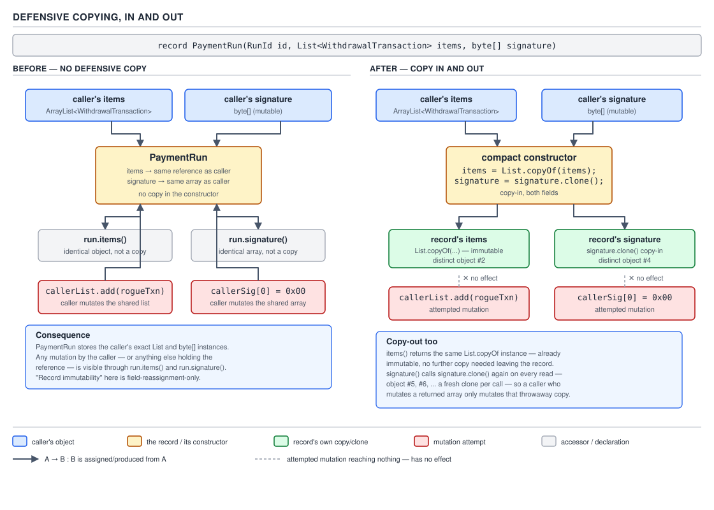

# 04 Modern Java — Records — INTERMEDIATE (§2.8)

**Target version: Java 21 LTS.** | **Part 2 of 5** | [Index](../00-index.md)
Previous: [Records — basics b](01-basics-b.md) · Next: [Records — internals records](03-internals-records.md)

## Records in practice

The previous file established what a record *is* — a transparent, immutable carrier with a
canonical constructor, derived `equals`/`hashCode`/`toString`, and a fixed set of components. This
file is about what happens when that carrier crosses a boundary it was not designed with in mind:
an HTTP request body, a JPA persistence context, a `HashMap` key, a stream pipeline's scratch
space. Every boundary in this file either accepts a record cleanly, accepts it with a condition, or
rejects it outright — and the reasons why are mechanism, not convention.

---

### Records as request/response DTOs at the HTTP boundary

**Mental model.** A record used as a DTO is a *shape contract*, not an object. When
`ApplicationGateway` receives a deposit request, the wire payload is a JSON document; the record is
the compiler-checked promise that says "exactly these fields, exactly these types, nothing else,
and nothing half-built ever exists." There is no setter sequence during which the object is
partially populated — the object either comes into existence fully formed through its canonical
constructor, or the constructor throws and no object exists at all. That all-or-nothing
construction is the entire reason DTOs migrated to records: a JavaBean DTO has a window, however
short, in which `new DepositRequest()` exists with every field at its default, and any validation
runs after that window has already passed.

**Why it exists.** Before records, a request DTO was a mutable class: no-arg constructor (required
by Jackson's classic deserialization path and by `@ModelAttribute` form binding), a setter per
field, and hand-written `equals`/`hashCode`/`toString` if anyone bothered — most projects didn't,
which is why so many `equals` bugs live in DTO layers rather than domain layers. Lombok's
`@Value`/`@Data` narrowed that gap but never closed it, because Lombok generates *around* a class
shape that Java itself still considers mutable-by-default; nothing in the type system stops a
teammate from adding a setter next sprint. A record closes the gap at the language level: there is
no setter to add, because there is no field-assignment syntax outside the constructor at all.

**When to reach for it, and when not.** Use a record for any DTO that is pure data in flight —
request bodies, response bodies, message payloads, configuration snapshots. Do not reach for a
record when the "DTO" actually needs identity across mutation (a form-backing object that a
multi-step wizard fills in field by field across several HTTP requests genuinely needs mutability,
and forcing that into a record means rebuilding a new instance on every field, which is not wrong
but is a design decision to make deliberately, not by default). The sibling here is the classic
mutable bean, and it loses on every axis except the one case above.

**How it works.** `DepositRequest` for `ApplicationGateway`'s deposit endpoint:

```java
public record DepositRequest(
        ClientId clientId,
        BigDecimal amount,
        Currency currency,
        String couponCode,
        String idempotencyKey) {

    public DepositRequest {
        if (clientId == null) {
            throw new IllegalArgumentException("clientId is required");
        }
        if (amount == null || amount.signum() <= 0) {
            throw new IllegalArgumentException("amount must be positive, got: " + amount);
        }
        if (currency == null) {
            throw new IllegalArgumentException("currency is required");
        }
        if (idempotencyKey == null || idempotencyKey.isBlank()) {
            throw new IllegalArgumentException("idempotencyKey is required");
        }
        amount = amount.setScale(2, RoundingMode.HALF_UP);
    }
}
```

The compact constructor runs *before* the field assignments the compiler generates for you — every
line above executes, and only then do `this.clientId = clientId`, `this.amount = amount`, and so on
happen automatically. `amount = amount.setScale(2, RoundingMode.HALF_UP)` reassigns the
*parameter*, not a field (there is no `this.amount` in scope yet to assign to inside a compact
constructor — see the gotcha below), and the compiler's generated field write picks up the
reassigned value. This is why validation-plus-normalization belongs in the compact constructor and
nowhere else: it is the one place in the record's lifecycle that runs on every path to a
constructed instance, including the one Jackson uses.

**A minimal concrete example.** The response side, returned by `ApplicationGateway` once
`PaymentService` and `FundsLedger` confirm the deposit:

```java
public record DepositResponse(
        String depositId,
        String statusCode,
        BigDecimal creditedAmount,
        BigDecimal bonusGranted,
        Instant capturedAt) {

    public static DepositResponse captured(String depositId, BigDecimal amount, BigDecimal bonus) {
        return new DepositResponse(depositId, "DEP-301", amount, bonus, Instant.now());
    }
}
```

A controller method wiring both together:

```java
@PostMapping("/deposits")
public ResponseEntity<DepositResponse> deposit(@RequestBody DepositRequest request) {
    DepositOutcome outcome = paymentService.captureDeposit(request);
    return ResponseEntity.ok(
            DepositResponse.captured(outcome.depositId(), outcome.amount(), outcome.bonusGranted()));
}
```

Nothing here is "similar to the above" or elided — this compiles as written, minus imports.

**The gotcha.** Inside a compact constructor, `this.amount = amount` is a compile error, not a
warning. Verified on this machine:

```
T.java:4: error: cannot assign a value to final variable bonusPortion
        this.bonusPortion = bonusPortion.setScale(2);
            ^
1 error
```

The component field is `final`. Inside the compact constructor body you may only reassign the
*parameter* (`amount = amount.setScale(...)`); the compiler emits the actual field write for you,
once, at the end of the constructor, using whatever the parameter holds at that point. This is not
"you cannot explicitly assign a field of a record" worded loosely — it is exactly the ordinary Java
rule that a `final` field can be written exactly once, and the compiler has already claimed that one
write for itself.

> A record used as a DTO is a validated, immutable shape contract whose compact constructor is the
> single unconditional gate every constructed instance passes through — there is no partially built
> state for a bug to hide in.

---

### Wiring records through the framework boundary — Jackson, `-parameters`, Bean Validation, Spring

**Mental model.** A record has no setters and, for most shapes, no no-arg constructor — so every
framework that used to populate a DTO by calling `new Thing()` and then a chain of setters has to
switch to a completely different strategy: discover the canonical constructor, discover its
parameter names, and call it once with everything already in hand. Four different frameworks
(Jackson, Bean Validation, Spring MVC, Spring Boot's configuration binder) each had to grow this
capability independently, and each did it slightly differently, which is exactly where the traps in
this section live.

**Why it exists.** JavaBean-style property binding — the no-arg-constructor-plus-setters
convention — is 1990s reflection wired into every one of these tools' oldest code paths. Records
arrived in 2021 (JDK 16) into an ecosystem that had spent two decades assuming that convention.
Every one of the frameworks below had to add record-aware branches to code that used to assume a
mutable bean.

**When to reach for it, and when not.** This is not a choice — if the DTO is a record, every layer
it passes through must be record-aware or it fails at runtime, not compile time. The sibling to
watch for is silently falling back to a mutable bean "because the framework doesn't support records
here yet"; check the version table below before assuming that.

**How it works — Jackson.** `[LEAF 2.8.2]` `[TRAP]` `[RESEARCH]` Jackson added record support in
**jackson-databind 2.12** (December 2020). On that line, Jackson still needs one of two things to
discover the canonical constructor's parameter names, because 2.12's introspection for records
initially reused the same name-discovery path as ordinary constructors:

- register the `ParameterNamesModule` **and** compile with `-parameters`, or
- annotate every component with `@JsonProperty("name")` so Jackson never needs to discover a name
  at all, or use `@JsonCreator(mode = JsonCreator.Mode.PROPERTIES)` with `@JsonProperty` on each
  parameter when the constructor Jackson should use is not obvious (an auxiliary constructor rather
  than the canonical one).

**Version trap, worded exactly:** by **jackson-databind 2.15**, Jackson's record handling was
reworked to call `Class.getRecordComponents()` directly and read component names off the
`RecordComponent[]` it returns — the JDK's own reflection API for records, which is distinct from
generic constructor-parameter reflection and does not depend on `-parameters` at all. **Jackson 3**
completes that story explicitly: neither the `ParameterNamesModule` nor `-parameters` is required
for records, because record component names are read through `RecordComponent`, never through
`Executable.getParameters()`. So "Jackson needs `-parameters` for records" was true for 2.12 and is
progressively less true from 2.15 onward — check the exact jackson-databind version pinned in the
build before asserting either way, and prefer `@JsonProperty` on ambiguous constructors regardless
of version, because it removes the question entirely.

**Pitfall:** a team on jackson-databind 2.12–2.14 removes `-parameters` from the Maven/Gradle
compiler args during a "clean up the build" pass, and every record DTO deserializes to
`MismatchedInputException: Cannot construct instance ... (no Creators, like default constructor,
exist)` — or on some paths, constructs the record with every parameter bound to the *positional*
default rather than the intended field, because the parameter names Jackson does manage to read
back are `arg0`, `arg1`, `arg2`, not `clientId`, `amount`, `currency`. The fix on 2.12–2.14 is to
restore `-parameters` or add `@JsonProperty` to every component; on 2.15+ the flag is not the cause
and the search should look elsewhere (typically a non-canonical constructor Jackson picked instead).

**How it works — `-parameters` as a compile flag.** `[LEAF 2.8.3]` `[X-REF 07]` `-parameters` tells
`javac` to emit the `MethodParameters` class-file attribute, which is what lets
`Executable.getParameters()[i].getName()` return the source-level name (`clientId`) instead of the
synthetic `arg0`. Without it, ordinary reflective parameter-name lookup degrades silently — no
compiler warning, no runtime exception at the call site that reads the name, just a wrong or empty
string handed to whatever asked for it. What breaks without `-parameters`, by consumer:

- **Spring MVC / Spring Boot constructor binding for non-record classes** — relies on
  `StandardReflectionParameterNameDiscoverer`, which reads `MethodParameters`; without it, Spring
  falls back to trying `-g` debug-symbol local variable tables (works for source-compiled classes
  under some configurations, but is not guaranteed and is not the documented contract), and can
  fail outright for `@ConfigurationProperties` constructor binding, throwing a binding exception
  that names the parameter as `arg0`.
- **Jackson's parameter-name discovery for ordinary (non-record) `@JsonCreator` classes** and, on
  jackson-databind 2.12–2.14, for record canonical constructors too, as above.
- **Bean Validation messages that interpolate the parameter name** — a constraint violation on an
  unnamed parameter reports `arg1` in its `getPropertyPath()` instead of `couponCode`, which is
  cosmetic but genuinely confusing in a validation error surfaced to a client or logged for
  triage.

**Unverified:** whether Spring Framework's constructor-binding and `@RequestBody` paths carry a
*record-specific* exemption from `-parameters` analogous to Jackson 2.15's `RecordComponent`-based
rewrite (i.e., whether Spring reads `getRecordComponents()` directly for records rather than going
through `Executable.getParameters()`). The general advice — compile Spring Boot 3.x applications
with `-parameters`, which `spring-boot-starter-parent`'s Maven/Gradle plugin defaults have enabled
since Spring Boot 2.x — removes the question in practice and is what this file recommends
regardless of the exemption's exact scope. See `## Open questions`.

**How it works — Bean Validation.** `[LEAF 2.8.4]` `[TRAP]` `[RESEARCH]` `ElementType.RECORD_COMPONENT`
was added to `java.lang.annotation.ElementType` in **JDK 16**, alongside records themselves, as the
element kind the compiler assigns to an annotation written directly on a record component in the
header: `record DepositRequest(@NotNull ClientId clientId, ...)`. What the compiler does with that
annotation next depends entirely on the annotation's own `@Target`:

- if `@Target` includes `RECORD_COMPONENT`, the annotation is retained on the record component
  itself (visible via `RecordComponent.getAnnotations()`);
- if `@Target` includes `FIELD`, the annotation is *also* copied onto the backing field;
- if `@Target` includes `METHOD`, it is *also* copied onto the accessor;
- if `@Target` includes `PARAMETER`, it is *also* copied onto the corresponding canonical
  constructor parameter;
- if `@Target` includes none of the applicable targets for where it is written, the compiler
  rejects the annotation outright at the declaration site — it does not silently drop it.

Jakarta Bean Validation's validator (Hibernate Validator, in a Spring Boot stack) looks for
constraint annotations on **fields and getters** by default for a class, but for a **record**,
validation of `@Valid`-annotated method parameters and return values is driven off the **canonical
constructor's parameters** in practice, because that is the only place record data is genuinely
"set." The Jakarta Bean Validation 3.0 specification (the version bundled with Jakarta EE 9+ and
Spring Boot 3.x) updated its built-in constraints' `@Target` sets to include `RECORD_COMPONENT` and
`TYPE_USE`, so `@NotNull`, `@Positive`, `@Size`, and the rest of the `jakarta.validation.constraints`
package work when written directly on a record component with no extra ceremony.

**Pitfall:** a **custom** constraint annotation carried over unchanged from a pre-record codebase —
`@Target({ElementType.FIELD, ElementType.METHOD, ElementType.PARAMETER})`, no `RECORD_COMPONENT` —
compiles without error when placed on `record CouponRedemption(@ValidCouponCode String code) {}`,
because `PARAMETER` is already in its target set and the compiler is satisfied. But
`@ValidCouponCode` then validates whichever *element* the validator's provider actually scans for
that constraint on records, and Hibernate Validator's own record-aware scanning path checks the
component/field-equivalent location first; a custom annotation missing `RECORD_COMPONENT` can end
up validated on the constructor parameter but *not* surfaced through `@Valid` cascading on the
record's fields in every validator/framework combination, producing a validation that silently
never fires for some call paths while appearing correctly configured. The fix is to always include
`ElementType.RECORD_COMPONENT` in a custom constraint's `@Target` going forward — it costs nothing
on a non-record class and removes the ambiguity on a record.

**Diagram — D-108.**

| Mechanism | Works on records? | Minimum version | What it needs | Failure symptom when missing |
|---|---|---|---|---|
| Jackson serialisation | Yes | jackson-databind 2.12 | nothing extra — accessors are `component()`, not `getComponent()`, and Jackson's `BeanPropertyDefinition` for records already maps that | `UnrecognizedPropertyException` only if a naming-strategy mismatch exists elsewhere in the mapper config |
| Jackson deserialisation | Yes, conditionally | jackson-databind 2.12 (needs `-parameters`+`ParameterNamesModule` or `@JsonProperty`); no flag needed from 2.15 (`RecordComponent`-based); no flag needed at all in Jackson 3 | `-parameters` + `ParameterNamesModule`, **or** `@JsonProperty` per component, **or** `@JsonCreator(mode = PROPERTIES)` | `MismatchedInputException: no Creators, like default constructor, exist`, or silent positional (`arg0`) binding |
| Spring `@RequestBody` | Yes | Spring Boot 2.x+ (delegates to the configured `HttpMessageConverter`, typically Jackson) | whatever the underlying converter needs — see the Jackson row | `HttpMessageNotReadableException` wrapping the converter's own failure |
| Spring `@ConfigurationProperties` | Yes | Spring Boot 2.6+ (single-constructor records infer constructor binding without `@ConstructorBinding`) | `-parameters` compiled in (or `@ConstructorBinding` explicit), property names matching component names (kebab-case relaxed binding) | `BindException` / `UnboundConfigurationPropertiesException` naming `arg0` instead of the real property |
| Spring `@ModelAttribute` | Partially | Spring Framework 6.1+ has data-binding support via constructor binding for records | `-parameters`; every component must be settable from a `String` form value — no defaulting, no partial submission | `TypeMismatchException` or a fully-failed bind, because there is no setter to retry one field against on validation failure |
| Bean Validation | Yes | Jakarta Bean Validation 3.0 / Hibernate Validator 7+ (bundled with Spring Boot 3.x) | constraint's `@Target` including `RECORD_COMPONENT` (built-ins have it from 3.0; custom constraints must add it) | annotation compiles but never triggers, or compiler rejects it outright if `@Target` has no applicable element type |
| JPA entity | No | — | records cannot be `@Entity` — no no-arg constructor, no field mutation for the proxy or dirty-checking machinery to hook | `MappingException` / entity manager refuses to manage the class at bootstrap |
| JPA `@Embeddable` | No | — | same constraint as above — an embeddable is instantiated and mutated the same way an entity is | `MappingException` at bootstrap, same root cause |
| Spring Data projection | Yes — excellent fit | Spring Data JPA (any version supporting DTO projections) with a JPQL constructor expression or an interface-free DTO projection | constructor parameter order/types matching the `SELECT new` expression exactly | `InstantiationException` if the constructor signature does not match the selected columns |
| Lombok `@Value` equivalence | Partial | — | `@Value` gives immutability + generated `equals`/`hashCode`/`toString`/getters on an ordinary class; it does **not** give pattern deconstruction, the JVM's `Record` class-file attribute, or construction-time (de)serialization guarantees | no runtime failure — the gap is structural, see the supporting-fact comparison below |

**D-108** — Records across the framework boundary.

**A minimal concrete example — `@ConfigurationProperties` constructor binding.** `PaymentService`'s
rail limits, bound straight from `application.yml`:

```java
@ConfigurationProperties(prefix = "quizstakes.payment.limits")
public record PaymentLimits(BigDecimal dailyDepositCap, BigDecimal maxSingleWithdrawal, int maxDailyWithdrawalCount) {
}
```

with a single-constructor record, Spring Boot 2.6+ infers constructor binding without needing
`@ConstructorBinding` on the record itself — the record's shape alone is enough of a signal, because
a record has exactly one canonical constructor and no field to fall back to setting.

**The gotcha.** `@ModelAttribute` form binding on a record has no partial-failure story. A mutable
bean binds field by field: if `couponCode` fails to parse, Spring still populates every other field
and reports one `FieldError`. A record's canonical constructor is one atomic call — if any argument
cannot be produced, the whole bind fails, and the caller gets one `BindException` covering the
entire object rather than a per-field error list a form can render next to individual inputs. This
is fine for a machine-to-machine `@RequestBody` JSON payload; it is a real UX regression for a
human-facing HTML form with many fields, which is the concrete reason `@ModelAttribute` binding onto
records is not yet a wholesale replacement for bean binding in that specific use case.

> Every framework that used to populate a DTO through a no-arg constructor and setters has grown a
> record-aware path that instead discovers the canonical constructor and its parameter names —
> Jackson through `RecordComponent` (fully, from 2.15), Spring through `-parameters` plus
> single-constructor inference, and Bean Validation through `RECORD_COMPONENT` added to
> `ElementType` — and every trap in this section is a mismatch between which of those three
> discovery mechanisms a given library version actually uses.

---

### Why a record cannot be a JPA entity, but is an excellent projection

**Mental model.** JPA's entity contract is a *managed mutable object*: the persistence context
holds a reference to your instance, mutates its fields directly through reflection to hydrate it,
tracks whether those fields have changed since the last flush (dirty checking), and hands out proxy
subclasses in place of your real class for lazy loading. Every one of those mechanisms requires the
entity to be an ordinary mutable class. A record is the photographic negative of that requirement —
immutable, `final`, no no-arg constructor — which is not an oversight anyone could patch around; it
is a direct collision between what JPA needs to do to an object and what a record's language
guarantees forbid anyone from doing.

**Why it exists — the constraint, not a feature.** `[LEAF 2.8.6]` `[TRAP]` `[X-REF 08]` Three
specific JPA mechanisms each independently rule out a record as `@Entity`:

1. **No no-arg constructor.** Hibernate instantiates an entity via reflection using a no-arg
   constructor (or, for some strategies, `Unsafe.allocateInstance`, which bypasses constructors
   entirely but still needs settable fields afterward) and then populates fields directly. A record
   has no no-arg constructor by construction — every constructor must ultimately delegate to the
   canonical one, which requires every component.
2. **No proxying.** Lazy-loading a `@ManyToOne`/`@OneToOne` association returns a dynamically
   generated proxy subclass that overrides accessor methods to trigger the load on first touch. A
   `record` is implicitly `final` — it cannot be subclassed, so no proxy can extend it.
3. **No dirty checking.** Hibernate's default dirty-checking strategy compares the current field
   values of a managed entity against a snapshot taken at load time, at flush time, which requires
   the fields to be *mutable* so that ordinary business logic can change them between load and
   flush. A record's fields are `final`; there is nothing to check for having changed, because
   nothing can change.

The same three reasons rule out `@Embeddable` too — an embeddable is instantiated and field-mutated
by exactly the same mechanism as an entity, just without its own identity and table row.

**When to reach for it, and when not.** Never as `@Entity` or `@Embeddable` — that door is closed by
the JVM, not by convention, and no annotation processor trick genuinely reopens it. Reach for a
record instead as the *read model* on the way out of JPA: a JPQL constructor-expression projection
or a Spring Data interface-free DTO projection. The entity stays a mutable class that JPA can manage
properly; the record is the shape the query hands back for a read-only view that never needs to be
attached to a persistence context.

**How it works.** A JPQL constructor expression selecting straight into a record for a client's
funds-ledger summary:

```java
public record LedgerPositionSummary(
        ClientId clientId,
        BigDecimal cashAvailable,
        BigDecimal bonusAvailable,
        BigDecimal cashReserved) {
}

@Query("""
    select new com.quizstakes.ledger.LedgerPositionSummary(
        le.clientId, le.cashAvailable, le.bonusAvailable, le.cashReserved)
    from LedgerEntry le
    where le.clientId = :clientId
    """)
LedgerPositionSummary findPositionSummary(@Param("clientId") ClientId clientId);
```

Hibernate calls `new LedgerPositionSummary(...)` directly with the selected columns, once, for each
row — exactly the pattern a record's canonical constructor was built for, and exactly the pattern
that a mutable JavaBean projection needed a no-arg constructor plus four setter calls to achieve
before records existed. Spring Data's interface-free DTO projections use the identical mechanism:
declare the record as the repository method's return type and Spring Data generates the same
constructor-expression query underneath for a derived query method.

**The gotcha.** The record's constructor parameter **order and types** must match the `select new`
expression's column list exactly — there is no name-based binding here, unlike the DTO-body cases
above. Reordering `LedgerPositionSummary`'s components without reordering the query's column list
compiles cleanly and fails only at query execution, with an `InstantiationException` whose message
names the constructor signature Hibernate tried and the argument types it actually got — a
genuinely confusing failure to hit for the first time, because nothing about the JPQL string itself
looks wrong.

> A record cannot be a JPA entity or an `@Embeddable` because the JVM's no-no-arg-constructor,
> implicit-`final`, and immutable-field guarantees directly contradict JPA's instantiate-by-
> reflection, proxy-for-laziness, and dirty-check-by-mutation mechanisms — but those same guarantees
> make a record the cleanest possible shape for a constructor-expression or DTO projection, which
> needs exactly one atomic, immutable construction call per row and nothing else.

---

### Records as compound map keys

**Mental model.** A compound key is a *value*, not an identity — two `RestrictionKey` instances
built from the same `(RestrictionType, RestrictionSource)` pair are supposed to be the same key for
`HashMap` purposes, the same way two `Integer.valueOf(42)` calls are the same key. A record gives
you that value semantics automatically, which is the entire reason it beats a hand-rolled key class:
`equals`/`hashCode` on a record are generated from every component, always, with no possibility of
forgetting one.

**Why it exists — the problem it solves.** Before records, a compound key was one of three things,
each with a real failure mode: a `Map<RestrictionType, Map<RestrictionSource, Restriction>>`
(nested maps — clumsy, and two lookups where one should do); `Arrays.asList(type, source)` boxed as
a `List<Object>` key (works, but throws away all type safety and reads like a hack at every call
site); or a hand-written key class with manually written `equals`/`hashCode`. The hand-written class
is where real production bugs lived: adding a field to the key class and forgetting to add it to
`equals`/`hashCode` compiles cleanly and produces a map that silently treats two logically-different
keys as the same bucket, or (worse, and more common) treats two logically-identical keys as
different because `hashCode` was written by hand and drifted out of sync with `equals` after a later
edit.

**When to reach for it, and when not.** Reach for a record key whenever the key is a fixed,
immutable combination of values with no independent identity — exactly `RestrictionKey(type,
source)`. Do not reach for it when the key needs reference identity or mutable state after
construction (rare for a key, and usually a sign the data structure is wrong, not the key type).

**How it works.** `[LEAF 2.8.7]` `[X-REF 02]` `ClientRestrictions` tracks every active restriction
keyed by the `(RestrictionType, RestrictionSource)` pair — restriction identity is genuinely the
pair, not the type alone, because `STAKE_BLOCKED` sourced from `SYSTEM_ONBOARDING` lifts
automatically at `AA-801 ACTIVATED` while the same `STAKE_BLOCKED` type sourced from `ADMIN` does
not:

```java
public record RestrictionKey(RestrictionType type, RestrictionSource source) {
}

public final class ActiveRestrictions {

    private final Map<RestrictionKey, Restriction> byKey = new HashMap<>();

    public void add(Restriction restriction) {
        byKey.put(new RestrictionKey(restriction.type(), restriction.source()), restriction);
    }

    public boolean isBlocked(RestrictionType type, RestrictionSource source) {
        return byKey.containsKey(new RestrictionKey(type, source));
    }

    public void liftSystemOnboardingRestrictions() {
        byKey.keySet().removeIf(key -> key.source() == RestrictionSource.SYSTEM_ONBOARDING);
    }
}
```

`isBlocked` constructs a fresh `RestrictionKey` purely to probe the map — that instance is never
stored, exists for one method call, and is `equals`-compatible with whatever `RestrictionKey` was
stored earlier for the same `(type, source)` pair because `equals` compares every component,
generated once by the compiler from the record header, not maintained by hand at every future edit
to the class.

**The gotcha** — the one that actually matters for the container guide, `[X-REF 02]`'s territory in
full: a record's generated `hashCode` combines each component's own `hashCode()`, so a compound key
built from components whose *own* `equals`/`hashCode` are broken (a mutable field, an array
component, a `Double` component — see the floating-point primary concept below) inherits that
brokenness silently. The record does not fix a bad component's contract; it faithfully propagates
it. `RestrictionType` and `RestrictionSource` here are enums, whose identity-based `equals`/
`hashCode` are exactly the ordinal-and-name pair you want in a key, so this key is safe — but the
same pattern with a `BigDecimal`-scale-sensitive or floating-point component would not be.

> A record used as a map key gives you correct, complete `equals`/`hashCode` for free, generated
> from every component with no possibility of a hand-edited class quietly falling out of sync —
> which is precisely the failure mode that made hand-written compound keys a recurring source of
> silent `HashMap` bugs.

---

### Defensive copying, done properly

**Mental model.** A record's canonical constructor and its accessors are two separate doors into
and out of the object, and each one needs its own lock. Making the constructor copy-in without also
making the accessor copy-out only protects half the perimeter — a caller who holds the array or list
handed back by the accessor can still reach in and mutate what the record claims is immutable.

**Why it exists — the problem it solves.** A record's auto-generated accessor for a reference-typed
component returns the field's value directly — for an array or a mutable collection, that is the
*same reference* the constructor stored, not a copy. `record Signed(byte[] signature) {}` looks
immutable on the page — there is no setter — but `Signed s = new Signed(bytes); s.signature()[0] =
0;` mutates the record's internal state through the returned reference, from outside, after
construction, with no compiler warning anywhere on that line. Records did not invent this hole —
final fields holding array references have always had it — but records make the hole easy to miss
precisely because everything else about a record signals "this is safe now."

**When to reach for it, and when not.** Defensive copying is mandatory for any record component
whose type exposes mutation through a shared reference: raw arrays always; `List`/`Set`/`Map`
implementations unless the value handed in is already known-immutable (and even then, prefer to
normalize rather than trust the caller). It is unnecessary and wasteful for value types with no
exposed mutator — `BigDecimal`, `String`, another record whose own components are themselves already
defended, an enum, a boxed primitive.

**How it works.** `[LEAF 2.8.13]` `[BUILD]` `PaymentService` builds a `PaymentRun` — a batch of
approved bank withdrawals with operator sign-off — that must not let any caller mutate the batch
membership or the signature bytes after the run is constructed and handed off for execution:

```java
public record PaymentRun(RunId id, List<WithdrawalTransaction> items, byte[] signature) {

    public PaymentRun {
        items = List.copyOf(items);
        signature = signature.clone();
    }

    @Override
    public byte[] signature() {
        return signature.clone();
    }
}
```

`List.copyOf(items)` in the compact constructor both defends against later mutation of the caller's
original list **and** rejects a `null` element outright (`List.copyOf` throws
`NullPointerException` on any `null` element, which is a bonus invariant, not just a copy).
`signature.clone()` in the compact constructor defends the copy-in side; the **overridden**
`signature()` accessor — a record accessor can always be overridden explicitly, which replaces the
compiler-generated one — clones again on the way out, so no caller of `signature()` ever receives
the array the record itself holds.



**D-109** — Defensive copying, in and out.

The diagram's left half is the wrong version: `record PaymentRun(RunId id, List<WithdrawalTransaction> items, byte[] signature)` with **no** compact constructor and **no** overridden accessor — the caller's original `items` list and `signature` array are the exact same objects the record stores, so a mutation through either the caller's original reference or the accessor's return value is visible through the record's own `items()`/`signature()` next call. The right half is the code above: four genuinely distinct objects on the heap — the caller's original list, the record's copy (`List.copyOf`), the caller's original array, and the record's cloned array — with the diagram showing an attempted mutation through the caller's original references failing to reach the record's internal state at all, because by the time the record exists, its own copies are all it holds a reference to.

**The gotcha.** `List.copyOf` on an *already-immutable* list (another `List.copyOf` result, or
`List.of(...)`) is smart enough to return the same reference rather than allocating a redundant
copy — so the defensive-copy line is not pure overhead on the common "already correct" path,
although you should never rely on that optimization for correctness, only benefit from it for
performance; the code must still behave correctly on the day a caller passes an `ArrayList`.

> Defensive copying on a record is two separate obligations, not one: copy-in inside the compact
> constructor defends the object's own state from the caller's original reference, and copy-out
> through an explicitly overridden accessor defends every future caller from each other — skipping
> either half leaves exactly the mutation hole the record's immutability was supposed to close.

---

### Floating-point components: `Double.equals`, `NaN`, and `-0.0`

**Mental model.** A record's generated `equals` does not use `==` or the primitive `.equals` you'd
expect for a `double` field — for a `double`/`float` component it calls `Double.compare` /
`Float.compare` semantics through the boxed `Double.equals`/`Float.equals` methods, which encode two
deliberate departures from IEEE 754 comparison: `NaN` is defined to equal itself, and `-0.0` is
defined to **not** equal `0.0`. Both departures exist so that `Double`/`Float` can be legal,
consistent `HashMap`/`HashSet` members — IEEE 754's own comparison rules (`NaN != NaN`, `-0.0 ==
0.0`) would make a boxed `Double` violate the `equals`/`hashCode` contract if boxed types used them
directly.

**Why it exists — the problem it solves.** `[PROVE]` Work through why plain IEEE comparison cannot
be what `Double.equals` uses. The `equals`/`hashCode` contract requires: if `a.equals(b)` is `true`,
then `a.hashCode() == b.hashCode()` must also be `true`. Under IEEE 754 bit-for-bit comparison,
`Double.NaN == Double.NaN` is `false` — so two boxed `Double(NaN)` instances would not be `.equals`
under IEEE rules, which is actually *consistent* with the contract on its own (unequal values, no
requirement on hash codes) — but it breaks a `HashSet<Double>`'s basic usability: you could never
find a `NaN` you had just inserted, because a fresh lookup key's `NaN` would never `==` the stored
one. IEEE 754 also defines `-0.0 == 0.0` as `true`, which — if `Double.equals` followed it — would
force `Double.valueOf(-0.0).hashCode() == Double.valueOf(0.0).hashCode()`, but the two values have
genuinely different bit patterns (`0x8000000000000000` versus `0x0000000000000000`) and different
observable behavior elsewhere in the platform (`1.0 / -0.0` is negative infinity, `1.0 / 0.0` is
positive infinity) — collapsing them into one hash bucket while some other code path can still tell
them apart would be its own kind of contract violation. The JDK's actual resolution, visible in
`Double.equals`'s implementation, is to compare the `long` bit patterns from
`doubleToLongBits(double)` rather than the `double` values directly: `doubleToLongBits` **canonicalizes
every NaN bit pattern to a single canonical NaN**, so all NaNs compare bit-equal to each other, and
it leaves `-0.0`'s and `0.0`'s genuinely different bit patterns alone, so they compare bit-unequal.
That single implementation choice is the mechanism behind both departures at once.

**When to reach for it, and when not.** This is not a "when to reach for it" concept in the usual
sense — it is a property every `double`/`float` record component has, unconditionally, the moment it
exists. The relevant choice is what to use *instead* when the domain cannot tolerate either
departure: `BigDecimal` for anything that is genuinely money (which QuizStakes' `Money(BigDecimal
amount, Currency currency)` already does, precisely to avoid this whole family of bugs), or an
explicit `Double.compare`-free custom `equals` if a coordinate-like type must treat `-0.0` and `0.0`
as identical for domain reasons.

**How it works.** A latitude/longitude-style value used nowhere in QuizStakes' money path but
plausible for, say, a fraud-signals geolocation feature reading device coordinates:

```java
public record DeviceCoordinate(double latitude, double longitude) {
}
```

```java
DeviceCoordinate a = new DeviceCoordinate(0.0, 51.5);
DeviceCoordinate b = new DeviceCoordinate(-0.0, 51.5);
System.out.println(a.equals(b));               // false
System.out.println(a.latitude() == b.latitude()); // true  (primitive == uses IEEE 754 rules)

DeviceCoordinate c = new DeviceCoordinate(Double.NaN, 51.5);
DeviceCoordinate d = new DeviceCoordinate(Double.NaN, 51.5);
System.out.println(c.equals(d));               // true
System.out.println(c.latitude() == d.latitude()); // false (IEEE 754: NaN != NaN)
```

`a.equals(b)` and `a.latitude() == b.latitude()` disagreeing on the exact same pair of values is the
entire trap in one pair of lines: the record's generated `equals` and the raw primitive `==`
operator are answering two different, both individually correct, questions.

**The gotcha.** `[TRAP]` `[PROVE]` A price-or-coordinate type built as a raw `double`/`float`
record silently corrupts deduplication logic that assumes primitive comparison semantics: code that
deduplicates a `List<DeviceCoordinate>` via a `HashSet<DeviceCoordinate>` will merge every `NaN`
reading into one entry (arguably fine — they're all "unknown") but will **not** merge a `(0.0, x)`
reading with a `(-0.0, x)` reading, even though every consumer of the raw double value downstream
sees them as numerically equal via `==` and every formatted string representation before Java 19
even prints `-0.0` and `0.0` identically-looking apart from the sign, making the bug very easy to
miss by eyeballing logged output. **Pitfall:** a fraud-detection dedup pass built on
`Set.of(coordinates).size()` under-reports duplicate-device detections whenever a device reports a
sign-preserving zero coordinate component (genuinely possible from IEEE-754-compliant floating-point
arithmetic upstream, e.g. `0.0 * -1`), because the record-keyed set treats `-0.0` and `0.0` readings
as distinct devices. **Wrong:** trusting `record`-generated equals for floating-point dedup without
checking for this. **Right:** normalize the sign of zero before constructing the record
(`latitude == 0.0 ? 0.0 : latitude` collapses `-0.0` to `0.0`, since the ternary's numeric promotion
uses `==` comparison, which treats them as equal, and the literal `0.0` on the true branch has the
canonical positive-zero bit pattern), or switch the component to `BigDecimal` if exact-value
identity matters more than raw floating-point speed.

> A record's generated `equals`/`hashCode` for a `double`/`float` component follow `Double.equals`/
> `Float.equals` semantics — comparing canonicalized bit patterns via `doubleToLongBits`/
> `floatToIntBits`, not IEEE 754 value comparison — which means every `NaN` matches every other
> `NaN` and `-0.0` never matches `0.0`, the exact opposite of what `==` on the same two values would
> tell you.

---

## Supporting facts

### Records as multiple return values `[LEAF 2.8.8]`

**Mechanism.** A method that used to return a mutable out-parameter object, populate an
`Object[]`, or hand back a library `Pair`/`Tuple` type can instead declare a local or nested record
as its return type. `FundsLedger`'s stake-consumption split is the canonical case: splitting a stake
between bonus and cash needs to return two `Money` values atomically, and `StakeSplit(Money
bonusPortion, Money cashPortion)` — with its documented invariant that the two sum exactly to the
stake — is exactly that, typed, named, and immutable, in place of a two-element array or an
untyped `Map.Entry<Money, Money>` whose `getKey()`/`getValue()` say nothing about which side is
which.

**Gotcha.** A record used purely as a return-value tuple is still a public type if declared at
class scope — if it is genuinely private to one method's internal bookkeeping and never crosses an
API boundary, prefer a **local record** (below) instead, so its scope in the source matches its
scope in actual use.

> A record replaces an out-parameter, an array, or a `Pair` wherever a method has more than one
> genuinely orthogonal value to return, giving each part of the return value a name instead of a
> position.

### Local records as stream-pipeline scratch types `[LEAF 2.8.9]`

**Mechanism.** A record can be declared inside a method body, scoped exactly like a local class,
and used purely as scratch structure for the lifetime of that method — most commonly to carry an
extra field through a stream pipeline that the original element type does not have. Computing each
client's stakeable total alongside their id, without polluting any domain type with a
pipeline-only field:

```java
public List<String> clientsOverStakeableThreshold(List<ClientPosition> positions, BigDecimal threshold) {
    record Stakeable(ClientId clientId, BigDecimal total) {
    }
    return positions.stream()
            .map(p -> new Stakeable(p.clientId(), p.cashAvailable().add(p.bonusAvailable())))
            .filter(s -> s.total().compareTo(threshold) > 0)
            .map(s -> s.clientId().value())
            .toList();
}
```

**Gotcha.** A local record, like a local class, cannot declare `static` members other than
constants (this restriction relaxed for local classes generally at Java 16 alongside the
introduction of records, but a local record's own instance shape is still fixed at each
declaration) — and it captures no enclosing instance state implicitly the way an anonymous class
can, which is exactly why it is safe to declare one freely inside a stream lambda without worrying
about accidental `this` capture.

> A local record is a named, typed, throwaway tuple scoped to exactly the method that needs it —
> declare it, use it inside the pipeline, and let it go out of scope with nothing left behind for
> another reader to wonder about.

### The "wither" pattern `[LEAF 2.8.10]` `[RESEARCH]`

**Mechanism.** Because every record component is `final`, "changing one field" means constructing a
brand-new instance with that one component different and every other component copied across
unchanged — the same idea as `String`'s own immutability, generalized to arbitrary shapes. There is
no language-level derived-instance syntax for this in Java 21; the pattern is entirely hand-written,
conventionally named `withX`:

```java
public record LimitSet(BigDecimal dailyDeposit, BigDecimal maxStake, BigDecimal monthlyLoss) {

    public LimitSet withDailyDeposit(BigDecimal newDailyDeposit) {
        return new LimitSet(newDailyDeposit, maxStake, monthlyLoss);
    }
}
```

**Researched and confirmed current for Java 21:** no JEP has shipped a derived-record-creation
expression (an "immutable update" / "with expression" language feature analogous to Kotlin's
`.copy(...)` or a proposed `with` syntax) as part of the finalized Java 21 language. Every `withX`
in a Java 21 codebase, however elegant, is ordinary hand-written boilerplate — one method per
component that participates in a wither, and there is no compiler-generated shortcut for it, unlike
the canonical constructor and accessors which the compiler does generate.

**Gotcha.** A record with many components needs many wither methods, or one variadic-feeling
`withX`-per-field burden that scales linearly with the shape — which is the exact pressure that
pushes toward a builder (below) once the component count and the frequency of partial updates both
grow past a few fields.

> A wither is a hand-written method that returns a new instance identical to `this` except for one
> named component — the only mechanism Java 21 offers for a derived-record "update," because no
> language-level with-expression exists yet.

### Builders for records `[LEAF 2.8.11]`

**Mechanism.** A record's canonical constructor takes every component positionally, which is fine
for three or four components and increasingly error-prone past six or seven — `new
DocumentVerification(id, clientId, documentId, vendorReference, verdict, reviewedAt, expiresAt,
requiredDocumentType)` invites a caller to transpose two same-typed arguments with no compiler
error. A builder restores named, staged construction while the record itself stays the immutable
target the builder's `build()` method ultimately calls into:

```java
public record DocumentVerification(
        VerificationId id, ClientId clientId, DocumentId documentId,
        String vendorReference, DocumentVerdict verdict, Instant reviewedAt) {

    public static final class Builder {
        private ClientId clientId;
        private DocumentId documentId;
        private String vendorReference;
        private DocumentVerdict verdict;

        public Builder clientId(ClientId clientId) { this.clientId = clientId; return this; }
        public Builder documentId(DocumentId documentId) { this.documentId = documentId; return this; }
        public Builder vendorReference(String vendorReference) { this.vendorReference = vendorReference; return this; }
        public Builder verdict(DocumentVerdict verdict) { this.verdict = verdict; return this; }

        public DocumentVerification build() {
            return new DocumentVerification(
                    VerificationId.generate(), clientId, documentId, vendorReference, verdict, Instant.now());
        }
    }
}
```

**Gotcha.** A builder earns its own boilerplate only when the component count is large **and**
partial/staged construction genuinely happens (fields set across several call sites before
`build()`) — for a four-component DTO built in one call site, a builder is pure ceremony over the
canonical constructor with no benefit, and the eight-beat sibling comparison to make explicit here
is: canonical constructor wins below ~5 components built in one place; a builder wins above that, or
whenever optional components with sensible defaults make positional construction genuinely
ambiguous.

> A builder for a record is worth its own boilerplate only past the point where positional
> construction becomes error-prone or staged assembly is genuinely needed — below that point it
> duplicates the canonical constructor for no benefit.

### Records and inheritance `[LEAF 2.8.12]`

**Mechanism.** A record is implicitly `final` and can never `extend` another class (it silently and
implicitly extends `java.lang.Record`, and that slot is taken) — but it can `implement` any number
of interfaces, which is how a *family* of record shapes gets its shared contract: a `sealed
interface` for the family, one record per variant, and composition (a shared value-type component
embedded in each variant) for whatever state genuinely needs to be common. `Verdict` is exactly this
shape in the domain — a sealed hierarchy of `DocumentVerdict`, `ScreeningVerdict`, `ReviewVerdict`,
and `WealthVerdict`, each a record implementing the same `sealed interface Verdict permits
DocumentVerdict, ScreeningVerdict, ReviewVerdict, WealthVerdict`, each carrying its own
verdict-specific fields plus the shared shape (`outcome`, `reason`, `decidedAt`, `decidedBy`) as
ordinary duplicated components or, more cleanly, as a single embedded record component shared across
variants.

**Gotcha.** "Composition for the shared state" is doing real work in that sentence — a shared
**abstract base class** is exactly what records cannot have, so the shared fields either get
duplicated verbatim across every variant's component list (acceptable for two or three fields) or
factored into one embedded record component (`VerdictBasis(outcome, reason, decidedAt, decidedBy)`)
that every variant carries as a single named component, which is the composition the leaf is
naming.

> Records participate in a type hierarchy only as leaves implementing interfaces, never as
> superclasses or subclasses of each other — a `sealed interface` supplies the family relationship
> a base class would have provided, and an embedded record component supplies whatever state the
> family needs to share.

### Records versus Lombok `@Value` `[LEAF 2.8.14]` `[RESEARCH]`

**Mechanism.** Both generate an immutable, `equals`/`hashCode`/`toString`-complete value type from a
short declaration, and on the surface `@Value class LedgerSnapshot { ClientId clientId; BigDecimal
total; }` and `record LedgerSnapshot(ClientId clientId, BigDecimal total) {}` look interchangeable.
They are not, for three concrete reasons a record gives you that Lombok structurally cannot:

1. **Pattern deconstruction.** `if (verdict instanceof DocumentVerdict(var outcome, var reason, var decidedAt, var decidedBy))` works only because the JVM knows, from the class file's `Record` attribute, exactly which components exist and in which order — a Lombok `@Value` class has no such attribute and cannot be deconstructed this way, ever, regardless of Lombok version.
2. **The `Record` class-file attribute itself.** A record's components are visible to *any* reflective or bytecode-level consumer through `Class.isRecord()` and `Class.getRecordComponents()` — the exact hook Jackson 2.15+, Bean Validation, and various serialization/records-aware tooling rely on. A Lombok `@Value` class is an ordinary class from the JVM's point of view; nothing marks it as a value type at the bytecode level, so tooling that specifically branches on "is this a record" (as Jackson's own record-handling code does) never takes that branch for a Lombok class, however value-like it behaves at the source level.
3. **Serialization through the canonical constructor.** A `Serializable` record deserializes by invoking its canonical constructor with the deserialized component values — meaning every validation and normalization line in the compact constructor runs again on every deserialized instance, closing a long-standing Java serialization hole where a hand-crafted byte stream could reconstruct an object bypassing its constructor entirely. A Lombok `@Value` class serialized the ordinary way has no such guarantee — default field-based deserialization populates fields directly and never re-invokes any constructor.

**Gotcha.** Lombok's `@Value` still wins in exactly one situation this file's scope touches:
targeting a Java version before 16, or a codebase that cannot yet move off records-incompatible
tooling (rare by 2026, but real in older enterprise estates) — everywhere on Java 21, a record is
the language-native answer and Lombok's `@Value` is legacy compatibility, not a first choice.

> A record and a Lombok `@Value` class both produce an immutable value type at the source level, but
> only a record is a value type at the **class-file** level — carrying the `Record` attribute that
> pattern deconstruction, `Class.isRecord()`-branching tooling, and constructor-driven
> deserialization all depend on, none of which Lombok's code generation can retrofit onto an
> ordinary class.

### Migrating an existing value class to a record `[LEAF 2.8.16]`

**Mechanism.** The checklist, applied to any hand-written immutable value class:

1. Are all fields already `final` and set only in the constructor? If any field is reassigned
   after construction, this class is not a record migration candidate as-is — mutability blocks it.
2. Does the class extend anything other than `Object`? A record cannot extend a class — inheritance
   blocks it, unless the hierarchy can be reshaped into a `sealed interface` per the primary concept
   above.
3. Does the public API expose fields or behavior the constructor-and-accessors shape cannot
   represent — a computed field cached at construction time that is not itself one of the inputs, a
   field with a different name than its accessor, multiple overloaded "views" of the same data? A
   **hidden representation** — internal state that does not map one-to-one onto the public
   constructor parameters — blocks a direct migration, though it can sometimes be resolved by
   deriving the field in the compact constructor or in a static factory rather than storing it.
4. Does any framework instantiate this class through a no-arg constructor and setters (a legacy ORM
   mapping, an old-style JavaBean-only serialization framework)? A framework requiring a **no-arg
   constructor** blocks the migration until that framework's usage is replaced or worked around
   (see the JPA primary concept above for exactly this collision).

**Gotcha.** A class can pass checks 1–3 and still be blocked by check 4 alone — the language allows
the migration; a framework dependency does not. The correct sequencing is checklist-order: confirm
1–3 first (structural fitness), then check 4 last (integration fitness), because fixing 1–3 is
usually a local refactor and fixing 4 is usually a framework-boundary decision (a DTO/projection
split, exactly as the JPA section above demonstrates) that belongs at the architecture layer, not
inside the class itself.

> Migrating a value class to a record is blocked by exactly four things — existing mutability,
> existing inheritance, a hidden representation that does not map onto the constructor parameters,
> and a framework requiring a no-arg constructor — check them in that order, because the first three
> are local fixes and the fourth is usually not.

---

## Pitfalls

### Believing `-parameters` is what makes Jackson deserialize records

**Wrong**

```java
// build.gradle — "cleanup" pass removes the flag, jackson-databind pinned at 2.13
tasks.withType(JavaCompile) {
    options.compilerArgs = [] // -parameters silently dropped
}
```

```
com.fasterxml.jackson.databind.exc.MismatchedInputException:
Cannot construct instance of `DepositRequest` (no Creators, like default constructor, exist):
cannot deserialize from Object value (no delegate- or property-based Creator)
```

**Right**

```java
tasks.withType(JavaCompile) {
    options.compilerArgs << "-parameters"
}
```

or, independent of the flag and of jackson-databind's version, annotate the ambiguous constructor:

```java
public record DepositRequest(
        @JsonProperty("clientId") ClientId clientId,
        @JsonProperty("amount") BigDecimal amount,
        @JsonProperty("currency") Currency currency,
        @JsonProperty("couponCode") String couponCode,
        @JsonProperty("idempotencyKey") String idempotencyKey) {
}
```

**Why people believe it:** the failure only ever appears when `-parameters` is missing on
jackson-databind 2.12–2.14, so the two facts fuse into "records always need `-parameters` for
Jackson" — a claim that stopped being complete once jackson-databind 2.15 started reading
`getRecordComponents()` directly, and is fully false on Jackson 3.

### Assigning `this.field` inside a compact constructor

**Wrong**

```java
public record DepositRequest(ClientId clientId, BigDecimal amount) {
    public DepositRequest {
        this.amount = amount.setScale(2, RoundingMode.HALF_UP); // compile error
    }
}
```

**Right**

```java
public record DepositRequest(ClientId clientId, BigDecimal amount) {
    public DepositRequest {
        amount = amount.setScale(2, RoundingMode.HALF_UP); // reassign the parameter
    }
}
```

**Why people believe it:** every other constructor in Java lets you write `this.field = value`
freely, and the compact constructor's syntax looks enough like a normal constructor body that the
habit carries over — until the compiler points out there is no field-assignment slot left to claim.

### Trusting `HashSet<PriceCoordinate>` for floating-point deduplication

**Wrong**

```java
record PriceCoordinate(double delta) {}
Set<PriceCoordinate> seen = new HashSet<>();
seen.add(new PriceCoordinate(0.0));
seen.add(new PriceCoordinate(-0.0));
System.out.println(seen.size()); // 2 — both a positive- and negative-zero delta survive
```

**Right**

```java
record PriceCoordinate(double delta) {
    public PriceCoordinate {
        delta = (delta == 0.0) ? 0.0 : delta; // canonicalize the sign of zero
    }
}
```

or use `BigDecimal` throughout if the value is genuinely money.

**Why people believe it:** `-0.0 == 0.0` is `true` for the raw primitive comparison everyone tests
by hand in a REPL, so the record's `equals` disagreeing with `==` on the exact same values reads as
a bug in the record rather than documented `Double.equals` behavior.

### Assuming a `record` can be a JPA `@Entity` because it is "just a class with fields"

**Wrong**

```java
@Entity
public record LedgerEntry(Long id, ClientId clientId, BigDecimal amount) {
} // MappingException at bootstrap
```

**Right**

```java
@Entity
public class LedgerEntryEntity {
    @Id private Long id;
    private ClientId clientId;
    private BigDecimal amount;
    protected LedgerEntryEntity() { }
    // getters/setters
}

public record LedgerPositionSummary(ClientId clientId, BigDecimal cashAvailable) {
} // used only as a JPQL constructor-expression projection, never managed
```

**Why people believe it:** a record's syntax reads as "a class, but shorter," and nothing about
declaring `@Entity` on it produces a compile error — only a bootstrap-time `MappingException` when
Hibernate actually tries to build metadata for the class, which is late enough in the feedback loop
that the mistaken belief survives until someone actually runs the application.

---

## Cheat sheet

| Boundary | Records work? | Minimum requirement | Failure if missing |
|---|---|---|---|
| Jackson serialize | Yes | jackson-databind 2.12+ | n/a |
| Jackson deserialize | Yes | `-parameters`+module (2.12–2.14) / nothing (2.15+/3.x) / `@JsonProperty` always safe | `MismatchedInputException` |
| Spring `@RequestBody` | Yes | delegates to converter (Jackson) | wraps converter failure |
| Spring `@ConfigurationProperties` | Yes | `-parameters`; single-constructor inference since Boot 2.6 | `BindException` naming `arg0` |
| Spring `@ModelAttribute` | Partial | `-parameters`; no per-field partial-failure story | whole-object `BindException` |
| Bean Validation | Yes | constraint `@Target` includes `RECORD_COMPONENT` (built-ins since JBV 3.0) | annotation silently inert |
| JPA `@Entity` / `@Embeddable` | **No** | — | `MappingException` at bootstrap |
| JPQL / Spring Data projection | Yes, excellent | constructor param order/types match `SELECT new` | `InstantiationException` |
| Compound map key | Yes, ideal | components have correct `equals`/`hashCode` themselves | inherits a broken component's bug |
| Local record | Yes | scoped to one method | cannot hold `static` members beyond constants |
| Wither pattern | Hand-written only | no language feature in 21 | boilerplate scales with component count |
| Builder | Optional | earns cost above ~5 components or staged assembly | ceremony with no benefit below that |
| Sealed interface family | Yes | records as leaves, interface as the family | cannot share a base class — use composition |
| Lombok `@Value` vs record | record wins on JVM-level value semantics | — | no pattern deconstruction, no `Record` attribute, no ctor-driven deserialization |
| `double`/`float` component `equals` | `Double.equals`/`Float.equals` semantics | — | `NaN` matches, `-0.0` ≠ `0.0`, opposite of `==` |
| Defensive copying | Manual, both directions | copy-in in compact ctor, copy-out in overridden accessor | shared mutable reference leaks either way |
| Migration to record | Checklist | no mutability, no inheritance, no hidden representation, no no-arg-ctor framework | blocked on whichever check fails |

---

## Self-test

**Q1.** Why does `this.amount = amount` fail to compile inside a compact constructor, and what
should be written instead?

<details><summary>Answer</summary>

Every record component backs a `final` field, and the compiler has already claimed the single legal
write to that field — it emits the field assignment automatically at the end of the compact
constructor, using whatever the parameter holds at that point. `this.amount = amount` inside the
compact constructor body tries to claim a second write to a `final` field, which is a compile error
(`cannot assign a value to final variable`). The correct pattern is to reassign the *parameter*
(`amount = amount.setScale(2, RoundingMode.HALF_UP);`), which the compiler-generated field write then
picks up.

</details>

**Q2.** A team is on jackson-databind 2.13 and a record DTO fails to deserialize with "no Creators,
like default constructor, exist" the moment `-parameters` is removed from the build. A teammate
argues this proves records always need `-parameters` for Jackson. What is the precise, version-aware
correction?

<details><summary>Answer</summary>

It is true for jackson-databind 2.12–2.14, where record deserialization still discovers parameter
names the same way ordinary constructor reflection does — through `-parameters` plus the
`ParameterNamesModule`, or explicit `@JsonProperty` per component. From jackson-databind 2.15
onward, Jackson reads component names directly from `Class.getRecordComponents()` (the JDK's
record-specific reflection API), which does not depend on `-parameters` at all, and Jackson 3
removes the need entirely. So the claim is version-scoped, not universal — correct for the pinned
version in this build, wrong as a general statement about records and Jackson.

</details>

**Q3.** Why can a record never be a JPA `@Entity`, in terms of the three specific mechanisms JPA
needs and the three specific guarantees a record makes?

<details><summary>Answer</summary>

JPA needs a no-arg constructor to instantiate an entity via reflection before populating its
fields — a record has none, because every constructor delegates to the canonical one, which
requires every component. JPA needs to generate a proxy subclass for lazy-loaded associations — a
record is implicitly `final` and cannot be subclassed. JPA's default dirty-checking strategy needs
mutable fields to compare against a load-time snapshot at flush time — a record's fields are `final`
and never change after construction, so there is nothing to detect as "dirty." All three are direct
collisions between a JPA mechanism and a record language guarantee, not a missing annotation or a
gap in tooling support that a future JPA release could close without changing what a record is.

</details>

**Q4.** Why does a `record RestrictionKey(RestrictionType type, RestrictionSource source)` make a
safe `HashMap` key, while a hypothetical `record PriceKey(double amount)` would not, for the same
reason in both cases?

<details><summary>Answer</summary>

A record's generated `equals`/`hashCode` combine each component's own `equals`/`hashCode` — the
record does not fix a broken component contract, it faithfully propagates whatever contract each
component already has. `RestrictionType` and `RestrictionSource` are enums, whose `equals`/
`hashCode` are identity-based (effectively ordinal-and-name), which is exactly the "same value, same
key" behavior a compound key needs. A `double` component's `equals` follows `Double.equals`
semantics — `NaN` matches every other `NaN`, and `-0.0` does not match `0.0` — which means two
`PriceKey` instances built from what a caller would consider "the same" price can silently land in
different `HashMap` buckets if a sign-preserving zero is ever involved, purely because the
underlying component's contract, not the record's, treats them as different.

</details>

**Q5.** What are the two separate places defensive copying must happen for a record component of
type `byte[]`, and what does skipping either one still leave broken?

<details><summary>Answer</summary>

Copy-in inside the compact constructor (`signature = signature.clone();`), which defends the
record's own internal state from the caller's original array reference — without it, a caller who
still holds that original array can mutate the record after construction. Copy-out through an
explicitly overridden accessor (`public byte[] signature() { return signature.clone(); }`), which
defends every future caller of the accessor from each other — without it, any caller who obtains the
array via the accessor holds the *actual* internal reference and can mutate the record's state
through it, even though the compact constructor's copy-in was done correctly. Doing only one half
still leaves a live mutation path through the other.

</details>

**Q6.** A `LimitSet` record needs its `dailyDeposit` changed while every other field stays the same.
What does Java 21 actually provide for this, and what would be needed for the alternative most
people expect?

<details><summary>Answer</summary>

Java 21 provides nothing language-level for this — no derived-record "with expression" has shipped
as part of the finalized language. The only mechanism is a hand-written `withDailyDeposit(BigDecimal
newDailyDeposit)` method that constructs and returns a brand-new `LimitSet` with the one changed
component and every other component copied across unchanged. What people expect (a `.copy(...)`-
style syntax, as in Kotlin) does not exist in Java 21 and has to be written per record, per
component that needs it.

</details>

**Q7.** Why does `@ModelAttribute` form binding onto a record lose the per-field validation error
list that a mutable JavaBean form-backing object provides, and is this a bug?

<details><summary>Answer</summary>

A mutable bean binds field by field through individual setter calls — if one field fails to parse,
every other setter still runs, and Spring can report one `FieldError` per failing field while
successfully populating the rest. A record's canonical constructor is a single atomic call taking
every component at once; if any single argument cannot be produced, the whole construction fails and
the caller receives one failure covering the entire object, with no partially-bound instance to
inspect for which other fields did succeed. This is not a bug — it is a direct consequence of a
record's all-or-nothing construction guarantee, which is exactly what makes records safe as
DTOs elsewhere; it is a real UX tradeoff specifically for human-facing multi-field HTML forms, not a
defect to be fixed.

</details>

**Q8.** A custom Bean Validation constraint annotation was written before records existed, declared
`@Target({ElementType.FIELD, ElementType.METHOD, ElementType.PARAMETER})`. It compiles without error
when placed on a record component. Why might it still not behave correctly, and what is the fix?

<details><summary>Answer</summary>

The annotation compiles because `PARAMETER` is already in its `@Target` set, which the compiler
accepts as one valid placement for an annotation written on a record component in the header. But
without `RECORD_COMPONENT` in the target set, the annotation is not propagated to the
record-component-level location that a validator's record-aware scanning path may check first, which
can leave the constraint validated on the constructor parameter but not reliably surfaced through
every `@Valid` cascading path a record specifically exercises. The fix is to add
`ElementType.RECORD_COMPONENT` to the constraint's `@Target` set — it is harmless on non-record
classes and removes the ambiguity for records.

</details>

**Q9.** Why does a Lombok `@Value` class fail to support `instanceof` pattern deconstruction even
when it has exactly the same fields, `equals`, `hashCode`, and immutability as an equivalent record?

<details><summary>Answer</summary>

Pattern deconstruction works because the JVM reads the class file's `Record` attribute to learn
exactly which components exist, in which order, and how to extract each one — an attribute the JLS
and JVMS define specifically for classes declared as `record`. A Lombok `@Value` class is an
ordinary class from the JVM's point of view; Lombok's annotation processor generates
source-equivalent behavior (immutable fields, generated `equals`/`hashCode`/`toString`/getters) but
has no mechanism to emit the `Record` attribute itself, because that attribute is only legal on a
class the compiler recognizes as an actual record declaration. No amount of Lombok configuration
changes this — it is a class-file-format distinction, not a feature gap Lombok could close by adding
more annotations.

</details>

**Q10.** Give the four things that block migrating an existing hand-written immutable value class to
a record, in the order they should be checked, and explain why that order matters.

<details><summary>Answer</summary>

In order: existing mutability (any field reassigned after construction), existing inheritance
(extending a class other than `Object`), a hidden representation (internal state that does not map
one-to-one onto the constructor parameters), and a framework requiring a no-arg constructor. The
order matters because the first three are structural properties of the class itself, fixable by a
local refactor entirely within the class's own code, while the fourth is an integration constraint
imposed by something outside the class — a persistence framework, a legacy serialization mechanism —
that usually requires an architectural decision (such as splitting the class into a managed entity
plus a record-shaped projection) rather than a change to the class alone. Checking structural
fitness first avoids spending an architecture-level decision on a class that was not migration-ready
in the first place.

</details>

---

## Deferred

None.

---

## Open questions

- **Unverified:** whether Spring Framework's record-aware binding paths (constructor binding for
  `@ConfigurationProperties`, `@RequestBody` via non-Jackson converters, `@ModelAttribute` form
  binding) read parameter names through `java.lang.reflect.RecordComponent` directly — analogous to
  jackson-databind 2.15's rewrite — or whether they still route through
  `Executable.getParameters()`/`StandardReflectionParameterNameDiscoverer` and therefore genuinely
  depend on `-parameters` being compiled in for every record, with no version-specific exemption.
  The Spring Boot Gradle/Maven plugin defaults to compiling with `-parameters` regardless, which
  makes the distinction operationally moot in a default Spring Boot 3.x project, but the precise
  mechanism was not confirmed against Spring Framework's own source at a pinned release tag. Settled
  by reading `org.springframework.core.DefaultParameterNameDiscoverer` and
  `org.springframework.boot.context.properties.bind.BindConstructorProvider` (or their Spring
  Framework 6.1+ / Spring Boot 3.x equivalents) at a specific release tag.

---

**Leaves covered:** 2.8.1–2.8.16 (16 leaves)
**Leaves deferred:** None.
**Diagrams included:** D-108, D-109
**Target version:** Java 21 LTS
**Lines:** 1179
